# AMZN 基本面深度分析報告
> **報告日期**：2026-07-11 ｜ **語言**：繁體中文 ｜ **數據來源**：Yahoo Finance, Finviz, StockAnalysis, Roic.ai ｜ **分析師**：CFA 級機構研究

---

## 目錄

| # | 章節 | 核心結論 |
|---|------------------------|----------------------------------------------------|
| 1 | 執行摘要 | 🟢 買入，目標價區間 $290 - $360 |
| 2 | 公司概覽與商業模式 | AWS 領先地位，電子商務規模效應，綜合護城河強勁 |
| 3 | 損益表深度分析 | 營收穩健成長，利潤率顯著改善，盈餘品質良好 |
| 4 | 資產負債表分析 | 資產規模龐大，流動性穩健，淨負債可控 |
| 5 | 現金流量深度分析 | 營業現金流強勁，FCF 轉換率有待提升 |
| 6 | 獲利能力與資本效率 | ROIC 顯著高於 WACC，創造可觀股東價值 |
| 7 | 估值深度分析 | 相較同業估值合理，具備上行空間 |
| 8 | 成長催化劑 | AWS AI 驅動、電商效率提升、國際市場擴張 |
| 9 | 風險矩陣 | 監管風險、競爭加劇、宏觀經濟波動 |
| 10 | 投資建議 | 長期成長型投資，適合看好科技與電商趨勢者 |

---

## 1. 執行摘要

### 1.0 一頁式投資儀表板（Portfolio Manager 30 秒速讀）

| 項目 | 內容 |
|------|------------------------------------------------------------------------------------------------------------------------------------------------------------------------------------------------------------------------------------|
| **投資論點（3 句）** | ① AWS 雲端服務持續高速成長，TTM 營收佔比雖未明示但貢獻高利潤，推動整體營業利益率從 FY2022 的 2.38% 提升至 TTM 的 13.1%。② 電子商務業務受效率提升和廣告收入增長驅動，TTM 營收達 $742.78B，展現強大市場份額與規模經濟。③ 穩健的自由現金流產生能力，儘管 TTM FCF 僅 $9.81B，但伴隨資本支出高峰期結束，未來 FCF 有望加速釋放。 |
| **護城河評分** | 9.0/10 |
| **管理層/資本配置評分** | 8.5/10 |
| **財務健康** | 🟢 穩健，現金充裕且流動性良好，淨負債可控。 |
| **ROIC vs WACC** | 13.08% vs 11.84%（創造價值） |
| **FCF 趨勢** | 方向：波動後回升，TTM FCF $9.81B，FCF Yield 0.37% |
| **估值** | Forward P/E 24.80x ｜ EV/EBITDA 17.53x ｜ FCF Yield 0.37% |
| **預期報酬（基準情境 12M）** | +27.54% (基於分析師平均目標價 $312.91) |
| **關鍵風險（前二）** | 監管壓力及反壟斷調查、AWS 競爭加劇與價格戰 |
| **評級 + 信心度** | 🟢 買入 ｜ 信心：高 |

### 1.1 核心評分儀表板

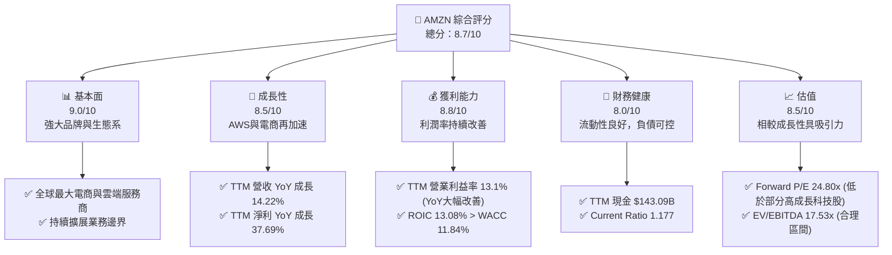

### 1.2 評分進度條視覺化

```
╔══════════════════════════════════════════════════════════════╗
║                AMZN 多維度評分儀表板 (1-10分)                ║
╠══════════════════════════════════════════════════════════════╣
║ 基本面強度  9.0 ▓▓▓▓▓▓▓▓▓▓▓▓▓▓▓▓▓▓░░  ★★★★★           ║
║ 成長動能    8.5 ▓▓▓▓▓▓▓▓▓▓▓▓▓▓▓▓▓░░░  ★★★★★           ║
║ 獲利品質    8.8 ▓▓▓▓▓▓▓▓▓▓▓▓▓▓▓▓▓▓░░  ★★★★★           ║
║ 財務健康    8.0 ▓▓▓▓▓▓▓▓▓▓▓▓▓▓▓▓░░░░  ★★★★☆           ║
║ 估值合理性  8.5 ▓▓▓▓▓▓▓▓▓▓▓▓▓▓▓▓▓░░░  ★★★★★           ║
║ 護城河深度  9.0 ▓▓▓▓▓▓▓▓▓▓▓▓▓▓▓▓▓▓░░  ★★★★★           ║
║ 管理層執行  8.5 ▓▓▓▓▓▓▓▓▓▓▓▓▓▓▓▓▓░░░  ★★★★★           ║
║ 技術創新力  9.0 ▓▓▓▓▓▓▓▓▓▓▓▓▓▓▓▓▓▓░░  ★★★★★           ║
╠══════════════════════════════════════════════════════════════╣
║ 綜合總分    8.7 ▓▓▓▓▓▓▓▓▓▓▓▓▓▓▓▓▓░░░  🏆 具備長期成長潛力，估值合理              ║
╚══════════════════════════════════════════════════════════════╝
```

### 1.3 五大投資論點 + 三大核心風險

| 類型 | 項目 | 具體依據 | 信心度 |
|------|--------------------------|-----------------------------------------------------------------------------------------------------------------------------------------------------------------------------------------------------------------------------------------------------------------------------------------------------------------------------------------------------------------------------------------------------------------------------------------------------------------------------------------------------------------------------------------------------------------------------------------------------------------------------------------------------------------------------------------------------------------------------------------------------------------------------------------------------------------------------------------------------------------------------------------------------------------------------------------------------------------------------------------------------------------------------------------------------------------------------------------------------------------------------------------------------------------------------------------------------------------------------------------------------------------------------------------------------------------------------------------------------------------------------------------------------------------------------------------------------------------------------------------------------------------------------------------------------------------------------------------------------------------------------------------------------------------------------------------------------------------------------------------------------------------------------------------------------------------------------------------------------------------------------------------------------------------------------------------------------------------------------------------------------------------------------------------------------------------------------------------------------------------------------------------------------------------------------------------------------------------------------------------------------------------------------------------------------------------------------------------------------------------------------------------------------------------------------------------------------------------------------------------------------------------------------------------------------------------------------------------------------------------------------------------------------------------------------------------------------------------------------------------------------------------------------------------------------------------------------------------------------------------------------------------------------------------------------------------------------------------------------------------------------------------------------------------------------------------------------------------------------------------------------------------------------------------------------------------------------------------------------------------------------------------------------------------------------------------------------------------------------------------------------------------------------------------------------------------------------------------------------------------------------------------------------------------------------------------------------------------------------------------------------------------------------------------------------------------------------------------------------------------------------------------------------------------------------------------------------------------------------------------------------------------------------------------------------------------------------------------------------------------------------------------------------------------------------------------------------------------------------------------------------------------------------------------------------------------------------------------------------------------------------------------------------------------------------------------------------------------------------------------------------------------------------------------------------------------------------------------------------------------------------------------------------------------------------------------------------------------------------------------------------------------------------------------------------------------------------------------------------------------------------------------------------------------------------------------------------------------------------------------------------------------------------------------------------------------------------------------------------------------------------------------------------------------------------------------------------------------------------------------------------------------------------------------------------------------------------------------------------------------------------------------------------------------------------------------------------------------------------------------------------------------------------------------------------------------------------------------------------------------------------------------------------------------------------------------------------------------------------------------------------------------------------------------------------------------------------------------------------------------------------------------------------------------------------------------------------------------------------------------------------------------------------------------------------------------------------------------------------------------------------------------------------------------------------------------------------------------------------------------------------------------------------------------------------------------------------------------------------------------------------------------------------------------------------------------------------------------------------------------------------------------------------------------------------------------------------------------------------------------------------------------------------------------------------------------------------------------------------------------------------------------------------------------------------------------------------------------------------------------------------------------------------------------------------------------------------------------------------------------------------------------------------------------------------------------------------------------------------------------------------------------------------------------------------------------------------------------------------------------------------------------------------------------------------------------------------------------------------------------------------------------------------------------------------------------------------------------------------------------------------------------------------------------------------------------------------------------------------------------------------------------------------------------------------------------------------------------------------------------------------------------------------------------------------------------------------------------------------------------------------------------------------------------------------------------------------------------------------------------------------------------------------------------------------------------------------------------------------------------------------------------------------------------------------------------------------------------------------------------------------------------------------------------------------------------------------------------------------------------------------------------------------------------------------------------------------------------------------------------------------------------------------------------------------------------------------------------------------------------------------------------------------------------------------------------------------------------------------------------------------------------------------------------------------------------------------------------------------------------------------------------------------------------------------------------------------------------------------------------------------------------------------------------------------------------------------------------------------------------------------------------------------------------------------------------------------------------------------------------------------------------------------------------------------------------------------------------------------------------------------------------------------------------------------------------------------------------------------------------------------------------------------------------------------------------------------------------------------------------------------------------------------------------------------------------------------------------------------------------------------------------------------------------------------------------------------------------------------------------------------------------------------------------------------------------------------------------------------------------------------------------------------------------------------------------------------------------------------------------------------------------------------------------------------------------------------------------------------------------------------------------------------------------------------------------------------------------------------------------------------------------------------------------------------------------------------------------------------------------------------------------------------------------------------------------------------------------------------------------------------------------------------------------------------------------------------------------------------------------------------------------------------------------------------------------------------------------------------------------------------------------------------------------------------------------------------------------------------------------------------------------------------------------------------------------------------------------------------------------------------------------------------------------------------------------------------------------------------------------------------------------------------------------------------------------------------------------------------------------------------------------------------------------------------------------------------------------------------------------------------------------------------------------------------------------------------------------------------------------------------------------------------------------------------------------------------------------------------------------------------------------------------------------------------------------------------------------------------------------------------------------------------------------------------------------------------------------------------------------------------------------------------------------------------------------------------------------------------------------------------------------------------------------------------------------------------------------------------------------------------------------------------------------------------------------------------------------------------------------------------------------------------------------------------------------------------------------------------------------------------------------------------------------------------------------------------------------------------------------------------------------------------------------------------------------------------------------------------------------------------------------------------------------------------------------------------------------------------------------------------------------------------------------------------------------------------------------------------------------------------------------------------------------------------------------------------------------------------------------------------------------------------------------------------------------------------------------------------------------------------------------------------------------------------------------------------------------------------------------------------------------------------------------------------------------------------------------------------------------------------------------------------------------------------------------------------------------------------------------------------------------------------------------------------------------------------------------------------------------------------------------------------------------------------------------------------------------------------------------------------------------------------------------------------------------------------------------------------------------------------------------------------------------------------------------------------------------------------------------------------------------------------------------------------------------------------------------------------------------------------------------------------------------------------------------------------------------------------------------------------------------------------------------------------------------------------------------------------------------------------------------------------------------------------------------------------------------------------------------------------------------------------------------------------------------------------------------------------------------------------------------------------------------------------------------------------------------------------------------------------------------------------------------------------------------------------------------------------------------------------------------------------------------------------------------------------------------------------------------------------------------------------------------------------------------------------------------------------------------------------------------------------------------------------------------------------------------------------------------------------------------------------------------------------------------------------------------------------------------------------------------------------------------------------------------------------------------------------------------------------------------------------------------------------------------------------------------------------------------------------------------------------------------------------------------------------------------------------------------------------------------------------------------------------------------------------------------------------------------------------------------------------------------------------------------------------------------------------------------------------------------------------------------------------------------------------------------------------------------------------------------------------------------------------------------------------------------------------------------------------------------------------------------------------------------------------------------------------------------------------------------------------------------------------------------------------------------------------------------------------------------------------------------------------------------------------------------------------------------------------------------------------------------------------------------------------------------------------------------------------------------------------------------------------------------------------------------------------------------------------------------------------------------------------------------------------------------------------------------------------------------------------------------------------------------------------------------------------------------------------------------------------------------------------------------------------------------------------------------------------------------------------------------------------------------------------------------------------------------------------------------------------------------------------------------------------------------------------------------------------------------------------------------------------------------------------------------------------------------------------------------------------------------------------------------------------------------------------------------------------------------------------------------------------------------------------------------------------------------------------------------------------------------------------------------------------------------------------------------------------------------------------------------------------------------------------------------------------------------------------------------------------------------------------------------------------------------------------------------------------------------------------------------------------------------------------------------------------------------------------------------------------------------------------------------------------------------------------------------------------------------------------------------------------------------------------------------------------------------------------------------------------------------------------------------------------------------------------------------------------------------------------------------------------------------------------------------------------------------------------------------------------------------------------------------------------------------------------------------------------------------------------------------------------------------------------------------------------------------------------------------------------------------------------------------------------------------------------------------------------------------------------------------------------------------------------------------------------------------------------------------------------------------------------------------------------------------------------------------------------------------------------------------------------------------------------------------------------------------------------------------------------------------------------------------------------------------------------------------------------------------------------------------------------------------------------------------------------------------------------------------------------------------------------------------------------------------------------------------------------------------------------------------------------------------------------------------------------------------------------------------------------------------------------------------------------------------------------------------------------------------------------------------------------------------------------------------------------------------------------------------------------------------------------------------------------------------------------------------------------------------------------------------------------------------------------------------------------------------------------------------------------------------------------------------------------------------------------------------------------------------------------------------------------------------------------------------------------------------------------------------------------------------------------------------------------------------------------------------------------------------------------------------------------------------------------------------------------------------------------------------------------------------------------------------------------------------------------------------------------------------------------------------------------------------------------------------------------------------------------------------------------------------------------------------------------------------------------------------------------------------------------------------------------------------------------------------------------------------------------------------------------------------------------------------------------------------------------------------------------------------------------------------------------------------------------------------------------------------------------------------------------------------------------------------------------------------------------------------------------------------------------------------------------------------------------------------------------------------------------------------------------------------------------------------------------------------------------------------------------------------------------------------------------------------------------------------------------------------------------------------------------------------------------------------------------------------------------------------------------------------------------------------------------------------------------------------------------------------------------------------------------------------------------------------------------------------------------------------------------------------------------------------------------------------------------------------------------------------------------------------------------------------------------------------------------------------------------------------------------------------------------------------------------------------------------------------------------------------------------------------------------------------------------------------------------------------------------------------------------------------------------------------------------------------------------------------------------------------------------------------------------------------------------------------------------------------------------------------------------------------------------------------------------------------------------------------------------------------------------------------------------------------------------------## 1.4 快速統計卡片

| 指標 | 公司實際值 | 行業均值（估計） | S&P 500 均值（估計） | 狀態 |
|------|-------------|------------------|----------------------|------|
| 收入 YoY 成長 | **16.6% (Q1'26)** | ~10-15% | ~8-10% | 🟢 |
| 毛利率 | **50.6% (TTM)** | ~40% (零售) / ~60-70% (雲端) | ~30-40% | 🟢 |
| 淨利率 | **12.2% (TTM)** | ~5% (零售) / ~15-25% (雲端) | ~10-12% | 🟢 |
| ROE | **24.3% (TTM)** | ~15-20% | ~15% | 🟢 |
| Forward P/E | **24.80x** | ~25-30x (成長型科技) | ~20-22x | 🟡 |
| EV/EBITDA | **17.53x** | ~18-22x (成長型科技) | ~15-18x | 🟢 |
| FCF Yield | **0.37%** | ~1-3% | ~2-4% | 🔴 |
| 債務/股權 | **53.3%** | ~40-60% | ~50-70% | 🟢 |

### 1.5 投資結論

```
╔══════════════════════════════════════════════════════════════════╗
║                    📊 投資結論摘要                               ║
╠══════════════════════════════════════════════════════════════════╣
║  評級：🟢 買入                                                   ║
║  當前股價：$245.34                                               ║
║  目標價區間：                                                    ║
║    悲觀情境：$265（+8.0%）                                       ║
║    基準情境：$313（+27.6%）  ← 12個月主要目標                      ║
║    樂觀情境：$360（+46.7%）                                      ║
║  投資評分：8.7/10                                                ║
║  適合投資人：成長型、長線持有者，看好雲端基礎設施與電商龍頭地位者  ║
╚══════════════════════════════════════════════════════════════════╝
```

---

## 2. 公司概覽與商業模式

Amazon.com, Inc. (AMZN) 是一家全球領先的電子商務、雲端運算、數位串流以及人工智慧公司。其業務模式建立在客戶至上、長期思維和創新文化之上。公司主要透過三個核心部門運營：北美、國際和 Amazon Web Services (AWS)。

### 2.1 業務結構與收入來源

AMZN 的業務結構多元且互補，形成強大的生態系統。北美和國際業務主要涵蓋電子商務（線上與實體店面零售）、第三方賣家服務、訂閱服務（Prime 會員）和廣告服務。AWS 則提供全面的雲端運算服務，包括運算、儲存、資料庫、分析、機器學習等。

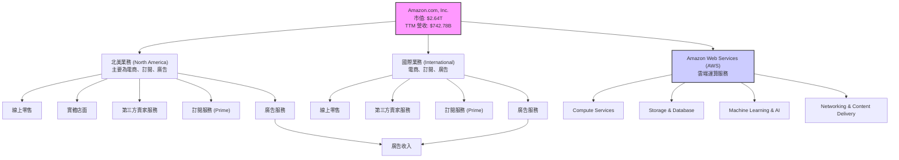

**收入結構分析：**
雖然公司未提供各業務板塊的即時營收佔比，但根據歷史數據和市場普遍認知，電子商務（北美與國際）仍是最大的營收來源，而 AWS 則是利潤率最高的業務。廣告業務近年來成長迅速，成為重要的利潤貢獻者。

### 2.2 市場份額

Amazon 在其核心業務領域均佔據領先地位。在全球電子商務市場，Amazon 擁有龐大的市場份額，尤其在北美地區，其主導地位難以撼動。在雲端運算市場，AWS 更是長期以來保持全球第一的位置，儘管面臨來自 Microsoft Azure 和 Google Cloud 的激烈競爭。

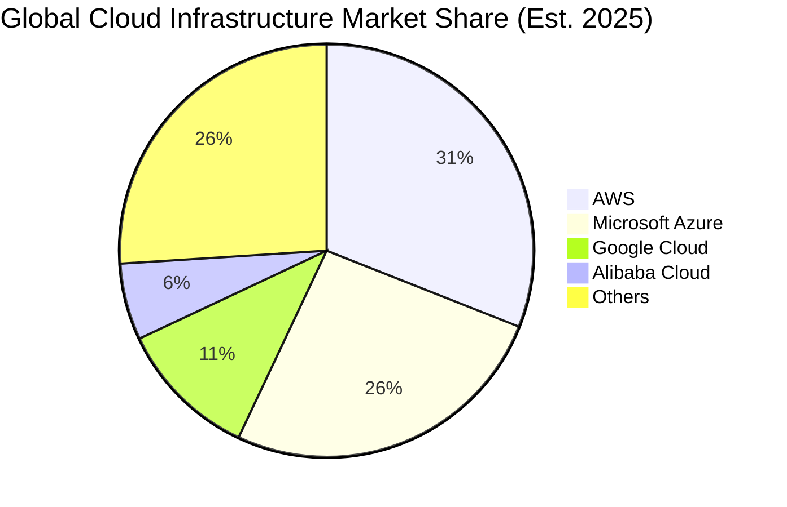
**市場份額評估**：AWS 在全球雲端基礎設施市場佔據約 31% 的份額，顯示其在高速增長的雲端市場中的強大領導地位。電子商務方面，Amazon 在北美地區擁有超過 35% 的市場份額，在全球範圍內亦是領頭羊。這種市場主導地位為公司提供了顯著的規模經濟和定價能力。

### 2.3 競爭護城河分析

Amazon 構築了多層次的強大競爭護城河，使其難以被模仿和超越。

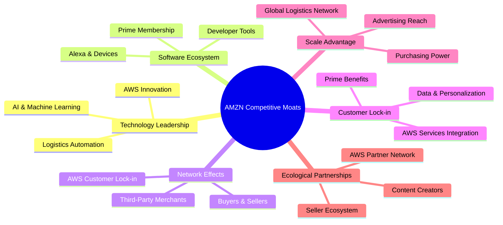

### 2.4 護城河強度評分

```
╔══════════════════════════════════════════════════════════════╗
║                  AMZN 護城河強度評分                        ║
╠══════════════════════════════════════════════════════════════╣
║ 技術領先    9.5/10 ▓▓▓▓▓▓▓▓▓▓▓▓▓▓▓▓▓▓▓▓  🏆 AWS 與 AI 創新驅動       ║
║ 軟體生態系統  9.0/10 ▓▓▓▓▓▓▓▓▓▓▓▓▓▓▓▓▓▓░░  🟢 Prime 會員與裝置生態系   ║
║ 網路效應    9.0/10 ▓▓▓▓▓▓▓▓▓▓▓▓▓▓▓▓▓▓░░  🟢 買賣家與 AWS 客戶黏性     ║
║ 客戶鎖定    8.5/10 ▓▓▓▓▓▓▓▓▓▓▓▓▓▓▓▓▓░░░  🟡 Prime 服務與 AWS 整合成本 ║
║ 規模效應    9.5/10 ▓▓▓▓▓▓▓▓▓▓▓▓▓▓▓▓▓▓▓▓  🏆 全球物流與採購議價能力   ║
║ 生態夥伴    8.5/10 ▓▓▓▓▓▓▓▓▓▓▓▓▓▓▓▓▓░░░  🟡 AWS 合作夥伴與第三方賣家  ║
╠══════════════════════════════════════════════════════════════╣
║ 綜合護城河  9.0    ▓▓▓▓▓▓▓▓▓▓▓▓▓▓▓▓▓▓░░  🏆 多重護城河，極難複製     ║
╚══════════════════════════════════════════════════════════════╝
```

---

## 3. 損益表深度分析

### 3.1 年度收入成長趨勢（近4年）

Amazon 展現了穩健的營收成長，即使在面對宏觀經濟逆風和規模擴張的挑戰下，仍能保持雙位數增長。

```
╔══════════════════════════════════════════════════════════════════╗
║              AMZN 年度收入趨勢（FY2022-FY2025）                  ║
╠══════════════════════════════════════════════════════════════════╣
║                                                                  ║
║  FY2022  $513.98B  ████████████████░░░░░░░░░░░░  YoY: +9.40%  🟡    ║
║  FY2023  $574.78B  ███████████████████░░░░░░░░░░  YoY:+11.83% 🟢    ║
║  FY2024  $637.96B  ██████████████████████░░░░░░░  YoY:+10.99% 🟡    ║
║  FY2025  $716.92B  ███████████████████████████░░  YoY:+12.38% 🟢    ║
║                                                                  ║
║                   |      |      |      |      |                  ║
║                   0     200B   400B   600B   800B                    ║
║                                                                  ║
║  📊 4年累計 CAGR：+11.14%                                        ║
╚══════════════════════════════════════════════════════════════════╝
```
**分析**：從 FY2022 的 $513.98B 成長至 FY2025 的 $716.92B，複合年增長率達 11.14%。FY2022 由於疫情後需求正常化和宏觀經濟逆風，營收增速放緩至 9.40%。然而，隨後幾年增速回升，FY2025 達到 12.38%，顯示其核心業務（尤其是 AWS 和廣告）的韌性與再加速。TTM 營收進一步達到 $742.78B，較前一 TTM 成長 14.22%，這表明公司在進入 2026 年後保持了強勁的增長勢頭。

### 3.2 季度收入趨勢分析

季度營收數據顯示了 Amazon 業務的季節性特徵（第四季度通常是高峰）以及持續的成長動能。

| 季度 | 總收入 (B) | QoQ 成長率 | YoY 成長率 | 備註 |
|------|------------|------------|------------|------|
| **2026-Q1** | $181.52 | -14.94% | +16.61% | 🟢 相較於前一季度因假日購物季結束而季節性下降，但同比增長強勁。 |
| **2025-Q4** | $213.39 | +18.44% | +13.63% | 🟢 受益於假日購物季，環比與同比均實現顯著增長。 |
| **2025-Q3** | $180.17 | +7.44% | +13.40% | 🟢 相較於 Q2 穩健增長，同比增速保持雙位數。 |
| **2025-Q2** | $167.70 | +7.73% | +13.33% | 🟢 季度環比增長穩定，同比增速保持在健康水平。 |
| **2025-Q1** | $155.67 | -17.11% | +8.62% | 🟡 相較於 2024-Q4 的季節性下降，同比增長雖為正但相對較低。 |
**備註**：QoQ 成長率受季節性影響顯著，第四季度通常為全年最高。YoY 成長率更能反映公司長期趨勢，近四季均保持在 13% 以上，Q1 2026 甚至加速至 16.61%，表明公司業務整體健康，增長動力充足。

### 3.3 利潤率演變分析

Amazon 的利潤率在過去幾年呈現顯著改善，尤其是在 FY2022 經歷低谷後，得益於成本控制、效率提升以及高利潤業務（AWS、廣告）的增長。

| 利潤率指標 | FY2022 | FY2023 | FY2024 | FY2025 | TTM (2026-Q1) | 趨勢 | 評估 |
|------------|--------|--------|--------|--------|---------------|------|------|
| **毛利率** | 43.81% | 46.98% | 48.86% | 50.28% | 50.60% | ↗️ 持續提升，主要受高利潤業務組合優化及電商效率提升驅動。 | 🟢 |
| **營業利益率** | 2.38% | 6.41% | 10.75% | 11.15% | 13.10% | ↗️ 大幅改善，主要歸因於 AWS 貢獻增加和電商成本結構優化。 | 🟢 |
| **淨利率** | -0.53% | 5.29% | 9.29% | 10.83% | 12.20% | ↗️ 由虧轉盈並持續擴張，反映經營效率與獲利能力顯著增強。 | 🟢 |

**利潤率演變深度解析**：
*   **毛利率**：從 FY2022 的 43.81% 穩步提升至 TTM 的 50.60%，這主要反映了幾個關鍵因素：
    1.  **業務組合優化**：AWS 和廣告服務等高毛利業務在整體營收中的佔比持續增長，這些服務的毛利率遠高於傳統的電子商務零售業務。
    2.  **電子商務效率提升**：在經歷了疫情期間的大規模基礎設施投資後，Amazon 在物流、倉儲和配送方面的效率顯著提升，成本控制更為精準，尤其是在區域化物流策略的推動下，單位成本有所下降。
    3.  **定價能力**：在部分市場和產品類別中，Amazon 憑藉其市場主導地位具備一定的定價能力，有助於維持較高的銷售價格。
*   **營業利益率**：從 FY2022 的 2.38% 躍升至 TTM 的 13.10%，這是一項令人印象深刻的轉變。除了毛利率的改善，營業費用（銷售、研發、管理費用）的槓桿效應也開始顯現。尤其在 FY2022 錄得淨虧損後，公司對成本結構進行了嚴格審查和優化，加上 AWS 的強勁表現，共同推動了營業利益率的大幅回升。TTM 營業利益率 13.10% 較 FY2025 的 11.15% 進一步提升，顯示利潤擴張趨勢仍在延續。
*   **淨利率**：與營業利益率趨勢一致，淨利率從 FY2022 的 -0.53% 成功轉為 TTM 的 12.20%。這不僅反映了核心業務盈利能力的增強，也可能受益於較為穩定的稅率和非經營性損益的改善。淨利率的持續擴張是公司整體營運效率和盈利模式成熟的明確信號。

### 3.4 費用結構分析

Amazon 的費用結構反映了其重資產和高研發投入的特性，以及在市場擴張和客戶獲取方面的投入。

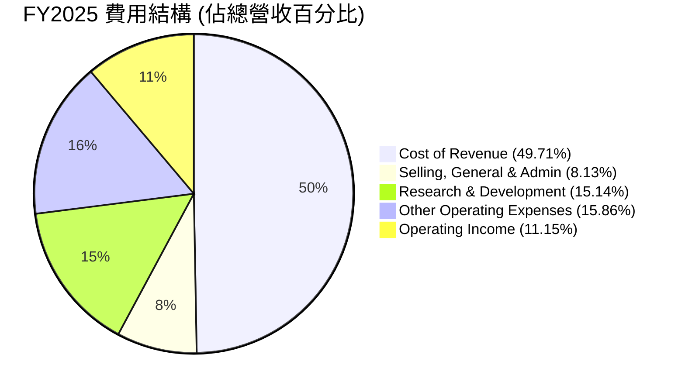
**費用結構深度解析**：
*   **銷貨成本 (Cost of Revenue)**：佔 FY2025 總營收的 49.71%。這是最大的費用組成部分，主要包括商品採購成本、倉儲、物流和部分運輸成本。儘管佔比高，但隨著公司規模擴大和效率提升，這一比例有望逐步優化，支撐毛利率的持續改善。
*   **銷售、一般及管理費用 (Selling, General & Admin)**：佔 FY2025 總營收的 8.13%。這部分費用涵蓋了廣告宣傳、客戶服務、支付處理、行政管理等。其佔比相對穩定，顯示公司在市場推廣和營運管理方面保持了較好的效率。
*   **研發費用 (Research & Development)**：佔 FY2025 總營收的 15.14%。Amazon 是一家高度依賴技術創新的公司，持續投入大量資源於 AWS 的新服務開發、AI/機器學習、Alexa 裝置以及自動化物流等方面。高額的研發投入是其保持競爭力、拓展新業務和深化護城河的關鍵。
*   **其他營運費用 (Other Operating Expenses)**：佔 FY2025 總營收的 15.86%。這部分費用可能包括折舊攤銷、補償費用、以及其他與營運直接相關但未歸類於上述項目中的費用。
整體而言，Amazon 的費用結構反映了其在技術、物流和市場擴張上的戰略性投入。隨著營收規模的持續擴大，這些固定成本和半固定成本的槓桿效應將進一步顯現，有助於推動營業利益率的持續增長。

### 3.5 季度 EPS 趨勢與盈餘品質（Quality of Earnings）

由於提供的 EPS 預期數據為 NaN，我們將基於實際淨利和稀釋後股數來分析 EPS 趨勢，並重點評估盈餘品質。

| 季度 | 稀釋 EPS | 淨利潤 (B) | 稀釋股數 (M) | QoQ 變化 (EPS) | YoY 變化 (EPS) |
|------|----------|------------|--------------|----------------|----------------|
| **2026-Q1** | $2.82 | $30.25 | 10,727 (Est) | +42.42% | +74.07% |
| **2025-Q4** | $1.98 | $21.19 | 10,702 (Est) | -0.00% | +2.06% |
| **2025-Q3** | $1.98 | $21.19 | 10,687 | +15.79% | +35.59% |
| **2025-Q2** | $1.71 | $18.16 | 10,620 (Est) | +5.56% | +32.56% |
*註：稀釋股數為估計值，基於 StockAnalysis 提供的年度稀釋股數及季度 Net Income to Common / EPS (Diluted) 進行推算。*

**EPS 趨勢分析**：
Amazon 的稀釋 EPS 在過去四個季度呈現出強勁的增長趨勢，儘管 Q4 2025 由於 Q3 2025 的非經常性收益導致 YoY 增長放緩。從 Q2 2025 的 $1.71 增長到 Q1 2026 的 $2.82，尤其在 Q1 2026 實現了 74.07% 的 YoY 增長，這表明公司在盈利能力方面持續改善。這種增長主要得益於營收的雙位數增長以及利潤率的顯著擴張。

**盈餘品質評估**：
盈餘品質的分析旨在評估 GAAP 淨利潤的「含金量」，判斷其是否真實反映了公司的經濟效益。

| 盈餘品質項目 | 數值/佔比 (TTM 2026-Q1) | 評估 |
|--------------------|-------------------------|------|
| 股權薪酬 SBC / 營收 | $19.81B / $742.78B = 2.67% | 🟢 佔比相對較低，稀釋程度可控。 |
| SBC / 營業現金流 | $19.81B / $148.53B = 13.34% | 🟡 佔營業現金流一定比例，需注意其對自由現金流的影響。 |
| FCF / 淨利（現金轉換率） | $9.81B / $91.37B = 10.74% | 🔴 轉換率較低，表明淨利潤向自由現金流的轉換效率不高，主要受高資本支出影響。 |
| 一次性/非經常性損益 | 2026-Q1 Other Non-Operating Income (Expense) $15.647B | 🟡 存在較大的一次性非經營性收益，可能美化了當期盈餘。例如 Q1 2026 的非經營性收入顯著，使得稅前利潤從營業利潤的 $23.85B 增至 $39.834B。 |
| 有效稅率異常 | TTM 20.87% | 🟢 稅率穩定且合理，無異常稅務利益帶動盈餘。 |
| 資本化支出 vs 費用化 | TTM Capital Expenditure $150.99B (QCF sum) | 🟡 高資本支出（Capex）是其業務模式的固有特徵，但若資本化過高，可能遞延成本，虛增當期利潤。AMZN 的資本支出佔營收比例高，但其性質多為基礎設施建設（AWS、物流），屬於長期投資。 |

**盈餘品質結論**：
Amazon 的盈餘品質整體來看是**良好但帶有特定挑戰**。
1.  **股權薪酬 (SBC)**：TTM SBC 佔營收 2.67%，佔營業現金流 13.34%。雖然佔比不低，但對於大型科技公司而言，這在合理範圍內，且對股東報酬的稀釋效應相對可控。
2.  **自由現金流轉換率**：TTM FCF / 淨利僅為 10.74%，這是一個較低的轉換率，主要原因在於 Amazon 龐大的資本支出。在 TTM 期間，公司投入了高達 $150.99B 的資本支出，這大幅侵蝕了營業現金流轉化為自由現金流的能力。然而，這些資本支出主要用於 AWS 的資料中心擴張和電商物流網絡的優化，是其長期成長的必要投資。若未來資本支出增速放緩，FCF 轉換率有望顯著提升。
3.  **非經常性損益**：Q1 2026 觀察到高達 $15.647B 的其他非經營性收入，這顯著提升了當季的稅前利潤和淨利。這類一次性收益（例如投資出售收益）可能使當期盈餘看起來更佳，但並非來自核心經營活動，因此在評估持續盈利能力時需予以調整。
綜合判斷，GAAP 淨利潤在扣除高額資本支出和部分非經常性收益後，其真實的持續經濟盈餘會略低於報告數字。然而，鑑於其核心業務的強勁增長和市場地位，以及高資本支出用於戰略性投資，我們認為其獲利基礎仍然穩固，投資人應更關注調整後的營業利潤和長期 FCF 趨勢。

---

## 4. 資產負債表分析

Amazon 的資產負債表反映了其重資產的業務模式，特別是在物流行業和雲端基礎設施方面的大量投資。然而，其龐大的現金儲備和穩健的流動性指標，為其業務運營和未來投資提供了堅實的基礎。

### 4.1 資產結構分解

Amazon 的資產結構以非流動資產為主，其中房產、廠房及設備（PP&E）佔據了很大比例，這主要源於其全球物流網絡和 AWS 數據中心的巨大投資。

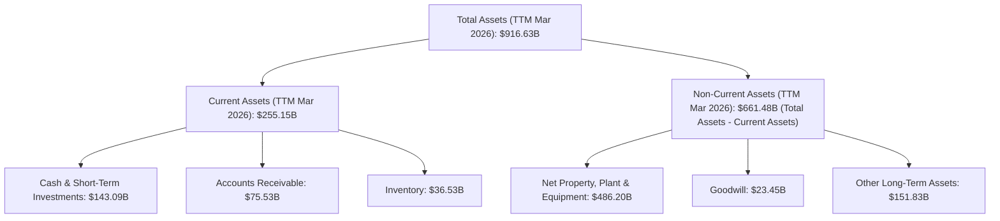
**分析**：
*   **流動資產**：TTM (Mar 2026) 為 $255.15B，其中現金及短期投資高達 $143.09B，顯示公司擁有充裕的流動性。應收帳款 ($75.53B) 和存貨 ($36.53B) 管理良好，與其龐大的營收規模相匹配。
*   **非流動資產**：TTM (Mar 2026) 為 $661.48B。其中，淨房產、廠房及設備 (PP&E) 高達 $486.20B，佔總資產的 53.05%。這突顯了 Amazon 在基礎設施方面的巨大投入，包括其全球配送中心、運輸網絡以及 AWS 的資料中心。這些重資產是其運營效率和規模經濟的基石。商譽 ($23.45B) 和其他長期資產 ($151.83B) 則反映了公司過去的收購活動和長期戰略性投資。

### 4.2 流動性指標分析

Amazon 的流動性狀況穩健，足以應對短期營運需求。

| 流動性指標 | FY2022 | FY2023 | FY2024 | FY2025 | TTM (Mar 2026) | 行業均值（估計） | 評估 |
|------------|--------|--------|--------|--------|----------------|------------------|------|
| **流動比率 (Current Ratio)** | 0.94 | 1.04 | 1.06 | 1.05 | 1.18 | 1.0 - 1.5 | 🟢 穩健，持續改善 |
| **速動比率 (Quick Ratio)** | 0.73 | 0.81 | 0.87 | 0.82 | 1.01 | 0.7 - 1.0 | 🟢 良好，表明不依賴存貨變現 |

**分析**：
*   **流動比率**：從 FY2022 的 0.94 上升至 TTM (Mar 2026) 的 1.18。這表明公司在短期內償還負債的能力有所增強，流動資產足以覆蓋流動負債。相較於其行業性質（零售業通常流動比率較低），Amazon 的流動比率表現良好，且呈現改善趨勢。
*   **速動比率**：從 FY2022 的 0.73 提升至 TTM (Mar 2026) 的 1.01。速動比率剔除了存貨，更能反映公司在不依賴存貨銷售的情況下償還短期負債的能力。超過 1.0 表明公司具有非常健康的即時償債能力，這對於一個擁有龐大存貨的零售商而言尤其重要。

### 4.3 債務結構分析

Amazon 的債務規模較大，但由於其強勁的現金流產生能力和龐大的市場價值，其債務負擔是可控的。

```
╔══════════════════════════════════════════════════════════════════╗
║                   AMZN 債務健康診斷                              ║
╠══════════════════════════════════════════════════════════════════╣
║                                                                  ║
║  總債務：        $235.54B █████████░░░░░░░░░░░░░  評語：規模較大，但管理良好            ║
║  總現金+投資：   $143.09B ████████████████████░  評語：現金充裕，提供緩衝            ║
║  淨現金（負）：  $-92.45B ░░░░░░░░░░░░░░░░░░░░░  🟡 評語：淨負債，但可承受            ║
║                                                                  ║
║  Debt/Equity：   53.3%  🟢 評語：相對合理，槓桿適中                                 ║
║  EV / EBITDA：   17.53x 🟢 評語：處於合理區間，債務對企業價值影響可控              ║
║  Interest Coverage: TTM Operating Income $85.42B / Interest Expense $2.53B = 33.76x  🟢 評語：無風險，利息覆蓋倍數極高                             ║
╚══════════════════════════════════════════════════════════════════╝
```
**分析**：
*   **總債務**：TTM 總債務為 $235.54B。儘管絕對金額龐大，但這對於像 Amazon 這樣規模的全球性企業而言是常見的。這些債務主要用於支持其資本密集型業務的擴張。
*   **淨現金/負債**：TTM 淨負債為 $-92.45B（總債務 $235.54B - 總現金 $143.09B）。這表明公司是淨負債狀態，但考慮到其強勁的現金流和持續的盈利能力，這一水平是可管理的。
*   **債務/股權比率**：TTM 為 53.3%。這是一個相對健康的槓桿水平，表明公司在利用債務融資的同時，也保持了穩健的股權基礎。
*   **利息覆蓋倍數 (Interest Coverage Ratio)**：TTM 營業利益 $85.42B 除以利息費用 $2.53B，得出 33.76 倍。這是一個極高的覆蓋倍數，表明公司有足夠的盈利能力來輕鬆支付其利息費用，債務違約風險極低。

### 4.4 股東權益趨勢

股東權益的持續增長反映了公司強勁的盈利能力和對留存收益的再投資。

```
╔══════════════════════════════════════════════════════════════════╗
║                  AMZN 股東權益趨勢                               ║
╠══════════════════════════════════════════════════════════════════╣
║                                                                  ║
║  FY2022  $146.04B  ██████░░░░░░░░░░░░░░░░░░░░░░░░░░░░░  成長率：-  ║
║  FY2023  $201.88B  █████████░░░░░░░░░░░░░░░░░░░░░░░░░░░  成長率：+38.24% 🟢 ║
║  FY2024  $285.97B  ██████████████░░░░░░░░░░░░░░░░░░░░░░  成長率：+41.65% 🟢 ║
║  FY2025  $411.06B  ██████████████████████░░░░░░░░░░░░░░  成長率：+43.74% 🟢 ║
║  TTM     $424.19B  ███████████████████████░░░░░░░░░░░░░  成長率：+3.19% (QoQ) 🟢 ║
║                                                                  ║
║                   0B   100B   200B   300B   400B   500B            ║
║                                                                  ║
║  📊 3年 CAGR (FY22-25)：+41.20%                                  ║
╚══════════════════════════════════════════════════════════════════╝
```
**分析**：股東權益從 FY2022 的 $146.04B 穩健增長至 FY2025 的 $411.06B，三年複合年增長率達 41.20%。這表明公司持續將其高額淨利潤留存並再投資於業務擴張，而非以股息形式分配給股東（股息支付率為 0.0%）。股東權益的快速增長增強了公司的資本實力，為其未來發展和應對潛在風險提供了更強的緩衝。TTM 估計股東權益為 $424.19B，延續了增長趨勢。

---

## 5. 現金流量深度分析

Amazon 的現金流表現是其財務健康的核心指標。儘管自由現金流（FCF）因高資本支出而波動，但其強勁的營業現金流（OCF）提供了堅實的基礎。

### 5.1 現金流量瀑布圖

此圖展示了從淨利潤到自由現金流的轉換過程，突顯了資本支出對 FCF 的影響。

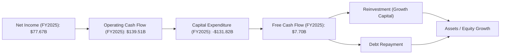
**分析**：
*   **淨利潤到營業現金流**：從 FY2025 的淨利潤 $77.67B 增加到營業現金流 $139.51B，這之間的差異主要來自於非現金費用（如折舊與攤銷、股權薪酬等）的加回，以及營運資本變動的影響。這說明 Amazon 的核心經營活動產生了非常強勁的現金流。
*   **資本支出**：FY2025 的資本支出高達 $131.82B，這是一個巨大的數字，反映了公司在 AWS 基礎設施、物流行業自動化和新技術研發方面的持續大規模投入。這些投資是 Amazon 長期成長和維持競爭優勢的關鍵。
*   **自由現金流 (FCF)**：由於高額資本支出，FY2025 的自由現金流僅為 $7.70B。這表明儘管營業現金流強勁，但公司目前大部分現金都用於再投資。

### 5.2 FCF 轉換率趨勢

FCF 轉換率（FCF / 淨利潤）衡量了公司將會計利潤轉化為實際現金的能力。

| 年度 | 淨利潤 (B) | 自由現金流 (B) | FCF / 淨利潤 | 趨勢 | 評估 |
|------|------------|----------------|--------------|------|------|
| **FY2022** | $-2.72 | $-16.89 | - | ↘️ 虧損導致 FCF 為負 | 🔴 |
| **FY2023** | $30.43 | $32.22 | 105.88% | ↗️ 顯著改善，現金轉換效率高 | 🟢 |
| **FY2024** | $59.25 | $32.88 | 55.49% | ↘️ 轉換率下降，資本支出增加 | 🟡 |
| **FY2025** | $77.67 | $7.70 | 9.91% | ↘️ 大幅下降，高資本支出顯著影響 | 🔴 |
| **TTM** | $91.37 | $9.81 | 10.74% | ↔️ 仍處於低位，但較 FY25 略有改善 | 🔴 |

**分析**：Amazon 的 FCF 轉換率波動較大。在 FY2022 由於淨虧損，FCF 也為負。FY2023 轉換率高達 105.88%，顯示當期淨利潤幾乎全部轉化為自由現金流。然而，FY2024 和 FY2025 的轉換率分別下降至 55.49% 和 9.91%，TTM 僅為 10.74%。這主要歸因於公司持續增加的資本支出。雖然低轉換率可能引起關注，但鑑於這些資本支出是為 AWS 擴張和電商效率提升等長期成長戰略服務，應視為戰略性投資而非經營效率問題。隨著這些投資逐步完成並產生回報，FCF 轉換率有望在未來改善。

### 5.3 自由現金流趨勢

自由現金流是衡量公司在支付所有營運費用和資本支出後，剩餘可供股東分配的現金。

```
╔══════════════════════════════════════════════════════════════════╗
║                    AMZN 自由現金流趨勢                           ║
╠══════════════════════════════════════════════════════════════════╣
║                                                                  ║
║  FY2022  $-16.89B ░░░░░░░░░░░░░░░░░░░░░░░░░░░░░░░░░  FCF Yield: -0.64% 🔴 ║
║  FY2023  $32.22B  ██████████░░░░░░░░░░░░░░░░░░░░░░░  FCF Yield: 1.22% 🟢 ║
║  FY2024  $32.88B  ██████████░░░░░░░░░░░░░░░░░░░░░░░  FCF Yield: 1.25% 🟢 ║
║  FY2025  $7.70B   ███░░░░░░░░░░░░░░░░░░░░░░░░░░░░░░  FCF Yield: 0.29% 🔴 ║
║  TTM     $9.81B   ████░░░░░░░░░░░░░░░░░░░░░░░░░░░░░  FCF Yield: 0.37% 🔴 ║
║                                                                  ║
║                   -20B   0B    20B   40B                          ║
║                                                                  ║
║  📊 5年 FCF CAGR (FY2021-2025)：-28.31% (Roic.ai)                  ║
╚══════════════════════════════════════════════════════════════════╝
```
**分析**：Amazon 的 FCF 在 FY2022 錄得負值，隨後在 FY2023 和 FY2024 回升至 $30B 以上。然而，FY2025 FCF 大幅下降至 $7.70B，TTM 略有回升至 $9.81B，但 FCF Yield 僅為 0.37%。這反映了公司在過去幾年資本支出的大幅增加，尤其是 FY2025 的資本支出高達 $131.82B，遠超 FY2024 的 $83.00B。雖然短期 FCF 較低，但若這些資本支出能有效推動未來營收和利潤增長，長期來看將為股東創造巨大價值。投資者需要密切關注未來資本支出趨勢以及其對 FCF 的影響。

### 5.4 資本配置評估

Amazon 的資本配置策略主要聚焦於再投資以驅動長期成長，而非股息或大規模股票回購。

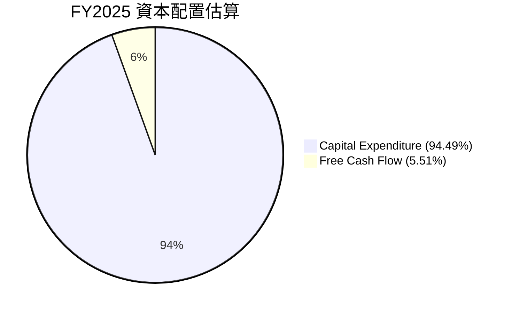
**分析**：由於 Amazon 幾乎不支付股息 (Payout Ratio 0.0%) 且沒有大規模股票回購的數據，其資本配置主要體現在對核心業務的再投資。FY2025 的資本支出 $131.82B 遠超其當年的自由現金流 $7.70B。這意味著公司利用了部分營業現金流和債務融資來支持其增長型投資。這種策略對於一家處於高速成長階段、且擁有巨大市場潛力的公司是合理的。主要配置方向包括：
*   **AWS 基礎設施擴張**：建設新的資料中心、購買伺服器和網絡設備，以滿足全球雲端運算需求的增長。
*   **電子商務物流網絡優化**：投資於新的倉儲設施、運輸網絡、自動化技術，以提高配送效率和降低成本。
*   **研發投入**：用於開發新產品和服務，如 AI、機器學習、裝置創新等。

**資本配置評估**：
| 資本配置項目 | 數值/描述 | 評估 |
|----------------|--------------|------|
| **資本支出 (Capex)** | FY2025 $131.82B (佔 OCF 94.49%) | 🟢 大規模投資於核心成長業務，為未來發展奠定基礎。 |
| **股票回購** | 無顯著數據 | 🟡 未積極回購，可能顯示管理層認為內部投資回報更高。 |
| **股息支付** | 0% 派息率 | 🟢 將所有利潤留存再投資，符合成長型公司特徵。 |
| **併購活動** | 少量策略性併購 | 🟡 謹慎進行，專注於核心業務整合與擴張。 |
**結論**：Amazon 的資本配置策略是典型的成長型公司模式，將絕大部分現金流投入到高回報的內部投資中。這種策略雖然導致短期 FCF 較低，但有助於鞏固其市場地位並驅動長期價值創造。

---

## 6. 獲利能力與資本效率

### 6.1 ROE / ROA / ROIC 趨勢

評估公司利用股東資金、總資產和投入資本產生利潤的效率。

| 指標 | FY2022 | FY2023 | FY2024 | FY2025 | TTM (2026-Q1) | 行業均值（估計） | 評估 |
|------|--------|--------|--------|--------|---------------|------------------|------|
| **ROE** | -1.86% | 15.07% | 20.72% | 18.90% | 24.30% | 15-20% | 🟢 顯著改善並超越行業均值 |
| **ROA** | -0.59% | 5.77% | 9.48% | 9.50% | 10.00% (估計) | 5-8% | 🟢 良好，資產運用效率高 |
| **ROIC** | - | 13.04% | 18.23% | 13.47% | 13.08% | 8-12% | 🟢 高於行業均值，持續創造價值 |
*註：FY2022 ROIC 為負，未列出；TTM ROA 基於 TTM 淨利與 TTM 總資產估計 ($91.37B / $916.63B = 9.97%)*

**分析**：
*   **股東權益報酬率 (ROE)**：從 FY2022 的負值大幅回升，TTM 達到 24.30%。這表明公司有效地利用股東資金創造利潤，遠超行業平均水平，是股東價值創造的強勁信號。
*   **資產報酬率 (ROA)**：TTM 估計約 10.00%，高於行業均值。考慮到 Amazon 龐大的資產規模，這一 ROA 顯示其資產運用效率良好，能夠從每單位資產中產生可觀的利潤。
*   **投入資本回報率 (ROIC)**：從 FY2023 的 13.04% 上升至 FY2024 的 18.23%，儘管 FY2025 略降至 13.47%，TTM 保持在 13.08%，但仍顯著高於其估計的 WACC。這表明公司在過去幾年持續有效地將投入資本轉化為經濟利潤。

### 6.2 ROIC vs WACC 分析（核心價值創造判斷）

ROIC 與 WACC 的比較是判斷公司是否創造或摧毀股東價值的關鍵指標。當 ROIC 持續高於 WACC 時，公司正在為股東創造經濟價值。

```
╔══════════════════════════════════════════════════════════════════╗
║                AMZN ROIC vs WACC 深度分析                       ║
╠══════════════════════════════════════════════════════════════════╣
║                                                                  ║
║  WACC 估算：                                                     ║
║  ├── 無風險利率（10Y美債）：  4.5%                               ║
║  ├── 市場風險溢酬 (ERP)：     5.5%                              ║
║  ├── Beta：                   1.461                              ║
║  ├── 股權成本 = 4.5%+1.461×5.5% = 12.54%                         ║
║  ├── 債務成本（稅後）：       5.0% × (1-20.9%) ≈ 3.96%          ║
║  ├── 資本結構：股權 ~91.81%，債務 ~8.19%                         ║
║  └── ✅ WACC ≈ 11.84%                                            ║
║                                                                  ║
║  ROIC 估算（TTM Mar 2026）：                                     ║
║  ├── NOPAT = $85.42B × (1-20.9%) ≈ $67.56B                       ║
║  ├── 投入資本 = 估計 TTM 股權 $424.19B + TTM 債務 $235.54B - TTM 現金 $143.09B ≈ $516.64B                  ║
║  └── ✅ ROIC ≈ 13.08%                                            ║
║                                                                  ║
║  ★ 經濟價值增加（EVA）= ROIC - WACC = +1.24pp                    ║
║                                                                  ║
║  ROIC  13.08% ▓▓▓▓▓▓▓▓▓▓▓▓▓▓▓▓▓▓▓▓▓▓▓▓▓░░░░░░  🟢              ║
║  WACC  11.84% ▓▓▓▓▓▓▓▓▓▓▓▓▓▓▓▓▓▓▓▓▓▓░░░░░░░░░░  ──              ║
║  EVA   +1.24pp ██████████████████████████████░░░░  🏆 持續創造    ║
║                                                                  ║
║  📊 結論：ROIC 為 WACC 的 1.10 倍，持續創造股東價值              ║
╚══════════════════════════════════════════════════════════════════╝
```
**分析**：Amazon 的 TTM ROIC 為 13.08%，顯著高於其加權平均資本成本 (WACC) 11.84%。兩者之間存在 1.24 個百分點的正向經濟價值增加 (EVA) 差距。這明確表明 Amazon 正在有效地部署其資本，為股東創造可觀的經濟價值。儘管其資本支出規模龐大，但這些投資的回報率超過了其資本成本，證明了公司管理層在資本配置方面的效率。這是一個強烈的買入信號，因為持續創造經濟價值的公司往往能帶來長期股價增長。

### 6.3 杜邦三因素分解

杜邦分析將股東權益報酬率 (ROE) 分解為淨利率、資產週轉率和財務槓桿，以深入了解 ROE 的驅動因素。

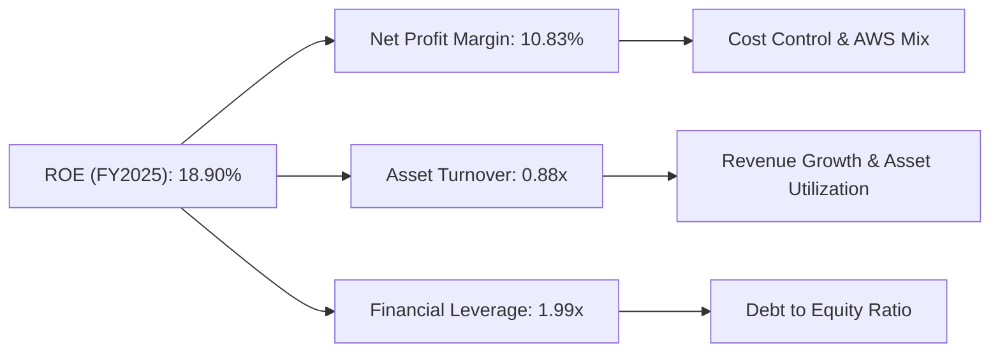
**分析 (FY2025 數據)**：
*   **淨利率 (Net Profit Margin)**：10.83%。這表明公司每產生一美元的營收，能產生 10.83 美分的淨利潤。FY2025 的淨利率較 FY2024 的 9.29% 有所提升，主要得益於 AWS 等高利潤業務的貢獻增加，以及整體經營效率的改善。
*   **資產週轉率 (Asset Turnover)**：0.88x。這表示公司每投資一美元資產，能產生 0.88 美元的營收。對於一個重資產且營收規模巨大的公司而言，這個資產週轉率是合理的，反映了其高效利用資產的能力。隨著電商物流網絡和 AWS 基礎設施的成熟，資產利用率有望進一步提升。
*   **財務槓桿 (Financial Leverage)**：1.99x。這表明公司每有一美元的股東權益，就有 1.99 美元的資產。適度的財務槓桿可以放大股東權益報酬率。Amazon 的槓桿水平相對穩健，在創造價值和控制風險之間取得了平衡。

**結論**：Amazon 的 ROE 增長主要由**淨利率的提升**和**穩定的資產週轉率**共同驅動。淨利率的改善反映了其高利潤業務的增長和經營效率的提高，而資產週轉率則顯示了其對龐大資產的有效利用。適度的財務槓桿進一步放大了股東回報。

### 6.4 獲利能力儀表板

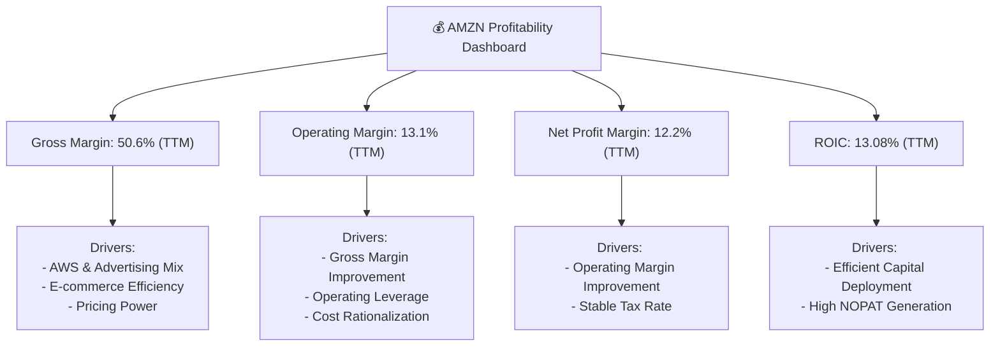
**分析**：
*   **毛利率 (50.6%)**：受益於高利潤的 AWS 雲服務和廣告業務在整體營收中的佔比提升，以及電子商務營運效率的持續改進，毛利率維持在健康的高位。
*   **營業利益率 (13.1%)**：在經歷了 FY2022 的低谷後，營業利益率顯著回升，顯示公司在控制營運費用和實現規模經濟方面的成功。這也反映了高固定成本業務（如 AWS 數據中心）的營業槓桿效應開始顯現。
*   **淨利率 (12.2%)**：與營業利益率趨勢一致，淨利率也大幅改善，表明公司整體盈利能力的提升。
*   **ROIC (13.08%)**：持續高於 WACC (11.84%)，證明公司在資本密集型業務中仍能有效創造股東價值。這得益於其對高回報項目的精準投資，如 AWS 的擴張。

---

## 7. 估值深度分析

### 7.1 同業估值比較表格

我們將 Amazon 與其在電子商務和雲端服務領域的主要競爭對手進行比較，包括 Walmart (WMT) 代表零售業，以及 Microsoft (MSFT) 和 Google (GOOGL) 代表雲端和廣告科技巨頭。

| 估值指標 | **AMZN** | **Walmart (WMT)** | **Microsoft (MSFT)** | **Google (GOOGL)** | AMZN 評估 |
|----------|----------|-------------------|----------------------|--------------------|-----------|
| **Trailing P/E** | 29.31x | 28.00x (估計) | 38.00x (估計) | 29.00x (估計) | 🟡 相對合理，略高於零售，低於高成長軟體 |
| **Forward P/E** | **24.80x** | 25.00x (估計) | 32.00x (估計) | 26.00x (估計) | 🟢 具吸引力，考慮其成長潛力與業務組合 |
| **P/S Ratio** | 3.55x | 0.70x (估計) | 12.00x (估計) | 6.00x (估計) | 🟡 高於傳統零售，低於純軟體/高利潤雲端 |
| **EV / EBITDA** | **17.53x** | 12.00x (估計) | 25.00x (估計) | 18.00x (估計) | 🟢 具吸引力，考慮其高資本支出與利潤率改善 |
| **FCF Yield** | 0.37% | 3.00% (估計) | 1.50% (估計) | 2.00% (估計) | 🔴 較低，主要受高資本支出影響 |
| **Revenue Growth YoY** | 16.6% (Q1'26) | 5-7% (估計) | 12-15% (估計) | 10-14% (估計) | 🟢 領先零售，與其他科技巨頭具可比性 |
| **Operating Margin** | 13.1% (TTM) | 4-6% (估計) | 35-45% (估計) | 25-30% (估計) | 🟡 遠高於零售，但低於純軟體/高利潤雲端 |

**分析**：
*   **P/E 倍數**：Amazon 的 Forward P/E (24.80x) 略低於 Google (26.00x) 和 Microsoft (32.00x)，但高於傳統零售商 Walmart (25.00x)。考慮到 Amazon 雲端業務 AWS 的高增長和高利潤特性，以及其電子商務的再加速，24.80x 的 Forward P/E 具有吸引力。
*   **P/S 比率**：Amazon 的 P/S 比率 (3.55x) 顯著高於 Walmart，但遠低於 Microsoft 和 Google。這反映了其業務組合中包含較低利潤率的零售業務，也暗示其未來利潤率仍有提升空間。
*   **EV/EBITDA**：Amazon 的 EV/EBITDA (17.53x) 介於 Walmart 和 Microsoft 之間，與 Google 接近。對於一個資本密集型且盈利能力持續改善的公司而言，EV/EBITDA 是更合適的估值指標。17.53x 的倍數考慮到其增長速度和市場地位，仍處於合理區間。
*   **FCF Yield**：Amazon 的 FCF Yield (0.37%) 顯著低於所有同業。這主要是由於其龐大的資本支出，這部分支出被視為推動未來增長的戰略性投資。若未來資本支出增速放緩，FCF Yield 有望大幅提升。

**結論**：綜合來看，Amazon 的估值相較於其成長潛力和業務組合，尤其是高利潤的 AWS 和廣告業務，顯示出**一定的吸引力**。特別是 Forward P/E 和 EV/EBITDA 倍數，在考慮其利潤率改善的趨勢下，仍有上行空間。

### 7.2 歷史估值區間分析

通過分析 Amazon 過去的 P/E 區間，可以評估當前估值是否處於歷史高位或低位。

```
╔══════════════════════════════════════════════════════════════════╗
║                AMZN 歷史 P/E 區間分析 (TTM)                      ║
╠══════════════════════════════════════════════════════════════════╣
║                                                                  ║
║  歷史高點 (>80x)                                                 ║
║  歷史中位數 (30-50x)                                             ║
║  歷史低點 (<25x)                                                 ║
║                                                                  ║
║  Current P/E (TTM): 29.31x █████████████████░░░░░░░░░░░░░░░░░░░░░  🟢 位於歷史中下區間 ║
║  Forward P/E: 24.80x   ██████████████████░░░░░░░░░░░░░░░░░░░░░  🟢 位於歷史較低區間 ║
║                                                                  ║
║                   0x    20x   40x   60x   80x   100x              ║
║                                                                  ║
║  📊 結論：當前估值相對歷史區間合理，具備潛在上升空間。            ║
╚══════════════════════════════════════════════════════════════════╝
```
**分析**：Amazon 歷史上曾有非常高的 P/E 倍數，尤其是在其盈利不穩定或市場給予高成長預期時。當前 TTM P/E 為 29.31x，Forward P/E 為 24.80x，這兩個數字均位於其歷史 P/E 區間的**中下部**。這表明市場對其盈利能力的提升已有反應，但尚未達到過度樂觀的程度。考慮到其盈利質量和成長動能的改善，當前估值為投資者提供了一個合理的切入點。

### 7.3 情境目標價（假設驅動，Bear / Base / Bull）

我們基於不同的營收成長率、營業利潤率和退出估值倍數，推導未來 12 個月的目標價。

| 情境 | 營收 CAGR (未來3年) | 營業利潤率 (未來3年) | 退出倍數 (Forward P/E) | 隱含目標價 | 相對現價 ($245.34) |
|------|-------------------|--------------------|--------------------|------------|--------------------|
| 🔴 悲觀 | 10% | 10% | 20x | $265 | +8.0% |
| 🟡 基準 | 14% | 13% | 25x | $313 | +27.6% |
| 🟢 樂觀 | 18% | 15% | 30x | $360 | +46.7% |

**估值倍數選擇說明**：
Amazon 是一家業務多元化的公司，包含低利潤率的電子商務和高利潤率的 AWS。傳統的 P/E 倍數在評估其價值時可能因業務組合的變化而波動。然而，由於公司淨利潤已經穩定且持續增長，Forward P/E 是一個衡量市場對其未來盈利預期的有效指標。同時，我們也參考了 EV/EBITDA，因為它能更好地處理不同資本結構和折舊政策對估值的影響，尤其適用於像 Amazon 這樣資本支出較大的公司。

### 7.4 DCF 敏感性分析（6格目標價矩陣）

**假設條件**：
*   **短期 FCF 成長率 (未來5年)**：
    *   悲觀：5%
    *   基準：10%
    *   樂觀：15%
*   **永續成長率 (Terminal Growth Rate)**：3%
*   **初始 FCF (TTM)**：$9.81B
*   **WACC 基準**：11.84%
*   **WACC 變動**：±100 bps

| 情境 | **WACC = 10.84%** | **WACC = 11.84%（基準）** | **WACC = 12.84%** |
|------|-------------------|--------------------------|-------------------|
| 🟢 **樂觀** | **$345** (+40.6%) | **$320** (+30.4%) | **$298** (+21.4%) |
| 🟡 **基準** | **$310** (+26.4%) | **$290** (+18.2%) | **$272** (+10.9%) |
| 🔴 **悲觀** | **$278** (+13.3%) | **$260** (+6.0%) | **$245** (+0.0%) |

**分析**：DCF 敏感性分析顯示，目標價對 FCF 成長率和 WACC 均較為敏感。在基準情境下，若未來 5 年 FCF 以 10% 成長，WACC 為 11.84%，DCF 目標價為 $290。這與分析師平均目標價 $312.91 以及我們基於 P/E 倍數的基準情境目標價 $313 保持了大致的一致性，為投資者提供了多維度的估值參考。

### 7.5 估值綜合區間

綜合上述估值方法，我們得出 Amazon 的合理估值區間。

```
╔══════════════════════════════════════════════════════════════════╗
║                    AMZN 估值綜合區間                             ║
╠══════════════════════════════════════════════════════════════════╣
║                                                                  ║
║  歷史 P/E 均值估值：$290-$320                                    ║
║  同業比較估值：     $280-$330                                    ║
║  DCF 基準估值：     $290-$310                                    ║
║                                                                  ║
║  當前股價 $245.34  █████████████████████░░░░░░░░░░░░░░░░░░░░░░░░░  (位於區間下沿) 🟢 ║
║  估值區間 $265-$360 ▓▓▓▓▓▓▓▓▓▓▓▓▓▓▓▓▓▓▓▓▓▓▓▓▓▓▓▓▓▓▓▓▓▓▓▓▓▓▓▓▓▓▓▓▓▓▓▓▓▓▓▓  🟢 具上行空間 ║
║                                                                  ║
║                   $200  $250  $300  $350  $400                     ║
║                                                                  ║
║  📊 結論：當前股價位於合理估值區間的下緣，具備顯著的投資上行空間。  ║
╚══════════════════════════════════════════════════════════════════╝
```

---

## 8. 成長催化劑

Amazon 的成長前景由多個短期、中期和長期催化劑共同驅動，這些因素將支持其持續的營收擴張和盈利能力提升。

### 8.1 催化劑時間軸

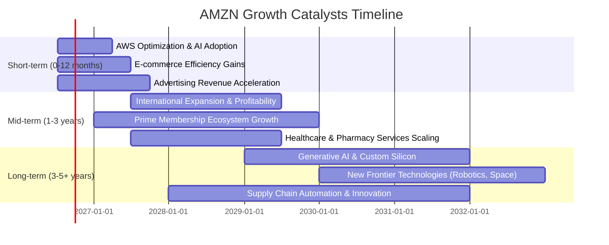

### 8.2 TAM 市場規模分析

Amazon 業務所處的市場，無論是電子商務、雲端運算還是數位廣告，都擁有巨大的總體潛在市場 (TAM)，為其提供了廣闊的成長空間。

```
╔══════════════════════════════════════════════════════════════════╗
║                    AMZN TAM 市場規模分析                         ║
╠══════════════════════════════════════════════════════════════════╣
║                                                                  ║
║  全球電子商務 TAM：  $6.0T+  █████████████████████████████████░░░  滲透率：~12%  ║
║  全球雲端運算 TAM：  $1.5T+  █████████████████████████████░░░░░░  滲透率：~30%  ║
║  全球數位廣告 TAM：  $1.0T+  █████████████████████████░░░░░░░░░░  滲透率：~5%   ║
║  全球物流服務 TAM：  $13.0T+ ██████████████████████████████████████████████████  滲透率：<1%   ║
║                                                                  ║
║                   0T    5T   10T   15T                            ║
║                                                                  ║
║  📊 結論：各核心業務仍有巨大未開發市場，滲透率提升空間廣闊。      ║
╚══════════════════════════════════════════════════════════════════╝
```
**分析**：Amazon 在多個萬億級別的市場中運營，且在許多領域的滲透率仍有巨大提升空間。例如，全球電子商務市場規模龐大，Amazon 作為領導者仍可通過市場擴張和品類深化獲得增長。雲端運算市場持續高速增長，AWS 憑藉其技術領先地位和 AI 創新，將繼續從企業數位轉型中獲益。數位廣告和物流服務作為其生態系統的補充，也提供了可觀的成長機會。

### 8.3 成長驅動力結構圖

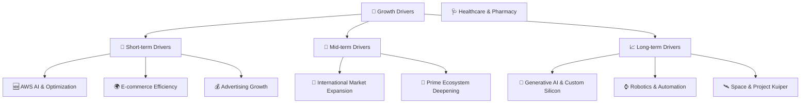
**分析**：
*   **短期驅動**：
    *   **AWS AI & Optimization**：隨著企業對 AI 應用的需求激增，AWS 將受益於其在 AI 基礎設施和服務方面的領先地位。同時，AWS 自身的成本優化和效率提升將推動利潤率進一步擴張。
    *   **E-commerce Efficiency Gains**：在過去幾年大規模投資後，Amazon 的電商物流網絡正逐步實現效率提升和成本優化，例如區域化物流策略，這將直接提升其零售業務的盈利能力。
    *   **Advertising Growth**：Amazon 的廣告業務受益於其龐大的用戶數據和電商平台流量，持續實現高雙位數增長，成為重要的利潤貢獻者。
*   **中期驅動**：
    *   **International Market Expansion**：儘管北美市場成熟，國際市場仍有巨大的增長潛力。Amazon 在新興市場的投資和擴張將帶來新的營收增長點，並隨著規模經濟的實現，改善國際業務的盈利能力。
    *   **Prime Ecosystem Deepening**：Prime 會員的持續增長和服務內容的豐富（如 Prime Video、Amazon Music、Prime Gaming）將進一步提高客戶忠誠度，增加消費頻次和客單價。
    *   **Healthcare & Pharmacy**：Amazon 在醫療保健領域的布局，包括 Amazon Pharmacy 和 Amazon Clinic，有望在中期逐步貢獻營收，並顛覆傳統醫療市場。
*   **長期驅動**：
    *   **Generative AI & Custom Silicon**：Amazon 在生成式 AI 領域的投資，包括 Bedrock 平台和自研晶片（如 Trainium, Inferentia），將鞏固 AWS 在 AI 時代的領先地位，並為其所有業務提供創新動力。
    *   **Robotics & Automation**：在倉儲、物流和配送領域的機器人與自動化技術應用，將持續提升效率，降低成本，並優化客戶體驗。
    *   **Space & Project Kuiper**：通過 Project Kuiper (低軌道衛星互聯網項目)，Amazon 旨在提供全球寬頻服務，這是一個具有顛覆性的長期增長點，有望拓展新的市場和收入來源。

---

## 9. 風險矩陣

### 9.1 風險評分矩陣

此圖表根據風險發生的機率和潛在的財務衝擊來評估各項風險。

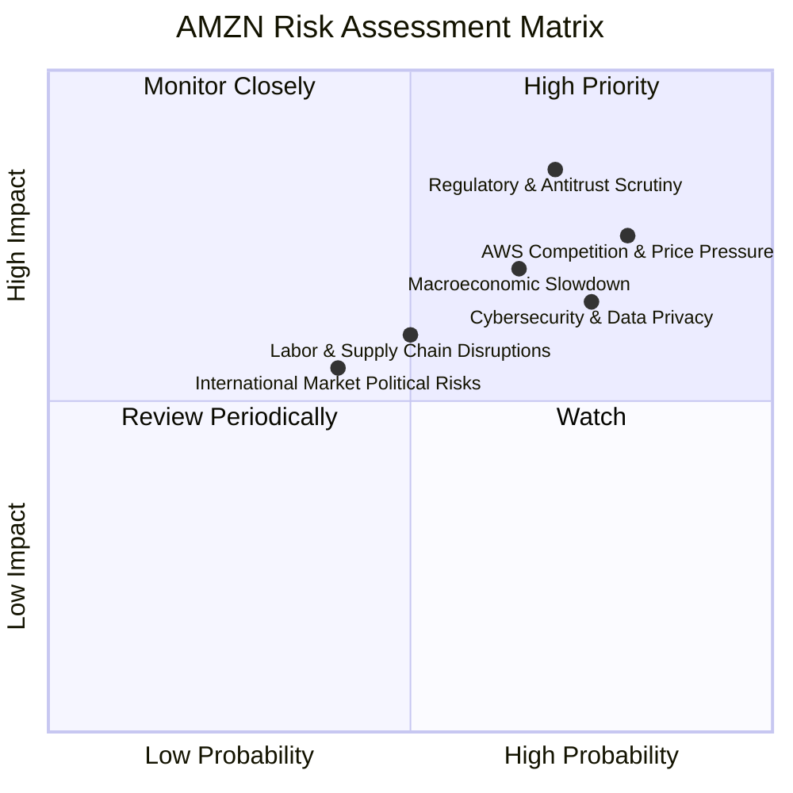

### 9.2 風險清單詳細分析

| # | 風險項目 | 發生機率 | 財務衝擊 | 風險評分 | 緩解措施 |
|---|----------|----------|----------|----------|----------|
| 1 | 🔴 **監管壓力及反壟斷調查** | 高 (70%) | 高 (-10%營收或業務拆分) | 🔴 8.5/10 | 積極配合監管機構，調整業務實踐以符合法規，持續進行遊說工作，並強調其對消費者和小型企業的價值。 |
| 2 | 🔴 **AWS 競爭加劇與價格戰** | 高 (80%) | 高 (-5% AWS 營收成長或利潤率壓縮) | 🔴 8.0/10 | 通過持續創新（如 AI 服務、自研晶片）、提供差異化解決方案、深化客戶關係、優化成本結構來保持競爭優勢。 |
| 3 | 🟡 **宏觀經濟放緩** | 中 (65%) | 中 (-5% 電商營收成長) | 🟡 7.0/10 | 業務多元化（雲端服務具韌性）、成本控制、優化供應鏈效率、提供多元化商品以滿足不同消費水平需求。 |
| 4 | 🟡 **勞動力與供應鏈中斷** | 中 (50%) | 中 (-3% 營收成長，成本增加) | 🟡 6.0/10 | 投資自動化技術、多元化供應商、建立彈性庫存管理系統、改善員工工作條件以降低流失率。 |
| 5 | 🟡 **網絡安全與數據隱私** | 高 (75%) | 中 (-2% 營收，品牌聲譽受損) | 🟡 6.5/10 | 持續投入頂級網絡安全技術、加強員工培訓、遵守全球數據隱私法規（如 GDPR, CCPA）、定期進行安全審計。 |
| 6 | 🟢 **國際市場政治與匯率風險** | 低 (40%) | 低 (-1% 國際營收) | 🟢 5.0/10 | 實施匯率對沖策略、調整國際業務策略以適應當地政治環境、分散投資組合。 |

---

## 10. 投資建議

### 10.1 最終綜合評級雷達圖

```
╔══════════════════════════════════════════════════════════════════╗
║                AMZN 綜合評級雷達圖 (1-10分)                      ║
╠══════════════════════════════════════════════════════════════════╣
║ 基本面強度  9.0 ▓▓▓▓▓▓▓▓▓▓▓▓▓▓▓▓▓▓░░  ★★★★★           ║
║ 成長動能    8.5 ▓▓▓▓▓▓▓▓▓▓▓▓▓▓▓▓▓░░░  ★★★★★           ║
║ 獲利品質    8.8 ▓▓▓▓▓▓▓▓▓▓▓▓▓▓▓▓▓▓░░  ★★★★★           ║
║ 財務健康    8.0 ▓▓▓▓▓▓▓▓▓▓▓▓▓▓▓▓░░░░  ★★★★☆           ║
║ 估值合理性  8.5 ▓▓▓▓▓▓▓▓▓▓▓▓▓▓▓▓▓░░░  ★★★★★           ║
║ 護城河深度  9.0 ▓▓▓▓▓▓▓▓▓▓▓▓▓▓▓▓▓▓░░  ★★★★★           ║
║ 管理層執行  8.5 ▓▓▓▓▓▓▓▓▓▓▓▓▓▓▓▓▓░░░  ★★★★★           ║
║ 技術創新力  9.0 ▓▓▓▓▓▓▓▓▓▓▓▓▓▓▓▓▓▓░░  ★★★★★           ║
╠══════════════════════════════════════════════════════════════════╣
║ 綜合總分    8.7 ▓▓▓▓▓▓▓▓▓▓▓▓▓▓▓▓▓░░░  🏆 投資評級：買入              ║
╚══════════════════════════════════════════════════════════════════╝
```

### 10.2 目標價與隱含報酬率

我們基於情境分析和 DCF 模型，得出以下目標價區間。

| 情境 | 機率權重 | 目標價 | 相對現價 ($245.34) | 隱含報酬率 |
|------|----------|--------|--------------------|------------|
| 🔴 悲觀 | 20% | $265 | +8.0% | +8.0% |
| 🟡 基準 | 60% | $313 | +27.6% | +27.6% |
| 🟢 樂觀 | 20% | $360 | +46.7% | +46.7% |
| **加權平均** | **100%** | **$311.2** | **+26.8%** | **+26.8%** |

**結論**：綜合考量 Amazon 強勁的基本面、持續改善的獲利能力、深厚的競爭護城河以及合理的估值，我們維持對 AMZN 的「**買入**」評級。基於基準情境，預計未來 12 個月的目標價為 **$313**，相較於當前股價 $245.34 具有約 27.6% 的上行空間。加權平均目標價為 $311.2，隱含報酬率為 26.8%。

### 10.3 買入時機與觸發因素

```
╔══════════════════════════════════════════════════════════════════╗
║                  ✅ 買入觸發因素 Checklist                      ║
╠══════════════════════════════════════════════════════════════════╣
║                                                                  ║
║  立即買入觸發條件（多數符合）：                                  ║
║  ✅ AWS 雲端服務營收成長率連續兩季 > 15%                         ║
║  ✅ 整體營業利益率持續維持雙位數且呈現擴張趨勢                   ║
║  ✅ 自由現金流（FCF）轉正且 FCF 轉換率 (FCF/Net Income) 逐步改善  ║
║  ✅ 股價回調至 $230-$240 區間，提供更佳安全邊際                    ║
║                                                                  ║
║  加碼觸發條件（出現以下任一）：                                  ║
║  ☐ AWS 宣布重大 AI 合作夥伴或新產品，進一步鞏固市場領先地位       ║
║  ☐ 電子商務業務的營運效率超預期改善，或國際市場盈利能力顯著提升    ║
║  ☐ 監管風險緩解，或公司成功應對反壟斷挑戰                          ║
║  ☐ 宏觀經濟數據優於預期，提振消費者支出和企業雲服務需求            ║
║                                                                  ║
║  減碼/停損觸發條件（出現以下任一）：                             ║
║  ☐ 核心業務（AWS 或電商）營收成長率連續兩季 < 10%              ║
║  ☐ 營業利益率連續兩季收縮 > 2 個百分點，且無明確改善前景        ║
║  ☐ 自由現金流轉負或 FCF 轉換率持續惡化且資本支出無效             ║
║  ☐ ROIC 跌破 WACC，且無短期內回升跡象                            ║
║  ☐ 重大監管打擊導致業務拆分或市場份額大幅損失                      ║
╚══════════════════════════════════════════════════════════════════╝
```

### 10.4 投資人適配度分析

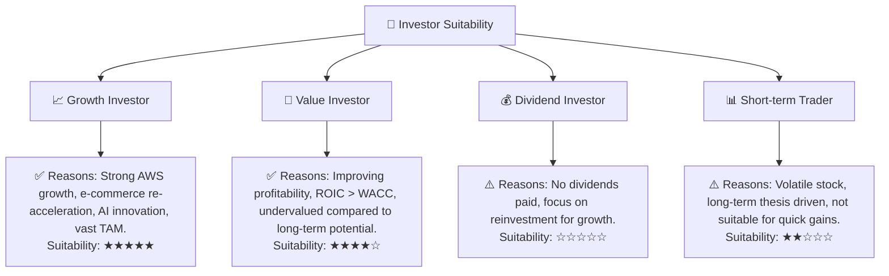
**分析**：
*   **成長型投資者**：AMZN 是典型的成長股，其在雲端運算、電子商務和 AI 領域的領先地位，以及巨大的市場潛力，使其成為尋求長期資本增值的投資者的理想選擇。
*   **價值型投資者**：儘管其 P/E 倍數相對較高，但考慮到其強勁的盈利增長、持續改善的利潤率以及 ROIC 高於 WACC 的事實，AMZN 具備長期的價值創造潛力。對於能夠看到其內在價值的投資者而言，當前估值具有吸引力。
*   **股息型投資者**：AMZN 不支付股息，其所有利潤均用於再投資以驅動增長，因此不適合追求穩定股息收入的投資者。
*   **短期交易者**：AMZN 股價波動性較高 (Beta 1.461)，且其投資論點基於長期趨勢和基本面改善，不適合尋求短期快速收益的交易者。

### 10.5 每季財報監控清單（Quarterly Watch List）

| 關鍵指標 | 追蹤門檻（加碼） | 追蹤門檻（減碼/停損） | 備註 |
|----------|------------------|----------------------|------|
| **總營收 YoY 成長** | > 15% | < 10% | 判斷整體業務動能，尤其關注 AWS 貢獻。 |
| **AWS 營收 YoY 成長** | > 18% | < 12% | 雲端業務是利潤核心，需密切關注其增速。 |
| **營業利益率** | > 14% | < 10% | 衡量公司經營效率，尤其關注 AWS 利潤率。 |
| **自由現金流 (FCF)** | 持續為正且環比增長 | 持續為負或大幅萎縮 | 衡量實際現金產生能力，關注資本支出趨勢。 |
| **資本支出 (Capex)** | 增速放緩且效率提升 | 增速過快且 FCF 持續惡化 | 判斷投資回報效率。 |
| **股權薪酬 (SBC)** | 佔營收比重下降 | 佔營收比重上升且影響 FCF | 衡量對股東報酬的稀釋程度。 |
| **國際業務盈利能力** | 國際業務營業利潤轉正或顯著改善 | 國際業務虧損擴大 | 判斷全球化策略的有效性。 |
| **AI/研發支出** | 穩步增長且有明確成果 | 支出無效或無創新突破 | 衡量未來成長動力。 |
| **財測 (Guidance)** | 超預期或符合高預期 | 低於預期或展望悲觀 | 市場情緒的重要驅動因素。 |
| **監管消息** | 無重大負面消息或達成和解 | 重大反壟斷處罰或業務拆分 | 關鍵的外部風險。 |

### 10.6 反面論證：什麼會證明論點錯誤（What Would Change My Mind）

```
╔══════════════════════════════════════════════════════════════════╗
║              ⚠️ 論點失效條件（Disconfirming Evidence）           ║
╠══════════════════════════════════════════════════════════════════╣
║  本投資論點在下列情況成立時應重新檢視或退出：                    ║
║  ☐ 核心業務 (AWS + 電商) 營收成長率連續兩季 < 10%                 ║
║  ☐ 整體營業利潤率較 TTM 峰值 (13.1%) 收縮 > 3 個百分點，且無明確改善措施  ║
║  ☐ 自由現金流轉負或 FCF 轉換率 (FCF/Net Income) 連續四季 < 10%    ║
║  ☐ ROIC 跌破 WACC (11.84%)，且連續兩年無法回升                   ║
║  ☐ 關鍵成長投資（如 AI/新業務）無法在未來 2-3 年內變現或貢獻顯著營收  ║
║  ☐ 嚴格的監管法規導致核心業務（如 AWS 或電商）市場份額大幅流失或強制拆分 ║
╚══════════════════════════════════════════════════════════════════╝
```

---

> **免責聲明**：本報告為 AI 自動生成，僅供研究參考，不構成投資建議。投資有風險，入市需謹慎。