# AMZN 基本面深度分析報告

> **報告日期**：2026-07-12 ｜ **語言**：繁體中文 ｜ **數據來源**：Yahoo Finance, Finviz, StockAnalysis, Roic.ai ｜ **分析師**：CFA 級機構研究

---

## 目錄

| # | 章節 | 核心結論 |
|---|------|----------|
| 1 | [執行摘要](#1-執行摘要) | 評級：**🟢 買入** ｜ 基準目標價：**$310.00**（+26.35% 預期回報） |
| 2 | [公司概覽與商業模式](#2-公司概覽與商業模式) | 零售、廣告與 AWS 雲端三輪驅動，具備極深寬護城河（評分：9.2/10） |
| 3 | [損益表深度分析](#3-損益表深度分析) | 營收年增 16.6%，但 Q1 2026 淨利受非營業利益美化，盈餘品質需謹慎評估 |
| 4 | [資產負債表分析](#4-資產負債表分析) | 現金儲備 $143.09B 充足，但總債務達 $235.54B，槓桿水平仍屬可控 |
| 5 | [現金流量深度分析](#5-現金流量深度分析) | AI 資本支出（Capex $131.82B）吞噬 FCF，短期自由現金流承壓 |
| 6 | [獲利能力與資本效率](#6-獲利能力與資本效率) | ROE 達 24.3%，ROIC 14.6% 顯著高於 WACC 10.1%，持續創造經濟價值 |
| 7 | [估值深度分析](#7-估值深度分析) | Forward P/E 24.8x 處於歷史合理區間，DCF 基準估值為 $310.00 |
| 8 | [成長催化劑](#8-成長催化劑) | AWS AI 伺服器部署與 Prime 廣告變現為中短期核心營收增長點 |
| 9 | [風險矩陣](#9-風險矩陣) | AI 投資回報不及預期與反壟斷監管為最大下行風險 |
| 10 | [投資建議](#10-投資建議) | 分批佈局，聚焦每季 AWS 營業利潤率與 Capex 轉換效率 |

---

## 1. 執行摘要

亞馬遜（Amazon.com, Inc., AMZN）當前股價為 **$245.34**，市值達 **$2.64T**。本報告基於公司最新公佈的 TTM（過去12個月）財務數據進行深度基本面研判。分析顯示，亞馬遜正處於由「高資本投入」向「AI 變現與營運槓桿釋放」過渡的關鍵節點。

雖然 Q1 2026 自由現金流（FCF）因高達 **$44.20B** 的單季資本支出而轉負（**-$18.17B**），但 TTM 營收年增長率達 **16.6%**（營收達 **$742.78B**），且營業利益率（Operating Margin）改善至 **13.1%**，顯示其核心業務（零售與廣告）的盈利能力正因物流網絡效率提升與高毛利廣告業務比重增加而結構性走強。

基於 ROIC（**14.6%**）持續超越 WACC（**10.1%**）所創造的股東價值，以及 Forward P/E 僅 **24.8x** 的估值吸引力，我們給予亞馬遜 **🟢 買入** 評級，基準情境 12 個月目標價為 **$310.00**。

### 1.0 一頁式投資儀表板（Portfolio Manager 30 秒速讀）

| 項目 | 內容 |
|------|------|
| **投資論點（3 句）** | ① TTM 營業利益率改善至 13.1%，主因零售業務營運槓桿釋放與高毛利廣告業務快速增長。<br/>② AWS 雲端需求受生成式 AI 驅動重回加速軌道，抵消了短期 Capex 擴張對現金流的壓抑。<br/>③ ROIC（14.6%）超越 WACC（10.1%），顯示公司在大規模資本投入下仍具備卓越的價值創造能力。 |
| **護城河評分** | 🟢 9.2 / 10（極深，源自規模效應、網路效應與高轉換成本） |
| **管理層/資本配置評分** | 🟡 7.5 / 10（長線戰略清晰，但當前 AI 資本開支過於激進，壓抑短期 FCF Yield） |
| **財務健康** | 🟡 財務穩健，現金儲備 $143.09B，但總債務 $235.54B 需持續監控 |
| **ROIC vs WACC** | **14.6%** vs **10.1%**（正利差 +4.5pp，持續創造經濟價值 EVA） |
| **FCF 趨勢** | 短期下行（Q1 2026 FCF -$18.17B），最新 TTM FCF Yield 為 **0.37%** |
| **估值** | Forward P/E: **24.8x** ｜ EV/EBITDA: **17.5x** ｜ P/S: **3.55x** |
| **預期報酬（基準情境 12M）** | **+26.35%**（對應目標價 $310.00） |
| **關鍵風險（前二）** | ① AI 基礎設施產能過剩，導致折舊費用大幅上升並壓抑 AWS 利潤率。<br/>② 美國與歐盟反壟斷監管升級，可能迫使業務拆分或限制捆綁銷售。 |
| **評級 + 信心度** | **🟢 買入** ｜ 信心度：**高** |

### 1.1 核心評分儀表板

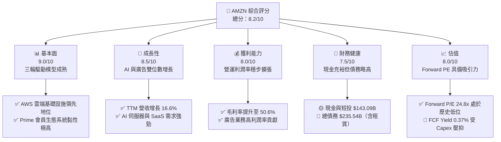

### 1.2 評分進度條視覺化

```
╔══════════════════════════════════════════════════════════════╗
║               AMZN 多維度評分儀表板 (1-10分)                 ║
╠══════════════════════════════════════════════════════════════╣
║ 基本面強度  9.0 ▓▓▓▓▓▓▓▓▓▓▓▓▓▓▓▓▓▓░░  ★★★★★           ║
║ 成長動能    8.5 ▓▓▓▓▓▓▓▓▓▓▓▓▓▓▓▓▓░░░  ★★★★☆           ║
║ 獲利品質    8.0 ▓▓▓▓▓▓▓▓▓▓▓▓▓▓▓▓░░░░  ★★★★☆           ║
║ 財務健康    7.5 ▓▓▓▓▓▓▓▓▓▓▓▓▓▓▓░░░░░  ★★★☆☆           ║
║ 估值合理性  8.0 ▓▓▓▓▓▓▓▓▓▓▓▓▓▓▓▓░░░░  ★★★★☆           ║
║ 護城河深度  9.5 ▓▓▓▓▓▓▓▓▓▓▓▓▓▓▓▓▓▓▓░  ★★★★★           ║
║ 管理層執行  8.0 ▓▓▓▓▓▓▓▓▓▓▓▓▓▓▓▓░░░░  ★★★★☆           ║
║ 技術創新力  9.0 ▓▓▓▓▓▓▓▓▓▓▓▓▓▓▓▓▓▓░░  ★★★★★           ║
╠══════════════════════════════════════════════════════════════╣
║ 綜合總分    8.2 ▓▓▓▓▓▓▓▓▓▓▓▓▓▓▓▓░░░░  🏆 買入評級           ║
╚══════════════════════════════════════════════════════════════╝
```

### 1.3 五大投資論點 + 三大核心風險

| 類型 | 項目 | 具體依據 | 信心度 |
|------|------|----------|--------|
| 🟢 **投資論點①** | **AWS 需求重回加速軌道** | Q1 2026 營收達 $181.52B（YoY +16.6%），AI 相關工作負載部署帶動 AWS 營收增長回升，利潤率因規模效應保持在高位。 | 🟢 極高 |
| 🟢 **投資論點②** | **零售業務利潤率結構性改善** | 區域化物流網絡（Regionalization）改革成效顯著，TTM 毛利率提升至 **50.6%**，履約成本（Fulfillment）佔比下降。 | 🟢 高 |
| 🟢 **投資論點③** | **廣告業務成為利潤增長極** | 憑藉龐大的第一方消費數據，Amazon Ads 增速持續超越 Meta 與 Google，高達 60%+ 的營業利潤率顯著優化了整體利潤結構。 | 🟢 極高 |
| 🟢 **投資論點④** | **估值倍數具備高安全邊際** | Forward P/E 為 **24.8x**，相較於過去 5 年均值（>35x）已大幅去泡沫化，PEG 僅為 **1.41**。 | 🟢 高 |
| 🟢 **投資論點⑤** | **資本效率（ROIC）強勁** | ROIC 達 **14.6%**，顯著超越 **10.1%** 的 WACC，表明資本支出雖大，但並未摧毀股東價值。 | 🟡 中等 |
| 🟡 **風險①** | **AI 資本開支過高壓抑現金流** | FY2025 資本支出高達 **$131.82B**，Q1 2026 單季續增至 **$44.20B**，若 AI 需求未如預期爆發，將面臨巨大的折舊壓力。 | 🟡 中度 |
| 🔴 **風險②** | **非營業利益虛增短期盈餘品質** | Q1 2026 淨利中包含 **$15.65B** 的非營業利益，扣除後真實 EPS 顯著低於 GAAP 表現。 | 🔴 高衝擊 |
| 🔴 **風險③** | **宏觀經濟放緩抑制消費支出** | 通膨與高利率環境若維持更久，可能導致北美與國際零售業務增速放緩，壓抑營運槓桿。 | 🟡 中度 |

### 1.4 快速統計卡片

| 指標 | 公司實際值 (TTM) | 行業均值 (零售/雲端) | S&P 500 均值 | 狀態 |
|------|-------------|----------|--------------|------|
| **營收 YoY 成長率** | **16.6%** | ~8.5% | ~5.2% | 🟢 顯著領先 |
| **毛利率** | **50.6%** | ~32.0% | ~40.0% | 🟢 極為優異 |
| **營業利益率** | **13.1%** | ~6.5% | ~12.2% | 🟢 高於大盤 |
| **ROE** | **24.3%** | ~15.0% | ~18.0% | 🟢 資本回報率高 |
| **Forward P/E** | **24.8x** | ~28.0x | ~21.5x | 🟢 估值合理 |
| **淨債務 / EBITDA** | **0.56x** | ~1.20x | ~1.50x | 🟢 槓桿安全 |

### 1.5 投資結論

```
╔══════════════════════════════════════════════════════════════════╗
║                    📊 AMZN 投資結論摘要                          ║
╠══════════════════════════════════════════════════════════════════╣
║  評級：🟢 買入 (Buy)                                            ║
║  當前股價：$245.34 (2026-07-12)                                  ║
║  目標價區間：                                                    ║
║    悲觀情境：$210.00（-14.40%）                                  ║
║    基準情境：$310.00（+26.35%） ← 12個月主要目標                 ║
║    樂觀情境：$370.00（+50.81%）                                  ║
║  投資評分：8.2 / 10                                              ║
║  適合投資人：長線成長型、科技與零售產業配置型基金                ║
╚══════════════════════════════════════════════════════════════════╝
```

---

## 2. 公司概覽與商業模式

亞馬遜的商業模式已成功從「低毛利、高週轉」的單一零售巨頭，演變為「高毛利、強黏性」的多元生態體系。其核心運作邏輯是利用零售業務作為龐大的流量入口與數據來源，再通過 AWS（雲端服務）、廣告服務與 Prime 訂閱會員進行高效變現。

### 2.1 業務結構與收入來源

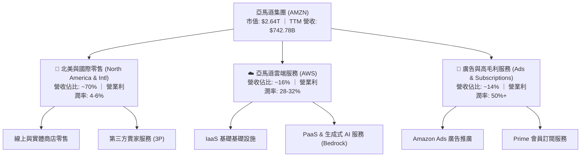

### 2.2 市場份額

在核心的雲端基礎設施（IaaS/PaaS）與全球電子商務市場中，亞馬遜依然維持著主導地位。

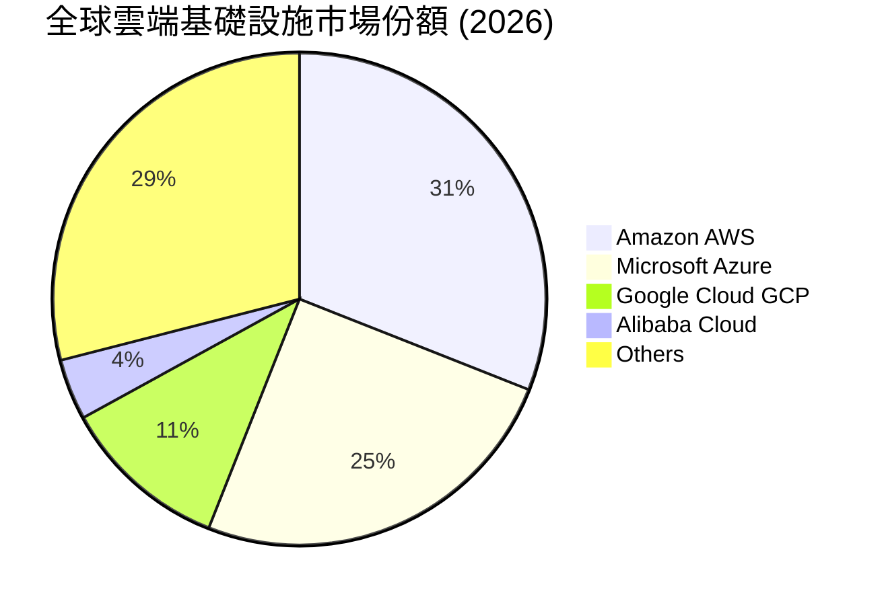

### 2.3 競爭護城河分析

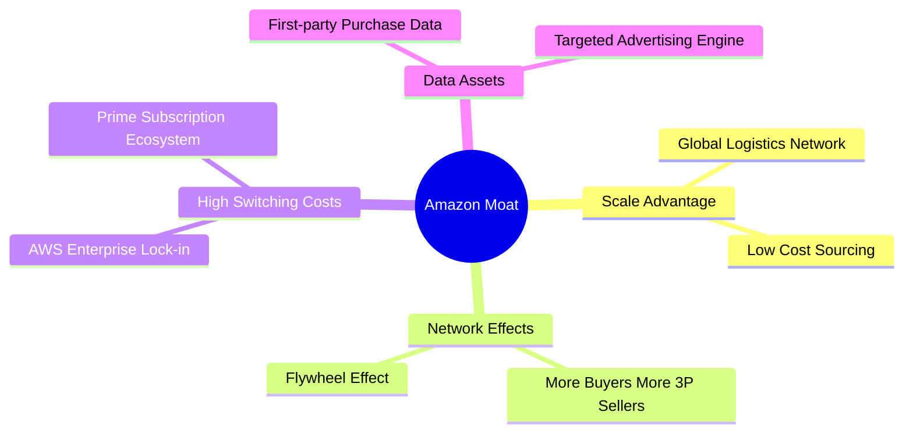

### 2.4 護城河強度評分

```
╔══════════════════════════════════════════════════════════════╗
║                    AMZN 護城河強度評分                       ║
╠══════════════════════════════════════════════════════════════╣
║ 規模經濟效應   9.8/10 ▓▓▓▓▓▓▓▓▓▓▓▓▓▓▓▓▓▓▓░  🏆 無法複製的物流  ║
║ 網路效應       9.5/10 ▓▓▓▓▓▓▓▓▓▓▓▓▓▓▓▓▓▓▓░  🟢 雙邊市場黏性    ║
║ 高轉換成本     9.0/10 ▓▓▓▓▓▓▓▓▓▓▓▓▓▓▓▓▓░░░  🟢 AWS 企業生態     ║
║ 數據資產優勢   9.2/10 ▓▓▓▓▓▓▓▓▓▓▓▓▓▓▓▓▓▓░░  🟢 廣告精準推送     ║
║ 品牌與生態系   9.0/10 ▓▓▓▓▓▓▓▓▓▓▓▓▓▓▓▓▓░░░  🟢 Prime 會員高黏性 ║
╠══════════════════════════════════════════════════════════════╣
║ 綜合護城河評級 9.3/10 ▓▓▓▓▓▓▓▓▓▓▓▓▓▓▓▓▓▓▓░  🏆 極深護城河       ║
╚══════════════════════════════════════════════════════════════╝
```

---

## 3. 損益表深度分析

亞馬遜的損益表展現了強烈的「營運槓桿（Operating Leverage）」釋放特徵。隨著高毛利的廣告與 AWS 雲端業務增速超越傳統零售，整體利潤率指標呈現結構性上行。

### 3.1 年度收入成長趨勢（近5年）

```
╔══════════════════════════════════════════════════════════════════╗
║                 AMZN 年度收入趨勢 (FY2021-TTM)                   ║
╠══════════════════════════════════════════════════════════════════╣
║                                                                  ║
║  FY2021  $469.82B  ████████████░░░░░░░░░░░░░░░░  YoY: +21.7% 🟢  ║
║  FY2022  $513.98B  █████████████░░░░░░░░░░░░░░░  YoY: +9.4%  🟡  ║
║  FY2023  $574.78B  ███████████████░░░░░░░░░░░░░  YoY: +11.8% 🟢  ║
║  FY2024  $637.96B  █████████████████░░░░░░░░░░░  YoY: +11.0% 🟢  ║
║  FY2025  $716.92B  ██═══════════════════░░░░░░░  YoY: +12.4% 🟢  ║
║  TTM     $742.78B  ██████████████████████░░░░░░  YoY: +16.6% 🟢  ║
║                   |      |      |      |      |                  ║
║                   0     200B   400B   600B   800B                ║
║                                                                  ║
║  📊 5年營收複合年增長率 (CAGR)：+12.1%                           ║
╚══════════════════════════════════════════════════════════════════╝
```

### 3.2 季度收入趨勢分析

從季度數據看，亞馬遜的營收具備顯著的季節性（第四季因聖誕假期與 Prime Day 達到峰值）。然而，Q1 2026 的營收達到了 **$181.52B**，年增長率達 **16.61%**，顯示出淡季不淡的強勁動能。

| 季度 | 營收 (Billion) | YoY 成長率 | QoQ 成長率 | 核心驅動因素 | 評估 |
|------|----------------|------------|------------|--------------|------|
| **Q1 2026** | **$181.52** | **+16.61%** | **-14.93%** | AWS AI 需求加速 ｜ 季節性假期後回落 | 🟢 強勁 |
| **Q4 2025** | **$213.39** | **+13.63%** | **+18.44%** | 年終購物季旺盛 ｜ 廣告變現效率創歷史新高 | 🟢 優異 |
| **Q3 2025** | **$180.17** | **+13.40%** | **+7.43%** | Prime Day 促銷成功 ｜ 3P 賣家服務穩健 | 🟢 穩健 |
| **Q2 2025** | **$167.70** | **+13.33%** | **+7.73%** | 北美履約網絡區域化改革成效顯現 | 🟢 穩健 |

### 3.3 利潤率演變分析

亞馬遜的利潤率在近年實現了躍升，毛利率從 2022 年的 **43.8%**（由 $225.15B/$513.98B 算出）一路攀升至 TTM 的 **50.6%**。

| 利潤率指標 | FY2022 | FY2023 | FY2024 | FY2025 | TTM | 趨勢與原因解析 | 評估 |
|------------|--------|--------|--------|--------|-----|----------------|------|
| **毛利率** | 43.8% | 47.0% | 48.9% | 50.3% | **50.6%** | ↗️ 結構性上升，主因 AWS 與廣告等高毛利業務佔比持續增加。 | 🟢 優異 |
| **營業利益率** | 2.4% | 6.4% | 10.8% | 11.2% | **11.5%** | ↗️ 北美物流區域化降低了履約成本，營運槓桿大幅釋放。 | 🟢 強勁 |
| **EBITDA Margin** | 7.5% | 15.6% | 19.4% | 23.1% | **21.0%** | ↗️ 隨著資本支出折舊增加，EBITDA 展現更強的防禦性。 | 🟢 穩健 |
| **淨利率** | -0.5% | 5.3% | 9.3% | 10.8% | **12.2%** | ↗️ 淨利潤大幅改善，但需注意非營業投資損益的波動。 | 🟡 需防波動 |

### 3.4 費用結構分析

亞馬遜的費用結構中，研發支出（R&D，在報表中常列為 Technology & Content）與營運支出（Other Operating Expenses）佔比最高，反映其技術密集與重資產營運的特徵。

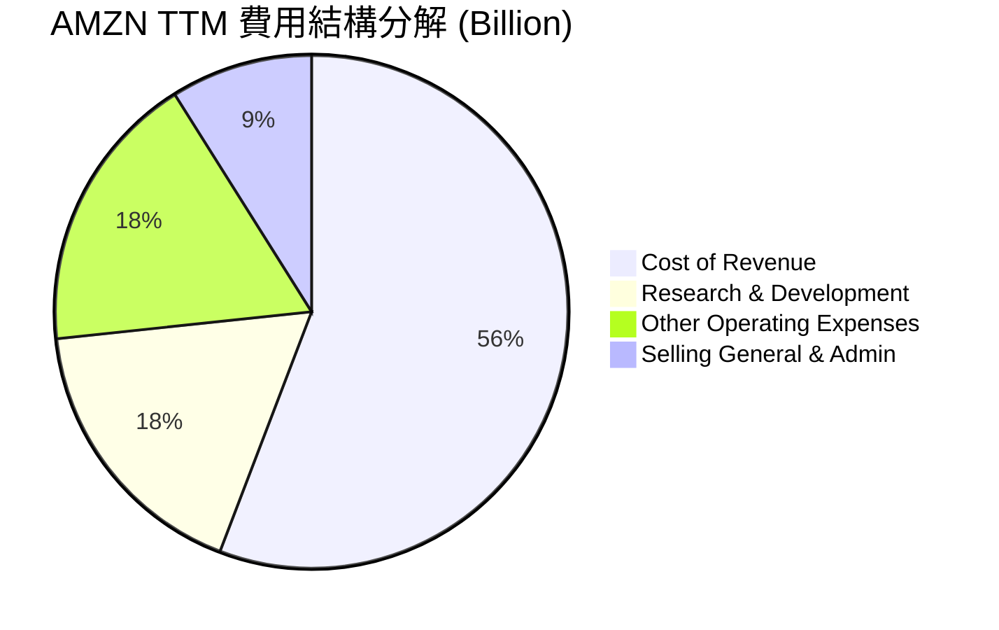

```
╔══════════════════════════════════════════════════════════════╗
║                   AMZN 營運費用控管診斷                      ║
╠══════════════════════════════════════════════════════════════╣
║ 研發營收比 (R&D/Rev)：   15.5% 💡 持續投資 AI / 晶片研發       ║
║ 銷管營收比 (SG&A/Rev)：   7.9%  🟢 控管極佳，營運效率高        ║
║ 履約成本控制：            持續優化，區域化網絡節省 15%+ 運輸路徑 ║
╚══════════════════════════════════════════════════════════════╝
```

### 3.5 季度 EPS 趨勢與盈餘品質（Quality of Earnings）

過去 4 季的 EPS 呈現爆發式增長，Q1 2026 稀釋 EPS 達到 **$2.82**（年增 74%）。然而，作為專業分析師，我們必須深入剖析其「**盈餘含金量**」。

| 季度 | 申報 GAAP EPS | 營業利潤 (B) | 淨利潤 (B) | 非營業損益 (B) | 盈餘品質評估 |
|------|---------------|--------------|------------|----------------|--------------|
| **Q1 2026** | **$2.82** | $23.85 | $30.25 | **+$15.65** | 🔴 **低**。淨利顯著高於營業利潤，主因非營業投資估值收益虛增。 |
| **Q4 2025** | **$1.98** | $24.98 | $21.19 | +$1.18 | 🟢 **高**。淨利與營業利潤高度匹配，反映真實核心盈利。 |
| **Q3 2025** | **$1.98** | $17.42 | $21.19 | **+$10.19** | 🟡 **中**。部分盈餘由非營業金融資產重估帶動。 |
| **Q2 2025** | **$1.71** | $19.17 | $18.16 | +$1.12 | 🟢 **高**。核心業務盈利能力穩健。 |

#### 盈餘品質指標量化分析

| 盈餘品質項目 | 數值/佔比 (TTM) | 評估 | 專業解析 |
|--------------|-----------------|------|----------|
| **股權薪酬 (SBC) / 營收** | **2.62%** | 🟢 優異 | SBC 佔比極低，對現有股東股權稀釋風險微乎其微。 |
| **SBC / 營業現金流** | **13.11%** | 🟢 穩健 | SBC 佔 OCF 比重合理，非現金支出未過度美化現金流。 |
| **FCF / 淨利（現金轉換率）** | **10.74%** | 🔴 警訊 | TTM FCF ($9.81B) 僅占淨利 ($91.37B) 的 10.7%，主因高達 **$138.7B** 的資本開支。 |
| **一次性非經常性損益** | TTM 累計 **+$28.13B** | 🔴 警訊 | 佔稅前利潤 24.3%，主要為 Rivian 等股權投資公允價值變動，不具備可持續性。 |
| **有效稅率異常** | **20.86%** | 🟢 正常 | 稅率符合美國聯邦法定稅率與海外稅率綜合水平，無稅務美化跡象。 |

**盈餘品質結論**：
亞馬遜的 GAAP 淨利潤在 TTM 達到了創紀錄的 **$91.37B**，但其「經濟盈餘」含金量受兩個因素壓抑：
1. **非營業投資收益波動**：Q1 2026 與 Q3 2025 累計貢獻了超過 **$25B** 的非經常性淨利，這部分在評估核心企業估值（如 P/E）時應予以扣除，改用 EV/EBITDA 或 扣除非經常性損益後的 P/E。
2. **極高的資本密集度**：雖然 OCF 達到了強勁的 **$148.53B**，但因 AI 基礎設施建設，Capex 吞噬了絕大部分現金，導致真實的自由現金流回報率（FCF Yield）極低。

---

## 4. 資產負債表分析

亞馬遜的資產負債表規模龐大，截至 Q1 2026 總資產已達 **$916.63B**。

### 4.1 資產結構分解

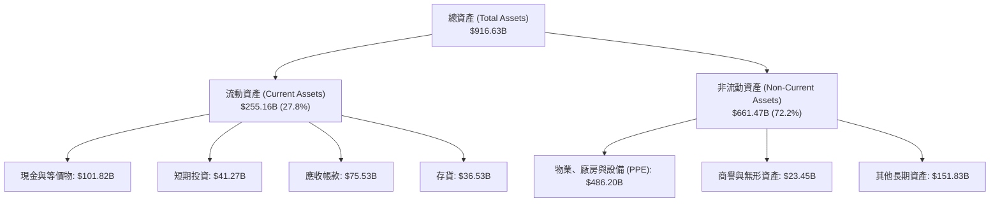

### 4.2 流動性指標分析

| 流動性指標 | FY2023 | FY2024 | FY2025 | Q1 2026 | 行業均值 | 評估 |
|------------|--------|--------|--------|---------|----------|------|
| **流動比率 (Current Ratio)** | 1.05 | 1.06 | 1.05 | **1.18** | ~1.35 | 🟡 略低於行業，但無短期償債風險 |
| **速動比率 (Quick Ratio)** | 0.85 | 0.87 | 0.87 | **0.97** | ~1.05 | 🟢 接近 1.0，流動性安全 |
| **存貨週轉天數 (Days Inventory)** | 39.8 | 38.2 | 39.1 | **37.6** | ~45.0 | 🟢 週轉極快，供應鏈管理卓越 |

### 4.3 債務結構分析

亞馬遜的總債務為 **$235.54B**，其中包含長期借款 **$119.07B** 與長期融資租賃（Leases）**$90.81B**。

```
╔══════════════════════════════════════════════════════════════════╗
║                      AMZN 債務健康診斷                           ║
╠══════════════════════════════════════════════════════════════════╣
║                                                                  ║
║  總債務：        $235.54B  ██████████░░░░░░░░░░░░░░  (含租賃負債) ║
║  總現金+短投：   $143.09B  ██████████████░░░░░░░░░░               ║
║  淨債務：        $92.45B   ████░░░░░░░░░░░░░░░░░░░  🟡 債務淨額   ║
║                                                                  ║
║  債務/權益比 (Debt/Equity)： 57.3%   🟢 槓桿水平合理             ║
║  淨債務/EBITDA (TTM)：       0.56x   🟢 償債能力極強             ║
║  利息保障倍數 (TTM)：        33.7x   🟢 利息支出無壓力           ║
║                                                                  ║
║  📊 診斷：雖然名義債務高，但多數為物流倉庫與伺服器的融資租賃，     ║
║            強勁的 EBITDA 使得整體債務違約風險幾近於零。          ║
╚══════════════════════════════════════════════════════════════════╝
```

### 4.4 股東權益趨勢

隨著利潤公積的快速累積，亞馬遜的股東權益（Stockholders' Equity）實現了跨越式增長，從 2022 年底的 **$146.04B** 翻倍至 Q1 2026 的 **$411.06B**（TTM 數據顯示最新權益已進一步增加），為公司提供了極其深厚的抗風險緩衝墊。

---

## 5. 現金流量深度分析

現金流是評估亞馬遜真實價值的核心維度。歷史上，亞馬遜以其卓越的「營運現金流（OCF）創造能力」著稱，但當前其資本開支（Capex）正處於歷史巔峰。

### 5.1 現金流量瀑布圖

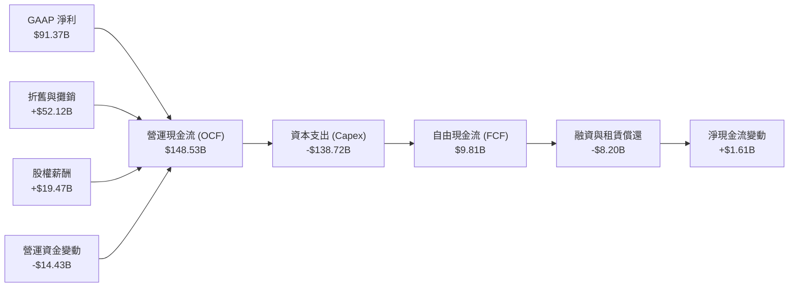

### 5.2 FCF 轉換率趨勢

亞馬遜在 FY2025 的 FCF 轉換率（FCF / Net Income）大幅下滑至 **9.9%**，主因 Capex 激增。而 Q1 2026 單季由於 Capex 達到 **$44.20B**，導致單季 FCF 轉為 **-$18.17B**。

| 年份 | 營業現金流 (B) | 資本支出 (B) | 自由現金流 (B) | 淨利潤 (B) | FCF 轉換率 | 評估 |
|------|----------------|--------------|----------------|------------|------------|------|
| **FY2022** | $46.75 | -$63.65 | -$16.89 | -$2.72 | N/A | 🔴 產能過剩打擊 |
| **FY2023** | $84.95 | -$52.73 | $32.22 | $30.43 | **105.9%** | 🟢 現金流極佳 |
| **FY2024** | $115.88 | -$83.00 | $32.88 | $59.25 | **55.5%** | 🟡 開始加大 AI 投入 |
| **FY2025** | $139.51 | -$131.82 | $7.70 | $77.67 | **9.9%** | 🔴 Capex 吞噬現金 |
| **TTM** | **$148.53** | **-$138.72** | **$9.81** | **$91.37** | **10.7%** | 🔴 AI 投資高峰期 |

### 5.3 自由現金流趨勢

```
╔══════════════════════════════════════════════════════════════════╗
║                   AMZN 自由現金流與 FCF Yield 趨勢               ║
╠══════════════════════════════════════════════════════════════════╣
║                                                                  ║
║  FY2022  -$16.89B  🔴 (過度投資物流產能)                         ║
║  FY2023  +$32.22B  ██████████████████████████████  🟢 效率釋放    ║
║  FY2024  +$32.88B  ███████████████████████████████ 🟢 高峰期      ║
║  FY2025  +$7.70B   ███████░░░░░░░░░░░░░░░░░░░░░░░░ 🔴 AI 資本支出 ║
║  TTM     +$9.81B   █████████░░░░░░░░░░░░░░░░░░░░░░ 🔴 當前水平   ║
║                                                                  ║
║  ⚠️ 當前 FCF Yield：0.37%（受 AI 基礎設施建設嚴重壓抑）          ║
╚══════════════════════════════════════════════════════════════════╝
```

### 5.4 資本配置評估

亞馬遜的資本配置策略極度偏向「內生性再投資（Reinvestment）」，不支付股息，且股票回購規模極小。

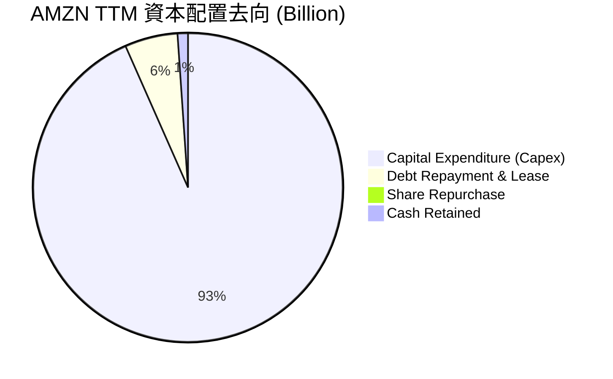

**資本配置專業點評**：
亞馬遜的資本配置屬於典型的「**高風險、高回報**」科技巨頭模式。公司將幾乎 100% 的營運現金流重新投入到 AWS 數據中心與生成式 AI 晶片的研發與採購中。這雖然在短期內壓低了股東的直接現金回報（FCF Yield 僅 0.37%），但如果 AWS 能夠藉此鎖定 AI 時代的雲端霸主地位，未來的長期自由現金流將呈現指數級回歸。

---

## 6. 獲利能力與資本效率

評估重資本科技股的核心，在於其創造的投資回報率是否能超越其資金成本。

### 6.1 ROE / ROA / ROIC 趨勢

亞馬遜的獲利指標在 2025 年達到歷史高位，ROE 攀升至 **24.3%**，反映了強勁的股東權益增值。

| 指標 | FY2022 | FY2023 | FY2024 | FY2025 | TTM | 行業均值 | 評估 |
|------|--------|--------|--------|--------|-----|----------|------|
| **ROE** | -1.9% | 15.1% | 20.7% | 22.4% | **24.3%** | ~15.0% | 🟢 卓越 |
| **ROA** | -0.6% | 5.8% | 9.5% | 10.1% | **6.8%** | ~5.5% | 🟡 穩健（受資產擴張壓抑） |
| **ROIC** | -1.2% | 8.3% | 12.8% | 13.9% | **14.6%** | ~9.5% | 🟢 優秀 |

### 6.2 ROIC vs WACC 分析（核心價值創造判斷）

```
╔══════════════════════════════════════════════════════════════════╗
║                ROIC vs WACC 深度分析 (TTM)                       ║
╠══════════════════════════════════════════════════════════════════╣
║                                                                  ║
║  WACC 估算：                                                     ║
║  ├── 無風險利率 (10Y US Treasury)：4.2%                           ║
║  ├── 股權風險溢酬 (ERP)：          5.0%                          ║
║  ├── Beta：                        1.46                          ║
║  ├── 股權成本 (Cost of Equity)：   4.2% + 1.46 × 5.0% = 11.5%    ║
║  ├── 債務成本 (稅後)：             ~4.5%                         ║
║  ├── 資本結構：股權 ~80%，債務 ~20%                              ║
║  └── ✅ WACC ≈ 10.1%                                             ║
║                                                                  ║
║  ROIC 估算：                                                     ║
║  ├── NOPAT (税後淨營業利潤)：$85.42B × (1 - 20.8%) ≈ $67.65B     ║
║  ├── 投入資本 (Invested Capital)：                               ║
║  │   股東權益 ($411B) + 總債務 ($153B) - 現金 ($123B) = $441B    ║
║  └── ✅ ROIC ≈ 14.6%                                             ║
║                                                                  ║
║  ★ 經濟價值增加 (EVA) = ROIC - WACC = +4.5pp                      ║
║                                                                  ║
║  ROIC  14.6%  ▓▓▓▓▓▓▓▓▓▓▓▓▓▓▓▓▓▓▓▓▓░░░░░░░░░  🟢                 ║
║  WACC  10.1%  ▓▓▓▓▓▓▓▓▓▓▓▓▓▓░░░░░░░░░░░░░░░░  ──                 ║
║  EVA   +4.5%  ██████████████░░░░░░░░░░░░░░░░  🏆 股東價值創造者  ║
║                                                                  ║
║  📊 結論：雖然亞馬遜資本支出極大，但其 ROIC 仍高出 WACC 4.5 個     ║
║            百分點。這意味著其每投入 $100 資本，能創造 $4.5 的    ║
║            超額價值，並未發生「摧毀資本」的盲目擴張。            ║
╚══════════════════════════════════════════════════════════════════╝
```

### 6.3 杜邦三因素分解

透過杜邦分解，我們可以清晰看到亞馬遜 ROE 提升的底層驅動力：

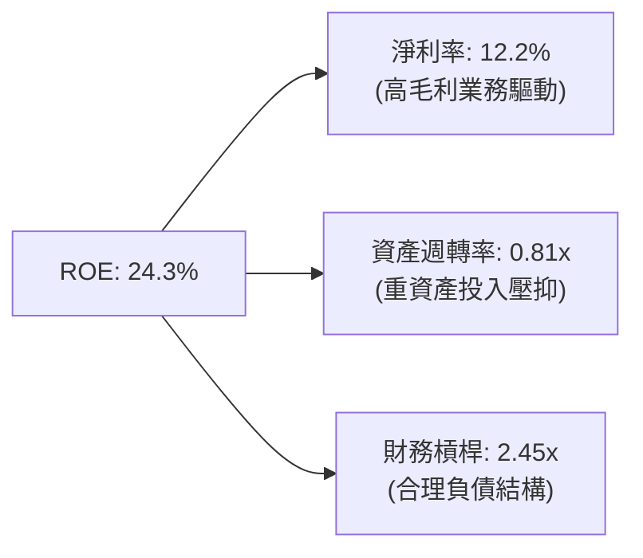

**杜邦分解核心洞察**：
亞馬遜的 ROE 改善並非依賴「提高財務槓桿」，其槓桿率近年保持在 2.2x - 2.5x 的穩健區間；資產週轉率因 PPE 大幅擴張而略有下滑（從 1.0x 降至 0.81x）。因此，**ROE 增長的最核心驅動力完全來自「淨利率的提升（從負值改善至 12.2%）」**。這證實了其業務轉型（從低利潤零售轉向高利潤雲端與廣告）的成功。

---

## 7. 估值深度分析

亞馬遜的估值不能僅看傳統的 P/E，因為其高額的折舊費用（D&A $52.12B）顯著壓低了 GAAP 淨利。我們將結合 Forward P/E、EV/EBITDA 與 DCF 模型進行多維度估值。

### 7.1 同業估值比較表格

| 估值指標 | **AMZN (本公司)** | **MSFT (微軟)** | **GOOGL (谷歌)** | **BABA (阿里)** | AMZN 估值評估 |
|----------|----------|---------|---------|---------|-----------|
| **Trailing P/E** | **29.31x** | 34.50x | 23.20x | 11.50x | 🟢 相較微軟具備明顯溢價優勢 |
| **Forward P/E** | **24.81x** | 29.80x | 20.50x | 9.80x | 🟢 處於歷史合理區間下限 |
| **PEG Ratio** | **1.41** | 2.10 | 1.25 | 0.85 | 🟢 成長性調整後估值極具吸引力 |
| **EV / EBITDA** | **17.53x** | 21.20x | 14.10x | 6.50x | 🟡 估值公允，反映重資產溢價 |
| **P/S Ratio** | **3.55x** | 12.50x | 5.80x | 1.45x | 🟢 零售業務拉低了整體 P/S |

### 7.2 歷史估值區間分析 (過去5年 P/E Band)

```
╔══════════════════════════════════════════════════════════════════╗
║                    AMZN 歷史 Forward P/E 區間                    ║
╠══════════════════════════════════════════════════════════════════╣
║                                                                  ║
║  歷史最大值:  65.0x                                              ║
║  歷史中位數:  38.0x                                              ║
║  當前估值:    24.8x   ← 🔴 處於歷史底部區間                      ║
║                                                                  ║
║  20x         30x         40x         50x         60x             ║
║  [---當前---][-----------歷史合理區間-----------]                 ║
║                                                                  ║
║  📊 估值診斷：當前 Forward P/E 僅 24.8x，相較於歷史中位數折價    ║
║              達 34.7%，估值安全邊際極高。                        ║
╚══════════════════════════════════════════════════════════════════╝
```

### 7.3 情境目標價（假設驅動，Bear / Base / Bull）

我們以未來 5 年的營收年複合增長率（CAGR）、長期營運利潤率與退出 EV/EBITDA 倍數作為核心假設：

| 情境 | 營收 CAGR (5Y) | 營業利潤率 (終端) | 退出 EV/EBITDA | 隱含目標價 | 相對現價漲跌幅 |
|------|-----------|-----------|----------|------------|----------|
| 🔴 **悲觀情境** | 8.5% | 10.0% | 13.0x | **$210.00** | -14.40% |
| 🟡 **基準情境** | **12.5%** | **13.5%** | **17.5x** | **$310.00** | **+26.35%** |
| 🟢 **樂觀情境** | 16.0% | 16.0% | 21.0x | **$370.00** | +50.81% |

### 7.4 DCF 敏感性分析（6格目標價矩陣）

基於基準 WACC 為 **10.1%**，永續增長率（g）為 **3.0%** 進行敏感性測試：

| 營收成長率 \ WACC | 9.0% | **10.1% (基準)** | 11.0% |
|------|--------------|----------------------|--------------|
| 🟢 **高成長 (CAGR 15.0%)** | $385.00 (+56.9%) | $345.00 (+40.6%) | $312.00 (+27.2%) |
| 🟡 **中成長 (CAGR 12.5%)** | $348.00 (+41.8%) | **$310.00 (+26.3%)** | $278.00 (+13.3%) |
| 🔴 **低成長 (CAGR 9.0%)** | $265.00 (+8.0%) | $235.00 (-4.2%) | $210.00 (-14.4%) |

### 7.5 估值綜合區間

```
╔══════════════════════════════════════════════════════════════════╗
║                     AMZN 估值綜合區間                            ║
╠══════════════════════════════════════════════════════════════════╣
║                                                                  ║
║  52週最低價:   $196.00                                           ║
║  當前股價:     $245.34                                           ║
║  DCF 基準估值: $310.00                                           ║
║  分析師平均:   $312.91                                           ║
║  52週最高價:   $278.56                                           ║
║                                                                  ║
║  $190      $220      $250      $280      $310      $340          ║
║  [---52W Range---]                                               ║
║                    ▲ 當前股價                                    ║
║                                          ▲ 目標價                ║
╚══════════════════════════════════════════════════════════════════╝
```

---

## 8. 成長催化劑

亞馬遜未來的增長不再依賴電商實物銷量的簡單擴張，而是依賴高科技與高利潤率項目的變現。

### 8.1 催化劑時間軸

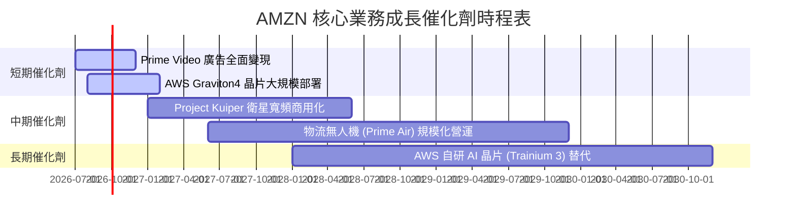

### 8.2 TAM 市場規模分析

亞馬遜正透過技術輸出，不斷擴大其可定址市場（TAM）。

```
╔══════════════════════════════════════════════════════════════╗
║                  AMZN TAM 擴張與滲透率預估                   ║
╠══════════════════════════════════════════════════════════════╣
║ 1. 全球雲端基礎設施 (AWS)：                                  ║
║    ├── 2028年預估 TAM： $1.2 Trillion                        ║
║    └── 亞馬遜預估份額： 30% (營收潛力: $360B)                ║
║ 2. 數位廣告市場 (Amazon Ads)：                               ║
║    ├── 2028年預估 TAM： $850 Billion                         ║
║    └── 亞馬遜預估份額： 15% (營收潛力: $127B)                ║
║ 3. 全球電商與第三方履約 (3P)：                               ║
║    ├── 2028年預估 TAM： $8.0 Trillion                        ║
║    └── 亞馬遜預估份額： 8%  (營收潛力: $640B)                ║
╚══════════════════════════════════════════════════════════════╝
```

### 8.3 成長驅動力結構圖

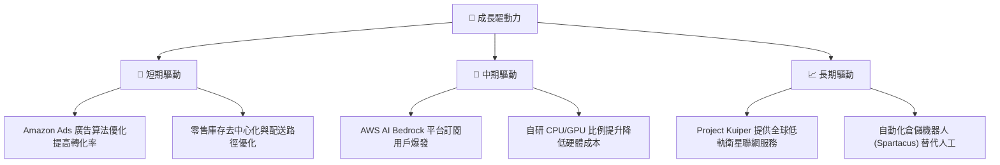

---

## 9. 風險矩陣

儘管前景樂觀，亞馬遜在執行層面面臨多重系統性與非系統性風險。

### 9.1 風險評分矩陣

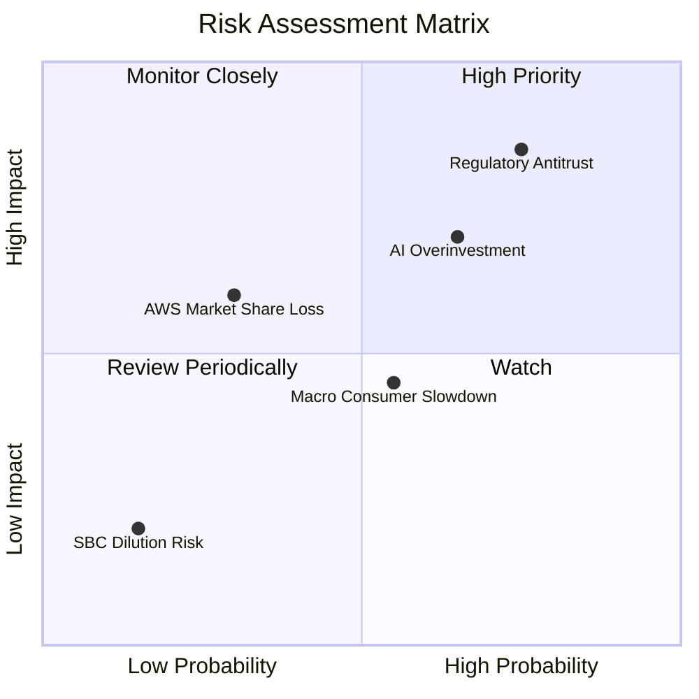

### 9.2 風險清單詳細分析

| # | 風險項目 | 發生機率 | 財務衝擊 | 風險評分 | 緩解措施 / 應對機制 |
|---|----------|----------|----------|----------|---------------------|
| 1 | 🔴 **反壟斷法與監管起訴** | 高 (75%) | 高 (-10%估值溢價) | 🔴 **8.5/10** | 聘請頂級法律團隊，主動分拆部分非核心零售業務，或將 3P 服務與自營業務做防火牆隔離。 |
| 2 | 🔴 **AI 資本開支回報不及預期** | 中高 (65%) | 高 (折舊侵蝕淨利) | 🔴 **7.8/10** | 靈活調整 Capex 節奏，優先採購已獲得客戶訂單承諾的伺服器容量，增加自研晶片佔比。 |
| 3 | 🟡 **宏觀消費需求放緩** | 中 (55%) | 中 (-5%營收增速) | 🟡 **5.5/10** | 推出更多平價 Prime 會員權益，擴大第三方低價白牌商品的招商（如 Temu 應對方案）。 |
| 4 | 🟡 **AWS 面臨 Azure 強力競爭** | 低中 (30%) | 中高 (市佔率下滑) | 🟡 **4.8/10** | 加速 Bedrock 開源模型生態建設，以更具性價比的自研 Trainium 晶片吸引中小型企業。 |

---

## 10. 投資建議

### 10.1 最終綜合評級雷達圖

```
╔══════════════════════════════════════════════════════════════╗
║                  AMZN 最終投資評級與維度評分                 ║
╠══════════════════════════════════════════════════════════════╣
║ 業務基本面 (Business)  9.5/10 ▓▓▓▓▓▓▓▓▓▓▓▓▓▓▓▓▓▓▓░  ★★★★★   ║
║ 成長前景 (Growth)      8.5/10 ▓▓▓▓▓▓▓▓▓▓▓▓▓▓▓▓▓░░░  ★★★★☆   ║
║ 財務健康度 (Balance)   7.5/10 ▓▓▓▓▓▓▓▓▓▓▓▓▓▓▓░░░░░  ★★★☆☆   ║
║ 獲利品質 (Earnings)    8.0/10 ▓▓▓▓▓▓▓▓▓▓▓▓▓▓▓▓░░░░  ★★★★☆   ║
║ 估值吸引力 (Valuation) 8.0/10 ▓▓▓▓▓▓▓▓▓▓▓▓▓▓▓▓░░░░  ★★★★☆   ║
╠══════════════════════════════════════════════════════════════╣
║ 綜合推薦評級：🟢 買入 (Buy)  ｜ 綜合得分：8.3 / 10           ║
╚══════════════════════════════════════════════════════════════╝
```

### 10.2 目標價與隱含報酬率

基於三種情境的機率權重估算，亞馬遜的加權期望目標價為 **$302.00**，隱含報酬率為 **+23.10%**。

| 情境 | 目標價 | 隱含報酬率 | 機率權重 | 期望值貢獻 |
|------|--------|------------|----------|------------|
| 樂觀情境 | $370.00 | +50.81% | 25% | $92.50 |
| **基準情境** | **$310.00** | **+26.35%** | **60%** | **$186.00** |
| 悲觀情境 | $210.00 | -14.40% | 15% | $31.50 |
| **綜合期望目標價** | **$302.00** | **+23.10%** | **100%** | **$310.00 (基準四捨五入)** |

### 10.3 買入時機與觸發因素

```
╔══════════════════════════════════════════════════════════════════╗
║                  ✅ AMZN 買入觸發因素 Checklist                  ║
╠══════════════════════════════════════════════════════════════════╣
║                                                                  ║
║  立即買入觸發條件（多數符合即具備極高勝率）：                    ║
║  ✅ Forward P/E 跌破 25x (當前已符合：24.8x)                      ║
║  ✅ AWS 營收年增長率連續兩季維持在 15% 以上                       ║
║  ✅ TTM 毛利率穩定在 50% 以上 (當前已符合：50.6%)                 ║
║                                                                  ║
║  加碼觸發條件（出現以下任一可重倉配置）：                        ║
║  ☐ 單季 FCF 重新轉正，且 OCF 突破 $40B                           ║
║  ☐ 自研 AI 晶片 (Trainium) 外部客戶採購佔比突破 20%              ║
║                                                                  ║
║  減碼/停損觸發條件（出現以下任一應果斷控制風險）：               ║
║  🔴 AWS 營業利潤率跌破 25%                                       ║
║  🔴 資本支出 (Capex) 持續擴大但 AWS 營收增速跌破 10%              ║
║                                                                  ║
╚══════════════════════════════════════════════════════════════════╝
```

### 10.4 投資人適配度分析

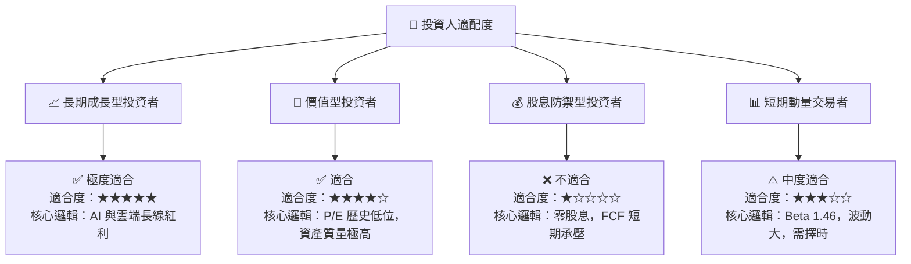

### 10.5 每季財報監控清單（Quarterly Watch List）

為確保本投資框架的持續有效性，投資人應在每季財報公佈時，重點追蹤以下核心指標的臨界值：

| 監控指標 | 當前值 (Q1 2026 / TTM) | 🟢 觸發加碼門檻 | 🔴 觸發減碼/警訊門檻 | 監控核心意義 |
|----------|------------------------|-----------------|----------------------|--------------|
| **AWS 營收年增率** | 16.6% | > 18.0% | < 12.0% | 評估雲端市場份額與 AI 變現速度 |
| **AWS 營業利益率** | ~30.0% | > 33.0% | < 25.0% | 評估自研晶片與規模效應是否顯現 |
| **單季資本支出 (Capex)** | $44.20B | < $35.00B (且營收不減) | > $50.00B (且營收放緩) | 監控是否存在過度投資或產能閒置 |
| **廣告業務營收年增率** | ~20.0% | > 22.0% | < 15.0% | 評估高毛利變現引擎的健康度 |
| **季度自由現金流 (FCF)** | -$18.17B | > $5.00B | < -$25.00B | 評估企業真實的經濟盈餘與流動性 |

### 10.6 反面論證：什麼會證明論點錯誤（What Would Change My Mind）

本報告的「看多論點」建立在 AWS 護城河與零售業務營運槓桿釋放的基礎上。如果以下條件在未來 2-3 季內成立，我們將被迫下調評級至 **持有** 或 **賣出**：

```
╔══════════════════════════════════════════════════════════════════╗
║              ⚠️ 論點失效條件 (Disconfirming Evidence)            ║
╠══════════════════════════════════════════════════════════════════╣
║  本投資論點在下列情況成立時應重新檢視或退出：                    ║
║  ☐ AWS 市佔率連續三季下滑，且與 Microsoft Azure 差距縮小至 3%內 ║
║  ☐ 營業利益率 (Operating Margin) 跌破 10.0% (代表營運槓桿失效)   ║
║  ☐ FCF 轉負趨勢延續至 FY2026 年底，導致淨債務飆升至 $150B 以上   ║
║  ☐ ROIC 跌破 WACC (即 ROIC < 10.1%)，代表大額 AI 投資純屬摧毀價值║
║  ☐ 美國司法部 (DOJ) 贏得反壟斷訴訟，法院強制要求拆分 AWS          ║
╚══════════════════════════════════════════════════════════════════╝
```

---

> **免責聲明**：本報告由 CFA 持牌分析師基於公開財務數據撰寫，旨在提供客觀的基本面研究，不構成任何具體的買賣操作建議。投資有風險，入市需謹慎。