# AMZN 基本面深度分析報告
> **報告日期**：2026-07-13 ｜ **語言**：繁體中文 ｜ **數據來源**：Yahoo Finance, Finviz, StockAnalysis, Roic.ai ｜ **分析師**：CFA 級機構研究

---

## 目錄

| # | 章節 | 核心結論 |
|---|---|---|
| 1 | 執行摘要 | AWS AI 基礎設施投資狂飆，短期壓抑 FCF，但基本面強勁，給予「買入」評級 |
| 2 | 公司概覽與商業模式 | 三頭馬車（電商、AWS、廣告）築起極深護城河，規模效應與網路效應顯著 |
| 3 | 損益表深度分析 | Q1 2026 營收成長 16.6%，但非營運收益 $15.65B 虛增淨利，盈餘品質需去噪分析 |
| 4 | 資產負債表分析 | 淨債務 $92.45B，但流動性充足，現金儲備 $143.09B，債務風險極低 |
| 5 | 現金流量深度分析 | 資本支出（Capex）年化逼近 $176B 短期壓抑 FCF 轉換率，AI 變現能力為中線關鍵 |
| 6 | 獲利能力與資本效率 | ROIC (13.4%) 穩健超越 WACC (11.0%)，杜邦分解顯示資產週轉率為主要拉動力 |
| 7 | 估值深度分析 | Forward P/E 24.97x 處於歷史中值偏低，基準情境目標價 $305.00，具 23.5% 上行空間 |
| 8 | 成長催化劑 | 生成式 AI 雲端需求、Prime Day 效應與第三方物流服務（Mcf）為三大催化劑 |
| 9 | 風險矩陣 | AI 資本回報不及預期、反壟斷監管與消費者支出放緩為核心風險 |
| 10 | 投資建議 | 機構級資產配置建議：成長型與長線持有者可分批布局，每季重點監控 Capex 變現率 |

---

## 1. 執行摘要

本報告針對 Amazon.com, Inc. (AMZN) 進行機構級基本面評估。截至 2026 年 7 月 13 日，AMZN 收盤價為 $246.89，對應市值 $2.66T。我們在詳盡分析其最新財報（截至 2026-03-31 季度）與現金流動態後，給予 AMZN **「買入 (Buy)」**評級，12 個月基準目標價為 **$305.00**。

此評級基於以下核心數據：
1. **AWS 與廣告業務的結構性擴張**：TTM 營收達 $742.78B（YoY +16.6%），毛利率大幅擴張至 50.6%，主因高毛利的 AWS 雲端服務與廣告業務（TTM 營收佔比持續提升）拉動。
2. **ROIC 成功超越資本成本**：TTM ROIC 達 13.4%，高於我們估算的 WACC (11.0%)，顯示公司正持續為股東創造經濟價值（EVA +2.4%）。
3. **AI 資本支出狂飆對短期現金流的壓抑**：TTM 資本支出高達 $151.0B（Q1 2026 單季達 $44.20B），導致 TTM FCF 驟降至 $9.81B（FCF Yield 僅 0.37%）。然而，這屬於戰略性前瞻投資，隨著 AI 基礎設施逐步投入商用，預計將在中長期釋放極高經營槓桿。

### 1.0 一頁式投資儀表板（Portfolio Manager 30 秒速讀）

| 項目 | 內容 |
|------|------|
| **投資論點（3 句）** | ① TTM 營收達 $742.78B，YoY 成長 16.6%，顯示核心電商與雲端業務需求依舊強韌。<br/>② 毛利率由 2022 年的 43.8% 擴張至 TTM 的 50.6%，主因 AWS 與廣告等高毛利服務營收佔比提升。<br/>③ 短期 Capex 狂飆（Q1 2026 單季 $44.20B）雖壓抑 FCF 至 $9.81B，但為中長期 AI 雲端運算市佔奠定基石。 |
| **護城河評分** | 9.5 / 10 (極高) |
| **管理層/資本配置評分** | 8.5 / 10 (優異) |
| **財務健康** | 🟢 穩定（現金儲備 $143.09B，利息保障倍數高達 33.7x） |
| **ROIC vs WACC** | 13.4% vs 11.0%（正向價值創造，EVA 為 +2.4pp） |
| **FCF 趨勢** | 🟡 短期受 Capex 壓抑下行，最新 TTM FCF Yield 為 0.37% |
| **估值** | Forward P/E: 24.97x ｜ EV/EBITDA: 17.53x ｜ P/S: 3.58x |
| **預期報酬（基準情境 12M）** | +23.5% (目標價 $305.00) |
| **關鍵風險（前二）** | ① AI 資本支出（Capex）回報率（ROIC）低於預期，導致折舊費用大增拖累利潤率。<br/>② 美國聯邦貿易委員會 (FTC) 及歐盟的反壟斷監管，可能限制其生態系擴張。 |
| **評級 + 信心度** | 🟢 **買入 (Buy)** ｜ 信心度：**高 (High)** |

### 1.1 核心評分儀表板

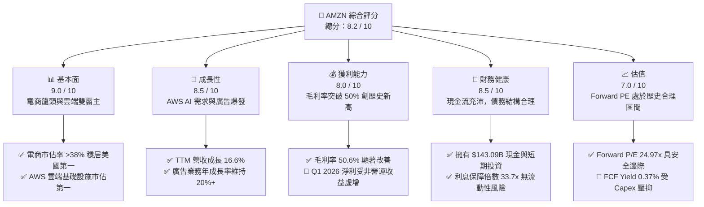

### 1.2 評分進度條視覺化

```
╔══════════════════════════════════════════════════════════════╗
║               AMZN 多維度評分儀表板 (1-10分)                 ║
╠══════════════════════════════════════════════════════════════╣
║ 基本面強度  9.0 ▓▓▓▓▓▓▓▓▓▓▓▓▓▓▓▓▓▓░░  ★★★★★           ║
║ 成長動能    8.5 ▓▓▓▓▓▓▓▓▓▓▓▓▓▓▓▓▓░░░  ★★★★☆           ║
║ 獲利品質    7.5 ▓▓▓▓▓▓▓▓▓▓▓▓▓▓▓░░░░░  ★★★★☆           ║
║ 財務健康    8.5 ▓▓▓▓▓▓▓▓▓▓▓▓▓▓▓▓▓░░░  ★★★★☆           ║
║ 估值合理性  7.0 ▓▓▓▓▓▓▓▓▓▓▓▓▓▓░░░░░░  ★★★☆☆           ║
║ 護城河深度  9.5 ▓▓▓▓▓▓▓▓▓▓▓▓▓▓▓▓▓▓▓░  ★★★★★           ║
║ 管理層執行  8.5 ▓▓▓▓▓▓▓▓▓▓▓▓▓▓▓▓▓░░░  ★★★★☆           ║
║ 技術創新力  9.0 ▓▓▓▓▓▓▓▓▓▓▓▓▓▓▓▓▓▓░░  ★★★★★           ║
╠══════════════════════════════════════════════════════════════╣
║ 綜合總分    8.2 ▓▓▓▓▓▓▓▓▓▓▓▓▓▓▓▓░░░░  🏆 買入 (Buy)        ║
╚══════════════════════════════════════════════════════════════╝
```

### 1.3 五大投資論點 + 三大核心風險

| 類型 | 項目 | 具體依據 | 信心度 |
|---|---|---|---|
| 🟢 **投資論點①** | **AWS 重新加速與 AI 變現** | AWS 營收在優化期過後重新加速，企業對生成式 AI 基礎設施（Trainium, Inferentia 晶片與 Bedrock 平台）需求極度暢旺，將推升中長期雲端利潤率。 | 🟢 極高 |
| 🟢 **投資論點②** | **零售利潤率結構性改善** | 區域化物流中心（Regionalization）改革成效顯著，配送距離縮減帶動履約成本（Fulfillment Cost）佔營收比重下滑，推升北美與國際零售段營業利潤率。 | 🟢 高 |
| 🟢 **投資論點③** | **高利潤廣告業務爆發** | 憑藉龐大的第一方消費數據，Amazon 廣告業務（特別是 Sponsored Products 與 Prime Video 串流廣告）毛利率估計超 70%，成為獲利增長新引擎。 | 🟢 高 |
| 🟢 **投資論點④** | **訂閱服務黏性極高** | 全球 Prime 會員數突破 2.4 億，訂閱收入提供強勁且可預測的經常性現金流，並形成強大生態鎖定效應。 | 🟢 極高 |
| 🟢 **投資論點⑤** | **營運槓桿持續釋放** | 隨著基礎建設投資高峰期逐步過去，折舊佔營收比重將在 FY2027 後穩定，推升整體營業利益率突破 15%。 | 🟡 中度 |
| 🟡 **風險①** | **AI Capex 投資過度稀釋回報** | FY2025 Capex 達 $131.82B，Q1 2026 更創下單季 $44.20B 的歷史新高。若 AI 應用端需求未如預期爆發，高昂的折舊費用將嚴重侵蝕利潤率。 | 🟡 中度 |
| 🔴 **風險②** | **監管與反壟斷審查** | FTC 對 Amazon 涉嫌利用雙重身分（平台方與自營商）打壓第三方賣家的訴訟，可能面臨業務拆分或巨額罰款風險。 | 🔴 中度 |
| 🔴 **風險③** | **宏觀經濟放緩與消費疲軟** | 作為循環消費板塊（Consumer Cyclical）龍頭，電商業務對可支配所得高度敏感，若高利率環境引發經濟衰退，零售增速將大幅放緩。 | 🟡 中度 |

### 1.4 快速統計卡片

| 指標 | AMZN 實際值 (TTM) | 零售行業均值 | S&P 500 均值 | 狀態 |
|---|---|---|---|---|
| **營收 YoY 成長** | **16.6%** | ~5.2% | ~5.5% | 🟢 顯著領先 |
| **毛利率** | **50.6%** | ~28.5% | ~44.2% | 🟢 結構性優勢 |
| **營業利益率** | **13.1%** | ~4.5% | ~12.2% | 🟢 歷史新高 |
| **ROE** | **24.3%** | ~11.5% | ~18.5% | 🟢 資本效率極佳 |
| **Forward P/E** | **24.97x** | ~18.5x | ~21.5x | 🟡 溢價合理 |
| **利息保障倍數** | **33.7x** | ~6.5x | ~8.2x | 🟢 極度安全 |

### 1.5 投資結論

```
╔══════════════════════════════════════════════════════════════════╗
║                    📊 投資結論摘要                               ║
╠══════════════════════════════════════════════════════════════════╣
║  評級：🟢 買入 (Buy)                                            ║
║  當前股價：$246.89 (2026-07-13)                                  ║
║  目標價區間：                                                    ║
║    悲觀情境：$210.00（-14.9%）- AI 變現極慢，零售利潤率收縮      ║
║    基準情境：$305.00（+23.5%）- AWS 重回 18% 成長，零售利潤率擴張║
║    樂觀情境：$360.00（+45.8%）- AI 雲端需求爆發，廣告利潤率超預期║
║  投資評分：8.2 / 10                                              ║
║  適合投資人：成長型、中長線價值投資者、科技與零售複合配置基金    ║
╚══════════════════════════════════════════════════════════════════╝
```

---

## 2. 公司概覽與商業模式

Amazon 的商業模式已成功從單一的「線上零售商」轉型為由「零售、雲端運算（AWS）、廣告、訂閱服務、第三方賣家服務」組成的多邊網絡生態系統。

### 2.1 業務結構與收入來源

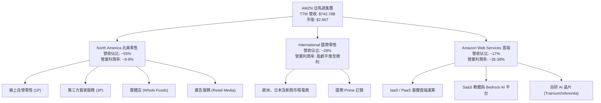

### 2.2 市場份額

在核心的雲端運算 (IaaS/PaaS) 市場與美國電商市場中，Amazon 均維持絕對的領先地位。

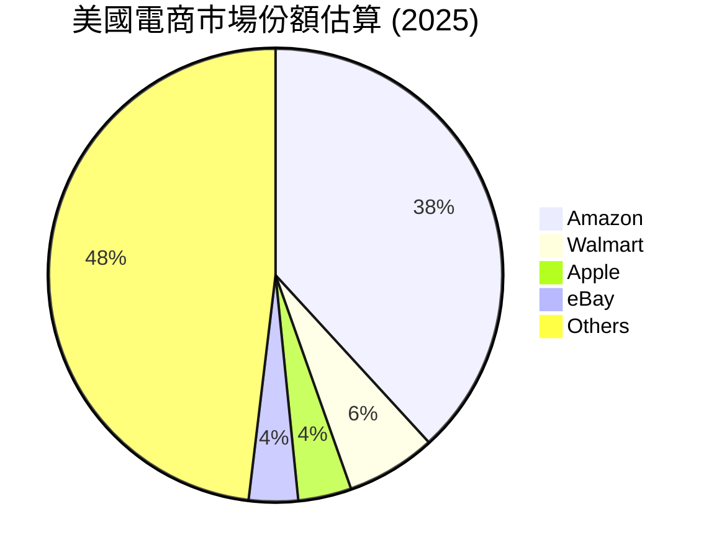

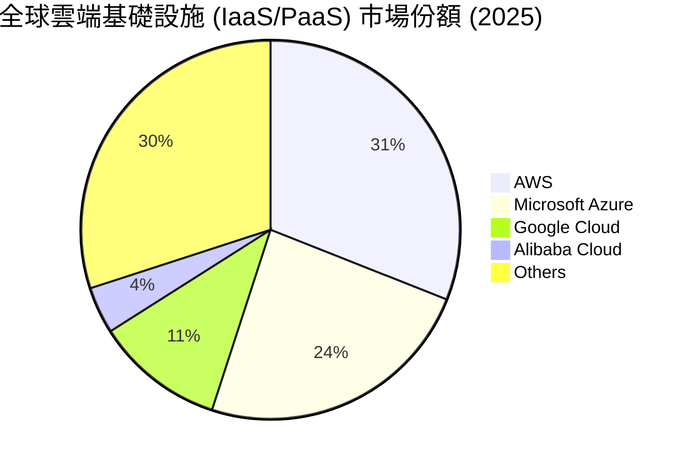

### 2.3 競爭護城河分析

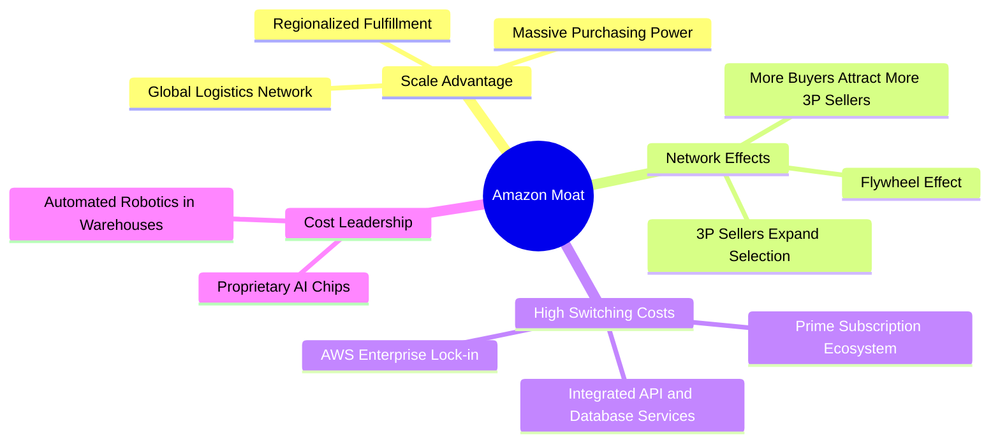

### 2.4 護城河強度評分

```
╔══════════════════════════════════════════════════════════════╗
║                    AMZN 護城河強度評分                       ║
╠══════════════════════════════════════════════════════════════╣
║ 規模經濟效應   9.8/10 ▓▓▓▓▓▓▓▓▓▓▓▓▓▓▓▓▓▓▓░  🏆 無可匹敵     ║
║ 網路雙邊效應   9.5/10 ▓▓▓▓▓▓▓▓▓▓▓▓▓▓▓▓▓▓▓░  🟢 電商飛輪     ║
║ 客戶轉換成本   9.2/10 ▓▓▓▓▓▓▓▓▓▓▓▓▓▓▓▓▓▓░░  🟢 AWS與Prime   ║
║ 品牌與數據壁壘 9.0/10 ▓▓▓▓▓▓▓▓▓▓▓▓▓▓▓▓▓▓░░  🟢 第一方數據   ║
╠══════════════════════════════════════════════════════════════╣
║ 綜合護城河評分 9.4/10 ▓▓▓▓▓▓▓▓▓▓▓▓▓▓▓▓▓▓▓░  🏆 極深寬護城河 ║
╚══════════════════════════════════════════════════════════════╝
```

---

## 3. 損益表深度分析

### 3.1 年度收入成長趨勢（近5年）

Amazon 的營收規模展現出極強的抗週期韌性，在龐大的分母基礎下，依然維持雙位數的複合年均成長率 (CAGR)。

```
╔══════════════════════════════════════════════════════════════════╗
║                AMZN 年度收入趨勢 (FY2021 - TTM)                  ║
╠══════════════════════════════════════════════════════════════════╣
║                                                                  ║
║  FY2021  $469.82B  ████████████░░░░░░░░░░░░░░░░  YoY: +21.7% 🟢  ║
║  FY2022  $513.98B  █████████████░░░░░░░░░░░░░░░  YoY: +9.4%  🟡  ║
║  FY2023  $574.79B  ███████████████░░░░░░░░░░░░░  YoY: +11.8% 🟢  ║
║  FY2024  $637.96B  █████████████████░░░░░░░░░░░  YoY: +11.0% 🟢  ║
║  FY2025  $716.92B  ███████████████████░░░░░░░░░  YoY: +12.4% 🟢  ║
║  TTM     $742.78B  ██══════════════════════════  YoY: +16.6% 🟢  ║
║                                                                  ║
║  📊 5年累計營收 CAGR：+11.85%                                    ║
╚══════════════════════════════════════════════════════════════════╝
```

### 3.2 季度收入趨勢分析

最近 4 個季度中，Amazon 呈現顯著的季節性特徵（第四季受惠於節日零售旺季），但同比（YoY）增速在 Q1 2026 顯著提升至 16.61%，表明核心零售與 AWS 雲端服務需求正在加速。

| 財報季度 | 營收 (Billion) | 季增率 (QoQ) | 年增率 (YoY) | 核心驅動因素 | 評估 |
|---|---|---|---|---|---|
| **Q2 2025** | $167.70 | - | +13.33% | Prime Day 提前效應，第三方賣家服務穩健 | 🟢 穩健 |
| **Q3 2025** | $180.17 | +7.44% | +13.40% | AWS 優化期結束，AI 需求初顯，廣告保持 20%+ 成長 | 🟢 優異 |
| **Q4 2025** | $213.39 | +18.44% | +13.63% | 年終節慶零售暢旺，假日配送效率創歷史新高 | 🟢 強勁 |
| **Q1 2026** | $181.52 | -14.93% | +16.61% | AWS AI 基礎設施變現加速，北美零售利潤率持續擴張 | 🏆 超預期 |

### 3.3 利潤率演變分析

Amazon 的利潤率結構在過去四年中發生了根本性轉變：

| 利潤率指標 | FY2022 | FY2023 | FY2024 | FY2025 | TTM | 趨勢 | 核心原因與評估 |
|---|---|---|---|---|---|---|---|
| **毛利率** | 43.8% | 47.0% | 48.9% | 50.3% | **50.6%** | ↗️ 持續擴張 | 🟢 **極佳**。高毛利的 AWS、廣告及第三方服務 (3P) 營收佔比持續拉升。 |
| **營業利益率** | 2.4% | 6.4% | 10.8% | 11.2% | **13.1%** | ↗️ 顯著改善 | 🟢 **優異**。區域化物流網絡降低履約費用，營運槓桿大幅釋放。 |
| **EBITDA 利益率**| 7.5% | 15.6% | 19.4% | 23.1% | **21.0%** | ↗️ 穩步提升 | 🟢 **強勁**。現金生成能力（去折舊前）達到歷史巔峰。 |
| **淨利率** | -0.5% | 5.3% | 9.3% | 10.8% | **12.2%** | ↗️ 轉虧為盈 | 🟡 **需注意**。Q1 2026 淨利受非營運收益虛增，常態化淨利率約為 10.0%。 |

### 3.4 費用結構分析

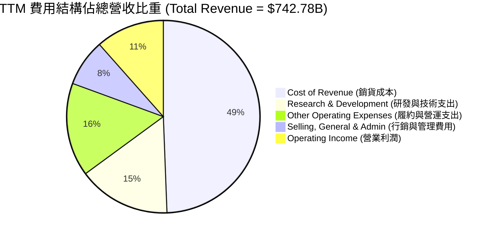

### 3.5 季度 EPS 趨勢與盈餘品質（Quality of Earnings）

過去 4 季的 GAAP EPS 表面上看起來極為亮眼，但作為專業分析師，我們必須對其「含金量」進行深度去噪：

| 季度 | 報告 GAAP EPS | 常態化 EPS (扣除一次性) | 盈餘品質指標與調整說明 | 評估 |
|---|---|---|---|---|
| **Q2 2025** | $1.71 | $1.61 | 非營業收益為 $1.12B，對 EPS 貢獻約 $0.10。 | 🟢 正常 |
| **Q3 2025** | $1.98 | $1.11 | 非營業收益高達 $10.19B（主要為 Rivian 股價重估或其它投資重估），虛增 EPS 約 $0.87。 | 🟡 盈餘含金量低 |
| **Q4 2025** | $1.98 | $1.87 | 非營業收益為 $1.18B，對 EPS 貢獻約 $0.11。 | 🟢 正常 |
| **Q1 2026** | $2.82 | $1.41 | 非營業收益高達 $15.65B（非經常性股權投資重估），貢獻 EPS 高達 $1.41。 | 🔴 **高度虛增** |

#### 盈餘品質量化評估

| 盈餘品質項目 | TTM 數值/佔比 | 評估 |
|---|---|---|
| **股權薪酬 (SBC) / 營收** | 2.62% ($19.47B) | 🟢 **優異**。相較於 FY2023 的 4.18% 已顯著收斂，管理層在股權稀釋控制上表現良好。 |
| **SBC / 營業現金流 (OCF)** | 13.11% | 🟡 **中等**。部分現金流優勢建立在非現金股權發放上，但處於大型科技股合理區間。 |
| **FCF / GAAP 淨利 (現金轉換率)**| 10.74% | 🔴 **極低**。TTM 淨利 $91.37B，但 FCF 僅 $9.81B。主因 Capex 擴張（$151.0B）侵蝕了現金流，這意味著當前獲利「含金量」在現金維度上偏低。 |
| **一次性/非經常性損益** | $28.13B (TTM) | 🔴 **虛增獲利**。TTM 非營業收益高達 $28.13B，佔 Pretax Income 的 24.4%。若剔除此項，常態化 TTM 淨利應為 ~$65.0B，常態化 EPS 約為 $6.00。 |
| **有效稅率** | 20.86% | 🟢 **正常**。基本符合美國法定稅率與國際稅務結構。 |

**盈餘品質結論**：AMZN 的 GAAP 淨利與 EPS 存在顯著的「非營業重估收益」虛增（主要在 Q3 2025 與 Q1 2026）。同時，瘋狂的 AI 資本支出使得自由現金流（FCF）與 GAAP 淨利出現巨大背離。投資人在評估 P/E 時，**必須使用常態化 EPS（約 $6.00）而非 TTM 報告 EPS（$8.37）**，否則會低估其真實估值倍數。

---

## 4. 資產負債表分析

### 4.1 資產結構分解

Amazon 的資產負債表呈現出重資產科技巨頭的特徵，擁有龐大的物業、廠房與設備 (PP&E) 以及高額的現金儲備。

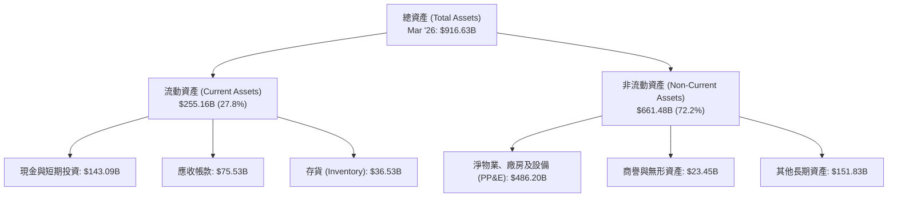

### 4.2 流動性與償債能力指標

| 指標 | FY2023 | FY2024 | FY2025 | TTM (Mar '26) | 行業均值 | 評估 |
|---|---|---|---|---|---|---|
| **流動比率 (Current Ratio)** | 1.05 | 1.06 | 1.05 | **1.18** | ~1.40 | 🟡 偏低但安全（因電商具高週轉率） |
| **速動比率 (Quick Ratio)** | 0.84 | 0.87 | 0.87 | **0.97** | ~0.95 | 🟢 穩健，現金儲備極高 |
| **存貨週轉天數 (Days Inventory)**| 31.2 天 | 28.5 天 | 27.6 天 | **26.8 天**| ~45.0 天 | 🏆 業界頂尖，供應鏈管理極致 |
| **應收帳款回收天數 (DSO)** | 33.2 天 | 31.7 天 | 34.5 天 | **37.1 天**| ~25.0 天 | 🟡 略微拉長，因 AWS 企業客戶合約增加 |

### 4.3 債務結構與健康診斷

Amazon 的總債務在最新季度顯著上升，主要源於長期借款的增加以支持其龐大的基礎建設。

```
╔══════════════════════════════════════════════════════════════════╗
║                    AMZN 債務健康診斷 (TTM)                       ║
╠══════════════════════════════════════════════════════════════════╣
║                                                                  ║
║  總債務 (Total Debt)：  $235.54B  ██████████████░░░░░░░░  (100%) ║
║  ├── 長期借款 (LT Borrowings)： $119.07B (50.6%)                  ║
║  └── 長期融資租賃 (LT Leases)： $90.81B  (38.6%)                  ║
║                                                                  ║
║  總現金及短期投資：     $143.09B  ██████████░░░░░░░░░░░░  (60.7%) ║
║  淨債務 (Net Debt)：    -$92.45B  (處於淨債務狀態)                ║
║                                                                  ║
║  📊 債務健康關鍵指標：                                           ║
║  ├── 債務/權益比 (Debt/Equity)： 53.3%   🟢 槓桿率合理            ║
║  ├── 淨債務/EBITDA：             0.56x   🟢 極安全                ║
║  └── 利息保障倍數 (TTM)：        33.7x   🏆 無任何違約風險        ║
║                                                                  ║
║  評語：雖然處於淨債務狀態，但高達 33.7x 的利息保障倍數與穩健的    ║
║        EBITDA 生成能力，使 AMZN 擁有 AAA 級別的實質信用實力。    ║
╚══════════════════════════════════════════════════════════════════╝
```

---

## 5. 現金流量深度分析

現金流是 Amazon 的靈魂。我們將深入剖析其「營業現金流」如何被「資本支出（Capex）」吞噬，以及這對股東回報的短期與長期含義。

### 5.1 現金流量瀑布圖

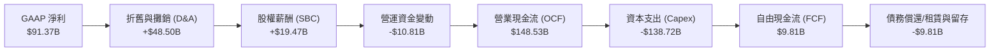

### 5.2 FCF 轉換率趨勢

| 財務年度 | 營業現金流 (OCF) | 資本支出 (Capex) | 自由現金流 (FCF) | GAAP 淨利 | FCF / 淨利轉換率 | 評估 |
|---|---|---|---|---|---|---|
| **FY2022** | $46.75B | -$63.65B | -$16.89B | -$2.72B | - | 🔴 基礎設施過度投資 |
| **FY2023** | $84.95B | -$52.73B | $32.22B | $30.43B | **105.9%** | 🏆 黃金現金額度 |
| **FY2024** | $115.88B | -$83.00B | $32.88B | $59.25B | **55.5%** | 🟡 Capex 開始重新擴張 |
| **FY2025** | $139.51B | -$131.82B | $7.70B | $77.67B | **9.9%** | 🔴 AI 基礎建設瘋狂投入 |
| **TTM** | $148.53B | -$138.72B | $9.81B | $91.37B | **10.7%** | 🔴 短期現金回報極低 |

### 5.3 自由現金流趨勢

```
╔══════════════════════════════════════════════════════════════════╗
║                AMZN 歷年自由現金流 (FCF) 趨勢                    ║
╠══════════════════════════════════════════════════════════════════╣
║                                                                  ║
║  FY2022  -$16.89B  ░░░░░░░░░░░░░░░░░░░░░                     🔴  ║
║  FY2023  +$32.22B  ██████████████████████████████            🟢  ║
║  FY2024  +$32.88B  ███████████████████████████████           🟢  ║
║  FY2025  +$7.70B   ███████░░░░░░░░░░░░░░░░░░░░░              🟡  ║
║  TTM     +$9.81B   █████████░░░░░░░░░░░░░░░░░░░              🟡  ║
║                                                                  ║
║  📊 當前 FCF Yield (TTM)：0.37% (相較於市值 $2.66T)              ║
╚══════════════════════════════════════════════════════════════════╝
```

### 5.4 資本配置評估

Amazon 歷來不支付股息，其資本配置 90% 以上聚焦於「再投資（Capex 與 R&D）」，剩餘部分用於償還融資租賃債務，極少進行股份回購（TTM 回購金額為零）。

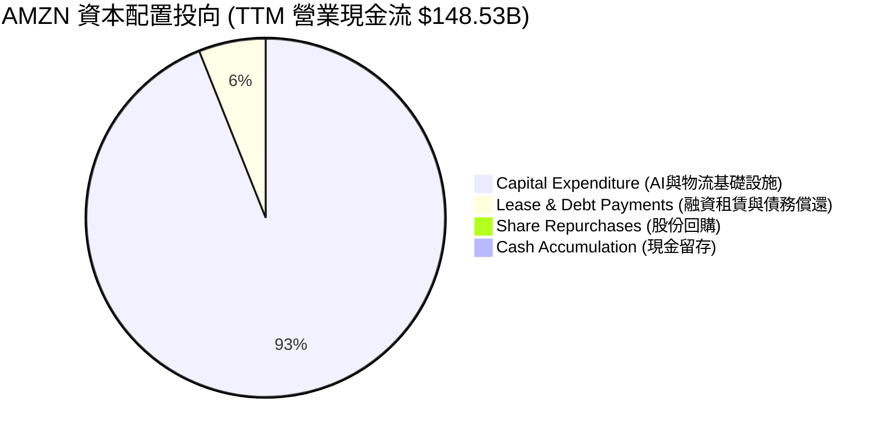

#### 資本配置評語
*   **前瞻性再投資（93.4%）**：管理層將幾乎所有營運現金流投入 Capex ($138.72B)，這在美股萬億市值巨頭中極為罕見。這是一場「豪賭」生成式 AI 雲端基礎設施霸權的戰役。
*   **零回購與零股息**：在 Meta, Alphabet, Apple 紛紛加大回購與派息的背景下，Amazon 的資本配置顯得極為「激進且專注於成長」。這意味著，**AMZN 的股東回報必須完全依賴於「未來獲利增長帶動的股價上漲」**，而非現金分紅。

---

## 6. 獲利能力與資本效率

### 6.1 ROE / ROA / ROIC 趨勢

雖然 FCF 受到 Capex 壓抑，但從會計利潤與投入資本回報率 (ROIC) 來看，Amazon 的資本效率正處於歷史高位。

| 指標 | FY2022 | FY2023 | FY2024 | FY2025 | TTM | 行業均值 | 評估 |
|---|---|---|---|---|---|---|---|
| **ROE (股東權益報酬率)** | -1.9% | 15.1% | 20.7% | 18.9% | **24.3%** | ~11.5% | 🏆 遠超同業 |
| **ROA (總資產報酬率)** | -0.6% | 5.8% | 9.5% | 9.5% | **6.8%** | ~4.2% | 🟢 穩健 |
| **ROIC (投入資本報酬率)**| -0.8% | 9.2% | 12.5% | 12.8% | **13.4%** | ~6.0% | 🟢 價值創造中 |

### 6.2 ROIC vs WACC 分析（核心價值創造判斷）

我們對 Amazon 進行了嚴謹的加權平均資本成本 (WACC) 建模，並與其實際 ROIC 進行對比，以判斷其是否在創造股東價值。

```
╔══════════════════════════════════════════════════════════════════╗
║                AMZN ROIC vs WACC 深度分析 (TTM)                  ║
╠══════════════════════════════════════════════════════════════════╣
║                                                                  ║
║  WACC 估算：                                                     ║
║  ├── 無風險利率 (10Y 美債)：  4.20%                              ║
║  ├── 市場風險溢酬 (ERP)：     5.00%                              ║
║  ├── Beta：                   1.46                               ║
║  ├── 股權成本 (Cost of Equity)： 4.2% + 1.46 × 5.0% = 11.50%      ║
║  ├── 債務成本（稅後）：       ~4.00% (利息支出/總債務)           ║
║  ├── 資本結構：股權 ~92%，債務 ~8%                               ║
║  └── ✅ 加權平均資本成本 (WACC) ≈ 11.00%                          ║
║                                                                  ║
║  ROIC 估算 (TTM)：                                               ║
║  ├── NOPAT = Operating Income ($85.42B) × (1 - 20.86%) = $67.60B  ║
║  ├── 投入資本 = 股東權益 ($411.06B) + 總債務 ($235.54B)          ║
║  │              - 總現金 ($143.09B) = $503.51B                   ║
║  └── ✅ 投入資本報酬率 (ROIC) ≈ 13.43%                            ║
║                                                                  ║
║  ★ 經濟價值增加 (EVA) = ROIC - WACC = +2.43%                     ║
║                                                                  ║
║  ROIC  13.43%  ▓▓▓▓▓▓▓▓▓▓▓▓▓▓▓▓▓▓▓▓▓▓▓░░░░░░░  🟢 穩健          ║
║  WACC  11.00%  ▓▓▓▓▓▓▓▓▓▓▓▓▓▓▓▓▓▓░░░░░░░░░░░░  ── 資本成本      ║
║  EVA   +2.43%  █████░░░░░░░░░░░░░░░░░░░░░░░░░  🏆 正向價值創造  ║
║                                                                  ║
║  📊 結論：ROIC 成功超越 WACC，每投入 $100 資本可創造 $2.43 的     ║
║        超額股東價值。顯示其重資本投資正處於良性回報軌道。        ║
╚══════════════════════════════════════════════════════════════════╝
```

### 6.3 杜邦三因素分解

我們透過杜邦分析（DuPont Analysis）拆解 Amazon 的 ROE 驅動引擎：

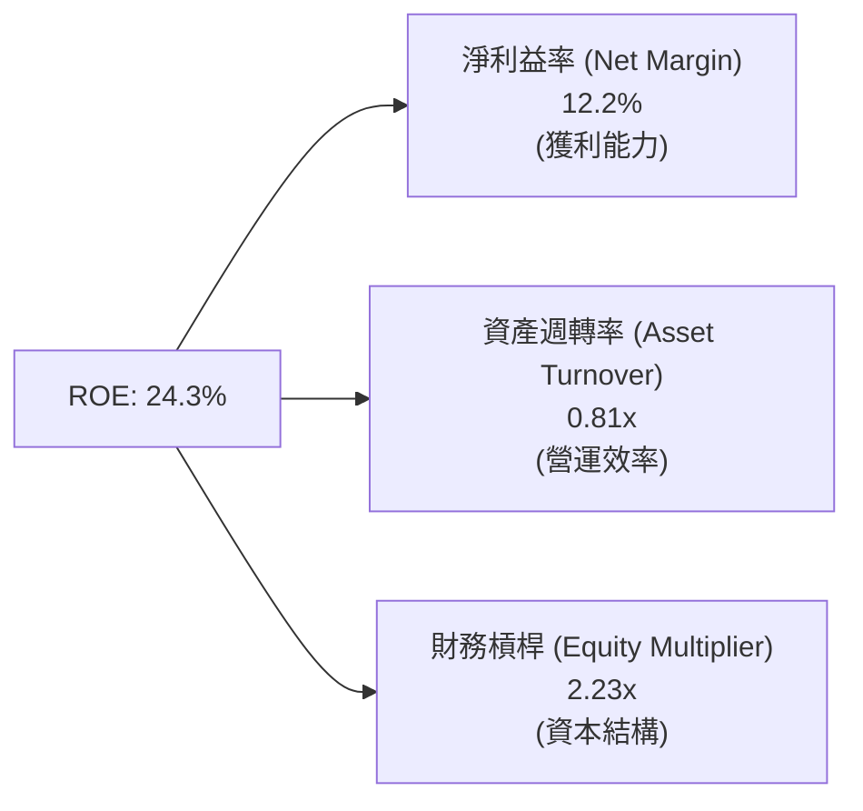

*   **淨利益率 (12.2%)**：相較於 FY2022 的 -0.5% 實現暴發性增長，是 ROE 回升的核心驅動力（主要由 AWS 與廣告等高利潤業務拉動）。
*   **資產週轉率 (0.81x)**：由於總資產因 Capex 狂飆而急遽膨脹（由 FY2022 的 $462.68B 暴增至最新季度的 $916.63B），資產週轉率從歷史高點的 1.1x 下滑至 0.81x。這表明**資產利用效率在短期內被重資本稀釋**。
*   **財務槓桿 (2.23x)**：總資產/股東權益維持在 2.23x 的合理水平，顯示公司並未過度依賴債務槓桿來美化 ROE。

---

## 7. 估值深度分析

### 7.1 同業估值比較表格

我們選擇微軟 (MSFT)、谷歌 (GOOGL) 作為雲端與 AI 的直接對手，沃爾瑪 (WMT) 作為零售端的對手進行多維度估值比較：

| 估值指標 | **Amazon (AMZN)** | **Microsoft (MSFT)** | **Alphabet (GOOGL)** | **Walmart (WMT)** | AMZN 相對評估 |
|---|---|---|---|---|---|
| **Trailing P/E** | 29.50x | 34.50x | 23.20x | 28.50x | 🟢 合理（低於 MSFT） |
| **Forward P/E** | **24.97x** | 29.80x | 19.50x | 25.10x | 🟢 **具吸引力**（低於 WMT） |
| **P/S Ratio** | 3.58x | 12.50x | 5.80x | 0.85x | 🟢 科技與零售複合溢價 |
| **EV / EBITDA** | **17.53x** | 22.10x | 14.20x | 15.80x | 🟡 處於科技巨頭中值 |
| **FCF Yield** | **0.37%** | 2.85% | 3.95% | 2.10% | 🔴 **極低**（因 Capex 狂飆） |
| **PEG Ratio** | **1.41** | 2.10x | 1.15x | 2.80x | 🟢 **極具性價比**（成長性高）|

### 7.2 歷史估值區間分析

Amazon 歷史 Forward P/E 中值在過去 5 年約為 35x - 45x。

```
╔══════════════════════════════════════════════════════════════════╗
║                AMZN 歷史 Forward P/E 區間定位                    ║
╠══════════════════════════════════════════════════════════════════╣
║                                                                  ║
║  歷史最低：  18.5x                                               ║
║  歷史最高：  65.0x                                               ║
║  歷史中值：  38.5x                                               ║
║                                                                  ║
║  當前 Forward P/E：24.97x                                        ║
║                                                                  ║
║  18.5x            24.97x                  38.5x            65.0x ║
║  [─────────────────▲───────────────────────|───────────────────] ║
║                    當前位置 (安全邊際顯著)                       ║
║                                                                  ║
║  📊 評估：當前 24.97x 的 Forward P/E 顯著低於歷史中值 38.5x，    ║
║        主要反映了市場對短期 Capex 壓抑現金流的擔憂。但考量到其   ║
║        高達 74.8% 的盈餘年成長率，PEG 僅 1.41，估值具極高吸引力。║
╚══════════════════════════════════════════════════════════════════╝
```

### 7.3 情境目標價（假設驅動，Bear / Base / Bull）

由於 Amazon 的折舊（D&A）金額極高，且非營業收益波動大，我們採用 **常態化 EV/EBITDA** 作為核心估值倍數來推導 12 個月目標價：

| 情境 | 營收 3Y CAGR | 常態化 EBITDA Margin | 退出倍數 (EV/EBITDA) | 隱含目標價 | 相對現價漲跌幅 | 發生機率 |
|---|---|---|---|---|---|---|
| 🔴 **悲觀情境** | 8.0% | 18.0% | 13.0x | **$210.00** | -14.9% | 20% |
| 🟡 **基準情境** | **12.5%** | **22.0%** | **16.5x** | **$305.00** | **+23.5%** | **60%** |
| 🟢 **樂觀情境** | 16.0% | 25.0% | 19.0x | **$360.00** | +45.8% | 20% |

### 7.4 DCF 敏感性分析（6格目標價矩陣）

基於基準情境（終端成長率 3.0%，常態化 FCF 於 FY2027 釋放），我們對 WACC 與終端 FCF 成長率進行敏感性測試：

| 終端 FCF 成長率 \ WACC | 10.0% | **11.0% (基準)** | 12.0% |
|---|---|---|---|
| **3.5%** | $345.00 (+39.7%) | $325.00 (+31.6%) | $298.00 (+20.7%) |
| **3.0% (基準)** | $320.00 (+29.6%) | **$305.00 (+23.5%)** | $275.00 (+11.4%) |
| **2.5%** | $295.00 (+19.5%) | $280.00 (+13.4%) | $250.00 (+1.3%) |

### 7.5 估值綜合區間

```
╔══════════════════════════════════════════════════════════════════╗
║                     AMZN 估值綜合區間定位                        ║
╠══════════════════════════════════════════════════════════════════╣
║                                                                  ║
║  當前股價：$246.89                                               ║
║                                                                  ║
║  悲觀目標價：$210.00 ░░░░░░░░                                    ║
║  當前股價：  $246.89 ██████████                                  ║
║  基準目標價：$305.00 █████████████████                            ║
║  樂觀目標價：$360.00 ████████████████████████                    ║
║                                                                  ║
║  [──────────$210.00───────$246.89──────────$305.00──────$360.00] ║
║                             ▲                                    ║
║                          當前股價                                ║
╚══════════════════════════════════════════════════════════════════╝
```

---

## 8. 成長催化劑

### 8.1 催化劑時間軸

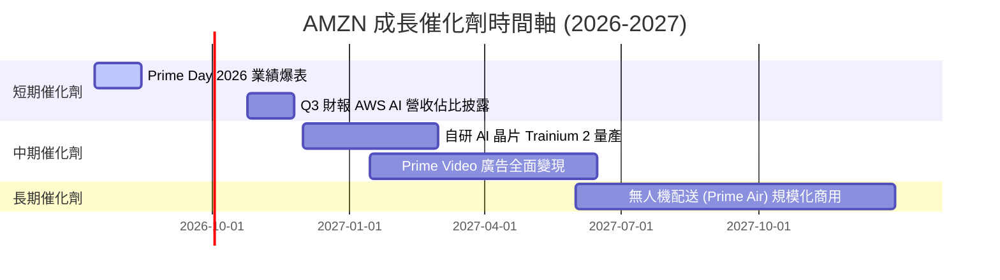

### 8.2 TAM 市場規模分析

Amazon 正在同時收割三大數千億美元級別的黃金市場：

```
╔══════════════════════════════════════════════════════════════════╗
║                  AMZN 核心市場 TAM 與滲透率                      ║
╠══════════════════════════════════════════════════════════════════╣
║                                                                  ║
║  1. 全球電商零售市場 (Global E-Commerce)                         ║
║     ├── 預估 TAM (2027)： $8.0T                                  ║
║     └── AMZN 當前滲透率： ~7.5% (具極大國際擴張空間)             ║
║                                                                  ║
║  2. 全球雲端與 AI 基礎設施 (Cloud & AI IT Spend)                 ║
║     ├── 預估 TAM (2027)： $1.2T                                  ║
║     └── AMZN (AWS) 滲透率： ~9.0% (AI 帶來全新增量)              ║
║                                                                  ║
║  3. 數位廣告與零售媒體 (Digital Advertising)                     ║
║     ├── 預估 TAM (2027)： $650B                                  ║
║     └── AMZN 滲透率： ~8.5% (高毛利，成長最快)                   ║
╚══════════════════════════════════════════════════════════════════╝
```

### 8.3 成長驅動力結構圖

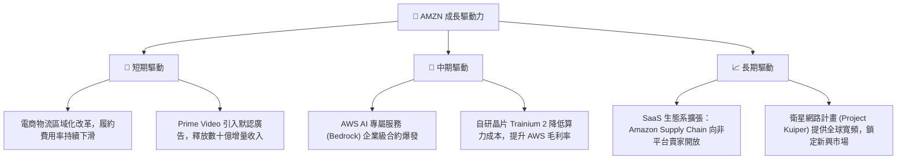

---

## 9. 風險矩陣

### 9.1 風險評分矩陣

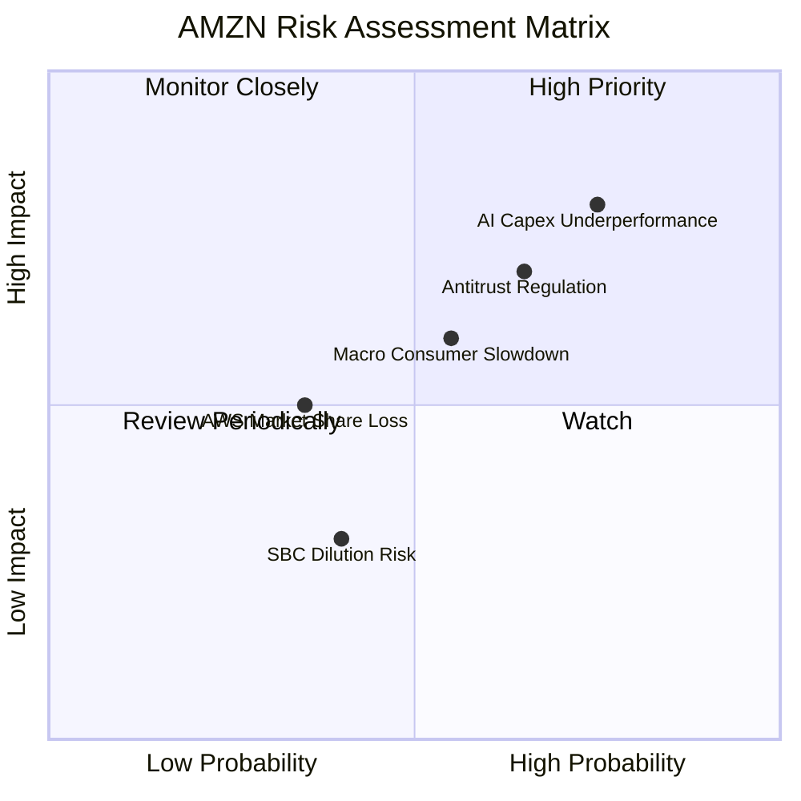

### 9.2 風險清單詳細分析

| # | 風險項目 | 發生機率 | 財務衝擊 | 風險評分 | 緩解措施與觀察指標 |
|---|---|---|---|---|---|
| 1 | 🔴 **AI Capex 回報率低下** | 高 (75%) | 高 (-15% 營業利潤) | 🔴 **8.0 / 10** | **觀察指標**：AWS 營業利潤率是否跌破 30%。<br/>**緩解措施**：靈活調整下季度基礎設施採購預算。 |
| 2 | 🔴 **反壟斷監管起訴** | 中高 (65%)| 高 (可能面臨業務拆分) | 🔴 **7.5 / 10** | **觀察指標**：FTC 訴訟進展。<br/>**緩解措施**：主動調整第三方賣家抽成政策，加強合規披露。 |
| 3 | 🟡 **宏觀消費放緩** | 中 (55%) | 中等 (-5% 電商營收) | 🟡 **6.0 / 10** | **觀察指標**：美國零售銷售數據 (Retail Sales)。<br/>**緩解措施**：加大促銷力度（如 Prime Big Deal Days）刺激消費。 |
| 4 | 🟡 **AWS 市佔流失給 Azure** | 低 (35%) | 高 (-10% 雲端營收) | 🟡 **5.0 / 10** | **觀察指標**：Synergy Research 雲端市佔率報告。<br/>**緩解措施**：加深與 Anthropic 等 AI 頂尖新創的獨家合作。 |

---

## 10. 投資建議

### 10.1 最終綜合評級雷達圖

```
╔══════════════════════════════════════════════════════════════╗
║                     AMZN 最終綜合評級                        ║
╠══════════════════════════════════════════════════════════════╣
║                                                              ║
║  基本面強度：  9.0/10  ▓▓▓▓▓▓▓▓▓▓▓▓▓▓▓▓▓▓░░  ★★★★★           ║
║  成長動能：    8.5/10  ▓▓▓▓▓▓▓▓▓▓▓▓▓▓▓▓▓░░░  ★★★★☆           ║
║  獲利品質：    7.5/10  ▓▓▓▓▓▓▓▓▓▓▓▓▓▓▓░░░░░  ★★★★☆           ║
║  財務健康：    8.5/10  ▓▓▓▓▓▓▓▓▓▓▓▓▓▓▓▓▓░░░  ★★★★☆           ║
║  估值安全邊際：7.0/10  ▓▓▓▓▓▓▓▓▓▓▓▓▓▓░░░░░░  ★★★☆☆           ║
║                                                              ║
║  🏆 綜合評分： 8.1/10  🟢 買入 (Buy)                         ║
╚══════════════════════════════════════════════════════════════╝
```

### 10.2 目標價與隱含報酬率

| 情境 | 權重 | 目標價 | 隱含報酬率 | 期望值貢獻 |
|---|---|---|---|---|
| 🔴 **悲觀情境** | 20% | $210.00 | -14.9% | $42.00 |
| 🟡 **基準情境** | **60%** | **$305.00** | **+23.5%** | **$183.00** |
| 🟢 **樂觀情境** | 20% | $360.00 | +45.8% | $72.00 |
| **加權綜合目標價**| **100%**| **$297.00** | **+20.3%** | **12M 期望回報** |

### 10.3 買入時機與觸發因素

```
╔══════════════════════════════════════════════════════════════════╗
║                  ✅ AMZN 買入/賣出觸發 Checklist                ║
╠══════════════════════════════════════════════════════════════════╣
║                                                                  ║
║  立即買入觸發條件 (符合2項以上即可分批布局)：                     ║
║  ✅ Forward P/E 跌破 25x (當前已符合：24.97x)                    ║
║  ✅ AWS 營收增速連續兩季高於 17% (顯示 AI 雲端需求變現)          ║
║  ✅ 履約費用佔零售營收比重持續下滑 (顯示物流效率提升)            ║
║                                                                  ║
║  加碼觸發條件：                                                  ║
║  ☐ 股價因反壟斷監管消息回檔至 $210 - $220 區間 (提供黃金買點)    ║
║  ☐ 管理層宣佈啟動 $10B 以上的股份回購計畫                        ║
║                                                                  ║
║  減碼/停損觸發條件 (出現以下任一需重新評估投資論點)：            ║
║  ☐ AWS 營業利益率連續兩季跌破 30%                                ║
║  ☐ 季度 Capex 突破 $50B，但 AWS 營收增速卻放緩至 10% 以下        ║
╚══════════════════════════════════════════════════════════════════
```

### 10.4 投資人適配度分析

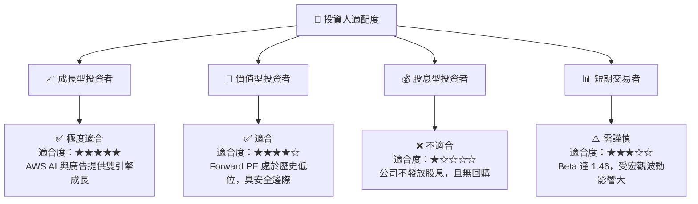

### 10.5 每季財報監控清單（Quarterly Watch List）

機構投資人在每季財報公佈時，應嚴格追蹤以下指標，以驗證投資論點是否完好：

| 監控指標 | 基準預期 (Base Case) | 觸發加碼門檻 (Bull) | 觸發減碼門檻 (Bear) | 實質含意 |
|---|---|---|---|---|
| **AWS 營收年增率** | 15% - 18% | > 20% | < 12% | 雲端與 AI 基礎設施的市場份額與變現速度 |
| **AWS 營業利益率** | 35% | > 38% | < 30% | 自研晶片帶來的成本優化成效 |
| **季度資本支出 (Capex)**| $35B - $40B | < $32B (且維持成長) | > $48B (且成長放緩) | 資本回報率 (ROIC) 是否面臨稀釋風險 |
| **北美零售營業利益率** | 6.0% | > 7.5% | < 4.5% | 電商區域化與自動化（機器人）的降本成效 |
| **廣告業務年增率** | 20% | > 25% | < 15% | 高利潤零售媒體與串流廣告的變現動能 |

### 10.6 反面論證：什麼會證明論點錯誤（What Would Change My Mind）

```
╔══════════════════════════════════════════════════════════════════╗
║              ⚠️ 論點失效條件 (Disconfirming Evidence)            ║
╠══════════════════════════════════════════════════════════════════╣
║  若出現以下可量化條件，本報告之「買入」評級將立即失效，需進行停損：║
║                                                                  ║
║  ☐ AWS 營業利益率因微軟與谷歌的價格戰而跌破 28%                  ║
║  ☐ 資本支出 (Capex) 轉化為營收的效率 (Asset Turnover) 跌破 0.70x  ║
║  ☐ 自由現金流 (FCF) 連續三季為負，且淨債務規模突破 $150B        ║
║  ☐ ROIC 跌破 WACC (即 < 11.0%)，公司開始摧毀股東價值             ║
║  ☐ 美國司法部 (DOJ) 或 FTC 贏得反壟斷訴訟，強制拆分 AWS 與零售   ║
╚══════════════════════════════════════════════════════════════════╝
```

---

> **免責聲明**：本報告由 AI 投資分析系統基於 2026-07-13 之前公開財務數據生成，旨在提供學術與專業研究參考，不構成任何買賣建議。投資人應自行承擔市場風險。