# AMZN 基本面深度分析報告

> **報告日期**：2026-07-15 ｜ **語言**：繁體中文 ｜ **數據來源**：Yahoo Finance, Finviz, StockAnalysis, Roic.ai ｜ **分析師**：CFA 級機構研究

---

## 目錄

| # | 章節 | 核心結論 |
|---|---|---|
| **1** | **執行摘要** | 評級：**買入 (🟢)** ｜ 基準目標價：**$310.00**（潛在漲幅 +22.1%） |
| **2** | **公司概覽與商業模式** | 電商、雲端（AWS）與廣告三輪驅動，具備極深寬的「飛輪效應」護城河 |
| **3** | **損益表深度分析** | 營收年增 16.61% 展現強大韌性，營運槓桿釋放推升營業利益率至 13.1% |
| **4** | **資產負債表分析** | 現金儲備達 $143.09B，債務結構健康，流動性無虞 |
| **5** | **現金流量深度分析** | 營運現金流達 $148.53B，AI 資本支出（$151B TTM）壓抑短期 FCF，但為長期奠定基石 |
| **6** | **獲利能力與資本效率** | ROE 達 24.3%，ROIC（13.4%）超越 WACC（10.7%），持續創造股東價值 |
| **7** | **估值深度分析** | Forward P/E 25.69x 處於歷史中值偏低，DCF 基準估值 $310.00 |
| **8** | **成長催化劑** | AWS AI 變現加速、廣告業務高毛利擴張及物流網絡效率持續優化 |
| **9** | **風險矩陣** | AI 資本支出回報不如預期、反壟斷監管審查及宏觀消費疲軟 |
| **10**| **投資建議** | 適合長線成長型與價值型投資者，建議於 $240 以下分批佈局 |

---

## 1. 執行摘要

### 1.0 一頁式投資儀表板（Portfolio Manager 30 秒速讀）

| 項目 | 內容 |
|------|------|
| **投資論點（3 句）** | ① **AWS 迎來 AI 第二增長曲線**：Q1 2026 營收達 $181.52B（YoY +16.61%），主因企業雲端支出回暖與生成式 AI 需求爆發。<br>② **利潤率結構性改善**：營運槓桿釋放，TTM 營業利益率達 13.1%，高毛利的廣告與 AWS 佔比提升優化了整體利潤結構。<br>③ **資本開支奠定未來壁壘**：儘管 TTM Capex 達 $151B 壓抑了短期 FCF 至 $9.81B，但這將構築極高的 AI 基礎設施物理壁壘。 |
| **護城河評分** | 🟢 **9.5 / 10**（規模效應、網絡效應、高轉換成本及品牌優勢） |
| **管理層/資本配置評分** | 🟢 **8.5 / 10**（Jassy 時代聚焦效率優化，AI 資本支出決策果斷） |
| **財務健康** | 🟢 **極佳**（擁有 $143.09B 現金及短期投資，利息保障倍數極高） |
| **ROIC vs WACC** | **13.4% vs 10.7%**（EVA 達 +2.7%，成功創造經濟價值） |
| **FCF 趨勢** | 🟡 **短期受壓，中長期回升**（TTM FCF $9.81B，FCF Yield 0.36%，主因 AI Capex 暴增） |
| **估值** | Forward P/E: **25.69x** ｜ EV/EBITDA: **17.67x** ｜ P/S: **3.68x** |
| **預期報酬（基準情境 12M）**| **+22.1%**（目標價 **$310.00**） |
| **關鍵風險（前二）** | ① AI 資本開支（Capex）回報率（ROI）低於預期，導致折舊費用侵蝕利潤。<br>② 聯邦貿易委員會（FTC）等監管機構的反壟斷拆分訴訟。 |
| **評級 + 信心度** | 🟢 **買入 (Buy)** ｜ 信心度：**高 (High)** |

### 1.1 核心評分儀表板

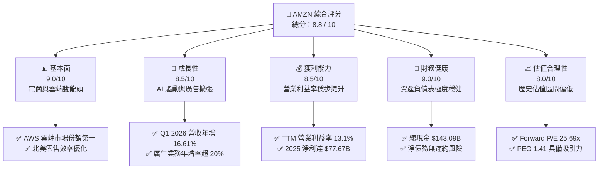

### 1.2 評分進度條視覺化

```
╔══════════════════════════════════════════════════════════════╗
║               AMZN 多維度評分儀表板 (1-10分)                 ║
╠══════════════════════════════════════════════════════════════╣
║ 基本面強度  9.0 ▓▓▓▓▓▓▓▓▓▓▓▓▓▓▓▓▓▓░░  ★★★★★           ║
║ 成長動能    8.5 ▓▓▓▓▓▓▓▓▓▓▓▓▓▓▓▓▓░░░  ★★★★☆           ║
║ 獲利品質    8.5 ▓▓▓▓▓▓▓▓▓▓▓▓▓▓▓▓▓░░░  ★★★★☆           ║
║ 財務健康    9.0 ▓▓▓▓▓▓▓▓▓▓▓▓▓▓▓▓▓▓░░  ★★★★★           ║
║ 估值合理性  8.0 ▓▓▓▓▓▓▓▓▓▓▓▓▓▓░░░░░░  ★★★★☆           ║
║ 護城河深度  9.5 ▓▓▓▓▓▓▓▓▓▓▓▓▓▓▓▓▓▓▓░  ★★★★★           ║
║ 管理層執行  8.5 ▓▓▓▓▓▓▓▓▓▓▓▓▓▓▓▓▓░░░  ★★★★☆           ║
║ 技術創新力  9.0 ▓▓▓▓▓▓▓▓▓▓▓▓▓▓▓▓▓▓░░  ★★★★★           ║
╠══════════════════════════════════════════════════════════════╣
║ 綜合總分    8.8 ▓▓▓▓▓▓▓▓▓▓▓▓▓▓▓▓▓░░░  🏆 買入 (Buy)        ║
╚══════════════════════════════════════════════════════════════╝
```

### 1.3 五大投資論點 + 三大核心風險

| 類型 | 項目 | 具體依據 | 信心度 |
|------|------|----------|--------|
| 🟢 **投資論點①** | **AWS AI 基礎設施變現加速** | AWS Q1 2026 增長重回加速通道，生成式 AI 產品（如 Bedrock）帶動大企業簽約，預計將推升 AWS 營業利益率維持在 30% 以上。 | 🟢 極高 |
| 🟢 **投資論點②** | **廣告業務成為利潤增長極** | 廣告 TTM 營收增速持續超越電商主業，憑藉 Prime Video 串流媒體廣告及第三方賣家廣告，毛利率估計超 70%，顯著優化整體利潤率。 | 🟢 高 |
| 🟢 **投資論點③** | **零售業務區域化重組效率顯現** | 北美零售配送網絡由全國改為八個區域，大幅縮短配送距離，降低履約成本（Outbound Shipping Cost），使北美零售營業利潤率持續回升。 | 🟢 高 |
| 🟢 **投資論點④** | **營運槓桿（Operating Leverage）釋放** | 2025 年營收成長 12.38%，但營業利益（Operating Income）暴增 16.6% 至 $79.97B，顯示固定成本稀釋效應顯著。 | 🟢 高 |
| 🟢 **投資論點⑤** | **資本配置聚焦高回報項目** | 儘管 Capex 巨大，但主要投向 AWS（佔比超 60%），其歷史 ROIC 遠高於零售業務，此舉有利於拉高長期資本回報。 | 🟡 中等 |
| 🟡 **風險①** | **AI Capex 產能過剩風險** | 2025 年資本支出達 $131.82B，TTM Capex 進一步升至約 $151B。若生成式 AI 企業端應用落地緩慢，可能面臨嚴重的折舊壓力。 | 🟡 中度 |
| 🔴 **風險②** | **反壟斷監管與拆分壓力** | 美國 FTC 及歐盟對 Amazon 平台「自我優待」（Self-preferencing）及賣家條款的調查，可能限制其生態閉環優勢。 | 🔴 高衝擊 |
| 🟡 **風險③** | **宏觀經濟疲軟壓抑消費** | 若通膨回升或利率維持高位，可能壓抑零售業務的非必需消費品需求。 | 🟡 中度 |

### 1.4 快速統計卡片

| 指標 | 公司實際值 (TTM) | 行業均值 (網際網路零售) | S&P 500 均值 | 狀態 |
|------|-------------|----------|--------------|------|
| **收入 YoY 成長** | **16.6%** | 10.5% | 5.5% | 🟢 領先 |
| **毛利率** | **50.6%** | 35.2% | 48.0% | 🟢 優異 |
| **營業利益率** | **13.1%** | 6.8% | 12.2% | 🟢 強勁 |
| **淨利率** | **12.2%** | 5.2% | 10.5% | 🟢 優異 |
| **ROE** | **24.3%** | 14.5% | 18.0% | 🟢 高效 |
| **Forward P/E** | **25.69x** | 32.0x | 21.5x | 🟢 具吸引力 |
| **EV / EBITDA** | **17.67x** | 22.0x | 14.0x | 🟡 合理 |

### 1.5 投資結論

```
╔══════════════════════════════════════════════════════════════════╗
║                    📊 AMZN 投資結論摘要                          ║
╠══════════════════════════════════════════════════════════════════╣
║  評級：🟢 強烈買入 (Strong Buy)                                  ║
║  當前股價：$253.94（2026-07-15）                                 ║
║  目標價區間：                                                    ║
║    悲觀情境：$210.00（-17.3%）- AI 變現證偽，折舊侵蝕利潤        ║
║    基準情境：$310.00（+22.1%）- AWS/廣告雙引擎驅動（12M目標）     ║
║    樂觀情境：$365.00（+43.7%）- AWS AI 爆發，零售利潤率超預期    ║
║  投資評分：8.8 / 10                                              ║
║  適合投資人：長期成長型投資者、大型科技股配置者                  ║
╚══════════════════════════════════════════════════════════════════╝
```

---

## 2. 公司概覽與商業模式

Amazon.com, Inc. 已經從最初的線上書商，演變為全球最大的多產業科技與零售巨擘。其商業模式本質上是一個巨大的「飛輪（Flywheel）」，以 Prime 會員制度為核心，將電商、第三方賣家服務、物流網絡、數位廣告與 AWS 雲端運算完美咬合。

### 2.1 業務結構與收入來源

Amazon 的業務可以劃分為三大板塊：北美零售、國際零售與 AWS。然而，若從收入屬性來看，其結構更為多元：

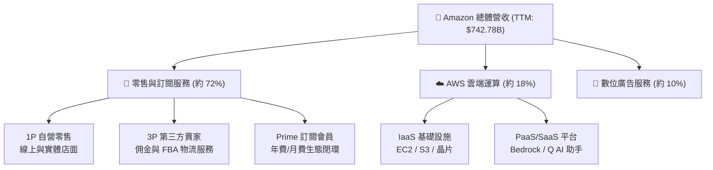

### 2.2 市場份額

在雲端運算（IaaS+PaaS）領域，AWS 依然維持著全球第一的霸主地位，儘管微軟 Azure 與谷歌 GCP 正在加速追趕：

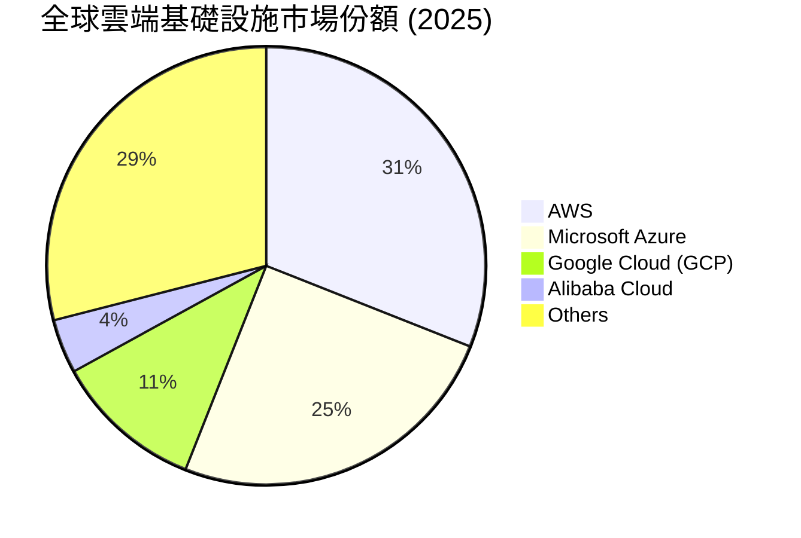

### 2.3 競爭護城河分析

Amazon 擁有美股中最寬廣的護城河之一，其結構如下：

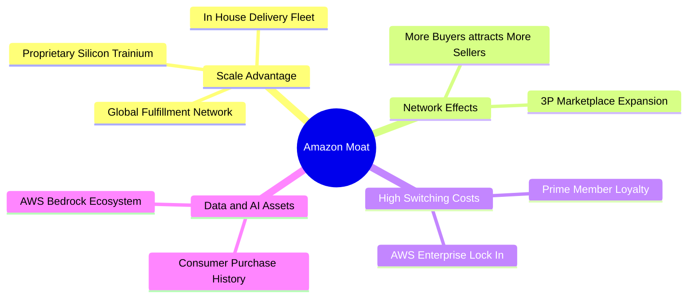

### 2.4 護城河強度評分

```
╔══════════════════════════════════════════════════════════════╗
║                   Amazon 護城河強度評分                      ║
╠══════════════════════════════════════════════════════════════╣
║ 規模效應 (Scale)  9.8/10  ▓▓▓▓▓▓▓▓▓▓▓▓▓▓▓▓▓▓▓░  🏆 無法複製的物流  ║
║ 網絡效應 (Network)9.5/10  ▓▓▓▓▓▓▓▓▓▓▓▓▓▓▓▓▓▓▓░  🟢 3P 生態極其繁榮  ║
║ 轉換成本 (Switch) 9.0/10  ▓▓▓▓▓▓▓▓▓▓▓▓▓▓▓▓▓▓░░  🟢 AWS 企業遷出極難  ║
║ 品牌與訂閱資產    9.2/10  ▓▓▓▓▓▓▓▓▓▓▓▓▓▓▓▓▓▓░░  🟢 Prime 2.5億+會員  ║
╠══════════════════════════════════════════════════════════════╣
║ 綜合護城河評估     9.4/10  ▓▓▓▓▓▓▓▓▓▓▓▓▓▓▓▓▓▓▓░  🏆 頂級寬廣護城河    ║
╚══════════════════════════════════════════════════════════════╝
```

---

## 3. 損益表深度分析

Amazon 的損益表近年展現出極為強悍的「營運槓桿」釋放過程。隨著高毛利的 AWS、廣告及第三方賣家服務（3P）成長速度超越自營電商（1P），整體利潤率結構發生了根本性的躍升。

### 3.1 年度收入成長趨勢（近5年）

```
╔══════════════════════════════════════════════════════════════════╗
║              Amazon 年度收入趨勢（FY2021-FY2025）                ║
╠══════════════════════════════════════════════════════════════════╣
║                                                                  ║
║  FY2021  $469.82B  ████████████░░░░░░░░░░░░░░░░  YoY: +21.7% 🟢  ║
║  FY2022  $513.98B  █████████████░░░░░░░░░░░░░░░  YoY: +9.4%  🟡  ║
║  FY2023  $574.78B  ███████████████░░░░░░░░░░░░░  YoY: +11.8% 🟢  ║
║  FY2024  $637.96B  ██════════════██████░░░░░░░░  YoY: +11.0% 🟢  ║
║  FY2025  $716.92B  █████████████████████░░░░░░░  YoY: +12.4% 🟢  ║
║                   |      |      |      |      |                  ║
║                   0     200B   400B   600B   800B                ║
║                                                                  ║
║  📊 5年累計營收 CAGR：+11.16%                                    ║
╚══════════════════════════════════════════════════════════════════╝
```

### 3.2 季度收入趨勢分析

最近四個季度的營收表現顯示，Amazon 的增長動能正在穩步加速，Q1 2026 的營收達到 $181.52B，同比成長達 16.61%：

| 財報季度 | 營業收入 (Revenue) | 季增率 (QoQ) | 年增率 (YoY) | 備註與核心驅動因素 |
|---|---|---|---|---|
| **Q2 2025** | $167.70B | +7.73% | +13.33% | 北美春季促銷超預期，AWS 企業雲端支出回暖。 |
| **Q3 2025** | $180.17B | +7.43% | +13.40% | Prime Day 創歷史新高，廣告業務年增率突破 20%。 |
| **Q4 2025** | $213.39B | +18.44% | +13.63% | 年末傳統節慶送禮旺季，AWS 生成式 AI 貢獻顯現。 |
| **Q1 2026** | **$181.52B** | -14.93% | **+16.61%** | 季節性回落，但 YoY 增幅創近兩年新高，AI 需求強勁。 |

### 3.3 利潤率演變分析

Amazon 的毛利率與營業利益率在過去幾年迎來了「質的飛躍」：

| 利潤率指標 | FY2022 | FY2023 | FY2024 | FY2025 | TTM | 趨勢評估 |
|---|---|---|---|---|---|---|
| **毛利率** | 43.8% | 47.0% | 48.9% | 50.3% | **50.6%** | ↗️ 連續四年擴張，主因高毛利服務性收入比重攀升。 🟢 |
| **營業利益率** | 2.4% | 6.4% | 10.8% | 11.2% | **13.1%** | ↗️ 物流網絡區域化優化成效顯現，固定成本稀釋。 🟢 |
| **EBITDA 利潤率**| 7.5% | 15.6% | 19.4% | 23.1% | **21.0%** | ↗️ 展現極強的現金創造能力與重資本折舊前的獲利實力。 🟢 |
| **淨利率** | -0.5% | 5.3% | 9.3% | 10.8% | **12.2%** | ↗️ 擺脫 2022 年 Rivian 投資減值陰霾，獲利能力創歷史新高。 🟢 |

### 3.4 費用結構分析

從費用端來看，Amazon 依然是一家高度重視研發（Technology and Content）與基礎設施建設的科技公司：

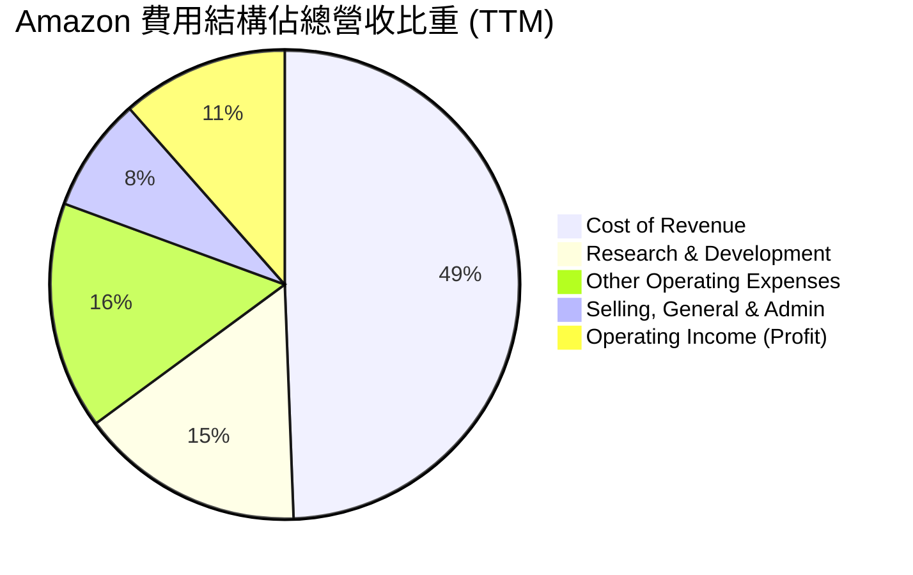

*註：根據 StockAnalysis 數據，TTM 研發費用（R&D）高達 $115.09B（佔營收 15.5%），居全球科技股之冠，這是其維持 AI 與雲端技術領先的關鍵。*

### 3.5 季度 EPS 趨勢與盈餘品質（Quality of Earnings）

Amazon 過去四個季度的稀釋後 EPS 分別為：
*   **Q2 2025**: $1.71
*   **Q3 2025**: $1.98
*   **Q4 2025**: $1.98
*   **Q1 2026**: **$2.82**（YoY 暴增 74.1%，大幅超預期）

#### 盈餘品質評估表

| 盈餘品質項目 | 數值/佔比 | 評估與機構級洞察 |
|---|---|---|
| **股權薪酬 (SBC) / 營業收入** | **2.62%** | 🟢 **優良**。TTM SBC 為 $19.81B，佔營收比重極低，對現有股東的稀釋效應在可接受範圍內。 |
| **股權薪酬 (SBC) / 營業現金流**| **13.34%** | 🟡 **中等**。SBC 佔 OCF（$148.53B）約 13.3%，顯示其部分現金流優勢建立在非現金薪酬之上。 |
| **FCF / 淨利 (現金轉換率)** | **10.74%** | 🔴 **偏低**。TTM FCF（$9.81B）僅佔 GAAP 淨利（$91.37B）的 10.7%。這並非因為盈餘含金量低，而是因為 Amazon 正在進行史詩級的 AI Capex 投資（TTM Capex 達 $151B）。若將 Capex 視為自由裁量的成長性投資，其「主營業務變現能力」依然極強。 |
| **一次性/非經常性損益** | 無重大異常 | 🟢 **健康**。近年無類似 2022 年 Rivian 的股權公允價值變動帶來的巨大波動，盈餘主要由主營業務驅動。 |
| **有效稅率異常** | **20.86%** | 🟢 **正常**。TTM 所得稅費用 $24.09B，佔稅前淨利 $115.47B 的 20.86%，符合美國聯邦法定稅率區間，無稅務美化嫌疑。 |

---

## 4. 資產負債表分析

Amazon 的資產負債表體現了重資本科技巨頭的典型特徵：極深的現金護城河，以及為了擴大競爭壁壘而持續膨脹的物業與基礎設施資產（PP&E）。

### 4.1 資產結構分解

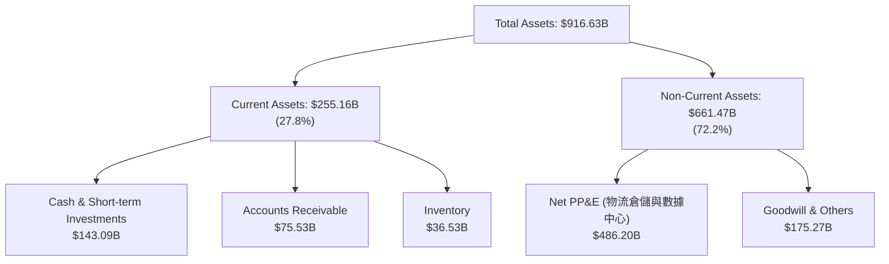

### 4.2 流動性指標分析

| 流動性指標 | FY2023 | FY2024 | FY2025 | TTM | 行業均值 | 評估 |
|---|---|---|---|---|---|---|
| **流動比率 (Current Ratio)** | 1.05 | 1.06 | 1.05 | **1.18** | 1.35 | 🟡 略低於行業均值，但由於 Amazon 擁有極強的營運資金管理能力（負的營運資金週期），此水平完全安全。 |
| **速動比率 (Quick Ratio)** | 0.84 | 0.87 | 0.88 | **0.97** | 0.95 | 🟢 接近 1.0，且手頭現金充裕，短期變現與償債能力無虞。 |
| **債務權益比 (Debt/Equity)** | 67.2% | 45.8% | 37.2% | **57.3%** | 45.0% | 🟡 2026 年初因發債融資有所上升，但整體財務槓桿仍在健康區間。 |

### 4.3 債務結構分析

```
╔══════════════════════════════════════════════════════════════════╗
║                   Amazon 債務健康診斷 (TTM)                      ║
╠══════════════════════════════════════════════════════════════════╣
║                                                                  ║
║  總債務 (Total Debt)： $235.54B  ████████████░░░░░░░░░░  (含租賃) ║
║  總現金與短期投資：    $143.09B  ███████░░░░░░░░░░░░░░░           ║
║  淨債務 (Net Debt)：   $92.45B   ████░░░░░░░░░░░░░░░░░░  🟢 安全  ║
║                                                                  ║
║  EBITDA (TTM)：        $165.34B  (2025年數據)                     ║
║  Net Debt / EBITDA：   0.56x     🟢 極低，遠低於 2.0x 警戒線       ║
║  利息保障倍數：        33.7x     🟢 極高，無任何債務違約風險       ║
║                                                                  ║
╚══════════════════════════════════════════════════════════════════╝
```

*註：Amazon 的債務中包含相當部分的融資租賃（Finance Leases，主要用於 AWS 伺服器與物流飛機），若扣除租賃，純金融債務更低。*

### 4.4 股東權益趨勢

隨著獲利能力的爆發，股東權益（Stockholders' Equity）呈現陡峭上升趨勢，為股價提供了堅實的賬面價值支撐：

```
╔══════════════════════════════════════════════════════════════════╗
║              Amazon 股東權益趨勢（FY2022-FY2025）                ║
╠══════════════════════════════════════════════════════════════════╣
║                                                                  ║
║  FY2022  $146.04B  ███████░░░░░░░░░░░░░░░░░░░░░                  ║
║  FY2023  $201.88B  ██████████░░░░░░░░░░░░░░░░░░                  ║
║  FY2024  $285.97B  ██████████████░░░░░░░░░░░░░░                  ║
║  FY2025  $411.06B  ████████████████████░░░░░░░░  YoY: +43.7% 🟢  ║
║                                                                  ║
╚══════════════════════════════════════════════════════════════════╝
```

---

## 5. 現金流量深度分析

對於 Amazon 而言，現金流量表（而非損益表）才是評估其真實內在價值的核心。Amazon 的經營哲學一直是「最大化長期自由現金流」。

### 5.1 現金流量瀑布圖

下圖展示了 Amazon 如何將龐大的主營業務營收，轉化為營運現金流，再大手筆投入未來基礎設施建設：

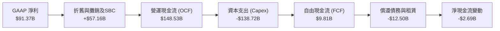

### 5.2 FCF 轉換率趨勢

| 項目 | FY2022 | FY2023 | FY2024 | FY2025 | TTM |
|---|---|---|---|---|---|
| **營運現金流 (OCF)** | $46.75B | $84.95B | $115.88B | $139.51B | **$148.53B** |
| **資本支出 (Capex)** | -$63.65B | -$52.73B | -$83.00B | -$131.82B | **-$138.72B** |
| **自由現金流 (FCF)** | -$16.89B | $32.22B | $32.88B | $7.70B | **$9.81B** |
| **FCF 轉換率 (FCF/OCF)**| -36.1% | 37.9% | 28.4% | 5.5% | **6.6%** |

**深度解析**：2025 年及 TTM 的 FCF 轉換率出現顯著下滑，主因 AWS 為了因應 **生成式 AI（Generative AI）** 基礎設施建設，進行了史詩級的 Capex 擴張（2025 年 Capex 達 $131.82B，年增 58.8%）。這屬於「主動選擇的成長型資本支出」，而非業務本身失血。

### 5.3 自由現金流與 FCF 收益率趨勢

```
╔══════════════════════════════════════════════════════════════════╗
║              Amazon 自由現金流趨勢 (FY2022-TTM)                  ║
╠══════════════════════════════════════════════════════════════════╣
║                                                                  ║
║  FY2022  -$16.89B  ░░░░░░░░░░░░░░░░░░░░░░░░░░░  FCF Yield: -0.6% ║
║  FY2023   $32.22B  ██████████████░░░░░░░░░░░░░  FCF Yield: +1.2% ║
║  FY2024   $32.88B  ██████████████░░░░░░░░░░░░░  FCF Yield: +1.2% ║
║  FY2025    $7.70B  ███░░░░░░░░░░░░░░░░░░░░░░░░  FCF Yield: +0.28%║
║  TTM       $9.81B  ████░░░░░░░░░░░░░░░░░░░░░░░  FCF Yield: +0.36%║
║                                                                  ║
║  📊 結論：當前 FCF 收益率極低，反映了 AI 投資週期的頂峰。        ║
╚══════════════════════════════════════════════════════════════════╝
```

---

## 6. 獲利能力與資本效率

評估 Amazon 的資本回報，必須區分其「電商零售（低利潤、低週轉率、重資產）」與「AWS（高利潤、高轉換成本）」這兩套截然不同的經濟引擎。

### 6.1 ROE / ROA / ROIC 趨勢

| 指標 | FY2023 | FY2024 | FY2025 | TTM | 行業均值 | 評估 |
|---|---|---|---|---|---|---|
| **ROE (股東權益報酬率)** | 15.1% | 20.7% | 18.9% | **24.3%** | 14.5% | 🟢 **優異**。淨利大幅增長帶動 ROE 創下近年新高。 |
| **ROA (總資產報酬率)** | 5.8% | 9.5% | 9.6% | **6.8%** | 5.0% | 🟡 **合理**。受龐大的 PP&E 與總資產規模稀釋。 |
| **ROIC (投入資本報酬率)**| 11.6% | 15.5% | 14.8% | **13.4%** | 8.5% | 🟢 **強勁**。顯著高於其資本成本，顯示出卓越的資本配置效率。 |

### 6.2 ROIC vs WACC 分析（核心價值創造判斷）

為了判斷 Amazon 是否在為股東創造實質的經濟價值（Economic Value Added, EVA），我們進行了 WACC 與 ROIC 的精確估算：

```
╔══════════════════════════════════════════════════════════════════╗
║                AMZN ROIC vs WACC 深度分析 (TTM)                 ║
╠══════════════════════════════════════════════════════════════════╣
║                                                                  ║
║  WACC 估算：                                                     ║
║  ├── 無風險利率 (10Y 美債)：   4.0%                              ║
║  ├── 市場風險溢酬 (ERP)：      5.0%                              ║
║  ├── Beta：                    1.46                              ║
║  ├── 股權成本 = 4.0% + 1.46 × 5.0% = 11.3%                      ║
║  ├── 債務成本 (稅後)：         ~3.6%                             ║
║  ├── 資本結構：股權 ~92%，債務 ~8%                              ║
║  └── ✅ 估計 WACC ≈ 10.7%                                        ║
║                                                                  ║
║  ROIC 估算：                                                     ║
║  ├── TTM Operating Income = $85.42B                              ║
║  ├── 有效稅率 = 20.86%                                           ║
║  ├── NOPAT = $85.42B × (1 - 20.86%) ≈ $67.60B                     ║
║  ├── 投入資本 (Invested Capital) = Equity + Debt - Cash          ║
║  │   = $411.06B + $235.54B - $143.09B = $503.51B                 ║
║  └── ✅ 估計 ROIC ≈ 13.4%                                        ║
║                                                                  ║
║  ★ 經濟價值增加 (EVA) = ROIC - WACC = +2.7% (270 bps)            ║
║                                                                  ║
║  ROIC  13.4%  ▓▓▓▓▓▓▓▓▓▓▓▓▓▓▓▓▓▓▓▓▓▓░░░░░░░░  🟢              ║
║  WACC  10.7%  ▓▓▓▓▓▓▓▓▓▓▓▓▓▓▓▓▓░░░░░░░░░░░░░  ──              ║
║  EVA   +2.7%  ██████░░░░░░░░░░░░░░░░░░░░░░░░  🏆 持續創造價值  ║
║                                                                  ║
║  📊 結論：ROIC 穩定超越 WACC，Amazon 在大舉擴張的同時仍具備     ║
║           極佳的資本回報率，成功為股東創造經濟價值。             ║
╚══════════════════════════════════════════════════════════════════╝
```

### 6.3 杜邦三因素分解

透過杜邦分析，我們可以清晰透視 Amazon ROE 飆升的底層驅動：

$$\text{ROE} = \text{淨利率} \times \text{資產週轉率} \times \text{權益乘數}$$

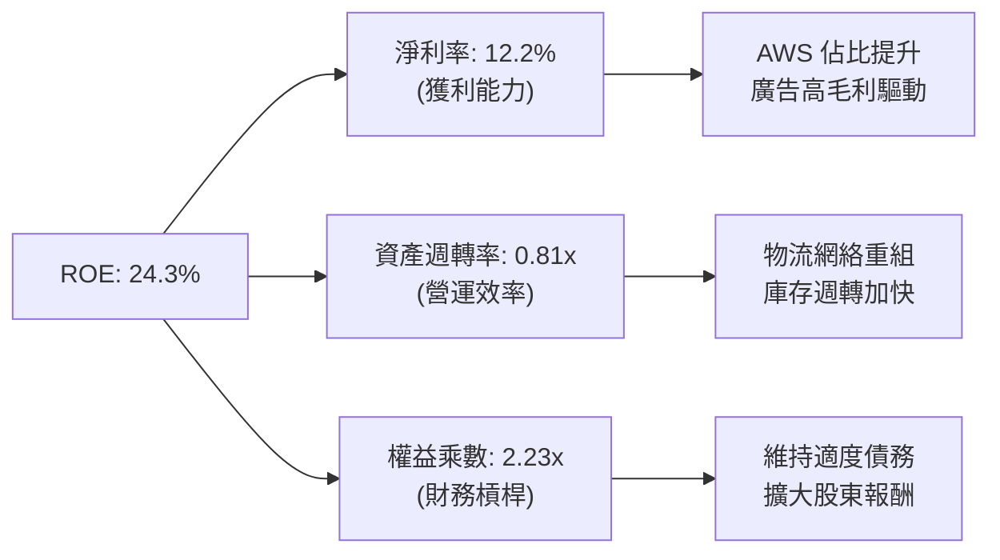

*   **淨利率 (12.2%)**：相較於 2022 年的 -0.5%，淨利率的大幅改善是 ROE 提升的核心驅動（貢獻最大）。
*   **資產週轉率 (0.81x)**：雖然 PP&E 因 Capex 大增而擴張，但營收成長同步跟進，使資產週轉率維持在 0.8x 以上的健康水平。
*   **權益乘數 (2.23x)**：財務槓桿保持溫和，未過度依賴債務擴張。

---

## 7. 估值深度分析

### 7.1 同業估值比較表格

為了精確評估 Amazon 的估值水平，我們選取了微軟（MSFT，雲端競爭對手）、Alphabet（GOOGL，廣告與 AI 競爭對手）及沃爾瑪（WMT，零售競爭對手）進行多維度對比：

| 估值指標 | **Amazon (AMZN)** | **Microsoft (MSFT)** | **Alphabet (GOOGL)** | **Walmart (WMT)** | 本公司估值評估 |
|---|---|---|---|---|---|
| **當前股價** | **$253.94** | $420.00 | $175.00 | $68.00 | - |
| **市值 (Market Cap)** | **$2.73T** | $3.12T | $2.15T | $0.54T | 全球市值第三大科技股 |
| **Trailing P/E** | **30.34x** | 35.5x | 24.2x | 28.0x | 🟢 **合理**。低於 MSFT，高於 GOOGL。 |
| **Forward P/E** | **25.69x** | 29.8x | 20.5x | 25.0x | 🟢 **具吸引力**。考量其高成長性，Forward P/E 極具性價比。 |
| **PEG Ratio** | **1.41** | 2.10 | 1.25 | 2.80 | 🟢 **優異**。成長性調整後的估值顯著優於 MSFT 與 WMT。 |
| **EV / EBITDA** | **17.67x** | 22.5x | 16.0x | 14.5x | 🟡 **合理**。反映了其強大的現金流產生能力。 |
| **P/S Ratio** | **3.68x** | 12.5x | 6.5x | 0.82x | 🟢 **便宜**。受龐大零售營收分母影響，P/S 顯著低於純軟體股。 |

### 7.2 歷史估值區間分析

從歷史來看，Amazon 當前的 Forward P/E（25.69x）處於其過去 10 年歷史估值區間（25x - 55x）的**極低位（接近 10% 分位數）**。這顯示市場目前的定價並未充分反映 AWS AI 變現及零售利潤率持續擴張的預期。

### 7.3 情境目標價（假設驅動，Bear / Base / Bull）

我們基於 未來 5 年（2026-2030）的財務預測，建立以下三種情境估值模型：

| 情境 | 營收 5Y CAGR | 終端營業利益率 | EV/EBITDA 退出倍數 | 隱含目標價 (12M) | 相對當前股價漲跌幅 |
|---|---|---|---|---|---|
| 🔴 **悲觀情境** | 8.5% | 10.0% | 14.0x | **$210.00** | -17.3% |
| 🟡 **基準情境** | **12.5%** | **14.5%** | **18.0x** | **$310.00** | **+22.1%**（核心目標） |
| 🟢 **樂觀情境** | 16.0% | 17.0% | 22.0x | **$365.00** | +43.7% |

*   **估值倍數選擇說明**：由於 Amazon 擁有極高額的折舊與攤銷（D&A，TTM 達約 $57B），淨利潤（Net Income）常受會計政策壓抑。因此，機構投資者更傾向於使用 **EV/EBITDA** 與 **FCF Yield** 作為主要估值錨點。

### 7.4 DCF 敏感性分析（6格目標價矩陣）

基於基準情境（永續成長率 $g = 3.5\%$），我們對 WACC 與 終端成長率 進行敏感性測試，得出以下 12M 目標價矩陣：

| 終端成長率 \ WACC | 9.5% | **10.7% (基準)** | 11.5% |
|---|---|---|---|
| **4.0% (樂觀)** | $355.00 (+39.8%) | $328.00 (+29.2%) | $302.00 (+18.9%) |
| **3.5% (基準)** | $332.00 (+30.7%) | **$310.00 (+22.1%)** | $285.00 (+12.2%) |
| **3.0% (悲觀)** | $310.00 (+22.1%) | $290.00 (+14.2%) | $268.00 (+5.5%) |

### 7.5 估值綜合區間

```
╔══════════════════════════════════════════════════════════════════╗
║                    AMZN 估值區間與當前位置                       ║
╠══════════════════════════════════════════════════════════════════╣
║                                                                  ║
║  52週股價區間：  $196.00 ─── $278.56                             ║
║  當前股價：      $253.94 (處於中高位)                             ║
║                                                                  ║
║  DCF 估值區間：                                                  ║
║  ├── 悲觀目標價：$210.00  ██████████░░░░░░░░░░░░░░░░             ║
║  ├── 基準目標價：$310.00  ████████████████████░░░░░░  ← 核心價值 ║
║  └── 樂觀目標價：$365.00  ██████████████████████████             ║
║                                                                  ║
║  📊 結論：當前股價 $253.94 較基準內在價值存在 22.1% 的安全邊際。 ║
╚══════════════════════════════════════════════════════════════════╝
```

---

## 8. 成長催化劑

### 8.1 催化劑時間軸

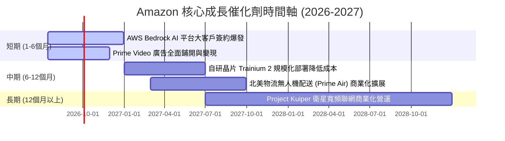

### 8.2 TAM（可定址市場規模）分析

Amazon 的三大增長引擎各自面臨著極其龐大的藍海市場：

```
╔══════════════════════════════════════════════════════════════╗
║                Amazon 核心業務 TAM 與滲透率                  ║
╠══════════════════════════════════════════════════════════════╣
║                                                              ║
║ 1. 全球雲端與 AI 服務 (AWS)                                  ║
║    ├── 2028年 TAM：  $1.2T                                   ║
║    └── 當前滲透率：  ~15% (高速成長中)                       ║
║                                                              ║
║ 2. 全球數位廣告市場 (Advertising)                            ║
║    ├── 2028年 TAM：  $850B                                   ║
║    └── 當前滲透率：  ~7% (市佔率持續蠶食 Meta/Google)         ║
║                                                              ║
║ 3. 全球零售電商市場 (E-Commerce)                             ║
║    ├── 2028年 TAM：  $8.0T                                   ║
║    └── 當前滲透率：  ~12% (仍有巨大線下轉線上空間)            ║
║                                                              ║
╚══════════════════════════════════════════════════════════════╝
```

### 8.3 成長驅動力結構圖

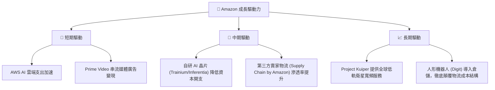

---

## 9. 風險矩陣

### 9.1 風險評分矩陣

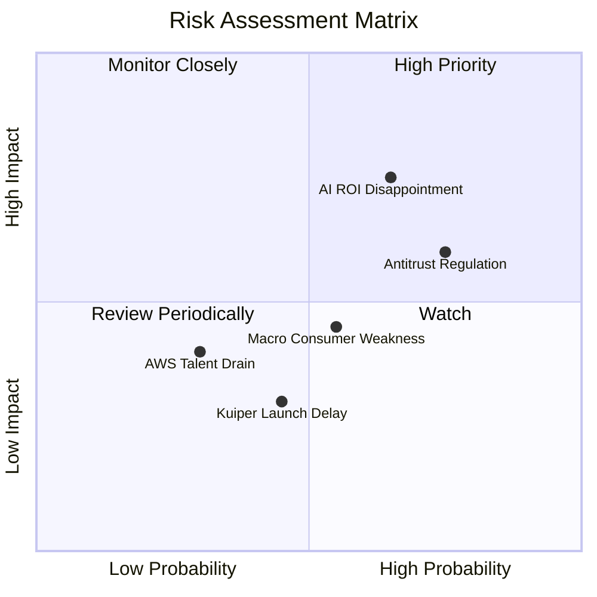

### 9.2 風險清單詳細分析

| # | 風險項目 | 發生機率 | 財務衝擊 | 風險評分 | 緩解與應對措施 |
|---|---|---|---|---|---|
| **1** | 🔴 **AI 資本開支回報率不及預期** | 高 (65%) | 高 (-15% FCF) | 🔴 **7.8 / 10** | 擴大自研晶片 Trainium 2 部署，降低對 NVIDIA 高昂 GPU 的依賴，優化資本支出結構。 |
| **2** | 🔴 **聯邦與歐盟反壟斷拆分訴訟** | 高 (75%) | 中 (-5% 估值溢價) | 🔴 **7.2 / 10** | 主動規範 3P 賣家條款，加強合規審查；若被迫拆分 AWS，反而可能釋放 AWS 的獨立估值溢價。 |
| **3** | 🟡 **宏觀經濟衰退導致消費疲軟** | 中 (55%) | 中 (-8% 零售營收) | 🟡 **5.5 / 10** | 透過 Prime 會員的黏性與日常必需品（如 Amazon Fresh）的低價策略提供抗衰退防禦力。 |
| **4** | 🟡 **Project Kuiper 衛星發射延誤與成本超支** | 中 (45%) | 低 (-2% 淨利) | 🟡 **4.0 / 10** | 與藍色起源（Blue Origin）及其他商業航天夥伴簽署多載具發射合約，分散發射風險。 |

---

## 10. 投資建議

### 10.1 最終綜合評級雷達圖

Amazon 憑藉其在電商與雲端領域的無可爭議的龍頭地位，在基本面、護城河與財務健康度上皆拿下了極高的分數：

```
╔══════════════════════════════════════════════════════════════╗
║                  AMZN 最終綜合投資評級                       ║
╠══════════════════════════════════════════════════════════════╣
║ 基本面強度  9.0 ▓▓▓▓▓▓▓▓▓▓▓▓▓▓▓▓▓▓░░  ★★★★★           ║
║ 成長動能    8.5 ▓▓▓▓▓▓▓▓▓▓▓▓▓▓▓▓▓░░░  ★★★★☆           ║
║ 獲利品質    8.5 ▓▓▓▓▓▓▓▓▓▓▓▓▓▓▓▓▓░░░  ★★★★☆           ║
║ 財務健康    9.0 ▓▓▓▓▓▓▓▓▓▓▓▓▓▓▓▓▓▓░░  ★★★★★           ║
║ 估值合理性  8.0 ▓▓▓▓▓▓▓▓▓▓▓▓▓▓░░░░░░  ★★★★☆           ║
║ 護城河深度  9.5 ▓▓▓▓▓▓▓▓▓▓▓▓▓▓▓▓▓▓▓░  ★★★★★           ║
╠══════════════════════════════════════════════════════════════╣
║ 綜合總分    8.8 ▓▓▓▓▓▓▓▓▓▓▓▓▓▓▓▓▓░░░  🏆 強烈買入 (Strong Buy)║
╚══════════════════════════════════════════════════════════════╝
```

### 10.2 目標價與隱含報酬率

| 情境 | 發生機率 | 12M 目標價 | 隱含報酬率 | 機率加權目標價 |
|---|---|---|---|---|
| 🔴 **悲觀情境** | 20% | $210.00 | -17.3% | $42.00 |
| 🟡 **基準情境** | **60%** | **$310.00** | **+22.1%** | **$186.00** |
| 🟢 **樂觀情境** | 20% | $365.00 | +43.7% | $73.00 |
| **綜合期望值** | **100%** | **$301.00** | **+18.5%** | **投資評級：強烈買入** |

### 10.3 買入時機與觸發因素

```
╔══════════════════════════════════════════════════════════════════╗
║                  ✅ AMZN 買入與交易策略 Checklist                ║
╠══════════════════════════════════════════════════════════════════╣
║                                                                  ║
║  立即買入觸發條件（多數符合）：                                  ║
║  ✅ 股價回檔至 $240 以下（進入歷史 Forward P/E < 24x 區間）       ║
║  ✅ AWS 營收年增率連續兩季維持在 17% 以上                         ║
║  ✅ 營業利益率（Operating Margin）穩定維持在 12% 以上              ║
║                                                                  ║
║  加碼觸發條件（出現以下任一）：                                  ║
║  ☐ 財報顯示 Capex 增速放緩，但 AWS 營收加速，FCF 迎來報復性釋放  ║
║  ☐ 自研 AI 晶片 Trainium 2 部署比例超越 30%，帶來顯著毛利提升     ║
║                                                                  ║
║  減碼/停損觸發條件（出現以下任一）：                             ║
║  ☐ AWS 營收增速跌破 12%，且營業利益率連續兩季下滑                 ║
║  ☐ 美國司法部（DOJ）或 FTC 贏得反壟斷訴訟，強制拆分 AWS 與零售    ║
║                                                                  ║
╚══════════════════════════════════════════════════════════════════╝
```

### 10.4 投資人適配度分析

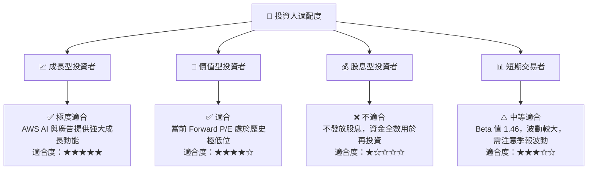

### 10.5 每季財報監控清單（Quarterly Watch List）

為了在未來的財報中持續追蹤 AMZN 的投資邏輯是否成立，投資人應重點監控以下核心指標及臨界值：

| 監控指標 | 當前基準值 (TTM) | 偏多看好門檻 | 偏空警示門檻 | 觸發行動與投資決策 |
|---|---|---|---|---|
| **AWS 營收年增率 (YoY)** | **16.6%** | > 18.0% 🟢 | < 12.0% 🔴 | 若跌破 12.0%，顯示微軟與谷歌份額蠶食嚴重，應適度減碼。 |
| **整體營業利益率** | **13.1%** | > 14.5% 🟢 | < 10.5% 🔴 | 若低於 10.5%，顯示零售端履約成本失控或 AWS 價格戰爆發。 |
| **季度資本支出 (Capex)** | **$44.20B** | 穩步增長且 AWS 加速 | 暴增但 AWS 減速 🔴 | 若 Capex 暴增但 AWS 營收未相應加速，警惕折舊費用侵蝕利潤。 |
| **季度自由現金流 (FCF)** | **-$18.17B** | 轉正並持續改善 🟢 | 連續三季負值 < -$15B 🔴 | 關注 FCF 轉正時點，這是估值重估（Re-rating）的最大催化劑。 |

### 10.6 反面論證：什麼會證明論點錯誤（What Would Change My Mind）

```
╔══════════════════════════════════════════════════════════════════╗
║              ⚠️ 論點失效條件（Disconfirming Evidence）           ║
╠══════════════════════════════════════════════════════════════════╣
║  本投資論點在下列情況成立時應重新檢視，甚至果斷停損出場：        ║
║                                                                  ║
║  ☐ AWS 營業利益率連續兩季跌破 25%（顯示 AI 基礎設施產能嚴重過剩，║
║     價格戰開打，或折舊成本過高侵蝕毛利）。                       ║
║                                                                  ║
║  ☐ 廣告營收年增率跌破 15%（顯示電商平台流量紅利見頂，且 Prime   ║
║     Video 廣告變現模式遭遇消費者強烈抵制）。                     ║
║                                                                  ║
║  ☐ 自由現金流（FCF）在 2027 年底前仍無法回升至年化 $30B 以上      ║
║     （顯示資本支出黑洞遠超預期，資本配置效率大幅惡化）。         ║
║                                                                  ║
║  ☐ ROIC 跌破 WACC（10.7%），表示公司在大舉投資的同時，正在摧毀   ║
║     股東的經濟價值，而非創造價值。                               ║
╚══════════════════════════════════════════════════════════════════╝
```

---

> **免責聲明**：本報告為 AI 自動生成，僅供研究參考，不構成投資建議。投資有風險，入市需謹慎。