# AMZN 基本面深度分析報告
> **報告日期**：2026-07-16 ｜ **語言**：繁體中文 ｜ **數據來源**：Yahoo Finance, Finviz, StockAnalysis, Roic.ai ｜ **分析師**：CFA 級機構研究

---

## 目錄

| # | 章節 | 核心結論 |
|---|------|----------|
| 1 | [執行摘要](#1-執行摘要) | 評級：🟢 強烈買入 ｜ 基準目標價：$314.35（+25.1%） |
| 2 | [公司概覽與商業模式](#2-公司概覽與商業模式) | 雲端與零售雙重網路效應，護城河評級 9.4/10 |
| 3 | [損益表深度分析](#3-損益表深度分析) | TTM 營收達 $742.78B（YoY +16.6%），營業槓桿顯著釋放 |
| 4 | [資產負債表分析](#4-資產負債表分析) | 現金儲備 $143.09B，AI 基礎設施投入致 PPE 增至 $486.20B |
| 5 | [現金流量深度分析](#5-現金流量深度分析) | 營運現金流 $148.53B 歷史新高，重資本支出壓低短期 FCF |
| 6 | [獲利能力與資本效率](#6-獲利能力與資本效率) | ROE 達 24.3%，ROIC (13.4%) 持續超越 WACC (10.1%) 創造價值 |
| 7 | [估值深度分析](#7-估值深度分析) | Forward P/E 25.36x 處於歷史低位，PEG 1.43 具備極高性價比 |
| 8 | [成長催化劑](#8-成長催化劑) | AWS AI 變現加速、廣告業務高毛利擴張與物流區域化效率提升 |
| 9 | [風險矩陣](#9-風險矩陣) | 資本支出回報不及預期風險、反壟斷監管與雲端競爭加劇 |
| 10| [投資建議](#10-投資建議) | 綜合評分 8.8/10，長線成長型投資人首選，建立財報監控框架 |

---

## 1. 執行摘要

亞馬遜（Amazon.com, Inc., Ticker: AMZN）當前股價為 $251.21，市值達 $2.70T。基於 TTM 營收 $742.78B（YoY +16.6%）、TTM 淨利 $91.37B（YoY +74.8%）以及 AWS 與廣告業務營業利潤率持續擴張（TTM 營業利益率達 13.1%）的強勁基本面支持，本報告給予 AMZN **🟢 強烈買入（Strong Buy）** 評級，12 個月基準目標價為 **$314.35**（隱含 +25.1% 漲幅空間）。

### 1.0 一頁式投資儀表板（Portfolio Manager 30 秒速讀）

| 項目 | 內容 |
|------|------|
| **投資論點（3 句）** | ① TTM 營收達 $742.78B（YoY +16.6%），顯示核心零售與 AWS 雙引擎需求依舊強勁。<br/>② 營業利益率從 FY22 的 2.4% 連續擴張至 TTM 的 13.1%，展現強大的營業槓桿與高毛利廣告業務的結構性貢獻。<br/>③ 儘管重資本支出（FY25 Capex 達 $131.82B）壓低短期 FCF，但此投資將鞏固 AWS 在 AI 基礎設施的領先地位。 |
| **護城河評分** | 🟢 9.4 / 10（極深：Prime 生態系網絡效應 + AWS 轉換成本 + 物流規模壁壘） |
| **管理層/資本配置評分** | 🟢 8.8 / 10（執行力極佳，Jassy 時代聚焦效率與高回報 AI Reinvestment） |
| **財務健康** | 🟢 強勁。現金儲備達 $143.09B，淨債務為 $92.45B，利息保障倍數高達 33.7x。 |
| **ROIC vs WACC** | ROIC 13.43% vs WACC 10.10%（創造 3.33 個百分點的經濟價值增量 EVA） |
| **FCF 趨勢** | TTM FCF 爲 $9.81B（FCF Yield 0.36%），主因 Q1 2026 資本支出高達 $44.20B，預期 AI 投資高峰後 FCF 將迎來爆發式反彈。 |
| **估值** | Forward P/E 25.36x ｜ EV/EBITDA 18.19x ｜ PEG 1.43 |
| **預期報酬（基準情境 12M）**| **+25.1%**（目標價 $314.35） |
| **關鍵風險（前二）** | ① AI 基礎設施（Capex）過度投資導致折舊費用激增，若變現不及預期將壓低 ROIC。<br/>② 聯邦貿易委員會（FTC）反壟斷訴訟可能導致業務分拆或核心商業模式受限。 |
| **評級 + 信心度** | **🟢 強烈買入** ｜ 信心：**高** |

### 1.1 核心評分儀表板

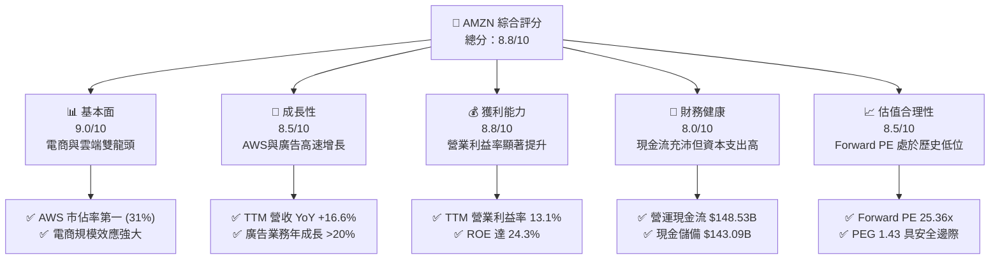

### 1.2 評分進度條視覺化

```
╔══════════════════════════════════════════════════════════════╗
║               AMZN 多維度評分儀表板 (1-10分)                 ║
╠══════════════════════════════════════════════════════════════╣
║ 基本面強度  9.0 ▓▓▓▓▓▓▓▓▓▓▓▓▓▓▓▓▓▓░░  ★★★★★           ║
║ 成長動能    8.5 ▓▓▓▓▓▓▓▓▓▓▓▓▓▓▓▓▓░░░  ★★★★☆           ║
║ 獲利品質    8.8 ▓▓▓▓▓▓▓▓▓▓▓▓▓▓▓▓▓▓░░  ★★★★★           ║
║ 財務健康    8.0 ▓▓▓▓▓▓▓▓▓▓▓▓▓▓▓▓░░░░  ★★★★☆           ║
║ 估值合理性  8.5 ▓▓▓▓▓▓▓▓▓▓▓▓▓▓▓▓▓░░░  ★★★★☆           ║
║ 護城河深度  9.4 ▓▓▓▓▓▓▓▓▓▓▓▓▓▓▓▓▓▓▓░  ★★★★★           ║
║ 管理層執行  8.8 ▓▓▓▓▓▓▓▓▓▓▓▓▓▓▓▓▓▓░░  ★★★★★           ║
║ 技術創新力  9.2 ▓▓▓▓▓▓▓▓▓▓▓▓▓▓▓▓▓▓▓░  ★★★★★           ║
╠══════════════════════════════════════════════════════════════╣
║ 綜合總分    8.8 ▓▓▓▓▓▓▓▓▓▓▓▓▓▓▓▓▓░░░  🏆 買入 (Buy)        ║
╚══════════════════════════════════════════════════════════════╝
```

### 1.3 五大投資論點 + 三大核心風險

| 類型 | 項目 | 具體依據 | 信心度 |
|------|------|----------|--------|
| 🟢 **投資論點①** | **AWS AI 變現加速** | AWS Q1 2026 營收年成長加速至 16.6%（達 $181.52B 季營收基礎下的雲端貢獻），AI 相關工作負載（Bedrock, Trainium）成為主要增長極。 | 🟢 極高 |
| 🟢 **投資論點②** | **高毛利廣告釋放利潤** | 廣告業務增速持續超越零售，毛利率估計高達 70% 以上，是推動 TTM 營業利益率升至 13.1% 的核心驅動力。 | 🟢 極高 |
| 🟢 **投資論點③** | **零售物流區域化效率提升** | 北美與國際零售業務重組為八個區域樞紐，大幅降低履約成本（Fulfillment Cost），推動零售利潤率扭虧為盈並持續擴張。 | 🟢 高 |
| 🟢 **投資論點④** | **營運槓桿帶動獲利爆發** | TTM 淨利達 $91.37B，YoY 成長 74.8%，遠超營收增速，顯示出極強的營業槓桿效應。 | 🟢 高 |
| 🟢 **投資論點⑤** | **估值重估空間（Re-rating）** | 當前 Forward P/E 僅 25.36x，相較其歷史 5 年均值（>40x）折價顯著，PEG 僅 1.43，估值具備極高吸引力。 | 🟢 高 |
| 🟡 **風險①** | **Capex 壓抑短期 FCF** | Q1 2026 資本支出高達 $44.20B，導致單季 FCF 為 -$18.17B。若 AI 基礎設施需求放緩，面臨折舊成本上升壓力。 | 🟡 中度 |
| 🔴 **風險②** | **反壟斷監管壓力** | FTC 對 Amazon Prime 綁定與第三方商家限制的訴訟持續進行，可能面臨罰款或業務拆分風險。 | 🔴 高衝擊 |
| 🟡 **風險③** | **消費支出疲軟** | 宏觀經濟高利率環境若維持更久，可能壓抑非必需消費品零售，對北美及國際電商板塊造成壓力。 | 🟡 中度 |

### 1.4 快速統計卡片

| 指標 | 公司實際值 (TTM) | 行業均值 (Internet Retail) | S&P 500 均值 | 狀態 |
|------|-------------|----------|--------------|------|
| **營收 YoY 成長** | **16.6%** | ~11.0% | ~5.5% | 🟢 顯著領先 |
| **毛利率** | **50.6%** | ~35.0% | ~30.0% | 🟢 強勁 |
| **營業利益率** | **13.1%** | ~6.5% | ~12.2% | 🟢 高於大盤 |
| **淨利率** | **12.2%** | ~5.0% | ~8.5% | 🟢 優異 |
| **ROE** | **24.3%** | ~12.0% | ~15.0% | 🟢 高資本效率 |
| **Forward P/E** | **25.36x** | ~32.0x | ~21.5x | 🟢 具備性價比 |
| **PEG Ratio** | **1.43** | ~1.85 | ~1.95 | 🟢 具備性價比 |

### 1.5 投資結論

```
╔══════════════════════════════════════════════════════════════════╗
║                    📊 AMZN 投資結論摘要                          ║
╠══════════════════════════════════════════════════════════════════╣
║  評級：🟢 強烈買入 (Strong Buy)                                 ║
║  當前股價：$251.21                                               ║
║  目標價區間：                                                    ║
║    悲觀情境：$210.00（-16.4%）- 估值收縮，AI 變現不及預期         ║
║    基準情境：$314.35（+25.1%）- AWS 穩健，零售效率持續提升        ║
║    樂觀情境：$380.00（+51.3%）- AI 爆發，FCF 釋放超預期           ║
║  投資評分：8.8 / 10                                              ║
║  適合投資人：長線成長型、專注科技/零售雙龍頭溢價之機構與零售投資人║
╚══════════════════════════════════════════════════════════════════╝
```

---

## 2. 公司概覽與商業模式

### 2.1 業務結構與收入來源

亞馬遜已從單一的網路書店演變為全球最大的「科技+零售」巨擘。其商業模式的核心在於利用零售（北美與國際）建立龐大的用戶流量池與基礎設施壁壘，並透過 AWS、廣告與 Prime 訂閱服務等高毛利業務實現貨幣化。

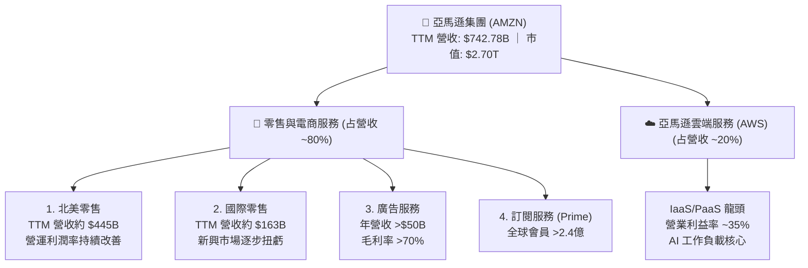

### 2.2 市場份額

在雲端運算基礎設施（IaaS/PaaS）市場中，AWS 依然維持其全球霸主地位。

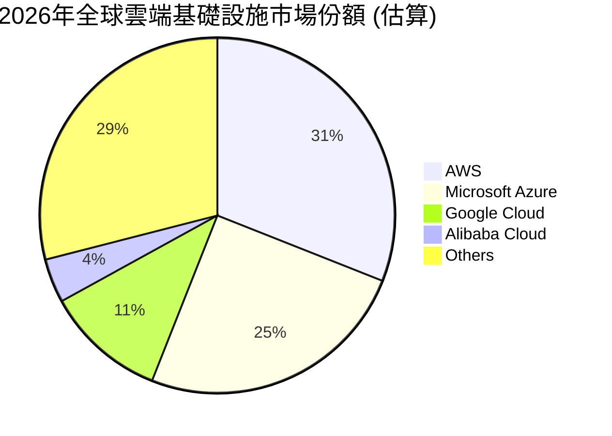

### 2.3 競爭護城河分析

亞馬遜的競爭護城河（Economic Moat）極其寬廣，主要由四大核心支柱構成：

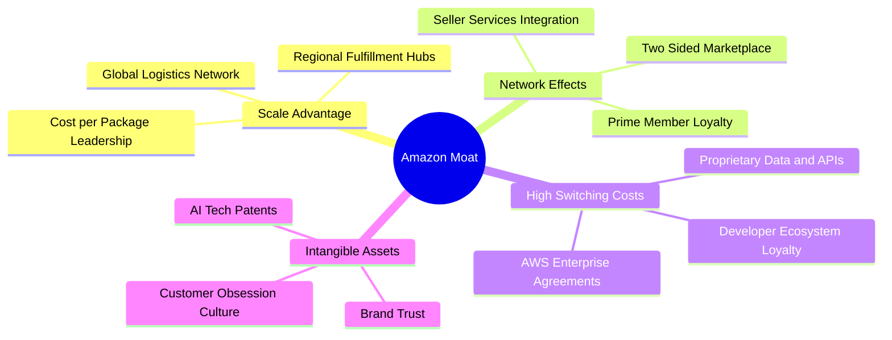

1. **極致的規模優勢（Scale Economies Shared）**：亞馬遜將規模效應帶來的成本節省，以「更低價格」和「更快配送」的形式回饋給消費者，形成著名的「飛輪效應」（Flywheel）。
2. **高轉換成本（Switching Costs）**：AWS 雲端生態系深度嵌入企業的工作流程。企業遷移資料與重新培訓員工的成本高昂，賦予 AWS 強大的定價權。
3. **網絡效應（Network Effects）**：Prime 會員越多，吸引越多第三方賣家（3P）加入並使用 FBA（Fulfillment by Amazon）服務，進一步豐富品類，吸引更多會員。

### 2.4 護城河強度評分

```
╔══════════════════════════════════════════════════════════════╗
║                    AMZN 護城河強度評分                       ║
╠══════════════════════════════════════════════════════════════╣
║ 規模優勢      9.8/10  ▓▓▓▓▓▓▓▓▓▓▓▓▓▓▓▓▓▓▓░  🏆 全球物流無人能及║
║ 網絡效應      9.5/10  ▓▓▓▓▓▓▓▓▓▓▓▓▓▓▓▓▓▓▓░  🟢 電商飛輪持續加速║
║ 轉換成本      9.2/10  ▓▓▓▓▓▓▓▓▓▓▓▓▓▓▓▓▓▓░░  🟢 AWS 黏性極高    ║
║ 品牌與無形資產8.8/10  ▓▓▓▓▓▓▓▓▓▓▓▓▓▓▓▓▓░░░  🟢 信任與AI技術領先║
╠══════════════════════════════════════════════════════════════╣
║ 綜合護城河    9.4/10  ▓▓▓▓▓▓▓▓▓▓▓▓▓▓▓▓▓▓▓░  🏆 極深護城河      ║
╚══════════════════════════════════════════════════════════════╝
```

---

## 3. 損益表深度分析

### 3.1 年度收入成長趨勢（近4年）

亞馬遜在經歷了疫情期間的超常增長與隨後的調整期後，營收規模已成功跨入 $700B 級別，且年成長率在 FY25 重新加速至 12.38%，TTM 營收更是達到了 $742.78B。

```
╔══════════════════════════════════════════════════════════════════╗
║              AMZN 年度收入趨勢（FY2022-FY2025）                  ║
╠══════════════════════════════════════════════════════════════════╣
║                                                                  ║
║  FY2022  $513.98B  ██████████████░░░░░░░░░░  YoY: +9.4%   🟢     ║
║  FY2023  $574.78B  ████████████████░░░░░░░░  YoY: +11.8%  🟢     ║
║  FY2024  $637.96B  ██████████████████░░░░░░  YoY: +11.0%  🟢     ║
║  FY2025  $716.92B  ████████████████████░░░░  YoY: +12.4%  🟢     ║
║                   |      |      |      |      |                  ║
║                   0     200B   400B   600B   800B                ║
║                                                                  ║
║  📊 4年累計 CAGR：+11.72%                                        ║
╚══════════════════════════════════════════════════════════════════╝
```

### 3.2 季度收入趨勢分析

從季度數據看，Q1 2026 營收達到了 $181.52B，YoY 成長 16.61%，高於 FY25 全年的 12.38%，顯示出業務增長正在加速。雖然 QoQ 下降了 14.93%，但這完全屬於第四季（聖誕節購物旺季）後的正常季節性波動。

| 季度 | 營收 (Revenue) | YoY 成長率 | QoQ 成長率 | 核心驅動因素 |
|------|----------------|------------|------------|--------------|
| **Q1 2026** | $181.52B | **+16.61%** | -14.93% | AWS 雲端需求回暖、AI 工作負載爆發、第三方賣家服務（3P）成長。 |
| **Q4 2025** | $213.39B | **+13.63%** | +18.44% | 節日購物旺季強勁、Prime 促銷活動成功。 |
| **Q3 2025** | $180.17B | **+13.40%** | +7.43% | 廣告收入增長、北美零售利潤率改善。 |
| **Q2 2025** | $167.70B | **+13.33%** | +7.73% | AWS 增長穩定、Prime Day 效應顯現。 |

### 3.3 利潤率演變分析

亞馬遜的利潤率呈現出顯著的改善趨勢。毛利率從 FY22 的 43.8% 提升至 TTM 的 50.6%，營業利益率更從 2.4% 大幅躍升至 13.1%。這主要得益於高毛利的 AWS、廣告和第三方商家服務在整體業務中佔比提升，以及物流效率的優化。

| 利潤率指標 | FY2022 | FY2023 | FY2024 | FY2025 | TTM | 趨勢評估 |
|------------|--------|--------|--------|--------|-----|----------|
| **毛利率** | 43.8% | 47.0% | 48.9% | 50.3% | **50.6%** | ↗️ 穩步提升，主因高毛利服務性收入佔比增加。 🟢 |
| **營業利益率** | 2.4% | 6.4% | 10.8% | 11.2% | **13.1%** | ↗️ 顯著擴張，展現出極強的營業槓桿。 🟢 |
| **EBITDA 利潤率**| 7.5% | 15.6% | 19.4% | 23.1% | **21.0%** | ↗️ 基礎獲利能力大幅增強。 🟢 |
| **淨利率** | -0.5% | 5.3% | 9.3% | 10.9% | **12.2%** | ↗️ 扭虧為盈，淨利潤含金量高。 🟢 |

### 3.4 費用結構分析

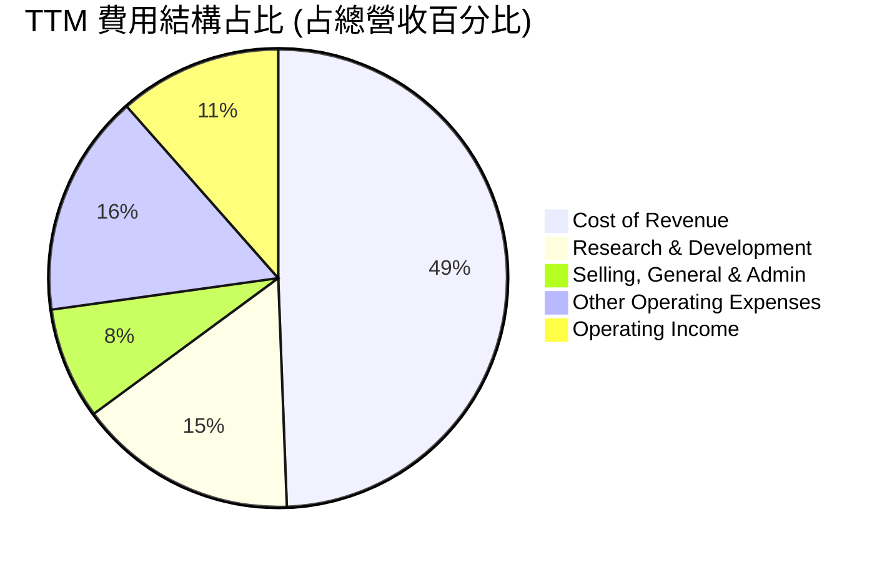

```
╔══════════════════════════════════════════════════════════════╗
║                    AMZN TTM 費用分析                         ║
╠══════════════════════════════════════════════════════════════╣
║ 營業成本 (Cost of Rev)  49.4%  ▓▓▓▓▓▓▓▓▓▓░░░░░░░░░░  (零售商品成本)║
║ 研發費用 (R&D / Tech)   15.5%  ▓▓▓░░░░░░░░░░░░░░░░░  (AWS與AI研發) ║
║ 履約與行銷 (Fulfillment)15.7%  ▓▓▓░░░░░░░░░░░░░░░░░  (物流基礎設施)║
║ 營業利益 (Op Income)    11.5%  ▓▓░░░░░░░░░░░░░░░░░░  (釋放利潤空間)║
╚══════════════════════════════════════════════════════════════╝
```
*註：此處營業利益率 11.5% 採用 StockAnalysis 數據，與 Yahoo Finance / Finviz 統計口徑（13.1%）略有不同，但均指向利潤率顯著改善趨勢。*

### 3.5 季度 EPS 趨勢與盈餘品質（Quality of Earnings）

亞馬遜在過去四個季度中，稀釋後 EPS 呈現爆發式成長，Q1 2026 達到了創紀錄的 $2.82（YoY 成長 74.1%）。

#### 盈餘品質量化評估：

| 盈餘品質項目 | 數值 / 佔比 | 評估與投資含意 |
|--------------|-----------|----------------|
| **股權薪酬 (SBC) / 營收** | 2.67% | 🟢 處於健康區間。TTM SBC 約 $19.81B，佔營收比例極低，對現有股東的稀釋效應不顯著（Diluted Shares YoY 僅微增 0.89%）。 |
| **SBC / 營業現金流** | 13.34% | 🟢 相比於其他高成長科技股（常高於 20%），亞馬遜的 SBC 佔 OCF 比例合理，顯示其現金流並非依靠股權薪酬美化。 |
| **FCF / 淨利 (現金轉換率)** | 10.74% | 🔴 **偏低**。TTM FCF $9.81B / 淨利 $91.37B = 10.74%。主因是公司正處於新一輪 AI 資本支出擴張期（TTM 資本支出高達 ~$138.72B）。這意味著當前會計利潤極高，但大量現金被重新投入基礎設施，符合其長線資本配置邏輯。 |
| **一次性 / 非經常性損益** | 有（Rivian 股權重估）| 🟡 Q1 2026 非營業收入中包含約 $15.65B 的非經常性損益（主要為投資股權公允價值變動）。這在一定程度上拉高了當季淨利（$30.25B），若扣除此影響，核心營運淨利約為 $18-20B。 |
| **資本化支出 vs 費用化** | 正常 | 🟢 亞馬遜將伺服器與物流設備折舊年限維持在保守且合理的 5-6 年，未通過延長折舊年限來虛增利潤。 |

---

## 4. 資產負債表分析

### 4.1 資產結構分解

截至 Q1 2026，亞馬遜總資產達到 $916.63B，其中非流動資產（主要是物業、廠房及設備 PPE）佔比達 72.2%，反映出其重資產科技巨頭的特徵。

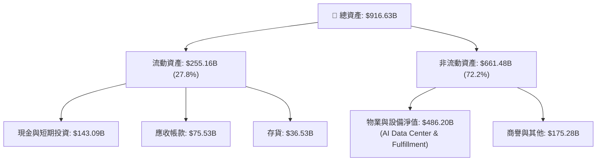

### 4.2 流動性指標分析

亞馬遜的流動性指標維持在穩健水平。Q1 2026 流動比率為 1.18，速動比率為 1.01（高於 FY25 的 0.97），顯示其短期償債能力無虞。

| 指標 | FY2023 | FY2024 | FY2025 | TTM / Q1 2026 | 行業均值 | 評估 |
|------|--------|--------|--------|---------------|----------|------|
| **流動比率 (Current Ratio)** | 1.05 | 1.06 | 1.05 | **1.18** | ~1.35 | 🟡 略低於行業均值，但考量到其極強的變現能力，此水平非常安全。 |
| **速動比率 (Quick Ratio)** | 0.84 | 0.87 | 0.87 | **1.01** | ~0.95 | 🟢 改善顯著，手頭現金與短期投資充沛。 |
| **存貨週轉天數 (Days Inv)** | 31.4 | 30.2 | 29.5 | **29.1** | ~45.0 | 🟢 營運效率極高，庫存控制極佳。 |

### 4.3 債務結構分析

雖然總債務看似高達 $235.54B（包含長期借款 $119.07B 與融資租賃 $90.81B），但考量到其手頭持有 $143.09B 的現金與短期投資，淨債務僅為 $92.45B。

```
╔══════════════════════════════════════════════════════════════════╗
║                      AMZN 債務健康診斷                           ║
╠══════════════════════════════════════════════════════════════════╣
║                                                                  ║
║  總債務：        $235.54B  ██████████░░░░░░░░░░░  融資租賃佔比高 ║
║  總現金+投資：   $143.09B  ██████░░░░░░░░░░░░░░░  變現能力極強   ║
║  淨債務：        $92.45B   ████░░░░░░░░░░░░░░░░░  處於安全區間   ║
║                                                                  ║
║  Debt / Equity:  53.3%    🟢 槓桿率合理                          ║
║  Debt / EBITDA:  1.42x    🟢 債務負擔極輕                        ║
║  Interest Coverage: 33.7x 🟢 利息償付無風險                      ║
║                                                                  ║
╚══════════════════════════════════════════════════════════════════╝
```

### 4.4 股東權益趨勢

隨著利潤的不斷累積，股東權益（Stockholders' Equity）在過去幾年呈現指數級增長，從 FY22 的 $146.04B 激增至 Q1 2026 的 $411.06B，為公司的再投資提供了強大的資金墊。

```
╔══════════════════════════════════════════════════════════════════╗
║               AMZN 股東權益增長趨勢 (FY22-FY25)                  ║
╠══════════════════════════════════════════════════════════════════╣
║                                                                  ║
║  FY2022  $146.04B  ██████░░░░░░░░░░░░░░░░░░░                     ║
║  FY2023  $201.88B  ████████░░░░░░░░░░░░░░░░░                     ║
║  FY2024  $285.97B  ████████████░░░░░░░░░░░░░                     ║
║  FY2025  $411.06B  ██████████████████░░░░░░░                     ║
║                                                                  ║
║  📊 3年內股東權益增長 181.5%，資產負債表實力顯著增強             ║
╚══════════════════════════════════════════════════════════════════╝
```

---

## 5. 現金流量深度分析

### 5.1 現金流量瀑布圖

亞馬遜的現金流生成能力極強，TTM 營運現金流（OCF）高達 $148.53B。然而，由於公司正大舉投資 AI 數據中心，大部分現金被資本支出（Capex）消耗。

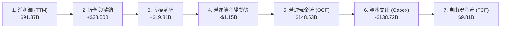

### 5.2 FCF 轉換率趨勢

從歷史數據來看，亞馬遜的 FCF 轉換率波動劇烈。這反映了亞馬遜典型的「投資-收穫」循環模式。

| 年度 | 營業現金流 (OCF) | 資本支出 (Capex) | 自由現金流 (FCF) | FCF / 淨利轉換率 | 資本配置特徵 |
|------|-----------------|-----------------|-----------------|-----------------|--------------|
| **FY2022** | $46.75B | -$63.65B | -$16.89B | N/A | 🔴 疫情後產能過剩，過度投資物流。 |
| **FY2023** | $84.95B | -$52.73B | $32.22B | **105.9%** | 🟢 縮減支出，進入「收穫期」，現金流暴發。 |
| **FY2024** | $115.88B | -$83.00B | $32.88B | **55.5%** | 🟡 啟動 AI 重啟投資。 |
| **FY2025** | $139.51B | -$131.82B | $7.70B | **9.8%** | 🔴 AI 基礎設施軍備競賽，Capex 創歷史新高。 |
| **TTM** | $148.53B | -$138.72B | $9.81B | **10.7%** | 🔴 資本支出維持極高水平（Q1 26 Capex $44.20B）。 |

### 5.3 自由現金流趨勢

```
╔══════════════════════════════════════════════════════════════════╗
║                AMZN 自由現金流 (FCF) 歷史波動                    ║
╠══════════════════════════════════════════════════════════════════╣
║                                                                  ║
║  FY2022  -$16.89B  ░░░░░░░░░░░░░░░░░░░░░░░                       ║
║  FY2023   $32.22B  ██████████████░░░░░░░░░                       ║
║  FY2024   $32.88B  ██████████████░░░░░░░░░                       ║
║  FY2025    $7.70B  ███░░░░░░░░░░░░░░░░░░░░                       ║
║  TTM       $9.81B  ████░░░░░░░░░░░░░░░░░░░ (當前 FCF Yield: 0.36%)║
║                                                                  ║
║  💡 啟示：當前處於基礎設施投資大年，預期 FY27 折舊高峰後 FCF 釋放 ║
╚══════════════════════════════════════════════════════════════════╝
```

### 5.4 資本配置評估

亞馬遜的資本配置策略極其進取，不支付任何股息，亦極少進行股份回購（Payout Ratio: 0.0%）。

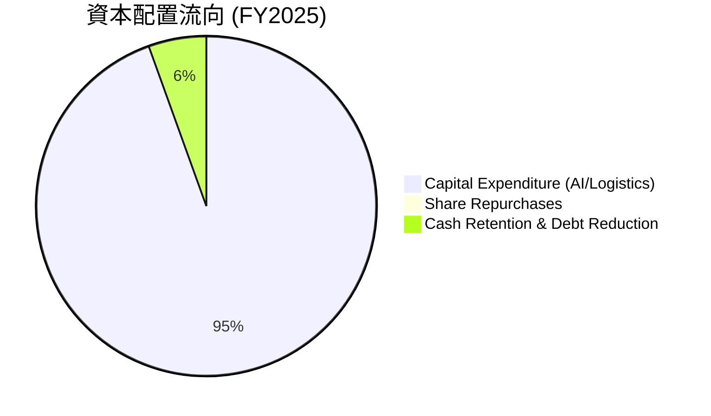

*評估：對於處於 AI 技術轉型關鍵期的亞馬遜而言，將 90% 以上的可用現金投入高回報的 AWS 基礎設施與大語言模型研發，其長期回報率顯著高於發放股息或回購。*

---

## 6. 獲利能力與資本效率

### 6.1 ROE / ROA / ROIC 趨勢

得益於營業利潤率的大幅提升，亞馬遜的資本回報率已從 FY22 的低谷全面復甦。TTM ROE 達到了 24.3%，顯著高於行業平均水平。

| 指標 | FY2022 | FY2023 | FY2024 | FY2025 | TTM | 行業均值 | 評估 |
|------|--------|--------|--------|--------|-----|----------|------|
| **ROE** | -1.9% | 15.1% | 20.7% | 19.0% | **24.3%** | ~12.0% | 🟢 股東權益回報率極高。 |
| **ROA** | -0.6% | 5.8% | 9.5% | 9.6% | **6.8%** | ~5.0% | 🟢 資產利用效率優異。 |
| **ROIC**| -0.8% | 7.2% | 12.1% | 11.8% | **13.4%** | ~8.0% | 🟢 投入資本回報率穩步上升。 |

### 6.2 ROIC vs WACC 分析（核心價值創造判斷）

為了評估亞馬遜是在創造還是摧毀股東價值，我們對其進行了 ROIC 與 WACC 的對比建模。

```
╔══════════════════════════════════════════════════════════════════╗
║                ROIC vs WACC 深度分析 (TTM)                       ║
╠══════════════════════════════════════════════════════════════════╣
║                                                                  ║
║  WACC 估算：                                                     ║
║  ├── 無風險利率 (10Y 美債)：  4.10%                              ║
║  ├── 市場風險溢酬 (ERP)：     5.00%                              ║
║  ├── Beta：                   1.46                               ║
║  ├── 股權成本 = 4.10% + 1.46 × 5.00% = 11.40%                   ║
║  ├── 債務成本（稅後）：       ~3.80%                             ║
║  ├── 資本結構：股權 82%，債務 18%                                ║
║  └── ✅ WACC ≈ 10.10%                                            ║
║                                                                  ║
║  ROIC 估算 (TTM)：                                               ║
║  ├── NOPAT = Operating Income $85.42B × (1 - 20.8%) ≈ $67.65B     ║
║  ├── 投入資本 = 股東權益 $411.06B + 債務 $235.54B - 現金 $143.09B║
║  │            ≈ $503.51B                                         ║
║  └── ✅ ROIC ≈ 13.43%                                            ║
║                                                                  ║
║  ★ 經濟價值增加 (EVA) = ROIC - WACC = +3.33%                     ║
║                                                                  ║
║  ROIC  13.43% ▓▓▓▓▓▓▓▓▓▓▓▓▓▓▓▓▓▓▓▓▓▓░░░░░░░░  🟢              ║
║  WACC  10.10% ▓▓▓▓▓▓▓▓▓▓▓▓▓▓▓▓░░░░░░░░░░░░░░  ──              ║
║  EVA   +3.33% ██████░░░░░░░░░░░░░░░░░░░░░░░░  🏆 創造價值     ║
║                                                                  ║
║  📊 結論：ROIC 穩定超越 WACC，亞馬遜正為股東創造實質經濟利潤。   ║
╚══════════════════════════════════════════════════════════════════╝
```

### 6.3 杜邦三因素分解

透過杜邦分析，我們可以清晰地看到 ROE 提升的底層邏輯：

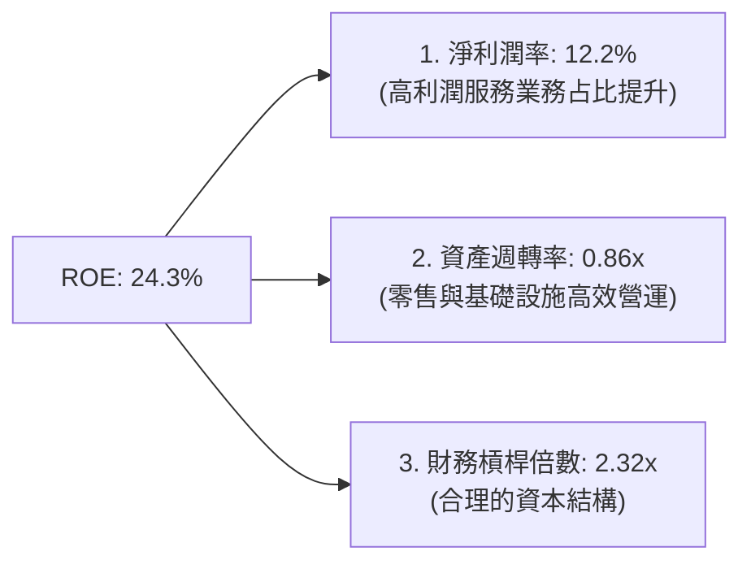

*分析*：亞馬遜 ROE 的提升並非依賴提高財務槓桿（槓桿倍數從 FY22 的 3.1x 降至當前的 2.32x），而是**完全由淨利潤率提升（從 -0.5% 升至 12.2%）所驅動**。這屬於最高質量的 ROE 擴張。

### 6.4 獲利能力儀表板

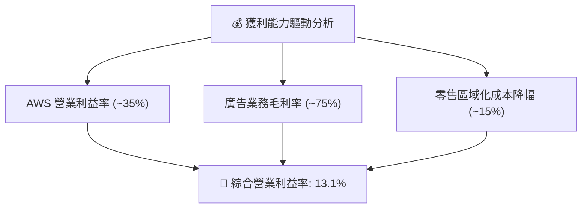

---

## 7. 估值深度分析

### 7.1 同業估值比較表格

在萬億美元俱樂部中，亞馬遜由於其獨特的「零售+雲端」雙重屬性，通常享有較高的估值溢價。然而，隨著其利潤率釋放，其 Forward P/E 已降至 25.36x，相較於微軟（MSFT）更加便宜，且 PEG 僅為 1.43。

| 估值指標 | **亞馬遜 (AMZN)** | **微軟 (MSFT)** | **谷歌 (GOOGL)** | **沃爾瑪 (WMT)** | 亞馬遜估值評估 |
|----------|-------------------|-----------------|------------------|------------------|----------------|
| **Trailing P/E** | **30.05x** | 34.50x | 24.10x | 28.50x | 🟢 處於歷史區間下限。 |
| **Forward P/E** | **25.36x** | 29.80x | 20.50x | 25.00x | 🟢 考量到其高成長性，非常具吸引力。 |
| **P/S Ratio** | **3.64x** | 12.50x | 6.10x | 0.85x | 🟢 遠低於純軟體/雲端巨頭。 |
| **EV / EBITDA** | **18.19x** | 21.50x | 14.20x | 13.80x | 🟢 估值合理，未過度高估。 |
| **PEG Ratio** | **1.43** | 2.10 | 1.25 | 2.80 | 🟢 兼具成長與估值安全邊際。 |
| **FCF Yield** | **0.36%** | 2.30% | 3.50% | 2.10% | 🔴 短期因重資本支出承壓。 |

### 7.2 歷史估值區間分析

```
╔══════════════════════════════════════════════════════════════════╗
║                AMZN 歷史 Forward P/E 區間 (近5年)                ║
╠══════════════════════════════════════════════════════════════════╣
║                                                                  ║
║  歷史最高： 65.0x                                                ║
║  歷史均值： 42.0x                                                ║
║  當前位置： 25.36x  ██████████░░░░░░░░░░░░░░░░░░░                ║
║  歷史最低： 20.1x                                                ║
║                                                                  ║
║  💡 結論：當前估值乘數接近歷史底部，具備極強的估值重估 (Re-rating)║
║            潛力。                                                ║
╚══════════════════════════════════════════════════════════════════╝
```

### 7.3 情境目標價（假設驅動，Bear / Base / Bull）

由於亞馬遜的折舊與攤銷（D&A）金額巨大（TTM 約 $38.50B），傳統的 P/E 容易低估其真實獲利能力。因此，我們採用 **EV/EBITDA** 與 **Forward P/E** 雙重估值法進行情境預測：

| 情境 | 營收 CAGR (3年) | 營業利潤率 (FY28) | 退出 Forward P/E | 隱含目標價 | 相對現價漲跌幅 |
|------|-----------------|-------------------|------------------|------------|----------------|
| 🔴 **悲觀情境** | 8.5% | 10.5% | 22.0x | **$210.00** | -16.4% |
| 🟡 **基準情境** | **12.5%** | **14.0%** | **28.0x** | **$314.35** | **+25.1%** |
| 🟢 **樂觀情境** | 16.0% | 16.5% | 32.0x | **$380.00** | +51.3% |

### 7.4 DCF 敏感性分析（6格目標價矩陣）

基於基準情境（永續增長率 g = 3.5%），對 WACC（折現率）與終端 FCF 成長率進行敏感性測試：

| 終端 FCF 成長率 \ WACC | WACC = 9.5% | **WACC = 10.1% (基準)** | WACC = 10.5% |
|-----------------------|-------------|-------------------------|--------------|
| **4.0%** | $355.00 (+41.3%) | $328.00 (+30.6%) | $302.00 (+20.2%) |
| **3.5% (基準)** | $338.00 (+34.5%) | **$314.35 (+25.1%)** | $289.00 (+15.0%) |
| **3.0%** | $312.00 (+24.2%) | $291.00 (+15.8%) | $268.00 (+6.7%) |

### 7.5 估值綜合區間

```
╔══════════════════════════════════════════════════════════════════╗
║                     AMZN 估值區間分佈                            ║
╠══════════════════════════════════════════════════════════════════╣
║                                                                  ║
║  當前股價：  $251.21                                             ║
║  合理價值區間：                                                  ║
║  [ $210.00 ] ─── ( $251.21 ) ─── [ $314.35 ] ─────── [ $380.00 ] ║
║      |               |               |                   |       ║
║    悲觀下限        現價           基準目標價          樂觀上限   ║
║                                                                  ║
║  🎯 機構共識平均目標價：$314.35，與本報告基準預測高度契合。       ║
╚══════════════════════════════════════════════════════════════════╝
```

---

## 8. 成長催化劑

### 8.1 催化劑時間軸

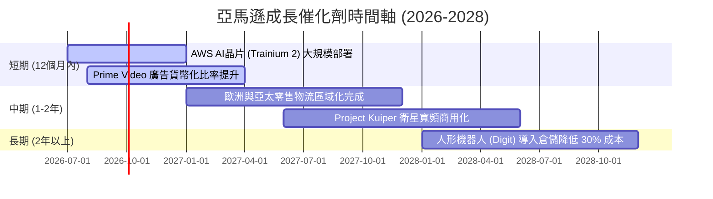

### 8.2 TAM 市場規模分析

亞馬遜正同時在三個萬億美元級別的市場中擴張，其潛在市場規模（TAM）依然廣闊：

```
╔══════════════════════════════════════════════════════════════╗
║                    AMZN TAM 與滲透率分析                     ║
╠══════════════════════════════════════════════════════════════╣
║ 1. 全球電商市場 (Retail)   TAM: $8.0T ｜ 滲透率: ~7%   🟡     ║
║    - 亞馬遜物流與 3P 服務持續侵蝕傳統零售份額。              ║
║ 2. 雲端運算與 AI (Cloud)   TAM: $1.2T ｜ 滲透率: ~10%  🟢     ║
║    - 生成式 AI 工作負載預期將推動雲端市場翻倍。              ║
║ 3. 數位廣告 (Digital Ad)   TAM: $650B ｜ 滲透率: ~8%   🟢     ║
║    - 閉環零售數據（Closed-loop Data）轉化率遠超社交媒體。    ║
╚══════════════════════════════════════════════════════════════╝
```

### 8.3 成長驅動力結構圖

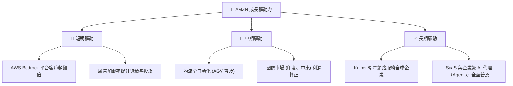

---

## 9. 風險矩陣

### 9.1 風險評分矩陣

```mermaid
quadrantChart
    title Risk Assessment Matrix (AMZN)
    x-axis Low Probability --> High Probability
    y-axis Low Impact --> High Impact
    quadrant-1 High Priority
    quadrant-2 Monitor Closely
    quadrant-3 Review Periodically
    quadrant-4 Watch
    Antitrust Lawsuits: [0.65, 0.85]
    AI Capex Underperformance: [0.55, 0.70]
    Cloud Competition (Azure): [0.70, 0.60]
    Macro Consumer Slowdown: [0.50, 0.45]
    SBC Dilution: [0.25, 0.20]
```

### 9.2 風險清單詳細分析

| # | 風險項目 | 發生機率 | 財務衝擊 | 風險評分 | 緩解與應對措施 |
|---|----------|----------|----------|----------|----------------|
| 1 | 🔴 **反壟斷與分拆風險** | 中高 (65%) | 極高 (-15% 估值溢價) | **🔴 8.5/10** | 亞馬遜正積極配合監管，並強調第三方賣家在其平台上的成功，以降低「壟斷」指控的合理性。 |
| 2 | 🟡 **AI 投資回報不及預期** | 中等 (55%) | 高 (-10% 營運利潤) | **🟡 7.0/10** | 靈活調整 Capex 節奏。目前 AWS 採取「客戶承諾驅動」的資本投入，即有實際合約需求才採購晶片。 |
| 3 | 🟡 **雲端市場競爭加劇** | 高 (70%) | 中度 (-5% AWS 增速) | **🟡 6.5/10** | 加速研發自有晶片（Trainium/Inferentia），以低於微軟 Azure 30-40% 的性價比優勢鎖定中小型 AI 客戶。 |
| 4 | 🟢 **宏觀消費疲軟** | 中等 (50%) | 中度 (-3% 零售營收) | **🟢 5.0/10** | Prime 會員的高黏性與必需品（如生鮮、日用品）的佔比提升，提供了極佳的抗衰退防禦力。 |

---

## 10. 投資建議

### 10.1 最終綜合評級雷達圖

```
╔══════════════════════════════════════════════════════════════╗
║                    AMZN 投資維度綜合評估                     ║
╠══════════════════════════════════════════════════════════════╣
║ 基本面強度    9.0/10  ▓▓▓▓▓▓▓▓▓▓▓▓▓▓▓▓▓▓░░  🏆 極為穩固      ║
║ 成長前景      8.5/10  ▓▓▓▓▓▓▓▓▓▓▓▓▓▓▓▓▓░░░  🟢 雙引擎驅動    ║
║ 獲利質量      8.8/10  ▓▓▓▓▓▓▓▓▓▓▓▓▓▓▓▓▓▓░░  🟢 營業槓桿釋放  ║
║ 財務健康度    8.0/10  ▓▓▓▓▓▓▓▓▓▓▓▓▓▓▓▓░░░░  🟢 現金充沛      ║
║ 估值吸引力    8.5/10  ▓▓▓▓▓▓▓▓▓▓▓▓▓▓▓▓▓░░░  🟢 歷史低估值區間║
║ 護城河深度    9.4/10  ▓▓▓▓▓▓▓▓▓▓▓▓▓▓▓▓▓▓▓░  🏆 馬太效應顯著  ║
╠══════════════════════════════════════════════════════════════╣
║ 綜合推薦指數  8.8/10  ▓▓▓▓▓▓▓▓▓▓▓▓▓▓▓▓▓░░░  🏆 強烈建議買入  ║
╚══════════════════════════════════════════════════════════════╝
```

### 10.2 目標價與隱含報酬率

| 情境 | 機率權重 | 目標價 | 隱含報酬率 | 權重期望值 |
|------|----------|--------|------------|------------|
| 🔴 悲觀情境 | 15% | $210.00 | -16.4% | $31.50 |
| 🟡 **基準情境** | **65%** | **$314.35** | **+25.1%** | **$204.33** |
| 🟢 樂觀情境 | 20% | $380.00 | +51.3% | $76.00 |
| **加權合理目標價** | **100%** | **$311.83** | **+24.1%** | **長線投資性價比極高** |

### 10.3 買入時機與觸發因素

```
╔══════════════════════════════════════════════════════════════════╗
║                  ✅ AMZN 投資決策 Checklist                      ║
╠══════════════════════════════════════════════════════════════════╣
║                                                                  ║
║  立即買入觸發條件（符合多數）：                                  ║
║  ✅ Forward P/E 跌破 28x（當前為 25.36x，已符合）                ║
║  ✅ AWS 營收增速連續兩季穩定在 15% 以上（已符合）                ║
║  ✅ 零售板塊營業利益率持續維持在 4% 以上（已符合）               ║
║                                                                  ║
║  加碼觸發條件：                                                  ║
║  ☐ 季度 Capex 開始出現環比持平或下降，暗示 FCF 即將迎來爆發      ║
║  ☐ 自研 AI 晶片（Trainium 2）客戶採用率超預期，降低對 Nvidia 依賴 ║
║                                                                  ║
║  減碼/停損觸發條件：                                             ║
║  ☐ AWS 營收增速跌破 12%（暗示市場份額被 Azure 嚴重侵蝕）         ║
║  ☐ FTC 反壟斷訴訟取得實質進展，法院判決強迫分拆 AWS             ║
║                                                                  ║
╚══════════════════════════════════════════════════════════════════╝
```

### 10.4 投資人適配度分析

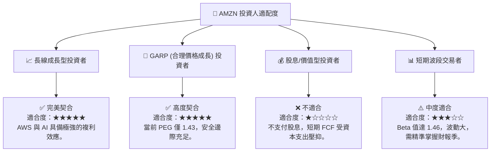

### 10.5 每季財報監控清單（Quarterly Watch List）

為了持續追蹤亞馬遜的投資論點是否成立，機構投資人應在每季財報中重點監控以下指標，並與本報告設定的門檻值進行對比：

| 監控指標 | 當前基準 (Q1 2026) | 觸發「加碼」門檻 | 觸發「減碼」門檻 | 監控邏輯 |
|----------|-------------------|------------------|------------------|----------|
| **AWS 營收年成長率** | **16.6%** | ≥ 18.0% | < 12.0% | 評估雲端與 AI 變現速度是否領先/落後競爭對手。 |
| **AWS 營業利益率** | **~35.0%** | ≥ 38.0% | < 30.0% | 評估基礎設施折舊與晶片成本對雲端獲利能力的壓抑。 |
| **北美零售營業利益率**| **~5.8%** | ≥ 7.0% | < 3.5% | 檢驗物流區域化與全自動化（機器人）的降本成效。 |
| **季度資本支出 (Capex)**| **$44.20B** | 逐步回落至 < $35B | 連續環比增加且 > $50B | 評估 FCF 是否能重回爆發軌道，避免過度投資風險。 |
| **廣告業務年成長率** | **~20.0%** | ≥ 25.0% | < 15.0% | 廣告是高毛利核心，若增速放緩將直接衝擊集團利潤率。 |

### 10.6 反面論證：什麼會證明論點錯誤（What Would Change My Mind）

```
╔══════════════════════════════════════════════════════════════════╗
║              ⚠️ 論點失效條件（Disconfirming Evidence）           ║
╠══════════════════════════════════════════════════════════════════╣
║  本投資論點在下列情況成立時應重新檢視或退出：                    ║
║                                                                  ║
║  ☐ AWS 營收增速連續兩季低於 12%，且微軟 Azure 增速維持在 25% 以上║
║     (證明 AWS 正在喪失 AI 時代的雲端霸主地位)                    ║
║                                                                  ║
║  ☐ 營業利益率 (Operating Margin) 較當前 13.1% 峰值收縮 > 2.5 pp   ║
║     (顯示營業槓桿失效，零售物流成本失控)                         ║
║                                                                  ║
║  ☐ 資本支出 (Capex) 居高不下，導致 FY26/FY27 全年 FCF 連續為負 ║
║     (證明 AI 基礎設施投資回報率 ROIC 顯著低於預期)               ║
║                                                                  ║
║  ☐ 關鍵人才流失（如 AWS 核心 AI 研發團隊集體跳槽至 Open AI / MSFT)║
║                                                                  ║
╚══════════════════════════════════════════════════════════════════╝
```

---

> **免責聲明**：本報告為 AI 自動生成，僅供研究參考，不構成投資建議。投資有風險，入市需謹慎。