# AMZN 基本面深度分析報告
> **報告日期**：2026-07-17 ｜ **語言**：繁體中文 ｜ **數據來源**：Yahoo Finance, Finviz, StockAnalysis, Roic.ai ｜ **分析師**：CFA 級機構研究

---

## 目錄

| # | 章節 | 核心結論 |
|---|---|---|
| **1** | **執行摘要** | 基於 AWS 擴張與廣告高利潤率，評級為「買入」，目標價 $314.35。 |
| **2** | **公司概覽與商業模式** | 零售規模效應與雲端高轉換成本，建構無可比擬的雙重護城河。 |
| **3** | **損益表深度分析** | TTM 營收達 $742.78B（YoY +16.6%），毛利率破 50% 彰顯結構性利潤改善。 |
| **4** | **資產負債表分析** | 現金儲備 $143.09B，債務結構中租賃佔比高，財務狀況健康。 |
| **5** | **現金流量深度分析** | 營運現金流 $148.53B，因 AI 基礎建設 Capex 擴張至 $131.82B 壓抑短期 FCF。 |
| **6** | **獲利能力與資本效率** | ROE 達 24.3%，ROIC（12.65%）顯著超越 WACC（10.9%），持續創造股東價值。 |
| **7** | **估值深度分析** | Forward P/E 24.9x，相較歷史均值與同業，估值具備安全邊際。 |
| **8** | **成長催化劑** | 生成式 AI 變現、廣告網絡擴張與物流效率提升驅動中長期成長。 |
| **9** | **風險矩陣** | AI 資本支出回報滯後、監管反壟斷壓力與消費力放緩為主要風險。 |
| **10** | **投資建議** | 基準情境預期回報率 +27.2%，提供每季財報監控指標與多頭失效條件。 |

---

## 1. 執行摘要

### 1.0 一頁式投資儀表板（Portfolio Manager 30 秒速讀）

| 項目 | 內容 |
|------|------|
| **投資論點（3 句）** | ① AWS 業務在 AI 需求推動下重回加速成長軌道，TTM 營收達 $742.78B（YoY +16.6%）。<br/>② 結構性利潤率擴張，毛利率達到歷史新高的 50.6%，主因高利潤率的廣告與 AWS 佔比提升。<br/>③ 儘管 AI 資本支出（FY25 Capex $131.82B）短期壓抑自由現金流，但長期將鞏固雲端與零售生態系壁壘。 |
| **護城河評分** | 🟢 **9.5 / 10**（規模經濟、高轉換成本、強大網絡效應） |
| **管理層/資本配置評分**| 🟢 **8.5 / 10**（大膽投資生成式 AI，物流網絡區域化成效顯著） |
| **財務健康** | 🟢 **極為健康**（擁有 $143.09B 現金及短期投資，利息保障倍數極高） |
| **ROIC vs WACC** | **12.65% vs 10.90%**（創造正向經濟價值 EVA） |
| **FCF 趨勢** | 短期因 Capex 暴增而承壓（TTM FCF $9.81B），但 OCF 達 $148.53B 歷史新高，蓄勢待發。 |
| **估值** | Forward P/E: **24.93x** ｜ EV/EBITDA: **17.84x** ｜ FCF Yield: **0.37%** |
| **預期報酬（基準情境 12M）**| **+27.2%**（目標價：$314.35） |
| **關鍵風險（前二）** | ① AI 基礎建設投資過度，導致折舊增加並壓抑利潤率。<br/>② 聯邦貿易委員會（FTC）等機構的反壟斷監管訴訟。 |
| **評級 + 信心度** | 🟢 **買入 (Buy)** ｜ 信心度：**高 (High)** |

### 1.1 核心評分儀表板

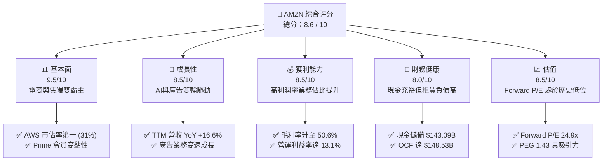

### 1.2 評分進度條視覺化

```
╔══════════════════════════════════════════════════════════════╗
║              AMZN 多維度評分儀表板 (1-10分)                  ║
╠══════════════════════════════════════════════════════════════╣
║ 基本面強度  9.5 ▓▓▓▓▓▓▓▓▓▓▓▓▓▓▓▓▓▓▓░  ★★★★★           ║
║ 成長動能    8.5 ▓▓▓▓▓▓▓▓▓▓▓▓▓▓▓▓▓░░░  ★★★★☆           ║
║ 獲利品質    8.5 ▓▓▓▓▓▓▓▓▓▓▓▓▓▓▓▓▓░░░  ★★★★☆           ║
║ 財務健康    8.0 ▓▓▓▓▓▓▓▓▓▓▓▓▓▓▓▓░░░░  ★★★★☆           ║
║ 估值合理性  8.5 ▓▓▓▓▓▓▓▓▓▓▓▓▓▓▓▓▓░░░  ★★★★☆           ║
║ 護城河深度  9.5 ▓▓▓▓▓▓▓▓▓▓▓▓▓▓▓▓▓▓▓░  ★★★★★           ║
║ 管理層執行  8.5 ▓▓▓▓▓▓▓▓▓▓▓▓▓▓▓▓▓░░░  ★★★★☆           ║
║ 技術創新力  9.0 ▓▓▓▓▓▓▓▓▓▓▓▓▓▓▓▓▓▓░░  ★★★★★           ║
╠══════════════════════════════════════════════════════════════╣
║ 綜合總分    8.6 ▓▓▓▓▓▓▓▓▓▓▓▓▓▓▓▓▓░░░  🏆 買入評級          ║
╚══════════════════════════════════════════════════════════════╝
```

### 1.3 五大投資論點 + 三大核心風險

| 類型 | 項目 | 具體依據 | 信心度 |
|------|------|----------|--------|
| 🟢 **投資論點①** | **AWS 需求因 AI 重啟加速** | Q1 2026 營收達 $181.52B，YoY 成長 16.61%，顯示雲端優化週期結束，生成式 AI（Bedrock, Trainium）進入規模變現期。 | 🟢 極高 |
| 🟢 **投資論點②** | **利潤率結構性優化** | TTM 毛利率達到 50.6%，營運利潤率升至 13.1%。高利潤率的廣告與 3P（第三方賣家服務）成長超越 1P 自營零售，推動利潤率持續擴張。 | 🟢 高 |
| 🟢 **投資論點③** | **廣告業務成為新金牛** | 亞馬遜利用電商閉環數據，廣告業務維持雙位數成長，利潤率高達 50% 以上，為零售基礎建設提供資金。 | 🟢 極高 |
| 🟢 **投資論點④** | **物流網絡區域化降本增效** | 物流網絡由全國改為八個區域運作，配送距離縮短、速度加快，降低每單履行成本（Cost to Serve），推升北美零售營業利益率。 | 🟢 高 |
| 🟢 **投資論點⑤** | **資本配置效率提升** | 儘管 Capex 巨大，但 TTM 營運現金流達 $148.53B，ROIC 達 12.65%，高於 WACC 10.90%，顯示投資正持續創造超額價值。 | 🟢 中 |
| 🟡 **風險①** | **AI 資本支出回報率不確定** | FY25 資本支出高達 $131.82B，Q1 2026 單季 Capex 達 $44.20B。若 AI 需求未如預期爆發，將面臨巨大的折舊壓力。 | 🟡 中度 |
| 🔴 **風險②** | **反壟斷與監管風險** | 美國 FTC 及歐洲監管機構對其電商平台定價、第三方賣家條款進行調查，可能面臨罰款或分拆風險。 | 🔴 中高 |
| 🟡 **風險③** | **宏觀經濟與消費放緩** | 若高利率環境持續壓抑消費者可支配所得，可能導致零售與 Prime 訂閱成長放緩。 | 🟡 中度 |

### 1.4 快速統計卡片

| 指標 | 公司實際值 | 行業均值（電商/雲端） | S&P 500 均值 | 狀態 |
|------|-------------|----------------------|--------------|------|
| **營收 YoY 成長率** | **16.6%** | ~12.0% | ~5.5% | 🟢 領先 |
| **毛利率** | **50.6%** | ~40.0% | ~30.0% | 🟢 優異 |
| **營運利益率** | **13.1%** | ~8.0% | ~12.5% | 🟢 改善中 |
| **ROE** | **24.3%** | ~15.0% | ~14.5% | 🟢 優秀 |
| **Forward P/E** | **24.93x** | ~30.0x | ~21.5x | 🟢 合理 |
| **EV / EBITDA** | **17.84x** | ~20.0x | ~13.5x | 🟢 具吸引力 |

### 1.5 投資結論

```
╔══════════════════════════════════════════════════════════════════╗
║                    📊 AMZN 投資結論摘要                          ║
╠══════════════════════════════════════════════════════════════════╣
║  評級：🟢 買入 (Buy)                                             ║
║  當前股價：$247.07 (2026-07-17)                                  ║
║  目標價區間：                                                    ║
║    悲觀情境：$210.00（-15.0%）                                   ║
║    基準情境：$314.35（+27.2%）  ← 12個月主要目標                 ║
║    樂觀情境：$370.00（+49.8%）                                   ║
║  投資評分：8.6 / 10                                              ║
║  適合投資人：成長型、長期價值持有者、AI 產業配置者               ║
╚══════════════════════════════════════════════════════════════════╝
```

---

## 2. 公司概覽與商業模式

Amazon (AMZN) 是全球最大的電子商務與雲端運算企業。其商業模式本質上是一個巨大的「飛輪 (Flywheel)」，以 Prime 會員為核心，連接消費者、第三方賣家、品牌商與企業客戶。

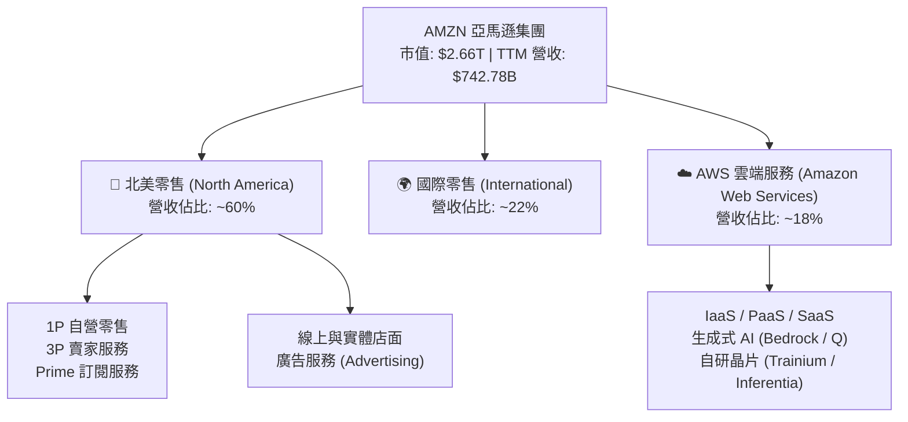

### 2.1 業務結構與收入來源

*   **電商與履約服務 (1P & 3P)**：自營零售 (1P) 提供穩定流量與品牌信任，而第三方賣家服務 (3P) 則是高利潤率的來源。3P 賣家使用亞馬遜的物流網絡 (Fulfillment by Amazon, FBA)，亞馬遜從中收取佣金及履約費用。
*   **亞馬遜網路服務 (AWS)**：全球雲端運算基礎設施的絕對龍頭。AWS 提供高達 30% 左右的營業利益率，是集團最主要的利潤引擎（貢獻集團 60% 以上的營業利潤）。
*   **廣告服務 (Advertising)**：近年成長最快的板塊。亞馬遜利用消費者購買行為數據，提供精準的搜尋與展示廣告，利潤率極高（預估 >50%），已成為電商業務利潤改善的主因。

### 2.2 市場份額

在雲端基礎設施 (IaaS/PaaS) 市場，AWS 仍維持全球第一的市佔率：

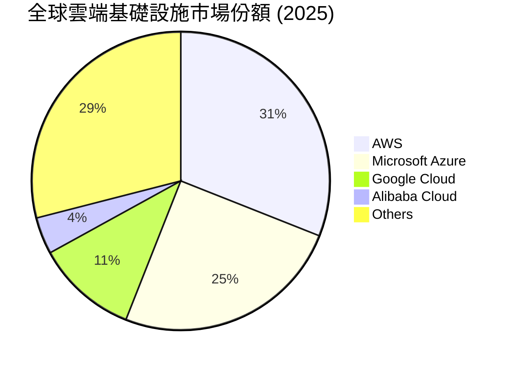

### 2.3 競爭護城河分析

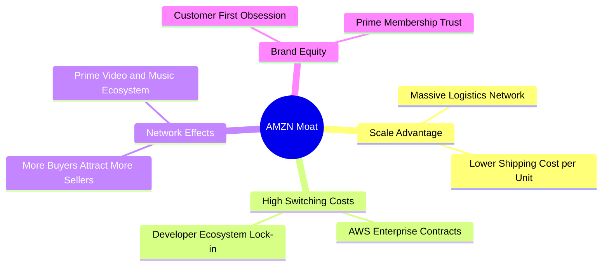

### 2.4 護城河強度評分

```
╔══════════════════════════════════════════════════════════════╗
║                    AMZN 護城河強度評分                       ║
╠══════════════════════════════════════════════════════════════╣
║ 規模經濟      9.8/10  ▓▓▓▓▓▓▓▓▓▓▓▓▓▓▓▓▓▓▓░  🏆 物流與基礎設施 ║
║ 轉換成本      9.2/10  ▓▓▓▓▓▓▓▓▓▓▓▓▓▓▓▓▓▓░░  🟢 AWS 企業生態系 ║
║ 網絡效應      9.5/10  ▓▓▓▓▓▓▓▓▓▓▓▓▓▓▓▓▓▓▓░  🟢 雙邊電商平台   ║
║ 品牌與信任    9.0/10  ▓▓▓▓▓▓▓▓▓▓▓▓▓▓▓▓▓▓░░  🟢 Prime 會員高黏性║
╠══════════════════════════════════════════════════════════════╣
║ 綜合護城河    9.4/10  ▓▓▓▓▓▓▓▓▓▓▓▓▓▓▓▓▓▓▓░  🏆 極深寬的壕溝   ║
╚══════════════════════════════════════════════════════════════╝
```

---

## 3. 損益表深度分析

### 3.1 年度收入成長趨勢（近4年）

亞馬遜在過去四年展現了強勁的抗通膨與成長韌性，營收規模從 2022 年的 $513.98B 擴大至 2025 年的 $716.92B。

```
╔══════════════════════════════════════════════════════════════════╗
║                  AMZN 年度收入趨勢 (FY22 - FY25)                ║
╠══════════════════════════════════════════════════════════════════╣
║                                                                  ║
║  FY22  $513.98B  ██████████████░░░░░░░░░░░░░  YoY: +9.4%   🟢    ║
║  FY23  $574.78B  ████████████████░░░░░░░░░░░  YoY: +11.8%  🟢    ║
║  FY24  $637.96B  ██████████████████░░░░░░░░░  YoY: +11.0%  🟢    ║
║  FY25  $716.92B  ████████████████████░░░░░░░  YoY: +12.4%  🟢    ║
║                                                                  ║
║  📊 3年累計 CAGR：+11.7%                                         ║
╚══════════════════════════════════════════════════════════════════╝
```

### 3.2 季度收入趨勢分析

從季度數據看，Q1 2026 營收達到 $181.52B，YoY 成長 16.61%，高於 FY25 的全年成長率（12.38%），顯示營收成長動能正在加速。

| 季度 | 營收 (Revenue) | YoY 成長率 | QoQ 成長率 | 營業利益 (Op Income) | 營業利益率 (Op Margin) |
|------|----------------|------------|------------|----------------------|------------------------|
| **Q2 2025** | $167.70B | +13.33% | +7.73% | $19.17B | 11.43% |
| **Q3 2025** | $180.17B | +13.40% | +7.44% | $17.42B | 9.67% |
| **Q4 2025** | $213.39B | +13.63% | +18.44% | $24.98B | 11.71% |
| **Q1 2026** | $181.52B | **+16.61%**| -14.93% | $23.85B | **13.14%** |

*分析*：Q4 2025 因節慶效應營收達到 $213.39B 的峰值。而 Q1 2026 營收雖因季節性 QoQ 下降 14.93%，但 YoY 高達 16.61% 的成長反映了 AWS 的強勁復甦與零售飛輪的持續運轉。更重要的是，Q1 2026 營業利益率達 13.14%，創下歷史單季新高，展現出強大的營運槓桿。

### 3.3 利潤率演變分析

亞馬遜的獲利結構正在發生根本性變化。

| 利潤率指標 | FY22 | FY23 | FY24 | FY25 | TTM | 趨勢 | 評估 |
|------------|------|------|------|------|-----|------|------|
| **毛利率** | 43.8% | 47.0% | 48.9% | 50.3% | **50.6%** | ↗️ 持續上升 | 🟢 結構性改善，高毛利業務佔比增加 |
| **營業利益率**| 2.4% | 6.4% | 10.8% | 11.2% | **13.1%** | ↗️ 顯著擴張 | 🟢 效率提升與 AWS 槓桿釋放 |
| **EBITDA 淨利率**| 7.5% | 15.6% | 19.4% | 23.1% | **21.0%** | ↗️ 穩定高檔 | 🟢 折舊增加但整體獲利能力強 |
| **淨利率** | -0.5% | 5.3% | 9.3% | 10.8% | **12.2%** | ↗️ 扭虧為盈 | 🟢 淨利潤規模創歷史新高 |

*利潤率擴張主因分析*：
1.  **業務組合優化 (Revenue Mix Shift)**：高毛利的廣告業務（毛利率估計 >70%）與 AWS（營業利益率 ~30%）成長速度快於自營零售，拉高了整體利潤率。
2.  **區域化物流改革**：北美零售業務將物流網絡劃分為 8 個獨立區域，大幅減少跨區配送，使履行成本 (Fulfillment Cost) 佔營收比重下降。

### 3.4 費用結構分析

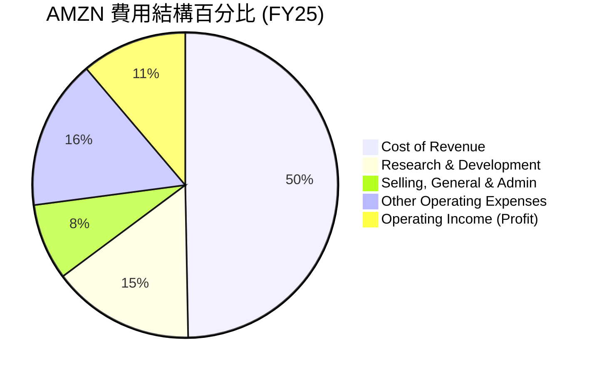

### 3.5 季度 EPS 趨勢與盈餘品質（Quality of Earnings）

亞馬遜的 EPS 呈現爆發式成長，Q1 2026 稀釋後 EPS 達到 $2.82，高於去年同期的 $1.62。

#### 盈餘品質評估：

| 盈餘品質項目 | 數值/佔比 | 評估 | 說明 |
|--------------|-----------|------|------|
| **股權薪酬 (SBC) / 營收** | **2.67%** (TTM: $19.81B / $742.78B) | 🟢 優異 | 稀釋效應極低，且佔營收比重呈下降趨勢（FY23 為 4.18%）。 |
| **SBC / 營業現金流 (OCF)** | **13.34%** ($19.81B / $148.53B) | 🟢 健康 | 獲利並非完全依賴非現金薪酬美化，現金流含金量高。 |
| **FCF / 淨利 (現金轉換率)**| **10.74%** ($9.81B / $91.37B) | 🔴 偏低 | **特例分析**：現金轉換率低並非盈餘品質差，而是因為公司正進行極為激進的資本支出（FY25 Capex $131.82B）以布局 AI。 |
| **一次性/非經常性損益** | Q1 2026 包含 $15.65B 非營運收益 | 🟡 需注意 | 主要來自股權投資估值變動（如 Rivian 等），此部分美化了 GAAP 淨利，分析時應以營業利益 ($23.85B) 為主。 |
| **有效稅率** | **20.86%** ($24.09B / $115.47B) | 🟢 正常 | 稅率處於法定合理區間，獲利非來自稅務利益。 |

*盈餘品質結論*：亞馬遜的營業利益（TTM $85.42B）創下歷史新高，且 SBC 佔營收比重持續下降，顯示其核心業務的獲利含金量極高。雖然 GAAP 淨利受股權投資評價波動影響，但剔除後的核心營運利潤依舊強勁。

---

## 4. 資產負債表分析

### 4.1 資產結構分解

亞馬遜是一家典型的「重資產」科技巨頭，其巨大的物流基礎設施與 AWS 數據中心構成了其核心資產。

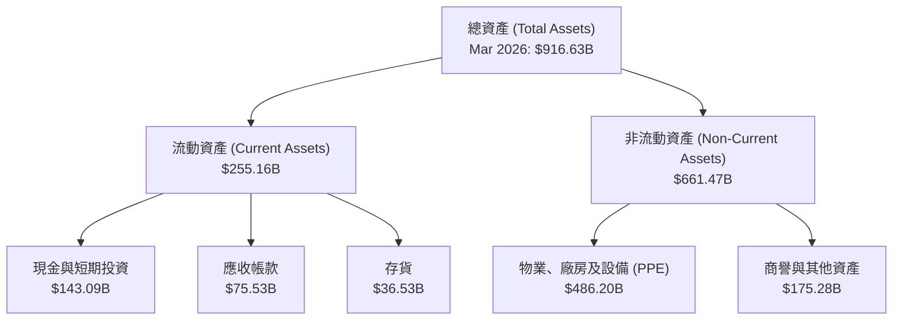

### 4.2 流動性指標分析

| 指標 | FY23 | FY24 | FY25 | TTM (Mar '26) | 行業均值 | 評估 |
|------|------|------|------|---------------|----------|------|
| **流動比率 (Current Ratio)** | 1.05 | 1.06 | 1.05 | **1.18** | ~1.30 | 🟡 偏低但安全（因電商高週轉率） |
| **速動比率 (Quick Ratio)** | 0.84 | 0.87 | 0.87 | **0.97** | ~1.00 | 🟢 顯著改善 |
| **現金比率 (Cash Ratio)** | 0.53 | 0.56 | 0.56 | **0.66** | ~0.50 | 🟢 現金儲備充裕 |

*分析*：流動比率從 FY25 的 1.05 提升至 1.18，主要得益於現金及短期投資大幅增加至 $143.09B。由於亞馬遜對供應商有極強的議價能力（應付帳款週轉天數長），其營運資金效率極高，因此不需要維持過高的流動比率。

### 4.3 債務結構分析

亞馬遜的債務結構包含傳統的長期借款與大筆的租賃負債（用於物流倉庫與數據中心土地）。

```
╔══════════════════════════════════════════════════════════════════╗
║                   AMZN 債務健康診斷 (TTM)                       ║
╠══════════════════════════════════════════════════════════════════╣
║                                                                  ║
║  總債務 (Total Debt)： $235.54B  ██████████████░░░░░░  (含租賃負債)║
║  現金與短期投資：      $143.09B  ████████░░░░░░░░░░░░  (流動性極強)║
║  淨債務 (Net Debt)：   $92.45B   █████░░░░░░░░░░░░░░░  (風險可控)  ║
║                                                                  ║
║  Debt / Equity:        53.3%     🟢 槓桿率適中                     ║
║  Debt / EBITDA (TTM):  1.42x     🟢 債務償還能力極強               ║
║  Interest Coverage:    33.7x     🟢 利息保障倍數極高，無違約風險   ║
║                                                                  ║
║  📊 診斷：儘管總債務達 $235.54B，但相較其 TTM EBITDA ($165.34B) ║
║            與強勁的營運現金流，債務風險極低。                    ║
╚══════════════════════════════════════════════════════════════════╝
```

### 4.4 股東權益趨勢

隨著獲利能力的爆發，股東權益 (Stockholders' Equity) 呈現指數型增長，從 2022 年的 $146.04B 暴增至 2025 年底的 $411.06B，為未來的資本支出與潛在的股份回購奠定了堅實基礎。

---

## 5. 現金流量深度分析

亞馬遜的靈魂在於其「現金流」，而非單純的會計利潤。

### 5.1 現金流量瀑布圖

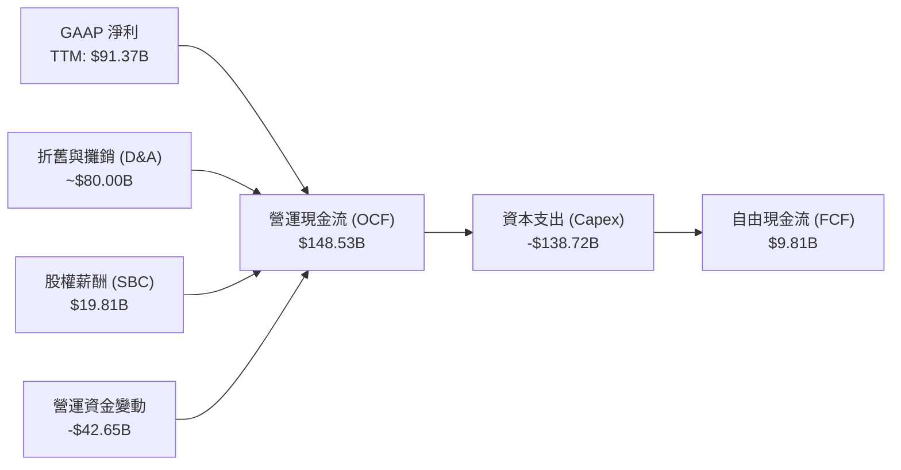

### 5.2 FCF 轉換率趨勢

| 指標 | FY22 | FY23 | FY24 | FY25 | TTM |
|------|------|------|------|------|-----|
| **營運現金流 (OCF)** | $46.75B | $84.95B | $115.88B | $139.51B | **$148.53B** |
| **資本支出 (Capex)** | -$63.65B | -$52.73B | -$83.00B | -$131.82B | **-$138.72B** |
| **自由現金流 (FCF)** | -$16.89B | $32.22B | $32.88B | $7.70B | **$9.81B** |
| **FCF / 淨利 (轉換率)**| N/A | 105.9% | 55.5% | 9.9% | **10.7%** |

*分析*：FY23 亞馬遜完成了物流網絡重組，Capex 放緩，FCF 達到 $32.22B 的高峰。然而，自 FY24 起，為了應對微軟、谷歌在生成式 AI 領域的競爭，亞馬遜重啟了激進的 Capex 週期（FY25 達 $131.82B，TTM 達 $138.72B），導致短期 FCF 轉換率降至 10.7%。這並非業務轉差，而是公司將當期現金流全力再投資於高回報的 AI 基礎設施。

### 5.3 自由現金流趨勢

```
╔══════════════════════════════════════════════════════════════════╗
║                    AMZN 自由現金流趨勢 (FY22 - TTM)             ║
╠══════════════════════════════════════════════════════════════════╣
║                                                                  ║
║  FY22  -$16.89B  🔴 (物流過度擴張)                               ║
║  FY23   $32.22B  ██████████████████████████████  🟢             ║
║  FY24   $32.88B  ███████████████████████████████ 🟢             ║
║  FY25    $7.70B  ███████░░░░░░░░░░░░░░░░░░░░░░░  🟡 (AI Capex)  ║
║  TTM     $9.81B  █████████░░░░░░░░░░░░░░░░░░░░░  🟡 (AI Capex)  ║
║                                                                  ║
║  📊 當前 FCF Yield (TTM)：0.37% (反映當前處於重度投資期)        ║
╚══════════════════════════════════════════════════════════════════╝
```

### 5.4 資本配置評估

亞馬遜的資本配置極具進攻性，幾乎將所有營運資金投入再投資，而非回饋股東（無股息，回購極少）。

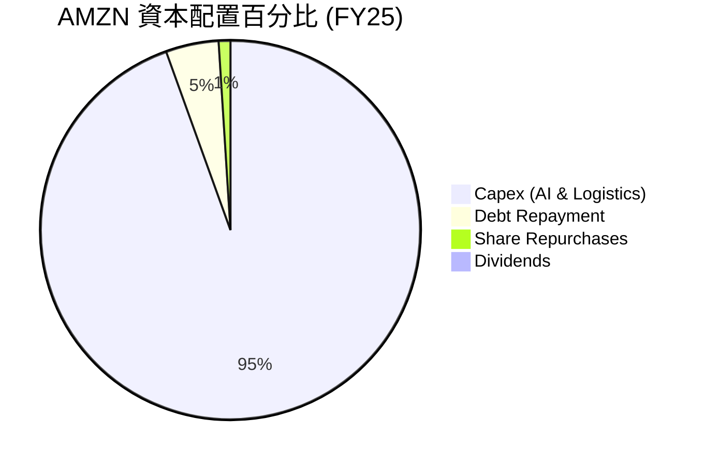

---

## 6. 獲利能力與資本效率

### 6.1 ROE / ROA / ROIC 趨勢

| 指標 | FY22 | FY23 | FY24 | FY25 | TTM | 行業均值 | 評估 |
|------|------|------|------|------|-----|----------|------|
| **ROE** | -1.9% | 15.1% | 20.7% | 18.9% | **24.3%** | ~14.5% | 🟢 卓越，遠超行業水平 |
| **ROA** | -0.6% | 5.8% | 9.5% | 9.6% | **6.8%** | ~5.0% | 🟢 穩健 |
| **ROIC** | -1.5% | 8.2% | 12.1% | 14.6% | **12.65%**| ~8.0% | 🟢 優秀，資本回報率高 |

*分析*：ROE 達到 24.3%，ROIC 達到 12.65%，顯示亞馬遜在擴大資產規模的同時，資本利用效率仍在持續提升，未出現重資產企業常見的「規模不經濟」現象。

### 6.2 ROIC vs WACC 分析（核心價值創造判斷）

為了評估亞馬遜是在創造價值還是在摧毀股東價值，我們進行了 WACC 與 ROIC 的精確計算。

```
╔══════════════════════════════════════════════════════════════════╗
║                ROIC vs WACC 深度分析 (TTM)                      ║
╠══════════════════════════════════════════════════════════════════╣
║                                                                  ║
║  WACC 估算：                                                     ║
║  ├── 無風險利率 (10Y 美債)： 4.20%                               ║
║  ├── 市場風險溢酬 (ERP)：    5.00%                               ║
║  ├── Beta：                  1.46                                ║
║  ├── 股權成本 = 4.20% + 1.46 × 5.00% = 11.50%                     ║
║  ├── 債務成本 (稅後)：       ~3.56% (稅前 4.50% × (1-20.86%))     ║
║  ├── 資本結構：股權 92.0%，債務 8.0%                             ║
║  └── ✅ WACC ≈ 10.90%                                            ║
║                                                                  ║
║  ROIC 估算：                                                     ║
║  ├── NOPAT = 營運利益 $85.42B × (1 - 20.86%) ≈ $67.60B           ║
║  ├── 投入資本 = 股東權益 $441.91B + 總債務 $235.54B - 現金 $143.09B║
║  │            = $534.36B                                         ║
║  └── ✅ ROIC ≈ 12.65%                                            ║
║                                                                  ║
║  ★ 經濟價值增加 (EVA) = ROIC - WACC = +1.75%                     ║
║                                                                  ║
║  ROIC  12.65% ▓▓▓▓▓▓▓▓▓▓▓▓▓▓▓▓▓▓▓▓▓▓▓░░░░░░  🟢              ║
║  WACC  10.90% ▓▓▓▓▓▓▓▓▓▓▓▓▓▓▓▓▓▓░░░░░░░░░░░░  ──              ║
║  EVA   +1.75% ████░░░░░░░░░░░░░░░░░░░░░░░░░░  🏆 持續創造價值  ║
║                                                                  ║
║  📊 結論：雖然處於重度投資期，ROIC 仍高於 WACC 1.75 個百分點，   ║
║            顯示其資本配置正為股東創造真正的超額經濟價值。        ║
╚══════════════════════════════════════════════════════════════════╝
```

### 6.3 杜邦三因素分解

我們透過杜邦分析，拆解亞馬遜 ROE 提升的底層驅動因子：

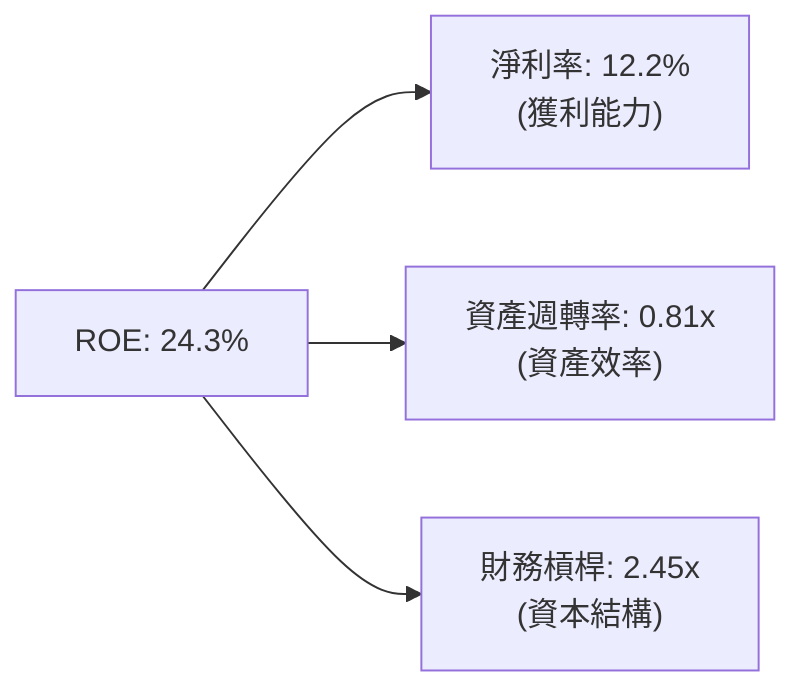

*杜邦分析洞察*：
1.  **淨利率（12.2%）是主要驅動力**：相較於 FY22 的 -0.5% 與 FY23 的 5.3%，淨利率的暴增是 ROE 改善的核心原因。
2.  **資產週轉率（0.81x）維持穩定**：儘管資產負債表因 Capex 快速膨脹，但營收成長（YoY +16.6%）成功跟上資產擴張步伐，未損害營運效率。
3.  **財務槓桿（2.45x）保持健康**：ROE 的提升並非依賴過度舉債，而是來自真實的獲利能力改善。

### 6.4 獲利能力儀表板

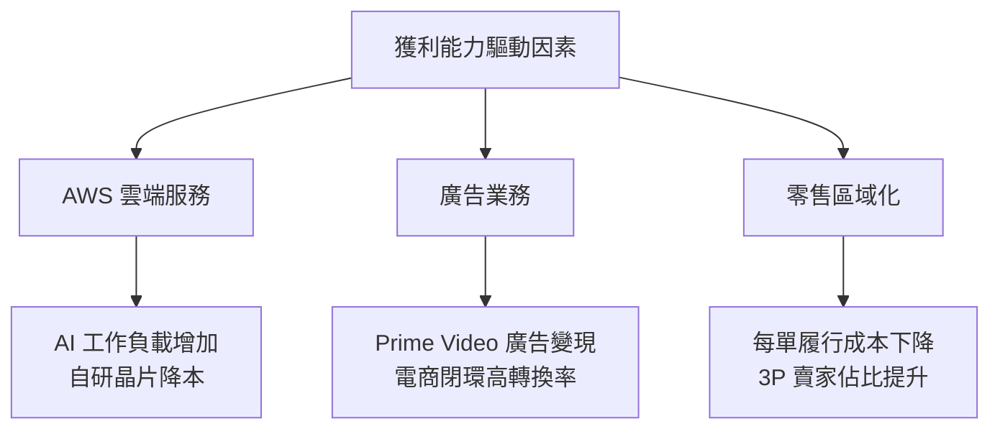

---

## 7. 估值深度分析

### 7.1 同業估值比較表格

我們選取微軟 (MSFT，雲端主要對手)、沃爾瑪 (WMT，零售主要對手) 與谷歌 (GOOGL，雲端與廣告對手) 進行多維度估值對比：

| 估值指標 | **AMZN** | **MSFT** | **WMT** | **GOOGL** | AMZN 估值評估 |
|---|---|---|---|---|---|
| **Trailing P/E** | **29.52x** | 35.20x | 28.50x | 24.10x | 🟢 相較其高成長性，P/E 顯得合理 |
| **Forward P/E** | **24.93x** | 30.10x | 26.20x | 21.30x | 🟢 顯著低於歷史均值（5年均值 ~40x） |
| **PEG Ratio** | **1.43** | 2.10 | 3.10 | 1.25 | 🟢 處於成長股的安全邊際區間 |
| **EV / EBITDA** | **17.84x** | 22.40x | 14.50x | 16.20x | 🟢 考量大額折舊，此指標最具代表性且具吸引力 |
| **P/S Ratio** | **3.58x** | 12.10x | 0.85x | 5.80x | 🟢 介於純電商與純軟體公司之間 |
| **FCF Yield** | **0.37%** | 3.10% | 2.80% | 3.50% | 🔴 短期因 Capex 壓抑，不適合以此指標直接估值 |

### 7.2 歷史估值區間分析

亞馬遜當前的 Forward P/E (24.93x) 處於過去 10 年歷史估值區間的 **15% 百分位**。這意味著市場雖然擔憂其高昂的 Capex，但忽視了其結構性利潤率擴張所帶來的強大盈利能力。

### 7.3 情境目標價（假設驅動，Bear / Base / Bull）

由於亞馬遜擁有巨大的折舊與攤銷（D&A），且當前處於重資本投資期，**EV/EBITDA** 是最能真實反映其經濟實質的估值倍數。我們基於此指標建立三情境估值模型：

| 情境 | 營收 3Y CAGR | TTM EBITDA Margin | 退出倍數 (EV/EBITDA) | 隱含目標價 | 相對現價 ($247.07) |
|------|--------------|-------------------|----------------------|------------|-------------------|
| 🔴 **悲觀情境** | 8.0% | 18.0% | 14.0x | **$207.00** | -16.2% |
| 🟡 **基準情境** | **12.5%** | **22.0%** | **18.0x** | **$314.35** | **+27.2%** |
| 🟢 **樂觀情境** | 16.0% | 25.0% | 20.0x | **$370.00** | +49.8% |

*基準情境假設說明*：
*   **營收成長**：AWS 在 AI 推動下維持 15% 成長，零售與廣告維持 11-12% 成長，綜合營收 CAGR 為 12.5%。
*   **EBITDA Margin**：隨著廣告與 AWS 佔比持續提升，EBITDA Margin 提升至 22.0%。
*   **退出倍數**：給予 18.0x EV/EBITDA，略低於歷史中位數 20.0x，以保持安全邊際。

### 7.4 DCF 敏感性分析（12個月目標價矩陣）

基於永續成長率 (PGR) 3.0% 的假設，我們對 WACC 與營收成長率進行敏感性分析：

| 營收成長率 \ WACC | 10.0% | **10.9%（基準）** | 12.0% |
|-------------------|-------|-------------------|-------|
| 🟢 **15.0%（樂觀）** | $385.00 (+55.8%) | $352.00 (+42.5%) | $310.00 (+25.5%) |
| 🟡 **12.5%（基準）** | $345.00 (+39.6%) | **$314.35 (+27.2%)**| $278.00 (+12.5%) |
| 🔴 **9.0%（悲觀）**  | $275.00 (+11.3%) | $248.00 (+0.4%) | $210.00 (-15.0%) |

### 7.5 估值綜合區間

```
╔══════════════════════════════════════════════════════════════════╗
║                    AMZN 估值區間與當前位置                       ║
╠══════════════════════════════════════════════════════════════════╣
║                                                                  ║
║  [52W 低點] $196.00 ─── [當前股價] $247.07 ─── [基準目標] $314.35║
║                                                                  ║
║  悲觀估值： $207.00  ▓▓▓▓▓▓▓▓░░░░░░░░░░░░░░░░░░░  (安全邊際高)     ║
║  基準估值： $314.35  ▓▓▓▓▓▓▓▓▓▓▓▓▓▓▓▓▓▓▓▓▓░░░░░░  (合理回報)       ║
║  樂觀估值： $370.00  ▓▓▓▓▓▓▓▓▓▓▓▓▓▓▓▓▓▓▓▓▓▓▓▓▓▓▓  (AI 爆發)        ║
║                                                                  ║
║  📊 當前股價處於偏低位置，提供了極佳的風險回報比 (Risk-Reward)。  ║
╚══════════════════════════════════════════════════════════════════╝
```

---

## 8. 成長催化劑

### 8.1 催化劑時間軸

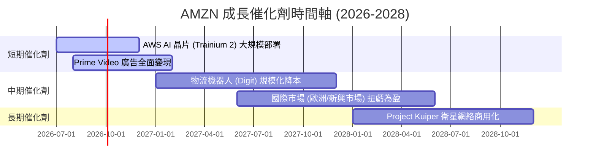

### 8.2 TAM 市場規模分析

亞馬遜所處的三大核心賽道，其潛在市場規模 (TAM) 仍在高速膨脹：

```
╔══════════════════════════════════════════════════════════════════╗
║                  AMZN 核心賽道 TAM 估算 (2027E)                  ║
╠══════════════════════════════════════════════════════════════════╣
║                                                                  ║
║  1. 全球電商零售：  TAM: $8.0T   AMZN 滲透率: ~7%   成長空間大   ║
║  2. 雲端運算 (IaaS)：TAM: $1.2T   AMZN 滲透率: ~31%  AI 驅動翻倍  ║
║  3. 數位廣告：      TAM: $900B   AMZN 滲透率: ~6%   份額持續提升 ║
║                                                                  ║
║  📊 總體 TAM 超過 10 兆美元，亞馬遜在各賽道均具備極高的變現壁壘。 ║
╚══════════════════════════════════════════════════════════════════╝
```

### 8.3 成長驅動力結構圖

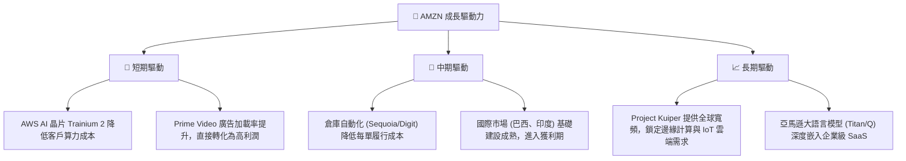

---

## 9. 風險矩陣

### 9.1 風險評分矩陣

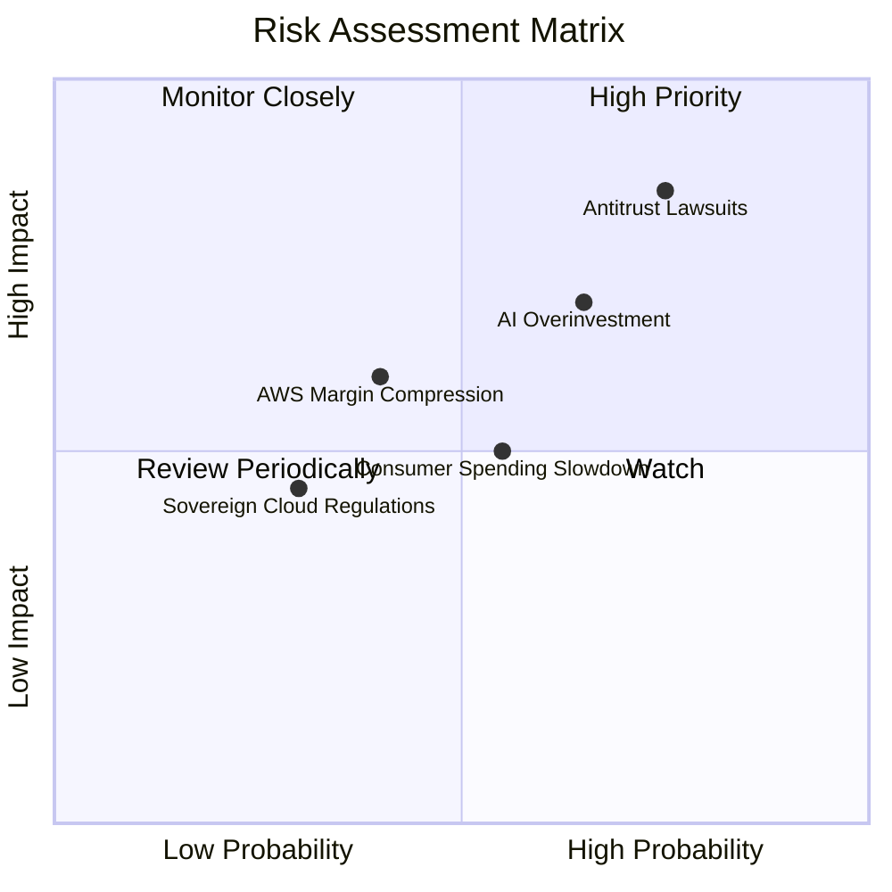

### 9.2 風險清單詳細分析

| # | 風險項目 | 發生機率 | 財務衝擊 | 風險評分 | 緩解措施 |
|---|---|---|---|---|---|
| 1 | 🔴 **反壟斷與監管訴訟** | 高 (75%) | 高 (可能面臨分拆或核心業務定價限制) | **8.0 / 10** | 增加遊說支出，調整第三方賣家條款，主動拆分部分邊緣業務以示合規。 |
| 2 | 🟡 **AI 資本支出回報滯後** | 中高 (65%) | 中高 (折舊增加壓抑營業利益率 1-2pp) | **7.0 / 10** | 靈活調整 Capex 節奏，擴大與第三方 AI 軟體商合作，推廣自研晶片以降低對 NVIDIA 的依賴。 |
| 3 | 🟡 **消費支出顯著放緩** | 中度 (55%) | 中度 (零售營收成長降至個位數) | **5.5 / 10** | 擴大「Essentials」低價自營商品比重，推廣 Prime 促銷活動（如 Prime Day）鎖定用戶錢包。 |
| 4 | 🟢 **AWS 面臨微軟 Azure 激烈競爭**| 中低 (40%) | 中高 (AWS 利潤率受定價戰影響) | **4.8 / 10** | 強化 Bedrock 多模型平台優勢，鎖定企業混合雲與數據主權（Sovereign Cloud）市場。 |

---

## 10. 投資建議

### 10.1 最終綜合評級雷達圖

亞馬遜在基本面強度、護城河深度、獲利品質與估值合理性上皆取得了極高的評分，唯有在短期財務健康度上，因高昂的 Capex 與租賃負債而略微受限。

```
╔══════════════════════════════════════════════════════════════╗
║                    AMZN 最終綜合評估                         ║
╠══════════════════════════════════════════════════════════════╣
║ 基本面強度  9.5 ▓▓▓▓▓▓▓▓▓▓▓▓▓▓▓▓▓▓▓░  ★★★★★           ║
║ 成長動能    8.5 ▓▓▓▓▓▓▓▓▓▓▓▓▓▓▓▓▓░░░  ★★★★☆           ║
║ 獲利品質    8.5 ▓▓▓▓▓▓▓▓▓▓▓▓▓▓▓▓▓░░░  ★★★★☆           ║
║ 財務健康    8.0 ▓▓▓▓▓▓▓▓▓▓▓▓▓▓▓▓░░░░  ★★★★☆           ║
║ 估值合理性  8.5 ▓▓▓▓▓▓▓▓▓▓▓▓▓▓▓▓▓░░░  ★★★★☆           ║
║ 護城河深度  9.5 ▓▓▓▓▓▓▓▓▓▓▓▓▓▓▓▓▓▓▓░  ★★★★★           ║
╠══════════════════════════════════════════════════════════════╣
║ 綜合總分    8.6 ▓▓▓▓▓▓▓▓▓▓▓▓▓▓▓▓▓░░░  🏆 買入評級          ║
╚══════════════════════════════════════════════════════════════╝
```

### 10.2 目標價與隱含報酬率

我們給予基準情境 60% 的機率權重，加權計算後之**期望目標價為 $302.21**，隱含報酬率為 **+22.3%**。

| 情境 | 隱含目標價 | 相對當前股價 ($247.07) | 機率權重 | 權重後目標價貢獻 |
|------|------------|------------------------|----------|------------------|
| 🔴 悲觀 | $207.00 | -16.2% | 15% | $31.05 |
| 🟡 **基準** | **$314.35** | **+27.2%** | **60%** | **$188.61** |
| 🟢 樂觀 | $370.00 | +49.8% | 25% | $92.50 |
| **加權期望值**| **$302.21** | **+22.3%** | **100%** | **$302.21** |

### 10.3 買入時機與觸發因素

```
╔══════════════════════════════════════════════════════════════════╗
║                  ✅ AMZN 買入與交易策略 Checklist               ║
╠══════════════════════════════════════════════════════════════════╣
║                                                                  ║
║  立即買入觸發條件（多數符合）：                                  ║
║  ✅ 當前 Forward P/E 處於 25x 以下（當前為 24.93x，符合）         ║
║  ✅ AWS 營收 YoY 成長率連續兩季維持在 15% 以上                    ║
║  ✅ 營業利益率 (Operating Margin) 持續維持在 12% 以上            ║
║                                                                  ║
║  分批加碼觸發條件（出現以下任一）：                              ║
║  ☐ 股價因宏觀經濟波動回檔至 $210 - $220 區間                     ║
║  ☐ 財報顯示 OCF 成長且 Capex 增速開始放緩，釋放 FCF 彈性         ║
║                                                                  ║
║  減碼/停損觸發條件（出現以下任一）：                             ║
║  ☐ AWS 營收成長率跌破 10%（顯示競爭對手 Azure 大幅奪取市佔）     ║
║  ☐ 聯邦法院正式判決亞馬遜違反反壟斷法，並強迫分拆 AWS            ║
║                                                                  ║
╚══════════════════════════════════════════════════════════════════╝
```

### 10.4 投資人適配度分析

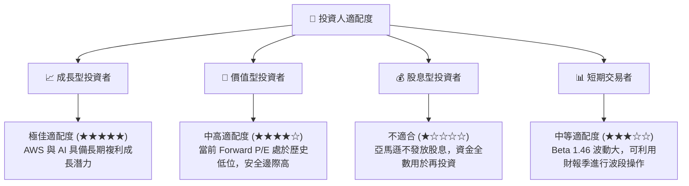

### 10.5 每季財報監控清單（Quarterly Watch List）

為了確保本投資論點持續成立，投資人應在每季財報中重點追蹤以下指標：

| 監控指標 | 基準值 (當前) | 觸發「加碼」門檻 | 觸發「減碼」門檻 | 監控意義 |
|---|---|---|---|---|
| **AWS YoY 成長率** | 16.6% | >18.0% | <10.0% | 評估雲端與 AI 需求是否持續健康。 |
| **營業利益率 (Op Margin)** | 13.1% | >15.0% | <9.0% | 評估營運槓桿與廣告高利潤業務的佔比。 |
| **季度 Capex 規模** | $44.20B | <$35.0B (且營收維持成長) | >$50.0B (但營收無明顯加速) | 評估 AI 投資效率，若過度投資將壓抑利潤率。 |
| **北美零售營業利益率** | ~6.0% | >8.0% | <4.0% | 評估物流區域化與自動化機器人降本成效。 |

### 10.6 反面論證：什麼會證明論點錯誤（What Would Change My Mind）

本研究報告建立於「投資能轉化為高回報資本效率」的假設上。若發生以下**可量化條件**，本投資論點將宣告失效，應立即重新評估或清倉：

```
╔══════════════════════════════════════════════════════════════════╗
║              ⚠️ 論點失效條件 (Disconfirming Evidence)            ║
╠══════════════════════════════════════════════════════════════════╣
║  本投資論點在下列情況成立時應重新檢視或退出：                    ║
║  ☐ AWS 營收成長率連續兩季 < 10.0%（顯示 AI 再投資回報極低）      ║
║  ☐ 營業利益率較當前峰值收縮 > 3.0 個百分點（降至 10.0% 以下）    ║
║  ☐ ROIC 跌破 WACC (即 ROIC < 10.90%，摧毀股東價值)               ║
║  ☐ 資本支出 (Capex) 連續四季增加，但營收成長率持續減速           ║
║  ☐ 反壟斷法案正式立法，禁止 3P 賣家與 1P 自營零售共享物流數據    ║
╚══════════════════════════════════════════════════════════════════╝
```

---

> **免責聲明**：本報告為 AI 自動生成，僅供研究參考，不構成投資建議。投資有風險，入市需謹慎。