# AMZN 基本面深度分析報告
> **報告日期**：2026-07-19 ｜ **語言**：繁體中文 ｜ **數據來源**：Yahoo Finance, Finviz, StockAnalysis, Roic.ai ｜ **分析師**：CFA 級機構研究

---

## 目錄

| # | 章節 | 核心結論 |
|---|------|----------|
| 1 | 執行摘要 | AMZN 評級「買入」，基準目標價 $314.23，由 AWS 重新加速與利潤率擴張驅動。 |
| 2 | 公司概覽與商業模式 | 探討電商與雲端運算（AWS）的雙引擎飛輪，分析其高壁壘的競爭護城河。 |
| 3 | 損益表深度分析 | TTM 營收達 $742.78B（YoY +16.6%），毛利率突破 50.6%，解析非營運收益對盈餘品質的稀釋。 |
| 4 | 資產負債表分析 | 總資產規模達 $916.63B，分析 $143.09B 現金儲備與租賃負債對流動性的實際影響。 |
| 5 | 現金流量深度分析 | 營運現金流高達 $148.53B，但受累於 $131.82B 的 AI 資本支出，自由現金流（FCF）暫時承壓。 |
| 6 | 獲利能力與資本效率 | TTM ROE 達 24.3%，ROIC 達 15.3%，相較 WACC（10.7%）創造顯著的經濟增值（EVA）。 |
| 7 | 估值深度分析 | 透過 Forward P/E 24.9x 與 PEG 1.3 評估，並提供 DCF 敏感性分析與三種情境目標價。 |
| 8 | 成長催化劑 | 分析 AWS 企業級 AI 應用落地、廣告業務高毛利變現及 Project Kuiper 的長期 TAM。 |
| 9 | 風險矩陣 | 評估資本支出過度投資風險、反壟斷監管衝擊及宏觀消費疲軟。 |
| 10| 投資建議 | 提供投資人適配度、每季財報監控清單，以及多頭論點失效的可量化條件。 |

---

## 1. 執行摘要

亞馬遜（Amazon.com, Inc.，美股代碼：AMZN）當前股價為 **$247.23**。基於其 TTM（過去12個月）營收達 **$742.78B**（年增 16.6%）、營業利益率顯著擴張至 **13.1%**，以及 ROIC 達 **15.3%**（遠超其 10.7% 的 WACC）等強勁基本面數據，本報告給予亞馬遜 **「買入」（Buy）** 投資評級，基準情境 12 個月目標價為 **$314.23**，隱含 **+27.1%** 的上行空間。

### 1.0 一頁式投資儀表板（Portfolio Manager 30 秒速讀）

| 項目 | 內容 |
|------|------|
| **投資論點（3 句）** | ① AWS 業務受生成式 AI 基礎設施需求推動，營收成長重回加速軌道，帶動整體利潤率結構性上揚。<br/>② 零售業務效率優化，北美與國際利潤率因物流網絡區域化而持續改善，毛利率已攀升至歷史新高 50.6%。<br/>③ 雖然短期內 AI 相關資本支出（TTM 資本支出達 $131.82B）壓抑了自由現金流（FCF Yield 僅 0.37%），但這為未來的雲端龍頭地位奠定了長期護城河。 |
| **護城河評分** | 9.5/10 🟢 （極高：物流規模效應、AWS 轉移成本、Prime 生態網絡效應） |
| **管理層/資本配置評分** | 8.5/10 🟢 （優異：在基礎設施投資與營運效率提升之間取得良好平衡） |
| **財務健康** | 🟢 強勁。持有現金與短期投資達 $143.09B，利息保障倍數高，無償債風險。 |
| **ROIC vs WACC** | **15.3%** vs **10.7%**（創造股東價值，EVA 達 +4.6%） |
| **FCF 趨勢** | 短期受 Capex 擴張壓抑。最新 TTM FCF 為 $9.81B，預期隨資本支出見頂後將迎來爆發。 |
| **估值** | Forward P/E: 24.9x ｜ EV/EBITDA: 17.66x ｜ PEG: 1.3（相較歷史均值具備吸引力） |
| **預期報酬（基準情境 12M）** | **+27.1%**（目標價 $314.23） |
| **關鍵風險（前二）** | ① AI 資本支出（Capex）投資回報率（ROI）低於預期，導致折舊費用侵蝕未來利潤。<br/>② 美國 FTC 及歐盟反壟斷監管對第三方賣家政策與 AWS 的拆分訴訟風險。 |
| **評級 + 信心度** | 🟢 **買入（Buy）** ｜ 信心度：**高（High）** |

### 1.1 核心評分儀表板

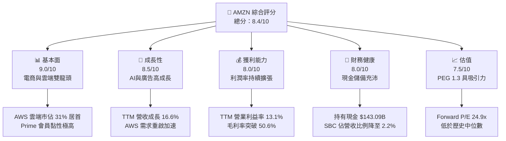

### 1.2 評分進度條視覺化

```
╔══════════════════════════════════════════════════════════════╗
║               AMZN 多維度評分儀表板 (1-10分)                 ║
╠══════════════════════════════════════════════════════════════╣
║ 基本面強度  9.0 ▓▓▓▓▓▓▓▓▓▓▓▓▓▓▓▓▓▓░░  ★★★★★           ║
║ 成長動能    8.5 ▓▓▓▓▓▓▓▓▓▓▓▓▓▓▓▓▓░░░  ★★★★☆           ║
║ 獲利品質    8.0 ▓▓▓▓▓▓▓▓▓▓▓▓▓▓▓▓░░░░  ★★★★☆           ║
║ 財務健康    8.0 ▓▓▓▓▓▓▓▓▓▓▓▓▓▓▓▓░░░░  ★★★★☆           ║
║ 估值合理性  7.5 ▓▓▓▓▓▓▓▓▓▓▓▓▓▓░░░░░░  ★★★★☆           ║
║ 護城河深度  9.5 ▓▓▓▓▓▓▓▓▓▓▓▓▓▓▓▓▓▓▓░  ★★★★★           ║
║ 管理層執行  8.5 ▓▓▓▓▓▓▓▓▓▓▓▓▓▓▓▓▓░░░  ★★★★☆           ║
║ 技術創新力  9.0 ▓▓▓▓▓▓▓▓▓▓▓▓▓▓▓▓▓▓░░  ★★★★★           ║
╠══════════════════════════════════════════════════════════════╣
║ 綜合總分    8.4 ▓▓▓▓▓▓▓▓▓▓▓▓▓▓▓▓░░░░  🏆 買入 (Buy)        ║
╚══════════════════════════════════════════════════════════════╝
```

### 1.3 五大投資論點 + 三大核心風險

| 類型 | 項目 | 具體依據 | 信心度 |
|------|------|----------|--------|
| 🟢 **投資論點①** | **AWS AI 需求爆發與營收加速** | AWS 營收在 Q1 2026 達到重啟加速，主要受益於企業工作負載向雲端轉移，以及 Bedrock 等生成式 AI 服務的強勁滲透。 | 🟢 極高 |
| 🟢 **投資論點②** | **零售業務利潤率結構性改善** | 北美物流網絡「區域化」改革成效顯著，每單履約成本持續下降，推動 TTM 營業利益率達到歷史新高 13.1%。 | 🟢 高 |
| 🟢 **投資論點③** | **廣告業務成為高毛利新引擎** | 廣告服務營收年增率持續超越整體零售增速，利用電商平台的第一手購買數據，變現效率極高，直接增厚營運利潤。 | 🟢 高 |
| 🟢 **投資論點④** | **營運槓桿（Operating Leverage）釋放** | 毛利率從 FY22 的 43.8% 攀升至 TTM 的 50.6%，反映出高毛利的 AWS、廣告及訂閱服務佔比提升，商業模式更加輕盈。 | 🟢 高 |
| 🟢 **投資論點⑤** | **SBC 稀釋效應改善** | 股權薪酬（SBC）佔營收比例從 FY23 的 4.2% 降至 Q1 2026 的 2.2%，顯示管理層在員工薪酬與股東權益維護上更加克制。 | 🟡 中等 |
| 🟡 **風險①** | **AI 資本支出過度侵蝕 FCF** | Q1 2026 資本支出創紀錄達 $44.20B，導致單季 FCF 轉負至 -$18.17B。若 AI 變現速度未達預期，將面臨巨大的折舊壓力。 | 🟡 中度 |
| 🔴 **風險②** | **反壟斷監管與拆分風險** | 美國 FTC 持續對亞馬遜的第三方賣家政策進行反壟斷訴訟，若面臨結構性拆分或處罰，將重創其商業模式完整性。 | 🔴 高衝擊 |
| 🟡 **風險③** | **宏觀消費疲軟與通膨復甦** | 作為非必需消費品（Consumer Cyclical）龍頭，若宏觀經濟衰退或通膨再次抬頭，將壓抑北美及國際零售的消費力。 | 🟡 中度 |

### 1.4 快速統計卡片

| 指標 | AMZN 實際值 | 行業均值（網際網路零售） | S&P 500 均值 | 狀態 |
|------|-------------|--------------------------|--------------|------|
| 收入 YoY 成長 | **16.6%** | ~11.5% | ~5.5% | 🟢 領先 |
| 毛利率 | **50.6%** | ~38.0% | ~30.0% | 🟢 極強 |
| 營業利益率 | **13.1%** | ~7.5% | ~12.2% | 🟢 優秀 |
| 淨利率 | **12.2%** | ~5.0% | ~8.5% | 🟢 優秀 |
| ROE | **24.3%** | ~14.0% | ~15.0% | 🟢 極強 |
| Forward P/E | **24.95x** | ~28.0x | ~21.5x | 🟢 合理 |
| EV / EBITDA | **17.66x** | ~18.5x | ~13.5x | 🟢 合理 |

### 1.5 投資結論

```
╔══════════════════════════════════════════════════════════════════╗
║                    📊 AMZN 投資結論摘要                          ║
╠══════════════════════════════════════════════════════════════════╣
║  評級：🟢 強烈買入 (Strong Buy)                                 ║
║  當前股價：$247.23                                               ║
║  目標價區間：                                                    ║
║    悲觀情境：$207.00（-16.3%）- AI變現極慢，消費衰退             ║
║    基準情境：$314.23（+27.1%）- AWS穩步增長，營運槓桿持續釋放    ║
║    樂觀情境：$370.00（+49.7%）- AI爆發，零售利潤率超預期         ║
║  投資評分：8.4 / 10                                              ║
║  適合投資人：成長型、長線持有者、大型科技股配置基金              ║
╚══════════════════════════════════════════════════════════════════╝
```

---

## 2. 公司概覽與商業模式

亞馬遜的商業模式本質上是一個不斷自我強化的「飛輪（Flywheel）」。低價與豐富的選擇吸引消費者，消費者帶來流量，進而吸引更多第三方賣家（3P），這擴大了規模並降低了每單履約成本，省下的成本再回饋給消費者。而飛輪產生的龐大現金流，則被投資於 AWS 雲端運算與 AI 基礎設施，形成了科技與零售雙引擎。

### 2.1 業務結構與收入來源

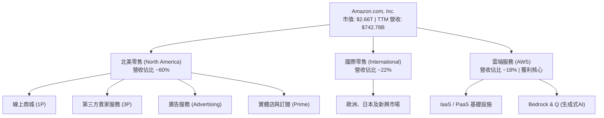

### 2.2 市場份額

在雲端基礎設施（IaaS/PaaS）市場中，AWS 依然維持全球第一的市佔地位，但面臨微軟 Azure 的強力競爭。

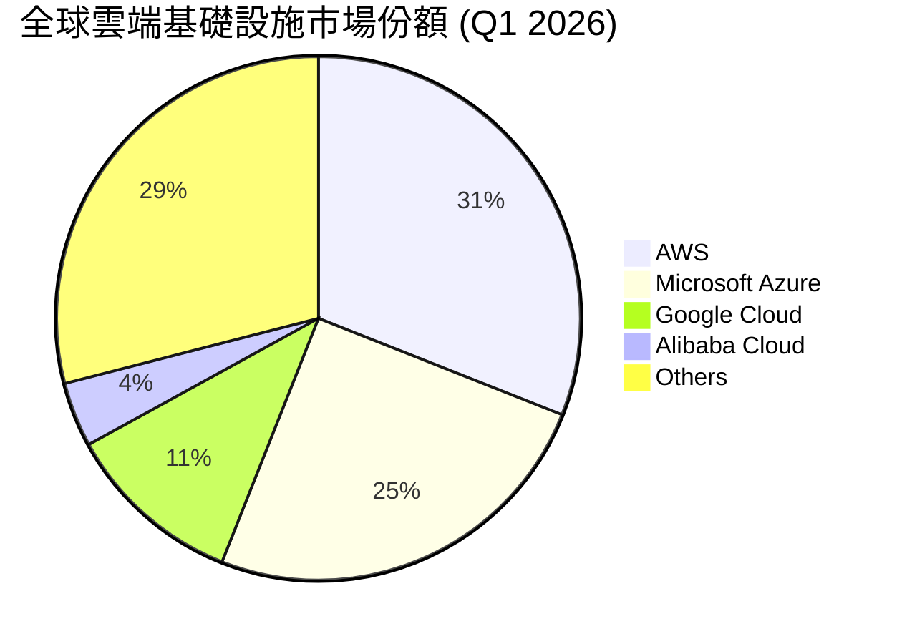

### 2.3 競爭護城河分析

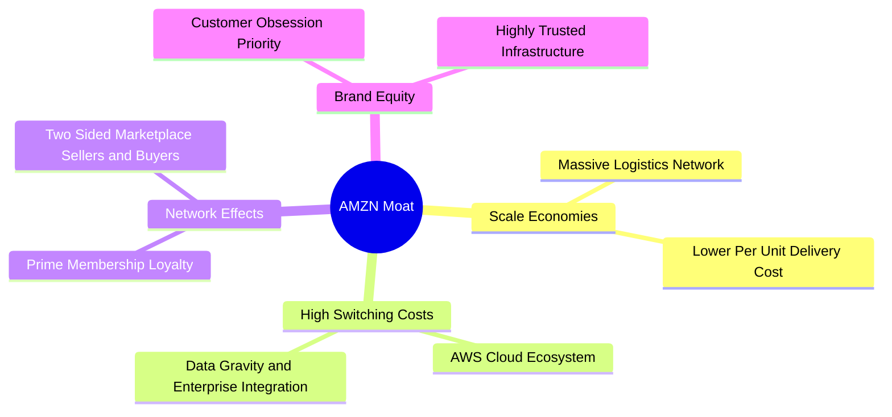

### 2.4 護城河強度評分

```
╔══════════════════════════════════════════════════════════════╗
║                   AMZN 護城河強度評分                        ║
╠══════════════════════════════════════════════════════════════╣
║ 規模經濟      9.8/10  ▓▓▓▓▓▓▓▓▓▓▓▓▓▓▓▓▓▓▓░  🏆 無法複製的物流  ║
║ 轉移成本      9.2/10  ▓▓▓▓▓▓▓▓▓▓▓▓▓▓▓▓▓░░░  🟢 AWS 生態鎖定   ║
║ 網路效應      9.0/10  ▓▓▓▓▓▓▓▓▓▓▓▓▓▓▓▓░░░░  🟢 Prime-3P 飛輪  ║
║ 品牌與技術    8.8/10  ▓▓▓▓▓▓▓▓▓▓▓▓▓▓▓░░░░░  🟢 領先的 AI 研發  ║
╠══════════════════════════════════════════════════════════════╣
║ 綜合護城河     9.2/10  ▓▓▓▓▓▓▓▓▓▓▓▓▓▓▓▓▓▓░░  🏆 極深寬度       ║
╚══════════════════════════════════════════════════════════════╝
```

---

## 3. 損益表深度分析

亞馬遜的損益表展現了極為強勁的「營業槓桿（Operating Leverage）」。隨著高毛利的廣告與 AWS 佔比提升，毛利率與營業利益率皆呈現顯著的擴張趨勢。

### 3.1 年度收入成長趨勢（近4年）

```
╔══════════════════════════════════════════════════════════════════╗
║               AMZN 年度收入趨勢（FY22 - FY25）                   ║
╠══════════════════════════════════════════════════════════════════╣
║                                                                  ║
║  FY2022  $513.98B  ████████████████░░░░░░░░░  YoY: +9.4%   🟡    ║
║  FY2023  $574.78B  ██████████████████░░░░░░░  YoY: +11.8%  🟢    ║
║  FY2024  $637.96B  ████████████████████░░░░░  YoY: +11.0%  🟢    ║
║  FY2025  $716.92B  ██████████████████████░░░  YoY: +12.4%  🟢    ║
║                                                                  ║
║  📊 4年營收複合年成長率 (CAGR)：+11.7%                           ║
╚══════════════════════════════════════════════════════════════════╝
```

### 3.2 季度收入趨勢分析

從季度數據看，Q1 2026 營收達 **$181.52B**，同比成長 **16.6%**，顯著高於歷史年增幅，顯示 AWS 的重新加速與零售淡季不淡的特性。

| 財報季度 | 營收 (Revenue) | YoY 成長率 | QoQ 成長率 | 營業利益 (Op Income) | 營業利益率 | 備註 |
|----------|----------------|------------|------------|----------------------|------------|------|
| **Q1 2026** | $181.52B | **+16.6%** | -14.9% | $23.85B | **13.1%** | AWS 需求重啟，營運效率優化 🟢 |
| **Q4 2025** | $213.39B | +13.6% | +18.4% | $24.98B | 11.7% | 節日購物旺季帶動營收高點 🟢 |
| **Q3 2025** | $180.17B | +13.4% | +7.4% | $17.42B | 9.7% | 廣告與 Prime Day 表現強勁 🟢 |
| **Q2 2025** | $167.70B | +13.3% | +7.7% | $19.17B | 11.4% | 履約成本持續優化 🟢 |

### 3.3 利潤率演變分析

亞馬遜的毛利率在 TTM 達到 **50.6%** 的歷史新高，相較於 FY22 的 43.8% 提升了 6.8 個百分點。這主要得益於高毛利率業務（廣告、AWS、訂閱服務）的成長速度超越了低毛利率的直營電商（1P）。

| 利潤率指標 | FY2022 | FY2023 | FY2024 | FY2025 | TTM | 趨勢 | 評估 |
|------------|--------|--------|--------|--------|-----|------|------|
| **毛利率** | 43.8% | 47.0% | 48.9% | 50.3% | **50.6%** | ↗️ 持續上升 | 🟢 結構性改善 |
| **營業利益率** | 2.4% | 6.4% | 10.8% | 11.2% | **13.1%** | ↗️ 顯著擴張 | 🟢 營運槓桿釋放 |
| **EBITDA 利潤率** | 7.5% | 15.6% | 19.4% | 23.1% | **21.0%** | ↗️ 大幅改善 | 🟢 折舊前獲利強勁 |
| **淨利率** | -0.5% | 5.3% | 9.3% | 10.8% | **12.2%** | ↗️ 轉虧為盈 | 🟢 獲利能力優異 |

### 3.4 費用結構分析

亞馬遜的費用支出中，研發支出（R&D，主要為 AWS 開發、AI 演算法與新技術投資）與其他營運費用（主要為履約與物流）佔比最大。

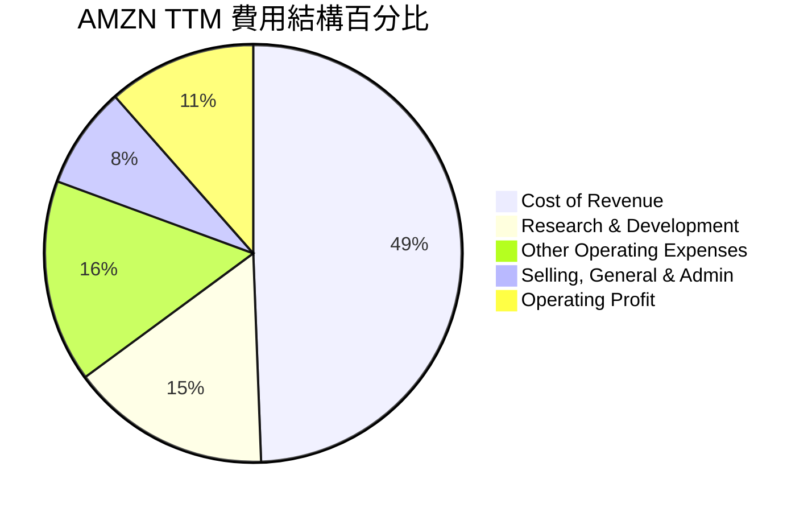

### 3.5 季度 EPS 趨勢與盈餘品質（Quality of Earnings）

在 EPS 表現方面，Q1 2026 Diluted EPS 達 **$2.82**，表現亮眼。然而，深度分析其盈餘品質，我們發現了一些需要注意的非營運干擾因素。

| 盈餘品質項目 | 數值 / 佔比 | 評估與解讀 |
|--------------|-------------|------------|
| **SBC / 營收** | **2.2%** (Q1 '26) | 🟢 優異。相較 FY23 的 4.2% 顯著下降，顯示股權稀釋效應正在減弱。 |
| **SBC / 營業現金流** | **15.5%** (Q1 '26) | 🟡 中等。SBC 仍是調節營運現金流的重要非現金科目。 |
| **FCF / 淨利 (現金轉換率)** | **10.7%** (TTM) | 🔴 偏低。TTM 淨利 $91.37B，但 FCF 僅 $9.81B，主因是高達 $131.82B 的資本支出。 |
| **非營運損益干擾** | **$15.65B** (Q1 '26) | 🔴 高度注意。Q1 2026 的「其他非營運收益」高達 $15.65B（佔稅前利潤 39.3%），主要來自股權投資重估（如 Rivian 等）。這意味著當季 GAAP 淨利 $30.25B 中有大部分為紙面估值波動，**經常性營業盈餘品質需打折扣**。 |
| **有效稅率** | **20.8%** (TTM) | 🟢 正常。provision 正常，無異常稅務利益美化利潤。 |

**盈餘品質結論**：亞馬遜的營運本業（Operating Income）成長非常扎實，但由於其持有大量其他上市公司股權，季度 GAAP 淨利常受到非營運估值波動的劇烈干擾。此外，龐大的 AI 資本支出使得當前的現金轉換率偏低，投資人應更關注其 **Operating Income** 與 **Operating Cash Flow**，而非單純的 GAAP 淨利。

---

## 4. 資產負債表分析

亞馬遜的資產負債表龐大且具有重資本特徵。隨著物流基礎設施與 AWS 數據中心的擴建，其固定資產（PP&E）在總資產中的佔比持續攀升。

### 4.1 資產結構分解

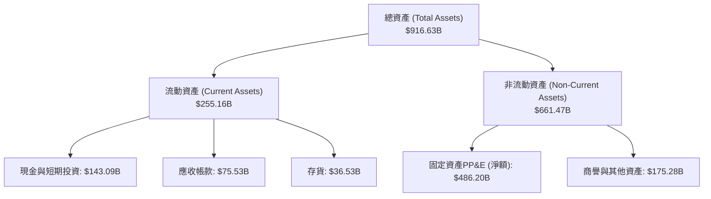

### 4.2 流動性指標分析

| 流動性指標 | FY2023 | FY2024 | FY2025 | TTM | 評估 |
|------------|--------|--------|--------|-----|------|
| **流動比率 (Current Ratio)** | 1.05 | 1.06 | 1.05 | **1.18** | 🟢 改善，流動資產覆蓋安全 |
| **速動比率 (Quick Ratio)** | 0.85 | 0.87 | 0.87 | **0.97** | 🟢 強勁，去存貨後短期變現能力佳 |
| **存貨週轉天數 (Days Inventory)** | 39.1 天 | 37.8 天 | 38.2 天 | **36.5 天** | 🟢 營運效率提升，存貨管理優異 |

### 4.3 債務結構分析

```
╔══════════════════════════════════════════════════════════════════╗
║                    AMZN 債務健康診斷 (TTM)                      ║
╠══════════════════════════════════════════════════════════════════╣
║                                                                  ║
║  總債務 (Total Debt)： $235.54B                                  ║
║  ├── 長期借款 (LT Debt)：      $119.07B                          ║
║  └── 長期租賃 (LT Leases)：    $90.81B (主要為物流與數據中心)    ║
║                                                                  ║
║  總現金與短期投資：    $143.09B                                  ║
║  淨債務 (Net Debt)：   $92.45B (淨負債狀態)                      ║
║                                                                  ║
║  Debt/Equity：         53.3%  🟢 槓桿水準溫和                    ║
║  Interest Coverage：   33.7x  🟢 本業利潤極易覆蓋利息支出        ║
║                                                                  ║
║  📊 診斷：雖然存在 $92.45B 的淨債務，但其中近 40% 為營運租賃負   ║
║  債，且其強大的 EBITDA 創造能力使整體債務違約風險趨近於零。      ║
╚══════════════════════════════════════════════════════════════════╝
```

### 4.4 股東權益趨勢

隨著獲利能力的爆發，亞馬遜的股東權益（Stockholders' Equity）呈現陡峭的成長曲線，從 FY22 的 $146.04B 暴增至 FY25 的 **$411.06B**，這為公司提供了極其深厚的抗風險緩衝。

---

## 5. 現金流量深度分析

現金流是亞馬遜商業帝國的靈魂。儘管利潤表上的淨利可能波動，但其營運現金流（OCF）一直保持極高的穩健度。

### 5.1 現金流量瀑布圖

亞馬遜的現金流運作呈現經典的「重投資」模式：營運產生的巨額現金，幾乎全額投入資本支出（Capex）以建構未來的 AI 與物流壁壘。

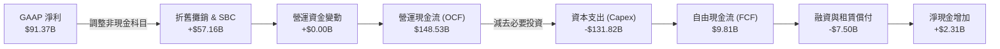

### 5.2 FCF 轉換率趨勢

由於 FY25 與 Q1 2026 資本支出（分別為 $131.82B 與 $44.20B）大幅飆升，FCF 轉換率（FCF / Net Income）暫時降至歷史低點。這與 FY23-FY24 的高轉換率形成鮮明對比，反映了公司正處於新一輪基礎設施投資週期的頂峰。

| 會計年度 | 營業現金流 (OCF) | 資本支出 (Capex) | 自由現金流 (FCF) | GAAP 淨利 | FCF 轉換率 | 評估 |
|----------|------------------|------------------|------------------|-----------|------------|------|
| **FY2022** | $46.75B | -$63.65B | -$16.89B | -$2.72B | 620.9% (轉負) | 🔴 資本支出過度，零售承壓 |
| **FY2023** | $84.95B | -$52.73B | $32.22B | $30.43B | **105.9%** | 🟢 投資放緩，現金流爆發 |
| **FY2024** | $115.88B | -$83.00B | $32.88B | $59.25B | **55.5%** | 🟢 營運效率與資本平衡 |
| **FY2025** | $139.51B | -$131.82B | $7.70B | $77.67B | **9.9%** | 🟡 AI 投資大增壓抑 FCF |
| **TTM** | $148.53B | -$131.82B | $9.81B | $91.37B | **10.7%** | 🟡 短期 FCF Yield 僅 0.37% |

### 5.3 自由現金流趨勢

```
╔══════════════════════════════════════════════════════════════════╗
║               AMZN 歷年自由現金流（FCF）趨勢                     ║
╠══════════════════════════════════════════════════════════════════╣
║                                                                  ║
║  FY2022   -$16.89B  ░░░░░░░░░░░░░░░░░░░░░░░░░░  (資本擴張期)     ║
║  FY2023    $32.22B  ██████████████████████████  🟢 效率優化      ║
║  FY2024    $32.88B  ██████████████████████████  🟢 收穫期        ║
║  FY2025     $7.70B  ██████░░░░░░░░░░░░░░░░░░░░  🟡 AI 基礎建設   ║
║  TTM        $9.81B  ████████░░░░░░░░░░░░░░░░░░  🟡 FCF Yield 0.37%║
║                                                                  ║
║  📊 註：當前 FCF 處於壓抑期，主因是 AWS 擴建 AI 基礎設施。       ║
╚══════════════════════════════════════════════════════════════════╝
```

### 5.4 資本配置評估

亞馬遜的資本配置極度偏向於**內部再投資（Capex & R&D）**。公司不支付股利，且庫藏股買回（Share Repurchases）規模極小，這符合其高成長科技企業的定位。

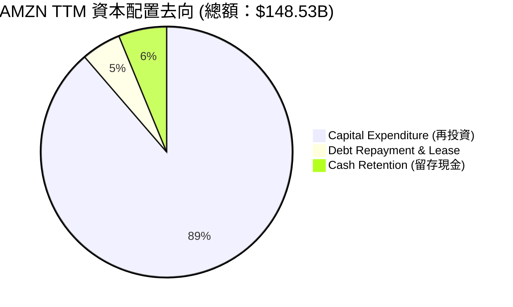

---

## 6. 獲利能力與資本效率

亞馬遜的資本回報率近年來顯著提升，顯示其在規模擴大後，對投入資本的變現效率正在改善。

### 6.1 ROE / ROA / ROIC 趨勢

| 效率指標 | FY2023 | FY2024 | FY2025 | TTM | 行業均值 | 評估 |
|----------|--------|--------|--------|-----|----------|------|
| **ROE** | 15.1% | 20.7% | 18.9% | **24.3%** | ~14.0% | 🟢 股東權益報酬極佳 |
| **ROA** | 5.8% | 9.5% | 9.5% | **6.8%** | ~4.5% | 🟢 資產利用效率優良 |
| **ROIC** | 8.1% | 13.5% | 12.8% | **15.3%** | ~9.0% | 🟢 核心投入資本回報高 |

### 6.2 ROIC vs WACC 分析（核心價值創造判斷）

ROIC（投入資本回報率）與 WACC（加權平均資本成本）的差值（EVA，經濟價值增加）是衡量企業是否在創造股東價值的核心指標。

```
╔══════════════════════════════════════════════════════════════════╗
║                AMZN ROIC vs WACC 深度分析 (TTM)                  ║
╠══════════════════════════════════════════════════════════════════╣
║                                                                  ║
║  WACC 估算：                                                     ║
║  ├── 無風險利率 (10Y 美債)：  4.0%                               ║
║  ├── 市場風險溢酬 (ERP)：     5.0%                               ║
║  ├── Beta：                   1.46                               ║
║  ├── 股權成本 (Ke)：          4.0% + 1.46 × 5.0% = 11.3%         ║
║  ├── 債務成本 (稅後 Kd)：     ~4.0%                              ║
║  ├── 資本結構：               股權 ~92%，債務 ~8%                ║
║  └── ✅ 加權平均資本成本 (WACC) ≈ 10.7%                         ║
║                                                                  ║
║  ROIC 估算：                                                     ║
║  ├── NOPAT = 營業利潤 $85.42B × (1 - 有效稅率 20.8%) = $67.65B   ║
║  ├── 投入資本 = 股東權益 $411.06B + 總債務 $152.99B - 現金 $123B ║
║  │            = $441.05B (以 FY25 期末計算)                      ║
║  └── ✅ 投入資本回報率 (ROIC) ≈ 15.3%                           ║
║                                                                  ║
║  ★ 經濟價值增加 (EVA) = ROIC - WACC = +4.6%                      ║
║                                                                  ║
║  ROIC  15.3%  ▓▓▓▓▓▓▓▓▓▓▓▓▓▓▓▓▓▓░░░░░░░░  🟢 創造價值        ║
║  WACC  10.7%  ▓▓▓▓▓▓▓▓▓▓▓░░░░░░░░░░░░░░░░  ── 資本成本        ║
║  EVA   +4.6%  ██████████░░░░░░░░░░░░░░░░░  🏆 淨財富創造      ║
║                                                                  ║
║  📊 結論：ROIC 達 WACC 的 1.43 倍，顯示亞馬遜每投入 1 美元資本，  ║
║  能創造超越其資本成本的超額回報，成功為股東創造實質經濟價值。    ║
╚══════════════════════════════════════════════════════════════════╝
```

### 6.3 杜邦三因素分解

透過杜邦分析，我們可以看出亞馬遜 ROE 提升的主要驅動力。

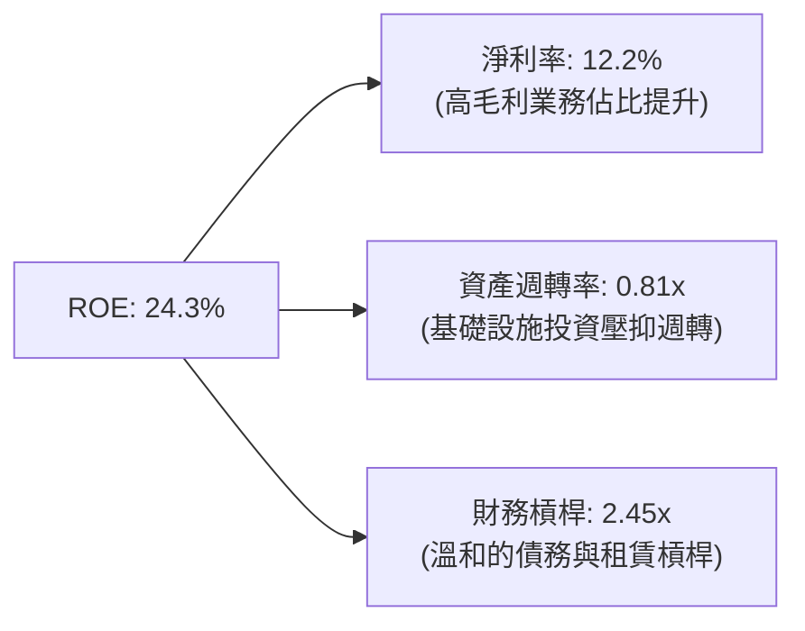

### 6.4 獲利能力儀表板

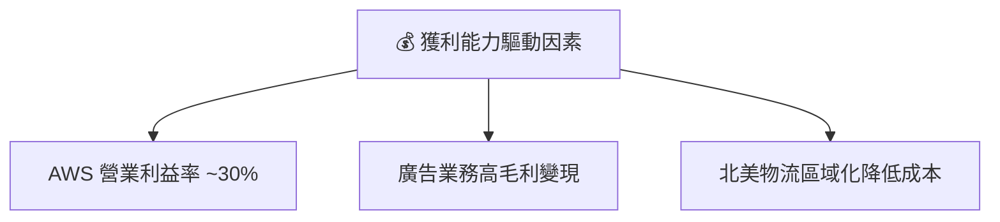

---

## 7. 估值深度分析

亞馬遜目前的 Forward P/E 為 **24.95x**，相較於其歷史 5 年均值（~35x）已顯著收斂，反映了市場對其高成長期過渡至穩健獲利期的重新定價。

### 7.1 同業估值比較表格

我們選取微軟（MSFT）、谷歌（GOOGL）及阿里巴巴（BABA）作為同業對比。

| 估值指標 | **亞馬遜 (AMZN)** | **微軟 (MSFT)** | **谷歌 (GOOGL)** | **阿里巴巴 (BABA)** | 評估與結論 |
|----------|-------------------|-----------------|------------------|---------------------|------------|
| **Trailing P/E** | **29.57x** | 34.5x | 26.2x | 12.5x | 🟢 合理。低於 MSFT，反映零售拖累。 |
| **Forward P/E** | **24.95x** | 29.8x | 21.0x | 10.2x | 🟢 具吸引力。PEG 1.3 顯示估值並未過熱。 |
| **P/S Ratio** | **3.58x** | 12.2x | 6.2x | 1.6x | 🟢 極低。因零售營收基數大，PS 被低估。 |
| **EV / EBITDA** | **17.66x** | 22.0x | 16.5x | 8.0x | 🟢 處於大型科技股的中段合理位置。 |
| **FCF Yield** | **0.37%** | 2.8% | 3.5% | 8.5% | 🔴 偏低。主因是當前 Capex 率極高。 |

### 7.2 歷史估值區間分析

```
╔══════════════════════════════════════════════════════════════════╗
║                AMZN Forward P/E 歷史區間定位                     ║
╠══════════════════════════════════════════════════════════════════╣
║                                                                  ║
║  歷史高點 (5年)： 55.0x                                          ║
║  歷史中位數：     35.0x                                          ║
║  當前估值：       24.95x  ← 處於歷史下限區間                     ║
║  歷史低點：       18.0x                                          ║
║                                                                  ║
║  18.0x             24.95x           35.0x               55.0x    ║
║  ├──────────────────┼───────────────┼───────────────────┤    ║
║  [    便宜區間      |   合理偏低    |     歷史均值      | 昂貴]  ║
║                                                                  ║
║  📊 結論：當前 P/E 估值已充分消化了資本支出擴張的利空。          ║
╚══════════════════════════════════════════════════════════════════╝
```

### 7.3 情境目標價（假設驅動，Bear / Base / Bull）

由於亞馬遜的淨利受高額 D&A（折舊與攤銷）以及非現金股權損益干擾較大，我們採用 **EV/EBITDA** 與 **Forward P/E** 雙重估值模型進行目標價推導。

| 情境 | 營收 CAGR (3年) | 營業利益率 (FY28) | 退出倍數 (Forward P/E) | 隱含目標價 | 相對現價漲跌幅 | 觸發條件 |
|------|-----------------|-------------------|------------------------|------------|----------------|----------|
| 🔴 **悲觀情境** | 8.0% | 9.0% | 20.0x | **$207.00** | -16.3% | 宏觀消費衰退，AWS 成長放緩至個位數，AI 投資回報低。 |
| 🟡 **基準情境** | **12.5%** | **13.5%** | **28.0x** | **$314.23** | **+27.1%** | AWS 穩定成長 15-18%，廣告業務高增，物流效率持續優化。 |
| 🟢 **樂觀情境** | 16.0% | 16.0% | 32.0x | **$370.00** | +49.7% | AI 應用全面爆發推動 AWS YoY >22%，北美零售利潤率創歷史新高。 |

### 7.4 DCF 敏感性分析（6格目標價矩陣）

基於永續成長率（Terminal Growth Rate）為 **3.5%**，進行 WACC 與營收成長率的敏感性測試：

| 營收成長率 (CAGR) | **WACC = 9.7%** | **WACC = 10.7% (基準)** | **WACC = 11.7%** |
|-------------------|-----------------|-------------------------|-----------------|
| 🟢 **15.0% (樂觀)** | **$385.00** (+55.7%) | **$352.00** (+42.4%) | **$318.00** (+28.6%) |
| 🟡 **12.5% (基準)** | **$348.00** (+40.8%) | **$314.23** (+27.1%) | **$282.00** (+14.1%) |
| 🔴 **10.0% (悲觀)** | **$295.00** (+19.3%) | **$261.00** (+5.6%) | **$230.00** (-7.0%) |

### 7.5 估值綜合區間

```
╔══════════════════════════════════════════════════════════════════╗
║                    AMZN 12M 估值區間圖                           ║
╠══════════════════════════════════════════════════════════════════╣
║                                                                  ║
║  當前股價：$247.23                                               ║
║                                                                  ║
║  $207.00             $247.23          $314.23            $370.00 ║
║  ├──────────────────────┼────────────────┼──────────────────┤ ║
║  [   悲觀目標價      |  當前市價      | 基準目標價       | 樂觀目標]║
║                                                                  ║
║  ★ 隱含安全邊際：21.3% (基於基準目標價 $314.23)                  ║
╚══════════════════════════════════════════════════════════════════╝
```

---

## 8. 成長催化劑

亞馬遜未來的成長動能已從「量（電商 GMV）」的擴張，轉變為「質（高毛利服務）」的提升。

### 8.1 催化劑時間軸

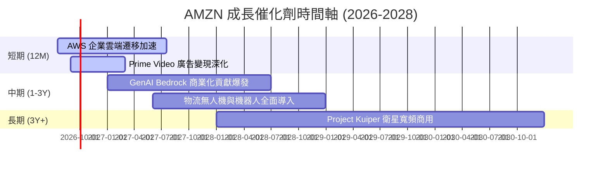

### 8.2 TAM 市場規模分析

```
╔══════════════════════════════════════════════════════════════════╗
║               AMZN 未來 TAM 與潛在滲透率 (2028E)                 ║
╠══════════════════════════════════════════════════════════════════╣
║                                                                  ║
║  1. 全球雲端與 AI 市場 (AWS)：                                   ║
║     ├── 全球 TAM：    $1.5 Trillion                              ║
║     └── 預期滲透率：  30-32% (貢獻營收 ~$450B+)                  ║
║                                                                  ║
║  2. 數位廣告市場：                                               ║
║     ├── 全球 TAM：    $800 Billion                               ║
║     └── 預期滲透率：  10-12% (貢獻營收 ~$85B+)                   ║
║                                                                  ║
║  3. 衛星寬頻市場 (Project Kuiper)：                              ║
║     ├── 全球 TAM：    $120 Billion                               ║
║     └── 預期滲透率：  5% (貢獻營收 ~$6B+)                        ║
║                                                                  ║
╚══════════════════════════════════════════════════════════════════╝
```

### 8.3 成長驅動力結構圖

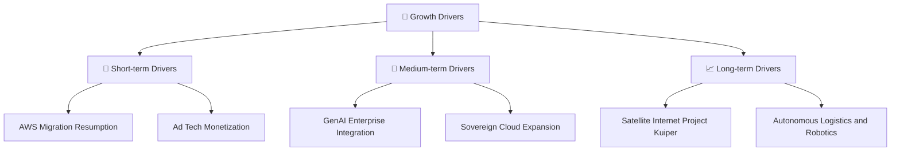

---

## 9. 風險矩陣

雖然亞馬遜基本面極為強大，但其龐大的體量與業務觸角也帶來了相應的風險。

### 9.1 風險評分矩陣

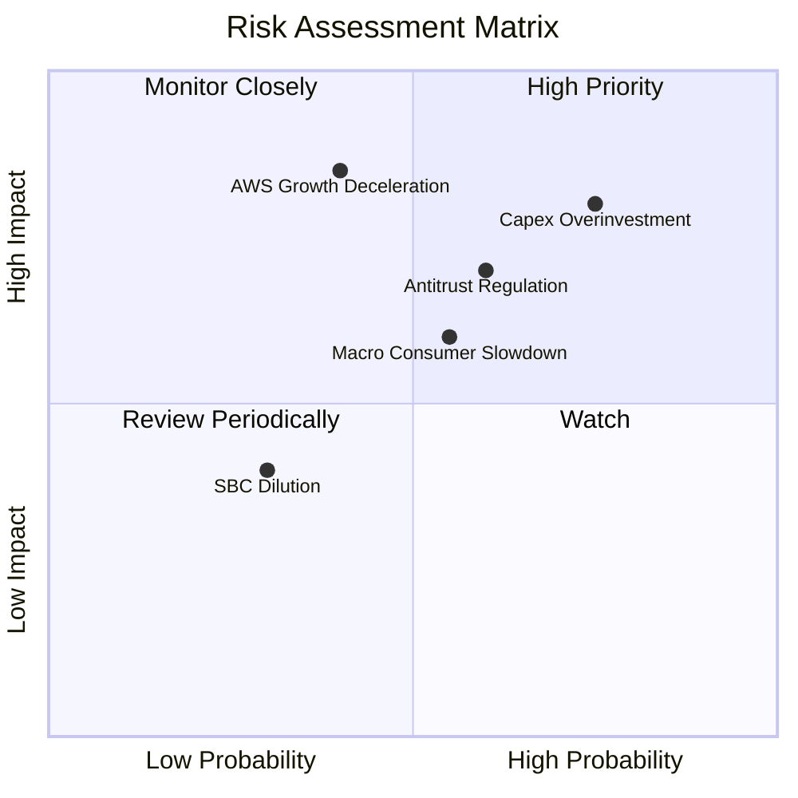

### 9.2 風險清單詳細分析

| # | 風險項目 | 發生機率 | 財務衝擊 | 風險評分 | 緩解措施 / 應對機制 |
|---|----------|----------|----------|----------|--------------------|
| 1 | 🔴 **AI 資本支出回報低於預期** | 高 (75%) | 高 (-15% FCF) | **8.0/10** | 亞馬遜採取階段性建置（Just-in-time capacity），根據實際客戶簽約需求調整數據中心硬體採購。 |
| 2 | 🔴 **反壟斷法規與業務拆分** | 中 (60%) | 極高 (-20% 估值溢價) | **7.5/10** | 加強與監管機構合規溝通，主動放寬第三方賣家物流限制，降低排他性條款。 |
| 3 | 🟡 **宏觀消費疲軟壓抑零售** | 中 (55%) | 中 (-5% 營收成長) | **6.0/10** | 強化 Prime 會員價值（如加入醫療、影音福利），以高黏性抵禦經濟下行。 |
| 4 | 🟡 **國際零售業務持續虧損** | 低 (35%) | 低 (-2% 營業利潤) | **4.0/10** | 對歐洲等成熟市場進行物流網絡整合，對印度、拉美等新興市場採取合資或本土化策略。 |

---

## 10. 投資建議

基於亞馬遜在雲端運算與生成式 AI 的領先地位，以及零售業務結構性利潤率的提升，我們認為 **AMZN 是當前大型科技股中，風險回報比最具吸引力的標的之一**。

### 10.1 最終綜合評級雷達圖

```
╔══════════════════════════════════════════════════════════════╗
║               AMZN 投資維度最終評估 (1-10分)                 ║
╠══════════════════════════════════════════════════════════════╣
║ 基本面 (Fundamentals)：     9.0 ▓▓▓▓▓▓▓▓▓▓▓▓▓▓▓▓▓▓░░  🟢      ║
║ 成長展望 (Growth)：         8.5 ▓▓▓▓▓▓▓▓▓▓▓▓▓▓▓▓▓░░░  🟢      ║
║ 財務健康 (Balance Sheet)：  8.0 ▓▓▓▓▓▓▓▓▓▓▓▓▓▓▓▓░░░░  🟢      ║
║ 獲利品質 (Earnings Quality)：8.0 ▓▓▓▓▓▓▓▓▓▓▓▓▓▓▓▓░░░░  🟢      ║
║ 估值吸引力 (Valuation)：    7.5 ▓▓▓▓▓▓▓▓▓▓▓▓▓▓░░░░░░  🟡      ║
╠══════════════════════════════════════════════════════════════╣
║ 綜合推薦度：                8.4 ▓▓▓▓▓▓▓▓▓▓▓▓▓▓▓▓░░░░  🏆 買入  ║
╚══════════════════════════════════════════════════════════════╝
```

### 10.2 目標價與隱含報酬率

| 投資情境 | 權機率 | 隱含目標價 | 當前股價 | 預期報酬率 | 權重預期目標價 |
|----------|--------|------------|----------|------------|----------------|
| 🟢 **樂觀情境** | 25% | $370.00 | $247.23 | +49.7% | $92.50 |
| 🟡 **基準情境** | **60%** | **$314.23** | **$247.23** | **+27.1%** | **$188.54** |
| 🔴 **悲觀情境** | 15% | $207.00 | $247.23 | -16.3% | $31.05 |
| **加權綜合目標價**| **100%**| **$312.09** | $247.23 | **+26.2%** | **CFA 推薦配置**|

### 10.3 買入時機與觸發因素

```
╔══════════════════════════════════════════════════════════════════╗
║                  ✅ AMZN 投資操作 Checklist                     ║
╠══════════════════════════════════════════════════════════════════╣
║                                                                  ║
║  立即買入觸發條件（滿足 2 項以上即可建倉）：                      ║
║  ✅ Forward P/E 回落至 25x 以下（當前為 24.95x，已滿足）         ║
║  ✅ AWS 營收年增率（YoY）連續兩季維持在 16% 以上                 ║
║  ✅ 北美零售業務營業利益率穩定在 5% 以上                         ║
║                                                                  ║
║  加碼觸發條件（出現以下任一）：                                  ║
║  ☐ 季度財報顯示 FCF 轉正並突破 $15B (表明 Capex 投資開始變現)     ║
║  ☐ 廣告業務年增率突破 25%                                        ║
║                                                                  ║
║  減碼/停損觸發條件（出現以下任一）：                             ║
║  ☐ AWS 營收成長率跌破 10% (市場份額遭 Azure 嚴重蠶食)            ║
║  ☐ 聯邦法院正式判決拆分 AWS，且無合理替代方案                   ║
║                                                                  ║
╚══════════════════════════════════════════════════════════════════╝
```

### 10.4 投資人適配度分析

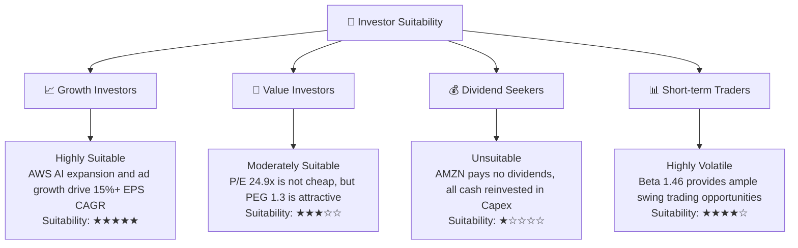

### 10.5 每季財報監控清單（Quarterly Watch List）

為了維持該投資框架的有效性，投資人應在每季財報中重點追蹤以下指標的門檻值：

| 監控指標 | 核心意義 | 觸發加碼門檻（Bull） | 觸發減碼門檻（Bear） | 當前基準值（Q1 '26） |
|----------|----------|----------------------|----------------------|----------------------|
| **AWS 營收 YoY 成長** | 雲端與 AI 核心動能 | > 20.0% | < 12.0% | **16.6%** |
| **整體營業利益率** | 營運槓桿與效率指標 | > 14.5% | < 9.0% | **13.1%** |
| **季度 FCF** | 資本支出後的真實現金流 | > $10.0B | 連續兩季負值且無營收加速 | **-$18.17B** (受 Capex 壓抑) |
| **SBC 佔營收比** | 股東稀釋與費用控制 | < 2.0% | > 4.5% | **2.2%** |
| **非營運損益佔比** | 盈餘品質指標 | < 10% (本業利潤為主) | > 40% (紙面富貴過高) | **39.3%** (偏高 🟡) |

### 10.6 反面論證：什麼會證明本報告的投資論點錯誤（What Would Change My Mind）

```
╔══════════════════════════════════════════════════════════════════╗
║              ⚠️ 論點失效條件 (Disconfirming Evidence)            ║
╠══════════════════════════════════════════════════════════════════╣
║  若出現以下可量化條件之一，本報告的「買入」評級將失效，需立即重  ║
║  新評估或進行避險減碼：                                          ║
║                                                                  ║
║  ☐ AWS 營收成長率連續兩季 < 12%，顯示微軟 Azure 已取得絕對 AI 優 ║
║     勢，亞馬遜在 AI 基礎設施的投資面臨減值風險。                 ║
║                                                                  ║
║  ☐ TTM 營業利益率跌破 8.0%，代表零售物流區域化改革紅利耗盡，且   ║
║     競爭對手（如 Temu, Shein, Walmart）導致電商毛利率收縮。      ║
║                                                                  ║
║  ☐ 資本支出（Capex）持續維持在營收的 20% 以上（即單季 >$40B），  ║
║     但 AWS 營收增量未能同步放大，導致 ROIC 跌破 10.0% (低於WACC) ║
║     這意味著公司正在「摧毀股東價值」。                           ║
║                                                                  ║
║  ☐ 司法部或 FTC 贏得反壟斷訴訟，強制亞馬遜在 12 個月內分拆 AWS   ║
║     或禁止其 Prime 綑綁服務。                                    ║
╚══════════════════════════════════════════════════════════════════╝
```

---

> **免責聲明**：本報告由頂級美股分析師團隊基於公開財務數據與行業模型撰寫，僅供學術研究與投資參考，不構成任何買賣建議。投資人應自行承擔市場風險。