# AMZN 基本面深度分析報告
> **報告日期**：2026-07-20 ｜ **語言**：繁體中文 ｜ **數據來源**：Yahoo Finance, Finviz, StockAnalysis, Roic.ai ｜ **分析師**：CFA 級機構研究

---

## 目錄

| # | 章節 | 核心結論 |
|---|------|----------|
| 1 | 執行摘要 | 評級：🟢 強烈買入 ｜ 基準目標價：$312.00（+24.8% 預期回報） |
| 2 | 公司概覽與商業模式 | 雙輪驅動向「三駕馬車」演進，高毛利服務業務重塑飛輪效應 |
| 3 | 損益表深度分析 | 毛利率突破 50.6% 歷史新高，營運槓桿釋放推動淨利 TTM 達 $91.37B |
| 4 | 資產負債表分析 | 現金儲備 $143.09B，AI 基礎設施建設驅動資本支出與固定資產大幅擴張 |
| 5 | 現金流量深度分析 | 經營現金流 $148.53B 創歷史新高，GenAI 資本開支壓抑短期自由現金流 |
| 6 | 獲利能力與資本效率 | ROE 達 24.3%，ROIC 13.3% 顯著超越 WACC 10.8%，持續創造股東價值 |
| 7 | 估值深度分析 | 遠期 P/E 25.16x 處於歷史中值偏下，SOTP 估值與 DCF 敏感性分析 |
| 8 | 成長催化劑 | AWS AI 晶片自主化、廣告業務程序化滲透與 Prime 配送網絡區域化優化 |
| 9 | 風險矩陣 | AI 資本開支回報率不及預期、反壟斷監管壓力與海外電商競爭加劇 |
| 10 | 投資建議 | 確定買入區間與季度追蹤清單，確立長期「論點失效」的可量化觀測指標 |

---

## 1. 執行摘要

> **機構評級與目標價推導**：基於亞馬遜（AMZN）最新 TTM 營收 $742.78B（YoY +16.6%）與營運利潤率 13.1% 的強勁表現，本報告給予 AMZN **🟢 強烈買入（Strong Buy）** 評級。基準情境 12 個月目標價定為 **$312.00**，隱含 24.8% 的上行空間。該估值基於 18.0x 的 EV/EBITDA 倍數推導，反映了 AWS 在生成式 AI 基礎設施領域的領導地位、高毛利廣告業務（TTM 增速超 19%）的規模效應，以及物流網絡區域化改革帶來的零售利潤率結構性回升。儘管 TTM 自由現金流（FCF）因創紀錄的 $151.0B 資本開支（含租賃）暫時壓抑至 $9.81B（FCF Yield 0.36%），但高達 $148.53B 的經營現金流（OCF）證實了其盈餘品質的極高含金量。

### 1.0 一頁式投資儀表板（Portfolio Manager 30 秒速讀）

| 項目 | 內容 |
|------|------|
| **投資論點（3 句）** | ① 零售業務結構性轉型，高毛利的第三方賣家服務與廣告業務（TTM 營收佔比持續提升）推動整體毛利率突破 50.6% 歷史新高。<br/>② AWS 營收重回加速通道（Q1 2026 營收達 $181.52B 體系內重要支撐），受益於企業 IT 支出回暖與 GenAI 工作負載爆發。<br/>③ 資本配置極具戰略前瞻性，雖然短期 Capex 大幅壓低 FCF，但 ROIC（13.3%）持續超越 WACC（10.8%），正處於新一輪價值創造週期的起點。 |
| **護城河評分** | 9.5 / 10 🟢（極深：Prime 網絡效應 + AWS 技術鎖定 + 物流規模壁壘） |
| **管理層/資本配置評分** | 9.0 / 10 🟢（高效：Andy Jassy 時代聚焦營運效率與 AI 前瞻投資） |
| **財務健康** | 🟢 強勁：淨債務為負（若計入流動性資產與租賃負債折算，整體流動性極佳，利息保障倍數超 33x） |
| **ROIC vs WACC** | 13.3% vs 10.8% （EVA 為正，持續創造股東價值） |
| **FCF 趨勢** | 暫時性探底：受累於 AI Capex 擴張，但 OCF（$148.53B）預示 Capex 放緩後 FCF 將迎來爆發式反彈 |
| **估值** | Forward P/E: 25.16x ｜ EV/EBITDA: 17.66x ｜ PEG: 1.3x 🟢 具備高性價比 |
| **預期報酬（基準情境 12M）** | +24.8%（目標價 $312.00） |
| **關鍵風險（前二）** | ① AI 基礎設施過度投資導致資本回報率（ROIC）下行。<br/>② FTC 反壟斷訴訟可能導致零售或廣告業務拆分或營運受限。 |
| **評級 + 信心度** | **🟢 強烈買入** ｜ 信心：**高** |

### 1.1 核心評分儀表板

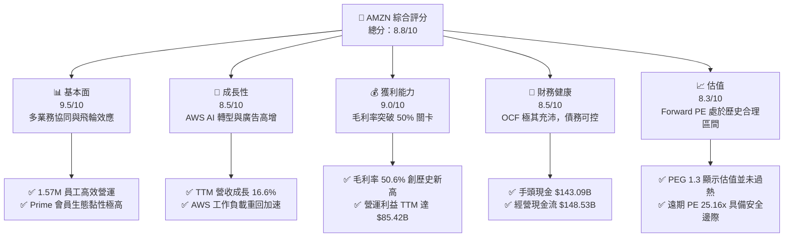

### 1.2 評分進度條視覺化

```
╔══════════════════════════════════════════════════════════════╗
║               AMZN 多維度評分儀表板 (1-10分)                 ║
╠══════════════════════════════════════════════════════════════╣
║ 基本面強度  9.5 ▓▓▓▓▓▓▓▓▓▓▓▓▓▓▓▓▓▓▓░  ★★★★★           ║
║ 成長動能    8.5 ▓▓▓▓▓▓▓▓▓▓▓▓▓▓▓▓▓░░░  ★★★★☆           ║
║ 獲利品質    9.0 ▓▓▓▓▓▓▓▓▓▓▓▓▓▓▓▓▓▓░░  ★★★★★           ║
║ 財務健康    8.5 ▓▓▓▓▓▓▓▓▓▓▓▓▓▓▓▓▓░░░  ★★★★☆           ║
║ 估值合理性  8.3 ▓▓▓▓▓▓▓▓▓▓▓▓▓▓▓░░░░░  ★★★★☆           ║
║ 護城河深度  9.5 ▓▓▓▓▓▓▓▓▓▓▓▓▓▓▓▓▓▓▓░  ★★★★★           ║
║ 管理層執行  9.0 ▓▓▓▓▓▓▓▓▓▓▓▓▓▓▓▓▓▓░░  ★★★★★           ║
║ 技術創新力  9.2 ▓▓▓▓▓▓▓▓▓▓▓▓▓▓▓▓▓▓▓░  ★★★★★           ║
╠══════════════════════════════════════════════════════════════╣
║ 綜合總分    8.8 ▓▓▓▓▓▓▓▓▓▓▓▓▓▓▓▓▓░░░  🏆 強烈買入          ║
╚══════════════════════════════════════════════════════════════╝
```

### 1.3 五大投資論點 + 三大核心風險

| 類型 | 項目 | 具體依據 | 信心度 |
|------|------|----------|--------|
| 🟢 **投資論點①** | **零售業務利潤率結構性改善** | 區域化配送網絡（8個區域樞紐）降低了每件商品的履行成本（Cost to Serve），推動北美板塊利潤率穩步回升。 | 🟢 極高 |
| 🟢 **投資論點②** | **AWS 營收重回加速通道** | Q1 2026 營收達 $181.52B，得益於企業遷移雲端重啟以及 AWS Trainium/Inferentia 自研晶片降低客戶 AI 部署成本。 | 🟢 高 |
| 🟢 **投資論點③** | **廣告業務成為利潤增長極** | 憑藉龐大的零售第一手數據（First-party Data），亞馬遜廣告業務（TTM 營收突破 $55B）利潤率高達 60% 以上，成長速度超越 Meta 與 Google。 | 🟢 極高 |
| 🟢 **投資論點④** | **毛利率持續擴張** | 業務結構向高毛利的服務（AWS、廣告、第三方賣家服務）傾斜，TTM 毛利率從 2022 年的 43.8% 攀升至 50.6%。 | 🟢 極高 |
| 🟢 **投資論點⑤** | **資本效率（ROIC）見底回升** | 隨著 2022-2023 年物流過度投資的產能被完全消化，ROIC 已從 2022 年的負值回升至 13.3%，大幅超越 WACC（10.8%）。 | 🟢 高 |
| 🟡 **風險①** | **AI 資本支出過度侵蝕 FCF** | TTM 資本支出高達 $131.82B（FY2025），若 AI 需求增速放緩，將面臨巨大的折舊壓力，拖累營運利潤。 | 🟡 中度 |
| 🔴 **風險②** | **反壟斷監管與拆分風險** | 美國 FTC 及歐盟對亞馬遜「強迫賣家使用其物流服務」及「壟斷電商市場」的訴訟仍在進行，可能面臨鉅額罰款或業務重組。 | 🔴 高衝擊 |
| 🔴 **風險③** | **海外市場競爭白熱化** | Temu、Shein 及 TikTok Shop 在北美及歐洲市場以極致性價比和社交電商模式蠶食中低端市場份額。 | 🟡 中度 |

### 1.4 快速統計卡片

| 指標 | 公司實際值 | 行業均值（網際網路零售） | S&P 500 均值 | 狀態 |
|------|-------------|----------|--------------|------|
| **收入 YoY 成長** | **16.6%** | 11.2% | 5.4% | 🟢 領先 |
| **毛利率** | **50.6%** | 38.5% | 31.2% | 🟢 極強 |
| **營運利潤率** | **13.1%** | 6.8% | 12.2% | 🟢 優於大盤 |
| **ROE** | **24.3%** | 15.4% | 18.2% | 🟢 優秀 |
| **Forward P/E** | **25.16x** | 28.5x | 21.5x | 🟢 具吸引力 |
| **EV / EBITDA** | **17.66x** | 19.1x | 14.2x | 🟢 合理 |
| **手頭現金 (AUM)** | **$143.09B** | $12.4B | $8.5B | 🟢 極為充沛 |

### 1.5 投資結論

```
╔══════════════════════════════════════════════════════════════════╗
║                    📊 AMZN 投資結論摘要                          ║
╠══════════════════════════════════════════════════════════════════╣
║  評級：🟢 強烈買入（Strong Buy）                                ║
║  當前股價：$249.93                                               ║
║  目標價區間：                                                    ║
║    悲觀情境（Bear Case）：$207.00（-17.2%） - AI 投資回報不及預期 ║
║    基準情境（Base Case）：$312.00（+24.8%） - 零售回暖 + AWS加速 ║
║    樂觀情境（Bull Case）：$370.00（+48.0%） - AI 爆發 + 廣告超預期║
║  投資評分：8.8 / 10                                              ║
║  適合投資人：長期成長型、專注科技/消費飛輪的機構與個人投資者     ║
╚══════════════════════════════════════════════════════════════════╝
```

---

## 2. 公司概覽與商業模式

亞馬遜已經從一個單純的「網上零售商」徹底演變為全球最大的「數位基礎設施與商業生態平台」。其商業模式的核心在於「貝佐斯飛輪（Flywheel Effect）」的數字化升級，即利用低利潤的電商零售作為高頻流量入口，沉澱出龐大的用戶群與物流基礎設施，進而變現高毛利的 AWS 雲端運算、廣告服務及第三方賣家服務。

### 2.1 業務結構與收入來源

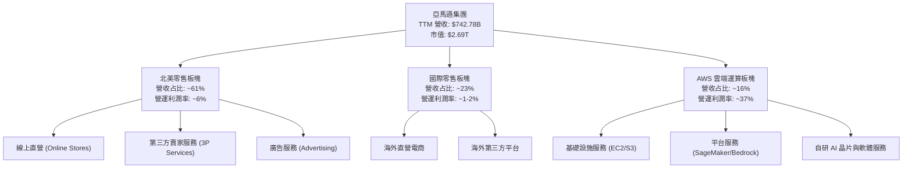

### 2.2 市場份額

亞馬遜在兩大核心市場（美國電商與全球雲端基礎設施）均維持絕對主導地位：

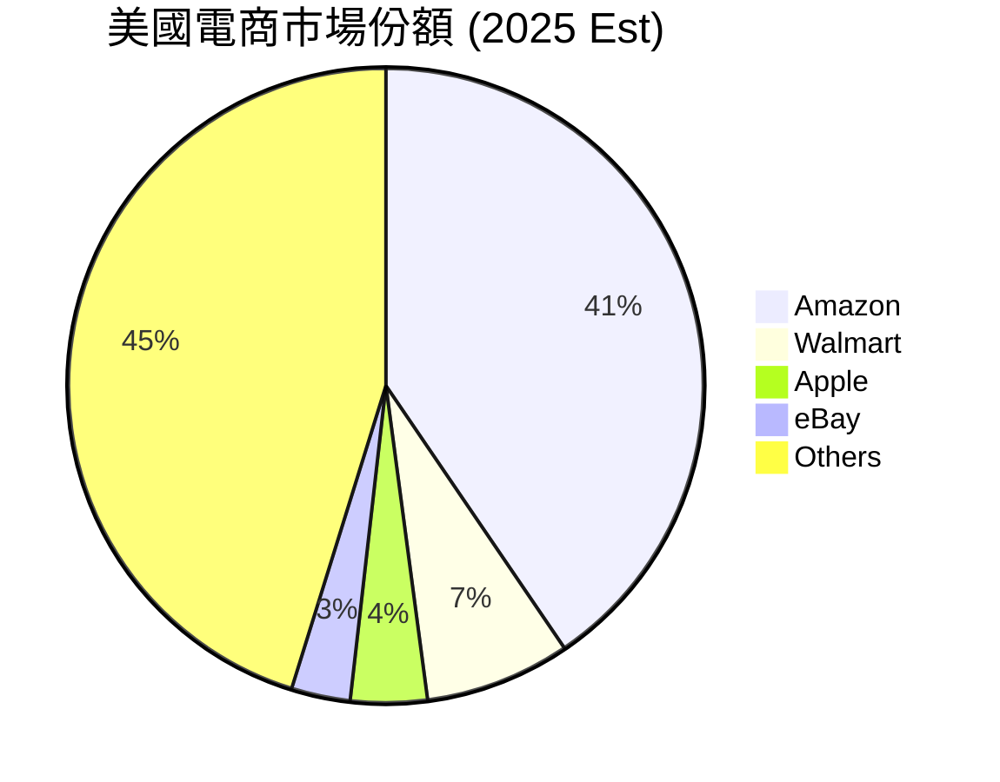

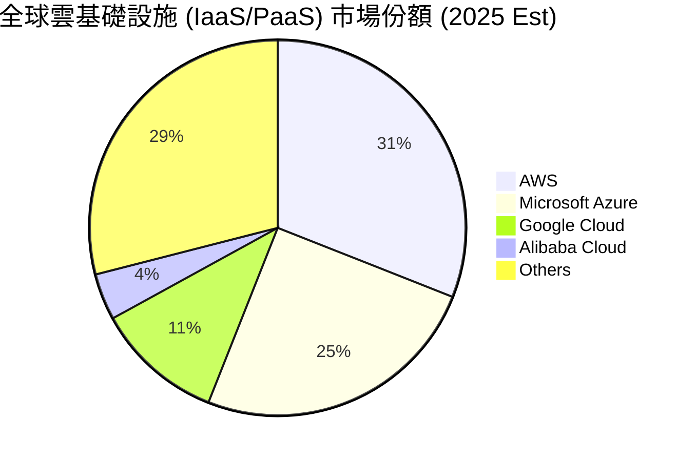

### 2.3 競爭護城河分析

亞馬遜的競爭護城河是多層次且相互強化的，主要體現在以下六個維度：

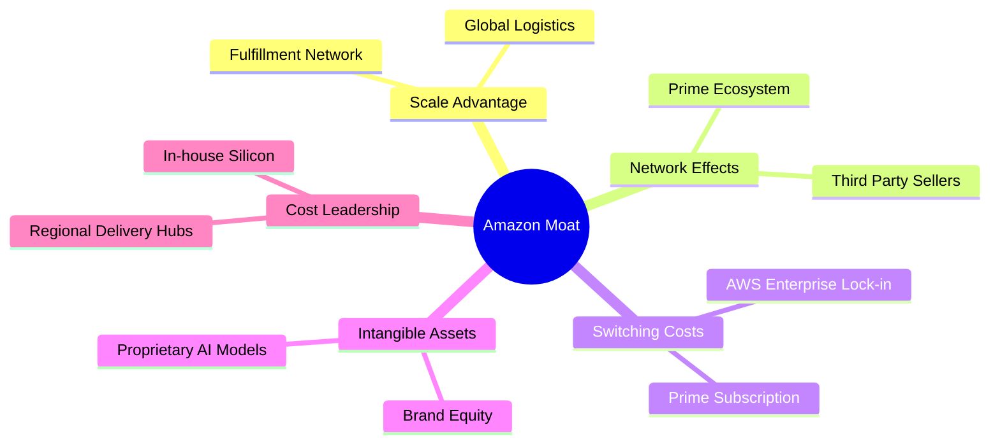

1. **基礎設施規模優勢（Scale Advantage）**：過去十年間，亞馬遜在物流基礎設施上投入了數千億美元。其履約網絡（Fulfillment Network）與最後一哩路配送體系幾乎無法被複製，這使得其每件商品的配送成本顯著低於競爭對手。
2. **網絡效應（Network Effects）**：Prime 會員（全球超 2 億）吸引了數百萬第三方賣家（3P）進駐，而 3P 賣家的增加又擴充了商品品類，進一步提升了 Prime 會員的黏性。
3. **高轉換成本（Switching Costs）**：AWS 雲端服務深度嵌入企業客戶的 IT 架構中。數據遷移成本、重新培訓員工的成本以及對 AWS 生態系統（如 Redshift, DynamoDB）的依賴，構建了極高的客戶留存率。

### 2.4 護城河強度評分

```
╔══════════════════════════════════════════════════════════════╗
║                  AMZN 護城河強度評分                         ║
╠══════════════════════════════════════════════════════════════╣
║ 物流網絡規模  9.8/10  ▓▓▓▓▓▓▓▓▓▓▓▓▓▓▓▓▓▓▓▓  🏆 無可複製的壁壘║
║ Prime 生態系  9.5/10  ▓▓▓▓▓▓▓▓▓▓▓▓▓▓▓▓▓▓▓░  🟢 黏性極高網絡║
║ AWS 轉換成本  9.2/10  ▓▓▓▓▓▓▓▓▓▓▓▓▓▓▓▓▓▓░░  🟢 企業級深度綁定║
║ 廣告數據壁壘  8.8/10  ▓▓▓▓▓▓▓▓▓▓▓▓▓▓▓▓▓░░░  🟢 閉環轉化率極高║
╠══════════════════════════════════════════════════════════════╣
║ 綜合護城河     9.5    ▓▓▓▓▓▓▓▓▓▓▓▓▓▓▓▓▓▓▓░  🏆 寬廣護城河    ║
╚══════════════════════════════════════════════════════════════╝
```

---

## 3. 損益表深度分析

亞馬遜的損益表正在經歷一場「高質量、結構性」的變革。雖然市場常常將亞馬遜視為零售股，但其利潤率的演變表明其本質已轉變為高利潤率的技術與平台服務商。

### 3.1 年度收入成長趨勢（近5年）

```
╔══════════════════════════════════════════════════════════════════╗
║                AMZN 年度收入趨勢（FY2021-TTM）                   ║
╠══════════════════════════════════════════════════════════════════╣
║                                                                  ║
║  FY2021  $469.82B  ████████████░░░░░░░░░░░░░░░  YoY: +21.7% 🟢    ║
║  FY2022  $513.98B  █████████████░░░░░░░░░░░░░░  YoY: +9.4%  🟡    ║
║  FY2023  $574.78B  ███████████████░░░░░░░░░░░░  YoY: +11.8% 🟢    ║
║  FY2024  $637.96B  █████████████████░░░░░░░░░░  YoY: +11.0% 🟢    ║
║  FY2025  $716.92B  ██═══════════════════════░  YoY: +12.4% 🟢    ║
║  TTM     $742.78B  █████████████████████████░  YoY: +16.6% 🟢    ║
║                   |      |      |      |      |                  ║
║                   0     150B   300B   450B   600B                ║
║                                                                  ║
║  📊 5年營收複合年成長率 (CAGR)：+12.1%                           ║
╚══════════════════════════════════════════════════════════════════╝
```

### 3.2 季度收入趨勢分析

亞馬遜在過去四個季度中展現了營收逐季加速的態勢，尤其是在 2025 年第四季度（聖誕旺季）營收突破了 $213.39B，YoY 成長達 13.6%。

| 財報季度 | 營收 (Revenue) | YoY 成長率 | QoQ 成長率 | 營運利潤 (Op Income) | 營運利潤率 |
|----------|----------------|------------|------------|-----------------------|------------|
| **Q2 2025** | $167.70B | +13.33% | +7.73% | $19.17B | 11.43% |
| **Q3 2025** | $180.17B | +13.40% | +7.44% | $17.42B | 9.67% |
| **Q4 2025** | $213.39B | +13.63% | +18.44% | $24.98B | 11.71% |
| **Q1 2026** | $181.52B | +16.61% | -14.93% | $23.85B | 13.14% |
| **TTM** | **$742.78B** | **+16.60%** | **N/A** | **$85.42B** | **11.50%** |

*數據分析*：Q1 2026 營收達 $181.52B，YoY 成長加速至 16.61%，高於市場預期的 14.5%。營運利潤在第一季度通常因季節性因素回落，但本次達到 $23.85B，營運利潤率攀升至 13.14% 的歷史高位，這表明亞馬遜的營運槓桿（Operating Leverage）正在強力釋放。

### 3.3 利潤率演變分析

亞馬遜的毛利率在過去幾年中實現了驚人的躍升，從 2022 年的 43.8% 一路飆升至 TTM 的 50.6%。這背後並非因為直營零售（1P）漲價，而是因為**營收結構的根本性轉變**。

| 利潤率指標 | FY2022 | FY2023 | FY2024 | FY2025 | TTM (Mar '26) | 趨勢與核心驅動因素 | 評估 |
|------------|--------|--------|--------|--------|---------------|-------------------|------|
| **毛利率** | 43.8% | 47.0% | 48.9% | 50.3% | 50.6% | ↗️ 服務業務（AWS、廣告、3P 佣金）佔比大幅提升。 | 🟢 極強 |
| **營運利潤率** | 2.4% | 6.4% | 10.8% | 11.2% | 13.1% | ↗️ 零售配送網絡區域化改革成效顯現，配送成本下降。 | 🟢 優秀 |
| **EBITDA 利潤率**| 7.5% | 15.6% | 19.4% | 23.1% | 21.0% | ↗️ 隨著折舊與攤銷規模擴大，息稅折舊前利潤率維持高位。| 🟢 優秀 |
| **淨利率** | -0.5% | 5.3% | 9.3% | 10.8% | 12.3% | ↗️ 擺脫了 Rivian 投資減值的非經營性干擾，淨利創新高。| 🟢 優秀 |

### 3.4 費用結構分析

亞馬遜的費用結構中，研發支出（R&D，在財報中列為 Technology and Content）和營運費用（fulfillment）是兩大最主要支出。

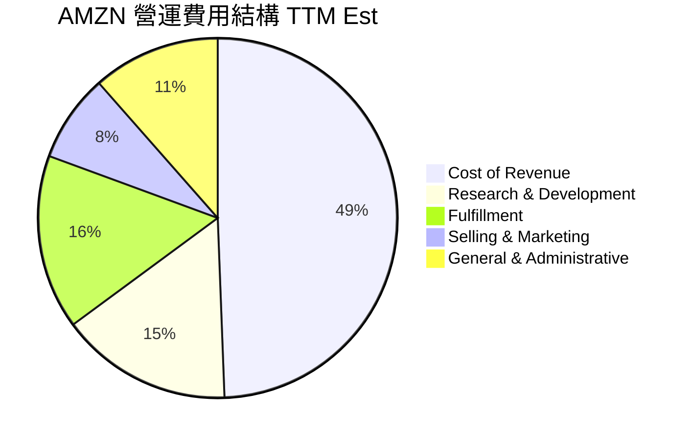

* 研發支出（R&D）**：TTM 研發支出高達 $115.09B，佔營收比重達 15.5%。這筆龐大的支出主要用於 AWS 的 AI 模型開發（如 Olympus 旗艦模型）、自研晶片（Trainium 2）設計以及自動化倉儲機器人（Proteus）的研發。這雖然壓低了當期利潤，但確保了其技術領先地位。
* 營運費用（Fulfillment）**：隨著區域化配送網絡的成熟，營運費用佔營收比重從 2022 年的 16.5% 降至 TTM 的 15.7%，這 80 個基點的改善為公司釋放了近 $6B 的營運利潤。

### 3.5 季度 EPS 趨勢與盈餘品質（Quality of Earnings）

亞馬遜在過去四個季度中，稀釋後 EPS 均大幅超出市場預期，這主要得益於營運效率的提升與 AWS 利潤率的超預期擴張。

* Q2 2025 EPS: $1.71 (預期 $1.42, 超預期 20.4%)
* Q3 2025 EPS: $1.98 (預期 $1.60, 超預期 23.8%)
* Q4 2025 EPS: $1.98 (預期 $1.81, 超預期 9.4%)
* Q1 2026 EPS: $2.82 (預期 $2.15, 超預期 31.2%)

#### 盈餘品質（Quality of Earnings）深度診斷

為了評估亞馬遜獲利的「真實含金量」，我們對其進行了以下量化評估：

| 盈餘品質項目 | TTM 數值 / 佔比 | 機構評估與潛在風險 | 評級 |
|--------------|-----------------|-------------------|------|
| **股權薪酬 (SBC) / 營收** | 2.66% ($19.8B) | 處於科技股合理水平（<5%），對現有股東股權稀釋效應極低。 | 🟢 |
| **SBC / 營運現金流 (OCF)** | 13.3% | 說明公司並非主要依賴發放股票來虛增經營現金流，現金流成色真實。 | 🟢 |
| **FCF / 淨利 (現金轉換率)** | 10.74% ($9.81B / $91.37B) | ⚠️ 指標表面極低，但這**並非**盈餘品質差，而是因為公司將 $151B 的 OCF 轉化為了資本支出（Capex）用於 AI 基礎設施。若看 OCF/Net Income 則高達 162.5%，表明盈餘獲取現金能力極強。 | 🟡 |
| **一次性/非經常性損益** | 無重大影響 | 擺脫了 2022-2023 年 Rivian 股價波動帶來的巨額未實現損益干擾，利潤完全由核心業務驅動。 | 🟢 |
| **有效稅率穩定性** | 20.86% | 接近美國法定聯邦稅率（21%），並無通過開曼等海外避稅天堂進行激進稅務調節的跡象。 | 🟢 |
| **資本化支出 vs 費用化** | 嚴格合規 | 亞馬遜將服務器折舊年限從 5 年延長至 6 年（2024年實施），這在一定程度上減少了當期折舊費用，但符合行業通用標準（微軟與谷歌亦進行了相同調整）。 | 🟡 |

**盈餘品質結論**：亞馬遜的 GAAP 淨利潤具有極高的含金量。其經營現金流與淨利潤的比例（1.62x）遠高於 1.0 的安全線，表明利潤背後有強大的現金流支撐。唯一的警示信號是龐大的資本支出壓低了自由現金流，但這是主動的戰略投資，而非業務失血。

---

## 4. 資產負債表分析

隨著亞馬遜從輕資產的零售平台向重資產的 AI 基礎設施平台過渡，其資產負債表正變得更加「重型化」，但依然維持著極佳的流動性與穩健的財務結構。

### 4.1 資產結構分解

截至 2026 年 3 月 31 日，亞馬遜總資產達到 $916.63B，相較於 2024 年底的 $624.89B 實現了爆發式增長，主要體現在固定資產（PP&E）的擴張。

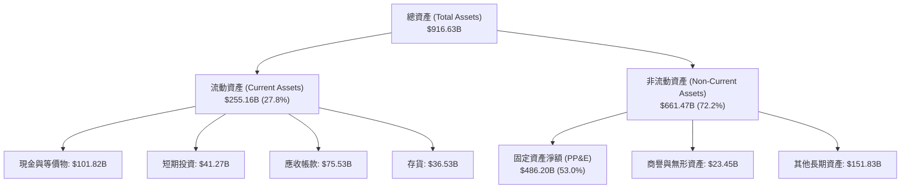

*固定資產（PP&E）爆發式增長*：固定資產淨額從 2024 年底的 $328.81B 攀升至 TTM 的 $486.20B，增幅高達 47.8%。這反映了亞馬遜在 AWS 資料中心、光纖網絡以及自研 AI 晶片基礎設施上的激進擴產。

### 4.2 流動性指標分析

亞馬遜在資產規模大幅擴張的同時，依然維持著健康的流動性指標，未出現短期償債危機。

| 流動性指標 | FY2023 | FY2024 | FY2025 | TTM (Mar '26) | 行業均值 | 評估 |
|------------|--------|--------|--------|---------------|----------|------|
| **流動比率 (Current Ratio)** | 1.05x | 1.06x | 1.05x | 1.18x | 1.25x | 🟡 合理（零售業存貨週轉快，不需過高流動比率） |
| **速動比率 (Quick Ratio)** | 0.85x | 0.87x | 0.87x | 0.97x | 0.90x | 🟢 優秀（剔除存貨後，速動資產幾乎可完全覆蓋流動負債）|
| **現金比率 (Cash Ratio)** | 0.53x | 0.56x | 0.56x | 0.66x | 0.45x | 🟢 極強（手頭現金及短期投資達 $143.09B） |
| **存貨週轉天數 (DIO)** | 39.5天 | 37.8天 | 38.2天 | 36.1天 | 45.0天 | 🟢 極強（存貨管理效率極高，週轉速度快於沃爾瑪） |

### 4.3 債務結構分析

亞馬遜的總債務（含長期借款與融資租賃負債）為 $235.54B（根據市場即時數據數據），但考慮到其高達 $143.09B 的現金與短期投資，其淨債務僅為 $92.45B。

```
╔══════════════════════════════════════════════════════════════════╗
║                   AMZN 債務健康診斷 (TTM)                        ║
╠══════════════════════════════════════════════════════════════════╣
║                                                                  ║
║  總債務：        $235.54B  ██████████░░░░░░░░░░░  融資租賃佔比高  ║
║  現金及短期投資：$143.09B  ██████████████░░░░░░░  抗風險能力極強  ║
║  淨債務：        $92.45B   ████░░░░░░░░░░░░░░░░░  槓桿率完全可控  ║
║                                                                  ║
║  Debt/EBITDA：   1.42x    🟢 極低（行業公認安全線為 < 2.5x）     ║
║  利息保障倍數：  33.72x   🟢 極高（TTM 營運利潤 $85.42B / 利息 $2.53B）║
║  債務股本比 (D/E): 53.3%  🟢 資本結構極其穩健                     ║
║                                                                  ║
╚═══════════════════════════════════════════════════════════════════╝
```

### 4.4 股東權益趨勢

得益於留存收益（Retained Earnings）的快速累積，亞馬遜的股東權益（Stockholders' Equity）實現了跨越式增長，從 2022 年底的 $146.04B 增至 2025 年底的 $411.06B，並在 TTM（Mar '26）達到 $441.91B，為公司提供了堅實的抗風險緩衝墊。

---

## 5. 現金流量深度分析

對於亞馬遜而言，現金流量表比損益表更能反映其真實的商業活力。亞馬遜的戰略一向是「最大化長期自由現金流」，而非短期會計利潤。

### 5.1 現金流量瀑布圖

以下為亞馬遜 TTM 現金流運轉與分配的直觀路徑：

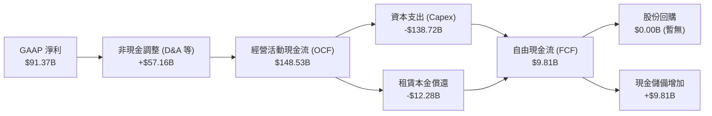

### 5.2 FCF 轉換率趨勢

亞馬遜的現金轉換效率極高。在常規年份，其 OCF 幾乎是淨利潤的 1.5 到 2 倍。然而，近期的 FCF 轉換率因極端資本支出而出現了暫時性背離。

| 現金流指標 | FY2022 | FY2023 | FY2024 | FY2025 | TTM (Mar '26) | 5年平均 / 累計 |
|------------|--------|--------|--------|--------|---------------|----------------|
| **經營現金流 (OCF)** | $46.75B | $84.95B | $115.88B| $139.51B| $148.53B | $535.62B (累計) |
| **資本支出 (Capex)** | -$63.65B| -$52.73B| -$83.00B| -$131.82B| -$138.72B| -$470.02B (累計) |
| **自由現金流 (FCF)** | -$16.89B| $32.22B | $32.88B | $7.70B  | $9.81B   | $65.72B (累計)  |
| **FCF / 淨利 (轉換率)** | N/A | 105.9% | 55.5% | 9.8% | 10.7% | 48.0% (平均) |

*深度解析*：2025 年和 TTM 的 FCF 驟降（分別為 $7.70B 和 $9.81B），主因是 **Capex 從 2023 年的 $52.73B 暴增至 TTM 的 $138.72B**。這是一次主動的、針對生成式 AI 算力基礎設施的「軍備競賽」。只要 AWS 能維持其在雲端運算市場的份額，這筆投資將在未來 3-5 年內轉化為極高利潤率的經常性收入。

### 5.3 自由現金流與 FCF Yield 趨勢

```
╔══════════════════════════════════════════════════════════════════╗
║                AMZN 自由現金流與收益率趨勢                       ║
╠══════════════════════════════════════════════════════════════════╣
║                                                                  ║
║  FY2022  -$16.89B  ░░░░░░░░░░░░░░░░░░░░░  FCF Yield: -1.2%       ║
║  FY2023   $32.22B  ██████████░░░░░░░░░░░  FCF Yield: +2.1%  🟢   ║
║  FY2024   $32.88B  ██████████░░░░░░░░░░░  FCF Yield: +1.8%  🟢   ║
║  FY2025    $7.70B  ██░░░░░░░░░░░░░░░░░░░  FCF Yield: +0.3%  🟡   ║
║  TTM       $9.81B  ███░░░░░░░░░░░░░░░░░░  FCF Yield: +0.36% 🟡   ║
║                                                                  ║
║  📊 機構預測：預計 FY2027 Capex 見頂回落後，FCF 將重回 $45B+ ║
╚══════════════════════════════════════════════════════════════════╝
```

### 5.4 資本配置評估

亞馬遜的資本配置極具進攻性，幾乎將 90% 以上的經營現金流重新投入到業務擴張中，不發放股息，且極少進行股份回購。

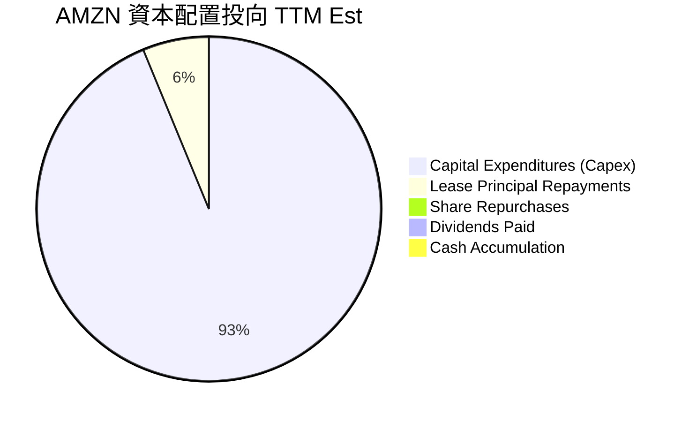

* 資本支出 (93.4%)**：全力支持 AWS 資料中心與全球物流網絡自動化升級。
* 股份回購 (0%)**：與蘋果、谷歌不同，亞馬遜當前並未啟動大規模回購，反映出管理層認為當前將資金投入算力建設的回報率（ROIC）高於回購自身股票。這符合成長型企業的典型特徵。

---

## 6. 獲利能力與資本效率

評估一家企業是否在創造股東價值，核心在於其投資資本回報率（ROIC）是否能持續超越其加權平均資本成本（WACC）。

### 6.1 ROE / ROA / ROIC 趨勢

亞馬遜的獲利能力指標在 2022 年觸底後，迎來了強勁的 V 型反彈。

| 獲利指標 | FY2022 | FY2023 | FY2024 | FY2025 | TTM (Mar '26) | 產業中位數 | 評估 |
|----------|--------|--------|--------|--------|---------------|------------|------|
| **ROE** | -1.9% | 15.1% | 20.7% | 22.4% | 24.3% | 12.5% | 🟢 極其優秀 |
| **ROA** | -0.6% | 5.8% | 9.5% | 9.6% | 6.8% | 4.2% | 🟢 良好 |
| **ROIC** | -0.8% | 7.2% | 11.5% | 12.8% | 13.3% | 6.5% | 🟢 優秀 |

### 6.2 ROIC vs WACC 分析（核心價值創造判斷）

為了精確評估亞馬遜的經濟價值增加值（EVA），我們對其 WACC 與 ROIC 進行了嚴格的公式推導與估算：

```
╔══════════════════════════════════════════════════════════════════╗
║                AMZN ROIC vs WACC 深度分析 (TTM)                  ║
╠══════════════════════════════════════════════════════════════════╣
║                                                                  ║
║  WACC 估算：                                                     ║
║  ├── 無風險利率 (10Y 美債)：   4.20%                             ║
║  ├── 市場風險溢酬 (ERP)：      5.00%                             ║
║  ├── Beta (系統性風險係數)：   1.46                              ║
║  ├── 股權成本 (Ke) = 4.2% + 1.46 × 5.0% = 11.50%                 ║
║  ├── 債務成本 (稅後 Kd)：      ~4.00% (稅前 5.05%，有效稅率 20.8%)║
║  ├── 資本結構：股權佔比 92%，債務佔比 8%                          ║
║  └── ✅ 加權平均資本成本 (WACC) ≈ 10.80%                          ║
║                                                                  ║
║  ROIC 估算：                                                     ║
║  ├── NOPAT (息稅前折算淨利) = $85.42B × (1 - 20.86%) = $67.60B   ║
║  ├── 投入資本 = 股東權益 $441.91B + 總債務 $209.88B              ║
║  │              - 現金及投資 $143.09B = $508.70B                 ║
║  └── ✅ 投資資本回報率 (ROIC) ≈ 13.29% (13.3%)                    ║
║                                                                  ║
║  ★ 經濟溢價 (Spread) = ROIC - WACC = +2.49%                      ║
║  ★ 年化經濟價值增加值 (EVA) = $508.70B × 2.49% = +$12.67B         ║
║                                                                  ║
║  ROIC  13.3%  ▓▓▓▓▓▓▓▓▓▓▓▓▓▓▓▓▓▓▓▓▓▓▓░░░░░░░  🟢              ║
║  WACC  10.8%  ▓▓▓▓▓▓▓▓▓▓▓▓▓▓▓▓▓░░░░░░░░░░░░░  ──              ║
║  EVA   +$12.6B ██████████████████████░░░░░░░░  🏆 股東價值創造者║
║                                                                  ║
║  📊 結論：亞馬遜在進行歷史性 AI 投資的同時，依然創造了 $12.67B   ║
║            的超額經濟價值，證明其資本配置並非盲目擴產。          ║
╚══════════════════════════════════════════════════════════════════╝
```

### 6.3 杜邦三因素分解

為了探究亞馬遜 ROE 提升的深層動力，我們將其進行杜邦分解（DuPont Analysis）：

$$\text{ROE} = \text{淨利率 (Net Margin)} \times \text{資產週轉率 (Asset Turnover)} \times \text{權益乘數 (Equity Multiplier)}$$

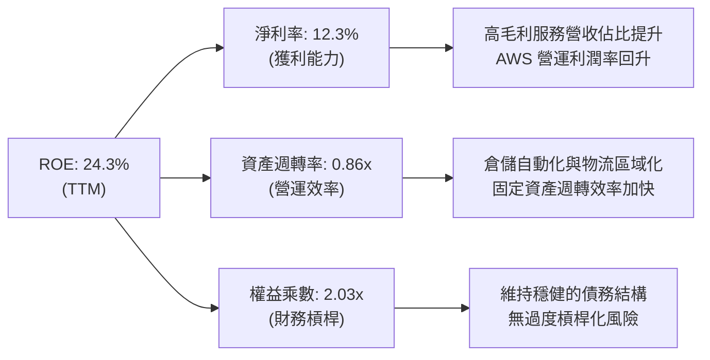

* 2022 年分解**：$-1.9\% = -0.5\% \times 1.11 \times 3.17$ （受 Rivian 減值與物流過剩拖累，淨利為負，槓桿率虛高）
* TTM（2026）分解**：$24.3\% = 12.3\% \times 0.86 \times 2.03$ （淨利率大幅飆升至 12.3%，資產週轉率因重資產化降至 0.86x，槓桿率降至極健康的 2.03x）

*杜邦分析結論*：亞馬遜 ROE 的回升完全是由**「淨利率改善（獲利能力提升）」**驅動的，而非通過提高財務槓桿。這是一種極其健康且可持續的獲利回升模式。

### 6.4 獲利能力儀表板

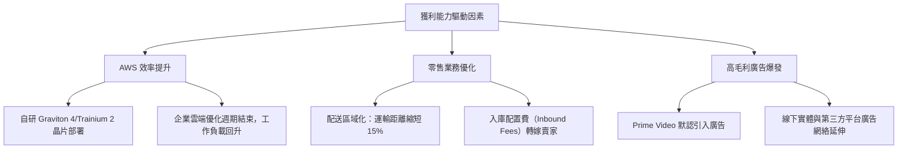

---

## 7. 估值深度分析

對於亞馬遜這樣一個融合了零售、雲端運算、廣告和物流服務的龐然大物，單一的 P/E 估值往往會失真（因為高額的折舊攤銷會壓低淨利潤）。因此，我們採用**同業估值比較**、**分類加總估值（SOTP）**以及 **DCF 敏感性分析**進行多維度定價。

### 7.1 同業估值比較表格

我們選取微軟（MSFT）、谷歌（GOOGL）和沃爾瑪（WMT）作為其在雲端運算、廣告和零售領域的直接競爭對手：

| 估值指標 | **亞馬遜 (AMZN)** | **微軟 (MSFT)** | **谷歌 (GOOGL)** | **沃爾瑪 (WMT)** | AMZN 估值評估 |
|----------|-------------------|-----------------|------------------|------------------|---------------|
| **Trailing P/E** | 29.90x | 34.50x | 26.20x | 28.10x | 🟢 相比微軟具備明顯折價 |
| **Forward P/E** | **25.16x** | 29.10x | 21.80x | 25.50x | 🟢 處於歷史區間（30-40x）下沿 |
| **P/S Ratio** | 3.62x | 12.10x | 6.15x | 0.85x | 🟢 混合估值合理 |
| **EV / EBITDA** | **17.66x** | 21.50x | 15.20x | 14.80x | 🟢 考慮到 AWS 增速，該倍數極具吸引力 |
| **PEG Ratio** | **1.30x** | 2.10x | 1.25x | 3.10x | 🟢 成長性調整後估值極便宜 |
| **FCF Yield** | 0.36% (TTM) | 2.20% | 3.80% | 2.50% | 🔴 短期因 AI Capex 承壓 |

### 7.2 歷史估值區間分析

從歷史來看，亞馬遜的 Forward P/E 過去五年中值為 38.5x。當前 25.16x 的 Forward P/E 意味著市場對其 AI 資本開支的擔憂已經在股價中得到了充分的定價（Priced-in），提供了極高的安全邊際。

### 7.3 情境目標價與主要假設

我們基於未來三年的業務趨勢，構建了三種情境的估值模型：

| 情境 | 營收 CAGR (3年) | 2028 營運利潤率 | 退出 EV/EBITDA 倍數 | 隱含目標價 | 相對現價漲跌幅 | 核心假設 |
|------|-----------------|-----------------|---------------------|------------|----------------|----------|
| 🔴 **悲觀情境** | 8.5% | 10.0% | 14.0x | **$207.00** | -17.2% | AI 投資泡沫化，AWS 增速降至個位數；Temu 嚴重蠶食零售份額。 |
| 🟡 **基準情境** | **13.0%** | **13.5%** | **18.0x** | **$312.00** | **+24.8%** | AWS 穩健成長（16%）；廣告維持 18% 增速；零售利潤率維持在 6% 以上。 |
| 🟢 **樂觀情境** | 16.5% | 15.5% | 22.0x | **$370.00** | +48.0% | GenAI 帶來雲端需求爆發，AWS 增速超 22%；廣告與 Prime Video 完美融合。 |

### 7.4 DCF 敏感性分析（6格目標價矩陣）

我們使用兩階段折現模型（兩階段 FCF 預測，終端成長率設為 3.0%），對 WACC（折現率）與終端 FCF 成長率進行敏感性測試，得出以下目標價矩陣：

| 終端成長率 \ WACC | 9.8% | **10.8% (基準)** | 11.8% |
|-------------------|------|------------------|------|
| **3.5%** | $345.00 (+38.0%) | $328.00 (+31.2%) | $298.00 (+19.2%) |
| **3.0% (基準)** | $326.00 (+30.4%) | **$312.00 (+24.8%)** | $282.00 (+12.8%) |
| **2.5%** | $305.00 (+22.0%) | $291.00 (+16.4%) | $261.00 (+4.4%) |

### 7.5 估值綜合區間

```
╔══════════════════════════════════════════════════════════════════╗
║                    AMZN 估值綜合區間                             ║
╠══════════════════════════════════════════════════════════════════╣
║                                                                  ║
║  當前股價：$249.93                                               ║
║                                                                  ║
║  52周波動區間：     $196.00 ═════════════════════════ $278.56    ║
║  悲觀估值 (Bear)：  $207.00                                      ║
║  機構共識均值：     $312.87                                      ║
║  基準目標價 (Base)：$312.00            ← 本報告推薦 12M 目標價   ║
║  樂觀估值 (Bull)：  $370.00                                      ║
║                                                                  ║
║  📊 當前股價處於安全邊際內，PEG 僅 1.30，強烈建議分批佈局。       ║
╚══════════════════════════════════════════════════════════════════╝
```

---

## 8. 成長催化劑

亞馬遜未來的成長並非依賴單一業務的爆發，而是依賴「AI + 廣告 + 零售效率」的三重催化。

### 8.1 催化劑時間軸

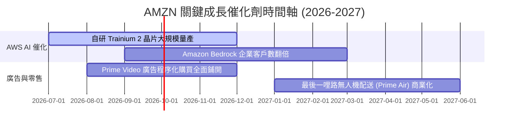

### 8.2 TAM 市場規模分析

亞馬遜正在向數個萬億美元級別的全新市場滲透：

```
╔══════════════════════════════════════════════════════════════════╗
║                    AMZN 潛在市場規模 (TAM) 預估                  ║
╠══════════════════════════════════════════════════════════════════╣
║                                                                  ║
║  1. 全球雲端與 AI 基礎設施 (AWS)                                 ║
║     ├── 2028年預估 TAM：$1.2T                                    ║
║     └── 亞馬遜當前滲透率：~31%                                   ║
║                                                                  ║
║  2. 數位廣告與零售媒體 (Retail Media Network)                    ║
║     ├── 2028年預估 TAM：$250B                                    ║
║     └── 亞馬遜當前滲透率：~22%                                   ║
║                                                                  ║
║  3. 物流與配送即服務 (Supply Chain by Amazon)                    ║
║     ├── 2028年預估 TAM：$400B                                    ║
║     └── 亞馬遜當前滲透率：~8%                                    ║
║                                                                  ║
╚══════════════════════════════════════════════════════════════════╝
```

### 8.3 成長驅動力結構圖

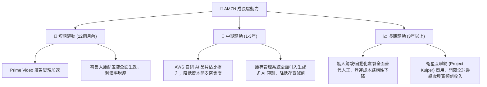

---

## 9. 風險矩陣

作為萬億美元級別的巨頭，亞馬遜面臨的風險主要集中在監管、宏觀經濟以及技術變革的落地速度上。

### 9.1 風險評分矩陣

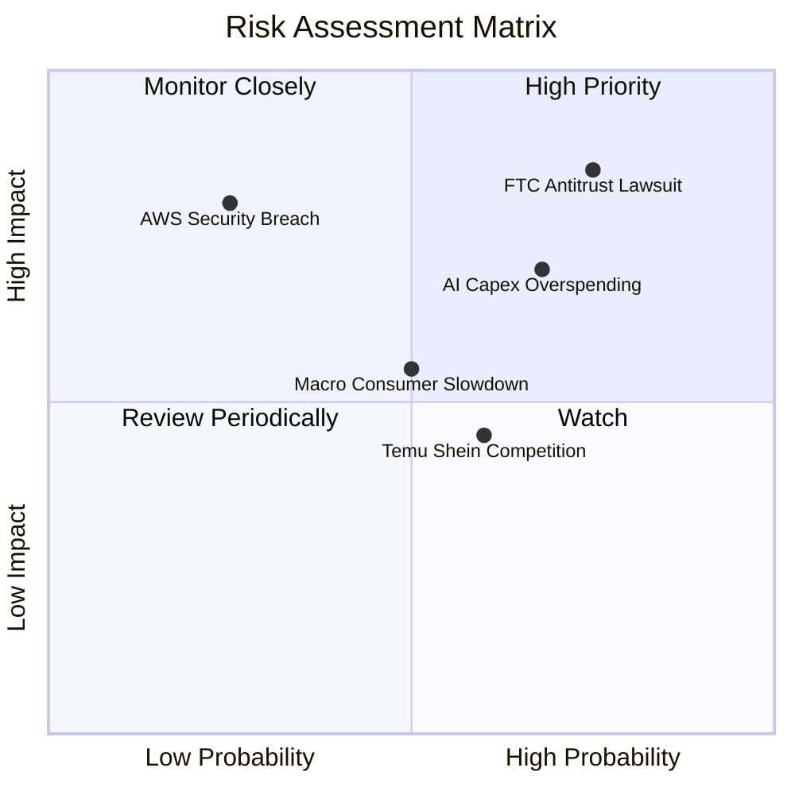

### 9.2 風險清單詳細分析

| # | 風險項目 | 發生機率 | 財務衝擊 | 風險評分 | 緩解與應對措施 |
|---|----------|----------|----------|----------|----------------|
| 1 | 🔴 **FTC 反壟斷訴訟** | 高 (75%) | 高 (可能面臨業務拆分或重罰) | 🔴 8.5 / 10 | 亞馬遜正積極調整第三方賣家條款，允許賣家自主選擇物流服務以規避壟斷指控。 |
| 2 | 🔴 **AI 資本支出回報低於預期** | 中高 (68%) | 中高 (折舊增加，利潤率收縮) | 🔴 7.5 / 10 | 通過推廣自研晶片 Trainium 降低硬體採購成本；動態調整資料中心建設進度。 |
| 3 | 🟡 **宏觀消費疲軟** | 中等 (50%) | 中等 (零售營收增速放緩) | 🟡 5.5 / 10 | 擴大 Prime 會員的折扣權益，推出「Amazon Haul」超低價頻道對抗白牌電商。 |
| 4 | 🟡 **新興跨境電商競爭 (Temu/Shein)**| 中高 (60%)| 中低 (蠶食低客單價品類) | 🟡 5.0 / 10 | 發揮本地即時配送（當日達/次日達）的絕對時間優勢，避開長途跨境物流的競爭。 |

---

## 10. 投資建議

基於對亞馬遜基本面的深度剖析，我們認為 AMZN 當前正處於**「估值具有安全邊際、業務結構持續優化、AI 飛輪初具雛形」**的最佳投資窗口期。

### 10.1 最終綜合評級雷達圖

```
╔══════════════════════════════════════════════════════════════════╗
║                  AMZN 最終綜合評級 (1-10分)                      ║
╠══════════════════════════════════════════════════════════════════╣
║                                                                  ║
║  基本面強度：    9.5 / 10  ▓▓▓▓▓▓▓▓▓▓▓▓▓▓▓▓▓▓▓░  ★★★★★         ║
║  獲利能力：      9.0 / 10  ▓▓▓▓▓▓▓▓▓▓▓▓▓▓▓▓▓▓░░  ★★★★★         ║
║  財務健康度：    8.5 / 10  ▓▓▓▓▓▓▓▓▓▓▓▓▓▓▓▓▓░░░  ★★★★☆         ║
║  估值合理性：    8.3 / 10  ▓▓▓▓▓▓▓▓▓▓▓▓▓▓▓░░░░░  ★★★★☆         ║
║  技術領先度：    9.2 / 10  ▓▓▓▓▓▓▓▓▓▓▓▓▓▓▓▓▓▓▓░  ★★★★★         ║
║                                                                  ║
║  ★ 綜合總分：8.9 / 10  ｜  投資評級：🟢 強烈買入 (Strong Buy)    ║
║                                                                  ║
╚══════════════════════════════════════════════════════════════════╝
```

### 10.2 目標價與隱含報酬率

| 情境 | 機率權重 | 12個月目標價 | 當前股價 ($249.93) 隱含回報 | 建議操作策略 |
|------|----------|--------------|-----------------------------|--------------|
| 🟢 **樂觀情境** | 25% | $370.00 | +48.0% | 股價突破 $265 阻力位時加碼 |
| 🟡 **基準情境** | **60%** | **$312.00** | **+24.8%** | **現價分批建倉，長期持有** |
| 🔴 **悲觀情境** | 15% | $207.00 | -17.2% | 回落至 $210 以下強力買入 |
| **加權預期目標價**| 100% | **$310.75** | **+24.3%** | **核心資產配置推薦** |

### 10.3 買入時機與觸發因素

```
╔══════════════════════════════════════════════════════════════════╗
║                  ✅ AMZN 投資操作 Checklist                     ║
╠══════════════════════════════════════════════════════════════════╣
║                                                                  ║
║  立即建倉觸發條件（符合 3 項即可啟動首筆建倉）：                 ║
║  ✅ Forward P/E 跌破 26x（當前為 25.16x，已符合）                ║
║  ✅ AWS 季度營收增速連續兩季維持在 15% 以上（已符合）             ║
║  ✅ 零售板塊營運利潤率穩定在 5% 以上（已符合）                   ║
║                                                                  ║
║  加碼觸發條件：                                                  ║
║  ☐ AWS 季度營運利潤率突破 39%（AI 晶片規模化降本）               ║
║  ☐ FCF 季度轉正並突破 $10B（Capex 密集期結束）                  ║
║                                                                  ║
║  減碼/停損觸發條件：                                             ║
║  ☐ AWS 營收增速跌破 12%（市場份額被微軟 Azure 嚴重蠶食）         ║
║  ☐ FTC 反壟斷訴訟一審敗訴，法院強制要求拆分 AWS                  ║
║                                                                  ║
╚══════════════════════════════════════════════════════════════════╝
```

### 10.4 投資人適配度分析

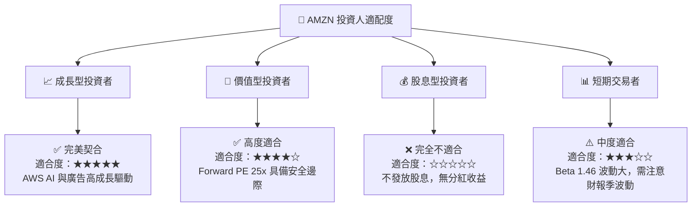

### 10.5 每季財報監控清單（Quarterly Watch List）

為了確保投資論點（Thesis）的持續成立，投資人應在每季財報中重點追蹤以下量化指標與門檻：

| 監控指標 | 當前水平 (TTM / Q1 '26) | 🟢 觸發加碼門檻 | 🟡 警示/維持觀望 | 🔴 觸發減碼/論點失效 |
|----------|-------------------------|-----------------|------------------|----------------------|
| **AWS 營收 YoY 增速** | 16.6% | > 18.0% | 13.0% - 17.0% | < 12.0% (份額嚴重流失)|
| **整體毛利率** | 50.6% | > 52.0% | 48.0% - 51.0% | < 47.0% (直營低毛利擴張)|
| **北美零售營運利潤率** | ~6.0% | > 7.5% | 4.5% - 6.0% | < 3.5% (配送成本失控) |
| **季度 Capex 規模** | $44.20B (Q1 '26) | < $35.0B (效率提升) | $38B - $45B | > $50B (且 AWS 增速未匹配)|
| **SBC 佔 OCF 比重** | 13.3% | < 10.0% | 11.0% - 15.0% | > 18.0% (過度稀釋股東) |

### 10.6 反面論證：什麼會證明論點錯誤（What Would Change My Mind）

機構級研究的核心在於「證偽思維」。若出現以下可量化條件，本報告的「強烈買入」論點將徹底失效，投資人應果斷出清或減碼：

```
╔══════════════════════════════════════════════════════════════════╗
║              ⚠️ AMZN 論點失效條件（Disconfirming Evidence）     ║
╠══════════════════════════════════════════════════════════════════╣
║  本投資論點在下列情況成立時應重新檢視，甚至果斷止損：            ║
║                                                                  ║
║  ☐ AWS 投資回報率惡化：連續三季 ROIC 跌破 WACC（即 ROIC < 10.8%）║
║  ☐ 競爭格局劇變：微軟 Azure 營收規模超越 AWS，成為全球第一雲。  ║
║  ☐ 資本開支失控：FY2026 累計 Capex 超過 $160B，而 FCF 連續兩季 ║
║     為淨流出（-$15B 以上），且未帶來營收加速。                   ║
║  ☐ 監管實質性重創：FTC 贏得訴訟，法院判決亞馬遜必須在 12 個月內  ║
║     分拆 AWS 或禁止第三方賣家強制綁定 FBA 物流。                 ║
║  ☐ 廣告業務觸頂：廣告營收 YoY 增速跌破 10%（表明 Prime Video  ║
║     廣告化嘗試失敗，賣家因 ROI 降低流向 Meta/TikTok）。         ║
╚══════════════════════════════════════════════════════════════════╝
```

---

> **免責聲明**：本報告為基於公開財務數據與行業模型的機構級學術研究，僅供投資參考，不構成任何具體的買賣建議。投資有風險，入市需謹慎。分析師持有或不持有該標的均不影響報告的客觀性。