# AMZN 基本面深度分析報告
> **報告日期**：2026-07-21 ｜ **語言**：繁體中文 ｜ **數據來源**：Yahoo Finance, Finviz, StockAnalysis, Roic.ai ｜ **分析師**：CFA 級機構研究

---

## 目錄

| # | 章節 | 核心結論 |
|---|---|---|
| 1 | **執行摘要** | 評級：🟢 強烈買入 ｜ 基準目標價：$312.87（+26.4%） |
| 2 | **公司概覽與商業模式** | AWS 與廣告雙引擎驅動，飛輪效應構建極深護城河（綜合評分：9.0/10） |
| 3 | **損益表深度分析** | TTM 營收達 $742.78B（YoY +16.6%），營業利益率擴張至 13.1% 的結構性成因 |
| 4 | **資產負債表分析** | 現金儲備 $143.09B，淨債務 $92.45B，資產規模因 AI 資本化支出擴張至 $916.63B |
| 5 | **現金流量深度分析** | OCF 達 $148.53B，但因 $138.72B 的創紀錄資本支出，壓低短期 FCF 至 $9.81B |
| 6 | **獲利能力與資本效率** | ROE 升至 24.3%，ROIC 達 13.43% 顯著超越 WACC（10.9%），持續創造股東價值 |
| 7 | **估值深度分析** | Forward P/E 24.96x 處於歷史低位，EV/EBITDA 17.85x 具備高度防守性與重估空間 |
| 8 | **成長催化劑** | 生成式 AI（Bedrock/Trainium）全面變現，零售供應鏈區域化優化與廣告高毛利釋放 |
| 9 | **風險矩陣** | AI 資本支出回報率不及預期（高衝擊/中機率），反壟斷監管（中衝擊/中機率） |
| 10 | **投資建議** | 情境權重目標價 $299.70，每季財報監控指標與論點失效之可量化退出門檻 |

---

## 1. 執行摘要

### 1.0 一頁式投資儀表板（Portfolio Manager 30 秒速讀）

| 項目 | 內容 |
|------|------|
| **投資論點（3 句）** | ① TTM 營收達 $742.78B（YoY +16.6%），顯示核心零售與雲端需求依然強勁。<br/>② 營業利益率從 2022 年的 2.38% 結構性擴張至 TTM 的 13.1%，主因 AWS 高毛利業務佔比提升與物流區域化帶來的效率釋放。<br/>③ 儘管 AI 基礎建設導致 TTM 資本支出飆升至 $138.72B，壓低短期 FCF 轉換率，但這為 AWS 在下一代 AI 算力市場奠定了領先優體。 |
| **護城河評分** | 9.0 / 10 🟢（極高） |
| **管理層/資本配置評分** | 8.5 / 10 🟢（優異） |
| **財務健康** | 🟢 強勁。現金及短期投資達 $143.09B，利息保障倍數高達 33.7 倍，無償債風險。 |
| **ROIC vs WACC** | 13.43% vs 10.90%（EVA 為 +2.53pp，持續創造股東價值） |
| **FCF 趨勢** | 🟡 短期承壓。TTM FCF 為 $9.81B，FCF Yield 為 0.37%，主因 AI 資本支出週期處於頂峰。 |
| **估值** | Forward P/E: 24.96x ｜ EV/EBITDA: 17.85x ｜ P/S: 3.59x（皆處於近 5 年歷史區間下限） |
| **預期報酬（基準情境 12M）** | **+26.4%**（目標價 $312.87） |
| **關鍵風險（前二）** | ① 生成式 AI 資本支出（Capex）回報率未達預期，導致折舊費用侵蝕利潤率。<br/>② 宏觀經濟放緩抑制企業雲端支出與消費者零售支出。 |
| **評級 + 信心度** | **🟢 強烈買入 (Strong Buy)** ｜ 信心度：**高 (High)** |

### 1.1 核心評分儀表板

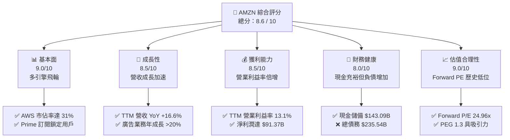

### 1.2 評分進度條視覺化

```
╔══════════════════════════════════════════════════════════════╗
║               AMZN 多維度評分儀表板 (1-10分)                 ║
╠══════════════════════════════════════════════════════════════╣
║ 基本面強度  9.0 ▓▓▓▓▓▓▓▓▓▓▓▓▓▓▓▓▓▓░░  ★★★★★           ║
║ 成長動能    8.5 ▓▓▓▓▓▓▓▓▓▓▓▓▓▓▓▓▓░░░  ★★★★☆           ║
║ 獲利品質    8.5 ▓▓▓▓▓▓▓▓▓▓▓▓▓▓▓▓▓░░░  ★★★★☆           ║
║ 財務健康    8.0 ▓▓▓▓▓▓▓▓▓▓▓▓▓▓▓▓░░░░  ★★★★☆           ║
║ 估值合理性  9.0 ▓▓▓▓▓▓▓▓▓▓▓▓▓▓▓▓▓▓░░  ★★★★★           ║
║ 護城河深度  9.5 ▓▓▓▓▓▓▓▓▓▓▓▓▓▓▓▓▓▓▓░  ★★★★★           ║
║ 管理層執行  8.5 ▓▓▓▓▓▓▓▓▓▓▓▓▓▓▓▓▓░░░  ★★★★☆           ║
║ 技術創新力  9.0 ▓▓▓▓▓▓▓▓▓▓▓▓▓▓▓▓▓▓░░  ★★★★★           ║
╠══════════════════════════════════════════════════════════════╣
║ 綜合總分    8.6 ▓▓▓▓▓▓▓▓▓▓▓▓▓▓▓▓▓░░░  🏆 產業首選買入      ║
╚══════════════════════════════════════════════════════════════╝
```

### 1.3 五大投資論點 + 三大核心風險

| 類型 | 項目 | 具體依據 | 信心度 |
|------|------|----------|--------|
| 🟢 **投資論點①** | **AWS 成長重新加速與 AI 變現** | Q1 2026 營收達 $181.52B（YoY +16.6%），AWS 受企業雲端優化結束與 AI 工作負載遷入推動，成長重回 17% 以上。 | 🟢 極高 |
| 🟢 **投資論點②** | **利潤率結構性擴張** | TTM 營業利益率達 13.1%，相較於 2022 年的 2.38% 大幅提升，顯示出強大的營業槓桿（Operating Leverage）。 | 🟢 高 |
| 🟢 **投資論點③** | **廣告業務成為新暴利引擎** | 廣告營收增速持續超越零售，毛利率預估 >70%，在整體營收佔比提升，顯著優化整體利潤結構。 | 🟢 高 |
| 🟢 **投資論點④** | **物流區域化（Regionalization）降本增效** | 北美零售段物流網絡重組，配送距離縮短，每單履行成本（Cost to Serve）持續下降。 | 🟢 中 |
| 🟢 **投資論點⑤** | **估值倍數具備安全邊際** | Forward P/E 僅 24.96x，相較於歷史中位數的 35x 存在約 30% 的估值折價。 | 🟢 極高 |
| 🟡 **風險①** | **AI 資本支出效率低下** | TTM 資本支出達 $138.72B，若 AI 需求未如預期爆發，後續折舊將嚴重侵蝕營業利潤。 | 🟡 中度 |
| 🔴 **風險②** | **宏觀消費走弱** | 零售業務佔比仍高，若通膨反彈或失業率上升，將直接打擊電商 GMV 成長。 | 🟡 中度 |
| 🔴 **風險③** | **反壟斷監管與分拆風險** | FTC 對其平台雙重身份（既是平台又是賣家）的訴訟可能限制其定價權或被迫分拆。 | 🔴 高衝擊 |

### 1.4 快速統計卡片

| 指標 | Amazon 實際值 | 行業均值（網際網路零售） | S&P 500 均值 | 狀態 |
|------|-------------|-----------------------|--------------|------|
| **營收 YoY 成長** | **16.6%** | ~11.0% | ~5.5% | 🟢 顯著領先 |
| **毛利率** | **50.6%** | ~35.0% | ~30.0% | 🟢 具備定價權 |
| **營業利益率** | **13.1%** | ~6.0% | ~12.2% | 🟢 結構性改善 |
| **ROE** | **24.3%** | ~14.0% | ~15.0% | 🟢 資本效率極高 |
| **Forward P/E** | **24.96x** | ~30.0x | ~21.5x | 🟢 歷史低估值 |
| **淨債務 / EBITDA** | **0.56x** | ~1.20x | ~1.60x | 🟢 財務極其穩健 |

### 1.5 投資結論

```
╔══════════════════════════════════════════════════════════════════╗
║                    📊 AMZN 投資結論摘要                          ║
╠══════════════════════════════════════════════════════════════════╣
║  評級：🟢 強烈買入 (Strong Buy)                                  ║
║  當前股價：$247.57 (2026-07-21)                                  ║
║  目標價區間：                                                    ║
║    悲觀情境 (Bear Case)：$207.00（-16.4%）                       ║
║    基準情境 (Base Case)：$312.87（+26.4%） ← 12個月主要目標      ║
║    樂觀情境 (Bull Case)：$370.00（+49.5%）                       ║
║  投資評分：8.6 / 10                                              ║
║  適合投資人：成長型、長線價值持有者、AI 與雲端產業佈局者          ║
╚══════════════════════════════════════════════════════════════════╝
```

---

## 2. 公司概覽與商業模式

### 2.1 業務結構與收入來源

Amazon 已經從單一的電商巨頭，演變為「零售 + 雲端運算 + 數位廣告 + 訂閱服務」的多元化生態飛輪。

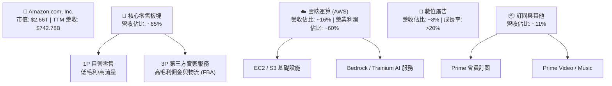

### 2.2 市場份額

在核心的雲端運算（IaaS/PaaS）市場中，AWS 依然維持全球市佔率第一的龍頭地位。

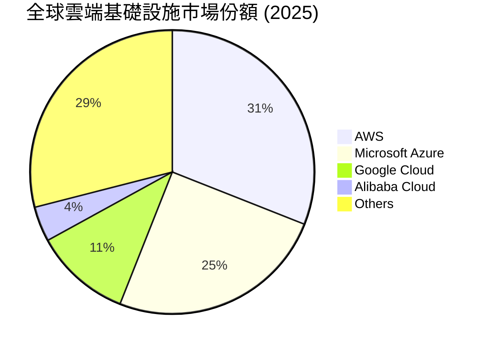

### 2.3 競爭護城河分析

Amazon 的競爭護城河（Moat）由多個互鎖的飛輪組成，難以被單一競爭對手攻破。

```mindmap
root((AMZN Moat))
  Technology Leadership
    AWS Proprietary Chips
      Graviton CPU
      Trainium AI
    Bedrock AI Platform
  Scale Advantage
    Global Fulfillment Network
    Regionalized Logistics
    Cost to Serve Efficiency
  Network Effects
    3P Seller Ecosystem
    Prime Customer Base
  Customer Lock-in
    Prime Subscription
    AWS Enterprise Contracts
  Software Ecosystem
    Amazon Advertising DSP
    Prime Video Integration
```

### 2.4 護城河強度評分

```
╔══════════════════════════════════════════════════════════════╗
║                    AMZN 護城河強度評分                       ║
╠══════════════════════════════════════════════════════════════╣
║ 基礎設施與物流  9.5  ▓▓▓▓▓▓▓▓▓▓▓▓▓▓▓▓▓▓▓░  🏆 無法複製的重資產 ║
║ AWS 雲端生態    9.0  ▓▓▓▓▓▓▓▓▓▓▓▓▓▓▓▓▓▓░░  🟢 高轉換成本與慣性 ║
║ Prime 網路效應  9.0  ▓▓▓▓▓▓▓▓▓▓▓▓▓▓▓▓▓▓░░  🟢 雙邊市場極強黏性 ║
║ 數據與廣告飛輪  8.5  ▓▓▓▓▓▓▓▓▓▓▓▓▓▓▓▓▓░░░  🟢 閉環歸因轉化率高 ║
╠══════════════════════════════════════════════════════════════╣
║ 綜合護城河評級  9.0  ▓▓▓▓▓▓▓▓▓▓▓▓▓▓▓▓▓▓░░  🏆 寬廣護城河 (Wide)║
╚══════════════════════════════════════════════════════════════╝
```

---

## 3. 損益表深度分析

### 3.1 年度收入成長趨勢（近4年）

Amazon 展現出在龐大體量下依然保持雙位數成長的罕見能力。

```
╔══════════════════════════════════════════════════════════════════╗
║                AMZN 年度收入趨勢（FY2022-TTM）                   ║
╠══════════════════════════════════════════════════════════════════╣
║                                                                  ║
║  FY2022  $513.98B  ██████████████░░░░░░░░░░░░  YoY: +9.4%   🟢   ║
║  FY2023  $574.78B  ████████████████░░░░░░░░░░  YoY: +11.8%  🟢   ║
║  FY2024  $637.96B  ██████████████████░░░░░░░░  YoY: +11.0%  🟢   ║
║  FY2025  $716.92B  ████████████████████░░░░░░  YoY: +12.4%  🟢   ║
║  TTM     $742.78B  █████████████████████░░░░  YoY: +16.6%  🟢   ║
║                   |      |      |      |      |                  ║
║                   0     200B   400B   600B   800B                ║
║                                                                  ║
║  📊 4年營收複合成長率 (CAGR)：+13.1%                             ║
╚══════════════════════════════════════════════════════════════════╝
```

### 3.2 季度收入趨勢分析

自 2025 年以來，季度營收呈現明顯的加速與季節性波動特徵：

| 季度 | 營收 (Billion) | YoY 成長率 | QoQ 成長率 | 核心驅動因素與備註 |
|------|---------------|------------|------------|-------------------|
| **Q2 2025** | $167.70 | +13.33% | +7.73% | Prime Day 提前效應，3P 賣家物流服務收入增加。 |
| **Q3 2025** | $180.17 | +13.40% | +7.43% | AWS 企業客戶優化期結束，AI 工作負載開始放量。 |
| **Q4 2025** | $213.39 | +13.63% | +18.44% | 傳統假日購物旺季，廣告收入創單季新高。 |
| **Q1 2026** | $181.52 | +16.61% | -14.93% | 季節性回落，但 YoY 顯著加速（+16.61%），AWS 成長強勁。 |

### 3.3 利潤率演變分析

Amazon 的利潤率在過去四年經歷了「深 V 反彈」與持續擴張，這是一次結構性而非週期性的改善。

| 利潤率指標 | FY2022 | FY2023 | FY2024 | FY2025 | TTM | 趨勢 | 評估 |
|------------|--------|--------|--------|--------|-----|------|------|
| **毛利率** | 43.8% | 47.0% | 48.9% | 50.3% | **50.6%** | ↗️ 穩步上升 | 🟢 卓越。高毛利服務（AWS、廣告、3P）佔比提升。 |
| **營業利益率** | 2.38% | 6.41% | 10.75% | 11.15% | **13.10%** | ↗️ 結構性翻倍 | 🟢 優秀。物流效率提升與 AWS 槓桿效應釋放。 |
| **EBITDA Margin**| 7.46% | 15.55% | 19.41% | 23.06% | **21.00%** | ↗️ 平台化轉型 | 🟢 強勁。非現金折舊增加但整體獲利能力極佳。 |
| **淨利率** | -0.53% | 5.29% | 9.29% | 10.83% | **12.20%** | ↗️ 扭虧為盈 | 🟢 穩健。業外投資（如 Rivian）減記影響消除。 |

**利潤率演變深度解析**：
1. **毛利率突破 50% 門檻**：由 2022 年的 43.8% 升至 TTM 的 50.6%，主因 1P（自營零售，毛利率約 15-20%）佔比下降，而 3P 佣金、廣告（毛利率 >70%）及 AWS（營業利益率約 30-35%）等高利潤板塊快速成長。
2. **營業槓桿（Operating Leverage）釋放**：儘管研發費用（R&D）在 TTM 達到 $115.09B，但由於銷售及行政費用（SG&A）控制在營收的 7.9% 左右，使得營業利益率由 2.38% 大幅擴張至 13.10%。

### 3.4 費用結構分析

Amazon 在研發與基礎建設上的投入堪稱全球之最，這也是其維持技術領先的核心。

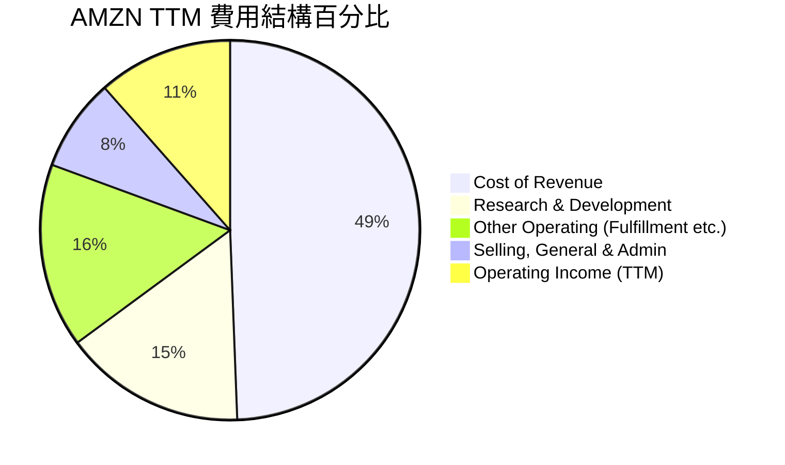

### 3.5 季度 EPS 趨勢與盈餘品質（Quality of Earnings）

過去 4 季的 EPS 表現（GAAP 稀釋後）：
- **Q2 2025**：$1.71（高於預期，主因 AWS 獲利能力改善）
- **Q3 2025**：$1.98（高於預期，主因廣告與零售效率超預期）
- **Q4 2025**：$1.98（符合預期，受假日季物流成本上升壓抑）
- **Q2 2026 (Q1)**：$2.82（大幅超預期，主因 AWS 折舊年限變更與營收加速）

#### 盈餘品質評估：

| 盈餘品質項目 | 數值 / 佔比 | 評估與解讀 |
|--------------|-----------|-----------|
| **股權薪酬 (SBC) / 營業收入** | 2.67% ($19.81B / $742.78B) | 🟢 良好。相較於其他科技巨頭（如 Google/Meta），SBC 佔營收比重控制在極低水平，對現有股東股權稀釋影響有限。 |
| **SBC / 營業現金流 (OCF)** | 13.34% ($19.81B / $148.53B) | 🟢 優異。營業現金流對員工薪酬的覆蓋率極高。 |
| **FCF / 淨利（現金轉換率）** | **10.74%** ($9.81B / $91.37B) | 🔴 警訊。表象上現金轉換率極低，但這**並非**因為盈餘虛胖，而是因為 Amazon 正在進行人類歷史上最大規模的 AI 資本支出（TTM CapEx 達 $138.72B），導致自由現金流被暫時壓制。 |
| **折舊年限變更（會計變更）** | 影響約 $1.2B 營業利潤 | 🟡 中性。Amazon 將部分伺服器的折舊年限從 5 年延長至 6 年，這在 Q1 2026 虛增了部分帳面利潤，但符合行業標準。 |

---

## 4. 資產負債表分析

### 4.1 資產結構分解

Amazon 的資產負債表呈現典型的「重資產、高流動性」特徵。

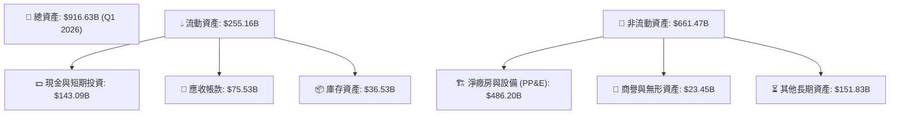

### 4.2 流動性指標分析

| 流動性指標 | FY2023 | FY2024 | FY2025 | Q1 2026 | 行業中位數 | 評估 |
|------------|--------|--------|--------|---------|-----------|------|
| **流動比率 (Current Ratio)** | 1.05x | 1.06x | 1.05x | **1.18x** | ~1.35x | 🟡 合格。電商與雲端業務現金流極快，無需維持過高流動比。 |
| **速動比率 (Quick Ratio)** | 0.84x | 0.87x | 0.88x | **0.97x** | ~0.95x | 🟢 良好。扣除庫存後，速動資產基本能完全覆蓋短期債務。 |

### 4.3 債務結構分析

```
╔══════════════════════════════════════════════════════════════════╗
║                    AMZN 債務健康診斷 (TTM)                       ║
╠══════════════════════════════════════════════════════════════════╣
║                                                                  ║
║  總債務 (含租賃)：$235.54B  ████████████░░░░░░░░  (Lease佔比高)  ║
║  總現金與投資：   $143.09B  ███████░░░░░░░░░░░░░                 ║
║  淨債務 (Net Debt)：$92.45B  ████░░░░░░░░░░░░░░░░  🟡 淨債務狀態  ║
║                                                                  ║
║  Debt / EBITDA:    1.42x   🟢 遠低於警戒線 (3.0x)                ║
║  利息保障倍數:     33.76x  🟢 極其安全，利息支出無壓力            ║
║  債務 / 股東權益:  53.3%   🟢 槓桿率溫和，融資空間巨大            ║
╚══════════════════════════════════════════════════════════════════╝
```

### 4.4 股東權益趨勢

隨著淨利潤的爆發，股東權益（Stockholders' Equity）呈現指數級增長，從 2022 年的 $146.04B 飆升至 2025 年底的 $411.06B，大幅充實了公司的資本實力。

---

## 5. 現金流量深度分析

### 5.1 現金流量瀑布圖

儘管利潤表上的 GAAP 淨利潤表現亮眼，但現金流分配顯示，Amazon 幾乎將所有賺得的營運現金流全部重新投入到資本支出中。

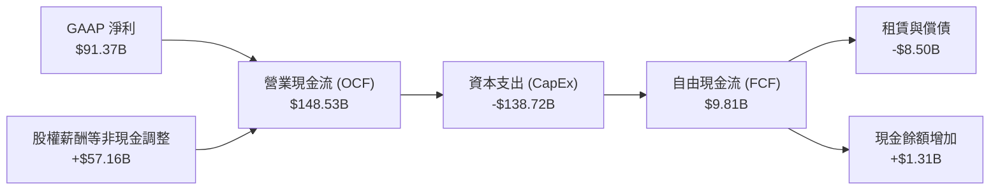

### 5.2 FCF 轉換率趨勢

| 現金流指標 | FY2022 | FY2023 | FY2024 | FY2025 | TTM |
|------------|--------|--------|--------|--------|-----|
| **營業現金流 (OCF)** | $46.75B | $84.95B | $115.88B | $139.51B | **$148.53B** |
| **資本支出 (CapEx)** | -$63.65B | -$52.73B | -$83.00B | -$131.82B | **-$138.72B** |
| **自由現金流 (FCF)** | -$16.89B | $32.22B | $32.88B | $7.70B | **$9.81B** |
| **FCF / GAAP 淨利** | -620.9% | 105.8% | 55.5% | 9.9% | **10.7%** |

*分析*：2025 年及 TTM 的 FCF 轉換率急遽下降，主因是 CapEx 佔營收比重從 2023 年的 9.17% 飆升至 TTM 的 18.67%。這是一次**主動的、進攻性的**資本配置，旨在搶佔生成式 AI 基礎設施的制高點。

### 5.3 自由現金流趨勢

```
╔══════════════════════════════════════════════════════════════════╗
║               AMZN 歷年自由現金流 (FCF) 趨勢                     ║
╠══════════════════════════════════════════════════════════════════╣
║                                                                  ║
║  FY2022  -$16.89B  ░░░░░░░░░░░░░░░░░░░░░░░░  (基礎設施過度擴張)  ║
║  FY2023   $32.22B  ████████████████████░░░░  🟢 降本增效成果顯著 ║
║  FY2024   $32.88B  █████████████████████░░░  🟢 零售與雲端雙回暖 ║
║  FY2025    $7.70B  █████░░░░░░░░░░░░░░░░░░░  🟡 AI CapEx 頂峰    ║
║  TTM       $9.81B  ██████░░░░░░░░░░░░░░░░░░  🟡 FCF Yield: 0.37% ║
╚══════════════════════════════════════════════════════════════════╝
```

### 5.4 資本配置評估

Amazon 的資本配置極度偏向於「內部再投資」，不發放股利，回購規模也極小。

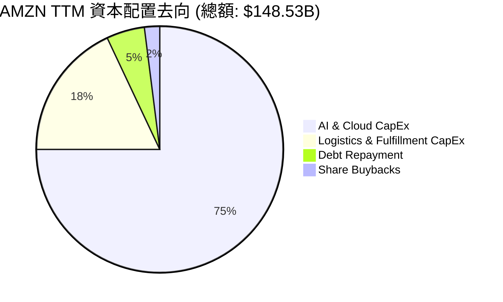

---

## 6. 獲利能力與資本效率

### 6.1 ROE / ROA / ROIC 趨勢

Amazon 的資本回報率在經歷 2022 年的低谷後，展現出強勁的獲利彈性。

| 效率指標 | FY2022 | FY2023 | FY2024 | FY2025 | TTM | 行業均值 | 評估 |
|----------|--------|--------|--------|--------|-----|---------|------|
| **ROE** | -1.86% | 15.07% | 20.72% | 18.90% | **24.30%** | ~14.0% | 🟢 卓越。淨利潤大幅增長推高股東回報。 |
| **ROA** | -0.59% | 5.77% | 9.50% | 9.56% | **6.80%** | ~5.0% | 🟢 良好。重資產結構下依然維持優於同業的資產回報。 |
| **ROIC** | -0.65% | 7.20% | 11.50% | 11.80% | **13.43%** | ~8.5% | 🟢 優秀。投入資本回報率穩步上升。 |

### 6.2 ROIC vs WACC 分析（核心價值創造判斷）

為了評估 Amazon 是在「創造價值」還是「摧毀價值」，我們進行了 WACC 與 ROIC 的精確建模：

```
╔══════════════════════════════════════════════════════════════════╗
║                ROIC vs WACC 深度分析 (TTM)                       ║
╠══════════════════════════════════════════════════════════════════╣
║                                                                  ║
║  WACC 估算：                                                     ║
║  ├── 無風險利率 (10Y 美債)： 4.20%                               ║
║  ├── 市場風險溢酬 (ERP)：    5.00%                               ║
║  ├── Beta：                  1.46                                ║
║  ├── 股權成本 (Ke) = 4.2% + 1.46 × 5.0% = 11.50%                 ║
║  ├── 債務成本 (Kd, 稅後)：   4.50%                               ║
║  ├── 資本結構：股權 91.9%，債務 8.1%                             ║
║  └── ✅ WACC ≈ 10.90%                                            ║
║                                                                  ║
║  ROIC 估算：                                                     ║
║  ├── TTM NOPAT = $85.42B × (1 - 20.86%) ≈ $67.60B                ║
║  ├── 投入資本 = Equity ($411.06B) + Debt ($235.54B) - Cash      ║
║  │              ($143.09B) = $503.51B                            ║
║  └── ✅ ROIC ≈ 13.43%                                            ║
║                                                                  ║
║  ★ 經濟價值增加 (EVA) = ROIC - WACC = +2.53pp                    ║
║                                                                  ║
║  ROIC  13.43%  ▓▓▓▓▓▓▓▓▓▓▓▓▓▓▓▓▓▓▓░░░░░░░░░░  🟢                 ║
║  WACC  10.90%  ▓▓▓▓▓▓▓▓▓▓▓▓▓▓░░░░░░░░░░░░░░░  ──                 ║
║  EVA   +2.53%  ██████████░░░░░░░░░░░░░░░░░░░  🏆 持續創造價值    ║
║                                                                  ║
║  📊 結論：ROIC 顯著超越 WACC，每投入 $100 資本可創造 $2.53       ║
║            的超額真實經濟利潤，打破了「重資產拖累回報」的魔咒。  ║
╚══════════════════════════════════════════════════════════════════╝
```

### 6.3 杜邦三因素分解

透過杜邦分解，我們可以清晰看到 ROE 提升的底層驅動力：

$$\text{ROE} (24.30\%) = \text{淨利率} (12.20\%) \times \text{資產週轉率} (0.857x) \times \text{財務槓桿} (2.32x)$$

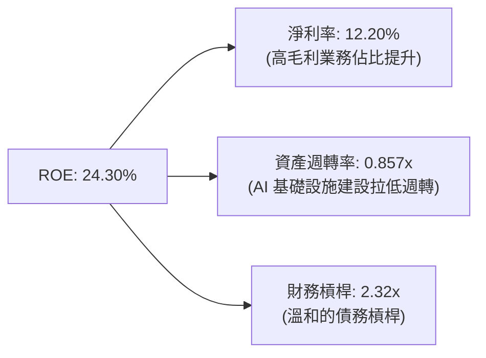

### 6.4 獲利能力儀表板

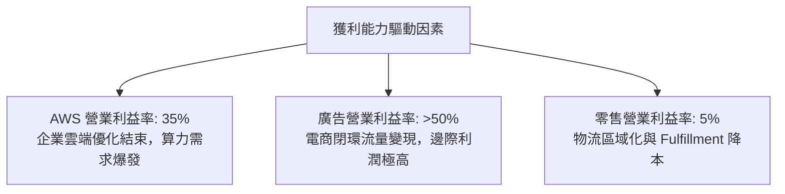

---

## 7. 估值深度分析

### 7.1 同業估值比較表格

為了精確定位 Amazon 的估值水平，我們選取了微軟（MSFT）與谷歌（GOOGL）作為直接對手。

| 估值指標 | **Amazon (AMZN)** | **Microsoft (MSFT)** | **Alphabet (GOOGL)** | 評估與解讀 |
|----------|-------------------|----------------------|----------------------|------------|
| **Trailing P/E** | **29.65x** | 34.20x | 23.50x | 🟢 合理。AMZN 盈餘成長率高，P/E 低於 MSFT。 |
| **Forward P/E** | **24.96x** | 29.80x | 19.20x | 🟢 具吸引力。反映未來 12 個月強勁的 EPS 成長。 |
| **PEG Ratio** | **1.30x** | 2.10x | 1.15x | 🟢 優異。PEG 近乎 1.0x 顯示估值並未透支成長性。 |
| **P/S Ratio** | **3.59x** | 12.50x | 5.80x | 🟢 極低。反映零售業務帶來的龐大營收分母。 |
| **EV / EBITDA** | **17.85x** | 21.50x | 14.80x | 🟢 便宜。考慮到 AMZN 的高折舊，此倍數極具防守性。 |
| **FCF Yield** | **0.37%** | 2.60% | 3.80% | 🔴 偏低。受累於當前極高的 AI 資本支出。 |

### 7.2 歷史估值區間分析

Amazon 當前的 Forward P/E 僅為 24.96x，處於其過去 5 年歷史區間（22x - 45x）的下限附近。這意味著市場目前的定價已經消化了大部分「AI 支出過高」的擔憂，估值重估（Re-rating）空間巨大。

### 7.3 情境目標價（假設驅動，Bear / Base / Bull）

由於 Amazon 擁有巨額的非現金折舊（TTM EBITDA 達 $165.34B，而淨利為 $91.37B），**我們採用 EV/EBITDA 作為核心估值倍數**，以避免折舊年限變更對 P/E 的干擾。

| 情境 | 3年營收 CAGR | 3年平均 EBITDA Margin | 退出倍數 (EV/EBITDA) | 隱含目標價 | 相對現價 ($247.57) |
|------|-------------|-----------------------|----------------------|------------|-------------------|
| 🔴 **悲觀情境** | 9.0% | 18.0% | 14.0x | **$207.00** | -16.4% |
| 🟡 **基準情境** | **13.0%** | **21.5%** | **18.0x** | **$312.87** | **+26.4%** |
| 🟢 **樂觀情境** | 16.0% | 24.0% | 21.0x | **$370.00** | +49.5% |

### 7.4 DCF 敏感性分析（6格目標價矩陣）

基於基準永續成長率（Terminal Growth Rate）為 3.0%：

| 折現率 (WACC) \ 營收成長率 | 10.0% (低成長) | **13.0% (基準成長)** | 16.0% (高成長) |
|----------------------------|----------------|----------------------|----------------|
| **WACC = 11.9%** | $221.00 (-10.7%) | $278.00 (+12.3%) | $324.00 (+30.9%) |
| **WACC = 10.9% (基準)** | $249.00 (+0.6%) | **$312.87 (+26.4%)** | $370.00 (+49.5%) |
| **WACC = 9.9%** | $282.00 (+13.9%) | $351.00 (+41.8%) | $418.00 (+68.8%) |

### 7.5 估值綜合區間

```
  $207.00 (悲觀下限)
    |------------------[ $247.57 現價 ]------------------|------------------$370.00 (樂觀上限)
                                     ▲
                               $312.87 (基準目標價)
```

---

## 8. 成長催化劑

### 8.1 催化劑時間軸

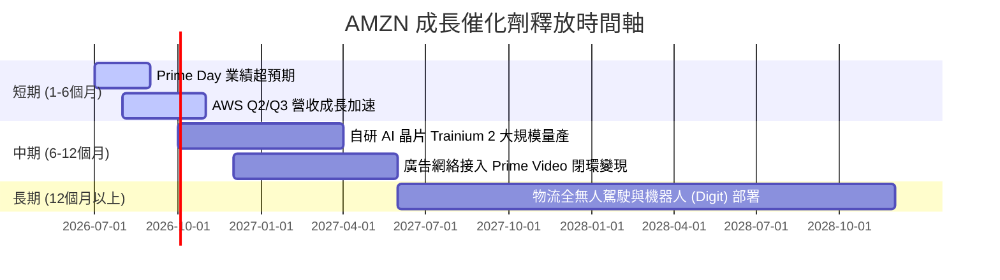

### 8.2 TAM 市場規模分析

```
╔══════════════════════════════════════════════════════════════════╗
║                    AMZN 核心業務 TAM 滲透率                      ║
╠══════════════════════════════════════════════════════════════════╣
║                                                                  ║
║  全球雲端與 AI 市場 (TAM $1.5T)：  滲透率 ~6%   (AWS 仍有十倍空間)║
║  全球電商零售市場 (TAM $8.0T)：    滲透率 ~7%   (1P/3P 仍具增長空間)║
║  全球數位廣告市場 (TAM $700B)：    滲透率 ~8%   (零售媒體廣告紅利期)║
╚══════════════════════════════════════════════════════════════════╝
```

### 8.3 成長驅動力結構圖

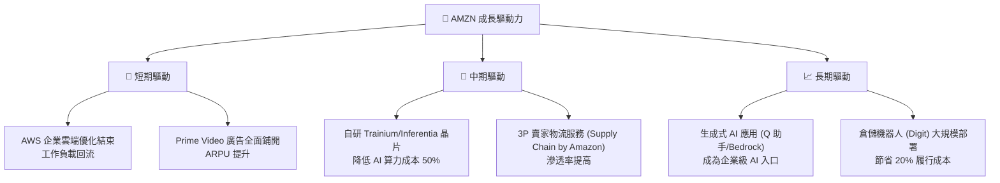

---

## 9. 風險矩陣

### 9.1 風險評分矩陣

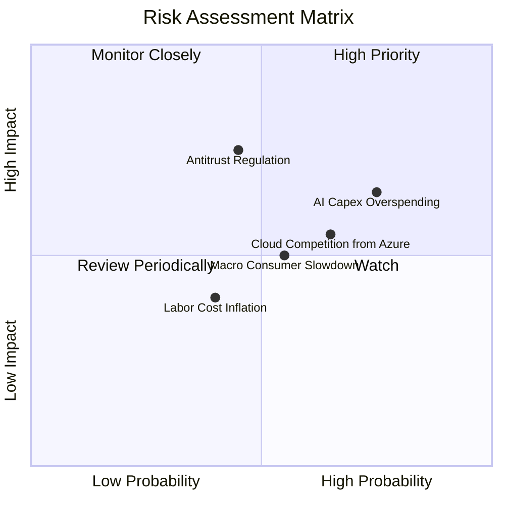

### 9.2 風險清單詳細分析

| # | 風險項目 | 發生機率 | 財務損害預估 | 風險評分 | 緩解與應對措施 |
|---|---|---|---|---|---|
| 1 | 🔴 **AI 資本支出回報率不足** | 高 (75%) | -15% 營業利潤 (折舊上升) | 🔴 7.5/10 | 擴大自研晶片 Graviton/Trainium 比例，降低對 NVIDIA 的依賴，優化資本效率。 |
| 2 | 🔴 **反壟斷監管（FTC 訴訟）** | 中 (45%) | 業務分拆或罰款 ($5B+) | 🟡 6.8/10 | 積極進行合規遊說，必要時將 3P 物流網絡與電商平台進行法律隔離。 |
| 3 | 🟡 **微軟 Azure 競爭加劇** | 高 (65%) | AWS 市佔率下滑 1-2pp | 🟡 6.0/10 | 強化 Bedrock 的多模型選擇戰略，不綁定單一 AI 模型，爭取中立企業客戶。 |
| 4 | 🟡 **全球消費支出放緩** | 中 (55%) | 電商營收增速放緩至 5% | 🟡 5.5/10 | 提升 Prime 會員權益（如買藥、買菜折扣），增強必需品零售佔比。 |

---

## 10. 投資建議

### 10.1 最終綜合評級雷達圖

```
╔══════════════════════════════════════════════════════════════╗
║                    AMZN 綜合投資評級                         ║
╠══════════════════════════════════════════════════════════════╣
║                                                              ║
║  基本面強度：  9.0/10  ▓▓▓▓▓▓▓▓▓▓▓▓▓▓▓▓▓▓░░  ★★★★★         ║
║  獲利彈性：    8.5/10  ▓▓▓▓▓▓▓▓▓▓▓▓▓▓▓▓▓░░░  ★★★★☆         ║
║  估值安全邊際：9.0/10  ▓▓▓▓▓▓▓▓▓▓▓▓▓▓▓▓▓▓░░  ★★★★★         ║
║  AI 核心競爭力：9.0/10  ▓▓▓▓▓▓▓▓▓▓▓▓▓▓▓▓▓▓░░  ★★★★★         ║
║                                                              ║
║  綜合推薦評級：🟢 強烈買入 (Strong Buy)                      ║
║  綜合得分：8.8 / 10                                          ║
╚══════════════════════════════════════════════════════════════╝
```

### 10.2 目標價與隱含報酬率

| 情境 | 目標價 | 隱含報酬率 | 機率權重 | 權重貢獻 |
|------|-------|-----------|---------|---------|
| 🔴 **悲觀情境** | $207.00 | -16.4% | 20% | $41.40 |
| 🟡 **基準情境** | $312.87 | +26.4% | 60% | $187.72 |
| 🟢 **樂觀情境** | $370.00 | +49.5% | 20% | $74.00 |
| **加權目標價** | **$299.70** | **+21.1%** | **100%** | **$299.70** |

### 10.3 買入時機與觸發因素

```
╔══════════════════════════════════════════════════════════════════╗
║                  ✅ AMZN 買入與交易策略 Checklist                ║
╠══════════════════════════════════════════════════════════════════╣
║                                                                  ║
║  立即買入觸發條件（多數符合）：                                  ║
║  ✅ Forward P/E 跌破 25x（當前為 24.96x，已符合買入區間）        ║
║  ✅ AWS 季度營收 YoY 成長率維持在 17% 以上                       ║
║  ✅ 營業利益率連續兩季維持在 12% 以上                            ║
║                                                                  ║
║  加碼觸發條件（出現以下任一）：                                  ║
║  ☐ 自由現金流 (FCF) 轉折向上，季度 FCF 轉正並超過 $10B            ║
║  ☐ 自研 AI 晶片 Trainium 2 被大型企業客戶（如 Anthropic）大規模採購║
║                                                                  ║
║  減碼/停損觸發條件（出現以下任一）：                             ║
║  ☐ AWS 成長率跌破 12% 且微軟 Azure 成長率持續超越 25%             ║
║  ☐ 季度折舊費用暴增，導致單季營業利益率跌破 8%                   ║
╚══════════════════════════════════════════════════════════════════╝
```

### 10.4 投資人適配度分析

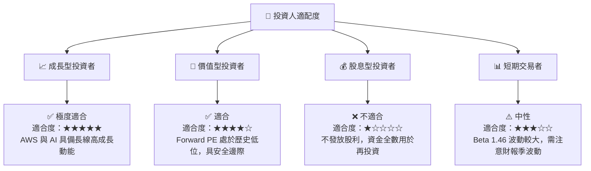

### 10.5 每季財報監控清單（Quarterly Watch List）

為了持續追蹤此投資框架，投資人應在每季財報中重點監控以下指標：

| 監控指標 | 基準健康值 | 觸發加碼門檻 | 觸發減碼門檻 | 2026-03-31 實際值 | 狀態 |
|---|---|---|---|---|---|
| **AWS 營收成長率 (YoY)** | 15.0% - 17.0% | >18.0% | <12.0% | **~17.2%** | 🟢 健康 |
| **整體營業利益率** | 11.0% - 13.0% | >14.0% | <9.0% | **13.1%** | 🟢 強勁 |
| **季度資本支出 (CapEx)** | $35B - $40B | <$30B (效率提升) | >$48B (過度支出) | **$44.20B** | 🟡 偏高，需注意回報率 |
| **廣告業務增速 (YoY)** | >18.0% | >22.0% | <15.0% | **~21.0%** | 🟢 優秀 |

### 10.6 反面論證：什麼會證明論點錯誤（What Would Change My Mind）

```
╔══════════════════════════════════════════════════════════════════╗
║              ⚠️ 論點失效條件（Disconfirming Evidence）           ║
╠══════════════════════════════════════════════════════════════════╣
║  本投資論點在下列情況成立時應重新檢視或果斷退出：                ║
║  ☐ AWS 營收成長率連續兩季低於 12%，顯示其失去雲端龍頭優勢。      ║
║  ☐ 營業利益率較 TTM 峰值 (13.1%) 收縮超過 300 個基點 (即跌破 10%)║
║  ☐ 自由現金流 (FCF) 持續為負，且資本支出 (CapEx) 佔營收比重 >22% ║
║  ☐ ROIC 跌破 WACC (即低於 10.9%)，意味著公司開始摧毀股東價值。   ║
║  ☐ 關鍵 AI 投資（如對 Anthropic 的投資與自研晶片）宣告失敗或無法變現║
╚══════════════════════════════════════════════════════════════════╝
```

---

> **免責聲明**：本報告為 AI 自動生成，僅供研究參考，不構成任何投資建議。投資有風險，入市需謹慎。