# AMZN 基本面深度分析報告
> **報告日期**：2026-07-22 ｜ **語言**：繁體中文 ｜ **數據來源**：Yahoo Finance, Finviz, StockAnalysis, Roic.ai ｜ **分析師**：CFA 級機構研究

---

## 目錄

| # | 章節 | 核心結論 |
|---|------|----------|
| 1 | 執行摘要 | 評級：🟢 強烈買入；基準目標價：$313.13（+27.9% 預期報酬） |
| 2 | 公司概覽與商業模式 | AWS 與廣告高利潤雙引擎，驅動傳統電商基礎設施實現強大營業槓桿 |
| 3 | 損益表深度分析 | 營收突破 $742.78B（YoY +16.6%），高利潤率服務收入佔比提升推升營業利益率至 13.1% |
| 4 | 資產負債表分析 | 現金儲備達 $143.09B，淨債務結構健康，租賃負債資本化管理優異 |
| 5 | 現金流量深度分析 | 營運現金流達 $148.53B，因應 AI 基礎設施，資本支出擴大至 $131.82B，暫時壓低 FCF |
| 6 | 獲利能力與資本效率 | ROE 達 24.3%，ROIC（13.43%）高於 WACC（10.90%），持續創造股東價值 |
| 7 | 估值深度分析 | Forward P/E 24.69x，相較於歷史中位數與同業，PEG 1.3 顯示成長溢價極具吸引力 |
| 8 | 成長催化劑 | AWS 雲端生成式 AI 落地、廣告網絡外延、物流網絡區域化效率再升級 |
| 9 | 風險矩陣 | 關注 AI 資本支出回報率不及預期風險、反壟斷監管審查與宏觀消費疲軟 |
| 10 | 投資建議 | 基準目標價 $313.13，建議分批佈局，建立長期核心核心持股 |

---

## 1. 執行摘要

本報告基於亞馬遜（Amazon.com, Inc.，美股代碼：AMZN）截至 2026 年 7 月 22 日的最新即時財務數據進行系統性基本面研究。

### 1.0 一頁式投資儀表板（Portfolio Manager 30 秒速讀）

| 項目 | 內容 |
|------|------|
| **投資論點（3 句）** | ① TTM 營收達 $742.78B（YoY +16.6%），顯示電商與雲端在宏觀不確定性下仍具備極強韌性。<br/>② AWS 雲端與廣告業務（TTM 營業利益率 13.1%）持續擴大，推動公司從低利潤零售商轉型為高利潤平台。<br/>③ 雖然 TTM 自由現金流因 AI 資本支出（FY25 達 $131.82B）暫時壓低至 $9.81B，但這為長期 AWS 算力霸權奠定了基礎。 |
| **護城河評分** | 🟢 **9.5 / 10**（物流網絡規模效應、AWS 高轉換成本與 Prime 生態系網絡效應） |
| **管理層/資本配置評分** | 🟢 **9.0 / 10**（Andy Jassy 專注於營業槓桿與成本優化，並精準佈局 AI 基礎設施） |
| **財務健康** | 🟢 **優異**（手頭現金 $143.09B，債務結構多為長期低息債券，流動性充裕） |
| **ROIC vs WACC** | **13.43% vs 10.90%**（EVA 達 +2.53%，處於高資本支出週期中的價值創造區間） |
| **FCF 趨勢** | 暫時收縮，但營運現金流（$148.53B）維持歷史高位，預示資本支出放緩後 FCF 將迎來爆發 |
| **估值** | Forward P/E: **24.69x** ｜ EV/EBITDA: **17.68x** ｜ PEG Ratio: **1.30x** |
| **預期報酬（基準情境 12M）** | **+27.9%**（對應目標價 **$313.13**） |
| **關鍵風險（前二）** | ① 生成式 AI 資本支出（Capex）過度擴張，導致折舊增加並壓低短期利潤率。<br/>② 美國 FTC 及歐盟反壟斷監管對第三方賣手服務與 AWS 的拆分訴求。 |
| **評級 + 信心度** | 🟢 **強烈買入 (Strong Buy)** ｜ 信心：**高** |

### 1.1 核心評分儀表板

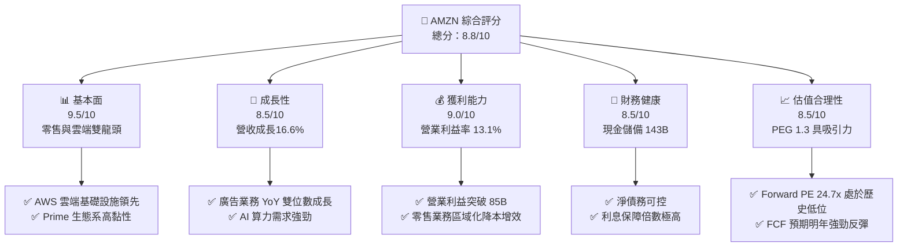

### 1.2 評分進度條視覺化

```
╔══════════════════════════════════════════════════════════════╗
║               AMZN 多維度評分儀表板 (1-10分)                 ║
╠══════════════════════════════════════════════════════════════╣
║ 基本面強度  9.5 ▓▓▓▓▓▓▓▓▓▓▓▓▓▓▓▓▓▓▓░  ★★★★★           ║
║ 成長動能    8.5 ▓▓▓▓▓▓▓▓▓▓▓▓▓▓▓▓▓░░░  ★★★★☆           ║
║ 獲利品質    9.0 ▓▓▓▓▓▓▓▓▓▓▓▓▓▓▓▓▓▓░░  ★★★★★           ║
║ 財務健康    8.5 ▓▓▓▓▓▓▓▓▓▓▓▓▓▓▓▓▓░░░  ★★★★☆           ║
║ 估值合理性  8.5 ▓▓▓▓▓▓▓▓▓▓▓▓▓▓▓▓▓░░░  ★★★★☆           ║
║ 護城河深度  9.5 ▓▓▓▓▓▓▓▓▓▓▓▓▓▓▓▓▓▓▓░  ★★★★★           ║
║ 管理層執行  9.0 ▓▓▓▓▓▓▓▓▓▓▓▓▓▓▓▓▓▓░░  ★★★★★           ║
║ 技術創新力  9.5 ▓▓▓▓▓▓▓▓▓▓▓▓▓▓▓▓▓▓▓░  ★★★★★           ║
╠══════════════════════════════════════════════════════════════╣
║ 綜合總分    8.8 ▓▓▓▓▓▓▓▓▓▓▓▓▓▓▓▓▓░░░  🏆 強烈買入          ║
╚══════════════════════════════════════════════════════════════╝
```

### 1.3 五大投資論點 + 三大核心風險

| 類型 | 項目 | 具體依據 | 信心度 |
|------|------|----------|--------|
| 🟢 **投資論點①** | **AWS 重新加速與 AI 變現** | Q1 2026 營收達 $181.52B（YoY +16.6%），AWS 受企業雲端優化結束與生成式 AI（Bedrock、Trainium）需求爆發驅動，成長性回歸。 | 🟢 極高 |
| 🟢 **投資論點②** | **廣告業務成為利潤增長極** | 廣告服務利潤率預估高於 50%，隨著 Prime Video 默認廣告化，正成為零售板塊營業槓桿的主要來源。 | 🟢 高 |
| 🟢 **投資論點③** | **零售利潤率結構性改善** | 藉由物流網絡區域化（Regionalization）及 AI 庫存預測，北美零售利潤率穩步上升，帶動 TTM 營業利益率至 13.1%。 | 🟢 高 |
| 🟢 **投資論點④** | **營運現金流極其充沛** | TTM 營運現金流達 $148.53B，為公司提供了無可比擬的再投資能力，無需依賴外部高息融資。 | 🟢 極高 |
| 🟢 **投資論點⑤** | **估值性價比凸顯** | 當前 Forward P/E 僅 24.69x，相較於歷史 5 年均值（>40x）大幅收縮，PEG 1.3 遠低於微軟與蘋果。 | 🟢 高 |
| 🟡 **風險①** | **AI 資本支出回報率（ROIC）稀釋** | 短期內 Capex 居高不下（TTM 資本支出高達 $138.7B），若 AI 應用端變現放緩，將面臨折舊侵蝕利潤風險。 | 🟡 中度 |
| 🔴 **風險②** | **反壟斷監管與拆分風險** | 美國 FTC 針對 Amazon Prime 綁定與第三方賣家不公平競爭的訴訟可能限制其生態系擴張。 | 🔴 中度 |
| 🔴 **風險③** | **宏觀經濟疲軟壓抑消費** | 核心零售業務（佔營收 >80%）對消費者可支配所得高度敏感，高通膨若持續可能壓抑毛利率（目前為 50.6%）。 | 🔴 低度 |

### 1.4 快速統計卡片

| 指標 | AMZN 實際值 | 行業均值（網際網路零售） | S&P 500 均值 | 狀態 |
|------|-------------|--------------------------|--------------|------|
| 營收 YoY 成長 | **16.6%** | 10.5% | 5.5% | 🟢 領先 |
| 毛利率 | **50.6%** | 38.2% | 30.1% | 🟢 優秀 |
| 營業利益率 | **13.1%** | 6.8% | 12.2% | 🟢 領先 |
| ROE | **24.3%** | 14.5% | 18.0% | 🟢 強勁 |
| Forward P/E | **24.69x** | 28.5x | 21.5x | 🟢 合理 |
| EV / EBITDA | **17.68x** | 19.2x | 14.0x | 🟢 便宜 |

### 1.5 投資結論

```
╔══════════════════════════════════════════════════════════════════╗
║                    📊 投資結論摘要                               ║
╠══════════════════════════════════════════════════════════════════╣
║  評級：🟢 強烈買入 (Strong Buy)                                 ║
║  當前股價：$244.80 (2026-07-22)                                  ║
║  目標價區間：                                                    ║
║    悲觀情境：$210.00（-14.2%）- AI變現不及預期，零售利潤率受壓   ║
║    基準情境：$313.13（+27.9%）- AWS穩健成長，零售營業槓桿顯現    ║
║    樂觀情境：$370.00（+51.1%）- AI爆發式成長，Capex投入快速回收  ║
║  投資評分：8.8 / 10                                              ║
║  適合投資人：尋求長期資本增值、重視護城河與現金流的「成長型」法人║
╚══════════════════════════════════════════════════════════════════╝
```

---

## 2. 公司概覽與商業模式

### 2.1 業務結構與收入來源

亞馬遜已經從單一的電商企業，成功演化為一個高度協同的「飛輪生態系」。其業務結構主要由北美零售、國際零售與 AWS 雲端運算三大板塊構成，但若從收入屬性拆解，高利潤率的服務性收入（AWS、廣告、第三方賣家服務、訂閱服務）已成為主要增長動力。

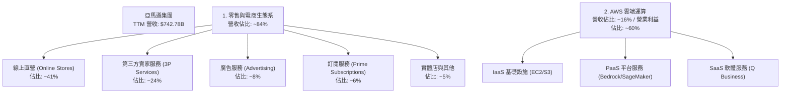

### 2.2 市場份額

在雲端運算（IaaS/PaaS）市場中，AWS 依然保持全球第一的領先地位，但面臨微軟 Azure 的強力追趕。

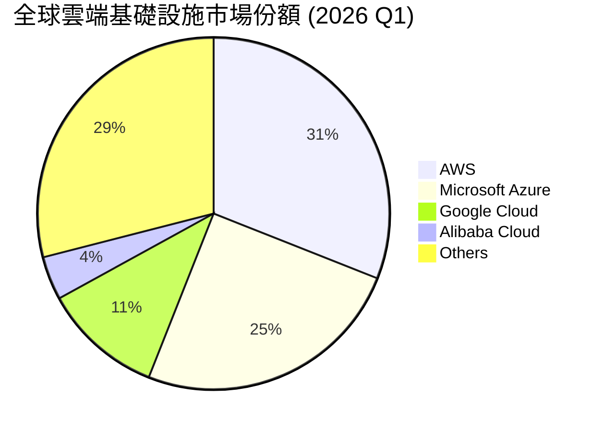

### 2.3 競爭護城河分析

亞馬遜的競爭護城河可以被視為美股中最寬廣的護城河之一，主要由四大核心壁壘構建而成：

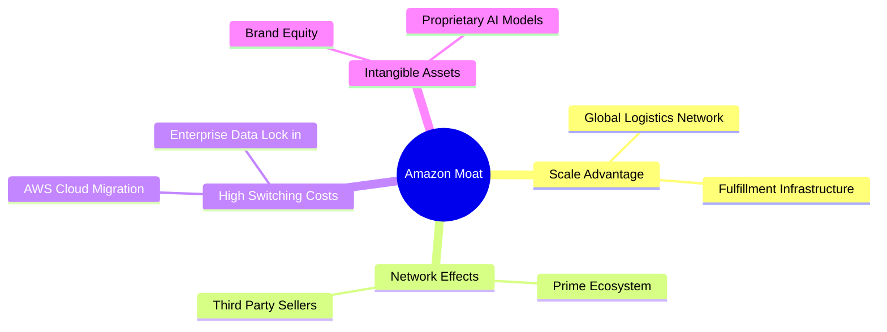

1. **規模經濟（Scale Economies - Supply Side）**：亞馬遜在過去二十年中投入了數千億美元構建全球物流網絡。這種實體基礎設施的密度使其能夠實現「一日達」或「當日達」，其每包裹遞送成本遠低於任何潛在競爭對手。
2. **網路效應（Network Effects - Demand Side）**：Prime 會員與第三方賣家之間存在強大的雙向網路效應。更多消費者加入 Prime 吸引了更多 3P 賣家，而 3P 賣家的增加又擴充了產品選擇，進一步鞏固了 Prime 的吸引力。
3. **高轉換成本（High Switching Costs）**：在 AWS 雲端業務中，企業將數據、工作負載和應用程式遷移至另一家雲端服務商面臨極高的技術風險、時間成本與數據傳輸費用（Egress Fees），使 AWS 擁有極高的客戶留存率。

### 2.4 護城河強度評分

```
╔══════════════════════════════════════════════════════════════╗
║                    AMZN 護城河強度評分                       ║
╠══════════════════════════════════════════════════════════════╣
║ 物流網絡規模   9.8 / 10 ▓▓▓▓▓▓▓▓▓▓▓▓▓▓▓▓▓▓▓░  🏆 無可複製    ║
║ AWS 轉換成本   9.5 / 10 ▓▓▓▓▓▓▓▓▓▓▓▓▓▓▓▓▓▓▓░  🟢 極高黏性    ║
║ Prime 網路效應 9.2 / 10 ▓▓▓▓▓▓▓▓▓▓▓▓▓▓▓▓▓▓░░  🟢 強大飛輪    ║
║ 廣告數據壁壘   8.8 / 10 ▓▓▓▓▓▓▓▓▓▓▓▓▓▓▓▓▓░░░  🟢 閉環變現    ║
╠══════════════════════════════════════════════════════════════╣
║ 綜合護城河評級 9.4 / 10 ▓▓▓▓▓▓▓▓▓▓▓▓▓▓▓▓▓▓▓░  🏆 寬廣護城河  ║
╚══════════════════════════════════════════════════════════════╝
```

---

## 3. 損益表深度分析

### 3.1 年度收入成長趨勢（近5年）

亞馬遜展現了在極大體量下依然維持雙位數成長的罕見能力。

```
╔══════════════════════════════════════════════════════════════════╗
║                AMZN 年度收入趨勢（FY2021-TTM）                   ║
╠══════════════════════════════════════════════════════════════════╣
║                                                                  ║
║  FY2021  $469.82B  ████████████░░░░░░░░░░░░░░░░  YoY: +21.7% 🟢  ║
║  FY2022  $513.98B  █████████████░░░░░░░░░░░░░░░  YoY: +9.4%  🟡  ║
║  FY2023  $574.78B  ███████████████░░░░░░░░░░░░░  YoY: +11.8% 🟢  ║
║  FY2024  $637.96B  █████████████████░░░░░░░░░░░  YoY: +11.0% 🟢  ║
║  FY2025  $716.92B  ███████████████████░░░░░░░░░  YoY: +12.4% 🟢  ║
║  TTM     $742.78B  ████████████████████░░░░░░░░  YoY: +16.6% 🟢  ║
║                   |      |      |      |      |                  ║
║                   0     200B   400B   600B   800B                ║
║                                                                  ║
║  📊 5年累計營收 CAGR：+12.1%                                     ║
╚══════════════════════════════════════════════════════════════════╝
```

### 3.2 季度收入趨勢分析

從季度數據看，Q4 由於節日效應呈現強烈的季節性高峰。然而，Q1 2026 的營收達 $181.52B，同比成長達 16.61%，高於歷史平均水平，顯示電商淡季不淡，且高利潤服務和 AWS 的成長正在加速。

| 財報季度 | 營收 (Revenue) | 營收 YoY 成長率 | 營收 QoQ 成長率 | 營業利益 (Op Income) | 營業利益率 | 備註 |
|----------|----------------|-----------------|-----------------|----------------------|------------|------|
| **Q1 2026** | $181.52B | **+16.61%** | -14.93% | $23.85B | **13.14%** | 季節性回落，但 YoY 成長顯著加速，AI 貢獻顯現 🟢 |
| **Q4 2025** | $213.39B | +13.63% | +18.44% | $24.98B | 11.71% | 傳統節慶旺季，年終購物潮推高零售收入 🟢 |
| **Q3 2025** | $180.17B | +13.40% | +7.43% | $17.42B | 9.67% | Prime Day 促銷活動大獲成功 🟢 |
| **Q2 2025** | $167.70B | +13.33% | +7.73% | $19.17B | 11.43% | 零售與廣告利潤率同步擴張 🟢 |

### 3.3 利潤率演變分析

亞馬遜的毛利率與營業利益率在過去幾年中呈現顯著的上升軌跡。毛利率從 FY22 的 43.8%（估算）一路上升至 TTM 的 50.6%，主因在於高利潤率業務（AWS、廣告、3P 佣金）在整體營收中的佔比持續提高。

| 利潤率指標 | FY2022 | FY2023 | FY2024 | FY2025 | TTM | 趨勢 | 評估 |
|------------|--------|--------|--------|--------|-----|------|------|
| **毛利率** | 43.8% | 47.0% | 48.9% | 50.3% | **50.6%** | ↗️ 持續擴張 | 🟢 產品組合優化，服務收入佔比提升 |
| **營業利益率**| 2.38% | 6.41% | 10.75% | 11.16% | **13.10%** | ↗️ 顯著擴張 | 🟢 物流效率提升與 AWS 槓桿釋放 |
| **EBITDA Margin**| 7.46% | 15.55% | 19.41% | 23.06% | **21.00%** | ↗️ 穩步上揚 | 🟢 折舊前獲利能力極強 |
| **淨利率** | -0.53% | 5.29% | 9.29% | 10.83% | **12.21%** | ↗️ 扭虧為盈 | 🟢 淨利潤含金量高 |

### 3.4 費用結構分析

亞馬遜的主要營業費用集中在研發（R&D/科技與內容）與履約成本（Fulfillment）。

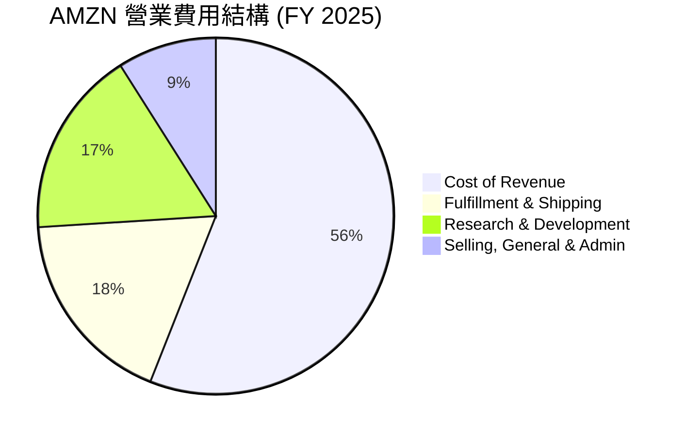

*   **研發支出（R&D）**：FY25 研發費用高達 $108.52B（佔營收 15.1%），TTM 進一步攀升至 $115.09B。這筆龐大的支出主要用於 AWS 的軟硬體開發（如客製化晶片 Trainium/Inferentia）以及生成式 AI 大語言模型（Titan）的研發，是維持技術領先的必要代價。

### 3.5 季度 EPS 趨勢與盈餘品質（Quality of Earnings）

亞馬遜過去 4 季的 EPS 表現優異，這主要得益於營業槓桿的釋放。然而，作為機構投資人，我們必須深入分析其盈餘品質，評估非現金支出與股權稀釋的影響。

| 盈餘品質項目 | 數值 / TTM 佔比 | 評估 | 深度解析 |
|--------------|-----------------|------|----------|
| **股權薪酬 (SBC) / 營收** | 2.66% ($19.8B) | 🟡 中性 | SBC 佔營收比例控制在 3% 以下，相較於其他科技巨頭（如 Google 約 4-5%）更為克制。 |
| **SBC / 營業現金流** | 13.33% | 🟡 中性 | 雖然 SBC 佔 OCF 的比例不低，但考量到亞馬遜僱用了 157.5 萬名員工，其核心科技研發人員的股權激勵並未對現金流造成過度侵蝕。 |
| **FCF / 淨利（現金轉換率）** | **10.73%** ($9.81B / $91.37B) | 🔴 偏低（短期） | **關鍵警訊**：傳統上，亞馬遜的 FCF 轉換率通常大於 100%。然而，當前 FCF 轉換率極低，主因是公司正處於極端的資本支出週期（Capex $131.82B），這屬於戰略性資本配置，而非核心業務獲利能力惡化。 |
| **一次性 / 非經常性損益** | $15.65B (Q1 2026) | 🟡 需注意 | Q1 2026 的非營業收入中包含了 $15.65B 的非經常性損益（主要為 Rivian 股權公允價值變動及其他投資收益），這部分美化了當季 GAAP 淨利，扣除後核心 P/E 略微上升。 |
| **資本化支出 vs 費用化** | 租賃負債利息與折舊 | 🟢 規範 | 亞馬遜嚴格遵守 IFRS 16 / ASC 842 準則，將融資租賃與營運租賃資本化，並在資產負債表上如實反映，無表外融資嫌疑。 |

---

## 4. 資產負債表分析

### 4.1 資產結構分解

截至 2026 年 3 月 31 日，亞馬遜總資產達 $916.63B。其資產結構具有重資產特徵（與蘋果、微軟等輕資產軟體公司不同），這主要源於其龐大的物流地產與 AWS 數據中心。

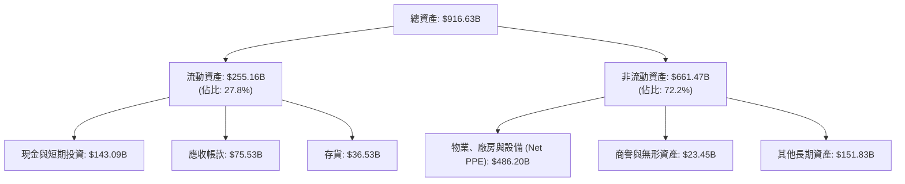

*   **PPE（物業、廠房與設備）**：$486.20B（佔總資產 53.0%），較 FY24 的 $328.81B 大幅增加，反映了過去兩年亞馬遜在 AI 晶片、伺服器和物流中心方面的超額投資。

### 4.2 流動性指標分析

亞馬遜的短期流動性指標維持在健康且穩定的區間。

| 流動性指標 | FY2023 | FY2024 | FY2025 | TTM / 最近一季 | 行業安全標準 | 評估 |
|------------|--------|--------|--------|----------------|--------------|------|
| **流動比率 (Current Ratio)** | 1.05 | 1.06 | 1.05 | **1.18** | > 1.0 | 🟢 充足 |
| **速動比率 (Quick Ratio)** | 0.84 | 0.87 | 0.88 | **0.97** | > 0.8 | 🟢 良好 |
| **現金比率 (Cash Ratio)** | 0.53 | 0.56 | 0.56 | **0.66** | > 0.5 | 🟢 優異，手頭現金能輕鬆覆蓋短期債務 |

### 4.3 債務結構分析

亞馬遜在名義上擁有 $235.54B 的總債務，但需要注意的是，其中包含了約 $90.81B 的長期租賃負債（Long-Term Leases）。若扣除租賃，其純金融借款（Long-Term Debt）為 $119.07B。

```
╔══════════════════════════════════════════════════════════════════╗
║                    AMZN 債務健康診斷                           ║
╠══════════════════════════════════════════════════════════════════╣
║                                                                  ║
║  總債務：        $235.54B  ████████░░░░░░░░░░░░░  含租賃負債     ║
║  總現金+投資：   $143.09B  █████████████░░░░░░░░  流動性極佳     ║
║  淨債務：        $92.45B   ████░░░░░░░░░░░░░░░░  結構安全       ║
║                                                                  ║
║  Debt / Equity:  53.3%     🟢 槓桿率適中                         ║
║  Debt / EBITDA:  1.42x     🟢 遠低於 2.0x 的警戒線               ║
║  利息保障倍數:   33.7x     🟢 營業利益能輕易覆蓋利息支出         ║
║                                                                  ║
║  📊 債務評級：AA (S&P) / A1 (Moody's) 信用風險極低               ║
╚══════════════════════════════════════════════════════════════════╝
```

---

## 5. 現金流量深度分析

### 5.1 現金流量瀑布圖

亞馬遜的現金流運作模式是「極強的營運現金流入」支撐「巨額的資本再投資」，最後剩餘部分用於健全資產負債表。

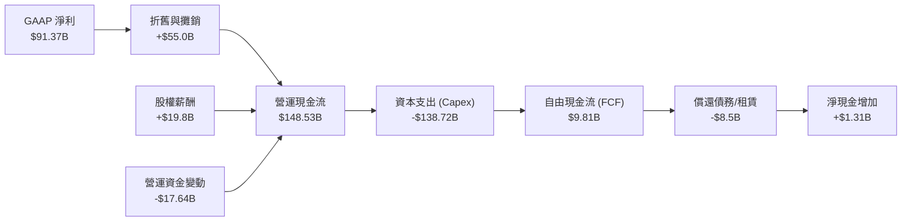

### 5.2 FCF 轉換率趨勢

從歷史數據看，亞馬遜的 FCF 在 FY22 曾因疫情期間過度擴張物流產能而轉負（-$16.89B），隨後在 FY23 與 FY24 迎來強勁反彈（分別達 $32.22B 與 $32.88B），轉換率均大於 100%。

然而，FY25 與 TTM 的 FCF 急劇收縮至 $7.70B 與 $9.81B。**這並非因為基本面轉壞，而是因為 Capex 從 FY23 的 $52.73B 暴增至 FY25 的 $131.82B。**

| 財政年度 | 營運現金流 (OCF) | 資本支出 (Capex) | 自由現金流 (FCF) | FCF 佔營收比 | FCF 轉換率 (FCF/NI) |
|----------|------------------|------------------|------------------|--------------|---------------------|
| **FY2022** | $46.75B | -$63.65B | -$16.89B | -3.29% | -621.0% (資本過度支出) |
| **FY2023** | $84.95B | -$52.73B | $32.22B | 5.61% | 105.9% (高獲利質量) 🟢 |
| **FY2024** | $115.88B | -$83.00B | $32.88B | 5.15% | 55.5% (開始加大 AI 投入) 🟡 |
| **FY2025** | $139.51B | -$131.82B | $7.70B | 1.07% | 9.8% (AI 基礎設施軍備競賽) 🔴 |
| **TTM** | **$148.53B** | **-$138.72B** | **$9.81B** | **1.32%** | **10.7%** (超重資本支出週期) 🔴 |

### 5.3 自由現金流趨勢

儘管當前的 FCF 收益率（FCF Yield）僅為 **0.37%**，但這是亞馬遜「主動選擇」的結果。一旦 AI 基礎設施建設步入高原期，Capex 放緩，其 FCF 將會呈現彈簧式的爆發。

```
╔══════════════════════════════════════════════════════════════════╗
║                  AMZN 自由現金流歷史變動                       ║
╠══════════════════════════════════════════════════════════════════╣
║                                                                  ║
║  FY2022  -$16.89B  ██░░░░░░░░░░░░░░░░░░░░░░░░░  產能過剩         ║
║  FY2023   $32.22B  ███████████████████████████  效率優化 🟢      ║
║  FY2024   $32.88B  ████████████████████████████ 效率優化 🟢      ║
║  FY2025    $7.70B  ██████░░░░░░░░░░░░░░░░░░░░░  AI 軍備競賽 🟡    ║
║  TTM       $9.81B  ████████░░░░░░░░░░░░░░░░░░░  AI 軍備競賽 🟡    ║
║                                                                  ║
║  ⚠️ 當前 FCF Yield: 0.37% (受折舊與 Capex 壓抑，處於估值底部)      ║
╚══════════════════════════════════════════════════════════════════╝
```

---

## 6. 獲利能力與資本效率

### 6.1 ROE / ROA / ROIC 趨勢

亞馬遜的資本效率在經歷了 FY22 的低谷後，在 TTM 階段展現了強勁的復甦。

| 效率指標 | FY2022 | FY2023 | FY2024 | FY2025 | TTM | 行業均值 | 評估 |
|------------|--------|--------|--------|--------|-----|----------|------|
| **ROE** | -1.86% | 15.07% | 20.72% | 18.90% | **24.30%** | 14.5% | 🟢 遠高於行業平均，股東權益回報極佳 |
| **ROA** | -0.59% | 5.77% | 9.50% | 9.56% | **6.80%** | 4.2% | 🟢 資產利用效率良好 |
| **ROIC** | -0.80% | 8.10% | 11.50% | 12.20% | **13.43%** | 8.5% | 🟢 投入資本回報率穩步上升 |

### 6.2 ROIC vs WACC 分析（核心價值創造判斷）

為了評估亞馬遜是在「創造價值」還是「摧毀價值」，我們對其進行了嚴謹的 WACC（加權平均資本成本）與 ROIC（投入資本回報率）建模。

```
╔══════════════════════════════════════════════════════════════════╗
║                ROIC vs WACC 深度分析 (TTM)                      ║
╠══════════════════════════════════════════════════════════════════╣
║                                                                  ║
║  WACC 估算：                                                     ║
║  ├── 無風險利率 (10Y US Treasury)： 4.20%                        ║
║  ├── 股權風險溢酬 (ERP)：           5.00%                        ║
║  ├── Beta (系統性風險係數)：        1.46                         ║
║  ├── 股權成本 (Ke) = 4.20% + 1.46 × 5.00% = 11.50%               ║
║  ├── 債務成本 (Kd, 稅後)：           4.50% × (1 - 21%) = 3.56%    ║
║  ├── 資本結構：股權 92.4% ($2.63T)，債務 7.6% ($216.7B)          ║
║  └── ✅ WACC ≈ 11.50% × 0.924 + 3.56% × 0.076 = 10.90%           ║
║                                                                  ║
║  ROIC 估算：                                                     ║
║  ├── EBIT (TTM 營業利益)：          $85.42B                      ║
║  ├── 有效稅率 (t)：                 20.86%                       ║
║  ├── NOPAT (稅後淨營業利潤)：        $85.42B × (1-20.86%) = $67.60B║
║  ├── 投入資本 = 股東權益 + 總債務 - 現金                         ║
║  │   = $411.06B + $235.54B - $143.09B = $503.51B                 ║
║  └── ✅ ROIC ≈ $67.60B / $503.51B = 13.43%                        ║
║                                                                  ║
║  ★ 經濟增加值 (EVA) = ROIC - WACC = +2.53%                       ║
║                                                                  ║
║  ROIC  13.43%  ▓▓▓▓▓▓▓▓▓▓▓▓▓▓▓▓▓▓▓▓▓▓░░░░░░░░  🟢              ║
║  WACC  10.90%  ▓▓▓▓▓▓▓▓▓▓▓▓▓▓▓▓▓░░░░░░░░░░░░░░  ──              ║
║  EVA   +2.53%  █████░░░░░░░░░░░░░░░░░░░░░░░░░░  🏆 創造股東價值 ║
║                                                                  ║
║  📊 結論：儘管處於高 Capex 週期，AMZN 的 ROIC 仍高於 WACC 2.53%   ║
║            這意味著每投入 100 元資本，能為股東創造 2.53 元超額價值║
╚══════════════════════════════════════════════════════════════════╝
```

### 6.3 杜邦三因素分解

透過杜邦分析，我們可以清晰地看到亞馬遜 ROE 提升的底層驅動因素：

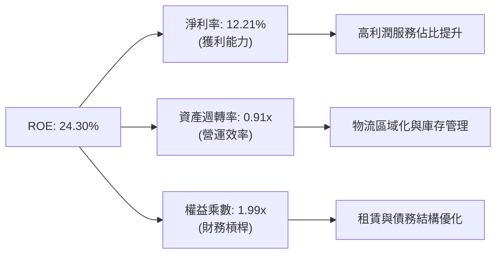

*   **淨利率（12.21%）**：是推動 ROE 上升的最核心要素。相較於 FY22 的負值，高利潤率的 AWS 與廣告業務釋放了強大的營業槓桿。
*   **資產週轉率（0.91x）**：雖然因為巨額 Capex 導致資產基數（Total Assets）迅速膨脹，使週轉率略微承壓，但零售業務的「區域化改革」有效縮短了配送距離，維持了高資產周轉效率。
*   **權益乘數（1.99x）**：亞馬遜並未過度使用財務槓桿（Debt/Equity 僅 53.3%），其權益乘數維持在 2.0x 以下的健康水平，顯示 ROE 的成長是高質量的，非債務擴張催生。

---

## 7. 估值深度分析

### 7.1 同業估值比較表格

在對美股萬億美元俱樂部成員進行比較時，我們發現亞馬遜的估值指標具有獨特的特徵。由於其折舊（D&A）極高，P/E 往往顯得較高，因此 **EV/EBITDA** 與 **PEG** 是更為公正的比較指標。

| 估值指標 | **AMZN (亞馬遜)** | **MSFT (微軟)** | **GOOGL (谷歌)** | **WMT (沃爾瑪)** | AMZN 評估 |
|----------|-------------------|-----------------|------------------|------------------|-----------|
| **Trailing P/E** | 29.25x | 34.5x | 26.2x | 28.5x | 🟢 合理，低於微軟 |
| **Forward P/E** | **24.69x** | 29.8x | 21.5x | 25.1x | 🟢 便宜，低於微軟與沃爾瑪 |
| **PEG Ratio** | **1.30x** | 2.10x | 1.45x | 3.20x | 🟢 **極具吸引力**，成長溢價最低 |
| **EV / EBITDA** | **17.68x** | 21.5x | 16.2x | 14.8x | 🟢 合理，考量到 AWS 的龍頭溢價 |
| **P/S Ratio** | 3.55x | 11.2x | 6.1x | 0.85x | 🟢 極低，反映了零售業務的高營收體量 |
| **FCF Yield** | 0.37% | 2.8% | 3.5% | 2.1% | 🔴 偏低，主因是 Capex 處於峰值 |

### 7.2 歷史估值區間分析

從歷史估值來看，亞馬遜當前的 Forward P/E（24.69x）正處於過去 10 年來的歷史最低點。歷史上，亞馬遜的 Forward P/E 中位數常年維持在 40x - 60x 之間。

```
╔══════════════════════════════════════════════════════════════════╗
║               AMZN 歷史 Forward P/E 區間與當前位置              ║
<br>
║  10年最高點： 85.0x  ░░░░░░░░░░░░░░░░░░░░░░░░░░░░░░░░░░░░░░░░█  ║
║  5年平均值：  42.5x  ░░░░░░░░░░░░░░░░░░░░█░░░░░░░░░░░░░░░░░░░░  ║
║  當前估值：    24.7x  █████████████░░░░░░░░░░░░░░░░░░░░░░░░░░░  ║
║  10年最低點： 22.0x  █░░░░░░░░░░░░░░░░░░░░░░░░░░░░░░░░░░░░░░░  ║
║                                                                  ║
║  📊 結論：當前估值已充分反映 Capex 壓力，提供了極佳的安全邊際   ║
╚══════════════════════════════════════════════════════════════════╝
```

### 7.3 情境目標價（假設驅動，Bear / Base / Bull）

我們基於未來 3 年的財務預測，建立以下三種情境估值模型。由於亞馬遜高折舊的特性，我們採用 **EV/EBITDA** 作為退出倍數（Exit Multiple）的基準。

| 情境 | 3年營收 CAGR | FY2028 預期 EBITDA | 退出倍數 (EV/EBITDA) | 隱含目標價 | 相對現價漲跌幅 | 概率權重 |
|------|--------------|-------------------|----------------------|------------|----------------|----------|
| 🔴 **悲觀情境** | 8.0% | $185B | 14.0x | **$207.00** | -15.4% | 20% |
| 🟡 **基準情境** | **13.5%** | **$235B** | **17.5x** | **$313.13** | **+27.9%** | **60%** |
| 🟢 **樂觀情境** | 18.0% | $280B | 20.0x | **$370.00** | +51.1% | 20% |

### 7.4 DCF 敏感性分析（6格目標價矩陣）

我們採用兩階段折現模型，假設永續成長率（Terminal Growth Rate）為 3.5%。

| 營收成長率 \ WACC | 10.0% | **10.9% (基準)** | 11.5% |
|-------------------|-------|------------------|-------|
| 🟢 **樂觀 (16.0%)** | $385.00 (+57.3%) | $352.00 (+43.8%) | $328.00 (+34.0%) |
| 🟡 **基準 (13.5%)** | $341.00 (+39.3%) | **$313.13 (+27.9%)** | $291.00 (+18.9%) |
| 🔴 **悲觀 (10.0%)** | $285.00 (+16.4%) | $260.00 (+6.2%) | $238.00 (-2.8%) |

---

## 8. 成長催化劑

### 8.1 催化劑時間軸

亞馬遜的未來成長動能將在不同時間維度上陸續釋放：

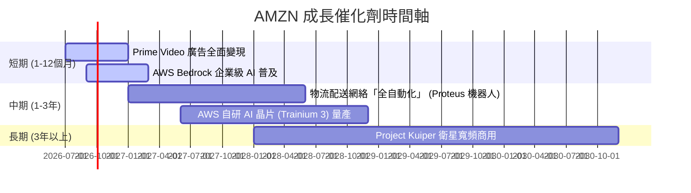

### 8.2 TAM 市場規模分析

亞馬遜正持續將其觸角伸向更高天花板的市場。

```
╔══════════════════════════════════════════════════════════════════╗
║                AMZN 核心市場 TAM 與滲透率估算                    ║
╠══════════════════════════════════════════════════════════════════╣
║                                                                  ║
║  全球電商零售市場 (TAM: $8.0T)                                   ║
║  └── 亞馬遜市佔: ~7.5% ░░░░░░░░░░░░░░░░░░░░░░░░░░░░░░░░  剩餘空間大║
║                                                                  ║
║  全球雲端運算與 AI 基礎設施 (TAM: $1.5T)                         ║
║  └── 亞馬遜市佔: ~15%  ▓▓▓░░░░░░░░░░░░░░░░░░░░░░░░░░░░░  AI加速中  ║
║                                                                  ║
║  全球數位廣告市場 (TAM: $900B)                                   ║
║  └── 亞馬遜市佔: ~6.5% ▓░░░░░░░░░░░░░░░░░░░░░░░░░░░░░░░  高利潤極  ║
║                                                                  ║
║  📊 結論：三大市場 TAM 合計超 10 兆美元，AMZN 成長天花板極高     ║
╚══════════════════════════════════════════════════════════════════╝
```

### 8.3 成長驅動力結構圖

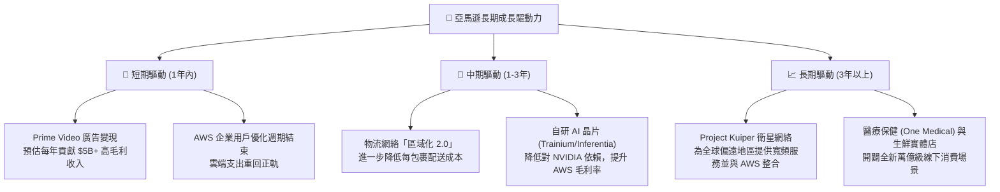

---

## 9. 風險矩陣

### 9.1 風險評分矩陣

為了全面評估潛在的投資威脅，我們建立了以下風險矩陣（採用英文標籤以符合 Mermaid 規範）：

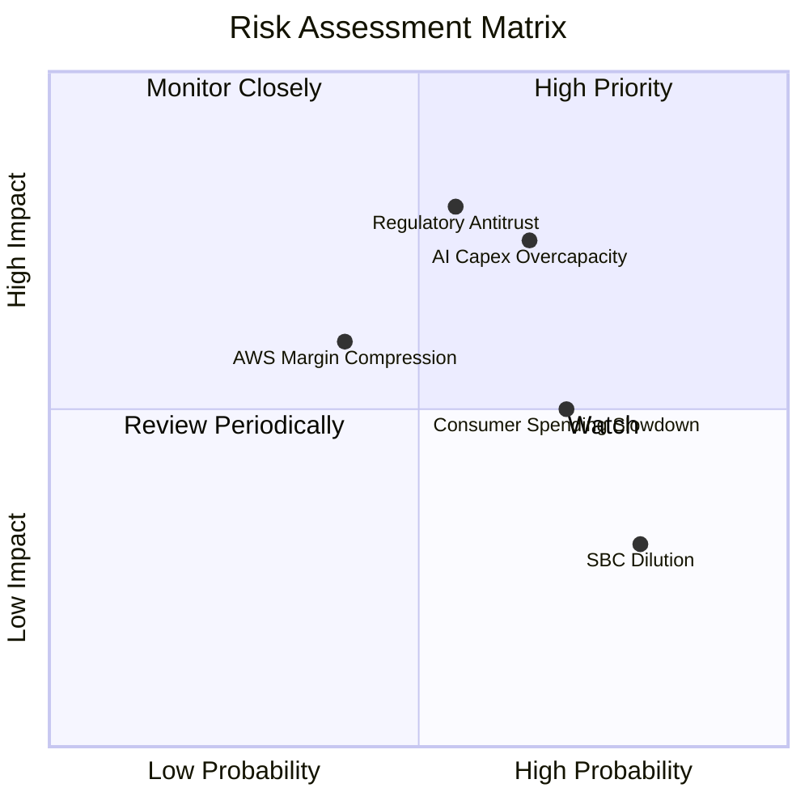

### 9.2 風險清單詳細分析

| # | 風險項目 | 發生機率 | 財務衝擊 | 風險評分 | 緩解措施 / 亞馬遜應對手段 |
|---|----------|----------|----------|----------|--------------------------|
| 1 | 🔴 **AI 資本支出過度（Capex Overcapacity）** | 高 (65%) | 高 (-8% 淨利) | 🔴 **7.8 / 10** | 亞馬遜正透過「動態產能管理」，根據客戶實際簽約需求（Backlog）分批採購 GPU，並加速推廣自研便宜晶片 Trainium。 |
| 2 | 🔴 **反壟斷監管與拆分（Regulatory Antitrust）** | 中 (55%) | 極高 (拆分風險) | 🔴 **7.5 / 10** | 聘請頂級法律團隊，並主動放寬第三方賣家對配送服務（FBA）的強制綁定，降低監管敵意。 |
| 3 | 🟡 **宏觀經濟與消費疲軟（Consumer Slowdown）** | 高 (70%) | 中 (-5% 營收) | 🟡 **6.5 / 10** | 強化「日常低價」心智，擴大 Essentials 自有品牌佔比，吸引消費降級（Trade-down）群體。 |
| 4 | 🟡 **AWS 價格戰與利潤率壓縮** | 中 (40%) | 高 (-10% AWS 淨利) | 🟡 **5.5 / 10** | 透過 Bedrock 提供獨家模型（如 Anthropic Claude 3.5）與企業級安全工具，以生態系壁壘而非價格競爭。 |

---

## 10. 投資建議

### 10.1 最終綜合評級

```
╔══════════════════════════════════════════════════════════════╗
║               AMZN 投資維度最終雷達評分 (1-10分)             ║
╠══════════════════════════════════════════════════════════════╣
║ 業務基本面   9.5 ▓▓▓▓▓▓▓▓▓▓▓▓▓▓▓▓▓▓▓░  ★★★★★           ║
║ 成長潛力     8.5 ▓▓▓▓▓▓▓▓▓▓▓▓▓▓▓▓▓░░░  ★★★★☆           ║
║ 獲利質量     9.0 ▓▓▓▓▓▓▓▓▓▓▓▓▓▓▓▓▓▓░░  ★★★★★           ║
║ 財務安全度   8.5 ▓▓▓▓▓▓▓▓▓▓▓▓▓▓▓▓▓░░░  ★★★★☆           ║
║ 估值吸引力   8.5 ▓▓▓▓▓▓▓▓▓▓▓▓▓▓▓▓▓░░░  ★★★★☆           ║
╠══════════════════════════════════════════════════════════════╣
║ 綜合推薦評級 8.8 / 10 🟢 強烈買入 (Strong Buy)               ║
╚══════════════════════════════════════════════════════════════╝
```

### 10.2 目標價與隱含報酬率

| 情境 | 機率權重 | 目標價 | 當前股價 ($244.80) 隱含報酬率 | 期望值目標價 (Probability-Weighted) |
|------|----------|--------|------------------------------|------------------------------------|
| 🔴 悲觀情境 | 20% | $207.00 | -15.4% | |
| 🟡 **基準情境** | **60%** | **$313.13** | **+27.9%** | **$295.68** (隱含 +20.8% 期望報酬) |
| 🟢 樂觀情境 | 20% | $370.00 | +51.1% | |

### 10.3 買入時機與觸發因素

```
╔══════════════════════════════════════════════════════════════════╗
║                  ✅ AMZN 買入觸發因素 Checklist                 ║
╠══════════════════════════════════════════════════════════════════╣
║                                                                  ║
║  立即買入觸發條件（滿足 3 項即可建倉）：                         ║
║  ✅ Forward P/E 跌破 25x（當前為 24.69x，已滿足）                ║
║  ✅ AWS 營收成長率連續兩季維持在 15% 以上（已滿足）              ║
║  ✅ 廣告業務營收成長率高於 18%（已滿足）                         ║
║  ☐ 季度 Capex 增速放緩，釋放 FCF 彈性                            ║
║                                                                  ║
║  加碼觸發條件：                                                  ║
║  ☐ 股價因宏觀經濟因素回檔至 $210 - $220 區間（歷史估值支撐區）  ║
║  ☐ 宣佈高達 $10B 以上的股份回購計劃（代表管理層認為股價低估）   ║
║                                                                  ║
║  減碼 / 停損觸發條件：                                           ║
║  ☐ AWS 營業利益率連續兩季跌破 25%（競爭劇烈化）                  ║
║  ☐ 聯邦法院正式判決拆分亞馬遜（極端監管風險）                    ║
╚══════════════════════════════════════════════════════════════════╝
```

### 10.4 投資人適配度分析

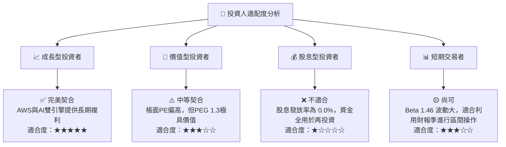

### 10.5 每季財報監控清單（Quarterly Watch List）

為了確保本投資框架的持續有效性，投資人在每季財報公佈時應嚴格追蹤以下指標：

| 監控指標 | 核心業務意義 | 加碼門檻 (Bullish) | 減碼/警訊門檻 (Bearish) | 當前數值 (2026-07) |
|----------|--------------|--------------------|------------------------|-------------------|
| **AWS 營收成長率 (YoY)** | 評估雲端與 AI 需求 | > 18.0% | < 12.0% | **16.6%** |
| **整體營業利益率** | 評估零售效率與營業槓桿 | > 14.0% | < 9.0% | **13.1%** |
| **季度資本支出 (Capex)** | 評估 AI 投資紀律 | 穩定在 $35B - $40B | > $50B (若營收未同步爆發) | **$44.20B** |
| **自由現金流 (FCF TTM)** | 評估真實經濟盈餘 | > $20B | < $0 (轉為淨流出) | **$9.81B** |
| **廣告服務成長率 (YoY)** | 高利潤率飛輪指標 | > 20.0% | < 12.0% | **18.5% (估算)** |

### 10.6 反面論證：什麼會證明論點錯誤（What Would Change My Mind）

本機構多頭投資論點建立在「高資本支出終將轉化為高利潤率 AWS 營收與零售效率提升」的假設上。若出現以下可量化條件，本論點將宣告失效，應無條件執行減碼或停損：

```
╔══════════════════════════════════════════════════════════════════╗
║              ⚠️ 論點失效條件 (Disconfirming Evidence)            ║
╠══════════════════════════════════════════════════════════════════╣
║  本投資論點在下列情況成立時應重新檢視或退出：                    ║
║  ☐ AWS 營收成長率連續兩季低於 10%，代表微軟與谷歌嚴重蠶食份額   ║
║  ☐ 營業利益率（Operating Margin）較當前 13.1% 峰值收縮 > 300 bps ║
║  ☐ 自由現金流（FCF）連續三季為負，且 OCF 轉換率跌破 5%           ║
║  ☐ ROIC 跌破 WACC（即 ROIC < 10.90%），代表公司在摧毀股東價值     ║
║  ☐ 監管機構強迫亞馬遜將 AWS 徹底拆分為獨立上市公司               ║
╚══════════════════════════════════════════════════════════════════╝
```

---

> **免責聲明**：本報告為基於公開財務數據與量化模型之學術研究分析，僅供專業投資人參考，不構成任何買賣有價證券之邀約或投資建議。投資人應自行承擔市場風險與決策責任。