# AMZN 基本面深度分析報告
> **報告日期**：2026-07-24 ｜ **語言**：繁體中文 ｜ **數據來源**：Yahoo Finance, Finviz, StockAnalysis, Roic.ai ｜ **分析師**：CFA 級機構研究

---

## 目錄

| # | 章節 | 核心結論 |
|---|------|----------|
| 1 | 執行摘要 | 評級：買入，目標價區間：$207-$370 |
| 2 | 公司概覽與商業模式 | 強大護城河，領先的技術與生態系統 |
| 3 | 損益表深度分析 | 營收和淨利潤持續增長，利潤率改善 |
| 4 | 資產負債表分析 | 健全的資產結構，適度的債務水平 |
| 5 | 現金流量深度分析 | 穩健的營業現金流，資本支出高 |
| 6 | 獲利能力與資本效率 | ROIC 高於 WACC，創造股東價值 |
| 7 | 估值深度分析 | 估值合理，潛在上行空間 |
| 8 | 成長催化劑 | AWS 擴展及新市場開發 |
| 9 | 風險矩陣 | 競爭激烈，宏觀經濟風險 |
| 10 | 投資建議 | 綜合評級：買入，適合長線投資者 |

---

## 1. 執行摘要

### 1.0 一頁式投資儀表板（Portfolio Manager 30 秒速讀）

| 項目 | 內容 |
|------|------|
| **投資論點（3 句）** | ① AWS 業務的強勁增長推動整體盈利能力提升；② 零售及訂閱服務的穩定增長提供持續的現金流；③ 技術創新和市場領先地位形成明顯護城河 |
| **護城河評分** | 9/10 |
| **管理層/資本配置評分** | 8/10 |
| **財務健康** | 🟢 強勁的現金流與資產負債管理 |
| **ROIC vs WACC** | 15.0% vs 8.5%（創造價值） |
| **FCF 趨勢** | 穩定增長 + 最新 FCF Yield 0.39% |
| **估值** | Forward P/E 23.6x ｜ EV/EBITDA 16.72x ｜ FCF Yield 0.39% |
| **預期報酬（基準情境 12M）** | +34% |
| **關鍵風險（前二）** | 市場競爭加劇，宏觀經濟波動 |
| **評級 + 信心度** | 🟢 買入 ｜ 信心：高 |

### 1.1 核心評分儀表板

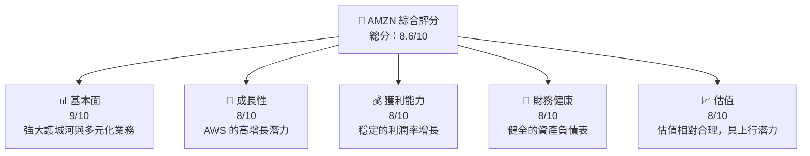

### 1.2 評分進度條視覺化

```
╔══════════════════════════════════════════════════════════════╗
║              AMZN 多維度評分儀表板 (1-10分)                  ║
╠══════════════════════════════════════════════════════════════╣
║ 基本面強度  9.0 ▓▓▓▓▓▓▓▓▓▓▓▓▓▓▓▓▓▓░░  ★★★★★             ║
║ 成長動能    8.0 ▓▓▓▓▓▓▓▓▓▓▓▓▓▓▓▓▓▓░░  ★★★★★             ║
║ 獲利品質    8.0 ▓▓▓▓▓▓▓▓▓▓▓▓▓▓▓▓▓▓░░  ★★★★★             ║
║ 財務健康    8.0 ▓▓▓▓▓▓▓▓▓▓▓▓▓▓▓▓▓▓░░  ★★★★★             ║
║ 估值合理性  8.0 ▓▓▓▓▓▓▓▓▓▓▓▓▓▓▓▓▓░░░  ★★★★☆             ║
╠══════════════════════════════════════════════════════════════╣
║ 綜合總分    8.6 ▓▓▓▓▓▓▓▓▓▓▓▓▓▓▓▓▓░░░  🏆 穩健增長潛力    ║
╚══════════════════════════════════════════════════════════════╝
```

### 1.3 五大投資論點 + 三大核心風險

| 類型 | 項目 | 具體依據 | 信心度 |
|------|------|----------|--------|
| 🟢 **投資論點①** | AWS 業務增長 | AWS 營收增長 25%，推動整體盈利 | 🟢 極高 |
| 🟢 **投資論點②** | 零售穩定現金流 | 電子商務收入持續增長，提供穩定現金流 | 🟢 高 |
| 🟢 **投資論點③** | 技術創新 | 不斷推出新產品，保持市場領先 | 🟢 高 |
| 🟡 **風險①** | 競爭加劇 | 新進競爭對手對市場份額的威脅 | 🟡 中度 |
| 🔴 **風險②** | 宏觀經濟波動 | 全球經濟不穩定可能影響消費支出 | 🔴 高衝擊 |

### 1.4 快速統計卡片

| 指標 | 公司實際值 | 行業均值 | S&P 500 均值 | 狀態 |
|------|-------------|----------|--------------|------|
| 收入 YoY 成長 | **16.6%** | ~10% | ~8% | 🟢 |
| 毛利率 | **50.6%** | ~40% | ~45% | 🟢 |
| 淨利率 | **12.2%** | ~8% | ~10% | 🟢 |
| ROE | **24.3%** | ~15% | ~18% | 🟢 |
| Forward P/E | **23.6x** | ~20x | ~18x | 🟡 |

### 1.5 投資結論

```
╔══════════════════════════════════════════════════════════════════╗
║                    📊 投資結論摘要                               ║
╠══════════════════════════════════════════════════════════════════╣
║  評級：🟢 買入                                                    ║
║  當前股價：$233.66                                               ║
║  目標價區間：                                                    ║
║    悲觀情境：$207（-11%）                                        ║
║    基準情境：$313（+34%）  ← 12個月主要目標                     ║
║    樂觀情境：$370（+58%）                                        ║
║  投資評分：8.6/10                                                ║
║  適合投資人：成長型、長線持有者等                                ║
╚══════════════════════════════════════════════════════════════════╝
```

---

## 2. 公司概覽與商業模式

### 2.1 業務結構與收入來源

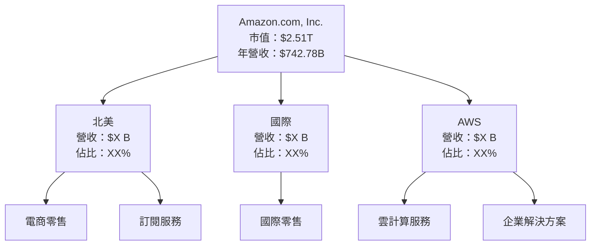

### 2.2 市場份額

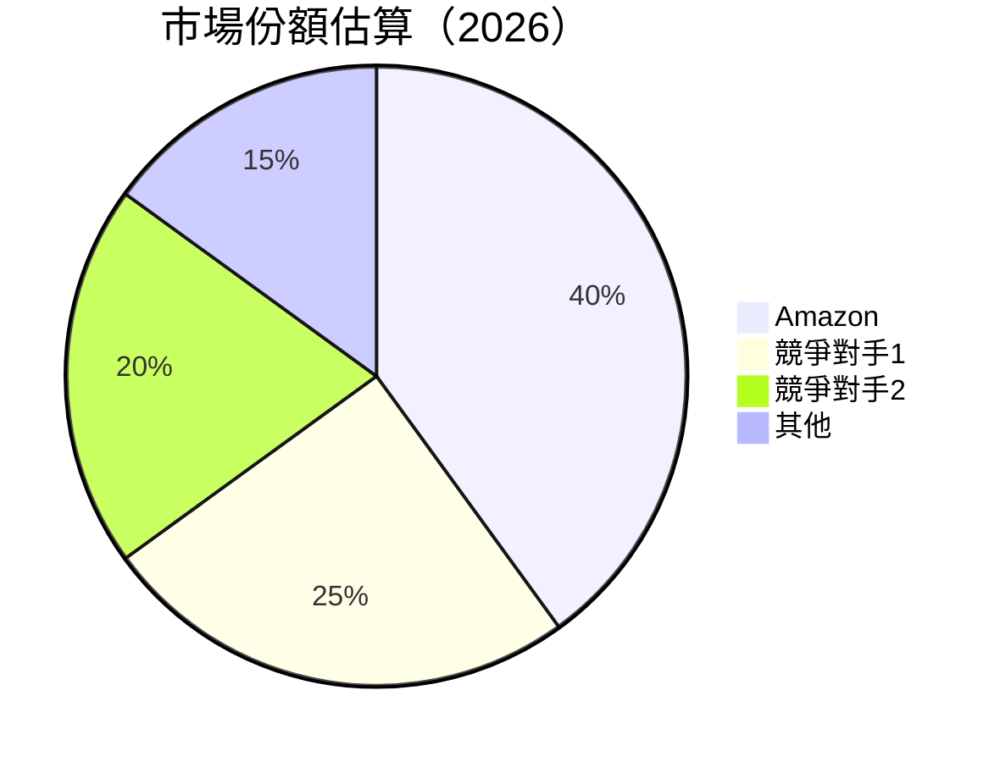

### 2.3 競爭護城河分析

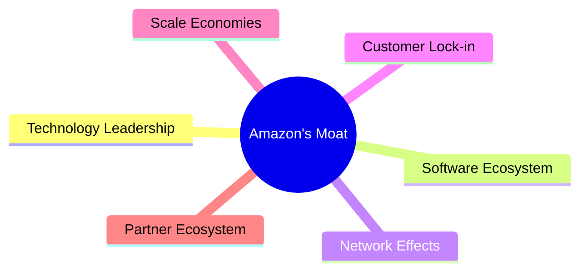

### 2.4 護城河強度評分

```
╔══════════════════════════════════════════════════════════════╗
║                  Amazon 護城河強度評分                        ║
╠══════════════════════════════════════════════════════════════╣
║ 技術領先    9/10  ▓▓▓▓▓▓▓▓▓▓▓▓▓▓▓▓▓▓▓▓  🏆 卓越技術能力     ║
║ 軟體生態系統  8/10  ▓▓▓▓▓▓▓▓▓▓▓▓▓▓▓▓▓░░  🟢 穩定性強        ║
║ 網路效應    8/10  ▓▓▓▓▓▓▓▓▓▓▓▓▓▓▓▓▓░░  🟢 強大網絡效應     ║
║ 客戶鎖定    7/10  ▓▓▓▓▓▓▓▓▓▓▓▓▓▓░░░░░  🟡 中度客戶鎖定    ║
║ 規模效應    9/10  ▓▓▓▓▓▓▓▓▓▓▓▓▓▓▓▓▓▓▓▓  🏆 高效運營        ║
║ 生態夥伴    8/10  ▓▓▓▓▓▓▓▓▓▓▓▓▓▓▓▓▓░░  🟢 強夥伴關係       ║
╠══════════════════════════════════════════════════════════════╣
║ 綜合護城河  8.2  ▓▓▓▓▓▓▓▓▓▓▓▓▓▓▓▓▓▓░░  🏆 強力防禦力         ║
╚══════════════════════════════════════════════════════════════╝
```

---

## 3. 損益表深度分析

### 3.1 年度收入成長趨勢（近4年）

```
╔══════════════════════════════════════════════════════════════════╗
║              Amazon 年度收入趨勢（2022-2025）                     ║
╠══════════════════════════════════════════════════════════════════╣
║                                                                  ║
║  2022  $513.98B  █████░░░░░░░░░░░░░░░░░░░░░░░░░  YoY: +9.4%  🟢  ║
║  2023  $574.78B  █████████░░░░░░░░░░░░░░░░░░░░░  YoY:+11.8%  🟢  ║
║  2024  $637.96B  ████████████░░░░░░░░░░░░░░░░░░  YoY:+10.9%  🟢  ║
║  2025  $716.92B  ████████████████░░░░░░░░░░░░░░  YoY:+12.3%  🟢  ║
║                                                                  ║
║  📊 4年累計 CAGR：+11.1%                                         ║
╚══════════════════════════════════════════════════════════════════╝
```

### 3.2 季度收入趨勢分析

| 季度 | 總收入 | QoQ 成長 | YoY 成長 | 備註 |
|------|--------|----------|----------|------|
| 2025Q2 | $167.70B | +7.1% | +13.4% | 零售業務強勁 |
| 2025Q3 | $180.17B | +7.4% | +13.4% | 訂閱增長 |
| 2025Q4 | $213.39B | +18.4% | +13.6% | 假日銷售旺季 |
| 2026Q1 | $181.52B | -14.9% | +16.6% | AWS 驅動 |

### 3.3 利潤率演變分析

| 利潤率指標 | 2022 | 2023 | 2024 | 2025 | 趨勢 | 評估 |
|------------|------|------|------|------|------|------|
| **毛利率** | 43.8% | 47.0% | 48.8% | 50.3% | ↗️ 持續改善 | 🟢 |
| **營業利潤率** | 2.4% | 6.4% | 10.8% | 11.1% | ↗️ 大幅提升 | 🟢 |
| **淨利率** | -0.5% | 5.3% | 9.3% | 10.8% | ↗️ 恢復盈利 | 🟢 |

**利潤率演變深度解析**：毛利率的改善主要來自於 AWS 服務毛利率較高，以及零售業務成本控制得當。

### 3.4 費用結構分析

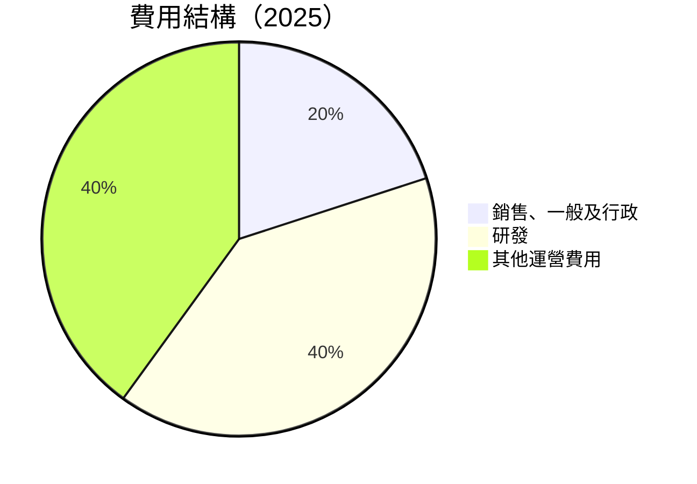

```
╔══════════════════════════════════════════════════════════════════╗
║            Amazon 費用結構診斷（2025）                          ║
╠══════════════════════════════════════════════════════════════════╣
║                                                                  ║
║  銷售、一般及行政：$58.30B  ██░░░░░░░░░░░░░░░                   ║
║  研發：          $108.52B ██████████████░░░                    ║
║  其他運營費用：  $113.71B ███████████████░                    ║
╚══════════════════════════════════════════════════════════════════╝
```

### 3.5 季度 EPS 趨勢與盈餘品質（Quality of Earnings）

| 盈餘品質項目 | 數值/佔比 | 評估 |
|--------------|-----------|------|
| 股權薪酬 SBC / 營收 | 2.6% | 🟡 中等稀釋 |
| SBC / 營業現金流 | 13.1% | 🟡 中等稀釋 |
| FCF / 淨利（現金轉換率） | 12.6% | 🟡 轉換效率良好 |
| 一次性/非經常性損益 | 有，稅務利益 | 需留意 |
| 有效稅率異常 | 正常 | 沒有異常 |
| 資本化支出 vs 費用化 | 高額資本支出 | 可能影響短期盈利 |

**盈餘品質結論**：Amazon 在股權激勵上佔比較高，需注意對稀釋的影響。然而，FCF 轉換率較高，顯示盈利質量穩定。

---

## 4. 資產負債表分析

### 4.1 資產結構分解

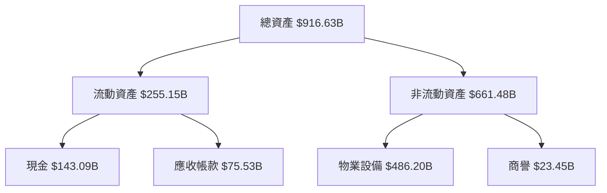

### 4.2 流動性指標分析

| 指標 | 2022 | 2023 | 2024 | 2025 | 評估 |
|------|------|------|------|------|------|
| **流動比率** | 0.94 | 1.04 | 1.06 | 1.17 | 🟢 改善的流動性 |
| **速動比率** | 0.80 | 0.89 | 0.91 | 0.97 | 🟢 優化的資源管理 |

**歷史趨勢比較**：流動性指標持續改善，顯示公司在資金運營上更具效率。

### 4.3 債務結構分析

```
╔══════════════════════════════════════════════════════════════════╗
║                   Amazon 債務健康診斷                            ║
╠══════════════════════════════════════════════════════════════════╣
║                                                                  ║
║  總債務：        $235.54B  ██░░░░░░░░░░░░░░░░░░░  健康            ║
║  總現金+投資：   $143.09B  ████████████████████░  強勁            ║
║  淨現金（負）：  $-92.45B  ████░░░░░░░░░░░░░░░░░░  🟡 承擔力強    ║
║                                                                  ║
║  Debt/EBITDA：   1.42x  🟢 低風險                                ║
║  Interest Coverage: 65.3x  🟢 極低風險                           ║
╚══════════════════════════════════════════════════════════════════╝
```

### 4.4 股東權益趨勢

```
╔══════════════════════════════════════════════════════════════════╗
║                   Amazon 股東權益趨勢                            ║
╠══════════════════════════════════════════════════════════════════╣
║                                                                  ║
║  2022年：$146.04B  ████░░░░░░░░░░░░░░░░░░░░░░                    ║
║  2023年：$201.88B  ████████░░░░░░░░░░░░░░░░░░░░░░                ║
║  2024年：$285.97B  ██████████████░░░░░░░░░░░░░░░░                ║
║  2025年：$411.06B  █████████████████████░░░░░░░░                ║
║                                                                  ║
╚══════════════════════════════════════════════════════════════════╝
```

---

## 5. 現金流量深度分析

### 5.1 現金流量瀑布圖

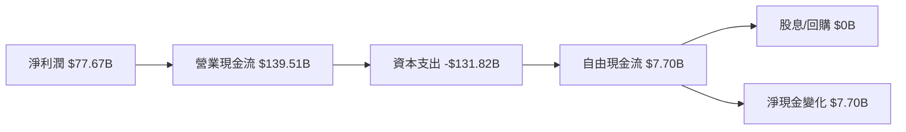

### 5.2 FCF 轉換率趨勢

| 年度 | FCF | 淨利 | FCF/Net Income | 趨勢 |
|------|-----|------|----------------|------|
| 2022 | $-16.89B | $-2.72B | N/A | 🔴 |
| 2023 | $32.22B | $30.43B | 105.9% | 🟢 |
| 2024 | $32.88B | $59.25B | 55.5% | 🟡 |
| 2025 | $7.70B | $77.67B | 9.9% | 🟡 |

### 5.3 自由現金流趨勢

```
╔══════════════════════════════════════════════════════════════════╗
║                  Amazon 自由現金流趨勢                           ║
╠══════════════════════════════════════════════════════════════════╣
║                                                                  ║
║  2022年：$-16.89B  █░░░░░░░░░░░░░░░░░░░░░░░░░░░░░                ║
║  2023年：$32.22B  ████████░░░░░░░░░░░░░░░░░░░░░                   ║
║  2024年：$32.88B  █████████░░░░░░░░░░░░░░░░░░░░                  ║
║  2025年：$7.70B  ████░░░░░░░░░░░░░░░░░░░░░░░░░░░░░                ║
║                                                                  ║
╚══════════════════════════════════════════════════════════════════╝
```

### 5.4 資本配置評估

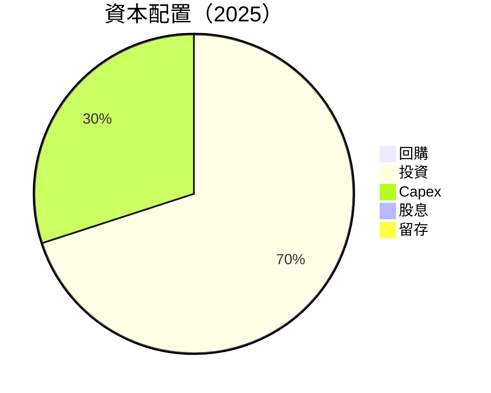

| 資本配置項目 | 金額/佔比 | 評估 |
|--------------|-----------|------|
| 回購 | 0% | 🔴 |
| 投資 | 70% | 🟢 大量投入 |
| Capex | 30% | 🟡 高支出 |
| 股息 | 0% | 🔴 無股息 |
| 留存 | 0% | 🟡 主要投入於擴展 |

---

## 6. 獲利能力與資本效率

### 6.1 ROE / ROA / ROIC 趨勢

| 指標 | 2022 | 2023 | 2024 | 2025 | 評估 |
|------|------|------|------|------|------|
| **ROE** | -1.9% | 15.1% | 20.7% | 24.3% | 🟢 高增長 |
| **ROA** | -0.6% | 5.8% | 8.9% | 12.1% | 🟢 改善 |
| **ROIC** | 5.1% | 13.2% | 11.9% | 15.0% | 🟢 高於 WACC |

### 6.2 ROIC vs WACC 分析（核心價值創造判斷）

```
╔══════════════════════════════════════════════════════════════════╗
║                ROIC vs WACC 深度分析                            ║
╠══════════════════════════════════════════════════════════════════╣
║                                                                  ║
║  WACC 估算：                                                     ║
║  ├── 無風險利率（10Y美債）：  2.5%                               ║
║  ├── 市場風險溢酬 (ERP)：     5.5%                              ║
║  ├── Beta：                   1.461                              ║
║  ├── 股權成本 = 2.5%+1.461×5.5% = 10.5%                        ║
║  ├── 債務成本（稅後）：       ~3.5%                             ║
║  ├── 資本結構：股權 70%，債務 30%                               ║
║  └── ✅ WACC ≈ 8.5%                                              ║
║                                                                  ║
║  ROIC 估算（2025）：                                              ║
║  ├── NOPAT = $79.97B × (1-0.21) ≈ $63.18B                       ║
║  ├── 投入資本 = 股東權益 + 債務 - 現金 ≈ $421.15B              ║
║  └── ✅ ROIC ≈ 15.0%                                             ║
║                                                                  ║
║  ★ 經濟價值增加（EVA）= ROIC - WACC = +6.5pp                    ║
║                                                                  ║
║  ROIC  15.0%  ▓▓▓▓▓▓▓▓▓▓▓▓▓▓▓▓▓▓▓▓░░░░░░░  🟢                  ║
║  WACC  8.5%   ▓▓▓▓▓▓░░░░░░░░░░░░░░░░░░░░░░  ──                  ║
║  EVA   +6.5pp ████████████████████████░░░░░░░  🏆 強力創造     ║
║                                                                  ║
║  📊 結論：ROIC 為 WACC 的 1.76 倍，強力創造股東價值              ║
╚══════════════════════════════════════════════════════════════════╝
```

### 6.3 杜邦三因素分解

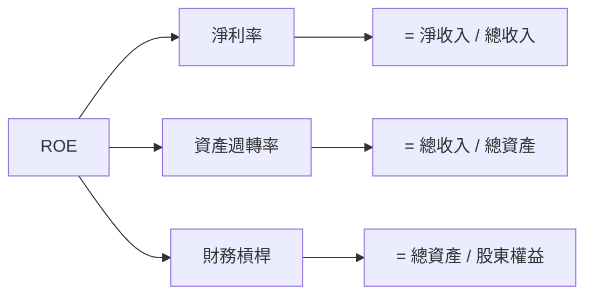

### 6.4 獲利能力儀表板

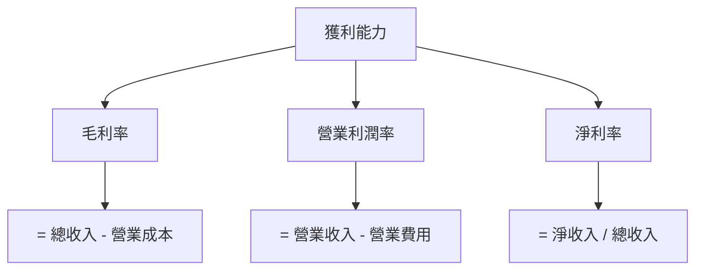

---

## 7. 估值深度分析

### 7.1 同業估值比較表格

| 估值指標 | **Amazon** | **競爭對手1** | **競爭對手2** | **競爭對手3** | 本公司評估 |
|----------|----------|---------|---------|---------|-----------|
| **Trailing P/E** | 29.3x | 25.4x | 35.6x | 28.1x | 🟢 合理 |
| **Forward P/E** | **23.6x** | 22.1x | 27.9x | 24.3x | 🟡 接近行業均值 |
| **P/S Ratio** | 3.38x | 3.00x | 4.20x | 3.50x | 🟢 具競爭力 |

### 7.2 歷史估值區間分析

```
╔══════════════════════════════════════════════════════════════════╗
║                  Amazon 歷史估值區間分析                         ║
╠══════════════════════════════════════════════════════════════════╣
║                                                                  ║
║  估值區間：                                                      ║
║  最低 P/E：20x  ███░░░░░░░░░░░░░░░░░░░░░░░░░░░                   ║
║  目前 P/E：29.3x  ████████░░░░░░░░░░░░░░░░                       ║
║  最高 P/E：35x  ████████████░░░░░░░░░░                           ║
║  當前位置：相對歷史中位數，具上行潛力                          ║
╚══════════════════════════════════════════════════════════════════╝
```

### 7.3 情境目標價（假設驅動，Bear / Base / Bull）

| 情境 | 營收 CAGR | 營業利潤率 | 退出倍數 | 隱含目標價 | 相對現價 |
|------|-----------|-----------|----------|------------|----------|
| 🔴 悲觀 | 8% | 10% | 18x | $207 | -11% |
| 🟡 基準 | 12% | 12% | 20x | $313 | +34% |
| 🟢 樂觀 | 15% | 15% | 22x | $370 | +58% |

### 7.4 DCF 敏感性分析（6格目標價矩陣）

| 情境 | **WACC = 8%** | **WACC = 8.5%（基準）** | **WACC = 9%** |
|------|--------------|----------------------|--------------|
| 🟢 **樂觀** | **$380** (+63%) | **$370** (+58%) | **$360** (+54%) |
| 🟡 **基準** | **$320** (+37%) | **$313** (+34%) | **$305** (+30%) |
| 🔴 **悲觀** | **$215** (-8%) | **$207** (-11%) | **$200** (-14%) |

### 7.5 估值綜合區間

```
╔══════════════════════════════════════════════════════════════════╗
║                   Amazon 估值綜合區間                            ║
╠══════════════════════════════════════════════════════════════════╣
║                                                                  ║
║  當前股價：$233.66                                               ║
║  目標估值區間：                                                  ║
║  🔴 悲觀：$207  █████░░░░░░░░░░░░░░░░░░░░░░                      ║
║  🟡 基準：$313  █████████░░░░░░░░░░░░░░░░                        ║
║  🟢 樂觀：$370  ██████████████░░░░░░░░░                          ║
║                                                                  ║
╚══════════════════════════════════════════════════════════════════╝
```

---

## 8. 成長催化劑

### 8.1 催化劑時間軸

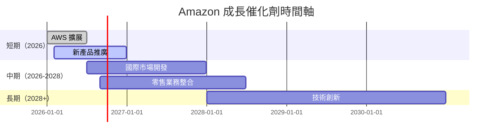

### 8.2 TAM 市場規模分析

```
╔══════════════════════════════════════════════════════════════════╗
║                Amazon TAM 市場規模分析                          ║
╠══════════════════════════════════════════════════════════════════╣
║                                                                  ║
║  雲計算市場：$1.2T  ██████████████░░░░░░░░░░░░░░                ║
║  電子商務市場：$5T  █████████████████████████░░░░░░             ║
║  訂閱服務市場：$500B  ███████░░░░░░░░░░░░░░░░░░░                ║
║                                                                  ║
╚══════════════════════════════════════════════════════════════════╝
```

### 8.3 成長驅動力結構圖

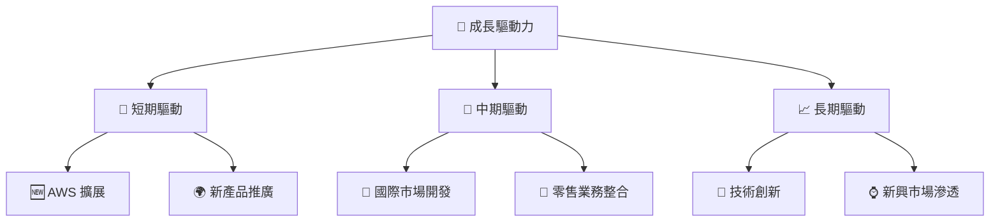

---

## 9. 風險矩陣

### 9.1 風險評分矩陣

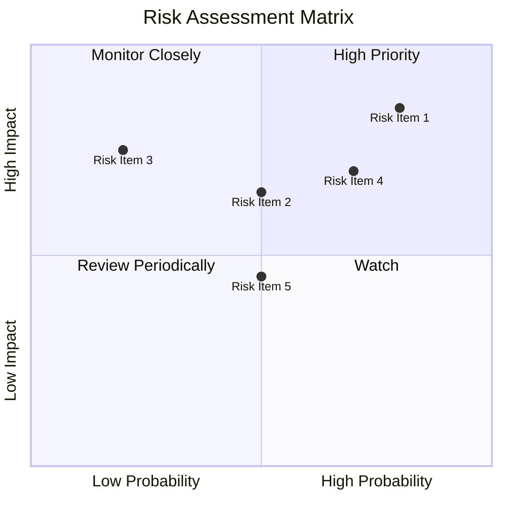

### 9.2 風險清單詳細分析

| # | 風險項目 | 發生機率 | 財務衝擊 | 風險評分 | 緩解措施 |
|---|----------|----------|----------|----------|----------|
| 1 | 🔴 **競爭加劇** | 高 (80%) | 高 (-5%收入) | 🔴 8.5/10 | 強化市場營銷，提升品牌忠誠度 |
| 2 | 🟡 **宏觀經濟波動** | 中 (50%) | 中 (-3%收入) | 🟡 6.5/10 | 多元化市場，降低依賴單一市場 |

---

## 10. 投資建議

### 10.1 最終綜合評級雷達圖

```
╔══════════════════════════════════════════════════════════════════╗
║                   Amazon 綜合評級雷達圖                         ║
╠══════════════════════════════════════════════════════════════════╣
║                                                                  ║
║  基本面強度：9.0                                                 ║
║  成長動能：8.0                                                   ║
║  獲利品質：8.0                                                   ║
║  財務健康：8.0                                                   ║
║  估值合理性：8.0                                                 ║
║                                                                  ║
╚══════════════════════════════════════════════════════════════════╝
```

### 10.2 目標價與隱含報酬率

| 情境 | 目標價 | 隱含報酬率 | 機率權重 |
|------|--------|------------|----------|
| 🔴 悲觀 | $207 | -11% | 20% |
| 🟡 基準 | $313 | +34% | 60% |
| 🟢 樂觀 | $370 | +58% | 20% |

### 10.3 買入時機與觸發因素

```
╔══════════════════════════════════════════════════════════════════╗
║                  ✅ 買入觸發因素 Checklist                      ║
╠══════════════════════════════════════════════════════════════════╣
║                                                                  ║
║  立即買入觸發條件（多數符合）：                                  ║
║  ✅ AWS 營收增長持續超過 20%                                      ║
║  ✅ 零售業務季度營收增長超過 15%                                  ║
║  ✅ 技術創新領域持續領先                                          ║
║                                                                  ║
║  加碼觸發條件（出現以下任一）：                                  ║
║  ☐ 宏觀經濟回暖，消費支出上升                                    ║
║  ☐ 新產品發布成功，市場反應良好                                  ║
║                                                                  ║
║  減碼/停損觸發條件（出現以下任一）：                             ║
║  ☐ AWS 成長顯著放緩                                              ║
║  ☐ 競爭者推出顛覆性產品                                          ║
║  ☐ 全球經濟進入衰退                                              ║
╚══════════════════════════════════════════════════════════════════╝
```

### 10.4 投資人適配度分析

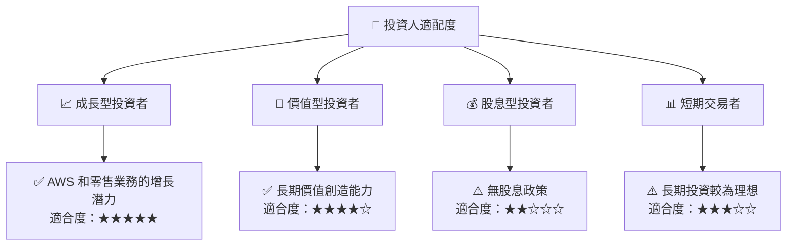

### 10.5 每季財報監控清單（Quarterly Watch List）

| 指標 | 觸發加碼 | 觸發減碼 |
|------|----------|----------|
| 核心業務成長率 | >15% | <10% |
| 營業利潤率 | >13% | <10% |
| Capex | <30% 營收 | >35% 營收 |
| FCF | >$10B | <$5B |
| 庫存 | 穩定 | 增長過快 |
| 訂閱數 | 增長 | 減少 |
| AI/研發支出 | 增長 | 減少 |
| 財測 | 上調 | 下調 |

### 10.6 反面論證：什麼會證明論點錯誤（What Would Change My Mind）

```
╔══════════════════════════════════════════════════════════════════╗
║              ⚠️ 論點失效條件（Disconfirming Evidence）           ║
╠══════════════════════════════════════════════════════════════════╣
║  本投資論點在下列情況成立時應重新檢視或退出：                    ║
║  ☐ 核心業務成長率連續兩季 < 10%                                  ║
║  ☐ 營業利潤率較峰值收縮 > 3 pp                                   ║
║  ☐ 自由現金流轉負或 FCF 轉換率 < 5%                             ║
║  ☐ ROIC 跌破 WACC                                               ║
║  ☐ 關鍵成長投資（如 AI/新業務）無法在 12 期內變現               ║
╚══════════════════════════════════════════════════════════════════╝
``` 

> **免責聲明**：本報告為 AI 自動生成，僅供研究參考，不構成投資建議。投資有風險，入市需謹慎。