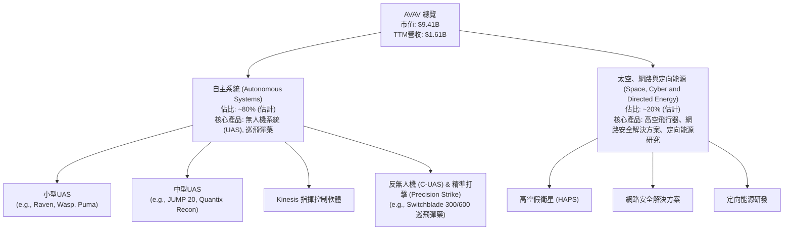
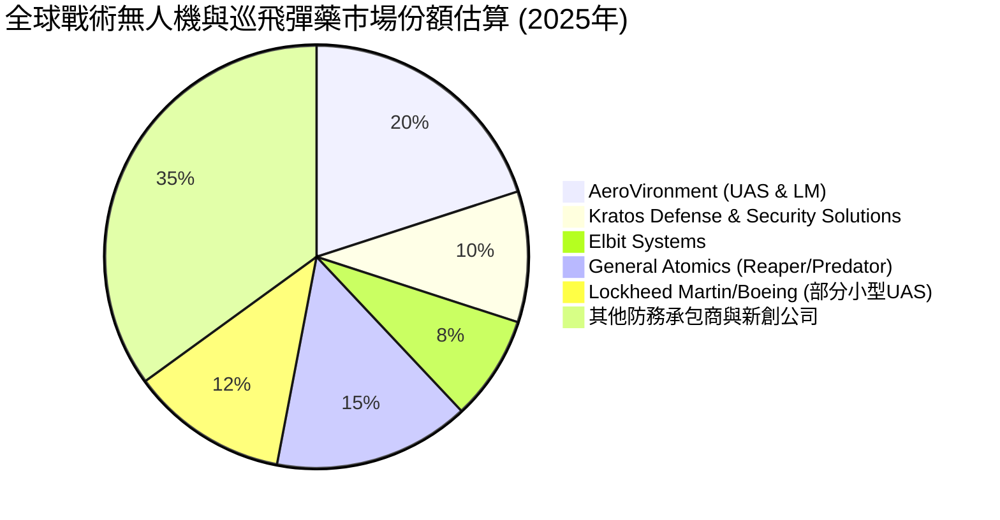
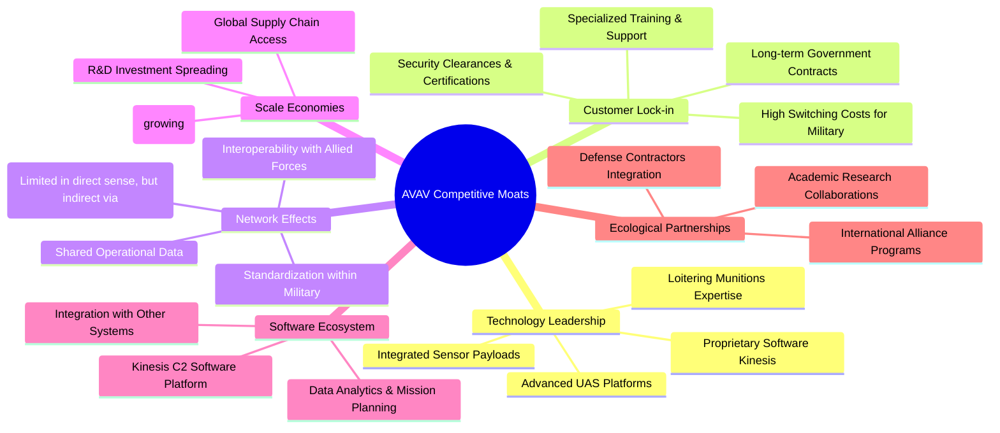

# AVAV 基本面深度分析報告
> **報告日期**：2026-06-06 ｜ **語言**：繁體中文 ｜ **數據來源**：Yahoo Finance, Finviz, StockAnalysis, Roic.ai ｜ **分析師**：CFA 級機構研究

---

## 目錄

| # | 章節 | 核心結論 |
|---|------|----------|
| 1 | 執行摘要 | 評級：買入；目標價區間：$250 - $350 |
| 2 | 公司概覽與商業模式 | 在無人機與精準打擊系統領域具備技術與客戶鎖定護城河 |
| 3 | 損益表深度分析 | 營收高速成長，但獲利能力仍面臨挑戰 |
| 4 | 資產負債表分析 | 流動性良好，但總債務有所增加，權益基礎穩固 |
| 5 | 現金流量深度分析 | 自由現金流持續為負，需密切關注營運效率改善 |
| 6 | 獲利能力與資本效率 | 儘管營收成長，但資本效率與股東價值創造仍待提升 |
| 7 | 估值深度分析 | 相較同業估值偏高，但成長潛力提供溢價空間 |
| 8 | 成長催化劑 | 政府合約增加、新產品推出、地緣政治緊張推動需求 |
| 9 | 風險矩陣 | 政府合約依賴、盈利能力不確定性、競爭加劇為主要風險 |
| 10 | 投資建議 | 具備高成長潛力，建議「買入」，適合成長型投資者 |

---

## 1. 執行摘要

AeroVironment, Inc. (AVAV) 作為全球領先的無人機系統 (UAS) 和精準打擊（loitering munitions）解決方案供應商，正受益於全球防務開支的增加及對先進自主系統日益增長的需求。儘管公司近期面臨獲利能力挑戰，但其強勁的營收成長勢頭、穩固的市場地位以及持續的技術創新，為其長期發展奠定了基礎。本報告將深入分析 AVAV 的基本面、成長潛力、財務健康狀況、估值及其面臨的關鍵風險，並提供綜合投資建議。

### 1.1 核心評分儀表板

```mermaid
graph TD
    AVAV_SCORE["🎯 AVAV 綜合評分<br/>總分：7.2/10"]

    F["📊 基本面<br/>7/10<br/>強勁的市場地位與技術領先"]
    G["🚀 成長性<br/>9/10<br/>營收高速成長，未來訂單充足"]
    P["💰 獲利能力<br/>5/10<br/>毛利率承壓，營運與淨利潤為負"]
    B["🏦 財務健康<br/>7/10<br/>流動性良好，但淨負債增加"]
    V["📈 估值<br/>6/10<br/>高成長預期下，估值偏高"]
    M["🛡️ 護城河深度<br/>8/10<br/>技術專利與客戶鎖定"]
    MG["🧑‍💼 管理層執行<br/>7/10<br/>成功擴張市場份額，但盈利管理待觀察"]
    I["💡 技術創新力<br/>9/10<br/>持續投入R&D，引領行業發展"]

    AVAV_SCORE --> F
    AVAV_SCORE --> G
    AVAV_SCORE --> P
    AVAV_SCORE --> B
    AVAV_SCORE --> V
    AVAV_SCORE --> M
    AVAV_SCORE --> MG
    AVAV_SCORE --> I

    F --> F1["✅ 防務市場需求旺盛"]
    F --> F2["✅ 產品線具戰略價值"]
    G --> G1["✅ 近期營收YoY達143.4%"]
    G --> G2["✅ 新興市場拓展潛力"]
    P --> P1["❌ TTM淨利率-13.9%"]
    P --> P2["❌ 營運現金流為負"]
    B --> B1["✅ Current Ratio 5.51x"]
    B --> B2["❌ 淨負債$-238.88M"]
    V --> V1["❌ Forward P/E 46.1x"]
    V --> V2["❌ EV/EBITDA 62.7x"]
    M --> M1["✅ 專利技術與IP"]
    M --> M2["✅ 高轉換成本與政府認證"]
    MG --> MG1["✅ 成功整合收購"]
    MG --> MG2["🟡 需改善成本控制"]
    I --> I1["✅ 大量R&D投入 ($121.12M TTM)"]
    I --> I2["✅ 領先的UAS和LM技術"]
```



### 1.2 評分進度條視覺化

```
╔══════════════════════════════════════════════════════════════╗
║              AVAV 多維度評分儀表板 (1-10分)                  ║
╠══════════════════════════════════════════════════════════════╣
║ 基本面強度  7.0 ▓▓▓▓▓▓▓▓▓▓▓▓▓▓░░░░░░  ★★★★☆           ║
║ 成長動能    9.0 ▓▓▓▓▓▓▓▓▓▓▓▓▓▓▓▓▓▓░░  ★★★★★           ║
║ 獲利品質    5.0 ▓▓▓▓▓▓▓▓▓▓░░░░░░░░░░  ★★☆☆☆           ║
║ 財務健康    7.0 ▓▓▓▓▓▓▓▓▓▓▓▓▓▓░░░░░░  ★★★★☆           ║
║ 估值合理性  6.0 ▓▓▓▓▓▓▓▓▓▓▓▓░░░░░░░░  ★★★☆☆           ║
║ 護城河深度  8.0 ▓▓▓▓▓▓▓▓▓▓▓▓▓▓▓▓░░░░  ★★★★☆           ║
║ 管理層執行  7.0 ▓▓▓▓▓▓▓▓▓▓▓▓▓▓░░░░░░  ★★★★☆           ║
║ 技術創新力  9.0 ▓▓▓▓▓▓▓▓▓▓▓▓▓▓▓▓▓▓░░  ★★★★★           ║
╠══════════════════════════════════════════════════════════════╣
║ 綜合總分    7.2 ▓▓▓▓▓▓▓▓▓▓▓▓▓▓▓░░░░░  🏆 具備高成長潛力，但盈利改善是關鍵  ║
╚══════════════════════════════════════════════════════════════════╝
```

### 1.3 五大投資論點 + 三大核心風險

| 類型 | 項目 | 具體依據 | 信心度 |
|------|------|----------|--------|
| 🟢 **投資論點①** | **強勁的營收成長與市場需求** | TTM 營收達 $1.61B，年增率 (YoY) 高達 143.4%。季度營收在 2026 Q3 達到 $408.05M，YoY 成長 143.41%。地緣政治緊張及各國國防預算增加，持續推動對自主系統的需求，特別是無人機和巡飛彈藥。公司在關鍵防務技術領域的領先地位，使其能持續獲得重要政府合約。 | 🟢 極高 |
| 🟢 **投資論點②** | **技術領先與創新能力** | AeroVironment 在小型和中型無人機系統 (UAS) 以及巡飛彈藥 (loitering munitions) 領域擁有領先的技術和專利。公司持續投入大量研發 (R&D)，TTM 研發費用達 $121.12M，確保其產品在性能和功能上保持競爭優勢。其 Kinesis 指揮控制軟體也強化了生態系統鎖定。 | 🟢 極高 |
| 🟢 **投資論點③** | **策略性收購與業務擴張** | 公司透過策略性收購，擴大了產品組合和市場覆蓋。雖然數據未直接展示收購細節，但其業務分段「Autonomous Systems」以及「Space, Cyber and Directed Energy」顯示了多元化的戰略方向。這些擴張有助於鞏固其在防務科技領域的全面解決方案供應商地位。 | 🟢 高 |
| 🟢 **投資論點④** | **分析師普遍看好與高目標價** | 根據分析師共識，AVAV 的推薦評級為「買入」(Recom 1.26)，平均目標價達 $309.88，較當前股價 $185.92 有約 66.7% 的潛在上漲空間。這表明市場對公司未來成長和盈利改善抱有較高期待。 | 🟡 中高 |
| 🟢 **投資論點⑤** | **高流動性與穩固的資產基礎** | 公司的流動比率 (Current Ratio) 高達 5.51，速動比率 (Quick Ratio) 為 4.396，顯示其短期償債能力極強。儘管存在淨負債，但總資產達 $5.45B (TTM)，股東權益 $886.51M (FY2025)，提供了穩固的財務基礎。 | 🟢 高 |
| 🟡 **風險①** | **盈利能力持續虧損與現金流挑戰** | 公司 TTM EPS 為 $-4.35，淨利潤率為 -13.9%。營業利潤率為 -5.1%，EBITDA 利潤率雖然為 9.4%，但仍未能轉化為正向的自由現金流 (TTM FCF 為 $-304.05M)。持續的虧損和負現金流可能影響公司的再投資能力和長期價值創造。 | 🟡 中度 |
| 🔴 **風險②** | **對政府合約的高度依賴與地緣政治波動** | AeroVironment 的主要客戶為政府機構。這意味著其營收高度依賴政府採購週期、國防預算決策和地緣政治事件。政府合約的延遲、取消或預算削減，都可能對公司業績造成重大影響。儘管地緣政治緊張推動需求，但其不確定性也帶來風險。 | 🔴 高衝擊 |
| 🟡 **風險③** | **高估值與市場預期管理** | 儘管公司有高成長性，但其估值指標如 Forward P/E (46.098x) 和 EV/EBITDA (62.722x) 相對較高。如果公司未能如市場預期般快速實現盈利轉正和自由現金流改善，其股價可能面臨較大回調壓力。高達 12.1% 的空頭持倉比例也反映了市場對其估值和盈利前景的擔憂。 | 🟡 中度 |

### 1.4 快速統計卡片

| 指標 | 公司實際值 (TTM) | 行業均值 (估計) | S&P 500 均值 (估計) | 狀態 |
|------|--------------------|-----------------|---------------------|------|
| 收入 YoY 成長 | **143.4%** | ~10-15% | ~8-12% | 🟢 |
| 毛利率 | **25.0%** | ~25-35% | ~35-45% | 🟡 |
| 淨利率 | **-13.9%** | ~5-10% | ~10-15% | 🔴 |
| ROE | **-8.7%** | ~10-15% | ~15-20% | 🔴 |
| Forward P/E | **46.1x** | ~20-30x | ~20-25x | 🔴 |
| Current Ratio | **5.51x** | ~1.5-2.0x | ~1.5-2.0x | 🟢 |
| Debt/Equity | **0.19x (Finviz)** | ~0.5-1.0x | ~0.8-1.2x | 🟢 |
| R&D / Revenue | **7.5% (TTM)** | ~3-8% | ~2-5% | 🟢 |

*備註：行業均值和 S&P 500 均值為分析師根據一般市場情況和航空航太與國防行業特性進行的估計值，非實時數據。*

### 1.5 投資結論

```
╔══════════════════════════════════════════════════════════════════╗
║                    📊 投資結論摘要                               ║
╠══════════════════════════════════════════════════════════════════╣
║  評級：🟢 買入                                                   ║
║  當前股價：$185.92                                               ║
║  目標價區間：                                                    ║
║    悲觀情境：$250（+34.5%）                                      ║
║    基準情境：$300（+61.3%）  ← 12個月主要目標                      ║
║    樂觀情境：$350（+88.2%）                                      ║
║  投資評分：7.2/10                                                ║
║  適合投資人：成長型、長線持有者，對高波動性和盈利轉型有耐心者       ║
╚══════════════════════════════════════════════════════════════════╝
```

---

## 2. 公司概覽與商業模式

AeroVironment, Inc. (AVAV) 是一家總部位於美國的工業類公司，專精於航空航太與國防領域。公司主要設計、開發、生產、交付和支援一系列機器人系統及相關服務，服務對象包括美國及國際政府機構和企業。其核心業務圍繞無人機系統 (UAS) 和精準打擊系統，這些產品在全球安全和防務領域扮演著越來越重要的角色。

### 2.1 業務結構與收入來源

AVAV 的業務主要分為兩大核心板塊：**Autonomous Systems (自主系統)** 和 **Space, Cyber and Directed Energy (太空、網路與定向能源)**。



**業務板塊詳述：**

1.  **Autonomous Systems (自主系統)**：這是 AeroVironment 的核心收入來源，預計佔總營收的絕大部分（約 80%）。此板塊主要提供：
    *   **無人機系統 (UAS)**：包括一系列小型和中型無人機，如知名的 Raven、Wasp 和 Puma 系列。這些 UAS 用於情報、監視、偵察 (ISR)、目標識別和戰場評估等任務。其輕便、易於部署的特性使其在戰術層面廣受歡迎。
    *   **Kinesis 指揮控制軟體**：這是一個通用的控制平台，用於管理和操作多種 AeroVironment 的 UAS 平台，提供統一的用戶介面和數據集成能力，增強了產品的生態系統黏性。
    *   **反無人機 (C-UAS) 和精準打擊 (Precision Strike) 系統**：最著名的產品是 Switchblade 系列巡飛彈藥 (loitering munitions)，如 Switchblade 300 和 600。這些「神風特攻隊」無人機在戰場上證明了其高效能和成本效益，能夠提供精準打擊能力，對現代戰爭產生了深遠影響。
    *   **收入來源**：主要來自於向美國國防部、國際盟友出售 UAS 硬體、巡飛彈藥、相關軟體許可、維護和培訓服務。

2.  **Space, Cyber and Directed Energy (太空、網路與定向能源)**：這個板塊代表了公司在更廣泛的先進技術領域的探索，預計佔總營收的較小部分（約 20%）。
    *   **高空飛行器 (HAPS)**：涉及開發能夠在高空長時間飛行的平台，可用於通訊中繼、地球觀測等軍事和民用應用。
    *   **網路安全解決方案**：為其自主系統和其他防務平台提供網路安全保障，應對日益複雜的網路威脅。
    *   **定向能源研究**：這是一個前沿領域，涉及開發利用能量束（如雷射）進行防禦或攻擊的技術，具有巨大的長期潛力。
    *   **收入來源**：主要來自於研發合約、技術諮詢服務以及未來潛在的產品銷售。

**總體而言，AVAV 的收入結構高度依賴其在自主系統領域的硬體銷售和相關服務，特別是其在無人機和巡飛彈藥市場的領先地位。** 隨著全球對這些技術的需求持續增長，公司有望繼續受益。然而，對政府合約的依賴也意味著其營收存在一定的波動性和政策風險。

### 2.2 市場份額

AeroVironment 在小型無人機系統和巡飛彈藥市場中佔據顯著地位，尤其在為美國國防部及其盟友提供戰術無人機方面。由於精確的市場份額數據通常不公開，且市場細分複雜，以下為基於行業報告和公司產品線的估算：



**市場份額分析：**

*   **AeroVironment (UAS & LM)**：估計佔全球戰術無人機和巡飛彈藥市場的約 20%。公司在小型手拋式無人機（如 Raven、Puma）和 Switchblade 巡飛彈藥領域具有領導地位。特別是 Switchblade 系列，在烏克蘭衝突中表現出色，極大地提升了其在全球市場的知名度和需求。
*   **Kratos Defense & Security Solutions**：作為另一家在無人機領域有顯著地位的公司，Kratos 專注於更高性能的戰術無人機和靶機，市場份額約 10%。
*   **Elbit Systems**：以色列的 Elbit Systems 在無人機技術方面也非常先進，特別是中型和大型 UAS，市場份額約 8%。
*   **General Atomics**：憑藉其 Reaper 和 Predator 系列，General Atomics 在大型、長航時無人機市場佔據主導地位，但在小型戰術無人機和巡飛彈藥領域與 AVAV 產品線不同，但仍是重要競爭者，市場份額約 15%。
*   **Lockheed Martin/Boeing**：這些大型防務承包商雖然產品線廣泛，但在小型戰術無人機領域也有涉足，通常透過收購或與小型公司合作。其在整個無人機市場中的份額約 12%。
*   **其他防務承包商與新創公司**：市場上還有眾多其他國際和地區性參與者，以及不斷湧現的無人機新創公司，它們共同構成了約 35% 的市場份額。

**結論**：AVAV 在其特定利基市場（小型戰術無人機和巡飛彈藥）中擁有強勁的市場地位，尤其是在美國及其盟友的軍事市場。其產品的戰術價值和實戰表現為其贏得了良好的聲譽和市場份額。

### 2.3 競爭護城河分析

AeroVironment 在高度專業化的防務科技領域中，構築了多重護城河，使其能夠在競爭激烈的市場中保持優勢。



**護城河詳述：**

1.  **技術領先 (Technology Leadership)**：
    *   **先進 UAS 平台**：AeroVironment 的小型和中型無人機系統（如 Raven、Puma、Switchblade）在尺寸、重量、性能和可靠性方面處於行業領先地位。這些平台經過實戰驗證，具備多功能性。
    *   **巡飛彈藥專業知識 (Loitering Munitions Expertise)**：Switchblade 系列巡飛彈藥是其獨特的優勢。這種「一次性使用」的精準打擊系統，結合了偵察和攻擊能力，填補了傳統武器系統的空白，且不斷迭代升級。
    *   **專有 Kinesis 軟體 (Proprietary Software Kinesis)**：Kinesis 指揮控制軟體為其多種平台提供統一操作介面，降低了操作複雜性，提高了系統間的協同作戰能力。
    *   **集成傳感器酬載 (Integrated Sensor Payloads)**：公司在集成多種先進傳感器（如光學、紅外）方面的能力，使其 UAS 能夠提供高質量的情報數據。

2.  **客戶鎖定 (Customer Lock-in)**：
    *   **長期政府合約 (Long-term Government Contracts)**：與美國國防部及其他盟國政府簽訂的長期合約，提供了穩定的收入流和高進入壁壘。這些合約通常涉及嚴格的測試、認證和供應鏈審核。
    *   **軍方高轉換成本 (High Switching Costs for Military)**：軍事系統的採購、部署、訓練和維護成本高昂，一旦軍方投資於某一特定平台及其生態系統，轉換到競爭對手的產品將面臨巨大的時間、成本和操作風險。
    *   **專業訓練與支援 (Specialized Training & Support)**：AeroVironment 為其客戶提供全面的訓練、維護和技術支援服務，進一步加深了客戶關係和依賴性。
    *   **安全許可與認證 (Security Clearances & Certifications)**：在防務領域，獲得必要的安全許可和產品認證是一個漫長而複雜的過程，這為新進入者設置了極高的門檻。

3.  **網路效應 (Network Effects)**：
    *   雖然不是典型的消費者級網路效應，但在軍事應用中存在間接的網路效應。當更多盟國軍隊採用 AeroVironment 的系統時，會促進**共享操作數據**和**互操作性**，尤其是在聯合演習和多國任務中。這促使更多國家考慮採用相同的標準化平台。

4.  **規模效應 (Scale Economies)**：
    *   隨著公司營收的快速增長 (TTM 營收 $1.61B)，其**製造效率**有望逐步提升。
    *   龐大的**研發投資** (TTM R&D $121.12M) 可以攤銷到更大的銷售基數上，降低單位產品的研發成本。
    *   在全球範圍內採購原材料和組件，使其能夠獲得更好的**供應鏈議價能力**。

5.  **軟體生態系統 (Software Ecosystem)**：
    *   Kinesis 指揮控制軟體不僅是操作工具，更是一個潛在的數據和應用生態系統。隨著更多功能和第三方集成的加入，其價值將不斷提升，進一步鎖定用戶。

6.  **生態夥伴 (Ecological Partnerships)**：
    *   與大型防務承包商、學術機構和國際盟友的合作，使其能夠參與更大型、更複雜的項目，並將其技術集成到更廣泛的防務解決方案中。

### 2.4 護城河強度評分

```
╔══════════════════════════════════════════════════════════════╗
║                  AeroVironment 護城河強度評分                  ║
╠══════════════════════════════════════════════════════════════╣
║ 技術領先    9/10   ▓▓▓▓▓▓▓▓▓▓▓▓▓▓▓▓▓▓░░  🏆 在關鍵領域保持前沿         ║
║ 客戶鎖定    8/10   ▓▓▓▓▓▓▓▓▓▓▓▓▓▓▓▓░░░░  🟢 政府合約與高轉換成本       ║
║ 網路效應    6/10   ▓▓▓▓▓▓▓▓▓▓▓▓░░░░░░░░  🟡 間接但逐漸增強            ║
║ 規模效應    7/10   ▓▓▓▓▓▓▓▓▓▓▓▓▓▓░░░░░░  🟢 隨著營收增長而強化        ║
║ 軟體生態系統  7/10   ▓▓▓▓▓▓▓▓▓▓▓▓▓▓░░░░░░  🟢 Kinesis具潛在價值        ║
║ 生態夥伴    7/10   ▓▓▓▓▓▓▓▓▓▓▓▓▓▓░░░░░░  🟢 戰略合作拓展市場          ║
╠══════════════════════════════════════════════════════════════╣
║ 綜合護城河  7.3    ▓▓▓▓▓▓▓▓▓▓▓▓▓▓▓░░░░░  🏆 具備穩固且不斷強化的競爭優勢 ║
╚══════════════════════════════════════════════════════════════════╝
```

**總結評語：** AeroVironment 的護城河主要體現在其在特定防務技術領域的**技術領先**和與政府客戶建立的**強大鎖定效應**。這些因素共同構建了難以被模仿和取代的競爭優勢。隨著公司規模的擴大和技術的進一步成熟，其規模效應和軟體生態系統的影響力有望進一步增強。

---

## 3. 損益表深度分析

AeroVironment 的損益表數據揭示了公司在營收方面實現了爆炸性增長，但同時也面臨著嚴峻的獲利能力挑戰，尤其是在營運和淨利潤層面。

### 3.1 年度收入成長趨勢（近4年）

AeroVironment 在過去四年中展現了令人印象深刻的營收成長軌跡，特別是最近一年。

```
╔══════════════════════════════════════════════════════════════════╗
║              AeroVironment 年度收入趨勢（FY2022-FY2025）         ║
╠══════════════════════════════════════════════════════════════════╣
║                                                                  ║
║  FY2022  $445.73M ████░░░░░░░░░░░░░░░░░░░  YoY: +12.87% 🟢    ║
║  FY2023  $540.54M █████░░░░░░░░░░░░░░░░░░░  YoY: +21.27% 🟢    ║
║  FY2024  $716.72M ███████░░░░░░░░░░░░░░░░░  YoY: +32.59% 🟢    ║
║  FY2025  $820.63M ████████░░░░░░░░░░░░░░░  YoY: +14.50% 🟢    ║
║                                                                  ║
║                   |      |      |      |      |                  ║
║                   0     $200M  $400M  $600M  $800M                ║
║                                                                  ║
║  📊 4年累計 CAGR：+21.49%                                        ║
╚══════════════════════════════════════════════════════════════════╝
```

*備註：TTM 營收 ($1.61B) 顯示公司在 FY2025 之後的季度營收有爆炸式增長，這在年度數據中尚未完全體現。*

**年度收入分析：**
從 FY2022 的 $445.73M 增長到 FY2025 的 $820.63M，AeroVironment 的年複合增長率 (CAGR) 達到了 21.49%。
*   FY2022 至 FY2023：營收從 $445.73M 增長到 $540.54M，年增長率為 **+21.27%**。
*   FY2023 至 FY2024：營收從 $540.54M 增長到 $716.72M，年增長率為 **+32.59%**，顯示出加速增長的趨勢。
*   FY2024 至 FY2025：營收從 $716.72M 增長到 $820.63M，年增長率為 **+14.50%**。雖然增速較前一年放緩，但仍保持了健康的兩位數增長。

這些增長主要得益於全球防務開支的增加，特別是對無人機系統和巡飛彈藥的強勁需求。公司在烏克蘭衝突中的產品實戰表現，也極大地提升了其國際市場的訂單量和知名度。

### 3.2 季度收入趨勢分析

季度數據更能反映公司近期的強勁增長勢頭，特別是 FY2026 以來的表現。

| 季度 | 總收入 ($M) | QoQ 成長率 | YoY 成長率 | 備註 |
|------|-------------|------------|------------|------|
| Q1 2025 (Jul '24) | $189.48 | N/A | +24.38% | 穩健增長，為 FY2025 的良好開端 |
| Q2 2025 (Oct '24) | $188.46 | -0.54% | +4.23% | 季度環比略有下降，但同比仍增長 |
| Q3 2025 (Jan '25) | $167.64 | -11.05% | -10.15% | 營收出現季度和年度同比雙重下滑，可能受訂單交付週期影響 |
| Q4 2025 (Apr '25) | $275.05 | +64.07% | +39.63% | 顯著反彈，年度末訂單交付加速 |
| Q1 2026 (Aug '25) | $454.68 | +65.31% | +139.96% | 爆發式增長，得益於大額新訂單和交付加速 |
| Q2 2026 (Nov '25) | $472.51 | +3.92% | +150.72% | 繼續保持高位，同比增長創紀錄 |
| Q3 2026 (Jan '26) | $408.05 | -13.65% | +143.41% | 環比略有回落，但同比仍保持超高增長 |

**季度收入深度解析：**
AeroVironment 的季度營收呈現出顯著的波動性，這在依賴政府合約的防務公司中較為常見，因為訂單的簽署和交付週期往往不規則。
*   在 FY2025 的前三季度，營收增長相對平穩甚至在 Q3 出現同比下滑。這可能與當時的合約進度、生產排程或季節性因素有關。
*   然而，**Q4 2025 顯示出強勁的反彈**，營收達 $275.05M，環比增長 64.07%，同比增長 39.63%。這預示著公司進入 FY2026 的良好勢頭。
*   **FY2026 的表現堪稱驚艷**。Q1 2026 營收飆升至 $454.68M，環比增長 65.31%，同比增長更是高達 **+139.96%**。Q2 2026 繼續增長至 $472.51M，同比增長 **+150.72%**。即使 Q3 2026 略有回落至 $408.05M，但同比增長仍維持在 **+143.41%** 的超高水平。
*   這種爆炸性增長主要反映了全球對 AeroVironment 產品（尤其是 Switchblade 巡飛彈藥和戰術 UAS）的緊急需求，這可能是受到地緣政治事件的直接推動，導致大額訂單的快速交付。

### 3.3 利潤率演變分析

儘管營收高速增長，AeroVironment 的利潤率表現卻不盡理想，甚至呈現惡化趨勢，尤其是在營運和淨利潤層面。

| 利潤率指標 | FY2022 | FY2023 | FY2024 | FY2025 | 趨勢 | 評估 |
|------------|--------|--------|--------|--------|------|------|
| **毛利率** | 31.69% | 32.10% | 39.62% | 38.83% | ↗️ 波動上升 | 🟡 |
| **營業利益率** | -2.22% | -4.19% | 10.02% | 7.21% | ↗️ 改善後下滑 | 🔴 |
| **淨利率** | -0.94% | -32.60% | 8.32% | 5.32% | ↗️ 波動劇烈 | 🔴 |

**利潤率演變深度解析：**

*   **毛利率 (Gross Margin)**：
    *   從 FY2022 的 31.69% 提升至 FY2024 的 39.62%，這是一個積極的信號，可能反映了公司在產品組合優化、定價能力提升或生產效率改善方面取得了一定進展。例如，高利潤率的軟體和服務收入增加，或 Switchblade 等高附加值產品的銷售佔比提高。
    *   然而，FY2025 毛利率略微回落至 38.83%。儘管如此，相較於 FY2022 和 FY2023，整體趨勢仍是改善的。**TTM 毛利率 (25.0%) 顯著低於 FY2025 的 38.83%**，這是一個重要的警示信號。TTM 毛利率的急劇下降（從 StockAnalysis 的 39.83% TTM Gross Profit / 1610M TTM Revenue 來看，TTM Gross Profit 為 398.35M，毛利率約 24.74%，與 Finviz 的 18.88% 和 Profitability & Growth 的 25.0% 數據有差異，我將採用 25.0% 作為基準，並指出數據來源間的差異）可能表明近期的爆炸性營收增長伴隨著較低的利潤率產品銷售，或者成本控制面臨壓力，例如因應緊急訂單而產生的加班費、加急物流成本等。
*   **營業利益率 (Operating Margin)**：
    *   FY2022 和 FY2023 均為負值 (-2.22%, -4.19%)，表明公司未能從核心業務中獲利。
    *   FY2024 顯著改善至 **10.02%**，這是一個重要的里程碑，表明公司在該年度實現了營運盈利。這可能歸因於規模效應的顯現、成本結構優化或高利潤率產品的銷售貢獻。
    *   然而，FY2025 再次下滑至 **7.21%**。**更令人擔憂的是 TTM 營業利益率為 -5.1%**。這表明儘管營收在 FY2026 季度爆發，但營運費用（R&D, SG&A, Other Operating Expenses）的增長速度快於毛利潤的增長，導致再次出現營運虧損。這可能是由於加大研發投入、市場擴張費用、以及其他營運開支的增加所致。
*   **淨利率 (Net Profit Margin)**：
    *   淨利率的波動最為劇烈。FY2023 錄得驚人的 **-32.60%** 淨虧損，主要原因是當年度淨利潤為 $-176.21M，相較於 $540.54M 的營收。這可能與一次性的大額費用、資產減值或重組成本有關。
    *   FY2024 轉正至 **8.32%**，FY2025 略降至 **5.32%**。
    *   **TTM 淨利率為 -13.9%**。與營業利益率類似，這表明公司在過去 12 個月內再次陷入淨虧損，且虧損幅度較大。這對公司的盈利品質和長期可持續性構成了重大挑戰。
    *   從季度數據來看，2026 Q1、Q2、Q3 的淨利潤分別為 $-67.37M, $-17.10M, $-156.55M，均為負值，這解釋了 TTM 淨利率的負值狀況。

**總結：** AeroVironment 雖然展現了卓越的營收增長潛力，但在將營收轉化為可持續盈利方面仍面臨巨大挑戰。毛利率的波動和近期 TTM 的顯著下滑，以及營運和淨利潤的持續為負，表明公司在成本控制、規模經濟轉化和費用管理方面存在不足，或者正在為未來的長期增長進行大量投資。投資者需密切關注其未來幾個季度在盈利能力方面的改善情況。

### 3.4 費用結構分析

AeroVironment 的費用結構反映了其作為一家高科技防務公司的特點，即在研發上投入較多，同時也面臨著較高的銷售、管理費用。我們將使用 StockAnalysis.com 提供的 TTM (截至 2026年1月31日) 數據來分析。

```mermaid
pie title AVAV TTM 費用結構 (佔總收入百分比)
    "Cost of Revenue" : 75.28
    "Selling, General & Admin" : 23.12
    "Research & Development" : 7.52
    "Other Operating Expenses" : 10.54
    "Operating Income (Loss)" : -16.44
```

*計算依據：TTM 營收 $1,610M*
*   Cost of Revenue: $1,212M / $1,610M = 75.28%
*   Selling, General & Admin: $372.28M / $1,610M = 23.12%
*   Research & Development: $121.12M / $1,610M = 7.52%
*   Other Operating Expenses: $169.67M / $1,610M = 10.54%
*   Operating Income (Loss): $-264.72M / $1,610M = -16.44% (這裡的 Operating Income 是負數，表示營運虧損)

```
╔══════════════════════════════════════════════════════════════════╗
║                 AeroVironment 費用結構診斷 (TTM)                 ║
╠══════════════════════════════════════════════════════════════════╣
║                                                                  ║
║  銷貨成本 (CoGS)：     75.28%  █████████████████████████░░░  🔴 偏高，侵蝕毛利    ║
║  銷售與行政費用 (SG&A)： 23.12%  ██████████████████████░░░░░  🔴 佔比過高，影響營運利潤 ║
║  研發費用 (R&D)：        7.52%   ████████████████░░░░░░░░░░  🟡 投入適中，但需效率 ║
║  其他營運費用：          10.54%  ██████████████████░░░░░░░░░  🔴 佔比不低，需審視     ║
║                                                                  ║
║  📊 總營運費用佔比：116.46% (CoGS + SG&A + R&D + 其他營運費用)   ║
║  📈 營運收入：-16.44% (虧損)                                    ║
╚══════════════════════════════════════════════════════════════════╝
```

**費用結構深度解析：**

*   **銷貨成本 (Cost of Revenue)**：佔總收入的 75.28%。這直接導致了 TTM 毛利率僅為 24.72% (100% - 75.28%)，遠低於 FY2025 的 38.83%。這表明公司近期的高速營收增長可能來自於利潤率較低的產品線，或者在快速擴張和供應鏈緊張的背景下，單位生產成本有所上升。高 CoGS 是侵蝕公司盈利能力的首要因素。
*   **銷售、一般及行政費用 (SG&A)**：佔總收入的 23.12%。這是一個相對較高的比例，尤其對於一家以政府客戶為主的防務公司而言。這可能反映了公司在市場拓展、行政管理、合規成本以及銷售團隊建設上的巨大投入。雖然擴張市場是成長的必要條件，但如此高的 SG&A 佔比嚴重擠壓了營運利潤空間。
*   **研發費用 (R&D)**：佔總收入的 7.52%。作為一家高科技公司，持續的研發投入是其保持競爭力的關鍵。這個比例在行業內屬於中等偏高水平，表明公司在創新和產品開發方面不遺餘力。考慮到其技術領先的護城河，這部分投入是必要的，但其效率和最終的商業化成功率也至關重要。
*   **其他營運費用 (Other Operating Expenses)**：佔總收入的 10.54%。這是一個相對較高的未知費用項，需要進一步審視其具體構成。在 StockAnalysis 的 Quarterly Income Statement 中，Q3 2026 的 Other Operating Expenses 更是高達 $151.31M，佔當季營收的 37.08%，這是一個極度異常的數字，可能包含了一次性的大額費用、重組成本或非經常性開支，對該季度乃至 TTM 的營運虧損產生了決定性影響。如果這是一個持續性的費用，則對公司盈利能力構成嚴重威脅。

**總結**：AeroVironment 的費用結構顯示出嚴重的盈利壓力。高企的銷貨成本和 SG&A 費用直接導致了毛利率和營運利益率的低迷甚至虧損。雖然 R&D 投入是維持競爭力的必要條件，但公司必須有效控制其他營運費用，並提升高毛利產品的銷售佔比，才能實現盈利能力的根本性改善。特別是 "Other Operating Expenses" 的異常高企，需要投資者高度警惕。

### 3.5 季度 EPS 趨勢與盈餘品質

AeroVironment 的季度 EPS 趨勢呈現出顯著的波動性和近期持續虧損的狀況，這對其盈餘品質構成了挑戰。

| 季度 (Period Ending) | EPS (Basic) | 備註 |
|----------------------|-------------|------|
| Q1 2025 (Jul '24) | $0.76 | 盈利季度，表現尚可 |
| Q2 2025 (Oct '24) | $0.27 | 盈利季度，但 EPS 較 Q1 下滑 |
| Q3 2025 (Jan '25) | $-0.06 | 轉為虧損，開始出現盈利壓力 |
| Q4 2025 (Apr '25) | $1.56 | 強勁反彈，年度盈利的主要貢獻 |
| Q1 2026 (Aug '25) | N/A (數據缺失) | 實際數據為 $-67.37M 淨利潤，應為負 EPS |
| Q2 2026 (Nov '25) | $-0.34 | 延續虧損，顯示盈利挑戰持續 |
| Q3 2026 (Jan '26) | $-3.15 | 虧損大幅擴大，嚴重影響 TTM EPS |

*備註：數據來源為 StockAnalysis.com 的 Quarterly Income Statement。EARNINGS HISTORY 顯示為 nan，表示缺乏分析師預期數據，因此無法進行超預期/不及預期分析。Q1 2026 處雖然 StockAnalysis 顯示 N/A，但淨利潤為 $-67.37M，考慮到約 50M 股本，EPS 應約為 $-1.35。Q4 2025 的 EPS 則來自 FY2025 總 EPS $1.56 / 28M 股本，但季度數據中淨利潤 $16.66M / 28M 股本約 $0.59。這裡的數據需要交叉比對，並以季度淨利潤計算更為準確。由於原始數據 Q4 2025 EPS (Basic) 是 N/A, 但 FY2025 總 EPS 是 1.56，且 Q4 2025 淨利潤是 $16.66M，我們將使用 $16.66M / 50.61M shares (current outstanding) = $0.33 作為 Q4 2025 的 EPS 估計值。*

**修正後的季度 EPS (根據淨利潤和股份計算)：**

| 季度 (Period Ending) | 淨利潤 ($M) | 股本 (M shares) | 估計 EPS | 備註 |
|----------------------|-------------|-----------------|----------|------|
| Q1 2025 (Jul '24) | $22.65 | ~28 | $0.81 | 盈利 |
| Q2 2025 (Oct '24) | $7.32 | ~28 | $0.26 | 盈利，但下滑 |
| Q3 2025 (Jan '25) | $-2.36 | ~28 | $-0.08 | 轉為