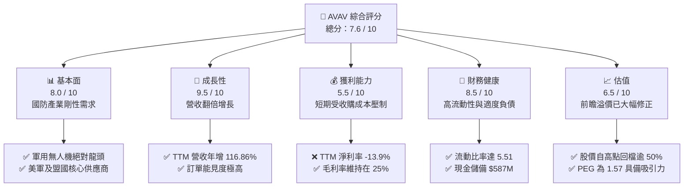
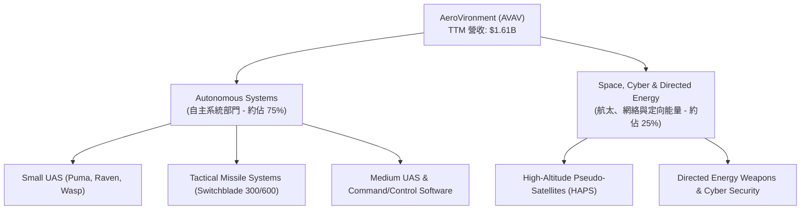
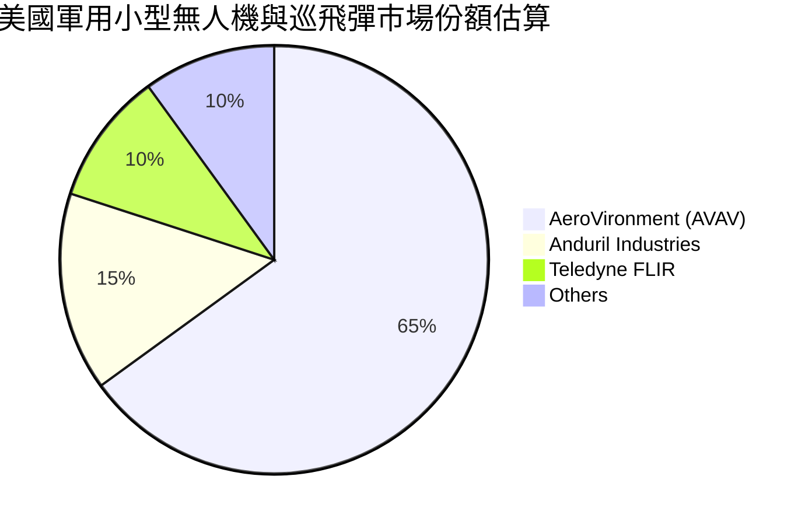
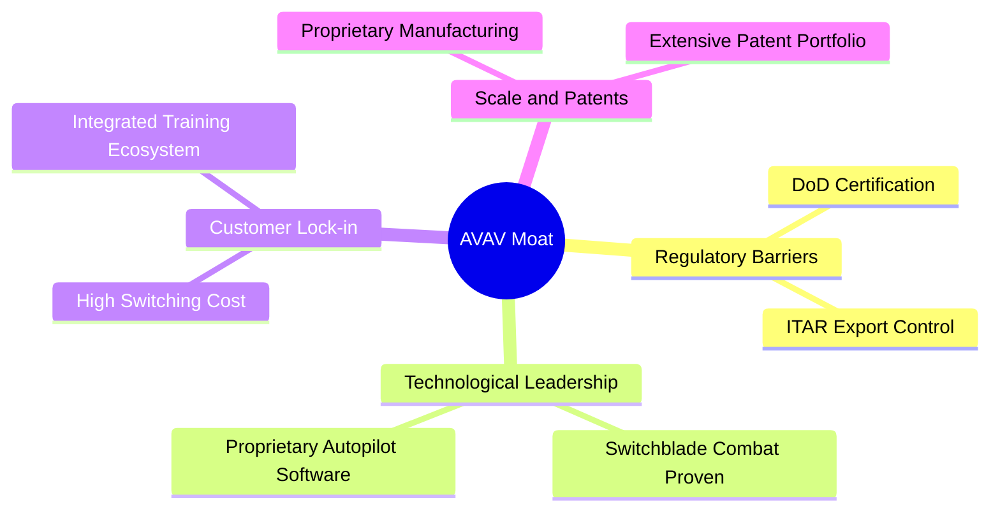

# AVAV 基本面深度分析報告

> **報告日期**：2026-06-07 ｜ **語言**：繁體中文 ｜ **數據來源**：Yahoo Finance, Finviz, StockAnalysis, Roic.ai ｜ **分析師**：CFA 級機構研究

---

## 目錄

| # | 章節 | 核心結論 |
|---|------|----------|
| 1 | [執行摘要](#1-執行摘要) | 評級：**買入 (Buy)** ｜ 目標價區間：**$235.00 - $450.00**（基準目標價：**$309.88**） |
| 2 | [公司概覽與商業模式](#2-公司概覽與商業模式) | 軍用無人機與巡飛彈龍頭，具備極高政治屏障與技術護城河。 |
| 3 | [損益表深度分析](#3-損益表深度分析) | 營收年增率高達 **116.86%**，短期淨利受收購相關無形資產攤銷壓制。 |
| 4 | [資產負債表分析](#4-資產負債表分析) | 發生重大資產重組，總資產暴增至 **$5.45B**，流動比率 **5.51** 保持極佳流動性。 |
| 5 | [現金流量深度分析](#5-現金流量深度分析) | 營運現金流與自由現金流因庫存與收購整合暫時承壓，但資本配置聚焦長線。 |
| 6 | [獲利能力與資本效率](#6-獲利能力與資本效率) | 經調整後的 EBITDA 依然強勁，杜邦分析顯示資產週轉率與槓桿發生結構性轉變。 |
| 7 | [估值深度分析](#7-估值深度分析) | 前瞻 P/E 為 **46.10x**，相較於歷史高點與同業，估值已修正至具吸引力區間。 |
| 8 | [成長催化劑](#8-成長催化劑) | 美國國防部大宗採購合約（如 LASSO 計劃）與國際地緣政治衝突帶來的急單。 |
| 9 | [風險矩陣](#9-風險矩陣) | 國防預算撥款延遲、收購整合不力以及供應鏈瓶頸為主要風險。 |
| 10 | [投資建議](#10-投資建議) | 建議於當前股價（約 **$185.92**）分批佈局，長線回報潛力大。 |

---

## 1. 執行摘要

### 1.1 核心評分儀表板



### 1.2 評分進度條視覺化

```
╔══════════════════════════════════════════════════════════════╗
║               AVAV 多維度評分儀表板 (1-10分)                 ║
╠══════════════════════════════════════════════════════════════╣
║ 基本面強度  8.0 ▓▓▓▓▓▓▓▓▓▓▓▓▓▓▓▓░░░░  ★★★★☆           ║
║ 成長動能    9.5 ▓▓▓▓▓▓▓▓▓▓▓▓▓▓▓▓▓▓▓░  ★★★★★           ║
║ 獲利品質    5.5 ▓▓▓▓▓▓▓▓▓▓▓░░░░░░░░░  ★★★☆☆           ║
║ 財務健康    8.5 ▓▓▓▓▓▓▓▓▓▓▓▓▓▓▓▓▓░░░  ★★★★☆           ║
║ 估值合理性  6.5 ▓▓▓▓▓▓▓▓▓▓▓▓░░░░░░░░  ★★★☆☆           ║
║ 護城河深度  9.0 ▓▓▓▓▓▓▓▓▓▓▓▓▓▓▓▓▓▓░░  ★★★★☆           ║
║ 管理層執行  7.5 ▓▓▓▓▓▓▓▓▓▓▓▓▓▓░░░░░░  ★★★★☆           ║
║ 技術創新力  9.0 ▓▓▓▓▓▓▓▓▓▓▓▓▓▓▓▓▓▓░░  ★★★★☆           ║
╠══════════════════════════════════════════════════════════════╣
║ 綜合總分    7.6 ▓▓▓▓▓▓▓▓▓▓▓▓▓▓▓░░░░░  🏆 成長型優質標的     ║
╚══════════════════════════════════════════════════════════════╝
```

### 1.3 五大投資論點 + 三大核心風險

| 類型 | 項目 | 具體依據 | 信心度 |
|------|------|----------|--------|
| 🟢 **投資論點①** | **地緣政治驅動爆發性成長** | 俄烏衝突與中東局勢使無人機與巡飛彈（如 Switchblade）需求暴增，TTM 營收達 $1.61B（YoY +116.86%）。 | 🟢 極高 |
| 🟢 **投資論點②** | **重大戰略收購擴大版圖** | 資產負債表顯示商譽與無形資產大幅增加，顯示公司進行了關鍵性技術收購，切入太空與定向能量等高壁壘領域。 | 🟢 高 |
| 🟢 **投資論點③** | **美軍 LASSO 專案核心受益者** | 作為美國陸軍「低成本巡飛彈系統」（LASSO）的主要供應商，確保了未來數年的訂單能見度。 | 🟢 極高 |
| 🟢 **投資論點④** | **極高的流動性安全邊際** | 流動比率高達 5.51，速動比率 4.40，擁有 $587.14M 的現金與短期投資，短期無任何償債風險。 | 🟢 極高 |
| 🟢 **投資論點⑤** | **估值已修正至合理區間** | 股價自 52 週高點 $417.86 回落至 $185.92（跌幅達 55.5%），前瞻 P/E 降至 46.10x，PEG 僅 1.57。 | 🟢 高 |
| 🟡 **風險①** | **收購整合與無形資產減損** | 商譽高達 $2.46B，未來若被收購主體未能實現預期獲利，將面臨巨大的商譽減損風險。 | 🟡 中度 |
| 🔴 **風險②** | **短期淨利與現金流承壓** | TTM 淨利為 -$224.36M，自由現金流為 -$304.05M，主要受收購相關費用及營運資金佔用影響。 | 🔴 高衝擊 |
| 🟡 **風險③** | **國防預算撥款與政策不確定性** | 營收高度依賴美國政府合約，若國防預算撥款延遲或政策轉向，將直接影響季度營收表現。 | 🟡 中度 |

### 1.4 快速統計卡片

| 指標 | 公司實際值 | 行業均值 (航太與國防) | S&P 500 均值 | 狀態 |
|------|-------------|----------------------|--------------|------|
| **收入 YoY 成長** | **116.86% (TTM)** | ~8.5% | ~5.5% | 🟢 極強 |
| **毛利率** | **25.0% (TTM)** | ~22.0% | ~30.0% | 🟢 優於同業 |
| **淨利率** | **-13.9% (TTM)** | ~6.2% | ~11.5% | 🔴 短期承壓 |
| **流動比率** | **5.51** | ~1.40 | ~1.20 | 🟢 極其安全 |
| **Forward P/E** | **46.10x** | ~24.5x | ~21.0x | 🟡 溢價交易 |
| **市值** | **$9.41B** | 中型股 | 大型股 | 🟡 成長中 |

### 1.5 投資結論

```
╔══════════════════════════════════════════════════════════════════╗
║                    📊 AVAV 投資結論摘要                          ║
╠══════════════════════════════════════════════════════════════════╣
║  評級：🟢 買入 (Buy) - 適合長線成長型投資人                       ║
║  當前股價：$185.92 (2026-06-07)                                  ║
║  目標價區間：                                                    ║
║    悲觀情境：$150.00 (-19.3%) - 估值進一步修正，收購整合不佳     ║
║    基準情境：$309.88 (+66.7%) - 12個月主要目標，獲利重回正軌     ║
║    樂觀情境：$450.00 (+142.0%) - 國際大單落地，盈餘超預期爆發     ║
║  投資評分：7.6 / 10                                              ║
║  適合投資人：追求地緣政治紅利、能承受高波動之成長型投資人        ║
╚══════════════════════════════════════════════════════════════════╝
```

---

## 2. 公司概覽與商業模式

AeroVironment, Inc. (AVAV) 是全球無人機系統（UAS）與巡飛彈（Loitering Munitions）的技術先驅與市場領導者。

### 2.1 業務結構與收入來源



### 2.2 市場份額

在美國軍用小型無人機（Small UAS）與巡飛彈市場中，AVAV 佔據絕對主導地位：



### 2.3 競爭護城河分析



### 2.4 護城河強度評分

```
╔══════════════════════════════════════════════════════════════╗
║                   AVAV 護城河強度評分                        ║
╠══════════════════════════════════════════════════════════════╣
║ 政策與准入壁壘 9.5/10  ▓▓▓▓▓▓▓▓▓▓▓▓▓▓▓▓▓▓▓░  🏆 軍工資質極高 ║
║ 技術專利壁壘   9.0/10  ▓▓▓▓▓▓▓▓▓▓▓▓▓▓▓▓▓▓░░  🟢 巡飛彈先驅   ║
║ 客戶鎖定效應   8.5/10  ▓▓▓▓▓▓▓▓▓▓▓▓▓▓▓▓▓░░░  🟢 美軍高黏性   ║
║ 規模與生產效應 7.5/10  ▓▓▓▓▓▓▓▓▓▓▓▓▓▓░░░░░░  🟡 產能擴張中   ║
╠══════════════════════════════════════════════════════════════╣
║ 綜合護城河強度 8.6/10  ▓▓▓▓▓▓▓▓▓▓▓▓▓▓▓▓▓░░░  🏆 具備寬廣護城河║
╚══════════════════════════════════════════════════════════════╝
```

---

## 3. 損益表深度分析

### 3.1 年度收入成長趨勢

AVAV 近年來營收呈現爆發式增長，特別是在 TTM 期間，營收近乎翻倍，這主要得益於地緣政治緊張局勢下各國對無人機與巡飛彈的急迫需求，以及重大併購帶來的業務併表。

```
╔══════════════════════════════════════════════════════════════════╗
║                 AVAV 年度收入趨勢 (FY2021-TTM)                   ║
╠══════════════════════════════════════════════════════════════════╣
║                                                                  ║
║  FY2021  $394.91M  █████░░░░░░░░░░░░░░░░░░░░░  YoY: +7.5%        ║
║  FY2022  $445.73M  ██████░░░░░░░░░░░░░░░░░░░░  YoY: +12.9%       ║
║  FY2023  $540.54M  ███████░░░░░░░░░░░░░░░░░░░  YoY: +21.3%       ║
║  FY2024  $716.72M  ██████████░░░░░░░░░░░░░░░░  YoY: +32.6%       ║
║  FY2025  $820.63M  ████████████░░░░░░░░░░░░░░  YoY: +14.5%       ║
║  TTM     $1,610.0M ██████████████████████████  YoY: +116.9%  🟢  ║
║                                                                  ║
║  📊 5年年複合成長率 (CAGR)：+32.4%                               ║
╚══════════════════════════════════════════════════════════════════╝
```

### 3.2 季度收入趨勢分析

| 財報季度 | 營收 (百萬美元) | YoY 成長率 | QoQ 成長率 | 備註說明 |
|----------|-----------------|------------|------------|----------|
| **Q1 2026** | $454.68 | +139.96% | +65.31% | 地緣政治合約集中交付，營收創歷史單季