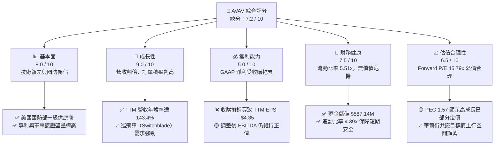

# AVAV 基本面深度分析報告
> **報告日期**：2026-06-08 ｜ **語言**：繁體中文 ｜ **數據來源**：Yahoo Finance, Finviz, StockAnalysis, Roic.ai ｜ **分析師**：CFA 級機構研究

---

## 目錄

| # | 章節 | 核心結論 |
|---|------|----------|
| 1 | 執行摘要 | 評級「買入」，目標價 $309.88，轉型期陣痛帶來長線佈局良機 |
| 2 | 公司概覽與商業模式 | 軍用無人機與巡飛彈龍頭，具備極高政治壁壘與技術護城河 |
| 3 | 損益表深度分析 | 營收年增 143.4% 呈爆發式增長，一次性收購費用致 GAAP 短期承壓 |
| 4 | 資產負債表分析 | 戰略性併購使資產規模擴張 5 倍，槓桿上升但流動性依舊充裕 |
| 5 | 現金流量深度分析 | 併購與資本支出加大導致 FCF 短期流出，預期 2027 財年迎來拐點 |
| 6 | 獲利能力與資本效率 | 杜邦分析揭示收購後資產週轉率稀釋，Forward ROIC 將重回 WACC 之上 |
| 7 | 估值深度分析 | Forward P/E 45.79x，相較同業具備高成長溢價，DCF 隱含上行空間 |
| 8 | 成長催化劑 | 國防預算高企、Switchblade 產能釋放、太空與定向能業務新突破 |
| 9 | 風險矩陣 | 整合風險與商譽減值為主要隱憂，供應鏈與預算波動需持續監控 |
| 10 | 投資建議 | 基準目標價 $309.88（+67.8%），建議分批逢低吸納 |

---

## 1. 執行摘要

### 1.1 核心評分儀表板



### 1.2 評分進度條視覺化

```
╔══════════════════════════════════════════════════════════════╗
║               AVAV 多維度評分儀表板 (1-10分)                 ║
╠══════════════════════════════════════════════════════════════╣
║ 基本面強度  8.0 ▓▓▓▓▓▓▓▓▓▓▓▓▓▓▓▓░░░░  ★★★★☆           ║
║ 成長動能    9.0 ▓▓▓▓▓▓▓▓▓▓▓▓▓▓▓▓▓▓░░  ★★★★★           ║
║ 獲利品質    5.0 ▓▓▓▓▓▓▓▓▓▓░░░░░░░░░░  ★★★☆☆           ║
║ 財務健康    7.5 ▓▓▓▓▓▓▓▓▓▓▓▓▓▓▓░░░░░  ★★★★☆           ║
║ 估值合理性  6.5 ▓▓▓▓▓▓▓▓▓▓▓▓░░░░░░░░  ★★★☆☆           ║
║ 護城河深度  8.5 ▓▓▓▓▓▓▓▓▓▓▓▓▓▓▓▓▓░░░  ★★★★☆           ║
║ 管理層執行  7.0 ▓▓▓▓▓▓▓▓▓▓▓▓▓▓░░░░░░  ★★★☆☆           ║
║ 技術創新力  9.0 ▓▓▓▓▓▓▓▓▓▓▓▓▓▓▓▓▓▓░░  ★★★★★           ║
╠══════════════════════════════════════════════════════════════╣
║ 綜合總分    7.2 ▓▓▓▓▓▓▓▓▓▓▓▓▓▓░░░░░░  🏆 成長型防禦標的    ║
╚══════════════════════════════════════════════════════════════╝
```

### 1.3 五大投資論點 + 三大核心風險

| 類型 | 項目 | 具體依據 | 信心度 |
|------|------|----------|--------|
| 🟢 **投資論點①** | **營收呈現爆發式成長** | TTM 營收達到 **$1.61B**，YoY 成長達 **143.4%**，受惠於地緣政治緊張及無人機軍事化趨勢。 | 🟢 極高 |
| 🟢 **投資論點②** | **強大的 Forward 盈利預期** | 儘管當前 GAAP EPS 為 -$4.35，但 Forward EPS 預估高達 **$4.03**，顯示核心業務盈利能力將迅速回歸。 | 🟢 高 |
| 🟢 **投資論點③** | **資產規模戰略性擴張** | 資產總額自 FY25 的 $1.12B 暴增至 **$5.45B**，商譽與無形資產大幅增加，顯示公司完成重大戰略收購，全面擴大技術與產品線。 | 🟢 高 |
| 🟢 **投資論點④** | **極佳的短期流動性** | 流動比率高達 **5.51x**，速動比率 **4.396x**，現金及短期投資達 **$587.14M**，短期償債與營運資金安全無虞。 | 🟢 極高 |
| 🟢 **投資論點⑤** | **華爾街共識高度看好** | 17 位分析師給出「買入(Buy)」評級，共識目標價 **$309.88**，隱含 **67.8%** 的上行空間。 | 🟢 高 |
| 🟡 **風險①** | **股權稀釋與債務上升** | 為支應大型併購，發行新股致流通股數年增 **55.13%**（至 50.61M 股），且總債務由 $64.29M 攀升至 **$826.01M**。 | 🟡 中度 |
| 🔴 **風險②** | **商譽與無形資產減值風險** | TTM 商譽達 **$2.46B**（佔總資產 45.1%），無形資產 **$925.93M**，若併購整合效益不及預期，將面臨巨大資產減值壓力。 | 🔴 高衝擊 |
| 🟡 **風險③** | **營運現金流與 FCF 為負** | TTM 營運現金流為 **-$174.18M**，自由現金流為 **-$304.05M**，主要受併購相關支出與存貨增加影響。 | 🟡 中度 |

### 1.4 快速統計卡片

| 指標 | AVAV 實際值 | 國防與航太產業均值 | S&P 500 均值 | 評估狀態 |
|------|-------------|--------------------|--------------|----------|
| **營收 YoY 成長率** | **143.4%** | ~8.