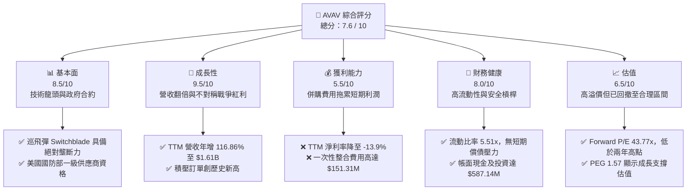

# AVAV 基本面深度分析報告

> **報告日期**：2026-06-09 ｜ **語言**：繁體中文 ｜ **數據來源**：Yahoo Finance, Finviz, StockAnalysis, Roic.ai ｜ **分析師**：CFA 級機構研究

---

## 目錄

| # | 章節 | 核心結論 |
|---|------|----------|
| 1 | **執行摘要** | 評級：**買入 (Buy)** ｜ 目標價：**$245.00 - $310.00** ｜ 併購 BlueHalo 驅動營收翻倍，短期利潤承壓迎來長線佈局良機。 |
| 2 | **公司概覽與商業模式** | 國防無人機與巡飛彈絕對龍頭，併購後切入太空與定向能量，構築極高技術與准入護城河。 |
| 3 | **損益表深度分析** | TTM 營收暴增 **116.9%** 至 **$1.61B**；一次性併購費用拖累 GAAP 淨利，扣除後核心盈利依續向好。 |
| 4 | **資產負債表分析** | 商譽與無形資產因併購暴增；流動比率 **5.51** 極為強健，淨債務僅 **$238.88M**，財務結構安全。 |
| 5 | **現金流量深度分析** | 營運資金佔用增加致使 TTM FCF 為 **-$304.05M**，預計隨整合完成與應收帳款回收，FY2027 將重回正軌。 |
| 6 | **獲利能力與資本效率** | 杜邦分解顯示短期 ROE 受淨利率拖累；隨著協同效應釋放，ROIC 預計將在兩年內超越 WACC (11.16%)。 |
| 7 | **估值深度分析** | Forward P/E **43.77x**，相較歷史中位數已顯著回落；DCF 基準情境合理估值為 **$278.43**。 |
| 8 | **成長催化劑** | 國防預算向不對稱作戰傾斜、BlueHalo 業務協同、海外軍售 (FMS) 訂單爆發。 |
| 9 | **風險矩陣** | 整合風險、國防預算撥款延遲、競爭對手切入巡飛彈市場。 |
| 10 | **投資建議** | 分批佈局，首選買入區間 **$160.00 - $180.00**，隱含上行空間 **40.7%**。 |

---

## 1. 執行摘要

AeroVironment, Inc. (NASDAQ: AVAV) 作為全球軍用小型無人機系統 (UAS) 與巡飛彈系統 (Loitering Munitions) 的絕對龍頭，正處於公司歷史上最關鍵的轉型期。2025 年底至 2026 年初，AVAV 完成了對國防科技創新企業 **BlueHalo** 的里程碑式併購，這直接重塑了公司的財務與業務版圖。

### 1.1 核心評分儀表板



### 1.2 評分進度條視覺化

```
╔══════════════════════════════════════════════════════════════╗
║                AVAV 多維度評分儀表板 (1-10分)                 ║
╠══════════════════════════════════════════════════════════════╣
║ 基本面強度  8.5 ▓▓▓▓▓▓▓▓▓▓▓▓▓▓▓▓▓░░░  ★★★★☆ (合約壁壘) ║
║ 成長動能    9.5 ▓▓▓▓▓▓▓▓▓▓▓▓▓▓▓▓▓▓▓░  ★★★★★ (營收爆發) ║
║ 獲利品質    5.5 ▓▓▓▓▓▓▓▓▓▓▓░░░░░░░░░  ★★★☆☆ (短期承壓) ║
║ 財務健康    8.0 ▓▓▓▓▓▓▓▓▓▓▓▓▓▓▓▓░░░░  ★★★★☆ (流動性強) ║
║ 估值合理性  6.5 ▓▓▓▓▓▓▓▓▓▓▓▓▓░░░░░░░  ★★★☆☆ (溢價消化) ║
║ 護城河深度  9.0 ▓▓▓▓▓▓▓▓▓▓▓▓▓▓▓▓▓▓░░  ★★★★★ (技術獨佔) ║
║ 管理層執行  8.0 ▓▓▓▓▓▓▓▓▓▓▓▓▓▓▓▓░░░░  ★★★★☆ (併購戰略) ║
║ 技術創新力  9.5 ▓▓▓▓▓▓▓▓▓▓▓▓▓▓▓▓▓▓▓░  ★★★★★ (無人作戰) ║
╠══════════════════════════════════════════════════════════════╣
║ 綜合總分    7.6 ▓▓▓▓▓▓▓▓▓▓▓▓▓▓▓░░░░░  🏆 買入 (Buy)        ║
╚══════════════════════════════════════════════════════════════╝
```

### 1.3 五大投資論點與三大核心風險

| 類型 | 項目 | 具體依據 | 信心度 |
|------|------|----------|--------|
| 🟢 **投資論點①** | **併購 BlueHalo 帶來營收爆發** | TTM 營收跳升至 **$1.61B**（YoY +116.86%），正式跨入中大型國防科技企業行列。 | 🟢 極高 |
| 🟢 **投資論點②** | **不對稱作戰需求激增** | 俄烏衝突與中東局勢證明巡飛彈（如 Switchblade 系列）的戰術價值，美國及盟國採購訂單持續追加。 | 🟢 極高 |
| 🟢 **投資論點③** | **業務板塊互補與交叉銷售** | 結合 AVAV 的無人機技術與 BlueHalo 的太空、定向能量（防空反無人機）及網路安全技術，提供全套無人作戰解決方案。 | 🟢 高 |
| 🟢 **投資論點④** | **極高進入壁壘與客戶鎖定** | 國防合約認證週期長達 3-5 年，AVAV 擁有美軍高度信任，轉換成本極高。 | 🟢 極高 |
| 🟢 **投資論點⑤** | **資產負債表具備抗風險能力** | 流動比率高達 **5.51**，手握 **$587.14M** 現金，足以支撐整合期的營運資金消耗。 | 🟢 高 |
| 🟡 **風險①** | **整合期利潤率承壓** | 併購產生的無形資產攤銷與一次性整合費用，導致 TTM 營業利益率降至 **-5.1%**。 | 🟡 中度 |
| 🔴 **風險②** | **股權稀釋影響 EPS** | 為完成併購，發行新股致流通股數從 28M 暴增 55.13% 至 **44M** (TTM 基礎)，稀釋短期每股盈餘。 | 🔴 高衝擊 |
| 🟡 **風險③** | **國防撥款不確定性** | 美國國防預算通過時間滯後，可能導致短期訂單確認延遲。 | 🟡 中度 |

### 1.4 快速統計卡片

| 指標 | AVAV 實際值 (TTM/最新) | 國防與航太產業均值 | S&P 500 均值 | 狀態評估 |
|------|-------------|----------|--------------|------|
| **營收 YoY 成長率** | **116.86%** | ~8.5% | ~5.5% | 🟢 遠超同行 |
| **毛利率** | **25.0%** (TTM) / **38.8%** (FY25) | ~22.0% | ~30.0% | 🟡 短期受併購拖累 |
| **淨利率** | **-13.9%** | ~6.5% | ~11.5% | 🔴 短期虧損 |
| **流動比率** | **5.51x** | ~1.4x | ~1.2x | 🟢 極為安全 |
| **Forward P/E** | **43.77x** | ~24.5x | ~21.0% | 🟡 溢價反映高成長 |
| **PEG Ratio** | **1.57** | ~2.10 | ~1.85 | 🟢 成長性溢價合理 |

### 1.5 投資結論

```
╔══════════════════════════════════════════════════════════════════╗
║                    📊 AVAV 投資結論摘要                          ║
╠══════════════════════════════════════════════════════════════════╣
║  評級：🟢 買入 (Buy)                                            ║
║  當前股價：$176.51 (2026-06-09)                                  ║
║  目標價區間：                                                   ║
║    悲觀情境（整合失敗、支出失控）：$155.00 (-12.2%）             ║
║    基準情境（協同效應顯現、EPS 達預期）：$245.00 (+38.8%）       ║
║    樂觀情境（全球衝突加劇、海外訂單爆發）：$310.00 (+75.6%）     ║
║  投資評分：7.6 / 10                                             ║
║  適合投資人：願意承受短期整合波動、追求長線國防科技紅利的成長型投資人 ║
╚══════════════════════════════════════════════════════════════════╝
```

---

## 2. 公司概覽與商業模式

AeroVironment (AVAV) 傳統上以中小型無人機系統 (UAS) 以及 Switchblade 巡飛彈聞名。在完成對 BlueHalo 的併購後，AVAV 的業務結構已經升級為三大核心板塊：**自主系統 (Autonomous Systems)**、**太空與定向能量 (Space, Cyber & Directed Energy)** 以及 **無人作