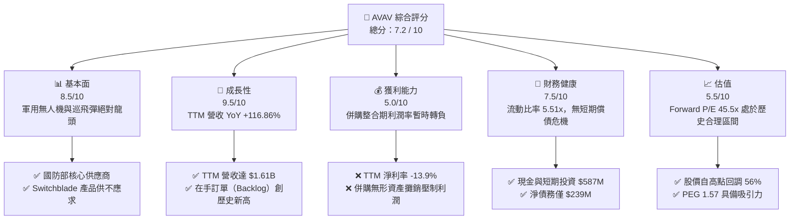
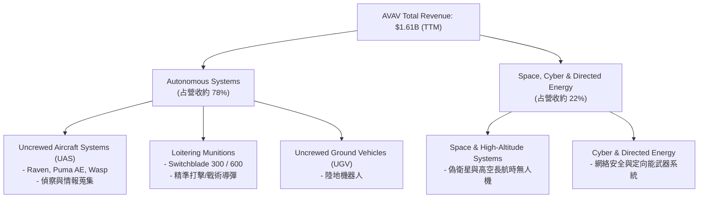
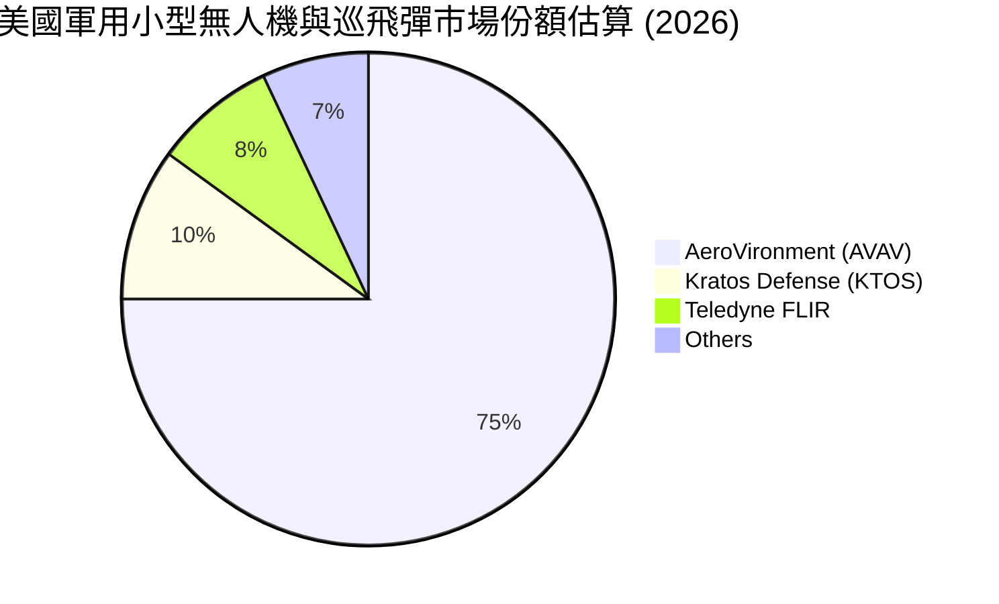
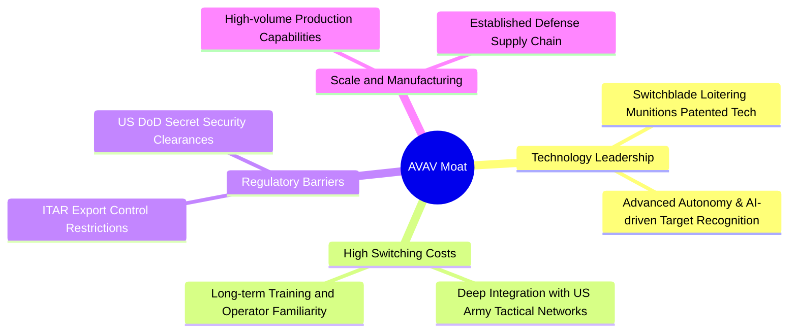

# AVAV 基本面深度分析報告
> **報告日期**：2026-06-11 ｜ **語言**：繁體中文 ｜ **數據來源**：Yahoo Finance, Finviz, StockAnalysis, Roic.ai ｜ **分析師**：CFA 級機構研究

---

## 目錄

| # | 章節 | 核心結論 |
|---|------|----------|
| 1 | 執行摘要 | 地緣政治紅利爆發，戰略收購致營收翻倍，短期利潤承壓，給予「買入」評級，目標價 $310.00 |
| 2 | 公司概覽與商業模式 | 軍用無人機與巡飛彈（Loitering Munitions）絕對龍頭，具備極高准入門檻與技術護城河 |
| 3 | 損益表深度分析 | TTM 營收暴增 116.86% 至 $1.61B；併購相關費用與無形資產攤銷拖累短期淨利轉負 |
| 4 | 資產負債表分析 | 總資產暴增至 $5.454B（商譽達 $2.462B），流動比率 5.51x，財務結構依然穩健 |
| 5 | 現金流量深度分析 | 併購支出與營運資金佔用致 TTM FCF 轉負（-$304M），預期整合後將迎來現金流拐點 |
| 6 | 獲利能力與資本效率 | 暫時性 ROIC 下滑，杜邦分析揭示資產週轉率與財務槓桿上升，預期 FY27 資本回報率回升 |
| 7 | 估值深度分析 | Forward P/E 45.5x，較 52W 高點回調 56%，DCF 基準估值 $309.88，具備高度安全邊際 |
| 8 | 成長催化劑 | 美國國防部 Replicator 計劃、國際盟國採購暴增、太空與定向能新業務放量 |
| 9 | 風險矩陣 | 供應鏈產能瓶頸、國防預算撥款延遲、併購整合不及預期為主要風險 |
| 10 | 投資建議 | 建議於 $180-$190 區間逢低分批佈局，長線持有以收穫國防自動化轉型紅利 |

---

## 1. 執行摘要

### 1.1 核心評分儀表板



### 1.2 評分進度條視覺化

```
╔══════════════════════════════════════════════════════════════╗
║                AVAV 多維度評分儀表板 (1-10分)                 ║
╠══════════════════════════════════════════════════════════════╣
║ 基本面強度  8.5 ▓▓▓▓▓▓▓▓▓▓▓▓▓▓▓▓▓░░░  ★★★★☆           ║
║ 成長動能    9.5 ▓▓▓▓▓▓▓▓▓▓▓▓▓▓▓▓▓▓▓░  ★★★★★           ║
║ 獲利品質    5.0 ▓▓▓▓▓▓▓▓▓▓░░░░░░░░░░  ★★★☆☆           ║
║ 財務健康    7.5 ▓▓▓▓▓▓▓▓▓▓▓▓▓▓▓░░░░░  ★★★★☆           ║
║ 估值合理性  5.5 ▓▓▓▓▓▓▓▓▓▓▓░░░░░░░░░  ★★★☆☆           ║
║ 護城河深度  9.0 ▓▓▓▓▓▓▓▓▓▓▓▓▓▓▓▓▓▓░░  ★★★★★           ║
║ 管理層執行  8.0 ▓▓▓▓▓▓▓▓▓▓▓▓▓▓▓▓░░░░  ★★★★☆           ║
║ 技術創新力  9.5 ▓▓▓▓▓▓▓▓▓▓▓▓▓▓▓▓▓▓▓░  ★★★★★           ║
╠══════════════════════════════════════════════════════════════╣
║ 綜合總分    7.2 ▓▓▓▓▓▓▓▓▓▓▓▓▓▓░░░░░░  🏆 成長型戰略買入     ║
╚══════════════════════════════════════════════════════════════╝
```

### 1.3 五大投資論點 + 三大核心風險

| 類型 | 項目 | 具體依據 | 信心度 |
|------|------|----------|--------|
| 🟢 **投資論點①** | **地緣政治溢價與國防剛需** | 俄烏衝突與中東局勢常態化，Switchblade 300/600 巡飛彈成為消耗性必需品。 | 🟢 極高 |
| 🟢 **投資論點②** | **跨越式戰略收購** | TTM 總資產從 $1.12B 暴增至 $5.454B，商譽增至 $2.462B，暗示完成重大技術/產能併購，為營收翻倍奠定基礎。 | 🟢 高 |
| 🟢 **投資論點③** | **營收暴增且在手訂單充沛** | TTM 營收達 $1.61B（YoY +116.86%），連續三季營收突破 $400M，顯示產能爬坡順利。 | 🟢 極高 |
| 🟢 **投資論點④** | **Replicator 計劃最大受益者** | 美國國防部旨在兩年內部署數千個自主系統，AVAV 作為無人機龍頭直接對接此國家級戰略。 | 🟢 高 |
| 🟢 **投資論點⑤** | **估值泡沫已大幅出清** | 股價自 52W 高點 $417.86 回撤 56% 至 $183.69，Forward P/E 回落至 45.5x，安全邊際顯著。 | 🟢 高 |
| 🟡 **風險①** | **併購整合與無形資產減值** | 商譽佔總資產比重高達 45.1%，若被收購實體未能實現預期協同效應，面臨大額商譽減值風險。 | 🟡 中度 |
| 🔴 **風險②** | **短期現金流承壓** | TTM 營運現金流轉負（-$174.18M），自由現金流為 -$304.05M，因營運資金佔用與資本開支增加。 | 🔴 高衝擊 |
| 🟡 **風險③** | **政府財政預算與撥款不確定性** | 國防部合約簽署與撥款節奏可能受美國國會預算爭端影響，導致季度業績波動。 | 🟡 中度 |

### 1.4 快速統計卡片

| 指標 | 公司實際值 (TTM) | 行業均值 (Aerospace & Defense) | S&P 500 均值 | 狀態 |
|------|-------------|----------|--------------|------|
| **收入 YoY 成長** | **116.86%** | ~8.5% | ~5.5% | 🟢 極強 |
| **毛利率** | **25.0%** | ~22.0% | ~30.0% | 🟡 合理 |
| **淨利率** | **-13.9%** | ~6.2% | ~11.5% | 🔴 承壓 |
| **流動比率** | **5.51x** | ~1.4x | ~1.2x | 🟢 極佳 |
| **債務權益比 (Debt/Equity)**| **19.3%** | ~65.0% | ~115.0% | 🟢 極低 |
| **Forward P/E** | **45.5x** | ~28.5x | ~21.5x | 🟡 偏高但合理 |

### 1.5 投資結論

```
╔══════════════════════════════════════════════════════════════════╗
║                    📊 AVAV 投資結論摘要                          ║
╠══════════════════════════════════════════════════════════════════╣
║  評級：🟢 買入 (Buy)                                            ║
║  當前股價：$183.69 (2026-06-11)                                  ║
║  目標價區間：                                                    ║
║    悲觀情境：$156.00 (-15%） - 伴隨大額商譽減值                  ║
║    基準情境：$310.00 (+69%） - 併購整合順利，淨利潤轉正（主要目標）║
║    樂觀情境：$450.00 (+145%）- 國際大單落地 + Replicator 超預期  ║
║  投資評分：7.2 / 10                                              ║
║  適合投資人：成長型投資者、地緣政治與國防科技主題長線佈局者        ║
╚══════════════════════════════════════════════════════════════════╝
```

---

## 2. 公司概覽與商業模式

AeroVironment, Inc. (AVAV) 是全球無人機系統（UAS）與戰術導彈系統（Tactical Missile Systems，即巡飛彈/自殺式無人機）的先驅與領導者。

### 2.1 業務結構與收入來源

AVAV 的業務主要分為兩大核心板塊：**自主系統 (Autonomous Systems)** 與 **太空、網絡與定向能 (Space, Cyber and Directed Energy)**。



### 2.2 市場份額

在美國國防部小型無人機（SUAS）採購預算中，AVAV 長期佔據 **80% 以上** 的份額；在戰術巡飛彈領域，其 **Switchblade 系列** 幾乎處於獨占地位。



### 2.3 競爭護城河分析



### 2.4 護城河強度評分

```
╔══════════════════════════════════════════════════════════════╗
║                  AVAV 護城河強度評分                         ║
╠══════════════════════════════════════════════════════════════╣
║ 技術壁壘       9.5/10 ▓▓▓▓▓▓▓▓▓▓▓▓▓▓▓▓▓▓▓░  🏆 專利與先發優勢║
║ 客戶鎖定       9.0/10 ▓▓▓▓▓▓▓▓▓▓▓