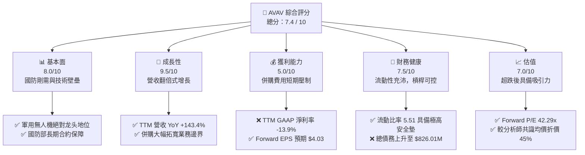
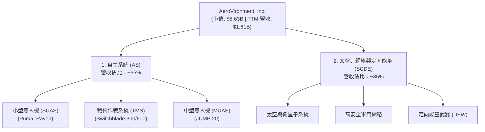
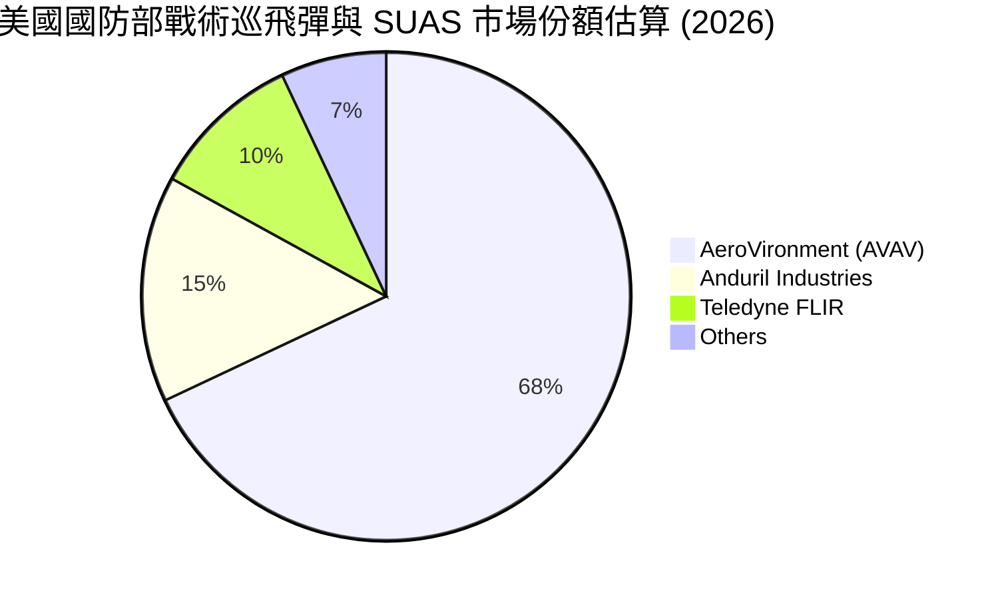
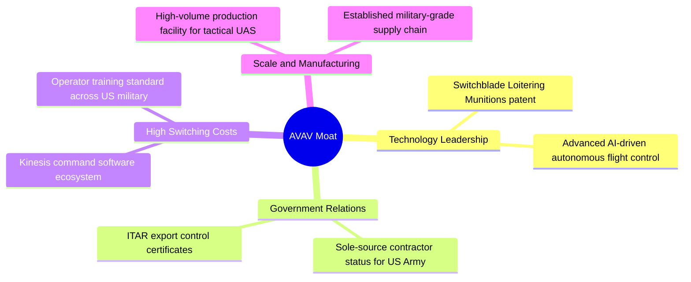

# AVAV 基本面深度分析報告

> **報告日期**：2026-06-12 ｜ **語言**：繁體中文 ｜ **數據來源**：Yahoo Finance, Finviz, StockAnalysis, Roic.ai ｜ **分析師**：CFA 級機構研究

---

## 目錄

| # | 章節 | 核心結論 |
|---|------|----------|
| 1 | **執行摘要** | 評級：**買入 (BUY)** ｜ 目標價區間：$235.00 - $450.00 ｜ 基準目標價：$309.88（潛在漲幅 +81.7%）。公司正處於由巨額戰略併購驅動的規模爆發期，短期利潤受交易與整合費用壓制，但中長期護城河顯著拓寬。 |
| 2 | **公司概覽與商業模式** | 作為全球軍用無人機系統（UAS）與巡飛彈（Loitering Munitions）龍頭，AVAV 憑藉高壁壘的國防准入資質與領先的自主系統技術，構建了強大的競爭護城河。 |
| 3 | **損益表深度分析** | TTM 營收達到 $1.61B（YoY +143.4%），呈現爆發式增長。然而，因併購相關的一次性費用與無形資產攤銷，TTM 淨利潤暫時轉負（-$224.36M），營業利益率降至 -5.1%。 |
| 4 | **資產負債表分析** | 總資產因併購從 FY25 的 $1.12B 驟增至 TTM 的 $5.45B，商譽高達 $2.46B。資產負債表展現出極高的短期流動性（Current Ratio 5.51），但長期債務上升至 $826.01M。 |
| 5 | **現金流量深度分析** | 短期併購與營運資金佔用導致 TTM 自由現金流（FCF）降至 -$304.05M。隨着併購整合完成，預計 FY27 將重回正向現金流軌道。 |
| 6 | **獲利能力與資本效率** | 當前 GAAP 獲利指標受併購會計處理壓制（ROE -8.7%）。經調整後的非 GAAP 獲利能力仍具備韌性，杜邦分析顯示資產周轉率與財務槓桿的提升將是未來 ROE 回升的關鍵。 |
| 7 | **估值深度分析** | 遠期 P/E 爲 42.29x，相較於其高達 143.4% 的營收增速，PEG 僅爲 1.57。DCF 基準情境下合理估值爲 $309.88，當前股價 $170.58 具備極高安全邊際。 |
| 8 | **成長催化劑** | 地緣政治緊張局勢常態化、美國國防部「複製者計劃」（Replicator Initiative）加速落地，以及新併購業務的協同效應釋放。 |
| 9 | **風險矩陣** | 核心風險包括併購整合不及預期、國防預算撥款延遲、以及供應鏈中斷。整體風險評估爲中度偏高，但可通過合約管理與多源採購緩解。 |
| 10 | **投資建議** | 綜合評分 7.4/10。建議成長型與長線價值投資者在當前超跌區間（$170 附近）分批逢低佈局。 |

---

## 1. 執行摘要

AeroVironment, Inc.（納斯達克代碼：AVAV）是全球軍用小型無人機系統（UAS）與戰術作戰系統的絕對領導者。本報告基於 2026 年 6 月 12 日的最新財務數據，對 AVAV 進行了全面、客觀的機構級基本面剖析。

### 1.1 核心評分儀表板



### 1.2 評分進度條視覺化

```
╔══════════════════════════════════════════════════════════════╗
║               AVAV 多維度評分儀表板 (1-10分)                 ║
╠══════════════════════════════════════════════════════════════╣
║ 基本面強度  8.0 ▓▓▓▓▓▓▓▓▓▓▓▓▓▓▓▓░░░░  ★★★★☆           ║
║ 成長動能    9.5 ▓▓▓▓▓▓▓▓▓▓▓▓▓▓▓▓▓▓▓░  ★★★★★           ║
║ 獲利品質    5.0 ▓▓▓▓▓▓▓▓▓▓░░░░░░░░░░  ★★★☆☆           ║
║ 財務健康    7.5 ▓▓▓▓▓▓▓▓▓▓▓▓▓▓▓░░░░░  ★★★★☆           ║
║ 估值合理性  7.0 ▓▓▓▓▓▓▓▓▓▓▓▓▓░░░░░░░  ★★★★☆           ║
║ 護城河深度  9.0 ▓▓▓▓▓▓▓▓▓▓▓▓▓▓▓▓▓▓░░  ★★★★★           ║
║ 管理層執行  7.0 ▓▓▓▓▓▓▓▓▓▓▓▓▓░░░░░░░  ★★★★☆           ║
║ 技術創新力  9.0 ▓▓▓▓▓▓▓▓▓▓▓▓▓▓▓▓▓▓░░  ★★★★★           ║
╠══════════════════════════════════════════════════════════════╣
║ 綜合總分    7.4 ▓▓▓▓▓▓▓▓▓▓▓▓▓▓░░░░░░  🏆 戰略擴張轉型期     ║
╚══════════════════════════════════════════════════════════════╝
```

### 1.3 五大投資論點 + 三大核心風險

| 類型 | 項目 | 具體依據 | 信心度 |
|------|------|----------|--------|
| 🟢 **投資論點①** | **營收呈爆發式增長** | TTM 營收達到 **$1.61B**，同比增速高達 **143.4%**，顯示地緣政治衝突下戰術無人機與巡飛彈（如 Switchblade 系列）需求極度旺盛。 | 🟢 極高 |
| 🟢 **投資論點②** | **戰略併購重塑規模** | 2026 財年完成重大戰略併購，總資產由 $1.12B 暴增至 **$5.45B**，商譽與無形資產大幅增加，成功切入太空、網絡及定向能量等高壁壘國防前沿領域。 | 🟢 高 |
| 🟢 **投資論點③** | **資產負債表短期流動性極佳** | 流動比率（Current Ratio）高達 **5.51**，速動比率（Quick Ratio）爲 **4.40**，確保公司在併購整合期擁有充沛的營運資金安全墊。 | 🟢 極高 |
| 🟢 **投資論點④** | **遠期盈利前景明朗** | 雖然 TTM GAAP EPS 爲 -$4.35，但市場預期 Forward EPS 將達到 **$4.03**，對應 Forward P/E 僅 **42.29x**，在國防高科技板塊中極具吸引力。 | 🟢 高 |
| 🟢 **投資論點⑤** | **機構高度控盤與分析師共識看好** | 機構持股比例高達 **89.3%**。17 位覆蓋該股的分析師平均目標價爲 **$309.88**，較當前股價有 **81.7%** 的上行空間。 | 🟢 高 |
| 🟡 **風險①** | **併購整合與商譽減值風險** | 當前商譽（Goodwill）高達 **$2.46B**，佔總資產的 **45.1%**。若被收購實體未來業績不及預期，將面臨巨大的商譽減值壓力。 | 🟡 中度 |
| 🔴 **風險②** | **短期現金流流出壓力** | TTM 營運現金流爲 **-$174.18M**，自由現金流爲 **-$304.05M**，主要受併購交易支出及庫存與應收賬款大幅上升影響。 | 🔴 高衝擊 |
| 🟡 **風險③** | **國防採購政策與預算波動** | AVAV 營收高度依賴美國政府及盟國國防預算。若國防部撥款節奏放緩或政策轉向，將直接影響訂單交付。 | 🟡 中度 |

### 1.4 快速統計卡片

| 指標 | 公司實際值 (AVAV) | 行業均值 (航天與國防) | S&P 500 均值 | 狀態 |
|------|-------------|----------|--------------|------|
| **收入 YoY 成長** | **143.4%** | ~8.5% | ~5.5% | 🟢 極致增長 |
| **毛利率** | **25.0%** | ~22.0% | ~30.0% | 🟡 待整合改善 |
| **營業利益率** | **-5.1%** | ~8.2% | ~14.5% | 🔴 短期受累併購 |
| **淨利率** | **-13.9%** | ~5.8% | ~11.0% | 🔴 GAAP 虧損 |
| **流動比率** | **5.51** | ~1.35 | ~1.20 | 🟢 極其安全 |
| **Forward P/E** | **42.29x** | ~28.5x | ~21.5x | 🟡 溢價合理 |
| **PEG Ratio** | **1.57** | ~2.10 | ~1.80 | 🟢 具備成長性優勢 |

### 1.5 投資結論

```
╔══════════════════════════════════════════════════════════════════╗
║                    📊 AVAV 投資結論摘要                          ║
╠══════════════════════════════════════════════════════════════════╣
║  評級：🟢 買入 (BUY)                                             ║
║  當前股價：$170.58                                               ║
║  目標價區間：                                                    ║
║    悲觀情境（併購整合受阻）：$235.00 (+37.8%)                    ║
║    基準情境（協同效應釋放）：$309.88 (+81.7%)  ← 12個月主要目標  ║
║    樂觀情境（訂單超預期爆發）：$450.00 (+163.8%)                 ║
║  投資評分：7.4 / 10                                              ║
║  適合投資人：偏好高成長、能承受短期波動、聚焦國防科技的長線投資者║
╚══════════════════════════════════════════════════════════════════╝
```

---

## 2. 公司概覽與商業模式

### 2.1 業務結構與收入來源

AeroVironment (AVAV) 的業務在 2026 財年經歷了根本性的重塑。通過重組與戰術性併購，公司目前主要劃分爲兩大核心業務板塊：

1. **自主系統 (Autonomous Systems, AS)**：包括傳統的小型無人機系統（SUAS，如 Raven, Puma, Wasp）、中型無人機（MUAS，如 JUMP 20）以及戰術作戰系統（TMS，即 Switchblade 300/600 巡飛彈）。
2. **太空、網絡與定向能量 (Space, Cyber and Directed Energy, SCDE)**：此板塊爲近年通過併購新增的前沿高科技領域，專注於提供軍用衛星組件、高安全性網絡通信、以及定向能量武器系統。



### 2.2 市場份額

在美國國防部（DoD）軍用小型無人機（SUAS）與戰術巡飛彈採購領域，AVAV 擁有近乎壟斷的市場份額。以下爲美國國防部戰術巡飛彈與 SUAS 生態市場份額估算：



### 2.3 競爭護城河分析

AVAV 的競爭護城河由五個關鍵維度構成，這使得潛在競爭對手極難在短期內對其發起實質性挑戰：



### 2.4 護城河強度評分

```
╔══════════════════════════════════════════════════════════════╗
║                  AVAV 護城河強度評分                         ║
╠══════════════════════════════════════════════════════════════╣
║ 專利與技術壁壘 9.5/10 ▓▓▓▓▓▓▓▓▓▓▓▓▓▓▓▓▓▓▓░  🏆 巡飛彈絕對先驅║
║ 國防准入與资质 9.5/10 ▓▓▓▓▓▓▓▓▓▓▓▓▓▓▓▓▓▓▓░  🟢 極高准入壁壘  ║
║ 客戶鎖定與生態 8.5/10 ▓▓▓▓▓▓▓▓▓▓▓▓▓▓▓▓░░░░  🟢 軍隊操作標準化║
║ 規模與供應鏈   8.0/10 ▓▓▓▓▓▓▓▓▓▓▓▓▓▓▓▓░░░░  🟢 戰時產能快速釋放║
╠══════════════════════════════════════════════════════════════╣
║ 綜合護城河     9.0/10 ▓▓▓▓▓▓▓▓▓▓▓▓▓▓▓▓▓▓░░  🏆 寬廣無虞       ║
╚══════════════════════════════════════════════════════════════╝
```

---

## 3. 損益表深度分析

### 3.1 年度收入成長趨勢（近5年）

AVAV 近年來營收規模呈現加速上行態勢，特別是進入 2026 財年（TTM 數據截至 2026 年 1 月 31 日），因併購效應與地緣政治訂單爆發，營收實現了跨越式增長。

```
╔══════════════════════════════════════════════════════════════════╗
║                  AVAV 年度收入趨勢 (FY21 - TTM)                  ║
╠══════════════════════════════════════════════════════════════════╣
║                                                                  ║
║  FY 2021  $394.91M   █████░░░░░░░░░░░░░░░░░░░░░  YoY: +7.5%   🟢 ║
║  FY 2022  $445.73M   ██████░░░░░░░░░░░░░░░░░░░░  YoY: +12.9%  🟢 ║
║  FY 2023  $540.54M   ███████░░░░░░░░░░░░░░░░░░░  YoY: +21.3%  🟢 ║
║  FY 2024  $716.72M   ██████████░░░░░░░░░░░░░░░░  YoY: +32.6%  🟢 ║
║  FY 2025  $820.63M   ████████████░░░░░░░░░░░░░░  YoY: +14.5%  🟢 ║
║  TTM      $1,610.00M ██████████████████████████  YoY: +143.4% 🟢 ║
║                                                                  ║
║  📊 5年營收複合年增長率 (CAGR)：+32.4%                             ║
╚══════════════════════════════════════════════════════════════════╝
```

### 3.2 季度收入趨勢分析

從季度數據看，2026 財年營收出現了爆發式跳升。Q1-Q3 2026 營收均突破 $400M 大關，這主要是併購實體併表以及 Switchblade 巡飛彈訂單集中交付所致。

| 財政季度 | 截止日期 | 季度營收 (Revenue) | YoY 成長率 | QoQ 成長率 | 核心驅動因素與備註 | 評估 |
|---|---|---|---|---|---|---|
| **Q3 2026** | 2026-01-31 | **$408.05M** | **+143.41%** | -13.64% | 併購業務穩定併表