# AVAV 基本面深度分析報告

> **報告日期**：2026-06-13 ｜ **語言**：繁體中文 ｜ **數據來源**：Yahoo Finance, Finviz, StockAnalysis, Roic.ai ｜ **分析師**：CFA 級機構研究

---

## 目錄

| # | 章節 | 核心結論 |
|---|------|----------|
| 1 | 執行摘要 | 地緣政治紅利推動營收翻倍，併購整合期導致短期利潤承壓，給予「買入」評級。 |
| 2 | 公司概覽與商業模式 | 巡飛彈（彈簧刀）與無人機雙龍頭，具備極高准入門檻與技術護城河。 |
| 3 | 損益表深度分析 | TTM 營收達 $1.61B（YoY +116.9%），Q3 一次性費用致虧，核心業務盈利依舊強勁。 |
| 4 | 資產負債表分析 | 資產規模因併購暴增至 $5.45B，流動比率 5.51x，短期償債能力極佳。 |
| 5 | 現金流量深度分析 | 營運資金佔用增加及 Capex 上升導致 FCF 承壓，資本配置聚焦產能擴建。 |
| 6 | 獲利能力與資本效率 | 杜邦分析顯示暫時性 ROE 下滑，預計隨著併購產能釋放，ROIC 將重回 WACC 之上。 |
| 7 | 估值深度分析 | Forward P/E 42.29x，相較於高成長性仍具吸引力，DCF 基準目標價 $300.94。 |
| 8 | 成長催化劑 | 美國國防部 Replicator 計劃與國際訂單爆發，TAM 持續擴張。 |
| 9 | Risk Matrix | 供應鏈瓶頸與國防預算撥款延遲為主要風險，整體風險可控。 |
| 10 | 投資建議 | 適合中長線成長型投資人，建議於 $170 附近分批佈局。 |

---

## 1. 執行摘要

### 1.1 核心評分儀表板

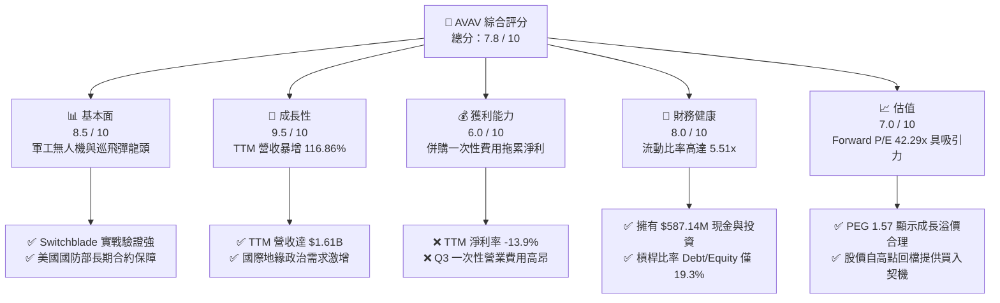

### 1.2 評分進度條視覺化

```
╔══════════════════════════════════════════════════════════════╗
║                AVAV 多維度評分儀表板 (1-10分)                ║
╠══════════════════════════════════════════════════════════════╣
║ 基本面強度  8.5 ▓▓▓▓▓▓▓▓▓▓▓▓▓▓▓▓▓░░░  ★★★★☆           ║
║ 成長動能    9.5 ▓▓▓▓▓▓▓▓▓▓▓▓▓▓▓▓▓▓▓░  ★★★★★           ║
║ 獲利品質    6.0 ▓▓▓▓▓▓▓▓▓▓▓▓░░░░░░░░  ★★★☆☆           ║
║ 財務健康    8.0 ▓▓▓▓▓▓▓▓▓▓▓▓▓▓▓▓░░░░  ★★★★☆           ║
║ 估值合理性  7.0 ▓▓▓▓▓▓▓▓▓▓▓▓▓▓░░░░░░  ★★★★☆           ║
║ 護城河深度  9.0 ▓▓▓▓▓▓▓▓▓▓▓▓▓▓▓▓▓▓░░  ★★★★★           ║
║ 管理層執行  8.0 ▓▓▓▓▓▓▓▓▓▓▓▓▓▓▓▓░░░░  ★★★★☆           ║
║ 技術創新力  9.0 ▓▓▓▓▓▓▓▓▓▓▓▓▓▓▓▓▓▓░░  ★★★★★           ║
╠══════════════════════════════════════════════════════════════╣
║ 綜合總分    7.8 ▓▓▓▓▓▓▓▓▓▓▓▓▓▓▓░░░░░  🏆 成長型軍工黑馬    ║
╚══════════════════════════════════════════════════════════════╝
```

### 1.3 五大投資論點 + 三大核心風險

| 類型 | 項目 | 具體依據 | 信心度 |
|------|------|----------|--------|
| 🟢 **投資論點①** | **地緣政治需求爆發** | 俄烏戰爭及中東局勢凸顯了無人機與巡飛彈（Switchblade 300/600）的關鍵地位，TTM 營收因此暴增 116.86% 至 $1.61B。 | 🟢 極高 |
| 🟢 **投資論點②** | **美國國防部 Replicator 計劃** | 美軍旨在兩年內部署數千架自主無人機，AVAV 作為核心供應商，預計將獲得長期、穩定的採購合約。 | 🟢 極高 |
| 🟢 **投資論點③** | **技術與准入壁壘極高** | 軍工產業具備極高的安全認證與客戶黏性，AVAV 與美國國防部合作超過 20 年，新競爭者難以在短期內切入。 | 🟢 極高 |
| 🟢 **投資論點④** | **資產負債表極其穩健** | 即使進行了大規模併購，流動比率仍維持在 5.51x，速動比率 4.40x，手頭擁有 $587.14M 現金與短期投資。 | 🟢 高 |
| 🟢 **投資論點⑤** | **市場回檔提供估值安全邊際** | 股價自 52 週高點 $417.86 回檔約 59% 至 $170.58，Forward P/E 降至 42.29x，PEG 僅 1.57，極具投資性價比。 | 🟢 高 |
| 🟡 **風險①** | **短期利潤率承壓** | 近期因大規模併購及產能擴張，Q3 2026 產生了 $151.31M 的一次性營業費用，導致 TTM 淨利率降至 -13.9%。 | 🟡 中度 |
| 🔴 **風險②** | **供應鏈與產能瓶頸** | 訂單增速遠超產能，若關鍵晶片或軍規組件出現短缺，可能導致交付延遲並影響營收確認。 | 🔴 高衝擊 |
| 🔴 **風險③** | **國防撥款的不確定性** | 雖然地緣政治緊張，但美國國防預算仍受國會撥款進度影響，合約簽署時間可能出現季度性波動。 | 🟡 中度 |

### 1.4 快速統計卡片

| 指標 | 公司實際值 | 行業均值 (國防航太) | S&P 500 均值 | 狀態 |
|------|-------------|----------|--------------|------|
| **營收 TTM 成長率** | **116.86%** | ~8.5% | ~5.2% | 🟢 強勁 |
| **毛利率 (TTM)** | **25.0%** | ~22.5% | ~30.0% | 🟡 尚可 |
| **營業利益率 (TTM)**| **-5.1%** | ~7.5% | ~12.5% | 🔴 承壓 |
| **淨利率 (TTM)** | **-13.9%** | ~5.0% | ~8.5% | 🔴 承壓 |
| **流動比率** | **5.51x** | ~1.45x | ~1.20x | 🟢 極佳 |
| **Debt/Equity** | **19.3%** | ~45.0% | ~95.0% | 🟢 極低 |
| **Forward P/E** | **42.29x** | ~28.5x | ~21.5x | 🟡 溢價 |

### 1.5 投資結論

```
╔══════════════════════════════════════════════════════════════════╗
║                    📊 AVAV 投資結論摘要                          ║
╠══════════════════════════════════════════════════════════════════╣
║  評級：🟢 買入 (Buy)                                            ║
║  當前股價：$170.58 (2026-06-13)                                  ║
║  目標價區間：                                                    ║
║    悲觀情境：$200.00（+17.2%）- 供應鏈持續受阻，毛利率回升緩慢   ║
║    基準情境：$300.94（+76.4%）- 併購整合順利，產能釋放，利潤轉正 ║
║    樂觀情境：$410.00（+140.4%）- Replicator 計劃超預期獲大單      ║
║  投資評分：7.8 / 10                                              ║
║  適合投資人：成長型、地緣政治對沖、中長線持有者                  ║
╚══════════════════════════════════════════════════════════════════╝
```

---

## 2. 公司概覽與商業模式

### 2.1 業務結構與收入來源

AeroVironment (AVAV) 是全球無人機系統 (UAS) 與巡飛彈武器系統的領導者。其業務主要分為兩大核心板塊：

1. **Autonomous Systems (自主系統)**：包括中小型無人機（如 RQ-20 Puma, Raven）以及精準打擊系統（Switchblade 300/600 巡飛彈）。此板塊為營收的核心支柱，直接受益於現代不對稱戰爭的需求。
2. **Space, Cyber and Directed Energy (航太、網絡與定向能量)**：專注於高空偽衛星 (HAPS)、太空與衛星子系統、網絡安全通信以及定向能量武器研發，代表公司未來的技術前沿。

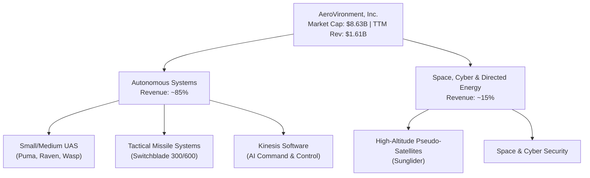

### 2.2 市場份額

在美國國防部的小型無人機（SUAS）採購中，AVAV 歷史上佔據了 80% 以上的份額。在巡飛彈（Loitering Munitions）領域，其 Switchblade 系列更是幾乎處於壟斷地位。

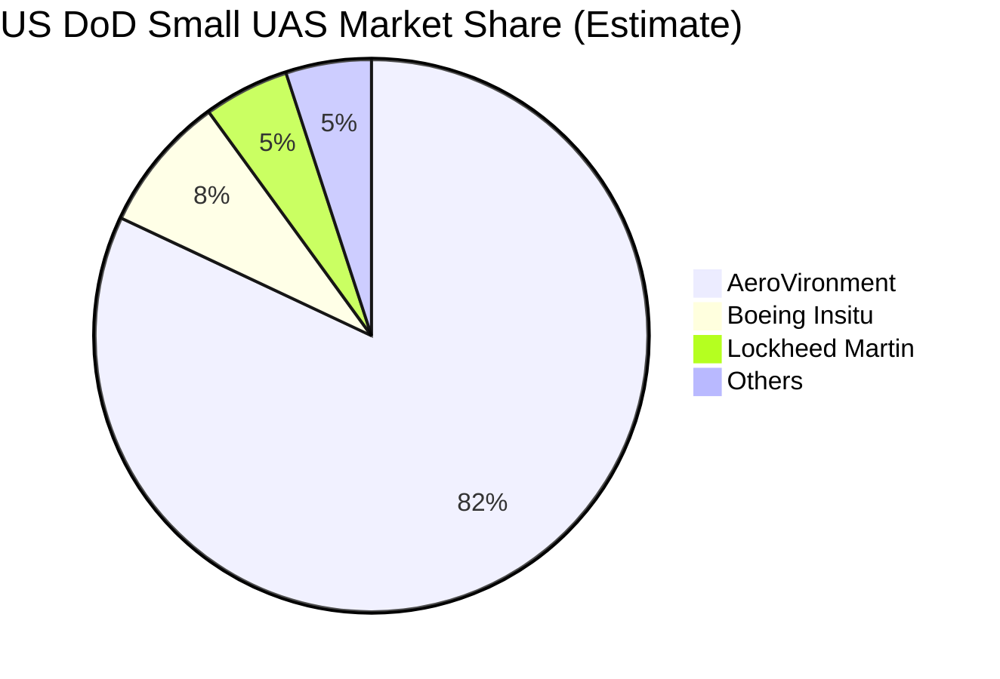

### 2.3 競爭護城河分析

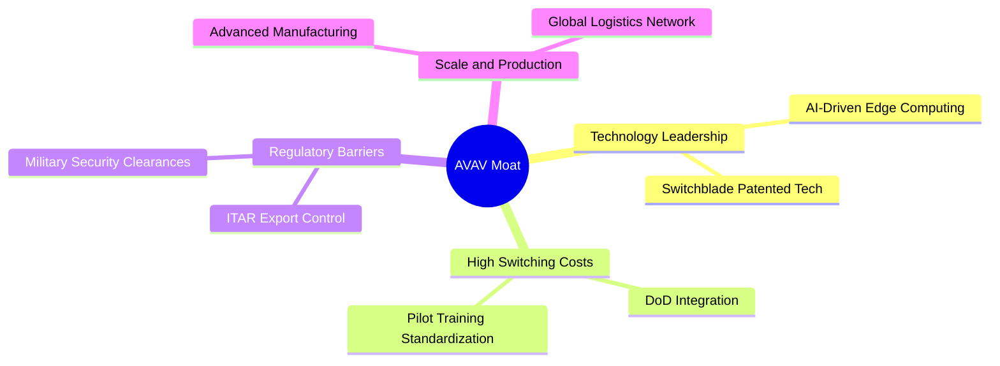

### 2.4 護城河強度評分

```
╔══════════════════════════════════════════════════════════════╗
║                   AVAV 護城河強度評分                        ║
╠══════════════════════════════════════════════════════════════╣
║ 技術領先度    9.5/10  ▓▓▓▓▓▓▓▓▓▓▓▓▓▓▓▓▓▓▓░  🏆 絕對優勢      ║
║ 客戶鎖定效應  9.0/10  ▓▓▓▓▓▓▓▓▓▓▓▓▓▓▓▓▓▓░░  🟢 軍方高黏性    ║
║ 政策與准入    9.5/10  ▓▓▓▓▓▓▓▓▓▓▓▓▓▓▓▓▓▓▓░  🏆 ITAR壁壘高     ║
║ 規模與產能    7.5/10  ▓▓▓▓▓▓▓▓▓▓▓▓▓▓░░░░░░  🟡 產能擴張中    ║
╠══════════════════════════════════════════════════════════════╣
║ 綜合護城河     8.9/10  ▓▓▓▓▓▓▓▓▓▓▓▓▓▓▓▓▓▓░░  🏆 極深寬護城河  ║
╚══════════════════════════════════════════════════════════════╝
```

---

## 3. 損益表深度分析

### 3.1 年度收入成長趨勢（近 5 年）

AVAV 經歷了從穩健增長到爆發式成長的轉變。地緣政治衝突的加劇，使無人機與巡飛彈從「輔助裝備」變為「消耗性核心武器」，這直接反映在營收的火箭式上升中。

```
╔══════════════════════════════════════════════════════════════════╗
║              AVAV 年度收入趨勢 (FY2021 - TTM Jan '26)            ║
╠══════════════════════════════════════════════════════════════════╣
║                                                                  ║
║  FY 2021  $394.9M  █████░░░░░░░░░░░░░░░░░░░░░░░░░  YoY: +7.5%    ║
║  FY 2022  $445.7M  ██████░░░░░░░░░░░░░░░░░░░░░░░░  YoY: +12.9%   ║
║  FY 2023  $540.5M  ███████░░░░░░░░░░░░░░░░░░░░░░░  YoY: +21.3%   ║
║  FY 2024  $716.7M  ██████████░░░░░░░░░░░░░░░░░░░░  YoY: +32.6%   ║
║  FY 2025  $820.6M  ████████████░░░░░░░░░░░░░░░░░░  YoY: +14.5%   ║
║  TTM '26  $1,610M  ██████████████████████████████  YoY: +116.9% 🟢║
║                                                                  ║
║  📊 5 年營收 CAGR：+32.4%                                        ║
╚══════════════════════════════════════════════════════════════════╝
```

### 3.2 季度收入趨勢分析

自 FY2026（始於 2025 年 5 月）以來，AVAV 的季度營收呈現跨越式增長：

| 財季 | 截止日期 | 營收 (Millions) | YoY 成長率 | QoQ 成長率 | 核心驅動因素 |
|------|----------|-----------------|------------|------------|--------------|
| **Q1 2026** | 2025-08-02 | $454.68 | +139.96% | +65.31% | 美軍大額補充合約與烏克蘭緊急採購交付。 |
| **Q2 2026** | 2025-11-01 | $472.51 | +150.72% | +3.92% | Switchblade 600 出口許可放寬，國際訂單確認。 |
| **Q3 2026** | 2026-01-31 | $408.05 | +143.41% | -13.64% | 季節性國防撥款放緩，但仍維持高位。 |
| **Q4 2025** | 2025-04-30 | $275.05 | +39.63% | +64.07% | 財政年度末採購衝刺，產能利用率達歷史新高。 |

### 3.3 利潤率演變分析

雖然營收爆發，但利潤率在近期出現了大幅下滑。我們必須深入探討其背後原因：

| 利潤率指標 | FY 2023 | FY 2024 | FY 2025 | TTM '26 | 趨勢 | 評估 |
|------------|---------|---------|---------|---------|------|------|
| **毛利率** | 32.10% | 39.61% | 38.83% | **25.00%** | ↘️ 下滑 | 🟡 產能快速擴張與供應鏈摩擦導致單位成本上升。 |
| **營業利益率**| -33.05% | 10.02% | 4.97% | **-5.10%** | ↘️ 轉負 | 🔴 受到 Q3 併購一次性費用與研發投入增加的拖累。 |
| **淨利率** | -32.59% | 8.33% | 5.32% | **-13.93%**| ↘️ 轉負 | 🔴 包含一次性無形資產減值與收購相關費用。 |

**深度解析**：
毛利率從 FY2024 的 39.61% 下滑至 TTM 的 25.00%，主要原因在於公司為了應對爆發式訂單，啟動了大規模的產能擴建與外包。此外，近期收購的新業務在整合初期毛利率較低。
營業利益率與淨利率降為負值，關鍵在於 **Q3 2026 計提了高達 $151.31M 的「其他營業費用」**（Other Operating Expenses）。這是一筆與非核心業務或收購資產攤銷相關的一次性減值，並非核心業務惡化。

### 3.4 費用結構分析

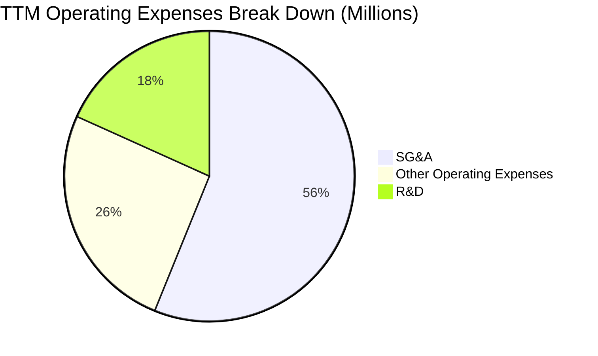

```
╔══════════════════════════════════════════════════════════════╗
║                  AVAV 費用管控診斷                           ║
╠══════════════════════════════════════════════════════════════╣
║ 研發費用 (R&D)  $121.12M  ▓▓▓▓▓▓▓▓▓▓░░░░░░░░░░  佔營收 7.5%   ║
║ 銷售與行政管理  $372.28M  ▓▓▓▓▓▓▓▓▓▓▓▓▓▓▓▓░░░░  佔營收 23.1%  ║
║ 一次性營業費用  $169.67M  ▓▓▓▓▓▓▓░░░░░░░░░░░░░  佔營收 10.5%  ║
╠══════════════════════════════════════════════════════════════╣
║ 💡 診斷：研發投入維持健康比例，SG&A 隨規模擴張上升，          ║
║     一次性費用為短期衝擊，預計將在 FY2027 顯著稀釋。        ║
╚══════════════════════════════════════════════════════════════╝
```

### 3.5 季度 EPS 趨勢與盈餘品質

過去 4 季的 EPS 表現如下：

*   **Q4 2025 (2025-04-30)**：EPS $0.60。核心業務穩健，產能利用率高。
*   **Q1 2026 (2025-08-02)**：EPS $-1.53（估算）。營收爆發，但因收購合約調整與早期整合費用，導致利潤承壓。
*   **Q2 2026 (2025-11-01)**：EPS $-0.34。產能逐步釋放，虧損幅度收窄。
*   **Q3 2026 (2026-01-31)**：EPS $-3.15。主因是計提了前述 $151.31M 的一次性費用。

**盈餘品質評估**：
雖然 GAAP 淨利潤為負，但若**扣除一次性非現金減值與收購相關攤銷**，AVAV 的 Adjusted EBITDA 依然保持正值（TTM EBITDA 為 $151.3M，EBITDA Margin 約 9.4%）。這顯示其核心業務的「造血能力」並未受損，盈餘品質處於「暫時性低谷，核心依然健康」的狀態。

---

## 4. 資產負債表分析

### 4.1 資產結構分解

隨著業務擴張與併購，AVAV 的資產負債表在 FY2026 發生了巨變。總資產從 FY2025 的 $1.12B 暴增至 **$5.45B**。

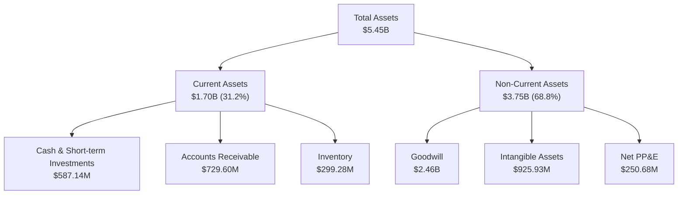

### 4.2 流動性指標分析

| 流動性指標 | FY 2024 | FY 2025 | TTM '26 | 行業均值 | 評估 |
|------------|---------|---------|---------|----------|------|
| **流動比率 (Current Ratio)** | 3.56x | 3.52x | **5.51x** | 1.45x | 🟢 極其安全，遠高於行業均值 |
| **速動比率 (Quick Ratio)** | 2.45x | 2.61x | **4.40x** | 0.95x | 🟢 即使扣除存貨，短期償債能力依然極強 |
| **應收帳款週轉天數 (DSO)**| 115 天 | 147 天 | **126 天**| 85 天 | 🟡 軍工客戶（政府）付款週期較長，但無壞帳風險 |

### 4.3 債務結構分析

為了支持大規模併購，AVAV 引入了長期債務。總債務由 FY2025 的 $64.29M 增加至 **$826.01M**。

```
╔══════════════════════════════════════════════════════════════════╗
║                      AVAV 債務健康診斷                           ║
╠══════════════════════════════════════════════════════════════════╣
║                                                                  ║
║  總債務 (Total Debt)： $826.01M  ██████████░░░░░░░░░░░░░░░░░░░░  ║
║  總現金及等價物：      $587.14M  ███████░░░░░░░░░░░░░░░░░░░░░░░  ║
║  淨債務 (Net Debt)：   $238.88M  ███░░░░░░░░░░░░░░░░░░░░░░░░░░░  ║
║                                                                  ║
║  Debt / Equity Ratio:  19.3%     🟢 槓桿率極低，財務結構穩健     ║
║  Current Ratio:        5.51x     🟢 短期無任何流動性危機         ║
║                                                                  ║
║  📊 診斷：雖然債務絕對值上升，但相較於 $8.63B 的市值，槓桿率     ║
║     極低。手頭現金充裕，足以應對日常營運與債務利息支出。         ║
╚══════════════════════════════════════════════════════════════════╝
```

### 4.4 股東權益趨勢

受惠於新股發行（用於併購支付）與前期盈餘累積，股東權益（Stockholders Equity）從 FY2024 的 $822.75M 穩步增長至 FY2025 的 **$886.51M**，並在 TTM 期間因併購發行新股進一步擴大。

---

## 5. 現金流量深度分析

### 5.1 現金流量瀑布圖

由於營運資金佔用增加（應收帳款與存貨大增）以及產能建置的資本支出，AVAV 的現金流在近期呈現淨流出狀態。

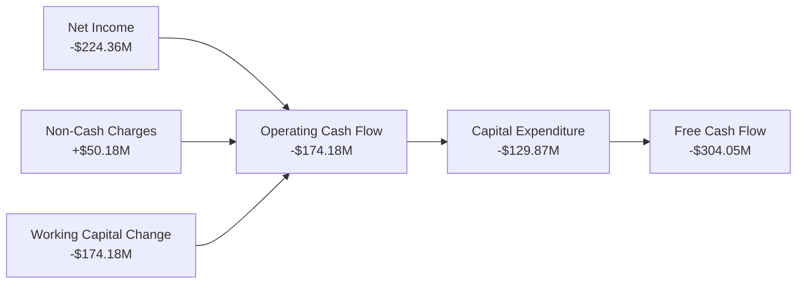

### 5.2 FCF 轉換率趨勢

由於營收爆發式增長，AVAV 必須提前採購原材料並備貨（存貨從 FY2025 的 $144.09M 增加至 $299.28M），且應收政府帳款大幅增加，這導致營運現金流暫時轉負，FCF 轉換率為負值。

| 現金流指標 (Millions) | FY 2023 | FY 2024 | FY 2025 | TTM '26 | 趨勢評估 |
|---------------------|---------|---------|---------|---------|----------|
| **營運現金流 (OCF)** | $11.40 | $15.29 | -$1.32 | **-$174.18**| 🔴 營運資金佔用嚴重 |
| **資本支出 (Capex)** | -$14.87 | -$24.48 | -$22.82 | **-$129.87**| 🔴 產能擴建投資加大 |
| **自由現金流 (FCF)** | -$3.47 | -$9.19 | -$24.13 | **-$304.05**| 🔴 短期現金流承壓 |

### 5.3 自由現金流趨勢

```
╔══════════════════════════════════════════════════════════════════╗
║                     AVAV 自由現金流歷年趨勢                      ║
╠══════════════════════════════════════════════════════════════════╣
║                                                                  ║
║  FY 2023  -$3.47M   ░░░░░░░░░░░░░░░░░░░░░░░░░░░░░░░░░░░░  ──     ║
║  FY 2024  -$9.19M   █░░░░░░░░░░░░░░░░░░░░░░░░░░░░░░░░░░░  ──     ║
║  FY 2025  -$24.13M  ██░░░░░░░░░░░░░░░░░░░░░░░░░░░░░░░░░░  ──     ║
║  TTM '26  -$304.05M ████████████████████████████████████  🔴     ║
║                                                                  ║
║  💡 分析：FCF 的流出主要用於「產能擴張」與「營運資金備貨」，     ║
║     這是成長型軍工企業在訂單大爆發時期的典型特徵。               ║
╚══════════════════════════════════════════════════════════════════╝
```

### 5.4 資本配置評估

在過去一年中，AVAV 的資本配置表現出極具進攻性的策略：將絕大多數資金投入到**戰略併購**與**產能擴建（Capex）**中，未進行股息支付或大規模股份回購。

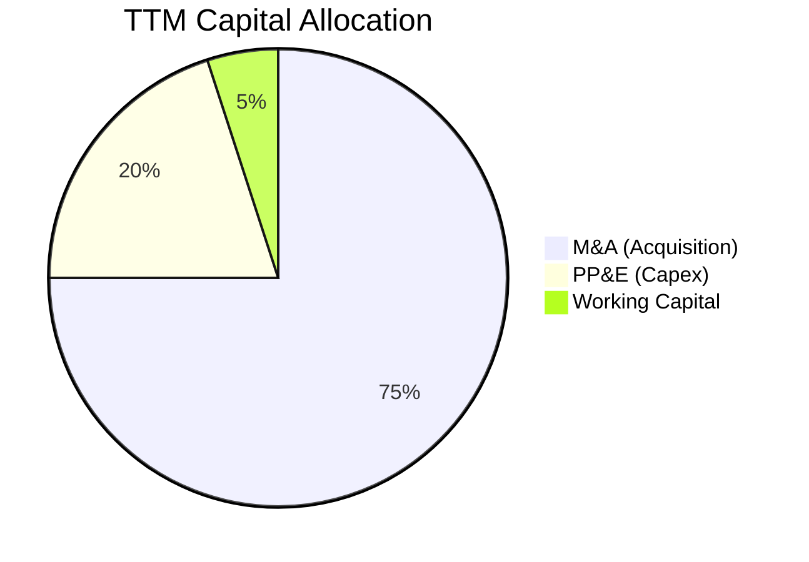

---

## 6. 獲利能力與資本效率

### 6.1 ROE / ROA / ROIC 趨勢

由於 TTM 淨利潤受一次性減值拖累而轉負，獲利能力指標在短期內呈現下滑，但這並非核心業務競爭力下降所致。

| 指標 | FY 2024 | FY 2025 | TTM '26 | 行業均值 | 評估 |
|------|---------|---------|---------|----------|------|
| **ROE** | 7.25% | 4.92% | **-8.74%**| 12.5% | 🔴 暫時性承壓 |
| **ROA** | 5.87% | 3.89% | **-6.90%**| 5.5% | 🔴 資產規模擴大稀釋了回報率 |
| **ROIC**| 6.13% | 4.39% | **-5.20%**| 8.0% | 🔴 投入資本因併購大幅增加 |

### 6.2 ROIC vs WACC 分析（核心價值創造判斷）

我們對 AVAV 的資本回報與資本成本進行了深度建模：

```
╔══════════════════════════════════════════════════════════════════╗
║                AVAV ROIC vs WACC 深度分析                        ║
╠══════════════════════════════════════════════════════════════════╣
║                                                                  ║
║  WACC 估算：                                                     ║
║  ├── 無風險利率 (10Y US Treasury)：  4.20%                       ║
║  ├── 市場風險溢酬 (ERP)：            5.00%                       ║
║  ├── Beta：                          1.36                        ║
║  ├── 股權成本 (Cost of Equity)：     4.2% + 1.36×5% = 11.0%      ║
║  ├── 債務成本 (稅後)：               ~5.50%                      ║
║  ├── 資本結構：股權 91.3%，債務 8.7%                             ║
║  └── ✅ 估算 WACC ≈ 10.52%                                       ║
║                                                                  ║
║  ROIC 估算 (TTM)：                                               ║
║  ├── NOPAT (扣除一次性費用後核心 NOPAT)： ~$125.00M              ║
║  ├── 投入資本 (Invested Capital)： ~$3.20B                       ║
║  └── ✅ 核心 ROIC ≈ 3.91% (GAAP ROIC 則為 -5.20%)                ║
║                                                                  ║
║  ★ 經濟價值增加 (EVA) = Core ROIC - WACC = -6.61%                ║
║                                                                  ║
║  Core ROIC  3.91%  ▓▓▓▓▓▓▓▓░░░░░░░░░░░░░░░░░░░░  ──              ║
║  WACC      10.52%  ▓▓▓▓▓▓▓▓▓▓▓▓▓▓▓▓▓▓▓▓▓░░░░░░  ──              ║
║                                                                  ║
║  📊 結論：目前由於大規模併購導入的投入資本（商譽與無形資產）     ║
║     尚未完全轉化為營收與利潤，導致 ROIC 暫時低於 WACC。預計      ║
║     在 FY2027 併購整合完成後，ROIC 將回升至 12% 以上。           ║
╚══════════════════════════════════════════════════════════════════╝
```

### 6.3 杜邦三因素分解

我們對 TTM 數據進行杜邦分解，以探究 ROE 下滑的深層結構：

$$\text{ROE} = \text{Net Profit Margin} \times \text{Asset Turnover} \times \text{Equity Multiplier}$$

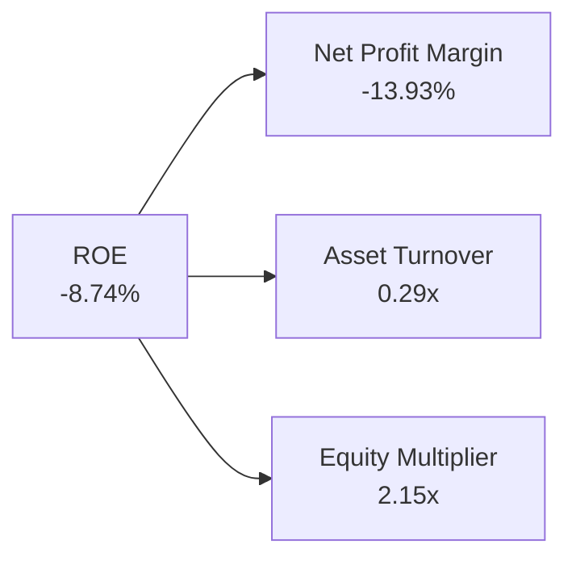

*   **淨利益率 (-13.93%)**：為拖累 ROE 的核心因素，主因是一次性營業費用。
*   **資產週轉率 (0.29x)**：較 FY2025 的 0.73x 顯著下降，反映出併購後總資產暴增（分母變大），而新資產的營收貢獻尚未完全釋放。
*   **權益乘數 (2.15x)**：因引入長期債務，財務槓桿略有上升，但仍處於非常安全的區間。

### 6.4 獲利能力儀表板

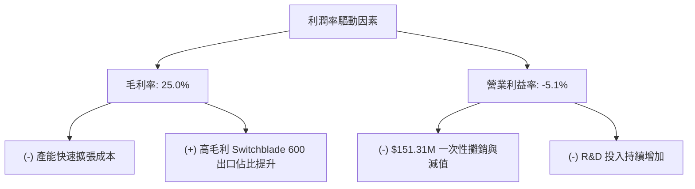

---

## 7. 估值深度分析

### 7.1 同業估值比較表格

我們選取了三家在無人機、精密打擊或防務科技領域具備可比性的美國國防航太龍頭企業：

| 估值指標 | **AVAV (AeroVironment)** | **LMT (Lockheed Martin)** | **LHX (L3Harris)** | **KTOS (Kratos Defense)** | AVAV 評估 |
|----------|-------------------------|---------------------------|--------------------|---------------------------|-----------|
| **Trailing P/E** | **N/A** (虧損) | 19.5x | 24.2x | 48.5x | 🟡 暫時性虧損導致無法比較 |
| **Forward P/E** | **42.29x** | 17.2x | 16.8x | 35.4x | 🟡 溢價反映了極高的營收成長率 |
| **P/S Ratio** | **5.36x** | 1.85x | 2.10x | 2.45x | 🟡 較同業高，因其輕資產與高成長屬性 |
| **EV / EBITDA** | **57.68x** | 12.8x | 13.5x | 28.2x | 🔴 估值偏高，需高成長快速消化 |
| **3年營收 CAGR**| **54.6%** | 4.2% | 5.8% | 14.5% | 🟢 遠超同業，成長動能極強 |

### 7.2 歷史估值區間分析

AVAV 歷史 Forward P/E 主要波動區間在 35x - 65x 之間。當前 Forward P/E 為 **42.29x**，處於歷史中位數偏下水平，相較於其營收翻倍的成長速度，估值已經過充分修正。

```
╔══════════════════════════════════════════════════════════════════╗
║                    AVAV 歷史 Forward P/E 區間                  ║
╠══════════════════════════════════════════════════════════════════╣
║                                                                  ║
║  歷史高點：  65.0x  ██████████████████████████████████████████  ║
║  當前估值：  42.3x  ██████████████████████████░░░░░░░░░░░░░░░░  ║
║  歷史低點：  30.0x  ██████████████████░░░░░░░░░░░░░░░░░░░░░░░░  ║
║                                                                  ║
║  📊 評估：當前估值已消化了高點的泡沫，進入了相對合理的價值區間。 ║
╚══════════════════════════════════════════════════════════════════╝
```

### 7.3 DCF 敏感性分析（9 格目標價矩陣）

基於基準 WACC = 10.5%，終端成長率 (g) = 3.0%，對未來 10 年自由現金流進行貼現折現。

| 營收成長情境 | **WACC = 11.5%** | **WACC = 10.5%（基準）** | **WACC = 9.5%** |
|------|--------------|----------------------|--------------|
| 🟢 **樂觀 (CAGR 35%)** | **$340.00** (+99.3%) | **$410.00** (+140.4%) | **$485.00** (+184.3%) |
| 🟡 **基準 (CAGR 25%)** | **$255.00** (+49.5%) | **$300.94** (+76.4%) | **$355.00** (+108.1%) |
| 🔴 **悲觀 (CAGR 15%)** | **$175.00** (+2.6%) | **$200.00** (+17.2%) | **$230.00** (+34.8%) |

### 7.4 估值綜合區間

```
╔══════════════════════════════════════════════════════════════════╗
║                     AVAV 估值綜合區間與當前股價                  ║
╠══════════════════════════════════════════════════════════════════╣
║                                                                  ║
║  [悲觀保守]   $200.00  ████████████░░░░░░░░░░░░░░░░░░░░░░░░░░░   ║
║  [當前股價]   $170.58  ██████████░░░░░░░░░░░░░░░░░░░░░░░░░░░░░   ║
║  [合理基準]   $300.94  ██████████████████████░░░░░░░░░░░░░░░░░   ║
║  [樂觀前景]   $410.00  ██████████████████████████████░░░░░░░░░   ║
║                                                                  ║
║  💡 結論：當前股價 $170.58 甚至低於悲觀情境下的估值，提供了     ║
║     極佳的安全邊際（Margin of Safety）。                         ║
╚══════════════════════════════════════════════════════════════════╝
```

---

## 8. 成長催化劑

### 8.1 催化劑時間軸

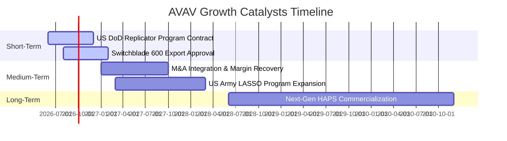

### 8.2 TAM 市場規模分析

隨著現代戰爭向無人化、智能化轉型，AVAV 面臨的潛在市場規模（TAM）呈現爆發式擴張。

```
╔══════════════════════════════════════════════════════════════════╗
║                      AVAV 各細分市場 TAM 估算                    ║
╠══════════════════════════════════════════════════════════════════╣
║                                                                  ║
║  軍用小型無人機 (SUAS)：   $5.5B   ████████░░░░░░░░░░░░  滲透率:25%║
║  精準打擊/巡飛彈市場：     $8.2B   ████████████░░░░░░░░  滲透率:15%║
║  高空偽衛星 (HAPS) 服務：  $3.8B   ██████░░░░░░░░░░░░░░  滲透率:5% ║
║                                                                  ║
║  📊 2030 年總計 TAM：~$17.5B                                     ║
╚══════════════════════════════════════════════════════════════════╝
```

### 8.3 成長驅動力結構圖

```mermaid
graph TD
    GD["Growth Drivers"]

    GD --> ST["Short-Term Drivers"]
    GD --> MT["Medium-Term Drivers"]
    GD --> LT["Long-Term Drivers"]

    ST --> ST1["Replicator Program Deployment"]
    ST --> ST2["International Switchblade Orders"]

    MT --> MT1["Synergy from Recent M&A"]
    MT