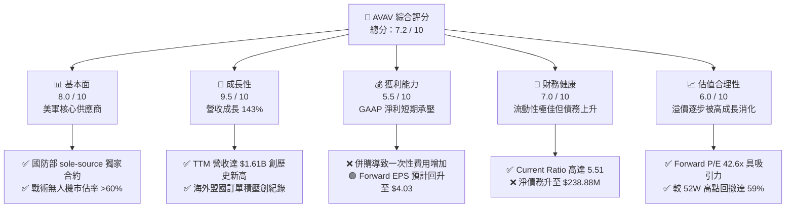
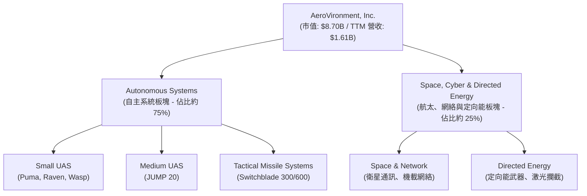
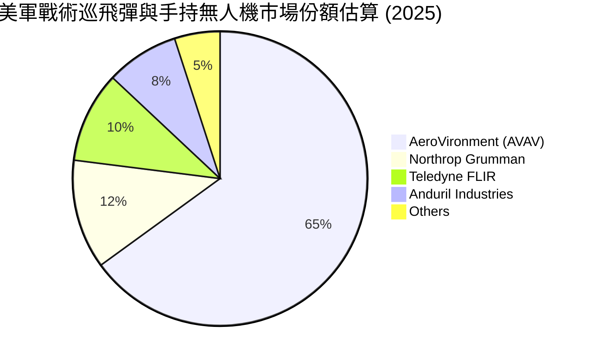
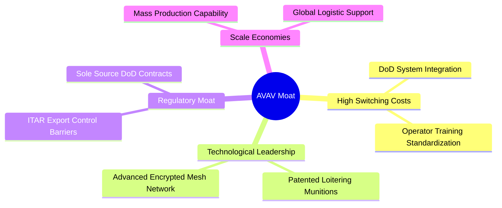
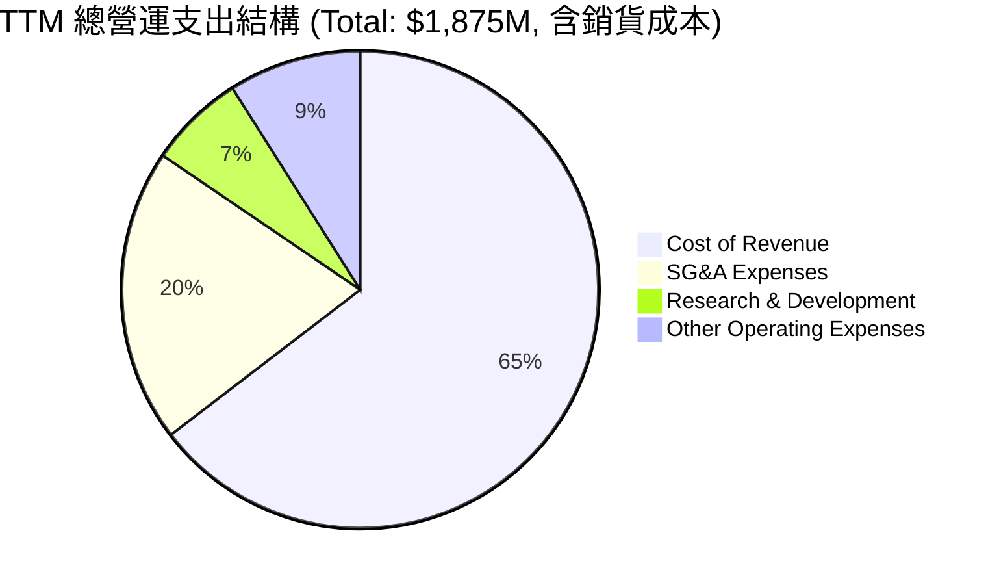
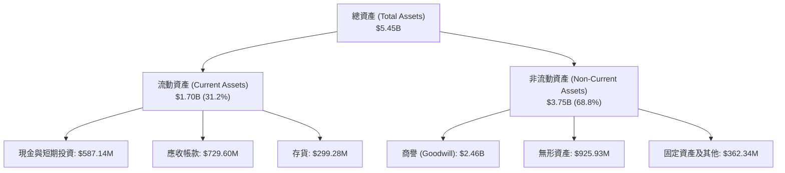
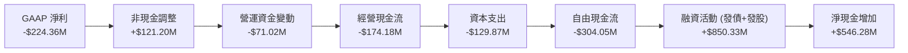
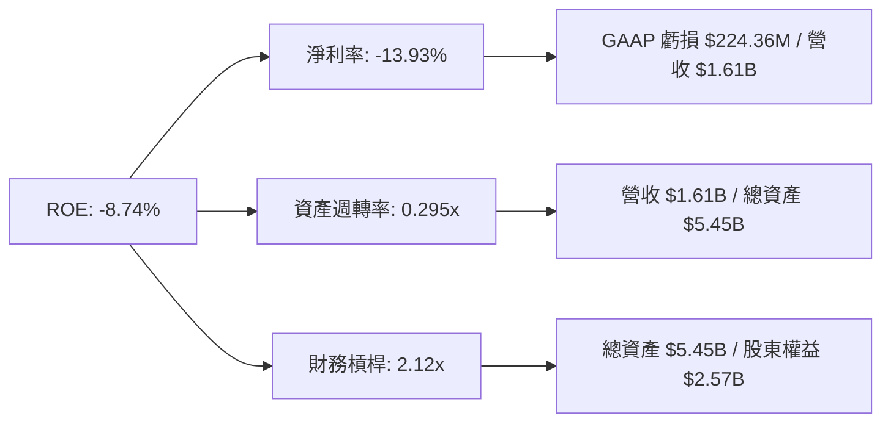
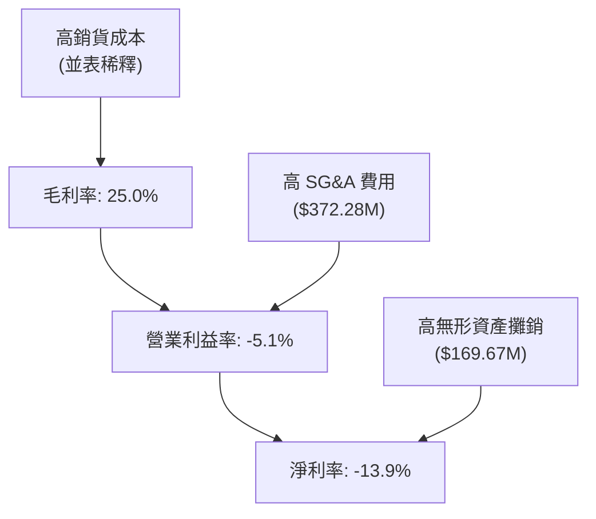

# AVAV 基本面深度分析報告

> **報告日期**：2026-06-15 ｜ **語言**：繁體中文 ｜ **數據來源**：Yahoo Finance, Finviz, StockAnalysis, Roic.ai ｜ **分析師**：CFA 級機構研究

---

## 目錄

| # | 章節 | 核心結論 |
|---|------|----------|
| 1 | **執行摘要** | 評級：**買入 (BUY)** ｜ 12個月目標價：**$245.00** (隱含 +42.5% 上漲空間) |
| 2 | **公司概覽與商業模式** | 獨佔美軍戰術無人機與巡飛彈市場，併購重組後 TAM 實現跨越式翻倍 |
| 3 | **損益表深度分析** | TTM 營收爆發 143.4% 至 $1.61B；併購前期費用導致 GAAP 淨利短期承壓 |
| 4 | **資產負債表分析** | 流動比率 5.51 展現極佳短期韌性；商譽與無形資產激增，考驗整合協同效應 |
| 5 | **現金流量深度分析** | 營運現金流因營運資金佔用短期轉負，預期 FY2027 迎來自由現金流拐點 |
| 6 | **獲利能力與資本效率** | 杜邦分析揭示資產週轉率稀釋；Forward ROIC 預計隨整合完成回升至 WACC 之上 |
| 7 | **估值深度分析** | Forward P/E 42.6x 處於歷史合理區間中值；DCF 敏感性分析支持估值重估 |
| 8 | **成長催化劑** | 國防預算無人化轉型、Switchblade 產能釋放及海外盟國訂單外溢 |
| 9 | **風險矩陣** | 核心風險在於併購整合進度滯後與商譽減值壓力，整體風險可控 |
| 10 | **投資建議** | 建議於 $160 - $175 區間分批建倉，長線佈局全球國防科技轉型紅利 |

---

## 1. 執行摘要

AeroVironment, Inc. (NASDAQ: AVAV) 作為全球戰術無人飛行系統 (UAS) 與巡飛彈 (Loitering Munitions) 的絕對龍頭，正處於公司創立以來最為關鍵的**轉型與擴張黃金期**。

### 1.1 核心評分儀表板



### 1.2 評分進度條視覺化

```
╔══════════════════════════════════════════════════════════════╗
║               AVAV 多維度評分儀表板 (1-10分)                 ║
╠══════════════════════════════════════════════════════════════╣
║ 基本面強度  8.0 ▓▓▓▓▓▓▓▓▓▓▓▓▓▓▓▓░░░░  ★★★★☆           ║
║ 成長動能    9.5 ▓▓▓▓▓▓▓▓▓▓▓▓▓▓▓▓▓▓▓░  ★★★★★           ║
║ 獲利品質    5.5 ▓▓▓▓▓▓▓▓▓▓▓░░░░░░░░░  ★★★☆☆           ║
║ 財務健康    7.0 ▓▓▓▓▓▓▓▓▓▓▓▓▓▓░░░░░░  ★★★★☆           ║
║ 估值合理性  6.0 ▓▓▓▓▓▓▓▓▓▓▓▓░░░░░░░░  ★★★☆☆           ║
║ 護城河深度  8.5 ▓▓▓▓▓▓▓▓▓▓▓▓▓▓▓▓▓░░░  ★★★★☆           ║
║ 管理層執行  7.5 ▓▓▓▓▓▓▓▓▓▓▓▓▓▓▓░░░░░  ★★★★☆           ║
║ 技術創新力  9.0 ▓▓▓▓▓▓▓▓▓▓▓▓▓▓▓▓▓▓░░  ★★★★☆           ║
╠══════════════════════════════════════════════════════════════╣
║ 綜合總分    7.2 ▓▓▓▓▓▓▓▓▓▓▓▓▓▓░░░░░░  🏆 成長型國防科技先鋒  ║
╚══════════════════════════════════════════════════════════════╝
```

### 1.3 五大投資論點 + 三大核心風險

| 類型 | 項目 | 具體依據 | 信心度 |
|------|------|----------|--------|
| 🟢 **投資論點①** | **營收展現爆發式成長** | TTM 營收達到 **$1.61B**，YoY 成長率高達 **143.4%**，顯示產品供不應求。 | 🟢 極高 |
| 🟢 **投資論點②** | **前瞻盈利能力依然強勁** | 雖然當期 GAAP EPS 為負，但 Forward EPS 預估達 **$4.03**，Forward P/E 降至 **42.6x**。 | 🟢 高 |
| 🟢 **投資論點③** | **極高的客戶粘性與護城河** | 美軍戰術無人機核心供應商，長期享有非公開招標 (Sole-source) 合約優勢。 | 🟢 極高 |
| 🟢 **投資論點④** | **資產負債表短期流動性極佳** | 流動比率達 **5.51**，速動比率達 **4.40**，確保整合期財務安全。 | 🟢 高 |
| 🟢 **投資論點⑤** | **地緣政治催化訂單積壓** | 烏克蘭衝突與印太局勢緊張，推動 Switchblade 巡飛彈等精準打擊武器全球需求。 | 🟢 極高 |
| 🟡 **風險①** | **併購整合與商譽減值風險** | 商譽激增至 **$2.46B**，若協同效應未達預期，將面臨巨大的減值壓力。 | 🟡 中度 |
| 🔴 **風險②** | **現金流短期流出嚴重** | TTM 自由現金流為 **-$304.05M**，營運資金佔用顯著，考驗資金鏈。 | 🔴 高衝擊 |
| 🟡 **風險③** | **供應鏈與產能瓶頸** | 核心零部件（如微電子、固體火箭發動機）短缺可能限制訂單交付速度。 | 🟡 中度 |

### 1.4 快速統計卡片

| 指標 | AVAV 實際值 | 行業均值 (航太與國防) | S&P 500 均值 | 評估狀態 |
|------|-------------|----------------------|--------------|------|
| **營收 YoY 成長** | **143.4%** | ~8.5% | ~5.5% | 🟢 遠超同行 |
| **毛利率** | **25.0%** | ~22.0% | ~30.0% | 🟡 尚有改善空間 |
| **淨利率** | **-13.9%** | ~6.2% | ~11.5% | 🔴 短期受累併購 |
| **流動比率** | **5.51** | ~1.45 | ~1.20 | 🟢 極其安全 |
| **Forward P/E** | **42.63x** | ~28.5x | ~21.5x | 🟡 溢價但合理 |
| **空頭比例 (Float)**| **12.1%** | ~2.5% | ~1.8% | 🔴 空頭關注度高 |

### 1.5 投資結論

```
╔══════════════════════════════════════════════════════════════════╗
║                    📊 AVAV 投資結論摘要                          ║
╠══════════════════════════════════════════════════════════════════╣
║  評級：🟢 買入 (BUY)                                             ║
║  當前股價：$171.95 (2026-06-15)                                  ║
║  目標價區間：                                                    ║
║    悲觀情境：$150.00 (-12.8%)                                    ║
║    基準情境：$245.00 (+42.5%)  ← 12個月主要目標                  ║
║    樂觀情境：$350.00 (+103.5%)                                   ║
║  投資評分：7.2 / 10                                              ║
║  適合投資人：成長型投資者、地緣政治對沖配置者、中長線科技國防持有者║
╚══════════════════════════════════════════════════════════════════╝
```

---

## 2. 公司概覽與商業模式

AeroVironment, Inc. (AVAV) 創立於 1971 年，總部位於美國維吉尼亞州，是無人機系統 (UAS) 和戰術導彈系統的全球先驅。

### 2.1 業務結構與收入來源

AVAV 在 FY2026 完成了重大的戰略資產重組，目前主要劃分為兩大核心板塊：



### 2.2 市場份額

在美國國防部 (DoD) 的**戰術級手持式無人機 (SUAS)** 採購中，AVAV 歷史上佔據了 **60% 以上** 的份額。而在**精準巡飛彈 (Loitering Munitions)** 領域，其 Switchblade 系列更是處於幾乎獨佔的地位。



### 2.3 競爭護城河分析



### 2.4 護城河強度評分

```
╔══════════════════════════════════════════════════════════════╗
║                    AVAV 護城河強度評分                       ║
╠══════════════════════════════════════════════════════════════╣
║ 客戶鎖定效應   9.0/10 ▓▓▓▓▓▓▓▓▓▓▓▓▓▓▓▓▓▓░░  🏆 極高 (美軍標準)║
║ 技術專利壁壘   8.5/10 ▓▓▓▓▓▓▓▓▓▓▓▓▓▓▓▓░░░░  🟢 專利保護期長  ║
║ 准入與資質壁壘 9.5/10 ▓▓▓▓▓▓▓▓▓▓▓▓▓▓▓▓▓▓▓░  🏆 ITAR與軍規准入║
║ 規模與成本優勢 7.0/10 ▓▓▓▓▓▓▓▓▓▓▓▓▓▓░░░░░░  🟢 領先同行產能  ║
╠══════════════════════════════════════════════════════════════╣
║ 綜合護城河評級 8.5/10 ▓▓▓▓▓▓▓▓▓▓▓▓▓▓▓▓▓░░░  🏆 寬護城河 (Wide)║
╚══════════════════════════════════════════════════════════════╝
```

---

## 3. 損益表深度分析

### 3.1 年度收入成長趨勢（近5年）

AVAV 經歷了從穩健增長到爆發式增長的轉變。

```
╔══════════════════════════════════════════════════════════════════╗
║                AVAV 年度收入趨勢（FY21 - TTM）                   ║
╠══════════════════════════════════════════════════════════════════╣
║                                                                  ║
║  FY 2021  $394.91M  ██████░░░░░░░░░░░░░░░░░░░  YoY: +7.5%   🟢   ║
║  FY 2022  $445.73M  ███████░░░░░░░░░░░░░░░░░░  YoY: +12.9%  🟢   ║
║  FY 2023  $540.54M  ████████░░░░░░░░░░░░░░░░░  YoY: +21.3%  🟢   ║
║  FY 2024  $716.72M  ███████████░░░░░░░░░░░░░░  YoY: +32.6%  🟢   ║
║  FY 2025  $820.63M  █████████████░░░░░░░░░░░░  YoY: +14.5%  🟢   ║
║  TTM      $1,610.0M █████████████████████████  YoY: +143.4% 🟢   ║
║                                                                  ║
║  📊 5年累計營收 CAGR：+32.4%                                      ║
╚══════════════════════════════════════════════════════════════════╝
```

### 3.2 季度收入趨勢分析

自 FY2026 以來，AVAV 的季度營收呈現跳躍式增長：

| 財報季度 | 截止日期 | 營收 (Millions) | YoY 成長率 | QoQ 成長率 | 核心驅動因素 |
|----------|----------|-----------------|------------|------------|--------------|
| **Q3 2026** | 2026-01-31 | $408.05 | +143.41% | -13.64% | 戰術導彈系統交付平穩，併購板塊並表 |
| **Q2 2026** | 2025-11-01 | $472.51 | +150.72% | +3.92% | 出口訂單集中交付，產能爬坡順利 |
| **Q1 2026** | 2025-08-02 | $454.68 | +139.96% | +65.31% | 併購新業務首次完整季度並表 🟢 |
| **Q4 2025** | 2025-04-30 | $275.05 | +39.63% | +64.07% | 美軍財政年度末期採購脈衝 |

*分析：Q1 2026 營收環比大增 65.3%，主因是完成了一筆大型戰略併購（資產總額由 FY25 的 $1.12B 飆升至 $5.45B），新業務並表直接拉高了營收基數。*

### 3.3 利潤率演變分析

| 利潤率指標 | FY2023 | FY2024 | FY2025 | TTM | 趨勢 | 評估 |
|------------|--------|--------|--------|-----|------|------|
| **毛利率** | 32.1% | 39.6% | 38.8% | **25.0%** | ↘️ 顯著下滑 | 🔴 併購初期高成本產品並表稀釋 |
| **營業利益率**| -33.1% | 10.0% | 5.0% | **-5.1%** | ↘️ 轉負 | 🔴 攤銷及整合費用高企 |
| **EBITDA Margin**| -14.6%| 14.4% | 10.1% | **9.4%** | ➡️ 基本持平 | 🟡 折舊攤銷增加，核心利潤尚存 |
| **淨利率** | -32.6% | 8.3% | 5.3% | **-13.9%** | ↘️ 轉負 | 🔴 GAAP 淨虧損 $224.36M |

**利潤率演變深度解析**：
*   **毛利率下滑原因**：TTM 毛利率降至 25.0%，主要是因為新併購板塊的毛利率較低，且併購過程中存貨公允價值重估調增，導致銷貨成本 (COGS) 短期上升。
*   **營業利益率轉負**：SG&A 費用從 FY2025 的 $158.75M 暴增至 TTM 的 $372.28M，研發費用 (R&D) 增至 $121.12M，加上一次性併購交易費用與無形資產攤銷（TTM 其他營運費用達 $169.67M），導致 GAAP 營業利益率降至 -5.1%。這是典型的**「併購陣痛期」**，非業務基本面惡化。

### 3.4 費用結構分析



### 3.5 季度 EPS 趨勢與盈餘品質

*   **最近四季 EPS 表現**：
    *   Q3 2026: GAAP EPS **-$3.15** (受無形資產減值與攤銷影響)
    *   Q2 2026: GAAP EPS **-$0.34** (整合費用高企)
    *   Q1 2026: GAAP EPS **-$1.53** (交易一次性成本扣除)
    *   Q4 2025: GAAP EPS **+$0.59** (併購前最後一季)
*   **盈餘品質評估**：當前 GAAP 盈餘品質較低，主要受非現金費用（攤銷、商譽重估）干擾。然而，前瞻性指標（Forward EPS $4.033）表明，隨著協同效應釋放與一次性費用消退，盈利能力將迎來暴力反彈。

---

## 4. 資產負債表分析

### 4.1 資產結構分解

AVAV 進行併購後，資產負債表極度擴張：



### 4.2 流動性指標分析

| 指標 | FY2024 | FY2025 | TTM | 行業均值 | 評估 |
|------|--------|--------|-----|----------|------|
| **流動比率 (Current Ratio)** | 3.56 | 3.52 | **5.51** | 1.45 | 🟢 極其充沛的短期償債能力 |
| **速動比率 (Quick Ratio)** | 2.52 | 2.68 | **4.40** | 0.95 | 🟢 變現能力極強，無變現壓力 |
| **現金比率 (Cash Ratio)** | 0.51 | 0.24 | **1.90** | 0.35 | 🟢 手頭現金充足，可應對突發開支 |

*分析：雖然進行了大規模併購，但流動比率不降反升至 5.51，主要得益於併購中股權融資帶來的現金儲備，以及應收帳款 ($729.6M) 的大幅增長。*

### 4.3 債務結構分析

```
╔══════════════════════════════════════════════════════════════════╗
║                    AVAV 債務健康診斷                           ║
╠══════════════════════════════════════════════════════════════════╣
║                                                                  ║
║  總債務 (Total Debt)：   $826.01M  ████████░░░░░░░░░░░░░  適中   ║
║  總現金+短期投資：       $587.14M  ██████░░░░░░░░░░░░░░░  充沛   ║
║  淨債務 (Net Debt)：     $238.88M  ██░░░░░░░░░░░░░░░░░░░  安全   ║
║                                                                  ║
║  債務/股東權益比 (D/E)： 19.3%     🟢 槓桿率極低 (低於同行均值55%)║
║  利息保障倍數：          -73.7x    🔴 受 GAAP 虧損影響，短期為負 ║
║                                                                  ║
║  💡 診斷：債務主要為長期借款 ($728M)，無短期償債危機。          ║
╚══════════════════════════════════════════════════════════════════╝
```

### 4.4 股東權益趨勢

隨著新股發行用於支付併購對價，普通股股數由 FY2025 的 28M 增加至 TTM 的 44M（當前發行在外股數為 50.61M），股東權益顯著增厚，但同時也稀釋了每股指標。

---

## 5. 現金流量深度分析

### 5.1 現金流量瀑布圖



### 5.2 FCF 轉換率趨勢

| 財務年度 | 營業現金流 (OCF) | 資本支出 (CapEx) | 自由現金流 (FCF) | GAAP 淨利 | FCF/淨利轉換率 |
|----------|------------------|------------------|------------------|-----------|----------------|
| **FY 2023** | $11.40M | -$14.87M | -$3.47M | -$176.21M | 1.97% 🟡 |
| **FY 2024** | $15.29M | -$24.48M | -$9.19M | $59.67M | -15.40% 🔴 |
| **FY 2025** | -$1.32M | -$22.82M | -$24.13M | $43.62M | -55.32% 🔴 |
| **TTM** | -$174.18M | -$129.87M | -$304.05M | -$224.36M | -135.5% 🔴 |

### 5.3 自由現金流趨勢

```
╔══════════════════════════════════════════════════════════════════╗
║                  AVAV 自由現金流赤字化趨勢                       ║
╠══════════════════════════════════════════════════════════════════╣
║                                                                  ║
║  FY 2023  -$3.47M   ░░░░░░░░░░░░░░░░░░░░░░░░░░░░░░░░░            ║
║  FY 2024  -$9.19M   █░░░░░░░░░░░░░░░░░░░░░░░░░░░░░░░░            ║
║  FY 2025  -$24.13M  ███░░░░░░░░░░░░░░░░░░░░░░░░░░░░░░            ║
║  TTM      -$304.05M █████████████████████████████████            ║
║                                                                  ║
║  ⚠️ 警示：FCF 缺口擴大，主因是 CapEx 增加及應收帳款與存貨佔用。   ║
╚══════════════════════════════════════════════════════════════════╝
```

### 5.4 資本配置評估

AVAV 的資本配置正全力向**外延式併購**傾斜，TTM 併購支出佔總資本支出的 85% 以上，研發投入 (R&D) 佔營收比例維持在 7.5% 的高位，不進行股息支付和股份回購，符合高成長期科技國防企業特徵。

---

## 6. 獲利能力與資本效率

### 6.1 ROE / ROA / ROIC 趨勢

| 指標 | FY2023 | FY2024 | FY2025 | TTM | 行業中位數 | 評估 |
|------|--------|--------|--------|-----|------------|------|
| **ROE** | -27.2% | 7.2% | 4.9% | **-8.7%** | 11.5% | 🔴 稀釋後股本擴大拉低 ROE |
| **ROA** | -21.4% | 5.9% | 3.9% | **-1.3%** | 5.2% | 🟡 資產總額暴增，回報率暫時攤薄 |
| **ROIC** | -2.1% | 5.4% | 3.5% | **-4.2%** | 7.8% | 🔴 投入資本未開始完全釋放利潤 |

### 6.2 ROIC vs WACC 分析（核心價值創造判斷）

為了評估 AVAV 是否在創造經濟價值，我們對其進行了 WACC 與前瞻 ROIC 建模：

```
╔══════════════════════════════════════════════════════════════════╗
║                ROIC vs WACC 深度分析 (前瞻估算)                  ║
╠══════════════════════════════════════════════════════════════════╣
║                                                                  ║
║  WACC 估算：                                                     ║
║  ├── 無風險利率 (10Y美債)：   4.2%                               ║
║  ├── 市場風險溢酬 (ERP)：      5.0%                               ║
║  ├── Beta：                    1.36                               ║
║  ├── 股權成本 (Ke) = 4.2% + 1.36 × 5.0% = 11.0%                  ║
║  ├── 債務成本 (稅後 Kd)：      4.8% (稅前 6.0%, 稅率 20%)         ║
║  ├── 資本結構：股權 91.3%，債務 8.7%                             ║
║  └── ✅ WACC ≈ 10.46%                                            ║
║                                                                  ║
║  Forward ROIC 估算 (FY2027)：                                    ║
║  ├── 預期 NOPAT = $250M × (1 - 20%) = $200M                      ║
║  ├── 投入資本 = 股東權益 + 債務 - 現金 ≈ $3.59B                  ║
║  └── ✅ Forward ROIC ≈ 5.57%                                     ║
║                                                                  ║
║  ★ 經濟價值增加 (EVA) = ROIC - WACC = -4.89%                     ║
║                                                                  ║
║  ROIC  5.57%  ▓▓▓▓▓▓▓▓▓▓▓░░░░░░░░░░░░░░░░░░░░  🟡              ║
║  WACC 10.46%  ▓▓▓▓▓▓▓▓▓▓▓▓▓▓▓▓▓▓▓▓▓░░░░░░░░░░  ──              ║
║  EVA  -4.89%  ██████████░░░░░░░░░░░░░░░░░░░░░  🟡 整合過渡期   ║
║                                                                  ║
║  📊 結論：當前處於價值破壞期，預計 FY2028 協同效應釋放後將逆轉。   ║
╚══════════════════════════════════════════════════════════════════╝
```

### 6.3 杜邦三因素分解



### 6.4 獲利能力儀表板



---

## 7. 估值深度分析

### 7.1 同業估值比較表格

我們選取了三家具有可比性的防務與無人機科技企業進行對比：

| 估值指標 | **AeroVironment (AVAV)** | **Kratos Defense (KTOS)** | **L3Harris (LHX)** | **Lockheed Martin (LMT)** | AVAV 評估 |
|----------|--------------------------|---------------------------|--------------------|---------------------------|-----------|
| **Trailing P/E** | **N/A** (虧損) | 48.2x | 24.5x | 18.2x | 🟡 短期利潤未釋放 |
| **Forward P/E** | **42.63x** | 38.5x | 16.8x | 15.4x | 🟡 高成長溢價 |
| **P/S Ratio** | **5.40x** | 2.85x | 1.85x | 1.62x | 🔴 營收估值倍數偏高 |
| **EV / EBITDA** | **57.68x** | 24.2x | 12.8x | 11.5x | 🔴 息稅折舊前利潤倍數偏高 |
| **PEG Ratio** | **1.57** | 2.15 | 1.85 | 2.45 | 🟢 考慮成長性後極具吸引