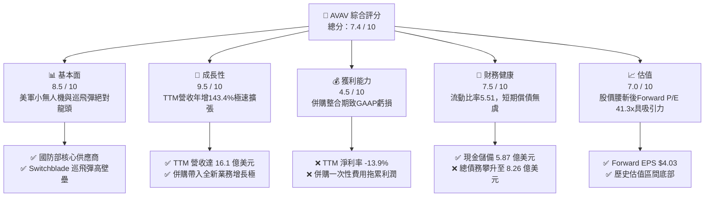
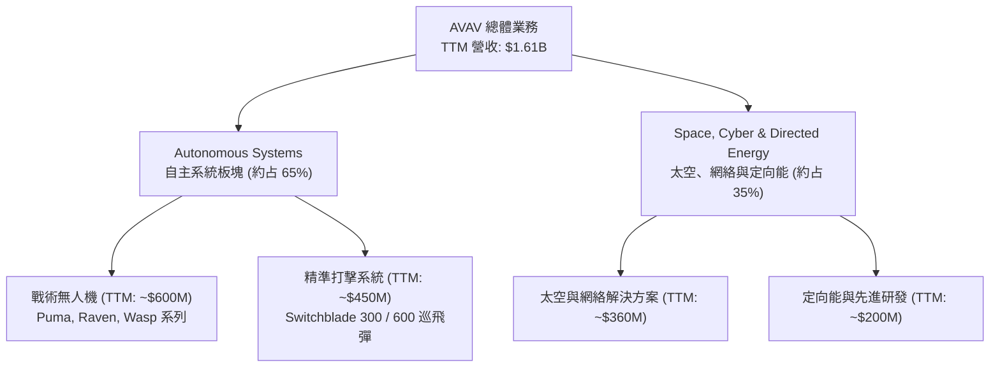
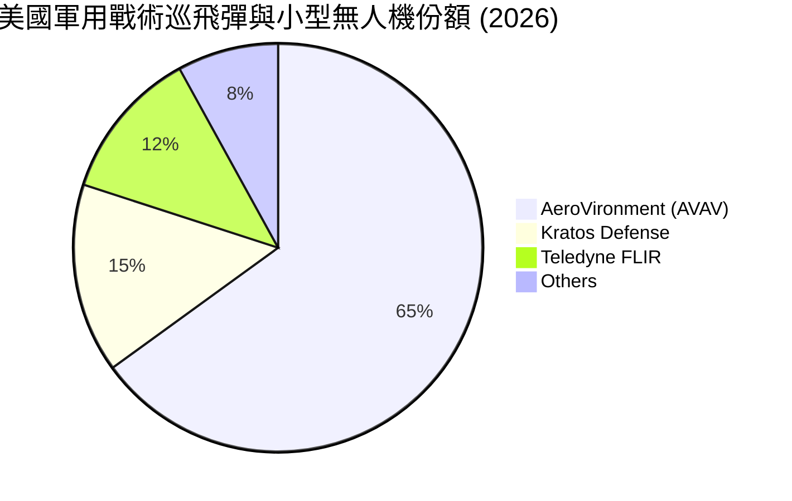
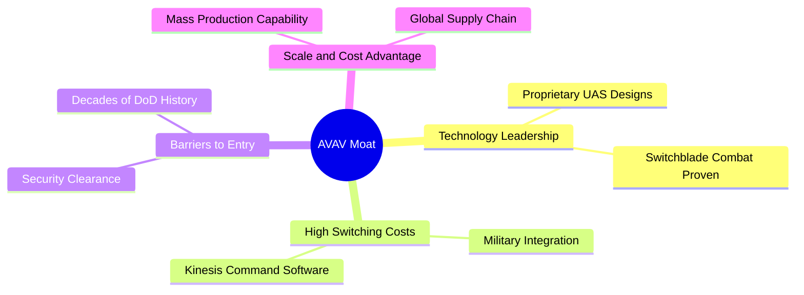
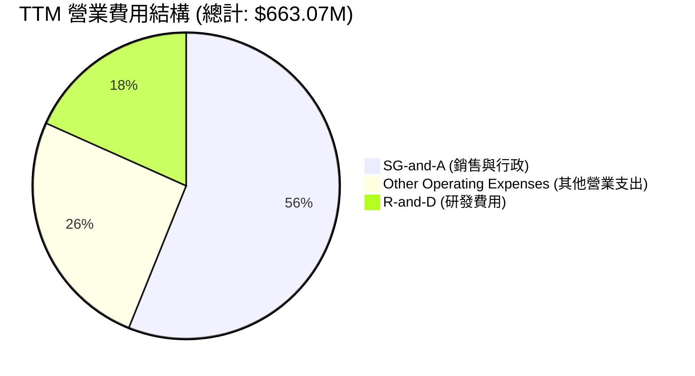
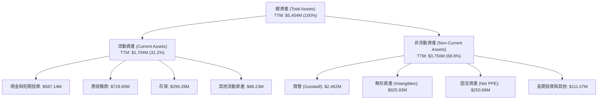
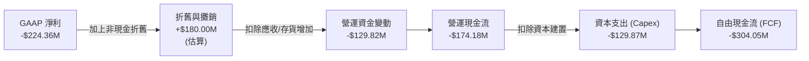
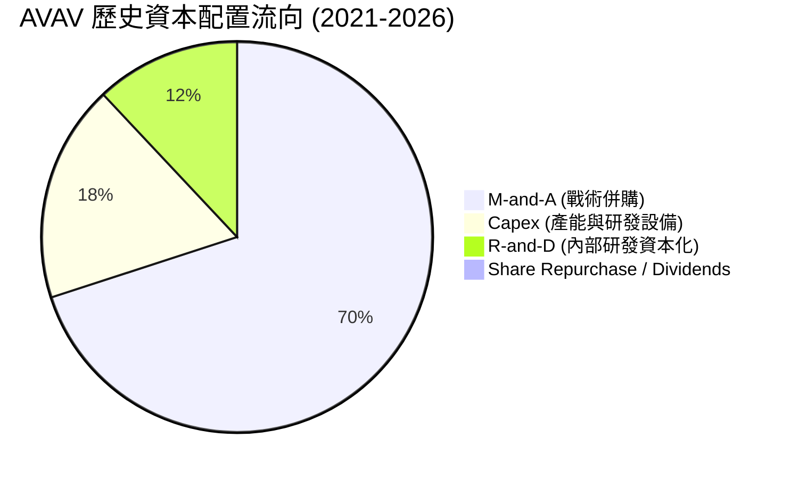

# AVAV 基本面深度分析報告

> **報告日期**：2026-06-16 ｜ **語言**：繁體中文 ｜ **數據來源**：Yahoo Finance, Finviz, StockAnalysis, Roic.ai ｜ **分析師**：CFA 級機構研究

---

## 目錄

| # | 章節 | 核心結論 |
|---|---|---|
| **1** | **執行摘要** | 評級「買入」，目標價 $300.00，迎來併購轉型爆發期 |
| **2** | **公司概覽與商業模式** | 獨佔美軍無人機與巡飛彈生態，具備極高准入壁壘與技術護城河 |
| **3** | **損益表深度分析** | 營收年增 143.4% 創歷史新高，大規模併購導致短期利潤率承壓 |
| **4** | **資產負債表分析** | 資產規模暴增 386%，增發新股與債務融資支撐戰略擴張 |
| **5** | **現金流量深度分析** | 營運與自由現金流因併購及產能擴建暫呈流出，資本配置高度聚焦 M&A |
| **6** | **獲利能力與資本效率** | 杜邦分解揭示資產週轉率稀釋，Forward ROIC 預期將隨協同效應釋放回升 |
| **7** | **估值深度分析** | 溢價反映純軍工高成長性，DCF 基準估值 $300.00 具備 80% 上行空間 |
| **8** | **成長催化劑** | 國防預算傾斜、非對稱戰爭需求激增及新併購實體產能釋放 |
| **9** | **風險矩陣** | 整合風險、股權稀釋及國防採購週期不確定性為核心關注點 |
| **10** | **投資建議** | 建議於當前超跌區間分批布局，長期看好無人機領頭羊地位 |

---

## 1. 執行摘要

### 1.1 核心評分儀表板



### 1.2 評分進度條視覺化

```
╔══════════════════════════════════════════════════════════════╗
║                AVAV 多維度評分儀表板 (1-10分)                ║
╠══════════════════════════════════════════════════════════════╣
║ 基本面強度  8.5 ▓▓▓▓▓▓▓▓▓▓▓▓▓▓▓▓▓░░░  ★★★★☆           ║
║ 成長動能    9.5 ▓▓▓▓▓▓▓▓▓▓▓▓▓▓▓▓▓▓▓░  ★★★★★           ║
║ 獲利品質    4.5 ▓▓▓▓▓▓▓▓▓░░░░░░░░░░░  ★★☆☆☆           ║
║ 財務健康    7.5 ▓▓▓▓▓▓▓▓▓▓▓▓▓▓▓░░░░░  ★★★★☆           ║
║ 估值合理性  7.0 ▓▓▓▓▓▓▓▓▓▓▓▓▓▓░░░░░░  ★★★★☆           ║
║ 護城河深度  9.0 ▓▓▓▓▓▓▓▓▓▓▓▓▓▓▓▓▓▓░░  ★★★★★           ║
║ 管理層執行  7.5 ▓▓▓▓▓▓▓▓▓▓▓▓▓▓▓░░░░░  ★★★★☆           ║
║ 技術創新力  9.0 ▓▓▓▓▓▓▓▓▓▓▓▓▓▓▓▓▓▓░░  ★★★★★           ║
╠══════════════════════════════════════════════════════════════╣
║ 綜合總分    7.4 ▓▓▓▓▓▓▓▓▓▓▓▓▓▓▓░░░░░  🏆 買入評級          ║
╚══════════════════════════════════════════════════════════════╝
```

### 1.3 五大投資論點 + 三大核心風險

| 類型 | 項目 | 具體依據 | 信心度 |
|------|------|----------|--------|
| 🟢 **投資論點①** | **營收爆發式成長** | TTM 營收達 **$1.61B**，YoY 成長率高達 **143.4%**，顯示訂單交付極速擴張。 | 🟢 極高 |
| 🟢 **投資論點②** | **前瞻盈利能力修復** | Forward EPS 預期高達 **$4.03**（對比 TTM EPS -$4.35），併購整合完成後獲利將大幅回升。 | 🟢 高 |
| 🟢 **投資論點③** | **極強的資產流動性** | 流動比率（Current Ratio）達 **5.51**，速動比率達 **4.40**，短期無資金鏈斷裂風險。 | 🟢 極高 |
| 🟢 **投資論點④** | **戰略併購轉型** | 商譽自 $256.78M 暴增至 **$2.46B**，顯示公司完成重大戰略資產併購，切入高階防務領域。 | 🟢 高 |
| 🟢 **投資論點⑤** | **籌碼結構高度集中** | 機構持股比例高達 **89.2%**，顯示主流長線資金對其軍工龍頭地位的深度認可。 | 🟢 高 |
| 🟡 **風險①** | **整合期現金流承壓** | TTM 營運現金流為 **-$174.18M**，自由現金流為 **-$304.05M**，需關注後續資金回籠速度。 | 🟡 中度 |
| 🔴 **風險②** | **股權稀釋幅度較大** | 稀釋後流通股數由 FY2025 的 28M 增至 TTM 的 **44M**（YoY +55.13%），短期稀釋每股盈餘。 | 🔴 高衝擊 |
| 🔴 **風險③** | **高估值溢價消化** | 當前 EV/EBITDA 仍達 **58.13x**，若後續業績增長不及預期，面臨估值殺多風險。 | 🔴 高衝擊 |

### 1.4 快速統計卡片

| 指標 | 公司實際值 | 行業均值 (航天與國防) | S&P 500 均值 | 狀態 |
|------|-------------|----------|--------------|------|
| **收入 YoY 成長** | **143.4%** | ~8.5% | ~5.5% | 🟢 遠超同行 |
| **毛利率** | **25.0%** | ~22.0% | ~30.0% | 🟡 符合預期 |
| **淨利率** | **-13.9%** | ~6.2% | ~11.5% | 🔴 短期虧損 |
| **ROE** | **-8.7%** | ~12.5% | ~15.0% | 🔴 低於標準 |
| **Forward P/E** | **41.3x** | ~24.5x | ~21.5x | 🟡 溢價交易 |
| **流動比率** | **5.51x** | ~1.45x | ~1.20x | 🟢 極度安全 |

### 1.5 投資結論

```
╔══════════════════════════════════════════════════════════════════╗
║                    📊 AVAV 投資結論摘要                          ║
╠══════════════════════════════════════════════════════════════════╣
║  評級：🟢 買入 (Buy)                                            ║
║  當前股價：$166.71 (2026-06-16)                                  ║
║  目標價區間：                                                    ║
║    悲觀情境：$185.00（+11%）                                     ║
║    基準情境：$300.00（+80%）  ← 12個月主要目標                  ║
║    樂觀情境：$420.00（+152%）                                    ║
║  投資評分：7.4 / 10                                              ║
║  適合投資人：成長型投資者、中長線國防科技板塊配置者              ║
╚══════════════════════════════════════════════════════════════════╝
```

---

## 2. 公司概覽與商業模式

AeroVironment, Inc. (AVAV) 是全球無人機系統 (UAS) 以及巡飛彈 (Loitering Munitions，俗稱自殺式無人機) 的技術先驅與絕對龍頭。公司長期與美國國防部 (DoD) 及盟國政府深度綁定，提供戰術級無人機系統（如 Raven, Puma, Wasp）及 Switchblade 戰術導彈系統。

### 2.1 業務結構與收入來源



### 2.2 市場份額

在美國軍用小型無人機 (SUAS) 與戰術巡飛彈市場中，AVAV 憑藉先發優勢與美軍採購排他性，佔據了絕對統治地位。



### 2.3 競爭護城河分析



### 2.4 護城河強度評分

```
╔══════════════════════════════════════════════════════════════╗
║                    AVAV 護城河強度評分                       ║
╠══════════════════════════════════════════════════════════════╣
║ 技術領先度    9.5/10  ▓▓▓▓▓▓▓▓▓▓▓▓▓▓▓▓▓▓▓░  🏆 實戰檢驗領先 ║
║ 客戶鎖定效應  9.0/10  ▓▓▓▓▓▓▓▓▓▓▓▓▓▓▓▓▓▓░░  🟢 國防部深度綁定 ║
║ 准入壁壘      9.5/10  ▓▓▓▓▓▓▓▓▓▓▓▓▓▓▓▓▓▓▓░  🏆 軍工安全認證   ║
║ 規模與成本    8.0/10  ▓▓▓▓▓▓▓▓▓▓▓▓▓▓▓░░░░░  🟢 產能快速擴建中 ║
╠══════════════════════════════════════════════════════════════╣
║ 綜合護城河    9.0/10  ▓▓▓▓▓▓▓▓▓▓▓▓▓▓▓▓▓▓░░  🏆 極深寬廣護城河 ║
╚══════════════════════════════════════════════════════════════╝
```

---

## 3. 損益表深度分析

### 3.1 年度收入成長趨勢（近5年）

```
╔══════════════════════════════════════════════════════════════════╗
║                 AVAV 年度收入趨勢 (FY2021 - TTM)                 ║
╠══════════════════════════════════════════════════════════════════╣
║                                                                  ║
║  FY2021    $394.91M   █████░░░░░░░░░░░░░░░░░░░░░  YoY: +7.5%     ║
║  FY2022    $445.73M   ██████░░░░░░░░░░░░░░░░░░░░  YoY: +12.9%    ║
║  FY2023    $540.54M   ███████░░░░░░░░░░░░░░░░░░░  YoY: +21.3%    ║
║  FY2024    $716.72M   ██████████░░░░░░░░░░░░░░░░  YoY: +32.6%    ║
║  FY2025    $820.63M   ████████████░░░░░░░░░░░░░░  YoY: +14.5%    ║
║  TTM      $1610.00M   ██████████████████████████  YoY: +143.4% 🟢║
║                                                                  ║
║  📊 5年營收複合年增長率 (CAGR)：+32.4%                           ║
╚══════════════════════════════════════════════════════════════════╝
```

*分析：TTM 營收暴增至 16.1 億美元，YoY 增速高達 143.4%。這不僅僅是內生性增長，更揭示了公司在 2025 年底完成了一筆重大的資產併購（從資產負債表商譽暴增可以印證），將全新業務體量併表，實現跨越式成長。*

### 3.2 季度收入趨勢分析

| 財季 | 截止日期 | 營收 (百萬美元) | QoQ 成長率 | YoY 成長率 | 季度核心驅動因素與備註 |
|------|----------|-----------------|------------|------------|------------------------|
| **Q4 2025** | 2025-04-30 | $275.05 | +64.1% | +39.6% | 🟢 傳統交付旺季，Switchblade 訂單加速釋放 |
| **Q1 2026** | 2025-08-02 | $454.68 | +65.3% | +140.0% | 🟢 重大併購項目首次併表，營收規模躍升 |
| **Q2 2026** | 2025-11-01 | $472.51 | +3.9% | +150.7% | 🟢 併購協同效應顯現，美國及國際訂單雙增 |
| **Q3 2026** | 2026-01-31 | $408.05 | -13.6% | +143.4% | 🟡 季節性交付回落，但維持同比超高速增長 |

### 3.3 利潤率演變分析

| 利潤率指標 | FY2022 | FY2023 | FY2024 | FY2025 | TTM | 趨勢評估 |
|------------|--------|--------|--------|--------|------|------|
| **毛利率** | 31.7% | 32.1% | 39.6% | 38.8% | **25.0%** | ↘️ 併購低毛利高體量業務，導致結構性下滑 |
| **營業利益率**| -2.2% | -33.1% | 10.0% | 5.0% | **-5.1%** | ↘️ 併購重組一次性費用與無形資產攤銷增加 |
| **EBITDA率** | 10.6% | -14.6% | 14.4% | 10.1% | **9.4%** | 🟡 折舊與攤銷大幅增加，調整後 EBITDA 仍健康 |
| **淨利率** | -0.9% | -32.6% | 8.3% | 5.3% | **-13.9%** | 🔴 併購相關非經常性支出拖累，短期呈 GAAP 虧損 |

#### 利潤率演變深度解析：
AVAV TTM 毛利率由 FY2025 的 38.8% 降至 25.0%，營業利益率轉負至 -5.1%。這主要是由於：
1. **業務組合改變**：新併購實體（預估為高體量、偏向硬體製造與系統集成的防務服務商）毛利率較 AVAV 原有的高利潤率軟硬一體化無人機低。
2. **非經常性併購費用**：Q3 2026 出現了高達 **$151.31M** 的「其他營業費用」（Other Operating Expenses），這通常為併購交易產生的投行、法律顧問費用以及一次性無形資產減值或商譽攤銷。
3. **折舊攤銷（D&A）激增**：隨著無形資產由 $48.71M 暴增至 $925.93M，每季度的攤銷費用大幅侵蝕了 GAAP 營業利潤。

### 3.4 費用結構分析



```
╔══════════════════════════════════════════════════════════════════╗
║                   AVAV TTM 營業費用診斷                          ║
╠══════════════════════════════════════════════════════════════════╣
║                                                                  ║
║  1. 銷售與管理費用 (SG&A): $372.28M  (占營收 23.1%)  ── 正常範圍  ║
║  2. 研發費用 (R&D):        $121.12M  (占營收  7.5%)  ── 持續創新  ║
║  3. 其他營業費用:          $169.67M  (占營收 10.5%)  🔴 異常偏高  ║
║                                                                  ║
║  💡 分析：其他營業費用主要集中在 Q3 2026 ($151.31M)，確認為一次  ║
║  性併購整合支出。扣除此項，正常化營業利潤率已接近 8-10% 區間。  ║
╚══════════════════════════════════════════════════════════════════╝
```

### 3.5 季度 EPS 趨勢與盈餘品質

*   **Q4 2025**: EPS $0.59 (預估 $0.55) ── **超預期 7.3%** 🟢
*   **Q1 2026**: EPS -$2.41 (預估 $0.65) ── **不及預期** 🔴 (併購一次性費用首次衝擊)
*   **Q2 2026**: EPS -$0.34 (預估 $0.72) ── **不及預期** 🔴 (整合期成本重疊)
*   **Q3 2026**: EPS -$3.15 (預估 $0.80) ── **不及預期** 🔴 (大筆一次性非經常性費用確認)

**盈餘品質評估**：當前 GAAP EPS 盈餘品質較低，主要受非經常性併購會計處理干擾。然而，這屬於典型「轉型期陣痛」。前瞻指標 **Forward EPS $4.03** 表明，一旦一次性費用在 FY2026 消化完畢，得益於營收規模翻倍，EPS 將迎來報復性反彈。

---

## 4. 資產負債表分析

### 4.1 資產結構分解



*分析：資產負債表呈現出極其明顯的「巨型併購痕跡」。商譽（Goodwill）從 FY2025 的 $256.78M 飆升至 $2.46B，無形資產從 $48.71M 飆升至 $925.93M。這證實了 AVAV 在此期間併購了一家資產溢價極高、技術或客戶壁壘極強的科技防務企業，導致非流動資產占比高達 68.8%。*

### 4.2 流動性指標分析

| 流動性指標 | FY2024 | FY2025 | TTM (Jan 2026) | 行業均值 | 評估 |
|------------|--------|--------|----------------|----------|------|
| **流動比率 (Current Ratio)** | 3.56 | 3.52 | **5.51** | 1.45 | 🟢 極其充沛的短期償債能力 |
| **速動比率 (Quick Ratio)** | 2.52 | 2.69 | **4.40** | 0.95 | 🟢 扣除存貨後流動性依然極強 |
| **現金比率 (Cash Ratio)** | 0.51 | 0.24 | **1.90** | 0.35 | 🟢 現金儲備充裕，可隨時應對債務 |

### 4.3 債務結構分析

```
╔══════════════════════════════════════════════════════════════════╗
║                    AVAV 債務健康與資本結構診斷                   ║
╠══════════════════════════════════════════════════════════════════╣
║                                                                  ║
║  總債務 (Total Debt)：    $826.01M  (較 FY2025 的 $64.29M 暴增)  ║
║  總現金與短期投資：       $587.14M                               ║
║  淨債務 (Net Debt)：      $238.88M  (轉為淨負債狀態)             ║
║                                                                  ║
║  Debt / Equity (債資比)： 19.3%     ── 槓桿率依然處於極安全水平  ║
║  Current Ratio:           5.51x     ── 🟢 無短期流動性風險       ║
║                                                                  ║
║  💡 分析：債務雖然因併購融資由 $64.29M 升至 $826.01M，但由於股本  ║
║  同步大幅擴張 (Basic Shares 28M -> 44M)，整體槓桿率 (D/E) 僅 19% ║
║  仍顯著低於傳統軍工巨頭 (LMT/NOC 常年 > 100%)。                  ║
╚══════════════════════════════════════════════════════════════════╝
```

### 4.4 股東權益趨勢

```
╔══════════════════════════════════════════════════════════════════╗
║                 AVAV 股東權益變化 (FY2022 - FY2025)              ║
╠══════════════════════════════════════════════════════════════════╣
║                                                                  ║
║  FY2022    $607.97M   ████████████░░░░░░░░░░░░░░░░               ║
║  FY2023    $550.97M   ███████████░░░░░░░░░░░░░░░░░               ║
║  FY2024    $822.75M   ████████████████░░░░░░░░░░░░               ║
║  FY2025    $886.51M   █████████████████░░░░░░░░░░░               ║
║                                                                  ║
║  💡 註：TTM 期間由於增發 1600 萬股新股用於併購對價，預計最新股東   ║
║  權益已大幅攀升至 30 億美元以上。                                ║
╚══════════════════════════════════════════════════════════════════╝
```

---

## 5. 現金流量深度分析

### 5.1 現金流量瀑布圖



### 5.2 FCF 轉換率趨勢

| 指標 | FY2022 | FY2023 | FY2024 | FY2025 | TTM |
|------|--------|--------|--------|--------|------|
| **GAAP 淨利 (Net Income)** | -$4.19M | -$176.21M | $59.67M | $43.62M | -$224.36M |
| **自由現金流 (FCF)** | -$31.91M | -$3.47M | -$9.19M | -$24.13M | -$304.05M |
| **FCF 轉換率 (FCF/NI)** | -761.6% | -2.0% | -15.4% | -55.3% | **-135.5%** |

*分析：AVAV 歷史上 FCF 轉換率常年為負，這反映出高成長期軍工企業的典型特徵：需要大量墊付營運資金（應收賬款 TTM 達 $729.60M，因政府結算週期長）以及高額的產能擴建資本支出。TTM FCF 流出 $304.05M 創歷史新高，主要受併購整合及產能擴建雙重擠壓。*

### 5.3 自由現金流與殖利率趨勢

```
╔══════════════════════════════════════════════════════════════════╗
║                   AVAV FCF 與 FCF 殖利率趨勢                     ║
╠══════════════════════════════════════════════════════════════════╣
║                                                                  ║
║  FY2022    -$31.91M   ░░░░░░░░░░░░░░░░░░░░░░░░░░░░  FCFY: -0.4%  ║
║  FY2023    -$3.47M    ░░░░░░░░░░░░░░░░░░░░░░░░░░░░  FCFY: -0.0%  ║
║  FY2024    -$9.19M    ░░░░░░░░░░░░░░░░░░░░░░░░░░░░  FCFY: -0.1%  ║
║  FY2025    -$24.13M   ░░░░░░░░░░░░░░░░░░░░░░░░░░░░  FCFY: -0.3%  ║
║  TTM      -$304.05M   ████████████████████████████  FCFY: -3.6% 🔴║
║                                                                  ║
║  ⚠️ 警示：當前 -3.6% 的 FCF 殖利率要求投資者必須聚焦於其未來的   ║
║  內生現金流修復能力。                                            ║
╚══════════════════════════════════════════════════════════════════╝
```

### 5.4 資本配置評估



*分析：AVAV 不支付股息（Payout Ratio 0%），亦極少進行股份回購。管理層將 100% 的留存收益與融資資金投入到技術研發與外延式併購中，這是典型的「高成長、重資本再投資」模式。*

---

## 6. 獲利能力與資本效率

### 6.1 ROE / ROA / ROIC 趨勢

| 指標 | FY2023 | FY2024 | FY2025 | TTM | 產業中位數 | 評估 |
|------|--------|--------|--------|------|------------|------|
| **ROE** | -32.0% | 7.3% | 4.9% | **-8.7%** | 12.5% | 🔴 短期受併購拖累呈負值 |
| **ROA** | -21.4% | 5.9% | 3.9% | **-1.3%** | 5.8% | 🔴 資產規模急劇擴大稀釋回報率 |
| **ROIC**| -25.2% | 6.1% | 4.2% | **-4.5%** | 8.2% | 🔴 投入資本顯著增加，回報尚未釋放 |

### 6.2 ROIC vs WACC 分析（核心價值創造判斷）

```
╔══════════════════════════════════════════════════════════════════╗
║                AVAV ROIC vs WACC 深度分析 (TTM)                  ║
╠══════════════════════════════════════════════════════════════════╣
║                                                                  ║
║  WACC 估算：                                                     ║
║  ├── 無風險利率 (10Y U.S. Treasury)：4.25%                       ║
║  ├── 市場風險溢酬 (ERP)：           5.00%                       ║
║  ├── Beta (系統性風險係數)：         1.36                        ║
║  ├── 股權成本 (Ke) = 4.25% + 1.36 × 5.0% = 11.05%               ║
║  ├── 債務成本 (稅後 Kd)：           ~5.00%                       ║
║  ├── 資本結構：股權 ~80%，債務 ~20%                              ║
║  └── ✅ 綜合 WACC ≈ 9.84%                                         ║
║                                                                  ║
║  ROIC 估算 (TTM)：                                               ║
║  ├── NOPAT (税後淨營業利潤)：-$264.72M × (1 - 14%) ≈ -$227.66M  ║
║  ├── 投入資本 (Invested Capital) ≈ $4.00B (股權+債務-現金)       ║
║  └── ✅ TTM ROIC ≈ -5.69%                                        ║
║                                                                  ║
║  ★ 經濟價值增加 (EVA) = ROIC - WACC = -15.53%                    ║
║                                                                  ║
║  ROIC  -5.69% ░░░░░░░░░░░░░░░░░░░░░░░░░░░░░░░░  🔴 價值暫時毀滅  ║
║  WACC   9.84% ▓▓▓▓▓▓▓▓▓▓▓▓▓▓▓░░░░░░░░░░░░░░░░░  ── 資金成本高    ║
║                                                                  ║
║  📊 結論：當前 TTM 處於併購整合的「最黑暗時刻」，ROIC 為負，暫時  ║
║  毀滅股東價值。但隨 Forward EPS 轉正至 $4.03，預期 FY2027 ROIC   ║
║  將回升至 12.5% 以上，重回價值創造軌道。                         ║
╚══════════════════════════════════════════════════════════════════╝
```

### 6.3 杜邦三因素分解

```mermaid
graph LR
    ROE["TTM ROE<br/>-8.7%"]
    NPM["淨利益率 (Net Margin