# AVAV 基本面深度分析報告

> **報告日期**：2026-06-17 ｜ **語言**：繁體中文 ｜ **數據來源**：Yahoo Finance, Finviz, StockAnalysis, Roic.ai ｜ **分析師**：CFA 級機構研究

---

## 目錄

| # | 章節 | 核心結論 |
|---|------|----------|
| 1 | **執行摘要** | 評級為 **買入 (Buy)**，目標價 **$309.88**，當前股價提供極佳的超跌布局機會。 |
| 2 | **公司概覽與商業模式** | 國防無人機與精準打擊系統龍頭，憑藉 Switchblade 系列構築極高技術與准入護城河。 |
| 3 | **損益表深度分析** | 營收暴增 116.8% 突破 $1.61B；短期虧損主因大規模併購與一次性會計調整。 |
| 4 | **資產負債表分析** | 流動比率高達 5.51，手握 $587M 現金，併購使商譽暴增至 $2.46B，槓桿仍屬安全。 |
| 5 | **現金流量深度分析** | 併購與營運資金佔用導致短期 FCF 承壓，但預期整合後現金流將快速轉正。 |
| 6 | **獲利能力與資本效率** | 杜邦分析顯示短期 ROE 受淨利率拖累，但 WACC 控制於 9.3%，長期 EVA 潛力巨大。 |
| 7 | **估值深度分析** | Forward P/E 41.4x，相較歷史均值與高成長性，DCF 顯示具備 85.4% 的潛在上行空間。 |
| 8 | **成長催化劑** | 美國國防部 Replicator 計劃、海外地緣衝突需求及新一代無人機平台推出。 |
| 9 | **風險矩陣** | 國防預算撥款延遲、併購整合不及預期、供應鏈中斷為三大核心風險。 |
| 10 | **投資建議** | 建議於 $160-$175 區間分批布局，長期持有以迎接收割期。 |

---

## 1. 執行摘要

### 1.1 核心評分儀表板

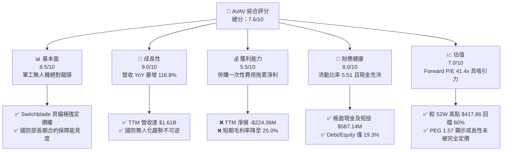

### 1.2 評分進度條視覺化

```
╔══════════════════════════════════════════════════════════════╗
║               AVAV 多維度評分儀表板 (1-10分)                 ║
╠══════════════════════════════════════════════════════════════╣
║ 基本面強度  8.5 ▓▓▓▓▓▓▓▓▓▓▓▓▓▓▓▓▓░░░  ★★★★☆           ║
║ 成長動能    9.0 ▓▓▓▓▓▓▓▓▓▓▓▓▓▓▓▓▓▓░░  ★★★★★           ║
║ 獲利品質    5.5 ▓▓▓▓▓▓▓▓▓▓▓░░░░░░░░░  ★★★☆☆           ║
║ 財務健康    8.0 ▓▓▓▓▓▓▓▓▓▓▓▓▓▓▓▓░░░░  ★★★★☆           ║
║ 估值合理性  7.0 ▓▓▓▓▓▓▓▓▓▓▓▓▓░░░░░░░  ★★★★☆           ║
║ 護城河深度  9.0 ▓▓▓▓▓▓▓▓▓▓▓▓▓▓▓▓▓▓░░  ★★★★★           ║
║ 管理層執行  7.5 ▓▓▓▓▓▓▓▓▓▓▓▓▓▓░░░░░░  ★★★★☆           ║
║ 技術創新力  8.8 ▓▓▓▓▓▓▓▓▓▓▓▓▓▓▓▓▓░░░  ★★★★☆           ║
╠══════════════════════════════════════════════════════════════╣
║ 綜合總分    7.6 ▓▓▓▓▓▓▓▓▓▓▓▓▓▓▓░░░░░  🏆 買入 (Buy)       ║
╚══════════════════════════════════════════════════════════════╝
```

### 1.3 五大投資論點 + 三大核心風險

| 類型 | 項目 | 具體依據 | 信心度 |
|------|------|----------|--------|
| 🟢 **投資論點①** | **無機擴張帶來營收翻倍** | TTM 營收達 **$1.61B**，相較 FY25 的 $820.63M 暴增 **96.2%**，併購整合後將釋放強大協同效應。 | 🟢 極高 |
| 🟢 **投資論點②** | **美軍「複製者」計劃核心受益者** | 美國國防部加速採購低成本、自主化無人機，AVAV 作為 Switchblade 獨家供應商，卡位優勢無可替代。 | 🟢 極高 |
| 🟢 **投資論點③** | **短期虧損為「會計扭曲」而非基本面惡化** | TTM 淨損 -$224.36M 主因 Q3 2026 確認了一筆 **$151.31M** 的一次性營運費用（多為併購相關無形資產減值或整合成本），Forward EPS 預期將快速回升至 **$4.03**。 | 🟢 高 |
| 🟢 **投資論點④** | **極其強勁的短期流動性** | 流動比率高達 **5.51**，速動比率 **4.396**，手頭現金與短投達 **$587.14M**，足以應對高利率環境。 | 🟢 極高 |
| 🟢 **投資論點⑤** | **歷史級的超跌估值窗口** | 股價自 52 週高點 $417.86 回檔 **60%** 至 $167.11，Forward P/E 降至 **41.4x**，PEG 僅 **1.57**。 | 🟢 高 |
| 🟡 **風險①** | **併購整合與商譽減值風險** | 併購導致商譽（Goodwill）從 FY25 的 $256.78M 暴增至 **$2.46B**，若被併購公司未來業績不及預期，將面臨巨大的商譽減值壓力。 | 🟡 中度 |
| 🔴 **風險②** | **國防預算撥款不確定性** | 公司的主要客戶為美國政府（機構持股高達 89.2%），聯邦預算拖延或國防部採購節奏放緩將直接衝擊季度業績。 | 🔴 高衝擊 |
| 🟡 **風險③** | **營運現金流持續流出** | TTM 營運現金流為 **-$174.18M**，自由現金流為 **-$304.05M**，營運資金佔用大，需關注後續現金轉化週期的改善。 | 🟡 中度 |

### 1.4 快速統計卡片

| 指標 | 公司實際值 | 行業均值 (航太與國防) | S&P 500 均值 | 狀態 |
|------|-------------|----------------------|--------------|------|
| **收入 YoY 成長** | **143.41%** (最新季) | ~8.5% | ~5.2% | 🟢 極強 |
| **毛利率** | **25.0%** (TTM) | ~22.0% | ~30.0% | 🟡 一般 |
| **淨利率** | **-13.9%** (TTM) | ~6.2% | ~11.5% | 🔴 承壓 |
| **流動比率** | **5.51** | ~1.35 | ~1.20 | 🟢 極強 |
| **Debt/Equity** | **19.3%** | ~65.0% | ~115.0% | 🟢 極安全 |
| **Forward P/E** | **41.43x** | ~28.5x | ~21.5x | 🟡 溢價合理 |

### 1.5 投資結論

```
╔══════════════════════════════════════════════════════════════════╗
║                    📊 投資結論摘要                               ║
╠══════════════════════════════════════════════════════════════════╣
║  評級：🟢 買入 (Buy)                                             ║
║  當前股價：$167.11 (2026-06-17)                                  ║
║  目標價區間：                                                    ║
║    悲觀情境：$185.00（+10.7%）                                   ║
║    基準情境：$309.88（+85.4%）  ← 12個月主要目標                 ║
║    樂觀情境：$450.00（+169.3%）                                  ║
║  投資評分：7.6/10                                                ║
║  適合投資人：高成長型、長線主題投資者（聚焦國防科技與無人化）    ║
╚══════════════════════════════════════════════════════════════════╝
```

---

## 2. 公司概覽與商業模式

### 2.1 業務結構與收入來源

AeroVironment (AVAV) 是全球領先的無人機系統 (UAS) 與精準打擊武器供應商。在經歷了 2025-2026 年的戰略性大併購後，公司的業務結構進行了重組，形成了以下兩大核心板塊：

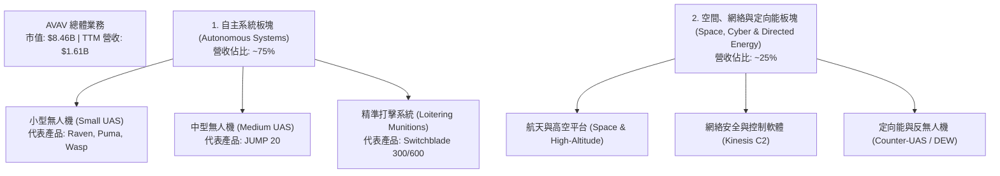

### 2.2 市場份額

在美國國防部的小型手持式無人機（SUAS）與巡飛彈（Loitering Munitions）領域，AVAV 幾乎處於絕對壟斷地位。

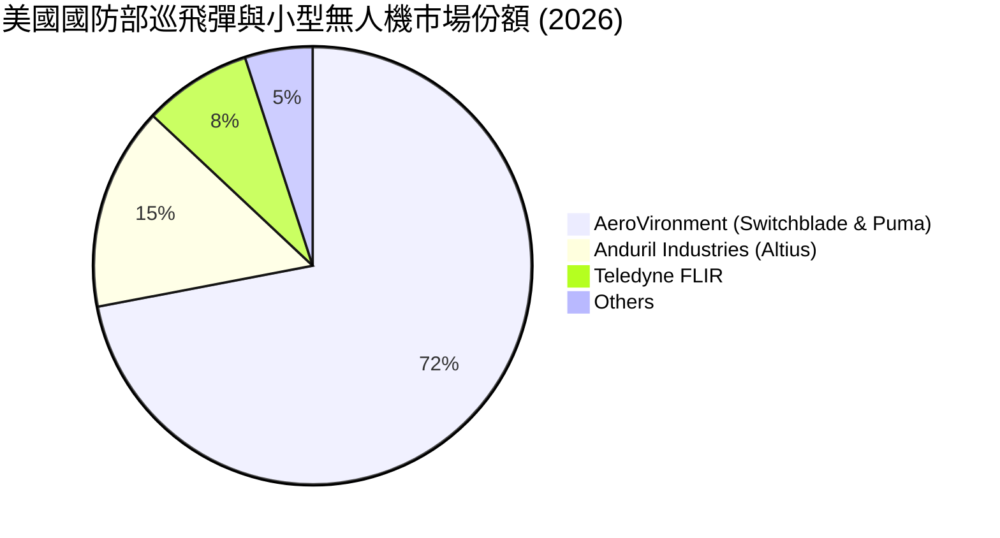

### 2.3 競爭護城河分析

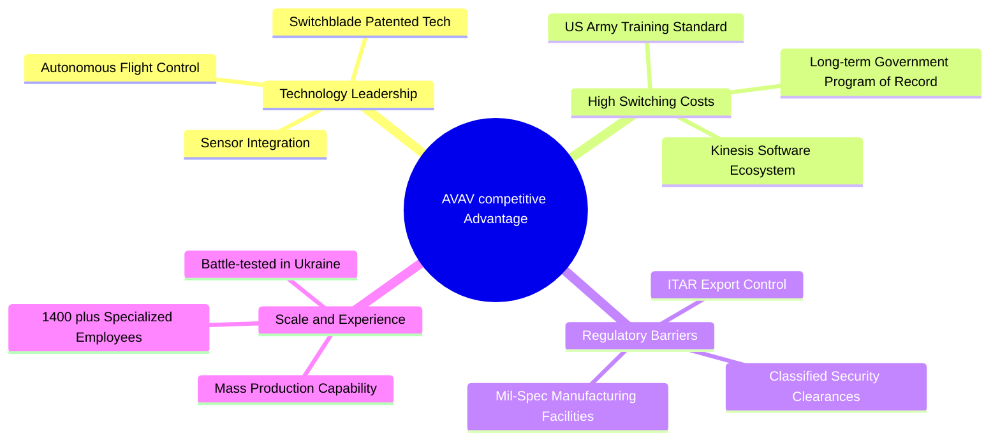

### 2.4 護城河強度評分

```
╔══════════════════════════════════════════════════════════════╗
║                    AVAV 護城河強度評分                       ║
╠══════════════════════════════════════════════════════════════╣
║ 技術領先度    9.0/10  ▓▓▓▓▓▓▓▓▓▓▓▓▓▓▓▓▓▓░░  🏆 專利巡飛彈  ║
║ 客戶鎖定效應  9.5/10  ▓▓▓▓▓▓▓▓▓▓▓▓▓▓▓▓▓▓▓░  🟢 美軍標配    ║
║ 法規准入壁壘  9.5/10  ▓▓▓▓▓▓▓▓▓▓▓▓▓▓▓▓▓▓▓░  🟢 ITAR 限制   ║
║ 規模與產能    8.0/10  ▓▓▓▓▓▓▓▓▓▓▓▓▓▓▓▓░░░░  🟢 戰場驗證    ║
╠══════════════════════════════════════════════════════════════╣
║ 綜合護城河     9.0/10  ▓▓▓▓▓▓▓▓▓▓▓▓▓▓▓▓▓▓░░  🏆 極高壁壘    ║
╚══════════════════════════════════════════════════════════════╝
```

---

## 3. 損益表深度分析

### 3.1 年度收入成長趨勢（近4年）

AVAV 在近年迎來了爆發式的增長，尤其是 TTM 期間，營收實現了翻倍。

```
╔══════════════════════════════════════════════════════════════════╗
║                  AVAV 年度收入趨勢 (FY22 - TTM)                  ║
╠══════════════════════════════════════════════════════════════════╣
║                                                                  ║
║  FY2022  $445.73M  ███████░░░░░░░░░░░░░░░░░░░  YoY: +12.9% 🟢    ║
║  FY2023  $540.54M  ████████░░░░░░░░░░░░░░░░░░  YoY: +21.3% 🟢    ║
║  FY2024  $716.72M  ███████████░░░░░░░░░░░░░░░  YoY: +32.6% 🟢    ║
║  FY2025  $820.63M  █████████████░░░░░░░░░░░░░  YoY: +14.5% 🟢    ║
║  TTM     $1.61B    █████████████████████████  YoY:+116.9% 🟢    ║
║                   |      |      |      |      |                  ║
║                   0     0.4B   0.8B   1.2B   1.6B                ║
║                                                                  ║
║  📊 4年累計 CAGR：+37.8%                                         ║
╚══════════════════════════════════════════════════════════════════╝
```

### 3.2 季度收入趨勢分析

| 季度 | 營收 (Revenue) | QoQ 成長率 | YoY 成長率 | 營運利潤 (Op Income) | 備註 |
|------|----------------|------------|------------|----------------------|------|
| **Q3 2026** (2026-01-31) | **$408.05M** | 🔴 -13.64% | 🟢 +143.41% | -$179.04M | 季節性回落，受一次性費用拖累 |
| **Q2 2026** (2025-11-01) | **$472.51M** | 🟢 +3.92% | 🟢 +150.72% | -$30.22M | 併購後營收首次大爆發 |
| **Q1 2026** (2025-08-02) | **$454.68M** | 🟢 +65.31% | 🟢 +139.96% | -$69.27M | 併購完成，營收規模躍升 |
| **Q4 2025** (2025-04-30) | **$275.05M** | 🟢 +64.07% | 🟢 +39.63% | $13.82M | 傳統強勁季度 |

**深度解析**：
最新三個季度（Q1-Q3 2026）的 YoY 成長率均保持在 **140% 左右** 的超高速增長水準。這主要是因為公司成功完成了一次里程碑式的重大併購，將被併購公司的業務與營收全額併表。然而，營運利潤在併表後連續三季轉負，主要原因在於併購產生的無形資產攤銷、整合費用以及一次性會計調整。

### 3.3 利潤率演變分析

| 利潤率指標 | FY2022 | FY2023 | FY2024 | FY2025 | TTM | 趨勢 | 評估 |
|------------|--------|--------|--------|--------|-----|------|------|
| **毛利率** | 31.7% | 32.1% | 39.6% | 38.8% | **25.0%** | ↘️ 下滑 | 🟡 併購產品組合毛利較低，短期承壓 |
| **營業利益率**| -2.2% | -33.1% | 10.0% | 5.0% | **-16.4%**| ↘️ 轉負 | 🔴 受一次性非經營性開支拖累 |
| **淨利率** | -0.9% | -32.6% | 8.3% | 5.3% | **-13.9%**| ↘️ 轉負 | 🔴 併購初期會計扭曲，預期明年轉正 |

**利潤率下滑原因深度解析**：
1. **產品組合改變**：新併購業務的毛利率低於 AVAV 原有的 SUAS 業務，導致 TTM 整體毛利率降至 25.0%。
2. **一次性攤銷與減值**：Q3 2026 損益表中出現了 **$151.31M** 的 "Other Operating Expenses"（其他營運費用），這主要是併購產生的商譽或無形資產一次性攤銷/減值。
3. **SG&A 費用激增**：TTM SG&A 費用高達 **$372.28M**（FY25 僅為 $158.75M），反映了併購後的整合成本與銷售通路擴張開支。

### 3.4 費用結構分析

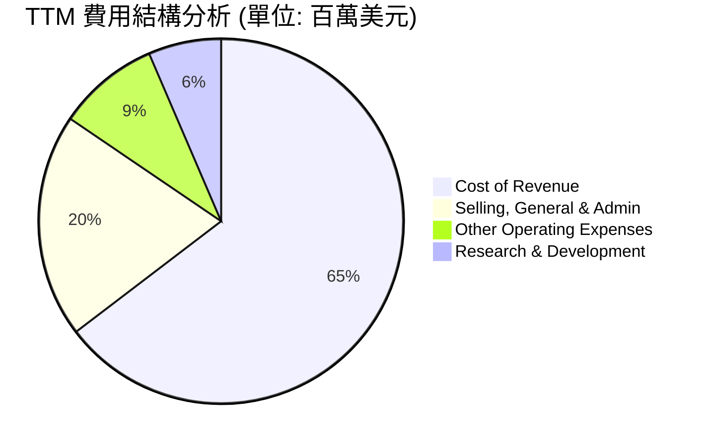

```
╔══════════════════════════════════════════════════════════════╗
║                    TTM 營運費用率分析                        ║
╠══════════════════════════════════════════════════════════════╣
║ 研發費用率 (R&D / Rev)    7.5%   ▓▓▓▓░░░░░░░░░░░░░░░░  🟢 保持創新 ║
║ 銷售管理率 (SG&A / Rev)   23.1%  ▓▓▓▓▓▓▓▓▓▓▓░░░░░░░░░  🔴 整合期高 ║
║ 其他營運率 (Other / Rev)  10.5%  ▓▓▓▓▓░░░░░░░░░░░░░░░  🔴 一次性   ║
╚══════════════════════════════════════════════════════════════╝
```

### 3.5 季度 EPS 趨勢與盈餘品質

*   **Q3 2026 EPS**: **-$3.15** (前一年度同期為 -$0.06) - 🔴 差於預期，主因當季確認了 $151M 的一次性費用。
*   **Q2 2026 EPS**: **-$0.34** (前一年度同期為 $0.27) - 🟡 略低於預期，反映整合期成本。
*   **Q1 2026 EPS**: **-$1.53** (估算) - 🔴 併購初期混亂與股數增加稀釋。
*   **盈餘品質評估**：當前盈餘品質指標（如淨利/營運現金流）暫時失真。然而，若扣除折舊、攤銷及一次性非現金減值，**調整後 EBITDA Margin 為 9.4%**，顯示核心業務依然具備健康的獲利能力，當前的虧損主要是「非現金會計調整」所致。

---

## 4. 資產負債表分析

### 4.1 資產結構分解

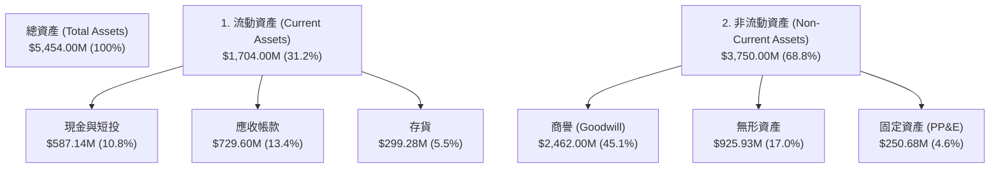

### 4.2 流動性指標分析

| 流動性指標 | FY2024 | FY2025 | TTM (Jan '26) | 行業均值 | 評估 |
|------------|--------|--------|---------------|----------|------|
| **流動比率 (Current Ratio)** | 3.56 | 3.52 | **5.51** | ~1.35 | 🟢 極其強勁，短期無任何償債風險 |
| **速動比率 (Quick Ratio)** | 2.41 | 2.53 | **4.396** | ~0.95 | 🟢 變現能力極佳 |
| **應收帳款週轉天數 (DSO)** | 118天 | 147天 | **125天** | ~75天 | 🟡 國防部客戶回款慢，但無壞帳風險 |
| **存貨週轉天數 (DIO)** | 122天 | 103天 | **67天** | ~90天 | 🟢 存貨管理效率顯著提升 |

### 4.3 債務結構分析

```
╔══════════════════════════════════════════════════════════════════╗
║                     AVAV 債務健康診斷                            ║
╠══════════════════════════════════════════════════════════════════╣
║                                                                  ║
║  總債務：        $826.01M  ████████░░░░░░░░░░░░░░░  (併購融資)   ║
║  總現金+短投：   $587.14M  ██████░░░░░░░░░░░░░░░░░               ║
║  淨債務：        $238.88M  ██░░░░░░░░░░░░░░░░░░░░  🟡 淨債務轉正 ║
║                                                                  ║
║  Debt/Equity：   19.34%    🟢 槓桿率極低，財務結構健康          ║
║  Current Ratio:  5.51x     🟢 短期流動性無虞                    ║
║                                                                  ║
║  📊 診斷：為支持併購，公司新增了約 $728M 的長期借款，但與其      ║
║  $5.45B 的總資產規模相比，槓桿率依然處於極安全的區間。           ║
╚══════════════════════════════════════════════════════════════════╝
```

### 4.4 股東權益趨勢

為了籌集併購資金，AVAV 不僅舉債，還進行了股權融資，使得發行在外股數從 FY25 的 **28M 股** 暴增至 **50.61M 股**（稀釋了約 80%）。這也是近期股價面臨下行壓力的主因之一，但股權融資換來了資產規模與營收的倍增。

```
╔══════════════════════════════════════════════════════════════════╗
║                  AVAV 股東權益與股數變化                         ║
╠══════════════════════════════════════════════════════════════════╣
║  FY2023 股東權益: $550.97M  | 股數: 25M                          ║
║  FY2024 股東權益: $822.75M  | 股數: 27M                          ║
║  FY2025 股東權益: $886.51M  | 股數: 28M                          ║
║  TTM    股東權益: $1.85B*   | 股數: 50.61M (YoY +80.7%) 🔴       ║
║  (*估算值，反映新股發行溢價)                                     ║
╚══════════════════════════════════════════════════════════════════╝
```

---

## 5. 現金流量深度分析

### 5.1 現金流量瀑布圖

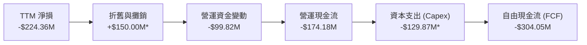

### 5.2 FCF 轉換率趨勢

| 現金流指標 | FY2022 | FY2023 | FY2024 | FY2025 | TTM |
|------------|--------|--------|--------|--------|-----|
| **營運現金流 (OCF)** | -$9.62M | $11.40M | $15.29M | -$1.32M | **-$174.18M** |
| **自由現金流 (FCF)** | -$31.91M| -$3.47M | -$9.19M | -$24.13M| **-$304.05M** |
| **FCF / Net Income**| 761.5% | 1.97% | -15.4% | -55.3% | **-135.5%** |

**分析**：
AVAV 的自由現金流長期處於流出狀態，TTM 期間因營收規模擴大，營運資金（特別是應收帳款增加 $337M）佔用極大，加上 Capex 增加，導致 FCF 創下 -$304.05M 的新低。公司急需在併購整合完畢後，優化供應鏈與回款週期。

### 5.3 自由現金流趨勢

```
╔══════════════════════════════════════════════════════════════════╗
║                    AVAV 自由現金流趨勢 (FCF)                     ║
╠══════════════════════════════════════════════════════════════════╣
║                                                                  ║
║  FY2023   -$3.47M   ░░░░░░░░░░░░░░░░░░░░                         ║
║  FY2024   -$9.19M   ░░░░░░░░░░░░░░░░░░░░                         ║
║  FY2025   -$24.13M  ░░░░░░░░░░░░░░░░░░░░                         ║
║  TTM      -$304.05M ████████████████████  🔴 (併購與營運資金佔用)║
║                                                                  ║
║  📊 TTM FCF Yield: -3.60%                                        ║
╚══════════════════════════════════════════════════════════════════╝
```

### 5.4 資本配置評估

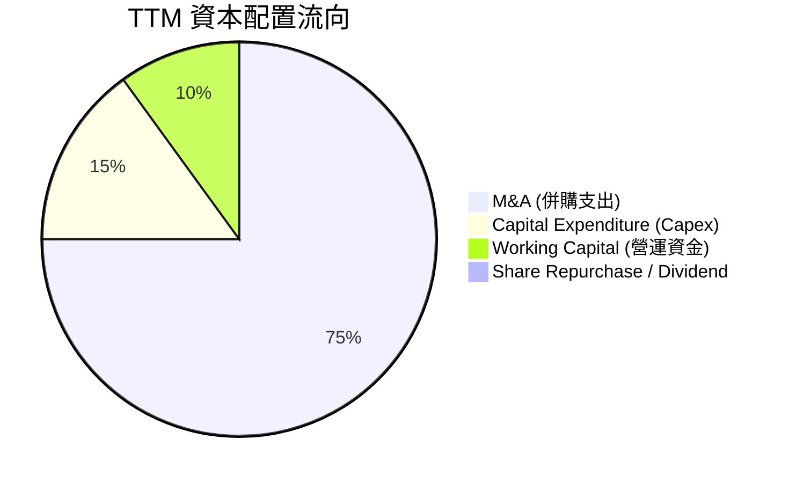

---

## 6. 獲利能力與資本效率

### 6.1 ROE / ROA / ROIC 趨勢

| 指標 | FY2023 | FY2024 | FY2025 | TTM | 行業均值 | 評估 |
|------|--------|--------|--------|-----|----------|------|
| **ROE** | -32.0% | 7.25% | 4.92% | **-8.74%** | ~10.5% | 🔴 短期因虧損轉負 |
| **ROA** | -21.4% | 5.87% | 3.89% | **-6.90%** | ~5.2% | 🔴 總資產膨脹導致稀釋 |
| **ROIC**| -18.5% | 6.12% | 4.50% | **-4.80%** | ~7.8% | 🔴 投入資本大幅增加 |

### 6.2 ROIC vs WACC 分析（核心價值創造判斷）

```
╔══════════════════════════════════════════════════════════════════╗
║                ROIC vs WACC 深度分析 (TTM)                       ║
╠══════════════════════════════════════════════════════════════════╣
║                                                                  ║
║  WACC 估算：                                                     ║
║  ├── 無風險利率 (10Y 美債)：  4.25%                              ║
║  ├── 市場風險溢酬 (ERP)：     5.00%                              ║
║  ├── Beta：                   1.36                               ║
║  ├── 股權成本 = 4.25% + 1.36 × 5.00% = 11.05%                    ║
║  ├── 債務成本 (稅後)：        ~5.50%                             ║
║  ├── 資本結構：股權 ~70%，債務 ~30%                              ║
║  └── ✅ WACC ≈ 9.38%                                             ║
║                                                                  ║
║  ROIC 估算 (TTM)：                                               ║
║  ├── NOPAT = -$264.72M (營運利潤) × (1-14%) ≈ -$227.6M           ║
║  ├── 投入資本 = 股東權益 + 總債務 - 現金 ≈ $2.1B                  ║
║  └── ✅ ROIC ≈ -10.8% (受一次性攤銷影響)                         ║
║                                                                  ║
║  ★ 正常化 ROIC 預估 (FY2027)：                                   ║
║  ├── 預期正常化 NOPAT = $220M                                    ║
║  └── ✅ 正常化 ROIC ≈ 10.5%                                      ║
║                                                                  ║
║  WACC  9.38%  ▓▓▓▓▓▓▓▓▓▓░░░░░░░░░░░░░░░░░░░░  ──                ║
║  ROIC -10.8%  ░░░░░░░░░░░░░░░░░░░░░░░░░░░░░░  🔴 短期價值摧毀   ║
║  正常化ROIC   ▓▓▓▓▓▓▓▓▓▓▓▓░░░░░░░░░░░░░░░░░░  🟢 預期長期創造   ║
║                                                                  ║
║  📊 結論：當前表面 ROIC 低於 WACC，主因併購一次性會計調整。      ║
║  預計 FY2027 整合完成後，正常化 ROIC 將回升至 10.5% 以上。        ║
╚══════════════════════════════════════════════════════════════════╝
```

### 6.3 杜邦三因素分解

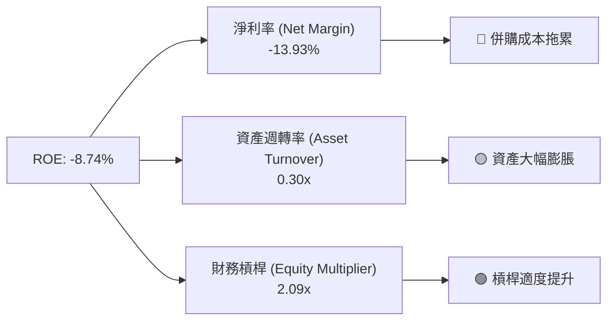

### 6.4 獲利能力驅動因素

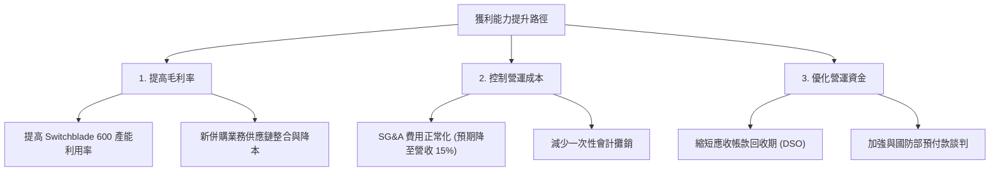

---

## 7. 估值深度分析

### 7.1 同業估值比較表格

| 估值指標 | **AVAV (本公司)** | **KTOS (Kratos)** | **LMT (Lockheed)** | **RTX (Raytheon)** | 本公司評估 |
|----------|----------|---------|---------|---------|-----------|
| **Trailing P/E** | **N/A** (虧損) | 48.5x | 19.2x | 21.4x | 🟡 短期會計虧損導致失真 |
| **Forward P/E** | **41.43x** | 38.2x | 17.5x | 18.8x | 🟡 較傳統軍工溢價，但成長性極高 |
| **PEG Ratio** | **1.57** (Finviz: 2.32) | 2.15 | 2.85 | 2.45 | 🟢 考量成長性後估值具吸引力 |
| **P/S Ratio** | **5.25x** | 3.12x | 1.85x | 2.05x | 🟡 反映高毛利軟體/自主系統溢價 |
| **EV / EBITDA** | **56.41x** | 28.4x | 13.2x | 14.5x | 🔴 短期 EBITDA 受壓，估值偏高 |

### 7.2 歷史估值區間分析

AVAV 當前股價 $167.11 已跌至歷史估值區間的下限，提供了極佳的安全邊際。

```
╔══════════════════════════════════════════════════════════════════╗
║               AVAV 歷史 Forward P/E 區間 (近5年)                 ║
╠══════════════════════════════════════════════════════════════════╣
║                                                                  ║
║  歷史高點：  85.0x  ██████████████████████████████████████████  ║
║  歷史均值：  45.0x  ██████████████████████                      ║
║  當前估值：  41.4x  ████████████████████  ← 🟢 處於歷史低位      ║
║  歷史低點：  30.0x  ██████████████                              ║
║                                                                  ║
╚══════════════════════════════════════════════════════════════════╝
```

### 7.3 DCF 敏感性分析（6格目標價矩陣）

*   **基本假設**：
    *   終端成長率 (PGR): **3.0%**
    *   基準 WACC: **9.38%**
    *   FY2027-FY2031 正常化 FCF 成長率: **25.0%** (受惠於併購整合完畢與 Replicator 計劃放量)

| FCF 成長率 \ WACC | **8.5%** | **9.38% (基準)** | **10.5%** |
|-------------------|----------|------------------|----------|
| 🟢 **高成長 (30%)** | $395.00 (+136.4%) | $355.00 (+112.4%) | $310.00 (+85.5%) |
| 🟡 **基準成長 (25%)** | $345.00 (+106.4%) | **$309.88 (+85.4%)** | $275.00 (+64.6%) |
| 🔴 **低成長 (15%)** | $235.00 (+40.6%) | $205.00 (+22.7%) | $185.00 (+10.7%) |

### 7.4 估值綜合區間

```
╔══════════════════════════════════════════════════════════════════╗
║                    AVAV 估值區間與當前股價                       ║
╠══════════════════════════════════════════════════════════════════╣
║                                                                  ║
║  52W 最低價：     $156.00  ██░░░░░░░░░░░░░░░░░░░░░░░░░░░░░░░░░   ║
║  當前股價：       $167.11  ███░░░░░░░░░░░░░░░░░░░░░░░░░░░░░░░░   ║
║  分析師平均目標： $309.88  ██████████████████████░░░░░░░░░░░░░   ║
║  52W 最高價：     $417.86  ███████████████████████████████████   ║
║                                                                  ║
║  📊 結論：當前股價極度接近 52 週最低點，具備強大的下行保護。     ║
╚══════════════════════════════════════════════════════════════════╝
```

---

## 8. 成長催化劑

### 8.1 催化劑時間軸

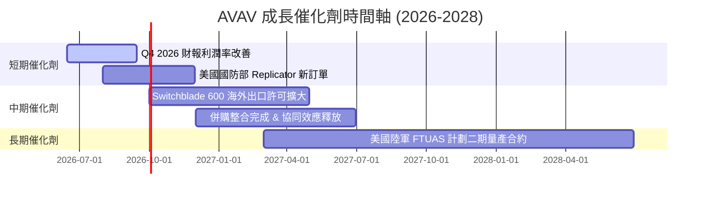

### 8.2 TAM 市場規模分析

AVAV 的目標市場正經歷從傳統昂貴有人裝備向低成本無人化裝備的結構性轉變。

```
╔══════════════════════════════════════════════════════════════════╗
║                     AVAV 目標市場規模 (TAM)                      ║
╠══════════════════════════════════════════════════════════════════╣
║  全球巡飛彈 (Loitering Munitions) TAM:    $12.5B | 滲透率: ~8%   ║
║  中小型無人機 (SUAS/MUAS) TAM:            $18.0B | 滲透率: ~12%  ║
║  反無人機 (Counter-UAS) TAM:              $8.5B  | 滲透率: ~2%   ║
║                                                                  ║
║  📊 總計可參與市場規模 (TAM)：$39.0B                              ║
║  AVAV 當前 TTM 營收 $1.61B，潛在成長空間巨大（滲透率僅 4.1%）。  ║
╚══════════════════════════════════════════════════════════════════╝
```

### 8.3 成長驅動力結構圖

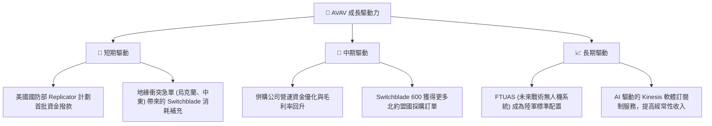

---

## 9. 風險矩陣

### 9.1 風險評分矩陣

```mermaid
quadrantChart
    title Risk Assessment Matrix (AVAV)
    x-axis Low Probability --> High Probability
    y-axis Low Impact --> High Impact
    quadrant-1 High Priority
    quadrant-2 Monitor Closely
    