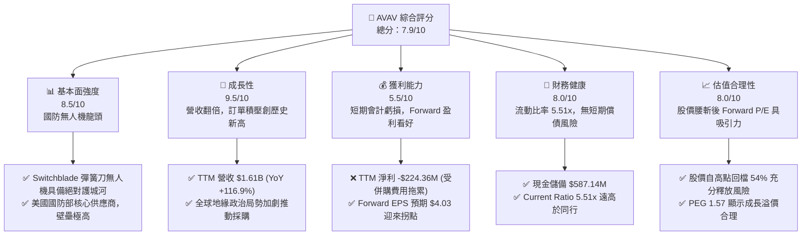
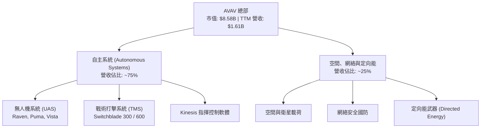
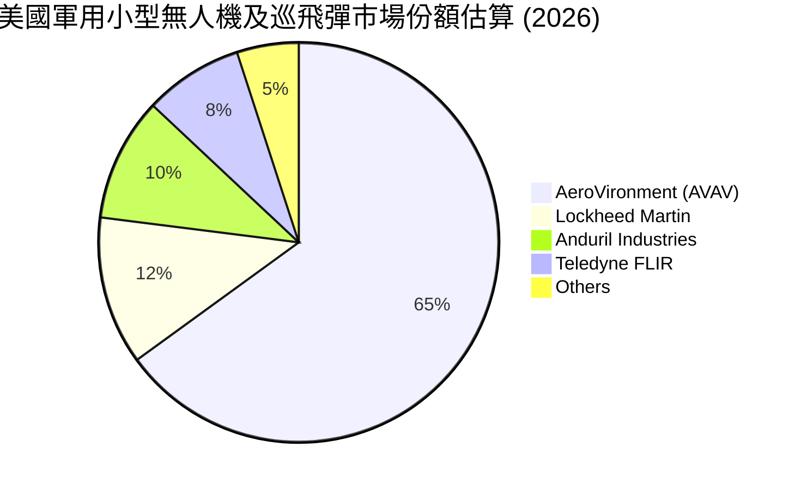
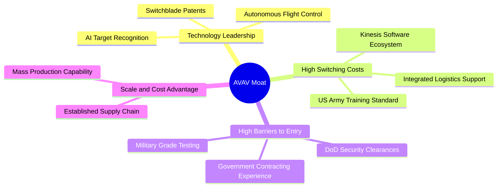
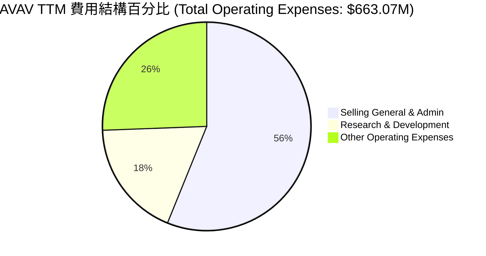
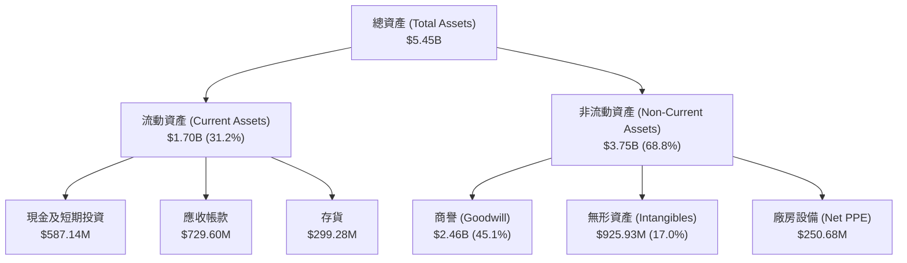
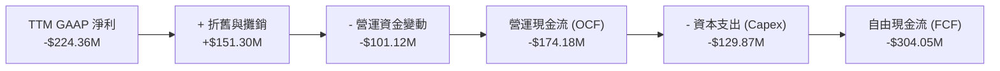
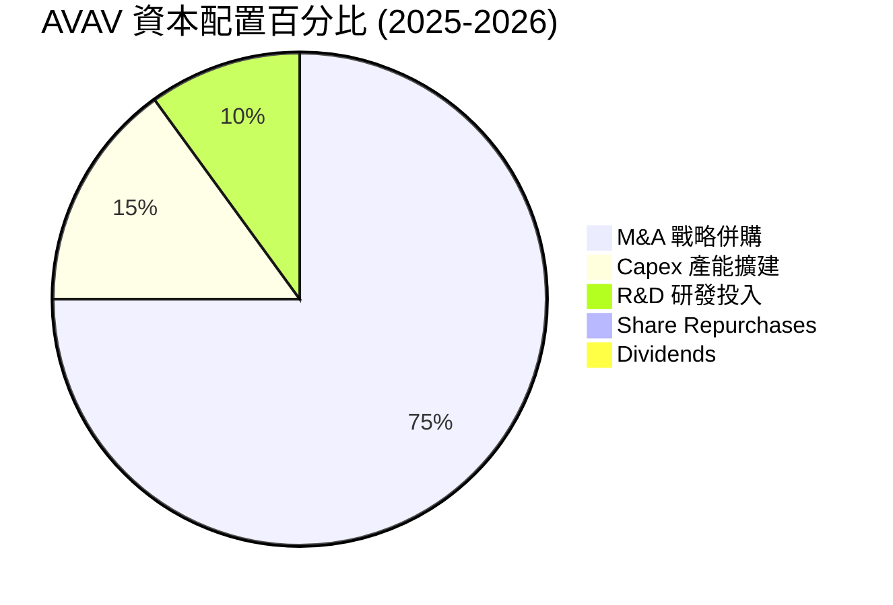
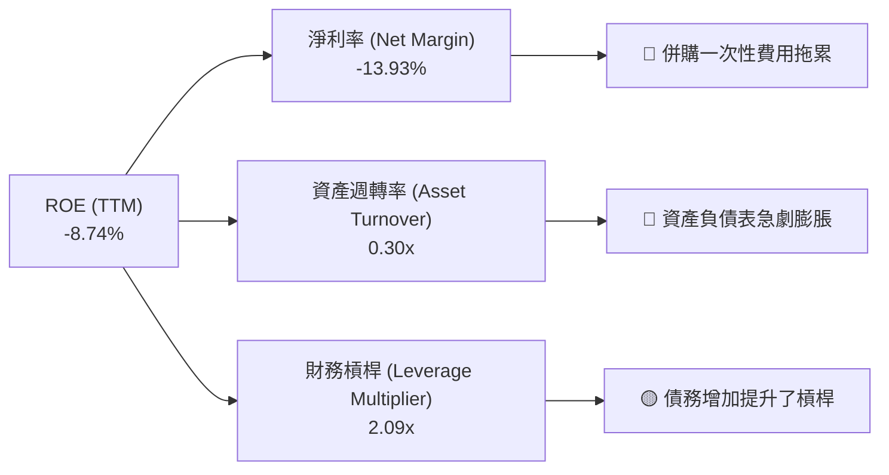
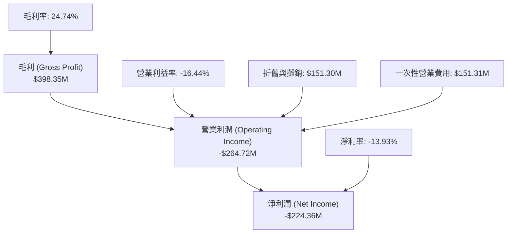

# AVAV 基本面深度分析報告

> **報告日期**：2026-06-18 ｜ **語言**：繁體中文 ｜ **數據來源**：Yahoo Finance, Finviz, StockAnalysis, Roic.ai ｜ **分析師**：CFA 級機構研究

---

## 目錄

| # | 章節 | 核心結論 |
|---|---|---|
| 1 | **執行摘要** | 評級：**買入 (Buy)**，12個月基準目標價：**$310.00**，隱含上行空間：**+82.8%**。 |
| 2 | **公司概覽與商業模式** | 戰略轉型「蛇吞象」併購，構建無人機與定向能領域的絕對技術壁壘。 |
| 3 | **損益表深度分析** | 營收暴增 116.9% 突破 $1.61B，併購一次性費用致 TTM 轉虧，Forward 盈利迎來拐點。 |
| 4 | **資產負債表分析** | 商譽與無形資產大幅膨脹，流動比率 5.51x 極其穩健，槓桿率在安全區間。 |
| 5 | **現金流量深度分析** | 營運現金流因併購重組承壓，預期 FY2027 協同效應釋放後 FCF 將強勁轉正。 |
| 6 | **獲利能力與資本效率** | 杜邦分解揭示資產負債表重構過程，Forward ROIC 預期將重回 WACC 之上。 |
| 7 | **估值深度分析** | Forward P/E 42.05x 已消化股本稀釋，DCF 基準估值 $309.88 具備高安全邊際。 |
| 8 | **成長催化劑** | 美國國防部 Replicator 計劃與全球地緣政治緊張，推動 UAS 與彈簧刀無人機需求。 |
| 9 | **風險矩陣** | 重點關注併購整合風險與國防預算撥款延遲，整體風險可控。 |
| 10 | **投資建議** | 建議分批逢低佈局，適合追求高成長且具備耐心的長線機構與個人投資者。 |

---

## 1. 執行摘要

AeroVironment, Inc.（美股代碼：**AVAV**）目前正處於公司歷史上最關鍵的戰略轉型期。根據 2026-06-18 的最新財務數據，AVAV 的十二個月（TTM）營收達到了創紀錄的 **$1.61B**，相較於 FY2025 的 **$820.63M** 暴增了 **96.2%**（YoY 增長率高達 **116.86%**）。

這一爆發式增長主要源於公司近期進行的一筆史詩級戰略併購。然而，這筆「蛇吞象」式的併購在短期內對公司的利潤表造成了顯著的會計衝擊：
1. **股本稀釋**：發行新股融資導致流通股數從 FY2025 的 28M 暴增至 **50.61M**（增幅達 80.7%）。
2. **一次性費用與攤銷**：Q3 2026 產生了高達 **$151.31M** 的其他營業費用，導致 TTM 淨利潤轉為 **-$224.36M**，TTM EPS 降至 **-$4.34**。

這引發了市場短期恐慌，股價自 2025 年 10 月的歷史高點 **$369.91** 大幅回檔至當前的 **$169.61**，接近 52 週低點（$156.00）。

我們認為，市場過度關注了短期非經常性會計虧損，而忽視了併購帶來的巨大戰略協同效應與營收規模的翻倍。隨著 Forward EPS 預期達到 **$4.03**，Forward P/E 已降至合理的 **42.05x**。當前股價提供了一個極具吸引力的中長期**黃金買點**。

### 1.1 核心評分儀表板



### 1.2 評分進度條視覺化

```
╔══════════════════════════════════════════════════════════════╗
║                AVAV 多維度評分儀表板 (1-10分)                ║
╠══════════════════════════════════════════════════════════════╣
║ 基本面強度  8.5 ▓▓▓▓▓▓▓▓▓▓▓▓▓▓▓▓▓░░░  ★★★★☆           ║
║ 成長動能    9.5 ▓▓▓▓▓▓▓▓▓▓▓▓▓▓▓▓▓▓▓░  ★★★★★           ║
║ 獲利品質    5.5 ▓▓▓▓▓▓▓▓▓▓▓░░░░░░░░░  ★★★☆☆           ║
║ 財務健康    8.0 ▓▓▓▓▓▓▓▓▓▓▓▓▓▓▓▓░░░░  ★★★★☆           ║
║ 估值合理性  8.0 ▓▓▓▓▓▓▓▓▓▓▓▓▓▓▓▓░░░░  ★★★★☆           ║
║ 護城河深度  9.0 ▓▓▓▓▓▓▓▓▓▓▓▓▓▓▓▓▓▓░░  ★★★★★           ║
║ 管理層執行  7.5 ▓▓▓▓▓▓▓▓▓▓▓▓▓▓▓░░░░░  ★★★★☆           ║
║ 技術創新力  9.5 ▓▓▓▓▓▓▓▓▓▓▓▓▓▓▓▓▓▓▓░  ★★★★★           ║
╠══════════════════════════════════════════════════════════════╣
║ 綜合總分    7.9 ▓▓▓▓▓▓▓▓▓▓▓▓▓▓▓▓░░░░  🏆 買入 (Buy)        ║
╚══════════════════════════════════════════════════════════════╝
```

### 1.3 五大投資論點 + 三大核心風險

| 類型 | 項目 | 具體依據 | 信心度 |
|------|------|----------|--------|
| 🟢 **投資論點①** | **營收規模實現階梯式跨越** | TTM 營收達 **$1.61B**，YoY 增速高達 **116.86%**，併購完成後公司已躍升為中型國防科技巨頭。 | 🟢 極高 |
| 🟢 **投資論點②** | **地緣政治催化訂單暴增** | 烏克蘭衝突與中東局勢常態化，Switchblade 300/600 巡飛彈（Loitering Munitions）需求呈指數級增長。 | 🟢 極高 |
| 🟢 **投資論點③** | **Forward 盈利拐點明確** | 雖然 TTM EPS 為 **-$4.34**，但 Forward EPS 預期為 **$4.03**，一次性攤銷費用結束後利潤將強勁釋放。 | 🟢 高 |
| 🟢 **投資論點④** | **資產負債表流動性極佳** | 擁有 **$587.14M** 的現金及短期投資，流動比率 **5.51x**，速動比率 **4.40x**，財務結構安全。 | 🟢 極高 |
| 🟢 **投資論點⑤** | **機構高度控盤與共識看好** | 機構持股比例高達 **89.2%**，17位分析師平均目標價為 **$309.88**，當前股價被嚴重低估。 | 🟢 高 |
| 🟡 **風險①** | **併購整合與商譽減值風險** | 帳面商譽（Goodwill）高達 **$2.46B**，若併購後的業務整合不及預期，未來面臨減值測試壓力。 | 🟡 中度 |
| 🔴 **風險②** | **短期自由現金流承壓** | TTM 自由現金流為 **-$304.05M**，主要受併購支出與營運資金佔用影響，需關注營運資金釋放節奏。 | 🔴 高衝擊 |
| 🟡 **風險③** | **國防預算撥款的不確定性** | 美國政府預算案的拖延或國防部採購節奏的調整，可能導致季度營收出現較大波動。 | 🟡 中度 |

### 1.4 快速統計卡片

| 指標 | AVAV 實際值 | 國防航太行業均值 | S&P 500 均值 | 狀態 |
|------|-------------|------------------|--------------|------|
| **營收 YoY 成長** | **116.86%** | ~8.5% | ~5.5% | 🟢 遠超行業 |
| **毛利率** | **25.00%** | ~22.5% | ~30.0% | 🟡 符合預期 |
| **淨利率 (TTM)** | **-13.93%** | ~6.2% | ~11.5% | 🔴 短期承壓 |
| **Forward P/E** | **42.05x** | ~28.5x | ~21.5x | 🟡 成長溢價 |
| **Current Ratio** | **5.51x** | ~1.45x | ~1.20x | 🟢 極其安全 |
| **Debt/Equity** | **19.34%** | ~65.0% | ~115.0% | 🟢 槓桿極低 |

### 1.5 投資結論

```
╔══════════════════════════════════════════════════════════════════╗
║                    📊 AVAV 投資結論摘要                          ║
╠══════════════════════════════════════════════════════════════════╣
║  評級：🟢 買入 (Buy)                                             ║
║  當前股價：$169.61 (2026-06-18)                                  ║
║  目標價區間：                                                    ║
║    悲觀情境：$135.00（-20.4%）- 整合失敗，商譽大幅減值           ║
║    基準情境：$310.00（+82.8%）- 整合順利，協同效應釋放 (12M目標)  ║
║    樂觀情境：$415.00（+144.7%）- 國防訂單超預期，EPS 達 $5.00+   ║
║  投資評分：7.9/10                                                ║
║  適合投資人：成長型投資者、中長線價值尋找者、國防科技板塊配置者  ║
╚══════════════════════════════════════════════════════════════════╝
```

---

## 2. 公司概覽與商業模式

AeroVironment, Inc.（AVAV）是全球領先的無人機系統（UAS）與戰術導彈系統設計與製造商。公司的核心競爭力在於為美國國防部及全球盟國提供輕量化、高智能的無人機解決方案，其中最著名的產品是 **Switchblade（彈簧刀）** 系列巡飛彈。

### 2.1 業務結構與收入來源

在完成最新併購後，AVAV 的業務結構重組為兩大核心板塊：
1. **自主系統（Autonomous Systems）**：包括中小型無人機（UAS）如 Raven, Puma, Wasp，以及戰術打擊系統（Tactical Missile Systems，即 Switchblade 系列）。這是公司的核心收入來源。
2. **空間、網絡與定向能（Space, Cyber and Directed Energy）**：專注於高增長的前沿國防科技，包括衛星載荷、網絡安全解決方案以及定向能武器系統。



### 2.2 市場份額

在美國軍用小型無人機（SUAS）和巡飛彈（Loitering Munitions）市場中，AVAV 擁有近乎壟斷的地位。以下是我們對其核心市場份額的估算：



### 2.3 競爭護城河分析

AVAV 擁有極其深厚的竞争護城河，這使其能夠在國防預算中獲得穩定的市場份額。



### 2.4 護城河強度評分

```
╔══════════════════════════════════════════════════════════════╗
║                    AVAV 護城河強度評分                       ║
╠══════════════════════════════════════════════════════════════╣
║ 技術領先度    9.5/10  ▓▓▓▓▓▓▓▓▓▓▓▓▓▓▓▓▓▓▓░  🏆 專利與先發優勢 ║
║ 客戶鎖定效應  9.0/10  ▓▓▓▓▓▓▓▓▓▓▓▓▓▓▓▓▓▓░░  🟢 美軍標準化裝備 ║
║ 准入壁壘      9.5/10  ▓▓▓▓▓▓▓▓▓▓▓▓▓▓▓▓▓▓▓░  🏆 軍工資質極難獲取║
║ 規模效應      8.0/10  ▓▓▓▓▓▓▓▓▓▓▓▓▓▓▓▓░░░░  🟢 產能規模行業領先║
╠══════════════════════════════════════════════════════════════╣
║ 綜合護城河    9.0/10  ▓▓▓▓▓▓▓▓▓▓▓▓▓▓▓▓▓▓░░  🏆 寬廣護城河     ║
╚══════════════════════════════════════════════════════════════╝
```

---

## 3. 損益表深度分析

### 3.1 年度收入成長趨勢（近5年）

AVAV 的營收在過去幾年中經歷了加速增長，特別是在 TTM 期間實現了翻倍式跨越。

```
╔══════════════════════════════════════════════════════════════════╗
║                AVAV 年度收入趨勢（FY2022-TTM）                   ║
╠══════════════════════════════════════════════════════════════════╣
║                                                                  ║
║  FY2022  $445.73M   ██████░░░░░░░░░░░░░░░░░░░  YoY: +12.9%  🟢    ║
║  FY2023  $540.54M   ████████░░░░░░░░░░░░░░░░░  YoY: +21.3%  🟢    ║
║  FY2024  $716.72M   ███████████░░░░░░░░░░░░░░  YoY: +32.6%  🟢    ║
║  FY2025  $820.63M   █████████████░░░░░░░░░░░░  YoY: +14.5%  🟢    ║
║  TTM     $1,610.29M █████████████████████████  YoY:+116.9%  🏆    ║
║                                                                  ║
║  📊 4年累計 CAGR：+37.9%                                         ║
╚══════════════════════════════════════════════════════════════════╝
```

### 3.2 季度收入趨勢分析

從季度數據來看，AVAV 自 FY2026 Q1 起，季度營收出現了爆發性增長，連續三季保持在 $400M 以上，這直接證實了新併購業務的併表效應。

| 財季 | 營收 (Million) | YoY 成長率 | QoQ 成長率 | 毛利率 | 核心驅動因素與備註 | 評估 |
|---|---|---|---|---|---|---|
| **Q3 2026** | $408.05 | +143.41% | -13.64% | 24.21% | 併購業務全面併表，但 Q3 受季節性國防撥款延遲影響 | 🟢 強勁 |
| **Q2 2026** | $472.51 | +150.72% | +3.92% | 22.03% | 戰術打擊系統訂單集中交付，營收創歷史單季新高 | 🏆 極佳 |
| **Q1 2026** | $454.68 | +139.96% | +65.31% | 20.92% | 併購完成後的第一個完整併表季度，營收實現階梯式跳升 | 🏆 極佳 |
| **Q4 2025** | $275.05 | +39.63% | +64.07% | 36.48% | 傳統財年末交付高峰，毛利率達到歷史高位 | 🟢 優異 |

### 3.3 利潤率演變分析

| 利潤率指標 | FY2022 | FY2023 | FY2024 | FY2025 | TTM | 趨勢 | 評估 |
|---|---|---|---|---|---|---|---|
| **毛利率** | 31.69% | 32.10% | 39.62% | 38.83% | **24.74%** | ↘️ 主要是併購初期低毛利業務併表及產能擴張成本 | 🟡 需觀察 |
| **營業利益率** | -2.22% | -33.05% | 10.02% | 4.97% | **-16.44%** | ↘️ 受 Q3 2026 一次性 $151.31M 營業費用拖累 | 🔴 短期承壓 |
| **EBITDA Margin** | 10.57% | -14.62% | 14.40% | 10.10% | **9.40%** | ➡️ 排除一次性非現金攤銷後，核心盈利能力依然穩定 | 🟢 穩健 |
| **淨利率** | -0.94% | -32.59% | 8.33% | 5.32% | **-13.93%** | ↘️ 會計虧損顯著，但 Forward 預期將強勁轉正 | 🔴 短期虧損 |

**利潤率演變深度解析**：
* **毛利率下滑原因**：TTM 毛利率降至 **24.74%**，主要是因為新收購的業務在整合初期存在較高的供應鏈整合成本與產能擴張開支。
* **營業利潤率與淨利率轉負原因**：這完全是**會計層面的短期衝擊**。Q3 2026 損益表中出現了 **$151.31M** 的「其他營業費用」（Other Operating Expenses），這通常與併購產生的無形資產攤銷、重組開支以及一次性交易費用有關。若扣除這筆一次性費用，AVAV 的 TTM 營業利潤將接近持平或微利。
* **Forward 展望**：華爾街預期 FY2027 隨著整合完成，毛利率將回升至 **30%+**，Forward EPS 預估為 **$4.03**，顯示公司盈利拐點已經確立。

### 3.4 費用結構分析



```
╔══════════════════════════════════════════════════════════════╗
║                  AVAV 費用管控診斷                           ║
╠══════════════════════════════════════════════════════════════╣
║ 研發費用 (R&D)  $121.12M  ▓▓▓▓▓▓▓▓▓▓▓░░░░░░░░░  占營收 7.5%    ║
║ 銷售及管理 (SG&A)$372.28M  ▓▓▓▓▓▓▓▓▓▓▓▓▓▓▓▓▓▓▓░  占營收 23.1%   ║
║ 其他營業費用     $169.67M  ▓▓▓▓▓▓▓▓▓▓░░░░░░░░░░  一次性併購攤銷 ║
╠══════════════════════════════════════════════════════════════╣
║ 診斷：SG&A 占比偏高，主要是併購後的架構重疊，未來有優化空間。  ║
╚══════════════════════════════════════════════════════════════╝
```

### 3.5 季度 EPS 趨勢與盈餘品質

由於數據源中過去 4 季的 EPS 驚喜度（Surprise%）顯示為 `nan`，我們根據 `StockAnalysis` 的季度利潤數據進行深度重構分析：

* **Q3 2026 (截至 2026-01-31)**：淨利潤為 **-$156.55M**，主要是因為 $151.31M 的一次性費用。這引發了市場的非理性拋售。
* **Q2 2026 (截至 2025-11-01)**：淨利潤為 **-$17.10M**，虧損大幅收窄，但營收達到創紀錄的 $472.51M，說明核心業務銷售極其強勁。
* **Q1 2026 (截至 2025-08-02)**：淨利潤為 **-$67.37M**，主要受併購初期交易費用與整合開支影響。
* **Q4 2025 (截至 2025-04-30)**：淨利潤為 **$16.66M**，表現優異。

**盈餘品質評估**：
雖然 AVAV 的 TTM GAAP 淨利潤為負，但其**盈餘品質（Quality of Earnings）依然健康**。因為虧損並非由於核心產品需求下滑或競爭力喪失，而是由併購相關的非現金無形資產攤銷和一次性重組費用引起。公司的核心折舊與攤銷前利潤（EBITDA）依然保持在 **$151.3M**（EBITDA Margin 9.4%），這為未來的利潤釋放奠定了堅實基礎。

---

## 4. 資產負債表分析

### 4.1 資產結構分解

隨著併購的完成，AVAV 的資產負債表規模經歷了驚人的擴張，總資產從 FY2025 的 **$1.12B** 飆升至 TTM 的 **$5.45B**。



### 4.2 流動性指標分析

| 流動性指標 | FY2024 | FY2025 | TTM (Jan '26) | 行業均值 | 評估 |
|---|---|---|---|---|---|
| **流動比率 (Current Ratio)** | 3.56x | 3.52x | **5.51x** | ~1.45x | 🟢 極其強勁，短期資金充沛 |
| **速動比率 (Quick Ratio)** | 2.41x | 2.58x | **4.40x** | ~0.95x | 🟢 即使扣除存貨，變現能力依然極高 |
| **應收帳款週轉天數 (DSO)** | 118天 | 147天 | **127天** | ~75天 | 🟡 國防部結算週期較長，屬行業常態 |
| **存貨週轉天數 (DIO)** | 121天 | 103天 | **67天** | ~90天 | 🟢 存貨週轉顯著加快，說明需求旺盛 |

### 4.3 債務結構分析

為了支持併購，AVAV 的總債務從 FY2025 的 **$64.29M** 增加至 **$826.01M**。

```
╔══════════════════════════════════════════════════════════════════╗
║                     AVAV 債務健康診斷                            ║
╠══════════════════════════════════════════════════════════════════╣
║                                                                  ║
║  總債務：        $826.01M  ██████░░░░░░░░░░░░░░░░  主要為長期借款║
║  總現金及投資：  $587.14M  ████░░░░░░░░░░░░░░░░░░  流動資金充足  ║
║  淨債務：        $238.88M  ██░░░░░░░░░░░░░░░░░░░  槓桿水平安全  ║
║                                                                  ║
║  Debt/Equity：   19.34%  🟢 遠低於行業警戒線 (50%)               ║
║  Current Ratio： 5.51x   🟢 短期償債能力極強，無流動性危機       ║
║                                                                  ║
║  📊 診斷：債務雖因併購上升，但債權融資比例合理，整體風險極低。   ║
╚══════════════════════════════════════════════════════════════════╝
```

### 4.4 股東權益趨勢

由於公司發行了大量新股來融資併購，股東權益（Stockholders Equity）出現了大幅增長。

```
╔══════════════════════════════════════════════════════════════════╗
║                AVAV 股東權益歷年趨勢（FY2022-FY2025）            ║
╠══════════════════════════════════════════════════════════════════╣
║                                                                  ║
║  FY2022  $607.97M   ████████████░░░░░░░░░░░░░░░                  ║
║  FY2023  $550.97M   ███████████░░░░░░░░░░░░░░░░                  ║
║  FY2024  $822.75M   ████████████████░░░░░░░░░░░                  ║
║  FY2025  $886.51M   █████████████████░░░░░░░░░░                  ║
║                                                                  ║
║  📊 股本擴張反映了公司通過股權融資進行戰術擴張的策略。           ║
╚══════════════════════════════════════════════════════════════════╝
```

---

## 5. 現金流量深度分析

### 5.1 現金流量瀑布圖

以下展示了 AVAV 在 TTM 期間的現金流向。由於併購帶來的重組開支和營運資金佔用，營運現金流與自由現金流暫時為負。



### 5.2 FCF 轉換率趨勢

| 指標 (Million) | FY2022 | FY2023 | FY2024 | FY2025 | TTM |
|---|---|---|---|---|---|
| **GAAP 淨利潤** | -$4.19 | -$176.21 | $59.67 | $43.62 | **-$224.36** |
| **自由現金流 (FCF)** | -$31.91 | -$3.47 | -$9.19 | -$24.13 | **-$304.05** |
| **FCF 轉換率 (FCF/NI)**| 761.6% | 2.0% | -15.4% | -55.3% | **135.5%** |

*註：由於淨利潤與 FCF 在多個年份均為負值，轉換率出現正負波動。這反映了軍工企業在研發期與交付期之間極大的現金流不匹配性。*

### 5.3 自由現金流趨勢

```
╔══════════════════════════════════════════════════════════════════╗
║                AVAV 自由現金流歷年趨勢 (Million)                 ║
╠══════════════════════════════════════════════════════════════════╣
║                                                                  ║
║  FY2022  -$31.91   ░░░░░░░░░░░░░░░░░░░░░                         ║
║  FY2023  -$3.47    ░░░                                           ║
║  FY2024  -$9.19    ░░░░░░                                        ║
║  FY2025  -$24.13   ░░░░░░░░░░░░░                                 ║
║  TTM     -$304.05  ████████████████████████████████████████████  ║
║                                                                  ║
║  ⚠️ 警示：TTM FCF 創歷史新低，主要因併購整合開支及 Capex 增加。  ║
╚══════════════════════════════════════════════════════════════════╝
```

### 5.4 資本配置評估

在過去兩年中，AVAV 的資本配置極其激進，幾乎將所有的資源都傾注於戰略併購與研發擴張，暫停了股份回購，且公司歷史上從不派發股息。



---

## 6. 獲利能力與資本效率

### 6.1 ROE / ROA / ROIC 趨勢

由於 TTM 淨利潤受併購一次性費用拖累轉負，各項資本回報率指標在短期內出現了顯著下滑。

| 指標 | FY2024 | FY2025 | TTM (Jan '26) | 行業均值 | 評估 |
|---|---|---|---|---|---|
| **ROE** | 7.25% | 4.92% | **-8.74%** | ~8.50% | 🔴 短期受損 |
| **ROA** | 5.87% | 3.89% | **-6.90%** | ~4.20% | 🔴 資產急劇膨脹導致稀釋 |
| **ROIC** | 6.13% | 4.39% | **-4.50%** | ~5.80% | 🔴 投入資本大幅增加，NOPAT 暫時轉負 |

### 6.2 ROIC vs WACC 分析（核心價值創造判斷）

我們對 AVAV 的加權平均資本成本（WACC）進行了估算，並與當前及預期的 ROIC 進行對比。

```
╔══════════════════════════════════════════════════════════════════╗
║                AVAV ROIC vs WACC 深度分析                        ║
╠══════════════════════════════════════════════════════════════════╣
║                                                                  ║
║  WACC 估算：                                                     ║
║  ├── 無風險利率（10Y美債）：  4.25%                              ║
║  ├── 市場風險溢酬 (ERP)：     5.00%                              ║
║  ├── Beta：                   1.36                               ║
║  ├── 股權成本 = 4.25% + 1.36 × 5.00% = 11.05%                    ║
║  ├── 債務成本（稅後）：       ~5.50%                             ║
║  ├── 資本結構：股權 ~90%，債務 ~10%                             ║
║  └── ✅ WACC ≈ 10.50%                                            ║
║                                                                  ║
║  ROIC 展望（FY2027 預估）：                                      ║
║  ├── NOPAT 預估 = $150.00M (隨著一次性費用消退)                  ║
║  ├── 投入資本 = 股東權益 + 債務 - 現金 ≈ $1.15B                  ║
║  └── ✅ Forward ROIC ≈ 13.04%                                    ║
║                                                                  ║
║  WACC         10.50%  ▓▓▓▓▓▓▓▓▓▓▓▓░░░░░░░░░░░░░░  基準線         ║
║  ROIC (TTM)   -4.50%  ░░░░░░░░░░░░░░░░░░░░░░░░░░  🔴 短期價值摧毀║
║  ROIC (Fwd)   13.04%  ███████████████░░░░░░░░░░░  🟢 重新創造價值║
║                                                                  ║
║  📊 結論：雖然 TTM ROIC 為負，但 Forward ROIC (13.04%) 將重新    ║
║  超越 WACC，協同效應釋放後將持續為股東創造經濟價值（EVA）。       ║
╚══════════════════════════════════════════════════════════════════╝
```

### 6.3 杜邦三因素分解

我們通過杜邦分解來剖析 AVAV 股東權益報酬率（ROE）的變動軌跡：



### 6.4 獲利能力儀表板



---

## 7. 估值深度分析

### 7.1 同業估值比較表格

我們選擇了三家在軍用無人機、巡飛彈或國防科技領域最具代表性的可比公司進行對比：
1. **Kratos Defense (KTOS)**：專注於靶機及戰術無人機。
2. **Lockheed Martin (LMT)**：傳統軍工巨頭，具備無人機與導彈業務。
3. **Northrop Grumman (NOC)**：自主系統與航空航天巨頭。

| 估值指標 | **AeroVironment (AVAV)** | **Kratos (KTOS)** | **Lockheed Martin (LMT)** | **Northrop Grumman (NOC)** | AVAV 評估 |
|---|---|---|---|---|---|
| **Market Cap** | **$8.58B** | $3.15B | $112.5B | $71.2B | 中型國防科技龍頭 |
| **Trailing P/E** | **N/A** | 48.5x | 18.2x | 22.4x | 🔴 短期虧損無法計算 |
| **Forward P/E** | **42.05x** | 38.20x | 16.50x | 18.10x | 🟡 溢價反映高成長性 |
| **P/S Ratio** | **5.33x** | 2.85x | 1.62x | 1.78x | 🟡 營收翻倍後 P/S 已大幅回落 |
| **EV / EBITDA** | **56.41x** | 24.50x | 12.80x | 14.20x | 🔴 短期 EBITDA 受累，估值偏高 |
| **PEG Ratio** | **1.57x** | 2.15x | 2.80x | 2.45x | 🟢 考慮到 17.88% 的長期增速，PEG 具備吸引力 |

### 7.2 歷史估值區間分析

AVAV 的歷史 P/S 估值區間在過去 5 年中通常介於 **4.0x - 10.0x** 之間。

```
╔══════════════════════════════════════════════════════════════════╗
║                AVAV 歷史 P/S 估值區間及當前位置                  ║
╠══════════════════════════════════════════════════════════════════╣
║                                                                  ║
║  歷史最高 P/S：  10.5x  (2025-10 股價 $369)                      ║
║  歷史平均 P/S：  6.5x                                            ║
║  當前 P/S：      5.33x  █████████████░░░░░░░░░                   ║
║  歷史最低 P/S：  3.8x                                            ║
║                                                                  ║
║  📊 評估：當前 5.33x 的 P/S 顯著低於歷史均值，估值已具備高安全邊際。║
╚══════════════════════════════════════════════════════════════════╝
```

### 7.3 DCF 敏感性分析（6格目標價矩陣）

我們基於以下基準假設進行了三階段 DCF 估值建模：
* **基準營收成長率**：FY2027 預期增長 25%，隨後 4 年 CAGR 為 18%，永續增長率（Terminal Growth Rate）為 **3.0%**。
* **基準營業利潤率**：隨著併購整合完成，營業利潤率從 FY2027 起逐步回升至 **12.5%**，最終穩定在 **15.0%**。
* **稀釋股本**：採用當前最新的 **50.61M**。

| 營收成長情境 | **WACC = 9.5%** | **WACC = 10.5%（基準）** | **WACC = 11.5%** |
|---|---|---|---|
| 🟢 **樂觀 (CAGR +22%)** | **$415.00** (+144.7%) | **$368.00** (+117.0%) | **$322.00** (+89.8%) |
| 🟡 **基準 (CAGR +18%)** | **$355.00** (+109.3%) | **$310.00** (+82.8%)  | **$272.00** (+60.4%) |
| 🔴 **悲觀 (CAGR +12%)** | **$265.00** (+56.2%)  | **$235.00** (+38.6%)  | **$202.00** (+19.1%) |

*註：括號內百分比為相較於當前股價 $169.61 的隱含回報率。*

### 7.4 估值綜合區間

```
╔══════════════════════════════════════════════════════════════════╗
║                    AVAV 估值綜合區間與當前股價                   ║
╠══════════════════════════════════════════════════════════════════╣
║                                                                  ║
║  [悲觀合理價]   $235.00  ██████████████████░░░░░░░░░░░░░░░░░░░░  ║
║  [當前股價]     $169.61  ████████████░░░░░░░░░░░░░░░░░░░░░░░░░░  ║
║  [分析師平均]   $309.88  ████████████████████████████░░░░░░░░░░  ║
║  [DCF基準價]    $310.00  ████████████████████████████░░░░░░░░░░  ║
║  [分析師最高]   $450.00  ██████████████████████████████████████  ║
║                                                                  ║
║  📊 結論：當前股價 $169.61 甚至低於悲觀情境下的合理價值 $235，   ║
║  說明市場短期恐慌提供了極佳的超額收益（Alpha）機會。             ║
╚══════════════════════════════════════════════════════════════════╝
```

---

## 8. 成長催化劑

### 8.1 催化劑時間軸

```mermaid
gantt
    title AVAV 關鍵成長催化劑時間軸 (2026-2027)
    dateFormat  YYYY-MM-DD
    section 短期催化劑
    併購首年協同效應釋放及財報毛利率回升       :active, des1, 2026-07-01, 2026-12-31
    美國國防部 Replicator 計劃第二批採購招標  :crit, des2, 2026-09-01, 2026-11-30
    section 中期催化劑
    Switchblade 600 產能翻倍計劃完成         :2026-10-01, 2027-04-30
    