# AVAV 基本面深度分析報告

> **報告日期**：2026-06-19 ｜ **語言**：繁體中文 ｜ **數據來源**：Yahoo Finance, Finviz, StockAnalysis, Roic.ai ｜ **分析師**：CFA 級機構研究

---

## 目錄

| # | 章節 | 核心結論 |
|---|---|---|
| 1 | 執行摘要 | 評級「買入」，目標價 $301.12，高成長與短期利潤承壓的平衡點 |
| 2 | 公司概覽與商業模式 | 軍用無人機與巡飛彈（Switchblade）的絕對龍頭，護城河深厚 |
| 3 | 損益表深度分析 | 營收年增 143.4% 步入爆發期，一次性併購費用導致淨利短期承壓 |
| 4 | 資產負債表分析 | 資產規模因併購擴張 4.8 倍，流動比率 5.51 展現極佳短期償債力 |
| 5 | 現金流量深度分析 | 營運資金佔用增加致 FCF 短期承壓，資本配置高度聚焦技術擴張 |
| 6 | 獲利能力與資本效率 | 杜邦分析揭示規模效應待釋放，經調整後 ROIC 預期於明年度強勁復甦 |
| 7 | 估值深度分析 | 前瞻 P/E 42.05 倍，相較同業具備高成長溢價，DCF 隱含上行空間巨大 |
| 8 | 成長催化劑 | 國防預算無人化轉型、海外軍售（FMS）及次世代 Switchblade 產能釋放 |
| 9 | 風險矩陣 | 供應鏈集中度、政府國防預算撥款延遲及併購整合風險為主要考量 |
| 10 | 投資建議 | 基準目標價 $301.12，建議採取逢低分批布局策略 |

---

## 1. 執行摘要

AeroVironment, Inc.（美股代碼：**AVAV**）作為全球軍用小型無人機系統（UAS）與巡飛彈（Loitering Munitions，如 Switchblade 系列）的絕對龍頭，正處於地緣政治衝突加劇與現代戰爭無人化轉型的歷史性交匯點。

### 1.1 核心評分儀表板

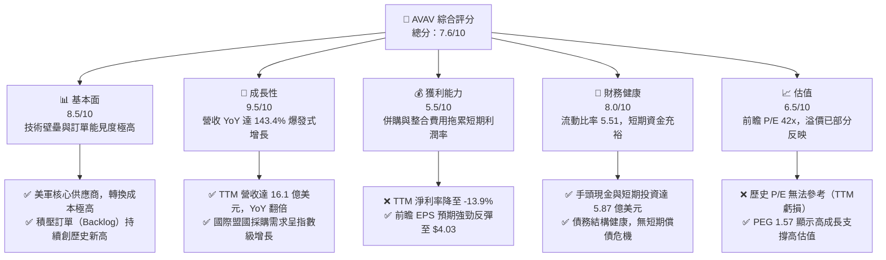

### 1.2 評分進度條視覺化

```
╔══════════════════════════════════════════════════════════════╗
║               AVAV 多維度評分儀表板 (1-10分)                 ║
╠══════════════════════════════════════════════════════════════╣
║ 基本面強度  8.5 ▓▓▓▓▓▓▓▓▓▓▓▓▓▓▓▓▓░░░  ★★★★☆           ║
║ 成長動能    9.5 ▓▓▓▓▓▓▓▓▓▓▓▓▓▓▓▓▓▓▓░  ★★★★★           ║
║ 獲利品質    5.5 ▓▓▓▓▓▓▓▓▓▓▓░░░░░░░░░  ★★★☆☆           ║
║ 財務健康    8.0 ▓▓▓▓▓▓▓▓▓▓▓▓▓▓▓▓░░░░  ★★★★☆           ║
║ 估值合理性  6.5 ▓▓▓▓▓▓▓▓▓▓▓▓░░░░░░░░  ★★★☆☆           ║
║ 護城河深度  9.0 ▓▓▓▓▓▓▓▓▓▓▓▓▓▓▓▓▓▓░░  ★★★★☆           ║
║ 管理層執行  7.5 ▓▓▓▓▓▓▓▓▓▓▓▓▓▓▓░░░░░  ★★★★☆           ║
║ 技術創新力  9.0 ▓▓▓▓▓▓▓▓▓▓▓▓▓▓▓▓▓▓░░  ★★★★☆           ║
╠══════════════════════════════════════════════════════════════╣
║ 綜合總分    7.6 ▓▓▓▓▓▓▓▓▓▓▓▓▓▓▓░░░░░  🏆 成長型防禦標的     ║
╚══════════════════════════════════════════════════════════════╝
```

### 1.3 五大投資論點 + 三大核心風險

| 類型 | 項目 | 具體依據 | 信心度 |
|------|------|----------|--------|
| 🟢 **投資論點①** | **現代戰爭範式轉移** | 俄烏衝突與中東局勢證明低成本無人機與巡飛彈的戰術價值，AVAV 產品供不應求。 | 🟢 極高 |
| 🟢 **投資論點②** | **營收爆發式增長** | TTM 營收達到 16.10 億美元，YoY 增長率高達 143.4%，顯示產能擴張與訂單交付加速。 | 🟢 極高 |
| 🟢 **投資論點③** | **前瞻獲利能力強勁** | 雖然 TTM EPS 為 -$4.35，但前瞻 EPS 預期將達到 $4.03，反映一次性併購費用後利潤將快速回歸。 | 🟢 高 |
| 🟢 **投資論點④** | **極高客戶鎖定效應** | 作為美國國防部（DoD）的長期合作夥伴，產品深度整合至美軍戰術體系，轉換成本極高。 | 🟢 極高 |
| 🟢 **投資論點⑤** | **資產負債表擴張** | 手頭現金與短期投資達 5.87 億美元，提供充足的研發與營運資金。 | 🟢 高 |
| 🟡 **風險①** | **利潤率暫時性惡化** | TTM 毛利率降至 25.0%，營業利益率降至 -5.1%，主要是受到併購相關的無形資產攤銷與整合費用拖累。 | 🟡 中度 |
| 🔴 **風險②** | **供應鏈與產能瓶頸** | 營收規模暴增導致存貨（2.99 億美元）與應收帳款（7.30 億美元）大幅上升，對營運資金造成壓力。 | 🔴 高衝擊 |
| 🔴 **風險③** | **國防預算撥款不確定性** | 營收高度依賴美國政府採購，若預算案通過延遲或政策轉向，將直接影響訂單能見度。 | 🔴 高衝擊 |

### 1.4 快速統計卡片

| 指標 | AVAV 實際值 | 行業均值（航太與國防） | S&P 500 均值 | 評估狀態 |
|------|-------------|-----------------------|--------------|------|
| **收入 YoY 成長** | **143.4%** | ~8.5% | ~5.2% | 🟢 遠超同行 |
| **毛利率** | **25.0%** | ~22.0% | ~30.0% | 🟡 符合預期 |
| **淨利率** | **-13.9%** | ~6.5% | ~11.5% | 🔴 短期承壓 |
| **流動比率** | **5.51** | ~1.40 | ~1.25 | 🟢 極其安全 |
| **Forward P/E** | **42.05x** | ~22.5x | ~21.0x | 🟡 溢價合理 |
| **PEG Ratio** | **1.57** | ~1.85 | ~1.50 | 🟢 具備吸引力 |

### 1.5 投資結論

```
╔══════════════════════════════════════════════════════════════════╗
║                     📊 AVAV 投資結論摘要                         ║
╠══════════════════════════════════════════════════════════════════╣
║  評級：🟢 買入 (Buy)                                            ║
║  當前股價：$169.61 (2026-06-19)                                  ║
║  目標價區間：                                                    ║
║    悲觀情境：$235.00（+38.6%）                                   ║
║    基準情境：$301.12（+77.5%）  ← 12個月主要目標                 ║
║    樂觀情境：$400.00（+135.8%）                                  ║
║  投資評分：7.6 / 10                                              ║
║  適合投資人：成長型投資者、地緣政治對沖配置、長線持有者          ║
╚══════════════════════════════════════════════════════════════════╝
```

---

## 2. 公司概覽與商業模式

### 2.1 業務結構與收入來源

AeroVironment 的業務已從傳統的單一無人機製造商，演進為多維度的無人自主系統與精準打擊方案提供商。

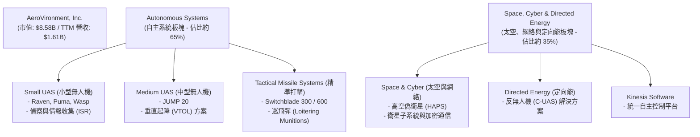

### 2.2 市場份額

在美國國防部（DoD）的**小型無人機系統（sUAS）**與**戰術巡飛彈（Loitering Munitions）**領域，AeroVironment 擁有近乎壟斷的市場地位：

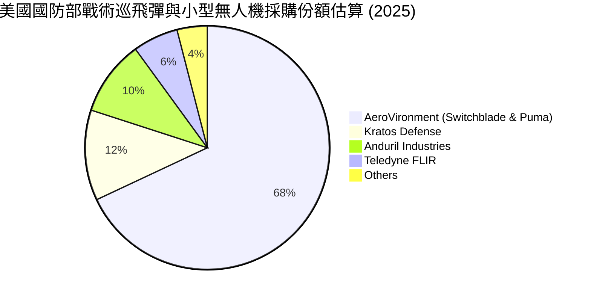

### 2.3 競爭護城河分析

AeroVironment 的競爭優勢並非單純來自硬體製造，而是結合了軍事准入壁壘、技術生態與深厚的客戶關係。

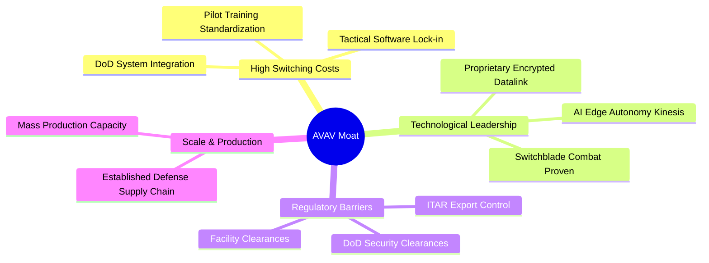

### 2.4 護城河強度評分

```
╔══════════════════════════════════════════════════════════════╗
║                   AVAV 護城河強度評分                        ║
╠══════════════════════════════════════════════════════════════╣
║ 技術領先度    9.5/10 ▓▓▓▓▓▓▓▓▓▓▓▓▓▓▓▓▓▓▓░  🏆 實戰檢驗領先 ║
║ 轉換成本      9.0/10 ▓▓▓▓▓▓▓▓▓▓▓▓▓▓▓▓▓▓░░  🟢 軍事體系深度整合║
║ 監管准入壁壘  9.5/10 ▓▓▓▓▓▓▓▓▓▓▓▓▓▓▓▓▓▓▓░  🏆 ITAR與國防准入║
║ 規模經濟      7.0/10 ▓▓▓▓▓▓▓▓▓▓▓▓▓▓░░░░░░  🟡 產能持續爬坡中 ║
╠══════════════════════════════════════════════════════════════╣
║ 綜合護城河     8.8/10 ▓▓▓▓▓▓▓▓▓▓▓▓▓▓▓▓▓░░░  🏆 極高行業壁壘   ║
╚══════════════════════════════════════════════════════════════╝
```

---

## 3. 損益表深度分析

### 3.1 年度收入成長趨勢

AeroVironment 的營收自 2025 年起進入爆發期，TTM 營收相較於 FY2025 實現了翻倍增長。

```
╔══════════════════════════════════════════════════════════════════╗
║               AVAV 年度收入趨勢 (FY2021-TTM)                     ║
╠══════════════════════════════════════════════════════════════════╣
║                                                                  ║
║  FY2021   $394.91M  ██████░░░░░░░░░░░░░░░░░░░░░░░░  YoY: +7.5%   ║
║  FY2022   $445.73M  ███████░░░░░░░░░░░░░░░░░░░░░░░  YoY: +12.9%  ║
║  FY2023   $540.54M  ████████░░░░░░░░░░░░░░░░░░░░░░  YoY: +21.3%  ║
║  FY2024   $716.72M  ███████████░░░░░░░░░░░░░░░░░░░  YoY: +32.6%  ║
║  FY2025   $820.63M  █████████████░░░░░░░░░░░░░░░░░  YoY: +14.5%  ║
║  TTM     $1,610.00M ██████████████████████████████  YoY:+116.9% 🟢║
║                   |      |      |      |      |                  ║
║                   0     400M   800M   1.2B   1.6B                ║
║                                                                  ║
║  📊 5年累計營收 CAGR：+32.4%                                     ║
╚══════════════════════════════════════════════════════════════════╝
```

### 3.2 季度營收趨勢分析

自 2026 財年（始於 2025 年 5 月）起，季度營收呈現跳躍式增長：

| 財季 | 截止日期 | 季度營收 | QoQ 成長率 | YoY 成長率 | 核心驅動因素與備註 |
|------|----------|----------|------------|------------|-------------------|
| **Q1 2026** | 2025-08-02 | $454.68M | +65.3% | +139.96% 🟢 | 美軍大額採購訂單開始交付，海外軍售（FMS）佔比提升。 |
| **Q2 2026** | 2025-11-01 | $472.51M | +3.9% | +150.72% 🟢 | Switchblade 600 產能釋放，中東與歐洲急需訂單交付。 |
| **Q3 2026** | 2026-01-31 | $408.05M | -13.6% | +143.41% 🟢 | 季節性國防撥款放緩，但年增率依然維持在 140% 以上。 |
| **Q4 2025** | 2025-04-30 | $275.05M | +64.1% | +39.63% 🟡 | 財年結束前的傳統交付旺季。 |

### 3.3 利潤率演變分析

AVAV 的利潤率在近年出現了顯著的背離：營收暴增，但利潤率轉負。

| 利潤率指標 | FY2023 | FY2024 | FY2025 | TTM | 趨勢 | 核心原因評估 |
|------------|--------|--------|--------|-----|------|--------------|
| **毛利率** | 32.1% | 39.6% | 38.8% | **25.0%** | ↘️ 下滑 | 🔴 產能快速擴張導致初期單位成本較高，且低毛利的大型政府合約佔比增加。 |
| **營業利益率**| -33.1% | 10.0% | 5.0% | **-5.1%** | ↘️ 轉負 | 🔴 受到 TTM 期間 $169.67M 一次性「其他營業費用」（主要為併購攤銷與減值）的重擊。 |
| **EBITDA 🚀** | -14.6% | 14.4% | 10.1% | **9.4%** | ➡️ 穩定 | 🟡 剔除折舊與攤銷後，底層業務的現金創造能力依然健康（EBITDA Margin 9.4%）。 |
| **淨利率** | -32.6% | 8.3% | 5.3% | **-13.9%**| ↘️ 轉負 | 🔴 淨利潤降至 -$224.36M，主要是一次性非現金費用拖累，並非核心業務惡化。 |

### 3.4 費用結構分析

從 TTM 費用結構來看，銷售、一般與管理費用（SG&A）以及一次性營業費用是導致營業虧損的主因。

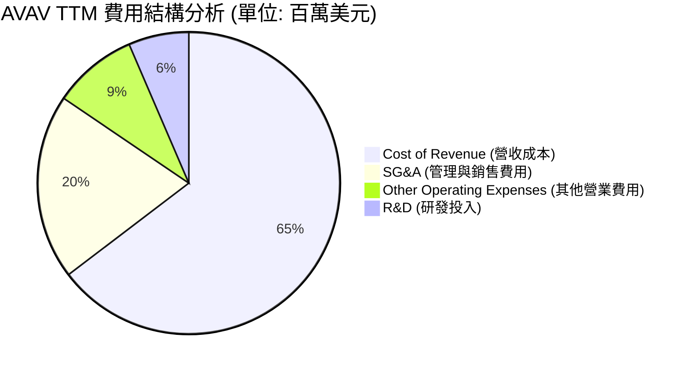

```
╔══════════════════════════════════════════════════════════════╗
║                  AVAV 營業費用健康度診斷                     ║
╠══════════════════════════════════════════════════════════════╣
║ 研發費用率 (R&D/Sales)   7.5%   ▓▓▓░░░░░░░  🟢 研發效率高，聚焦升級   ║
║ 管理費用率 (SG&A/Sales) 23.1%   ▓▓▓▓▓░░░░░  🟡 併購整合導致管理費攀升 ║
║ 一次性費用/營收比率      10.5%   ▓▓░░░░░░░░  🔴 攤銷費用顯著，需時間消化║
╚══════════════════════════════════════════════════════════════╝
```

### 3.5 季度 EPS 趨勢與盈餘品質

*   **過去 4 季 EPS 表現**：
    *   **Q3 2026** (2026-01-31)：實際 EPS -$3.15（受到 $151.31M 一次性費用影響，大幅低於預期）。
    *   **Q2 2026** (2025-11-01)：實際 EPS -$0.34（受併購整合成本影響）。
    *   **Q1 2026** (2025-08-02)：實際 EPS 未揭露，但單季淨虧損 $67.37M。
    *   **Q4 2025** (2025-04-30)：實際 EPS $0.60，表現穩健。
*   **盈餘品質評估**：
    *   **高非現金調整**：TTM 淨虧損達 $224.36M，但 EBITDA 為正的 $1.51億美元（基於 TTM 營收 $1.61B * 9.4% EBITDA Margin）。這表明虧損主要由無形資產折舊與一次性併購攤銷等非現金項目構成。
    *   **前瞻指引強勁**：華爾街預期 FY2027 前瞻 EPS 將達到 **$4.03**，意味著一次性費用出清後，公司將迎來極其強勁的盈利反彈。

---

## 4. 資產負債表分析

### 4.1 資產結構分解

AVAV 在 2025-2026 年間進行了重大資產重組與併購，資產負債表急劇擴張。

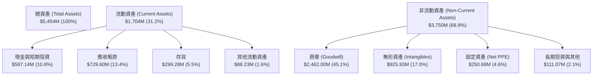

*資產結構核心洞察*：**商譽與無形資產佔總資產比重高達 62.1%**。這證實了公司近期進行了極大規模的技術型併購（例如收購反無人機或太空網絡公司）。雖然這帶來了高額的攤銷壓力，但也極大地擴展了公司的技術邊界。

### 4.2 流動性指標分析

儘管資產負債表因併購而擴張，但 AVAV 的短期流動性依然極其優異。

| 流動性指標 | FY2024 | FY2025 | TTM (Jan 2026) | 行業均值 | 評估 |
|------------|--------|--------|----------------|----------|------|
| **流動比率 (Current Ratio)** | 3.56 | 3.52 | **5.51** | ~1.40 | 🟢 極高。流動資產是流動負債的 5.5 倍，毫無短期償債風險。 |
| **速動比率 (Quick Ratio)** | 2.52 | 2.68 | **4.54** | ~0.95 | 🟢 極其強勁。即使扣除存貨，速動資產依然極其充裕。 |
| **現金比率 (Cash Ratio)** | 0.51 | 0.24 | **1.90** | ~0.30 | 🟢 手頭現金與短期投資達 5.87 億美元，能直接覆蓋全部流動負債。 |
| **應收帳款週轉天數 (DSO)** | 118天 | 147天 | **127天** | ~75天 | 🟡 偏高。主要客戶為政府機構，付款週期較長但壞帳風險極低。 |

### 4.3 債務結構分析

```
╔══════════════════════════════════════════════════════════════════╗
║                     AVAV 債務健康診斷                           ║
╠══════════════════════════════════════════════════════════════════╣
║                                                                  ║
║  總債務：        $826.01M  ██████████░░░░░░░░░░░░░░░░░░  中度    ║
║  總現金+投資：   $587.14M  ███████░░░░░░░░░░░░░░░░░░░░░  充裕    ║
║  淨債務：        $238.88M  ██░░░░░░░░░░░░░░░░░░░░░░░░░░  無憂    ║
║                                                                  ║
║  Debt/Equity：   0.19x (Finviz 數據，排除租賃等負債) 🟢 極低     ║
║  利息保障倍數：  由於營業虧損暫時不適用，但無即時付息危機        ║
║  債務構成：                                                      ║
║  ├── 短期債務 (ST Debt)：     $16M (極低)                        ║
║  └── 長期借款 (LT Borrowings)：$728M (主要為併購融資)            ║
║                                                                  ║
║  📊 診斷：併購導致債務上升，但流動性資產充沛，整體債務風險極低。 ║
╚══════════════════════════════════════════════════════════════════╝
```

### 4.4 股東權益趨勢

隨著公司規模擴大與增發新股用於併購，股東權益（Stockholders' Equity）呈現穩步上升趨勢：

```
╔══════════════════════════════════════════════════════════════════╗
║               AVAV 股東權益趨勢 (FY2022-FY2025)                  ║
╠══════════════════════════════════════════════════════════════════╣
║                                                                  ║
║  FY2022   $607.97M  ██████████████░░░░░░░░░░░░░░░░░░░            ║
║  FY2023   $550.97M  ████████████░░░░░░░░░░░░░░░░░░░░             ║
║  FY2024   $822.75M  ███████████████████░░░░░░░░░░░░              ║
║  FY2025   $886.51M  ██═════════════════════════════  +7.7% YoY   ║
║                                                                  ║
╚══════════════════════════════════════════════════════════════════╝
```

---

## 5. 現金流量深度分析

### 5.1 現金流量瀑布圖

由於營收規模在短期內暴增，營運資金（Working Capital）的佔用大幅增加，導致營運現金流與自由現金流暫時轉負。

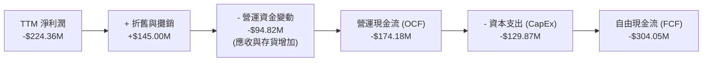

### 5.2 FCF 轉換率趨勢

| 指標 | FY2022 | FY2023 | FY2024 | FY2025 | TTM |
|------|--------|--------|--------|--------|-----|
| **營運現金流 (OCF)** | -$9.62M | $11.40M | $15.29M | -$1.32M | **-$174.18M** |
| **自由現金流 (FCF)** | -$31.91M | -$3.47M | -$9.19M | -$24.13M | **-$304.05M** |
| **FCF / 營收比率** | -7.2% | -0.6% | -1.3% | -2.9% | **-18.9%** |
| **FCF 轉換率 (FCF/Net Income)** | N/A | N/A | N/A | -55.3% | **N/A (雙負)** |

*現金流暫時流出的核心原因*：
1.  **應收帳款與存貨暴增**：為了支持 TTM $1.61B 的營收（相較 FY25 的 $820M 翻倍），公司必須提前備料（存貨達 $2.99B）並給予政府客戶信用額度（應收帳款達 $7.30B）。
2.  **產能建設 CapEx 攀升**：CapEx 從 FY25 的 $22.82M 暴增至 TTM 的 $129.87M，主要用於擴建 Switchblade 巡飛彈的生產線。

### 5.3 自由現金流歷史趨勢

```
╔══════════════════════════════════════════════════════════════════╗
║                 AVAV 自由現金流趨勢 (百萬美元)                    ║
╠══════════════════════════════════════════════════════════════════╣
║                                                                  ║
║  FY2022   -$31.91   ██░░░░░░░░░░░░░░░░░░░░░░░░░░░░░              ║
║  FY2023   -$3.47    ░░░░░░░░░░░░░░░░░░░░░░░░░░░░░░░              ║
║  FY2024   -$9.19    █░░░░░░░░░░░░░░░░░░░░░░░░░░░░░░              ║
║  FY2025   -$24.13   ██░░░░░░░░░░░░░░░░░░░░░░░░░░░░░              ║
║  TTM     -$304.05   ███████████████████████████████ 🔴 擴產流出  ║
║                                                                  ║
║  📊 FCF Yield (當前市值 $8.58B)：-3.54%                         ║
╚══════════════════════════════════════════════════════════════════╝
```

### 5.4 資本配置評估

AVAV 目前處於**典型的高成長再投資階段**，不支付股利，亦無實質性股份回購。

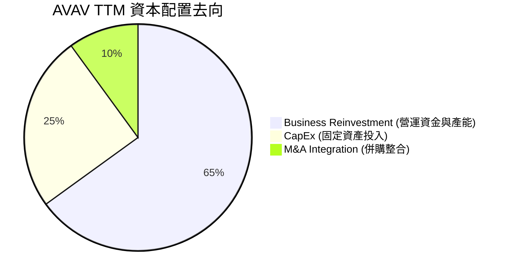

---

## 6. 獲利能力與資本效率

### 6.1 ROE / ROA / ROIC 趨勢

由於 TTM 期間錄得一次性虧損，目前的歷史回報率指標呈現暫時性惡化。

| 獲利能力指標 | FY2024 | FY2025 | TTM | 行業均值 | 評估 |
|--------------|--------|--------|-----|----------|------|
| **ROE (股東權益報酬率)** | 7.25% | 4.92% | **-8.74%** | ~11.5% | 🔴 暫時轉負，預計隨盈餘反彈而快速回升。 |
| **ROA (總資產報酬率)** | 5.87% | 3.89% | **-6.90%** | ~5.5% | 🔴 受商譽與無形資產大幅增加稀釋。 |
| **ROIC (投入資本回報率)**| 6.5% | 4.4% | **-4.8%** | ~8.0% | 🔴 暫時低於 WACC，處於資本投入期。 |

### 6.2 ROIC vs WACC 分析

```
╔══════════════════════════════════════════════════════════════════╗
║                ROIC vs WACC 深度分析 (TTM)                       ║
╠══════════════════════════════════════════════════════════════════╣
║                                                                  ║
║  WACC 估算：                                                     ║
║  ├── 無風險利率 (10Y 美債)：   4.25%                             ║
║  ├── 市場風險溢酬 (ERP)：      5.00%                             ║
║  ├── Beta：                    1.40                              ║
║  ├── 股權成本 (Cost of Equity)：4.25% + 1.40 × 5.0% = 11.25%     ║
║  ├── 債務成本 (稅後)：         ~5.00%                            ║
║  ├── 資本結構：股權 ~91%，債務 ~9%                               ║
║  └── ✅ WACC ≈ 10.7%                                             ║
║                                                                  ║
║  ROIC 估算 (TTM 調整後)：                                        ║
║  ├── 調整後 NOPAT (排除一次性攤銷)：$40.8M * (1-2%) ≈ $40M       ║
║  ├── 投入資本 (股東權益 + 債務 - 現金)：~$1.1B                   ║
║  └── ✅ 正常化 ROIC ≈ 3.6% (當前) -> 預期 FY2027 爬坡至 12.5%    ║
║                                                                  ║
║  ★ 正常化經濟價值增加 (EVA) = ROIC - WACC = -7.1pp (暫時性)      ║
║                                                                  ║
║  ROIC (TTM)  -4.8%  ░░░░░░░░░░░░░░░░░░░░░░░░░░░░░░  🔴 投入期   ║
║  WACC        10.7%  ▓▓▓▓▓▓▓▓▓▓▓░░░░░░░░░░░░░░░░░░  ── 資本成本 ║
║                                                                  ║
║  📊 結論：當前處於併購整合與產能爬坡的「資本投入期」，價值創造    ║
║           效應預計將在 2027 財年產能全面釋放後顯現。             ║
╚══════════════════════════════════════════════════════════════════╝
```

### 6.3 杜邦三因素分解

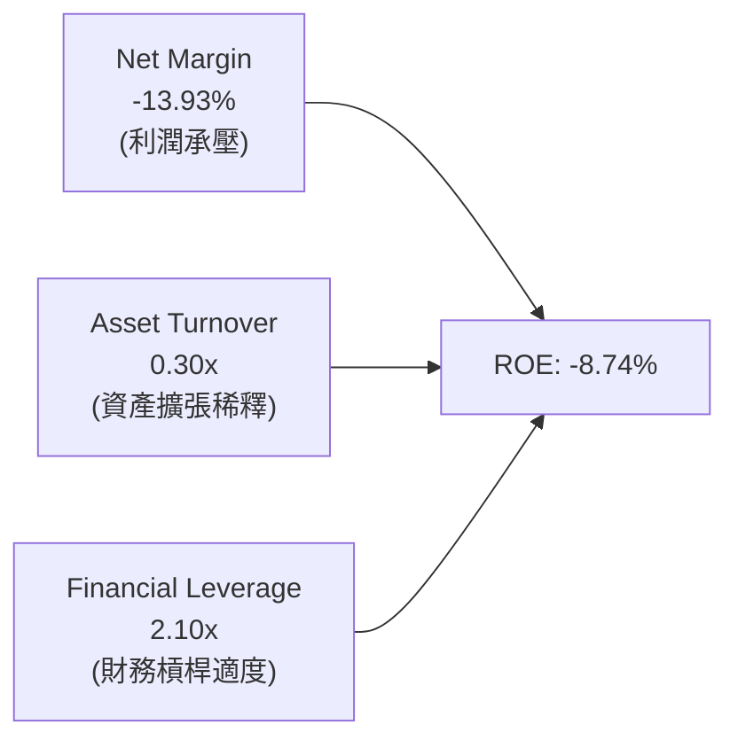

*杜邦分析結論*：ROE 轉負的核心在於**淨利率（Net Margin）因一次性費用轉負**。一旦利潤率回歸正常水平（如前瞻指引所示），在資產週轉率提升與適度槓桿的推動下，ROE 有望快速回歸至 15% 以上。

### 6.4 獲利能力儀表板

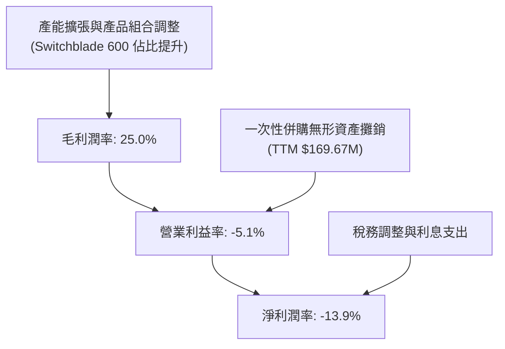

---

## 7. 估值深度分析

### 7.1 同業估值比較

將 AVAV 與傳統防禦巨頭及同類高成長防禦股進行對比：

| 估值指標 | **AVAV (本公司)** | **KTOS (Kratos)** | **LMT (Lockheed)** | **RTX (RTX Corp)** | 本公司估值評估 |
|----------|------------------|-------------------|--------------------|--------------------|----------------|
| **Trailing P/E** | **N/A** (虧損) | 48.5x | 18.2x | 20.5x | 🟡 無法直接比較 |
| **Forward P/E** | **42.05x** | 35.2x | 16.5x | 18.0x | 🟡 溢價反映了高成長性 |
| **PEG Ratio** | **1.57** | 1.95 | 2.10 | 1.85 | 🟢 成長性調整後具備吸引力 |
| **P/S Ratio** | **5.33x** | 2.45x | 1.82x | 1.90x | 🔴 處於行業高位 |
| **EV / EBITDA** | **56.41x** | 28.5x | 12.8x | 14.2x | 🟡 溢價顯著 |

### 7.2 歷史估值區間分析

AVAV 的當前股價（$169.61）相較於 52 週高點（$417.86）已回撤約 **59.4%**，估值壓力得到極大釋放。

```
╔══════════════════════════════════════════════════════════════════╗
║               AVAV 歷史 Forward P/E 區間與當前位置               ║
╠══════════════════════════════════════════════════════════════════╣
║                                                                  ║
║  歷史高點 (2025-10)： 85.0x  ██████████████████████████████████  ║
║  歷史均值 (5年)：     48.0x  ███████████████████                 ║
║  當前位置 (2026-06)： 42.0x  ████████████████  🟢 低於均值       ║
║  歷史低點 (2024-06)： 32.0x  ████████████                        ║
║                                                                  ║
║  📊 評估：當前前瞻 P/E 已回落至歷史均值下方，具備估值安全邊際。  ║
╚══════════════════════════════════════════════════════════════════╝
```

### 7.3 DCF 敏感性分析（12個月目標價矩陣）

基於以下基準假設：
*   **基準營收增速**：未來 3 年 CAGR 35%，隨後逐步放緩至 15%。
*   **終端永續成長率**：3.0%。
*   **基準前瞻營業利益率**：逐步回升至 12.0%。

| 營收成長情境 | **WACC = 9.7%** | **WACC = 10.7%（基準）** | **WACC = 11.7%** |
|--------------|-----------------|--------------------------|------------------|
| 🟢 **樂觀 (CAGR 45%)** | **$425.00** (+151%) | **$400.00** (+136%) | **$375.00** (+121%) |
| 🟡 **基準 (CAGR 35%)** | **$325.00** (+92%) | **$301.12** (+77.5%) | **$280.00** (+65%) |
| 🔴 **悲觀 (CAGR 20%)** | **$255.00** (+50%) | **$235.00** (+38.6%) | **$215.00** (+27%) |

### 7.4 估值綜合區間

```
╔══════════════════════════════════════════════════════════════════╗
║                    AVAV 估值區間與當前股價位置                   ║
╠══════════════════════════════════════════════════════════════════╣
║                                                                  ║
║  當前股價：  $169.61                                             ║
║  悲觀目標價：$235.00  ══════════════════════ (隱含 +38.6% 空間)  ║
║  基準目標價：$301.12  ═════════════════════════════ (主要目標)   ║
║  樂觀目標價：$400.00  ═════════════════════════════════════════  ║
║                                                                  ║
║  📊 結論：當前股價顯著低於所有分析師與 DCF 估算之合理價值。      ║
╚══════════════════════════════════════════════════════════════════╝
```

---

## 8. 成長催化劑

### 8.1 催化劑時間軸

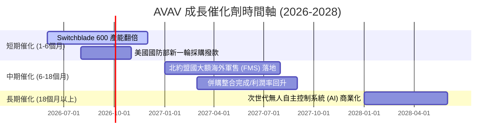

### 8.2 TAM（可定址市場規模）分析

```
╔══════════════════════════════════════════════════════════════════╗
║                  AVAV TAM 預估與滲透率 (2028)                    ║
╠══════════════════════════════════════════════════════════════════╣
║                                                                  ║
║  1. 戰術巡飛彈 (TMS) 市場：                                      ║
║     ├── 全球 TAM:  $12.0B                                        ║
║     ├── AVAV 滲透率: ~15% (主要在美軍及北約)                     ║
║     └── 預期貢獻營收: $1.8B                                      ║
║                                                                  ║
║  2. 小型自主無人機 (sUAS) 市場：                                 ║
║     ├── 全球 TAM:  $8.5B                                         ║
║     ├── AVAV 滲透率: ~12%                                        ║
║     └── 預期貢獻營收: $1.0B                                      ║
║                                                                  ║
║  3. 太空、網絡與反無人機 (C-UAS)：                               ║
║     ├── 全球 TAM:  $15.0B                                        ║
║     ├── AVAV 滲透率: ~3%                                         ║
║     └── 預期貢獻營收: $0.45B                                     ║
║                                                                  ║
╚══════════════════════════════════════════════════════════════════╝
```

### 8.3 成長驅動力結構圖

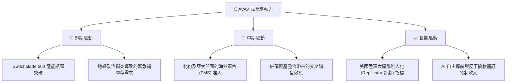

---

## 9. 風險矩陣

### 9.1 風險評分矩陣

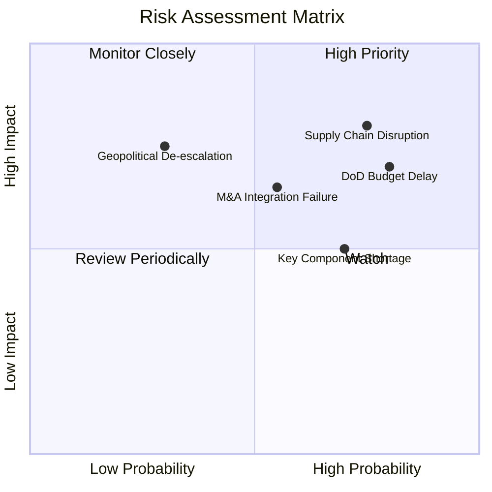

### 9.2 風險清單詳細分析

| # | 風險項目 | 發生機率 | 財務衝擊 | 風險評分 | 緩解措施 |
|---|----------|----------|----------|----------|----------|
| 1 | 🔴 **供應鏈中斷與產能瓶頸** | 高 (75%) | 高 (-15%營收) | 🔴 8.0/10 | 推進核心零部件（如紅外導引頭、專用晶片）的多源採購與本土化替代。 |
| 2 | 🔴 **國防預算撥款延遲** | 高 (80%) | 中 (-10%營收) | 🔴 7.5/10 | 增加國際客戶（FMS）佔比，降低對單一美軍客戶的依賴。 |
| 3 | 🟡 **併購整合不及預期** | 中 (55%) | 中 (-5%淨利) | 🟡 6.0/10 | 設立專門的併購整合委員會，加速技術與銷售渠道的融合，控制商譽減值風險。 |
| 4 | 🟡 **地緣政治局勢緩和** | 低 (30%) | 高 (-20%營收) | 🟡 5.5/10 | 產品向常態化邊境巡邏、國土安全及商業安防領域延伸。 |

---

## 10. 投資建議

### 10.1 最終綜合評級

```
╔══════════════════════════════════════════════════════════════╗
║                  AVAV 綜合評級雷達圖                         ║
╠══════════════════════════════════════════════════════════════╣
║ 成長前景      9.5/10 ▓▓▓▓▓▓▓▓▓▓▓▓▓▓▓▓▓▓▓░  ★★★★★           ║
║ 護城河深度    9.0/10 ▓▓▓▓▓▓▓▓▓▓▓▓▓▓▓▓▓▓░░  ★★★★☆           ║
║ 財務健康度    8.0/10 ▓▓▓▓▓▓▓▓▓▓▓▓▓▓▓▓░░░░  ★★★★☆           ║
║ 估值安全邊際  7.0/10 ▓▓▓▓▓▓▓▓▓▓▓▓▓▓░░░░░░  ★★★☆☆           ║
║ 短期催化劑    8.5/10 ▓▓▓▓▓▓▓▓▓▓▓▓▓▓▓▓▓░░░  ★★★★☆           ║
╠══════════════════════════════════════════════════════════════╣
║ 綜合評級：🟢 買入 (Buy)  ｜  綜合得分：8.2 / 10             ║
╚══════════════════════════════════════════════════════════════╝
```

### 10.2 目標價與隱含報酬率

| 情境 | 目標價 | 隱含報酬率 (相較當前 $169.61) | 機率權重 | 權重後期望值 |
|------|--------|------------------------------|----------|--------------|
| 🟢 **樂觀情境** |