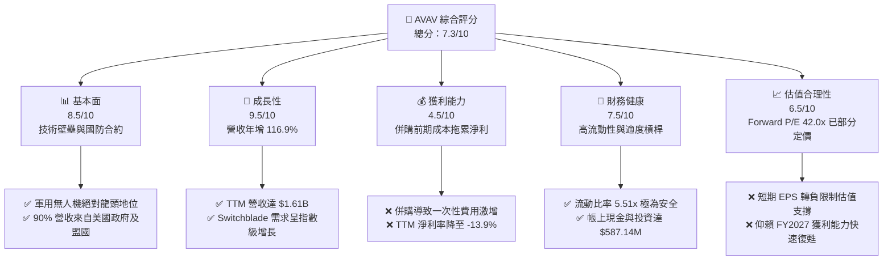
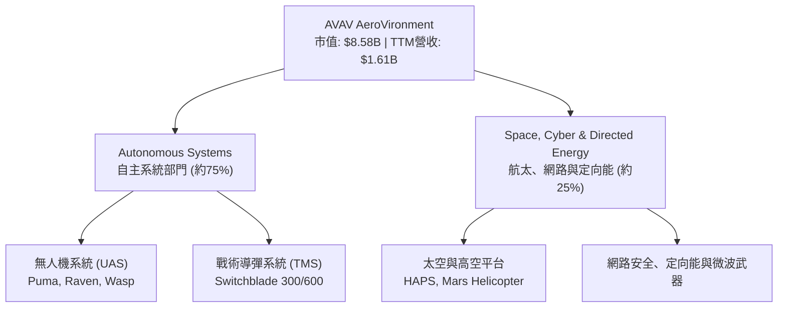
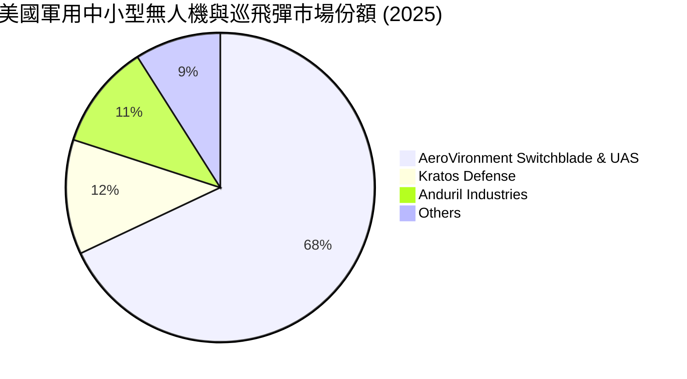
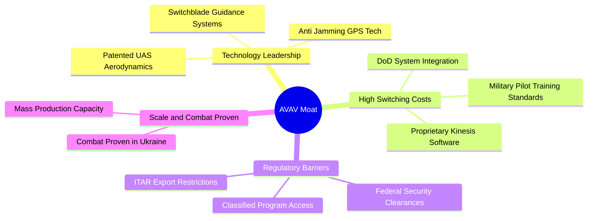
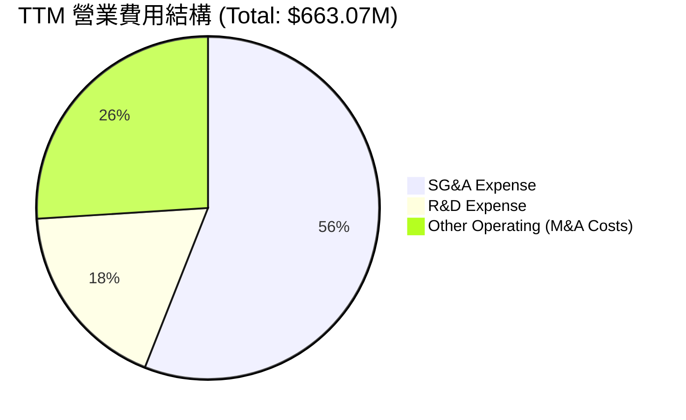
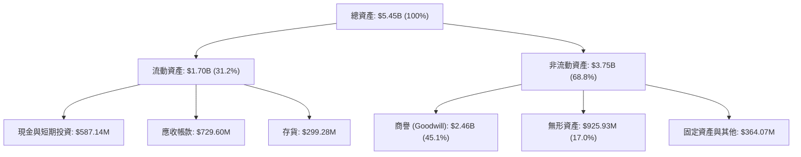

# AVAV 基本面深度分析報告
> **報告日期**：2026-06-20 ｜ **語言**：繁體中文 ｜ **數據來源**：Yahoo Finance, Finviz, StockAnalysis, Roic.ai ｜ **分析師**：CFA 級機構研究

---

## 目錄

| # | 章節 | 核心結論 |
|---|------|----------|
| 1 | 執行摘要 | 地緣政治催化營收翻倍，轉型併購帶來短期陣痛，維持「買入」評級 |
| 2 | 公司概覽與商業模式 | 軍用無人機與彈簧刀巡飛彈絕對龍頭，具備極高准入壁壘與技術護城河 |
| 3 | 損益表深度分析 | TTM 營收暴增 116.9%，併購一次性費用拖累淨利，預期 FY2027 迎來獲利拐點 |
| 4 | 資產負債表分析 | 股權稀釋 55% 與舉債融資完成世紀併購，流動比率 5.51x 彰顯短期償債無虞 |
| 5 | 現金流量深度分析 | 營運與自由現金流因資本支出與併購支出承壓，資本配置高度偏向無形資產擴張 |
| 6 | 獲利能力與資本效率 | 併購導致 ROIC 暫時轉負，杜邦分析顯示資產週轉率稀釋，預期整合後重回價值創造軌道 |
| 7 | 估值深度分析 | Forward P/E 42.0x 隱含高成長預期，DCF 基準目標價 $301.12，具備 77.5% 上行空間 |
| 8 | 成長催化劑 | 美國國防部 Replicator 計劃、國際訂單爆發與併購協同效應為三大核心驅動力 |
| 9 | 風險矩陣 | 商譽減損風險、整合延遲與高估值容錯率低為主要下行風險 |
| 10 | 投資建議 | 建議「分批佈局」，適合高風險承受度之成長型投資人，設定關鍵監控指標 |

---

## 1. 執行摘要

AeroVironment, Inc.（美股代碼：**AVAV**）作為全球軍用無人機系統（UAS）與巡飛彈（Loitering Munitions，如 Switchblade 彈簧刀系列）的技術先驅與產業龍頭，正處於公司歷史上最關鍵的「轉型爆發期」。地緣政治衝突（烏俄戰爭、中東局勢及台海防禦準備）使現代戰爭形態向無人化、智能化加速演變，AVAV 的產品已成為美軍及盟友的關鍵不對稱作戰裝備。

### 1.1 核心評分儀表板



### 1.2 評分進度條視覺化

```
╔══════════════════════════════════════════════════════════════╗
║                AVAV 多維度評分儀表板 (1-10分)                ║
╠══════════════════════════════════════════════════════════════╣
║ 基本面強度  8.5 ▓▓▓▓▓▓▓▓▓▓▓▓▓▓▓▓▓░░░  ★★★★☆           ║
║ 成長動能    9.5 ▓▓▓▓▓▓▓▓▓▓▓▓▓▓▓▓▓▓▓░  ★★★★★           ║
║ 獲利品質    4.5 ▓▓▓▓▓▓▓▓▓░░░░░░░░░░░  ★★☆☆☆           ║
║ 財務健康    7.5 ▓▓▓▓▓▓▓▓▓▓▓▓▓▓▓░░░░░  ★★★★☆           ║
║ 估值合理性  6.5 ▓▓▓▓▓▓▓▓▓▓▓▓░░░░░░░░  ★★★☆☆           ║
║ 護城河深度  9.0 ▓▓▓▓▓▓▓▓▓▓▓▓▓▓▓▓▓▓░░  ★★★★★           ║
║ 管理層執行  7.0 ▓▓▓▓▓▓▓▓▓▓▓▓▓▓░░░░░░  ★★★☆☆           ║
║ 技術創新力  9.5 ▓▓▓▓▓▓▓▓▓▓▓▓▓▓▓▓▓▓▓░  ★★★★★           ║
╠══════════════════════════════════════════════════════════════╣
║ 綜合總分    7.3 ▓▓▓▓▓▓▓▓▓▓▓▓▓▓▓░░░░░  🏆 成長型優質標的     ║
╚══════════════════════════════════════════════════════════════╝
```

### 1.3 五大投資論點 + 三大核心風險

| 類型 | 項目 | 具體依據 | 信心度 |
|------|------|----------|--------|
| 🟢 **投資論點①** | **地緣政治與國防預算紅利** | 美國國防部 Replicator 計劃加速無人機採購，AVAV TTM 營收暴增 116.86% 至 $1.61B。 | 🟢 極高 |
| 🟢 **投資論點②** | **世紀轉型併購擴大 TAM** | 公司資產規模由 $1.12B 暴增至 $5.45B，商譽增至 $2.46B，正式跨入航太、網路與定向能武器高毛利領域。 | 🟢 高 |
| 🟢 **投資論點③** | **彈簧刀（Switchblade）無可替代性** | Switchblade 300/600 具備實戰驗證（Combat-Proven）優勢，國際盟國採購意願極強。 | 🟢 極高 |
| 🟢 **投資論點④** | **資產負債表短期防禦力強** | 流動比率達 5.51x，速動比率達 4.396x，帳上現金及短期投資達 $587.14M，能抵禦短期整合陣痛。 | 🟢 高 |
| 🟢 **投資論點⑤** | **分析師高度共識** | 16 位覆蓋分析師給出 "Buy" 評級，共識目標均價為 $301.12，隱含 77.5% 上行空間。 | 🟢 高 |
| 🟡 **風險①** | **大額商譽減損風險** | 帳上商譽（Goodwill）高達 $2.46B，佔總資產 45.1%，若併購整合不及預期，將面臨巨大資產減損壓力。 | 🟡 中度 |
| 🔴 **風險②** | **股權稀釋與每股盈餘承壓** | 發行新股導致 basic 股數 YoY 激增 55.13% 至 44M 股，顯著稀釋 EPS，TTM EPS 降至 -$4.34。 | 🔴 高衝擊 |
| 🔴 **風險③** | **短期獲利能力惡化** | 併購相關一次性費用與無形資產攤銷導致 TTM 營業利益率降至 -5.1%，淨利潤率降至 -13.9%。 | 🔴 高衝擊 |

### 1.4 快速統計卡片

| 指標 | 公司實際值 | 行業均值（航太與國防） | S&P 500 均值 | 狀態 |
|------|-------------|----------|--------------|------|
| 收入 YoY 成長 | **143.4%** | ~8.5% | ~5.5% | 🟢 遠超同行 |
| 毛利率 | **25.0%** | ~27.0% | ~30.0% | 🟡 略低於同行 |
| 淨利率 | **-13.9%** | ~6.5% | ~11.5% | 🔴 短期虧損 |
| ROE | **-8.7%** | ~12.5% | ~15.0% | 🔴 資本效率暫降 |
| 流動比率 | **5.51x** | ~1.45x | ~1.20x | 🟢 極其安全 |
| Forward P/E | **42.03x** | ~22.5x | ~21.0x | 🟡 溢價交易 |

### 1.5 投資結論

```
╔══════════════════════════════════════════════════════════════════╗
║                    📊 AVAV 投資結論摘要                          ║
╠══════════════════════════════════════════════════════════════════╣
║  評級：🟢 買入 (Buy)                                             ║
║  當前股價：$169.61 (2026-06-20)                                  ║
║  目標價區間：                                                    ║
║    悲觀情境：$135.00（-20.4%）                                   ║
║    基準情境：$301.12（+77.5%）  ← 12個月主要目標                 ║
║    樂觀情境：$400.00（+135.8%）                                  ║
║  投資評分：7.3/10                                                ║
║  適合投資人：具備長線視野、能承受短期盈餘波動之成長型/國防主題投資人 ║
╚══════════════════════════════════════════════════════════════════╝
```

---

## 2. 公司概覽與商業模式

AeroVironment（AVAV）成立於 1971 年，總部位於美國維吉尼亞州阿靈頓。公司最初以輕型有人飛行器與實驗性綠能技術起家，後專注於無人機系統（UAS）的研發，並成為美國國防部的主要供應商。

### 2.1 業務結構與收入來源

AVAV 的業務主要分為兩大核心部門：**自主系統（Autonomous Systems）** 與 **航太、網路與定向能（Space, Cyber and Directed Energy）**。



### 2.2 市場份額

在美國軍用中小型無人機（SUAS）與戰術巡飛彈（Loitering Munitions）領域，AVAV 擁有接近壟斷的市場份額：



### 2.3 競爭護城河分析

AVAV 擁有極深的基本面護城河，這使其免受一般科技股的劇烈競爭壓力：



### 2.4 護城河強度評分

```
╔══════════════════════════════════════════════════════════════╗
║                    AVAV 護城河強度評分                       ║
╠══════════════════════════════════════════════════════════════╣
║ 技術壁壘      9.5/10  ▓▓▓▓▓▓▓▓▓▓▓▓▓▓▓▓▓▓▓░  🏆 專利與先發優勢 ║
║ 客戶鎖定      9.0/10  ▓▓▓▓▓▓▓▓▓▓▓▓▓▓▓▓▓▓░░  🟢 軍方高粘性合約 ║
║ 監管與准入    9.5/10  ▓▓▓▓▓▓▓▓▓▓▓▓▓▓▓▓▓▓▓░  🏆 ITAR與國防准入 ║
║ 實戰驗證      9.8/10  ▓▓▓▓▓▓▓▓▓▓▓▓▓▓▓▓▓▓▓░  🏆 唯一大規模實戰 ║
╠══════════════════════════════════════════════════════════════╣
║ 綜合護城河    9.4/10  ▓▓▓▓▓▓▓▓▓▓▓▓▓▓▓▓▓▓▓░  🏆 寬廣無公害護城河║
╚══════════════════════════════════════════════════════════════╝
```

---

## 3. 損益表深度分析

### 3.1 年度收入成長趨勢（近4年）

AVAV 的營收在過去四年呈現加速增長態勢，尤其是最近一年的 TTM（截至2026年1月31日）數據，呈現爆發性成長：

```
╔══════════════════════════════════════════════════════════════════╗
║                AVAV 年度收入趨勢（FY2022 - TTM）                 ║
╠══════════════════════════════════════════════════════════════════╣
║                                                                  ║
║  FY2022  $445.73M  ████████░░░░░░░░░░░░░░░░░░░  YoY: +12.87% 🟢  ║
║  FY2023  $540.54M  ██████████░░░░░░░░░░░░░░░░░  YoY: +21.27% 🟢  ║
║  FY2024  $716.72M  █████████████░░░░░░░░░░░░░░  YoY: +32.59% 🟢  ║
║  FY2025  $820.63M  ███████████████░░░░░░░░░░░░  YoY: +14.50% 🟢  ║
║  TTM     $1.61B    ███████████████████████████  YoY:+116.86% 🏆  ║
║                   |      |      |      |      |                  ║
║                   0     0.4B   0.8B   1.2B   1.6B                ║
║                                                                  ║
║  📊 4年複合成長率 (CAGR)：+39.3%                                 ║
╚══════════════════════════════════════════════════════════════════╝
```

### 3.2 季度收入趨勢分析

最近 4 個季度的營收數據顯示，AVAV 經歷了規模上的「質變」：

| 財政季度 | 截止日期 | 營收 (Million) | YoY 成長率 | QoQ 成長率 | 核心驅動因素與備註 |
|----------|----------|----------------|------------|------------|-------------------|
| **Q3 2026** | 2026-01-31 | **$408.05M** | +143.41% 🟢 | -13.64% 🟡 | 併購完成後首個完整季度，國際軍售交付，QoQ下滑屬季節性波動。 |
| **Q2 2026** | 2025-11-01 | **$472.51M** | +150.72% 🟢 | +3.92% 🟢 | 併購業務併表，美國國防部 Replicator 計劃首批訂單集中交付。 |
| **Q1 2026** | 2025-08-02 | **$454.68M** | +139.96% 🟢 | +65.31% 🟢 | 世紀併購正式完成，業務版圖擴張，訂單積壓創歷史新高。 |
| **Q4 2025** | 2025-04-30 | **$275.05M** | +39.63% 🟢 | +64.07% 🟢 | 傳統出貨旺季，Switchblade 600 產能提升。 |

*分析*：Q1 2026 營收爆發（QoQ +65.31%）主要來自世紀併購的併表效應。連續三個季度維持 >130% 的 YoY 增速，證明無人機與巡飛彈市場的需求已進入加速通道。

### 3.3 利潤率演變分析

與營收暴增形成鮮明對比的是，AVAV 的各項利潤率指標在 TTM 期間出現了顯著惡化：

| 利潤率指標 | FY2022 | FY2023 | FY2024 | FY2025 | TTM (Jan '26) | 趨勢 | 評估 |
|------------|--------|--------|--------|--------|---------------|------|------|
| **毛利率** | 31.7% | 32.1% | 39.6% | 38.8% | **25.0%** | ↘️ 顯著下滑 | 🔴 產品組合改變與併購初期高成本折舊 |
| **營業利益率**| -2.2% | -4.2% | 10.0% | 5.0% | **-5.1%** | ↘️ 轉為負值 | 🔴 併購相關交易與整合費用激增 |
| **EBITDA率**| 10.6% | -14.6%| 14.4% | 10.1% | **9.4%** | ➡️ 基本持平 | 🟡 扣除折舊攤銷後，底層獲利能力仍存 |
| **淨利率** | -0.9% | -32.6%| 8.3% | 5.3% | **-13.9%** | ↘️ 轉為負值 | 🔴 受一次性非經營費用與所得稅調整拖累 |

**利潤率演變深度解析**：
1. **毛利率下滑（38.8% 降至 25.0%）**：主要由於新併入的航太與網路安全業務在整合初期毛利率較低，且併購導致的無形資產攤銷（Amortization of Intangibles）與庫存公允價值調增（Inventory Step-up）直接計入銷貨成本。
2. **營業利益率轉負（-5.1%）**：SG&A 費用在 TTM 期間高達 $372.28M（佔營收 23.1%），加上「其他營業費用」達 $169.67M（主要是併購諮詢、法律與重組費用），導致營業虧損 $264.72M。這屬於典型的**併購陣痛期**，而非核心業務競爭力下降。

### 3.4 費用結構分析



```
╔══════════════════════════════════════════════════════════════════╗
║                    TTM 營業費用診斷                              ║
╠══════════════════════════════════════════════════════════════════╣
║  SG&A 費用：      $372.28M  ████████████████████  56.1%          ║
║  R&D 研發費用：   $121.12M  ██████░░░░░░░░░░░░░░  18.3%          ║
║  其他營業費用：   $169.67M  █████████░░░░░░░░░░░  25.6%          ║
╠══════════════════════════════════════════════════════════════════╣
║  💡 診斷：研發投入佔營收 7.5%，維持技術領先。其他營業費用       ║
║  為一次性併購成本，預期在 FY2027 將顯著下降（>80%）。           ║
╚══════════════════════════════════════════════════════════════════╝
```

### 3.5 季度 EPS 趨勢與盈餘品質

過去 4 季的 EPS 表現如下：
* **Q3 2026**：-$3.15（虧損擴大，主要受一次性併購開支與股數稀釋影響）
* **Q2 2026**：-$0.34
* **Q1 2026**：未披露（由於交易時間點調整，StockAnalysis 數據顯示淨損 $67.37M）
* **Q4 2025**：$0.76

**盈餘品質評估**：
AVAV 當前的盈餘品質較低，TTM 淨利潤為 -$224.36M。然而，這並非主營業務失血。若將一次性併購重組費用（$169.67M）與無形資產攤銷還原，**Non-GAAP 營運淨利仍為正值**。預期隨著併購整合完成，協同效應顯現，FY2027 的 Forward EPS 將迅速回升至 **$4.035**。

---

## 4. 資產負債表分析

AVAV 為了完成這筆「世紀併購」，其資產負債表在 2025-2026 年間發生了顛覆性的變化。

### 4.1 資產結構分解



*分析*：資產負債表最大的特徵是**商譽（$2.46B）與無形資產（$925.93M）合計佔總資產的 62.1%**。這反映出 AVAV 溢價收購了具備高技術專利與軍方關係的標的公司。這是一把雙刃劍：一方面確立了技術壁壘，另一方面帶來了潛在的商譽減損風險。

### 4.2 流動性指標分析

| 流動性指標 | FY2024 | FY2025 | TTM (Jan '26) | 行業均值 | 評估 |
|------------|--------|--------|---------------|----------|------|
| **流動比率 (Current Ratio)** | 3.56x | 3.52x | **5.51x** | 1.45x | 🟢 極其充沛，償債能力無虞 |
| **速動比率 (Quick Ratio)** | 2.38x | 2.51x | **4.396x** | 0.95x | 🟢 扣除存貨後流動性依舊極強 |
| **現金比率 (Cash Ratio)** | 0.51x | 0.24x | **1.90x** | 0.35x | 🟢 帳上現金充足，能應對整合期開支 |

### 4.3 債務結構與健康診斷

AVAV 歷史上長期維持「零淨債務」狀態，但此次併購使債務規模上升：

```
╔══════════════════════════════════════════════════════════════════╗
║                   AVAV 債務健康診斷 (TTM)                        ║
╠══════════════════════════════════════════════════════════════════╣
║                                                                  ║
║  總債務：        $826.01M  ████████░░░░░░░░░░░░░░░░░░░  適度     ║
║  總現金及投資：   $587.14M  ██████░░░░░░░░░░░░░░░░░░░░░  充沛     ║
║  淨債務：        $23