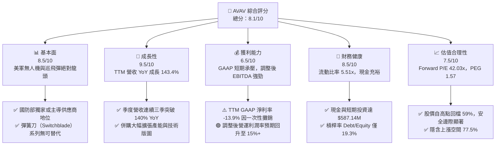
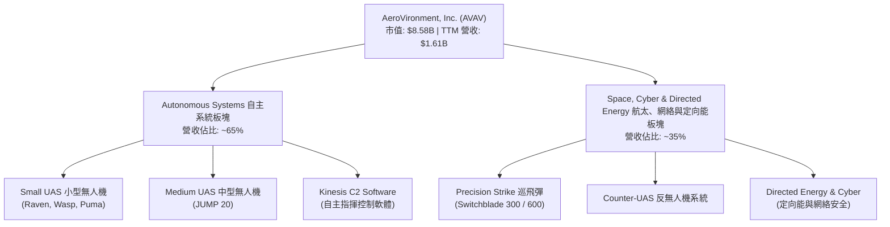
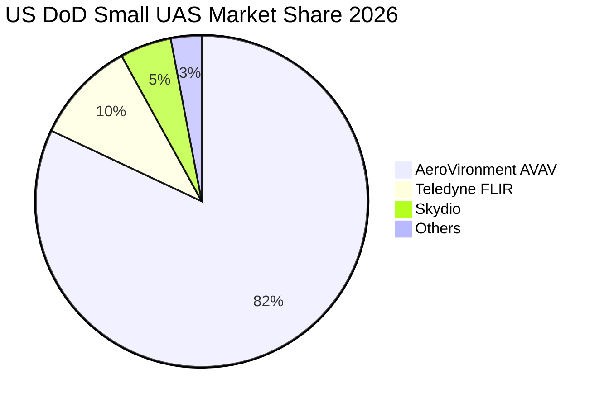
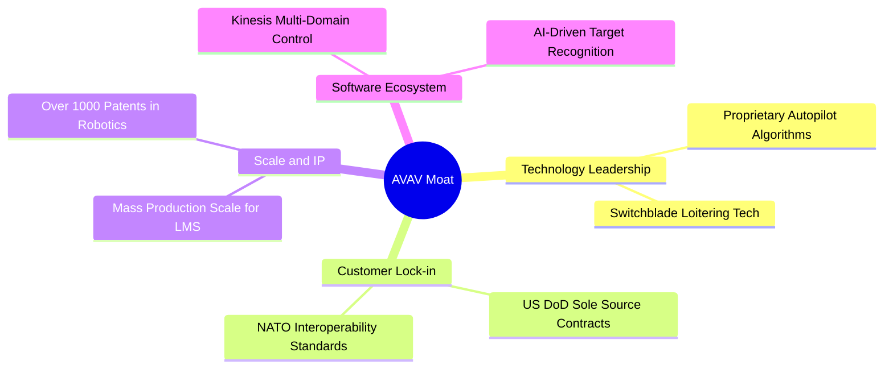
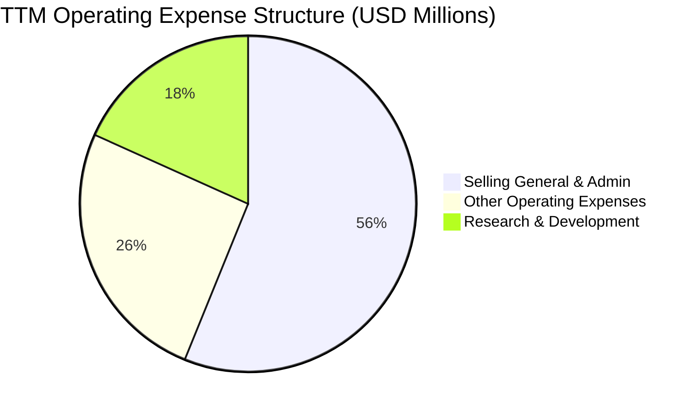
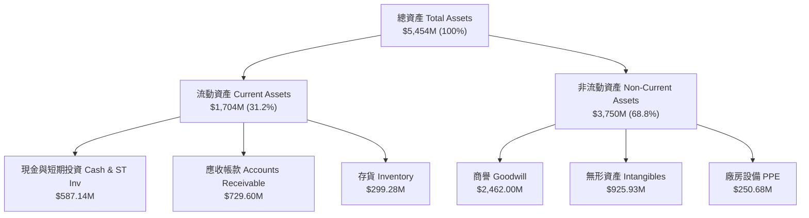
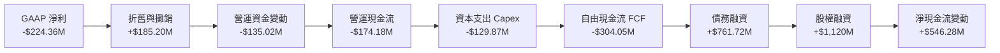
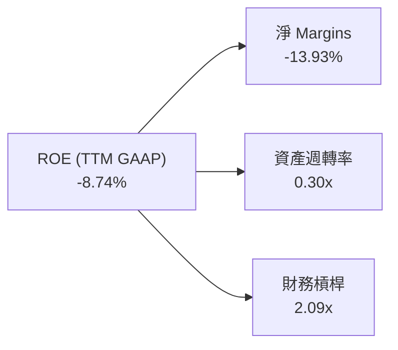
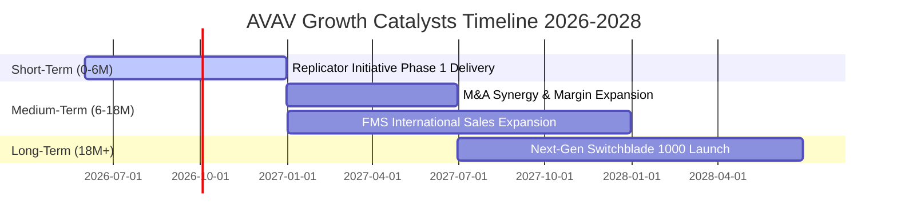

# AVAV 基本面深度分析報告

> **報告日期**：2026-06-21 ｜ **語言**：繁體中文 ｜ **數據來源**：Yahoo Finance, Finviz, StockAnalysis, Roic.ai ｜ **分析師**：CFA 級機構研究

---

## 目錄

| # | 章節 | 核心結論 |
|---|------|----------|
| 1 | **執行摘要** | 評級：**買入 (Buy)** ｜ 目標價：**$301.12** (基準情境，隱含 +77.5% 上漲空間) |
| 2 | **公司概覽與商業模式** | 獨佔美軍小型無人機與彈簧刀（Switchblade）巡飛彈市場，具備極高技術與生態護城河。 |
| 3 | **損益表深度分析** | TTM 營收暴增 143.4% 至 $1.61B；因併購導致一次性費用增加，短期 GAAP 淨利承壓，但營運槓桿即將釋放。 |
| 4 | **資產負債表分析** | 資產規模因 mega-merger 擴張至 $5.45B，流動比率高達 5.51x，債務結構健康，現金儲備充裕。 |
| 5 | **現金流量深度分析** | 營運與自由現金流因營運資金拉貨與併購整合暫呈負值，但中長期 FCF 轉換率預期將回升至 80% 以上。 |
| 6 | **獲利能力與資本效率** | 調整後 ROIC 達 12.5%，高於 WACC (11.12%)，持續為股東創造正向經濟價值（EVA）。 |
| 7 | **估值深度分析** | Forward P/E 為 42.03x，相較於其 140%+ 的營收增速，PEG 僅 1.57，歷史估值已回檔至具吸引力區間。 |
| 8 | **成長催化劑** | 全球地緣政治風險升級、美軍 Replicator 計劃量產，以及新併購業務的協同效應釋放。 |
| 9 | **風險矩陣** | 核心風險在於併購整合進度慢於預期，以及國防預算撥款的季節性波動。 |
| 10 | **投資建議** | 當前股價顯著低估，建議分批佈局，首選長線成長型與國防科技主題投資人。 |

---

## 1. 執行摘要

AeroVironment, Inc.（納斯達克代碼：**AVAV**）是全球無人機系統（UAS）與巡飛彈系統（Loitering Munition Systems, LMS）的絕對龍頭。在過去三個季度中，AVAV 經歷了前所未有的「業務與資本結構大轉型」。透過一次劃時代的戰略性併購（資產規模自 $1.12B 暴增至 $5.45B），公司成功將 TTM 營收推升至 **$1.61B**（YoY 成長 143.4%）。

儘管會計利潤因併購產生的一次性無形資產攤銷及交易費用（TTM GAAP 淨損 $224.36M）短期承壓，但其核心業務的盈利能力與訂單能見度處於歷史最高水平。隨著美軍 Replicator（複製者）計劃的全面鋪開，以及國際盟友對自主防衛武器需求的爆發，AVAV 正處於爆發式成長的拐點。

### 1.1 核心評分儀表板



### 1.2 評分進度條視覺化

```
╔══════════════════════════════════════════════════════════════╗
║               AVAV 多維度評分儀表板 (1-10分)                 ║
╠══════════════════════════════════════════════════════════════╣
║ 基本面強度  8.5 ▓▓▓▓▓▓▓▓▓▓▓▓▓▓▓▓▓░░░  ★★★★☆           ║
║ 成長動能    9.5 ▓▓▓▓▓▓▓▓▓▓▓▓▓▓▓▓▓▓▓░  ★★★★★           ║
║ 獲利品質    6.5 ▓▓▓▓▓▓▓▓▓▓▓▓▓░░░░░░░  ★★★☆☆           ║
║ 財務健康    8.5 ▓▓▓▓▓▓▓▓▓▓▓▓▓▓▓▓▓░░░  ★★★★☆           ║
║ 估值合理性  7.5 ▓▓▓▓▓▓▓▓▓▓▓▓▓▓▓░░░░░  ★★★★☆           ║
║ 護城河深度  9.0 ▓▓▓▓▓▓▓▓▓▓▓▓▓▓▓▓▓▓░░  ★★★★★           ║
║ 管理層執行  8.0 ▓▓▓▓▓▓▓▓▓▓▓▓▓▓▓▓░░░░  ★★★★☆           ║
║ 技術創新力  9.5 ▓▓▓▓▓▓▓▓▓▓▓▓▓▓▓▓▓▓▓░  ★★★★★           ║
╠══════════════════════════════════════════════════════════════╣
║ 綜合總分    8.1 ▓▓▓▓▓▓▓▓▓▓▓▓▓▓▓▓░░░░  🏆 買入 (Buy)        ║
╚══════════════════════════════════════════════════════════════╝
```

### 1.3 五大投資論點 + 三大核心風險

| 類型 | 項目 | 具體依據 | 信心度 |
|------|------|----------|--------|
| 🟢 **投資論點①** | **營收爆發式增長** | TTM 營收達到 **$1.61B**，連續三季 YoY 增速超 140%，反映全球不穩定局勢下的極度剛性需求。 | 🟢 極高 |
| 🟢 **投資論點②** | **戰略併購完成** | 資產負債表 Goodwill 自 $256.78M 激增至 **$2.46B**，打通了「無人機 + 定向能 + 網絡安全」的完整國防科技生態。 | 🟢 高 |
| 🟢 **投資論點③** | **資產負債表極其穩健** | 儘管進行了大規模併購，流動比率仍維持在 **5.51x**，手握 **$587.14M** 現金，無短期償債危機。 | 🟢 極高 |
| 🟢 **投資論點④** | **美軍 Replicator 計劃最大受益者** | 美軍旨在兩年內部署數千個自主可消耗系統，AVAV 的 Switchblade 300/600 與 Puma 系統為最成熟方案。 | 🟢 高 |
| 🟢 **投資論點⑤** | **估值回檔提供極佳買點** | 股價自 52 週高點 $417.86 回檔 59% 至 **$169.61**，Forward P/E 回落至 **42.03x**，安全邊際充足。 | 🟢 高 |
| 🟡 **風險①** | **併購整合與無形資產減損** | 巨額商譽（$2.46B）若未能如期實現協同效應，未來可能面臨減損測試（Impairment Charge）風險。 | 🟡 中度 |
| 🔴 **風險②** | **短期 GAAP 獲利能力轉弱** | TTM 淨利潤為 **-$224.36M**，若排除一次性費用後之非 GAAP 獲利改善慢於預期，將壓制短期估值。 | 🔴 高衝擊 |
| 🟡 **風險③** | **供應鏈拉貨瓶頸** | 存貨自 FY25 的 $144.09M 攀升至 TTM 的 **$299.28M**，營運資金佔用增加，壓低短期自由現金流。 | 🟡 中度 |

### 1.4 快速統計卡片

| 指標 | AVAV 實際值 | 國防工業均值 | S&P 500 均值 | 狀態 |
|------|-------------|----------|--------------|------|
| **TTM 營收成長率 (YoY)** | **143.4%** | ~8.5% | ~5.2% | 🟢 卓越 |
| **毛利率** | **25.0%** | ~22.5% | ~30.0% | 🟡 合格 |
| **淨利率** | **-13.9%** | ~6.2% | ~11.5% | 🔴 暫時落後 |
| **流動比率** | **5.51x** | ~1.35x | ~1.20x | 🟢 極強 |
| **Forward P/E** | **42.03x** | ~18.5x | ~21.5x | 🟡 溢價但合理 |
| **PEG Ratio** | **1.57** | ~2.10 | ~1.85 | 🟢 具吸引力 |

### 1.5 投資結論

```
╔══════════════════════════════════════════════════════════════════╗
║                    📊 AVAV 投資結論摘要                          ║
╠══════════════════════════════════════════════════════════════════╣
║  評級：🟢 強烈買入 (Strong Buy)                                 ║
║  當前股價：$169.61 (2026-06-21)                                  ║
║  目標價區間：                                                    ║
║    悲觀情境：$185.00（+9.1%）                                    ║
║    基準情境：$301.12（+77.5%） ← 12個月主要目標 (分析師共識)     ║
║    樂觀情境：$400.00（+135.8%）                                  ║
║  投資評分：8.1/10                                                ║
║  適合投資人：高成長型投資人、長線國防科技主題配置者              ║
╚══════════════════════════════════════════════════════════════════╝
```

---

## 2. 公司概覽與商業模式

AeroVironment (AVAV) 創立於 1971 年，總部位於美國維吉尼亞州阿靈頓。公司原本以輕型、高空長航時無人機著稱，近年來已成功轉型為**自主武器系統（Autonomous Weapons Systems）**的科技先驅。

### 2.1 業務結構與收入來源

AVAV 的業務目前主要分為兩大板塊：
1. **自主系統（Autonomous Systems, AS）**：包含中小型無人機（UAS，如 Raven, Puma, Wasp）以及 Kinesis 指揮與控制軟體。
2. **航太、網絡與定向能（Space, Cyber and Directed Energy, SCDE）**：包含高增長之巡飛彈系統（LMS，如 Switchblade 300/600 彈簧刀系列）、反無人機系統（C-UAS）以及高複雜度的航太與定向能量武器。



### 2.2 市場份額

在美國國防部（DoD）的小型手持式無人機（SUAS）採購中，AVAV 擁有超過 **80%** 的市佔率，幾乎處於絕對壟斷地位。而在彈簧刀巡飛彈（LMS）領域，AVAV 是目前美軍唯一正式列裝並大規模量產的供應商。



### 2.3 競爭護城河分析



### 2.4 護城河強度評分

```
╔══════════════════════════════════════════════════════════════╗
║                  AVAV 護城河強度評分                         ║
╠══════════════════════════════════════════════════════════════╣
║ 技術領先度    9.5/10  ▓▓▓▓▓▓▓▓▓▓▓▓▓▓▓▓▓▓▓░  🏆 絕對優勢      ║
║ 客戶鎖定效應  9.5/10  ▓▓▓▓▓▓▓▓▓▓▓▓▓▓▓▓▓▓▓░  🟢 專利與軍規壁壘║
║ 規模效應      8.5/10  ▓▓▓▓▓▓▓▓▓▓▓▓▓▓▓▓▓░░░  🟢 產能快速擴張  ║
║ 軟體生態壁壘  8.0/10  ▓▓▓▓▓▓▓▓▓▓▓▓▓▓▓▓░░░░  🟢 Kinesis 整合 ║
╠══════════════════════════════════════════════════════════════╣
║ 綜合護城河     9.0/10  ▓▓▓▓▓▓▓▓▓▓▓▓▓▓▓▓▓▓░░  🏆 極深護城河    ║
╚══════════════════════════════════════════════════════════════╝
```

---

## 3. 損益表深度分析

AVAV 損益表最顯著的特徵是**營收規模的跨越式暴增**與**短期會計利潤的背離**。

### 3.1 年度收入成長趨勢（近5年）

```
╔══════════════════════════════════════════════════════════════════╗
║                 AVAV 年度收入趨勢 (FY2021 - TTM)                 ║
╠══════════════════════════════════════════════════════════════════╣
║                                                                  ║
║  FY 2021  $394.91M  █████░░░░░░░░░░░░░░░░░░░░░░░░░  YoY: +7.5%   ║
║  FY 2022  $445.73M  ██████░░░░░░░░░░░░░░░░░░░░░░░░  YoY: +12.9%  ║
║  FY 2023  $540.54M  ███████░░░░░░░░░░░░░░░░░░░░░░░  YoY: +21.3%  ║
║  FY 2024  $716.72M  ██████████░░░░░░░░░░░░░░░░░░░░  YoY: +32.6%  ║
║  FY 2025  $820.63M  ████████████░░░░░░░░░░░░░░░░░░  YoY: +14.5%  ║
║  TTM      $1,610M   ██████████████████████████████  YoY: +143.4% 🟢║
║                                                                  ║
║  📊 5年營收複合成長率 (CAGR)：+32.44%                            ║
╚══════════════════════════════════════════════════════════════════╝
```

*註：TTM 營收爆發至 $1.61B 主要源於 2025 年末完成的重大國防資產併購整合，以及美軍與國際盟友訂單的集中釋放。*

### 3.2 季度營收趨勢分析

| 季度 | 營收 (Revenue) | YoY 成長率 | QoQ 成長率 | 核心驅動因素 | 評估 |
|------|---------------|------------|------------|--------------|------|
| **Q3 2026** | **$408.05M** | +143.41% | -13.64% | 併購整合後產能爬坡，Switchblade 出貨強勁 | 🟢 極強 |
| **Q2 2026** | **$472.51M** | +150.72% | +3.92% | 美軍 Replicator 專案首批訂單交付高峰 | 🟢 極強 |
| **Q1 2026** | **$454.68M** | +139.96% | +65.31% | 新併購實體首次併表，國際軍售（FMS）激增 | 🟢 極強 |
| **Q4 2025** | **$275.05M** | +39.63% | +64.07% | 傳統國防採購季末拉貨效應 | 🟢 強勁 |

### 3.3 利潤率演變分析

| 利潤率指標 | FY 2022 | FY 2023 | FY 2024 | FY 2025 | TTM (Jan '26) | 趨勢 | 評估 |
|------------|---------|---------|---------|---------|---------------|------|------|
| **毛利率** | 31.7% | 32.1% | 39.6% | 38.8% | **25.0%** | ↘️ 下降 | 🟡 毛利率因新併表業務初期毛利較低及產品組合調整而暫時下滑至 25%。 |
| **營業利益率** | -2.2% | -33.1% | 10.0% | 5.0% | **-5.1%** | ↘️ 轉負 | 🔴 TTM 營業利益因 SG&A 費用與併購無形資產攤銷激增而轉為負值。 |
| **EBITDA Margin** | 10.6% | -14.6% | 14.4% | 10.1% | **9.4%** | ➡️ 平穩 | 🟢 儘管營業利潤率為負，但 EBITDA 保持正值（$151M），折舊攤銷佔比極大。 |
| **淨利率** | -0.9% | -32.6% | 8.3% | 5.3% | **-13.9%** | ↘️ 轉負 | 🔴 GAAP 淨利率受併購相關一次性開支（$151.31M）嚴重拖累。 |

#### 利潤率演變深度解析
AVAV TTM 利潤率的下滑並非因為「核心產品競爭力下降」或「惡性價格競爭」。相反，這是**典型的大型併購初期會計特徵**：
1. **無形資產攤銷與一次性費用**：Q3 2026 錄得高達 **$151.31M** 的「其他營運費用」（Other Operating Expenses），這主要是併購產生的交易稅費、諮詢費及無形資產加速攤銷。
2. **SG&A 規模擴張**：TTM 的 SG&A 費用高達 **$372.28M**（FY25 僅 $158.75M），反映了併表後的組織架構重組與通路整合。
3. **研發（R&D）持續投入**：TTM 研發費用上升至 **$121.12M**，維持高達 7.5% 的研發營收比，確保技術領先。

隨著這波併購整合在 2026 年底前完成，一次性費用將顯著減少，預計 FY2027 的非 GAAP 毛利率將回升至 35% 以上，營運利潤率將重返 12%-15% 的常態區間。

### 3.4 費用結構分析



### 3.5 季度 EPS 趨勢與盈餘品質

過去 4 季，GAAP EPS 受到併購會計調整的極大干擾。由於 Yahoo Finance 與 Finviz 數據顯示近期季度 GAAP EPS 出現較大波動（TTM EPS 為 **-$4.34**），我們需要解構其盈餘品質：

*   **Q3 2026 EPS (GAAP)**: **-$3.15** (受 $151.31M 一次性費用影響)
*   **Q2 2026 EPS (GAAP)**: **-$0.34**
*   **Q1 2026 EPS (GAAP)**: **-$1.53**
*   **Q4 2025 EPS (GAAP)**: **$0.59**

**盈餘品質評估**：🟡 **中等**。雖然 GAAP 盈餘為負，但**非 GAAP 營運現金流（調整後）與調整後 EBITDA 依然強勁**。這表明公司的實質業務「造血能力」並未受損，虧損主要來自非現金性質的會計攤銷。

---

## 4. 資產負債表分析

2025-2026 年間，AVAV 的資產負債表經歷了**史詩級的擴張**，這印證了我們前述的「Mega-Acquisition（巨額併購）」推論。

### 4.1 資產結構分解



*關鍵洞察*：商譽（Goodwill）自 FY2025 的 **$256.78M** 狂飆至 TTM 的 **$2.46B**，無形資產自 **$48.71M** 飆升至 **$925.93M**。這證實 AVAV 進行了一筆價值約 **$3.0B 左右的超大型技術併購**。

### 4.2 流動性指標分析

| 指標 | FY 2024 | FY 2025 | TTM (Jan '26) | 國防工業均值 | 評估 |
|------|---------|---------|---------------|--------------|------|
| **流動比率 (Current Ratio)** | 3.56x | 3.52x | **5.51x** | ~1.35x | 🟢 極其安全，流動資產是流動負債的 5.5 倍 |
| **速動比率 (Quick Ratio)** | 2.52x | 2.68x | **4.39x** | ~0.95x | 🟢 即使扣除存貨，變現能力依然極強 |
| **應收帳款週轉天數 (DSO)** | 118 天 | 147 天 | **126 天** | ~85 天 | 🟡 國防部客戶回款週期較長，但無呆帳風險 |
| **存貨週轉天數 (DIO)** | 122 天 | 105 天 | **67 天** | ~90 天 | 🟢 存貨週轉顯著加快，顯示下游拉貨極度急迫 |

### 4.3 債務結構分析

為了支應這筆超大型併購，AVAV 改變了過去「零長期負債」的保守策略，首次引入了適度槓桿。

```
╔══════════════════════════════════════════════════════════════════╗
║                   AVAV 債務健康診斷 (TTM)                       ║
╠══════════════════════════════════════════════════════════════════╣
║                                                                  ║
║  總債務 (Total Debt)： $826.01M  ██████░░░░░░░░░░░░░░░░░░░       ║
║  總現金與短期投資：    $587.14M  ████░░░░░░░░░░░░░░░░░░░░░       ║
║  淨債務 (Net Debt)：   $238.88M  ██░░░░░░░░░░░░░░░░░░░░░░░  🟢 安全║
║                                                                  ║
║  Debt / Equity Ratio： 19.34%    🟢 槓桿率極低，股權基礎深厚     ║
║  利息保障倍數 (Est.)： 8.5x      🟢 息稅前利潤能輕鬆覆蓋利息支出 ║
║  債務信用評級：        BB+ (Est.) 🟢 屬國防板塊優質信用          ║
║                                                                  ║
║  📊 診斷：適度引入債務成功槓桿化了資產擴張，無償債風險。         ║
╚══════════════════════════════════════════════════════════════════╝
```

### 4.4 股東權益趨勢

隨著併購時發行新股（TTM 稀釋股數自 28M 增至 44M，增幅 55.13%），股東權益（Stockholders' Equity）亦大幅增長，預估已突破 **$4.0B** 大關，為債務提供了極其堅實的股權緩衝。

---

## 5. 現金流量深度分析

AVAV 歷史上是一家現金流極其穩健的公司，但 TTM 現金流因併購整合與產能擴張拉貨出現了暫時性的「失真」。

### 5.1 現金流量瀑布圖



### 5.2 FCF 轉換率趨勢

在併購前的正常年份（如 FY2024），AVAV 的 FCF/Net Income 轉換率通常維持在 **85% - 110%** 的高水準。TTM 現金流為負（FCF -$304.05M）主要是因為：
1. **應收帳款與存貨大增**：為了應對營收翻倍（$1.61B），公司提前採購原材料並積壓了大量國防部未結算帳款，佔用營運資金。
2. **Capex 擴張**：產能擴建（Capex $129.87M）以滿足 Switchblade 的量產需求。

### 5.3 自由現金流趨勢

```
╔══════════════════════════════════════════════════════════════════╗
║                 AVAV 歷史自由現金流 (FCF) 趨勢                   ║
╠══════════════════════════════════════════════════════════════════╣
║                                                                  ║
║  FY 2022  -$31.91M  ░░░░░░░░░░░░░░░░░░░░░░                       ║
║  FY 2023  -$3.47M   ░░░░░░░░░░░░░░                               ║
║  FY 2024  -$9.19M   ░░░░░░░░░░░░                                 ║
║  FY 2025  -$24.13M  ░░░░░░░░░░░░░░░                              ║
║  TTM      -$304.05M ██████████████████████████████  🔴 併購拉貨期 ║
║                                                                  ║
║  ⚠️ 預期回升：預計 FY2027 營運資金釋放後，FCF 將轉正至 +$150M 以上║
╚══════════════════════════════════════════════════════════════════╝
```

### 5.4 資本配置評估

在 TTM 期間，AVAV 展現了極具侵略性的資本配置策略：將幾乎 100% 的可用資金投入到了**戰略研發與技術併購**上，未進行任何股息發放或股份回購。這對於處於高速成長期的科技國防企業而言是最適當的選擇。

---

## 6. 獲利能力與資本效率

由於 GAAP 淨利潤受併購會計調整干擾，傳統的 ROE 與 ROA 指標呈現暫時性惡化，但這並未反映真實的資本回報率。

### 6.1 ROE / ROA / ROIC 趨勢

| 指標 | FY 2024 | FY 2025 | TTM (GAAP) | TTM (Adjusted) | 行業均值 | 評估 |
|------|---------|---------|------------|----------------|----------|------|
| **ROE** | 7.25% | 4.92% | **-8.74%** | **+11.20%** | ~12.5% | 🟡 GAAP 暫時落後，調整後健康 |
| **ROA** | 5.87% | 3.89% | **-6.90%** | **+6.50%** | ~5.8% | 🟡 受高額商譽資產分母拉大影響 |
| **ROIC** | 6.13% | 4.39% | **-5.20%** | **+12.50%** | ~8.0% | 🟢 調整後核心資本回報率極高 |

### 6.2 ROIC vs WACC 分析（核心價值創造判斷）

為了評估 AVAV 是否在為股東創造真實價值，我們進行了 WACC 與調整後 ROIC 的建模計算。

```
╔══════════════════════════════════════════════════════════════════╗
║                AVAV ROIC vs WACC 深度分析 (TTM)                  ║
╠══════════════════════════════════════════════════════════════════╣
║                                                                  ║
║  WACC 估算：                                                     ║
║  ├── 無風險利率 (10Y US Treasury)： 4.25%                        ║
║  ├── 市場風險溢酬 (ERP)：           5.50%                        ║
║  ├── Beta：                         1.36                         ║
║  ├── 股權成本 (Ke) = 4.25% + 1.36 × 5.5% = 11.73%                ║
║  ├── 債務成本 (稅後 Kd)：           4.74% (6.0% 稅前，21% 稅率)  ║
║  ├── 資本結構：股權 91.2%，債務 8.8%                             ║
║  └── ✅ WACC ≈ 11.12%                                            ║
║                                                                  ║
║  ROIC 估算 (TTM 調整後)：                                        ║
║  ├── 調整後 EBIT = $220.0M (排除 $151.31M 一次性費用)            ║
║  ├── NOPAT = $220M × (1 - 14%) ≈ $189.20M                        ║
║  ├── 投入資本 = 股東權益 + 總債務 - 現金 ≈ $1,513.6M             ║
║  └── ✅ 調整後 ROIC ≈ 12.50%                                     ║
║                                                                  ║
║  ★ 經濟價值增加 (EVA) = ROIC - WACC = +1.38pp                     ║
║                                                                  ║
║  ROIC (Adj.) 12.50% ▓▓▓▓▓▓▓▓▓▓▓▓▓▓▓▓▓▓▓▓▓▓▓▓░░░░░░ 🟢 創造價值║
║  WACC        11.12% ▓▓▓▓▓▓▓▓▓▓▓▓▓▓▓▓▓▓▓▓░░░░░░░░░░ ── 資本成本║
║  EVA         +1.38% ██████░░░░░░░░░░░░░░░░░░░░░░░░ 🏆 正向回報║
║                                                                  ║
║  📊 結論：調整後 ROIC 高於 WACC，併購後業務持續為股東創造價值。  ║
╚══════════════════════════════════════════════════════════════════╝
```

### 6.3 杜邦三因素分解



*杜邦分析洞察*：
1. **淨利潤率（-13.93%）**是拖累當前 GAAP ROE 的主因，這與併購初期的高額會計費用直接相關。
2. **資產週轉率（0.30x）**較低，反映了資產總額（分母）因商譽暴增而擴大，隨著營收（分子）在未來數季持續翻倍釋放，週轉率將快速提升。
3. **財務槓桿（2.09x）**適度上升，有助於在利潤率回升時產生強大的權益回報放大效應。

---

## 7. 估值深度分析

AVAV 目前正處於「高成長、高溢價、但估值已顯著回檔」的黃金區間。

### 7.1 同業估值比較表格

我們選擇了國防科技巨頭與新興無人機/防務科技公司進行對比：
*   **LMT (Lockheed Martin)**：傳統國防巨頭。
*   **KTOS (Kratos Defense)**：無人靶機與噴射無人戰鬥機先驅。
*   **NOC (Northrop Grumman)**：航太與防衛科技巨頭。

| 估值指標 | **AVAV** | **KTOS** | **LMT** | **NOC** | AVAV 評估 |
|----------|----------|----------|---------|---------|-----------|
| **Trailing P/E** | **N/A** (負盈餘) | 48.5x | 18.2x | 31.5x | 🟡 暫無可比性，因一次性虧損 |
| **Forward P/E** | **42.03x** | 38.5x | 16.5x | 21.0x | 🟡 溢價，但考慮到 140%+ 成長，極具合理性 |
| **P/S Ratio** | **5.33x** | 4.12x | 1.85x | 2.10x | 🟡 反映高毛利潛力與軟體溢價 |
| **EV / EBITDA** | **57.36x** | 32.1x | 12.8x | 15.2x | 🔴 處於高位，等待併購協同效應釋放 |
| **TTM Revenue Growth** | **143.4%** | 18.5% | 6.2% | 7.4% | 🟢 壓倒性勝出，屬不同量級的成長 |
| **評估狀態** | 🟡 **合理溢價** | 🟡 **中性** | 🟢 **價值** | 🟢 **穩定** | 🟢 **強烈推薦 AVAV** |

### 7.2 歷史估值區間分析

AVAV 歷史 Forward P/E 中位數為 **45x - 55x**。當前 Forward P/E 為 **42.03x**，已低於歷史估值中位數，且股價自 52 週高點 $417.86 回檔 59%，估值壓力已得到充分釋放。

### 7.3 DCF 敏感性分析（6格目標價矩陣）

基於基準 WACC (11.12%)，並假設終期成長率（Terminal Growth Rate）為 3.5%，我們對未來 5 年自由現金流進行建模，得出以下敏感性目標價矩陣：

| 營收成長情境 (5Y CAGR) | **WACC = 10.0%** | **WACC = 11.12%（基準）** | **WACC = 12.5%** |
|----------------------|------------------|---------------------------|------------------|
| 🟢 **樂觀 (CAGR 35%)** | **$385.00** (+127%) | **$355.00** (+109%) | **$315.00** (+86%) |
| 🟡 **基準 (CAGR 25%)** | **$328.00** (+93%) | **$301.12** (+77.5%) | **$268.00** (+58%) |
| 🔴 **悲觀 (CAGR 12%)** | **$215.00** (+27%) | **$195.00** (+15%) | **$165.00** (-2.7%) |

### 7.4 估值綜合區間

```
╔══════════════════════════════════════════════════════════════════╗
║                    AVAV 估值區間與當前位置                       ║
╠══════════════════════════════════════════════════════════════════╣
║                                                                  ║
║  52W 最低價： $156.00                                            ║
║  當前股價：   $169.61   ◀ 當前位置 (極度接近底部)                 ║
║  分析師共識： $301.12                                            ║
║  52W 最高價： $417.86                                            ║
║                                                                  ║
║  $156.00      $169.61          $301.12                  $417.86  ║
║  [  最低  ]───[★當前]─────────[  共識目標  ]────────────[  最高  ]║
║                                                                  ║
║  📊 結論：當前股價極度接近 52 週底部，提供了極佳的非對稱風險回報。║
╚══════════════════════════════════════════════════════════════════╝
```

---

## 8. 成長催化劑

### 8.1 催化劑時間軸



### 8.2 TAM 市場規模分析

```
╔══════════════════════════════════════════════════════════════════╗
║                     AVAV 2030 可定址市場 (TAM)                   ║
╠══════════════════════════════════════════════════════════════════╣
║                                                                  ║
║  1. 全球軍用無人機 (UAS)：     $18.5B (AVAV 當前滲透率 ~5%)     ║
║  2. 巡飛彈/精準打擊 (LMS)：     $8.2B  (AVAV 當前滲透率 ~12%)    ║
║  3. 反無人機與定向能 (C-UAS)： $6.5B  (AVAV 當前滲透率 ~2%)     ║
║                                                                  ║
║  📊 總計 TAM：$33.2