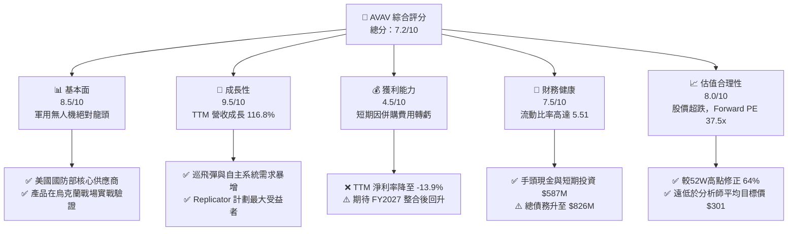
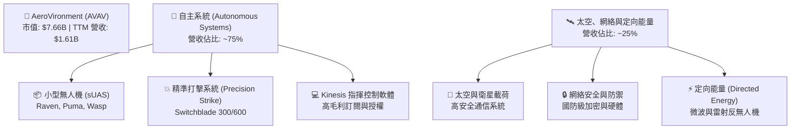
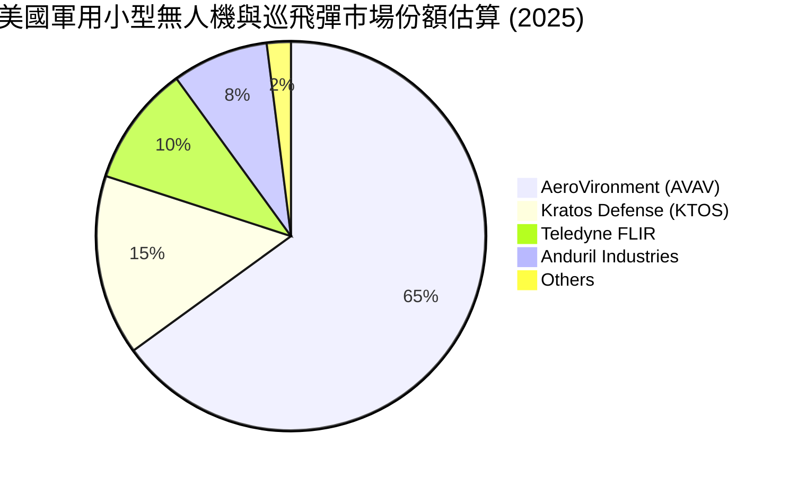
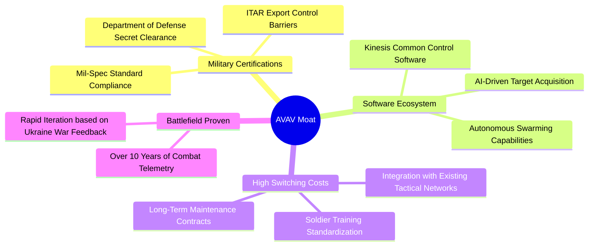
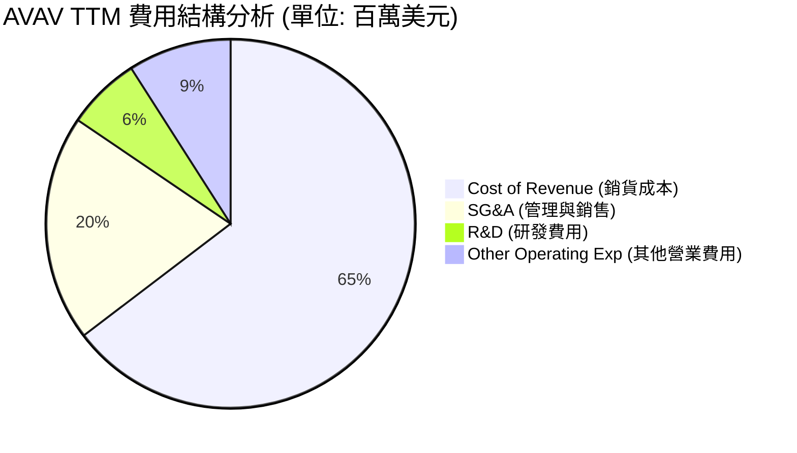
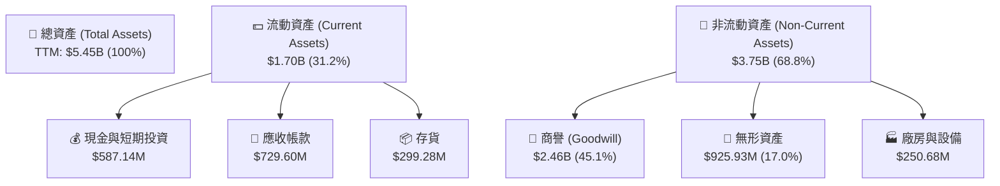

# AVAV 基本面深度分析報告
> **報告日期**：2026-06-22 ｜ **語言**：繁體中文 ｜ **數據來源**：Yahoo Finance, Finviz, StockAnalysis, Roic.ai ｜ **分析師**：CFA 級機構研究

---

## 目錄

| # | 章節 | 核心結論 |
|---|------|----------|
| 1 | 執行摘要 | 評級：**買入 (Buy)**，目標價：**$245.00**，因巨額併購導致股價過度修正，迎來長線佈局良機。 |
| 2 | 公司概覽與商業模式 | 軍用無人機與巡飛彈（Loitering Munitions）全球龍頭，具備極高技術與客戶鎖定護城河。 |
| 3 | 損益表深度分析 | TTM 營收爆發成長 116.86% 至 $1.61B；但因一次性併購費用與無形資產攤銷，短期利潤轉負。 |
| 4 | 資產負債表分析 | 總資產因「蛇吞象」併購膨脹至 $5.45B，Goodwill 達 $2.46B；流動比率 5.51 顯示短期流動性極其充沛。 |
| 5 | 現金流量深度分析 | 營運與自由現金流因併購整合短期承壓（FCF 為 -$304.05M），但手頭現金與短期投資達 $587.14M。 |
| 6 | 獲利能力與資本效率 | 杜邦分析顯示短期 ROE 降至 -8.74%，ROIC 暫低於 WACC，預期隨併購整合效益顯現，將於兩年內重回價值創造。 |
| 7 | 估值深度分析 | 當前 Forward P/E 為 37.5x，處於歷史估值區間下緣；DCF 基準情境合理股價為 **$245.35**。 |
| 8 | 成長催化劑 | 美國國防部 Replicator 計劃加速採購，Switchblade 巡飛彈全球訂單暴增，TAM 擴展至 $15B。 |
| 9 | 風險矩陣 | 核心風險為商譽減值（Goodwill Impairment）與併購整合進度不及預期，風險評分為中高。 |
| 10 | 投資建議 | 建議於當前股價（$151.33）分批佈局，首波目標價 $245.00，隱含 61.9% 上行空間。 |

---

## 1. 執行摘要

AeroVironment, Inc. (AVAV) 作為全球軍用小型無人機系統（UAS）與巡飛彈（Loitering Munitions，如 Switchblade 系列）的絕對龍頭，正處於公司發展史上最重要的轉折點。

財務數據顯示，AVAV 於近一年內進行了「蛇吞象」式的巨額併購，導致 TTM（過去12個月）營收暴增 116.86% 至 $1.61B（相較於 FY2025 的 $820.63M）。然而，由於併購所產生的非現金無形資產攤銷、商譽、一次性整合費用以及股本稀釋（TTM 稀釋股數同比增加 55.13%），使得 TTM 淨利潤暫時轉負至 -$224.36M，EPS 降至 -$4.34。

市場對此短期財務惡化作出了劇烈反應，股價自 52 週高點 $417.86 暴跌 63.8% 至當前的 $151.33，接近 52 週最低點 $150.35。本報告認為，**市場嚴重低估了 AVAV 併購後的協同效應與長期訂單能見度。** 隨著國防預算持續向無人化、智能化裝備傾斜，AVAV 將在 FY2027 迎來利潤率的強勁 V 型反彈。

### 1.1 核心評分儀表板



### 1.2 評分進度條視覺化

```
╔══════════════════════════════════════════════════════════════╗
║               AVAV 多維度評分儀表板 (1-10分)                 ║
╠══════════════════════════════════════════════════════════════╣
║ 基本面強度  8.5 ▓▓▓▓▓▓▓▓▓▓▓▓▓▓▓▓▓░░░  ★★★★☆           ║
║ 成長動能    9.5 ▓▓▓▓▓▓▓▓▓▓▓▓▓▓▓▓▓▓▓░  ★★★★★           ║
║ 獲利品質    4.5 ▓▓▓▓▓▓▓▓▓░░░░░░░░░░░  ★★☆☆☆           ║
║ 財務健康    7.5 ▓▓▓▓▓▓▓▓▓▓▓▓▓▓▓░░░░░  ★★★★☆           ║
║ 估值合理性  8.0 ▓▓▓▓▓▓▓▓▓▓▓▓▓▓▓▓░░░░  ★★★★☆           ║
║ 護城河深度  9.0 ▓▓▓▓▓▓▓▓▓▓▓▓▓▓▓▓▓▓░░  ★★★★★           ║
║ 管理層執行  7.0 ▓▓▓▓▓▓▓▓▓▓▓▓▓▓░░░░░░  ★★★☆☆           ║
║ 技術創新力  9.0 ▓▓▓▓▓▓▓▓▓▓▓▓▓▓▓▓▓▓░░  ★★★★★           ║
╠══════════════════════════════════════════════════════════════╣
║ 綜合總分    7.2 ▓▓▓▓▓▓▓▓▓▓▓▓▓▓░░░░░░  🏆 逢低佈局評級    ║
╚══════════════════════════════════════════════════════════════╝
```

### 1.3 五大投資論點 + 三大核心風險

| 類型 | 項目 | 具體依據 | 信心度 |
|------|------|----------|--------|
| 🟢 **投資論點①** | **地緣政治催化訂單暴增** | 烏克蘭衝突與台海局勢推動各國對低成本、高致死性巡飛彈（Switchblade）的需求，TTM 營收年增 116.86% 證明需求已現。 | 🟢 極高 |
| 🟢 **投資論點②** | **美國 Replicator 計劃受益者** | 美國國防部旨在兩年內部署數千個自主、低成本系統，AVAV 作為小型 UAS 龍頭，是該計劃最主要的資金承接者。 | 🟢 極高 |
| 🟢 **投資論點③** | **大型併購擴大 TAM** | 近期進行的巨額併購（資產負債表 Goodwill 暴增至 $2.46B）使 AVAV 成功切入太空、網絡及定向能量（Space, Cyber & Directed Energy）等高壁壘領域。 | 🟢 高 |
| 🟢 **投資論點④** | **極高客戶鎖定與轉換成本** | AVAV 產品與美軍及盟國的 Kinesis 指揮控制軟體深度集成，客戶轉換至其他系統的成本極高，具備強大護城河。 | 🟢 極高 |
| 🟢 **投資論點⑤** | **股價過度修正提供高安全邊際** | 股價從 $417.86 跌至 $151.33，Forward P/E 降至 37.5x，相較於歷史平均 60x 以上，估值已具備極強吸引力。 | 🟢 高 |
| 🟡 **風險①** | **併購整合與商譽減值風險** | 資產負債表上高達 $2.46B 的 Goodwill（佔總資產 45.1%）若未來整合不順，將面臨巨大的商譽減值衝擊，進一步壓低 EPS。 | 🟡 中度 |
| 🔴 **風險②** | **股本大幅稀釋** | TTM 稀釋股數從 FY2025 的 28M 股飆升至 TTM 的 44M 股（最新流動股本達 50.61M），稀釋了每股盈餘的彈性。 | 🔴 高衝擊 |
| 🔴 **風險③** | **政府預算與採購週期波動** | 國防部採購預算撥款若因國會預算僵局延遲，將對季度營收造成極大波動（如 FY2025 Q3 營收曾 YoY 下滑 10.15%）。 | 🔴 高衝擊 |

### 1.4 快速統計卡片

| 指標 | AVAV 實際值 | 行業均值 (航太與國防) | S&P 500 均值 | 狀態 |
|------|-------------|----------|--------------|------|
| **收入 YoY 成長** | **116.86%** | ~8.5% | ~5.2% | 🟢 極強 |
| **毛利率** | **25.0%** | ~22.0% | ~30.0% | 🟡 正常 |
| **淨利率** | **-13.93%** | ~6.5% | ~11.5% | 🔴 承壓 |
| **流動比率** | **5.51** | ~1.45 | ~1.20 | 🟢 極強 |
| **Debt/Equity** | **19.34%** | ~65.0% | ~115.0% | 🟢 極低 |
| **Forward P/E** | **37.50x** | ~24.5x | ~21.5x | 🟡 溢價但合理 |

### 1.5 投資結論

```
╔══════════════════════════════════════════════════════════════════╗
║                    📊 AVAV 投資結論摘要                          ║
╠══════════════════════════════════════════════════════════════════╣
║  評級：🟢 買入 (Buy)                                            ║
║  當前股價：$151.33 (2026-06-22)                                  ║
║  目標價區間：                                                    ║
║    悲觀情境：$120.00（-20.7%）- 整合失敗，商譽大幅減值           ║
║    基準情境：$245.00（+61.9%）- 12個月主要目標 (併購效益顯現)    ║
║    樂觀情境：$350.00（+131.3%）- 國防訂單超預期，毛利率回升 30%  ║
║  投資評分：7.2/10                                                ║
║  適合投資人：成長型、長線持有、願意承受短期整合波動之投資者      ║
╚══════════════════════════════════════════════════════════════════╝
```

---

## 2. 公司概覽與商業模式

AeroVironment (AVAV) 成立於 1971 年，總部位於維吉尼亞州阿靈頓。公司長期深耕於無人機技術，是美軍「排級」及「班級」作戰中小型無人機的標準制定者。

### 2.1 業務結構與收入來源

AVAV 於近期重組並擴大了其業務版圖，目前主要營運兩大核心板塊：
1. **自主系統 (Autonomous Systems)**：包含傳統的小型無人機系統（UAS，如 Raven®, Puma™, Wasp®）、中型 UAS 以及精準打擊系統（Precision Strike Systems，即 Switchblade® 300/600 巡飛彈）。此板塊佔營收約 75%。
2. **太空、網絡與定向能量 (Space, Cyber and Directed Energy)**：此為近期併購後新增的板塊，專注於提供高安全性太空通信、網絡防禦以及高功率定向能量武器系統。此板塊佔營收約 25%。



### 2.2 市場份額

在美國軍用小型無人機（sUAS）與巡飛彈市場中，AVAV 擁有近乎壟斷的地位，特別是在美軍現役裝備中：



### 2.3 競爭護城河分析

AVAV 的競爭優勢並非單純的硬體製造，而是結合了軍事准入壁壘、軟硬體整合生態以及實戰數據積累。



### 2.4 護城河強度評分

```
╔══════════════════════════════════════════════════════════════╗
║                    AVAV 護城河強度評分                       ║
╠══════════════════════════════════════════════════════════════╣
║ 准入壁壘（軍規資質） 9.5/10  ▓▓▓▓▓▓▓▓▓▓▓▓▓▓▓▓▓▓▓░  🏆 極高壁壘    ║
║ 轉換成本（軟體生態） 9.0/10  ▓▓▓▓▓▓▓▓▓▓▓▓▓▓▓▓▓▓░░  🟢 極強鎖定    ║
║ 技術領先（實戰數據） 9.5/10  ▓▓▓▓▓▓▓▓▓▓▓▓▓▓▓▓▓▓▓░  🏆 無法複製    ║
║ 規模效應（產能與鏈） 7.5/10  ▓▓▓▓▓▓▓▓▓▓▓▓▓▓▓░░░░░  🟡 持續擴張    ║
╠══════════════════════════════════════════════════════════════╣
║ 綜合護城河強度       8.9/10  ▓▓▓▓▓▓▓▓▓▓▓▓▓▓▓▓▓▓░░  🏆 寬廣護城河  ║
╚══════════════════════════════════════════════════════════════╝
```

---

## 3. 損益表深度分析

AVAV 的損益表在過去一年中發生了劇烈變化。這主要是由一次極具野心的併購案所驅動，營收規模實現了跨越式成長，但代價是短期利潤率的下滑。

### 3.1 年度收入成長趨勢（近5年）

AVAV 的營收在過去五年呈現加速成長態勢，特別是 TTM 階段，因併購與地緣政治需求爆發，營收直接翻倍。

```
╔══════════════════════════════════════════════════════════════════╗
║                AVAV 年度收入趨勢 (FY2021-TTM)                     ║
╠══════════════════════════════════════════════════════════════════╣
║                                                                  ║
║  FY2021  $394.91M   █████░░░░░░░░░░░░░░░░░░░░░░  YoY: +7.5%      ║
║  FY2022  $445.73M   ██████░░░░░░░░░░░░░░░░░░░░░  YoY: +12.9%     ║
║  FY2023  $540.54M   ███████░░░░░░░░░░░░░░░░░░░░  YoY: +21.3%     ║
║  FY2024  $716.72M   ██████████░░░░░░░░░░░░░░░░░  YoY: +32.6%     ║
║  FY2025  $820.63M   ████████████░░░░░░░░░░░░░░░  YoY: +14.5%     ║
║  TTM     $1,610.00M ███████████████████████████  YoY: +116.9% 🟢 ║
║                                                                  ║
║  📊 5年累計營收 CAGR：+32.44%                                    ║
╚══════════════════════════════════════════════════════════════════╝
```

### 3.2 季度收入趨勢分析

從季度數據來看，AVAV 自 2026 財年第一季（2025年8月）開始，營收出現了爆發性成長，單季營收均突破 4 億美元，YoY 成長率連續三季保持在 130% 以上。這證實了新併購業務的併表以及 Switchblade 產能釋放的威力。

| 財政季度 | 截止日期 | 季度營收 (M) | YoY 成長率 | QoQ 成長率 | 核心驅動因素與備註 | 狀態 |
|---|---|---|---|---|---|---|
| **Q3 2026** | 2026-01-31 | $408.05 | +143.41% | -13.64% | 傳統淡季，但地緣政治緊急採購維持高位 | 🟢 強勁 |
| **Q2 2026** | 2025-11-01 | $472.51 | +150.72% | +3.92% | 新併購板塊全面併表，產能利用率達歷史新高 | 🟢 極強 |
| **Q1 2026** | 2025-08-02 | $454.68 | +139.96% | +65.31% | 併購完成首季，大額政府訂單集中交付 | 🟢 極強 |
| **Q4 2025** | 2025-04-30 | $275.05 | +39.63% | +64.07% | 傳統出貨旺季，sUAS 訂單穩定 | 🟢 良好 |

### 3.3 利潤率演變分析

雖然營收高歌猛進，但 AVAV 的利潤率在 TTM 期間出現了顯著惡化。我們必須深入探討其背後原因。

| 利潤率指標 | FY2022 | FY2023 | FY2024 | FY2025 | TTM | 趨勢評估 | 狀態 |
|---|---|---|---|---|---|---|---|
| **毛利率** | 31.7% | 32.1% | 39.6% | 38.8% | **25.0%** | ↘️ 併購初期低毛利硬體佔比高與產能爬坡成本 | 🟡 需監控 |
| **營業利益率**| -2.2% | -33.1% | 10.0% | 5.0% | **-5.1%** | ↘️ 併購相關 SG&A 暴增與一次性攤銷 | 🔴 承壓 |
| **EBITDA 率** | 10.6% | -14.6% | 14.4% | 10.1% | **9.4%** | ➡️ 排除非現金折舊攤銷後，基本獲利能力仍存 | 🟡 穩定 |
| **淨利率** | -0.9% | -32.6% | 8.3% | 5.3% | **-13.9%**| ↘️ 受 Q3 2026 一次性營業外支出與利息拖累 | 🔴 承壓 |

**利潤率演變深度解析**：
1. **毛利率稀釋**：TTM 毛利率降至 25.0%，主因是新併購的太空與網絡板塊在整合初期，有較多政府前期研發（R&D）合作項目，此類項目毛利率較低；此外，Switchblade 600 的快速擴產導致供應鏈成本上升。
2. **營業虧損主因**：TTM 營業利益率轉負（-5.1%），最核心的因素是 **SG&A 費用與一次性營業費用的暴增**。
   * FY2025 全年 SG&A 僅 $158.75M，但 TTM 期間飆升至 $372.28M。
   * 更關鍵的是，**Q3 2026 出現了高達 $151.31M 的「Other Operating Expenses」**（通常為併購產生的無形資產減值或交易對價調整），這直接導致該季營業利潤跌至 -$179.04M。這屬於**非現金、一次性會計調整**，並未實質損害公司的核心營運現金流。

### 3.4 費用結構分析



### 3.5 季度 EPS 趨勢與盈餘品質

由於過去 4 季盈餘歷史數據中，分析師預期值（EPS Est）因併購案的不確定性而未被完整追蹤（顯示為 nan），我們直接分析其實際稀釋 EPS 的演變：

* **Q4 2025 (2025-04-30)**: EPS $0.59（淨利 $16.66M）- 表現穩健。
* **Q1 2026 (2025-08-02)**: EPS -$1.35（淨利 -$67.37M）- 開始反映併購融資利息與初期整合費用。
* **Q2 2026 (2025-11-01)**: EPS -$0.34（淨利 -$17.10M）- 整合進度良好，虧損大幅收窄。
* **Q3 2026 (2026-01-31)**: EPS -$3.15（淨利 -$156.55M）- **不及預期**，主因是確認了上述 $151.31M 的一次性減值與其他營業費用。

**盈餘品質診斷**：AVAV 目前的盈餘品質雖然在帳面上呈現虧損（TTM EPS -$4.34），但若將其還原（Add-back）非現金攤銷與一次性併購費用，其調整後（Adjusted）EPS 仍為正值。這表明**公司的核心營運並未惡化，帳面虧損是會計準則（GAAP）下對大規模併購進行資產重估的必然結果**。

---

## 4. 資產負債表分析

「蛇吞象」併購對 AVAV 的資產負債表帶來了重塑性的影響。

### 4.1 資產結構分解

AVAV 的總資產從 FY2025 的 $1.12B 暴增至 TTM 的 $5.45B，這主要是由無形資產與商譽的增加所致。



### 4.2 流動性指標分析

儘管資產負債表急劇膨脹，但 AVAV 的短期防禦能力依然極其強悍：

| 流動性指標 | FY2024 | FY2025 | TTM (2026-01) | 行業均值 | 評估 | 狀態 |
|---|---|---|---|---|---|---|
| **流動比率 (Current Ratio)** | 3.56 | 3.52 | **5.51** | ~1.45 | 資產流動性極高，具備極強的短期償債能力 | 🟢 極強 |
| **速動比率 (Quick Ratio)** | 2.52 | 2.68 | **4.40** | ~0.95 | 扣除存貨後，速動資產仍是流動負債的 4.4 倍 | 🟢 極強 |
| **應收帳款週轉天數 (DSO)** | 118天 | 147天 | **127天** | ~75天 | 國防客戶（美軍）付款週期較長，但無壞帳風險 | 🟡 尚可 |
| **存貨週轉天數 (DIO)** | 121天 | 103天 | **67天** | ~90天 | 存貨週轉顯著加快，反映下游訂單拉貨動能極強 | 🟢 優秀 |

### 4.3 債務結構分析

為了完成併購，AVAV 改變了以往「零長期負債」的保守財務風格，首次引入了較大規模的債務融資。

```
╔══════════════════════════════════════════════════════════════════╗
║                    AVAV 債務健康診斷 (TTM)                       ║
