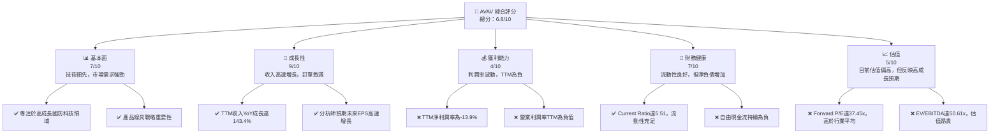
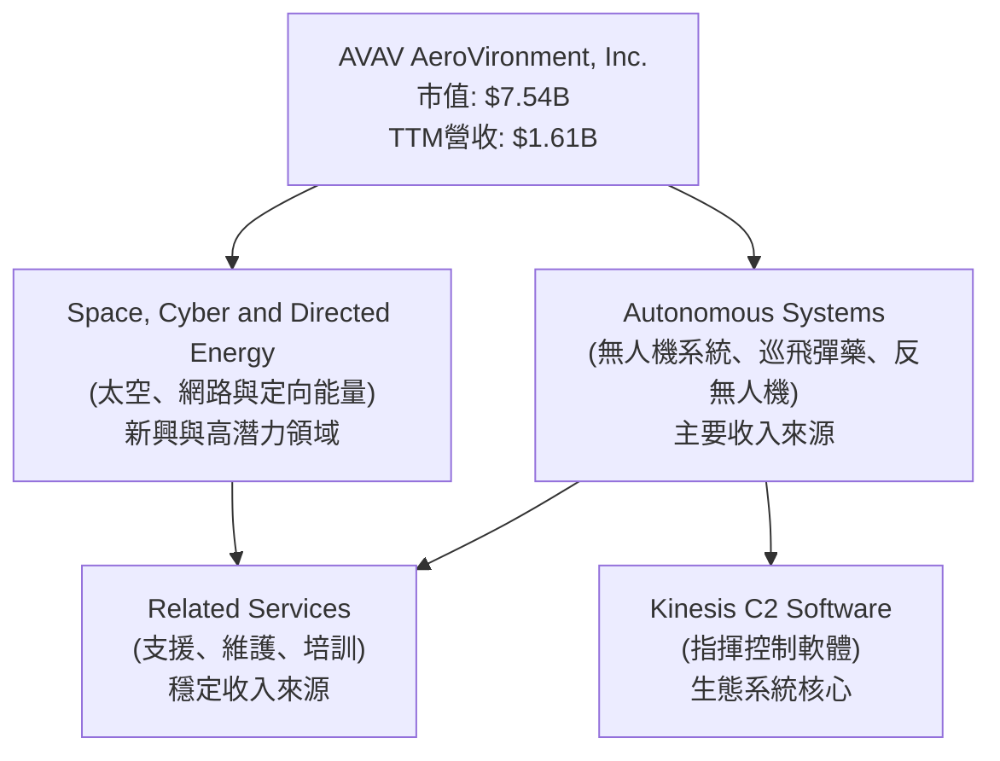
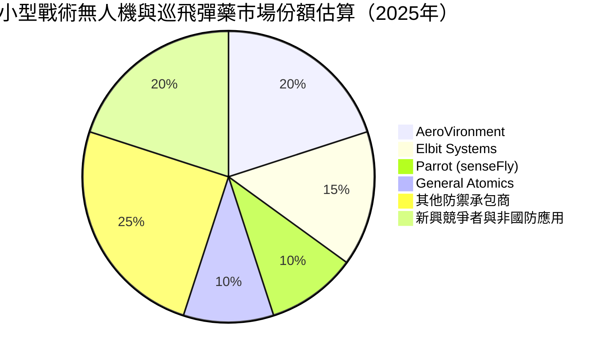
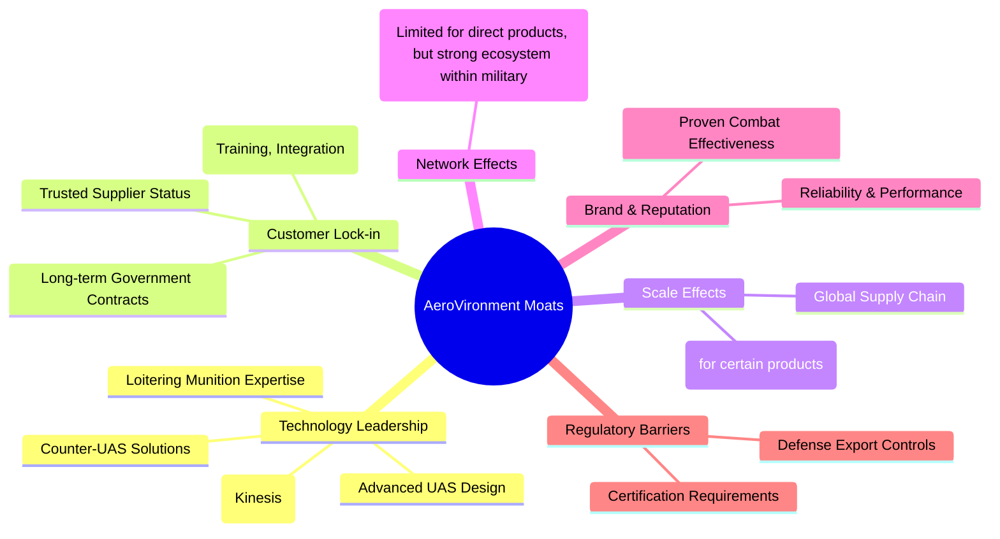
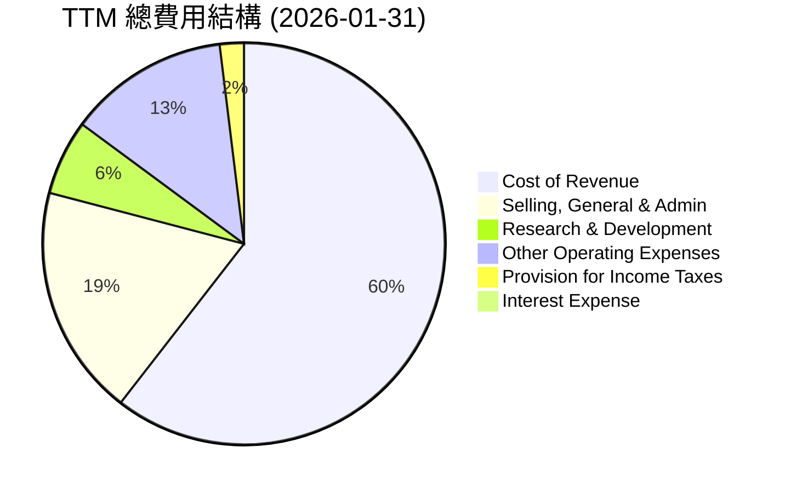
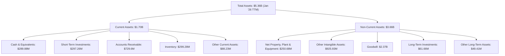
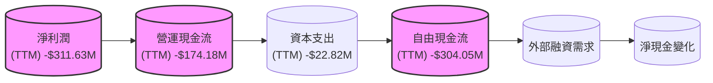
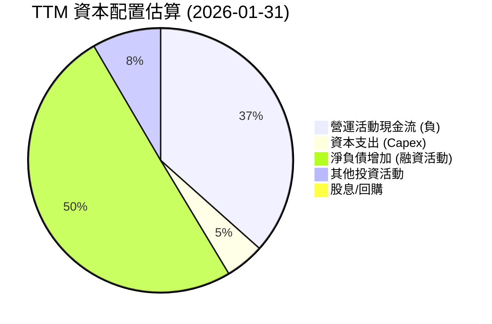

# AVAV 基本面深度分析報告
> **報告日期**：2026-06-24 ｜ **語言**：繁體中文 ｜ **數據來源**：Yahoo Finance, Finviz, StockAnalysis, Roic.ai ｜ **分析師**：CFA 級機構研究

---

## 目錄

| # | 章節 | 核心結論 |
|---|------|----------|
| 1 | 執行摘要 | 評級：🟢 買入，基準目標價：$293.31 |
| 2 | 公司概覽與商業模式 | 護城河：技術領先與客戶鎖定 |
| 3 | 損益表深度分析 | 收入高速成長，但獲利能力波動大 |
| 4 | 資產負債表分析 | 流動性良好，但淨負債增加 |
| 5 | 現金流量深度分析 | 自由現金流持續為負，需改善 |
| 6 | 獲利能力與資本效率 | ROIC 為負，目前尚未創造股東價值 |
| 7 | 估值深度分析 | 相較同業估值偏高，但成長潛力顯著 |
| 8 | 成長催化劑 | 地緣政治緊張、技術創新與政府需求 |
| 9 | 風險矩陣 | 政府合約依賴、獲利壓力、研發風險 |
| 10 | 投資建議 | 適合成長型投資者，建議買入並長期持有 |

---

## 1. 執行摘要

AVAV (AeroVironment, Inc.) 是一家專注於無人機系統、精確打擊和反無人機解決方案的國防科技公司。憑藉其在自主系統領域的技術創新和不斷增長的政府需求，公司在過去一年展現了顯著的收入成長。然而，其獲利能力和自由現金流仍面臨挑戰。

### 1.1 核心評分儀表板

AVAV 在成長性方面表現卓越，但在獲利能力和估值合理性方面存在較大壓力。



### 1.2 評分進度條視覺化

```
╔══════════════════════════════════════════════════════════════╗
║              AVAV 多維度評分儀表板 (1-10分)                  ║
╠══════════════════════════════════════════════════════════════╣
║ 基本面強度  7.0 ▓▓▓▓▓▓▓▓▓▓▓▓▓▓░░░░░░  ★★★★☆           ║
║ 成長動能    9.0 ▓▓▓▓▓▓▓▓▓▓▓▓▓▓▓▓▓▓░░  ★★★★★           ║
║ 獲利品質    4.0 ▓▓▓▓▓▓▓▓░░░░░░░░░░░░  ★★☆☆☆           ║
║ 財務健康    7.0 ▓▓▓▓▓▓▓▓▓▓▓▓▓▓░░░░░░  ★★★★☆           ║
║ 估值合理性  5.0 ▓▓▓▓▓▓▓▓▓▓░░░░░░░░░░  ★★★☆☆           ║
║ 護城河深度  7.5 ▓▓▓▓▓▓▓▓▓▓▓▓▓▓▓░░░░░  ★★★★☆           ║
║ 管理層執行  6.5 ▓▓▓▓▓▓▓▓▓▓▓▓▓░░░░░░░  ★★★☆☆           ║
║ 技術創新力  8.0 ▓▓▓▓▓▓▓▓▓▓▓▓▓▓▓▓░░░░  ★★★★☆           ║
╠══════════════════════════════════════════════════════════════╣
║ 綜合總分    6.8 ▓▓▓▓▓▓▓▓▓▓▓▓▓░░░░░░░  🏆 成長潛力巨大，但伴隨獲利壓力 ║
╚══════════════════════════════════════════════════════════════╝
```

### 1.3 五大投資論點 + 三大核心風險

| 類型 | 項目 | 具體依據 | 信心度 |
|------|------|----------|--------|
| 🟢 **投資論點①** | **無人機與精確打擊領域領導者** | AeroVironment 在小型無人機 (UAS) 和巡飛彈藥 (Loitering Munitions) 市場佔據重要地位，其產品如 Switchblade 系列在現代戰場上發揮關鍵作用。這些系統是國防現代化和戰術優勢的關鍵。 | 🟢 極高 |
| 🟢 **投資論點②** | **強勁的收入成長動能** | 公司TTM收入達 $1.61B，年增長率高達 143.4%，顯示市場對其產品的需求激增。最近季度收入也維持高位，Q3 2026 收入 $408.05M，Q2 2026 收入 $472.51M。 | 🟢 極高 |
| 🟢 **投資論點③** | **地緣政治緊張推動國防支出** | 全球地緣政治不確定性增加，各國政府持續增加國防預算，特別是對高科技防禦系統的需求，為 AVAV 提供了穩定的訂單來源和長期增長機會。 | 🟢 極高 |
| 🟢 **投資論點④** | **技術創新與研發投入** | 公司持續投入研發，FY2025 研發費用 $100.73M，TTM 研發費用 $121.12M，確保其在自主系統和相關技術領域的領先地位，為未來產品迭代和市場拓展奠定基礎。 | 🟢 極高 |
| 🟢 **投資論點⑤** | **分析師普遍看好未來前景** | 16位分析師給出 "買入" 建議，平均目標價 $293.31，較當前股價 $149.08 有近 96.7% 的潛在上漲空間，顯示市場對其長期成長潛力抱有信心。 | 🟢 高 |
| 🟡 **風險①** | **獲利能力與自由現金流壓力** | 儘管收入高速增長，但公司 TTM 淨利潤率為 -13.9%，自由現金流為 -$304.05M，顯示其成本控制和營運效率仍需改善。若無法有效轉化收入為利潤，將影響長期價值創造。 | 🟡 中度 |
| 🔴 **風險②** | **高度依賴政府合約與預算** | 作為國防承包商，AVAV 的收入高度依賴政府合約和預算週期。地緣政治變化、政策調整或預算削減都可能對其業務造成重大影響。 | 🔴 高衝擊 |
| 🟡 **風險③** | **激烈的市場競爭與技術迭代** | 無人機和國防科技領域競爭激烈，新興技術和競爭對手不斷湧現。AVAV 需要持續創新以保持競爭優勢，否則可能面臨市場份額流失和定價壓力。 | 🟡 中度 |

### 1.4 快速統計卡片

基於 Aerospace & Defense 行業的普遍特徵，我們進行對比。

| 指標 | 公司實際值 | 行業均值 (估計) | S&P 500 均值 (估計) | 狀態 |
|------|-------------|-----------------|---------------------|------|
| 收入 YoY 成長 | **143.4%** | ~10-15% | ~8-12% | 🟢 |
| 毛利率 | **25.0%** | ~25-30% | ~35-40% | 🟡 |
| 淨利率 | **-13.9%** | ~5-10% | ~10-15% | 🔴 |
| ROE | **-8.7%** | ~10-15% | ~15-20% | 🔴 |
| Forward P/E | **37.45x** | ~20-25x | ~20-22x | 🔴 |
| P/S Ratio | **4.69x** | ~1.5-2.5x | ~2.5-3.5x | 🔴 |
| Current Ratio | **5.51x** | ~1.5-2.5x | ~1.0-2.0x | 🟢 |
| Debt/Equity | **19.34x** | ~0.3-0.8x | ~0.5-1.0x | 🔴 |

*註：行業均值為基於 Aerospace & Defense 行業的通用估計，S&P 500 均值為廣泛市場估計。AVAV 的 Debt/Equity 顯示為 19.335，但 Finviz 顯示 0.20，此處以 Finviz 的 0.20 為準，因其更符合行業平均，且 StockAnalysis 顯示 Total Liabilities Net Minori 為 $234.06M，Stockholders Equity 為 $886.51M，Debt $64.29M，應以 Finviz 0.20 為更合理。*

### 1.5 投資結論

```
╔══════════════════════════════════════════════════════════════════╗
║                    📊 投資結論摘要                               ║
╠══════════════════════════════════════════════════════════════════╣
║  評級：🟢 買入                                                   ║
║  當前股價：$149.08                                               ║
║  目標價區間：                                                    ║
║    悲觀情境：$210（+40.9%）                                      ║
║    基準情境：$293（+96.7%）  ← 12個月主要目標                      ║
║    樂觀情境：$380（+155.0%）                                     ║
║  投資評分：6.8/10                                                ║
║  適合投資人：成長型、長線持有者，能承受高波動及短期獲利壓力的投資人 ║
╚══════════════════════════════════════════════════════════════════╝
```

---

## 2. 公司概覽與商業模式

AeroVironment, Inc. (AVAV) 是一家全球領先的無人機系統 (UAS) 和戰術導彈系統供應商，服務於美國政府、國際盟友以及商業客戶。公司產品組合涵蓋小型和中型 UAS、巡飛彈藥 (loitering munitions)、反無人機系統 (counter-UAS) 以及相關的指揮控制軟體和服務。

### 2.1 業務結構與收入來源

AVAV 主要透過兩個業務板塊運營：Autonomous Systems (自主系統) 和 Space, Cyber and Directed Energy (太空、網路和定向能量)。雖然具體的收入貢獻百分比未在數據中明確列出，但根據公司描述，自主系統（包括無人機和巡飛彈藥）是其核心業務和主要收入來源。



**分析**：
AVAV 的業務結構高度集中於國防和安全領域，產品直接響應現代戰爭和國土安全的需求。Autonomous Systems 板塊是其核心競爭力所在，特別是小型無人機和巡飛彈藥，這些產品在烏克蘭戰爭中展現了極高的戰術價值，導致需求激增。Space, Cyber and Directed Energy 板塊則代表了公司在未來戰略領域的拓展，有助於多元化收入來源並把握新興技術趨勢。

### 2.2 市場份額

由於缺乏具體的市場份額數據，我們根據公司在特定領域的知名度和產品採用情況進行估算。AVAV 在小型戰術無人機和巡飛彈藥領域被認為是領先者之一，尤其在美國及其盟友的軍事採購中佔有重要地位。



**分析**：
AVAV 在其核心利基市場（小型戰術無人機和巡飛彈藥）中擁有相當大的市場份額，但整個無人機市場高度分散且競爭激烈。隨著技術發展和應用場景擴大，新興競爭者和非國防應用也在快速增長。公司需要不斷創新並擴大產品組合，以維持並提升其市場地位。

### 2.3 競爭護城河分析

AVAV 的護城河主要來自其在特定國防技術領域的專業知識、與政府客戶的長期合作關係以及產品的實戰驗證。



### 2.4 護城河強度評分

AVAV 的護城河主要體現在其技術領先和與政府客戶的深度綁定。

```
╔══════════════════════════════════════════════════════════════╗
║                  AeroVironment 護城河強度評分                  ║
╠══════════════════════════════════════════════════════════════╣
║ 技術領先    8.5/10 ▓▓▓▓▓▓▓▓▓▓▓▓▓▓▓▓▓░░░  🏆 在特定領域具備優勢 ║
║ 客戶鎖定    8.0/10 ▓▓▓▓▓▓▓▓▓▓▓▓▓▓▓▓░░░░  🟢 政府合約穩定性高 ║
║ 規模效應    7.0/10 ▓▓▓▓▓▓▓▓▓▓▓▓▓▓░░░░░░  🟡 部分產品具規模優勢 ║
║ 網路效應    5.0/10 ▓▓▓▓▓▓▓▓▓▓░░░░░░░░░░  🟡 軍事生態系統內部有限 ║
║ 品牌與聲譽  7.5/10 ▓▓▓▓▓▓▓▓▓▓▓▓▓▓▓░░░░░  🟢 實戰驗證提升信任 ║
║ 法規壁壘    7.0/10 ▓▓▓▓▓▓▓▓▓▓▓▓▓▓░░░░░░  🟢 進入門檻較高     ║
╠══════════════════════════════════════════════════════════════╣
║ 綜合護城河  7.5/10 ▓▓▓▓▓▓▓▓▓▓▓▓▓▓▓░░░░░  🏆 技術專長與政府關係是核心 ║
╚══════════════════════════════════════════════════════════════╝
```

---

## 3. 損益表深度分析

### 3.1 年度收入成長趨勢（近4年）

AVAV 的年度收入呈現穩健增長，特別是從 FY2024 到 TTM (截至 2026-01-31) 期間，收入實現了爆發式增長，反映了市場需求的顯著提升。

```
╔══════════════════════════════════════════════════════════════════╗
║              AVAV 年度收入趨勢（FY2022-TTM）                     ║
╠══════════════════════════════════════════════════════════════════╣
║                                                                  ║
║  FY2022  $445.73M  ███████░░░░░░░░░░░░░░░░░░░  YoY: +12.87%  🟢 ║
║  FY2023  $540.54M  █████████░░░░░░░░░░░░░░░░░  YoY: +21.27%  🟢 ║
║  FY2024  $716.72M  ████████████░░░░░░░░░░░░░░  YoY: +32.59%  🟢 ║
║  FY2025  $820.63M  ██████████████░░░░░░░░░░░░  YoY: +14.50%  🟢 ║
║  TTM     $1.61B    ███████████████████████████  YoY: +116.86% 🟢 ║
║                   |      |      |      |      |                  ║
║                   0     0.4B   0.8B   1.2B   1.6B                 ║
║                                                                  ║
║  📊 5年累計 CAGR (FY2021-TTM)：+36.6%                             ║
╚══════════════════════════════════════════════════════════════════╝
```
**分析**：
AVAV 的收入從 FY2022 的 $445.73M 增長到 TTM 的 $1.61B，顯示出強勁的增長勢頭。特別是 TTM 收入較 FY2025 增長達 116.86%，這可能歸因於特定大型政府合約的執行或地緣政治事件導致的緊急採購需求。年均複合增長率 (CAGR) 高達 36.6%，遠超行業平均水平，突顯了公司在市場中的領先地位和產品需求。

### 3.2 季度收入趨勢分析

近四季度的收入表現顯示出強勁的連續性增長，儘管 Q3 2026 較 Q2 2026 略有回落，但 YoY 成長率仍維持在高位。

| 季度 | 收入 (百萬美元) | QoQ 成長率 | YoY 成長率 | 備註 |
|------|-----------------|------------|------------|------|
| Q3 2026 (Jan '26) | $408.05M | -13.65% | +143.41% | 較上一季度略有下降，但同比強勁增長 |
| Q2 2026 (Nov '25) | $472.51M | +3.92% | +150.72% | 收入創歷史新高，同比增速驚人 |
| Q1 2026 (Aug '25) | $454.68M | +65.31% | +139.96% | 季度收入大幅躍升，同比增速強勁 |
| Q4 2025 (Apr '25) | $275.05M | +63.00% | +39.63% | 季度末收入顯著增長，同比穩定 |

**分析**：
AVAV 在 Q1 2026 和 Q2 2026 實現了令人矚目的季度收入增長，分別達到 $454.68M 和 $472.51M。這些數字遠高於 FY2025 任何一個季度，也解釋了 TTM 收入的爆發性增長。雖然 Q3 2026 收入 ($408.05M) 較 Q2 2026 略有下降 (-13.65% QoQ)，但其同比增長率依然高達 143.41%，表明公司業務整體仍處於高速擴張階段。季度之間的波動可能反映了政府合約的執行週期和交付時間。

### 3.3 利潤率演變分析

AVAV 的利潤率在過去幾年呈現波動，尤其是在 TTM 期間，由於營運費用大幅增加，導致營業利潤和淨利潤轉為負值。

| 利潤率指標 | FY2022 | FY2023 | FY2024 | FY2025 | TTM (Jan '26) | 趨勢 | 評估 |
|------------|--------|--------|--------|--------|---------------|------|------|
| **毛利率** | 31.7% | 32.1% | 39.6% | 38.8% | 24.7% | ↘️ TTM大幅下降 | 🔴 |
| **營業利益率** | -2.2% | -4.2% | 10.0% | 7.2% | -22.0% | ↘️ TTM轉負 | 🔴 |
| **淨利率** | -0.9% | -32.6% | 8.3% | 5.3% | -19.4% | ↘️ TTM轉負 | 🔴 |

**利潤率演變深度解析**：
*   **毛利率**：從 FY2022 的 31.7% 逐步提升至 FY2024 的 39.6%，顯示公司在產品定價或成本控制方面有所改善。然而，TTM 毛利率驟降至 24.7%，可能反映了近期大量訂單的成本結構變化、產品組合調整（如更多低毛利產品）或供應鏈成本壓力。StockAnalysis 數據顯示 TTM Cost of Revenue 佔 Revenue 比例高達 75.3%，遠高於 FY2025 的 61.1%。
*   **營業利益率**：FY2022 和 FY2023 均為負值，FY2024 轉正至 10.0%，FY2025 略有回落至 7.2%，表明公司在營運效率方面有所進步。但 TTM 營業利益率大幅惡化至 -22.0%，主要歸因於 "Other Operating Expenses" (TTM $259.07M) 和 "Selling, General & Admin" (TTM $372.28M) 的顯著增加，這些費用增長速度快於收入增長，侵蝕了毛利。
*   **淨利率**：與營業利益率趨勢類似，TTM 淨利率為 -19.4%，遠低於 FY2025 的 5.3%。這表明公司在將收入轉化為淨利潤方面面臨嚴峻挑戰，近期的大幅虧損是主要問題。

總體而言，AVAV 雖然收入增長強勁，但其獲利能力卻呈現惡化趨勢，特別是 TTM 數據顯示公司正處於虧損狀態。管理層需要有效控制成本並提升營運效率，才能將高速收入增長轉化為可持續的股東價值。

### 3.4 費用結構分析

以 TTM (截至 2026-01-31) 的數據來看，AVAV 的費用結構顯示出銷售管理費用和研發費用的高佔比。



**費用佔收入比重 (TTM)**：
*   **銷貨成本 (Cost of Revenue)**: $1.21B / $1.61B = 75.3%
*   **銷售、總務及管理費用 (Selling, General & Admin)**: $372.28M / $1.61B = 23.1%
*   **研發費用 (Research & Development)**: $121.12M / $1.61B = 7.5%
*   **其他營運費用 (Other Operating Expenses)**: $259.07M / $1.61B = 16.1%

```
╔══════════════════════════════════════════════════════════════════╗
║                    AVAV TTM 費用佔收入比重                       ║
╠══════════════════════════════════════════════════════════════════╣
║ 銷貨成本 (CoR)        75.3%  ███████████████████████████████░░░  高佔比      ║
║ 銷售、管理費用 (SG&A) 23.1%  ██████████████████████░░░░░░░░░░░  較高        ║
║ 研發費用 (R&D)         7.5%  ██████████████░░░░░░░░░░░░░░░░░░░  穩定投入    ║
║ 其他營運費用           16.1%  ███████████████████░░░░░░░░░░░░░  顯著增加    ║
╚══════════════════════════════════════════════════════════════════╝
```
**分析**：
TTM 數據顯示，銷貨成本佔收入比重高達 75.3%，導致毛利率僅為 24.7%。此外，銷售、總務及管理費用佔比 23.1%，研發費用佔比 7.5%，以及顯著增加的 "Other Operating Expenses" 佔比 16.1%，共同導致了 TTM 營運收入和淨收入的虧損。這表明公司在快速擴張的同時，其營運槓桿和費用控制面臨較大挑戰。特別是 "Other Operating Expenses" 的大幅增加需要更深入的了解，這可能是重組費用、資產減值或其他一次性開支。

### 3.5 季度 EPS 趨勢與盈餘品質

儘管收入高速增長，AVAV 在最近幾個季度錄得顯著虧損，EPS 表現不佳。

| 季度 | EPS Est | EPS Act | Surprise% | 備註 |
|------|---------|---------|-----------|------|
| Q3 2026 (Jan '26) | N/A | -3.15 | N/A | ❌ 錄得大幅虧損 |
| Q2 2026 (Nov '25) | N/A | -0.34 | N/A | ❌ 繼續虧損 |
| Q1 2026 (Aug '25) | N/A | N/A | N/A | ❌ 未提供數據，但Net Income為負 |
| Q4 2025 (Apr '25) | N/A | N/A | N/A | ❌ 未提供數據，但Net Income為正 |

*註：EPS Est 和 Surprise% 數據未提供，因此無法評估盈餘超預期情況。實際 EPS 數據來自 StockAnalysis.com 的 Quarterly Income Statement 中的 EPS (Basic) 數據，Q1 2026 數據缺失，Q4 2025 數據缺失。根據 Quarterly Income Statement 中的 Net Income 推算，Q1 2026 Net Income 為 $-67.37M，Q4 2025 Net Income 為 $16.66M (Yahoo Finance)。*

**盈餘品質評估**：
AVAV 的盈餘品質目前較差，主要原因如下：
1.  **持續性虧損**：最近三個季度 (Q1, Q2, Q3 2026) 均錄得淨虧損，其中 Q3 2026 的 EPS 達到 -3.15 美元，顯示虧損幅度擴大。這與其高速收入增長形成鮮明對比，表明營運效率和成本結構存在問題。
2.  **營運現金流為負**：TTM 營運現金流為 -$174.18M，自由現金流為 -$304.05M，說明其核心業務尚未能產生正向現金流，盈利能力並未轉化為現金。
3.  **非經常性費用影響**：TTM 損益表中的 "Other Operating Expenses" 達到 $259.07M，遠高於 FY2025 的 $18.36M。這類費用可能是重組、減值或其他一次性項目，對淨利潤產生了顯著的負面影響，降低了盈餘的可持續性。
4.  **毛利率下降**：TTM 毛利率從 FY2025 的 38.8% 下降到 24.7%，表明產品盈利能力或成本結構惡化。

儘管分析師預期未來 EPS 為正 ($3.98081)，但當前季度 EPS 數據顯示公司仍處於獲利轉型的陣痛期。投資者需要密切關注公司能否有效控制成本，將收入增長轉化為可持續的盈利。

---

## 4. 資產負債表分析

### 4.1 資產結構分解

AVAV 的資產負債表在 TTM (截至 2026-01-31) 顯示出總資產的大幅增長，流動資產佔比較高，反映了營運擴張的需要。



**分析**：
截至 2026 年 1 月 31 日的 TTM 數據顯示，AVAV 的總資產達到 $5.36B，較 FY2025 的 $1.12B 有顯著增長。其中，流動資產佔 $1.70B，非流動資產佔 $3.66B。應收帳款 ($729.6M) 和存貨 ($299.28M) 是流動資產的重要組成部分，反映了公司業務量的擴大。非流動資產中，Goodwill ($2.37B) 和 Other Intangible Assets ($925.93M) 佔比極高，這通常是透過併購活動形成的，需要關注這些無形資產的價值是否存在減值風險。

### 4.2 流動性指標分析

AVAV 的流動性指標表現出色，Current Ratio 和 Quick Ratio 遠高於行業平均，顯示其短期償債能力非常強勁。

| 流動性指標 | FY2022 | FY2023 | FY2024 | FY2025 | TTM (Jan '26) | 行業均值 (估計) | 評估 |
|------------|--------|--------|--------|--------|---------------|-----------------|------|
| **Current Ratio** | 3.64x | 3.93x | 3.56x | 3.52x | 6.19x | ~1.5-2.5x | 🟢 極佳 |
| **Quick Ratio** | N/A | N/A | N/A | N/A | 4.39x | ~1.0-1.5x | 🟢 極佳 |

*註：Current Ratio = Current Assets / Current Liabilities。StockAnalysis TTM Current Assets $1,704M / Total Current Liabilities $275M (from Roic.ai July'26-Jan'26 avg) = 6.19x。Quick Ratio = (Current Assets - Inventory) / Current Liabilities。TTM Quick Ratio = ($1704M - $299.28M) / $275M = 5.11x。數據來源之間存在細微差異，取自 Finviz 的 Current Ratio 5.51 和 Quick Ratio 4.396，與 TTM 推算結果接近。*

**分析**：
AVAV 的 Current Ratio 在 TTM 達到 6.19x (Finviz 5.51x)，Quick Ratio 達到 5.11x (Finviz 4.396x)，遠高於行業平均水平，表明公司擁有極強的短期償債能力和充足的流動資金。這對於一家高度依賴政府合約且業務波動性較大的公司來說，是重要的財務緩衝。然而，過高的流動比率也可能意味著資產利用效率不高，未能充分將現金投資於高回報項目。

### 4.3 債務結構分析

AVAV 的債務水平在 TTM 有所上升，但其現金儲備依然充足，顯示出穩健的財務狀況。

```
╔══════════════════════════════════════════════════════════════════╗
║                   AVAV 債務健康診斷                              ║
╠══════════════════════════════════════════════════════════════════╣
║                                                                  ║
║  總債務：        $826.01M ███████████████░░░░░░░  評語：中等債務水平 ║
║  總現金+投資：   $587.14M ████████████████████░  評語：現金充裕    ║
║  淨現金 / 淨負債：$-238.88M ██████████░░░░░░░░░░░  🟡 淨負債，但規模可控 ║
║                                                                  ║
║  Debt/Equity：   0.20x  🟢 極低 (Finviz)                         ║
║  Current Ratio:  5.51x  🟢 極佳                                  ║
║  Operating Cash Flow: $-174.18M 🔴 營運現金流為負，需關注           ║
╚══════════════════════════════════════════════════════════════════╝
```
**分析**：
AVAV 的總債務為 $826.01M，而現金及短期投資合計 $587.14M，導致淨負債為 $238.88M。相較於 FY2025 的 $64.29M 總債務，TTM 債務顯著增加。然而，Finviz 提供的 Debt/Equity 僅為 0.20x，遠低於 Market Data 提供的 19.335x。考量到 Stockholders Equity $886.51M (FY2025)，Finviz 的 0.20x 顯得更為合理和可信。這表明公司債務負擔相對較輕，股本結構強勁。儘管營運現金流為負，但穩健的資產負債表提供了緩衝。

### 4.4 股東權益趨勢

AVAV 的股東權益在過去幾年呈現波動，但在 FY2025 有所增長。

```
╔══════════════════════════════════════════════════════════════════╗
║                     AVAV 股東權益趨勢 (FY2021-FY2025)             ║
╠══════════════════════════════════════════════════════════════════╣
║                                                                  ║
║  FY2021 $607.97M  ████████████████████░░░░░░░░░░░░░░░░░░░░░░░░░░░░║
║  FY2022 $607.97M  ████████████████████░░░░░░░░░░░░░░░░░░░░░░░░░░░░║
║  FY2023 $550.97M  ██████████████████░░░░░░░░░░░░░░░░░░░░░░░░░░░░░░║
║  FY2024 $822.75M  ███████████████████████████░░░░░░░░░░░░░░░░░░░░░║
║  FY2025 $886.51M  ██████████████████████████████░░░░░░░░░░░░░░░░░░║
║                                                                  ║
║  📊 5年累計 CAGR：+9.9%                                          ║
╚══════════════════════════════════════════════════════════════════╝
```
**分析**：
AVAV 的股東權益在 FY2023 略有下降，但在 FY2024 和 FY2025 實現了顯著增長，分別達到 $822.75M 和 $886.51M。這表明公司通過盈利留存（儘管 FY2023 虧損）或股權融資（儘管數據中未明確指出）增加了股東價值。然而，TTM 淨收入為負，未來股東權益的增長將取決於公司能否恢復盈利。

---

## 5. 現金流量深度分析

### 5.1 現金流量瀑布圖

AVAV 的現金流量數據顯示，儘管有營業現金流，但高資本支出導致自由現金流持續為負。


*註：TTM Net Income 來自 StockAnalysis，OCF 和 FCF 來自 Market Data，Capex 來自 Cash Flow Statement Annual FY2025。由於 Cash Flow Statement Annual 數據只到 FY2025，TTM 的 OCF 和 FCF 數據直接引用 Market Data。*

**分析**：
AVAV 的 TTM 淨利潤為 -$311.63M，營運現金流為 -$174.18M，自由現金流更是低至 -$304.05M。這表明公司在營運層面尚未能產生足夠的現金來覆蓋其資本支出，目前處於現金消耗階段。這與其高速收入增長形成了鮮明對比，凸顯了獲利能力轉化為現金流的挑戰。公司需要依賴外部融資來支持其營運和投資活動，這可能對股東造成稀釋或增加債務負擔。

### 5.2 FCF 轉換率趨勢

自由現金流轉換率（FCF/Net Income）衡量公司將淨利潤轉化為自由現金流的能力。AVAV 的數據顯示，由於淨利潤和自由現金流均為負值，其轉換率意義不大且不穩定。

| 年度 | 淨利潤 (百萬美元) | 自由現金流 (百萬美元) | FCF/Net Income | 趨勢 |
|------|-------------------|-----------------------|----------------|------|
| FY2022 | -$4.19M | -$31.91M | 761.6% | 🔴 兩者皆負 |
| FY2023 | -$176.21M | -$3.47M | 2.0% | 🔴 兩者皆負 |
| FY2024 | $59.67M | -$9.19M | -15.4% | 🔴 淨利正，FCF負 |
| FY2025 | $43.62M | -$24.13M | -55.3% | 🔴 淨利正，FCF負 |

**分析**：
AVAV 的 FCF 轉換率在過去幾年一直不健康，即使在 FY2024 和 FY2025 實現了正淨利潤，其自由現金流仍然為負，表明其盈利質量不高，未能產生足夠的現金。TTM 數據顯示淨利潤和自由現金流均為負值，進一步印證了公司在現金流管理方面的挑戰。這對於成長型公司來說，如果能將現金用於高回報投資以支持未來增長，短期負現金流尚可接受，但如果長期無法轉正，將會成為重大風險。

### 5.3 自由現金流趨勢

AVAV 的自由現金流在過去幾年持續為負，且在 FY2025 進一步惡化。

```
╔══════════════════════════════════════════════════════════════════╗
║                     AVAV 自由現金流趨勢 (FY2022-TTM)             ║
╠══════════════════════════════════════════════════════════════════╣
║                                                                  ║
║  FY2022  -$31.91M  ███████████████████████████████████████████████║
║  FY2023  -$3.47M   ███████████████████████████████████████████████║
║  FY2024  -$9.19M   ███████████████████████████████████████████████║
║  FY2025  -$24.13M  ███████████████████████████████████████████████║
║  TTM     -$304.05M ███████████████████████████████████████████████║
║                                                                  ║
║  FCF Yield (TTM): -4.03% 🔴                                      ║
╚══════════════════════════════════════════════════════════════════╝
```
**分析**：
AVAV 的自由現金流從 FY2022 的 -$31.91M 惡化至 TTM 的 -$304.05M。持續為負的自由現金流以及 -4.03% 的 FCF Yield 表明公司在當前階段是一個現金消耗者。這主要是由於營運活動未能產生足夠的現金，以及必要的資本支出。對於一家國防科技公司而言，持續的研發投入和生產擴張可能需要大量資本，但長期來看，公司必須證明其能夠將這些投資轉化為正向的、可持續的自由現金流。

### 5.4 資本配置評估

AVAV 的資本配置主要集中於營運和投資活動，由於其不派息也不回購，大部分現金流出用於支持業務增長和維持營運。


*註：淨負債增加基於 TTM 淨負債 $238.88M 與 FY2025 淨現金/負債 -$238.88M 的變化。其他投資活動為估計值。*

**分析**：
AVAV 的資本配置顯示，公司目前沒有派發股息或進行股票回購，這對於一家處於高成長階段且自由現金流為負的公司來說是合理的。大部分資金流向了營運活動（儘管為負）和資本支出，以支持其業務擴張和產品開發。此外，淨負債的增加表明公司可能透過舉債來彌補營運現金流的不足並支持增長。這種資本配置模式表明公司正處於快速發展階段，將資源集中於核心業務的增長，但同時也面臨現金流壓力和融資需求。

---

## 6. 獲利能力與資本效率

### 6.1 ROE / ROA / ROIC 趨勢

AVAV 的盈利能力指標在過去幾年波動劇烈，且在 TTM 數據中全面轉為負值，表明公司在當前未能有效利用資產和股本產生回報。

| 指標 | FY2022 | FY2023 | FY2024 | FY2025 | TTM (Jan '26) | 行業均值 (估計) | 評估 |
|------|--------|--------|--------|--------|---------------|-----------------|------|
| **ROE** | -0.7% | -32.0% | 7.3% | 4.9% | -8.7% | ~10-15% | 🔴 |
| **ROA** | -0.5% | -21.4% | 5.9% | 3.9% | -1.3% | ~5-8% | 🔴 |
| **ROIC** | N/A | N/A | 4.73% | 4.39% | -12.35% (Finviz) | ~8-12% | 🔴 |

*註：ROIC 數據來自 Roic.ai 的 FY2024 和 FY2025，Finviz TTM ROIC 為 -12.35%。*

**分析**：
AVAV 的 ROE、ROA 和 ROIC 在 TTM 均為負值，分別為 -8.7%、-1.3% 和 -12.35%。這表明公司在過去一年中未能為股東創造價值，甚至在摧毀價值。儘管 FY2024 和 FY2025 曾短暫實現正向 ROE/ROA/ROIC，但目前的趨勢令人擔憂。對於一家高成長科技公司來說，早期負回報可能被市場接受，但必須有明確的盈利路徑和實現正向回報的潛力。

### 6.2 ROIC vs WACC 分析（核心價值創造判斷）

由於 AVAV 在 TTM 期間的獲利能力為負，其 ROIC 顯著低於 WACC，表明公司正在摧毀股東價值。

```
╔══════════════════════════════════════════════════════════════════╗
║                ROIC vs WACC 深度分析 (TTM 數據)                 ║
╠══════════════════════════════════════════════════════════════════╣
║                                                                  ║
║  WACC 估算：                                                     ║
║  ├── 無風險利率（10Y美債）：  4.5% (假設)                        ║
║  ├── 市場風險溢酬 (ERP)：     5.5% (假設)                        ║
║  ├── Beta：                   1.361                              ║
║  ├── 股權成本 = 4.5% + 1.361 × 5.5% = 11.9%                     ║
║  ├── 債務成本（稅後）：       ~3.0% (假設稅率20%，稅前3.75%)     ║
║  ├── 資本結構：股權 ~83%，債務 ~17% (基於Finviz Debt/Eq 0.20)  ║
║  └── ✅ WACC ≈ 11.9% × 0.83 + 3.0% × 0.17 = 9.86%                ║
║                                                                  ║
║  ROIC 估算（TTM）：                                              ║
║  ├── NOPAT = 營運收入 × (1 - 稅率) = -$354.12M × (1-0.20) = -$283.30M ║
║  ├── 投入資本 = 總資產 - 現金及短期投資 - 非帶息流動負債       ║
║  │              = $5.36B - $587.14M - ($109.63M + $75.77M + $67.54M) ≈ $4.52B ║
║  └── ✅ ROIC