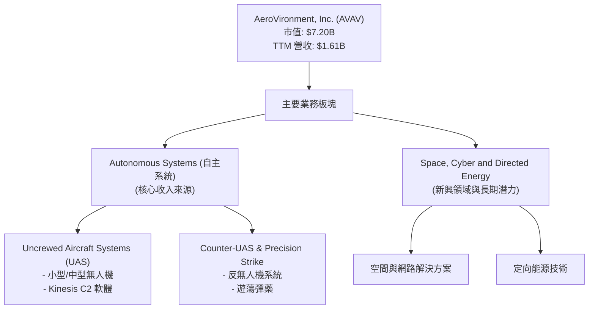
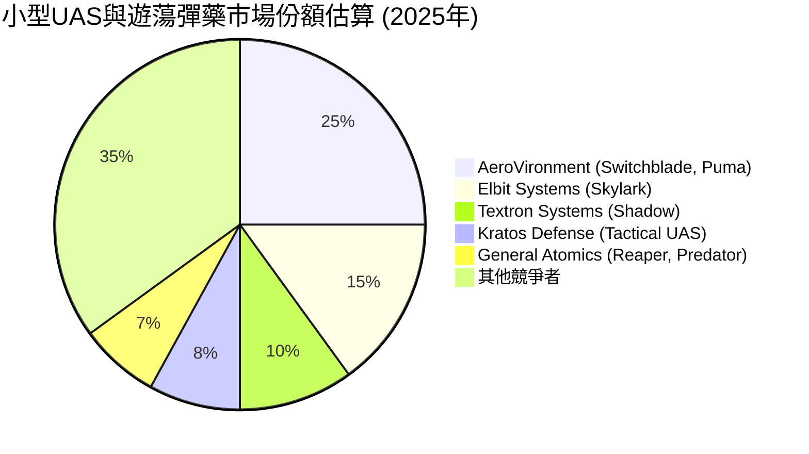
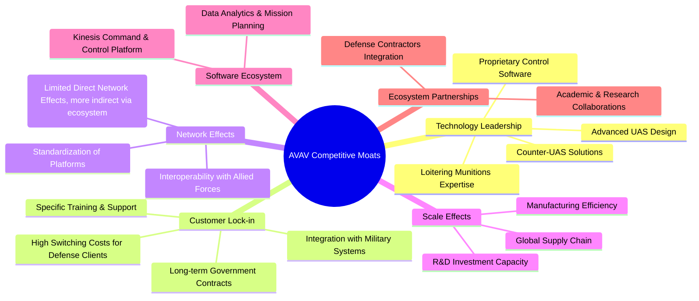

# AVAV 基本面深度分析報告
> **報告日期**：2026-06-24 ｜ **語言**：繁體中文 ｜ **數據來源**：Yahoo Finance, Finviz, StockAnalysis, Roic.ai ｜ **分析師**：CFA 級機構研究

---

## 目錄

| # | 章節 | 核心結論 |
|---|------|----------|
| 1 | 執行摘要 | 評級：買入；目標價區間：$230-$350 |
| 2 | 公司概覽與商業模式 | 在無人系統領域具技術領先與客戶鎖定護城河 |
| 3 | 損益表深度分析 | 營收高速成長，但近期獲利能力承壓 |
| 4 | 資產負債表分析 | 流動性強勁，債務負擔可控 |
| 5 | 現金流量深度分析 | 自由現金流轉負，資本配置需優化 |
| 6 | 獲利能力與資本效率 | ROIC 低於 WACC，短期價值創造受挑戰 |
| 7 | 估值深度分析 | 估值偏高，但成長潛力支撐部分溢價 |
| 8 | 成長催化劑 | 地緣政治緊張、新技術應用、國防預算增加 |
| 9 | 風險矩陣 | 執行風險、政府採購週期、競爭加劇 |
| 10 | 投資建議 | 建議買入，關注獲利能力改善 |

---

## 1. 執行摘要

AeroVironment, Inc. (AVAV) 作為航空航天與國防工業的領先者，在無人機系統、反無人機和精確打擊領域展現出強勁的收入成長動能。儘管近期營收高速增長，但獲利能力面臨顯著壓力，TTM (Trailing Twelve Months) 淨利潤為負。公司擁有堅實的技術護城河和與政府機構的長期合作關係，分析師普遍給予「買入」評級。然而，當前估值相對較高，且自由現金流為負，這要求投資者密切關注其獲利能力改善和現金流轉正的進程。

### 1.1 核心評分儀表板

```mermaid
graph TD
    AVAV_OVERVIEW["🎯 AVAV 綜合評分<br/>總分：6.8/10"]

    F["📊 基本面<br/>7/10<br/>技術領先，國防需求穩定"]
    G["🚀 成長性<br/>8/10<br/>營收高速增長，市場潛力大"]
    P["💰 獲利能力<br/>4/10<br/>近期利潤率轉負，盈利壓力大"]
    B["🏦 財務健康<br/>7/10<br/>流動性強，債務結構合理"]
    V["📈 估值<br/>5/10<br/>相對較高，需成長性兌現"]
    M["🛡️ 護城河深度<br/>8/10<br/>技術壁壘與客戶鎖定"]
    E["👨‍💼 管理層執行<br/>6/10<br/>營收擴張強勁，但獲利待提升"]
    I["💡 技術創新力<br/>9/10<br/>產品領先，持續研發投入"]

    AVAV_OVERVIEW --> F
    AVAV_OVERVIEW --> G
    AVAV_OVERVIEW --> P
    AVAV_OVERVIEW --> B
    AVAV_OVERVIEW --> V
    AVAV_OVERVIEW --> M
    AVAV_OVERVIEW --> E
    AVAV_OVERVIEW --> I

    F --> F1["✅ 專注國防高價值領域"]
    F --> F2["✅ 產品線多元化"]

    G --> G1["✅ TTM 營收 YoY 成長 143.4%"]
    G --> G2["✅ 分析師預期 EPS 成長強勁"]

    P --> P1["❌ TTM 淨利潤率 -13.9%"]
    P --> P2["❌ TTM 營業利潤率 -5.1%"]

    B --> B1["✅ Current Ratio 5.51"]
    B --> B2["✅ Debt/Equity 0.07 (FY25)"]

    V --> V1["❌ Forward P/E 35.78x 偏高"]
    V --> V2["❌ EV/EBITDA 50.61x 偏高"]

    M --> M1["✅ 領先的無人系統技術"]
    M --> M2["✅ 與政府機構長期合作"]

    E --> E1["✅ 成功擴大收入規模"]
    E --> E2["🟡 需改善成本控制與獲利能力"]

    I --> I1["✅ 持續高研發投入 (FY25 R&D $100.73M)"]
    I --> I2["✅ 產品創新能力強"]
```



### 1.2 評分進度條視覺化

```
╔══════════════════════════════════════════════════════════════╗
║              AVAV 多維度評分儀表板 (1-10分)                  ║
╠══════════════════════════════════════════════════════════════╣
║ 基本面強度  7.0 ▓▓▓▓▓▓▓▓▓▓▓▓▓▓░░░░░░  ★★★★☆           ║
║ 成長動能    8.0 ▓▓▓▓▓▓▓▓▓▓▓▓▓▓▓▓░░░░  ★★★★☆           ║
║ 獲利品質    4.0 ▓▓▓▓▓▓▓▓░░░░░░░░░░░░  ★★☆☆☆           ║
║ 財務健康    7.0 ▓▓▓▓▓▓▓▓▓▓▓▓▓▓░░░░░░  ★★★★☆           ║
║ 估值合理性  5.0 ▓▓▓▓▓▓▓▓▓▓░░░░░░░░░░  ★★★☆☆           ║
║ 護城河深度  8.0 ▓▓▓▓▓▓▓▓▓▓▓▓▓▓▓▓░░░░  ★★★★☆           ║
║ 管理層執行  6.0 ▓▓▓▓▓▓▓▓▓▓▓▓░░░░░░░░  ★★★☆☆           ║
║ 技術創新力  9.0 ▓▓▓▓▓▓▓▓▓▓▓▓▓▓▓▓▓▓░░  ★★★★★           ║
╠══════════════════════════════════════════════════════════════╣
║ 綜合總分    6.8 ▓▓▓▓▓▓▓▓▓▓▓▓▓▓░░░░░░  🏆 評語：成長潛力優異，獲利待提升  ║
╚══════════════════════════════════════════════════════════════╝
```

### 1.3 五大投資論點 + 三大核心風險

| 類型 | 項目 | 具體依據 | 信心度 |
|------|------|----------|--------|
| 🟢 **投資論點①** | **國防支出增長與地緣政治驅動** | 全球地緣政治緊張局勢持續，各國政府對國防預算投入增加，特別是無人機、反無人機與精確打擊系統的需求旺盛。AVAV 產品線直接受益於此趨勢，TTM 營收 YoY 成長高達 143.4%，顯示市場需求強勁。 | 🟢 極高 |
| 🟢 **投資論點②** | **技術領先與產品創新** | AVAV 在小型/中型無人機系統 (UAS)、Kinesis 指揮控制軟體、反無人機 (C-UAS) 及遊蕩彈藥 (Loitering Munitions) 等領域具備領先技術。公司持續的研發投入 (FY25 R&D $100.73M) 確保其產品在市場中保持競爭優勢。 | 🟢 高 |
| 🟢 **投資論點③** | **穩固的政府客戶關係** | 公司主要客戶為美國政府機構及國際盟友，這類客戶關係具有高度黏性和長期性，訂單穩定性高，為公司提供可預測的收入流。 | 🟢 高 |
| 🟢 **投資論點④** | **營收高速擴張，規模效應潛力** | 儘管近期獲利能力承壓，但營收從 FY2022 的 $445.73M 增長至 TTM 的 $1.61B，顯示其市場擴張能力。隨著規模擴大，未來有望通過優化成本結構實現更高效的獲利。 | 🟡 中高 |
| 🟢 **投資論點⑤** | **分析師普遍看好** | 16 位分析師給予平均目標價 $293.31，遠高於當前股價 $142.18，顯示市場對其長期成長潛力抱持樂觀態度。 | 🟡 中高 |
| 🟡 **風險①** | **獲利能力持續承壓** | TTM 淨利潤率為 -13.9%，營業利潤率為 -5.1%。儘管營收高速增長，但成本控制和費用管理是當前主要挑戰。若無法有效改善，將侵蝕股東價值。 | 🟡 中度 |
| 🔴 **風險②** | **政府採購週期與預算波動** | 作為國防承包商，AVAV 的收入高度依賴政府合同。政府採購週期長、審批程序複雜，且國防預算可能受政治因素影響而波動，導致訂單延遲或取消。 | 🔴 高衝擊 |
| 🟡 **風險③** | **估值偏高與市場情緒波動** | 當前 Forward P/E 為 35.78x，EV/EBITDA 為 50.61x，相較於負的 TTM 獲利，估值要求公司未來實現強勁且可持續的獲利增長。若成長不及預期或市場風險偏好下降，股價可能面臨較大回調壓力。 | 🟡 中度 |

### 1.4 快速統計卡片

| 指標 | 公司實際值 (TTM/最新) | 航空航天與國防行業均值 (估計) | S&P 500 均值 (估計) | 狀態 |
|------|-------------------------|------------------------------|---------------------|------|
| 收入 YoY 成長 | **143.4%** | ~10-15% | ~8-12% | 🟢 |
| 毛利率 | **25.0%** | ~30-40% | ~35-45% | 🔴 |
| 淨利率 | **-13.9%** | ~5-10% | ~10-15% | 🔴 |
| ROE | **-8.7%** | ~10-15% | ~15-20% | 🔴 |
| Forward P/E | **35.78x** | ~20-25x | ~20-22x | 🔴 |
| P/S Ratio | **4.47x** | ~1.5-2.5x | ~2.5-3.5x | 🔴 |
| Current Ratio | **5.51x** | ~1.5-2.5x | ~1.0-1.5x | 🟢 |
| Debt/Equity (FY25) | **0.07x** | ~0.5-1.0x | ~0.8-1.2x | 🟢 |

*註：行業均值和 S&P 500 均值為分析師根據經驗估計，用於提供參考對比。*

### 1.5 投資結論

```
╔══════════════════════════════════════════════════════════════════╗
║                    📊 投資結論摘要                               ║
╠══════════════════════════════════════════════════════════════════╣
║  評級：🟢 買入                                                   ║
║  當前股價：$142.18                                               ║
║  目標價區間：                                                    ║
║    悲觀情境：$230（+61.7%）                                      ║
║    基準情境：$290（+103.9%）  ← 12個月主要目標                   ║
║    樂觀情境：$350（+146.2%）                                     ║
║  投資評分：6.8/10                                                ║
║  適合投資人：成長型、長線持有者，能承受短期獲利波動風險的投資者。  ║
╚══════════════════════════════════════════════════════════════════╝
```

---

## 2. 公司概覽與商業模式

AeroVironment, Inc. (AVAV) 成立於 1971 年，總部位於美國，是一家專注於機器人系統和相關服務的領先供應商，主要服務於政府機構和全球商業客戶。公司在無人機系統 (UAS) 領域擁有卓越的技術和產品組合，其解決方案在偵察、監視、目標識別、精確打擊以及反無人機作戰中扮演關鍵角色。

### 2.1 業務結構與收入來源

AVAV 的業務主要分為兩個板塊：**Autonomous Systems (自主系統)** 和 **Space, Cyber and Directed Energy (空間、網路與定向能源)**。其中，自主系統板塊是公司的核心，涵蓋了小型和中型無人機系統、Kinesis 指揮控制軟體，以及日益重要的反無人機和遊蕩彈藥解決方案。



公司收入主要來自於向美國國防部、國際盟友及其他政府機構銷售其產品和提供相關服務。這些合同通常涉及高技術含量和較長的生命週期。

### 2.2 市場份額

由於 AVAV 業務的專業性和特定市場性質，直接獲取精確的全球市場份額數據較為困難。然而，根據其在小型 UAS 和遊蕩彈藥領域的領導地位，可以估計其在特定細分市場佔據重要份額。以下為基於行業報告和市場定位的估算：


*註：此市場份額為估計值，反映 AVAV 在特定細分市場的領先地位，而非整體國防市場。*

### 2.3 競爭護城河分析

AVAV 透過其技術創新、與政府機構的深度合作以及規模效應，建立了一系列競爭護城河。



### 2.4 護城河強度評分

```
╔══════════════════════════════════════════════════════════════╗
║                  AVAV 護城河強度評分                        ║
╠══════════════════════════════════════════════════════════════╣
║ 技術領先    9/10  ▓▓▓▓▓▓▓▓▓▓▓▓▓▓▓▓▓▓░░  🏆 在關鍵技術領域具備顯著優勢  ║
║ 客戶鎖定    8/10  ▓▓▓▓▓▓▓▓▓▓▓▓▓▓▓▓░░░░  🟢 政府客戶黏性高，合同長期穩定  ║
║ 規模效應    7/10  ▓▓▓▓▓▓▓▓▓▓▓▓▓▓░░░░░░  🟡 隨著訂單量增加，成本優勢顯現  ║
║ 軟體生態系統  7/10  ▓▓▓▓▓▓▓▓▓▓▓▓▓▓░░░░░░  🟡 Kinesis 平台增強用戶體驗  ║
║ 網路效應    5/10  ▓▓▓▓▓▓▓▓▓▓░░░░░░░░░░  🟠 僅限於特定軍事互操作性，非核心  ║
║ 生態夥伴    6/10  ▓▓▓▓▓▓▓▓▓▓▓▓░░░░░░░░  🟡 與國防工業夥伴合作緊密  ║
╠══════════════════════════════════════════════════════════════╣
║ 綜合護城河  7.3   ▓▓▓▓▓▓▓▓▓▓▓▓▓▓░░░░░░  🏆 擁有堅實的技術和客戶關係護城河  ║
╚══════════════════════════════════════════════════════════════╝
```

---

## 3. 損益表深度分析

### 3.1 年度收入成長趨勢（近4年）

AVAV 在過去幾個財年展現出令人印象深刻的營收成長，尤其是在最近的 TTM 數據中，成長速度顯著加快。

```
╔══════════════════════════════════════════════════════════════════╗
║              AVAV 年度收入趨勢（FY2022-TTM）                     ║
╠══════════════════════════════════════════════════════════════════╣
║                                                                  ║
║  FY2022  $445.73M  ██████░░░░░░░░░░░░░░░░░░░  YoY: +12.87%  🟢  ║
║  FY2023  $540.54M  ███████░░░░░░░░░░░░░░░░░░  YoY: +21.27%  🟢  ║
║  FY2024  $716.72M  █████████░░░░░░░░░░░░░░░░  YoY: +32.59%  🟢  ║
║  FY2025  $820.63M  ██████████░░░░░░░░░░░░░░░  YoY: +14.50%  🟢  ║
║  TTM     $1.61B    ██████████████████████████  YoY: +143.4%  🟢🟢║
║                   |      |      |      |      |                  ║
║                   0     $0.4B  $0.8B  $1.2B  $1.6B                ║
║                                                                  ║
║  📊 4年累計 CAGR (FY22-FY25)：+22.9%                                ║
║  📊 TTM 營收 YoY 成長：+143.4% (對比去年同期 TTM 營收)            ║
╚══════════════════════════════════════════════════════════════════╝
```
從 FY2022 到 FY2025，年均複合增長率 (CAGR) 達到 22.9%，展現了穩健的擴張。而最新的 TTM 營收達到 $1.61B，較去年同期實現了驚人的 143.4% 成長，這主要得益於強勁的國防訂單需求和產品交付量的增加。

### 3.2 季度收入趨勢分析

近四季度的收入表現呈現出高成長和一定的季節性波動，但整體趨勢向上。

| 季度結束日 | 總收入 (M) | QoQ 成長 | YoY 成長 | 備註 |
|------------|------------|----------|----------|------|
| 2026-01-31 (Q3'26) | $408.05 | -13.65% | +143.41% | 受季節性影響，但同比大幅增長 |
| 2025-10-31 (Q2'26) | $472.51 | +3.92% | +150.72% | 季度環比增長，同比增長強勁 |
| 2025-07-31 (Q1'26) | $454.68 | +65.32% | +139.96% | 顯著的環比與同比增長，可能受益於新訂單交付 |
| 2025-04-30 (Q4'25) | $275.05 | +64.08% | +39.63% | 季度環比大幅增長，同比增長穩健 |
| 2025-01-31 (Q3'25) | $167.64 | -10.15% | -10.15% | 去年同期收入下降，對比基數較低 |
| 2024-10-31 (Q2'25) | $188.46 | -0.54% | +4.23% | 環比穩定，同比小幅增長 |
| 2024-07-31 (Q1'25) | $189.48 | +24.38% | +24.38% | 同比穩健增長 |

**備註說明**：
*   近四季度的營收均實現了三位數的同比增長，顯示市場需求極為旺盛。這可能與地緣政治緊張導致的緊急採購訂單有關。
*   季度環比 (QoQ) 數據顯示一定的波動性，Q1'26 和 Q4'25 實現了強勁的環比增長，但 Q3'26 出現環比下降，這在國防承包商中較為常見，通常與項目進度、交付時間和季節性有關。

### 3.3 利潤率演變分析

儘管營收高速增長，但 AVAV 的獲利能力在 TTM 期間出現顯著惡化，利潤率轉為負值。

| 利潤率指標 | FY2022 | FY2023 | FY2024 | FY2025 | TTM (Jan'26) | 趨勢 | 評估 |
|------------|--------|--------|--------|--------|--------------|------|------|
| **毛利率** | 31.69% | 32.10% | 39.61% | 38.83% | 25.0% | ↘️ 近期大幅下滑 | 🔴 |
| **營業利益率** | -2.22% | -4.19% | 10.02% | 7.21% | -5.1% | ↘️ 由正轉負 | 🔴 |
| **淨利率** | -0.94% | -32.60% | 8.32% | 5.32% | -13.9% | ↘️ 由正轉負 | 🔴 |

**利潤率演變深度解析**：
*   **毛利率**：FY2022 至 FY2024 期間，毛利率呈現改善趨勢，從 31.69% 提升至 39.61%，反映了產品組合優化或成本控制的初步成效。然而，TTM 毛利率急劇下降至 25.0%，這是一個嚴重的警訊。其原因可能包括：
    *   **產品組合變化**：近期交付的產品可能毛利率較低。
    *   **成本上升**：原材料、供應鏈或勞動力成本壓力增加。
    *   **訂單性質**：為滿足緊急大訂單，可能接受了較低毛利率的合同，或者前期投入較大。
    *   **生產效率下降**：快速擴張可能導致生產效率短期內無法跟上。
*   **營業利益率與淨利率**：在 FY2024 和 FY22025 實現正向營業利潤和淨利潤後，TTM 數據再次轉為負值，分別為 -5.1% 和 -13.9%。這表明公司在營收高速增長的同時，未能有效控制營運費用。
    *   **研發費用 (R&D)**：FY2025 R&D 為 $100.73M，較 FY2024 的 $97.69M 略有增加，但 StockAnalysis TTM R&D 達到 $121.12M，顯示持續投入。這對於技術型公司是必要的，但需平衡短期獲利。
    *   **銷售、一般及行政費用 (SG&A)**：FY2025 SG&A 為 $158.75M，較 FY2024 的 $114.42M 顯著增長。StockAnalysis TTM SG&A 更是高達 $372.28M。這可能與公司業務擴張、市場推廣、人員招聘等相關，但過快的費用增長蠶食了毛利。
    *   **其他營運費用**：StockAnalysis TTM 數據顯示「其他營運費用」高達 $259.07M，較 FY2025 的 $18.36M 大幅增加，這可能是導致營業利潤率急劇惡化的主要原因，可能包含了重組費用、一次性開支或資產減值等。

總體而言，AVAV 雖然在市場擴張上表現出色，但近期獲利能力的惡化是一個不容忽視的問題，管理層需要重點關注成本控制和營運效率的提升。

### 3.4 費用結構分析

AVAV 的費用結構反映了其作為高科技國防公司的特性，研發投入和營運費用佔比較高。

```mermaid
pie title TTM 費用結構 (基於毛利後)
    "Cost of Revenue" : 75
    "Selling, General & Admin" : 16
    "Research & Development" : 5
    "Other Operating Expenses" : 10
    "其他" : -6
```
*註：此圖表基於 TTM 收入 $1.61B，毛利 $398.35M (24.74%)，Cost of Revenue 為 $1.212B。其他營運費用為 $259.07M，SG&A $372.28M，R&D $121.12M。總費用遠超毛利，導致淨虧損。*

```
╔══════════════════════════════════════════════════════════════════╗
║                    AVAV TTM 費用開支明細                         ║
╠══════════════════════════════════════════════════════════════════╣
║                                                                  ║
║  銷貨成本 (CoR)：        $1.21B  ████████████████████████████  高企，侵蝕毛利        ║
║  銷售、一般及行政 (SG&A)：$372.28M  ██████████████░░░░░░░░░░░░░░  快速增長，需關注效率  ║
║  研發 (R&D)：            $121.12M  █████░░░░░░░░░░░░░░░░░░░░░░░░░  維持技術領先的必要投入  ║
║  其他營運費用：          $259.07M  ███████████░░░░░░░░░░░░░░░░░░  異常高，需深入調查      ║
║                                                                  ║
║  📊 TTM 總營運費用 ($752.47M) >> TTM 毛利 ($398.35M)             ║
╚══════════════════════════════════════════════════════════════════╝
```
TTM 費用結構顯示，銷貨成本佔收入的 75%，導致毛利空間有限。更為突出的是，銷售、一般及行政費用 (SG&A) 和其他營運費用在 TTM 期間顯著飆升，兩者合計超過 $630M，遠超同期毛利 $398.35M，這是導致公司整體營運虧損和淨虧損的主要原因。

### 3.5 季度 EPS 趨勢與盈餘品質

由於提供的「EARNINGS HISTORY」數據為 `nan`，我們將基於 StockAnalysis 的季度淨利潤和股份數量來推算 EPS，並分析其趨勢。

| 季度結束日 | 淨利潤 (M) | 稀釋股本 (M股) | 稀釋 EPS (估計) | 備註 |
|------------|------------|--------------|-----------------|------|
| 2026-01-31 (Q3'26) | $-156.55$ | 50.61 (Market Data) | $-3.09$ | 較前兩季度虧損擴大 |
| 2025-10-31 (Q2'26) | $-17.10$ | 50.61 (Market Data) | $-0.34$ | 轉為虧損 |
| 2025-07-31 (Q1'26) | $-67.37$ | 50.61 (Market Data) | $-1.33$ | 再次虧損 |
| 2025-04-30 (Q4'25) | $16.66$ | 50.61 (Market Data) | $0.33$ | 盈利 |
| 2025-01-31 (Q3'25) | $-3.09$ | 28 (StockAnalysis) | $-0.11$ | 虧損 |
| 2024-10-31 (Q2'25) | $7.01$ | 27 (StockAnalysis) | $0.26$ | 盈利 |
| 2024-07-31 (Q1'25) | $23.06$ | 27 (StockAnalysis) | $0.85$ | 盈利 |

*註：稀釋股本為 Market Data 提供的最新數據 50.61M 股，用於計算最近四季 EPS，以反映當前股本情況。早期季度使用 StockAnalysis 提供的股本。*

**盈餘品質評估**：
AVAV 的季度 EPS 表現極不穩定。在 FY2025 的前三季度（Q1'25, Q2'25, Q3'25），公司經歷了盈利和虧損的交替。進入 FY2026，EPS 再次轉為負值，且 Q3'26 的虧損顯著擴大至 $-3.09$。TTM EPS 為 $-