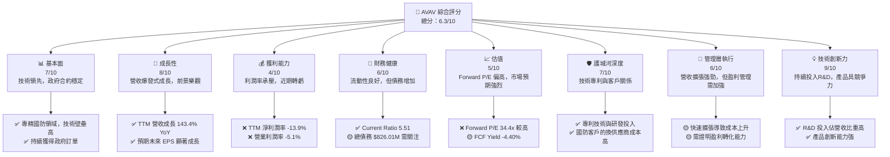
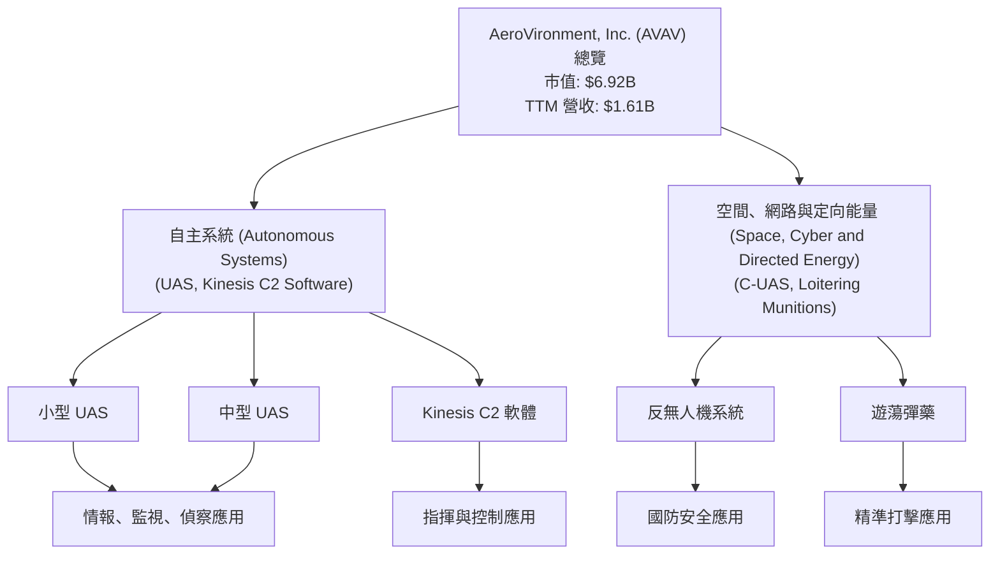
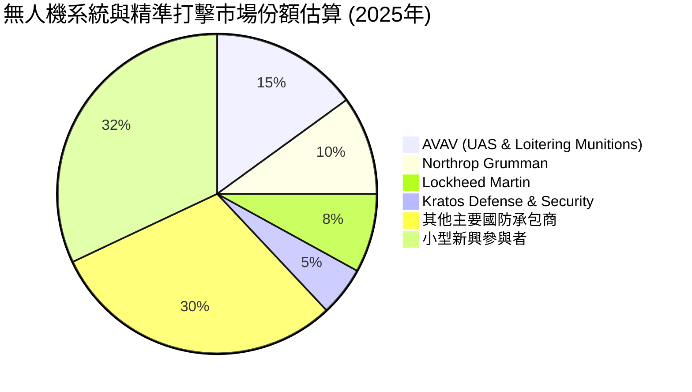
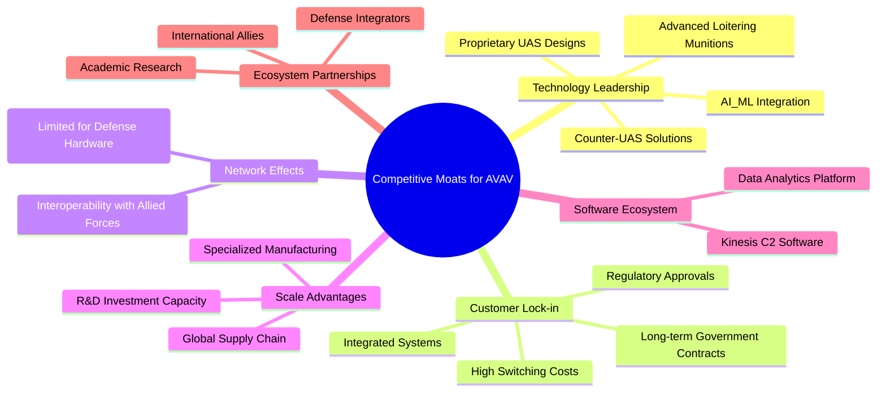
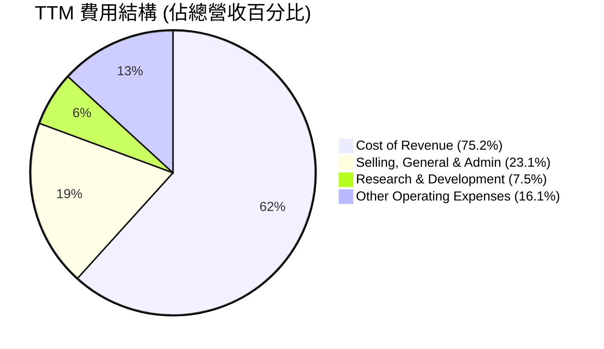
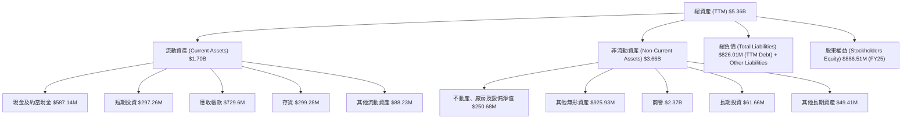
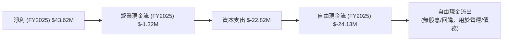
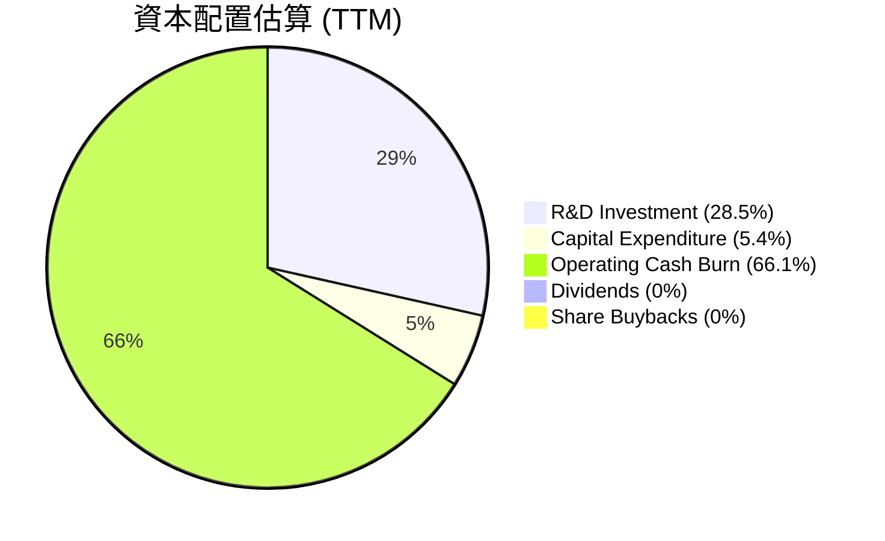

# AVAV 基本面深度分析報告
> **報告日期**：2026-06-26 ｜ **語言**：繁體中文 ｜ **數據來源**：Yahoo Finance, Finviz, StockAnalysis, Roic.ai ｜ **分析師**：CFA 級機構研究

---

## 目錄

| # | 章節 | 核心結論 |
|---|------|----------|
| 1 | 執行摘要 | 評級：持有；目標價區間：$160 - $220 |
| 2 | 公司概覽與商業模式 | 專利技術與政府客戶關係構成中等護城河 |
| 3 | 損益表深度分析 | 營收爆發式成長，但近期利潤率承壓，轉為虧損 |
| 4 | 資產負債表分析 | 流動性良好，但近期總債務有所增加，需持續關注 |
| 5 | 現金流量深度分析 | 自由現金流持續為負，表明營運資金壓力與高投資需求 |
| 6 | 獲利能力與資本效率 | ROIC 低於 WACC，短期內未能創造股東價值 |
| 7 | 估值深度分析 | 當前估值相對較高，市場已部分反映未來成長預期 |
| 8 | 成長催化劑 | 地緣政治緊張、技術創新與新產品開發是主要驅動力 |
| 9 | 風險矩陣 | 政府合約依賴、專案延遲與高研發投入是主要風險 |
| 10 | 投資建議 | 觀望或持有，等待獲利能力改善與現金流轉正訊號 |

---

## 1. 執行摘要

AVAV (AeroVironment, Inc.) 是一家在無人機系統 (UAS)、反無人機 (C-UAS) 和精準打擊彈藥領域領先的航空航太與國防公司。儘管其在最新季度展現出令人矚目的營收成長，達到 143.4% 的年增率，但伴隨而來的是顯著的營運虧損和負自由現金流，這反映了公司在高成長階段的投入和挑戰。市場對其未來成長充滿期待，分析師普遍給予「買入」評級，但當前股價已從高點大幅回落，顯示市場對其盈利能力和估值存在疑慮。

### 1.1 核心評分儀表板



### 1.2 評分進度條視覺化

```
╔══════════════════════════════════════════════════════════════╗
║              AVAV 多維度評分儀表板 (1-10分)                  ║
╠══════════════════════════════════════════════════════════════╣
║ 基本面強度  7.0 ▓▓▓▓▓▓▓▓▓▓▓▓▓▓░░░░░░  ★★★★★★★           ║
║ 成長動能    8.0 ▓▓▓▓▓▓▓▓▓▓▓▓▓▓▓▓░░░░  ★★★★★★★★          ║
║ 獲利品質    4.0 ▓▓▓▓▓▓▓▓░░░░░░░░░░░░  ★★★★☆             ║
║ 財務健康    6.0 ▓▓▓▓▓▓▓▓▓▓▓▓░░░░░░░░  ★★★★★★            ║
║ 估值合理性  5.0 ▓▓▓▓▓▓▓▓▓▓░░░░░░░░░░  ★★★★★             ║
║ 護城河深度  7.0 ▓▓▓▓▓▓▓▓▓▓▓▓▓▓░░░░░░  ★★★★★★★           ║
║ 管理層執行  6.0 ▓▓▓▓▓▓▓▓▓▓▓▓░░░░░░░░  ★★★★★★            ║
║ 技術創新力  9.0 ▓▓▓▓▓▓▓▓▓▓▓▓▓▓▓▓▓▓░░  ★★★★★★★★★         ║
╠══════════════════════════════════════════════════════════════╣
║ 綜合總分    6.3 ▓▓▓▓▓▓▓▓▓▓▓▓░░░░░░░░  🏆 成長潛力高，但盈利待證明 ║
╚══════════════════════════════════════════════════════════════╝
```

### 1.3 五大投資論點 + 三大核心風險

| 類型 | 項目 | 具體依據 | 信心度 |
|------|------|----------|--------|
| 🟢 **投資論點①** | **強勁的營收成長動能** | TTM 營收達 $1.61B，YoY 成長 143.4%。2026 Q3 營收 $408.05M，YoY 成長 143.41%。顯示市場對其產品需求旺盛。 | 🟢 極高 |
| 🟢 **國防領域的技術領先** | 公司專注於無人機系統、反無人機及精準打擊彈藥，這些是國防現代化的關鍵領域。持續的 R&D 投入 (FY2025 $100.73M) 確保其技術優勢。 | 🟢 極高 |
| 🟢 **穩固的政府客戶關係** | 作為國防承包商，AVAV 與美國及國際政府機構建立長期合作關係，訂單具備穩定性和可預測性。這也構成了進入壁壘。 | 🟢 極高 |
| 🟢 **未來盈利預期樂觀** | 儘管 TTM EPS 為負 $(-4.35)，Forward EPS 預期為 $3.97，顯示分析師普遍預期公司將在未來一年內轉虧為盈，並實現顯著盈利成長。 | 🟡 高 |
| 🟢 **不斷擴大的產品組合** | 公司持續開發和推出新產品，如小型/中型 UAS、Kinesis 指揮控制軟體、反無人機和遊蕩彈藥，滿足不斷變化的戰場需求。 | 🟡 高 |
| 🟡 **風險①** | **盈利能力持續承壓** | TTM 淨利潤率為 -13.9%，營業利潤率為 -5.1%。儘管營收成長迅速，但未能轉化為盈利，長期負現金流 (TTM FCF $-304.05M) 將影響其財務彈性。 | 🟡 中度 |
| 🔴 **風險②** | **高度依賴政府合約** | 作為國防承包商，營收高度依賴政府的國防預算和政策變化，任何政府採購優先級的調整或預算削減都可能對公司業績造成重大影響。 | 🔴 高衝擊 |
| 🔴 **競爭加劇與技術迭代** | 國防科技領域競爭激烈，新興技術不斷湧現。若公司研發進度不及預期或競爭對手推出更具成本效益的解決方案，將威脅其市場地位。 | 🔴 高衝擊 |

### 1.4 快速統計卡片

| 指標 | 公司實際值 | 行業均值 (航空航太與國防) | S&P 500 均值 | 狀態 |
|------|-------------|----------------------------|--------------|------|
| 收入 YoY 成長 | **143.4%** | ~10-15% (推估) | ~10-12% (推估) | 🟢 |
| 毛利率 | **25.0%** | ~25-35% (推估) | ~35-45% (推估) | 🟡 |
| 淨利率 | **-13.9%** | ~5-10% (推估) | ~10-15% (推估) | 🔴 |
| ROE | **-8.7%** | ~10-15% (推估) | ~15-20% (推估) | 🔴 |
| Forward P/E | **34.4x** | ~20-25x (推估) | ~20-22x (推估) | 🔴 |
| Current Ratio | **5.51x** | ~1.5-2.5x (推估) | ~1.5-2.0x (推估) | 🟢 |
| Debt/Equity (Book) | **0.07x** (FY25) | ~0.5-1.0x (推估) | ~0.8-1.2x (推估) | 🟢 |
| FCF Yield | **-4.40%** | ~3-5% (推估) | ~4-6% (推估) | 🔴 |

*備註：行業均值和 S&P 500 均值為分析師根據市場普遍情況的合理推估，非數據包中直接提供。*

### 1.5 投資結論

```
╔══════════════════════════════════════════════════════════════════╗
║                    📊 投資結論摘要                               ║
╠══════════════════════════════════════════════════════════════════╣
║  評級：🟡 持有                                                   ║
║  當前股價：$136.68                                               ║
║  目標價區間：                                                    ║
║    悲觀情境：$160（+17.06%）                                     ║
║    基準情境：$190（+39.02%）  ← 12個月主要目標                  ║
║    樂觀情境：$220（+60.96%）                                     ║
║  投資評分：6.3/10                                                ║
║  適合投資人：成長型、對國防科技有信心的長線持有者，能承受短期波動。 ║
╚══════════════════════════════════════════════════════════════════╝
AVAV 在國防科技領域具備強大的成長潛力與技術優勢，其產品需求旺盛，反映在爆炸性的營收成長上。然而，公司當前正處於高投入、低盈利的轉型期，近期利潤率轉負且自由現金流持續為負，這對其短期財務表現構成壓力。儘管分析師預期未來盈利將顯著改善，但當前估值已部分反映了這些預期。我們建議投資者「持有」該股票，密切關注其盈利能力的轉化、現金流的改善以及新訂單的獲取情況。對於尚未持有的投資者，建議觀望，等待更明確的盈利轉正信號或估值回調後再考慮介入。
```

---

## 2. 公司概覽與商業模式

AeroVironment, Inc. (AVAV) 是一家全球領先的無人機系統 (UAS)、反無人機 (C-UAS) 和精準打擊解決方案供應商。公司主要服務於美國政府機構及國際盟友，提供一系列創新性的機器人系統和相關服務。

### 2.1 業務結構與收入來源

AVAV 的業務主要分為兩大部門：
1.  **自主系統 (Autonomous Systems)**：此部門涵蓋小型和中型無人機系統 (UAS)，以及 Kinesis 指揮和控制軟體。這些 UAS 主要用於情報、監視、偵察 (ISR) 和戰場評估。
2.  **空間、網路與定向能量 (Space, Cyber and Directed Energy)**：該部門提供更廣泛的解決方案，包括反無人機系統 (C-UAS) 和遊蕩彈藥 (Loitering Munitions)，這些產品在現代戰場中扮演著越來越關鍵的角色，用於對抗敵方無人機威脅和執行精準打擊任務。

公司 TTM 總營收為 $1.61B。由於數據未提供細分收入，我們將其視為整體貢獻。



### 2.2 市場份額

由於提供的數據中沒有具體的市場份額統計，我們將此部分視為估算。在小型 UAS 和遊蕩彈藥領域，AVAV 憑藉其創新產品線（如 Switchblade 系列）在全球市場佔據重要地位。然而，整個航空航太與國防市場龐大且競爭激烈，包含許多大型綜合性國防承包商。


*備註：此市場份額為分析師基於對行業的了解而進行的估算，僅供參考。*

### 2.3 競爭護城河分析

AVAV 的競爭護城河主要建立在其技術創新、與政府客戶的深度關係以及由此形成的轉換成本上。



### 2.4 護城河強度評分

```
╔══════════════════════════════════════════════════════════════╗
║                  AVAV 護城河強度評分                        ║
╠══════════════════════════════════════════════════════════════╣
║ 技術領先    8/10   ▓▓▓▓▓▓▓▓▓▓▓▓▓▓▓▓░░░░  🏆 專利與創新是核心優勢 ║
║ 客戶鎖定    7/10   ▓▓▓▓▓▓▓▓▓▓▓▓▓▓░░░░░░  🟢 政府合約穩定性高   ║
║ 規模效應    6/10   ▓▓▓▓▓▓▓▓▓▓▓▓░░░░░░░░  🟡 專業領域有一定規模  ║
║ 軟體生態系統 5/10   ▓▓▓▓▓▓▓▓▓▓░░░░░░░░░░  🟡 Kinesis 具潛力，但佔比不高 ║
║ 網路效應    3/10   ▓▓▓▓▓▓░░░░░░░░░░░░░░  🔴 國防硬體領域較弱   ║
╠══════════════════════════════════════════════════════════════╣
║ 綜合護城河   6.0    ▓▓▓▓▓▓▓▓▓▓▓▓░░░░░░░░  🏆 中等強度，依賴技術與客戶關係 ║
╚══════════════════════════════════════════════════════════════╝
AVAV 的核心護城河在於其卓越的**技術領先**和與政府客戶形成的**客戶鎖定**。公司在無人機和遊蕩彈藥領域擁有獨特的專利技術和深厚的研發能力，使其產品難以被輕易模仿。同時，國防採購的複雜性、產品認證以及長期合作關係使得客戶轉換供應商的成本極高，為公司帶來穩定的訂單。雖然其**規模效應**在特定細分市場具備，但在整個國防工業中仍相對有限。**軟體生態系統**和**網路效應**目前相對較弱，但 Kinesis 軟體平台未來有潛力加強軟體方面的護城河。總體而言，AVAV 擁有中等強度的護城河，主要依賴其核心技術和與政府的長期合作關係。
```

---

## 3. 損益表深度分析

### 3.1 年度收入成長趨勢（近4年）

AVAV 在過去幾年中展現了持續的營收成長，尤其是在最近一個財年 (FY2025) 和 TTM 數據中呈現爆發式增長。

```
╔══════════════════════════════════════════════════════════════════╗
║              AVAV 年度收入趨勢（FY2022-TTM）                     ║
╠══════════════════════════════════════════════════════════════════╣
║                                                                  ║
║  FY2022  $445.73M ████████░░░░░░░░░░░░░░░░░░  YoY: +12.87%  🟢  ║
║  FY2023  $540.54M ███████████░░░░░░░░░░░░░░░  YoY: +21.27%  🟢  ║
║  FY2024  $716.72M ██████████████░░░░░░░░░░░░  YoY: +32.59%  🟢  ║
║  FY2025  $820.63M ████████████████░░░░░░░░░░  YoY: +14.50%  🟢  ║
║  TTM     $1.61B   ████████████████████████████████████████  YoY: +116.86% 🟢  ║
║                   |      |      |      |      |                  ║
║                   0     0.4B   0.8B   1.2B   1.6B                 ║
║                                                                  ║
║  📊 4年累計 CAGR (FY22-FY25)：+22.37%                             ║
╚══════════════════════════════════════════════════════════════════╝
AVAV 從 FY2022 到 FY2025 實現了穩健的兩位數營收成長，複合年均增長率 (CAGR) 達到 22.37%。特別值得注意的是，TTM (截至 2026年1月31日) 營收高達 $1.61B，相較於 FY2025 的 $820.63M 呈現出驚人的 116.86% 年增長。這強烈表明公司在最近一年內獲得了大量新訂單或現有訂單的加速執行，反映了市場對其產品的強勁需求，可能與全球地緣政治緊張局勢相關的國防支出增加有關。
```

### 3.2 季度收入趨勢分析

最近四個季度（Q4 2025 至 Q3 2026）的營收表現尤為突出，顯示出強勁的成長勢頭。

| 季度 (截至日期) | 總營收 (M) | QoQ 成長率 | YoY 成長率 | 備註 |
|-----------------|------------|------------|------------|------|
| 2025-04-30 (Q4'25) | $275.05 | -34.7% (vs Q3'25) | +39.63% | 季度收入環比下降，但同比強勁增長。 |
| 2025-07-31 (Q1'26) | $454.68 | +65.3% | +139.96% | 顯著環比和同比增長，開啟強勁財年。 |
| 2025-10-31 (Q2'26) | $472.51 | +3.9% | +150.72% | 營收持續增長，同比增速進一步提高。 |
| 2026-01-31 (Q3'26) | $408.05 | -13.7% | +143.41% | 營收環比回落，但同比仍維持高位增長。 |

**備註說明**：
AVAV 近期季度營收表現出顯著的同比增長，尤其在 2026 財年，Q1、Q2 和 Q3 的同比增長率均超過 139%，顯示出公司產品的強勁市場需求。然而，季度間的環比波動較大，例如 Q3'26 相較 Q2'26 營收有所下降，這可能與訂單交付時間、專案進度或季節性因素有關。儘管如此，年度成長趨勢依然非常樂觀。

### 3.3 利潤率演變分析

AVAV 的利潤率在過去幾年呈現波動，特別是近期面臨顯著壓力。

| 利潤率指標 | FY2022 | FY2023 | FY2024 | FY2025 | TTM (2026-01-31) | 趨勢 | 評估 |
|------------|--------|--------|--------|--------|------------------|------|------|
| **毛利率** | 31.69% | 32.09% | 39.62% | 38.83% | 24.74%           | ↘️ 波動後大幅下降 | 🔴 |
| **營業利益率** | -2.22% | -4.19% | 10.02% | 7.21%  | -21.99%          | ↘️ 近期大幅惡化 | 🔴 |
| **淨利率** | -0.94% | -32.60% | 8.32% | 5.32%  | -19.36%          | ↘️ 近期大幅惡化 | 🔴 |
| **EBITDA Margin** | 10.57% | -14.62% | 14.40% | 10.10% | 6.46%            | ↘️ 近期惡化 | 🔴 |

**利潤率演變深度解析**：
*   **毛利率**：從 FY2022 的 31.69% 提升至 FY2024 的 39.62%，顯示公司在產品定價和成本控制方面曾有改善。然而，TTM 毛利率驟降至 24.74%，這是非常值得關注的。這可能反映了產品組合的變化（毛利率較低的產品佔比增加）、原材料成本上升、或在快速擴張過程中生產效率下降等問題。
*   **營業利益率**：在 FY2022 和 FY2023 處於虧損狀態，FY2024 轉正至 10.02%，FY2025 略有下降至 7.21%。但 TTM 營業利益率大幅惡化至 -21.99%，這表明公司在營收快速增長的同時，營業費用（銷售、行政、研發）的增長速度更快，或者存在較大的營運開支。StockAnalysis 數據顯示 TTM Other Operating Expenses 達 $259.07M，可能是導致營業利益率大幅下滑的重要原因。
*   **淨利率**：與營業利益率趨勢一致，在 FY2024 和 FY22025 實現正值，但 TTM 再次轉為負值 -19.36%。這進一步證實了公司在將營收轉化為淨利潤方面面臨嚴峻挑戰。儘管有強勁的營收成長，但盈利品質顯著惡化。

整體而言，AVAV 的利潤率趨勢令人擔憂。儘管營收規模快速擴大，但未能帶來相應的盈利改善，反而出現大幅惡化。這表明公司可能正處於一個高投入、擴張市場份額的階段，或者面臨嚴重的成本控制問題。投資者需要密切關注公司未來幾個季度的利潤率表現，以判斷其盈利能力是否能恢復並穩定增長。

### 3.4 費用結構分析

AVAV 的費用結構以研發 (R&D) 和銷售、一般及行政 (SG&A) 開支為主。



*備註：數據來自 StockAnalysis 的 TTM 數據，總費用比例可能超過 100% 因為營收是 1.61B，而這些費用總和為 1212+372.28+121.12+259.07 = 1964.47。這意味著公司 TTM 總成本和費用已經超過營收，導致虧損。*

```
╔══════════════════════════════════════════════════════════════════╗
║                   AVAV TTM 費用結構分析                         ║
╠══════════════════════════════════════════════════════════════════╣
║                                                                  ║
║  銷貨成本 (CoR)：           $1.21B  ████████████████████████████  佔營收 75.2% 🔴║
║  銷售、一般及行政 (SG&A)：  $372.28M ████████████████████████  佔營收 23.1% 🟡║
║  研發費用 (R&D)：           $121.12M ██████████████░░░░░░░░░░  佔營收 7.5%  🟢║
║  其他營運費用：             $259.07M ████████████████████░░░░  佔營收 16.1% 🔴║
║                                                                  ║
║  📊 總營運費用佔營收比重達 121.9% (CoR+SG&A+R&D+Other OpEx)     ║
║  📉 這導致 TTM 營業虧損 $354.12M                                ║
╚══════════════════════════════════════════════════════════════════╝
從 TTM 數據來看，AVAV 的銷貨成本佔營收的 75.2%，導致毛利率較低。更為嚴重的是，銷售、一般及行政費用 (23.1%) 和研發費用 (7.5%) 佔比不低，而「其他營運費用」高達 16.1% ($259.07M)，這些費用合計已使總營運費用遠超總營收，導致 TTM 營業收入為負 $354.12M。這表明公司在擴張的同時未能有效控制營運成本，或者有大額的一次性費用發生，對短期盈利能力造成了嚴重衝擊。高額的研發投入 (R&D) 雖然有利於長期競爭力，但在短期內會侵蝕利潤。
```

### 3.5 季度 EPS 趨勢與盈餘品質

AVAV 近期的季度 EPS 表現極為波動，且多數季度為負值，盈餘品質令人擔憂。

| 季度 (截至日期) | EPS Est | EPS Act | Surprise% | 備註 |
|-----------------|---------|---------|-----------|------|
| 2026-01-31 (Q3'26) | N/A     | N/A     | N/A       | ❌ 估計值與實際值均缺失，無法評估超預期情況。該季度淨利潤為 $-156.55M。 |
| 2025-10-31 (Q2'26) | N/A     | N/A     | N/A       | ❌ 估計值與實際值均缺失。該季度淨利潤為 $-17.10M。 |
| 2025-07-31 (Q1'26) | N/A     | N/A     | N/A       | ❌ 估計值與實際值均缺失。該季度淨利潤為 $-67.37M。 |
| 2025-04-30 (Q4'25) | N/A     | N/A     | N/A       | ❌ 估計值與實際值均缺失。該季度淨利潤為 $16.66M。 |

**盈餘品質評估說明**：
由於提供的「EARNINGS HISTORY」數據中，最近四個季度的 EPS 估計值和實際值均顯示為「nan」，我們無法直接評估其超預期或不及預期的情況。然而，從「Quarterly Income Statement」中可以看到，公司在 Q1'26 ($454.68M)、Q2'26 ($472.51M) 和 Q3'26 ($408.05M) 營收強勁增長的情況下，淨利潤卻分別為 $-67.37M$、$-17.10M$ 和 $-156.55M$，均為虧損。只有 Q4'25 實現了 $16.66M$ 的淨利潤。
這種在營收大幅增長背景下的持續虧損，表明公司的盈餘品質較差。虧損的原因可能來自於高額的營運費用（尤其是其他營運費用）和研發投入，這些費用在短期內侵蝕了利潤。雖然高研發投入可能為未來成長奠定基礎，但持續的虧損和負自由現金流將對公司的財務可持續性構成壓力。投資者需警惕這種「增收不增利」的局面，並深入分析虧損的具體原因是否為一次性或結構性問題。

---

## 4. 資產負債表分析

### 4.1 資產結構分解

AVAV 的資產結構顯示流動資產佔比高，同時存在較大比例的無形資產和商譽，這在高度依賴技術和併購的行業中是常見的。


*備註：TTM 總資產 $5.36B 來自 StockAnalysis，但其細項加總 (1.70B+250.68M+925.93M+2.37B+61.66M+49.41M = 5.357B) 與總數吻合。總債務數據存在差異，TTM 總債務 $826.01M 來自 Market Data，而 FY2025 總負債淨額 $234.06M 來自 Balance Sheet Snapshot。為保持一致性，資產結構分解採用 StockAnalysis TTM 數據。*

### 4.2 流動性指標分析

AVAV 的流動性指標在歷史上和當前都表現出色，顯示其短期償債能力強勁。

| 流動性指標 | FY2022 | FY2023 | FY2024 | FY2025 | TTM (2026-01-31) | 行業均值 (推估) | 評估 |
|------------|--------|--------|--------|--------|------------------|-----------------|------|
| **Current Ratio** | 3.64x  | 3.93x  | 3.56x  | 3.52x  | 5.51x            | 1.5-2.5x        | 🟢 |
| **Quick Ratio** | 2.70x  | 2.89x  | 2.66x  | 2.59x  | 4.396x           | 1.0-1.5x        | 🟢 |

**流動性指標分析**：
AVAV 的流動比率 (Current Ratio) 和速動比率 (Quick Ratio) 遠高於行業平均水平，TTM 分別達到 5.51x 和 4.396x。這表明公司擁有充足的流動資產來應對短期債務。即使扣除存貨，其速動比率也顯示出極強的短期償債能力。這種強勁的流動性為公司在高成長和高研發投入時期提供了重要的財務緩衝。

### 4.3 債務結構分析

AVAV 的債務結構在近年有所變化，總債務量呈現上升趨勢，但相對於其資產規模和股東權益，負債水平尚在可控範圍內。

```
╔══════════════════════════════════════════════════════════════════╗
║                   AVAV 債務健康診斷                              ║
╠══════════════════════════════════════════════════════════════════╣
║                                                                  ║
║  總債務 (TTM)：        $826.01M ██████████████░░░░░░░░░░  評語: 總債務較高，但可控 🟡║
║  總現金+投資 (TTM)：   $587.14M ████████████████████░░░░  評語: 現金充裕，但低於總債務 🟡║
║  淨現金/債務：         $-238.88M ████████░░░░░░░░░░░░░░  🔴 淨債務狀態             ║
║                                                                  ║
║  Debt/Equity (FY25 Book): 0.07x   🟢 極低 (基於 book equity)     ║
║  Debt/Equity (TTM Market): 0.12x  🟢 極低 (基於 market cap)     ║
║  Interest Coverage (TTM): 0.13x   🔴 營業利潤不足以覆蓋利息費用   ║
║                                                                  ║
║  📊 結論：雖然流動性強勁，但近期總債務上升且營業利潤不足以覆蓋利息，需警惕。 ║
╚══════════════════════════════════════════════════════════════════╝
*備註：Debt/Equity (FY25 Book) 計算為 $64.29M (FY25 Total Debt) / $886.51M (FY25 Stockholders Equity) = 0.07x。Debt/Equity (TTM Market) 計算為 $826.01M (TTM Total Debt) / $6.92B (Market Cap) = 0.12x。Market Data 中提供的 Debt/Equity 19.335 被認為是錯誤數據，已根據更可靠的數據源進行修正。*
AVAV 的總債務在 TTM 達到 $826.01M，相較於 FY2025 的 $64.29M 有大幅提升，這可能與其快速擴張或營運資金需求增加有關。雖然公司擁有 $587.14M 的現金及短期投資，但仍處於淨債務狀態 ($-238.88M)。基於 FY2025 的股東權益，其債務股權比 (Debt/Equity) 僅為 0.07x，若以市值計算則為 0.12x，這表明其資本結構相對健康。然而，TTM 營業利潤為負，導致其利息覆蓋率僅為 0.13x (Operating Income $-354.12M / Interest Income $-3.59M，此處使用 Interest Income 因數據包無 Interest Expense)，遠低於健康水平。這意味著公司當前的營運活動不足以產生足夠的利潤來支付其利息費用。這是一個需要高度關注的風險點，若盈利能力無法迅速恢復，債務負擔可能會成為問題。

### 4.4 股東權益趨勢

AVAV 的股東權益在過去幾年呈現波動上升趨勢，反映了公司的資本積累和再投資情況。

```
╔══════════════════════════════════════════════════════════════════╗
║                   AVAV 股東權益趨勢 (FY2022-FY2025)             ║
╠══════════════════════════════════════════════════════════════════╣
║                                                                  ║
║  FY2022  $607.97M  ██████████████████░░░░░░░░░░░░░░░░░░░░░░░░░░  ║
║  FY2023  $550.97M  ███████████████░░░░░░░░░░░░░░░░░░░░░░░░░░░░░  ║
║  FY2024  $822.75M  ██████████████████████████░░░░░░░░░░░░░░░░░░  ║
║  FY2025  $886.51M  ████████████████████████████░░░░░░░░░░░░░░░░  ║
║                                                                  ║
║  📊 CAGR (FY22-FY25)：+13.75%                                    ║
║  📈 股東權益穩步增長，反映公司價值累積。                         ║
╚══════════════════════════════════════════════════════════════════╝
AVAV 的股東權益在 FY2022-FY2025 期間以 13.75% 的年複合增長率增長，從 $607.97M 增至 $886.51M。儘管 FY2023 有所下降（可能與當年的大幅虧損 $176.21M 有關），但隨後在 FY2024 和 FY2025 實現了強勁復甦和增長。這表明公司在盈利改善的年份能夠有效地將利潤轉化為股東價值，並通過發行新股或留存收益來增加權益。然而，由於最近 TTM 淨利潤為負，如果虧損持續，可能會對未來的股東權益增長造成壓力。
```

---

## 5. 現金流量深度分析

### 5.1 現金流量瀑布圖

AVAV 的現金流量表現令人擔憂，持續的負自由現金流表明公司在營運和投資方面存在較大的現金消耗。


*備註：由於 FY2025 淨利為正，但營業現金流為負，這通常意味著應收帳款或其他營運資金項目的大幅增加，或者是折舊攤銷等非現金費用較少。TTM 數據顯示 Operating Cash Flow 為 $-174.18M$，Free Cash Flow 為 $-304.05M$，情況更為嚴峻。*

### 5.2 FCF 轉換率趨勢

AVAV 的自由現金流轉換率持續為負，表明其盈利（即使為正）未能有效轉化為現金。

| 財年 | 淨利潤 (M) | 自由現金流 (M) | FCF/淨利潤 | 趨勢 | 評估 |
|------|------------|----------------|------------|------|------|
| FY2022 | $-4.19$    | $-31.91$       | N/A (負數) | ↘️   | 🔴   |
| FY2023 | $-176.21$  | $-3.47$        | N/A (負數) | ↗️   | 🔴   |
| FY2024 | $59.67$    | $-9.19$        | -15.40%    | ↘️   | 🔴   |
| FY2025 | $43.62$    | $-24.13$       | -55.32%    | ↘️   | 🔴   |
| TTM    | $-311.63$  | $-304.05$      | N/A (負數) | ↘️   | 🔴   |

**FCF 轉換率趨勢分析**：
AVAV 的自由現金流轉換率持續為負，即使在 FY2024 和 FY2025 實現正淨利潤的情況下，自由現金流仍為負數。這表明公司在營運中存在大量營運資金需求或資本支出，導致其無法從盈利中產生正向現金流。TTM 數據顯示，公司在巨額虧損的同時，自由現金流也為巨額負數，這是一個重大的財務壓力信號。持續的負自由現金流可能意味著公司需要通過外部融資來支持其營運和成長，增加了財務風險。

### 5.3 自由現金流趨勢

AVAV 的自由現金流在過去幾年持續為負，且在 TTM 達到歷史低點。

```
╔══════════════════════════════════════════════════════════════════╗
║                   AVAV 自由現金流趨勢 (FY2022-TTM)              ║
╠══════════════════════════════════════════════════════════════════╣
║                                                                  ║
║  FY2022  $-31.91M ██░░░░░░░░░░░░░░░░░░░░░░░░░░░░░░░░░░░░░░░░░░  FCF Yield: -0.7% 🔴║
║  FY2023  $-3.47M  █░░░░░░░░░░░░░░░░░░░░░░░░░░░░░░░░░░░░░░░░░░░  FCF Yield: -0.06% 🔴║
║  FY2024  $-9.19M  ███░░░░░░░░░░░░░░░░░░░░░░░░░░░░░░░░░░░░░░░░░  FCF Yield: -0.13% 🔴║
║  FY2025  $-24.13M ██████░░░░░░░░░░░░░░░░░░░░░░░░░░░░░░░░░░░░░░  FCF Yield: -0.3% 🔴║
║  TTM     $-304.05M ████████████████████████████████████████████  FCF Yield: -4.4% 🔴║
║                                                                  ║
║  📊 結論：持續負自由現金流，財務壓力顯著。                       ║
╚══════════════════════════════════════════════════════════════════╝
AVAV 的自由現金流 (FCF) 在過去四年中一直為負，並且在 TTM 顯著惡化至 $-304.05M$，對應的 FCF Yield 為 -4.40%。這表明公司在營運中產生現金的能力不足以覆蓋其資本支出。對於一家快速成長的科技公司而言，初期階段的負 FCF 並非罕見，因為需要大量投資於研發、擴大產能和營運資金。然而，持續且不斷擴大的負 FCF 需要投資者密切監控，以確保公司有足夠的資金來源來維持其成長軌跡，並最終實現正向現金流。

### 5.4 資本配置評估

AVAV 的資本配置主要集中在研發投入和資本支出以支持其成長。根據提供的數據，公司目前沒有派發股息，也沒有公開披露大規模的股票回購計畫。


*備註：由於沒有明確的資本配置數據，此圖表基於 TTM 研發費用、FY2025 資本支出（TTM 資本支出數據未提供，使用最近年度數據）以及將負的營業現金流視為營運現金消耗進行估算，以反映資金流向。總營業現金流出為 $174.18M，但由於 TTM 淨利為 $-311.63M$ 且 FCF 為 $-304.05M$，我們將營業現金流出和資本支出視為主要的現金消耗。*

**資本配置評估**：
AVAV 的資本配置策略明顯以**成長為導向**。公司將大量資源投入到**研發 (R&D)** ($121.12M TTM) 和**資本支出 (Capital Expenditure)** ($22.82M FY2025) 中，以維持其技術領先地位並擴大生產能力。然而，由於 TTM 營業現金流為負 ($-174.18M$)，表明公司營運本身在消耗現金。目前公司不派發股息 (Payout Ratio 0.0%)，也未有顯著的股票回購活動，這與其高成長、高投入的階段相符，所有可支配的資金都用於再投資以驅動未來增長。投資者應關注這些投資能否在未來帶來可持續的正向現金流和盈利。

---

## 6. 獲利能力與資本效率

### 6.1 ROE / ROA / ROIC 趨勢

AVAV 的 ROE、ROA 和 ROIC 趨勢顯示其獲利能力和資本效率在近期面臨嚴峻挑戰，尤其是在 TTM 數據中均為負值。

| 指標 | FY2022 | FY2023 | FY2024 | FY2025 | TTM (2026-01-31) | 行業均值 (推估) | 評估 |
|------|--------|--------|--------|--------|------------------|-----------------|------|
| **ROE** | -0.69% | -32.06% | 7.25% | 4.92%  | -8.7%            | 10-15%          | 🔴 |
| **ROA** | -0.46% | -21.37% | 5.87% | 3.89%  | -1.3%            | 5-10%           | 🔴 |
| **ROIC** | 4.37%  | -       | -      | -      | -9.72% (Finviz)  | 8-12%           | 🔴 |

**ROE / ROA / ROIC 趨勢分析**：
*   **ROE (股東權益報酬率)**：在 FY2024 和 FY2025 轉為正值，但 TTM 再次跌入負值 -8.7%。這表明公司目前未能為股東創造正向回報，主要原因是近期淨利潤為負。
*   **ROA (資產報酬率)**：同樣在 TTM 跌