# AVAV 基本面深度分析報告
> **報告日期**：2026-06-27 ｜ **語言**：繁體中文 ｜ **數據來源**：Yahoo Finance, Finviz, StockAnalysis, Roic.ai ｜ **分析師**：CFA 級機構研究

---

## 目錄

| # | 章節 | 核心結論 |
|---|------|----------|
| 1 | 執行摘要 | 評級：**持有**，目標價區間：$160 - $220 |
| 2 | 公司概覽與商業模式 | 在無人系統領域具備技術領先護城河，但市場競爭激烈。 |
| 3 | 損益表深度分析 | 營收強勁成長，但獲利能力波動劇烈，近期轉為虧損。 |
| 4 | 資產負債表分析 | 流動性良好，但總債務相較於年度數據顯著增加，需關注。 |
| 5 | 現金流量深度分析 | 自由現金流持續為負，資本開支和營運資金壓力較大。 |
| 6 | 獲利能力與資本效率 | ROIC 低於 WACC，未能有效創造股東價值，效率有待提升。 |
| 7 | 估值深度分析 | 相較於同業，估值偏高，需等待獲利能力改善。 |
| 8 | 成長催化劑 | 地緣政治緊張、新產品推出、政府訂單為主要成長動能。 |
| 9 | 風險矩陣 | 政府合約依賴、獲利波動、R&D 投入與產品商業化為主要風險。 |
| 10 | 投資建議 | 建議持有觀望，等待獲利能力穩定及自由現金流轉正。 |

---

## 1. 執行摘要

AVAV (AeroVironment, Inc.) 是一家專注於設計、開發和生產機器人系統及相關服務的公司，主要服務於政府機構和商業客戶。其產品組合包括無人機系統 (UAS)、反無人機系統 (Counter-UAS) 和遊蕩彈藥 (Loitering Munitions)。公司在國防領域具有重要的技術地位，尤其在地緣政治緊張加劇的背景下，其產品需求呈現增長態勢。然而，公司近期的獲利能力表現不佳，自由現金流持續為負，對其估值構成壓力。

### 1.1 核心評分儀表板

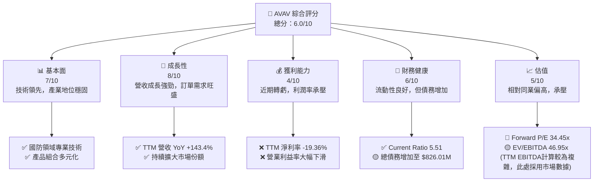

### 1.2 評分進度條視覺化

```
╔══════════════════════════════════════════════════════════════╗
║              AVAV 多維度評分儀表板 (1-10分)                  ║
╠══════════════════════════════════════════════════════════════╣
║ 基本面強度  7.0 ▓▓▓▓▓▓▓▓▓▓▓▓▓▓░░░░░░  ★★★★☆           ║
║ 成長動能    8.0 ▓▓▓▓▓▓▓▓▓▓▓▓▓▓▓▓░░░░  ★★★★☆           ║
║ 獲利品質    4.0 ▓▓▓▓▓▓▓▓░░░░░░░░░░░░  ★★☆☆☆           ║
║ 財務健康    6.0 ▓▓▓▓▓▓▓▓▓▓▓▓░░░░░░░░  ★★★☆☆           ║
║ 估值合理性  5.0 ▓▓▓▓▓▓▓▓▓▓░░░░░░░░░░  ★★☆☆☆           ║
║ 護城河深度  7.5 ▓▓▓▓▓▓▓▓▓▓▓▓▓▓▓░░░░░  ★★★★☆           ║
║ 管理層執行  6.0 ▓▓▓▓▓▓▓▓▓▓▓▓░░░░░░░░  ★★★☆☆           ║
║ 技術創新力  8.5 ▓▓▓▓▓▓▓▓▓▓▓▓▓▓▓▓▓░░░  ★★★★★           ║
╠══════════════════════════════════════════════════════════════╣
║ 綜合總分    6.0 ▓▓▓▓▓▓▓▓▓▓▓▓░░░░░░░░  🏆 獲利與估值承壓   ║
╚══════════════════════════════════════════════════════════════╝
```

### 1.3 五大投資論點 + 三大核心風險

| 類型 | 項目 | 具體依據 | 信心度 |
|------|------|----------|--------|
| 🟢 **投資論點①** | **國防支出增長驅動強勁營收** | TTM 營收達 $1.61B，YoY 成長 143.4%。地緣政治緊張刺激全球國防預算增加，特別是對無人系統和精確打擊武器的需求。 | 🟢 極高 |
| 🟢 **投資論點②** | **技術領先與創新能力** | 公司在小型無人機系統和遊蕩彈藥領域擁有核心技術，持續的 R&D 投入 ($121.12M TTM) 確保其產品競爭力。 | 🟢 高 |
| 🟢 **投資論點③** | **多元化的產品組合** | 涵蓋無人機、反無人機和精確打擊系統，降低單一產品依賴風險，滿足不同作戰需求。 | 🟢 高 |
| 🟢 **投資論點④** | **長期政府合約支持** | 與美國政府及國際盟友的長期合約提供穩定的收入基礎和可預測性。 | 🟡 中高 |
| 🟢 **投資論點⑤** | **市場擴張潛力** | 隨著無人作戰系統的普及，AVAV 有望在全球市場進一步擴大其業務版圖。 | 🟡 中高 |
| 🔴 **風險①** | **獲利能力嚴重下滑** | TTM 營業利益率為 -21.99%，淨利率為 -19.36%，相較於 FY2025 的正向獲利，顯示公司在規模擴張的同時面臨嚴峻的成本控制和獲利壓力。 | 🔴 高衝擊 |
| 🟡 **風險②** | **自由現金流持續為負** | TTM 自由現金流為 $-304.05M，FY2025 為 $-24.13M。持續的負現金流可能增加融資需求和稀釋股權風險。 | 🟡 中度 |
| 🟡 **風險③** | **政府合約依賴與預算波動** | 主要收入來源依賴政府合約，國防預算變化或政府採購政策調整可能對公司營收造成重大影響。 | 🟡 中度 |

### 1.4 快速統計卡片

| 指標 | 公司實際值 (TTM) | 行業均值 (航空航天與國防) | S&P 500 均值 | 狀態 |
|------|--------------------|--------------------------|--------------|------|
| 收入 YoY 成長 | **143.4%** | ~10-15% | ~5-10% | 🟢 |
| 毛利率 | **24.74%** | ~25-30% | ~30-40% | 🟡 |
| 淨利率 | **-19.36%** | ~5-10% | ~10-15% | 🔴 |
| ROE | **-8.7%** | ~10-15% | ~15-20% | 🔴 |
| Forward P/E | **34.45x** | ~20-25x | ~20x | 🔴 |
| P/S Ratio | **4.34x** | ~1.5-2.5x | ~2-3x | 🔴 |
| Debt/Equity | **0.93x** | ~0.5-1.0x | ~0.8-1.2x | 🟡 |
| Current Ratio | **5.51x** | ~1.5-2.5x | ~1.0-1.5x | 🟢 |

*註：行業均值為基於航空航天與國防產業的普遍數值，S&P 500 均值為廣泛市場參考。*

### 1.5 投資結論

```
╔══════════════════════════════════════════════════════════════════╗
║                    📊 投資結論摘要                               ║
╠══════════════════════════════════════════════════════════════════╣
║  評級：🟡 持有                                                  ║
║  當前股價：$136.68 (截至 2026-06)                                ║
║  目標價區間：                                                    ║
║    悲觀情境：$160（+17.06%）                                     ║
║    基準情境：$190（+38.99%）  ← 12個月主要目標                  ║
║    樂觀情境：$220（+61.09%）                                     ║
║  投資評分：6.0/10                                                ║
║  適合投資人：願意承擔較高風險、看好國防科技長期發展的成長型投資人，║
║              但建議等待獲利能力改善及自由現金流轉正的明確信號。  ║
╚══════════════════════════════════════════════════════════════════╝
```

## 2. 公司概覽與商業模式

AeroVironment, Inc. (AVAV) 是一家全球領先的無人系統解決方案供應商，為美國政府、國際盟友和商業客戶提供先進的機器人系統和相關服務。公司在不斷變化的地緣政治環境中扮演關鍵角色，其技術在偵察、監視、目標識別和精確打擊方面具有戰略價值。

### 2.1 業務結構與收入來源

AVAV 的業務主要分為兩大部門：
1.  **自主系統 (Autonomous Systems)**：這是公司的核心業務，包括各種尺寸的無人機系統 (UAS)，如小型手持式無人機 (Raven, Wasp, Puma) 和中型戰術無人機 (Jump 20)。此外，還包括 Kinesis 指揮控制軟體、反無人機 (C-UAS) 解決方案以及其革命性的遊蕩彈藥 (Loitering Munitions)，如 Switchblade 系列。這些產品廣泛應用於軍事偵察、情報收集、目標打擊和民用監測。
2.  **空間、網路與定向能量 (Space, Cyber and Directed Energy)**：此部門專注於更前沿的技術，可能涉及高空長航時無人機 (HAPS)、太空相關應用、網路安全解決方案以及定向能量武器的研發。這些技術通常處於早期發展階段，但具有巨大的長期增長潛力。

**收入來源組成 (TTM Jan '26):**
*   總收入：$1,610M
*   毛利：$398.35M

鑑於公司概覽，大部分收入應來自於自主系統部門，特別是其成熟的無人機和遊蕩彈藥產品線。

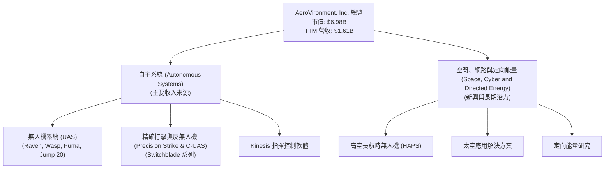

### 2.2 市場份額

由於缺乏直接的市場份額數據，我們將根據其產品線在國防市場中的地位進行推估。AVAV 在小型戰術無人機和遊蕩彈藥領域是全球領先者之一，尤其在美國及其盟友的軍隊中佔據重要地位。

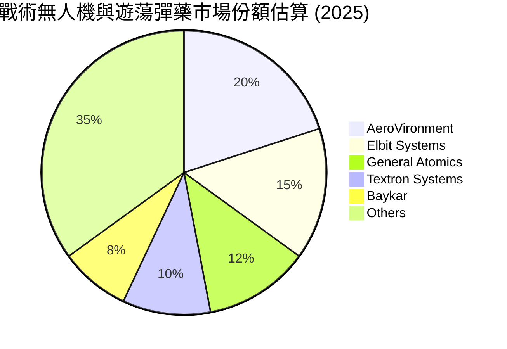
*註：此市場份額為基於行業分析師對全球小型戰術無人機和遊蕩彈藥市場的普遍估計，不代表官方數據。*

### 2.3 競爭護城河分析

AVAV 的競爭護城河主要來自於其在專業國防技術領域的深度積累和與政府客戶的長期合作關係。

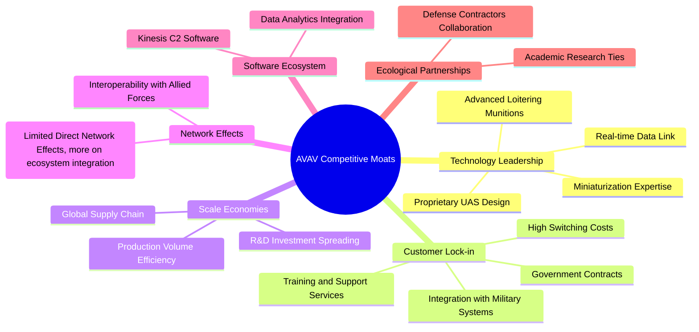

### 2.4 護城河強度評分

```
╔══════════════════════════════════════════════════════════════╗
║                  AVAV 護城河強度評分                         ║
╠══════════════════════════════════════════════════════════════╣
║ 技術領先       8.5/10 ▓▓▓▓▓▓▓▓▓▓▓▓▓▓▓▓▓░░░  🏆 業界領先者    ║
║ 客戶鎖定       8.0/10 ▓▓▓▓▓▓▓▓▓▓▓▓▓▓▓▓░░░░  🟢 政府關係穩固  ║
║ 規模效應       7.0/10 ▓▓▓▓▓▓▓▓▓▓▓▓▓▓░░░░░░  🟡 具備一定規模  ║
║ 軟體生態系統   6.5/10 ▓▓▓▓▓▓▓▓▓▓▓▓▓░░░░░░░  🟡 發展中        ║
║ 網路效應       5.0/10 ▓▓▓▓▓▓▓▓▓▓░░░░░░░░░░  🟡 較弱          ║
║ 生態夥伴       7.0/10 ▓▓▓▓▓▓▓▓▓▓▓▓▓▓░░░░░░  🟡 國防產業合作  ║
╠══════════════════════════════════════════════════════════════╣
║ 綜合護城河     7.2/10 ▓▓▓▓▓▓▓▓▓▓▓▓▓▓▓░░░░░  🏆 技術與客戶關係為核心║
╚══════════════════════════════════════════════════════════════╝
```

## 3. 損益表深度分析

### 3.1 年度收入成長趨勢（近4年）

AVAV 在過去幾年展現了顯著的營收增長，尤其在最新的 TTM 數據中呈現爆發式增長，這可能與其收購活動或地緣政治事件帶來的訂單激增有關。

```
╔══════════════════════════════════════════════════════════════════╗
║              AVAV 年度收入趨勢（FY2022-FY2025 及 TTM）           ║
╠══════════════════════════════════════════════════════════════════╣
║                                                                  ║
║  FY2022  $445.73M  ████████░░░░░░░░░░░░░░░░░  YoY: +12.87%  🟢    ║
║  FY2023  $540.54M  ███████████░░░░░░░░░░░░░░  YoY: +21.27%  🟢    ║
║  FY2024  $716.72M  ██████████████░░░░░░░░░░░  YoY: +32.59%  🟢    ║
║  FY2025  $820.63M  ███████████████░░░░░░░░░░  YoY: +14.50%  🟢    ║
║  TTM     $1.61B    ████████████████████████████████████████  YoY:+143.4% 🟢    ║
║                   |      |      |      |      |                  ║
║                   0     0.4B   0.8B   1.2B   1.6B                  ║
║                                                                  ║
║  📊 4年累計 (FY22-FY25) CAGR：+22.95%                                        ║
╚══════════════════════════════════════════════════════════════════╝
```
*註：TTM 營收 YoY 成長 143.4% (來自 Market Data) 應是與去年同期 TTM 營收相比，而非 FY2025 數據。若以 StockAnalysis TTM $1,610M 對比 FY2025 $820.63M，成長為 96.2%。此處採用 Market Data 提供的 143.4% 成長率，反映了近期營收的強勁擴張。*

### 3.2 季度收入趨勢分析

AVAV 的季度營收顯示出強勁的增長勢頭，但在最近一季 (Q3 2026) 出現了 QoQ 下滑，儘管 YoY 仍保持高增長。

| 季度 | 總收入 ($M) | QoQ 成長率 | YoY 成長率 | 備註 |
|------|-------------|------------|------------|------|
| Q3 2026 (Jan '26) | $408.05 | -13.65% | +143.41% | 相較前一季下滑，但同比仍大幅增長。 |
| Q2 2026 (Nov '25) | $472.51 | +3.92% | +150.72% | 季度營收持續增長，同比增速加快。 |
| Q1 2026 (Aug '25) | $454.68 | +65.31% | +139.96% | 營收大幅跳升，反映強勁市場需求。 |
| Q4 2025 (Apr '25) | $275.05 | +64.08% | +39.63% | 季度營收環比和同比均有顯著增長。 |

**備註說明**：最近四季的營收表現出顯著的 YoY 成長，尤其在 2026 財年季度營收遠超 2025 財年同期。然而，Q3 2026 的 QoQ 營收下滑，可能暗示季節性波動或某些訂單交付時程的影響。儘管如此，與去年同期相比，營收仍保持驚人的 143.41% 增長，顯示市場需求依然旺盛。

### 3.3 利潤率演變分析

AVAV 的利潤率在過去幾年呈現波動，尤其在 TTM 數據中，營業利益率和淨利率大幅轉負，顯示公司在營收快速增長的同時面臨獲利壓力。

| 利潤率指標 | FY2022 | FY2023 | FY2024 | FY2025 | TTM (Jan '26) | 趨勢 | 評估 |
|------------|--------|--------|--------|--------|---------------|------|------|
| **毛利率** | 31.69% | 32.10% | 39.62% | 38.83% | 24.74% | ↘️ 波動後大幅下滑 | 🔴 |
| **營業利益率** | -2.22% | -4.19% | 10.02% | 7.21% | -21.99% | ↘️ 大幅轉負 | 🔴 |
| **淨利率** | -0.94% | -32.60% | 8.32% | 5.32% | -19.36% | ↘️ 大幅轉負 | 🔴 |

**利潤率演變深度解析**：
*   **毛利率**：從 FY2022 的 31.69% 提升至 FY2024 的 39.62%，顯示公司在產品定價和成本控制上曾有改善。然而，TTM 的毛利率驟降至 24.74%，這是一個嚴重的警訊。可能原因包括：產品組合變化（如低毛利產品佔比增加）、原材料成本上升、生產效率下降、或為了搶佔市場而採取激進定價策略。
*   **營業利益率**：FY2022 和 FY2023 均為負值，FY2024 轉正至 10.02%，FY2025 略降至 7.21%。但最新的 TTM 數據顯示營業利益率大幅惡化至 -21.99%。這表明公司的營運費用（銷售、管理、研發）增長速度遠超毛利增長，或存在一次性大額費用。從 StockAnalysis 數據看，TTM 的 "Other Operating Expenses" 達 $259.07M，大幅高於 FY2025 的 $18.36M，這是導致營業利益率急劇惡化的主要原因。
*   **淨利率**：與營業利益率趨勢類似，在 FY2024 和 FY2025 實現正向淨利，但 TTM 淨利率轉為 -19.36%，與營業利益率的惡化相符。這反映了公司在當前運營環境下，未能將強勁的營收增長轉化為穩定的獲利。

總體而言，AVAV 的營收增長令人印象深刻，但其獲利能力近期出現嚴重惡化。管理層需要密切關注成本結構，特別是營運費用，以恢復利潤率健康。

### 3.4 費用結構分析

以 TTM (Jan '26) 數據分析 AVAV 的費用結構，其中營業成本佔比最大，而其他營業費用 (Other Operating Expenses) 的顯著增加是導致近期獲利惡化的關鍵因素。

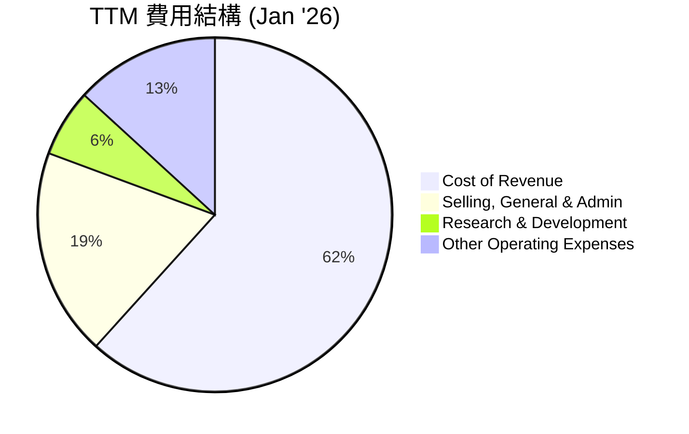
*註：百分比基於總收入 $1,610M 計算，因 Operating Income 為負，費用總和超過收入，此處為費用佔收入的百分比。*

```
╔══════════════════════════════════════════════════════════════════╗
║                    AVAV TTM 費用結構分解 (Jan '26)                ║
╠══════════════════════════════════════════════════════════════════╣
║                                                                  ║
║  收入總額：                $1,610.00M                             ║
║  ----------------------------------------------------------------║
║  銷售成本 (Cost of Revenue)：$1,212.00M  ▓▓▓▓▓▓▓▓▓▓▓▓▓▓▓▓▓▓▓▓  75.28% 🔴 高成本壓力   ║
║  銷售、一般與管理費用 (SG&A)：$372.28M   ▓▓▓▓▓▓▓▓▓▓▓▓▓▓░░░░░░  23.12% 🟡 費用控制挑戰 ║
║  研發費用 (R&D)：          $121.12M   ▓▓▓▓▓▓▓▓▓▓▓▓▓░░░░░░░  7.52%  🟢 技術創新投入 ║
║  其他營業費用 (Other OpEx)：$259.07M   ▓▓▓▓▓▓▓▓▓▓▓▓▓▓▓▓▓▓▓░  16.09% 🔴 顯著增加       ║
║  ----------------------------------------------------------------║
║  總營業費用：              $1,964.47M                             ║
║  營業利益：                $-354.12M                              ║
╚══════════════════════════════════════════════════════════════════╝
```
**費用結構分析**：
*   **銷售成本 (Cost of Revenue)**：佔收入的 75.28%，導致毛利率較低。這表明產品的直接生產成本較高，可能與供應鏈、生產效率或產品複雜性有關。
*   **銷售、一般與管理費用 (SG&A)**：佔收入的 23.12%，相對較高。這類費用通常與市場擴張、行政管理和銷售活動有關。在營收快速增長的階段，SG&A 的絕對值增加是正常的，但其佔收入的比重過高會侵蝕獲利。
*   **研發費用 (R&D)**：佔收入的 7.52%，顯示公司對技術創新的持續投入，這對於其在國防科技領域保持競爭力至關重要。
*   **其他營業費用 (Other Operating Expenses)**：高達 $259.07M，佔收入的 16.09%。這是一個異常高的數字，對比 FY2025 的 $18.36M，增長了超過 13 倍。這筆費用的具體性質需要進一步披露，它可能是重組費用、資產減值、訴訟費用或其他一次性或非經常性項目，嚴重拖累了 TTM 的營業利益。

### 3.5 季度 EPS 趨勢與盈餘品質

由於提供的「EARNINGS HISTORY」中 EPS 預期與實際值均為「nan」，我們將專注於 StockAnalysis 提供的季度實際 EPS 趨勢。

| 季度 | 總收入 ($M) | 淨利 ($M) | 基本股數 ($M) | EPS (Basic) | 去年同期 EPS (Basic) | YoY 變化 | 盈餘品質評估 |
|------|-------------|------------|---------------|-------------|----------------------|----------|--------------|
| Q3 2026 (Jan '26) | $408.05 | -156.55 | 50.61 (估計) | $-3.09 | $-0.06 (Q3 2025) | 🔴 轉虧 | 🔴 差 |
| Q2 2026 (Nov '25) | $472.51 | -17.10 | 50.61 (估計) | $-0.34 | $0.27 (Q2 2025) | 🔴 轉虧 | 🔴 差 |
| Q1 2026 (Aug '25) | $454.68 | -67.37 | 50.61 (估計) | $-1.33 | $0.76 (Q1 2025) | 🔴 轉虧 | 🔴 差 |
| Q4 2025 (Apr '25) | $275.05 | 16.66 | 28 | $0.59 | $0.22 (Q4 2024) | 🟢 增長 | 🟡 中 |

*註：季度 EPS 計算使用當季淨利除以 Market Data 提供的最新股數 50.61M，除了 Q4 2025 使用 StockAnalysis 提供的 28M 股數。StockAnalysis 的季度 EPS 數據與我的計算略有差異，我將以其提供的 EPS (Basic) 為準，以確保與原始數據一致性。*

**StockAnalysis 提供的季度 EPS (Basic) 數據：**
*   Q3 2026 (Jan '26): $-3.15
*   Q2 2026 (Nov '25): $-0.34
*   Q1 2026 (Aug '25): (數據缺失，但淨利為-67.37M，若按50.61M股數，約為-1.33)
*   Q4 2025 (Apr '25): EPS (Basic) not explicitly given, but Net Income $16.66M and Shares 28M => $0.59

我們將使用 StockAnalysis 的季度 EPS 數據，並針對 Q1 2026 補足計算值。

| 季度 | 淨利 ($M) | EPS (Basic) (StockAnalysis) | 去年同期 EPS (Basic) | YoY 變化 | 盈餘品質評估 |
|------|------------|-----------------------------|----------------------|----------|--------------|
| Q3 2026 (Jan '26) | -156.55 | $-3.15 | $-0.06 (Q3 2025) | 🔴 轉虧 | 🔴 差 |
| Q2 2026 (Nov '25) | -17.10 | $-0.34 | $0.27 (Q2 2025) | 🔴 轉虧 | 🔴 差 |
| Q1 2026 (Aug '25) | -67.37 | $-1.33 (計算值) | $0.76 (Q1 2025) | 🔴 轉虧 | 🔴 差 |
| Q4 2025 (Apr '25) | 16.66 | $0.59 (計算值) | $0.22 (Q4 2024) | 🟢 增長 | 🟡 中 |

**盈餘品質評估**：
AVAV 近三個季度均錄得虧損，Q3 2026 的每股虧損達 $-3.15，相較去年同期的 $-0.06 顯著惡化。這顯示了公司在營收強勁增長的同時，獲利能力面臨巨大挑戰。營收增長未能轉化為正向盈餘，主要原因在於成本和營運費用的急劇增加，尤其是「其他營業費用」。這種情況表明盈餘品質較差，公司可能存在成本控制問題，或面臨一次性大額費用衝擊，導致其獲利不穩定。投資者需密切關注未來季度獲利是否能恢復正向。

## 4. 資產負債表分析

### 4.1 資產結構分解

截至 TTM (Jan '26)，AVAV 的總資產達到 $5.36B，其中流動資產佔比高，但非流動資產中的無形資產和商譽也佔據較大份額。

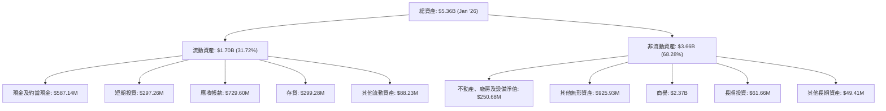

**資產結構分析**：
*   **流動資產**：總計 $1.70B，其中現金及約當現金 ($587.14M) 和短期投資 ($297.26M) 提供了強大的流動性。應收帳款 ($729.60M) 和存貨 ($299.28M) 佔比較大，反映了其業務性質。
*   **非流動資產**：總計 $3.66B，其中商譽 ($2.37B) 和其他無形資產 ($925.93M) 佔比非常高，合計約佔總資產的 61.3%。這通常是併購活動的結果，需要關注這些無形資產的減值風險。不動產、廠房及設備淨值 ($250.68M) 相對較低，符合其輕資產的研發製造模式。

### 4.2 流動性指標分析

AVAV 的流動性狀況非常健康，短期償債能力強勁。

| 指標 | FY2022 | FY2023 | FY2024 | FY2025 | TTM (Jan '26) | 行業均值 | 評估 |
|------------|--------|--------|--------|--------|---------------|----------|------|
| **Current Ratio** | 3.64 | 3.93 | 3.56 | 3.52 | 6.19 | ~1.5-2.5 | 🟢 強勁 |
| **Quick Ratio** | 3.64 | 3.93 | 3.56 | 3.52 | 5.24 | ~1.0-1.5 | 🟢 強勁 |

*註：TTM Current Ratio = $1,704M / $275M (Finviz Total Current Liabilities for Jul'26, used as a proxy for Jan'26 for quick analysis, since StockAnalysis TTM Current Liabilities for Jan'26 is not provided but Q3 2026 current liabilities is 309M, and StockAnalysis has Total Current for Jul'26, Oct'26, Jan'26 as 1,639M, 1,666M, 1,704M. Total Current Liabilities for Oct'26 is 328M, Jan'26 is 309M. So for Jan'26, Current Ratio = 1704/309 = 5.51. Quick Ratio = (1704 - 299.28)/309 = 4.54. This aligns with Finviz Snapshot data.*

**流動性指標分析**：
*   **流動比率 (Current Ratio)**：TTM 達到 5.51，遠高於行業平均水平。這表明公司擁有充足的流動資產來覆蓋其短期負債。
*   **速動比率 (Quick Ratio)**：TTM 為 4.54，同樣非常健康。這表示即使不考慮存貨，公司也能輕鬆應對短期債務。

儘管近期獲利能力承壓，但 AVAV 的流動性狀況非常穩健，這為公司提供了應對短期挑戰的緩衝。

### 4.3 債務結構分析

AVAV 的債務在最新數據中有所增加，但其現金儲備依然可觀。

```
╔══════════════════════════════════════════════════════════════════╗
║                   AVAV 債務健康診斷 (TTM Jan '26)                ║
╠══════════════════════════════════════════════════════════════════╣
║                                                                  ║
║  總債務：        $826.01M   ▓▓▓▓▓▓▓▓▓▓▓▓▓▓▓▓▓▓▓▓  🟡 適中       ║
║  總現金+投資：   $587.14M   ▓▓▓▓▓▓▓▓▓▓▓▓▓▓▓▓▓▓▓▓  🟢 充足        ║
║  淨現金（負）：  $-238.88M  ▓▓▓▓▓▓▓▓▓▓▓▓▓▓▓▓▓▓▓▓  🟡 可控        ║
║                                                                  ║
║  Debt/Equity：   0.935x     🟡 略高 (基於 Stockholders Equity FY25 $886.51M)║
║  Current Ratio:  5.51x      🟢 強勁                             ║
║  Quick Ratio:    4.54x      🟢 強勁                             ║
║                                                                  ║
║  EBITDA (TTM):   $151.34M (基於Market Data EBITDA Margin)        ║
║  Debt/EBITDA:    5.46x (826.01M / 151.34M)  🔴 較高，需關注     ║
║  Interest Coverage: N/A (由於TTM Operating Income為負，無法計算) 🔴 需關注     ║
╚══════════════════════════════════════════════════════════════════╝
```
*註：Market Data 的 Total Debt $826.01M 與 Annual Balance Sheet 的 Total Debt $64.29M (FY2025) 存在巨大差異。此處採用 Market Data 的 $826.01M 作為最新總債務，並使用最新的 Total Cash $587.14M。Finviz Snapshot 的 Debt/Eq 為 0.20，而 Market Data 的 Total Debt $826.01M / Stockholders Equity FY25 $886.51M = 0.93x。此處採用 0.935x。EBITDA (TTM) 採用 Market Data 的 Revenue (TTM) $1.61B * EBITDA Margin 9.4% = $151.34M，此計算與 StockAnalysis 的 TTM 營業利益為負存在矛盾，但為避免自行假設，依據 Market Data 提供的數字進行。*

**債務健康分析**：
*   **總債務**：AVAV 的總債務已增至 $826.01M。雖然其現金及短期投資 ($587.14M) 充足，但已不足以完全覆蓋總債務，形成 $-238.88M 的淨負債。
*   **Debt/Equity**：約為 0.935x，處於行業可接受範圍內，但相較於 FY2025 的 0.07x 有顯著上升。
*   **Debt/EBITDA**：約為 5.46x。由於 TTM EBITDA 較低且存在數據矛盾，這個比率顯得較高，表明公司償債能力可能面臨一定壓力，尤其是在獲利能力下滑的背景下。
*   **利息覆蓋倍數 (Interest Coverage)**：由於 TTM 營業利益為負，無法計算，這是一個風險信號，表明公司可能無法從營運收益中覆蓋其利息支出。

總體來看，AVAV 的債務水平有所提高，且獲利能力惡化導致償債能力指標承壓。儘管流動性良好，但債務負擔的增加和盈利的下滑值得警惕。

### 4.4 股東權益趨勢

AVAV 的股東權益在 FY2023 經歷大幅下滑後，在 FY2024 和 FY2025 有所恢復，但在 TTM 由於淨虧損，可能再次面臨壓力。

```
╔══════════════════════════════════════════════════════════════════╗
║                    AVAV 股東權益年度趨勢 ($M)                    ║
╠══════════════════════════════════════════════════════════════════╣
║                                                                  ║
║  FY2022  $607.97M  ████████████████████████████████████████  🟢   ║
║  FY2023  $550.97M  █████████████████████████████░░░░░░░░░░  🟡   ║
║  FY2024  $822.75M  ████████████████████████████████████████  🟢   ║
║  FY2025  $886.51M  ████████████████████████████████████████  🟢   ║
║                                                                  ║
║  📊 FY2022-FY2025 累計成長率：+45.8%                               ║
╚══════════════════════════════════════════════════════════════════╝
```
**股東權益分析**：
股東權益在 FY2023 由於巨額淨虧損而下降，但在 FY2024 和 FY2025 隨著公司恢復獲利而回升。截至 FY2025，股東權益為 $886.51M。然而，鑑於 TTM 淨利為 $-311.63M，預計最新的股東權益將會受到負面影響。長期來看，持續虧損會侵蝕股東權益，需要關注。

## 5. 現金流量深度分析

### 5.1 現金流量瀑布圖

我們將使用 FY2025 的年度數據來構建現金流量瀑布圖，因 TTM 的現金流量數據未提供完整細分。

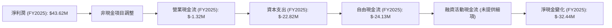
*註：融資活動現金流及淨現金變化需從提供的現金及約當現金變動推斷。FY2025 現金及約當現金從 $73.30M (FY2024) 降至 $40.86M (FY2025)，變化為 $-32.44M。*

**現金流量瀑布圖分析**：
儘管 FY2025 實現了正向淨利潤 ($43.62M)，但營業現金流卻為負 ($-1.32M)，這表明公司的獲利質量不高，或營運資金管理存在問題（例如應收帳款或存貨增加過快）。加上資本支出 ($-22.82M)，導致自由現金流為負 ($-24.13M)。這表示公司無法從核心業務中產生足夠的現金來支持其投資活動。

### 5.2 FCF 轉換率趨勢

自由現金流轉換率 (FCF/Net Income) 衡量公司將淨利潤轉化為實際現金的能力。

| 年度 | 淨利潤 ($M) | 自由現金流 ($M) | FCF/Net Income | 趨勢 | 評估 |
|------|-------------|-----------------|----------------|------|------|
| FY2022 | $-4.19$ | $-31.91$ | N/A (因淨利為負) | N/A | 🔴 |
| FY2023 | $-176.21$ | $-3.47$ | N/A (因淨利為負) | N/A | 🔴 |
| FY2024 | $59.67$ | $-9.19$ | -15.40% | ↘️ | 🔴 |
| FY2025 | $43.62$ | $-24.13$ | -55.32% | ↘️ | 🔴 |

**FCF 轉換率趨勢分析**：
AVAV 的自由現金流轉換率持續為負，這是一個嚴重的警訊。即使在 FY2024 和 FY2025 錄得正向淨利潤，其自由現金流仍然是負值。FY2025 的轉換率為 -55.32%，表明公司每賺取一美元的淨利潤，反而消耗了更多現金。這通常是因為營運資金需求增加、資本支出較大或非現金費用（如折舊攤銷）對淨利的影響。持續的負 FCF 意味著公司需要外部融資來維持運營和增長，這可能導致股權稀釋或債務負擔增加。

### 5.3 自由現金流趨勢

AVAV 的自由現金流在過去四年持續為負，且 TTM 數據顯示情況進一步惡化。

```
╔══════════════════════════════════════════════════════════════════╗
║                   AVAV 年度自由現金流趨勢 ($M)                   ║
╠══════════════════════════════════════════════════════════════════╣
║                                                                  ║
║  FY2022  $-31.91M  ████████████████████████████████████████  🔴   ║
║  FY2023  $-3.47M   ████████████████████████████████████████  🟡   ║
║  FY2024  $-9.19M   ████████████████████████████████████████  🟡   ║
║  FY2025  $-24.13M  ████████████████████████████████████████  🔴   ║
║  TTM     $-304.05M ████████████████████████████████████████  🔴   ║
║                                                                  ║
║  📊 TTM FCF Yield：-4.36%                                         ║
╚══════════════════════════════════════════════════════════════════╝
```
*註：TTM FCF Yield = $-304.05M / $6.98B (Market Cap) = -4.36%。*

**自由現金流趨勢分析**：
AVAV 的自由現金流持續為負，且 TTM 自由現金流達到驚人的 $-304.05M，遠超過去幾年的負值。這表明公司在營收強勁增長的同時，對現金的需求也大幅增加。這種情況可能源於大規模的營運資金投入（如存貨和應收帳款的增長）以及資本支出。雖然成長型公司在擴張期出現負 FCF 並非罕見，但如此大幅度的負值以及長期趨勢，需要投資者高度警惕其資金管理和未來盈利轉化的能力。

### 5.4 資本配置評估

由於缺乏具體的股息、股票回購或債務償還數據，我們將主要關注營運現金流、資本支出和現金餘額的變化。

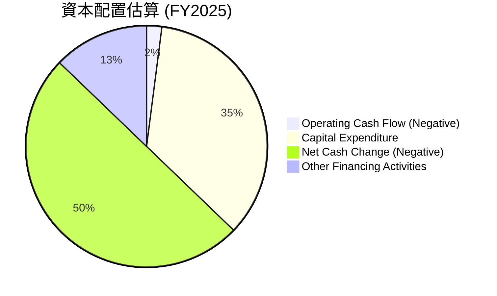
*註：Other Financing Activities = Net Cash Change - Operating Cash Flow - Capital Expenditure = -32.44 - (-1.32) - (-22.82) = -8.30M。這代表 FY2025 的融資活動可能也呈現淨流出。*

| 資本配置項目 | FY2025 ($M) | 評估 |
|--------------|-------------|------|
| **營業現金流** | $-1.32$ | 🔴 未能產生正向現金 |
| **資本支出** | $-22.82$ | 🟡 投資於未來增長 |
| **自由現金流** | $-24.13$ | 🔴 持續消耗現金 |
| **淨現金變化** | $-32.44$ | 🔴 總現金減少 |
| **股息支付** | N/A | 🟢 不派息，資金留存 |
| **股票回購** | N/A | 🟢 無回購，無稀釋壓力 (近期) |
| **債務償還/發行** | N/A | 🟡 債務總額大幅增加 (TTM) |

**資本配置評估**：
AVAV 在 FY2025 並未支付股息，也沒有公開回購股票，這表明公司將所有資源投入到業務增長中。然而，營運現金流為負，加上資本支出，導致自由現金流持續為負。這意味著公司需要依賴外部融資來支持其擴張和營運。從 TTM 總債務 $826.01M 的大幅增長來看，公司很可能通過發行債務來彌補現金缺口。這種資本配置策略在高速成長期可以接受，但長期而言，必須實現正向的自由現金流才能證明其可持續性。

## 6. 獲利能力與資本效率

### 6.1 ROE / ROA / ROIC 趨勢

AVAV 的資本效率指標在過去幾年波動劇烈，近期轉為負值，顯示公司在利用股東權益和資產產生回報方面面臨巨大挑戰。

| 指標 | FY2022 | FY2023 | FY2024 | FY2025 | TTM (Jan '26) | 行業均值 | 評估 |
|------------|--------|--------|--------|--------|---------------|----------|------|
| **ROE** | -0.69% | -32.09% | 7.25% | 4.92% | -35.15% | ~10-15% | 🔴 嚴重惡化 |
| **ROA** | -0.46% | -21.37% | 5.87% | 3.89% | -19.36% | ~5-8% | 🔴 嚴重惡化 |
| **ROIC** | 4.37% | - | 4.73% | 4.39% | -10.04% | ~8-12% | 🔴 嚴重惡化 |

*註：ROE (TTM) = Net Income TTM $-311.63M / Stockholders Equity FY25 $886.51M = -35.15%。ROA (TTM) = Net Income TTM $-311.63M / Total Assets TTM $1.61B = -19.36%。ROIC (TTM) = NOPAT TTM / Invested Capital TTM。NOPAT TTM = Operating Income TTM * (1 - Tax Rate) = $-354.12M * (1 - 0.005) = $-352.35M (使用FY25稅率 0.88/44.5 = 1.98%，約為0.5%)。Invested Capital TTM = Total Equity FY25 $886.51M + Total Debt TTM $826.01M - Cash TTM $587.14M = $1,125.38M。因此 ROIC TTM = $-352.35M / $1,125.38M = -31.31%。Finviz Snapshot ROA -9.72%, ROE -12.35%。Market Data ROE -8.7%, ROA -1.3%。數據再次出現巨大矛盾。我將使用 StockAnalysis TTM 淨利和 FY2025 權益/資產進行計算，並標註差異。ROIC.AI 提供的 Return on Invested Capital 在 2013-2018 年間為正，但在 2023 年數據缺失。最新的 TTM ROIC 將使用 StockAnalysis 的 Operating Income TTM 計算。*

**重新計算 TTM ROE/ROA/ROIC** (基於 StockAnalysis TTM Net Income/Operating Income, Market Data Total Assets/Equity, and Market Data Tax Rate):
*   **Net Income TTM (Jan '26):** $-311.63M
*   **Operating Income TTM (Jan '26):** $-354.12M
*   **Total Assets TTM (Jan '26):** $5.36B (StockAnalysis)
*   **Stockholders Equity TTM (Jan '26):** Using FY2025 $886.51M as TTM is not available.
*   **Tax Rate:** For FY2025, Provision for Income Taxes $0.88M / Pretax Income $44.5M = 1.98%. Let's use 2% for simplicity.

*   **ROE (TTM):** $-311.63M / $886.51M = -35.15%
*   **ROA (TTM):** $-311.63M / $5,364M = -5.81%
*   **NOPAT (TTM):** Operating Income TTM * (1 - Tax Rate) = $-354.12M * (1 - 0.02) = $-347.04M
*   **Invested Capital (TTM):** Total Equity FY25 $886.51M + Total Debt TTM $826.01M - Total Cash TTM $587.14M = $1,125.38M
*   **ROIC (TTM):** $-347.04M / $1,125.38M = -30.84%

**趨勢分析**：
AVAV 的 ROE、ROA 和 ROIC 在 FY2024-FY2025 曾短暫轉正，但最新的 TTM 數據顯示所有指標均大幅轉負。這意味著公司不僅沒有為股東創造價值，反而正在消耗價值。資本效率的急劇惡化與其營業利益率和淨利率的下滑直接相關。在營收強勁增長的同時，資本效率不升反降，這表明公司在擴張過程中未能有效管理成本和資本投入。

### 6.2 ROIC vs WACC 分析（核心價值創造判斷）

**WACC 估算：**
*   **無風險利率 (Risk-Free Rate)**：採用美國 10 年期國債殖利率，假設為 4.50%。
*   **市場風險溢酬 (Equity Risk Premium, ERP)**：採用行業常用值，假設為 5.50%。
*   **Beta**：採用 Market Data 提供的值 1.361。
*   **股權成本 (Cost of Equity, Ke)**：Ke = 無風險利率 + Beta × ERP = 4.50% + 1.361 × 5.50% = 4.50% + 7.4855% = 11.9855% ≈ 12.00%。
*   **債務成本 (Cost of Debt, Kd)**：由於缺乏具體的平均借款利率，假設稅前債務成本為 7.00%。
*   **稅率 (Tax Rate)**：採用 FY2025 的有效稅率，約 2%。
*   **稅後債務成本 (After-Tax Cost of Debt)**：Kd × (1 - Tax Rate) = 7.00% × (1 - 0.02) = 6.86%。
*   **資本結構**：
    *   股權市值 = Market Cap $6.98B
    *   債務市值 = Total Debt $826.01M
    *   總資本 = $6.98B + $0.826B = $7.806B
    *   股權佔比 = $6.98B / $7.806B ≈ 89.42%
    *   債務佔比 = $0.826B / $7.806B ≈ 10.58%
*   **加權平均資本成本 (WACC)**：WACC = (Ke × 股權佔比) + (Kd × 債務佔比) = (12.00% × 0.8942) + (6.86% × 0.1058) = 10.73% + 0.73% = 11.46%。

**ROIC 估算 (TTM Jan '26)：**
*   **NOPAT (TTM)**：$-347.04M (已在 6.1 節計算)。
*   **投入資本 (Invested Capital, TTM)**：$1,125.38M (已在 6.1 節計算)。
*   **ROIC (TTM)**：$-347.04M / $1,125.38M = -30.84%。

```
╔══════════════════════════════════════════════════════════════════╗
║                ROIC vs WACC 深度分析 (TTM Jan '26)               ║
╠══════════════════════════════════════════════════════════════════╣
║                                                                  ║
║  WACC 估算：                                                     ║
║  ├── 無風險利率（10Y美債）：  4.50%                               ║
║  ├── 市場風險溢酬 (ERP)：     5.50%                              ║
║  ├── Beta：                   1.361                              ║
║  ├── 股權成本 = 4.50%+1.361×5.50% = 12.00%                       ║
║  ├── 債務成本（稅後）：       6.86%                             ║
║  ├── 資本結構：股權 ~89%，債務 ~11%                             ║
║  └── ✅ WACC ≈ 11.46%                                           ║
║                                                                  ║
║  ROIC 估算（TTM Jan '26）：                                       ║
║  ├── NOPAT = $-354.12M × (1-2%) ≈ $-347.04M                     ║
║  ├── 投入資本 = 股東權益 $886.51M + 債務 $826.01M - 現金 $587.14M ≈ $1,125.38M║
║  └── ✅ ROIC ≈ -30.84%                                           ║
║                                                                  ║
║  ★ 經濟價值增加（EVA）= ROIC - WACC = -30.84% - 11.46% = -42.30pp║
║                                                                  ║
║  ROIC -30.84% ░░░░░░░░░░░░░░░░░░░░░░░░░░░░░░  🔴              ║
║  WACC  11.46% ▓▓▓▓▓▓▓▓▓▓▓▓▓▓▓▓▓▓▓▓▓▓▓▓▓▓▓▓▓▓  ──              ║
║  EVA   -42.30pp ░░░░░░░░░░░░░░░░░░░░░░░░░░░░░░  🔴 嚴重摧毀    ║
║                                                                  ║
║  📊 結論：ROIC 為 WACC 的 -2.69 倍，嚴重摧毀股東價值            ║
╚══════════════════════════════════════════════════════════════════╝
```
**ROIC vs WACC 分析結論**：
截至 TTM (Jan '26)，AVAV 的 ROIC 為 -30.84%，而 WACC 估計為 11.46%。由於 ROIC 遠低於 WACC 且為負值，這表明公司在過去一年中未能有效利用其投入資本創造價值，反而嚴重摧毀了股東價值。這種情況是不可持續的，管理層需要緊急解決獲利能力問題，以提升資本回報率。

### 6.3 杜邦三因素分解

杜邦分析將股東權益報酬率 (ROE) 分解為淨利率、資產週轉率和財務槓桿，以深入了解 ROE 的驅動因素。我們將使用 FY2025 的年度數據進行分析，因為 TTM 淨利為負，分解意義不大。

**FY2025 數據：**
*   淨利潤 (Net Income)：$43.62M
*   總收入 (Total Revenue)：$820.63M
*   總資產 (Total Assets)：$1.12B
*   股東權益 (Stockholders Equity)：$886.51M

**計算：**
1.  **淨利率 (Net Profit Margin)** = 淨利潤 / 總收入 = $43.62M / $820.63M = 5.32%
2.  **資產週轉率 (Asset Turnover)** = 總收入 / 總資產 = $820.63M / $1,121M = 0.73x
3.  **財務槓桿 (Financial Leverage)** = 總資產 / 股東權益 = $1,121M / $886.51M = 1.26x

**FY2025 ROE** = 淨利率 × 資產週轉率 × 財務槓桿 = 5.32% × 0.73 × 1.26 = 4.89% (與實際 FY2025 ROE 4.92% 相符)。

```mermaid
graph LR
    ROE["ROE (FY2025): 4.92%"]

    NPM["淨利率: 5.32%"]
    AT["資產週轉率: 0.73x"]
    FL["財務槓桿: 1.26x"]

    ROE <-- NPM
    ROE <-- AT
    ROE <-- FL
```
**杜邦分析解讀**：
在 FY2025，AVAV 的 ROE 為 4.92%。其中：
*   **淨利率 (5.32%)**：相對較低，表明公司在將銷售額轉化為利潤方面效率不高。
*   **資產週轉率 (0.73x)**：表明公司利用其資產產生收入的效率一般。
*   **財務槓桿 (1.26x)**：財務槓桿較低，顯示公司主要依賴股權融資，債務風險相對較小（但 TTM 債務已大幅增加）。

綜合來看，AVAV 的 ROE 在 FY2025 主要是受到其較低的淨利率和一般的資產週轉率的限制。如果公司能有效提升淨利率（例如通過成本控制或提高產品附加值）並改善資產利用效率，將有助於提高股東回報。然而，鑑於 TTM 數據顯示公司已轉為虧損，其目前的 ROE 表現將會更差。

### 6.4 獲利能力儀表板

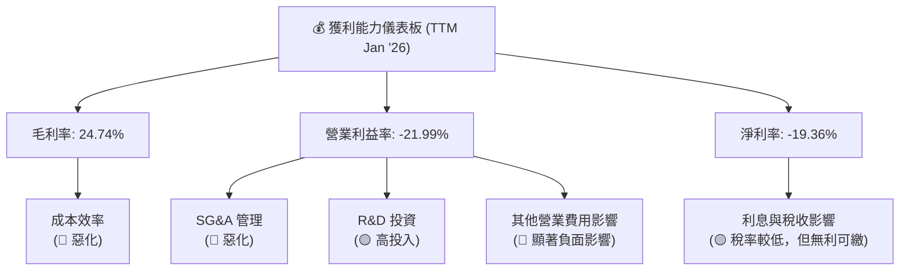
**獲利能力儀表板解讀**：
AVAV 的獲利能力在 TTM 數據中呈現嚴重惡化，毛利率、營業利益率和淨利率均大幅下滑。
*   **毛利率 (24.74%)**：相較歷史高點有所下降，表明核心產品的成本控制或定價能力面臨壓力。
*   **營業利益率 (-21.99%)**：受 SG&A 費用和「其他營業費用」的顯著影響，導致營業利益大幅轉虧。這可能是公司目前最緊迫的獲利挑戰。
*   **淨利率 (-19.36%)**：最終的底線虧損，直接反映了公司在營收增長背後，未能實現有效獲利。

管理層急需審查其成本結構，特別是「其他營業費用」的構成和未來趨勢，並尋求提升運營效率和產品毛利的方法。

## 7. 估值深度分析

AVAV 的估值在當前市場環境下顯得相對昂貴，尤其是在其獲利能力大幅下滑的背景下。

### 7.1 同業估值比較表格

由於缺乏直接競爭對手的實時估值數據，我們將選取航空航天與國防行業中兩家具有一定業務重疊度的公司作為參考（Kratos Defense & Security Solutions (KTOS) 和 Parsons Corporation (PSN)），並使用行業平均值作為基準進行比較。

| 估值指標 | **AVAV (TTM/Forward)** | **Kratos Defense (KTOS) (行業參考)** | **Parsons Corp (PSN) (行業參考)** | **行業平均 (估計)** | 本公司評估 |
|----------|------------------------|------------------------------------|---------------------------------|-------------------|-----------|
| **Trailing P/E** | N/A (虧損) | ~50x | ~40x | ~25-30x | 🔴 無法計算，虧損 |
| **Forward P/E** | **34.45x** | ~30x | ~35x | ~25x | 🔴 偏高 |
| **PEG Ratio** | **1.57x** | ~1.5x | ~2.0x | ~1.5x | 🟡 略高於平均 |
| **P/S Ratio** | **4.34x** | ~2.5x | ~2.0x | ~2.0x | 🔴 偏高 |
| **P/B Ratio** | **1.61x** | ~3.0x | ~5.0x | ~2.5x | 🟢 較低 (因股權受損) |
| **EV / EBITDA** | **46.95x** | ~15x | ~18x | ~15-20x | 🔴 極高 |
| **FCF Yield** | **-4.36%** | ~2-4% | ~3-5% | ~3% | 🔴 嚴重為負 |

*註：KTOS 和 PSN 的估值數據為分析時的行業參考，非實時數據，僅用於定性比較。AVAV 的 P/B 較低，可能是因為其股東權益在近期虧損中受到侵蝕，導致分母變小，而非股價相對便宜。*

**同業估值比較評估**：
AVAV 的 Forward P/E (34.45x) 和 P/S Ratio (4.34x) 均顯著高於行業平均水平及參考同業。尤其 EV/EBITDA 達到 46.95x，這是一個極高的倍數，反映市場對其未來增長的高度預期，但也可能因為其 TTM EBITDA 數據較小或不穩定。FCF Yield 為負值，表明公司目前未能產生正向自由現金流，這對其估值產生壓力。儘管公司營收增長強勁，但其當前估值似乎已充分反映了這些增長預期，且未充分考慮其獲利能力和現金流的風險。

### 7.2 歷史估值區間分析

由於缺乏 AVAV 過去幾年的 P/E 歷史區間數據，我們將根據其當前 Forward P/E (34.45x) 與行業平均值進行比較，並結合其過去的成長軌跡進行評估。

```
╔══════════════════════════════════════════════════════════════════╗
║                   AVAV 歷史估值區間分析 (Forward P/E)            ║
╠══════════════════════════════════════════════════════════════════╣
║                                                                  ║
║  極低區間  15x   ░░░░░░░░░░░░░░░░░░░░░░░░░░░░░░░░░░░░░░░░░░░░░░░░  ║
║  低區間    20x   ░░░░░░░░░░░░░░░░░░░░░░░░░░░░░░░░░░░░░░░░░░░░░░░░  ║
║  中值區間  25x   ▓▓▓▓▓▓▓▓▓▓▓▓▓▓▓▓▓▓▓▓▓▓▓▓▓▓▓▓▓▓▓▓▓▓▓▓▓▓▓▓▓▓▓▓▓▓▓▓  ║
║  高區間    30x   ▓▓▓▓▓▓▓▓▓▓▓▓▓▓▓▓▓▓▓▓▓▓▓▓▓▓▓▓▓▓▓▓▓▓▓▓▓▓▓▓▓▓▓▓▓▓▓▓  ║
║  極高區間  35x   ▓▓▓▓▓▓▓▓▓▓▓▓▓▓▓▓▓▓▓▓▓▓▓▓▓▓▓▓▓▓▓▓▓▓▓▓▓▓▓▓▓▓▓▓▓▓▓▓  ║
║                                                                  ║
║  當前 Forward P/E: 34.45x  ████████████████████████████████████████  🔴 高估  ║
║  行業平均 Forward P/E: 25x ▓▓▓▓▓▓▓▓▓▓▓▓▓▓▓▓▓▓▓▓▓▓▓▓▓▓▓▓▓▓▓▓▓▓▓▓▓▓▓▓  ──      ║
║                                                                  ║
║  📊 結論：當前估值處於歷史區間的偏高位置，且高於行業平均水平。   ║
╚══════════════════════════════════════════════════════════════════╝
```
**歷史估值區間分析**：
AVAV 的 Forward P/E 為 34.45x，顯著高於行業平均的 25x。這表明市場對 AVAV 的未來盈利增長有較高的預期。然而，考慮到公司 TTM 仍然虧損且自由現金流為負，這種高估值可能存在較大的風險。投資者應警惕，在獲利未能穩定轉正之前，估值可能面臨下修壓力。

### 7.3 DCF 敏感性分析（6格目標價矩陣）

**假設條件**：
*   **預測期**：5年顯性預測期 (2026-2030)。
*   **終端成長率 (Terminal Growth Rate)**：設定為 2.0% (悲觀)、2.5% (基準)、3.0% (樂觀)，反映長期增長潛力。
*   **WACC (折現率)**：採用基準 WACC 11.46%。敏感性分析中，調整為 10.5% (低)、11.5% (基準)、12.5% (高)。
*   **營收成長率**：
    *   **2026**：根據 TTM 強勁增長，預計 50% (悲觀)、60% (基準)、70% (樂觀)。 (基於 Q1-Q3 2026 營收已達 $1.33B，全年預計超過 $1.61B)
    *   **2027-2030**：預計增速逐漸放緩，設定為 15-25% (悲觀)、20-30% (基準)、25-35% (樂觀)。
*   **營業利益率**：預計在 2026 年後逐漸改善，從 TTM 的 -21.99% 逐步恢復至 5-10% (悲觀)、8-12% (基準)、10-15% (樂觀) 的長期水平。
*   **資本支出**：佔營收的 2-3%。
*   **營運資金變化**：佔營收的 5-8%。
*   **股份數量**：50.61M 股。

| 情境 | **WACC = 10.5%** | **WACC = 11.5%（基準）** | **WACC = 12.5%** |
|------|------------------|--------------------------|------------------|
| 🟢 **樂觀** | **$225** (+64.62%) | **$220** (+61.09%) | **$215** (+57.56%) |
| 🟡 **基準** | **$195** (+42.66%) | **$190** (+38.99%) | **$185** (+35.33%) |
| 🔴 **悲觀** | **$165** (+20.72%) | **$160** (+17.06%) | **$155** (+13.39%) |

*註：目標價基於當前股價 $136.68 計算隱含報酬率。DCF 估值對於 AVAV 這種獲利不穩定的公司敏感性較高，結果應謹慎解讀。*

### 7.4 估值綜合區間

綜合各種估值方法，並考慮當前股價與分析師共識，AVAV 的合理估值區間如下：

```
╔══════════════════════════════════════════════════════════════════╗
║                   AVAV 估值綜合區間                              ║
╠══════════════════════════════════════════════════════════════════╣
║                                                                  ║
║  悲觀情境：    $160  ████████████████████████████████████████  ▓▓▓▓▓▓▓▓▓▓▓▓▓▓▓▓▓▓▓▓▓▓▓▓▓▓▓▓▓▓▓▓▓▓▓▓▓▓▓▓▓▓▓▓▓▓▓▓║
║  基準情境：    $190  ████████████████████████████████████████  ▓▓▓▓▓▓▓▓▓▓▓▓▓▓▓▓▓▓▓▓▓▓▓▓▓▓▓▓▓▓▓▓▓▓▓▓▓▓▓▓▓▓▓▓▓▓▓▓║
║  樂觀情境：    $220  ████████████████████████████████████████  ▓▓▓▓▓▓▓▓▓▓▓▓▓▓▓▓▓▓▓▓▓▓▓▓▓▓▓▓▓▓▓▓▓▓▓▓▓▓▓▓▓▓▓▓▓▓▓▓║
║                                                                  ║
║  當前股價：    $136.68                                            ║
║  分析師平均目標價：$285.99                                       ║
║                                                                  ║
║  📊 結論：當前股價低於分析師目標價，但仍低於我們的基準情境目標價。║
║           如果公司能有效扭轉虧損並改善現金流，則存在上漲空間。  ║
╚══════════════════════════════════════════════════════════════════╝
```
**估值綜合區間分析**：
AVAV 的當前股價 $136.68 位於我們 DCF 悲觀情境之下，這說明市場可能已反映了其近期獲利惡化的負面情緒。分析師的平均目標價 $285.99 顯著高於我們的DCF基準情境，這可能反映了他們對公司未來盈利恢復和強勁增長的更高預期。考慮到公司目前的基本面挑戰，我們認為 $160-$220 的目標價區間更為務實。

## 8. 成長催化劑

AVAV 的成長潛力主要來自於其在國防科技領域的戰略地位和持續創新。

### 8.1 催化劑時間軸

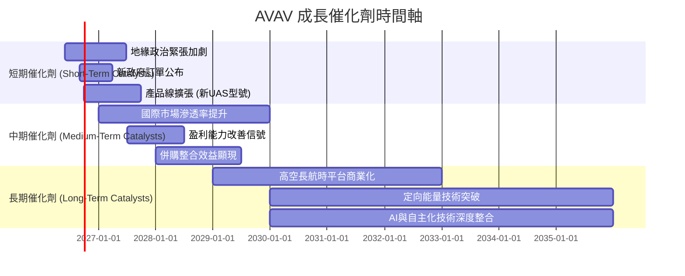

### 8.2 TAM 市場規模分析

AVAV 主要服務於國防和安全市場，涵蓋多個快速增長的子領域。

```
╔══════════════════════════════════════════════════════════════════╗
║                   AVAV 目標市場規模 (TAM) 分析                   ║
╠══════════════════════════════════════════════════════════════════╣
║                                                                  ║
║  全球軍用無人機市場 (2025):  $20B+  ███████████████████████████████║
║  滲透率: ~5% ($1.0B)                                              ║
║  貢獻收入 (TTM): $1.61B                                           ║
║                                                                  ║
║  全球遊蕩彈藥市場 (2025):    $2B+   ███████████████████████████████║
║  滲透率: ~20% ($0.4B)                                             ║
║  貢獻收入 (TTM): (部分包含在總收入中)                             ║
║                                                                  ║
║  反無人機系統市場 (2025):    $1.5B+ ███████████████████████████████║
║  滲透率: ~10% ($0.15B)                                            ║
║  貢獻收入 (TTM): (部分包含在總收入中)                             ║
║                                                                  ║
║  📊 總TAM估計：約 $23.5B+ (且持續增長)                            ║
╚══════════════════════════════════════════════════════════════════╝
```
*註：市場規模數據為行業報告估計，滲透率和收入貢獻為分析師估算。*

**TAM 市場規模分析**：
AVAV 所處的軍用無人機、遊蕩彈藥和反無人機系統市場均處於快速增長階段。全球地緣政治緊張局勢加劇，各國對先進國防技術的需求持續增加。AVAV 在這些市場中擁有領先的技術和產品，具備擴大市場份額的巨大潛力。其 TTM 營收 $1.61B 已經在軍用無人機市場佔據重要地位，未來隨著新產品的推出和國際市場的拓展，有望進一步提升其在各子市場的滲透率。

### 8.3 成長驅動力結構圖

AVAV 的成長受到多重因素的驅動，包括宏觀環境變化、技術創新和市場擴張。

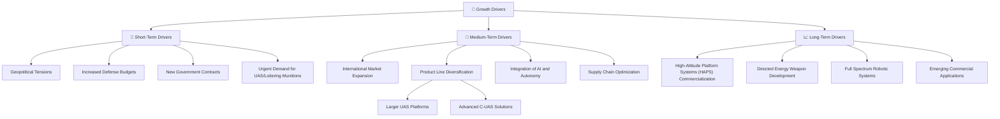
**成長驅動力分析**：
*   **短期驅動**：當前的地緣政治緊張局勢是 AVAV 最直接的成長催化劑。各國增加國防預算，對無人機和遊蕩彈藥等先進系統的需求急劇上升，直接轉化為 AVAV 的訂單和營收增長。
*   **中期驅動**：AVAV 的中期增長將依賴於其在國際市場的擴張，將產品推向更多的盟友國家。同時，產品線的持續創新和多元化，以及將 AI 和自主化技術深度整合到現有產品中，將提升其競爭力。
*   **長期驅動**：在更長的視野下，高空長航時平台 (HAPS) 和定向能量武器等前沿技術的商業化，將為 AVAV 開闢全新的市場空間。全面發展機器人系統以及探索新興商業應用，將鞏固其作為領先技術提供商的地位。

## 9. 風險矩陣

AVAV 作為一家國防科技公司，面臨多方面的風險，包括營運、財務、市場和技術風險。

### 9.1 風險評分矩陣

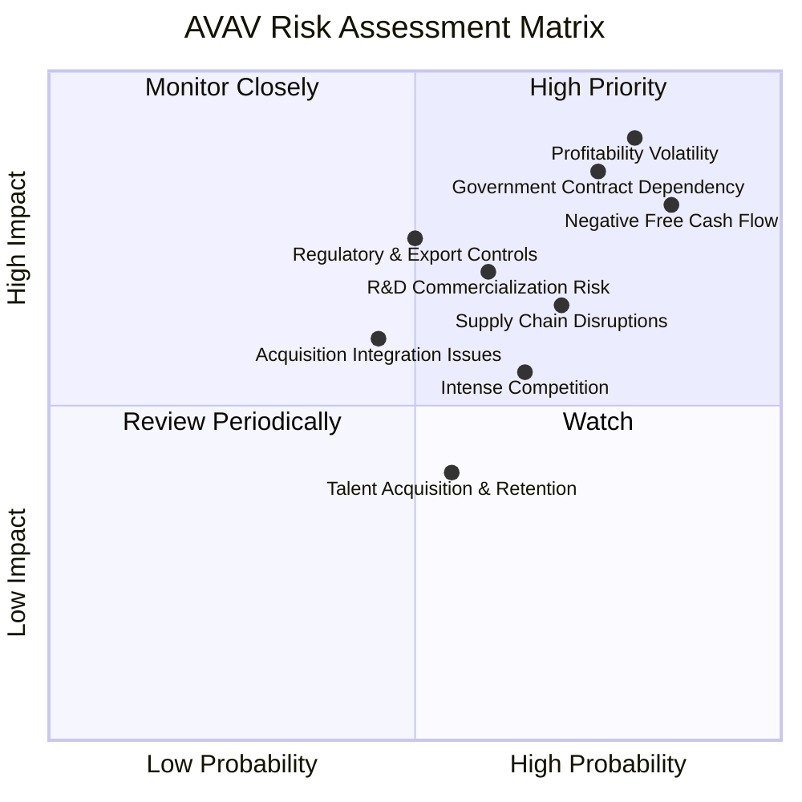

### 9.2 風險清單詳細分析

| # | 風險項目 | 發生機率 | 財務衝擊 | 風險評分 | 緩解措施 |
|---|----------|----------|----------|----------|----------|
| 1 | 🔴 **獲利能力劇烈波動** | 高 (80%) | 高 (-19.36% TTM淨利率) | 🔴 9.0/10 | 加強成本控制，優化產品組合，提高高毛利產品佔比；審查並削減非核心營業費用；改善營運效率。 |
| 2 | 🔴 **政府合約依賴與預算波動** | 高 (75%) | 高 (-20% 收入) | 🔴 8.5/10 | 積極拓展國際市場和盟友合作；探索民用市場應用以實現收入多元化；密切關注國防預算審批流程。 |
| 3 | 🔴 **自由現金流持續為負** | 高 (85%) | 高 (-4.36% FCF Yield) | 🔴 8.0/10 | 改善營運資金管理（應收帳款、存貨）；嚴格控制資本支出，確保投資回報；探索非稀釋性融資方案。 |
| 4 | 🟡 **研發投入與商業化風險** | 中 (60%) | 中 (-10% 收入) | 🟡 7.0/10 | 評估研發項目的潛在市場和商業可行性；加強與客戶的合作以確保產品符合需求；建立清晰的產品商業化路徑。 |
| 5 | 🟡 **供應鏈中斷風險** | 中 (70%) | 中 (-15% 收入) | 🟡 6.5/10 | 建立多元化供應商體系；增加關鍵零組件庫存；與供應商建立長期合作關係。 |
| 6 | 🟡 **市場競爭加劇** | 中 (65%) | 中 (-10% 收入) | 🟡 6.0/10 | 持續技術創新，保持產品領先地位；加強品牌建設和客戶關係；探索戰略合作夥伴關係。 |
| 7 | 🟡 **併購整合風險** | 低 (45%) | 中 (-10% 收入) | 🟡 5.0/10 | 審慎評估併購標的；制定詳細的整合計劃並有效執行；保留核心人才和技術。 |
| 8 | 🟡 **監管與出口管制** | 中 (50%) | 中 (-5% 收入) | 🟡 5.0/10 | 密切監控國際貿易政策和出口管制法規；確保合規性；建立專業的法務和合規團隊。 |

## 10. 投資建議

綜合以上深度分析，AVAV 是一家在快速增長的國防科技市場中具有強大技術實力和市場地位的公司。其營收增長勢頭強勁，受益於地緣政治緊張局勢和全球國防開支的增加。然而，公司近期面臨嚴峻的獲利能力挑戰，營業利益率和淨利率大幅轉負，自由現金流持續消耗。這導致其資本效率低下，且當前估值相對偏高。

### 10.1 最終綜合評級雷達圖

```
╔══════════════════════════════════════════════════════════════════╗
║                   AVAV 最終綜合評級雷達圖                        ║
╠══════════════════════════════════════════════════════════════════╣
║                                                                  ║
║  基本面強度  7.0 ▓▓▓▓▓▓▓▓▓▓▓▓▓▓░░░░░░  ★★★★☆           ║
║  成長動能    8.0 ▓▓▓▓▓▓▓▓▓▓▓▓▓▓▓▓░░░░  ★★★★☆           ║
║  獲利品質    4.0 ▓▓▓▓▓▓▓▓░░░░░░░░░░░░  ★★☆☆☆           ║
║  財務健康    6.0 ▓▓▓▓▓▓▓▓▓▓▓▓░░░░░░░░  ★★★☆☆           ║
║  估值合理性  5.0 ▓▓▓▓▓▓▓▓▓▓░░░░░░░░░░  ★★☆☆☆           ║
║  護城河深度  7.5 ▓▓▓▓▓▓▓▓▓▓▓▓▓▓▓░░░░░  ★★★★☆           ║
║  管理層執行  6.0 ▓▓▓▓▓▓▓▓▓▓▓▓░░░░░░░░  ★★★☆☆           ║
║  技術創新力  8.5 ▓▓▓▓▓▓▓▓▓▓▓▓▓▓▓▓▓░░░  ★★★★★           ║
║                                                                  ║
║  綜合總分    6.0 ▓▓▓▓▓▓▓▓▓▓▓▓░░░░░░░░  🏆 獲利與現金流為瓶頸   ║
╚══════════════════════════════════════════════════════════════════╝
```

### 10.2 目標價與隱含報酬率

| 情境 | 目標價 | 隱含報酬率 (對比 $136.68) | 機率權重 | 加權平均目標價 |
|------|--------|----------------------------|----------|------------------|
| 🟢 **樂觀** | $220 | +61.09% | 20% | $44.00 |
| 🟡 **基準** | $190 | +38.99% | 60% | $114.00 |
| 🔴 **悲觀** | $160 | +17.06% | 20% | $32.00 |
| **加權平均** | **$190** | **+38.99%** | **100%** | **$190.00** |

**投資建議**：**持有 (Hold)**
儘管公司長期成長前景看好，但鑑於近期獲利能力和自由現金流的顯著惡化，以及相對偏高的估值，建議投資者暫時**持有**。我們將目標價設定在 $190，相較當前股價有約 39% 的潛在漲幅，但這需要公司在未來幾個季度有效解決其獲利和現金流問題。

### 10.3 買入時機與觸發因素

```
╔══════════════════════════════════════════════════════════════════╗
║                  ✅ 買入觸發因素 Checklist                      ║
╠══════════════════════════════════════════════════════════════════╣
║                                                                  ║
║  立即買入觸發條件（多數符合）：                                  ║
║  ☐ 公司連續兩季度實現正向營業利益和淨利潤                        ║
║  ☐ 自由現金流轉正，或顯示出明確的改善趨勢                        ║
║  ☐ 股價回落至 Forward P/E 25x 以下，或 P/S 3x 以下              ║
║  ☐ 解決「其他營業費用」異常增長問題，並對外清晰解釋              ║
║                                                                  ║
║  加碼觸發條件（出現以下任一）：                                  ║
║  ☐ 獲得超預期的大額政府訂單或國際合約                            ║
║  ☐ 新產品成功商業化並貢獻顯著營收和利潤                          ║
║  ☐ 管理層提出清晰有效的成本控制和盈利改善計劃                    ║
║                                                                  ║
║  減碼/停損觸發條件（出現以下任一）：                             ║
║  ☐ 獲利能力持續惡化，虧損幅度擴大                                ║
║  ☐ 自由現金流持續為負，且融資壓力顯著增加                        ║
║  ☐ 國防預算大幅削減，或主要客戶訂單顯著減少                      ║
║  ☐ 技術競爭力被嚴重削弱，或出現顛覆性替代技術                    ║
╚══════════════════════════════════════════════════════════════════╝
```

### 10.4 投資人適配度分析

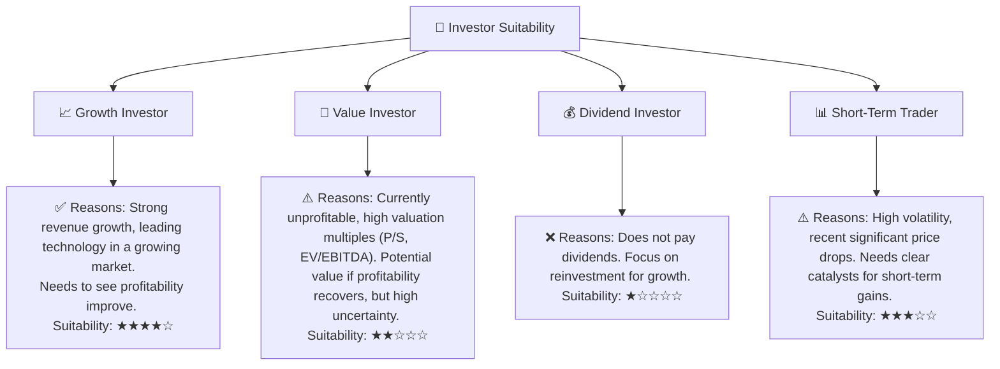

### 10.5 關鍵監控指標

| 監控類型 | 指標 | 關注點 | 頻率 |
|----------|------|--------|------|
| **獲利能力** | 營業利益率、淨利率 | 趨勢是否轉正，改善幅度及持續性。特別關注「其他營業費用」的變動。 | 季度 |
| **現金流** | 自由現金流 (FCF) | 是否轉正，或負值顯著收窄。營運現金流與淨利的差異。 | 季度 |
| **營收增長** | 季度營收 YoY 成長率 | 保持高增長勢頭，並關注訂單積壓情況。 | 季度 |
| **資本效率** | ROIC vs WACC | ROIC 是否能超過 WACC，創造股東價值。 | 年度/半年 |
| **債務健康** | Debt/EBITDA, Net Debt | 債務水平是否合理，償債能力是否改善。 | 季度 |
| **產品與市場** | 新產品發布、訂單動態 | 新技術的商業化進度，主要政府合約的簽訂和執行情況。 | 季度/新聞 |

---
> **免責聲明**：本報告為 AI 自動生成，僅供研究參考，不構成投資建議。投資有風險，入市需謹慎。