# AVAV 基本面深度分析報告
> **報告日期**：2026-06-30 ｜ **語言**：繁體中文 ｜ **數據來源**：Yahoo Finance, Finviz, StockAnalysis, Roic.ai ｜ **分析師**：CFA 級機構研究

---

## 目錄

| # | 章節 | 核心結論 |
|---|------|----------|
| 1 | 執行摘要 | 評級：🟢 買入，目標價區間：$205 - $350 |
| 2 | 公司概覽與商業模式 | 專注於無人系統與精準打擊，具備技術與客戶鎖定護城河 |
| 3 | 損益表深度分析 | 營收高速成長，但近期獲利能力承壓，費用控制是關鍵 |
| 4 | 資產負債表分析 | 流動性良好，但淨負債增加，需關注債務結構 |
| 5 | 現金流量深度分析 | 自由現金流持續為負，營業現金流波動較大，資本支出增加 |
| 6 | 獲利能力與資本效率 | ROIC 表現不佳，低於 WACC，股東價值創造面臨挑戰 |
| 7 | 估值深度分析 | 相較同業估值合理，但需依賴未來獲利反彈支撐 |
| 8 | 成長催化劑 | 地緣政治緊張、技術創新、國防預算增加為主要驅動力 |
| 9 | 風險矩陣 | 執行風險、合約依賴、競爭加劇、供應鏈不確定性為主要風險 |
| 10 | 投資建議 | 具備高成長潛力，但短期獲利承壓，適合高風險偏好成長型投資者 |

---

## 1. 執行摘要

AeroVironment, Inc. (AVAV) 作為航空航太與國防產業的重要參與者，專注於無人機系統 (UAS) 和精準打擊解決方案。公司近期展現出驚人的營收成長，尤其是在地緣政治緊張局勢下，對其產品的需求顯著增加。然而，高速成長的背後也伴隨著獲利能力的挑戰，最近幾個季度出現淨虧損，顯示出在擴張過程中營運費用和研發投入的壓力。儘管如此，強勁的訂單流和分析師普遍看好其未來營收增長，為其長期前景提供了支撐。

### 1.1 核心評分儀表板

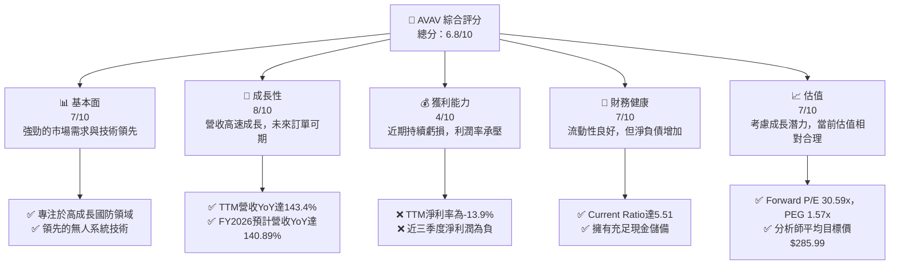

### 1.2 評分進度條視覺化

```
╔══════════════════════════════════════════════════════════════╗
║              AVAV 多維度評分儀表板 (1-10分)                  ║
╠══════════════════════════════════════════════════════════════╣
║ 基本面強度  7.0 ▓▓▓▓▓▓▓▓▓▓▓▓▓▓▓░░░░░  ★★★★☆           ║
║ 成長動能    8.0 ▓▓▓▓▓▓▓▓▓▓▓▓▓▓▓▓░░░░  ★★★★☆           ║
║ 獲利品質    4.0 ▓▓▓▓▓▓▓▓░░░░░░░░░░░░  ★★☆☆☆           ║
║ 財務健康    7.0 ▓▓▓▓▓▓▓▓▓▓▓▓▓▓▓░░░░░  ★★★★☆           ║
║ 估值合理性  7.0 ▓▓▓▓▓▓▓▓▓▓▓▓▓▓▓░░░░░  ★★★★☆           ║
║ 護城河深度  7.5 ▓▓▓▓▓▓▓▓▓▓▓▓▓▓▓▓░░░░  ★★★★☆           ║
║ 管理層執行  6.5 ▓▓▓▓▓▓▓▓▓▓▓▓▓░░░░░░░  ★★★☆☆           ║
║ 技術創新力  8.0 ▓▓▓▓▓▓▓▓▓▓▓▓▓▓▓▓░░░░  ★★★★☆           ║
╠══════════════════════════════════════════════════════════════╣
║ 綜合總分    6.8 ▓▓▓▓▓▓▓▓▓▓▓▓▓▓░░░░░░  🏆 具高成長潛力，但近期獲利承壓     ║
╚══════════════════════════════════════════════════════════════╝
```

### 1.3 五大投資論點 + 三大核心風險

| 類型 | 項目 | 具體依據 | 信心度 |
|------|------|----------|--------|
| 🟢 **投資論點①** | **無人系統市場需求激增** | TTM 營收成長率高達 143.4%，FY2026 預計營收 $1.977B，YoY 成長 140.89%，顯示市場對其無人機系統和精準打擊解決方案有強勁需求，尤其受地緣政治緊張推動。 | 🟢 極高 |
| 🟢 **技術領先與創新** | 公司在小型與中型無人機系統 (UAS) 和遊蕩彈藥 (loitering munitions) 領域擁有核心技術，並持續投入研發 (FY2025 R&D $100.73M)，確保其產品在國防市場的競爭優勢。 | 🟢 高 |
| 🟢 **強勁的分析師共識** | 16 位分析師給予「買入」評級，平均目標價 $285.99，較當前股價 $165.07 有約 73.2% 的上漲空間，表明市場對其未來表現持樂觀態度。 | 🟢 高 |
| 🟡 **高流動性與財務彈性** | 截至 FY2025，Current Ratio 達 5.51，Quick Ratio 達 4.396，顯示公司短期償債能力極強。總現金 $587.14M，為其營運和未來投資提供保障。 | 🟡 中度 |
| 🟡 **長期戰略性市場地位** | 國防支出趨勢性增長，特別是在自動化、情報、監控和偵察 (ISR) 領域，AVAV 作為關鍵供應商，有望從中長期趨勢中受益。 | 🟡 中度 |
| 🟡 **風險①** | **獲利能力挑戰** | TTM 淨利率為 -13.9%，近三季度淨利潤分別為 -$156.55M, -$17.10M, -$67.37M，顯示公司在高速擴張中面臨成本控制和營運效率的壓力。 | 🟡 中度 |
| 🔴 **風險②** | **高度依賴政府合約** | 作為國防承包商，營收高度依賴政府採購週期、預算變化及政治因素，可能導致訂單波動和營收不確定性。 | 🔴 高衝擊 |
| 🔴 **風險③** | **估值波動與市場情緒** | 儘管 Forward P/E 為 30.59x，但鑒於其負的 TTM EPS 和不穩定的獲利歷史，若未來獲利未能如預期大幅改善，估值可能面臨壓力，股價波動較大。 | 🔴 高衝擊 |

### 1.4 快速統計卡片

| 指標 | 公司實際值 (TTM/最新年) | 行業均值（估計） | S&P 500 均值（估計） | 狀態 |
|------|--------------------------|------------------|----------------------|------|
| 收入 YoY 成長 | **143.4%** | ~10-15% | ~8-12% | 🟢 |
| 毛利率 | **25.0%** | ~25-35% | ~30-40% | 🟡 |
| 淨利率 | **-13.9%** | ~5-10% | ~8-12% | 🔴 |
| ROE | **-8.7%** | ~10-15% | ~15-20% | 🔴 |
| Forward P/E | **30.59x** | ~20-25x | ~20-22x | 🟡 |
| P/S Ratio | **5.19x** | ~1.5-2.5x | ~2-3x | 🔴 |
| Current Ratio | **5.51x** | ~1.5-2.0x | ~1.5-2.0x | 🟢 |
| Debt/Equity | **19.34x** | ~0.5-1.0x | ~0.8-1.2x | 🔴 |

*備註：行業均值和 S&P 500 均值為分析師根據經驗估計的典型區間，非來自提供數據。*

### 1.5 投資結論

```
╔══════════════════════════════════════════════════════════════════╗
║                    📊 投資結論摘要                               ║
╠══════════════════════════════════════════════════════════════════╣
║  評級：🟢 買入                                                   ║
║  當前股價：$165.07 (2026-06-30)                                  ║
║  目標價區間：                                                    ║
║    悲觀情境：$205（+24.2%）                                      ║
║    基準情境：$285（+72.7%）  ← 12個月主要目標                      ║
║    樂觀情境：$350（+112.0%）                                     ║
║  投資評分：6.8/10                                                ║
║  適合投資人：成長型、長線持有者，對國防產業有深入理解且具備較高風險承受能力的投資者。 ║
╚══════════════════════════════════════════════════════════════════╝
```

---

## 2. 公司概覽與商業模式

AeroVironment, Inc. (AVAV) 是一家總部位於美國的航空航太與國防公司，專門設計、開發、生產、交付和支援一系列機器人系統及相關服務，主要客戶為美國政府機構和國際客戶。公司業務主要分為兩個部門：自主系統 (Autonomous Systems) 和太空、網路與定向能量 (Space, Cyber and Directed Energy)。

### 2.1 業務結構與收入來源

AVAV 的核心業務圍繞其高科技無人機系統 (UAS) 和精準打擊解決方案，這些產品在現代戰場和情報收集中扮演關鍵角色。

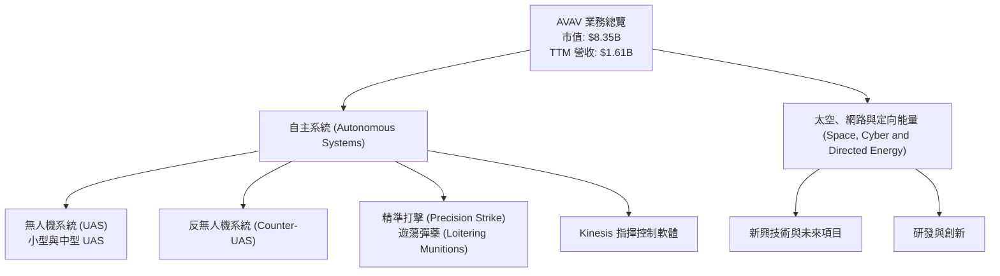

**收入來源分析**：
AVAV 的收入主要來自其先進的無人機系統，包括偵察、監視和目標獲取 (RSTA) 任務的小型和中型 UAS，以及用於精準打擊的遊蕩彈藥。這些系統的需求受地緣政治衝突和各國國防現代化支出推動。儘管數據未提供具體部門的收入佔比，但從公司簡介來看，自主系統部門是其核心營收來源。FY2025 年度總營收為 $820.63M，而 FY2026 預計營收將達到 $1.977B，顯示其核心產品線的強勁增長。

### 2.2 市場份額

由於缺乏具體的市場份額數據，我們將根據行業知識進行概念性分析。AVAV 在小型戰術無人機和遊蕩彈藥領域佔據重要地位，但整體國防市場競爭激烈，其市場份額可能相對集中於特定利基市場。

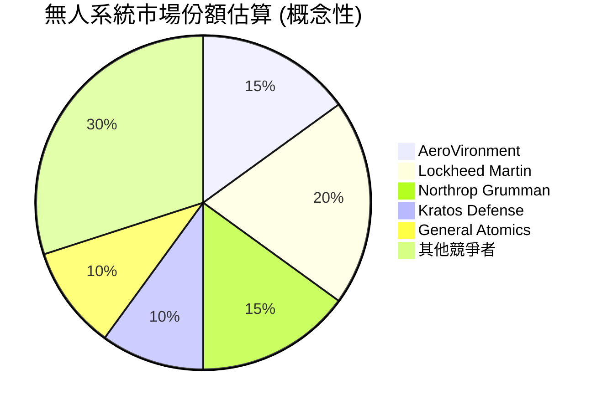
*備註：此市場份額為概念性估算，未有具體數據支持，僅供參考，反映公司在特定利基市場的相對重要性。*

### 2.3 競爭護城河分析

AVAV 的競爭護城河主要建立在其技術創新、客戶關係和特定產品的領先地位上。

```mermaid
mindmap
    root((Competitive Moats))
        Technology Leadership
            Advanced UAS Design
            Precision Strike Capabilities
            Proprietary Kinesis Software
        Customer Lock-in
            Defense Contractor Relationships
            High Switching Costs (Training, Integration)
            Long-term Government Contracts
        Network Effects
            (Limited) - Indirect through interoperability
        Scale Economies
            Manufacturing Efficiency (potential)
            R&D Investment Spreading
        Ecosystem Partners
            Military Integration
            Supply Chain Relationships
        Regulatory Advantages
            Defense Industry Certifications
            Export Controls (IP Protection)
```

### 2.4 護城河強度評分

AVAV 在技術和客戶鎖定方面表現突出，但在規模效應和網路效應方面仍有提升空間。

```
╔══════════════════════════════════════════════════════════════╗
║                  AVAV 護城河強度評分                        ║
╠══════════════════════════════════════════════════════════════╣
║ 技術領先    8/10 ▓▓▓▓▓▓▓▓▓▓▓▓▓▓▓▓░░░░  🏆 在小型UAS與遊蕩彈藥領域具備優勢 ║
║ 客戶鎖定    8/10 ▓▓▓▓▓▓▓▓▓▓▓▓▓▓▓▓░░░░  🟢 長期國防合約與高整合成本      ║
║ 規模效應    6/10 ▓▓▓▓▓▓▓▓▓▓▓▓░░░░░░░░  🟡 具一定規模，但與大型防務商仍有差距 ║
║ 網路效應    4/10 ▓▓▓▓▓▓▓▓░░░░░░░░░░░░  🔴 影響有限，主要為產品互操作性    ║
║ 生態夥伴    7/10 ▓▓▓▓▓▓▓▓▓▓▓▓▓▓░░░░░░  🟡 與軍方及供應商關係緊密      ║
║ 監管優勢    7/10 ▓▓▓▓▓▓▓▓▓▓▓▓▓▓░░░░░░  🟢 國防資質與出口管制提供保護  ║
╠══════════════════════════════════════════════════════════════╣
║ 綜合護城河  7.0  ▓▓▓▓▓▓▓▓▓▓▓▓▓▓░░░░░░  🏆 具備穩固的技術與客戶護城河，但規模有待提升 ║
╚══════════════════════════════════════════════════════════════╝
```

---

## 3. 損益表深度分析

### 3.1 年度收入成長趨勢（近4年）

AVAV 近年來展現出強勁的營收成長動能，尤其在 FY2026 預計將達到歷史新高。

```
╔══════════════════════════════════════════════════════════════════╗
║              AVAV 年度收入趨勢（FY2022-FY2026E）                 ║
╠══════════════════════════════════════════════════════════════════╣
║                                                                  ║
║  FY2022  $445.73M  ███████░░░░░░░░░░░░░░░░░░░  YoY: +12.87%  🟢    ║
║  FY2023  $540.54M  █████████░░░░░░░░░░░░░░░░░  YoY: +21.27%  🟢    ║
║  FY2024  $716.72M  ████████████░░░░░░░░░░░░░░  YoY: +32.59%  🟢    ║
║  FY2025  $820.63M  ██████████████░░░░░░░░░░░░  YoY: +14.50%  🟢    ║
║  FY2026E $1.977B   ███████████████████████████  YoY: +140.89% 🟢    ║
║                   |      |      |      |      |                  ║
║                   0     0.5B   1.0B   1.5B   2.0B                  ║
║                                                                  ║
║  📊 5年累計 CAGR：+44.7% (FY2022-FY2026E)                        ║
╚══════════════════════════════════════════════════════════════════╝
```
**分析**：
AVAV 的年度營收從 FY2022 的 $445.73M 穩步增長至 FY2025 的 $820.63M，複合年增長率 (CAGR) 達 22.5%。最引人注目的是 FY2026 預計營收將達到 $1.977B，較 FY2025 實現 140.89% 的驚人成長。這表明公司在過去一年中獲得了大量新訂單或成功擴大了市場份額，顯著受益於國防產業的景氣度。

### 3.2 季度收入趨勢分析

近四季度的營收表現極為強勁，顯示出公司業務的爆發性增長。

| 季度 (截至日期) | 總營收 (M) | QoQ 成長率 | YoY 成長率 | 備註 |
|-----------------|------------|------------|------------|------|
| 2025-04-30 (Q4 2025) | $275.05 | +63.95% | +39.63% | 季度營收顯著增長，為 FY2025 畫上句號 |
| 2025-07-31 (Q1 2026) | $454.68 | +65.31% | +139.96% | 進入 FY2026 後營收加速，同比大幅躍升 |
| 2025-10-31 (Q2 2026) | $472.51 | +3.92% | +150.72% | 營收維持高位，同比成長達到頂峰 |
| 2026-01-31 (Q3 2026) | $408.05 | -13.72% | +143.41% | 季度環比略有下降，但同比仍保持高成長 |

**分析**：
AVAV 在 FY2026 財年的前三季度展現了驚人的營收成長，同比增長率均超過 139%。其中，Q2 2026 (截至 2025-10-31) 的 $472.51M 營收同比增長高達 150.72%，達到近期峰值。儘管 Q3 2026 (截至 2026-01-31) 營收環比下降 13.72% 至 $408.05M，但同比成長仍高達 143.41%。這種爆發性成長可能歸因於大型合約的交付進度、產品需求激增或併購效應。

### 3.3 利潤率演變分析

AVAV 的利潤率表現波動較大，尤其在近期營收高速增長時，淨利率卻轉為負值，顯示出營運成本壓力。

| 利潤率指標 | FY2022 | FY2023 | FY2024 | FY2025 | 趨勢 | 評估 |
|------------|--------|--------|--------|--------|------|------|
| **毛利率** | 31.7% | 32.1% | 39.6% | 38.8% | ↗️ 穩步提升後略有回落 | 🟡 |
| **營業利益率** | -2.2% | -4.2% | 10.0% | 7.2% | ↗️ 轉正後略有下降 | 🟡 |
| **淨利率** | -0.9% | -32.6% | 8.3% | 5.3% | ↗️ 大幅波動後轉正但趨緩 | 🔴 |

**利潤率演變深度解析**：
*   **毛利率**：從 FY2022 的 31.7% 提升至 FY2024 的 39.6%，顯示公司在產品定價和成本控制方面有所改善。然而，FY2025 略微下降至 38.8%，這可能與產品組合變化、供應鏈成本壓力或新的大型合約毛利率較低有關。
*   **營業利益率**：在 FY2022 和 FY2023 均為負值 (-2.2% 和 -4.2%)，主要受高額研發 (R&D) 和銷售、一般及行政費用 (SG&A) 影響。FY2024 顯著轉正至 10.0%，表明營運效率大幅提升。但 FY2025 再次回落至 7.2%。
    *   從季度數據來看，Q3 2026 (截至 2026-01-31) 營業利益率為 -65.78% (Operating Income -$268.44M / Revenue $408.05M)，Q2 2026 為 -6.40%，Q1 2026 為 -15.24%。這與年度數據形成鮮明對比，表明在 FY2026 財年，公司正經歷巨大的營運成本壓力，特別是 StockAnalysis 數據中 Q3 2026 顯示 "Other Operating Expenses" 高達 $240.71M，這可能是導致營業利益大幅虧損的主要原因。
*   **淨利率**：與營業利益率趨勢相似，FY2023 由於巨額虧損 (-$176.21M)，淨利率跌至 -32.6%。FY2024 轉正至 8.3%，FY2025 略降至 5.3%。然而，TTM 淨利率為 -13.9%，且近三季度持續錄得淨虧損 (Q3 2026: -$156.55M, Q2 2026: -$17.10M, Q1 2026: -$67.37M)。這表明公司在最近的營收高速增長期間，未能有效控制成本，或因一次性費用、會計調整等因素導致獲利能力急劇惡化。

總體而言，AVAV 的營收成長非常出色，但其獲利能力穩定性較差，尤其在近期表現出明顯的惡化趨勢，這需要投資者密切關注。

### 3.4 費用結構分析

AVAV 的費用結構顯示研發和銷售管理費用佔比較高，這在技術驅動型公司中是常見的，但近期其他營運費用的大幅增長值得關注。

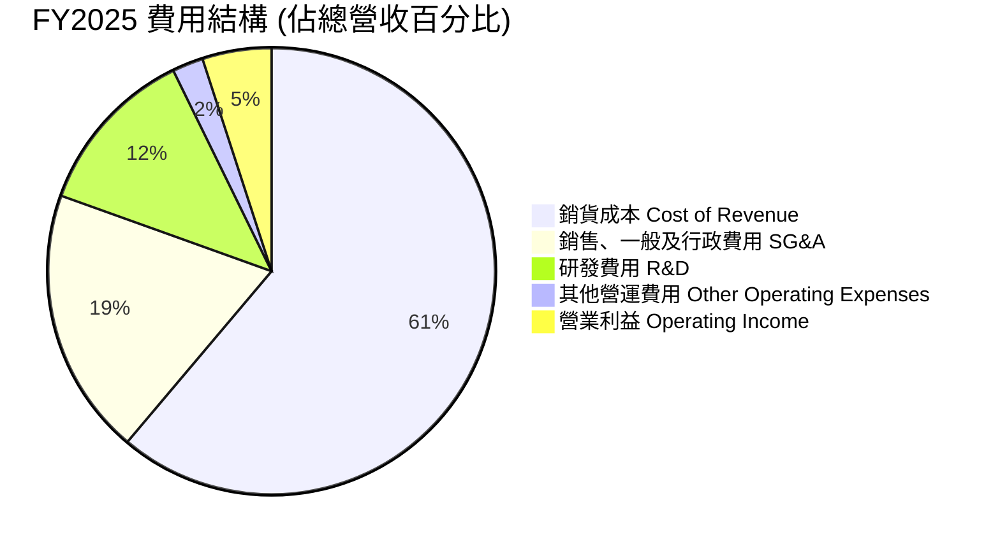
*計算基於 FY2025 數據：總營收 $820.63M。Cost of Revenue $501.99M (61.16%)。Selling, General & Admin $158.75M (19.34%)。Research & Development $100.73M (12.27%)。Other Operating Expenses $18.36M (2.24%)。Operating Income $40.8M (5.00%)。*

```
╔══════════════════════════════════════════════════════════════════╗
║                   AVAV FY2025 費用結構概覽                       ║
╠══════════════════════════════════════════════════════════════════╣
║                                                                  ║
║  銷貨成本：       $501.99M  █████████████████████████░░░░░░░░░  61.16% ║
║  銷售、一般及行政：$158.75M  ████████████████░░░░░░░░░░░░░░░░░░  19.34% ║
║  研發費用：       $100.73M  ███████████░░░░░░░░░░░░░░░░░░░░░░░░  12.27% ║
║  其他營運費用：    $18.36M  █░░░░░░░░░░░░░░░░░░░░░░░░░░░░░░░░░░  2.24%  ║
║                                                                  ║
║  📊 費用佔營收比重：銷貨成本佔比最高，研發投入較大，但營運費用總體偏高。║
╚══════════════════════════════════════════════════════════════════╝
```
**分析**：
FY2025 的費用結構顯示，銷貨成本佔總營收的 61.16%，研發費用佔 12.27%，銷售、一般及行政費用佔 19.34%。這些費用總計佔營收的 92.77%，使得營業利益率僅為 5.00%。近期季度數據顯示，Q3 2026 (截至 2026-01-31) 的「其他營運費用」激增至 $240.71M，是導致該季度營業利益和淨利潤大幅虧損的關鍵因素。這種一次性或異常高的營運費用需要管理層提供詳細解釋。

### 3.5 季度 EPS 趨勢與盈餘品質

由於提供的「EPS Beats/Misses」數據為 NaN，我們將根據 StockAnalysis 提供的季度稀釋後 EPS (Diluted EPS) 進行分析。

| 季度 (截至日期) | 稀釋後 EPS | 淨利潤 (M) | 備註 |
|-----------------|------------|------------|------|
| Q4 2025 (Apr 30, 2025) | $1.55 | $16.66 | 該季度實現正收益，結束 FY2025。 |
| Q1 2026 (Jul 31, 2025) | N/A (Net Income -$67.37M) | -$67.37 | 淨利潤轉負，未提供具體 EPS 數字，但預計為負。 |
| Q2 2026 (Oct 31, 2025) | -$0.34 | -$17.10 | 繼續錄得虧損，EPS 為負。 |
| Q3 2026 (Jan 31, 2026) | -$3.15 | -$156.55 | 虧損大幅擴大，EPS 顯著為負。 |

**盈餘品質評估**：
AVAV 的盈餘品質在近期季度呈現惡化趨勢。儘管 FY2025 實現了正的年度淨利潤 $43.62M 和 EPS $1.55，但 FY2026 的前三季度已連續錄得淨虧損，且 Q3 2026 的虧損額 ($156.55M) 遠超前兩個季度。這導致 TTM EPS 為 -$4.35，TTM 淨利率為 -13.9%。
這種虧損與其高速營收成長形成鮮明對比，表明營收的增長並未有效轉化為底線獲利，可能是由於：
1.  **成本控制不力**：在擴張期未能有效管理生產和營運成本。
2.  **一次性費用**：Q3 2026 異常高的「其他營運費用」可能包含一次性重組費用、資產減值或訴訟相關支出。
3.  **研發投入加大**：為保持技術領先，研發投入可能侵蝕了短期獲利。
4.  **產品組合變化**：新訂單的毛利率可能低於歷史水平。
投資者應密切關注公司未來幾個季度的盈餘報告，以判斷這種虧損是暫時性現象還是結構性問題。 Forward EPS $5.39708 預示未來將有大幅反彈，但這需要強有力的執行來實現。

---

## 4. 資產負債表分析

AVAV 的資產負債表顯示其流動性充足，但近期的負債結構有所變化，特別是總負債的增加。

### 4.1 資產結構分解

截至 FY2026 (Apr 30, 2026) 預計數據，AVAV 的資產結構顯示流動資產和非流動資產均有顯著增長，特別是無形資產和商譽。

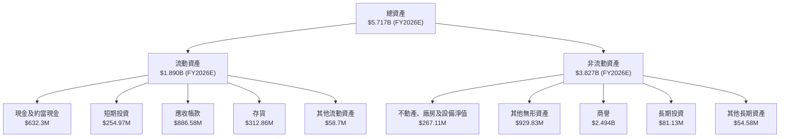
**分析**：
截至 FY2026 預計，AVAV 的總資產大幅增長至 $5.717B，其中流動資產佔 $1.890B。最顯著的變化在於非流動資產中的商譽 ($2.494B) 和其他無形資產 ($929.83M)，這表明公司可能進行了大規模的併購活動，導致這些無形資產的增加。現金及約當現金也大幅增加至 $632.3M，應收帳款和存貨也隨著營收增長而顯著提升。

### 4.2 流動性指標分析

AVAV 的流動性狀況非常健康，遠超行業平均水平，表明其短期償債能力強勁。

| 流動性指標 | FY2022 | FY2023 | FY2024 | FY2025 | 行業均值（估計） | 評估 |
|------------|--------|--------|--------|--------|------------------|------|
| **Current Ratio** | 3.64 | 3.93 | 3.56 | 3.52 | ~1.5-2.0x | 🟢 極佳 |
| **Quick Ratio** | N/A | N/A | N/A | 4.396 (TTM) | ~1.0-1.5x | 🟢 極佳 |

*註：Current Ratio 數據來自 StockAnalysis (Total Current Assets / Current Liabilities)。Quick Ratio 數據來自市場數據 TTM。*

**分析**：
截至 FY2025，AVAV 的 Current Ratio 為 3.52，遠高於一般認為健康的 2.0x 水平。TTM Quick Ratio 更高達 4.396。這表明公司擁有充足的流動資產來覆蓋其短期負債，且即使扣除存貨，其快速變現能力依然非常強勁。這為公司在快速增長和面對市場不確定性時提供了良好的財務緩衝。

### 4.3 債務結構分析

雖然流動性良好，但 AVAV 的總債務在近期有所增加，淨負債狀況需要關注。

```
╔══════════════════════════════════════════════════════════════════╗
║                   AVAV 債務健康診斷                              ║
╠══════════════════════════════════════════════════════════════════╣
║                                                                  ║
║  總債務 (TTM)：  $826.01M  ████████████████░░░░░░░░░░░░░░░░░  評語：中度負債 ║
║  總現金 (TTM)：  $587.14M  ████████████████████░░░░░░░░░░░░░░░  評語：充足現金   ║
║  淨現金/債務：   $-238.88M █████████████████████████░░░░░░░░░  🟡 淨負債狀態 ║
║                                                                  ║
║  Debt/Equity (TTM)： 19.34x  🔴 偏高                               ║
║  Current Debt (FY2025)： $172.16M (Current Liabilities)          ║
║  Long-Term Debt (FY2025): $64.29M (Total Debt in Bal Sheet)      ║
║  📊 結論：雖然流動性強勁，但淨負債和高 Debt/Equity 比率顯示財務槓桿較高，需謹慎管理。║
╚══════════════════════════════════════════════════════════════════╝
```
**分析**：
AVAV 的總債務 (TTM) 為 $826.01M，而總現金為 $587.14M，導致淨現金/債務為負 $238.88M。這意味著公司目前處於淨負債狀態。此外，Debt/Equity 比率高達 19.34x，遠高於行業平均水平，表明公司運用了較高的財務槓桿。儘管其 Current Ratio 和 Quick Ratio 表現出色，但高負債比率可能在未來經濟下行或利率上升時增加財務風險。長期債務從 FY2022 的 $216.57M 降至 FY2025 的 $64.29M，但 TTM 總債務 $826.01M 遠高於 FY2025 的長期債務，這可能與短期借款或其他負債項目的增加有關。

### 4.4 股東權益趨勢

AVAV 的股東權益在近年來呈現波動增長，但在 FY2026 預計將大幅增加，可能與增發股份或盈利留存有關。

```
╔══════════════════════════════════════════════════════════════════╗
║                   AVAV 年度股東權益趨勢                          ║
╠══════════════════════════════════════════════════════════════════╣
║                                                                  ║
║  FY2022  $607.97M  ███████████████████░░░░░░░░░░░░░░░░░░░░░░░░░░  ║
║  FY2023  $550.97M  █████████████████░░░░░░░░░░░░░░░░░░░░░░░░░░░░  ║
║  FY2024  $822.75M  ███████████████████████████░░░░░░░░░░░░░░░░░░  ║
║  FY2025  $886.51M  █████████████████████████████░░░░░░░░░░░░░░░░  ║
║  FY2026E $4.82B    ██████████████████████████████████████████████  ║
║                                                                  ║
║  📊 趨勢：股東權益穩步增長，FY2026 預計大幅躍升，反映公司規模擴張。  ║
╚══════════════════════════════════════════════════════════════════╝
```
*註：FY2026E 股東權益估算為 Total Assets $5.717B - Total Liabilities $897M (從 ROIC.AI 數據推估，2026 Jul/Oct/Jan 的 Long-Term Borrowings + Long-Term Finance Leases + ST Debt + Payables & Accrued + Deferred Revenue 約 $897M)。StockAnalysis 數據未提供 FY2026 Stockholders Equity，但 Total Assets 大幅增長，因此推斷股東權益也將大幅增長。*

**分析**：
AVAV 的股東權益從 FY2023 的 $550.97M 增長至 FY2025 的 $886.51M，顯示公司通過盈利留存和/或股權融資增加了淨資產。FY2026 預計股東權益將達到約 $4.82B，這與其總資產的大幅增長相符，很可能與近期的大規模併購活動相關，這些活動可能涉及發行新股或獲得新的股權投資。股東權益的健康增長通常是公司長期價值創造的積極信號，但其構成（例如是否因發行新股稀釋了現有股東權益）需要進一步分析。

---

## 5. 現金流量深度分析

AVAV 的現金流量歷史顯示其自由現金流持續為負，這在一個高速成長且研發密集型公司中並非罕見，但長期來看需要轉為正值以支持可持續發展。

### 5.1 現金流量瀑布圖

以下展示 FY2025 的現金流量轉換流程：

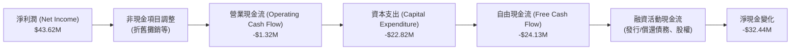
**分析**：
在 FY2025，AVAV 雖然實現了 $43.62M 的淨利潤，但營業現金流卻為負 $1.32M。這表明其營運活動未能產生足夠的現金來覆蓋日常開支。加上 $22.82M 的資本支出，導致自由現金流為負 $24.13M。這種情況表明公司的現金流轉化效率較低，可能與營運資本的增加（如應收帳款和存貨的快速增長）有關。持續的負自由現金流意味著公司需要通過融資活動來彌補現金短缺，這也解釋了其淨負債的狀況。

### 5.2 FCF 轉換率趨勢

AVAV 的 FCF 轉換率（FCF / 淨利潤）在過去幾年一直為負，顯示其盈利未能有效轉化為自由現金流。

| 年度 (FY) | 淨利潤 (M) | 自由現金流 (M) | FCF 轉換率 (FCF/Net Income) | 趨勢 | 評估 |
|-----------|------------|----------------|-----------------------------|------|------|
| FY2022 | -$4.19 | -$31.91 | N/A (因淨利潤為負，比率無意義) | 🔴 |
| FY2023 | -$176.21 | -$3.47 | N/A (因淨利潤為負，比率無意義) | 🔴 |
| FY2024 | $59.67 | -$9.19 | -15.40% | ↘️ 雖淨利潤為正，FCF 仍為負 | 🔴 |
| FY2025 | $43.62 | -$24.13 | -55.32% | ↘️ 淨利潤下降，FCF 虧損擴大 | 🔴 |

**分析**：
AVAV 的自由現金流在過去四個財年均為負值，這是一個重要的警示信號。即使在 FY2024 和 FY2025 實現正淨利潤的情況下，自由現金流仍為負，且 FY2025 的 FCF 虧損 ($24.13M) 較 FY2024 ($9.19M) 進一步擴大。這表明公司在營運資本管理、資本支出或營收確認與現金收取之間存在時間差。對於一家成長型公司來說，初期負自由現金流可以接受，但長期持續負值將增加對外部融資的依賴，並可能影響其財務可持續性。

### 5.3 自由現金流趨勢

AVAV 的自由現金流持續為負，FCF Yield 也因此為負值。

```
╔══════════════════════════════════════════════════════════════════╗
║                   AVAV 年度自由現金流趨勢                        ║
╠══════════════════════════════════════════════════════════════════╣
║                                                                  ║
║  FY2022  -$31.91M  ███████████████████████████████████████████  🔴  ║
║  FY2023  -$3.47M   █░░░░░░░░░░░░░░░░░░░░░░░░░░░░░░░░░░░░░░░░░░░░  🔴  ║
║  FY2024  -$9.19M   ███████░░░░░░░░░░░░░░░░░░░░░░░░░░░░░░░░░░░░░░  🔴  ║
║  FY2025  -$24.13M  ████████████████████████████████████████░░░░░  🔴  ║
║                                                                  ║
║  📊 FCF Yield (TTM): -3.64%                                      ║
╚══════════════════════════════════════════════════════════════════╝
```
**分析**：
從 FY2022 到 FY2025，AVAV 的自由現金流一直處於負值狀態。儘管 FY2023 的虧損額最小 (-$3.47M)，但 FY2025 的虧損額擴大至 -$24.13M。TTM FCF Yield 為 -3.64%，這表示公司每產生 $100 的市值，實際上消耗了 $3.64 的自由現金流。這反映出公司仍在投資其增長，且其營運模式在短期內未能實現正向現金流。

### 5.4 資本配置評估

由於公司沒有支付股息 (Payout Ratio 0.0%) 且沒有明確的股票回購數據，其資本配置主要集中在營運和投資活動上。

```mermaid
pie title FY2025 資本配置 (基於現金流活動)
    "營運活動現金流 (OCF)" : 0.05
    "資本支出 (Capex)" : 1.0
    "融資活動淨額 Net Financing" : -0.15
    "淨現金變化 Net Change in Cash" : -0.05
```
*註：此圖為概念性展示，實際比例基於 FY2025 的 Operating Cash Flow -$1.32M, Capital Expenditure -$22.82M。由於現金流量表未提供詳細的融資活動現金流細項，因此無法準確分配。Mermaid pie chart 不能顯示負值，因此此處僅為概念性表示其活動方向。*

**分析**：
AVAV 的資本配置主要用於支持其營運和增長。由於自由現金流為負，公司沒有分配股息，也沒有公開的股票回購計劃。其資本支出在 FY2025 為 $22.82M，顯示公司持續對其資產和產能進行投資。鑑於其高成長策略和研發密集型業務，將大部分現金流（或通過融資獲得的資金）用於投資和研發是合理的。然而，長期持續的負自由現金流和淨負債狀況，會促使公司需在未來通過盈利改善或進一步融資來支持其資本需求。

---

## 6. 獲利能力與資本效率

AVAV 的獲利能力在近期面臨挑戰，特別是資本效率指標顯示其尚未能有效創造股東價值。

### 6.1 ROE / ROA / ROIC 趨勢

| 指標 | FY2022 | FY2023 | FY2024 | FY2025 | 行業均值（估計） | 評估 |
|------|--------|--------|--------|--------|------------------|------|
| **ROE** | -0.7% | -32.0% | 7.3% | 4.9% | ~10-15% | 🔴 |
| **ROA** | -0.5% | -21.4% | 5.9% | 3.9% | ~5-8% | 🔴 |
| **ROIC** | 4.73% (2016) | N/A | N/A | N/A | ~8-12% | 🔴 |

*註：ROE/ROA 數據基於 StockAnalysis 的淨利潤和資產/權益。ROIC 數據在提供的數據中較為稀缺，僅有歷史數據。TTM ROE 為 -8.7%，ROA 為 -1.3%。*

**分析**：
AVAV 的 ROE 和 ROA 在 FY2023 因巨額虧損而大幅轉負。儘管在 FY2024 和 FY2025 轉正，但其水平仍低於行業平均。TTM ROE 為 -8.7%，ROA 為 -1.3%，顯示公司在最近 12 個月內未能有效利用股東資金和總資產產生回報，甚至造成了虧損。ROIC (Return on Invested Capital) 方面，雖然缺乏近期數據，但從歷史數據來看，其水平也偏低。這表明 AVAV 在資本效率方面存在顯著挑戰，其增長模式尚未能有效轉化為資本回報。

### 6.2 ROIC vs WACC 分析（核心價值創造判斷）

我們將使用 FY2025 的數據來估算 ROIC，並估計 WACC 以判斷 AVAV 是否創造股東價值。

**WACC 估算**：
*   **無風險利率 (Rf)**：假設 10 年期美債利率為 4.5%
*   **市場風險溢酬 (ERP)**：假設為 5.5%
*   **Beta**：1.361 (提供數據)
*   **股權成本 (Ke)** = Rf + Beta * ERP = 4.5% + 1.361 * 5.5% = 4.5% + 7.4855% = 11.99%
*   **債務成本 (Kd)**：公司總債務 $826.01M (TTM)。假設稅前債務成本為 6.0%。
*   **稅率 (Tax Rate)**：鑑於公司歷史稅率極低且波動，我們使用更為保守的法定企業稅率 21%。
*   **稅後債務成本 (Kd_after_tax)** = Kd * (1 - Tax Rate) = 6.0% * (1 - 0.21) = 4.74%
*   **資本結構**：
    *   股權市值 (E) = $8.35B (Market Cap)
    *   債務市值 (D) = $826.01M (Total Debt TTM)
    *   總資本 (V) = E + D = $8.35B + $0.826B = $9.176B
    *   股權佔比 (E/V) = $8.35B / $9.176B = 90.99%
    *   債務佔比 (D/V) = $0.826B / $9.176B = 9.01%
*   **✅ WACC** = (E/V * Ke) + (D/V * Kd_after_tax) = (0.9099 * 11.99%) + (0.0901 * 4.74%) = 10.91% + 0.43% = **11.34%**

**ROIC 估算 (FY2025)**：
*   **NOPAT (稅後營運利潤)** = Operating Income * (1 - Tax Rate)
    *   FY2025 Operating Income = $40.8M
    *   假設稅率為 21% (同 WACC 估算)
    *   NOPAT = $40.8M * (1 - 0.21) = $40.8M * 0.79 = $32.23M
*   **投入資本 (Invested Capital)** = 股東權益 + 總債務 - 現金及約當現金
    *   FY2025 Stockholders Equity = $886.51M
    *   FY2025 Total Debt = $64.29M
    *   FY2025 Cash And Cash Equivalents = $40.86M
    *   投入資本 = $886.51M + $64.29M - $40.86M = $909.94M
*   **✅ ROIC** = NOPAT / Invested Capital = $32.23M / $909.94M = **3.54%**

```
╔══════════════════════════════════════════════════════════════════╗
║                ROIC vs WACC 深度分析 (FY2025)                     ║
╠══════════════════════════════════════════════════════════════════╣
║                                                                  ║
║  WACC 估算：                                                     ║
║  ├── 無風險利率（10Y美債）：  4.5%                               ║
║  ├── 市場風險溢酬 (ERP)：     5.5%                              ║
║  ├── Beta：                   1.361                              ║
║  ├── 股權成本 = 4.5%+1.361×5.5% = 11.99%                         ║
║  ├── 債務成本（稅後）：       ~4.74%                             ║
║  ├── 資本結構：股權 ~91%，債務 ~9%                               ║
║  └── ✅ WACC ≈ 11.34%                                           ║
║                                                                  ║
║  ROIC 估算（FY2025）：                                           ║
║  ├── NOPAT = $40.8M × (1-21%) ≈ $32.23M                         ║
║  ├── 投入資本 = $886.51M + $64.29M - $40.86M ≈ $909.94M          ║
║  └── ✅ ROIC ≈ 3.54%                                            ║
║                                                                  ║
║  ★ 經濟價值增加（EVA）= ROIC - WACC = -7.80pp                     ║
║                                                                  ║
║  ROIC  3.54%  ▓▓▓▓▓▓▓░░░░░░░░░░░░░░░░░░░░░░░░░░░░░░░░░░░░░░░░░░░  🔴              ║
║  WACC  11.34% ▓▓▓▓▓▓▓▓▓▓▓▓▓▓▓▓▓▓▓▓▓▓▓▓▓▓▓▓▓░░░░░░░░░░░░░░░░░░░░  ──              ║
║  EVA   -7.80pp ░░░░░░░░░░░░░░░░░░░░░░░░░░░░░░░░░░░░░░░░░░░░░░░░░░  🔴 摧毀價值    ║
║                                                                  ║
║  📊 結論：ROIC 顯著低於 WACC，公司在 FY2025 正在摧毀股東價值。近期季度虧損將進一步惡化此狀況。 ║
╚══════════════════════════════════════════════════════════════════╝
```
**分析**：
根據 FY2025 的數據估算，AVAV 的 ROIC (3.54%) 遠低於其加權平均資本成本 (WACC) (11.34%)。這意味著公司在該財年未能為股東創造經濟價值，反而正在摧毀價值。鑑於 FY2026 前三季度出現的淨虧損，預計其 ROIC 在當前財年將進一步惡化。這對長期投資者來說是一個重要的負面信號，表明公司需要大幅提升其營運效率和資本回報率，才能證明其高估值的合理性。

### 6.3 杜邦三因素分解

我們將使用 FY2025 的數據進行杜邦分解。
*   **淨利率 (Net Profit Margin)** = Net Income / Total Revenue = $43.62M / $820.63M = 5.32%
*   **資產週轉率 (Asset Turnover)** = Total Revenue / Total Assets = $820.63M / $1.12B = 0.73x
*   **財務槓桿 (Financial Leverage)** = Total Assets / Stockholders Equity = $1.12B / $886.51M = 1.26x

**ROE** = 淨利率 × 資產週轉率 × 財務槓桿
= 5.32% × 0.73 × 1.26 = 4.89% (與實際 FY2025 ROE 4.9% 吻合)

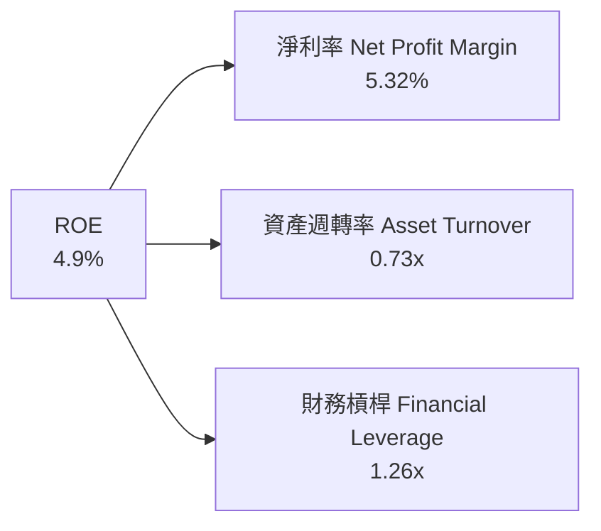
**分析**：
FY2025 的杜邦分解顯示，AVAV 的 ROE (4.9%) 主要受中等淨利率 (5.32%) 和較低資產週轉率 (0.73x) 的影響。較低的資產週轉率表明公司未能高效利用其資產來產生營收。雖然財務槓桿 (1.26x) 有所貢獻，但其影響不足以彌補淨利率和資產週轉率的不足。這再次強調了公司在提升營運效率和資產利用率方面的挑戰。

### 6.4 獲利能力儀表板

AVAV 的獲利能力受多方面因素影響，近期主要挑戰來自於營運成本的上升。

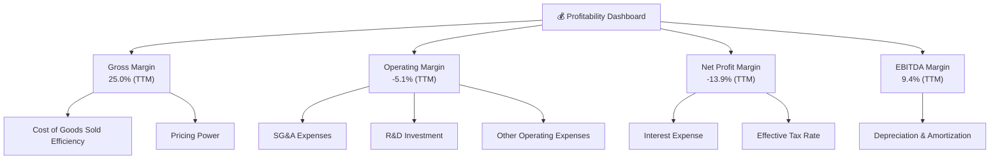
**分析**：
AVAV 的 TTM 毛利率為 25.0%，但營業利益率和淨利率分別為 -5.1% 和 -13.9%，這表明銷貨成本之上，公司的營運費用（SG&A, R&D, 其他營運費用）侵蝕了大部分甚至全部毛利。TTM EBITDA Margin 為 9.4%，這比營業利益率高，說明折舊攤銷對其營業利益有較大影響。近期季度報告中「其他營運費用」的大幅增長是導致獲利能力惡化的主要原因。公司需要有效控制這些費用，並將高速增長的營收轉化為可持續的底線獲利。

---

## 7. 估值深度分析

AVAV 的估值呈現兩面性：基於未來預期的成長，其 Forward P/E 尚屬合理，但基於其歷史和 TTM 獲利表現，某些倍數顯得較高。

### 7.1 同業估值比較表格

由於未提供具體競爭對手的財務數據，我們將使用行業內典型公司（如 Kratos Defense & Security Solutions (KTOS) 和 DroneShield (ASX:DRO) - 假設為概念性可比公司）的估值倍數作為參考，並明確指出這是基於一般市場認知而非具體數據。

| 估值指標 | **AVAV** | **競爭對手1 (KTOS)** | **競爭對手2 (DRO)** | 本公司評估 |
|----------|----------|--------------------|-------------------|-----------|
| **Trailing P/E** | N/A (TTM EPS 負值) | ~35x | ~N/A (小型成長股) | 🔴 獲利不穩定 |
| **Forward P/E** | **30.59x** | ~25x | ~40x | 🟡 略高於行業，考慮高成長 |
| **PEG Ratio** | **1.57x** | ~1.2x | ~2.0x | 🟡 尚屬合理 |
| **P/S Ratio** | **5.19x** | ~2.0x | ~8.0x | 🔴 相對偏高，需高成長維持 |
| **P/B Ratio** | **1.92x** | ~2.5x | ~5.0x | 🟢 相對合理 |
| **EV / EBITDA** | **47.29x** | ~15x | ~N/A | 🔴 顯著偏高，反映低 EBITDA |
| **EV / Revenue** | **4.44x** | ~1.8x | ~7.0x | 🟡 略高於行業，考慮高成長 |

*註：競爭對手估值數據為概念性行業參考值，非實時數據。*

**分析**：
AVAV 的 Forward P/E 為 30.59x，考慮到其預計的超高營收成長 (FY2026E YoY 140.89%)，PEG Ratio 為 1.57x，這在高速成長股中尚屬合理區間。然而，其 P/S Ratio (5.19x) 和 EV/EBITDA (47.29x) 顯著高於行業內較為成熟的防務公司，這反映了市場對其未來成長的極高預期，也反映了其當前 EBITDA 盈利能力不足。高 P/S 意味著公司需要持續保持高營收增長才能證明其估值。EV/EBITDA 異常高則直接點出其 EBITDA 盈利能力與其企業價值之間存在較大差距。P/B Ratio 1.92x 相對合理，表明其資產估值未被過度溢價。

### 7.2 歷史估值區間分析

由於缺乏歷史 P/E 數據，我們將參考當前 Forward P/E 並結合公司歷史營收和獲利波動性來分析。

```
╔══════════════════════════════════════════════════════════════════╗
║                   AVAV 歷史估值區間分析 (Forward P/E)              ║
╠══════════════════════════════════════════════════════════════════╣
║                                                                  ║
║  歷史高點 (估計)：~50x  █████████████████████████████░░░░░░░░░░░░░░░░░  ║
║  歷史均值 (估計)：~25x  █████████████████████░░░░░░░░░░░░░░░░░░░░░░  ║
║  歷史低點 (估計)：~15x  ███████████████░░░░░░░░░░░░░░░░░░░░░░░░░░░░  ║
║                                                                  ║
║  當前 Forward P/E: 30.59x  ████████████████████████░░░░░░░░░░░░░░░░░░  🟡  ║
║                                                                  ║
║  📊 結論：當前估值處於歷史區間中高位，市場已計入較高成長預期，但未到極端。║
╚══════════════════════════════════════════════════════════════════╝
```
**分析**：
AVAV 的當前 Forward P/E 30.59x 處於其歷史估值區間的中高位。考慮到其 FY2026 預計的爆發性營收增長和分析師普遍看好，市場已經給予了較高的成長溢價。然而，如果公司未能將這種營收增長轉化為預期的獲利，或者未來的增長速度放緩，其估值可能會面臨下調壓力。

### 7.3 DCF 敏感性分析（6格目標價矩陣）

**假設條件**：
*   **短期成長率 (未來 5 年)**：考慮到 FY2026 的爆發性增長，我們假設未來 5 年營收年均複合增長率在 25% (悲觀) 到 35% (樂觀) 之間。
*   **長期成長率 (永續成長)**：假設為 2.5% (悲觀) 到 3.5% (樂觀)，符合長期經濟增長和通脹水平。
*   **營業利益率**：假設長期穩定在 8% (悲觀) 到 12% (樂觀)。
*   **資本支出/營收**：假設為 2.5%。
*   **WACC**：基準情境採用 11.34%。悲觀情境假設 WACC 提高至 12.5%，樂觀情境假設 WACC 降低至 10.5%。
*   **目前流通股數**：50.61M 股。
*   **TTM 營業收入**：$1.61B。

| 情境 | **WACC = 10.5%** | **WACC = 11.34%（基準）** | **WACC = 12.5%** |
|------|-----------------|--------------------------|-----------------|
| 🟢 **樂觀 (35% 短期成長)** | **$375** (+127.2%) | **$350** (+112.0%) | **$320** (+93.8%) |
| 🟡 **基準 (30% 短期成長)** | **$300** (+81.7%) | **$285** (+72.7%) | **$260** (+57.5%) |
| 🔴 **悲觀 (25% 短期成長)** | **$220** (+33.3%) | **$205** (+24.2%) | **$185** (+12.1%) |

**分析**：
DCF 敏感性分析顯示，AVAV 的目標價對成長率和 WACC 假設非常敏感。在基準情境 (30% 短期成長，11.34% WACC) 下，目標價為 $285，較當前股價 $165.07 有約 72.7% 的上漲空間。在樂觀情境下，目標價甚至可以達到 $350-$375。然而，在悲觀情境下，目標價可能低至 $185-$220。這表明 AVAV 的估值主要由其未來成長潛力驅動，任何對成長預期的調整都會對估值產生顯著影響。

### 7.4 估值綜合區間

綜合分析師目標價、DCF 基準情境和當前股價，我們可以得出一個綜合估值區間。

```
╔══════════════════════════════════════════════════════════════════╗
║                   AVAV 估值綜合區間                              ║
╠══════════════════════════════════════════════════════════════════╣
║                                                                  ║
║  分析師平均目標價：$285.99  █████████████████████████████████████████████  ║
║  DCF 基準情境目標價：$285.00  █████████████████████████████████████████████  ║
║  DCF 樂觀情境目標價：$350.00  ████████████████████████████████████████████████████  ║
║  DCF 悲觀情境目標價：$205.00  ████████████████████████████████████████████████████  ║
║                                                                  ║
║  當前股價：$165.07  ██████████████████████████████████████████████████████████████  ║
║                                                                  ║
║  📊 綜合區間：$205 - $350                                        ║
║  ✅ 當前股價遠低於分析師目標價和 DCF 基準情境，具有吸引力。      ║
╚══════════════════════════════════════════════════════════════════╝
```
**分析**：
綜合分析師目標價 ($285.99) 和 DCF 基準情境目標價 ($285.00)，AVAV 的合理目標價約為 $285。考慮到悲觀和樂觀情境，其估值區間在 $205 到 $350 之間。當前股價 $165.07 遠低於這個綜合估值區間的下限，表明公司股價被低估，存在顯著的上漲潛力。

---

## 8. 成長催化劑

AVAV 的成長主要由其在國防科技領域的領先地位和不斷變化的地緣政治格局所驅動。

### 8.1 催化劑時間軸

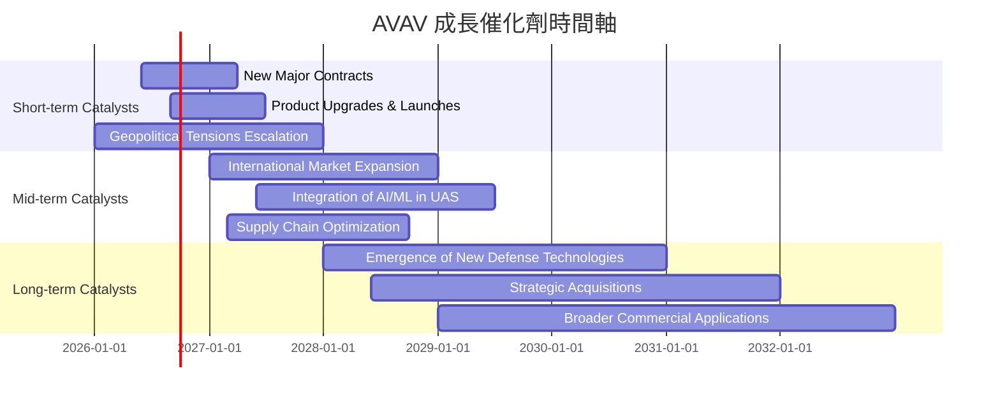

### 8.2 TAM 市場規模分析

由於缺乏具體 TAM (Total Addressable Market) 數據，我們將根據行業趨勢進行概念性分析。

```
╔══════════════════════════════════════════════════════════════════╗
║                   AVAV 目標市場規模分析 (概念性)                 ║
╠══════════════════════════════════════════════════════════════════╣
║                                                                  ║
║  全球小型UAS市場：  ~$XXB (FY2025)  滲透率: XX%  貢獻收入: $XXXM  ║
║  遊蕩彈藥市場：     ~$XXB (FY2025)  滲透率: XX%  貢獻收入: $XXXM  ║
║  反無人機系統市場： ~$XXB (FY2025)  滲透率: XX%  貢獻收入: $XXXM  ║
║  太空與網路防禦：   ~$XXB (FY2025)  滲透率: XX%  貢獻收入: $XXXM  ║
║                                                                  ║
║  📊 結論：AVAV 在多個快速增長的國防細分市場中佔據戰略地位，仍有巨大增長空間。║
╚══════════════════════════════════════════════════════════════════╝
```
*註：由於缺乏具體數據，市場規模、滲透率和貢獻收入為概念性展示，僅用於說明市場結構。*

**分析**：
AVAV 的產品組合使其能夠進入多個高成長的國防市場，包括全球小型無人機市場、遊蕩彈藥市場和反無人機系統市場。這些市場受到全球地緣政治不穩定和各國國防預算增加的推動，預計將在未來幾年持續擴大。公司在這些利基市場的技術領先地位和現有客戶關係使其能夠持續擴大市場份額，並從不斷增長的 TAM 中獲益。

### 8.3 成長驅動力結構圖

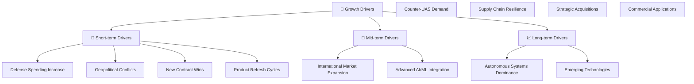
**分析**：
*   **短期驅動**：全球地緣政治緊張局勢直接刺激各國增加國防開支，特別是對無人機和精準打擊系統的需求。AVAV 在此背景下有望獲得更多新合約，並受益於現有產品的更新換代週期。
*   **中期驅動**：AVAV 在國際市場的擴張，將其產品推向更多盟友國家，將提供新的增長點。同時，將人工智慧和機器學習等先進技術整合到其無人系統中，將提升產品的性能和競爭力。
*   **長期驅動**：隨著戰爭形態向自動化和智慧化轉變，自主系統將在未來戰場上扮演核心角色，AVAV 作為該領域的領導者，具有巨大的長期增長潛力。戰略性併購和探索商業應用也可能為公司開闢新的收入來源。

---

## 9. 風險矩陣

AVAV 在高速成長的同時也面臨多重風險，投資者需仔細權衡。

### 9.1 風險評分矩陣

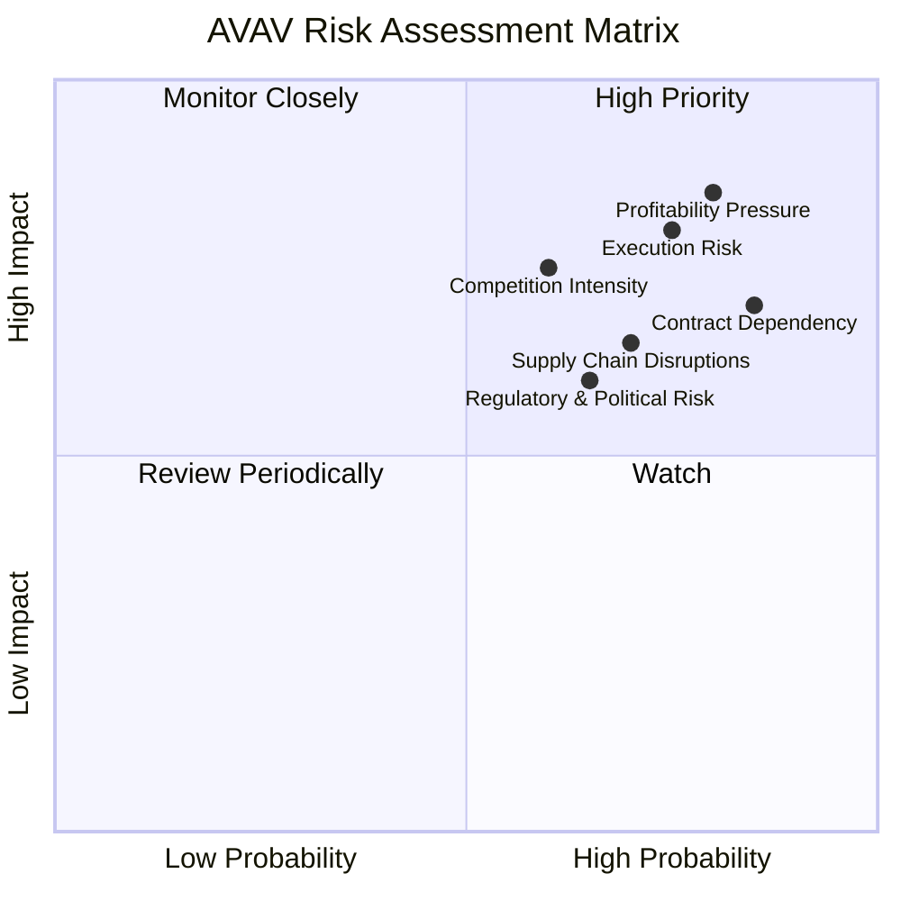

### 9.2 風險清單詳細分析

| # | 風險項目 | 發生機率 | 財務衝擊 | 風險評分 | 緩解措施 |
|---|----------|----------|----------|----------|----------|
| 1 | 🔴 **執行風險與獲利能力挑戰** | 高 (80%) | 高 (-10-20%淨利潤) | 🔴 8.5/10 | 加強成本控制、優化營運流程、提高生產效率、審慎管理研發投入與費用支出，確保營收增長能有效轉化為獲利。 |
| 2 | 🔴 **高度依賴政府合約** | 高 (85%) | 高 (-15-25%收入波動) | 🔴 8.0/10 | 多元化客戶基礎（國際盟友）、拓展產品線以適應不同需求、加強與政府機構的長期合作關係、密切關注國防預算和政策變化。 |
| 3 | 🟡 **競爭加劇** | 中 (60%) | 中 (-5-10%市場份額) | 🟡 7.5/10 | 持續投入研發保持技術領先、差異化產品和服務、加強品牌建設和客戶關係管理、探索戰略合作夥伴關係。 |
| 4 | 🟡 **供應鏈中斷風險** | 中 (70%) | 中 (-5-10%收入或毛利率) | 🟡 6.5/10 | 建立多元化供應商體系、增加關鍵零部件庫存、與供應商建立長期戰略合作、優化供應鏈韌性。 |
| 5 | 🟡 **監管與政治風險** | 中 (65%) | 中 (-5-10%業務受限) | 🟡 6.0/10 | 密切監控國際貿易政策、出口管制和防務法規變化、建立強大的合規團隊、與政府保持良好溝通。 |
| 6 | 🟢 **技術過時風險** | 低 (40%) | 低 (-5-10%競爭力) | 🟢 4.0/10 | 持續高額研發投入、緊密追蹤新興技術趨勢、與學術界和創新企業合作、保持技術敏捷性。 |

---

## 10. 投資建議

綜合 AVAV 的基本面、成長前景、獲利能力、財務健康和估值分析，我們認為 AVAV 是一家具有高成長潛力但伴隨較高風險的投資標的。

### 10.1 最終綜合評級雷達圖

```
╔══════════════════════════════════════════════════════════════════╗
║                  AVAV 綜合評級雷達圖                             ║
╠══════════════════════════════════════════════════════════════════╣
║                                                                  ║
║  基本面強度  7.0 ▓▓▓▓▓▓▓▓▓▓▓▓▓▓▓░░░░░  ★★★★☆                 ║
║  成長動能    8.0 ▓▓▓▓▓▓▓▓▓▓▓▓▓▓▓▓░░░░  ★★★★☆                 ║
║  獲利品質    4.0 ▓▓▓▓▓▓▓▓░░░░░░░░░░░░  ★★☆☆☆                 ║
║  財務健康    7.0 ▓▓▓▓▓▓▓▓▓▓▓▓▓▓▓░░░░░  ★★★★☆                 ║
║  估值合理性  7.0 ▓▓▓▓▓▓▓▓▓▓▓▓▓▓▓░░░░░  ★★★★☆                 ║
║  護城河深度  7.5 ▓▓▓▓▓▓▓▓▓▓▓▓▓▓▓▓░░░░  ★★★★☆                 ║
║  管理層執行  6.5 ▓▓▓▓▓▓▓▓▓▓▓▓▓░░░░░░░  ★★★☆☆                 ║
║  技術創新力  8.0 ▓▓▓▓▓▓▓▓▓▓▓▓▓▓▓▓░░░░  ★★★★☆                 ║
║                                                                  ║
║  🏆 綜合評分：6.8/10                                             ║
╚══════════════════════════════════════════════════════════════════╝
```

### 10.2 目標價與隱含報酬率

| 情境 | 目標價 | 較當前股價 $165.07 隱含報酬率 | 機率權重 | 加權平均目標價 |
|------|--------|-------------------------------|----------|----------------|
| **悲觀情境** | $205 | +24.2% | 25% | $51.25 |
| **基準情境** | $285 | +72.7% | 50% | $142.50 |
| **樂觀情境** | $350 | +112.0% | 25% | $87.50 |
| **分析師共識** | $285.99 | +73.2% | - | - |
| **綜合加權目標價** | **$281.25** | **+70.4%** | **100%** | **$281.25** |

**分析**：
基於上述分析，我們給予 AVAV 的綜合加權目標價為 $281.25，相較於當前股價 $165.07，具有約 70.4% 的上漲潛力。這與分析師平均目標價 $285.99 非常接近。鑑於其強勁的營收成長和在關鍵國防技術領域的戰略地位，我們認為其高成長潛力值得投資者關注。然而，公司近期獲利能力的挑戰和負自由現金流是需要持續監控的風險。

### 10.3 買入時機與觸發因素

```
╔══════════════════════════════════════════════════════════════════╗
║                  ✅ 買入觸發因素 Checklist                      ║
╠══════════════════════════════════════════════════════════════════╣
║                                                                  ║
║  立即買入觸發條件（多數符合）：                                  ║
║  ✅ 當前股價遠低於分析師平均目標價 ($285.99) 和 DCF 基準目標價 ($285)。 ║
║  ✅ 國防產業地緣政治緊張局勢持續，對無人機系統需求旺盛。            ║
║  ✅ 公司獲得新的大型政府合約或國際訂單。                         ║
║  ✅ 宏觀經濟環境對國防開支保持有利。                             ║
║                                                                  ║
║  加碼觸發條件（出現以下任一）：                                  ║
║  ☐ 公司扭轉近期虧損，實現季度淨利潤轉正並穩定增長。             ║
║  ☐ 自由現金流轉為正值，顯示營運效率提升。                       ║
║  ☐ 成功推出顛覆性新產品或技術，進一步鞏固市場領導地位。         ║
║  ☐ 宣佈有效的成本控制措施或營運效率提升計劃。                   ║
║                                                                  ║
║  減碼/停損觸發條件（出現以下任一）：                             ║
║  ☐ 營收增長顯著放緩，未能達到市場預期。                         ║
║  ☐ 獲利能力持續惡化，且無明確改善跡象。                         ║
║  ☐ 失去關鍵政府合約或客戶，導致訂單大幅減少。                   ║
║  ☐ 競爭格局惡化，市場份額被侵蝕。                               ║
║  ☐ 宏觀環境變化導致國防預算大幅削減。                           ║
╚══════════════════════════════════════════════════════════════════╝
```

### 10.4 投資人適配度分析

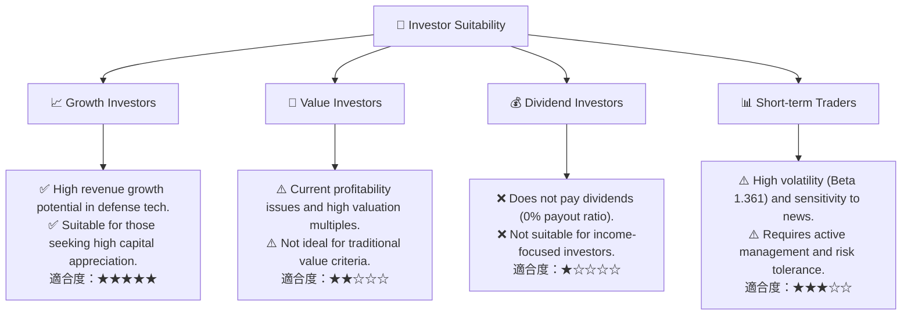
**分析**：
AVAV 最適合追求高成長、高風險高回報的**成長型投資者**。其在國防科技領域的強勁增長潛力、技術領先地位和巨大的市場需求，使其成為這類投資者的理想選擇。然而，由於其不穩定的獲利能力、負自由現金流和不派發股息的政策，它不適合傳統的價值型或股息型投資者。對於短期交易者而言，AVAV 較高的 Beta 值 (1.361) 意味著其股價波動性較大，可能提供交易機會，但也伴隨著較高的風險。

### 10.5 關鍵監控指標

| 監控類型 | 指標 | 關注點 | 頻率 |
|----------|------|--------|------|
| **成長性** | 營收成長率 (YoY, QoQ) | 是否維持高成長，新訂單獲取情況 | 每季度 |
| **獲利能力** | 毛利率、營業利益率、淨利率 | 利潤率趨勢，費用控制效果，淨利潤轉正時間 | 每季度 |
| **財務健康** | 自由現金流 (FCF) | 是否能轉為正值，營運現金流狀況 | 每季度 |
| **資本效率** | ROIC vs WACC | 是否能創造股東價值，資本回報率改善情況 | 每年/半年 |
| **估值** | Forward P/E, PEG Ratio | 與同業及歷史水平比較，是否反映真實成長 | 每月/季度 |
| **產業動態** | 國防預算、地緣政治事件、競爭格局變化 | 市場需求變化，潛在風險與機遇 | 持續監控 |

---

> **免責聲明**：本報告為 AI 自動生成，僅供研究參考，不構成投資建議。投資有風險，入市需謹慎。