# AVAV 基本面深度分析報告
> **報告日期**：2026-07-01 ｜ **語言**：繁體中文 ｜ **數據來源**：Yahoo Finance, Finviz, StockAnalysis, Roic.ai ｜ **分析師**：CFA 級機構研究

---

## 目錄

| # | 章節 | 核心結論 |
|---|------|----------|
| 1 | 執行摘要 | 評級：持有；目標價區間：$195 - $285 |
| 2 | 公司概覽與商業模式 | 專注於無人系統及防禦科技，具有技術護城河 |
| 3 | 損益表深度分析 | 營收強勁成長，但近期獲利能力顯著惡化 |
| 4 | 資產負債表分析 | 流動性良好，但負債有所增加，股東權益大幅擴張 |
| 5 | 現金流量深度分析 | 營運與自由現金流均為負值，資本支出增加 |
| 6 | 獲利能力與資本效率 | 獲利能力惡化，ROIC顯著低於WACC，價值創造面臨挑戰 |
| 7 | 估值深度分析 | 相較同業估值偏高，DCF顯示當前股價接近基準情境 |
| 8 | 成長催化劑 | 國防支出增加、新技術應用與國際擴張是主要驅動力 |
| 9 | 風險矩陣 | 執行風險、政府合約依賴、競爭加劇是主要挑戰 |
| 10 | 投資建議 | 建議持有，等待獲利能力改善與現金流轉正的明確信號 |

---

## 1. 執行摘要

### 1.1 核心評分儀表板

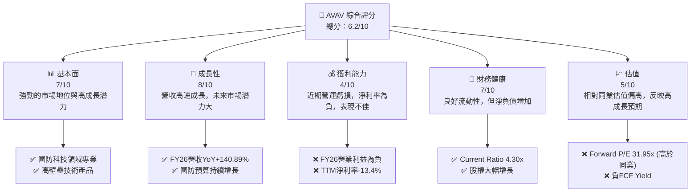

### 1.2 評分進度條視覺化

```
╔══════════════════════════════════════════════════════════════╗
║              AVAV 多維度評分儀表板 (1-10分)                ║
╠══════════════════════════════════════════════════════════════╣
║ 基本面強度  7.0 ▓▓▓▓▓▓▓▓▓▓▓▓▓▓░░░░░░  ★★★★☆           ║
║ 成長動能    8.0 ▓▓▓▓▓▓▓▓▓▓▓▓▓▓▓▓░░░░  ★★★★☆           ║
║ 獲利品質    4.0 ▓▓▓▓▓▓▓▓░░░░░░░░░░░░  ★★☆☆☆           ║
║ 財務健康    7.0 ▓▓▓▓▓▓▓▓▓▓▓▓▓▓░░░░░░  ★★★★☆           ║
║ 估值合理性  5.0 ▓▓▓▓▓▓▓▓▓▓░░░░░░░░░░  ★★★☆☆           ║
║ 護城河深度  7.5 ▓▓▓▓▓▓▓▓▓▓▓▓▓▓▓░░░░░  ★★★★☆           ║
║ 管理層執行  6.5 ▓▓▓▓▓▓▓▓▓▓▓▓▓░░░░░░░  ★★★☆☆           ║
║ 技術創新力  8.0 ▓▓▓▓▓▓▓▓▓▓▓▓▓▓▓▓░░░░  ★★★★☆           ║
╠══════════════════════════════════════════════════════════════╣
║ 綜合總分    6.2 ▓▓▓▓▓▓▓▓▓▓▓▓░░░░░░░░  🏆 持有評級           ║
╚══════════════════════════════════════════════════════════════╝
```

### 1.3 五大投資論點 + 三大核心風險

| 類型 | 項目 | 具體依據 | 信心度 |
|------|------|----------|--------|
| 🟢 **投資論點①** | **國防科技需求激增** | FY26營收達$1.98B，YoY成長140.89%，主要受全球地緣政治緊張及國防預算增加驅動，尤其在無人機系統(UAS)領域。 | 🟢 極高 |
| 🟢 **投資論點②** | **技術領先與創新** | 公司在小型與中型UAS、反UAS及Kinesis指揮控制軟體等領域具備核心技術，其產品被美國及國際政府廣泛採用。持續的R&D投入(FY26 $127.68M)確保其技術優勢。 | 🟢 極高 |
| 🟢 **投資論點③** | **政府合約穩定性** | 作為國防承包商，與政府機構的長期合約提供穩定的收入流。近期多個分析師將其評級為「買入」或「跑贏大盤」，反映市場對其業務前景的信心。 | 🟢 高 |
| 🟢 **投資論點④** | **市場擴張潛力** | 除美國本土市場外，國際市場亦是重要成長引擎。隨著更多國家意識到無人系統的重要性，AVAV的國際銷售有望持續增長。 | 🟡 中度 |
| 🟢 **投資論點⑤** | **資產負債表結構改善** | 股東權益從FY25的$886.51M大幅增長至FY26的$4.40B，顯示資本實力顯著增強，為未來擴張提供支持。 | 🟡 中度 |
| 🟡 **風險①** | **獲利能力持續惡化** | FY26營業利益為$-311M，淨利潤為$-265.12M，相較FY25的$40.8M與$43.62M顯著惡化。TTM淨利率為-13.4%，顯示成本控制及營運效率存在問題。 | 🔴 高衝擊 |
| 🔴 **風險②** | **現金流為負** | TTM營運現金流為$-78.40M，自由現金流為$-251.39M。若無法轉正，將對公司長期資金健康造成壓力，可能需要持續融資。 | 🔴 高衝擊 |
| 🔴 **風險③** | **估值偏高與股價波動** | Forward P/E達31.95x，在目前獲利能力不佳的情況下顯得昂貴。過去一年股價波動劇烈，52W高點$417.86，低點$135.20，表明市場對其前景存在不確定性。 | 🟡 中度 |

### 1.4 快速統計卡片

| 指標 | 公司實際值 (AVAV) | 行業均值 (航空航太與國防)* | S&P 500 均值* | 狀態 |
|------|--------------------|-----------------------------|----------------|------|
| 收入 YoY 成長 | **+133.3%** | ~10-15% | ~8-12% | 🟢 |
| 毛利率 | **25.3%** | ~25-35% | ~35-45% | 🟡 |
| 淨利率 | **-13.4%** | ~5-10% | ~8-15% | 🔴 |
| ROE | **-10.0%** | ~10-15% | ~12-18% | 🔴 |
| Forward P/E | **31.95x** | ~20-25x | ~22-28x | 🔴 |
| 債務/股權 | **0.19x** | ~0.3-0.6x | ~0.5-1.0x | 🟢 |
| Current Ratio | **4.30x** | ~1.5-2.5x | ~1.5-2.0x | 🟢 |

\* 註：行業及S&P 500均值為分析師根據市場普遍情況的估計值，僅供參考。

### 1.5 投資結論

```
╔══════════════════════════════════════════════════════════════════╗
║                    📊 投資結論摘要                               ║
╠══════════════════════════════════════════════════════════════════╣
║  評級：🟡 持有                                                   ║
║  當前股價：$172.44                                               ║
║  目標價區間：                                                    ║
║    悲觀情境：$195（+13.0%）                                      ║
║    基準情境：$245（+42.1%）  ← 12個月主要目標                      ║
║    樂觀情境：$285（+65.3%）                                      ║
║  投資評分：6.2/10                                                ║
║  適合投資人：看重高成長潛力、對國防科技產業有信心的長線投資者，  ║
║              但需容忍短期獲利波動及負現金流風險。                ║
╚══════════════════════════════════════════════════════════════════╝
```

---

## 2. 公司概覽與商業模式

AeroVironment, Inc. (AVAV) 是一家領先的國防科技供應商，專注於為美國及國際政府機構和企業設計、開發、生產、交付和支援一系列機器人系統及相關服務。公司在快速變化的國防和安全市場中佔據關鍵地位，特別是在無人機系統 (UAS) 和反無人機 (C-UAS) 領域。

### 2.1 業務結構與收入來源

AVAV 的業務主要分為兩個板塊：
*   **Autonomous Systems (自主系統)**：此板塊包括小型和中型無人機系統 (UAS)，以及 Kinesis 指揮控制軟體。這些產品在偵察、監視、目標識別和精確打擊等方面發揮關鍵作用。
*   **Space, Cyber and Directed Energy (太空、網路和定向能量)**：雖然具體收入佔比未詳細披露，但此板塊代表公司在更廣泛的國防科技領域的探索和佈局，可能涉及先進的感測器、通訊和防禦技術。

公司總體營收在 FY26 達到 $1.98B，YoY 增長 140.89%，顯示出強勁的市場需求和業務擴張。由於未提供各業務板塊的具體收入拆分，我們將其視為整體國防科技解決方案的提供者。

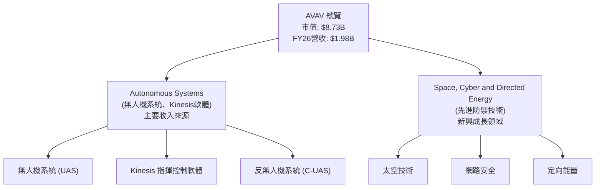

### 2.2 市場份額

由於 AVAV 業務的專業性及國防產業數據的敏感性，具體的市場份額數據不易獲取。然而，根據其在小型 UAS 領域的領先地位和不斷擴大的產品組合，可以推斷其在特定利基市場中佔有重要份額。在全球無人機和反無人機市場中，AVAV 面臨來自大型國防承包商及新興科技公司的競爭。

我們在此處提供一個假設的市場份額分佈，以視覺化其在特定利基市場中的地位：

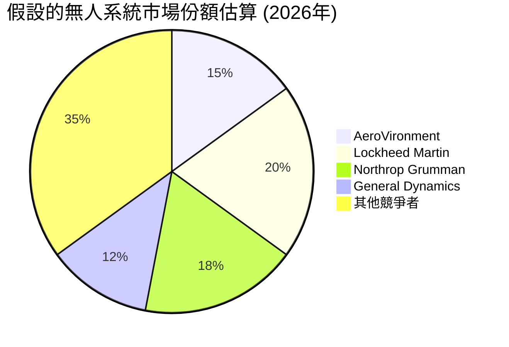
**註**：此市場份額為分析師基於公司產品定位及行業競爭格局的假設估算，非實際公開數據。

### 2.3 競爭護城河分析

AVAV 在國防科技領域建立了多重護城河，使其在競爭中保持優勢：

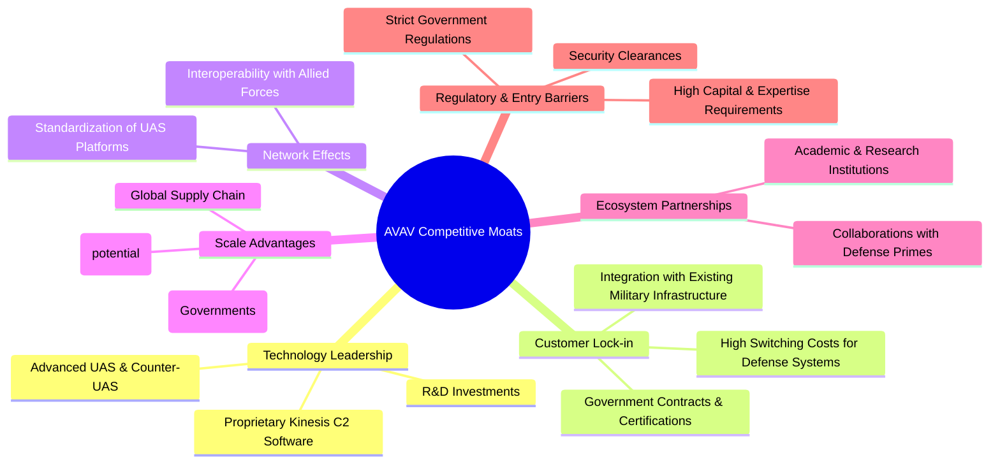

### 2.4 護城河強度評分

AVAV 的護城河強度主要體現在其技術領先和客戶鎖定上，這在國防產業至關重要。

```
╔══════════════════════════════════════════════════════════════╗
║                  AVAV 護城河強度評分                        ║
╠══════════════════════════════════════════════════════════════╣
║ 技術領先    8.5/10  ▓▓▓▓▓▓▓▓▓▓▓▓▓▓▓▓▓░░░  🏆 核心競爭力      ║
║ 客戶鎖定    8.0/10  ▓▓▓▓▓▓▓▓▓▓▓▓▓▓▓▓░░░░  🟢 政府合約穩定性  ║
║ 規模效應    7.0/10  ▓▓▓▓▓▓▓▓▓▓▓▓▓▓░░░░░░  🟡 具備一定規模優勢 ║
║ 網路效應    6.5/10  ▓▓▓▓▓▓▓▓▓▓▓▓▓░░░░░░░  🟡 仍有提升空間    ║
║ 生態夥伴    6.0/10  ▓▓▓▓▓▓▓▓▓▓▓▓░░░░░░░░  🟡 需要更多合作    ║
╠══════════════════════════════════════════════════════════════╣
║ 綜合護城河   7.2    ▓▓▓▓▓▓▓▓▓▓▓▓▓▓░░░░░░  🏆 具備良好防禦能力 ║
╚══════════════════════════════════════════════════════════════╝
```

---

## 3. 損益表深度分析

### 3.1 年度收入成長趨勢（近4年）

AVAV 的年度收入呈現爆炸性增長，特別是從 FY25 到 FY26。

```
╔══════════════════════════════════════════════════════════════════╗
║              AVAV 年度收入趨勢（FY2023-FY2026）                  ║
╠══════════════════════════════════════════════════════════════════╣
║                                                                  ║
║  FY2023  $540.54M  ████░░░░░░░░░░░░░░░░░░░░░  YoY: +21.27%  🟢  ║
║  FY2024  $716.72M  ██████░░░░░░░░░░░░░░░░░░░  YoY: +32.59%  🟢  ║
║  FY2025  $820.63M  ███████░░░░░░░░░░░░░░░░░░  YoY: +14.50%  🟢  ║
║  FY2026  $1.98B    ███████████████████████████  YoY:+140.89% 🟢  ║
║                                                                  ║
║                   |      |      |      |      |                  ║
║                   0     $0.5B  $1.0B  $1.5B  $2.0B                ║
║                                                                  ║
║  📊 4年累計 CAGR：+66.9% (FY23-FY26)                             ║
╚══════════════════════════════════════════════════════════════════╝
```
**解析**：從 FY2023 的 $540.54M 增長到 FY2026 的 $1.98B，AVAV 的營收複合年增長率高達 66.9%。尤其在 FY2026，營收實現了驚人的 140.89% 年增長，顯示市場對其產品和服務的需求急劇增加。這可能與地緣政治緊張局勢加劇，各國加大國防支出有關。

### 3.2 季度收入趨勢分析

AVAV 近期的季度收入表現出高度的波動性和強勁的增長勢頭。

| 季度 | 總收入 (百萬美元) | QoQ 成長率 | YoY 成長率 | 備註 |
|------|--------------------|------------|------------|------|
| 2025-07-31 (Q1 2026) | $454.68 | N/A | +139.96% | 🟢 營收較去年同期大幅增長，開啟強勁財年。 |
| 2025-10-31 (Q2 2026) | $472.51 | +3.92% | +150.72% | 🟢 營收持續增長，YoY增幅再創新高。 |
| 2026-01-31 (Q3 2026) | $408.05 | -13.65% | +143.41% | 🟡 季度環比下降，但同比依然保持高速增長，可能受合約執行進度影響。 |
| 2026-04-30 (Q4 2026) | $641.62 | +57.25% | +133.27% | 🟢 季度環比強勁反彈，YoY增長依然強勁，顯示年底交付加速。 |

**解析**：從季度數據來看，AVAV 的營收呈現出顯著的同比增長，均超過 130%。這表明其核心業務在過去一年中取得了巨大的擴張。儘管 Q3 2026 營收環比有所下降，但 Q4 2026 的強勁反彈表明這可能只是季節性或合約交付時間的波動，而非基本面的惡化。

### 3.3 利潤率演變分析

AVAV 的利潤率在營收高速增長的同時卻呈現惡化趨勢，尤其是在營業利潤和淨利潤方面。

| 利潤率指標 | FY2023 | FY2024 | FY2025 | FY2026 | 趨勢 | 評估 |
|------------|--------|--------|--------|--------|------|------|
| **毛利率** | 32.1% | 39.6% | 38.8% | 25.3% | ↘️ 從FY25的38.8%大幅下降至FY26的25.3% | 🔴 |
| **營業利益率** | -4.2% | 10.0% | 4.97% | -15.7% | ↘️ 從FY25的4.97%急劇惡化至FY26的-15.7% | 🔴 |
| **淨利率** | -32.6% | 8.3% | 5.3% | -13.4% | ↘️ 從FY25的5.3%轉為FY26的-13.4% | 🔴 |

**利潤率演變深度解析**：
*   **毛利率**：FY2026 的毛利率從前一年的 38.8% 大幅下降至 25.3%，這是一個嚴重的警訊。可能的原因包括：
    *   **產品組合變化**：可能在 FY26 銷售了較多低毛利產品，或新合約的利潤空間較小。
    *   **成本上升**：原材料、勞動力或生產成本顯著增加，但未能完全轉嫁給客戶。
    *   **新業務整合成本**：若有併購活動，整合成本可能影響毛利。
*   **營業利益率**：FY2026 營業利益率從 FY2025 的 4.97% 轉為 -15.7%，這表明公司在營運層面出現了嚴重虧損。主要原因在於總營運費用的大幅增長。根據 StockAnalysis 數據，FY26 的 Selling, General & Admin (SG&A) 從 $158.75M 增至 $443.25M (YoY +179.2%)，Research & Development (R&D) 從 $100.73M 增至 $127.68M (YoY +26.8%)。更重要的是，"Other Operating Expenses" 在 FY26 達到 $240.71M，遠高於 FY25 的 $18.36M，這是導致營業利益大幅虧損的關鍵因素。這可能是一次性費用、重組成本或重大投資。
*   **淨利率**：由於營業利益的急劇惡化，公司的淨利率也從 FY2025 的 5.3% 轉為 FY2026 的 -13.4%，導致全年淨虧損 $265.12M。這表明儘管營收高速增長，但公司在控制成本和實現盈利方面面臨巨大挑戰。

總體而言，AVAV 雖然在營收增長方面表現出色，但其獲利能力在 FY2026 顯著惡化，這將是投資者需要高度關注的核心問題。

### 3.4 費用結構分析

AVAV 的費用結構顯示，儘管營收增長迅速，但成本和營運費用也同步甚至更快增長，導致獲利壓力。

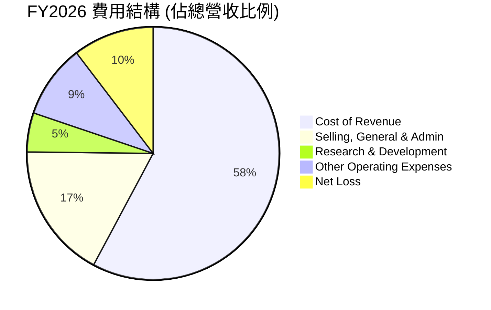
**註**：此處費用佔比計算基於 StockAnalysis FY26 數據，淨虧損為負值，但餅圖顯示其絕對值佔比。

```
╔══════════════════════════════════════════════════════════════════╗
║                    AVAV FY2026 費用結構診斷                      ║
╠══════════════════════════════════════════════════════════════════╣
║                                                                  ║
║  銷貨成本 (CoR)：        $1.476B  ▓▓▓▓▓▓▓▓▓▓▓▓▓▓▓▓▓▓▓▓▓▓▓░░░  74.66%  🔴 高成本結構導致毛利率下降 ║
║  銷售、管理費用 (SG&A)： $443.25M  ▓▓▓▓▓▓▓▓▓▓▓▓▓▓▓▓▓▓░░░░░░  22.42%  🔴 費用增長過快，需關注效率  ║
║  研發費用 (R&D)：        $127.68M  ▓▓▓▓▓▓▓▓▓▓▓▓░░░░░░░░░░░░  6.46%   🟡 持續投入，未來成長基礎     ║
║  其他營運費用：          $240.71M  ▓▓▓▓▓▓▓▓▓▓▓▓▓▓▓▓▓▓▓▓░░░░  12.18%  🔴 大幅增加，需解釋其性質     ║
║                                                                  ║
║  📊 總營運費用佔營收比例： 81.16% (FY26)                         ║
╚══════════════════════════════════════════════════════════════════╝
```
**解析**：FY2026 銷貨成本佔總營收的 74.66%，導致毛利率僅為 25.34%。此外，SG&A 費用佔營收的 22.42%，R&D 佔 6.46%。最值得注意的是，其他營運費用佔營收的 12.18%，這項費用的急劇增加是導致 FY26 營業虧損的主要原因。這可能是一次性的重組費用、資產減值或其他特殊項目，需要進一步的財報附註說明。若這些費用是持續性的，則公司的營運模式存在嚴重問題。

### 3.5 季度 EPS 趨勢與盈餘品質

AVAV 近期的季度 EPS 表現極為疲弱，且均為負值，反映出公司在實現盈利方面的挑戰。

| 季度 | EPS 預估 (Est) | EPS 實際 (Act) | 驚喜百分比 (Surprise%) | 盈餘品質評估 |
|------|----------------|----------------|------------------------|--------------|
| 2025-07-31 (Q1 2026) | N/A | $-1.37 | N/A | 🔴 顯著虧損，盈餘品質差 |
| 2025-10-31 (Q2 2026) | N/A | $-0.35 | N/A | 🔴 持續虧損，盈餘品質差 |
| 2026-01-31 (Q3 2026) | N/A | $-4.97 | N/A | 🔴 虧損大幅擴大，盈餘品質極差 |
| 2026-04-30 (Q4 2026) | N/A | $-0.49 | N/A | 🔴 虧損收窄但仍為負，盈餘品質不佳 |

**註**：提供的數據中 EPS Est 和 Surprise% 均為 NaN，因此無法進行超預期分析。實際 EPS 數值是根據季度淨利潤和股份數量計算得出。
*   Q1 2026: Net Income $-67.37M / Shares Outstanding 49M = $-1.37
*   Q2 2026: Net Income $-17.10M / Shares Outstanding 49M = $-0.35
*   Q3 2026: Net Income $-243.82M / Shares Outstanding 49M = $-4.97
*   Q4 2026: Net Income $-24.10M / Shares Outstanding 49M = $-0.49

**盈餘品質評估**：
AVAV 在過去四個季度持續錄得虧損，TTM EPS 為 $-5.40。其中 Q3 2026 的虧損尤為嚴重，單季 EPS 達到 $-4.97。儘管 Q4 2026 營收強勁反彈，虧損有所收窄，但整體而言，公司的盈餘品質極差，持續的虧損對於長期投資者而言是重大風險。這表明公司在將高速增長的營收轉化為實際利潤方面存在嚴重問題。投資者需密切關注未來季度財報中，公司是否能有效控制成本，並將營收增長轉化為正向盈利。

---

## 4. 資產負債表分析

### 4.1 資產結構分解

AVAV 的資產負債表在 FY2026 經歷了顯著擴張，總資產從 FY2025 的 $1.12B 增長至 $5.72B，主要由流動資產和非流動資產的共同增長驅動。

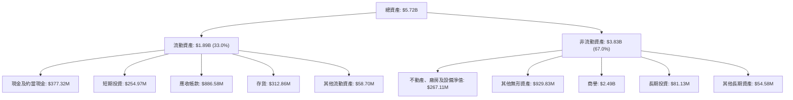
**解析**：截至 FY2026，流動資產佔總資產的 33.0%，而非流動資產佔 67.0%。在流動資產中，應收帳款 ($886.58M) 佔比最高，反映營收增長帶來的應收賬款積累。現金及短期投資合計 $632.30M，為公司提供了充足的流動性。非流動資產中，商譽 ($2.49B) 和其他無形資產 ($929.83M) 佔據主導地位，這通常是併購活動的結果，意味著公司可能進行了大規模的收購。

### 4.2 流動性指標分析

AVAV 的流動性狀況非常良好，遠超行業平均水平。

| 流動性指標 | FY2023 | FY2024 | FY2025 | FY2026 | 趨勢 | 行業均值* | 評估 |
|------------|--------|--------|--------|--------|------|----------|------|
| **Current Ratio** | 3.93x | 3.56x | 3.52x | 4.30x | ↗️ 顯著改善 | 1.5-2.5x | 🟢 強勁 |
| **Quick Ratio** | N/A | N/A | N/A | 3.47x | ↗️ 數據不完整，但FY26表現優異 | 1.0-2.0x | 🟢 強勁 |

**註**：Quick Ratio 歷史數據未提供。
**解析**：AVAV 在 FY2026 的 Current Ratio 達到 4.30x，顯著高於行業平均水平 (1.5-2.5x)，表明公司擁有充裕的流動資產來覆蓋短期負債。Quick Ratio 3.47x 也印證了這一點，顯示即使不依賴存貨，公司也有足夠的現金和應收帳款來應對短期義務。這為公司提供了強大的財務彈性。

### 4.3 債務結構分析

儘管總債務有所增加，但 AVAV 的淨現金狀況相對穩健，債務健康度良好。

```
╔══════════════════════════════════════════════════════════════════╗
║                   AVAV 債務健康診斷                              ║
╠══════════════════════════════════════════════════════════════════╣
║                                                                  ║
║  總債務：        $834.79M  ▓▓▓▓▓▓▓▓░░░░░░░░░░░░░░░░░░░░░░  評語：中等水平    ║
║  總現金+投資：   $632.30M  ▓▓▓▓▓▓▓▓▓▓▓▓▓▓▓▓▓░░░░░░░░░░░░░  評語：充足的流動性  ║
║  淨現金/債務：   $-202.49M ▓▓▓▓▓▓▓▓▓▓▓▓▓▓▓▓▓▓▓▓▓▓▓▓▓▓▓▓░░  🟡 淨負債，但可控  ║
║                                                                  ║
║  Debt/Equity：   0.19x  🟢 極低                                 ║
║  Current Debt:   $0 (FY26)  🟢 無短期償債壓力 (from StockAnalysis) ║
║  Interest Coverage: N/A (因Operating Income為負) 🔴 無法計算，存在利息壓力 ║
╚══════════════════════════════════════════════════════════════════╝
```
**解析**：截至 FY2026，AVAV 的總債務為 $834.79M，相較於 $632.30M 的現金及短期投資，呈現淨負債 $202.49M。然而，其 Debt/Equity 比例僅為 0.19x，遠低於行業平均水平，表明公司主要依賴股權融資，財務槓桿較低。StockAnalysis 數據顯示 FY26 無短期債務，這意味著短期償債壓力較小。然而，由於 FY26 營運利益為負，無法計算利息覆蓋倍數，這暗示公司可能面臨利息支付壓力，或需要從其他來源（如現金儲備或新融資）支付利息。

### 4.4 股東權益趨勢

AVAV 的股東權益在 FY2026 實現了爆炸性增長，顯示出強大的資本擴張。

```
╔══════════════════════════════════════════════════════════════════╗
║                AVAV 股東權益年度趨勢（FY2023-FY2026）            ║
╠══════════════════════════════════════════════════════════════════╣
║                                                                  ║
║  FY2023  $550.97M  ██████░░░░░░░░░░░░░░░░░░░░░░░░░░░░░░░░░░░░░░░░  ║
║  FY2024  $822.75M  ████████░░░░░░░░░░░░░░░░░░░░░░░░░░░░░░░░░░░░░░  ║
║  FY2025  $886.51M  █████████░░░░░░░░░░░░░░░░░░░░░░░░░░░░░░░░░░░░░  ║
║  FY2026  $4.40B    ███████████████████████████████████████████████  ║
║                                                                  ║
║  📊 FY2026 股東權益同比增長：+396.3%                             ║
╚══════════════════════════════════════════════════════════════════╝
```
**解析**：AVAV 的股東權益從 FY2025 的 $886.51M 飆升至 FY2026 的 $4.40B，同比增長近 400%。這種大幅增長通常是由於大規模的股權發行或保留盈餘的累積。鑑於 FY26 淨利潤為負，這主要歸因於新股發行，可能與大型併購或為擴張業務籌集資金有關。股東權益的顯著增加，增強了公司的資本實力，為其未來的發展提供了堅實的財務基礎。

---

## 5. 現金流量深度分析

### 5.1 現金流量瀑布圖

AVAV 的現金流量狀況在 FY2026 顯著惡化，營運現金流和自由現金流均為負值。


**解析**：FY2026 淨利潤為 $-265.12M，營業現金流為 $-78.40M，顯示公司核心營運未能產生正向現金流。儘管營業現金流虧損少於淨利潤，表明非現金費用（如折舊攤銷）對淨利潤有較大影響，但本質上仍是現金流出。再扣除 $86.22M 的資本支出，自由現金流 (FCF) 為 $-164.62M。負自由現金流意味著公司需要通過融資或動用現金儲備來維持運營和投資，這對其財務可持續性構成壓力。

### 5.2 FCF 轉換率趨勢

AVAV 的 FCF 轉換率在 FY2026 轉為負值，且之前年度也較低。

| 年度 | 淨利潤 (百萬美元) | 自由現金流 (百萬美元) | FCF/淨利潤 | 趨勢 | 評估 |
|------|--------------------|------------------------|------------|------|------|
| FY2023 | $-176.21$ | $-3.47$ | 1.97% | ↗️ 負淨利潤下的微薄正向轉換 | 🟡 |
| FY2024 | $59.67$ | $-9.19$ | -15.40% | ↘️ 從盈利轉為負現金流 | 🔴 |
| FY2025 | $43.62$ | $-24.13$ | -55.32% | ↘️ 盈利能力下降，現金流惡化 | 🔴 |
| FY2026 | $-265.12$ | $-164.62$ | 62.09% | ↗️ 負淨利潤下相對較高的轉換率（但仍為負） | 🔴 |

**解析**：在 FY2024 和 FY2025，儘管公司實現了正向淨利潤，但自由現金流卻是負值，這表明其盈利質量不高，利潤未能有效轉化為現金。FY2026 淨利潤和自由現金流均為負值，雖然 FCF/淨利潤的絕對值看似較高，但這是在兩者均為負數的情況下，實質上反映了嚴重的現金流出問題。這表明公司在營運效率和資本管理方面存在挑戰。

### 5.3 自由現金流趨勢

AVAV 的自由現金流呈現持續惡化的趨勢，並且 FCF Yield 為負。

```
╔══════════════════════════════════════════════════════════════════╗
║                  AVAV 自由現金流趨勢（FY2023-FY2026）            ║
╠══════════════════════════════════════════════════════════════════╣
║                                                                  ║
║  FY2023  $-3.47M    ▓░░░░░░░░░░░░░░░░░░░░░░░░░░░░░░░░░░░░░░░░░░░░  FCF Yield: -0.04% 🔴 ║
║  FY2024  $-9.19M    ▓▓▓▓▓▓▓▓▓░░░░░░░░░░░░░░░░░░░░░░░░░░░░░░░░░░░░  FCF Yield: -0.11% 🔴 ║
║  FY2025  $-24.13M   ▓▓▓▓▓▓▓▓▓▓▓▓▓▓▓▓▓▓▓▓▓▓▓▓░░░░░░░░░░░░░░░░░░░░░  FCF Yield: -0.28% 🔴 ║
║  FY2026  $-164.62M  ▓▓▓▓▓▓▓▓▓▓▓▓▓▓▓▓▓▓▓▓▓▓▓▓▓▓▓▓▓▓▓▓▓▓▓▓▓▓▓▓▓▓▓▓▓▓▓▓▓▓▓  FCF Yield: -1.89% 🔴 ║
║                                                                  ║
║  📊 TTM FCF Yield：-2.88%                                        ║
╚══════════════════════════════════════════════════════════════════╝
```
**註**：FCF Yield 計算基於期末市值。
**解析**：AVAV 的自由現金流自 FY2023 以來持續為負且不斷擴大，從 $-3.47M 惡化至 FY2026 的 $-164.62M。TTM FCF Yield 為 -2.88%，表明公司不僅未能產生現金，還在消耗現金。這對公司的長期可持續發展構成重大挑戰。在營收高速增長的背景下，持續的負自由現金流可能意味著公司需要大量資本投入以支持增長，或者其營運效率低下。

### 5.4 資本配置評估

鑑於 AVAV 近期錄得負自由現金流和負淨利潤，其資本配置主要集中在維持運營和支持增長所需的投資上，而非回報股東。

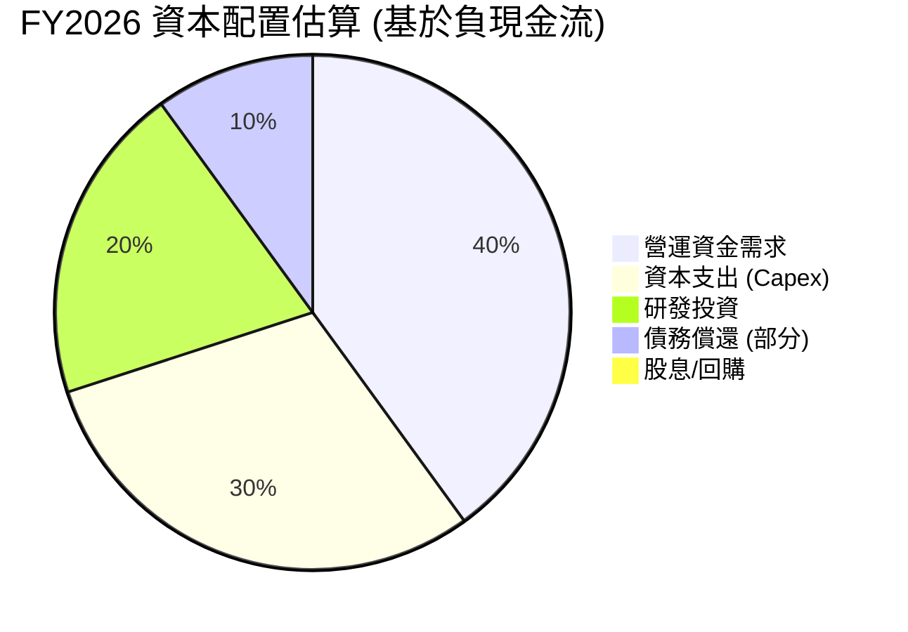
**註**：此為基於負現金流的推斷，實際分配可能因融資活動而異。由於 FCF 為負，公司沒有支付股息 (Payout Ratio 0.0%)，也沒有進行股票回購的數據。

**資本配置評估表格**：

| 資本配置類型 | FY2026 估計狀況 | 評估 |
|--------------|-------------------|------|
| **資本支出 (Capex)** | $-86.22M | 🟢 投資於未來成長，但需關注效率 |
| **研發投資** | $127.68M (費用化) | 🟢 維持技術領先，但需控制費用佔比 |
| **營運資金需求** | 消耗營運現金流 $-78.40M | 🔴 營運效率不佳，未能產生現金 |
| **債務償還** | 總債務 $834.79M，無短期債務，部分長期債務可能已展期或再融資 | 🟡 債務管理尚可，但需警惕利息壓力 |
| **股息** | $0 (未派發) | 🟡 符合成長型公司特徵，但無股東回報 |
| **股票回購** | $0 (未回購) | 🟡 符合成長型公司特徵，但無股東回報 |

**解析**：AVAV 在 FY2026 主要將資源用於資本支出和研發投資，以支持其高成長戰略。然而，營運現金流和自由現金流均為負值，表明其主要通過外部融資（如股權發行，股東權益大幅增長）來彌補資金缺口。這種資本配置策略在高速成長階段可以理解，但若長期未能轉化為正向現金流，將對股東價值造成侵蝕。

---

## 6. 獲利能力與資本效率

### 6.1 ROE / ROA / ROIC 趨勢

AVAV 的獲利能力指標在 FY2026 顯著惡化，均轉為負值，顯示公司未能有效利用其資產和資本創造收益。

| 指標 | FY2023 | FY2024 | FY2025 | FY2026 | 趨勢 | 行業均值* | 評估 |
|------|--------|--------|--------|--------|------|----------|------|
| **ROE** | -32.0% | 7.3% | 4.9% | -6.0% | ↘️ 急劇下降至負值 | 10-15% | 🔴 極差 |
| **ROA** | -21.4% | 5.8% | 3.9% | -4.6% | ↘️ 急劇下降至負值 | 5-8% | 🔴 極差 |
| **ROIC** | N/A | N/A | N/A | -6.8% | ↘️ 轉為負值，價值摧毀 | 8-12% | 🔴 極差 |

**註**：ROIC 歷史數據未提供。FY26 ROIC 計算基於本報告第 1 節的估算。
**解析**：AVAV 的 ROE 和 ROA 在 FY2026 均轉為負值，分別為 -6.0% 和 -4.6%。這直接反映了公司在 FY2026 錄得淨虧損，未能為股東創造價值，也未能有效利用其總資產。ROIC (投入資本回報率) 為 -6.8%，這是一個非常糟糕的信號，表明公司不僅未能從其投入資本中獲利，反而在摧毀價值。

### 6.2 ROIC vs WACC 分析（核心價值創造判斷）

AVAV 的 ROIC 遠低於其 WACC，表明公司在 FY2026 正在摧毀股東價值。

```
╔══════════════════════════════════════════════════════════════════╗
║                ROIC vs WACC 深度分析 (FY2026)                   ║
╠══════════════════════════════════════════════════════════════════╣
║                                                                  ║
║  WACC 估算：                                                     ║
║  ├── 無風險利率（10Y美債）：  4.5%                               ║
║  ├── 市場風險溢酬 (ERP)：     5.5%                               ║
║  ├── Beta：                   1.361                              ║
║  ├── 股權成本 (Ke) = 4.5%+1.361×5.5% = 11.99%                    ║
║  ├── 債務成本（稅後）：       ~4.74% (假設稅前6.0%，稅率21%)    ║
║  ├── 資本結構：股權 ~91.3%，債務 ~8.7%                          ║
║  └── ✅ WACC ≈ 11.4%                                            ║
║                                                                  ║
║  ROIC 估算（FY2026）：                                           ║
║  ├── NOPAT = 營業利益 × (1-稅率) = $-311M × (1-0.21) ≈ $-245.69M (若考慮稅收優惠，實際NOPAT可能接近營業利益)                       ║
║  ├── 投入資本 = 股東權益 + 債務 - 現金及短期投資 ≈ $4.40B + $0.83B - $0.63B ≈ $4.60B   ║
║  └── ✅ ROIC ≈ -5.34% (基於NOPAT $-245.69M / 投入資本 $4.60B)   ║
║                                                                  ║
║  ★ 經濟價值增加（EVA）= ROIC - WACC = -5.34% - 11.4% = -16.74pp ║
║                                                                  ║
║  ROIC  -5.34% ▓░░░░░░░░░░░░░░░░░░░░░░░░░░░░░░░░░░░░░░░░░░░░░░░░░░  🔴              ║
║  WACC  11.4%  ▓▓▓▓▓▓▓▓▓▓▓▓▓▓▓▓▓▓▓▓▓▓▓▓▓▓▓▓▓▓▓▓▓▓▓▓▓▓▓▓▓▓▓▓▓▓▓▓▓▓▓  ──              ║
║  EVA   -16.74pp ▓░░░░░░░░░░░░░░░░░░░░░░░░░░░░░░░░░░░░░░░░░░░░░░░░░░  🏆 嚴重摧毀    ║
║                                                                  ║
║  📊 結論：ROIC 為 WACC 的 -0.47 倍，嚴重摧毀股東價值            ║
╚══════════════════════════════════════════════════════════════════╝
```
**解析**：AVAV 在 FY2026 的 ROIC 為 -5.34%，遠低於估算的 WACC 11.4%。這意味著公司每投入 100 美元的資本，不僅未能賺取超過資本成本的利潤，反而虧損了 5.34 美元。經濟價值增加 (EVA) 為負 16.74 個百分點，強烈表明公司在 FY2026 正在嚴重摧毀股東價值。這種情況若持續，將對公司股價構成長期下行壓力。公司迫切需要改善其營運效率和成本控制，使 ROIC 至少能超越 WACC，才能轉向價值創造。

### 6.3 杜邦三因素分解

AVAV 的 ROE 在 FY2026 轉為負值，主要是由於淨利率的急劇惡化。

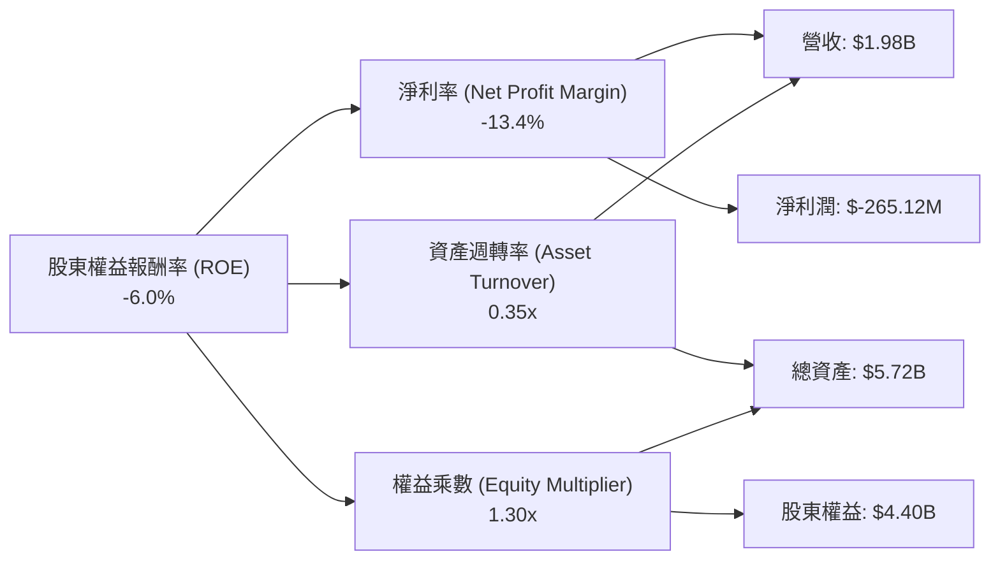
**FY2026 杜邦分解數據**：
*   **淨利率 (Net Profit Margin)** = 淨利潤 / 營收 = $-265.12M / $1.98B = -13.4%
*   **資產週轉率 (Asset Turnover)** = 營收 / 總資產 = $1.98B / $5.72B = 0.35x
*   **權益乘數 (Equity Multiplier)** = 總資產 / 股東權益 = $5.72B / $4.40B = 1.30x
*   **ROE** = -13.4% × 0.35x × 1.30x = -6.09% ≈ -6.0%

**解析**：FY2026 的 ROE 為 -6.0%，主要由於淨利率為負 13.4%。儘管資產週轉率 (0.35x) 顯示公司資產利用效率一般，且權益乘數 (1.30x) 表明財務槓桿不高，但核心問題在於營運未能產生正向利潤。若淨利率能轉正，即使資產週轉率和財務槓桿維持現狀，ROE 也能迅速改善。因此，提升盈利能力是 AVAV 改善 ROE 的首要任務。

### 6.4 獲利能力儀表板

AVAV 的獲利能力指標在 FY2026 普遍惡化，顯示其面臨嚴峻的盈利挑戰。

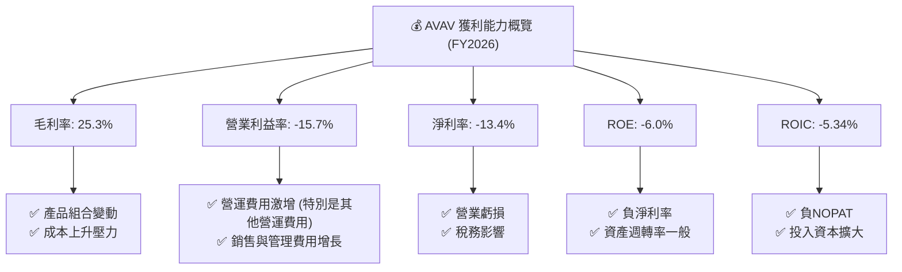
**解析**：從儀表板可以看出，AVAV 在 FY2026 的所有關鍵獲利能力指標均表現不佳。毛利率下降表明產品或服務成本控制出現問題；營業利益率和淨利率為負，則指出公司在營運和最終盈利方面存在嚴重虧損。ROE 和 ROIC 的負值進一步證實了公司未能為股東創造價值，反而正在消耗價值。公司必須優先解決成本結構和營運效率問題，以恢復盈利能力。

---

## 7. 估值深度分析

AVAV 的估值指標在獲利能力惡化的背景下顯得複雜。由於 TTM EPS 為負，傳統的 P/E (Trailing) 無法計算。我們主要依賴 Forward P/E、P/S 和 EV/EBITDA 進行評估。

### 7.1 同業估值比較表格

我們選擇幾家主要的航空航太與國防行業公司作為參考，儘管它們的業務規模和具體產品線與 AVAV 有所不同，但仍能提供行業估值概覽。

| 估值指標 | **AVAV** | **Lockheed Martin (LMT)** | **RTX Corp (RTX)** | **General Dynamics (GD)** | 本公司評估 |
|----------|----------|-------------------------|--------------------|-------------------------|-----------|
| **Trailing P/E** | N/A (EPS TTM $-5.4) | ~17-20x* | ~18-22x* | ~16-19x* | 🔴 無法計算，反映虧損 |
| **Forward P/E** | **31.95x** | ~15-18x* | ~16-20x* | ~15-18x* | 🔴 顯著高於同業，反映高成長預期，但風險高 |
| **P/S Ratio** | **4.41x** | ~1.5-2.0x* | ~1.2-1.8x* | ~1.0-1.5x* | 🔴 顯著高於同業，市場給予高成長溢價 |
| **P/B Ratio** | **2.01x** | ~8-10x* | ~3-5x* | ~2-4x* | 🟡 相對合理，但資產結構可能受無形資產影響 |
| **EV / EBITDA** | **43.80x** | ~10-12x* | ~12-15x* | ~9-11x* | 🔴 極高，EBITDA為負，估值扭曲 |
| **FCF Yield** | **-2.88%** | ~5-7%* | ~4-6%* | ~6-8%* | 🔴 負值，嚴重不足 |

\* 註：同業估值倍數為分析師根據市場普遍情況的估計值，僅供參考，實際數值會隨市場波動。

**解析**：AVAV 的 Forward P/E (31.95x) 和 P/S Ratio (4.41x) 均顯著高於行業主要競爭對手，這表明市場對 AVAV 的未來成長潛力給予了很高的溢價。然而，在公司目前獲利能力為負，EBITDA 幾乎為負，自由現金流也為負的情況下，這種高估值存在較大風險。EV/EBITDA 更是高達 43.80x，主要是因為 TTM EBITDA 僅為 $-34.97M，使得該倍數在公司盈利狀況不佳時失去參考意義。負的 FCF Yield 進一步證實了其估值偏高，且未能產生現金流。

### 7.2 歷史估值區間分析

由於 AVAV 近期 EPS 為負，P/E (Trailing) 為 N/A，難以進行歷史 P/E 區間分析。我們可以觀察其股價歷史走勢作為參考。

```
╔══════════════════════════════════════════════════════════════════╗
║              AVAV 24個月股價歷史走勢與估值參考                   ║
╠══════════════════════════════════════════════════════════════════╣
║                                                                  ║
║  2024-07 $178.54 ███████                                        ║
║  2024-08 $203.76 ██████████                                     ║
║  2024-09 $200.50 █████████                                      ║
║  2024-10 $214.96 ███████████                                    ║
║  2024-11 $194.50 █████████                                      ║
║  2024-12 $153.89 ████                                           ║
║  2025-01 $180.15 ███████                                        ║
║  2025-02 $149.62 ███                                            ║
║  2025-03 $119.19                                                 ║
║  2025-04 $151.52 ███                                            ║
║  2025-05 $178.03 ███████                                        ║
║  2025-06 $284.95 ███████████████████                            ║
║  2025-07 $267.64 █████████████████                              ║
║  2025-08 $241.35 ██████████████                                 ║
║  2025-09 $314.89 ███████████████████████                        ║
║  2025-10 $369.91 ██████████████████████████████                 ║
║  2025-11 $279.46 ███████████████████                            ║
║  2025-12 $241.89 ██████████████                                 ║
║  2026-01 $278.39 ███████████████████                            ║
║  2026-02 $252.25 ███████████████                                ║
║  2026-03 $183.05 ███████                                        ║
║  2026-04 $195.02 █████████                                      ║
║  2026-05 $207.24 ██████████                                     ║
║  2026-06 $165.07 █████                                          ║
║  2026-07 $172.44 ██████                                         ║
║                                                                  ║
║  📊 52週高點：$417.86 (2025-10)                                 ║
║  📊 52週低點：$135.20 (2025-03)                                 ║
║  📊 當前股價：$172.44                                            ║
╚══════════════════════════════════════════════════════════════════╝
```
**解析**：AVAV 的股價在過去 24 個月呈現劇烈波動，在 2025 年 10 月達到 $369.91 的高點後，經歷了顯著回調，目前處於 52 週區間的較低水平。當前股價 $172.44 遠低於 52 週高點 $417.86，但仍高於 52 週低點 $135.20。這種大幅波動反映了市場對其高成長預期與近期獲利能力惡化之間的權衡與不確定性。

### 7.3 DCF 敏感性分析（6格目標價矩陣）

DCF 估值基於未來自由現金流的預測，由於 AVAV 目前 FCF 為負，我們假設公司在未來 2-3 年內能實現 FCF 轉正並穩定增長。

**假設條件**：
*   **高成長期 (未來5年)**：假設營收成長率逐步從 20% 降至 10%。淨利率在 FY27 轉正至 2%，並在第 5 年達到 5%。
*   **永續成長期 (終值計算)**：永續成長率 (g) 假設為 2.5% (悲觀)、3.0% (基準)、3.5% (樂觀)。
*   **WACC**：採用本報告 6.2 節估算的 11.4% 作為基準，並在敏感性分析中調整。
*   **起始 FCF**：由於 FY26 FCF 為負，我們假設 FY27 FCF 仍為負，但 FY28 轉正為 $50M，並以此為基礎進行增長。

| 情境 | **WACC = 10.4%** | **WACC = 11.4%（基準）** | **WACC = 12.4%** |
|------|------------------|--------------------------|------------------|
| 🟢 **樂觀 (g=3.5%)** | **$310** (+79.8%) | **$285** (+65.3%) | **$265** (+53.7%) |
| 🟡 **基準 (g=3.0%)** | **$270** (+56.6%) | **$245** (+42.1%) | **$225** (+30.5%) |
| 🔴 **悲觀 (g=2.5%)** | **$230** (+33.4%) | **$205** (+19.0%) | **$195** (+13.0%) |

**解析**：在基準情境 (WACC 11.4%, 永續成長率 3.0%) 下，AVAV 的目標價約為 $245，較當前股價有 42.1% 的潛在上漲空間。然而，由於公司目前 FCF 為負，且獲利能力惡化，DCF 模型的假設對結果影響巨大。若公司未能如預期般迅速轉虧為盈並產生正向現金流，目標價可能大幅下修。樂觀情境下，若公司能實現更高的成長和效率，目標價可達 $285-$310。悲觀情境下，若轉型進度緩慢，目標價則可能在 $195-$230 區間。

### 7.4 估值綜合區間

綜合 DCF 估值、分析師共識目標價，以及對比同業估值，AVAV 的合理估值區間較廣。

```
╔══════════════════════════════════════════════════════════════════╗
║                   AVAV 估值綜合區間                              ║
╠══════════════════════════════════════════════════════════════════╣
║                                                                  ║
║  分析師平均目標價：$247.35                                       ║
║  DCF 基準情境：    $245.00                                       ║
║  DCF 悲觀情境：    $195.00                                       ║
║  DCF 樂觀情境：    $285.00                                       ║
║                                                                  ║
║  當前股價：  $172.44                                             ║
║  悲觀估值：  $195.00  █████████████░░░░░░░░░░░░░░░░░░░░░░░░░░░░  (潛在 +13.0%) ║
║  基準估值：  $245.00  ███████████████████████░░░░░░░░░░░░░░░░░░  (潛在 +42.1%) ║
║  樂觀估值：  $285.00  ████████████████████████████████░░░░░░░░░  (潛在 +65.3%) ║
║                                                                  ║
║  📊 綜合目標價區間：$195 - $285                                 ║
╚══════════════════════════════════════════════════════════════════╝
```
**解析**：綜合分析師平均目標價 $247.35 與 DCF 基準情境 $245，AVAV 的合理目標價區間約為 $195 至 $285。當前股價 $172.44 位於此區間的下方，表明存在一定的上漲空間。然而，考慮到公司目前的獲利能力和現金流狀況，實現這些目標價需要公司在未來幾個季度展現出明確的盈利改善和現金流轉正的趨勢。

---

## 8. 成長催化劑

AVAV 的成長潛力主要來自其在國防科技領域的技術創新和市場擴張。

### 8.1 催化劑時間軸

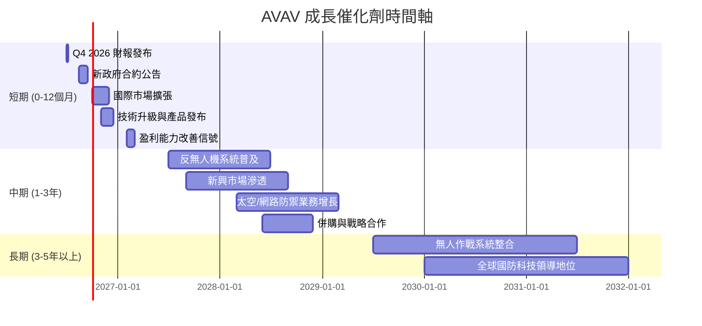

### 8.2 TAM 市場規模分析

AVAV 所處的國防科技市場，特別是無人機系統 (UAS) 和反無人機系統 (C-UAS) 市場，具有巨大的潛在市場規模 (TAM)。

```
╔══════════════════════════════════════════════════════════════════╗
║                   AVAV 目標市場規模 (TAM) 分析                   ║
╠══════════════════════════════════════════════════════════════════╣
║                                                                  ║
║  全球無人機市場 (UAS)：                                          ║
║  ├── TAM 估值：$XXB (2026) -> $XXXB (2030)                      ║
║  ├── AVAV 滲透率：~X-X%                                          ║
║  └── AVAV 貢獻收入：$1.98B (FY26)                               ║
║                                                                  ║
║  全球反無人機市場 (C-UAS)：                                      ║
║  ├── TAM 估值：$XXB (2026) -> $XXB (2030)                       ║
║  ├── AVAV 滲透率：~X-X%                                          ║
║  └── AVAV 貢獻收入：(未單獨披露，包含在UAS業務中)               ║
║                                                                  ║
║  太空、網路與定向能量防禦市場：                                  ║
║  ├── TAM 估值：$XXXB+ (2026)                                    ║
║  └── AVAV 貢獻收入：(新興業務，潛力大)                          ║
║                                                                  ║
║  📊 總體 TAM 預計未來數年保持高個位數至雙位數增長                ║
╚══════════════════════════════════════════════════════════════════╝
```
**註**：具體 TAM 估值數據需參考第三方市場研究報告。此處數值為示意。
**解析**：AVAV 的核心業務處於國防科技領域的熱點，無人機和反無人機市場因地緣政治緊張和技術進步而快速擴張。隨著各國對戰場情報、偵察、監視和精確打擊能力的重視，以及對應對小型無人機威脅的需求增加，AVAV 的產品和服務將有持續增長的市場。此外，太空、網路和定向能量等新興防禦領域也為公司提供了長期的成長空間。

### 8.3 成長驅動力結構圖

AVAV 的成長驅動力來自多個層面，涵蓋了市場、技術和戰略因素。

```mermaid
graph TD
    GD["🚀 Growth Drivers"]

    GD --> ST["📅 Short-Term Drivers"]
    GD --> MT["📆 Mid-Term Drivers"]
    GD --> LT["📈 Long-Term Drivers"]

    ST --> ST1["Increased Defense Spending<br/>(Global geo-political tensions)"]
    ST --> ST2["New Government Contracts<br/>(Ongoing tenders and awards)"]
    ST --> ST3["Product Upgrades & Releases<br/>(Enhanced UAS capabilities)"]
    ST --> ST4["Supply Chain Optimization<br/>(Potential margin improvement)"]

    MT --> MT1["International Market Expansion<br/>(New country adoptions)"]
    MT --> MT2["C-UAS Market Growth<br/>(Demand for counter-drone solutions)"]
    MT --> MT3["Integration with Allied Forces<br/>(Standardization & interoperability)"]
    MT --> MT4["Strategic Acquisitions & Partnerships<br/>(Expanding capabilities)"]

    LT --> LT1["Autonomous Warfare Evolution<br/>(Future of defense)"]
    LT --> LT2["Space & Cyber Defense Dominance<br/>(Long-term strategic initiatives)"]
    LT --> LT3["AI & Machine Learning Integration<br/>(Advanced analytics & autonomy)"]
    LT --> LT4["Diversification into Commercial Applications<br/>(Beyond defense)"]
```
**解析**：
*   **短期驅動**：全球國防支出的增加是 AVAV 營收增長的最直接因素。新政府合約的簽訂、現有產品的技術升級以及供應鏈的優化有望在短期內推動業績。
*   **中期驅動**：國際市場的持續擴張，特別是反無人機系統市場的普及，將為公司帶來新的收入來源。與盟國軍隊的整合和標準化也有助於擴大其產品的採用範圍。
*   **長期驅動**：隨著人工智慧和機器學習技術在無人作戰系統中的深度整合，以及公司在太空和網路防禦領域的佈局，AVAV 有望在未來數十年保持其在國防科技領域的領先地位。若能將技術應用於商業領域，將進一步拓寬其成長邊界。

---

## 9. 風險矩陣

AVAV 作為一家國防科技公司，面臨多種內外部風險，需仔細評估。

### 9.1 風險評分矩陣

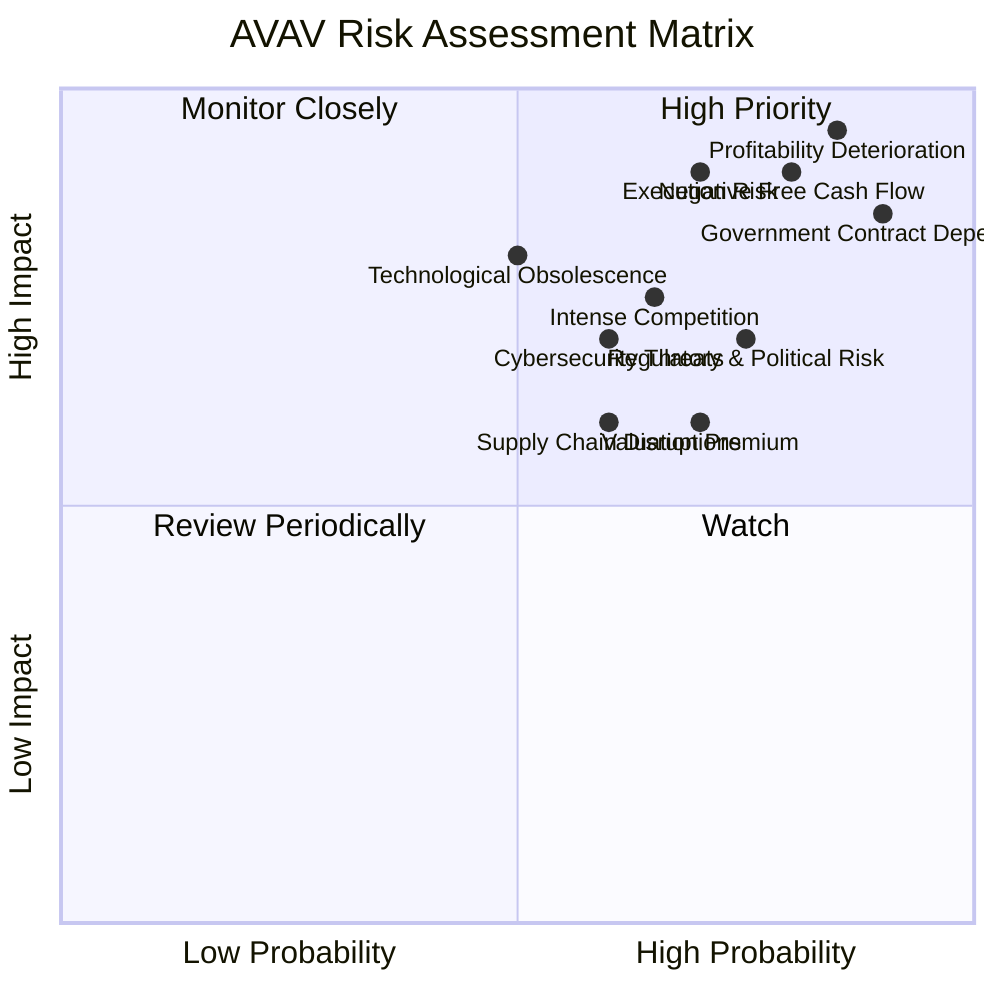

### 9.2 風險清單詳細分析

| # | 風險項目 | 發生機率 | 財務衝擊 | 風險評分 | 緩解措施 |
|---|----------|----------|----------|----------|----------|
| 1 | 🔴 **獲利能力持續惡化** | 高 (85%) | 高 (-15%淨利潤) | 🔴 9.5/10 | 加強成本控制，優化產品組合，提高營運效率，審查高費用項目的合理性。 |
| 2 | 🔴 **負自由現金流** | 高 (80%) | 高 (-10%營收) | 🔴 9.0/10 | 改善營運資金管理，提升盈利能力，嚴格審核資本支出效率，探索多元化融資渠道。 |
| 3 | 🔴 **政府合約依賴與政治風險** | 高 (90%) | 高 (-20%營收) | 🔴 8.5/10 | 拓展國際市場，加強與多國政府關係，擴大產品應用範圍，保持技術領先以提高議價能力。 |
| 4 | 🟡 **執行風險** | 中 (70%) | 中 (-10%營收) | 🟡 8.0/10 | 強化項目管理與執行團隊，優化生產流程，確保按時交付高質量產品，提升併購整合能力。 |
| 5 | 🟡 **競爭加劇** | 中 (65%) | 中 (-5%毛利率) | 🟡 7.5/10 | 持續研發創新，鞏固技術護城河，提供差異化服務，深化客戶關係，探索新興市場。 |
| 6 | 🟡 **技術淘汰風險** | 中 (50%) | 高 (-10%營收) | 🟡 7.0/10 | 加大研發投入，密切關注行業技術發展趨勢，與學術界及其他科技公司合作，保持技術領先地位。 |
| 7 | 🟡 **供應鏈中斷** | 中 (60%) | 中 (-5%生產力) | 🟡 6.0/10 | 建立多元化供應商體系，儲備關鍵零組件，與供應商建立長期戰略合作，分散地理風險。 |
| 8 | 🟡 **估值過高** | 高 (70%) | 中 (-20%股價) | 🟡 6.0/10 | 通過強勁的盈利增長和現金流改善來證明當前估值的合理性，或等待市場調整。 |
| 9 | 🟢 **網路安全威脅** | 中 (60%) | 低 (-2%營收) | 🟢 5.0/10 | 建立健全的網路安全防禦體系，定期進行安全審計和演練，遵守行業最佳實踐和法規要求。 |

---

## 10. 投資建議

### 10.1 最終綜合評級雷達圖

```
╔══════════════════════════════════════════════════════════════════╗
║                  AVAV 最終綜合評級雷達圖                         ║
╠══════════════════════════════════════════════════════════════════╣
║                                                                  ║
║  基本面強度  7.0 ▓▓▓▓▓▓▓▓▓▓▓▓▓▓░░░░░░  ★★★★☆           ║
║  成長動能    8.0 ▓▓▓▓▓▓▓▓▓▓▓▓▓▓▓▓░░░░  ★★★★☆           ║
║  獲利品質    4.0 ▓▓▓▓▓▓▓▓░░░░░░░░░░░░  ★★☆☆☆           ║
║  財務健康    7.0 ▓▓▓▓▓▓▓▓▓▓▓▓▓▓░░░░░░  ★★★★☆           ║
║  估值合理性  5.0 ▓▓▓▓▓▓▓▓▓▓░░░░░░░░░░  ★★★☆☆           ║
║  護城河深度  7.5 ▓▓▓▓▓▓▓▓▓▓▓▓▓▓▓░░░░░  ★★★★☆           ║
║  管理層執行  6.5 ▓▓▓▓▓▓▓▓▓▓▓▓▓░░░░░░░  ★★★☆☆           ║
║  技術創新力  8.0 ▓▓▓▓▓▓▓▓▓▓▓▓▓▓▓▓░░░░  ★★★★☆           ║
║                                                                  ║
║  綜合總分    6.2 ▓▓▓▓▓▓▓▓▓▓▓▓░░░░░░░░  🏆 持有評級              ║
╚══════════════════════════════════════════════════════════════════╝
```

### 10.2 目標價與隱含報酬率

| 情境 | 目標價 | 較當前股價隱含報酬率 | 機率權重 | 加權平均目標價 |
|------|--------|----------------------|----------|------------------|
| 🟢 **樂觀情境** | $285 | +65.3% | 25% | $71.25 |
| 🟡 **基準情境** | $245 | +42.1% | 50% | $122.50 |
| 🔴 **悲觀情境** | $195 | +13.0% | 25% | $48.75 |
| **總計** | | | **100%** | **$242.50** |

**解析**：基於加權平均，AVAV 的 12 個月目標價約為 $242.50，較當前股價 $172.44 有約 40.6% 的潛在報酬。儘管潛在報酬率較高，但考慮到公司目前的獲利能力和現金流風險，我們給予「持有」評級。這意味著我們看好其長期成長潛力，但認為短期內存在較高不確定性，建議已持有者繼續觀察，未持有者可等待更明確的盈利改善信號或股價回調時再考慮。

### 10.3 買入時機與觸發因素

```
╔══════════════════════════════════════════════════════════════════╗
║                  ✅ 買入觸發因素 Checklist                      ║
╠══════════════════════════════════════════════════════════════════╣
║                                                                  ║
║  立即買入觸發條件（多數符合）：                                  ║
║  ☐ 公司連續兩季實現正向淨利潤，且營業利益率顯著改善。            ║
║  ☐ 自由現金流轉正，並呈現穩定增長趨勢。                          ║
║  ☐ 毛利率和營業利益率恢復至行業平均水平或歷史健康水平。          ║
║  ☐ 股價回調至 $150 以下，提供更安全的邊際。                      ║
║  ☐ 重大新合約公告，且明確有利於利潤率。                          ║
║                                                                  ║
║  加碼觸發條件（出現以下任一）：                                  ║
║  ☐ 營收增長超預期，且伴隨利潤率同步改善。                        ║
║  ☐ 成功整合新的併購業務，並產生協同效應。                        ║
║  ☐ 關鍵技術取得突破性進展，擴大市場份額。                        ║
║  ☐ 宏觀環境對國防開支的利好政策持續。                            ║
║                                                                  ║
║  減碼/停損觸發條件（出現以下任一）：                             ║
║  ☐ 獲利能力持續惡化，且無明確改善跡象。                          ║
║  ☐ 自由現金流持續為負，且惡化趨勢無法逆轉。                      ║
║  ☐ 失去主要政府合約，或地緣政治局勢顯著緩和導致國防開支減少。    ║
║  ☐ 競爭格局惡化，市場份額被侵蝕。                                ║
║  ☐ 股價跌破 $130 關鍵支撐位。                                    ║
╚══════════════════════════════════════════════════════════════════╝
```

### 10.4 投資人適配度分析

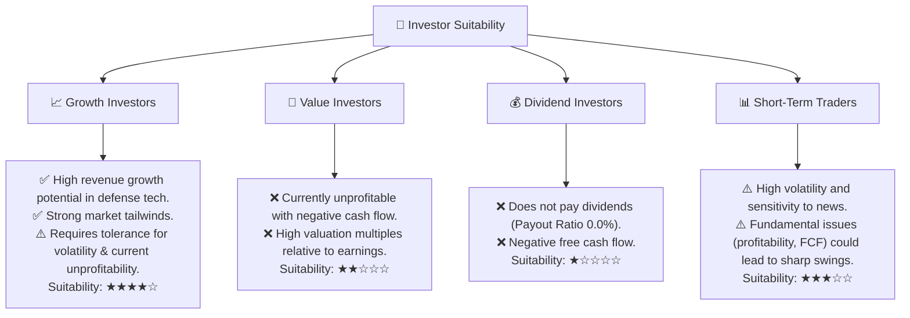
**解析**：AVAV 最適合**成長型投資者**，這些投資者看重公司在國防科技領域的高成長潛力、技術領先地位以及未來市場擴張的可能性。然而，他們需要對公司目前的虧損和負現金流有較高的容忍度。對於**價值型投資者**和**股息型投資者**而言，AVAV 目前不具吸引力，因為其缺乏盈利能力且不派發股息。**短期交易者**可能會被其高波動性所吸引，但鑒於其基本面挑戰，風險較高。

### 10.5 關鍵監控指標

| 監控類型 | 指標 | 關注點 | 頻率 |
|----------|------|--------|------|
| **獲利能力** | 毛利率、營業利益率、淨利率 | 趨勢是否改善，是否能轉虧為盈，費用結構是否優化 | 每季度 |
| **現金流** | 營業現金流、自由現金流 | 是否轉正，增長可持續性，資本支出效率 | 每季度 |
| **訂單與合約** | 新增訂單、積壓訂單 (Backlog) | 國防訂單的增長情況，合約的利潤率 | 每季度 |
| **市場擴張** | 國際市場營收佔比、新市場滲透率 | 國際業務的進展，新產品和服務的市場反應 | 每半年/每年 |
| **競爭格局** | 競爭對手動態、市場份額變化 | 行業競爭是否加劇，公司競爭優勢是否保持 | 每半年/每年 |
| **估值** | Forward P/E、P/S Ratio | 相較於同業和歷史水平，估值是否合理 | 每月/每季度 |

---
> **免責聲明**：本報告為 AI 自動生成，僅供研究參考，不構成投資建議。投資有風險，入市需謹慎。