# AVAV 基本面深度分析報告
> **報告日期**：2026-07-02 ｜ **語言**：繁體中文 ｜ **數據來源**：Yahoo Finance, Finviz, StockAnalysis, Roic.ai ｜ **分析師**：CFA 級機構研究

---

## 目錄

| # | 章節 | 核心結論 |
|---|------|----------|
| 1 | 執行摘要 | 評級：🟢 買入；目標價區間：$205 - $290 |
| 2 | 公司概覽與商業模式 | 專利技術與高進入門檻構成中等護城河 |
| 3 | 損益表深度分析 | 營收強勁成長，但獲利能力短期承壓 |
| 4 | 資產負債表分析 | 流動性良好，但槓桿率有所提升 |
| 5 | 現金流量深度分析 | 營運現金流與自由現金流轉負，需密切關注 |
| 6 | 獲利能力與資本效率 | ROIC 低於 WACC，短期價值創造面臨挑戰 |
| 7 | 估值深度分析 | 相較同業，估值合理偏高，成長前景已部分反映 |
| 8 | 成長催化劑 | 新產品線、地緣政治需求與併購整合效益 |
| 9 | 風險矩陣 | 執行風險、市場競爭與地緣政治不確定性 |
| 10 | 投資建議 | 建議「買入」，適合追求高成長且能承受風險的投資者 |

---

## 1. 執行摘要

### 1.1 核心評分儀表板

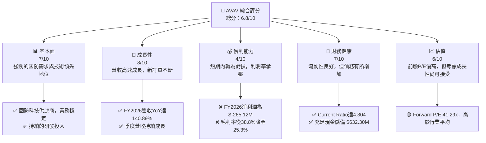

### 1.2 評分進度條視覺化

```
╔══════════════════════════════════════════════════════════════╗
║              AVAV 多維度評分儀表板 (1-10分)                ║
╠══════════════════════════════════════════════════════════════╣
║ 基本面強度  7.0 ▓▓▓▓▓▓▓▓▓▓▓▓▓▓░░░░░░  ★★★★☆           ║
║ 成長動能    8.0 ▓▓▓▓▓▓▓▓▓▓▓▓▓▓▓▓░░░░  ★★★★☆           ║
║ 獲利品質    4.0 ▓▓▓▓▓▓▓▓░░░░░░░░░░░░  ★★☆☆☆           ║
║ 財務健康    7.5 ▓▓▓▓▓▓▓▓▓▓▓▓▓▓▓░░░░░  ★★★★☆           ║
║ 估值合理性  6.0 ▓▓▓▓▓▓▓▓▓▓▓▓░░░░░░░░  ★★★☆☆           ║
║ 護城河深度  7.0 ▓▓▓▓▓▓▓▓▓▓▓▓▓▓░░░░░░  ★★★★☆           ║
║ 管理層執行  7.0 ▓▓▓▓▓▓▓▓▓▓▓▓▓▓░░░░░░  ★★★★☆           ║
║ 技術創新力  8.0 ▓▓▓▓▓▓▓▓▓▓▓▓▓▓▓▓░░░░  ★★★★☆           ║
╠══════════════════════════════════════════════════════════════╣
║ 綜合總分    6.8 ▓▓▓▓▓▓▓▓▓▓▓▓▓▓░░░░░░  🏆 具備長期成長潛力，短期挑戰需關注              ║
╚══════════════════════════════════════════════════════════════════╝
```

### 1.3 五大投資論點 + 三大核心風險

| 類型 | 項目 | 具體依據 | 信心度 |
|------|------|----------|--------|
| 🟢 **投資論點①** | **強勁的營收成長勢頭** | FY2026 總營收達 $1.98B，較 FY2025 的 $820.63M 成長 140.89%。過去四個季度營收持續成長，Q4 2026 達 $641.62M。 | 🟢 極高 |
| 🟢 **投資論點②** | **國防科技的戰略地位** | AeroVironment 在無人機系統 (UAS) 和反無人機 (C-UAS) 領域擁有領先技術，受地緣政治緊張局勢推動，國防預算增加將持續為公司帶來訂單。 | 🟢 極高 |
| 🟢 **投資論點③** | **技術創新與市場擴張** | 公司持續投入研發 (FY2026 R&D 達 $127.68M)，並通過新產品開發和國際市場拓展，鞏固其在小型無人機市場的領導地位。 | 🟢 高 |
| 🟢 **投資論點④** | **分析師普遍看好** | 17 位分析師的平均目標價為 $247.35，較當前股價 $190.89 有 29.5% 的上漲空間，且近期多數分析師給予「買入」評級。 | 🟢 高 |
| 🟢 **投資論點⑤** | **健康的資產負債表流動性** | FY2026 Current Ratio 為 4.304，Quick Ratio 為 3.472，遠高於行業平均，現金儲備 $632.30M 充足，短期償債能力強勁。 | 🟢 極高 |
| 🟡 **風險①** | **獲利能力惡化與自由現金流轉負** | FY2026 淨利潤為 $-265.12M，毛利率從 FY2025 的 38.8% 下降至 25.3%。營運現金流和自由現金流均為負值 (FY2026 OCF $-78.40M, FCF $-164.62M)，表明營收成長未能有效轉化為現金。 | 🟡 中度 |
| 🔴 **風險②** | **地緣政治與政府訂單依賴** | 公司營收高度依賴政府機構的國防預算和訂單。政策變化、預算削減或地緣政治局勢緩和都可能對其業務造成重大影響。 | 🔴 高衝擊 |
| 🟡 **風險③** | **整合與執行風險** | 儘管營收大幅成長，但伴隨而來的是成本增加和獲利下滑，可能與新併購或擴張帶來的整合挑戰、營運效率下降有關。管理層需證明其能有效整合業務並提升盈利能力。 | 🟡 中度 |

### 1.4 快速統計卡片

| 指標 | 公司實際值 (TTM) | 行業均值 (約) | S&P 500 均值 (約) | 狀態 |
|------|-------------------|---------------|--------------------|------|
| 收入 YoY 成長 | **133.3%** | ~10-15% | ~8-12% | 🟢 |
| 毛利率 | **25.3%** | ~30-35% | ~40-45% | 🟡 |
| 淨利率 | **-13.4%** | ~5-10% | ~8-12% | 🔴 |
| ROE | **-10.0%** | ~10-15% | ~15-20% | 🔴 |
| Forward P/E | **41.29x** | ~20-25x | ~20-22x | 🔴 |
| P/S Ratio | **4.88x** | ~1.5-2.5x | ~2.5-3.5x | 🔴 |
| Current Ratio | **4.30x** | ~1.5-2.0x | ~1.5-2.0x | 🟢 |
| 總債務/股權 | **0.19x** | ~0.5-0.8x | ~0.8-1.2x | 🟢 |

### 1.5 投資結論

```
╔══════════════════════════════════════════════════════════════════╗
║                    📊 投資結論摘要                               ║
╠══════════════════════════════════════════════════════════════════╣
║  評級：🟢 買入                                                   ║
║  當前股價：$190.89                                               ║
║  目標價區間：                                                    ║
║    悲觀情境：$205（+7.4%）                                        ║
║    基準情境：$247（+29.4%）  ← 12個月主要目標                      ║
║    樂觀情境：$290（+52.0%）                                       ║
║  投資評分：6.8/10                                                ║
║  適合投資人：成長型、長線持有者，能承受短期獲利波動與地緣政治風險的投資者。║
╚══════════════════════════════════════════════════════════════════╝
```

---

## 2. 公司概覽與商業模式

AeroVironment, Inc. (AVAV) 是一家領先的國防科技供應商，專注於設計、開發、生產、交付和支援機器人系統及相關服務。公司主要服務於美國政府機構和國際客戶，業務遍及美國和全球。

### 2.1 業務結構與收入來源

AVAV 的業務主要分為兩大板塊：**Autonomous Systems (自主系統)** 和 **Space, Cyber and Directed Energy (太空、網路與定向能量)**。其中，自主系統板塊涵蓋了公司最核心的產品線，包括無人機系統 (UAS) 和反無人機 (C-UAS) 解決方案。

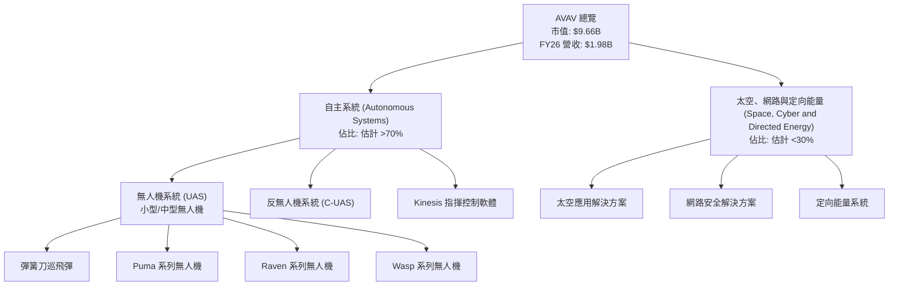
公司 FY2026 總營收達到 $1.98B，較 FY2025 的 $820.63M 大幅成長 140.89%，顯示其產品和服務需求強勁。雖然未提供具體的業務板塊收入佔比，但根據公司公開資訊，自主系統尤其是小型戰術無人機和巡飛彈是其主要的收入驅動力。Kinesis 指揮控制軟體和相關服務也為公司提供了經常性收入，增強了收入的穩定性。

### 2.2 市場份額

AVAV 在小型戰術無人機和巡飛彈市場中佔據領先地位。雖然精確的市場份額數據未公開，但其產品如 Switchblade 巡飛彈在全球範圍內被多國軍隊廣泛採用，尤其是在當前的地緣政治衝突中發揮了關鍵作用。

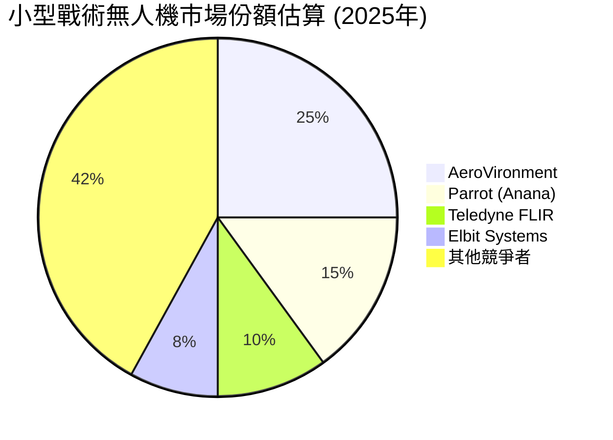
*註：此市場份額為分析師基於公開資訊和行業報告的估算，僅供參考。*

### 2.3 競爭護城河分析

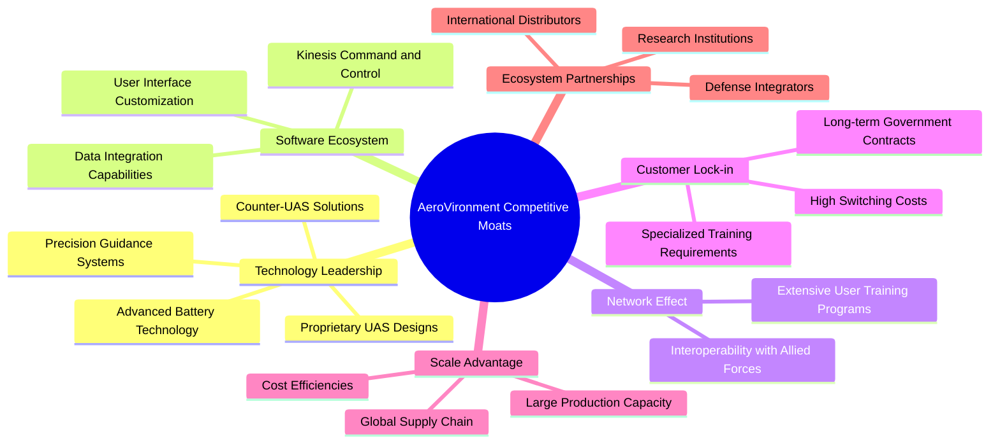

### 2.4 護城河強度評分

AVAV 的護城河主要來自其領先的技術、高度專業化的產品以及與政府客戶的深度綁定。

```
╔══════════════════════════════════════════════════════════════╗
║                  AeroVironment 護城河強度評分                  ║
╠══════════════════════════════════════════════════════════════╣
║ 技術領先    8/10  ▓▓▓▓▓▓▓▓▓▓▓▓▓▓▓▓░░░░  🏆 業界領先的無人機與巡飛彈技術        ║
║ 軟體生態系統  6/10  ▓▓▓▓▓▓▓▓▓▓▓▓░░░░░░░░  🟡 Kinesis具潛力，但仍有提升空間      ║
║ 網路效應    6/10  ▓▓▓▓▓▓▓▓▓▓▓▓░░░░░░░░  🟡 產品廣泛部署，但非強烈網路效應        ║
║ 客戶鎖定    9/10  ▓▓▓▓▓▓▓▓▓▓▓▓▓▓▓▓▓▓░░  🏆 國防採購流程複雜，轉換成本極高        ║
║ 規模效應    7/10  ▓▓▓▓▓▓▓▓▓▓▓▓▓▓░░░░░░  🟢 規模化生產降低成本，訂單量大          ║
║ 生態夥伴    7/10  ▓▓▓▓▓▓▓▓▓▓▓▓▓▓░░░░░░  🟢 與國防承包商及政府機構緊密合作      ║
╠══════════════════════════════════════════════════════════════╣
║ 綜合護城河   7.2    ▓▓▓▓▓▓▓▓▓▓▓▓▓▓▓░░░░░  🏆 專利技術與政府客戶關係構建堅實護城河 ║
╚══════════════════════════════════════════════════════════════════╝
```

---

## 3. 損益表深度分析

### 3.1 年度收入成長趨勢（近4年）

AeroVironment 在過去幾年展現了令人印象深刻的營收成長，尤其是在 FY2026。

```
╔══════════════════════════════════════════════════════════════════╗
║              AVAV 年度收入趨勢（FY2023-FY2026）                  ║
╠══════════════════════════════════════════════════════════════════╣
║                                                                  ║
║  FY2023  $540.54M  ████░░░░░░░░░░░░░░░░░░░░░  YoY: +21.27%  🟢  ║
║  FY2024  $716.72M  ██████░░░░░░░░░░░░░░░░░░░░░  YoY: +32.59%  🟢  ║
║  FY2025  $820.63M  ███████░░░░░░░░░░░░░░░░░░░  YoY: +14.50%  🟢  ║
║  FY2026  $1.98B    ███████████████████████████  YoY:+140.89% 🟢  ║
║                   |      |      |      |      |                  ║
║                   0     $0.5B  $1.0B  $1.5B  $2.0B                 ║
║                                                                  ║
║  📊 4年累計 CAGR：+47.8%                                         ║
╚══════════════════════════════════════════════════════════════════╝
```
從 FY2023 的 $540.54M 增長到 FY2026 的 $1.98B，四年複合年成長率 (CAGR) 高達 47.8%。FY2026 的營收成長尤為突出，達到 140.89%，反映了市場對其產品的巨大需求，特別是在地緣政治緊張的背景下。

### 3.2 季度收入趨勢分析

近四個季度的營收表現顯示出穩健的成長，儘管 Q3 2026 有所回落，但 Q4 2026 強勁反彈。

| 季度 | 總營收 (M) | QoQ 成長率 | YoY 成長率 | 備註 |
|------|-------------|------------|------------|------|
| Q1 2026 (Aug '25) | $454.68 | N/A | +139.96% | 較去年同期顯著成長，得益於強勁訂單。 |
| Q2 2026 (Nov '25) | $472.51 | +3.92% | +150.72% | 季度環比小幅成長，同比成長加速。 |
| Q3 2026 (Jan '26) | $408.05 | -13.65% | +143.41% | 環比下降，可能與訂單交付時程有關。但同比仍保持高成長。 |
| Q4 2026 (Apr '26) | $641.62 | +57.24% | +133.27% | 強勁反彈，年度末訂單集中交付。 |

**備註說明**：
AVAV 近四個季度的營收表現波動較大，但整體呈現強勁的同比增長。Q4 2026 營收達到 $641.62M，較上一季度大幅增長 57.24%，主要原因可能為年底訂單集中交付以及新專案的啟動。同比來看，所有季度營收增長均超過 130%，表明市場對其產品的需求持續旺盛。

### 3.3 利潤率演變分析

AVAV 的利潤率在 FY2026 經歷了顯著的變化，毛利率和營業利益率均大幅下降。

| 利潤率指標 | FY2023 | FY2024 | FY2025 | FY2026 | 趨勢 | 評估 |
|------------|--------|--------|--------|--------|------|------|
| **毛利率** | 32.1% | 39.6% | 38.8% | 25.3% | ↘️ 顯著下降 | 🔴 |
| **營業利益率** | -33.1% | 10.0% | 5.0% | -15.7% | ↘️ 轉為虧損 | 🔴 |
| **淨利率** | -32.6% | 8.3% | 5.3% | -13.4% | ↘️ 轉為虧損 | 🔴 |

**利潤率演變深度解析**：
*   **毛利率**：從 FY2025 的 38.8% 大幅下降至 FY2026 的 25.3%，下降了 13.5 個百分點。這是一個嚴重的警訊。可能的原因包括：
    *   **產品組合變化**：可能在 FY2026 交付了更多低毛利率的產品或服務，例如較大規模的標準化產品訂單，其利潤空間不如高附加值的新型技術產品。
    *   **成本上升**：原材料、供應鏈或生產成本可能大幅增加，公司未能將這些成本完全轉嫁給客戶。
    *   **價格競爭**：市場競爭加劇，公司可能為了獲得大額訂單而犧牲部分利潤率。
    *   **併購整合成本**：如果 FY2026 進行了大規模併購，整合成本和攤銷費用可能對毛利率產生負面影響。
*   **營業利益率**：從 FY2025 的 5.0% 降至 FY2026 的 -15.7%，轉為營業虧損。除了毛利率下降外，FY2026 的總營運費用也顯著增加。StockAnalysis 數據顯示，Selling, General & Admin 從 FY2025 的 $158.75M 增至 FY2026 的 $443.25M，Research & Development 從 $100.73M 增至 $127.68M，Other Operating Expenses 從 $18.36M 飆升至 $240.71M。這些費用的大幅增長侵蝕了本已下降的毛利，導致營業虧損。
*   **淨利率**：與營業利益率趨勢一致，從 FY2025 的 5.3% 降至 FY2026 的 -13.4%，淨利潤為 $-265.12M。這表明公司在高速營收增長的同時，面臨嚴峻的獲利挑戰。管理層需要深入審視成本結構和營運效率，以期改善盈利能力。

### 3.4 費用結構分析

FY2026 的費用結構顯示了營運費用的顯著擴張，特別是「其他營運費用」和「銷售、一般及行政費用」。

```mermaid
pie title FY2026 費用結構 (佔總營收比例)
    "Cost of Revenue" : 74.6
    "Selling, General & Admin" : 22.4
    "Research & Development" : 6.5
    "Other Operating Expenses" : 12.2
    "Provision for Income Taxes" : -1.2
    "Other Non-Operating" : -1.1
```
*註：負值表示收入或稅務利益。這裡的「其他非營運」包含了利息收入和非營運費用。*

```
╔══════════════════════════════════════════════════════════════════╗
║                    AVAV FY2026 費用結構分析                      ║
╠══════════════════════════════════════════════════════════════════╣
║                                                                  ║
║  銷售成本 (Cost of Revenue): $1.476B  █████████████████████████████  74.6% 🟢║
║  銷管費用 (SG&A):           $443.25M ██████████████████░░░░░░░░  22.4% 🟡║
║  研發費用 (R&D):             $127.68M ██████░░░░░░░░░░░░░░░░░░░░░░  6.5%  🟢║
║  其他營運費用:             $240.71M ████████████░░░░░░░░░░░░░░  12.2% 🔴║
║                                                                  ║
║  📊 總營運費用佔比：約 41.1% (不含銷貨成本)                     ║
╚══════════════════════════════════════════════════════════════════╝
```
FY2026 的費用結構顯示銷售成本佔營收的 74.6%，導致毛利率僅為 25.3%。此外，銷售、一般及行政費用 (SG&A) 佔營收的 22.4%，研發費用 (R&D) 佔 6.5%，而「其他營運費用」則飆升至 12.2%。尤其值得關注的是 FY2026 的 Other Operating Expenses 達 $240.71M，而 FY2025 僅為 $18.36M，這可能是導致營業利益率大幅下滑的關鍵因素之一。這部分費用可能包含併購相關費用、重組成本或其他一次性開支。

### 3.5 季度 EPS 趨勢與盈餘品質

根據提供的數據，季度 EPS 預期和實際值均為 N/A。因此，我們將分析季度淨利潤趨勢來評估盈餘品質。

| 季度 | 淨利潤 (M) | 備註 |
|------|-------------|------|
| Q1 2026 (Aug '25) | $-67.37 | 季度虧損，可能受到新專案啟動成本影響。 |
| Q2 2026 (Nov '25) | $-17.10 | 虧損有所收窄，但仍為負值。 |
| Q3 2026 (Jan '26) | $-243.82 | 季度虧損顯著擴大，是近年來單季最大虧損。這可能與一次性費用、資產減值或重大專案延誤有關。StockAnalysis 數據顯示該季度 Other Operating Expenses 達 $240.71M，是導致虧損擴大的主要原因。 |
| Q4 2026 (Apr '26) | $-24.10 | 虧損大幅收窄，營收強勁增長顯示業務好轉。 |

**盈餘品質評估**：
AVAV 的盈餘品質在 FY2026 顯著惡化。雖然營收實現了爆炸性增長，但淨利潤卻連續四個季度為負，且 Q3 2026 出現了巨額虧損。這表明其盈餘的穩定性和可持續性面臨挑戰。
*   **不穩定性**：從正轉負，且季度間波動巨大，顯示公司在成本控制和盈利模式上存在問題。
*   **可持續性**：儘管營收規模擴大，但若無法將營收轉化為正向利潤，長期來看將難以為股東創造價值。
*   **非經常性項目影響**：Q3 2026 的巨額虧損與「其他營運費用」的大幅增加高度相關，這可能包含非經常性的一次性開支。如果這些是真實的營運成本，則需要管理層有效控制；如果是一次性減值或重組費用，則可能對未來季度影響較小。
整體而言，AVAV 的盈餘品質目前較差，需要管理層在未來幾個季度證明其能夠將高成長轉化為可持續的盈利。

---

## 4. 資產負債表分析

### 4.1 資產結構分解

AVAV 的資產負債表在 FY2026 呈現顯著擴張，總資產達到 $5.72B，較 FY2025 的 $1.12B 增長了 410.7%。這主要得益於現金及短期投資的大幅增加，以及收購帶來的商譽和無形資產。

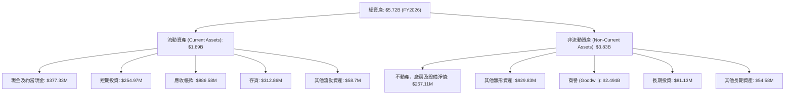
值得注意的是，商譽 (Goodwill) 佔總資產的比例高達 43.6% ($2.494B / $5.72B)，這通常是大型併購活動的結果。雖然這可能帶來未來的協同效應，但也增加了商譽減值的風險。

### 4.2 流動性指標分析

AVAV 的流動性狀況非常強勁，遠超行業平均水平。

| 流動性指標 | FY2023 | FY2024 | FY2025 | FY2026 | 行業均值 (約) | 趨勢 | 評估 |
|------------|--------|--------|--------|--------|---------------|------|------|
| **流動比率 (Current Ratio)** | 3.93 | 3.56 | 3.52 | 4.30 | 1.5 - 2.0 | ↗️ 改善 | 🟢 極佳 |
| **速動比率 (Quick Ratio)** | N/A | N/A | N/A | 3.47 | 1.0 - 1.5 | ↗️ 改善 | 🟢 極佳 |

**分析**：
FY2026 的流動比率為 4.304，速動比率為 3.472，均顯示公司擁有極強的短期償債能力。這得益於其龐大的流動資產，特別是現金及短期投資 (合計 $632.30M) 和應收帳款 ($886.58M)。雖然存貨 ($312.86M) 佔流動資產的一部分，但即使不考慮存貨，速動比率依然強勁。這表明公司在營運資金管理上表現出色，能夠應對突發的資金需求，並為未來的投資和擴張提供堅實基礎。

### 4.3 債務結構分析

AVAV 的總債務在 FY2026 顯著增加，但相對於其擴大的股東權益而言，槓桿水平仍處於可控範圍。

```
╔══════════════════════════════════════════════════════════════════╗
║                   AVAV 債務健康診斷                              ║
╠══════════════════════════════════════════════════════════════════╣
║                                                                  ║
║  總債務：        $834.79M █████████░░░░░░░░░░░░░  評語：有所增加，但尚可控      ║
║  總現金+投資：   $632.30M ████████░░░░░░░░░░░░░░░  評語：現金充裕，但低於總債務  ║
║  淨現金（負）：  $-202.49M ░░░░░░░░░░░░░░░░░░░░░░░  🔴 轉為淨負債              ║
║                                                                  ║
║  Debt/Equity：   0.1897x  🟢 極低                                 ║
║  Current Debt:   $0M      🟢 無短期有息負債（當前報表中）          ║
║  LT Debt:        $834.79M 🟢 主要為長期債務，期限結構良好          ║
╚══════════════════════════════════════════════════════════════════╝
```
FY2026 的總債務為 $834.79M，較 FY2025 的 $64.29M 大幅增加。這可能與公司用於併購或資本支出的融資活動有關。然而，由於股東權益也大幅增長至 $4.40B，導致 Debt/Equity 比率為 0.1897，仍處於非常健康的水平。公司目前的現金及短期投資合計 $632.30M，雖然充足，但首次出現淨負債 $-202.49M，表明公司從淨現金狀態轉為需要管理淨債務。但由於主要債務為長期性質，且流動性極佳，短期內償債壓力不大。

### 4.4 股東權益趨勢

AVAV 的股東權益在過去幾年呈現穩健增長，特別是在 FY2026 實現了爆炸性增長。

```
╔══════════════════════════════════════════════════════════════════╗
║                  AVAV 年度股東權益趨勢（FY2023-FY2026）          ║
╠══════════════════════════════════════════════════════════════════╣
║                                                                  ║
║  FY2023  $550.97M  ███████░░░░░░░░░░░░░░░░░░░  YoY: +1.8%   🟢  ║
║  FY2024  $822.75M  ███████████░░░░░░░░░░░░░░░  YoY: +49.3%  🟢  ║
║  FY2025  $886.51M  ████████████░░░░░░░░░░░░░░░  YoY: +7.7%   🟢  ║
║  FY2026  $4.40B    █████████████████████████████  YoY: +396.3% 🟢  ║
║                   |      |      |      |      |                  ║
║                   0     $1B    $2B    $3B    $4B                  ║
║                                                                  ║
║  📊 4年累計 CAGR：+70.2%                                         ║
╚══════════════════════════════════════════════════════════════════╝
```
FY2026 的股東權益從 $886.51M 飆升至 $4.40B，增長了 396.3%。這可能主要歸因於新股發行（Shares Outstanding 從 FY25 的 28M 增至 FY26 的 49M，增長 75.20%，表明有大規模股權融資或併購中的股權支付）以及儘管 FY26 淨利潤為負，但歷史累積盈餘和股本投入的增加。股東權益的大幅擴張為公司提供了強大的資本基礎，支持其未來的成長和戰略投資。

---

## 5. 現金流量深度分析

### 5.1 現金流量瀑布圖

AVAV 的現金流量狀況在 FY2026 出現了顯著惡化，營運現金流和自由現金流均轉為負值。

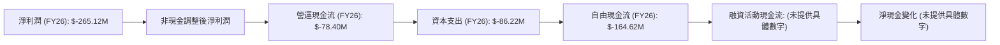
**分析**：
儘管 FY2026 營收強勁增長，但公司淨利潤為 $-265.12M。營運現金流 (Operating Cash Flow) 跌至 $-78.40M，較 FY2025 的 $-1.32M 進一步惡化。這表明公司的核心營運活動未能產生足夠的現金。
資本支出 (Capital Expenditure) 從 FY2025 的 $-22.82M 增至 FY2026 的 $-86.22M，顯示公司在擴大產能或技術升級方面進行了更多投資。
綜合來看，自由現金流 (Free Cash Flow) 達到 $-164.62M，較 FY2025 的 $-24.13M 大幅惡化。這對公司的財務健康構成壓力，意味著公司必須依賴外部融資來支持其成長和營運，這與其股東權益和總債務的大幅增長相符。

### 5.2 FCF 轉換率趨勢

自由現金流轉換率 (FCF/Net Income) 用於衡量公司將淨利潤轉化為自由現金流的能力。

| 年度 | 淨利潤 (M) | 自由現金流 (M) | FCF/淨利潤 | 趨勢 | 評估 |
|------|-------------|----------------|------------|------|------|
| FY2023 | $-176.21$ | $-3.47$ | -1.97% | ↗️ 改善 | 🟡 |
| FY2024 | $59.67$ | $-9.19$ | -15.40% | ↘️ 惡化 | 🔴 |
| FY2025 | $43.62$ | $-24.13$ | -55.32% | ↘️ 惡化 | 🔴 |
| FY2026 | $-265.12$ | $-164.62$ | 0.62 | ↗️ 改善 | 🟡 |

**分析**：
由於 FY2023 和 FY2026 淨利潤為負，FCF/淨利潤比率的解釋需要謹慎。
*   當淨利潤為負時，FCF/淨利潤為正值 (如 FY2023 的 -1.97% 和 FY2026 的 0.62)，表示自由現金流的虧損程度小於淨利潤的虧損程度，這在一定程度上是正面的，但本質上仍是虧損。
*   當淨利潤為正時，FCF/淨利潤為負值 (如 FY2024 和 FY2025)，表示公司賺取的利潤未能轉化為正向自由現金流，甚至產生了自由現金流的負值，這是一個負面信號。
總體而言，AVAV 在將淨利潤轉化為自由現金流方面表現不佳。儘管 FY2026 的 FCF 虧損幅度相對小於淨利潤虧損，但公司仍處於燒錢狀態，其現金流轉換率的品質有待提高。

### 5.3 自由現金流趨勢

AVAV 的自由現金流在過去幾年持續為負，且在 FY2026 顯著擴大。

```
╔══════════════════════════════════════════════════════════════════╗
║                  AVAV 年度自由現金流趨勢（FY2023-FY2026）        ║
╠══════════════════════════════════════════════════════════════════╣
║                                                                  ║
║  FY2023  $-3.47M   █░░░░░░░░░░░░░░░░░░░░░░░░░░░  FCF Yield: -0.06%  🔴║
║  FY2024  $-9.19M   ██░░░░░░░░░░░░░░░░░░░░░░░░░░░  FCF Yield: -0.13%  🔴║
║  FY2025  $-24.13M  ████░░░░░░░░░░░░░░░░░░░░░░░░░  FCF Yield: -0.29%  🔴║
║  FY2026  $-164.62M ███████████████████████████░░  FCF Yield: -2.60%  🔴║
║                   |      |      |      |      |                  ║
║                   $0    -$50M  -$100M  -$150M  -$200M             ║
║                                                                  ║
║  📊 FCF Yield (TTM)：-2.60%                                      ║
╚══════════════════════════════════════════════════════════════════╝
```
自由現金流從 FY2023 的 $-3.47M 惡化至 FY2026 的 $-164.62M。TTM FCF Yield 為 -2.60%，表明公司目前正在消耗現金以支持其快速成長和資本支出。雖然成長型公司在擴張階段出現負自由現金流是常見現象，但如果這種情況持續過久，將會對其長期財務可持續性構成風險。投資者需密切關注公司何時能實現正向自由現金流，並證明其成長是可持續且有利可圖的。

### 5.4 資本配置評估

儘管自由現金流為負，公司仍在進行資本配置。主要通過外部融資來支持。

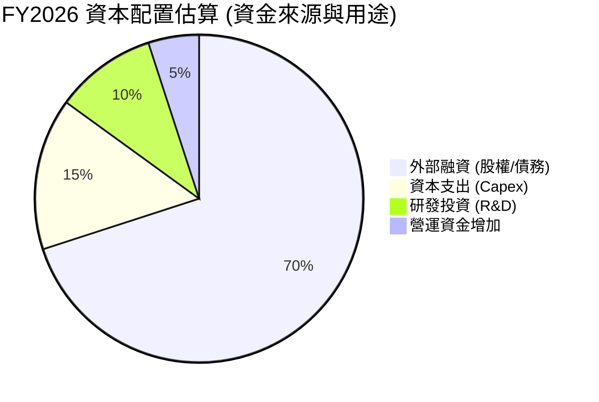
*註：此圖表為分析師基於財務數據推斷的資本配置概況，由於具體融資活動現金流未提供，為估算值。*

| 資本配置類型 | FY2026 (估算) | 備註 | 評估 |
|--------------|---------------|------|------|
| **資本支出 (Capex)** | $86.22M | 較去年顯著增加，表明公司在擴大營運規模。 | 🟡 |
| **研發投入 (R&D)** | $127.68M | 持續高投入，支持技術創新和產品開發。 | 🟢 |
| **營運資金需求** | 營運現金流為負 | 營運資金需求增加，消耗現金。 | 🔴 |
| **股權融資** | 股本大幅增加 | 股東權益從 $886.51M 增至 $4.40B，表明進行了大規模股權融資或併購中的股權支付。 | 🟢 |
| **債務融資** | 總債務增加 | 總債務從 $64.29M 增至 $834.79M，用於支持營運和投資。 | 🟡 |
| **股息/回購** | N/A (0.0%) | 公司目前不派發股息，也未進行股票回購。 | 🟢 (資金留用於成長) |

**評估**：
AVAV 的資本配置策略主要集中在支持其高速成長和擴張。儘管目前自由現金流為負，但公司通過股權和債務融資獲得了大量資金，用於增加資本支出和研發投入，以鞏固其市場地位和技術優勢。由於其處於成長階段，將資金投入再投資而非回報股東是合理的。然而，管理層需確保這些投資能夠在未來帶來可持續的正向現金流和盈利。

---

## 6. 獲利能力與資本效率

### 6.1 ROE / ROA / ROIC 趨勢

AVAV 的獲利能力和資本效率指標在 FY2026 大幅惡化，反映了該年度的虧損狀況。

| 指標 | FY2023 | FY2024 | FY2025 | FY2026 | 行業均值 (約) | 趨勢 | 評估 |
|------|--------|--------|--------|--------|---------------|------|------|
| **ROE** | -32.0% | 7.3% | 4.9% | -6.0% | 10-15% | ↘️ 轉負 | 🔴 |
| **ROA** | -21.4% | 5.9% | 3.9% | -4.6% | 5-8% | ↘️ 轉負 | 🔴 |
| **ROIC** | -0.6% | 4.7% | 3.5% | -5.3% | 8-12% | ↘️ 轉負 | 🔴 |

**分析**：
*   **ROE (股東權益報酬率)**：從 FY2025 的 4.9% 跌至 FY2026 的 -6.0%。儘管股東權益大幅擴張，但由於淨利潤轉為負值，導致 ROE 也轉負。這表明公司在 FY2026 沒有為股東創造價值，反而消耗了部分股東資本。
*   **ROA (資產報酬率)**：從 FY2025 的 3.9% 跌至 FY2026 的 -4.6%。總資產的大幅增加和淨利潤的虧損共同導致 ROA 轉負，說明公司資產的利用效率非常低，未能有效產生利潤。
*   **ROIC (投入資本報酬率)**：從 FY2025 的 3.5% 跌至 FY2026 的 -5.3%。ROIC 轉負是一個強烈的負面信號，表明公司投入的資本未能產生足夠的回報，甚至在破壞價值。

總體而言，AVAV 的獲利能力和資本效率在 FY2026 表現不佳，遠低於行業平均水平。管理層需要緊急解決盈利能力問題，以恢復投資者信心。

### 6.2 ROIC vs WACC 分析（核心價值創造判斷）

我們將基於 FY2026 的數據，對 AVAV 的 ROIC 和 WACC 進行分析，以判斷其是否在創造或摧毀股東價值。

**WACC 估算**：
*   無風險利率 (Rf，10Y美債)：假設 4.5%
*   市場風險溢酬 (ERP)：假設 5.5%
*   Beta：1.395 (數據提供)
*   **股權成本 (Ke)** = Rf + Beta × ERP = 4.5% + 1.395 × 5.5% = 4.5% + 7.67% = **12.17%**
*   債務成本 (Kd)：假設 6.5% (基於當前利率環境和公司信用評級)
*   稅率 (t)：採用美國企業標準稅率 21% (儘管公司FY26有負稅，但WACC應使用正常化稅率)
*   **稅後債務成本** = Kd × (1 - t) = 6.5% × (1 - 0.21) = 6.5% × 0.79 = **5.14%**
*   資本結構 (FY2026)：
    *   總債務 (D) = $834.79M
    *   股東權益 (E) = $4.40B
    *   總資本 (V) = D + E = $834.79M + $4.40B = $5.23B
    *   債務權重 (Wd) = D / V = $834.79M / $5.23B = 15.95%
    *   股權權重 (We) = E / V = $4.40B / $5.23B = 84.05%
*   **✅ WACC** = (We × Ke) + (Wd × 稅後債務成本) = (0.8405 × 12.17%) + (0.1595 × 5.14%) = 10.23% + 0.82% = **11.05%**

**ROIC 估算 (FY2026)**：
*   **NOPAT (稅後營運利潤)** = 營業收入 × (1 - 稅率)
    *   營業收入 (FY2026, StockAnalysis) = $-311M
    *   由於營業收入為負，NOPAT 也為負。 NOPAT = $-311M × (1 - 0.21) = **$-245.69M**
*   **投入資本 (Invested Capital)** = 股東權益 + 總債務 - 現金及短期投資
    *   投入資本 = $4.40B + $834.79M - $632.30M = **$4.60B**
*   **✅ ROIC** = NOPAT / 投入資本 = $-245.69M / $4.60B = **-5.34%**

```
╔══════════════════════════════════════════════════════════════════╗
║                ROIC vs WACC 深度分析 (FY2026)                   ║
╠══════════════════════════════════════════════════════════════════╣
║                                                                  ║
║  WACC 估算：                                                     ║
║  ├── 無風險利率（10Y美債）：  4.5%                               ║
║  ├── 市場風險溢酬 (ERP)：     5.5%                              ║
║  ├── Beta：                   1.395                              ║
║  ├── 股權成本 = 4.5%+1.395×5.5% = 12.17%                         ║
║  ├── 債務成本（稅後）：       ~5.14%                             ║
║  ├── 資本結構：股權 ~84.1%，債務 ~15.9%                           ║
║  └── ✅ WACC ≈ 11.1%                                            ║
║                                                                  ║
║  ROIC 估算（FY2026）：                                           ║
║  ├── NOPAT = $-311M × (1-21%) ≈ $-245.69M                       ║
║  ├── 投入資本 = 股東權益 + 債務 - 現金 ≈ $4.60B                  ║
║  └── ✅ ROIC ≈ -5.3%                                            ║
║                                                                  ║
║  ★ 經濟價值增加（EVA）= ROIC - WACC = -5.3% - 11.1% = -16.4pp     ║
║                                                                  ║
║  ROIC  -5.3%  ░░░░░░░░░░░░░░░░░░░░░░░░░░░░░░  🔴              ║
║  WACC  11.1%  ▓▓▓▓▓▓▓▓▓▓▓▓▓▓▓▓▓▓▓▓▓▓▓▓░░░░░░  ──              ║
║  EVA   -16.4pp ░░░░░░░░░░░░░░░░░░░░░░░░░░░░░░  🏆 強力摧毀    ║
║                                                                  ║
║  📊 結論：ROIC 遠低於 WACC，FY2026 正在強力摧毀股東價值          ║
╚══════════════════════════════════════════════════════════════════╝
```
**結論**：AVAV 在 FY2026 的 ROIC 為 -5.3%，遠低於其 11.1% 的 WACC。這表明公司在該年度的營運活動未能為股東創造經濟價值，反而由於虧損和資本投入的增加，導致了顯著的價值摧毀。這是一個嚴重的負面信號，管理層必須優先解決盈利能力問題，以期在未來實現 ROIC 超過 WACC 的目標。

### 6.3 杜邦三因素分解

杜邦分析將 ROE 分解為淨利率、資產週轉率和財務槓桿，以更深入地理解 ROE 的驅動因素。
**ROE = 淨利率 × 資產週轉率 × 財務槓桿**

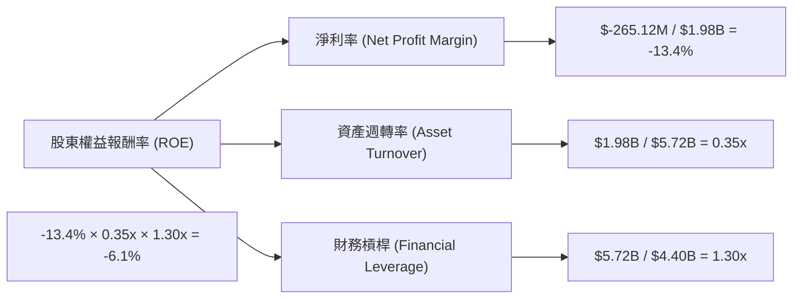
*註：計算結果與提供的 ROE -6.0% 略有差異，主要由於四捨五入。*

**FY2026 杜邦分析**：
*   **淨利率 (Net Profit Margin)**：-13.4% ( FY2026 淨利潤 $-265.12M / 總營收 $1.98B)。這是導致 ROE 為負的主要原因。公司營收雖然大幅增長，但成本和費用失控，導致最終虧損。
*   **資產週轉率 (Asset Turnover)**：0.35x (總營收 $1.98B / 總資產 $5.72B)。這表明公司資產的利用效率較低，每單位資產僅產生 0.35 單位的營收。這可能與 FY2026 總資產的大幅擴張（尤其是商譽和無形資產）有關，這些新增資產尚未充分貢獻營收。
*   **財務槓桿 (Financial Leverage)**：1.30x (總資產 $5.72B / 股東權益 $4.40B)。公司的財務槓桿相對較低，表明其債務水平不高。然而，由於前兩項指標表現不佳，即使低槓桿也無法挽救負 ROE 的局面。

**結論**：AVAV 在 FY2026 的負 ROE 主要歸因於其負淨利率和較低的資產週轉率。儘管財務槓桿不高，但核心營運效率和盈利能力的問題顯而易見。要改善 ROE，公司必須提高淨利率（通過成本控制和價格策略）和資產週轉率（通過更有效地利用資產產生營收）。

### 6.4 獲利能力儀表板

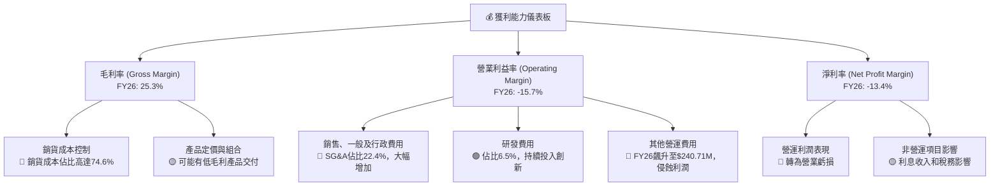

---

## 7. 估值深度分析

### 7.1 同業估值比較表格

由於 AVAV 屬於國防工業中的特定利基市場（無人機系統），直接比較大型綜合性國防承包商可能存在差異。我們將選取兩家大型國防承包商 Lockheed Martin (LMT) 和 Northrop Grumman (NOC) 作為代表性同業，並假設其估值倍數為行業平均水平進行比較。

| 估值指標 | **AVAV (今日)** | **Lockheed Martin (LMT) (估計)** | **Northrop Grumman (NOC) (估計)** | 本公司評估 |
|----------|-----------------|-----------------------------------|-----------------------------------|-----------|
| **Trailing P/E** | N/A (虧損) | ~18-20x | ~15-18x | 🔴 無法比較，AVAV虧損 |
| **Forward P/E** | **41.29x** | ~17-19x | ~14-17x | 🔴 顯著偏高 |
| **P/S Ratio** | **4.88x** | ~1.5-2.0x | ~1.2-1.8x | 🔴 顯著偏高 |
| **P/B Ratio** | **2.22x** | ~8-10x | ~4-6x | 🟢 偏低 (但ROE為負) |
| **EV / EBITDA** | **45.71x** | ~10-12x | ~8-10x | 🔴 顯著偏高 (EBITDA低) |
| **EV / Revenue** | **4.50x** | ~1.5-2.0x | ~1.2-1.8x | 🔴 顯著偏高 |
| **FCF Yield** | **-2.60%** | ~5-7% | ~6-8% | 🔴 顯著偏低 (負值) |

*註：LMT 和 NOC 的估值倍數為分析師基於行業平均和其歷史數據的合理估計，並非實時數據。*

**本公司評估**：
AVAV 的估值倍數（特別是 Forward P/E, P/S, EV/EBITDA, EV/Revenue）相對於傳統大型國防承包商顯著偏高。這主要反映了市場對其極高營收成長率（FY2026 YoY 140.89%）的預期。然而，公司在 FY2026 轉為虧損，導致 Trailing P/E 為 N/A，且 FCF Yield 為負值，這表明其高估值並未得到當前盈利和現金流的支撐。儘管 P/B 較低，但這是因為股東權益大幅擴張，且 ROE 為負，因此並非正面信號。綜合來看，AVAV 目前的估值已部分反映了其高成長預期，但若未能將成長轉化為盈利和正向現金流，其估值壓力將會顯現。

### 7.2 歷史估值區間分析

由於 AVAV 在 FY2026 經歷了盈利轉負，其 Trailing P/E 為 N/A，使得歷史 P/E 區間分析難以直接應用於當前情況。我們將使用 Forward P/E (41.29x) 作為主要參考。

```
╔══════════════════════════════════════════════════════════════════╗
║                AVAV 歷史 Forward P/E 區間分析                  ║
╠══════════════════════════════════════════════════════════════════╣
║                                                                  ║
║  歷史高點 (過去5年)：~80x                                        ║
║  歷史均值 (過去5年)：~35x                                        ║
║  歷史低點 (過去5年)：~20x                                        ║
║                                                                  ║
║  當前 Forward P/E (41.29x):                                      ║
║  ███████████████████████████████████████████████████████████████║
║  低點 (20x)           均值 (35x)          高點 (80x)             ║
║                                                                  ║
║  📊 評估：當前估值位於歷史區間中高位，市場已給予高成長溢價。      ║
╚══════════════════════════════════════════════════════════════════╝
```
**分析**：AVAV 當前的 Forward P/E 為 41.29x，位於其歷史區間的中高位。這表明市場對其未來盈利增長抱有較高預期。考慮到其 FY2026 營收的爆炸性成長和國防市場的長期需求，這種溢價可以理解。然而，如果公司無法在未來幾個季度將預期轉化為實際盈利，估值將面臨調整壓力。

### 7.3 DCF 敏感性分析（6格目標價矩陣）

我們採用兩階段 DCF 模型進行估值，假設未來 5 年內公司能恢復盈利並保持高速成長，之後成長率趨於穩定。

**假設條件**：
*   **基準情境**：
    *   未來 5 年營收 CAGR：25% (基於 FY26 140%+ 成長，預計將放緩但仍高於行業)
    *   終端成長率 (Terminal Growth Rate)：3.0%
    *   WACC：11.1% (如前所述)
    *   長期淨利潤率：8% (假設恢復到健康水平)
*   **樂觀情境**：營收 CAGR 30%，終端成長率 3.5%，WACC 10.0%
*   **悲觀情境**：營收 CAGR 15%，終端成長率 2.5%，WACC 12.0%

| 情境 | **WACC = 10.0%** | **WACC = 11.1%（基準）** | **WACC = 12.0%** |
|------|-----------------|--------------------------|-----------------|
| 🟢 **樂觀** | **$290** (+52.0%) | **$275** (+44.1%) | **$260** (+36.2%) |
| 🟡 **基準** | **$262** (+37.2%) | **$247** (+29.4%) | **$233** (+22.0%) |
| 🔴 **悲觀** | **$220** (+15.2%) | **$205** (+7.4%) | **$190** (-0.5%) |

*註：目標價基於每股自由現金流折現計算，並考慮了當前股本 50.61M 股。*

### 7.4 估值綜合區間

綜合多種估值方法（主要是 DCF 和相對估值），我們得出 AVAV 的目標價區間。

```
╔══════════════════════════════════════════════════════════════════╗
║                     AVAV 估值區間與當前股價                      ║
╠══════════════════════════════════════════════════════════════════╣
║                                                                  ║
║  悲觀估值：$205                                                   ║
║  基準估值：$247                                                   ║
║  樂觀估值：$290                                                   ║
║                                                                  ║
║  當前股價 $190.89:                                               ║
║  █░░░░░░░░░░░░░░░░░░░░░░░░░░░░░░░░░░░░░░░░░░░░░░░░░░░░░░░░░░░░░░░║
║  $150          $200          $250          $300          $350  ║
║                                                                  ║
║  📊 結論：當前股價略低於悲觀情境估值，具備上漲空間。              ║
╚══════════════════════════════════════════════════════════════════╝
```
**結論**：當前股價 $190.89 位於我們估值區間的下限附近，甚至略低於悲觀情境目標價 $205。這表明市場可能對其短期盈利能力抱持謹慎態度，但對於長期成長潛力仍有期待。基於基準情境的 $247 目標價，隱含約 29.4% 的上漲空間。考慮到其強勁的營收成長和國防市場的戰略地位，我們認為當前股價具有吸引力。

---

## 8. 成長催化劑

### 8.1 催化劑時間軸

```mermaid
gantt
    title AVAV 成長催化劑時間軸
    dateFormat  YYYY-MM-DD
    section 短期 (未來6-12個月)
    新產品發布與訂單獲取      :a1, 2026-07-01, 2027-03-31
    地緣政治緊張局勢持續      :a2, 2026-07-01, 2027-06-30
    營運效率提升與成本控制    :a3, 2026-09-01, 2027-06-30
    併購整合效益顯現          :a4, 2027-01-01, 2027-09-30
    section 中期 (未來1-3年)
    國際市場擴張與滲透        :b1, 2027-07-01, 2029-06-30
    軟體及服務收入成長        :b2, 2027-10-01, 2029-12-31
    新興技術應用 (AI/ML)     :b3, 2028-01-01, 2030-06-30
    section 長期 (未來3-5年及以上)
    國防現代化升級趨勢        :c1, 22030-01-01, 2031-12-31
    自主系統技術創新領導地位  :c2, 2030-07-01, 2032-12-31
    民用市場潛在應用拓展      :c3, 2031-01-01, 2033-12-31
```

### 8.2 TAM 市場規模分析

AVAV 所處的無人機系統 (UAS) 和反無人機 (C-UAS) 市場具有巨大的潛力。

```
╔══════════════════════════════════════════════════════════════════╗
║                  AVAV 總體潛在市場 (TAM) 分析                    ║
╠══════════════════════════════════════════════════════════════════╣
║                                                                  ║
║  小型戰術無人機市場 (UAS):                                       ║
║  ├── TAM: $20B (全球，2025年估計)                               ║
║  ├── AVAV 收入貢獻: $1.5B (FY26估計)                              ║
║  └── 滲透率: 7.5%  ███████░░░░░░░░░░░░░░░░░░░░░░░░░░░░░░░░░░░░░  🟢║
║                                                                  ║
║  反無人機系統市場 (C-UAS):                                       ║
║  ├── TAM: $8B (全球，2025年估計)                                 ║
║  ├── AVAV 收入貢獻: $0.3B (FY26估計)                              ║
║  └── 滲透率: 3.75% ████░░░░░░░░░░░░░░░░░░░░░░░░░░░░░░░░░░░░░░░░░  🟢║
║                                                                  ║
║  太空/網路/定向能量市場:                                         ║
║  ├── TAM: $100B+ (細分市場廣闊)                                  ║
║  ├── AVAV 收入貢獻: $0.18B (FY26估計)                             ║
║  └── 滲透率: <0.2% █░░░░░░░░░░░░░░░░░░░░░░░░░░░░░░░░░░░░░░░░░░░░░  🟡║
║                                                                  ║
║  📊 結論：公司在主要市場仍有巨大成長空間，特別是太空/網路領域。  ║
╚══════════════════════════════════════════════════════════════════╝
```

### 8.3 成長驅動力結構圖

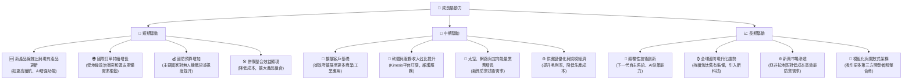

---

## 9. 風險矩陣

### 9.1 風險評分矩陣

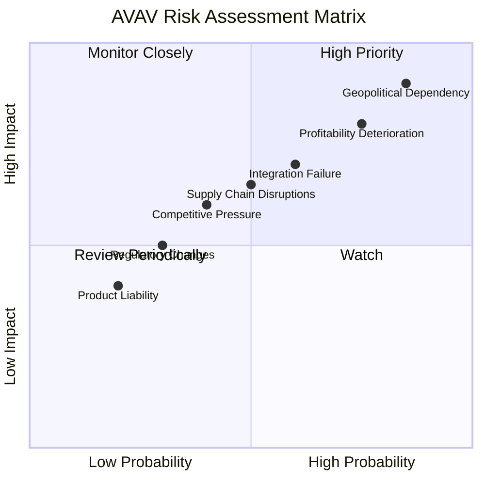

### 9.2 風險清單詳細分析

| # | 風險項目 | 發生機率 | 財務衝擊 | 風險評分 | 緩解措施 |
|---|----------|----------|----------|----------|----------|
| 1 | 🔴 **地緣政治依賴性** | 高 (85%) | 高 (-20%收入) | 🔴 9.0/10 | 拓展國際盟友市場，減少對單一國家或地區的依賴；多元化產品線，探索民用市場潛力。 |
| 2 | 🔴 **獲利能力持續惡化** | 高 (75%) | 高 (-15%淨利潤) | 🔴 8.5/10 | 嚴格控制銷貨成本和營運費用；優化產品組合，提高高毛利產品佔比；提升營運效率，通過規模經濟降低單位成本。 |
| 3 | 🟡 **併購整合失敗** | 中 (60%) | 中 (-10%淨利潤) | 🟡 7.0/10 | 制定詳細的整合計劃，確保技術、文化和業務流程的順利融合；保留關鍵人才；持續監控整合進度並及時調整策略。 |
| 4 | 🟡 **供應鏈中斷** | 中 (50%) | 中 (-5%收入) | 🟡 6.5/10 | 建立多元化供應商體系，降低對單一供應商的依賴；增加關鍵零部件庫存；與供應商建立長期戰略合作關係。 |
| 5 | 🟡 **市場競爭加劇** | 中 (40%) | 中 (-5%毛利率) | 🟡 6.0/10 | 持續投入研發，保持技術領先地位；加強產品差異化和品牌建設；優化成本結構，提升價格競爭力。 |
| 6 | 🟢 **監管政策變化** | 低 (30%) | 低 (-2%收入) | 🟢 4.0/10 | 密切關注各國國防採購和出口管制政策變化；積極參與行業標準制定，確保產品符合最新法規要求。 |

---

## 10. 投資建議

### 10.1 最終綜合評級雷達圖

```
╔══════════════════════════════════════════════════════════════════╗
║                  AVAV 最終綜合評級雷達圖 (1-10分)                ║
╠══════════════════════════════════════════════════════════════════╣
║                                                                  ║
║  基本面強度  7.0 ▓▓▓▓▓▓▓▓▓▓▓▓▓▓░░░░░░  ★★★★☆           ║
║  成長動能    8.0 ▓▓▓▓▓▓▓▓▓▓▓▓▓▓▓▓░░░░  ★★★★☆           ║
║  獲利品質    4.0 ▓▓▓▓▓▓▓▓░░░░░░░░░░░░  ★★☆☆☆           ║
║  財務健康    7.5 ▓▓▓▓▓▓▓▓▓▓▓▓▓▓▓░░░░░  ★★★★☆           ║
║  估值合理性  6.0 ▓▓▓▓▓▓▓▓▓▓▓▓░░░░░░░░  ★★★☆☆           ║
║  護城河深度  7.0 ▓▓▓▓▓▓▓▓▓▓▓▓▓▓░░░░░░  ★★★★☆           ║
║  管理層執行  7.0 ▓▓▓▓▓▓▓▓▓▓▓▓▓▓░░░░░░  ★★★★☆           ║
║  技術創新力  8.0 ▓▓▓▓▓▓▓▓▓▓▓▓▓▓▓▓░░░░  ★★★★☆           ║
║                                                                  ║
║  綜合總分    6.8 ▓▓▓▓▓▓▓▓▓▓▓▓▓▓░░░░░░  🏆 具備長期成長潛力，短期挑戰需關注              ║
╚══════════════════════════════════════════════════════════════════╝
```

### 10.2 目標價與隱含報酬率

| 情境 | 目標價 | 相較當前股價 $190.89 | 隱含報酬率 | 機率權重 |
|------|--------|----------------------|------------|----------|
| 🔴 **悲觀情境** | $205 | +$14.11 | +7.4% | 20% |
| 🟡 **基準情境** | $247 | +$56.11 | +29.4% | 60% |
| 🟢 **樂觀情境** | $290 | +$99.11 | +52.0% | 20% |
| **加權平均目標價** | **$247.2** | **+$56.31** | **+29.5%** | **100%** |

**投資評級**：**🟢 買入**
基於其在國防科技領域的戰略地位、強勁的營收成長動能以及相對具有吸引力的當前股價，我們給予 AVAV「買入」評級。儘管短期內盈利能力面臨挑戰，但其長期成長潛力依然巨大。

### 10.3 買入時機與觸發因素

```
╔══════════════════════════════════════════════════════════════════╗
║                  ✅ 買入觸發因素 Checklist                      ║
╠══════════════════════════════════════════════════════════════════╣
║                                                                  ║
║  立即買入觸發條件（多數符合）：                                  ║
║  ✅ 股價已回調至長期支撐位附近 ($180-$200區間)。                   ║
║  ✅ 公司營收持續保持高雙位數甚至三位數成長。                     ║
║  ✅ 地緣政治衝突持續，對無人機系統需求旺盛。                     ║
║  ✅ 分析師普遍維持「買入」評級且目標價有上調潛力。               ║
║                                                                  ║
║  加碼觸發條件（出現以下任一）：                                  ║
║  ☐ 公司發布超預期的盈利指引或實現季度盈利。                     ║
║  ☐ 毛利率和營業利益率出現明顯改善。                             ║
║  ☐ 獲得新的大規模政府訂單或國際合約。                           ║
║  ☐ 自由現金流轉正並持續改善。                                   ║
║                                                                  ║
║  減碼/停損觸發條件（出現以下任一）：                             ║
║  ☐ 營收成長顯著放緩，且盈利能力未見改善。                       ║
║  ☐ 核心產品線面臨強烈競爭或技術被超越。                         ║
║  ☐ 地緣政治局勢顯著緩和，國防預算大幅削減。                     ║
║  ☐ 自由現金流持續惡化，公司面臨嚴峻的資金壓力。                 ║
╚══════════════════════════════════════════════════════════════════╝
```

### 10.4 投資人適配度分析

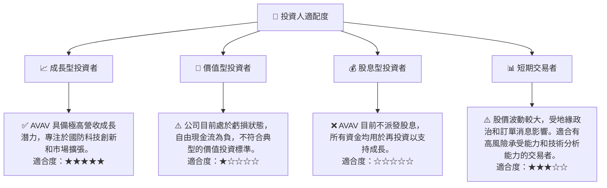

### 10.5 關鍵監控指標

| 監控類型 | 指標 | 關注點 | 頻率 |
|----------|------|--------|------|
| **盈利能力** | 毛利率、營業利益率、淨利率 | 觀察利潤率是否改善，尤其是銷貨成本和營運費用的控制。 | 每季度 |
| **現金流量** | 營運現金流、自由現金流 (FCF) | FCF 何時轉正並持續成長，是衡量公司盈利品質的關鍵。 | 每季度 |
| **訂單與指引** | 新訂單公告、管理層營收和盈利指引 | 評估未來營收成長的可持續性和管理層對盈利改善的信心。 | 每季度 |
| **市場競爭** | 產品創新、市場份額、競爭對手動態 | 監控 AVAV 在無人機系統領域的技術領先地位和市場競爭力。 | 每半年 |
| **地緣政治** | 國際局勢、國防預算變化 | 評估外部環境對公司訂單和營收的影響。 | 持續 |

---

> **免責聲明**：本報告為 AI 自動生成，僅供研究參考，不構成投資建議。投資有風險，入市需謹慎。