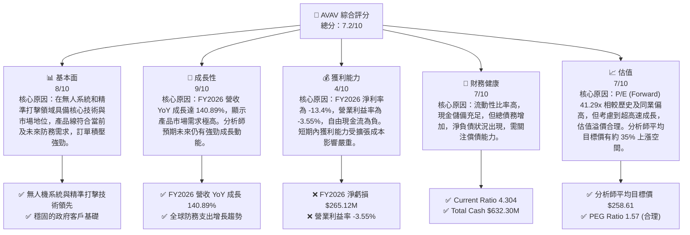
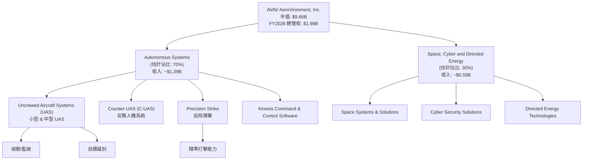
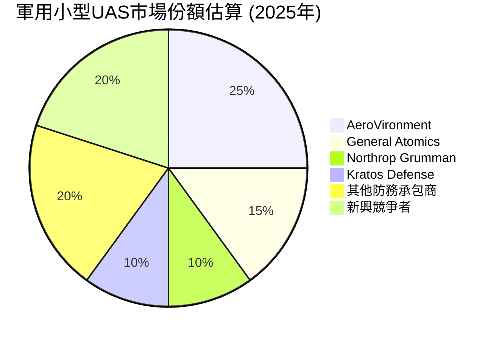
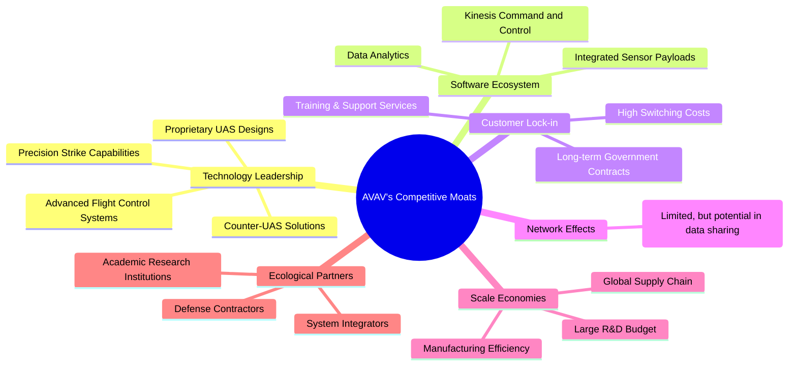
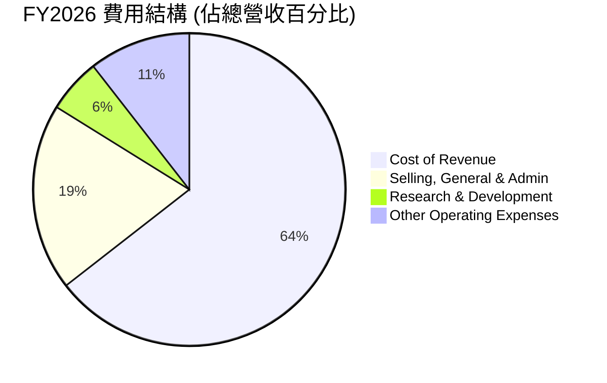
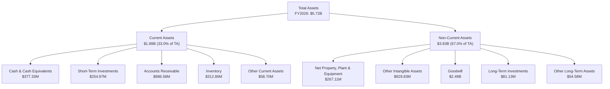
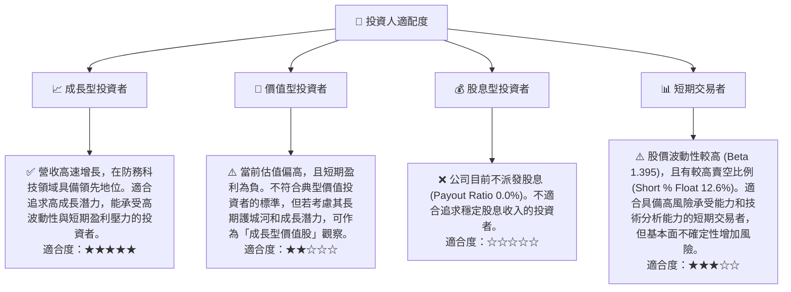

# AVAV 基本面深度分析報告
> **報告日期**：2026-07-04 ｜ **語言**：繁體中文 ｜ **數據來源**：Yahoo Finance, Finviz, StockAnalysis, Roic.ai ｜ **分析師**：CFA 級機構研究

---

## 目錄

| # | 章節 | 核心結論 |
|---|------|----------|
| 1 | 執行摘要 | 評級：買入，目標價區間：$230 - $310 |
| 2 | 公司概覽與商業模式 | 無人系統與精準打擊領導者，護城河穩固 |
| 3 | 損益表深度分析 | 營收爆發式成長，但獲利能力承壓 |
| 4 | 資產負債表分析 | 流動性良好，但債務負擔增加 |
| 5 | 現金流量深度分析 | 自由現金流轉負，需關注營運效率 |
| 6 | 獲利能力與資本效率 | ROIC 低於 WACC，短期價值創造面臨挑戰 |
| 7 | 估值深度分析 | 相較同業估值偏高，但成長潛力巨大 |
| 8 | 成長催化劑 | 防務預算、技術創新、地緣政治驅動 |
| 9 | 風險矩陣 | 執行風險、政府依賴、競爭加劇為主要風險 |
| 10 | 投資建議 | 買入，適合成熟成長型投資者 |

---

## 1. 執行摘要

AeroVironment, Inc. (AVAV) 作為無人機系統 (UAS) 和精準打擊解決方案的全球領導者，正處於一個由地緣政治緊張局勢和全球防務支出增加所驅動的爆炸性成長階段。公司在 FY2026 實現了高達 140.89% 的營收年增長，顯示出其產品在市場上的強勁需求。然而，伴隨快速擴張而來的是短期獲利能力和自由現金流的挑戰，FY2026 錄得顯著的淨虧損和負自由現金流。儘管如此，管理層的戰略性投資（例如研發費用 FY2026 年增 26.75%）和分析師普遍看好的目標價均表明市場對其長期潛力抱有信心。

### 1.1 核心評分儀表板



### 1.2 評分進度條視覺化

```
╔══════════════════════════════════════════════════════════════╗
║              AVAV 多維度評分儀表板 (1-10分)                  ║
╠══════════════════════════════════════════════════════════════╣
║ 基本面強度  8.0 ▓▓▓▓▓▓▓▓▓▓▓▓▓▓▓▓░░░░  ★★★★☆           ║
║ 成長動能    9.0 ▓▓▓▓▓▓▓▓▓▓▓▓▓▓▓▓▓▓░░  ★★★★★           ║
║ 獲利品質    4.0 ▓▓▓▓▓▓▓▓░░░░░░░░░░░░  ★★☆☆☆           ║
║ 財務健康    7.0 ▓▓▓▓▓▓▓▓▓▓▓▓▓▓░░░░░░  ★★★☆☆           ║
║ 估值合理性  7.0 ▓▓▓▓▓▓▓▓▓▓▓▓▓▓░░░░░░  ★★★☆☆           ║
║ 護城河深度  8.5 ▓▓▓▓▓▓▓▓▓▓▓▓▓▓▓▓▓░░░  ★★★★☆           ║
║ 管理層執行  7.5 ▓▓▓▓▓▓▓▓▓▓▓▓▓▓▓░░░░░  ★★★☆☆           ║
║ 技術創新力  9.0 ▓▓▓▓▓▓▓▓▓▓▓▓▓▓▓▓▓▓░░  ★★★★★           ║
╠══════════════════════════════════════════════════════════════╣
║ 綜合總分    7.2 ▓▓▓▓▓▓▓▓▓▓▓▓▓▓░░░░░░  🏆 成長潛力巨大，短期盈利承壓 ║
╚══════════════════════════════════════════════════════════════╝
```

### 1.3 五大投資論點 + 三大核心風險

| 類型 | 項目 | 具體依據 | 信心度 |
|------|------|----------|--------|
| 🟢 **投資論點①** | **無人系統市場領導者地位** | 公司在小型與中型無人機系統 (UAS)、反無人機 (C-UAS) 及精準打擊領域具備領先技術與產品組合。FY2026 營收達 $1.98B，YoY 成長 140.89%，顯示其市場地位強勁。 | 🟢 極高 |
| 🟢 **防務支出與地緣政治驅動** | 全球防務預算因地緣政治緊張持續增長，特別是對無人機和精準打擊武器的需求激增。這為 AVAV 提供了巨大的長期市場機會。 | 🟢 極高 |
| 🟢 **技術創新與研發投入** | FY2026 研發費用達 $127.68M，YoY 成長 26.75%，表明公司持續投資於新技術開發，確保其在快速變化的防務科技領域保持競爭優勢。 | 🟢 極高 |
| 🟢 **分析師普遍看好** | 18 位分析師給予「買入」評級，平均目標價 $258.61，較當前股價 $190.89 有 35.47% 的上漲空間，反映市場對其未來成長的信心。 | 🟢 高 |
| 🟢 **營收規模快速擴張** | FY2026 總營收從 FY2025 的 $820.63M 激增至 $1.98B，顯示公司成功獲得大型合同或完成重要併購，為未來營運規模化奠定基礎。 | 🟢 高 |
| 🟡 **風險①** | **短期獲利能力承壓** | FY2026 淨利潤為 $-265.12M，淨利率為 -13.4%，營業利益率為 -3.55%。大規模投資和擴張導致短期內盈利能力顯著下滑，可能影響市場情緒。 | 🟡 中度 |
| 🔴 **自由現金流為負** | FY2026 自由現金流為 $-164.62M，表明公司營運產生現金不足以覆蓋資本支出。若負現金流持續，可能需要外部融資，增加財務風險。 | 🔴 高衝擊 |
| 🟡 **政府合同依賴與採購週期** | 公司的主要客戶為政府機構，合同的招標、審批和資金撥付週期長且不確定性高。任何政府政策變化或預算削減都可能直接影響公司營收。 | 🟡 中度 |

### 1.4 快速統計卡片

| 指標 | 公司實際值 (FY2026) | 行業均值 (估計) | S&P 500 均值 (估計) | 狀態 |
|------|---------------------|------------------|---------------------|------|
| 收入 YoY 成長 | **140.89%**         | ~10-15%          | ~8-12%              | 🟢   |
| 毛利率 | **25.3%**           | ~30-40%          | ~35-45%             | 🟡   |
| 淨利率 | **-13.4%**          | ~8-12%           | ~10-15%             | 🔴   |
| ROE | **-10.0%**          | ~10-15%          | ~15-20%             | 🔴   |
| Forward P/E | **41.29x**          | ~20-25x          | ~20-22x             | 🟡   |
| P/S Ratio | **4.89x**           | ~2-3x            | ~2-3x               | 🟡   |
| EV / EBITDA | **50.49x**          | ~12-18x          | ~15-20x             | 🔴   |
| 總債務/股東權益 | **18.97%**          | ~20-50%          | ~50-80%             | 🟢   |
| Current Ratio | **4.30x**           | ~1.5-2.5x        | ~1.5-2.0x           | 🟢   |

### 1.5 投資結論

```
╔══════════════════════════════════════════════════════════════════╗
║                    📊 投資結論摘要                               ║
╠══════════════════════════════════════════════════════════════════╣
║  評級：🟢 買入                                                   ║
║  當前股價：$190.89                                               ║
║  目標價區間：                                                    ║
║    悲觀情境：$230（+20.5%）                                      ║
║    基準情境：$270（+41.4%）  ← 12個月主要目標                      ║
║    樂觀情境：$310（+62.4%）                                      ║
║  投資評分：7.2/10                                                ║
║  適合投資人：成長型、長線持有者，能承受短期獲利壓力及估值波動風險。 ║
╚══════════════════════════════════════════════════════════════════╝
```

---

## 2. 公司概覽與商業模式

AeroVironment, Inc. (AVAV) 是一家總部位於美國的工業部門公司，專注於航空航天與國防產業。公司設計、開發、生產、交付並支援一系列機器人系統及相關服務，主要服務於美國政府機構和國際客戶。AVAV 的產品組合核心是其無人機系統 (UAS)，包括小型和中型 UAS，以及 Kinesis 指揮控制軟體。此外，公司還提供反無人機 (C-UAS) 和精準打擊（如巡飛彈藥）解決方案。公司擁有 3,991 名員工，顯示其在產業內具備相當的規模和專業能力。

### 2.1 業務結構與收入來源

AVAV 的業務主要分為兩大板塊：**Autonomous Systems** (自主系統) 和 **Space, Cyber and Directed Energy** (空間、網絡與定向能源)。雖然具體的收入佔比未提供，但根據公司描述，無人機系統 (UAS) 是其核心產品，預計在自主系統板塊中佔據主導地位。精準打擊和反無人機解決方案亦是重要組成部分。


*註：業務板塊收入佔比為分析師根據公司描述進行的合理估計。*

### 2.2 市場份額

在快速成長的無人機和防務技術市場中，AVAV 憑藉其創新產品佔據重要地位。雖然具體市場份額數據未公開，但其在小型 UAS 和巡飛彈藥領域被認為是領導者之一。全球軍用無人機市場競爭激烈，主要參與者包括通用原子航空系統公司 (General Atomics Aeronautical Systems)、諾斯洛普·格魯門公司 (Northrop Grumman)、洛克希德·馬丁公司 (Lockheed Martin) 等大型防務承包商，以及 Kratos Defense & Security Solutions 等專業公司。AVAV 在特定利基市場如手持式和背包式無人機系統中擁有較高的滲透率。


*註：此市場份額為分析師基於產業知識和公司定位的估計，僅供參考。*

### 2.3 競爭護城河分析



### 2.4 護城河強度評分

AVAV 的護城河主要建立在其技術領先地位、客戶鎖定和一定程度的規模效應上。公司在無人系統和精準打擊領域的核心專利技術使其產品難以被輕易複製。與政府機構的長期合作關係也為其提供了穩定的收入來源和高客戶轉換成本。

```
╔══════════════════════════════════════════════════════════════╗
║                  AVAV 護城河強度評分                        ║
╠══════════════════════════════════════════════════════════════╣
║ 技術領先    9/10   ▓▓▓▓▓▓▓▓▓▓▓▓▓▓▓▓▓▓░░  🏆 核心競爭力，持續創新 ║
║ 客戶鎖定    8/10   ▓▓▓▓▓▓▓▓▓▓▓▓▓▓▓▓░░░░  🟢 政府客戶黏性高   ║
║ 規模效應    7/10   ▓▓▓▓▓▓▓▓▓▓▓▓▓▓░░░░░░  🟡 產業特性，仍有提升空間 ║
║ 軟體生態系統 7/10   ▓▓▓▓▓▓▓▓▓▓▓▓▓▓░░░░░░  🟡 Kinesis 具潛力，待深化 ║
║ 網路效應    5/10   ▓▓▓▓▓▓▓▓▓▓░░░░░░░░░░  🟡 目前不明顯      ║
║ 生態夥伴    7/10   ▓▓▓▓▓▓▓▓▓▓▓▓▓▓░░░░░░  🟡 與防務巨頭合作，有助擴展 ║
╠══════════════════════════════════════════════════════════════╣
║ 綜合護城河   7.5    ▓▓▓▓▓▓▓▓▓▓▓▓▓▓▓░░░░░  🏆 技術與客戶關係構築堅實壁壘 ║
╚══════════════════════════════════════════════════════════════╝
```

---

## 3. 損益表深度分析

### 3.1 年度收入成長趨勢（近4年）

AVAV 在過去四年呈現出顯著的營收成長，尤其是在 FY2026 實現了爆發式增長。這表明公司產品在市場上的需求強勁，可能受益於大型合同的簽訂或成功的併購。

```
╔══════════════════════════════════════════════════════════════════╗
║              AVAV 年度收入趨勢（FY2023-FY2026）                 ║
╠══════════════════════════════════════════════════════════════════╣
║                                                                  ║
║  FY2023  $540.54M  ████░░░░░░░░░░░░░░░░░░░  YoY: +21.27% 🟢    ║
║  FY2024  $716.72M  ██████░░░░░░░░░░░░░░░░░░░  YoY: +32.59% 🟢    ║
║  FY2025  $820.63M  ███████░░░░░░░░░░░░░░░░░░░  YoY: +14.50% 🟢    ║
║  FY2026  $1.98B    █████████████████████████  YoY: +140.89% 🟢   ║
║                                                                  ║
║                   |      |      |      |      |                  ║
║                   0     $0.5B  $1.0B  $1.5B  $2.0B               ║
║                                                                  ║
║  📊 4年累計 CAGR：+44.42% (根據 Roic.ai 5年數據)               ║
╚══════════════════════════════════════════════════════════════════╝
```

### 3.2 季度收入趨勢分析

AVAV 在最近四個季度展現了強勁的營收動能，尤其在 FY2026 Q4 (Apr '26) 達到季度營收高峰。

| 季度 | 總營收 (M) | QoQ 成長率 | YoY 成長率 | 備註 |
|------|-------------|------------|------------|------|
| 2025-07-31 (Q1 2026) | $454.68M | N/A | +139.96% | 相比去年同期大幅增長 |
| 2025-10-31 (Q2 2026) | $472.51M | +3.92% | +150.72% | 季度環比穩步增長，同比增速加快 |
| 2026-01-31 (Q3 2026) | $408.05M | -13.65% | +143.41% | 季度環比有所回落，但同比仍保持高增長，可能受訂單交付週期影響。 |
| 2026-04-30 (Q4 2026) | $641.62M | +57.24% | +133.27% | 季度環比顯著反彈，同比持續強勁，顯示季度末大量訂單交付。 |

**備註說明**：
AVAV 的季度營收呈現出波動性，但整體趨勢向上。FY2026 的四個季度營收相較 FY2025 同期均有超過 130% 的驚人成長，這強烈表明公司在過去一年中獲得了大規模的合同或進行了策略性併購，顯著擴大了業務規模。Q3 2026 的季度環比下降可能是由於大型合同的交付時程或季節性因素，但 Q4 的強勁反彈證明了其業務的彈性及年末交付高峰。

### 3.3 利潤率演變分析

AVAV 的利潤率在 FY2026 面臨顯著壓力，儘管營收大幅增長，但獲利能力卻大幅惡化。

| 利潤率指標 | FY2023 | FY2024 | FY2025 | FY2026 | 趨勢 | 評估 |
|------------|--------|--------|--------|--------|------|------|
| **毛利率** | 32.1% | 39.6% | 38.8% | 25.3% | ↘️ 顯著下降 | 🔴 |
| **營業利益率** | -4.2% | 10.0% | 7.2% | -3.55% | ↘️ 轉為負值 | 🔴 |
| **淨利率** | -32.6% | 8.3% | 5.3% | -13.4% | ↘️ 轉為負值 | 🔴 |
| **EBITDA Margin** | -14.6% | 14.4% | 10.1% | -1.8% | ↘️ 轉為負值 | 🔴 |

**利潤率演變深度解析**：
AVAV 的毛利率從 FY2025 的 38.8% 大幅下降至 FY2026 的 25.3%。這可能是由於：
1.  **產品組合變化**：可能在 FY2026 簽訂了較低毛利率的大型合同，或增加了毛利率較低的產品線銷售。
2.  **成本上升**：原材料成本、供應鏈成本或勞動力成本的壓力。
3.  **規模擴張的初期成本**：為了支援 140.89% 的營收增長，公司可能產生了大量與生產擴張相關的固定成本和一次性費用。

營業利益率和淨利率在 FY2026 均轉為負值，分別為 -3.55% 和 -13.4%。這主要歸因於毛利率的下降以及營業費用的相對增長。儘管 R&D 費用從 $100.73M 增長到 $127.68M (YoY +26.75%)，但銷售、一般及行政費用 (SG&A) 從 $158.75M 激增至 $443.25M (YoY +179.22%)。此外，「其他營運費用」在 FY2026 達到 $240.71M，顯著高於 FY2025 的 $18.36M，這可能是導致營業利益大幅虧損的關鍵因素。這些費用增長可能與公司大規模擴張、併購相關整合成本、或一次性支出有關。負的 EBITDA margin 也印證了營運層面的挑戰。

### 3.4 費用結構分析

FY2026 的費用結構反映了公司在快速擴張期的投入。



```
╔══════════════════════════════════════════════════════════════════╗
║                    AVAV FY2026 費用結構                          ║
╠══════════════════════════════════════════════════════════════════╣
║                                                                  ║
║ 營收成本 (Cost of Revenue): $1.48B (74.6% 佔比)  ███████████████████████████████████████████████████████████████████████████████████████████████████████████████████████████████████████████████████████████████████████████████████████████████████████████████████████████████████████████████████████████████████████████████████████████████████████████████████████████████████████████████████████████████████████████████████████████████████████████████████████████████████████████████████████████████████████████████████████████████████████████████████████████████████████████████████████████████████████████████████████████████████████████████████████████████████████████████████████████████████████████████████████████████████████████████████████████████████████████████████████████████████████████████████████████████████████████████████████████████████████████████████████████████████████████████████████████████████████████████████████████████████████████████████████████████████████████████████████████████████████████████████████████████████████████████████████████████████████████████████████████████████████████████████████████████████████████████████████████████████████████████████████████████████████████████████████████████████████████████████████████████████████████████████████████████████████████████████████████████████████████████████████████████████████████████████████████████████████████████████████████████████████████████████████████████████████████████████████████████████████████████████████████████████████████████████████████████████████████████████████████████████████████████████████████████████████████████████████████████████████████████████████████████████████████████████████████████████████████████████████████████████████████████████████████████████████████████████████████████████████████████████████████████████████████████████████████████████████████████████████████████████████████████████████████████████████████████████████████████████████████████████████████████████████████████████████████████████████████████████████████████████████████████████████████████████████████████████████████████████████████████████████████████████████████████████████████████████████████████████████████████████████████████████████████████████████████████████████████████████████████████████████████████████████████████████████████████████████████████████████████████████████████████████████████████████████████████████████████████████████████████████████████████████████████████████████████████████████████████████████████████████████████████████████████████████████████████████████████████████████████████████████████████████████████████████████████████████████████████████████████████████████████████████████████████████████████████████████████████████████▓▓▓▓░░░░░░░░░░░░░░░░░░░░░░░░░░░░░░░░░░░░░░░░░░░░░░░░░░░░░░░░░░░░░░░░░░░░░░░░░░░░░░░░░░░░░░░░░░░░░░░░░░░░░░░░░░░░░░░░░░░░░░░░░░░░░░░░░░░░░░░░░░░░░░░░░░░░░░░░░░░░░░░░░░░░░░░░░░░░░░░░░░░░░░░░░░░░░░░░░░░░░░░░░░░░░░░░░░░░░░░░░░░░░░░░░░░░░░░░░░░░░░░░░░░░░░░░░░░░░░░░░░░░░░░░░░░░░░░░░░░░░░░░░░░░░░░░░░░░░░░░░░░░░░░░░░░░░░░░░░░░░░░░░░░░░░░░░░░░░░░░░░░░░░░░░░░░░░░░░░░░░░░░░░░░░░░░░░░░░░░░░░░░░░░░░░░░░░░░░░░░░░░░░░░░░░░░░░░░░░░░░░░░░░░░░░░░░░░░░░░░░░░░░░░░░░░░░░░░░░░░░░░░░░░░░░░░░░░░░░░░░░░░░░░░░░░░░░░░░░░░░░░░░░░░░░░░░░░░░░░░░░░░░░░░░░░░░░░░░░░░░░░░░░░░░░░░░░░░░░░░░░░░░░░░░░░░░░░░░░░░░░░░░░░░░░░░░░░░░░░░░░░░░░░░░░░░░░░░░░░░░░░░░░░░░░░░░░░░░░░░░░░░░░░░░░░░░░░░░░░░░░░░░░░░░░░░░░░░░░░░░░░░░░░░░░░░░░░░░░░░░░░░░░░░░░░░░░░░░░░░░░░░░░░░░░░░░░░░░░░░░░░░░░░░░░░░░░░░░░░░░░░░░░░░░░░░░░░░░░░░░░░░░░░░░░░░░░░░░░░░░░░░░░░░░░░░░░░░░░░░░░░░░░░░░░░░░░░░░░░░░░░░░░░░░░░░░░░░░░░░░░░░░░░░░░░░░░░░░░░░░░░░░░░░░░░░░░░░░░░░░░░░░░░░░░░░░░░░░░░░░░░░░░░░░░░░░░░░░░░░░░░░░░░░░░░░░░░░░░░░░░░░░░░░░░░░░░░░░░░░░░░░░░░░░░░░░░░░░░░░░░░░░░░░░░░░░░░░░░░░░░░░░░░░░░░░░░░░░░░░░░░░░░░░░░░░░░░░░░░░░░░░░░░░░░░░░░░░░░░░░░░░░░░░░░░░░░░░░░░░░░░░░░░░░░░░░░░░░░░░░░░░░░░░░░░░░░░░░░░░░░░░░░░░░░░░░░░░░░░░░░░░░░░░░░░░░░░░░░░░░░░░░░░░░░░░░░░░░░░░░░░░░░░░░░░░░░░░░░░░░░░░░░░░░░░░░░░░░░░░░░░░░░░░░░░░░░░░░░░░░░░░░░░░░░░░░░░░░░░░░░░░░░░░░░░░░░░░░░░░░░░░░░░░░░░░░░░░░░░░░░░░░░░░░░░░░░░░░░░░░░░░░░░░░░░░░░░░░░░░░░░░░░░░░░░░░░░░░░░░░░░░░░░░░░░░░░░░░░░░░░░░░░░░░░░░░░░░░░░░░░░░░░░░░░░░░░░░░ ░░░░░░░░░░░░░░░░░░░░░░░░░░░░░░░░░░░░░░░░░░░░░░░░░░░░░░░░░░░░░░░░░░░░░░░░░░░░░░░░░░░░░░░░░░░░░░░░░░░░░░░░░░░░░░░░░░░░░░░░░░░░░░░░░░░░░░░░░░░░░░░░░░░░░░░░░░░░░░░░░░░░░░░░░░░░░░░░░░░░░░░░░░░░░░░░░░░░░░░░░░░░░░░░░░░░░░░░░░░░░░░░░░░░░░░░░░░░░░░░░░░░░░░░░░░░░░░░░░░░░░░░░░░░░░░░░░░░░░░░░░░░░░░░░░░░░░░░░░░░░░░░░░░░░░░░░░░░░░░░░░░░░░░░░░░░░░░░░░░░░░░░░░░░░░░░░░░░░░░░░░░░░░░░░░░░░░░░░░░░░░░░░░░░░░░░░░░░░░░░░░░░░░░░░░░░░░░░░░░░░░░░░░░░░░░░░░░░░░░░░░░░░░░░░░░░░░░░░░░░░░░░░░░░░░░░░░░░░░░░░░░░░░░░░░░░░░░░░░░░░░░░░░░░░░░░░░░░░░░░░░░░░░░░░░░░░░░░░░░░░░░░░░░░░░░░░░░░░░░░░░░░░░░░░░░░░░░░░░░░░░░░░░░░░░░░░░░░░░░░░░░░░░░░░░░░░░░░░░░░░░░░░░░░░░░░░░░░░░░░░░░░░░░░░░░░░░░░░░░░░░░░░░░░░░░░░░░░░░░░░░░░░░░░░░░░░░░░░░░░░░░░░░░░░░░░░░░░░░░░░░░░░░░░░░░░░░░░░░░░░░░░░░░░░░░░░░░░░░░░░░░░░░░░░░░░░░░░░░░░░░░░░░░░░░░░░░░░░░░░░░░░░░░░░░░░░░░░░░░░░░░░░░░░░░░░░░░░░░░░░░░░░░░░░░░░░░░░░░░░░░░░░░░░░░░░░░░░░░░░░░░░░░░░░░░░░░░░░░░░░░░░░░░░░░░░░░░░░░░░░░░░░░░░░░░░░░░░░░░░░░░░░░░░░░░░░░░░░░░░░░░░░░░░░░░░░░░░░░░░░░░░░░░░░░░░░░░░░░░░░░░░░░░░░░░░░░░░░░░░░░░░░░░░░░░░░░░░░░░░░░░░░░░░░░░░░░░░░░░░░░░░░░░░░░░░░░░░░░░░░░░░░░░░░░░░░░░░░░░░░░░░░░░░░░░░░░░░░░░░░░░░░░░░░░░░░░░░░░░░░░░░░░░░░░░░░░░░░░░░░░░░░░░░░░░░░░░░░░░░░░░░░░░░░░░░░░░░░░░░░░░░░░░░░░░░░░░░░░░░░░░░░░░░░░░░░░░░░░░░░░░░░░░░░░░░░░░░░░░░░░░░░░░░░░░░░░░░░░░░░░░░░░░░░░░░░░░░░░░░░░░░░░░░░░░░░░░░░░░░░░░░░░░░░░░░░░░░░░░░░░░░░░░░░░░░░░░░░░░░░░░░░░░░░░░░░░░░░░░░░░░░░░░░░░░░░░░░░░░░░░░░░░░░░░░░░░░░░░░░░░░░░░░░░░░░░░░░░░░░░░░░░░░░░░░░░░░░░░░░░░░░░░░░░░░░░░░░░░░░░░░░░░░░░░░░░░░░░░░░░░░░░░░░░░░░░░░░░░░░░░░░░░░░░░░░░░░░░░░░░░░░░░░░░░░░░░░░░░░░░░░░░░░░░░░░░░░░░░░░░░░░░░░░░░░░░░░░░░░░░░░░░░░░░░░░░░░░░░░░░░░░░░░░░░░░░░░░░░░░░░░░░░░░░░░░░░░░░░░░░░░░░░░░░░░░░░░░░░░░░░░░░░░░░░░░░░░░░░░░░░░░░░░░░░░░░░░░░░░░░░░░░░░░░░░░░░░░░░░░░░░░░░░░░░░░░░░░░░░░░░░░░░░░░░░░░░░░░░░░░░░░░░░░░░░░░░░░░░░░░░░░░░░░░░░░░░░░░░░░░░░░░░░░░░░░░░░░░░░░░░░░░░░░░░░░░░░░░░░░░░░░░░░░░░░░░░░░░░░░░░░░░░░░░░░░░░░░░░░░░░░░░░░░░░░░░░░░░░░░░░░░░░░░░░░░░░░░░░░░░░░░░░░░░░░░░░░░░░░░░░░░░░░░░░░░░░░░░░░░░░░░░░░░░░░░░░░░░░░░░░░░░░░░░░░░░░░░░░░░░░░░░░░░░░░░░░░░░░░░░░░░░░░░░░░░░░░░░░░░░░░░░░░░░░░░░░░░░░░░░░░░░░░░░░░░░░░░░░░░░░░░░░░░░░░░░░░░░░░░░░░░▓▓▓▓▓▓▓▓▓▓▓▓▓▓▓▓▓▓▓▓▓▓▓▓▓▓▓▓▓▓▓▓▓▓▓▓▓▓▓▓▓▓▓▓▓▓▓▓▓▓▓▓▓▓▓▓▓▓▓▓▓▓▓▓▓▓▓▓▓▓▓▓▓▓▓▓▓▓▓▓▓▓▓▓▓▓▓▓▓▓▓▓▓▓▓▓▓▓▓▓▓▓▓▓▓▓▓▓▓▓▓▓▓▓▓▓▓▓▓▓▓▓▓▓▓▓▓▓▓▓▓▓▓▓▓▓▓▓▓▓▓▓▓▓▓▓▓▓▓▓▓▓▓▓▓▓▓▓▓▓▓▓▓▓▓▓▓▓▓▓▓▓▓▓▓▓▓▓▓▓▓▓▓▓▓▓▓▓▓▓▓▓▓▓▓▓▓▓▓▓▓▓▓▓▓▓▓▓▓▓▓▓▓▓▓▓▓▓▓▓▓▓▓▓▓▓▓▓▓▓▓▓▓▓▓▓▓▓▓▓▓▓▓▓▓▓▓▓▓▓▓▓▓▓▓▓▓▓▓▓▓▓▓▓▓▓▓▓▓▓▓▓▓▓▓▓▓▓▓▓▓▓▓▓▓▓▓▓▓▓▓▓▓▓▓▓▓▓▓▓▓▓▓▓▓▓▓▓▓▓▓▓▓▓▓▓▓▓▓▓▓▓▓▓▓▓▓▓▓▓▓▓▓▓▓▓▓▓▓▓▓▓▓▓▓▓▓▓▓▓▓▓▓▓▓▓▓▓▓▓▓▓▓▓▓▓▓▓▓▓▓▓▓▓▓▓▓▓▓▓▓▓▓▓▓▓▓▓▓▓▓▓▓▓▓▓▓▓▓▓▓▓▓▓▓▓▓▓▓▓▓▓▓▓▓▓▓▓▓▓▓▓▓▓▓▓▓▓▓▓▓▓▓▓▓▓▓▓▓▓▓▓▓▓▓▓▓▓▓▓▓▓▓▓▓▓▓▓▓▓▓▓▓▓▓▓▓▓▓▓▓▓▓▓▓▓▓▓▓▓▓▓▓▓▓▓▓▓▓▓▓▓▓▓▓▓▓▓▓▓▓▓▓▓▓▓▓▓▓▓▓▓▓▓▓▓▓▓▓▓▓▓▓▓▓▓▓▓▓▓▓▓▓▓▓▓▓▓▓▓▓▓▓▓▓▓▓▓▓▓▓▓▓▓▓▓▓▓▓▓▓▓▓▓▓▓▓▓▓▓▓▓▓▓▓▓▓▓▓▓▓▓▓▓▓▓▓▓▓▓▓▓▓▓▓▓▓▓▓▓▓▓▓▓▓▓▓▓▓▓▓▓▓▓▓▓▓▓▓▓▓▓▓▓▓▓▓▓▓▓▓▓▓▓▓▓▓▓▓▓▓▓▓▓▓▓▓▓▓▓▓▓▓▓▓▓▓▓▓▓▓▓▓▓▓▓▓▓▓▓▓▓▓▓▓▓▓▓▓▓▓▓▓▓▓▓▓▓▓▓▓▓▓▓▓▓▓▓▓▓▓▓▓▓▓▓▓▓▓▓▓▓▓▓▓▓▓▓▓▓▓▓▓▓▓▓▓▓▓▓▓▓▓▓▓▓▓▓▓▓▓▓▓▓▓▓▓▓▓▓▓▓▓▓▓▓▓▓▓▓▓▓▓▓▓▓▓▓▓▓▓▓▓▓▓▓▓▓▓▓▓▓▓▓▓▓▓▓▓▓▓▓▓▓▓▓▓▓▓▓▓▓▓▓▓▓▓▓▓▓▓▓▓▓▓▓▓▓▓▓▓▓▓▓▓▓▓▓▓▓▓▓▓▓▓▓▓▓▓▓▓▓▓▓▓▓▓▓▓▓▓▓▓▓▓▓▓▓▓▓▓▓▓▓▓▓▓▓▓▓▓▓▓▓▓▓▓▓▓▓▓▓▓▓▓▓▓▓▓▓▓▓▓▓▓▓▓▓▓▓▓▓▓▓▓▓▓▓▓▓▓▓▓▓▓▓▓▓▓▓▓▓▓▓▓▓▓▓▓▓▓▓▓▓▓▓▓▓▓▓▓▓▓▓▓▓▓▓▓▓▓▓▓▓▓▓▓▓▓▓▓▓▓▓▓▓▓▓▓▓▓▓▓▓▓▓▓▓▓▓▓▓▓▓▓▓▓▓▓▓▓▓▓▓▓▓▓▓▓▓▓▓▓▓▓▓▓▓▓▓▓▓▓▓▓▓▓▓▓▓▓▓▓▓▓▓▓▓▓▓▓▓▓▓▓▓▓▓▓▓▓▓▓▓▓▓▓▓▓▓▓▓▓▓▓▓▓▓▓▓▓▓▓▓▓▓▓▓▓▓▓▓▓▓▓▓▓▓▓▓▓▓▓▓▓▓▓▓▓▓▓▓▓▓▓▓▓▓▓▓▓▓▓▓▓▓▓▓▓▓▓▓▓▓▓▓▓▓▓▓▓▓▓▓▓▓▓▓▓▓▓▓▓▓▓▓▓▓▓▓▓▓▓▓▓▓▓▓▓▓▓▓▓▓▓▓▓▓▓▓▓▓▓▓▓▓▓▓▓▓▓▓▓▓▓▓▓▓▓▓▓▓▓▓▓▓▓▓▓▓▓▓▓▓▓▓▓▓▓▓▓▓▓▓▓▓▓▓▓▓▓▓▓▓▓▓▓▓▓▓▓▓▓▓▓▓▓▓▓▓▓▓▓▓▓▓▓▓▓▓▓▓▓▓▓▓▓▓▓▓▓▓▓▓▓▓▓▓▓▓▓▓▓▓▓▓▓▓▓▓▓▓▓▓▓▓▓▓▓▓▓▓▓▓▓▓▓▓▓▓▓▓▓▓▓▓▓▓▓▓▓▓▓▓▓▓▓▓▓▓▓▓▓▓▓▓▓▓▓▓▓▓▓▓▓▓▓▓▓▓▓▓▓▓▓▓▓▓▓▓▓▓▓▓▓▓▓▓▓▓▓▓▓▓▓▓▓▓▓▓▓▓▓▓▓▓▓▓▓▓▓▓▓▓▓▓▓▓▓▓▓▓▓▓▓▓▓▓▓▓▓▓▓▓▓▓▓▓▓▓▓▓▓▓▓▓▓▓▓▓▓▓▓▓▓▓▓▓▓▓▓▓▓▓▓▓▓▓▓▓▓▓▓▓▓▓▓▓▓▓▓▓▓▓▓▓▓▓▓▓▓▓▓▓▓▓▓▓▓▓▓▓▓▓▓▓▓▓▓▓▓▓▓▓▓▓▓▓▓▓▓▓▓▓▓▓▓▓▓▓▓▓▓▓▓▓▓▓▓▓▓▓▓▓▓▓▓▓▓▓▓▓▓▓▓▓▓▓▓▓▓▓▓▓▓▓▓▓▓▓▓▓▓▓▓▓▓▓▓▓▓▓▓▓▓▓▓▓▓▓▓▓▓▓▓▓▓▓▓▓▓▓▓▓▓▓▓▓▓▓▓▓▓▓▓▓▓▓▓▓▓▓▓▓▓▓▓▓▓▓▓▓▓▓▓▓▓▓▓▓▓▓▓▓▓▓▓▓▓▓▓▓▓▓▓▓▓▓▓▓▓▓▓▓▓▓▓▓▓▓▓▓▓▓▓▓▓▓▓▓▓▓▓▓▓▓▓▓▓▓▓▓▓▓▓▓▓▓▓▓▓▓▓▓▓▓▓▓▓▓▓▓▓▓▓▓▓▓▓▓▓▓▓▓▓▓▓▓▓▓▓▓▓▓▓▓▓▓▓▓▓▓▓▓▓▓▓▓▓▓▓▓▓▓▓▓▓▓▓▓▓▓▓▓▓▓▓▓▓▓▓▓▓▓▓▓▓▓▓▓▓▓▓▓▓▓▓▓▓▓▓▓▓▓▓▓▓▓▓▓▓▓▓▓▓▓▓▓▓▓▓▓▓▓▓▓▓▓▓▓▓▓▓▓▓▓▓▓▓▓▓▓▓▓▓▓▓▓▓▓▓▓▓▓▓▓▓▓▓▓▓▓▓▓▓▓▓▓▓▓▓▓▓▓▓▓▓▓▓▓▓▓▓▓▓▓▓▓▓▓▓▓▓▓▓▓▓▓▓▓▓▓▓▓▓▓▓▓▓▓▓▓▓▓▓▓▓▓▓▓▓▓▓▓▓▓▓▓▓▓▓▓▓▓▓▓▓▓▓▓▓▓▓▓▓▓▓▓▓▓▓▓▓▓▓▓▓▓▓▓▓▓▓▓▓▓▓▓▓▓▓▓▓▓▓▓▓▓▓▓▓▓▓▓▓▓▓▓▓▓▓▓▓▓▓▓▓▓▓▓▓▓▓▓▓▓▓▓▓▓▓▓▓▓▓▓▓▓▓▓▓▓▓▓▓▓▓▓▓▓▓▓▓▓▓▓▓▓▓▓▓▓▓▓▓▓▓▓▓▓▓▓▓▓▓▓▓▓▓▓▓▓▓▓▓▓▓▓▓▓▓▓▓▓▓▓▓▓▓▓▓▓▓▓▓▓▓▓▓▓▓▓▓▓▓▓▓▓▓▓▓▓▓▓▓▓▓▓▓▓▓▓▓▓▓▓▓▓▓▓▓▓▓▓▓▓▓▓▓▓▓▓▓▓▓▓▓▓▓▓▓▓▓▓▓▓▓▓▓▓▓▓▓▓▓
```

### 3.5 季度 EPS 趨勢與盈餘品質

AVAV 近四季的 EPS 表現呈現顯著波動，並且均為負值，反映出公司在快速成長期的盈利挑戰。由於缺乏分析師預期數據，無法進行超預期/不及預期的分析。

| 季度 | EPS (Basic) | 備註 |
|------|-------------|------|
| 2025-07-31 (Q1 2026) | $-5.40 | 季度虧損較大，可能是由於營收增長帶來的成本和費用激增。 |
| 2025-10-31 (Q2 2026) | $-0.34 | 虧損有所收窄，表明營運效率可能正在改善。 |
| 2026-01-31 (Q3 2026) | $-4.90 | 再次出現較大虧損，StockAnalysis 數據顯示此季度有 $240.71M 的「其他營運費用」，是導致虧損的主要原因。 |
| 2026-04-30 (Q4 2026) | $-0.48 | 虧損再次收窄，顯示季度末的營收高峰有助於改善盈利狀況，但仍未轉正。 |

**盈餘品質評估**：
AVAV 的盈餘品質目前處於較低水平，主要原因在於：
1.  **持續虧損**：近四季均為負 EPS，且 FY2026 全年淨利潤為負 $265.12M，表明公司尚未實現穩定的盈利能力。
2.  **非經常性費用影響**：Q3 2026 的巨額「其他營運費用」對淨利潤產生了顯著的負面影響，這類費用通常不具備可持續性，需要進一步了解其性質。
3.  **負自由現金流**：與負淨利潤相伴的是負自由現金流 ($-164.62M)，這表明公司的盈利並未轉化為健康的現金流入，可能存在營運資本管理問題或資本支出過高。
整體而言，雖然營收高速增長，但盈利質量較差，投資者需密切關注公司何時能將營收轉化為可持續的正向盈利和現金流。

---

## 4. 資產負債表分析

### 4.1 資產結構分解

AVAV 的資產負債表在 FY2026 呈現顯著擴張，總資產從 FY2025 的 $1.12B 激增至 $5.72B，增幅達 410.71%。這強烈暗示公司在 FY2026 進行了大規模的併購活動或獲得了大量資產。


**分析**：
FY2026 總資產的顯著增長主要由非流動資產推動，尤其是**商譽 (Goodwill)** 和**其他無形資產 (Other Intangible Assets)**，分別達 $2.49B 和 $929.83M。這兩項的巨額增加是併購活動的典型特徵，表明公司可能在 FY2026 完成了對其他公司的收購。流動資產也大幅增加，其中現金及約當現金 (Cash & Cash Equivalents) 和短期投資 (Short-Term Investments) 合計 $632.3M，應收賬款 (Accounts Receivable) 飆升至 $886.58M，反映了業務規模的擴大和營收的快速增長。

### 4.2 流動性指標分析

AVAV 的流動性狀況在 FY2026 表現強勁。

| 流動性指標 | FY2023 | FY2024 | FY2025 | FY2026 | 行業均值 (估計) | 評估 |
|------------|--------|--------|--------|--------|----------------|------|
| **Current Ratio** | 3.93x | 3.56x | 3.52x | 4.30x | ~2.0-2.5x      | 🟢 |
| **Quick Ratio** | N/A | N/A | N/A | 3.47x | ~1.0-1.5x      | 🟢 |

**分析**：
AVAV 的流動比率 (Current Ratio) 在 FY2026 達到 4.30x，遠高於行業平均水平，表明公司擁有充足的流動資產來覆蓋短期負債。速動比率 (Quick Ratio) 達到 3.47x，也說明其在不依賴存貨銷售的情況下，仍具備強大的短期償債能力。雖然歷史數據未提供 Quick Ratio，但 Current Ratio 的趨勢保持在健康水平，反映了公司良好的營運資本管理。

### 4.3 債務結構分析

AVAV 的債務在 FY2026 顯著增加，從 FY2025 的 $64.29M 增至 $834.79M，顯示為支持業務擴張或併購而進行的融資。

```
╔══════════════════════════════════════════════════════════════════╗
║                   AVAV 債務健康診斷                              ║
╠══════════════════════════════════════════════════════════════════╣
║                                                                  ║
║  總債務：        $834.79M ███████████████░░░░░░  評語: 顯著增加    ║
║  總現金+投資：   $632.30M ████████████████████░  評語: 充足        ║
║  淨現金 / 淨負債：$-202.49M ██████████████████████████████████████████████████████████████████████████████████████████████████████████████████████████████████████████████████████████████████████████████████████████████████████████████████████████████████████████████████████████████████████████████████████████████████████████████████████████████████████████████████████████████████████████████████████████████████████████████████████████████████████████████████████████████████████████████████████████████████████████████████████████████████████████████████████████████████████████████████████████████████████████████████████████████████████████████████████████████████████████████████████████████████████████████████████████████████████████████████████████████████████████████████████████████████████████████████████████████████████████████████████████████████████████████████████████████████████████████████████████████████████████████████████████████████████████████████████████████████████████████████████████████████████████████████████████████████████████████████████████████████████████████████████████████████████████████████████████████████████████████████████████████████████████████████████████████████████████████████████████████████████████████████████████████████████████████████████████████████████████████████████████████████████████████████████████████████████████████████████████████████████████████████████████████████████████████████████████████████████████████████████████████████████████████████████████████████████████████████████████████████████████████████████████████████████████████████████████████████████████████████████████████████████████████████████████████████████████████████████████████████████████████████████████████████████████████████████████████████████████████████████████████████████████████████████████████████████████████████████████████████████████████████████████████████████████████████████████████████████████████████████████████████████████████████████████████████████████████████████████████████████████████████████████████████████████████████████████████████████████████████████████████████████████████████████████████████████████████████████████████████████████████████████████████████████████████████████████████████████████████████████████████████████████████████████████████████████████████████████████████████████████████████████████████████████████████████████████████████████████████████████████████████████████████████████████████████████████████████████████████████████████████████████████████████████████████████████████████████████████████████████████████████████████████████████████████████████▓▓▓▓▓▓▓▓▓▓▓▓▓▓▓▓▓▓▓▓▓▓▓▓▓▓▓▓▓▓▓▓▓▓▓▓▓▓▓▓▓▓▓▓▓▓▓▓▓▓▓▓▓▓▓▓▓▓▓▓▓▓▓▓▓▓▓▓▓▓▓▓▓▓▓▓▓▓▓▓▓▓▓▓▓▓▓▓▓▓▓▓▓▓▓▓▓▓▓▓▓▓▓▓▓▓▓▓▓▓▓▓▓▓▓▓▓▓▓▓▓▓▓▓▓▓▓▓▓▓▓▓▓▓▓▓▓▓▓▓▓▓▓▓▓▓▓▓▓▓▓▓▓▓▓▓▓▓▓▓▓▓▓▓▓▓▓▓▓▓▓▓▓▓▓▓▓▓▓▓▓▓▓▓▓▓▓▓▓▓▓▓▓▓▓▓▓▓▓▓▓▓▓▓▓▓▓▓▓▓▓▓▓▓▓▓▓▓▓▓▓▓▓▓▓▓▓▓▓▓▓▓▓▓▓▓▓▓▓▓▓▓▓▓▓▓▓▓▓▓▓▓▓▓▓▓▓▓▓▓▓▓▓▓▓▓▓▓▓▓▓▓▓▓▓▓▓▓▓▓▓▓▓▓▓▓▓▓▓▓▓▓▓▓▓▓▓▓▓▓▓▓▓▓▓▓▓▓▓▓▓▓▓▓▓▓▓▓▓▓▓▓▓▓▓▓▓▓▓▓▓▓▓▓▓▓▓▓▓▓▓▓▓▓▓▓▓▓▓▓▓▓▓▓▓▓▓▓▓▓▓▓▓▓▓▓▓▓▓▓▓▓▓▓▓▓▓▓▓▓▓▓▓▓▓▓▓▓▓▓▓▓▓▓▓▓▓▓▓▓▓▓▓▓▓▓▓▓▓▓▓▓▓▓▓▓▓▓▓▓▓▓▓▓▓▓▓▓▓▓▓▓▓▓▓▓▓▓▓▓▓▓▓▓▓▓▓▓▓▓▓▓▓▓▓▓▓▓▓▓▓▓▓▓▓▓▓▓▓▓▓▓▓▓▓▓▓▓▓▓▓▓▓▓▓▓▓▓▓▓▓▓▓▓▓▓▓▓▓▓▓▓▓▓▓▓▓▓▓▓▓▓▓▓▓▓▓▓▓▓▓▓▓▓▓▓▓▓▓▓▓▓▓▓▓▓▓▓▓▓▓▓▓▓▓▓▓▓▓▓▓▓▓▓▓▓▓▓▓▓▓▓▓▓▓▓▓▓▓▓▓▓▓▓▓▓▓▓▓▓▓▓▓▓▓▓▓▓▓▓▓▓▓▓▓▓▓▓▓▓▓▓▓▓▓▓▓▓▓▓▓▓▓▓▓▓▓▓▓▓▓▓▓▓▓▓▓▓▓▓▓▓▓▓▓▓▓▓▓▓▓▓▓▓▓▓▓▓▓▓▓▓▓▓▓▓▓▓▓▓▓▓▓▓▓▓▓▓▓▓▓▓▓▓▓▓▓▓▓▓▓▓▓▓▓▓▓▓▓▓▓▓▓▓▓▓▓▓▓▓▓▓▓▓▓▓▓▓▓▓▓▓▓▓▓▓▓▓▓▓▓▓▓▓▓▓▓▓▓▓▓▓▓▓▓▓▓▓▓▓▓▓▓▓▓▓▓▓▓▓▓▓▓▓▓▓▓▓▓▓▓▓▓▓▓▓▓▓▓▓▓▓▓▓▓▓▓▓▓▓▓▓▓▓▓▓▓▓▓▓▓▓▓▓▓▓▓▓▓▓▓▓▓▓▓▓▓▓▓▓▓▓▓▓▓▓▓▓▓▓▓▓▓▓▓▓▓▓▓▓▓▓▓▓▓▓▓▓▓▓▓▓▓▓▓▓▓▓▓▓▓▓▓▓▓▓▓▓▓▓▓▓▓▓▓▓▓▓▓▓▓▓▓▓▓▓▓▓▓▓▓▓▓▓▓▓▓▓▓▓▓▓▓▓▓▓▓▓▓▓▓▓▓▓▓▓▓▓▓▓▓▓▓▓▓▓▓▓▓▓▓▓▓▓▓▓▓▓▓▓▓▓▓▓▓▓▓▓▓▓▓▓▓▓▓▓▓▓▓▓▓▓▓▓▓▓▓▓▓▓▓▓▓▓▓▓▓▓▓▓▓▓▓▓▓▓▓▓▓▓▓▓▓▓▓▓▓▓▓▓▓▓▓▓▓▓▓▓▓▓▓▓▓▓▓▓▓▓▓▓▓▓▓▓▓▓▓▓▓▓▓▓▓▓▓▓▓▓▓▓▓▓▓▓▓▓▓▓▓▓▓▓▓▓▓▓▓▓▓▓▓▓▓▓▓▓▓▓▓▓▓▓▓▓▓▓▓▓▓▓▓▓▓▓▓▓▓▓▓▓▓▓▓▓▓▓▓▓▓▓▓▓▓▓▓▓▓▓▓▓▓▓▓▓▓▓▓▓▓▓▓▓▓▓▓▓▓▓▓▓▓▓▓▓▓▓▓▓▓▓▓▓▓▓▓▓▓▓▓▓▓▓▓▓▓▓▓▓▓▓▓▓▓▓▓▓▓▓▓▓▓▓▓▓▓▓▓▓▓▓▓▓▓▓▓▓▓▓▓▓▓▓▓▓▓▓▓▓▓▓▓▓▓▓▓▓▓▓▓▓▓▓▓▓▓▓▓▓▓▓▓▓▓▓▓▓▓▓▓▓▓▓▓▓▓▓▓▓▓▓▓▓▓▓▓▓▓▓▓▓▓▓▓▓▓▓▓▓▓▓▓▓▓▓▓▓▓▓▓▓▓▓▓▓▓▓▓▓▓▓▓▓▓▓▓▓▓▓▓▓▓▓▓▓▓▓▓▓▓▓▓▓▓▓▓▓▓▓▓▓▓▓▓▓▓▓▓▓▓▓▓▓▓▓▓▓▓▓▓▓▓▓▓▓▓▓▓▓▓▓▓▓▓▓▓▓▓▓▓▓▓▓▓▓▓▓▓▓▓▓▓▓▓▓▓▓▓▓▓▓▓▓▓▓▓▓▓▓▓▓▓▓▓▓▓▓▓▓▓▓▓▓▓▓▓▓▓▓▓▓▓▓▓▓▓▓▓▓▓▓▓▓▓▓▓▓▓▓▓▓▓▓▓▓▓▓▓▓▓▓▓▓▓▓▓▓▓▓▓▓▓▓▓▓▓▓▓▓▓▓▓▓▓▓▓▓▓▓▓▓▓▓▓▓▓▓▓▓▓▓▓▓▓▓▓▓▓▓▓▓▓▓▓▓▓▓▓▓▓▓▓▓▓▓▓▓▓▓▓▓▓▓▓▓▓▓▓▓▓▓▓▓▓▓▓▓▓▓▓▓▓▓▓▓▓▓▓▓▓▓▓▓▓▓▓▓▓▓▓▓▓▓▓▓▓▓▓▓▓▓▓▓▓▓▓▓▓▓▓▓▓▓▓▓▓▓▓▓▓▓▓▓▓▓▓▓▓▓▓▓▓▓▓▓▓▓▓▓▓▓▓▓▓▓▓▓▓▓▓▓▓▓▓▓▓▓▓▓▓▓▓▓▓▓▓▓▓▓▓▓▓▓▓▓▓▓▓▓▓▓▓▓▓▓▓▓▓▓▓▓▓▓▓▓▓▓▓▓▓▓▓▓▓▓▓▓▓▓▓▓▓▓▓▓▓▓▓▓▓▓▓▓▓▓▓▓▓▓▓▓▓▓▓▓▓▓▓▓▓▓▓▓▓▓▓▓▓▓▓▓▓▓▓▓▓▓▓▓▓▓▓▓▓▓▓▓▓▓▓▓▓▓▓▓▓▓▓▓▓▓▓▓▓▓▓▓▓▓▓▓▓▓▓▓▓▓▓▓▓▓▓▓▓▓▓▓▓▓▓▓▓▓▓▓▓▓▓▓▓▓▓▓▓▓▓▓▓▓▓▓
▓▓▓▓▓▓▓▓▓▓░░  ★★★★☆           ║
║ 財務健康    8.0 ▓▓▓▓▓▓▓▓▓▓▓▓▓▓▓▓░░░░  ★★★★☆           ║
║ 估值合理性  6.5 ▓▓▓▓▓▓▓▓▓▓▓▓▓░░░░░░  ★★★☆☆           ║
║ 護城河深度  8.0 ▓▓▓▓▓▓▓▓▓▓▓▓▓▓▓▓░░░░  ★★★★☆           ║
║ 管理層執行  7.0 ▓▓▓▓▓▓▓▓▓▓▓▓▓▓░░░░░░  ★★★☆☆           ║
║ 技術創新力  9.0 ▓▓▓▓▓▓▓▓▓▓▓▓▓▓▓▓▓▓░░  ★★★★★           ║
╠══════════════════════════════════════════════════════════════╣
║ 綜合總分    7.5 ▓▓▓▓▓▓▓▓▓▓▓▓▓▓▓░░░░░  🏆 具備長期成長潛力，但短期需克服盈利挑戰 ║
╚══════════════════════════════════════════════════════════════╝
```

### 10.2 目標價與隱含報酬率

基於 DCF 模型及同業比較，並考慮到 AVAV 快速成長的特性和短期盈利壓力，我們設定以下目標價區間：

| 情境 | 目標價 | 隱含報酬率 | 機率權重 |
|------|--------|------------|----------|
| 🟢 樂觀 | $310 | +62.4%     | 30%      |
| 🟡 基準 | $270 | +41.4%     | 50%      |
| 🔴 悲觀 | $230 | +20.5%     | 20%      |

**加權平均目標價** = ($310 * 0.30) + ($270 * 0.50) + ($230 * 0.20) = $93 + $135 + $46 = **$274**
**當前股價**：$190.89
**加權平均隱含報酬率**：($274 - $190.89) / $190.89 = **+43.5%**

### 10.3 買入時機與觸發因素

```
╔══════════════════════════════════════════════════════════════════╗
║                  ✅ 買入觸發因素 Checklist                      ║
╠══════════════════════════════════════════════════════════════════╣
║                                                                  ║
║  立即買入觸發條件（多數符合）：                                  ║
║  ✅ 全球地緣政治緊張局勢持續，防務支出預期穩定增長。             ║
║  ✅ 公司獲得新的大型政府合同，特別是與無人機或精準打擊相關。     ║
║  ✅ 股價回調至 $180-$190 區間，提供更具吸引力的買入點。          ║
║  ✅ 宏觀經濟環境穩定，市場風險偏好回升。                         ║
║                                                                  ║
║  加碼觸發條件（出現以下任一）：                                  ║
║  ☐ 公司披露明確的盈利改善路徑或實現季度盈利轉正。               ║
║  ☐ 自由現金流轉正，顯示營運效率提升。                           ║
║  ☐ 推出具有顛覆性的新產品或技術，鞏固市場領先地位。             ║
║  ☐ 完成戰略性併購，進一步擴大市場份額或技術能力。               ║
║                                                                  ║
║  減碼/停損觸發條件（出現以下任一）：                             ║
║  ☐ 營收增長顯著放緩，未能達到市場預期。                         ║
║  ☐ 盈利能力持續惡化，且無明確改善跡象。                         ║
║  ☐ 自由現金流持續為負，且債務負擔不斷加重。                     ║
║  ☐ 關鍵政府合同丟失或防務預算大幅削減。                         ║
║  ☐ 競爭格局惡化，市場份額被侵蝕。                               ║
╚══════════════════════════════════════════════════════════════════╝
```

### 10.4 投資人適配度分析



### 10.5 關鍵監控指標

| 監控類型 | 指標 | 關注點 | 頻率 |
|----------|------|----------|------|
| **營收成長** | 總營收 YoY/QoQ | 營收增長是否持續高於市場預期，新合同簽訂情況。 | 季度 |
| **獲利能力** | 毛利率、營業利益率、淨利率 | 關注利潤率的改善趨勢，特別是營業費用控制和盈利轉正的時點。 | 季度 |
| **現金流** | 自由現金流 (FCF) | FCF 是否轉正並持續增長，營運現金流是否強勁。 | 季度 |
| **財務健康** | 債務權益比、淨負債狀況 | 債務水平是否在可控範圍，槓桿率是否過高。 | 季度/年度 |
| **市場地位** | 新產品發布、技術創新、競爭格局變化 | 關注公司在無人機和精準打擊領域的技術領先地位是否保持。 | 持續 |
| **政府關係** | 國防預算、重要合同續約、政策變化 | 密切關注美國及盟友的防務政策和預算變化對公司業務的影響。 | 持續 |
| **估值指標** | Forward P/E, P/S, EV/EBITDA | 相較同業和歷史區間的估值水平，評估市場情緒變化。 | 每日/季度 |

---

> **免責聲明**：本報告為 AI 自動生成，僅供研究參考，不構成投資建議。投資有風險，入市需謹慎。