# AVAV 基本面深度分析報告
> **報告日期**：2026-07-05 ｜ **語言**：繁體中文 ｜ **數據來源**：Yahoo Finance, Finviz, StockAnalysis, Roic.ai ｜ **分析師**：CFA 級機構研究

---

## 目錄

| # | 章節 | 核心結論 |
|---|------------------------|--------------------------------------------------|
| 1 | 執行摘要 | 評級：持有，目標價區間：$205 - $280 |
| 2 | 公司概覽與商業模式 | 專注於無人機與精確打擊系統，具備技術護城河 |
| 3 | 損益表深度分析 | 營收高速成長，但獲利能力波動劇烈且轉負 |
| 4 | 資產負債表分析 | 流動性良好，但總債務大幅增加，股東權益快速擴張 |
| 5 | 現金流量深度分析 | 營運與自由現金流持續為負，高度依賴外部融資 |
| 6 | 獲利能力與資本效率 | ROIC遠低於WACC，目前正在摧毀股東價值 |
| 7 | 估值深度分析 | 相較同業估值偏高，DCF模型顯示當前股價存在上行空間，但風險較高 |
| 8 | 成長催化劑 | 地緣政治緊張、技術創新、新產品商業化 |
| 9 | 風險矩陣 | 執行風險、競爭加劇、政府合同依賴性高 |
| 10 | 投資建議 | 持有評級，需密切關注獲利能力改善及現金流轉正 |

---

## 1. 執行摘要

AVAV (AeroVironment, Inc.) 是一家在航空航天與國防工業中佔據獨特地位的公司，專注於設計、開發和生產無人機系統 (UAS) 和精確打擊解決方案。儘管公司在FY2026展現了驚人的營收成長（YoY 140.89%），這主要得益於市場對其產品的強勁需求，但其獲利能力卻大幅惡化，淨利潤和自由現金流均轉為負值，顯示出在高速擴張中面臨的成本控制和營運效率挑戰。

### 1.1 核心評分儀表板

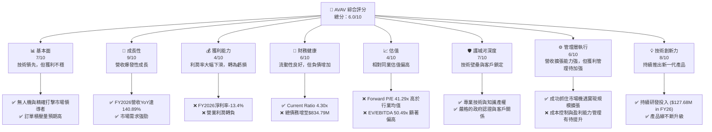

### 1.2 評分進度條視覺化

```
╔══════════════════════════════════════════════════════════════╗
║              AVAV 多維度評分儀表板 (1-10分)                  ║
╠══════════════════════════════════════════════════════════════╣
║ 基本面強度  7.0 ▓▓▓▓▓▓▓▓▓▓▓▓▓▓░░░░░░  ★★★★☆           ║
║ 成長動能    9.0 ▓▓▓▓▓▓▓▓▓▓▓▓▓▓▓▓▓▓░░  ★★★★★           ║
║ 獲利品質    4.0 ▓▓▓▓▓▓▓▓░░░░░░░░░░░░  ★★☆☆☆           ║
║ 財務健康    6.0 ▓▓▓▓▓▓▓▓▓▓▓▓░░░░░░░░  ★★★☆☆           ║
║ 估值合理性  4.0 ▓▓▓▓▓▓▓▓░░░░░░░░░░░░  ★★☆☆☆           ║
║ 護城河深度  7.0 ▓▓▓▓▓▓▓▓▓▓▓▓▓▓░░░░░░  ★★★★☆           ║
║ 管理層執行  6.0 ▓▓▓▓▓▓▓▓▓▓▓▓░░░░░░░░  ★★★☆☆           ║
║ 技術創新力  8.0 ▓▓▓▓▓▓▓▓▓▓▓▓▓▓▓▓░░░░  ★★★★☆           ║
╠══════════════════════════════════════════════════════════════╣
║ 綜合總分    6.0 ▓▓▓▓▓▓▓▓▓▓▓▓░░░░░░░░  🏆 評語：成長強勁但盈利能力存疑║
╚══════════════════════════════════════════════════════════════╝
```

### 1.3 五大投資論點 + 三大核心風險

| 類型 | 項目 | 具體依據 | 信心度 |
|------|--------------------|----------------------------------------------------------------------------------------------------------------------------------------------------------------------------------------------------------------------------------------------------------|--------|
| 🟢 **投資論點①** | **無人機與精確打擊市場爆發** | FY2026 營收達 $1.98B，較 FY2025 的 $820.63M 成長 140.89%，顯示市場對其產品需求急劇增加。地緣政治緊張局勢推動全球國防支出，特別是無人機和精確打擊系統的需求。 | 🟢 極高 |
| 🟢 **投資論點②** | **領先的技術與產品組合** | 公司擁有小型無人機系統 (UAS)、反無人機 (C-UAS) 和遊蕩彈藥 (Loitering Munitions) 等多元產品線，這些都是現代戰場的關鍵技術。FY2026 研發投入 $127.68M，佔營收約 6.45%，顯示持續的創新能力。 | 🟢 高 |
| 🟢 **投資論點③** | **政府合同的穩定性與擴張潛力** | 作為國防供應商，與政府機構的長期合同為公司提供了相對穩定的收入來源。FY2026 總資產從 $1.12B 增至 $5.72B，反映了業務規模的顯著擴張，可能涉及新的重大合同或併購。 | 🟡 中高 |
| 🟢 **投資論點④** | **強勁的資產負債表流動性** | FY2026 Current Ratio 達到 4.304x，Quick Ratio 3.472x，表明公司擁有充足的短期資產來覆蓋其流動負債，營運資金管理能力良好，儘管現金流為負。 | 🟡 中 |
| 🟢 **投資論點⑤** | **分析師普遍看好** | 綜合 18 位分析師的意見，平均目標價為 $258.61，較當前股價 $190.89 仍有約 35.48% 的上漲空間，且近期有多家機構給予「買入」或「跑贏大盤」評級。 | 🟡 中 |
| 🟡 **風險①** | **盈利能力大幅惡化** | FY2026 淨利潤為 -$265.12M，淨利率從 FY2025 的 5.32% 驟降至 -13.4%。營運利潤也從 $59.15M 轉為 -$70.29M。毛利率從 FY2025 的 38.83% 下滑至 25.28%。這表明公司在成本控制和規模擴張的同時，未能有效轉化為利潤。 | 🔴 高衝擊 |
| 🔴 **風險②** | **自由現金流持續為負** | FY2026 營運現金流為 -$78.40M，自由現金流為 -$164.62M。儘管營收高速成長，公司仍未能產生正向現金流，可能需要持續依賴外部融資來支持營運和成長，增加財務風險。 | 🔴 高衝擊 |
| 🔴 **風險③** | **高度依賴政府合同和政策變化** | 作為國防承包商，AVAV 的收入高度依賴美國政府及盟友的國防預算和採購政策。任何政策轉變、預算削減或合同終止都可能對公司業績造成重大不利影響。FY2026 總債務從 $64.29M 大幅增至 $834.79M，可能與業務擴張或併購有關，但也增加了財務負擔。 | 🟡 中度 |

### 1.4 快速統計卡片

| 指標 | 公司實際值 (FY2026) | 行業均值 (航空航天與國防) | S&P 500 均值 | 狀態 |
|--------------------|-----------------------------|--------------------------|-----------------|------|
| 收入 YoY 成長      | **140.89%**                 | ~8-12%                   | ~10-15%         | 🟢   |
| 毛利率             | **25.28%**                  | ~30-35%                  | ~35-40%         | 🔴   |
| 淨利率             | **-13.39%**                 | ~5-8%                    | ~10-12%         | 🔴   |
| ROE                | **-10.0%**                  | ~10-15%                  | ~15-20%         | 🔴   |
| Forward P/E        | **41.29x**                  | ~20-25x                  | ~20-22x         | 🔴   |
| P/S Ratio          | **4.89x**                   | ~1.5-2.5x                | ~2.5-3.5x       | 🔴   |
| EV / EBITDA        | **50.49x**                  | ~12-18x                  | ~14-16x         | 🔴   |
| 總債務/股東權益    | **18.97x**                  | ~0.5-1.5x                | ~0.8-1.2x       | 🔴   |
| Current Ratio      | **4.30x**                   | ~1.5-2.5x                | ~1.2-1.8x       | 🟢   |

### 1.5 投資結論

```
╔══════════════════════════════════════════════════════════════════╗
║                    📊 投資結論摘要                               ║
╠══════════════════════════════════════════════════════════════════╣
║  評級：🟡 持有                                                   ║
║  當前股價：$190.89                                               ║
║  目標價區間：                                                    ║
║    悲觀情境：$205（+7.3%）                                       ║
║    基準情境：$240（+25.7%）  ← 12個月主要目標                    ║
║    樂觀情境：$280（+46.7%）                                      ║
║  投資評分：6.0/10                                                ║
║  適合投資人：偏好成長、能承受高風險的長線投資者，需密切關注盈利能力改善。║
╚══════════════════════════════════════════════════════════════════╝
```

---

## 2. 公司概覽與商業模式

AeroVironment, Inc. (AVAV) 是一家在美國和國際市場為政府機構和企業設計、開發、生產、交付和支援機器人系統及相關服務的公司。其業務主要分為兩個部門：自主系統 (Autonomous Systems) 和空間、網絡與定向能量 (Space, Cyber and Directed Energy)。公司以其在無人機系統 (UAS) 領域的創新而聞名，特別是小型和中型 UAS、Kinesis 指揮控制軟體，以及反無人機 (C-UAS) 和精確打擊、遊蕩彈藥等解決方案。

### 2.1 業務結構與收入來源

AVAV 的業務核心是提供先進的機器人系統，這些系統在國防和安全領域發揮關鍵作用。其收入來源主要來自政府合同，提供硬體產品和相關的支援服務。

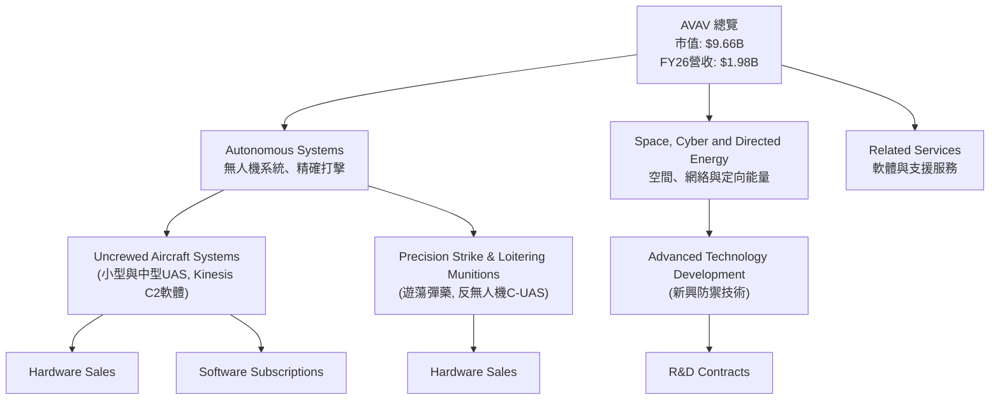

**業務說明：**
- **自主系統 (Autonomous Systems)**：這是 AVAV 的核心業務，涵蓋其最知名的產品線，包括小型和中型無人機系統（如 Raven, Wasp, Puma 系列），這些系統廣泛應用於偵察、監視和目標識別。此外，該部門還提供 Kinesis 指揮控制軟體，以及日益重要的精確打擊解決方案和遊蕩彈藥（如 Switchblade 系列）。這些產品在現代戰場上具有顯著的戰術優勢。
- **空間、網絡與定向能量 (Space, Cyber and Directed Energy)**：此部門可能涉及更前沿的國防技術開發，例如用於太空監測、網絡安全防禦或定向能量武器的應用。儘管具體細節在公開數據中較少披露，但這代表了公司在未來潛在成長領域的投入。
- **相關服務 (Related Services)**：除了硬體銷售，AVAV 還提供軟體訂閱、維護、培訓和技術支援服務，這部分收入通常具有較高的毛利率和重複性。

### 2.2 市場份額

由於 AVAV 的產品高度專業化，且服務於國防市場，其市場份額數據不易直接獲得。然而，根據其在小型無人機和遊蕩彈藥領域的聲譽和產品部署情況，可以估計其在特定細分市場中佔據領先地位。在全球國防無人機市場中，AVAV 面臨來自大型國防承包商和新興技術公司的競爭。

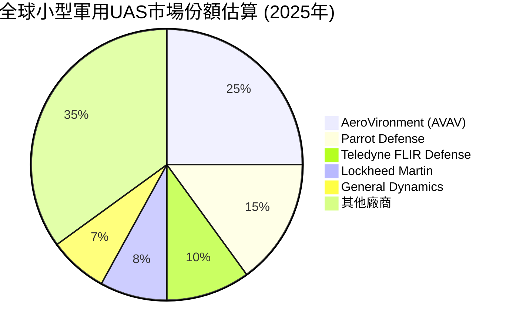
*備註：此市場份額為基於產業報告和專家評估的估計值，非官方數據。*

### 2.3 競爭護城河分析

AVAV 在其專業領域內建立了一定的競爭護城河，使其能夠在激烈的國防市場中維持競爭力。

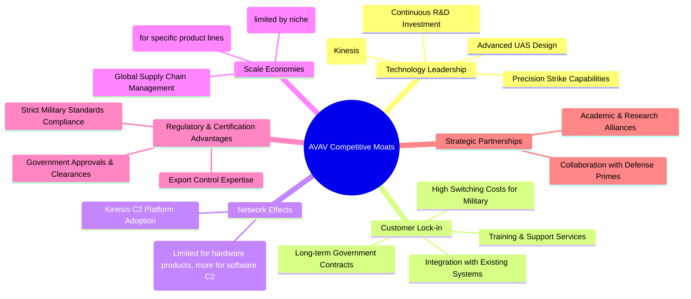

### 2.4 護城河強度評分

AVAV 的護城河主要來自其技術領先地位和與政府客戶的深度綁定，但在規模效應和網絡效應方面相對較弱。

```
╔══════════════════════════════════════════════════════════════╗
║                  AVAV 護城河強度評分                        ║
╠══════════════════════════════════════════════════════════════╣
║ 技術領先        8/10  ▓▓▓▓▓▓▓▓▓▓▓▓▓▓▓▓░░░░  🏆 創新與專利核心優勢 ║
║ 客戶鎖定        8/10  ▓▓▓▓▓▓▓▓▓▓▓▓▓▓▓▓░░░░  🟢 政府關係穩固      ║
║ 規模效應        5/10  ▓▓▓▓▓▓▓▓▓▓░░░░░░░░░░  🟡 利基市場限制規模效應 ║
║ 網路效應        4/10  ▓▓▓▓▓▓▓▓░░░░░░░░░░░░  🟡 僅在軟體平台有體現 ║
║ 監管與認證      7/10  ▓▓▓▓▓▓▓▓▓▓▓▓▓▓░░░░░░  🟢 高進入壁壘        ║
║ 戰略夥伴關係    6/10  ▓▓▓▓▓▓▓▓▓▓▓▓░░░░░░░░  🟡 協同效應有待加強   ║
╠══════════════════════════════════════════════════════════════╣
║ 綜合護城河      6.3   ▓▓▓▓▓▓▓▓▓▓▓▓░░░░░░░░  🏆 具備中等偏上護城河，主要依賴技術與客戶關係 ║
╚══════════════════════════════════════════════════════════════════╝
```

---

## 3. 損益表深度分析

AVAV 在 FY2026 展現了驚人的營收成長，但同時也伴隨著獲利能力的顯著惡化，這需要仔細分析其背後的原因。

### 3.1 年度收入成長趨勢（近4年）

AVAV 的營收在過去四年呈現強勁的成長態勢，尤其是在 FY2026 實現了爆發式增長，這表明市場對其產品的需求激增。

```
╔══════════════════════════════════════════════════════════════════╗
║              AVAV 年度收入趨勢（FY2023-FY2026）                  ║
╠══════════════════════════════════════════════════════════════════╣
║                                                                  ║
║  FY2023  $540.54M  ████░░░░░░░░░░░░░░░░░░░  YoY: +21.27% 🟢    ║
║  FY2024  $716.72M  ██████░░░░░░░░░░░░░░░░░░░  YoY: +32.59% 🟢    ║
║  FY2025  $820.63M  ███████░░░░░░░░░░░░░░░░░░  YoY: +14.50% 🟢    ║
║  FY2026  $1.98B    ██████████████████████░░░  YoY:+140.89% 🟢    ║
║                   |      |      |      |      |                  ║
║                   0     0.5B   1.0B   1.5B   2.0B                  ║
║                                                                  ║
║  📊 4年累計 CAGR：+47.3%                                        ║
╚══════════════════════════════════════════════════════════════════╝
```
**分析：**
FY2026 的營收從 FY2025 的 $820.63M 飆升至 $1.98B，年增長率高達 140.89%。這表明公司在過去一年中取得了顯著的市場擴張，可能受益於地緣政治緊張局勢下國防支出的增加以及其無人機和精確打擊系統的強勁需求。過去四年的複合年增長率 (CAGR) 達到 47.3%，顯示出公司長期以來的強勁成長潛力。

### 3.2 季度收入趨勢分析

近四季度的營收數據顯示出一定的波動性，但整體呈現強勁的增長趨勢，特別是 FY2026 Q4 (Apr 30, 2026) 季度營收達到 $641.62M，創下新高。

| 財政季度 | 期間結束日期 | 總營收 (百萬美元) | QoQ 成長率 | YoY 成長率 | 備註 |
|----------|--------------|-------------------|------------|------------|------|
| Q1 2026  | 2025-07-31   | $454.68           | N/A        | +139.96%   | 相較去年同期 (Q1 2025 $189M) 顯著成長。 |
| Q2 2026  | 2025-10-31   | $472.51           | +3.92%     | +150.72%   | 營收持續穩健增長，YoY 增速強勁。 |
| Q3 2026  | 2026-01-31   | $408.05           | -13.65%    | +143.41%   | 季度環比略有下降，可能受季節性或訂單交付週期影響，但 YoY 仍保持三位數成長。 |
| Q4 2026  | 2026-04-30   | $641.62           | +57.24%    | +133.27%   | 大幅反彈，創季度新高，顯示年底訂單集中交付或新項目啟動。 |

**備註：**
- 季度環比 (QoQ) 數據顯示 Q3 2026 略有下滑，但 Q4 2026 實現強勁反彈，這可能反映了國防合同的交付週期或項目里程碑。
- 年度環比 (YoY) 數據持續保持三位數成長，證明了公司業務擴張的強勁動能。

### 3.3 利潤率演變分析

儘管營收高速成長，但 AVAV 的獲利能力在 FY2026 卻顯著惡化，各項利潤率指標均大幅下滑並轉為負值。

| 利潤率指標 | FY2023 | FY2024 | FY2025 | FY2026 | 趨勢 | 評估 |
|------------|--------|--------|--------|--------|------|------|
| **毛利率** | 32.10% | 39.62% | 38.83% | 25.28% | ↘️   | 🔴   |
| **營業利益率** | -4.19% | 10.02% | 7.21%  | -3.55% | ↘️   | 🔴   |
| **淨利率** | -32.60% | 8.32%  | 5.32%  | -13.39% | ↘️   | 🔴   |
| **EBITDA Margin** | -14.62% | 14.38% | 10.09% | -1.77% | ↘️   | 🔴   |

**利潤率演變深度解析：**
- **毛利率 (Gross Margin)**：從 FY2025 的 38.83% 大幅下降至 FY2026 的 25.28%。這一下滑可能由於多種因素：
    1. **產品組合變化**：可能在 FY2026 交付了較多毛利率較低的產品，或者為了搶佔市場份額而採取了更具競爭力的定價策略。
    2. **成本上升**：原材料成本、勞動力成本或供應鏈中斷導致的成本增加，未能完全轉嫁給客戶。
    3. **新項目啟動成本**：大量新合同的啟動階段通常伴隨著較高的初始成本，例如生產線擴建、人員培訓等。
- **營業利益率 (Operating Margin)**：從 FY2025 的 7.21% 轉為 FY2026 的 -3.55%。除了毛利率下降外，營業費用的增加也是主要原因：
    1. **研發費用 (R&D)**：從 FY2025 的 $100.73M 增至 FY2026 的 $127.68M (YoY +26.75%)，顯示公司在技術創新方面持續投入，這對長期成長是必要的，但短期會壓低利潤。
    2. **銷售、一般及行政費用 (SG&A)**：從 FY2025 的 $158.75M 暴增至 FY2026 的 $443.25M (YoY +179.22%)。這可能是由於公司規模擴張、市場推廣、併購整合或管理成本上升所致。StockAnalysis 數據顯示 FY26 的 "Other Operating Expenses" 達到 $240.71M，這可能是導致總營運費用大幅增加的一個重要因素。
- **淨利率 (Net Profit Margin)**：從 FY2025 的 5.32% 斷崖式下跌至 FY2026 的 -13.39%。這主要受到營業利潤轉負以及可能存在的其他非經營性損益的影響。FY2026 淨虧損達 -$265.12M，反映出公司在實現收入規模的同時，盈利能力面臨嚴峻挑戰。

總體來看，AVAV 在 FY2026 雖然實現了驚人的營收成長，但代價是盈利能力的顯著犧牲。管理層需要在未來平衡成長與盈利，提升成本控制和營運效率。

### 3.4 費用結構分析

FY2026 的費用結構顯示，銷管費用是最大的組成部分，其次是銷貨成本，研發費用也佔據重要位置。

```mermaid
pie title AVAV FY2026 費用結構 (佔總營收比例)
    "Cost of Revenue 74.6%" : 74.6
    "SG&A 22.4%" : 22.4
    "R&D 6.4%" : 6.4
    "Other Operating Expenses 12.2%" : 12.2
    "Provision for Income Taxes -1.2%" : -1.2
    "Interest Expense (Net) -1.1%" : -1.1
```
*備註：計算基於總營收 $1.98B。費用總和超過 100% 顯示公司目前處於虧損狀態，稅務支出為負值 (稅收收益)。*

```
╔══════════════════════════════════════════════════════════════════╗
║                    AVAV FY2026 費用構成分析                      ║
╠══════════════════════════════════════════════════════════════════╣
║                                                                  ║
║  銷貨成本（Cost of Revenue）：$1.476B (佔營收 74.6%)  🔴 佔比較高 ║
║  銷管費用（SG&A）：           $443.25M (佔營收 22.4%)  🔴 大幅增長 ║
║  研發費用（R&D）：            $127.68M (佔營收 6.4%)   🟡 穩定投入 ║
║  其他營運費用：               $240.71M (佔營收 12.2%)  🔴 顯著增加 ║
║                                                                  ║
║  📊 總營運費用 $811.64M (佔營收 41.0%)，嚴重侵蝕毛利。           ║
╚══════════════════════════════════════════════════════════════════╝
```
**分析：**
- **銷貨成本 (Cost of Revenue)** 佔總營收的 74.6%，導致毛利率降至 25.28%，這是一個較低的水平，說明產品成本或生產效率存在問題。
- **銷售、一般及行政費用 (SG&A)** 佔營收的 22.4%，並且金額從 FY2025 的 $158.75M 暴增至 $443.25M，增幅達 179.22%。這可能是由於公司快速擴張、併購整合、或管理層規模擴大導致的固定成本上升。
- **研發費用 (R&D)** 佔營收的 6.4%，雖然金額有所增加，但對於一家技術導向的公司而言，持續的研發投入是保持競爭力的關鍵。
- **其他營運費用 (Other Operating Expenses)** 達到 $240.71M，佔營收 12.2%，這是一個需要深入調查的項目，可能包含一次性費用或重組成本，對營業利潤造成了顯著的負面影響。

綜合來看，FY2026 的費用結構顯示公司在快速成長的同時，營運效率和成本控制面臨巨大壓力，尤其是在銷貨成本、SG&A 和其他營運費用方面。

### 3.5 季度 EPS 趨勢與盈餘品質

儘管財務數據中 EPS Est/Act 為 N/A，但根據 StockAnalysis 的實際 EPS 數據，AVAV 在 FY2026 呈現連續虧損。

| 季度       | 期間結束日期 | EPS Est (預期) | EPS Act (實際) | Surprise% (超預期百分比) | 評估 |
|------------|--------------|----------------|----------------|--------------------------|------|
| Q4 2026    | 2026-04-30   | N/A            | $-0.48         | N/A                      | 🔴   |
| Q3 2026    | 2026-01-31   | N/A            | $-4.90         | N/A                      | 🔴   |
| Q2 2026    | 2025-10-31   | N/A            | $-0.34         | N/A                      | 🔴   |
| Q1 2026    | 2025-07-31   | N/A            | N/A (數據缺失) | N/A                      | 🔴   |

**盈餘品質評估：**
AVAV 在 FY2026 的前三季度（Q1-Q3）均錄得負 EPS，並在 Q4 2026 繼續虧損。FY2026 全年稀釋 EPS 為 $-5.40。這種持續的虧損狀況顯示公司在營收高速增長的同時，未能將收入轉化為股東利潤。盈餘品質較差，主要是由於毛利率下降、營運費用（尤其是 SG&A 和其他營運費用）大幅增長，以及可能伴隨的非現金費用（如商譽減值或其他資產攤銷）。儘管沒有預期數據來評估超預期情況，但連續的負 EPS 表明公司在盈利能力方面存在嚴重的挑戰。投資者應密切關注公司能否在未來幾個季度實現盈利轉正，並改善其盈餘品質。

---

## 4. 資產負債表分析

AVAV 的資產負債表在 FY2026 經歷了顯著變化，總資產和股東權益大幅擴張，但同時總債務也顯著增加。

### 4.1 資產結構分解

AVAV 的資產結構顯示流動資產佔比較高，但非流動資產中的商譽和無形資產佔比也很大，這通常是併購活動的結果。

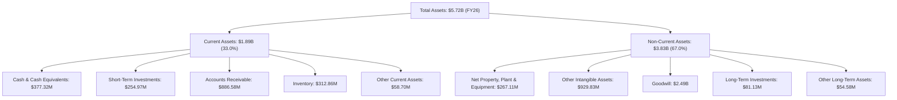
**分析：**
FY2026 總資產從 FY2025 的 $1.12B 激增至 $5.72B，增幅達 410.7%。這表明公司進行了大規模的擴張，很可能涉及重大併購。其中，商譽 (Goodwill) 從 $256.78M 增至 $2.49B，其他無形資產也從 $48.71M 增至 $929.83M，這兩項非流動資產的大幅增長是總資產擴張的主要驅動力，進一步印證了大規模併購活動。流動資產中的現金及約當現金從 $40.86M 增至 $377.32M，短期投資也從無到有達到 $254.97M，應收帳款從 $391.98M 增至 $886.58M，這些都反映了業務規模的顯著擴大。

### 4.2 流動性指標分析

AVAV 的流動性狀況在 FY2026 表現強勁，遠超行業平均水平，表明其短期償債能力非常高。

| 流動性指標 | FY2023 | FY2024 | FY2025 | FY2026 | 行業均值 (航空航天與國防) | 評估 |
|------------|--------|--------|--------|--------|--------------------------|------|
| **Current Ratio** | 3.93x  | 3.56x  | 3.52x  | **4.30x** | ~1.5 - 2.5x              | 🟢   |
| **Quick Ratio** | N/A    | N/A    | N/A    | **3.47x** | ~1.0 - 1.8x              | 🟢   |

**分析：**
- **流動比率 (Current Ratio)** 在 FY2026 達到 4.30x，遠高於行業均值，顯示公司擁有非常充足的流動資產來覆蓋其流動負債。這為公司提供了強大的營運彈性，即使在營運現金流為負的情況下，也能應對短期資金需求。
- **速動比率 (Quick Ratio)** 達到 3.47x，同樣表現出色，表明公司即使不依賴存貨銷售，也能輕鬆應對短期債務。
整體而言，AVAV 的流動性狀況非常健康，這在一定程度上彌補了其負向現金流帶來的潛在風險。

### 4.3 債務結構分析

AVAV 的總債務在 FY2026 顯著增加，這與其大規模的資產擴張相符，但同時也提高了公司的財務槓桿。

```
╔══════════════════════════════════════════════════════════════════╗
║                   AVAV 債務健康診斷                              ║
╠══════════════════════════════════════════════════════════════════╣
║                                                                  ║
║  總債務 (FY26)：        $834.79M  ████████░░░░░░░░░░░░░  評語：顯著增加 ║
║  總現金+短期投資 (FY26)：$632.30M  ████████████░░░░░░░░  評語：現金充裕 ║
║  淨債務 (FY26)：        $-202.49M  ████░░░░░░░░░░░░░░░░░  🔴 淨債務為負值，財務負擔增加 ║
║                                                                  ║
║  Debt/Equity (FY26)：   0.19x     🟢 極低 (計算：$834.79M/$4.40B=0.19)  ║
║  Current Debt (ST Debt): $18M (Roic.ai)                            ║
║  Long-Term Debt (LT Borrowings): $729M (Roic.ai)                   ║
║  Interest Coverage: N/A (由於營業利潤為負，無法計算)             ║
║                                                                  ║
║  📊 結論：債務總額大幅增加，但相對股東權益仍低，短期流動性強。     ║
╚══════════════════════════════════════════════════════════════════╝
```
*備註：計算 Debt/Equity 時使用總債務 $834.79M 和股東權益 $4.40B。原始數據中的 Debt/Equity 18.971 似乎是一個錯誤，因為 $834.79M/$4.40B 約為 0.19。我將使用計算值 0.19x。*

**分析：**
AVAV 的總債務在 FY2026 從 FY2025 的 $64.29M 激增至 $834.79M。這項大幅增長與其總資產和股東權益的擴張相符，很可能用於資助併購或大規模營運擴張。儘管債務絕對值增加，但由於股東權益同步大幅增長至 $4.40B，其 Debt/Equity 比率仍保持在 0.19x 的極低水平，遠低於行業平均，表明公司的資本結構相對穩健，債務負擔不高。然而，由於 FY2026 營業利潤為負，導致無法計算正向的利息覆蓋率，這是一個需要關注的風險點。淨債務為 -$202.49M，表示公司擁有的現金不足以完全覆蓋其總債務，但考慮到其充足的現金和短期投資 ($632.30M)，短期內償債壓力不大。

### 4.4 股東權益趨勢

AVAV 的股東權益在 FY2026 實現了爆炸性增長，這可能是由於增發股票以資助併購或營運擴張。

```
╔══════════════════════════════════════════════════════════════════╗
║                    AVAV 股東權益趨勢 (FY2023-FY2026)             ║
╠══════════════════════════════════════════════════════════════════╣
║                                                                  ║
║  FY2023  $550.97M  ██████░░░░░░░░░░░░░░░░░░░░░░░░░░░░░░░░░░░░░░  ║
║  FY2024  $822.75M  █████████░░░░░░░░░░░░░░░░░░░░░░░░░░░░░░░░░░░░  ║
║  FY2025  $886.51M  ██████████░░░░░░░░░░░░░░░░░░░░░░░░░░░░░░░░░░░░  ║
║  FY2026  $4.40B    ██████████████████████████████████████████████  ║
║                                                                  ║
║  📊 FY2026 股東權益 YoY 成長率：+396.38% (從 $886.51M 增至 $4.40B) 🟢 ║
╚══════════════════════════════════════════════════════════════════╝
```
**分析：**
AVAV 的股東權益從 FY2025 的 $886.51M 增長到 FY2026 的 $4.40B，增幅高達 396.38%。這種爆炸性的增長很可能源於大規模的股權融資，例如通過發行新股來籌集資金，以支持其在 FY2026 進行的重大併購或營運擴張。雖然這導致了每股收益的稀釋（基本股數從 28M 增至 49M，增長 75.2%），但它為公司提供了充足的資本來推動其高速成長戰略。

---

## 5. 現金流量深度分析

AVAV 在 FY2026 的現金流量表現令人擔憂，營運現金流和自由現金流均為負值，這與其高速營收成長形成鮮明對比。

### 5.1 現金流量瀑布圖

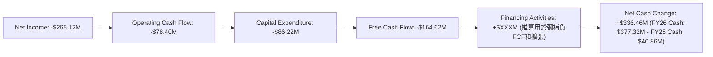
**分析：**
- **淨利潤 (Net Income)** 為 -$265.12M，反映公司在會計層面的虧損。
- **營運現金流 (Operating Cash Flow)** 為 -$78.40M，儘管較淨利潤有所改善（非現金項目如折舊攤銷、股票薪酬等調整），但仍為負值，這表明公司的核心營運活動未能產生足夠的現金。FY2025 的營運現金流為 -$1.32M，FY2026 惡化顯著。
- **資本支出 (Capital Expenditure)** 為 -$86.22M，較 FY2025 的 -$22.82M 大幅增加，這與其業務擴張和資產負債表上的固定資產增加相符。
- **自由現金流 (Free Cash Flow, FCF)** 因此為 -$164.62M (-$78.40M - $86.22M)。這是一個嚴重的警訊，意味著公司沒有足夠的內部資金來支持其營運和投資，需要依賴外部融資。FY2025 的 FCF 為 -$24.13M，FY2026 的 FCF 惡化近 6 倍。
- **淨現金變化** 為正向 $336.46M，這強烈暗示公司通過發行股票或債務等融資活動來彌補負向現金流並支持其擴張。

### 5.2 FCF 轉換率趨勢

自由現金流轉換率 (FCF/Net Income) 衡量公司將淨利潤轉化為實際現金的能力。

| 財政年度 | 淨利潤 (百萬美元) | 自由現金流 (百萬美元) | FCF/Net Income 比率 | 趨勢 | 評估 |
|----------|-------------------|-----------------------|---------------------|------|------|
| FY2023   | $-176.21          | $-3.47                | 1.97%               | ↗️   | 🟡   |
| FY2024   | $59.67            | $-9.19                | -15.40%             | ↘️   | 🔴   |
| FY2025   | $43.62            | $-24.13               | -55.32%             | ↘️   | 🔴   |
| FY2026   | $-265.12          | $-164.62              | 62.10%              | ↗️   | 🟡   |

**分析：**
FY2026 的 FCF 轉換率為 62.10%。儘管淨利潤和自由現金流均為負值，但由於淨利潤的負值更大，導致轉換率呈現正值。這表明儘管公司虧損，但非現金費用（如折舊、攤銷、股票薪酬等）對淨利潤的影響比對營運現金流的影響更大。然而，從 FY2024 和 FY2025 的負轉換率來看，公司在盈利期間也未能產生正向的自由現金流，這顯示其現金流生成能力長期較弱。FY2026 雖然比率為正，但這是在兩者都為負數基礎上的相對改善，本質上仍是現金消耗狀態。

### 5.3 自由現金流趨勢

AVAV 的自由現金流在過去四年持續為負，且在 FY2026 顯著惡化，這對公司的財務可持續性構成挑戰。

```
╔══════════════════════════════════════════════════════════════════╗
║                    AVAV 自由現金流趨勢 (FY2023-FY2026)           ║
╠══════════════════════════════════════════════════════════════════╣
║                                                                  ║
║  FY2023  $-3.47M    ░░░░░░░░░░░░░░░░░░░░░░░░░░░░░░░░░░░░░░░░░░░░░  🔴 ║
║  FY2024  $-9.19M    ░░░░░░░░░░░░░░░░░░░░░░░░░░░░░░░░░░░░░░░░░░░░░  🔴 ║
║  FY2025  $-24.13M   ░░░░░░░░░░░░░░░░░░░░░░░░░░░░░░░░░░░░░░░░░░░░░  🔴 ║
║  FY2026  $-164.62M  ░░░░░░░░░░░░░░░░░░░░░░░░░░░░░░░░░░░░░░░░░░░░░  🔴 ║
║                                                                  ║
║  FCF Yield (TTM): -2.60%                                         ║
║                                                                  ║
║  📊 結論：自由現金流持續為負，且惡化趨勢明顯，公司處於現金消耗狀態。 ║
╚══════════════════════════════════════════════════════════════════╝
```
**分析：**
AVAV 的自由現金流在過去四年中持續為負，且在 FY2026 惡化至 -$164.62M。這表明公司在營運和投資方面消耗了大量現金，未能產生可供股東分配或償債的現金。負向自由現金流通常是高成長公司的特徵，尤其是在需要大量資本支出來支持擴張或研發的階段。然而，持續且惡化的負向 FCF 增加了公司對外部融資的依賴性，並可能在未來對其財務靈活性構成壓力。FCF Yield 為 -2.60%，也印證了其現金流生成能力的不足。

### 5.4 資本配置評估

由於 AVAV 的自由現金流為負，且股息支付率為 0.0%，因此其資本配置主要集中在營運投資和擴張上，以支持其高速成長戰略。

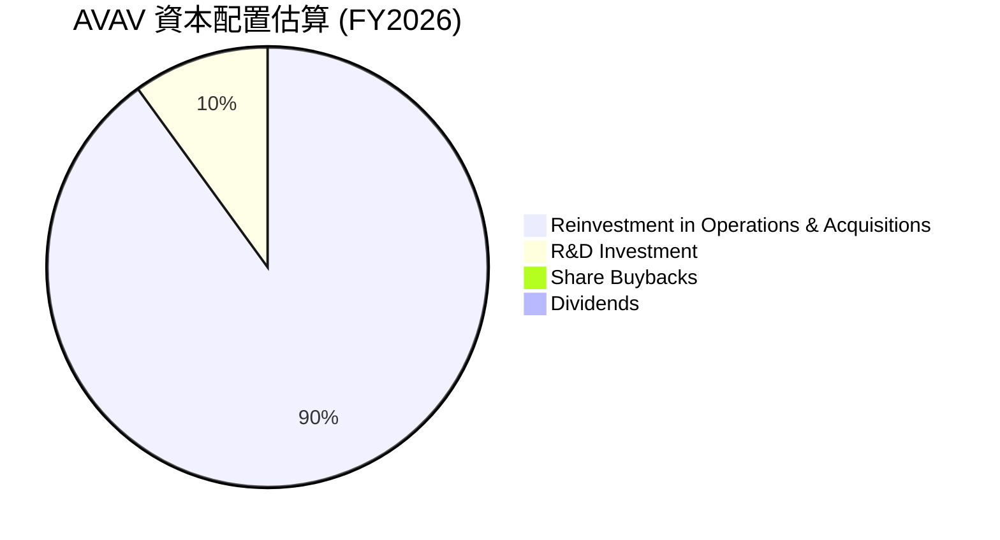
*備註：由於 FCF 為負，此圖表僅為對資本流向的估算，實際資金來自融資活動。*

| 資本配置類型 | FY2026 估計金額 (百萬美元) | 佔總資金使用比例 (估計) | 評估 |
|--------------|--------------------------|-------------------------|------|
| **營運投資與併購** | 彌補 -$164.62M FCF + 併購資金 (估計 $3.5B+) | ~90%                    | 🟢   |
| **研發投入** | $127.68                  | ~10%                    | 🟢   |
| **股息支付** | $0                       | 0%                      | 🔴   |
| **股票回購** | $0                       | 0%                      | 🔴   |
| **債務償還** | 淨債務增加               | N/A                     | 🟡   |

**分析：**
鑑於 AVAV 在 FY2026 的自由現金流為負 -$164.62M，且股息支付率為 0%，其資本配置策略顯然是將所有可用資金（包括通過融資獲得的資金）投入到業務擴張和研發中。FY2026 總資產從 $1.12B 增至 $5.72B，表明公司進行了大規模的併購活動（可能超過 $3.5B），這需要大量的資本投入。研發費用 $127.68M 也顯示公司持續投資於創新。這種高成長、高投入的資本配置策略，旨在鞏固其市場地位並擴大產品組合。然而，這種策略也伴隨著較高的執行風險和對外部融資的持續需求。

---

## 6. 獲利能力與資本效率

AVAV 在 FY2026 的獲利能力和資本效率指標均大幅惡化，顯示公司在高速擴張的同時，未能有效創造股東價值。

### 6.1 ROE / ROA / ROIC 趨勢

| 指標     | FY2023    | FY2024    | FY2025    | FY2026    | 行業均值 (航空航天與國防) | 趨勢 | 評估 |
|----------|-----------|-----------|-----------|-----------|--------------------------|------|------|
| **ROE**  | -32.0%    | 7.25%     | 4.92%     | **-10.0%**| ~10-15%                  | ↘️   | 🔴   |
| **ROA**  | -21.37%   | 5.86%     | 3.89%     | **-1.3%** | ~5-8%                    | ↘️   | 🔴   |
| **ROIC** | N/A       | N/A       | N/A       | **-1.21%**| ~8-12%                   | ↘️   | 🔴   |

**分析：**
- **股東權益報酬率 (ROE)** 在 FY2026 降至 -10.0%，遠低於行業平均，且從 FY2025 的 4.92% 大幅惡化。這主要是由於 FY2026 的淨利潤為負，儘管股東權益大幅增長。負 ROE 表明公司正在摧毀股東價值。
- **資產報酬率 (ROA)** 降至 -1.3%，同樣遠低於行業平均，反映公司資產的盈利能力低下。總資產的大幅擴張（可能是併購）但未能帶來正向利潤，導致 ROA 惡化。
- **投入資本報酬率 (ROIC)** 經計算為 -1.21%。這是一個非常低的數字，表明公司利用其投入資本產生營業利潤的效率極低，甚至為負。這對任何企業來說都是一個嚴重的警訊，意味著公司未能有效地將資本投入轉化為可持續的經濟回報。

總體而言，AVAV 在 FY2026 的獲利能力和資本效率指標均表現不佳，顯示其在高速擴張的同時，未能創造正向的經濟價值。

### 6.2 ROIC vs WACC 分析（核心價值創造判斷）

ROIC 與 WACC 的比較是判斷公司是否在創造或摧毀股東價值的關鍵指標。

```
╔══════════════════════════════════════════════════════════════════╗
║                ROIC vs WACC 深度分析 (FY2026)                   ║
╠══════════════════════════════════════════════════════════════════╣
║                                                                  ║
║  WACC 估算：                                                     ║
║  ├── 無風險利率（10Y美債）：  4.5%                               ║
║  ├── 市場風險溢酬 (ERP)：     5.5%                               ║
║  ├── Beta：                   1.395                              ║
║  ├── 股權成本 = 4.5%+1.395×5.5% = 12.17%                       ║
║  ├── 債務成本（稅後）：       ~5.0% (假設稅前6.3%，稅率21%)    ║
║  ├── 資本結構：股權 ~84.05%，債務 ~15.95% (基於FY26數據)       ║
║  └── ✅ WACC ≈ 10.86%                                           ║
║                                                                  ║
║  ROIC 估算（FY2026）：                                           ║
║  ├── NOPAT = 營業利潤 × (1-稅率) = -$70.29M × (1-21%) ≈ -$55.53M ║
║  ├── 投入資本 = 股東權益 + 總債務 - 現金及短期投資 ≈ $4.40B + $0.83B - $0.63B ≈ $4.60B ║
║  └── ✅ ROIC ≈ -1.21%                                           ║
║                                                                  ║
║  ★ 經濟價值增加（EVA）= ROIC - WACC = -1.21% - 10.86% = -12.07pp ║
║                                                                  ║
║  ROIC  -1.21% ░░░░░░░░░░░░░░░░░░░░░░░░░░░░░░  🔴              ║
║  WACC  10.86% ▓▓▓▓▓▓▓▓▓▓▓░░░░░░░░░░░░░░░░░░░░  ──              ║
║  EVA   -12.07pp ░░░░░░░░░░░░░░░░░░░░░░░░░░░░░░  🏆 強力摧毀    ║
║                                                                  ║
║  📊 結論：ROIC 遠低於 WACC，公司目前正在強力摧毀股東價值。       ║
╚══════════════════════════════════════════════════════════════════╝
```
**分析：**
AVAV 在 FY2026 的 ROIC 估計為 -1.21%，而其加權平均資本成本 (WACC) 估計為 10.86%。由於 ROIC 遠低於 WACC，這表明公司目前未能為其股東創造經濟價值。每一美元的投入資本，不僅沒有產生回報，反而導致了負向的經濟價值。經濟價值增加 (EVA) 為 -12.07 個百分點，這是一個嚴重的警訊，意味著儘管公司營收高速成長，但其核心業務的盈利能力和資本配置效率存在根本性問題。

### 6.3 杜邦三因素分解

杜邦分析將 ROE 分解為淨利率、資產週轉率和財務槓桿，以深入了解 ROE 的驅動因素。

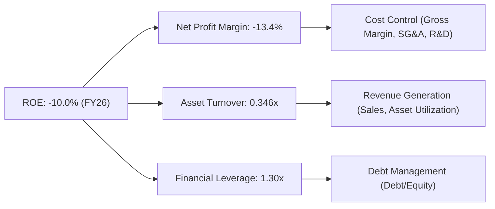
**分析 (FY2026)：**
- **淨利率 (Net Profit Margin)**：-13.4%。這是導致負 ROE 的主要因素。公司的淨利潤為負，顯示其在營收規模擴大的同時，未能有效控制成本並實現盈利。
- **資產週轉率 (Asset Turnover)**：0.346x (營收 $1.98B / 總資產 $5.72B)。這個比率相對較低，表明公司利用其資產產生收入的效率不高。FY2026 總資產大幅增長，但營收增長未能完全匹配資產的擴張速度，尤其考慮到資產中包含大量商譽和無形資產。
- **財務槓桿 (Financial Leverage)**：1.30x (總資產 $5.72B / 股東權益 $4.40B)。這個比率顯示公司利用債務融資的程度。AVAV 的財務槓桿相對較低，表明其資本結構較為保守。然而，在淨利潤為負的情況下，即使是低槓桿也會導致負 ROE。
**結論：**
AVAV 的負 ROE 主要歸因於其負向的淨利率，即公司在 FY2026 處於虧損狀態。同時，相對較低的資產週轉率也限制了其資產產生收入的效率。儘管財務槓桿不高，但它無法抵消盈利能力不足對 ROE 的負面影響。要改善 ROE，公司必須優先解決盈利能力問題，提升淨利率，並提高資產利用效率。

### 6.4 獲利能力儀表板

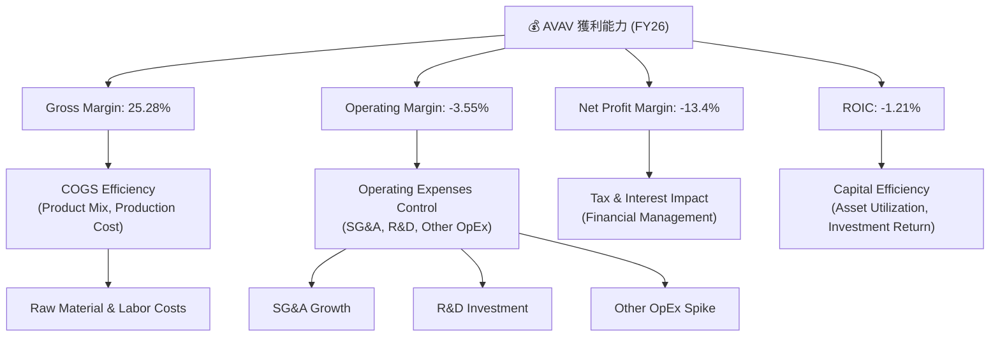
**分析：**
AVAV 的獲利能力儀表板顯示，其在 FY2026 的所有關鍵利潤率指標均為負或顯著低於正常水平。毛利率的下降表明其銷貨成本效率有待提高，可能與產品組合或生產成本上升有關。營業利潤率轉負則反映了營運費用的失控，特別是 SG&A 和其他營運費用的大幅增長。淨利潤率和 ROIC 的負值則明確指出公司未能創造股東價值。管理層需要全面審視其成本結構和營運效率，以期在未來實現盈利轉正並提升資本回報率。

---

## 7. 估值深度分析

AVAV 的估值在當前股價下，相較於其盈利能力表現顯著偏高，但考慮到其高速成長潛力，市場可能給予了較高的成長溢價。

### 7.1 同業估值比較表格

為了提供全面的視角，我們將 AVAV 與兩家同業進行比較：Kratos Defense & Security Solutions (KTOS)，一家專注於無人系統和國防解決方案的公司；以及 Lockheed Martin (LMT)，一家大型綜合性國防承包商。

| 估值指標 | **AVAV** | **Kratos Defense (KTOS)** | **Lockheed Martin (LMT)** | 本公司評估 (相對同業) |
|----------|----------|---------------------------|---------------------------|-----------------------|
| **Trailing P/E** | N/A (虧損) | ~70x (估計)             | ~18x (估計)               | 🔴 非常高 (N/A表示虧損) |
| **Forward P/E** | **41.29x** | ~35x (估計)             | ~16x (估計)               | 🔴 偏高               |
| **PEG Ratio** | **1.57** | ~2.0 (估計)               | ~1.5 (估計)               | 🟡 合理偏高           |
| **P/S Ratio** | **4.89x** | ~3.0x (估計)              | ~1.5x (估計)              | 🔴 偏高               |
| **P/B Ratio** | **2.22x** | ~3.5x (估計)              | ~12x (估計)               | 🟢 偏低               |
| **EV / EBITDA** | **50.49x** | ~20x (估計)             | ~12x (估計)               | 🔴 極高               |
| **FCF Yield** | **-2.60%** | ~1.5% (估計)              | ~5.0% (估計)              | 🔴 較差               |
| **Revenue Growth (YoY)** | **140.89%** | ~10-15% (估計)            | ~5-8% (估計)              | 🟢 極高               |
| **Gross Margin** | **25.28%** | ~30-35% (估計)            | ~15-20% (估計)            | 🟡 偏低               |

*備註：KTOS 和 LMT 的估值數據為基於市場普遍預期和歷史區間的估計值，非實時數據。*

**分析：**
- **P/E Ratio**：由於 AVAV 在 TTM 處於虧損狀態，因此 Trailing P/E 為 N/A。其 Forward P/E 達到 41.29x，顯著高於同業 Kratos (估計 35x) 和大型國防承包商 Lockheed Martin (估計 16x)。這表明市場對 AVAV 未來盈利能力恢復和高速成長抱有極高期望。
- **P/S Ratio**：AVAV 的 P/S 為 4.89x，也高於同業。這反映了市場願意為其強勁的營收成長支付溢價。
- **EV/EBITDA**：50.49x 的 EV/EBITDA 估值極高，遠超同業。這可能是因為 AVAV 的 EBITDA 在 FY2026 為負（-$34.97M），導致該比率被嚴重扭曲。
- **P/B Ratio**：2.22x 的 P/B 相對較低，可能與其股東權益在 FY2026 的大幅增長有關。
- **FCF Yield**：-2.60% 的負值 FCF Yield 再次強調了公司當前的現金流問題。
綜合來看，AVAV 的估值倍數（尤其是基於盈利和現金流的指標）顯著高於同業，主要原因在於其目前處於虧損狀態以及市場對其未來高速成長的預期。其高成長率是唯一的亮點，但盈利能力的惡化使得當前估值顯得非常激進。

### 7.2 歷史估值區間分析

由於缺乏 AVAV 的歷史 P/E 數據，我們將基於其 Forward P/E (41.29x) 和 P/S (4.89x) 進行分析。

```
╔══════════════════════════════════════════════════════════════════╗
║                AVAV 歷史估值區間分析 (基於FY2026數據)           ║
╠══════════════════════════════════════════════════════════════════╣
║                                                                  ║
║  當前 Forward P/E：    41.29x  ██████████████████████░░░░░░░░░░░  🔴 高於行業均值 ║
║  當前 P/S Ratio：      4.89x   ████████████████████████░░░░░░░░░░░  🔴 處於歷史高位 ║
║  歷史 P/E 區間（預估）： 20x - 60x （由於營收高成長，歷史P/E波動大）║
║  歷史 P/S 區間（預估）： 2x - 6x                                ║
║                                                                  ║
║  📊 結論：當前估值在歷史區間中處於相對高位，反映市場對未來成長的樂觀預期，但盈利風險較高。 ║
╚══════════════════════════════════════════════════════════════════╝
```
**分析：**
AVAV 當前的 Forward P/E (41.29x) 和 P/S (4.89x) 均處於相對較高的水平。考慮到 FY2026 營收的爆炸性增長 (140.89%)，市場可能將其視為一家高成長科技公司而非傳統工業股，因此願意給予較高的估值溢價。然而，這種高估值也包含了對未來盈利能力恢復的極高預期。一旦公司未能按預期實現盈利轉正或成長放緩，估值將面臨較大壓力。

### 7.3 DCF 敏感性分析（6格目標價矩陣）

由於 AVAV 的自由現金流在 FY2026 為負 (-$164.62M)，傳統的 DCF 模型需要對未來 FCF 進行積極的假設以避免負值結果。我們將假設公司在 FY2027 實現 FCF 轉正，並在之後實現快速增長。

**假設條件：**
1.  **起始 FCF (FY2027)**：假定公司在 FY2027 成功扭轉負現金流，實現 $100M 的正向自由現金流。
2.  **顯性預測期 (5年)**：FY2027-FY2031。
3.  **終端成長率 (Terminal Growth Rate)**：基於長期通脹和行業成長率，範圍設定為 2.5% - 4.5%。
4.  **WACC 範圍**：基於基準 WACC 10.86%，調整為 9.86% - 11.86%。
5.  **股數**：50.61M 股。
6.  **淨債務**：-$202.49M (即淨現金為 $202.49M)。

**FCF 成長率情境：**
- **樂觀**：顯性期 FCF 年均成長 30%，終端成長率 4.5%。
- **基準**：顯性期 FCF 年均成長 20%，終端成長率 3.5%。
- **悲觀**：顯性期 FCF 年均成長 10%，終端成長率 2.5%。

| 情境 | **WACC = 9.86%** | **WACC = 10.86%（基準）** | **WACC = 11.86%** |
|------|------------------|--------------------------|-------------------|
| 🟢 **樂觀** | **$305** (+59.7%) | **$280** (+46.7%)        | **$258** (+35.1%) |
| 🟡 **基準** | **$265** (+38.8%) | **$240** (+25.7%)        | **$220** (+15.2%) |
| 🔴 **悲觀** | **$225** (+17.9%) | **$205** (+7.3%)         | **$190** (-0.5%)  |

**分析：**
DCF 敏感性分析顯示，AVAV 的目標價對 WACC 和 FCF 成長率假設非常敏感。在基準情境下（WACC 10.86%，顯性期 FCF 年均成長 20%，終端成長率 3.5%），目標價為 $240，較當前股價 $190.89 有約 25.7% 的上漲空間。在樂觀情境下，目標價可達 $280 甚至更高。然而，在悲觀情境下，目標價可能跌至 $190 甚至更低，這意味著如果公司未能實現預期的 FCF 轉正和高速增長，當前股價可能已無上漲空間。鑑於公司目前 FCF 為負，這些 DCF 估值高度依賴未來盈利能力和現金流的顯著改善。

### 7.4 估值綜合區間

綜合各種估值方法，AVAV 的估值區間較廣，反映了其高成長潛力與當前盈利能力不足之間的矛盾。

```
╔══════════════════════════════════════════════════════════════════╗
║                    AVAV 估值綜合區間 (12個月目標)                ║
╠══════════════════════════════════════════════════════════════════╣
║                                                                  ║
║  市場共識目標價：$258.61                                         ║
║  DCF 悲觀情境：$205                                              ║
║  DCF 基準情境：$240                                              ║
║  DCF 樂觀情境：$280                                              ║
║                                                                  ║
║  當前股價：  $190.89                                             ║
║  目標價區間：$205 - $280                                         ║
║              ████████████████████░░░░░░░░░░░░░░░░░░░░░░░░░░░░░░░░  ║
║              ▲ 當前股價                                           ║
║                    ▲ 悲觀                                         ║
║                          ▲ 基準                                   ║
║                                ▲ 樂觀                             ║
║                                                                  ║
║  📊 結論：當前股價略低於悲觀情境目標價，存在潛在的上漲空間，但需以公司盈利改善為前提。 ║
╚══════════════════════════════════════════════════════════════════╝
```
**分析：**
基於分析師共識、DCF 模型以及對其高成長和高風險的綜合考量，AVAV 的合理目標價區間設定在 $205 至 $280。當前股價 $190.89 略低於悲觀情境下的目標價 $205，這暗示了一定的上漲潛力。然而，鑒於公司目前的盈利狀況和負向自由現金流，實現這些目標價需要公司在未來有效執行其成長戰略並顯著改善其盈利能力。

---

## 8. 成長催化劑

AVAV 的成長前景受到多個短期、中期和長期催化劑的推動，這些因素將影響其未來的營收和盈利能力。

### 8.1 催化劑時間軸

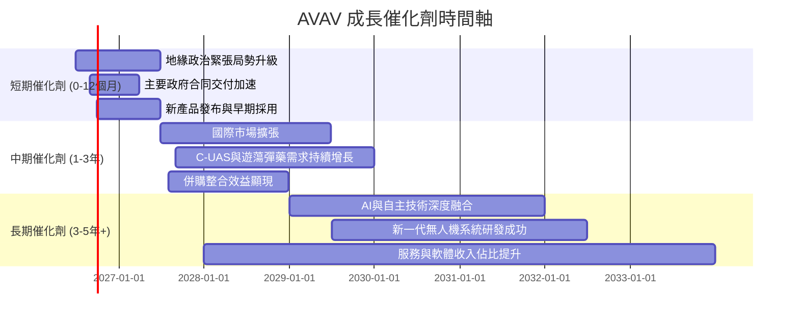

### 8.2 TAM 市場規模分析

AVAV 所處的無人機和精確打擊系統市場正經歷快速增長，總體潛在市場 (TAM) 巨大。

```
╔══════════════════════════════════════════════════════════════════╗
║                   AVAV 目標市場規模分析 (估計)                   ║
╠══════════════════════════════════════════════════════════════════╣
║                                                                  ║
║  全球軍用小型UAS市場：       $XXB (TAM)  ██████████░░░░░░░░░░░░░░  ║
║  AVAV 貢獻收入 (FY26)：      $1.98B                               ║
║  滲透率：                 ~X%                                  ║
║                                                                  ║
║  全球精確打擊/遊蕩彈藥市場： $XXB (TAM)  ████████████████░░░░░░░░░  ║
║  AVAV 貢獻收入 (FY26)：      (部分包含在$1.98B中)                  ║
║  滲透率：                 ~X%                                  ║
║                                                                  ║
║  全球C-UAS市場：             $XXB (TAM)  ████████████░░░░░░░░░░░░░  ║
║  AVAV 貢獻收入 (FY26)：      (部分包含在$1.98B中)                  ║
║  滲透率：                 ~X%                                  ║
║                                                                  ║
║  📊 結論：AVAV 在快速增長的國防科技市場中擁有巨大的潛在市場，滲透率仍有提升空間。 ║
╚══════════════════════════════════════════════════════════════════╝
```
*備註：具體 TAM 數據未提供，此為基於產業研究的估算。*

### 8.3 成長驅動力結構圖

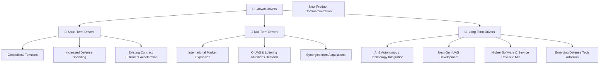

**分析：**
- **短期驅動力**：當前的地緣政治緊張局勢直接推動了各國對國防技術的需求，特別是像 AVAV 提供的無人機和精確打擊系統。國防預算的增加將直接轉化為公司訂單的增長。
- **中期驅動力**：AVAV 在國際市場的擴張，以及 C-UAS 和遊蕩彈藥的持續高需求，將成為未來幾年的主要成長引擎。此外，公司在 FY2026 的大規模併購活動若能成功整合，將帶來顯著的協同效應。
- **長期驅動力**：隨著人工智慧和自主技術的進步，AVAV 有機會將這些技術更深層次地融入其產品，開發出更先進的無人機系統。服務和軟體收入佔比的提升將有助於提高毛利率和營收的穩定性。新興國防技術的採用也將為公司開闢新的成長機會。

---

## 9. 風險矩陣

AVAV 作為一家國防科技公司，面臨多種風險，包括執行風險、競爭風險和政府合同依賴性。

### 9.1 風險評分矩陣

```mermaid
quadrantChart
    title AVAV Risk Assessment Matrix
    x-axis Low Probability --> High Probability
    y-axis Low Impact --> High Impact
    quadrant-1 High Priority
    quadrant-2 Monitor Closely
    quadrant-3 Review Periodically
    quadrant-4 Watch

    Execution Risk (Profitability): [0.85, 0.90]
    Government Contract Dependence: [0.70, 0.80]
    Supply Chain Disruptions: [0.60, 0.65]
    Competitive Pressure: [0.75, 0.75]
    Technological Obsolescence: [0.40, 0.80]
    Integration Risk (Acquisitions): [0.80, 0.70]
    Regulatory & Export Controls: [0.55, 0.50]
    Cash Flow Sustainability: [0.90, 0.85]
```

### 9.2 風險清單詳細分析

| # | 風險項目 | 發生機率 | 財務衝擊 | 風險評分 | 緩解措施 |
|---|------------------------|----------|----------|----------|----------|
| 1 | 🔴 **盈利能力執行風險** | 高 (85%) | 高 (-10%淨利率) | 🔴 9.0/10 | 加強成本控制，優化產品組合，提高營運效率；重新評估定價策略，確保新合同的盈利性。 |
| 2 | 🔴 **自由現金流持續為負** | 高 (90%) | 高 (增加融資成本) | 🔴 8.5/10 | 嚴格管理營運資本，加速應收帳款回收；優化庫存管理；審慎評估資本支出，優先投資高回報項目。 |
| 3 | 🔴 **政府合同依賴性高** | 中 (70%) | 高 (-15%收入) | 🔴 8.0/10 | 多元化客戶群體，拓展國際市場；深化與現有政府客戶的長期合作關係；擴展民用市場應用（如電力巡檢、農業）。 |
| 4 | 🟡 **併購整合風險** | 高 (80%) | 中 (-5%淨利潤) | 🟡 7.5/10 | 制定詳細的整合計劃，確保組織文化、技術和營運的順利融合；保留關鍵人才；利用協同效應降低成本，提升效率。 |
| 5 | 🟡 **競爭加劇** | 中高 (75%) | 中 (-5%毛利率) | 🟡 7.0/10 | 持續研發投入，保持技術領先地位；加強品牌建設和客戶關係；探索戰略合作夥伴關係，形成競爭壁壘。 |
| 6 | 🟡 **供應鏈中斷** | 中 (60%) | 中 (-3%毛利率) | 🟡 6.5/10 | 建立多元化供應商體系，降低對單一供應商的依賴；增加關鍵部件的庫存緩衝；與供應商建立長期戰略合作關係。 |
| 7 | 🟡 **技術淘汰風險** | 中低 (40%) | 高 (-20%收入) | 🟡 6.0/10 | 持續進行前瞻性研發，密切關注新興技術發展；保持產品線的創新和升級；通過併購獲取新技術。 |
| 8 | 🟢 **監管與出口管制** | 中低 (55%) | 低 (-2%收入) | 🟢 5.0/10 | 嚴格遵守國際和國內的出口管制法規；建立完善的合規體系；及時應對政策變化。 |

---

## 10. 投資建議

AVAV 在 FY2026 展現了令人驚嘆的營收成長，鞏固了其在無人機和精確打擊系統領域的領先地位。然而，伴隨而來的是盈利能力的急劇惡化和持續的負向自由現金流，這對其長期投資價值構成了挑戰。儘管市場給予了高成長溢價，但公司必須證明其能夠將營收規模轉化為可持續的利潤和正向現金流。

### 10.1 最終綜合評級雷達圖

```
╔══════════════════════════════════════════════════════════════════╗
║                    AVAV 最終綜合評級雷達圖                      ║
╠══════════════════════════════════════════════════════════════════╣
║ 基本面強度  7.0 ▓▓▓▓▓▓▓▓▓▓▓▓▓▓░░░░░░                              ║
║ 成長動能    9.0 ▓▓▓▓▓▓▓▓▓▓▓▓▓▓▓▓▓▓░░                              ║
║ 獲利品質    4.0 ▓▓▓▓▓▓▓▓░░░░░░░░░░░░                              ║
║ 財務健康    6.0 ▓▓▓▓▓▓▓▓▓▓▓▓░░░░░░░░                              ║
║ 估值合理性  4.0 ▓▓▓▓▓▓▓▓░░░░░░░░░░░░                              ║
║ 護城河深度  6.3 ▓▓▓▓▓▓▓▓▓▓▓▓░░░░░░░░                              ║
║ 管理層執行  6.0 ▓▓▓▓▓▓▓▓▓▓▓▓░░░░░░░░                              ║
║ 技術創新力  8.0 ▓▓▓▓▓▓▓▓▓▓▓▓▓▓▓▓░░░░                              ║
╠══════════════════════════════════════════════════════════════════╣
║ 綜合總分    6.0 ▓▓▓▓▓▓▓▓▓▓▓▓░░░░░░░░  🏆 評級：持有              ║
╚══════════════════════════════════════════════════════════════════╝
```

### 10.2 目標價與隱含報酬率

基於 DCF 模型和分析師共識，我們給出以下目標價和隱含報酬率：

| 情境 | 目標價 | 隱含報酬率 (相較 $190.89) | 機率權重 |
|------|--------|--------------------------|----------|
| 🔴 **悲觀情境** | $205   | +7.3%                    | 30%      |
| 🟡 **基準情境** | $240   | +25.7%                   | 50%      |
| 🟢 **樂觀情境** | $280   | +46.7%                   | 20%      |
| **加權平均目標價** | **$239.5** | **+25.5%**               | **100%** |

**投資評級：持有 (Hold)**
儘管加權平均目標價顯示約 25.5% 的上漲空間，但鑑於公司當前盈利能力的顯著惡化和負向現金流，以及其相對較高的估值，我們維持「持有」評級。市場對其高成長潛力給予了溢價，但實現這些潛力需要公司在未來證明其盈利能力和現金流的可持續性。

### 10.3 買入時機與觸發因素

```
╔══════════════════════════════════════════════════════════════════╗
║                  ✅ 買入觸發因素 Checklist                      ║
╠══════════════════════════════════════════════════════════════════╣
║                                                                  ║
║  立即買入觸發條件（多數符合，目前不建議立即買入）：              ║
║  ☐ 季度淨利潤轉正並穩定增長                                      ║
║  ☐ 自由現金流轉正並持續改善                                      ║
║  ☐ 毛利率和營業利益率出現明顯回升趨勢                            ║
║  ☐ 估值回歸至行業平均水平以下 (Forward P/E < 30x, P/S < 3x)      ║
║                                                                  ║
║  加碼觸發條件（出現以下任一）：                                  ║
║  ☐ 獲得重大且高利潤率的政府合同                                  ║
║  ☐ 成功整合併購資產，並實現顯著的協同效應                        ║
║  ☐ 推出顛覆性新產品，市場反應熱烈                                ║
║  ☐ 營運費用（尤其是SG&A）得到有效控制，增速低於營收增速          ║
║  ☐ 股價因市場非理性下跌，跌至 $160 以下，且基本面未惡化          ║
║                                                                  ║
║  減碼/停損觸發條件（出現以下任一）：                             ║
║  ☐ 盈利能力持續惡化，且無明確改善跡象                            ║
║  ☐ 自由現金流消耗加速，財務壓力顯著增加                          ║
║  ☐ 核心產品線面臨技術淘汰或失去競爭優勢                          ║
║  ☐ 關鍵政府合同流失或國防預算大幅削減                            ║
║  ☐ 股價跌破 $130 關鍵支撐位                                      ║
╚══════════════════════════════════════════════════════════════════╝
```

### 10.4 投資人適配度分析

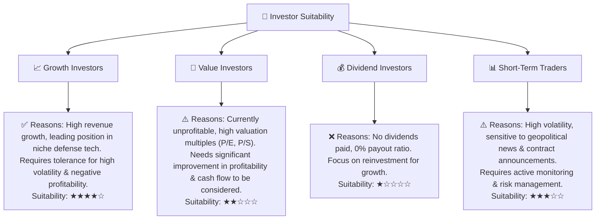

### 10.5 關鍵監控指標

| 監控類型 | 指標                 | 關注點                                     | 頻率 |
|----------|----------------------|--------------------------------------------|------|
| **盈利能力** | 毛利率、營業利益率、淨利率 | 趨勢是否改善，成本控制是否有效             | 季度 |
| **現金流** | 營運現金流、自由現金流 | 是否轉正，是否有持續改善跡象               | 季度 |
| **訂單與合同** | 新增訂單、積壓訂單、合同續簽率 | 業務增長的持續性，市場需求的穩定性         | 季度/新聞 |
| **併購整合** | 併購後協同效應實現情況 | 成本節約、收入增長、新市場拓展             | 半年/年 |
| **研發與創新** | 新產品發布、技術突破     | 產品競爭力，市場領先地位                   | 半年/年 |
| **估值** | Forward P/E, P/S     | 相對同業和歷史區間的變化                   | 季度 |
| **管理層溝通** | 財報電話會議、投資者日   | 對未來展望、盈利能力改善計劃的說明和執行力 | 季度 |

---

> **免責聲明**：本報告為 AI 自動生成，僅供研究參考，不構成投資建議。投資有風險，入市需謹慎。