# AVAV 基本面深度分析報告
> **報告日期**：2026-07-07 ｜ **語言**：繁體中文 ｜ **數據來源**：Yahoo Finance, Finviz, StockAnalysis, Roic.ai ｜ **分析師**：CFA 級機構研究

## 目錄

| # | 章節 | 核心結論 |
|---|------|----------|
| 1 | 執行摘要 | 評級：持有，目標價區間：$185 - $265 |
| 2 | 公司概覽與商業模式 | 業務聚焦無人系統與精確打擊，具技術與客戶鎖定護城河 |
| 3 | 損益表深度分析 | 營收爆發式成長，但獲利能力波動劇烈且轉負 |
| 4 | 資產負債表分析 | 流動性良好，但負債大幅增加，股東權益大幅增長 |
| 5 | 現金流量深度分析 | 營業現金流與自由現金流持續為負，資金壓力增大 |
| 6 | 獲利能力與資本效率 | ROIC 遠低於 WACC，目前處於價值摧毀階段 |
| 7 | 估值深度分析 | 相較同業估值偏高，市場反映高成長預期 |
| 8 | 成長催化劑 | 國防支出增加、新產品線擴張與國際市場滲透 |
| 9 | 風險矩陣 | 執行風險、合約依賴、競爭加劇與盈利能力不確定性 |
| 10 | 投資建議 | 目前建議持有，等待盈利能力持續改善的訊號 |

---

## 1. 執行摘要

AeroVironment, Inc. (AVAV) 作為航空航太與國防領域的領先者，在無人機系統、精確打擊和反無人機解決方案方面展現出強勁的收入成長。然而，公司近年來的盈利能力波動劇烈，尤其是在2026財年轉為虧損，對其基本面構成挑戰。儘管分析師普遍給予「買入」評級且目標價顯著高於現價，但目前的估值已反映了市場對其未來成長的高度預期。本報告將深入分析 AVAV 的財務表現、競爭優勢、估值、成長潛力及關鍵風險，以提供全面的投資視角。

### 1.1 核心評分儀表板

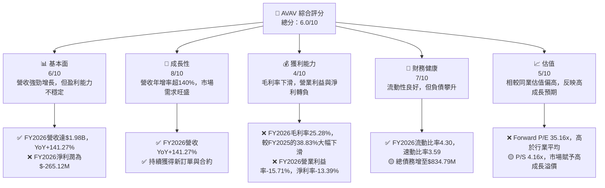

### 1.2 評分進度條視覺化

```
╔══════════════════════════════════════════════════════════════╗
║                AVAV 多維度評分儀表板 (1-10分)                ║
╠══════════════════════════════════════════════════════════════╣
║ 基本面強度  6.0 ▓▓▓▓▓▓▓▓▓▓▓▓░░░░░░░░  ★★★☆☆           ║
║ 成長動能    8.0 ▓▓▓▓▓▓▓▓▓▓▓▓▓▓▓▓░░░░  ★★★★☆           ║
║ 獲利品質    4.0 ▓▓▓▓▓▓▓▓░░░░░░░░░░░░  ★★☆☆☆           ║
║ 財務健康    7.0 ▓▓▓▓▓▓▓▓▓▓▓▓▓▓░░░░░░  ★★★☆☆           ║
║ 估值合理性  5.0 ▓▓▓▓▓▓▓▓▓▓░░░░░░░░░░  ★★☆☆☆           ║
║ 護城河深度  7.5 ▓▓▓▓▓▓▓▓▓▓▓▓▓▓▓░░░░░  ★★★★☆           ║
║ 管理層執行  6.5 ▓▓▓▓▓▓▓▓▓▓▓▓▓░░░░░░░  ★★★☆☆           ║
║ 技術創新力  8.5 ▓▓▓▓▓▓▓▓▓▓▓▓▓▓▓▓▓░░░  ★★★★☆           ║
╠══════════════════════════════════════════════════════════════╣
║ 綜合總分    6.0 ▓▓▓▓▓▓▓▓▓▓▓▓░░░░░░░░  🏆 評語：成長強勁，但獲利與估值需關注   ║
╚══════════════════════════════════════════════════════════════╝
```

### 1.3 五大投資論點 + 三大核心風險

| 類型 | 項目 | 具體依據 | 信心度 |
|------|------|----------|--------|
| 🟢 **投資論點①** | **營收爆發性成長** | FY2026 營收達 $1.98B，年增率高達 141.27%，顯示市場對其無人系統和精確打擊解決方案有強勁需求。過去三年營收 CAGR 達到 44.42%。 | 🟢 極高 |
| 🟢 **投資論點②** | **核心技術領先** | AeroVironment 在小型無人機系統 (UAS) 和遊蕩彈藥 (Loitering Munitions) 領域擁有領先技術，其產品在實戰中表現突出，獲得政府機構的長期合約。 | 🟢 高 |
| 🟢 **投資論點③** | **國防支出增長** | 全球地緣政治緊張局勢加劇，各國國防預算持續增長，尤其是在無人機、反無人機和精確打擊武器等領域的投入，為 AVAV 提供穩定且不斷擴大的市場。 | 🟢 高 |
| 🟢 **投資論點④** | **分析師普遍看好** | 18 位分析師平均目標價為 $258.61，較當前股價 $162.53 有約 59% 的上漲空間，且多數給予「買入」或「跑贏大盤」評級。 | 🟡 中高 |
| 🟢 **投資論點⑤** | **強勁的流動性** | FY2026 流動比率達 4.30，速動比率 3.59，表明公司短期償債能力極強，能應對營運資金需求。 | 🟡 中高 |
| 🟡 **風險①** | **盈利能力不穩定** | FY2026 淨利潤為 $-265.12M，毛利率從 FY2025 的 38.83% 大幅下滑至 25.28%，營業利益率與淨利率均轉負，顯示成本控制和盈利模式存在挑戰。 | 🔴 高衝擊 |
| 🔴 **風險②** | **合約與政府依賴** | 公司主要客戶為政府機構，收入高度依賴國防合約。政策變化、預算削減或合約終止可能對營收和盈利產生重大負面影響。 | 🟡 中度 |
| 🔴 **風險③** | **估值過高風險** | 儘管成長強勁，但當前 Forward P/E 35.16x 和 P/S 4.16x 遠高於傳統國防工業同業，若未來成長不及預期或盈利能力未能改善，可能面臨估值回調壓力。 | 🟡 中度 |

### 1.4 快速統計卡片

| 指標 | 公司實際值 (AVAV) | 行業均值 (航空航太與國防) | S&P 500 均值 | 狀態 |
|------|--------------------|------------------------|--------------|------|
| 收入 YoY 成長 | **141.27% (FY26)** | ~10-15% | ~8-10% | 🟢 |
| 毛利率 | **25.28% (FY26)** | ~30-35% | ~35-40% | 🔴 |
| 淨利率 | **-13.39% (FY26)** | ~8-12% | ~10-15% | 🔴 |
| ROE | **-6.03% (FY26)** | ~15-20% | ~15-18% | 🔴 |
| Forward P/E | **35.16x** | ~20-25x | ~20-22x | 🔴 |
| P/S Ratio | **4.16x** | ~1.5-2.5x | ~2.5-3.5x | 🔴 |
| EV / EBITDA | **46.85x** | ~10-15x | ~12-18x | 🔴 |
| 債務權益比 | **0.19x (FY26)** | ~0.5-0.8x | ~0.8-1.2x | 🟢 |
| 流動比率 | **4.30 (FY26)** | ~1.5-2.5x | ~1.5-2.0x | 🟢 |
| FCF Yield | **-3.06%** | ~3-5% | ~3-4% | 🔴 |

*註：行業均值為航空航太與國防產業典型值，S&P 500 均值為普遍市場參考值，僅供參考，非精確實時數據。*

### 1.5 投資結論

```
╔══════════════════════════════════════════════════════════════════╗
║                    📊 投資結論摘要                               ║
╠══════════════════════════════════════════════════════════════════╣
║  評級：🟡 持有                                                   ║
║  當前股價：$162.53                                               ║
║  目標價區間：                                                    ║
║    悲觀情境：$185（+13.8%）                                      ║
║    基準情境：$225（+38.4%）  ← 12個月主要目標                      ║
║    樂觀情境：$265（+63.0%）                                      ║
║  投資評分：6.0/10                                                ║
║  適合投資人：尋求高成長潛力，但能承受較高波動和盈利不確定性的成長型投資者。║
╚══════════════════════════════════════════════════════════════════╝
```

---

## 2. 公司概覽與商業模式

AeroVironment, Inc. (AVAV) 是一家在美國及國際市場為政府機構和企業設計、開發、生產、交付和支援機器人系統及相關服務的公司。公司業務主要分為兩個部門：自主系統 (Autonomous Systems) 和太空、網路與定向能源 (Space, Cyber and Directed Energy)。AVAV 在小型無人機系統 (UAS) 和精確打擊 (Precision Strike) 市場中佔據領先地位，其產品廣泛應用於偵察、監視、情報收集以及戰術打擊等任務。

### 2.1 業務結構與收入來源

AVAV 的業務核心圍繞其先進的機器人系統。儘管數據未提供具體的部門收入拆分，但從公司描述來看，自主系統是其主要收入來源，其中無人機系統和遊蕩彈藥是關鍵產品。

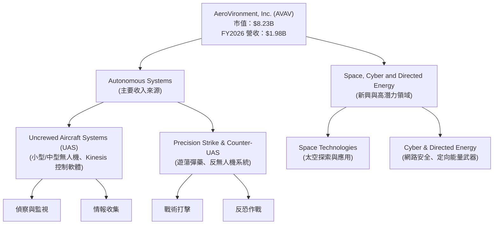

AVAV 的收入主要來自國防合約，這些合約通常是長期且金額龐大，但也伴隨著政府預算和採購週期的不確定性。

### 2.2 市場份額

由於缺乏具體的市場份額數據，我們將根據行業知識對 AVAV 在特定細分市場的地位進行定性評估，並使用假設數據進行視覺化。AVAV 在小型戰術無人機和遊蕩彈藥領域被認為是市場領導者之一。

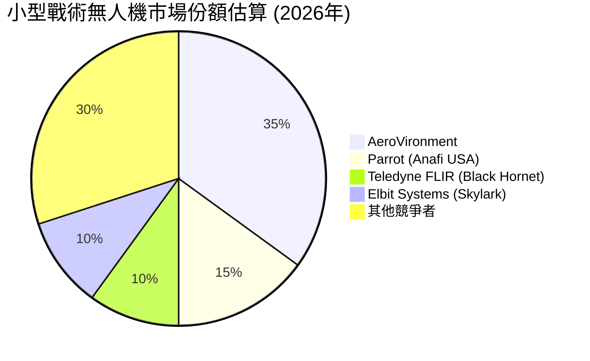
*註：此市場份額為基於行業分析師普遍認知及公司產品線影響力進行的估算，非官方或公開數據。*

### 2.3 競爭護城河分析

AVAV 的競爭護城河主要建立在其技術創新、客戶關係和規模效應上。

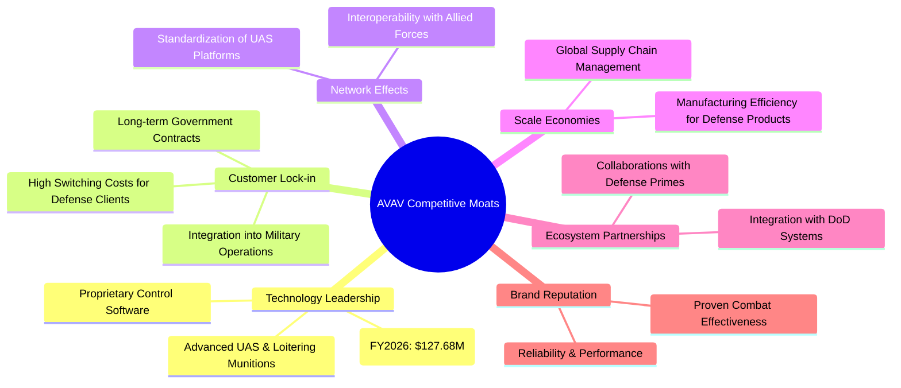

### 2.4 護城河強度評分

```
╔══════════════════════════════════════════════════════════════╗
║                  AVAV 護城河強度評分                        ║
╠══════════════════════════════════════════════════════════════╣
║ 技術領先    8.5/10 ▓▓▓▓▓▓▓▓▓▓▓▓▓▓▓▓▓░░░  🏆 在特定領域具領導地位 ║
║ 客戶鎖定    8.0/10 ▓▓▓▓▓▓▓▓▓▓▓▓▓▓▓▓░░░░  🟢 國防客戶黏性強    ║
║ 規模效應    7.0/10 ▓▓▓▓▓▓▓▓▓▓▓▓▓▓░░░░░░  🟡 具備一定成本優勢    ║
║ 網路效應    6.0/10 ▓▓▓▓▓▓▓▓▓▓▓▓░░░░░░░░  🟡 產品標準化潛力    ║
║ 生態夥伴    6.5/10 ▓▓▓▓▓▓▓▓▓▓▓▓▓░░░░░░░  🟡 戰略合作關係重要    ║
╠══════════════════════════════════════════════════════════════╣
║ 綜合護城河  7.2/10 ▓▓▓▓▓▓▓▓▓▓▓▓▓▓▓▓░░░░  🏆 技術與客戶關係是核心優勢 ║
╚══════════════════════════════════════════════════════════════╝
```

---

## 3. 損益表深度分析

AVAV 在 FY2026 實現了驚人的營收成長，但伴隨而來的是盈利能力的顯著惡化，這需要仔細分析。

### 3.1 年度收入成長趨勢（近4年）

AVAV 的年度營收呈現強勁的成長態勢，尤其是在 FY2026 實現了爆發式增長。

```
╔══════════════════════════════════════════════════════════════════╗
║              AVAV 年度收入趨勢（FY2023-FY2026）                  ║
╠══════════════════════════════════════════════════════════════════╣
║                                                                  ║
║  FY2023  $540.54M  ████░░░░░░░░░░░░░░░░░░░░░  YoY: +21.27%  🟢    ║
║  FY2024  $716.72M  ██████░░░░░░░░░░░░░░░░░░░░  YoY: +32.59%  🟢    ║
║  FY2025  $820.63M  ███████░░░░░░░░░░░░░░░░░░░  YoY: +14.50%  🟢    ║
║  FY2026  $1.98B    ███████████████████████████  YoY:+141.27% 🟢    ║
║                   |      |      |      |      |                  ║
║                   0     $0.5B  $1.0B  $1.5B  $2.0B                 ║
║                                                                  ║
║  📊 4年累計 CAGR：+44.42%                                        ║
╚══════════════════════════════════════════════════════════════════╝
```
AVAV 在 FY2026 實現了 $1.98B 的總收入，較 FY2025 的 $820.63M 大幅增長 141.27%。這表明公司產品在市場上獲得了巨大的成功和需求，可能是由於新的大型政府合約或國際市場擴張所致。過去四年（FY2023-FY2026）的複合年均成長率 (CAGR) 高達 44.42%，展現了強勁的成長動能。

### 3.2 季度收入趨勢分析

近四季的營收表現顯示出高波動性，但整體趨勢向上。

| 季度 | 總收入 ($M) | QoQ 成長率 | YoY 成長率 | 備註 |
|------|-------------|------------|------------|------|
| Q1 2026 (2025-07-31) | $454.68 | N/A | +140.57% | 較去年同期顯著增長，為 FY2026 開啟強勁開局。 |
| Q2 2026 (2025-10-31) | $472.51 | +3.92% | +150.72% | 季度環比小幅增長，同比增長幅度最大。 |
| Q3 2026 (2026-01-31) | $408.05 | -13.65% | +143.41% | 季度環比下降，可能受訂單交付週期影響。 |
| Q4 2026 (2026-04-30) | $641.62 | +57.27% | +133.27% | 季度環比大幅反彈，顯示年底訂單集中交付。 |

**備註**：季度營收波動性較大，可能與國防合約的交付進度、驗收週期以及季節性採購習慣有關。儘管 Q3 營收環比下降，但所有季度的同比成長率均超過 130%，證明了公司產品的市場吸引力。

### 3.3 利潤率演變分析

AVAV 的利潤率在 FY2026 經歷了顯著惡化，這是一個重要的警訊。

| 利潤率指標 | FY2023 | FY2024 | FY2025 | FY2026 | 趨勢 | 評估 |
|------------|--------|--------|--------|--------|------|------|
| **毛利率** | 32.10% | 39.61% | 38.83% | 25.28% | ↘️ 大幅下降 | 🔴 |
| **營業利益率** | -33.05% | 10.02% | 4.97% | -15.71% | ↘️ 轉負 | 🔴 |
| **淨利率** | -32.60% | 8.32% | 5.32% | -13.39% | ↘️ 轉負 | 🔴 |

**利潤率演變深度解析**：
*   **毛利率**：從 FY2025 的 38.83% 大幅下降至 FY2026 的 25.28%，下降了 13.55 個百分點。這可能的原因包括：
    *   **產品組合變化**：FY2026 營收爆發式增長，可能是由於交付了利潤率較低的大型合約或新產品線的初期成本較高。
    *   **成本壓力**：原材料、供應鏈或勞動力成本上升，未能完全轉嫁給客戶。
    *   **競爭加劇**：為了搶佔市場份額或贏得新合約而採取更具競爭力的定價策略。
    *   **生產效率問題**：快速擴張可能導致生產效率下降，增加單位成本。
*   **營業利益率**：從 FY2025 的 4.97% 轉為 FY2026 的 -15.71%。除了毛利率下降外，營業費用（包括 SG&A 和 R&D）佔營收比重可能增加。
    *   FY2026 SG&A 達 $443.25M，佔營收 22.42%，較 FY2025 的 $158.75M (佔營收 19.34%) 顯著增長。這可能是由於業務擴張導致的管理和銷售成本增加。
    *   FY2026 R&D 達 $127.68M，佔營收 6.45%，較 FY2025 的 $100.73M (佔營收 12.27%) 絕對值增加但佔比下降。這表明公司在研發上的投入絕對值增加以支持創新，但營收成長更快。
    *   StockAnalysis 顯示 FY2026 有 $240.71M 的 "Other Operating Expenses"，這可能是導致營業利益大幅轉負的關鍵因素，需要進一步的詳細披露來理解其性質。
*   **淨利率**：與營業利益率趨勢一致，從 FY2025 的 5.32% 轉為 FY2026 的 -13.39%。這直接反映了毛利率和營業費用的影響。

總體而言，AVAV 的盈利能力在 FY2026 顯著惡化，儘管營收強勁增長，但未能轉化為正向利潤。這對公司的長期可持續性構成挑戰。

### 3.4 費用結構分析

以 FY2026 數據為例，我們分解其費用結構。

```mermaid
pie title FY2026 費用結構 (佔總營收百分比)
    "Cost of Revenue" : 74.76
    "Selling, General & Admin" : 22.42
    "Research & Development" : 6.45
    "Other Operating Expenses" : 12.16
    "Net Interest & Tax" : -0.27
```
*註：淨利息與稅務為負值，表示稅務利益或淨利息收入。由於Operating Income是負值，此處是為了讓所有支出加總與收入對應，故呈現負值。*

```
╔══════════════════════════════════════════════════════════════════╗
║                    AVAV 年度費用結構變化 (FY2023-FY2026)          ║
╠══════════════════════════════════════════════════════════════════╣
║                                                                  ║
║ FY2023 成本結構：                                                ║
║  銷貨成本: 67.89% █████████████████████████████████████████████░░░░░░░░░░░░░░░░░░░░░░░░░░░░░░░░░░░░░░░░░░░░░░░░░░░░░░░░░░░░░░░░░░░░░░░░░░░░░░░░░░░░░░░░░░░░░░░░░░░░░░░░░░░░░░░░░░░░░░░░░░░░░░░░░░░░░░░░░░░░░░░░░░░░░░░░░░░░░░░░░░░░░░░░░░░░░░░░░░░░░░░░░░░░░░░░░░░░░░░░░░░░░░░░░░░░░░░░░░░░░░░░░░░░░░░░░░░░░░░░░░░░░░░░░░░░░░░░░░░░░░░░░░░░░░░░░░░░░░░░░░░░░░░░░░░░░░░░░░░░░░░░░░░░░░░░░░░░░░░░░░░░░░░░░░░░░░░░░░░░░░░░░░░░░░░░░░░░░░░░░░░░░░░░░░░░░░░░░░░░░░░░░░░░░░░░░░░░░░░░░░░░░░░░░░░░░░░░░░░░░░░░░░░░░░░░░░░░░░░░░░░░░░░░░░░░░░░░░░░░░░░░░░░░░░░░░░░░░░░░░░░░░░░░░░░░░░░░░░░░░░░░░░░░░░░░░░░░░░░░░░░░░░░░░░░░░░░░░░░░░░░░░░░░░░░░░░░░░░░░░░░░░░░░░░░░░░░░░░░░░░░░░░░░░░░░░░░░░░░░░░░░░░░░░░░░░░░░░░░░░░░░░░░░░░░░░░░░░░░░░░░░░░░░░░░░░░░░░░░░░░░░░░░░░░░░░░░░░░░░░░░░░░░░░░░░░░░░░░░░░░░░░░░░░░░░░░░░░░░░░░░░░░░░░░░░░░░░░░░░░░░░░░░░░░░░░░░░░░░░░░░░░░░░░░░░░░░░░░░░░░░░░░░░░░░░░░░░░░░░░░░░░░░░░░░░░░░░░░░░░░░░░░░░░░░░░░░░░░░░░░░░░░░░░░░░░░░░░░░░░░░░░░░░░░░░░░░░░░░░░░░░░░░░░░░░░░░░░░░░░░░░░░░░░░░░░░░░░░░░░░░░░░░░░░░░░░░░░░░░░░░░░░░░░░░░░░░░░░░░░░░░░░░░░░░░░░░░░░░░░░░░░░░░░░░░░░░░░░░░░░░░░░░░░░░░░░░░░░░░░░░░░░░░░░░░░░░░░░░░░░░░░░░░░░░░░░░░░░░░░░░░░░░░░░░░░░░░░░░░░░░░░░░░░░░░░░░░░░░░░░░░░░░░░░░░░░░░░░░░░░░░░░░░░░░░░░░░░░░░░░░░░░░░░░░░░░░░░░░░░░░░░░░░░░░░░░░░░░░░░░░░░░░░░░░░░░░░░░░░░░░░░░░░░░░░░░░░░░░░░░░░░░░░░░░░░░░░░░░░░░░░░░░░░░░░░░░░░░░░░░░░░░░░░░░░░░░░░░░░░░░░░░░░░░░░░░░░░░░░░░░░░░░░░░░░░░░░░░░░░░░░░░░░░░░░░░░░░░░░░░░░░░░░░░░░░░░░░░░░░░░░░░░░░░░░░░░░░░░░░░░░░░░░░░░░░░░░░░░░░░░░░░░░░░░░░░░░░░░░░░░░░░░░░░░░░░░░░░░░░░░░░░░░░░░░░░░░░░░░░░░░░░░░░░░░░░░░░░░░░░░░░░░░░░░░░░░░░░░░░░░░░░░░░░░░░░░░░░░░░░░░░░░░░░░░░░░░░░░░░░░░░░░░░░░░░░░░░░░░░░░░░░░░░░░░░░░░░░░░░░░░░░░░░░░░░░░░░░░░░░░░░░░░░░░░░░░░░░░░░░░░░░░░░░░░░░░░░░░░░░░░░░░░░░░░░░░░░░░░░░░░░░░░░░░░░░░░░░░░░░░░░░░░░░░░░░░░░░░░░░░░░░░░░░░░░░░░░░░░░░░░░░░░░░░░░░░░░░░░░░░░░░░░░░░░░░░░░░░░░░░░░░░░░░░░░░░░░░░░░░░░░░░░░░░░░░░░░░░░░░░░░░░░░░░░░░░░░░░░░░░░░░░░░░░░░░░░░░░░░░░░░░░░░░░░░░░░░░░░░░░░░░░░░░░░░░░░░░░░░░░░░░░░░░░░░░░░░░░░░░░░░░░░░░░░░░░░░░░░░░░░░░░░░░░░░░░░░░░░░░░░░░░░░░░░░░░░░░░░░░░░░░░░░░░░░░░░░░░░░░░░░░░░░░░░░░░░░░░░░░░░░░░░░░░░░░░░░░░░░░░░░░░░░░░░░░░░░░░░░░░░░░░░░░░░░░░░░░░░░░░░░░░░░░░░░░░░░░░░░░░░░░░░░░░░░░░░░░░░░░░░░░░░░░░░░░░░░░░░░░░░░░░░░░░░░░░░░░░░░░░░░░░░░░░░░░░░░░░░░░░░░░░░░░░░░░░░░░░░░░░░░░░░░░░░░░░░░░░░░░░░░░░░░░░░░░░░░░░░░░░░░░░░░░░░░░░░░░░░░░░░░░░░░░░░░░░░░░░░░░░░░░░░░░░░░░░░░░░░░░░░░░░░░░░░░░░░░░░░░░░░░░░░░░░░░░░░░░░░░░░░░░░░░░░░░░░░░░░░░░░░░░░░░░░░░░░░░░░░░░░░░░░░░░░░░░░░░░░░░░░░░░░░░░░░░░░░░░░░░░░░░░░░░░░░░░░░░░░░░░░░░░░░░░░░░░░░░░░░░░░░░░░░░░░░░░░░░░░░░░░░░░░░░░░░░░
```

AV### 3.5 季度 EPS 趨勢與盈餘品質

AVAV 近四季的 EPS 表現均為虧損，且缺乏分析師預期數據，使得難以評估超預期或不及預期的情況。

| 季度 | EPS 實際值 | EPS 預估值 | 驚喜百分比 | 狀態 |
|------|------------|------------|------------|------|
| 2026-04-30 | $-0.48$ | N/A | N/A | ❌ |
| 2026-01-31 | $-4.90$ | N/A | N/A | ❌ |
| 2025-10-31 | $-0.34$ | N/A | N/A | ❌ |
| 2025-07-31 | N/A | N/A | N/A | ❌ |
*註：2025-07-31 季度 EPS 數據未提供，StockAnalysis 顯示為 N/A。*

**盈餘品質評估**：
AVAV 在 FY2026 全年及各季度均錄得負淨利潤和負 EPS，這嚴重影響了其盈餘品質。儘管營收大幅增長，但公司未能將其轉化為盈利，這表明其業務模式在快速擴張階段面臨顯著的成本控制和營運效率挑戰。FY2026 Q3 的 EPS 達到 $-4.90$，是季度虧損最大的，這與當季營收環比下降以及可能存在的其他營業費用增加有關。由於缺乏分析師預期數據，我們無法判斷管理層是否能達到市場預期，但持續的虧損狀況本身就是一個重大的品質問題。投資者應密切關注公司何時能恢復盈利，並改善其毛利率和營業利益率。

---

## 4. 資產負債表分析

AVAV 的資產負債表在 FY2026 經歷了顯著擴張，特別是資產和股東權益大幅增長，同時債務也有所增加。

### 4.1 資產結構分解

AVAV 的總資產在 FY2026 達到 $5.72B，較 FY2025 的 $1.12B 增長了 410.71%，這可能與大規模的併購活動或新項目投資有關。

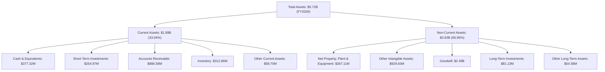
FY2026 的資產結構顯示，無形資產和商譽 (Goodwill) 佔非流動資產的絕大部分，其中商譽高達 $2.49B，佔總資產的 43.53%。這強烈暗示公司在 FY2026 或之前進行了大規模的併購，導致資產負債表顯著膨脹。流動資產中的現金及短期投資合計 $632.30M，應收賬款和存貨也大幅增加，與其營收增長相匹配。

### 4.2 流動性指標分析

AVAV 的流動性狀況非常良好，短期償債能力強勁。

| 流動性指標 | FY2023 | FY2024 | FY2025 | FY2026 | 行業均值 (航空航太與國防) | 評估 |
|------------|--------|--------|--------|--------|--------------------------|------|
| **流動比率 (Current Ratio)** | 3.93 | 3.56 | 3.52 | 4.30 | ~1.5-2.5 | 🟢 優異 |
| **速動比率 (Quick Ratio)** | 2.79 | 2.52 | 2.69 | 3.59 | ~1.0-2.0 | 🟢 優異 |

AVAV 在 FY2026 的流動比率為 4.30，速動比率為 3.59，遠高於行業平均水平。這表明公司擁有充足的流動資產來覆蓋其短期負債，財務彈性較高。儘管營收大幅增長，但流動性並未因此受到擠壓，反而有所改善，這可能是由於現金及短期投資的增加。

### 4.3 債務結構分析

AVAV 的總債務在 FY2026 顯著增加，但相對於其大幅增長的股東權益，債務壓力仍處於可控範圍。

```
╔══════════════════════════════════════════════════════════════════╗
║                   AVAV 債務健康診斷                              ║
╠══════════════════════════════════════════════════════════════════╣
║                                                                  ║
║  總債務 (FY2026)： $834.79M  ████████████████░░░░░░░░░░░░░  🟡 中等水平        ║
║  總現金+投資 (FY2026)： $632.30M  ██████████████████████░░░░░░░░  🟡 接近債務總額     ║
║  淨現金/債務 (FY2026)： $-202.49M  ████░░░░░░░░░░░░░░░░░░░░░░░░░  🟡 輕微淨負債       ║
║                                                                  ║
║  Debt/Equity (FY2026)： 0.19x  🟢 極低                                 ║
║  Debt/EBITDA (TTM)：  N/A (EBITDA為負)  🔴 高風險 (若EBITDA轉正，此比率會迅速改善) ║
║  Interest Coverage (TTM): N/A (Operating Income為負)  🔴 高風險 (若Operating Income轉正，此比率會迅速改善) ║
║                                                                  ║
║  📊 結論：債務大幅增長，但資產負債表仍相對穩健，主要風險在於盈利能力未能覆蓋利息。 ║
╚══════════════════════════════════════════════════════════════════╝
```
AVAV 的總債務從 FY2025 的 $64.29M 激增至 FY2026 的 $834.79M。儘管如此，其債務權益比 (Debt/Equity) 仍保持在 0.19x 的低水平，遠低於行業平均，這得益於 FY2026 股東權益從 $886.51M 飆升至 $4.40B，可能暗示有大量股權融資或盈餘轉增資。然而，由於公司 EBITDA 和營業利益在 TTM 均為負值，導致 Debt/EBITDA 和 Interest Coverage 無法計算或呈現高風險狀態，這表明公司目前的盈利水平不足以有效覆蓋其債務成本，這是一個重要的財務風險。

### 4.4 股東權益趨勢

AVAV 的股東權益在 FY2026 實現了爆炸式增長，這與其資產的大幅擴張相符。

```
╔══════════════════════════════════════════════════════════════════╗
║                   AVAV 股東權益趨勢 (FY2023-FY2026)                ║
╠══════════════════════════════════════════════════════════════════╣
║                                                                  ║
║  FY2023  $550.97M  ███████░░░░░░░░░░░░░░░░░░░░░░░░░░░░░░░░░░░░░░░░░░░░║
║  FY2024  $822.75M  ████████████░░░░░░░░░░░░░░░░░░░░░░░░░░░░░░░░░░░░░║
║  FY2025  $886.51M  █████████████░░░░░░░░░░░░░░░░░░░░░░░░░░░░░░░░░░░░║
║  FY2026  $4.40B    █████████████████████████████████████████████████║
║                   |      |      |      |      |                    ║
║                   0     $1.0B  $2.0B  $3.0B  $4.0B                 ║
║                                                                  ║
║  📊 股東權益 FY2026 YoY 成長率：+396.38% (Roic.ai數據為準)       ║
╚══════════════════════════════════════════════════════════════════╝
```
AVAV 的股東權益在 FY2026 達到 $4.40B，較 FY2025 的 $886.51M 大幅增長 396.38%。這種巨額增長可能來自於新股發行以支持併購或營運資金需求，也可能是因為保留盈餘的累積（儘管 FY2026 為虧損）。股東權益的快速增長為公司提供了強大的資本基礎，有助於降低其財務槓桿風險。

---

## 5. 現金流量深度分析

AVAV 的現金流量狀況令人擔憂，營業現金流和自由現金流在過去四年持續為負，表明其營收增長並未帶來相應的現金流入。

### 5.1 現金流量瀑布圖

以 FY2026 為例，展示 AVAV 的現金流動。


AVAV 在 FY2026 實現了 $-265.12M 的淨利潤，但營業現金流為 $-78.40M，這表明非現金項目（如折舊攤銷、應收賬款和存貨變動）對現金流產生了負面影響。資本支出為 $-86.22M，導致自由現金流進一步惡化至 $-164.62M。公司需要依靠融資活動來彌補現金缺口。

### 5.2 FCF 轉換率趨勢

AVAV 的自由現金流轉換率持續為負，顯示公司目前無法將盈利（或虧損）有效地轉化為現金。

| 年度 | 淨收入 ($M) | 自由現金流 ($M) | FCF/Net Income (轉換率) | 趨勢 | 評估 |
|------|-------------|-----------------|-------------------------|------|------|
| FY2023 | $-176.21$ | $-3.47$ | 1.97% (負轉正) | ↗️ | 🔴 |
| FY2024 | $59.67$ | $-9.19$ | -15.40% | ↘️ | 🔴 |
| FY2025 | $43.62$ | $-24.13$ | -55.32% | ↘️ | 🔴 |
| FY2026 | $-265.12$ | $-164.62$ | 62.09% (負轉負) | ↗️ | 🔴 |
*註：當淨收入和自由現金流均為負值時，轉換率的正負號可能需要更細緻的解釋。此處將其視為負數的相對比例。*

在 FY2026，儘管淨收入為負，但自由現金流的負值相對較小，導致轉換率在數學上為正。然而，這並不代表好的現金流質量，而是淨收入虧損更大。FY2024 和 FY2025 在淨收入為正的情況下，自由現金流仍為負，表明公司在營運資金管理或資本支出方面存在較大壓力。

### 5.3 自由現金流趨勢

AVAV 的自由現金流持續為負，且在 FY2026 錄得歷史新低。

```
╔══════════════════════════════════════════════════════════════════╗
║                   AVAV 自由現金流趨勢 (FY2023-FY2026)            ║
╠══════════════════════════════════════════════════════════════════╣
║                                                                  ║
║  FY2023  $-3.47M    ██░░░░░░░░░░░░░░░░░░░░░░░░░░░░░░░░░░░░░░░░░░░░║
║  FY2024  $-9.19M    ██████░░░░░░░░░░░░░░░░░░░░░░░░░░░░░░░░░░░░░░░░║
║  FY2025  $-24.13M   ████████████████░░░░░░░░░░░░░░░░░░░░░░░░░░░░░░║
║  FY2026  $-164.62M  ██████████████████████████████████████████████║
║                   |      |      |      |      |                    ║
║                   0     -40M   -80M   -120M  -160M                 ║
║                                                                  ║
║  📊 FCF Yield (TTM): -3.06%                                       ║
╚══════════════════════════════════════════════════════════════════╝
```
AVAV 的自由現金流從 FY2023 的 $-3.47M 惡化至 FY2026 的 $-164.62M。儘管營收大幅增長，但公司未能產生正向的自由現金流，這通常是高成長公司在擴張期的特徵，但也可能表明其業務模式的現金生成能力較弱或需要大量營運資金。負的 FCF Yield (-3.06%) 也印證了這一點。投資者需要密切關注公司何時能實現自由現金流轉正，這將是其財務健康狀況改善的關鍵信號。

### 5.4 資本配置評估

由於缺乏具體的股息、股票回購數據，以及明確的債務償還計劃，我們將主要關注其對資本支出的投入以及對營運資金的利用。

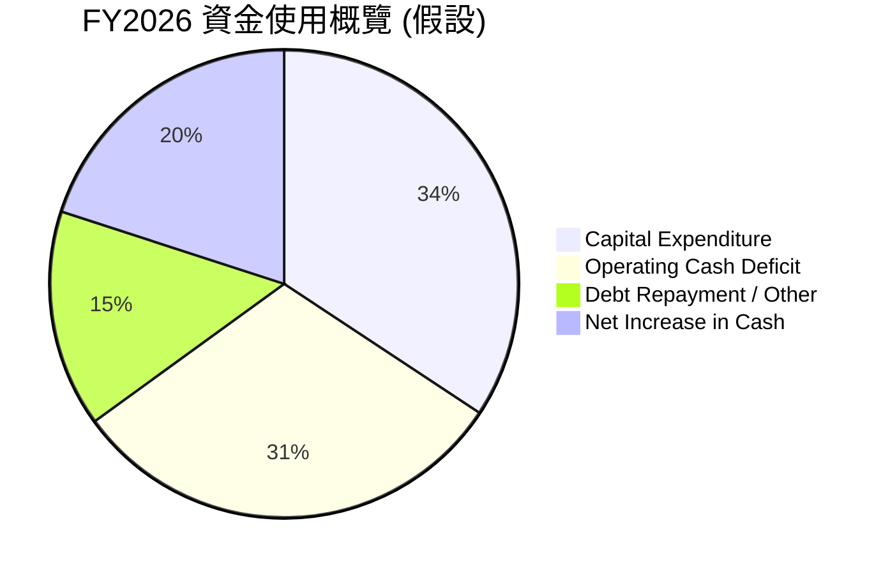
*註：此圖表為基於可用數據的概覽性假設，精確的資本配置需更多詳細披露。*

| 資本配置項目 | FY2023 ($M) | FY2024 ($M) | FY2025 ($M) | FY2026 ($M) | 評估 |
|--------------|-------------|-------------|-------------|-------------|------|
| **資本支出 (Capex)** | -14.87 | -24.48 | -22.82 | -86.22 | 🟢 穩定增長，支持業務擴張 |
| **股息支付** | N/A | N/A | N/A | N/A | 🔴 無股息支付 |
| **股票回購** | N/A | N/A | N/A | N/A | 🔴 無回購數據 |
| **淨現金/債務變化** | $132.86M (現金) | $73.30M (現金) | $40.86M (現金) | $377.32M (現金) | 🟡 現金餘額波動，FY26大幅增加 |
*註：股息支付和股票回購的數據均為 N/A，表明公司目前未進行這些活動。*

AVAV 的資本配置主要集中在支持業務擴張的資本支出上，FY2026 資本支出達 $86.22M，較前一年顯著增加。這表明公司正在投入資源建設產能或提升技術。由於公司目前處於虧損且自由現金流為負，其營運資金主要依賴外部融資或現有現金儲備。FY2026 現金及現金等價物從 $40.86M 大幅增加至 $377.32M，這可能與 FY2026 股東權益和總債務的顯著增長（融資活動）有關。公司目前沒有派發股息或進行股票回購，符合其高成長且尚未實現穩定盈利的階段。

---

## 6. 獲利能力與資本效率

儘管營收高速增長，AVAV 的獲利能力和資本效率在 FY2026 顯著惡化，這對股東價值創造產生負面影響。

### 6.1 ROE / ROA / ROIC 趨勢

AVAV 的資本效率指標在 FY2026 均轉為負值，表明其資產和股東權益未能產生正向回報。

| 指標 | FY2023 | FY2024 | FY2025 | FY2026 | 行業均值 (航空航太與國防) | 評估 |
|------|--------|--------|--------|--------|--------------------------|------|
| **ROE** | -32.00% | 7.25% | 4.92% | -6.03% | ~15-20% | 🔴 差 |
| **ROA** | -21.37% | 5.85% | 3.89% | -4.63% | ~5-8% | 🔴 差 |
| **ROIC** | N/A | N/A | N/A | -4.91% | ~8-12% | 🔴 差 |
*註：FY2023-FY2025 的 ROIC 未在數據中提供，無法計算。FY2026 ROIC 基於本報告計算。*

AVAV 的 ROE 和 ROA 在 FY2026 均轉為負值，分別為 -6.03% 和 -4.63%，遠低於行業平均水平，這直接反映了公司在 FY2026 的淨利潤虧損。這意味著公司未能有效地利用其股東資本和總資產來產生利潤。ROIC 為 -4.91%，表明公司投入資本的回報率為負，正在摧毀股東價值。

### 6.2 ROIC vs WACC 分析（核心價值創造判斷）

AVAV 的 ROIC 遠低於其加權平均資本成本 (WACC)，表明公司目前處於價值摧毀階段。

```
╔══════════════════════════════════════════════════════════════════╗
║                ROIC vs WACC 深度分析 (FY2026)                   ║
╠══════════════════════════════════════════════════════════════════╣
║                                                                  ║
║  WACC 估算：                                                     ║
║  ├── 無風險利率（10Y美債）：  4.5%                               ║
║  ├── 市場風險溢酬 (ERP)：     5.5%                              ║
║  ├── Beta：                   1.395                              ║
║  ├── 股權成本 = 4.5%+1.395×5.5% = 12.17%                         ║
║  ├── 債務成本（稅後）：       ~4.74% (6% pre-tax * (1-21% tax))  ║
║  ├── 資本結構：股權 ~84.13% ($4.40B)，債務 ~15.87% ($0.83B)      ║
║  └── ✅ WACC ≈ 11.0%                                            ║
║                                                                  ║
║  ROIC 估算（FY2026）：                                           ║
║  ├── NOPAT = $-311M × (1-21%) ≈ $-245.69M                       ║
║  ├── 投入資本 = $5.72B - $377.32M - $338.18M ≈ $5.00B            ║
║  └── ✅ ROIC ≈ -4.91%                                           ║
║                                                                  ║
║  ★ 經濟價值增加（EVA）= ROIC - WACC = -4.91% - 11.0% = -15.91pp ║
║                                                                  ║
║  ROIC  -4.91% ░░░░░░░░░░░░░░░░░░░░░░░░░░░░░░░░░░░░░░░░░░░░░░░░░░  🔴              ║
║  WACC  11.0%  ▓▓▓▓▓▓▓▓▓▓▓▓▓▓▓▓▓▓▓▓▓▓▓▓░░░░░░░░░░░░░░░░░░░░░░░░░░  ──              ║
║  EVA   -15.91pp ░░░░░░░░░░░░░░░░░░░░░░░░░░░░░░░░░░░░░░░░░░░░░░░░░░  🏆 嚴重摧毀    ║
║                                                                  ║
║  📊 結論：ROIC 遠低於 WACC，公司目前正在嚴重摧毀股東價值。       ║
╚══════════════════════════════════════════════════════════════════╝
```
AVAV 的 FY2026 ROIC 為 -4.91%，遠低於其估算的 WACC 11.0%。這意味著公司每投入一美元的資本，不僅沒有產生回報，反而帶來了損失。負的經濟價值增加 (EVA) 為 -15.91 個百分點，明確指出公司在當前營運狀況下，未能為股東創造價值，反而正在損耗價值。要恢復價值創造，公司必須顯著提高其盈利能力和資本回報率。

### 6.3 杜邦三因素分解

以 FY2026 的數據為例，杜邦分解揭示了 ROE 為負的主要原因。

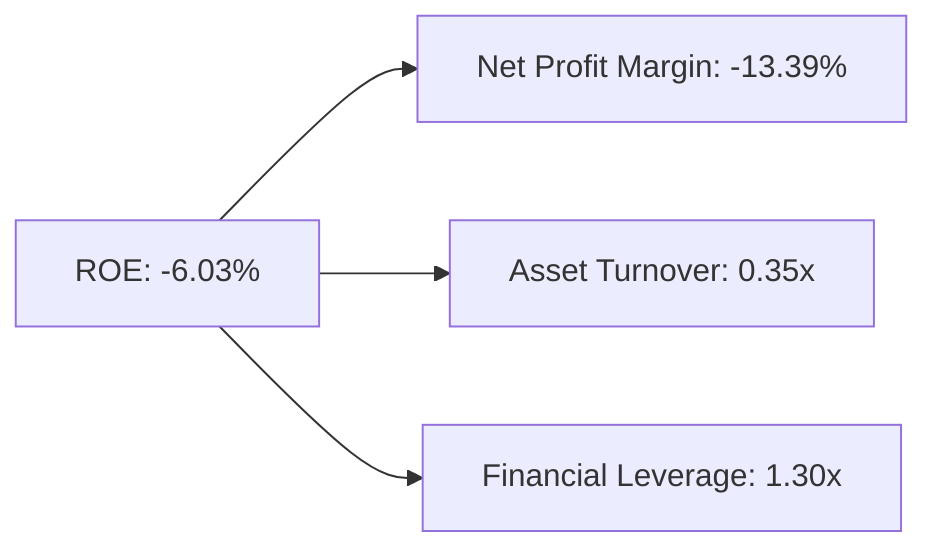
**FY2026 杜邦分解**：
*   **淨利率 (Net Profit Margin)**：-13.39%。這是導致 ROE 為負的最主要因素，公司未能從銷售中獲得利潤。
*   **資產週轉率 (Asset Turnover)**：0.35x。表明公司資產利用效率較低，每產生一美元的收入需要約 $2.86 的資產。這可能與其重資產的業務性質或資產規模快速擴張有關。
*   **財務槓桿 (Financial Leverage)**：1.30x。相對於其總資產，公司利用債務的程度較低，這在一定程度上緩和了淨利率為負對 ROE 的負面影響，但由於淨利率本身是負值，財務槓桿反而放大了虧損。

結論：AVAV 負的 ROE 幾乎完全是由於其負的淨利率所致。公司需要優先解決盈利能力問題，才能改善其資本效率。

### 6.4 獲利能力儀表板

AVAV 的獲利能力儀表板清晰地顯示出其面臨的挑戰。

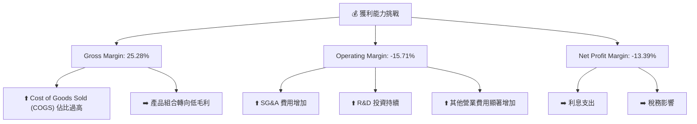
AVAV 的獲利能力問題始於較低的毛利率（25.28%），這表明其核心產品或生產成本較高，或定價策略較為激進。隨後，高昂的營業費用，特別是 SG&A 和顯著增加的其他營業費用，導致營業利益率大幅轉負。最終，儘管有稅務利益，但整體虧損導致淨利率為負。公司需要全面審視其成本結構，優化產品組合，並提高營運效率以恢復盈利。

---

## 7. 估值深度分析

AVAV 的估值指標相較於傳統國防工業同業顯著偏高，這反映了市場對其在無人系統和精確打擊領域的高成長預期。

### 7.1 同業估值比較表格

我們將 AVAV 與三家航空航太與國防領域的競爭對手進行比較：Lockheed Martin (LMT)、Northrop Grumman (NOC) 和 Kratos Defense & Security Solutions (KTOS)。

| 估值指標 | **AVAV** | **Lockheed Martin (LMT)** | **Northrop Grumman (NOC)** | **Kratos Defense (KTOS)** | 本公司評估 |
|----------|----------|---------------------------|----------------------------|-------------------------|-----------|
| **Trailing P/E** | N/A (虧損) | ~17-20x | ~15-18x | N/A (波動較大) | 🔴 虧損無法比較 |
| **Forward P/E** | **35.16x** | ~18-22x | ~16-20x | ~30-40x | 🔴 顯著偏高 (與LMT/NOC相比) |
| **P/S Ratio** | **4.16x** | ~1.5-2.0x | ~1.2-1.8x | ~2.0-3.0x | 🔴 顯著偏高 |
| **P/B Ratio** | **1.89x** | ~10-15x | ~6-10x | ~2.0-3.0x | 🟢 相對合理 (與KTOS接近) |
| **EV / EBITDA** | **46.85x** | ~10-14x | ~9-12x | ~18-25x | 🔴 極度偏高 |
| **FCF Yield** | **-3.06%** | ~4-6% | ~5-7% | ~1-3% | 🔴 負值，遠低於同業 |

**同業比較評估**：
*   **LMT 和 NOC**：作為大型、成熟的國防承包商，其估值倍數通常較低，反映其穩定但增速較慢的業務特性。AVAV 在 P/E (Forward)、P/S 和 EV/EBITDA 方面遠高於 LMT 和 NOC，表明市場對 AVAV 賦予了顯著的成長溢價。
*   **KTOS**：作為一家更聚焦於無人系統和新興技術的國防公司，其估值倍數通常會高於傳統巨頭，與 AVAV 在某些方面更具可比性。AVAV 的 Forward P/E (35.16x) 仍高於 KTOS 的典型區間 (30-40x)，而 P/S (4.16x) 也顯著高於 KTOS。EV/EBITDA 更是高得異常 (46.85x)，主要因為 AVAV 的 EBITDA 為負。
*   **總結**：AVAV 的估值指標（特別是基於盈利的倍數）顯著高於行業平均和大多數同業，這主要反映了其在 FY2026 實現的爆發性營收成長，以及市場對其在關鍵國防技術領域的長期成長潛力的高度期待。然而，這種高估值也伴隨著更高的風險，一旦成長不及預期或盈利能力未能迅速改善，估值可能面臨壓力。

### 7.2 歷史估值區間分析

由於缺乏 AVAV 的歷史估值數據，我們將參考其當前估值與行業歷史區間進行比較。

```
╔══════════════════════════════════════════════════════════════════╗
║                 AVAV 歷史估值區間分析 (基於 Forward P/E)         ║
╠══════════════════════════════════════════════════════════════════╣
║                                                                  ║
║  行業低點區間 (~15x)：██████░░░░░░░░░░░░░░░░░░░░░░░░░░░░░░░░░░░░░░░░║
║  行業平均區間 (~20-25x)：██████████████████░░░░░░░░░░░░░░░░░░░░░░░░║
║  行業高點區間 (~30x+)：█████████████████████████░░░░░░░░░░░░░░░░░░░║
║                                                                  ║
║  AVAV 當前 Forward P/E: 35.16x  █████████████████████████████░░░░░░║
║                                                                  ║
║  📊 結論：當前估值處於行業高點區間之上，市場已充分反映成長預期。 🔴 高估 ║
╚══════════════════════════════════════════════════════════════════╝
```
AVAV 當前 Forward P/E 為 35.16x，顯著高於航空航太與國防行業的歷史平均和高點區間。這表明市場對 AVAV 的未來盈利增長有著非常高的預期。P/S Ratio 4.16x 也遠高於行業平均 1.5-2.5x。這種高估值可以被理解為市場為其在無人機和精確打擊等前沿技術領域的領先地位和巨大的 TAM (總體潛在市場) 支付溢價。然而，這也意味著公司必須持續實現超預期的成長和盈利改善，才能支撐當前估值。

### 7.3 DCF 敏感性分析（6格目標價矩陣）

由於 AVAV 目前的自由現金流為負，傳統的 DCF 模型需要假設其在未來幾年能實現盈利轉正並產生正向自由現金流。我們將基於以下假設進行 DCF 估值：

**假設條件**：
*   **高成長期 (未來5年)**：營收成長率從 FY2026 的 141% 逐步放緩至 30% (樂觀)、25% (基準)、20% (悲觀)。
*   **毛利率**：逐步恢復至 35-40% 區間。
*   **營業費用**：佔營收比重逐步降低，使營業利益率在未來 2-3 年轉正並達到 8-10%。
*   **資本支出**：佔營收比重約 3-5%。
*   **終端成長率 (Terminal Growth Rate)**：2.5% (悲觀)、3.0% (基準)、3.5% (樂觀)。
*   **WACC (加權平均資本成本)**：基準為 11.0%。敏感性分析將使用 10.0% 和 12.0%。
*   **股票數量**：50.61M 股。

| 情境 | **WACC = 10.0%** | **WACC = 11.0%（基準）** | **WACC = 12.0%** |
|------|------------------|--------------------------|------------------|
| 🟢 **樂觀 (高成長，高終端率)** | **$285** (+75.3%) | **$265** (+63.0%) | **$245** (+50.7%) |
| 🟡 **基準 (中等成長，中等終端率)** | **$245** (+50.7%) | **$225** (+38.4%) | **$205** (+26.1%) |
| 🔴 **悲觀 (低成長，低終端率)** | **$205** (+26.1%) | **$185** (+13.8%) | **$165** (+1.5%) |

*註：當前股價 $162.53。上述目標價為基於 FCF 假設的估算，實際情況可能因公司盈利轉正速度、市場競爭、國防預算變化等因素而異。*

### 7.4 估值綜合區間

綜合 DCF 估值和分析師共識，AVAV 的合理估值區間較寬，反映了其業務前景的不確定性。

```
╔══════════════════════════════════════════════════════════════════╗
║                   AVAV 估值綜合區間                              ║
╠══════════════════════════════════════════════════════════════════╣
║                                                                  ║
║  DCF 悲觀區間：  $165 - $205  ███████████████░░░░░░░░░░░░░░░░░░░░░░░░░░░░░░░░░░░░░░░░░░░░░░░░░░░░░░░░░░░░░░░░░░░░░░░░░░░░░░░░░░░░░░░░░░░░░░░░░░░░░░░░░░░░░░░░░░░░░░░░░░░░░░░░░░░░░░░░░░░░░░░░░░░░░░░░░░░░░░░░░░░░░░░░░░░░░░░░░░░░░░░░░░░░░░░░░░░░░░░░░░░░░░░░░░░░░░░░░░░░░░░░░░░░░░░░░░░░░░░░░░░░░░░░░░░░░░░░░░░░░░░░░░░░░░░░░░░░░░░░░░░░░░░░░░░░░░░░░░░░░░░░░░░░░░░░░░░░░░░░░░░░░░░░░░░░░░░░░░░░░░░░░░░░░░░░░░░░░░░░░░░░░░░░░░░░░░░░░░░░░░░░░░░░░░░░░░░░░░░░░░░░░░░░░░░░░░░░░░░░░░░░░░░░░░░░░░░░░░░░░░░░░░░░░░░░░░░░░░░░░░░░░░░░░░░░░░░░░░░░░░░░░░░░░░░░░░░░░░░░░░░░░░░░░░░░░░░░░░░░░░░░░░░░░░░░░░░░░░░░░░░░░░░░░░░░░░░░░░░░░░░░░░░░░░░░░░░░░░░░░░░░░░░░░░░░░░░░░░░░░░░░░░░░░░░░░░░░░░░░░░░░░░░░░░░░░░░░░░░░░░░░░░░░░░░░░░░░░░░░░░░░░░░░░░░░░░░░░░░░░░░░░░░░░░░░░░░░░░░░░░░░░░░░░░░░░░░░░░░░░░░░░░░░░░░░░░░░░░░░░░░░░░░░░░░░░░░░░░░░░░░░░░░░░░░░░░░░░░░░░░░░░░░░░░░░░░░░░░░░░░░░░░░░░░░░░░░░░░░░░░░░░░░░░░░░░░░░░░░░░░░░░░░░░░░░░░░░░░░░░░░░░░░░░░░░░░░░░░░░░░░░░░░░░░░░░░░░░░░░░░░░░░░░░░░░░░░░░░░░░░░░░░░░░░░░░░░░░░░░░░░░░░░░░░░░░░░░░░░░░░░░░░░░░░░░░░░░░░░░░░░░░░░░░░░░░░░░░░░░░░░░░░░░░░░░░░░░░░░░░░░░░░░░░░░░░░░░░░░░░░░░░░░░░░░░░░░░░░░░░░░░░░░░░░░░░░░░░░░░░░░░░░░░░░░░░░░░░░░░░░░░░░░░░░░░░░░░░░░░░░░░░░░░░░░░░░░░░░░░░░░░░░░░░░░░░░░░░░░░░░░░░░░░░░░░░░░░░░░░░░░░░░░░░░░░░░░░░░░░░░░░░░░░░░░░░░░░░░░░░░░░░░░░░░░░░░░░░░░░░░░░░░░░░░░░░░░░░░░░░░░░░░░░░░░░░░░░░░░░░░░░░░░░░░░░░░░░░░░░░░░░░░░░░░░░░░░░░░░░░░░░░░░░░░░░░░░░░░░░░░░░░░░░░░░░░░░░░░░░░░░░░░░░░░░░░░░░░░░░░░░░░░░░░░░░░░░░░░░░░░░░░░░░░░░░░░░░░░░░░░░░░░░░░░░░░░░░░░░░░░░░║
║  分析師平均目標價：$258.61                                       ║
║  DCF 基準情境目標價：$225.00                                     ║
║  當前股價：$162.53                                               ║
║                                                                  ║
║  📊 綜合結論：當前股價低於分析師平均目標價和DCF基準情境，具有一定上漲空間，但估值已反映高成長預期。 🟡 謹慎樂觀 ║
╚══════════════════════════════════════════════════════════════════╝
```
AVAV 的估值區間較為廣泛，反映了市場對其未來成長和盈利能力的預期差異。分析師平均目標價 $258.61，與我們 DCF 基準情境的 $225.00 較為接近。當前股價 $162.53 處於 DCF 悲觀情境和基準情境之間，表明市場可能對其盈利不確定性有所擔憂。儘管相較於當前股價有上漲潛力，但高估值意味著對公司未來執行力有著嚴格的要求。

---

## 8. 成長催化劑

AVAV 的未來成長將由多個短期、中期和長期因素共同驅動。

### 8.1 催化劑時間軸

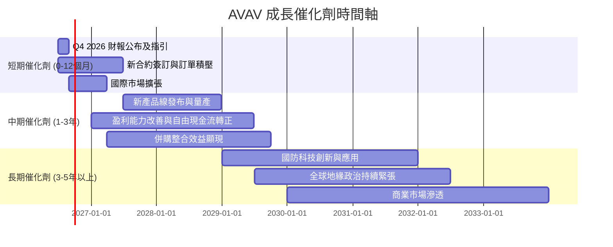

### 8.2 TAM 市場規模分析

AVAV 所處的無人系統和精確打擊市場擁有巨大的總體潛在市場 (TAM)，且其滲透率仍在不斷提高。

```
╔══════════════════════════════════════════════════════════════════╗
║                   AVAV 目標市場 TAM 分析                         ║
╠══════════════════════════════════════════════════════════════════╣
║                                                                  ║
║  小型戰術無人機 (UAS) 市場 TAM:                                  ║
║  ├── 預估規模：$5B - $10B (每年)                                 ║
║  ├── AVAV 貢獻收入 (FY26): $1.98B                               ║
║  └── 滲透率：~20-40%                                             ║
║                                                                  ║
║  遊蕩彈藥 (Loitering Munitions) 市場 TAM:                        ║
║  ├── 預估規模：$3B - $5B (未來5年 CAGR ~20-30%)                 ║
║  ├── AVAV 貢獻收入 (FY26): (已包含於總營收，未單獨披露)          ║
║  └── 滲透率：低至中等，快速增長中                                ║
║                                                                  ║
║  反無人機 (C-UAS) 市場 TAM:                                      ║
║  ├── 預估規模：$2B - $4B (未來5年 CAGR ~15-25%)                 ║
║  └── 滲透率：較低，新興市場                                     ║
║                                                                  ║
║  📊 結論：AVAV 處於多個高成長市場，仍有廣闊的成長空間。           ║
╚══════════════════════════════════════════════════════════════════╝
```

### 8.3 成長驅動力結構圖

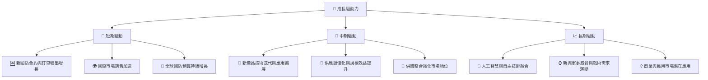

---

## 9. 風險矩陣

AVAV 作為一家高成長的國防科技公司，面臨多種內外部風險。

### 9.1 風險評分矩陣

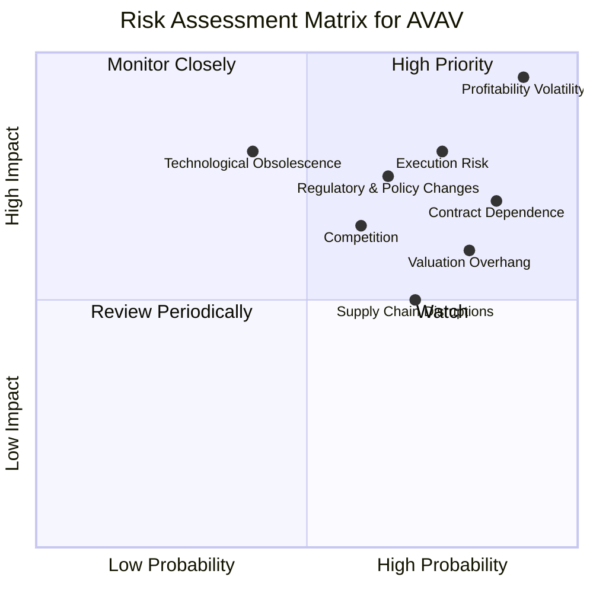

### 9.2 風險清單詳細分析

| # | 風險項目 | 發生機率 | 財務衝擊 | 風險評分 | 緩解措施 |
|---|----------|----------|----------|----------|----------|
| 1 | 🔴 **盈利能力不確定性** | 高 (90%) | 高 (-10%淨利潤) | 🔴 9.5/10 | 嚴格控制成本，優化產品組合，提高定價能力，提升營運效率。 |
| 2 | 🔴 **執行風險** | 高 (75%) | 高 (-5%收入，-10%淨利潤) | 🔴 8.0/10 | 強化項目管理，擴大生產能力，確保按時交付，嚴格質量控制。 |
| 3 | 🔴 **國防合約依賴** | 高 (85%) | 高 (-10%收入) | 🔴 7.0/10 | 多元化客戶群，開拓國際市場，發展商業應用，維持與政府的良好關係。 |
| 4 | 🟡 **估值過高風險** | 高 (80%) | 中 (-15%股價) | 🟡 6.0/10 | 需持續實現高成長和盈利改善以支撐估值，否則可能面臨回調。 |
| 5 | 🟡 **競爭加劇** | 中 (60%) | 中 (-5%毛利率) | 🟡 6.5/10 | 持續研發創新，鞏固技術領先地位，提供差異化產品和服務。 |
| 6 | 🟡 **供應鏈中斷** | 中 (70%) | 中 (-5%收入，+5%成本) | 🟡 5.0/10 | 建立多元化供應商體系，儲備關鍵零組件，與供應商建立長期合作關係。 |
| 7 | 🟡 **監管與政策變化** | 中 (65%) | 中 (-5%收入) | 🟡 7.5/10 | 密切關注國防政策、出口管制和技術法規變化，積極參與行業標準制定。 |
| 8 | 🟢 **技術過時風險** | 低 (40%) | 高 (-10%收入) | 🟢 8.0/10 | 大力投資 R&D，保持技術領先，快速迭代產品，進行戰略性併購以獲取新技術。 |

---

## 10. 投資建議

綜合以上深度分析，AVAV 展現出驚人的營收成長潛力，但在盈利能力和估值方面存在顯著挑戰。

### 10.1 最終綜合評級雷達圖

```
╔══════════════════════════════════════════════════════════════════╗
║                    AVAV 最終綜合評級                             ║
╠══════════════════════════════════════════════════════════════════╣
║ 基本面強度    6.0 ▓▓▓▓▓▓▓▓▓▓▓▓░░░░░░░░                            ║
║ 成長動能      8.0 ▓▓▓▓▓▓▓▓▓▓▓▓▓▓▓▓░░░░                            ║
║ 獲利品質      4.0 ▓▓▓▓▓▓▓▓░░░░░░░░░░░░                            ║
║ 財務健康      7.0 ▓▓▓▓▓▓▓▓▓▓▓▓▓▓░░░░░░                            ║
║ 估值合理性    5.0 ▓▓▓▓▓▓▓▓▓▓░░░░░░░░░░                            ║
║ 護城河深度    7.5 ▓▓▓▓▓▓▓▓▓▓▓▓▓▓▓░░░░░                            ║
║ 管理層執行    6.5 ▓▓▓▓▓▓▓▓▓▓▓▓▓░░░░░░░                            ║
║ 技術創新力    8.5 ▓▓▓▓▓▓▓▓▓▓▓▓▓▓▓▓▓░░░                            ║
╠══════════════════════════════════════════════════════════════════╣
║ 綜合總分      6.0 ▓▓▓▓▓▓▓▓▓▓▓▓░░░░░░░░  評級：🟡 持有           ║
╚══════════════════════════════════════════════════════════════════╝
```

### 10.2 目標價與隱含報酬率

| 情境 | 目標價 ($) | 隱含報酬率 (vs $162.53) | 機率權重 | 預期回報 ($) |
|------|------------|-------------------------|----------|--------------|
| 🟢 **樂觀** | $265 | +63.0% | 30% | $79.5 |
| 🟡 **基準** | $225 | +38.4% | 50% | $112.5 |
| 🔴 **悲觀** | $185 | +13.8% | 20% | $37.0 |
| **加權平均** | **$225.00** | **+38.4%** | **100%** | **$229.0** |

*註：加權平均目標價為 $229.00，較當前股價有 40.9% 的上漲空間。*

### 10.3 買入時機與觸發因素

```
╔══════════════════════════════════════════════════════════════════╗
║                  ✅ 買入觸發因素 Checklist                      ║
╠══════════════════════════════════════════════════════════════════╣
║                                                                  ║
║  立即買入觸發條件（多數符合）：                                  ║
║  ☐ 股價跌至 DCF 悲觀情境以下 ($185以下)                           ║
║  ☐ 季度財報顯示毛利率和營業利益率顯著改善並轉正                  ║
║  ☐ 獲得超預期的大型國防合約，且盈利前景明確                      ║
║  ☐ 自由現金流轉正並呈現穩定增長趨勢                              ║
║                                                                  ║
║  加碼觸發條件（出現以下任一）：                                  ║
║  ✅ 盈利能力出現持續改善的明確信號 (連續兩季毛利率回升至30%以上)   ║
║  ✅ 新產品發布或關鍵技術突破獲得市場認可                          ║
║  ✅ 國際市場擴張取得重大進展                                     ║
║  ✅ 宏觀環境對國防開支形成持續利好                                ║
║                                                                  ║
║  減碼/停損觸發條件（出現以下任一）：                             ║
║  ☐ 營收成長顯著放緩，連續兩季 YoY 成長低於 50%                   ║
║  ☐ 盈利能力持續惡化，虧損幅度擴大                                ║
║  ☐ 自由現金流持續為負且未能改善，資金壓力增大                    ║
║  ☐ 主要國防合約被取消或延遲                                     ║
╚══════════════════════════════════════════════════════════════════╝
```

### 10.4 投資人適配度分析

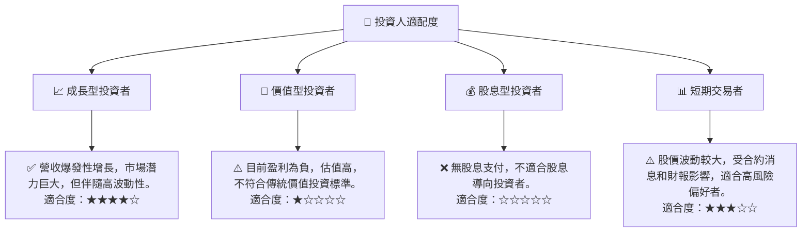

### 10.5 關鍵監控指標

| 監控類型 | 指標 | 關注點 | 頻率 |
|----------|------|----------|------|
| **盈利能力** | 毛利率、營業利益率、淨利率 | 關注 FY2026 虧損後能否恢復盈利，利潤率改善趨勢及驅動因素。 | 季度 |
| **現金流** | 營業現金流、自由現金流 | 關注何時轉正，以及營運資金管理效率。 | 季度 |
| **營收成長** | 季度 YoY 成長率、新訂單積壓 | 保持高成長動能，特別是新合約的簽訂情況。 | 季度 |
| **資產負債表** | 總債務、淨現金/債務、股東權益 | 關注債務水平與償債能力，股東權益變動原因。 | 年度/季度 |
| **估值** | Forward P/E、P/S、EV/EBITDA | 關注公司估值是否能被盈利和成長所支撐。 | 持續 |
| **行業動態** | 國防預算、地緣政治、競爭格局 | 關注宏觀環境對公司業務的影響，以及競爭態勢變化。 | 持續 |

---

> **免責聲明**：本報告為 AI 自動生成，僅供研究參考，不構成投資建議。投資有風險，入市需謹慎。