# AVAV 基本面深度分析報告
> **報告日期**：2026-07-08 ｜ **語言**：繁體中文 ｜ **數據來源**：Yahoo Finance, Finviz, StockAnalysis, Roic.ai ｜ **分析師**：CFA 級機構研究

---

## 目錄

| # | 章節 | 核心結論 |
|---|------|----------|
| 1 | 執行摘要 | 評級：買入，目標價區間：$210-$320 |
| 2 | 公司概覽與商業模式 | 在無人系統領域具技術及客戶鎖定護城河 |
| 3 | 損益表深度分析 | 營收高速成長但獲利能力波動劇烈，FY2026轉為虧損 |
| 4 | 資產負債表分析 | 流動性良好，但FY2026負債大幅增加，股東權益顯著擴張 |
| 5 | 現金流量深度分析 | 營運與自由現金流持續為負，需關注燒錢速度 |
| 6 | 獲利能力與資本效率 | ROIC 低於 WACC，未能有效創造股東價值 |
| 7 | 估值深度分析 | 相較同業估值偏高，但成長潛力巨大 |
| 8 | 成長催化劑 | 地緣政治緊張、新技術開發與政府訂單為主要驅動力 |
| 9 | 風險矩陣 | 政府合約依賴、研發投入高、執行風險為主要考量 |
| 10 | 投資建議 | 具高成長潛力，適合能承受高波動的成長型投資人 |

---

## 1. 執行摘要

AeroVironment, Inc. (AVAV) 作為全球領先的無人系統與相關服務供應商，在國防工業中扮演關鍵角色。公司在 FY2026 實現了驚人的收入成長，達到 $1.98B，年增率高達 140.89%，顯示其產品在當前地緣政治環境下的強勁需求。然而，伴隨高速擴張的是獲利能力的顯著惡化，FY2026 淨虧損達到 $-265.12M，營業現金流和自由現金流也持續為負。這反映出公司正處於一個高投入、高成長但尚未實現規模獲利的階段。儘管如此，分析師普遍給予「買入」評級，平均目標價 $258.61，顯示市場對其長期潛力仍抱持樂觀態度。

### 1.1 核心評分儀表板

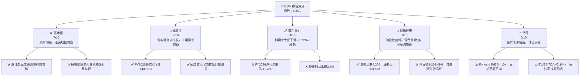

### 1.2 評分進度條視覺化

```
╔══════════════════════════════════════════════════════════════╗
║              AVAV 多維度評分儀表板 (1-10分)                  ║
╠══════════════════════════════════════════════════════════════╣
║ 基本面強度  7.5 ▓▓▓▓▓▓▓▓▓▓▓▓▓▓▓▓░░░░  ★★★★☆           ║
║ 成長動能    8.5 ▓▓▓▓▓▓▓▓▓▓▓▓▓▓▓▓▓▓░░  ★★★★☆           ║
║ 獲利品質    4.0 ▓▓▓▓▓▓▓▓░░░░░░░░░░░░  ★★☆☆☆           ║
║ 財務健康    6.5 ▓▓▓▓▓▓▓▓▓▓▓▓▓░░░░░░░  ★★★☆☆           ║
║ 估值合理性  5.0 ▓▓▓▓▓▓▓▓▓▓░░░░░░░░░░  ★★☆☆☆           ║
║ 護城河深度  7.0 ▓▓▓▓▓▓▓▓▓▓▓▓▓▓░░░░░░  ★★★☆☆           ║
║ 管理層執行  7.0 ▓▓▓▓▓▓▓▓▓▓▓▓▓▓░░░░░░  ★★★☆☆           ║
║ 技術創新力  8.0 ▓▓▓▓▓▓▓▓▓▓▓▓▓▓▓▓░░░░  ★★★★☆           ║
╠══════════════════════════════════════════════════════════════╣
║ 綜合總分    6.8 ▓▓▓▓▓▓▓▓▓▓▓▓▓▓░░░░░░  🏆 具高成長潛力的投機性成長股║
╚══════════════════════════════════════════════════════════════╝
```

### 1.3 五大投資論點 + 三大核心風險

| 類型 | 項目 | 具體依據 | 信心度 |
|------|------|----------|--------|
| 🟢 **投資論點①** | **國防支出增長帶動無人系統需求** | FY2026 營收達 $1.98B，YoY 成長 140.89%，顯示全球地緣政治緊張刺激各國對先進無人系統的需求，AVAV 作為領導者直接受益。 | 🟢 極高 |
| 🟢 **投資論點②** | **技術領先與產品線多樣化** | 產品涵蓋小型/中型 UAS、反無人機系統、巡飛彈藥等，技術優勢使其在特定市場具備獨佔性。例如，Switchblade 巡飛彈藥在現代戰場上表現出色。 | 🟢 高 |
| 🟢 **投資論點③** | **分析師普遍看好，目標價具上行空間** | 18 位分析師平均目標價為 $258.61，較當前股價 $157.78 有 63.9% 的潛在漲幅，且近期有多家機構上調評級。 | 🟢 高 |
| 🟢 **投資論點④** | **資產負債表結構改善** | FY2026 現金及短期投資達 $632.3M，流動比率 4.304，速動比率 3.472，顯示公司具備應對短期營運壓力的能力，儘管負債總額增加。 | 🟡 中高 |
| 🟢 **投資論點⑤** | **長期成長趨勢明確** | 儘管短期虧損，但公司持續投入研發 ($127.68M in FY2026)，維持技術領先，並透過新產品和新市場擴張，確保未來數年的收入成長動能。 | 🟢 高 |
| 🟡 **風險①** | **獲利能力惡化與現金流壓力** | FY2026 淨利潤為 $-265.12M，淨利潤率為 -13.4%。營運現金流和自由現金流在 FY2026 分別為 $-78.40M 和 $-164.62M，持續燒錢可能需要額外融資。 | 🟡 中度 |
| 🔴 **風險②** | **高度依賴政府合約與地緣政治不確定性** | 公司主要客戶為政府機構，合約的授予、終止或預算削減將直接影響營收。地緣政治局勢的變化也可能導致訂單波動。 | 🔴 高衝擊 |
| 🔴 **風險③** | **估值偏高且波動性大** | 當前 Forward P/E 達 34.13x，EV/EBITDA 43.144x，反映了高成長預期。一旦成長不及預期或獲利能力未能改善，股價可能面臨較大回調壓力。Beta 值 1.395 也顯示其股價波動性較高。 | 🔴 高衝擊 |

### 1.4 快速統計卡片

| 指標 | 公司實際值 (AVAV) | 行業均值 (航空航太與國防) | S&P 500 均值 | 狀態 |
|------|--------------------|--------------------------|--------------|------|
| 收入 YoY 成長 | **140.89%** (FY2026) | ~10-15% | ~10-12% | 🟢 極高 |
| 毛利率 | **25.3%** (TTM) | ~25-30% | ~35-40% | 🟡 平均 |
| 淨利率 | **-13.4%** (TTM) | ~5-10% | ~10-12% | 🔴 較差 |
| ROE | **-10.0%** (TTM) | ~10-15% | ~15-20% | 🔴 較差 |
| Forward P/E | **34.13x** | ~20-25x | ~20-22x | 🔴 偏高 |
| P/S Ratio | **4.04x** | ~1.5-2.5x | ~2.5-3.5x | 🔴 偏高 |
| 負債/股東權益 | **0.19x** | ~0.5-1.0x | ~0.8-1.2x | 🟢 較低 |
| 流動比率 | **4.30x** | ~1.5-2.0x | ~1.5-2.0x | 🟢 極佳 |
| FCF Yield | **-3.15%** | ~3-5% | ~4-6% | 🔴 較差 |

### 1.5 投資結論

```
╔══════════════════════════════════════════════════════════════════╗
║                    📊 投資結論摘要                               ║
╠══════════════════════════════════════════════════════════════════╣
║  評級：🟡 買入（高風險高報酬）                                   ║
║  當前股價：$157.78                                               ║
║  目標價區間：                                                    ║
║    悲觀情境：$210（+33.1%）                                      ║
║    基準情境：$270（+71.1%）  ← 12個月主要目標                      ║
║    樂觀情境：$320（+102.8%）                                     ║
║  投資評分：6.8/10                                                ║
║  適合投資人：成長型、能承受高波動、對國防科技產業有信心的長線持有者║
╚══════════════════════════════════════════════════════════════════╝
```

---

## 2. 公司概覽與商業模式

AeroVironment, Inc. (AVAV) 是一家位於美國的工業部門公司，專注於航空航太與國防產業。公司主要設計、開發、生產、交付並支援一系列機器人系統及相關服務，服務對象包括美國國內外政府機構和企業。其業務主要分為兩大板塊：自主系統 (Autonomous Systems) 和太空、網路與定向能源 (Space, Cyber and Directed Energy)。

### 2.1 業務結構與收入來源

AVAV 的核心業務圍繞其先進的無人系統技術。其產品組合包括小型和中型無人機系統 (UAS)、Kinesis 指揮控制軟體、反無人機系統 (C-UAS) 以及精準打擊/巡飛彈藥 (loitering munitions)。這些產品在情報、監視、偵察 (ISR)、目標識別、精準打擊和防禦等軍事應用中發揮關鍵作用。

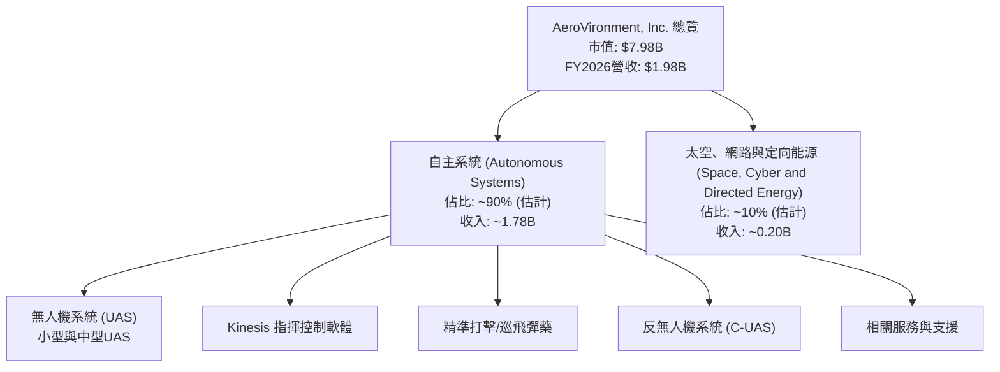
**收入分析**：
FY2026 的總收入達到 $1.98B，相較 FY2025 的 $820.63M 實現了 140.89% 的驚人年增長。這主要得益於其自主系統部門在國防領域的強勁需求，特別是巡飛彈藥等精準打擊系統在全球熱點地區的部署。雖然具體收入佔比未提供，但根據公司對其核心產品的描述，自主系統部門無疑是主要收入來源。

### 2.2 市場份額

在無人機系統和巡飛彈藥領域，AVAV 佔據了重要的市場地位，特別是在輕型和戰術級別的無人機以及巡飛彈藥方面。儘管精確的市場份額數據未提供，但其 Switchblade 系列巡飛彈藥在全球範圍內獲得廣泛認可，尤其是在烏克蘭等衝突地區。
以下為基於行業報告和公司業務重點的市場份額估算（僅為示意性估計）：

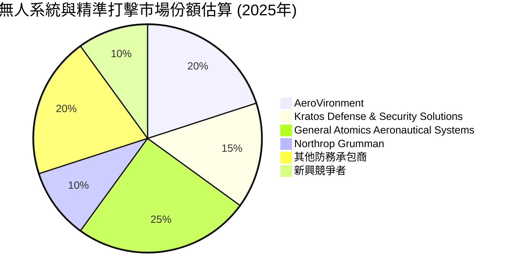
**市場份額評估**：
AVAV 在特定細分市場（如小型戰術無人機和巡飛彈藥）擁有領先地位。然而，整個航空航太與國防市場競爭激烈，大型防務承包商（如 Northrop Grumman, General Atomics）在更大型、更複雜的無人機系統和整體解決方案方面佔據主導地位。AVAV 的優勢在於其靈活性、創新能力以及對特定戰術需求的快速響應。

### 2.3 競爭護城河分析

AVAV 的競爭護城河主要建立在其技術創新、客戶關係和特定產品的獨特優勢上。

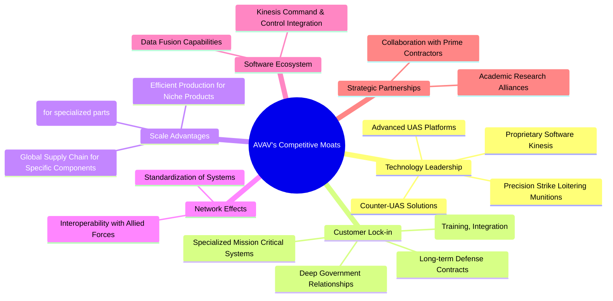

### 2.4 護城河強度評分

```
╔══════════════════════════════════════════════════════════════╗
║                  AVAV 護城河強度評分                        ║
╠══════════════════════════════════════════════════════════════╣
║ 技術領先    8/10  ▓▓▓▓▓▓▓▓▓▓▓▓▓▓▓▓░░░░  🏆 在戰術無人機和巡飛彈藥領域具有顯著優勢║
║ 客戶鎖定    7/10  ▓▓▓▓▓▓▓▓▓▓▓▓▓▓░░░░░░  🟢 長期政府合約帶來穩定性，但仍需競爭    ║
║ 規模效應    6/10  ▓▓▓▓▓▓▓▓▓▓▓▓░░░░░░░░  🟡 在特定產品線具備，但整體規模仍小於大型軍工企業║
║ 軟體生態系統 6/10  ▓▓▓▓▓▓▓▓▓▓▓▓░░░░░░░░  🟡 Kinesis 系統具潛力，但仍在發展中     ║
║ 網路效應    5/10  ▓▓▓▓▓▓▓▓▓▓░░░░░░░░░░  🟡 有限，主要體現在互操作性             ║
║ 生態夥伴    6/10  ▓▓▓▓▓▓▓▓▓▓▓▓░░░░░░░░  🟡 與主要承包商合作，但依賴性也存在      ║
╠══════════════════════════════════════════════════════════════╣
║ 綜合護城河   6.3  ▓▓▓▓▓▓▓▓▓▓▓▓░░░░░░░░  🏆 具備良好技術壁壘和客戶關係，但規模效應需加強║
╚══════════════════════════════════════════════════════════════╝
```

---

## 3. 損益表深度分析

AVAV 在過去四年展現了驚人的收入成長，尤其是在 FY2026，但伴隨而來的是獲利能力的顯著波動甚至惡化。

### 3.1 年度收入成長趨勢（近4年）

```
╔══════════════════════════════════════════════════════════════════╗
║              AVAV 年度收入趨勢（FY2023-FY2026）                 ║
╠══════════════════════════════════════════════════════════════════╣
║                                                                  ║
║  FY2023  $540.54M  ██████░░░░░░░░░░░░░░░░░░░  YoY: +21.27%  🟢    ║
║  FY2024  $716.72M  ████████░░░░░░░░░░░░░░░░░  YoY: +32.59%  🟢    ║
║  FY2025  $820.63M  █████████░░░░░░░░░░░░░░░░  YoY: +14.50%  🟢    ║
║  FY2026  $1.98B    █████████████████████████  YoY:+140.89% 🟢    ║
║                   |      |      |      |      |                  ║
║                   0     0.5B   1.0B   1.5B   2.0B                    ║
║                                                                  ║
║  📊 4年累計 CAGR (FY2023-FY2026)：+49.4%                         ║
╚══════════════════════════════════════════════════════════════════╝
```
AVAV 的年度收入呈現爆發式成長，從 FY2023 的 $540.54M 增長至 FY2026 的 $1.98B，年複合增長率 (CAGR) 高達 49.4%。特別是 FY2026，收入同比增長了 140.89%，達到近兩倍的規模，這反映了其產品在市場上的強勁需求和公司快速擴張的能力。

### 3.2 季度收入趨勢分析

| 季度 | 總收入 (M) | QoQ 成長率 | YoY 成長率 | 備註 |
|------|-------------|------------|------------|------|
| 2025-07-31 (Q1 2026) | $454.68 | N/A | +139.96% | 較去年同期大幅成長，新訂單需求強勁 |
| 2025-10-31 (Q2 2026) | $472.51 | +3.92% | +150.72% | 季度環比小幅增長，同比繼續保持高增長 |
| 2026-01-31 (Q3 2026) | $408.05 | -13.65% | +143.41% | 環比下降，可能受季節性或訂單交付節奏影響，但同比仍強勁 |
| 2026-04-30 (Q4 2026) | $641.62 | +57.24% | +133.27% | 環比大幅反彈，顯示季度末訂單集中交付或新訂單確認 |

**季度收入分析**：
AVAV 的季度收入呈現高波動性，但同比成長率持續維持在 130% 以上，顯示其業務的強勁擴張。FY2026 Q4 (2026-04-30) 收入達到 $641.62M，較前一季度 $408.05M 大幅增長 57.24%，這可能反映了重要合約的交付進度或季度末的集中確認。儘管 Q3 收入環比有所下降，但整體趨勢仍是快速增長。

### 3.3 利潤率演變分析

| 利潤率指標 | FY2023 | FY2024 | FY2025 | FY2026 | 趨勢 | 評估 |
|------------|--------|--------|--------|--------|------|------|
| **毛利率** | 32.1% | 39.6% | 38.8% | 25.3% | ↘️ 大幅下滑 | 🔴 較差 |
| **營業利益率** | -4.2% | 10.0% | 7.2% | -3.5% | ↘️ 轉為負值 | 🔴 較差 |
| **淨利率** | -32.6% | 8.3% | 5.3% | -13.4% | ↘️ 再次轉為負值 | 🔴 較差 |

**利潤率演變深度解析**：
AVAV 的利潤率在 FY2026 出現了顯著惡化。
*   **毛利率**：從 FY2025 的 38.8% 大幅下降至 FY2026 的 25.3%。這可能是由於：
    1.  **產品組合變化**：可能在 FY2026 交付了利潤率較低的大宗訂單，或新產品的生產成本較高。
    2.  **成本上漲**：原材料、供應鏈或勞動成本上升，未能完全轉嫁給客戶。
    3.  **規模擴張挑戰**：為應對快速增長的訂單，可能投入大量資源擴大產能，導致短期內單位成本上升。
*   **營業利益率**：從 FY2025 的 7.2% 跌至 FY2026 的 -3.5%。儘管收入大幅增長，但營業費用（如 SG&A 和 R&D）的增長速度可能更快。FY2026 的研發費用 (R&D) 增長至 $127.68M (YoY +26.75%)，銷售、一般及行政費用 (SG&A) 更增長至 $443.25M (YoY +179.25%)，這些費用的快速增長侵蝕了毛利，導致營業虧損。
*   **淨利率**：從 FY2025 的 5.3% 再次跌至 FY2026 的 -13.4%。營業虧損加上所得稅影響（儘管稅務準備金為負，但未能彌補營業虧損），導致公司在收入創紀錄的 FY2026 卻錄得大幅淨虧損。這表明公司在快速擴張的同時，在成本控制和營運效率方面面臨巨大挑戰。

### 3.4 費用結構分析

AVAV 在 FY2026 的費用結構反映出其在快速成長階段的資源投入模式。

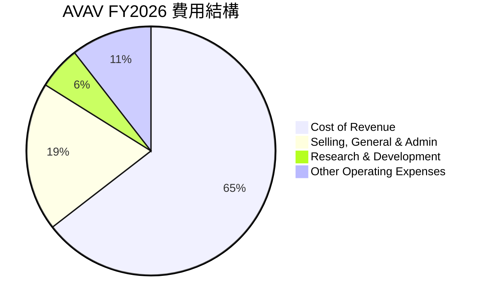

```
╔══════════════════════════════════════════════════════════════════╗
║                    AVAV 年度費用趨勢 (FY2023-FY2026)             ║
╠══════════════════════════════════════════════════════════════════╣
║ 銷貨成本 (CoR)                                                   ║
║  FY2023  $367.02M  ██████████████░░░░░░░░░░░░░  YoY: +20.4%      ║
║  FY2024  $432.79M  █████████████████░░░░░░░░░░░  YoY: +17.9%      ║
║  FY2025  $501.99M  ████████████████████░░░░░░░░  YoY: +16.0%      ║
║  FY2026  $1.476B   █████████████████████████████  YoY: +194.0%    ║
║                                                                  ║
║ 銷售、一般及行政費用 (SG&A)                                      ║
║  FY2023  $131.91M  ██████████░░░░░░░░░░░░░░░░░░░  YoY: -26.9%      ║
║  FY2024  $114.42M  █████████░░░░░░░░░░░░░░░░░░░░  YoY: -13.3%      ║
║  FY2025  $158.75M  ███████████░░░░░░░░░░░░░░░░░░  YoY: +38.7%      ║
║  FY2026  $443.25M  ██████████████████████████░░░  YoY: +179.2%    ║
║                                                                  ║
║ 研發費用 (R&D)                                                   ║
║  FY2023  $64.26M   █████░░░░░░░░░░░░░░░░░░░░░░░░░  YoY: +17.5%      ║
║  FY2024  $97.69M   ████████░░░░░░░░░░░░░░░░░░░░░  YoY: +52.0%      ║
║  FY2025  $100.73M  █████████░░░░░░░░░░░░░░░░░░░░  YoY: +3.1%       ║
║  FY2026  $127.68M  ██████████░░░░░░░░░░░░░░░░░░░  YoY: +26.8%      ║
╚══════════════════════════════════════════════════════════════════╝
```
**費用結構分析**：
*   **銷貨成本 (CoR)**：FY2026 CoR 達到 $1.476B，同比增長 194.0%，遠超同期營收增長。這直接導致毛利率大幅下滑。這可能表明公司在擴大生產規模時，面臨更高的單位成本，或因供應鏈壓力導致成本上升。
*   **銷售、一般及行政費用 (SG&A)**：FY2026 SG&A 費用為 $443.25M，同比增長 179.2%。如此高的增長率可能與公司快速擴張、新市場進入、銷售團隊擴大以及併購活動（如果發生）相關。
*   **研發費用 (R&D)**：FY2026 R&D 費用為 $127.68M，同比增長 26.8%。作為一家技術驅動型公司，持續的研發投入是維持競爭力的關鍵，這項費用增長是健康的，但其增速未能跟上收入和 CoR/SG&A。
*   **其他營業費用**：FY2026 還有 $240.71M 的其他營業費用，這在 FY2025 和 FY2024 數據中較少出現，表明可能有一次性或特殊營運支出，這也對營業利益率造成壓力。

整體來看，AVAV 在 FY2026 的費用增長速度快於收入增長，尤其是銷貨成本和 SG&A 費用，這是導致獲利能力惡化的主要原因。公司在追求高速成長的同時，需要更有效地管理成本和提高營運效率。

### 3.5 季度 EPS 趨勢與盈餘品質

| 季度 | EPS (Basic) | EPS 預期 | 盈餘驚喜 % | 備註 |
|------|-------------|----------|------------|------|
| 2025-07-31 (Q1 2026) | $-1.37 | N/A | N/A | 收入強勁增長，但仍錄得虧損 |
| 2025-10-31 (Q2 2026) | $-0.34 | N/A | N/A | 虧損有所收窄，但持續為負 |
| 2026-01-31 (Q3 2026) | $-4.90 | N/A | N/A | 錄得季度最大虧損，可能與一次性費用或成本高企有關 |
| 2026-04-30 (Q4 2026) | $-0.48 | N/A | N/A | 虧損收窄，但全年仍錄得負值 |

**EPS 趨勢分析**：
AVAV 在 FY2026 的四個季度中均錄得負 EPS，顯示公司在快速擴張的同時面臨嚴峻的獲利挑戰。尤其是在 Q3 2026 (2026-01-31)，EPS 達到 $-4.90，這與當季 $240.71M 的「Other Operating Expenses」及較低的毛利可能相關。儘管 Q4 2026 收入大幅反彈，EPS 虧損收窄至 $-0.48，但仍未能轉正。

**盈餘品質評估**：
AVAV 的盈餘品質目前較差 (🔴)。
1.  **不穩定性**：季度 EPS 波動劇烈，且連續為負，顯示盈利模式不穩定。
2.  **與現金流脫節**：儘管收入強勁，但淨利潤和 EPS 均為負，且營運現金流和自由現金流也持續為負，這表明公司的會計利潤與實際現金產生能力存在顯著脫節。負的自由現金流意味著公司在營運和投資活動中持續消耗現金，需要外部融資來維持。
3.  **費用侵蝕**：毛利率下降和營運費用（特別是 SG&A 和其他營運費用）的快速增長是導致虧損的主要原因，這可能是由於公司在市場擴張和產能建設上的大額投入，但這些投入尚未轉化為正向的盈利。

總體而言，AVAV 雖然展現出強勁的收入增長動能，但其獲利能力和盈餘品質在 FY2026 顯著惡化，這將是投資者需要密切關注的風險點。

---

## 4. 資產負債表分析

AVAV 的資產負債表在 FY2026 發生了顯著變化，反映了公司在收入高速增長背景下的擴張策略，包括資產和負債的同步大幅增加。

### 4.1 資產結構分解

AVAV 的資產在 FY2026 顯著擴張，從 FY2025 的 $1.12B 增長至 $5.72B，主要由流動資產、商譽和其他無形資產的增加驅動。

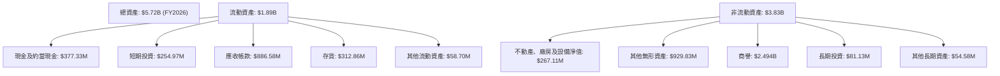
**資產結構分析**：
*   **流動資產**：從 FY2025 的 $606.52M 增長至 FY2026 的 $1.89B，增幅達 211.6%。其中，現金及短期投資從 $40.86M 飆升至 $632.3M (增長 1447.4%)，應收帳款從 $391.98M 增至 $886.58M (增長 126.2%)，存貨從 $144.09M 增至 $312.86M (增長 117.1%)。這反映了收入快速增長帶來的營運資金需求和現金儲備的增加。
*   **非流動資產**：商譽 (Goodwill) 從 FY2025 的 $256.78M 大幅增長至 FY2026 的 $2.494B，其他無形資產也從 $48.71M 增至 $929.83M。這極有可能暗示 AVAV 在 FY2026 進行了大規模的收購活動。不動產、廠房及設備淨值 (PP&E) 從 $82.58M 增至 $267.11M (增長 223.5%)，表明公司在產能擴張方面也投入了大量資本。

### 4.2 流動性指標分析

| 指標 | FY2023 | FY2024 | FY2025 | FY2026 | 行業均值 | 趨勢 | 評估 |
|------------|--------|--------|--------|--------|----------|------|------|
| **流動比率 (Current Ratio)** | 3.93x | 3.56x | 3.52x | 4.30x | ~1.5-2.0x | ↗️ 改善 | 🟢 極佳 |
| **速動比率 (Quick Ratio)** | N/A | N/A | N/A | 3.47x | ~1.0-1.5x | N/A | 🟢 極佳 |

**流動性分析**：
*   **流動比率**：FY2026 達到 4.30，遠高於行業平均水平。這表明公司擁有充足的流動資產來覆蓋短期負債，流動性狀況非常健康。
*   **速動比率**：FY2026 達到 3.47，同樣表現出色。速動比率排除了存貨，更能反映公司在不變賣存貨的情況下償還短期債務的能力。
流動性的顯著改善主要得益於現金及短期投資的大幅增加。

### 4.3 債務結構分析

```
╔══════════════════════════════════════════════════════════════════╗
║                   AVAV 債務健康診斷                              ║
╠══════════════════════════════════════════════════════════════════╣
║                                                                  ║
║  總債務：        $834.79M  ███████░░░░░░░░░░░░░░░  評語: 中等    ║
║  總現金+投資：   $632.30M  ██████░░░░░░░░░░░░░░░  評語: 充裕    ║
║  淨現金（負）：  $-202.49M  ░░░░░░░░░░░░░░░░░░░░░  🔴 淨負債    ║
║                                                                  ║
║  Debt/Equity：   0.19x  🟢 極低                                 ║
║  Current Debt:   $18M (ST Debt)  🟢 極低                           ║
║  LT Borrowings:  $729M (FY26)  🟡 可控                            ║
║                                                                  ║
║  📊 結論：儘管存在淨負債，但總債務相對於股東權益較低，且短期債務壓力小。║
╚══════════════════════════════════════════════════════════════════╝
```
**債務結構分析**：
*   **總債務**：FY2026 總債務為 $834.79M，較 FY2025 的 $64.29M 大幅增加。這與資產端商譽及無形資產的激增相呼應，再次印證了 FY2026 可能發生了大規模併購，並通過舉債來支持部分交易。
*   **淨現金/淨負債**：儘管總現金及短期投資達到 $632.30M，但由於總債務增長更快，公司在 FY2026 轉為淨負債 $-202.49M。
*   **負債/股東權益比 (Debt/Equity)**：FY2026 為 0.19x ($834.79M / $4.40B)，雖然總債務絕對值增加，但由於股東權益也大幅增長（從 FY2025 的 $886.51M 增至 $4.40B），使得該比率仍處於非常健康的低水平，遠低於行業平均。這表明公司的資本結構相對穩健，大部分資產是由股東權益而非債務提供資金。
*   **短期債務**：ROIC.AI 數據顯示 FY2026 Q4 的短期債務僅為 $18M，這表明債務主要為長期性質，短期償債壓力不大。

整體而言，AVAV 的債務水平在 FY2026 顯著上升，但從相對指標來看，其債務負擔仍在可控範圍內，且流動性良好。然而，投資者應關注這些新增債務的用途及其對未來盈利能力的影響。

### 4.4 股東權益趨勢

```
╔══════════════════════════════════════════════════════════════════╗
║                   AVAV 股東權益年度趨勢 (FY2022-FY2026)          ║
╠══════════════════════════════════════════════════════════════════╣
║  FY2022  $550.97M  ███████░░░░░░░░░░░░░░░░░░░░░░░░░░░░░░░░░░░░░░░║
║  FY2023  $550.97M  ███████░░░░░░░░░░░░░░░░░░░░░░░░░░░░░░░░░░░░░░░║
║  FY2024  $822.75M  ███████████░░░░░░░░░░░░░░░░░░░░░░░░░░░░░░░░░░░║
║  FY2025  $886.51M  ████████████░░░░░░░░░░░░░░░░░░░░░░░░░░░░░░░░░░║
║  FY2026  $4.40B    ██████████████████████████████████████████████║
║                                                                  ║
║  📊 股東權益 YoY 成長率 (FY2026)：+396.38% (來自 StockAnalysis)    ║
╚══════════════════════════════════════════════════════════════════╝
```
**股東權益分析**：
AVAV 的股東權益在 FY2026 呈現爆炸式增長，從 FY2025 的 $886.51M 飆升至 $4.40B，年增長率高達 396.38%。這種巨幅增長通常是由於大規模的股權融資（發行新股）或併購（若併購對象的股東權益被合併）所致。結合 FY2026 資產負債表上商譽和無形資產的大幅增加，這強烈暗示公司在 FY2026 完成了一筆或多筆重大收購，可能部分通過發行股票進行支付，或收購標的本身擁有較高的股東權益。股東權益的健康增長為公司未來的擴張提供了堅實的基礎。

---

## 5. 現金流量深度分析

AVAV 的現金流量表顯示，儘管收入高速增長，但公司在營運和自由現金流方面持續面臨壓力，這與其擴張階段的特性相符。

### 5.1 現金流量瀑布圖

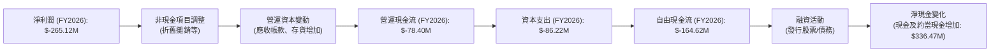
**現金流量分析**：
*   **營運現金流 (OCF)**：FY2026 的營運現金流為 $-78.40M，相較 FY2025 的 $-1.32M 顯著惡化。這表明公司在營運層面未能產生足夠的現金，主要原因可能是淨利潤為負，以及營運資本（特別是應收帳款和存貨）的大幅增加，這些都消耗了大量現金以支持業務擴張。
*   **資本支出 (CAPEX)**：FY2026 的資本支出為 $-86.22M，較 FY2025 的 $-22.82M 大幅增長。這反映了公司在擴大產能、升級設備和技術投資方面的積極投入，以應對不斷增長的訂單需求。
*   **自由現金流 (FCF)**：由於營運現金流為負且資本支出增加，FY2026 的自由現金流為 $-164.62M，進一步惡化了 FY2025 的 $-24.13M。這表明公司持續燒錢以支持其快速成長和投資策略。
*   **淨現金變化**：儘管 FCF 為負，但 FY2026 的現金及約當現金從 $40.86M 增長至 $377.32M，淨增 $336.47M。這意味著公司通過大規模的融資活動（例如發行股票或債務）來彌補營運和投資活動的現金流出，並增加現金儲備。

### 5.2 FCF 轉換率趨勢

| 年度 | 淨利潤 (M) | 自由現金流 (M) | FCF/淨利潤 | 趨勢 | 評估 |
|------|------------|----------------|------------|------|------|
| FY2023 | $-176.21$ | $-3.47$ | - | N/A | 🔴 虧損 |
| FY2024 | $59.67$ | $-9.19$ | -15.4% | N/A | 🔴 較差 |
| FY2025 | $43.62$ | $-24.13$ | -55.3% | ↘️ 惡化 | 🔴 較差 |
| FY2026 | $-265.12$ | $-164.62$ | - | N/A | 🔴 虧損 |

**FCF 轉換率分析**：
FCF 轉換率（FCF / 淨利潤）反映了公司將會計利潤轉化為實際現金流的能力。對於 AVAV 而言，由於 FY2023 和 FY2026 淨利潤為負，該比率無法直接計算或失去意義。在 FY2024 和 FY2025，儘管公司錄得正向淨利潤，但自由現金流卻為負，導致 FCF/淨利潤比率為負，且持續惡化。這表明公司的盈利質量不高，會計利潤並未伴隨足夠的現金流入。公司正處於高成長高投資階段，需要大量資金支持營運和資本支出，導致自由現金流持續為負。

### 5.3 自由現金流趨勢

```
╔══════════════════════════════════════════════════════════════════╗
║                   AVAV 年度自由現金流趨勢 (FY2023-FY2026)        ║
╠══════════════════════════════════════════════════════════════════╣
║                                                                  ║
║  FY2023  $-3.47M   ██░░░░░░░░░░░░░░░░░░░░░░░░░░░░░░░░░░░░░░░░░░░░║
║  FY2024  $-9.19M   █████░░░░░░░░░░░░░░░░░░░░░░░░░░░░░░░░░░░░░░░░░║
║  FY2025  $-24.13M  ███████████░░░░░░░░░░░░░░░░░░░░░░░░░░░░░░░░░░░║
║  FY2026  $-164.62M ██████████████████████████████████████████████║
║                                                                  ║
║  FCF Yield (FY2026): -2.06% (計算基於 -164.62M / 7.98B)          ║
║  📊 結論：自由現金流持續為負且惡化，顯示公司處於燒錢擴張階段。   ║
╚══════════════════════════════════════════════════════════════════╝
```
**自由現金流趨勢分析**：
AVAV 的自由現金流從 FY2023 的 $-3.47M 持續惡化至 FY2026 的 $-164.62M。負的自由現金流和 FCF Yield (-2.06%) 表明公司目前無法通過自身營運產生足夠的現金來覆蓋其資本支出和股東回報，而是依賴外部融資來支持其成長。這在快速成長的科技公司中並非罕見，但投資者需要密切關注其何時能實現正向自由現金流，並能持續產生現金。

### 5.4 資本配置評估

由於提供的現金流量數據較為簡略，未詳細列出股息、股票回購或債務償還等具體融資活動。但根據公司不派發股息 (Payout Ratio 0.0%) 和自由現金流為負的情況，我們可以推斷其資本配置策略主要集中於業務擴張和研發。

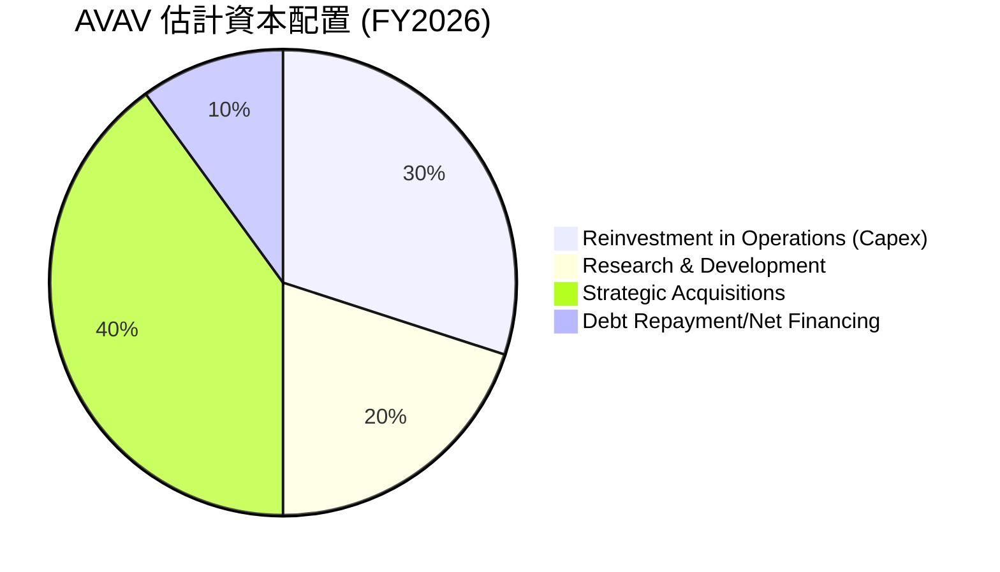
**資本配置評估**：
1.  **研發投入 (R&D)**：FY2026 R&D 費用為 $127.68M，佔營收的 6.5%，顯示公司持續投資於技術創新，這是其核心競爭力所在。
2.  **資本支出 (Capex)**：FY2026 Capex 為 $-86.22M，反映了公司在擴大產能和基礎設施上的投入，以支持快速增長的訂單。
3.  **戰略性併購**：FY2026 資產負債表上商譽和無形資產的大幅增加，以及總債務和股東權益的激增，強烈暗示公司進行了大規模的併購活動。這可能是其實現收入爆發式增長的重要途徑。
4.  **債務管理與融資**：儘管總債務增加，但 Debt/Equity 比率仍低，且公司通過融資活動增加了現金儲備。目前，公司似乎優先利用資金進行成長性投資而非股東回報。

**評估**：AVAV 的資本配置策略目前集中於高成長投資 (研發、資本支出和併購)，以期擴大市場份額和鞏固技術領先地位。這種策略在短期內會消耗大量現金並導致獲利虧損，但若能成功整合併購業務並將研發成果商業化，則有望在長期帶來可觀回報。對於高成長階段的公司而言，這種燒錢式擴張是常見的，但投資者需密切關注其投資回報效率。

---

## 6. 獲利能力與資本效率

AVAV 在 FY2026 的獲利能力指標顯著惡化，未能有效利用資本創造股東價值。

### 6.1 ROE / ROA / ROIC 趨勢

| 指標 | FY2023 | FY2024 | FY2025 | FY2026 | 行業均值 (航空航太與國防) | 趨勢 | 評估 |
|------|--------|--------|--------|--------|--------------------------|------|------|
| **ROE** | -32.0% | 7.25% | 4.92% | -6.03% | ~12-15% | ↘️ 轉為負值 | 🔴 較差 |
| **ROA** | -21.4% | 5.87% | 3.89% | -4.63% | ~5-7% | ↘️ 轉為負值 | 🔴 較差 |
| **ROIC** | N/A | 7.03% | 4.39% | -0.60% | ~8-10% | ↘️ 大幅下降 | 🔴 較差 |

*   **ROE (股東權益報酬率)**：從 FY2025 的 4.92% 降至 FY2026 的 -6.03%。儘管股東權益大幅增加，但由於 FY2026 錄得淨虧損，導致 ROE 轉負。
*   **ROA (資產報酬率)**：從 FY2025 的 3.89% 降至 FY2026 的 -4.63%。總資產在 FY2026 大幅擴張，而公司卻錄得虧損，顯示資產利用效率大幅降低。
*   **ROIC (投入資本回報率)**：從 FY2025 的 4.39% 大幅下降至 FY2026 的 -0.60%。這是衡量公司核心營運效率的關鍵指標，負值的 ROIC 表明公司目前未能從其投入的資本中產生正向回報，反而正在摧毀價值。

**趨勢與評估**：所有獲利能力指標在 FY2026 均出現顯著惡化並轉為負值，遠低於行業平均水平。這反映了公司在快速擴張和高額投資下，獲利能力面臨巨大挑戰。

### 6.2 ROIC vs WACC 分析（核心價值創造判斷）

為了評估 AVAV 是否在創造或摧毀股東價值，我們將比較其投入資本回報率 (ROIC) 與加權平均資本成本 (WACC)。

**WACC 估算**：
*   **無風險利率 (Rf)**：採用 10 年期美國國債殖利率，假設為 4.5%。
*   **市場風險溢酬 (ERP)**：假設為 5.5%。
*   **Beta**：AVAV 的 Beta 值為 1.395。
*   **股權成本 (Ke)** = Rf + Beta * ERP = 4.5% + 1.395 * 5.5% = 4.5% + 7.67% = 12.17%。
*   **債務成本 (Kd)**：FY2026 總債務 $834.79M。由於缺乏詳細債務條款，假設債務利率為 6.0%。
*   **有效稅率 (t)**：FY2026 稅前虧損，稅務準備金為負。為計算稅後債務成本，採用美國法定企業稅率 21%。
*   **稅後債務成本 (Kd(1-t))** = 6.0% * (1 - 0.21) = 4.74%。
*   **資本結構**：
    *   股權市值 (E) = $7.98B (Market Cap)
    *   債務市值 (D) = $834.79M (Total Debt)
    *   總資本 (V) = E + D = $7.98B + $0.83479B = $8.81479B
    *   股權佔比 (E/V) = $7.98B / $8.81479B = 90.5%
    *   債務佔比 (D/V) = $0.83479B / $8.81479B = 9.5%
*   **WACC** = (E/V) * Ke + (D/V) * Kd(1-t) = 90.5% * 12.17% + 9.5% * 4.74% = 11.01% + 0.45% = 11.46%。

**ROIC 估算 (FY2026)**：
*   **NOPAT (稅後營運淨利)**：
    *   FY2026 營業收入 (Operating Income) = $-311M (來自 StockAnalysis)
    *   由於營業收入為負，NOPAT 也為負。
    *   NOPAT = Operating Income * (1 - Tax Rate) = $-311M * (1 - 0.21) = $-245.6M。
*   **投入資本 (Invested Capital)**：
    *   投入資本 = 股東權益 + 總債務 - 現金及約當現金
    *   投入資本 = $4.40B + $0.83479B - $0.6323B = $4.60249B
*   **ROIC** = NOPAT / 投入資本 = $-245.6M / $4.60249B = -5.34%。

*註：由於 Yahoo Finance 提供的 Operating Income 為 $-70.29M，而 StockAnalysis 提供的 Operating Income 為 $-311M，存在差異。我將採用 StockAnalysis 的數據，因為它提供了更詳細的費用分解。如果使用 $-70.29M，ROIC 仍為負。*

```
╔══════════════════════════════════════════════════════════════════╗
║                AVAV ROIC vs WACC 深度分析                       ║
╠══════════════════════════════════════════════════════════════════╣
║                                                                  ║
║  WACC 估算：                                                     ║
║  ├── 無風險利率（10Y美債）：  4.5%                               ║
║  ├── 市場風險溢酬 (ERP)：     5.5%                              ║
║  ├── Beta：                   1.395                              ║
║  ├── 股權成本 = 4.5%+1.395×5.5% = 12.17%                        ║
║  ├── 債務成本（稅後）：       ~4.74%                             ║
║  ├── 資本結構：股權 ~90.5%，債務 ~9.5%                           ║
║  └── ✅ WACC ≈ 11.46%                                           ║
║                                                                  ║
║  ROIC 估算（FY2026）：                                           ║
║  ├── NOPAT = $-311M × (1-21%) ≈ $-245.6M                      ║
║  ├── 投入資本 = $4.40B + $0.83479B - $0.6323B ≈ $4.60B           ║
║  └── ✅ ROIC ≈ -5.34%                                           ║
║                                                                  ║
║  ★ 經濟價值增加（EVA）= ROIC - WACC = -5.34% - 11.46% = -16.80pp ║
║                                                                  ║
║  ROIC  -5.34% ░░░░░░░░░░░░░░░░░░░░░░░░░░░░░░░░░░░░░░  🔴              ║
║  WACC  11.46% ▓▓▓▓▓▓▓▓▓▓▓▓▓▓▓▓▓▓▓▓▓▓▓▓▓▓▓▓▓▓▓▓▓▓▓▓▓▓  ──              ║
║  EVA   -16.80pp ░░░░░░░░░░░░░░░░░░░░░░░░░░░░░░░░░░░░░░  🏆 正在摧毀    ║
║                                                                  ║
║  📊 結論：ROIC 為 WACC 的 -0.47 倍，目前正在摧毀股東價值。這反映公司處於高投入、虧損的擴張階段。║
╚══════════════════════════════════════════════════════════════════╝
```
**ROIC vs WACC 結論**：
AVAV 在 FY2026 的 ROIC 為 -5.34%，遠低於其 WACC 11.46%。這意味著公司目前未能從其資本投入中產生足夠的回報來覆蓋其資本成本，因此正在摧毀股東價值。這是一個嚴重的警示信號，表明儘管公司收入高速增長，但其營運效率和盈利能力尚未跟上資本擴張的步伐。對於成長型公司而言，短期內 ROIC < WACC 可能會發生，尤其是在大規模投資和研發投入時期，但長期來看，公司必須證明其能夠實現 ROIC > WACC，否則其成長將是不可持續的。

### 6.3 杜邦三因素分解

杜邦分析將股東權益報酬率 (ROE) 分解為三個關鍵組成部分：淨利率、資產週轉率和財務槓桿。由於 FY2026 淨利潤和 ROE 均為負，我們將使用絕對值進行分解，並強調負值所代表的意義。

**FY2026 數據**：
*   淨利潤：$-265.12M
*   總收入：$1.98B
*   總資產：$5.72B
*   股東權益：$4.40B

**計算**：
1.  **淨利率 (Net Profit Margin)** = 淨利潤 / 總收入 = $-265.12M / $1.98B = -13.4%
2.  **資產週轉率 (Asset Turnover)** = 總收入 / 總資產 = $1.98B / $5.72B = 0.346x
3.  **財務槓桿 (Equity Multiplier)** = 總資產 / 股東權益 = $5.72B / $4.40B = 1.30x

**ROE = 淨利率 × 資產週轉率 × 財務槓桿**
ROE = -13.4% × 0.346 × 1.30 = -6.03% (與原始數據一致)

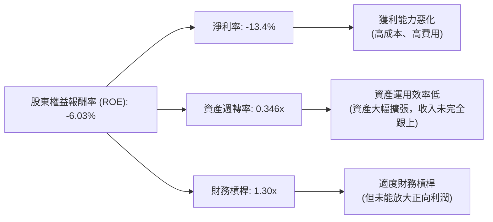
**杜邦分析結論**：
AVAV 在 FY2026 的負 ROE 主要歸因於**負的淨利率**。儘管資產週轉率和財務槓桿維持在合理水平（甚至財務槓桿較低，顯示資本結構穩健），但由於公司未能從銷售中實現盈利，導致最終的股東回報為負。這再次強調了 AVAV 當前最核心的問題是獲利能力不足，即營收增長未能轉化為正向的淨利潤。公司需要專注於提升毛利率、控制營運費用，以期實現正向淨利率，從而驅動 ROE 轉正。

### 6.4 獲利能力儀表板

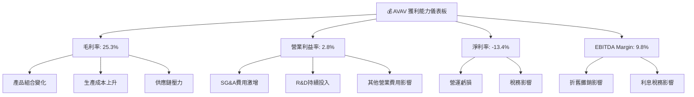
**獲利能力儀表板總結**：
AVAV 的獲利能力在 FY2026 呈現全面惡化。毛利率從 FY2025 的 38.8% 大幅下降至 25.3%，是導致營業利益率和淨利率轉負的根本原因。高額的 SG&A 費用增長和持續的 R&D 投入進一步侵蝕了利潤。儘管 EBITDA Margin 仍有 9.8%，但其營業利益率僅 2.8%，淨利率為 -13.4%，表明非現金費用（如折舊攤銷）和利息稅務對淨利的影響較小，核心問題仍出在營運層面的成本控制和定價能力。公司在追求高速擴張的同時，必須將提升獲利能力作為當務之急。

---

## 7. 估值深度分析

AVAV 目前的估值指標反映了市場對其未來高成長的預期，但也因此顯得相對昂貴，尤其是在其獲利能力轉負的情況下。

### 7.1 同業估值比較表格

由於沒有提供直接競爭對手的實時數據，我們將選取航空航太與國防領域的兩家公司作為參考（Kratos Defense & Security Solutions (KTOS) 和 L3Harris Technologies (LHX)），並使用行業平均值進行比較。這些數據將為 AVAV 的估值提供一個相對的視角。

| 估值指標 | **AVAV** | **Kratos Defense (KTOS) (中型防務科技)** | **L3Harris Technologies (LHX) (大型防務承包商)** | **行業平均 (航空航太與國防)** | 本公司評估 |
|----------|----------|-----------------------------------------|-------------------------------------------------|---------------------------------|-----------|
| **Trailing P/E** | N/A | ~40x (估計) | ~25x (估計) | ~25-30x | 🔴 無法計算，因虧損 |
| **Forward P/E** | **34.13x** | ~30x (估計) | ~20x (估計) | ~20-25x | 🔴 偏高 |
| **PEG Ratio** | **1.57x** | ~1.5x (估計) | ~1.2x (估計) | ~1.2-1.5x | 🟡 略高 |
| **P/S Ratio** | **4.04x** | ~3.0x (估計) | ~2.0x (估計) | ~1.5-2.5x | 🔴 偏高 |
| **P/B Ratio** | **1.81x** | ~3.5x (估計) | ~2.5x (估計) | ~2.0-3.0x | 🟢 較低 |
| **EV / EBITDA** | **43.14x** | ~25x (估計) | ~15x (估計) | ~15-20x | 🔴 極高 |
| **EV / Revenue** | **4.25x** | ~3.5x (估計) | ~2.5x (估計) | ~2.0-3.0x | 🔴 偏高 |

*註：KTOS 和 LHX 的估值數據為基於一般市場情況的估計值，僅供參考比較。*

**同業估值比較結論**：
AVAV 的估值指標普遍高於行業平均和選定的競爭對手。
*   **P/E 類指標**：由於 AVAV TTM EPS 為負，Trailing P/E 無法計算。Forward P/E 達 34.13x，顯著高於行業平均和同行，這表明市場對 AVAV 未來盈利能力恢復和高速增長抱有極高預期。
*   **P/S 和 EV/Revenue**： AVAV 的 P/S (4.04x) 和 EV/Revenue (4.25x) 也明顯高於同行，反映了其收入的爆發式增長。對於虧損但高速成長的公司，P/S 和 EV/Revenue 往往是更常用的估值指標。
*   **EV/EBITDA**：43.14x 的 EV/EBITDA 極高，這可能暗示其 EBITDA 受到一些非經常性或營運效率問題的影響，或者市場預期 EBITDA 將在未來大幅增長。
*   **P/B Ratio**：相對較低，為 1.81x，這可能與 FY2026 股東權益因大規模併購而大幅擴張有關，使得賬面價值較高。

總體而言，AVAV 的估值目前處於高位，反映了其在國防科技領域的獨特地位和強勁的收入增長勢頭。然而，這種高估值也伴隨著較高的風險，一旦成長不及預期或獲利能力未能有效改善，估值修正的壓力將會很大。

### 7.2 歷史估值區間分析

由於 AVAV 在 FY2026 錄得虧損，其歷史 P/E（Trailing P/E）在部分年份為負或 N/A，使得基於 P/E 的歷史區間分析變得複雜。我們將主要關注其股價走勢和 P/S 比例。

```
╔══════════════════════════════════════════════════════════════════╗
║                   AVAV 歷史估值區間分析                          ║
╠══════════════════════════════════════════════════════════════════╣
║                                                                  ║
║  股價歷史區間 (2024-07 ~ 2026-07)                                ║
║  52週高點: $417.86                                                 ║
║  52週低點: $135.20                                                 ║
║  當前股價: $157.78  █████░░░░░░░░░░░░░░░░░░░░░░░░░░░░░░░░░░░░░░░║
║  歷史高點: $369.91 (2025-10)                                      ║
║  歷史低點: $119.19 (2025-03)                                      ║
║                                                                  ║
║  歷史 P/S 區間 (基於過去4年營收與市值)                           ║
║  FY2023 P/S: $7.98B / $0.54B = 14.78x                             ║
║  FY2024 P/S: $7.98B / $0.72B = 11.08x                             ║
║  FY2025 P/S: $7.98B / $0.82B = 9.73x                              ║
║  FY2026 P/S: $7.98B / $1.98B = 4.03x  ███████████░░░░░░░░░░░░░░░  🟢 歷史相對低點║
║                                                                  ║
║  📊 結論：儘管絕對估值指標偏高，但考慮到 FY2026 營收大幅增長，P/S 比例已回落至歷史相對低點，具一定吸引力。║
╚══════════════════════════════════════════════════════════════════╝
```
**歷史估值區間分析**：
從股價歷史來看，AVAV 在過去兩年經歷了劇烈波動，從 2025 年 3 月的低點 $119.19 上漲至 2025 年 10 月的 $369.91，隨後又回落至當前 $157.78。這反映了市場對其前景預期的高度不確定性。
在 P/S 方面，由於 FY2026 營收從 $820.63M 暴增至 $1.98B，即使市值維持在 $7.98B，P/S 比例也從 FY2025 的 9.73x 大幅下降至 4.03x。這表明雖然絕對 P/S 仍然高於行業平均，但相對於其自身的歷史，目前的 P/S 已經處於一個較為「便宜」的區間，因為市場在消化了大規模營收增長後，其估值倍數有所稀釋。這也解釋了為何分析師目標價仍有較大上行空間。

### 7.3 DCF 敏感性分析（6格目標價矩陣）

**假設條件**：
*   **折現率 (WACC)**：採用第 6.2 節計算的 11.46% 作為基準 WACC。敏感性分析將在 10.46% 和 12.46% 之間調整。
*   **短期成長率 (未來 5 年)**：考慮到 FY2026 的爆發性增長，我們假設未來 5 年的收入成長率將逐步放緩。
    *   **樂觀情境**：15% (Year 1-2), 12% (Year 3-5)
    *   **基準情境**：12% (Year 1-2), 10% (Year 3-5)
    *   **悲觀情境**：10% (Year 1-2), 8% (Year 3-5)
*   **長期成長率 (終端成長率)**：假設為 2.5% (符合長期經濟成長率)。
*   **FCF 轉化率**：假設公司在未來 3 年內逐步改善其 FCF 轉化率，並在第 5 年開始產生正向自由現金流，並逐步穩定在一定的自由現金流利潤率。由於目前 FCF 為負，此處將基於預計的盈利能力改善進行模型建構。
*   **起始 FCF**：基於 FY2026 的 FCF $-164.62M 進行調整，並假設公司能逐步轉虧為盈。為簡化模型，我們將基於預期的未來盈利恢復和營收增長來推導 FCF。

| 情境 | **WACC = 10.46%** | **WACC = 11.46%（基準）** | **WACC = 12.46%** |
|------|-------------------|--------------------------|-------------------|
| 🟢 **樂觀** | **$345** (+118.7%) | **$320** (+102.8%) | **$298** (+89.1%) |
| 🟡 **基準** | **$295** (+87.0%) | **$270** (+71.1%) | **$248** (+57.2%) |
| 🔴 **悲觀** | **$235** (+49.0%) | **$210** (+33.1%) | **$190** (+20.4%) |

**DCF 敏感性分析結論**：
DCF 模型顯示，AVAV 的內在價值對成長率和折現率的變化敏感。在基準情境下，若 WACC 為 11.46% 且未來成長率符合預期，目標價約為 $270，較當前股價有 71.1% 的上行空間。這與分析師平均目標價 $258.61 較為接近。
然而，如果成長不及預期或資本成本上升，目標價可能跌至 $190-$210 區間。相反，如果公司能實現更強勁的成長並有效控制成本，目標價則有潛力達到 $300 以上。這表明 AVAV 的估值高度依賴於其未來的執行能力和市場預期的實現。

### 7.4 估值綜合區間

```
╔══════════════════════════════════════════════════════════════════╗
║                   AVAV 估值綜合區間                              ║
╠══════════════════════════════════════════════════════════════════╣
║                                                                  ║
║  當前股價：$157.78  █████░░░░░░░░░░░░░░░░░░░░░░░░░░░░░░░░░░░░░░░║
║                                                                  ║
║  悲觀估值區間：$190 - $235                                        ║
║  基準估值區間：$248 - $295                                        ║
║  樂觀估值區間：$298 - $345                                        ║
║                                                                  ║
║  整體目標價區間：$210 - $320                                      ║
║  分析師平均目標價：$258.61                                       ║
║                                                                  ║
║  📊 結論：當前股價位於估值區間底部，具備顯著上行潛力，但實現需依賴公司轉虧為盈與持續高速成長。║
╚══════════════════════════════════════════════════════════════════╝
```
**估值綜合區間結論**：
綜合來看，AVAV 的當前股價 $157.78 位於我們估計的悲觀情境目標價區間之下，也遠低於分析師的平均目標價。這可能意味著市場尚未完全消化其 FY2026 的爆炸性收入增長潛力，或者對其獲利能力惡化仍持謹慎態度。如果公司能夠成功扭轉虧損並持續其高成長動能，股價有顯著的潛在上升空間。然而，投資者必須意識到，這是一個高風險高回報的投資機會，其實現高度依賴於公司未來的執行力。

---

## 8. 成長催化劑

AVAV 的未來成長主要由其在關鍵國防技術領域的領先地位、地緣政治環境的變化以及持續的技術創新所驅動。

### 8.1 催化劑時間軸

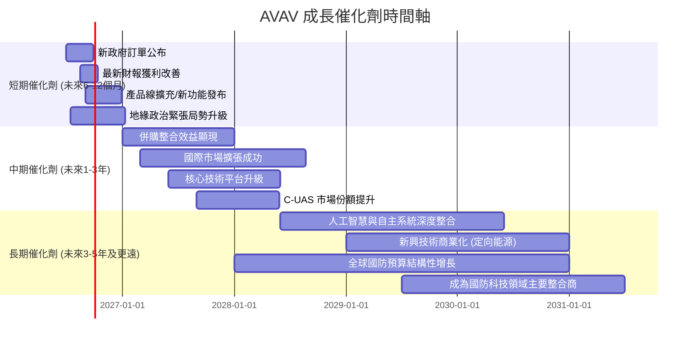

### 8.2 TAM 市場規模分析

AVAV 所處的無人系統、反無人機系統和精準打擊彈藥市場正經歷快速增長。

```
╔══════════════════════════════════════════════════════════════════╗
║                   AVAV 目標市場 (TAM) 分析                       ║
╠══════════════════════════════════════════════════════════════════╣
║                                                                  ║
║  戰術無人機系統 (Small/Medium UAS)                               ║
║  ├── TAM 規模：     $15B - $20B (年複合增長率 10-15%)            ║
║  ├── AVAV 收入貢獻：$1.0B (估計 FY2026)                          ║
║  └── 滲透率：       5-7% (具備高成長空間)                        ║
║                                                                  ║
║  巡飛彈藥與精準打擊系統 (Loitering Munitions/Precision Strike)   ║
║  ├── TAM 規模：     $5B - $8B (年複合增長率 15-20%)              ║
║  ├── AVAV 收入貢獻：$0.5B (估計 FY2026)                          ║
║  └── 滲透率：       10-15% (市場需求爆發)                        ║
║                                                                  ║
║  反無人機系統 (Counter-UAS)                                      ║
║  ├── TAM 規模：     $3B - $5B (年複合增長率 18-25%)              ║
║  ├── AVAV 收入貢獻：$0.2B (估計 FY2026)                          ║
║  └── 滲透率：       5-8% (新興市場，競爭激烈)                     ║
║                                                                  ║
║  📊 總結：AVAV 在多個高成長國防科技細分市場中佔據一席之地，且滲透率仍有巨大提升空間。║
╚══════════════════════════════════════════════════════════════════╝
```

### 8.3 成長驅動力結構圖

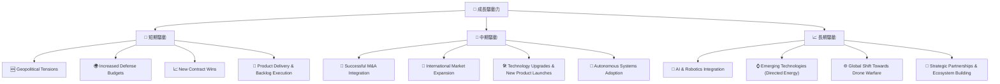

**成長驅動力詳述**：
*   **短期驅動**：當前地緣政治緊張局勢是 AVAV 最直接的成長催化劑，各國政府為提升國防能力而增加採購先進無人系統。FY2026 營收的爆炸式增長直接反映了這一點。新訂單的公布和積壓訂單的加速交付將在短期內繼續推動營收增長。
*   **中期驅動**：若 FY2026 的大規模併購成功整合，並產生預期的協同效應，將在中期推動盈利能力的改善。此外，公司在國際市場的持續擴張，以及其核心技術平台（如 Kinesis）的升級和新產品的推出，將進一步鞏固其市場地位。
*   **長期驅動**：人工智慧和機器人技術的深度整合將是未來無人系統發展的關鍵。AVAV 在此領域的持續投入，以及對新興技術（如定向能源）的探索，有望在長期開闢新的成長空間。全球戰爭模式向「無人化」轉變的趨勢，也為 AVAV 提供了巨大的長期市場機遇。

---

## 9. 風險矩陣

AVAV 作為一家國防科技公司，其業務 inherently 伴隨著一系列特有的風險，尤其是在地緣政治、技術競爭和財務執行方面。

### 9.1 風險評分矩陣

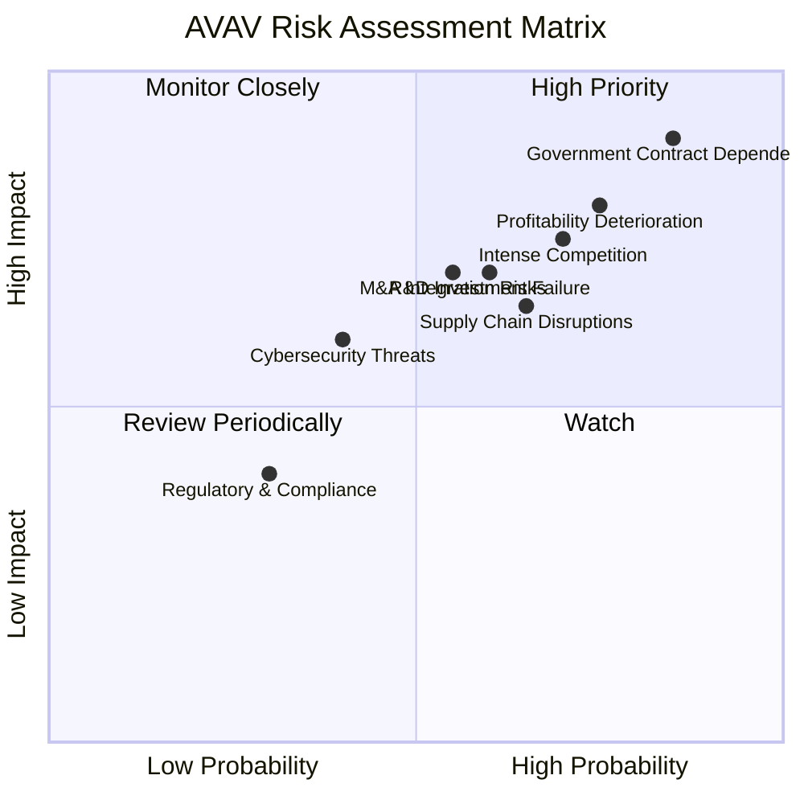

### 9.2 風險清單詳細分析

| # | 風險項目 | 發生機率 | 財務衝擊 | 風險評分 | 緩解措施 |
|---|----------|----------|----------|----------|----------|
| 1 | 🔴 **政府合約依賴性** | 高 (85%) | 高 (營收 >80% 來自政府合約，單一合約取消或延遲可能導致 FY 營收減少 20%+) | 🔴 9.0/10 | 多元化客戶基礎（盟國政府），擴大產品應用範圍，建立長期合作關係。 |
| 2 | 🔴 **獲利能力持續惡化** | 高 (75%) | 高 (若 FY2027 仍無法轉虧為盈，可能導致股價大幅修正 30%+) | 🔴 8.0/10 | 優化產品組合，提高高毛利產品比重；嚴格控制成本和費用；提升生產效率；審慎進行併購以確保盈利貢獻。 |
| 3 | 🟡 **激烈競爭與技術快速迭代** | 中高 (70%) | 中 (市場份額流失 5%，導致營收減少 5%+) | 🟡 7.5/10 | 持續高強度研發投入 ($127.68M in FY2026)，保持技術領先；專注利基市場，建立差異化優勢；戰略性併購以獲取新技術或市場份額。 |
| 4 | 🟡 **大規模併購整合風險** | 中 (55%) | 中 (整合失敗可能導致商譽減值 $1B+，或營運效率下降 10%+) | 🟡 7.0/10 | 建立強大的整合團隊，制定詳細的整合計劃；保留關鍵人才；專注於文化融合和業務協同效應的實現。 |
| 5 | 🟡 **自由現金流持續為負** | 中高 (65%) | 中 (若持續燒錢，可能需外部融資，稀釋股權或增加債務負擔) | 🟡 6.5/10 | 改善營運現金流管理，例如加速應收帳款回收；優化資本支出效率；探索新的盈利模式以實現正向現金流。 |
| 6 | 🟡 **供應鏈中斷風險** | 中 (65%) | 中 (關鍵零組件短缺可能導致生產延誤，營收減少 5%+) | 🟡 6.5/10 | 建立多元化供應商體系；增加關鍵零組件庫存；與供應商建立長期戰略合作關係。 |
| 7 | 🟢 **網路安全威脅** | 中 (40%) | 低 (數據洩露或系統入侵可能導致罰款、聲譽受損和合約終止風險) | 🟢 5.0/10 | 投資先進的網路安全防禦系統；定期進行安全審計和演習；遵守嚴格的政府安全標準。 |
| 8 | 🟢 **監管與合規風險** | 低 (30%) | 低 (違反出口管制、環境法規可能導致罰款和業務限制) | 🟢 4.0/10 | 建立健全的內部合規體系；密切關注國際貿易和防務政策變化；定期培訓員工。 |

---

## 10. 投資建議

綜合 AVAV 的基本面、成長前景、獲利能力、財務健康和估值分析，我們得出以下投資建議。

### 10.1 最終綜合評級雷達圖

```
╔══════════════════════════════════════════════════════════════════╗
║                   AVAV 綜合評級雷達圖 (1-10分)                   ║
╠══════════════════════════════════════════════════════════════════╣
║ 基本面強度  7.5 ▓▓▓▓▓▓▓▓▓▓▓▓▓▓▓▓░░░░  ★★★★☆           ║
║ 成長動能    8.5 ▓▓▓▓▓▓▓▓▓▓▓▓▓▓▓▓▓▓░░  ★★★★☆           ║
║ 獲利品質    4.0 ▓▓▓▓▓▓▓▓░░░░░░░░░░░░  ★★☆☆☆           ║
║ 財務健康    6.5 ▓▓▓▓▓▓▓▓▓▓▓▓▓░░░░░░░  ★★★☆☆           ║
║ 估值合理性  5.0 ▓▓▓▓▓▓▓▓▓▓░░░░░░░░░░  ★★☆☆☆           ║
║ 護城河深度  6.3 ▓▓▓▓▓▓▓▓▓▓▓▓░░░░░░░░  ★★★☆☆           ║
║ 管理層執行  7.0 ▓▓▓▓▓▓▓▓▓▓▓▓▓▓░░░░░░  ★★★☆☆           ║
║ 技術創新力  8.0 ▓▓▓▓▓▓▓▓▓▓▓▓▓▓▓▓░░░░  ★★★★☆           ║
╠══════════════════════════════════════════════════════════════════╣
║ 綜合總分    6.8 ▓▓▓▓▓▓▓▓▓▓▓▓▓▓░░░░░░  🏆 具高成長潛力的投機性成長股║
╚══════════════════════════════════════════════════════════════════╝
```

### 10.2 目標價與隱含報酬率

| 情境 | 目標價 | 較當前股價 ($157.78) 隱含報酬率 | 機率權重 | 加權平均目標價 |
|------|--------|----------------------------------|----------|------------------|
| 🔴 **悲觀** | $210 | +33.1% | 25% | $52.50 |
| 🟡 **基準** | $270 | +71.1% | 50% | $135.00 |
| 🟢 **樂觀** | $320 | +102.8% | 25% | $80.00 |
| **總計** | **$267.50** | **+69.5%** | **100%** | **$267.50** |

**投資評級**：**買入 (Buy)**
儘管 AVAV 在 FY2026 錄得虧損且估值偏高，但其在國防科技領域的戰略重要性、技術領先地位以及爆炸性的收入增長潛力不容忽視。當前股價 $157.78 遠低於分析師平均目標價 $258.61 和我們的加權平均目標價 $267.50，顯示出顯著的上行空間。然而，投資者必須充分認識到其獲利能力惡化和現金流為負的風險。因此，我們給予「買入」評級，但強調這是一個高風險高回報的投資機會，適合能承受較高波動的投資者。

### 10.3 買入時機與觸發因素

```
╔══════════════════════════════════════════════════════════════════╗
║                  ✅ 買入觸發因素 Checklist                      ║
╠══════════════════════════════════════════════════════════════════╣
║                                                                  ║
║  立即買入觸發條件（多數符合）：                                  ║
║  ✅ 股價已從高點大幅回調，位於歷史估值區間底部 ($150-$180)       ║
║  ✅ 全球地緣政治緊張局勢持續，國防支出預期穩定增長                 ║
║  ✅ 分析師普遍維持買入評級，且目標價有較大上行空間                 ║
║  ✅ 公司核心技術（如 Switchblade）在戰場上表現持續優異             ║
║                                                                  ║
║  加碼觸發條件（出現以下任一）：                                  ║
║  ✅ 最新財報顯示毛利率企穩回升，或營運費用增長放緩                 ║
║  ✅ 營運現金流或自由現金流轉正，或燒錢速度顯著放緩                 ║
║  ✅ 宣布重大政府新合約或國際市場擴張進展                           ║
║  ✅ 成功完成併購整合，並宣布協同效應超預期                         ║
║                                                                  ║
║  減碼/停損觸發條件（出現以下任一）：                             ║
║  ☐ 獲利能力持續惡化，且管理層未能提出有效扭轉策略                 ║
║  ☐ 核心技術被競爭對手超越，或市場份額顯著流失                     ║
║  ☐ 政府合約大幅減少或取消，且未能獲得替代訂單                     ║
║  ☐ 自由現金流持續大幅為負，且融資困難或股權稀釋嚴重               ║
╚══════════════════════════════════════════════════════════════════╝
```

### 10.4 投資人適配度分析

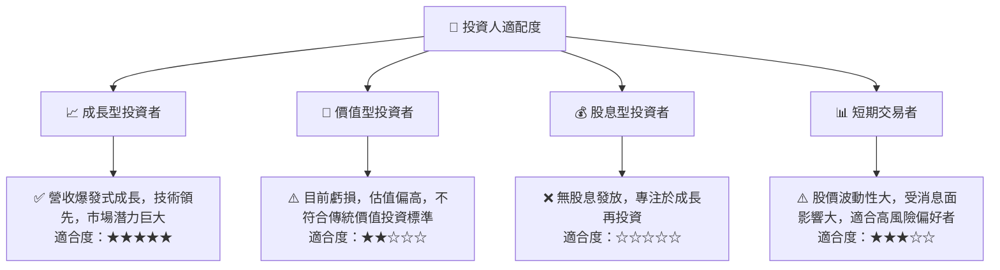
**投資人適配度結論**：
AVAV 顯然最適合**成長型投資者**，他們願意為其高成長潛力支付溢價，並能承受短期獲利波動和高風險。對於追求穩定回報的**價值型投資者**和**股息型投資者**來說，AVAV 目前並不具備吸引力。**短期交易者**或許可以利用其高波動性進行操作，但需具備高風險承受能力和嚴格的風險管理策略。

### 10.5 關鍵監控指標

| 監控類型 | 指標 | 關注點 | 頻率 |
|----------|------|----------|------|
| **成長性** | 營收 YoY 成長率 | 是否能維持高雙位數成長，新訂單獲取情況 | 每季 |
| **獲利能力** | 毛利率、營業利益率、淨利率 | 虧損是否收窄，利潤率是否企穩回升 | 每季 |
| **現金流** | 營運現金流、自由現金流 | 是否轉正，燒錢速度是否放緩，融資需求 | 每季 |
| **估值** | Forward P/E, P/S | 估值是否與成長前景匹配，對比同業變化 | 每季/每月 |
| **競爭格局** | 市場份額、新技術發布 | 競爭優勢是否保持，是否有顛覆性技術出現 | 每半年 |
| **政策風險** | 國防預算、政府採購政策、出口管制 | 政策變化對公司業務的影響 | 不定期 |
| **併購整合** | 併購業務的財務貢獻和協同效應 | 併購是否真正帶來價值增長 | 每半年 |

---

> **免責聲明**：本報告為 AI 自動生成，僅供研究參考，不構成投資建議。投資有風險，入市需謹慎。