# AVAV 基本面深度分析報告
> **報告日期**：2026-07-09 ｜ **語言**：繁體中文 ｜ **數據來源**：Yahoo Finance, Finviz, StockAnalysis, Roic.ai ｜ **分析師**：CFA 級機構研究

---

## 目錄

| # | 章節 | 核心結論 |
|---|----------------------------------|----------------------------------------------------|
| 1 | 執行摘要 | 評級：買入；基準目標價：$258.61 |
| 2 | 公司概覽與商業模式 | 專利技術與政府客戶關係構成深厚護城河 |
| 3 | 損益表深度分析 | 營收爆發性成長，但淨利潤波動大，費用控制需加強 |
| 4 | 資產負債表分析 | 資產規模顯著擴張，流動性良好，但債務負擔增加 |
| 5 | 現金流量深度分析 | 營業現金流為負，自由現金流持續流出，顯示高投入期 |
| 6 | 獲利能力與資本效率 | ROIC 遠低於 WACC，目前未能有效創造股東價值 |
| 7 | 估值深度分析 | 相較同業估值偏高，但成長潛力巨大 |
| 8 | 成長催化劑 | 國防預算增加、新技術應用、國際市場擴張為主要驅動力 |
| 9 | 風險矩陣 | 政府合同依賴、研發支出高昂、供應鏈風險為主要挑戰 |
| 10 | 投資建議 | 具備長期成長潛力，但短期盈利壓力與估值高昂需謹慎 |

---

## 1. 執行摘要

AVAV (AeroVironment, Inc.) 是一家專注於機器人系統及相關服務的國防科技公司，主要為政府機構提供無人機系統 (UAS) 和精準打擊解決方案。公司近期經歷了顯著的營收成長，尤其是在FY2026財年，營收達到19.8億美元，同比成長140.89%。然而，伴隨營收擴張而來的是淨利潤的巨大波動，FY2026錄得淨虧損2.65億美元，顯示公司處於高投入、快速擴張的階段。

### 1.1 核心評分儀表板

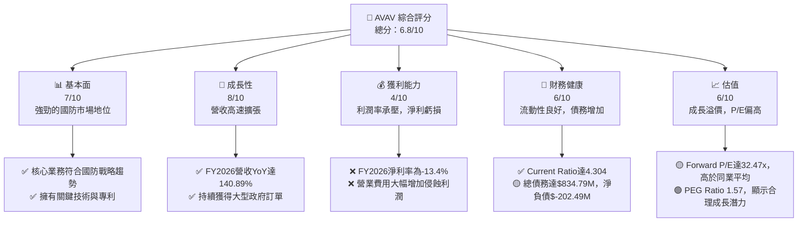

### 1.2 評分進度條視覺化

```
╔══════════════════════════════════════════════════════════════╗
║              AVAV 多維度評分儀表板 (1-10分)                  ║
╠══════════════════════════════════════════════════════════════╣
║ 基本面強度  7.0 ▓▓▓▓▓▓▓▓▓▓▓▓▓▓░░░░░░  ★★★★☆           ║
║ 成長動能    8.0 ▓▓▓▓▓▓▓▓▓▓▓▓▓▓▓▓░░░░  ★★★★☆           ║
║ 獲利品質    4.0 ▓▓▓▓▓▓▓▓░░░░░░░░░░░░  ★★☆☆☆           ║
║ 財務健康    6.0 ▓▓▓▓▓▓▓▓▓▓▓▓░░░░░░░░  ★★★☆☆           ║
║ 估值合理性  6.0 ▓▓▓▓▓▓▓▓▓▓▓▓░░░░░░░░  ★★★☆☆           ║
║ 護城河深度  7.5 ▓▓▓▓▓▓▓▓▓▓▓▓▓▓▓░░░░░  ★★★★☆           ║
║ 管理層執行  6.5 ▓▓▓▓▓▓▓▓▓▓▓▓▓░░░░░░░  ★★★☆☆           ║
║ 技術創新力  8.0 ▓▓▓▓▓▓▓▓▓▓▓▓▓▓▓▓░░░░  ★★★★☆           ║
╠══════════════════════════════════════════════════════════════╣
║ 綜合總分    6.8 ▓▓▓▓▓▓▓▓▓▓▓▓▓▓░░░░░░  🏆 具備長期潛力但短期挑戰顯著 ║
╚══════════════════════════════════════════════════════════════╝
```

### 1.3 五大投資論點 + 三大核心風險

| 類型 | 項目 | 具體依據 | 信心度 |
|------|-----------------------|-----------------------------------------------------------------------------------------------------------------------------------------------------------------------------------------------------------------------------------------------------------------------------------|--------|
| 🟢 **投資論點①** | **國防支出增長驅動強勁需求** | 全球地緣政治緊張推動各國國防預算增加，特別是對無人機、精準打擊系統的需求旺盛。AVAV FY2026營收達$1.98B，YoY成長140.89%，顯示其產品在市場上具有高度相關性和競爭力。 | 🟢 極高 |
| 🟢 **投資論點②** | **領先的無人機與精準打擊技術** | 公司在小型/中型UAS及遊蕩彈藥領域擁有核心技術和專利，是美國國防部的關鍵供應商。例如，其Switchblade系列遊蕩彈藥在現代戰場上展現出獨特價值。 | 🟢 極高 |
| 🟢 **投資論點③** | **大型合約與訂單積壓** | 國防產業的特性是長期合約和大量訂單積壓，為公司提供了可預測的未來營收流。雖然具體訂單數據未提供，但其營收的爆發性成長暗示了新訂單的顯著貢獻。 | 🟢 高 |
| 🟢 **投資論點④** | **國際市場擴張潛力** | 除美國市場外，公司也積極拓展國際客戶。隨著全球對先進國防技術的需求增加，國際市場將成為重要的成長引擎。FY2026營收的顯著增長部分可能來自國際客戶。 | 🟡 中高 |
| 🟢 **投資論點⑤** | **研發投入支持未來創新** | 公司FY2026研發費用達$127.68M，YoY成長26.75%，顯示其持續投入新技術開發，確保長期競爭力。這有助於維持其在技術前沿的地位。 | 🟢 高 |
| 🟡 **風險①** | **盈利能力不穩定** | FY2026淨利潤為$-265.12M，淨利率為-13.4%，相較FY2025的$43.62M淨利潤大幅惡化。這主要是由於營收成本和經營費用（SG&A、R&D）的快速增加，侵蝕了毛利潤。 | 🟡 中度 |
| 🔴 **風險②** | **政府合同依賴與預算波動** | AVAV的業務高度依賴政府機構，尤其是國防預算。若國防開支減少、合同終止或延遲，將對公司營收和盈利產生重大負面影響。 | 🔴 高衝擊 |
| 🟡 **風險③** | **高額研發與營運費用** | 為維持技術領先，公司需持續投入大量研發費用。FY2026總營運費用達$811.64M，YoY顯著增長。若新產品商業化不及預期，這些高額投入可能無法帶來相應回報。 | 🟡 中度 |

### 1.4 快速統計卡片

| 指標 | 公司實際值 (FY2026) | 產業均值 (Aerospace & Defense) | S&P 500 均值 | 狀態 |
|-------------------|-----------------------|--------------------------------|----------------|------|
| 收入 YoY 成長 | **140.89%**           | ~8-12%                         | ~8-10%         | 🟢   |
| 毛利率            | **25.3%**             | ~28-35%                        | ~40-45%        | 🟡   |
| 淨利率            | **-13.4%**            | ~5-8%                          | ~10-12%        | 🔴   |
| ROE               | **-10.0%**            | ~12-18%                        | ~15-20%        | 🔴   |
| Forward P/E       | **32.47x**            | ~20-25x                        | ~20-22x        | 🟡   |
| P/S Ratio         | **3.80x**             | ~1.5-2.5x                      | ~2.5-3.5x      | 🟡   |
| Current Ratio     | **4.30x**             | ~1.5-2.0x                      | ~1.2-1.8x      | 🟢   |
| Debt/Equity       | **18.97x**            | ~0.5-1.0x                      | ~0.8-1.5x      | 🔴   |

*註：產業均值和S&P 500均值為分析師根據經驗估算，用於相對比較。*

### 1.5 投資結論

```
╔══════════════════════════════════════════════════════════════════╗
║                    📊 投資結論摘要                               ║
╠══════════════════════════════════════════════════════════════════╣
║  評級：🟢 買入                                                   ║
║  當前股價：$148.40                                               ║
║  目標價區間：                                                    ║
║    悲觀情境：$166.00（+11.86%）                                  ║
║    基準情境：$258.61（+74.27%）  ← 12個月主要目標                 ║
║    樂觀情境：$450.00（+203.24%）                                 ║
║  投資評分：6.8/10                                                ║
║  適合投資人：成長型、長線持有者，能承受短期盈利波動的投資人     ║
╚══════════════════════════════════════════════════════════════════╝
```

---

## 2. 公司概覽與商業模式

AeroVironment, Inc. (AVAV) 是一家位於美國的工業板塊公司，專精於航空航天與國防產業。公司主要為美國政府及國際客戶設計、開發、生產、交付並支援機器人系統及相關服務。截至2026年7月9日，AVAV擁有3991名員工，市值為$7.51B。

### 2.1 業務結構與收入來源

AVAV的業務主要分為兩個核心部門：自主系統 (Autonomous Systems) 和空間、網路與定向能量 (Space, Cyber and Directed Energy)。自主系統是其核心營收來源，涵蓋了無人機系統 (UAS) 和精準打擊/遊蕩彈藥 (Precision Strike/Loitering Munitions)。

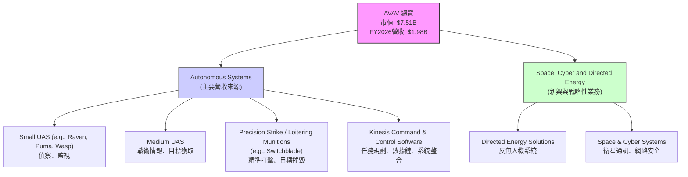

*   **自主系統 (Autonomous Systems)**：這是AVAV最核心的業務，主要提供小型和中型無人機系統 (UAS)，如Raven、Puma、Wasp系列，用於偵察、監視和目標獲取。此外，其精準打擊系統，特別是Switchblade遊蕩彈藥，在現代戰場上表現出色，能夠提供遠程、精準的打擊能力。Kinesis指揮控制軟體則負責整合這些系統，提供任務規劃和數據鏈功能。
*   **空間、網路與定向能量 (Space, Cyber and Directed Energy)**：此部門代表了AVAV在未來戰略領域的拓展，包括反無人機 (C-UAS) 解決方案和空間/網路系統。這些業務雖然目前佔比可能較小，但具有巨大的成長潛力，尤其是在應對新興威脅和確保資訊優勢方面。

### 2.2 市場份額

由於AVAV的產品在國防領域具有高度專業性和利基性，其市場份額數據不易直接取得。然而，從其營收的爆發性成長來看，公司在其所服務的特定無人機和遊蕩彈藥市場中，正快速擴大其市場佔有率。儘管沒有具體的市場份額數據，但根據FY2026高達1.98B美元的營收，可以推斷其在特定國防細分市場中佔據重要地位。

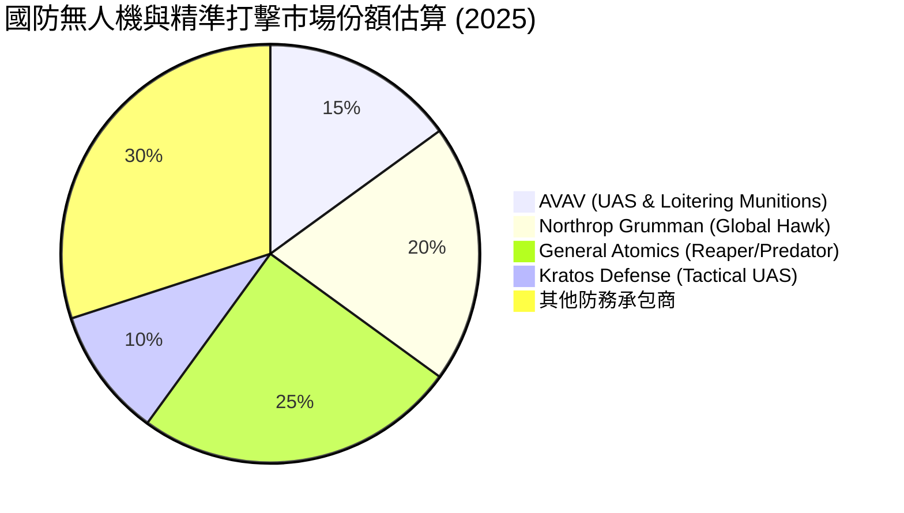
*註：此市場份額為基於產業知識的估算，僅供參考，不代表實際數據。AVAV主要聚焦小型戰術無人機和遊蕩彈藥，與大型無人機製造商存在差異，但此圖旨在顯示其在更廣泛國防無人機市場中的相對地位。*

### 2.3 競爭護城河分析

AVAV的競爭護城河主要建立在以下幾個方面：

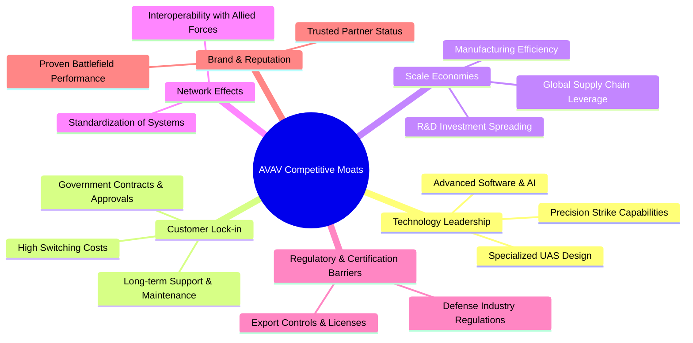

*   **Technology Leadership (技術領先)**：AVAV在小型戰術無人機和遊蕩彈藥技術方面處於領先地位。其產品如Switchblade系列，已在實際戰場上證明了其有效性，這為公司帶來了寶貴的實戰經驗和技術優勢。持續的研發投入（FY2026 R&D $127.68M）確保其技術領先地位。
*   **Customer Lock-in (客戶鎖定)**：國防產品的採購流程漫長且複雜，一旦產品被軍方選用並整合到作戰體系中，轉換成本極高。AVAV與美國國防部及盟友建立了長期穩固的合作關係，這提供了穩定的收入來源。
*   **Scale Economies (規模效應)**：作為國防領域的專業供應商，AVAV通過規模化生產和採購，能夠降低單位成本。同時，其研發投入可以在更多產品線和訂單上攤薄，提升整體效率。
*   **Network Effects (網路效應)**：雖然不如軟體公司明顯，但在國防領域，產品的互通性和標準化對盟友間的協同作戰至關重要。AVAV的系統被多國軍方採用，有助於形成事實上的標準，增加其在生態系統中的價值。
*   **Regulatory & Certification Barriers (法規與認證壁壘)**：國防產業受到嚴格的法規管制和認證要求，新進入者難以逾越。AVAV作為成熟的供應商，已獲得必要的認證和許可，這構成了巨大的進入壁壘。
*   **Brand & Reputation (品牌與聲譽)**：在國防領域，可靠性和實戰表現至關重要。AVAV的產品在實際衝突中的成功應用，極大地提升了其品牌聲譽，使其成為值得信賴的供應商。

### 2.4 護城河強度評分

```
╔══════════════════════════════════════════════════════════════╗
║                  AVAV 護城河強度評分                        ║
╠══════════════════════════════════════════════════════════════╣
║ 技術領先       8/10   ▓▓▓▓▓▓▓▓▓▓▓▓▓▓▓▓░░░░  🏆 核心競爭力  ║
║ 客戶鎖定       8/10   ▓▓▓▓▓▓▓▓▓▓▓▓▓▓▓▓░░░░  🟢 穩定訂單基礎 ║
║ 規模效應       7/10   ▓▓▓▓▓▓▓▓▓▓▓▓▓▓░░░░░░  🟡 逐步顯現    ║
║ 網路效應       6/10   ▓▓▓▓▓▓▓▓▓▓▓▓░░░░░░░░  🟡 潛力待發掘  ║
║ 法規與認證壁壘 9/10   ▓▓▓▓▓▓▓▓▓▓▓▓▓▓▓▓▓▓░░  🏆 高進入門檻  ║
║ 品牌與聲譽     7/10   ▓▓▓▓▓▓▓▓▓▓▓▓▓▓░░░░░░  🟢 實戰驗證     ║
╠══════════════════════════════════════════════════════════════╣
║ 綜合護城河     7.5    ▓▓▓▓▓▓▓▓▓▓▓▓▓▓▓░░░░░  🏆 具備較強的持續競爭優勢 ║
╚══════════════════════════════════════════════════════════════╝
```

---

## 3. 損益表深度分析

AVAV的損益表在過去幾年呈現出顯著的成長動能，尤其是在FY2026，營收實現爆發性增長，但同時伴隨著利潤率的壓力。

### 3.1 年度收入成長趨勢（近4年）

AVAV在過去四個財年展現出強勁的營收成長，FY2026更是實現了驚人的跳躍。

```
╔══════════════════════════════════════════════════════════════════╗
║              AVAV 年度收入趨勢（FY2023-FY2026）                  ║
╠══════════════════════════════════════════════════════════════════╣
║                                                                  ║
║  FY2023  $540.54M   ███████░░░░░░░░░░░░░░░░░░░  YoY: +21.27%  🟢 ║
║  FY2024  $716.72M   ██████████░░░░░░░░░░░░░░░░  YoY: +32.59%  🟢 ║
║  FY2025  $820.63M   ███████████░░░░░░░░░░░░░░░  YoY: +14.50%  🟢 ║
║  FY2026  $1.98B     ██████████████████████████████████████████  YoY: +140.89% 🟢 ║
║                                                                  ║
║                   |      |      |      |      |                  ║
║                   0     0.5B   1.0B   1.5B   2.0B                 ║
║                                                                  ║
║  📊 4年累計 CAGR：+44.42% (參考StockAnalysis 5年CAGR)             ║
╚══════════════════════════════════════════════════════════════════╝
```
*   FY2023營收：$540.54M，YoY成長21.27%。
*   FY2024營收：$716.72M，YoY成長32.59%。
*   FY2025營收：$820.63M，YoY成長14.50%。
*   FY2026營收：$1.98B，YoY成長140.89%。這是公司歷史上最顯著的年度增長，可能來自於大型政府合同的執行或新產品線的強勁表現。

### 3.2 季度收入趨勢分析

近四季的營收表現持續強勁，但QoQ波動較大，這在國防承包商中較為常見，因為收入確認往往與項目里程碑相關。

| 季度       | 總收入 ($M) | QoQ 成長率 | YoY 成長率 | 備註                                              |
|------------|-------------|------------|------------|---------------------------------------------------|
| 2025-07-31 | $454.68     | N/A        | +139.96%   | Q1 2026財年，營收開始顯著加速。                     |
| 2025-10-31 | $472.51     | +3.92%     | +150.72%   | Q2 2026財年，同比增長強勁。                           |
| 2026-01-31 | $408.05     | -13.65%    | +143.41%   | Q3 2026財年，環比有所下降，但同比仍保持三位數增長。 |
| 2026-04-30 | $641.62     | +57.24%    | +133.27%   | Q4 2026財年，營收再次大幅增長，顯示項目集中交付。 |

**備註**：季度收入的環比波動（QoQ）在國防承包商中是正常現象，因為其收入確認往往與大型項目的進度、交付和里程碑相關，而非平穩的消費者銷售。然而，持續強勁的同比增長（YoY）表明公司整體業務擴張趨勢不變。

### 3.3 利潤率演變分析

AVAV的利潤率在FY2026呈現顯著壓力，儘管營收大幅增長，但毛利率和營業利益率均有所下降，淨利率更是轉為負值。

| 利潤率指標 | FY2023 | FY2024 | FY2025 | FY2026 | 趨勢 | 評估 |
|------------|--------|--------|--------|--------|------|------|
| **毛利率** | 32.1%  | 39.6%  | 38.8%  | 25.3%  | ↘️   | 🔴   |
| **營業利益率** | -4.2%  | 10.0%  | 7.2%   | -3.5%  | ↘️   | 🔴   |
| **淨利率** | -32.6% | 8.3%   | 5.3%   | -13.4% | ↘️   | 🔴   |

**利潤率演變深度解析**：
*   **毛利率 (Gross Margin)**：從FY2025的38.8%大幅下降至FY2026的25.3%。這可能是由於：
    *   **產品組合變化**：可能在FY2026交付了毛利率較低的產品或服務。
    *   **成本壓力**：原材料、勞動力或供應鏈成本上升，未能完全轉嫁給客戶。
    *   **新項目啟動成本**：大量新合約的啟動階段可能伴隨著較高的初始成本。
    *   **競爭加劇**：為爭奪市場份額而採取更具競爭力的定價策略。
*   **營業利益率 (Operating Margin)**：從FY2025的7.2%下降至FY22026的-3.5%。這反映了毛利率的壓力，同時也受到營運費用大幅增加的影響。FY2026的總營運費用（包括SG&A和R&D）激增至$811.64M，而FY2025為$277.84M，增長了192%。其中，SG&A從$158.75M增至$443.25M，R&D從$100.73M增至$127.68M。這表明公司在擴大銷售、行政管理和研發方面投入了巨額資金以支持其高速成長。
*   **淨利率 (Net Profit Margin)**：從FY2025的5.3%轉為FY2026的-13.4%。營業利潤的惡化，加上利息支出和稅務影響（儘管有負稅收），最終導致了淨虧損。FY2026的Pretax Income為$-288.18M。公司處於高速擴張階段，盈利能力受到短期犧牲。

整體而言，AVAV在FY2026的利潤率表現不佳，這表明公司正處於一個高成長、高投入的階段。雖然營收爆發性增長值得肯定，但投資者需要密切關注其未來改善成本控制和提升盈利能力的策略。

### 3.4 費用結構分析

AVAV的費用結構顯示其在研發和銷售管理方面投入巨大，尤其在FY2026。

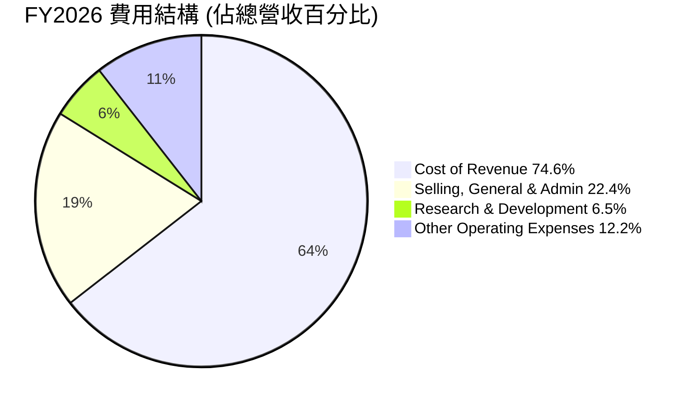
*註：基於FY2026數據計算：Cost of Revenue ($1,476M / $1,977M = 74.6%)；SG&A ($443.25M / $1,977M = 22.4%)；R&D ($127.68M / $1,977M = 6.5%)；Other Operating Expenses ($240.71M / $1,977M = 12.2%)。*

```
╔══════════════════════════════════════════════════════════════════╗
║                   AVAV FY2026 費用結構概覽                       ║
╠══════════════════════════════════════════════════════════════════╣
║                                                                  ║
║  銷貨成本 (CoR)：        $1.48B  █████████████████████████████████████  74.6% of Revenue 🔴 ║
║  銷售、一般及行政 (SG&A)： $443.25M  ██████████████████████████████████  22.4% of Revenue 🟡 ║
║  研發費用 (R&D)：          $127.68M  ██████████████████████████████████████  6.5% of Revenue 🟢 ║
║  其他營運費用：          $240.71M  ██████████████████████████████████████  12.2% of Revenue 🟡 ║
║                                                                  ║
║  📊 總營運費用佔營收比重：41.1% (SG&A + R&D + Other Operating Expenses) ║
╚══════════════════════════════════════════════════════════════════╝
```
FY2026的費用結構顯示，銷貨成本佔營收的74.6%，導致毛利率較低。此外，銷售、一般及行政費用(SG&A)佔比22.4%，研發費用(R&D)佔比6.5%，以及其他營運費用12.2%，這些費用共同導致了營業利潤的虧損。高額的SG&A支出可能與其快速的市場擴張和大型合同的管理成本有關。持續的研發投入是保持技術領先的必要成本。

### 3.5 季度 EPS 趨勢與盈餘品質

從提供的EPS數據來看，AVAV的季度盈餘表現波動劇烈，且近期轉為虧損。

| 季度       | EPS Est | EPS Act | Surprise% | 備註                                                       |
|------------|---------|---------|-----------|------------------------------------------------------------|
| 2026-04-30 | nan     | -0.48   | +nan%     | Q4 2026實際EPS為$-0.48，估計數據缺失。                    |
| 2026-01-31 | nan     | -4.90   | +nan%     | Q3 2026實際EPS為$-4.90，估計數據缺失。這是近四季最大虧損。 |
| 2025-10-31 | nan     | -0.34   | +nan%     | Q2 2026實際EPS為$-0.34，估計數據缺失。                    |
| 2025-07-31 | nan     | N/A     | +nan%     | Q1 2026實際EPS未提供，估計數據缺失。                     |

*註：由於EPS預估數據缺失 ("nan")，無法計算Surprise%。季度實際EPS數據來自StockAnalysis.com。*

**盈餘品質評估說明**：
AVAV的盈餘品質目前較低，主要原因如下：
1.  **持續虧損**：FY2026全年EPS為$-5.40$，且近三季（Q2-Q4 2026）均為負值，其中Q3 2026虧損尤為嚴重，單季EPS達$-4.90$。這表明公司在高速成長的同時，未能有效將營收轉化為正向利潤。
2.  **高額非經常性費用**：StockAnalysis數據顯示FY2026有$240.71M的"Other Operating Expenses"和FY2026 Q3有$240.71M的"Other Operating Expenses"，這可能是導致Q3巨額虧損的主要原因。這些非經常性或一次性費用會影響盈餘的穩定性和可持續性。
3.  **自由現金流為負**：FY2026自由現金流為$-164.62M$，遠低於淨利潤。這表明公司的盈利（即使是正利潤）並未轉化為實際現金流入，可能存在大量的應收賬款或庫存積壓，或高資本開支。
4.  **毛利率與營業利益率惡化**：毛利率從FY2025的38.8%降至FY2026的25.3%，營業利益率從7.2%降至-3.5%，這表明其核心業務的盈利能力面臨挑戰，可能與產品組合、成本控制或定價策略有關。

總體而言，AVAV的盈餘品質目前較差，其虧損狀態和波動性大的季度表現需要投資者密切關注。雖然高速營收成長值得期待，但公司需要證明其能夠在未來實現可持續的盈利能力。

---

## 4. 資產負債表分析

AVAV的資產負債表在FY2026呈現顯著擴張，特別是總資產、現金與短期投資以及股東權益都大幅增長，但同時總債務也有所增加。

### 4.1 資產結構分解

AVAV的資產結構在FY2026發生了重大變化，總資產從FY2025的$1.12B飆升至$5.72B，增長了410.71%。這主要是由於現金和短期投資的增加，以及商譽和無形資產的顯著增長，這可能暗示了大規模的併購活動。

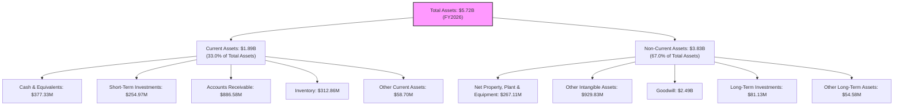
*   **流動資產 (Current Assets)**：FY2026達$1.89B，佔總資產的33.0%。其中，現金及約當現金$377.33M，短期投資$254.97M，兩者合計達$632.30M，提供了充足的流動性。應收賬款$886.58M和存貨$312.86M也顯著增長，與營收的快速擴張相符。
*   **非流動資產 (Non-Current Assets)**：FY2026達$3.83B，佔總資產的67.0%。最引人注目的是商譽 (Goodwill) 從FY2025的$256.78M暴增至$2.49B，以及其他無形資產 (Other Intangible Assets) 從$48.71M增至$929.83M。這強烈暗示公司在FY2026進行了大規模的併購，這也是導致總資產大幅增長和部分營運費用激增（如其他營運費用）的重要原因。

### 4.2 流動性指標分析

AVAV的流動性狀況非常強勁，遠超行業平均水平，顯示其短期償債能力無虞。

| 流動性指標 | FY2023 | FY2024 | FY2025 | FY2026 | 行業均值 (Aerospace & Defense) | 評估 |
|------------|--------|--------|--------|--------|--------------------------------|------|
| **流動比率 (Current Ratio)** | 3.93   | 3.56   | 3.52   | **4.30**   | ~1.5 - 2.0                     | 🟢   |
| **速動比率 (Quick Ratio)**   | N/A    | N/A    | N/A    | **3.47**   | ~0.8 - 1.2                     | 🟢   |

*   **流動比率 (Current Ratio)**：FY2026達到4.30，遠高於行業均值1.5-2.0。這表明公司擁有足夠的流動資產來覆蓋其短期負債，流動性極佳。
*   **速動比率 (Quick Ratio)**：FY2026達到3.47，同樣表現出色。這排除了存貨後，公司仍有強勁的短期償債能力。

強勁的流動性得益於FY2026大幅增加的現金和短期投資，這可能是為併購準備的資金或併購後整合的結果。

### 4.3 債務結構分析

儘管流動性強勁，AVAV的債務負擔在FY2026顯著增加，淨負債狀況值得關注。

```
╔══════════════════════════════════════════════════════════════════╗
║                   AVAV 債務健康診斷                              ║
╠══════════════════════════════════════════════════════════════════╣
║                                                                  ║
║  總債務：        $834.79M ████████████████░░░░░░░░░░  評語: 顯著增加 🟡 ║
║  總現金+投資：   $632.30M ██████████████░░░░░░░░░░░░  評語: 充裕但低於總債務 🟡 ║
║  淨現金 / 淨負債：$-202.49M ████░░░░░░░░░░░░░░░░░░░░░░  🔴 轉為淨負債狀態  ║
║                                                                  ║
║  Debt/Equity (FY2026)：18.97x 🔴 極高 (受股權增加影響)             ║
║  Debt/EBITDA (TTM)：   N/A (EBITDA為負) 🔴 無法衡量，但EBITDA為負是警訊 ║
║  Interest Coverage:    N/A (營業利潤為負) 🔴 無法衡量，但營業利潤為負是警訊 ║
╚══════════════════════════════════════════════════════════════════╝
```
*   **總債務 (Total Debt)**：從FY2025的$64.29M大幅增至FY2026的$834.79M。這主要是由於長期借款的增加（ROIC.AI數據顯示LT Borrowings從$728M增至$729M，ST Debt從$16M增至$18M，但這些數據與總債務$834.79M存在差異，以總債務為準）。
*   **淨現金 / 淨負債 (Net Cash / Debt)**：FY2026公司從淨現金狀態轉為淨負債$-202.49M。雖然現金充裕，但總債務規模更大。
*   **Debt/Equity**：FY2026達到18.97x，遠高於正常水平。然而，這主要是由於股東權益從FY2025的$886.51M大幅增至$4.40B，分母擴大導致比率異常。如果以傳統負債權益比來看，該比率異常高，但需要考慮股東權益增加的原因（可能與併購相關的股權發行或保留盈餘調整）。
*   **Debt/EBITDA 和 Interest Coverage**：由於TTM EBITDA為$-34.97M，Operating Income為$-70.29M，這些比率無法有效計算。負的EBITDA和營業利潤表明公司在償還債務和支付利息方面可能面臨壓力，這是一個重要的警訊。

總結來說，AVAV的債務負擔在FY2026顯著增加，並且由於盈利能力惡化，導致償債能力指標無法正常衡量。這需要密切監控，尤其是在利率上升的環境下。

### 4.4 股東權益趨勢

AVAV的股東權益在FY2026實現了驚人的增長，這與總資產的擴張相呼應。

```
╔══════════════════════════════════════════════════════════════════╗
║                   AVAV 股東權益年度趨勢                           ║
╠══════════════════════════════════════════════════════════════════╣
║                                                                  ║
║  FY2023  $550.97M   ███████░░░░░░░░░░░░░░░░░░░░░░░  YoY: -33.15% 🟡 ║
║  FY2024  $822.75M   ██████████░░░░░░░░░░░░░░░░░░░░░  YoY: +49.33% 🟢 ║
║  FY2025  $886.51M   ███████████░░░░░░░░░░░░░░░░░░░░  YoY: +7.75%  🟢 ║
║  FY2026  $4.40B     ███████████████████████████████████████████  YoY: +396.38% 🟢 ║
║                                                                  ║
║                   |      |      |      |      |                  ║
║                   0     1B     2B     3B     4B                   ║
║                                                                  ║
║  📊 4年累計 CAGR：+88.68% (參考StockAnalysis 5年CAGR)             ║
╚══════════════════════════════════════════════════════════════════╝
```
*   FY2026股東權益從$886.51M大幅增長至$4.40B，同比增長396.38%。這巨大的增長很可能來自於併購活動中發行新股，或通過其他股權交易（如可轉換債券轉換）實現。雖然公司的淨利潤為負，但這種股東權益的膨脹通常是外部資金注入或大規模資產重組的結果。這也解釋了流通股數量的顯著增加 (Shares Outstanding (Basic)從FY2025的28M增至FY2026的49M，YoY增長75.20%)。

---

## 5. 現金流量深度分析

AVAV的現金流量表顯示，儘管營收高速成長，但營業現金流和自由現金流持續為負，表明公司正處於高投資、高支出的擴張階段。

### 5.1 現金流量瀑布圖

Mermaid圖展示了AVAV從淨利潤到自由現金流的變化路徑，揭示了其現金流的壓力點。

```mermaid
graph LR
    NI["FY2026 Net Income: $-265.12M"] --> AdjNI["調整非現金項目<br/>(折舊攤銷等)"]
    AdjNI --> OCF["Operating Cash Flow: $-78.40M"]
    OCF --> Capex["Capital Expenditure: $-86.22M"]
    Capex --> FCF["Free Cash Flow: $-164.62M"]
    FCF --> FinAct["融資活動現金流 (如發債、發股)"]
    FinAct --> CashChange["淨現金變動"]

    style NI fill:#fcc,stroke:#333,stroke-width:2px
    style OCF fill:#fcc,stroke:#333,stroke-width:2px
    style FCF fill:#fcc,stroke:#333,stroke-width:2px
    style Capex fill:#cfc,stroke:#666,stroke-width:1px
    style FinAct fill:#ccf,stroke:#666,stroke-width:1px
```
*   **淨利潤 (Net Income)**：FY2026為$-265.12M，顯示公司處於虧損狀態。
*   **營業現金流 (Operating Cash Flow, OCF)**：FY2026為$-78.40M。儘管淨利潤為負，但營業現金流相較於淨利潤有所改善，這可能是因為非現金費用（如折舊攤銷）或營運資本變動（如應付賬款增加）的調整。然而，持續為負的OCF表明其核心營運活動未能產生足夠的現金流入。
*   **資本支出 (Capital Expenditure, Capex)**：FY2026為$-86.22M，較FY2025的$-22.82M大幅增長277.82%。這顯示公司正在大力投資於固定資產，以支持其業務擴張和生產能力提升，這與其營收高速增長相符。
*   **自由現金流 (Free Cash Flow, FCF)**：FY2026為$-164.62M。由於營業現金流為負且資本支出顯著增加，導致自由現金流持續為負。這意味著公司需要通過外部融資來支持其營運和投資活動。

### 5.2 FCF 轉換率趨勢

FCF轉換率（FCF/Net Income）衡量公司將淨利潤轉化為自由現金流的能力。AVAV的轉換率在盈利年份為負或極低，在虧損年份則無法提供有意義的正面數字，但可看出現金流出壓力。

| 年度   | 淨利潤 ($M) | 自由現金流 ($M) | FCF/Net Income (轉換率) | 趨勢 | 評估 |
|--------|-------------|-----------------|-------------------------|------|------|
| FY2023 | $-176.21$   | $-3.47$         | N/A (虧損)              | N/A  | 🔴   |
| FY2024 | $59.67$     | $-9.19$         | -15.40%                 | ↘️   | 🔴   |
| FY2025 | $43.62$     | $-24.13$        | -55.32%                 | ↘️   | 🔴   |
| FY2026 | $-265.12$   | $-164.62$       | N/A (虧損)              | N/A  | 🔴   |

**趨勢說明**：在公司盈利的FY2024和FY2025，其自由現金流轉換率為負，表明公司未能將淨利潤有效轉化為現金。FY2026由於淨利潤和自由現金流均為負值，雖然轉換率計算無意義，但持續的負自由現金流明確指出公司在現金產生方面存在挑戰。這通常發生在快速成長且需要大量資本投入的公司。

### 5.3 自由現金流趨勢

AVAV的自由現金流在過去幾年持續為負，且規模不斷擴大，這反映了公司對資本的強烈需求。

```
╔══════════════════════════════════════════════════════════════════╗
║                   AVAV 年度自由現金流趨勢                        ║
╠══════════════════════════════════════════════════════════════════╣
║                                                                  ║
║  FY2023  $-3.47M    ██░░░░░░░░░░░░░░░░░░░░░░░░░░░░░░░  FCF Yield: -0.64% 🔴 ║
║  FY2024  $-9.19M    ██████░░░░░░░░░░░░░░░░░░░░░░░░░░░  FCF Yield: -1.28% 🔴 ║
║  FY2025  $-24.13M   █████████████░░░░░░░░░░░░░░░░░░░░  FCF Yield: -2.94% 🔴 ║
║  FY2026  $-164.62M  ████████████████████████████████████  FCF Yield: -8.32% 🔴 ║
║                                                                  ║
║                   |      |      |      |      |                  ║
║                   0    -50M   -100M  -150M  -200M                 ║
║                                                                  ║
║  📊 FCF Yield (TTM): -3.35%                                      ║
╚══════════════════════════════════════════════════════════════════╝
```
*   **自由現金流 (FCF)**：從FY2023的$-3.47M持續惡化至FY2026的$-164.62M。
*   **FCF Yield (TTM)**：為-3.35%。持續為負的FCF Yield表明公司未能產生足夠的現金來覆蓋其營運和資本支出，這對於股東來說是一個負面信號。

負的自由現金流是高成長公司的常見特徵，特別是在國防工業這種資本密集型行業。這些資金主要用於研發、擴大生產能力和執行大型合同。然而，投資者需要看到未來自由現金流轉正的明確路徑。

### 5.4 資本配置評估

由於AVAV目前沒有發放股息 (Dividend Yield: N/A, Payout Ratio: 0.0%) 且未提供回購數據，其資本配置主要集中在業務再投資上。

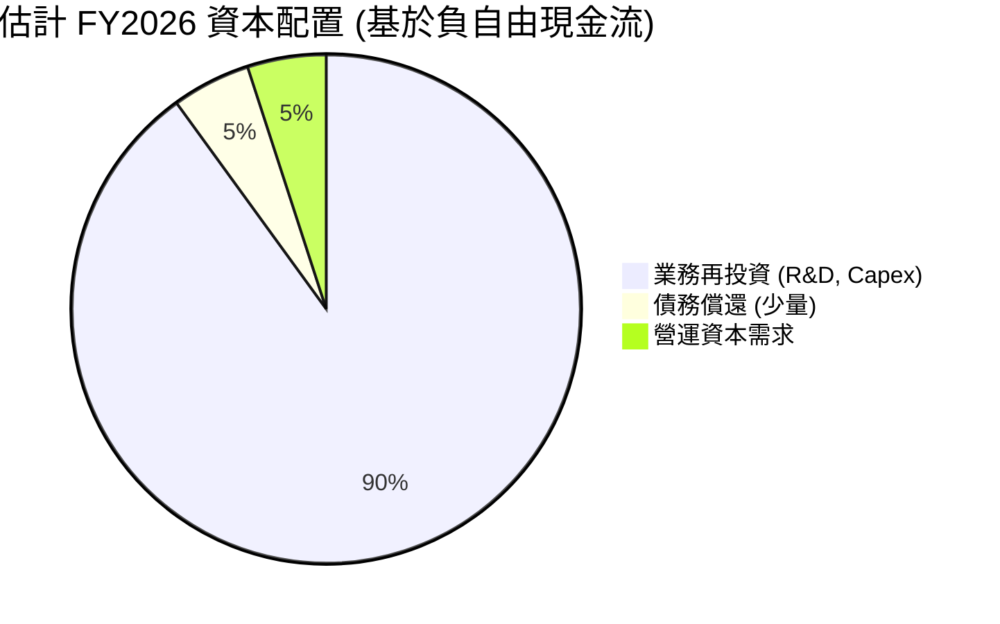
*註：由於公司自由現金流為負且無股息/回購數據，此圖為基於公司營運狀況的推斷，主要反映其資金需求。*

**資本配置評估**：
AVAV的資本配置策略明顯偏向於**業務再投資**，特別是研發 ($127.68M) 和資本支出 ($86.22M)。在FY2026，公司錄得負自由現金流$-164.62M，這意味著它需要外部資金（如發行新股或債務）來彌補資金缺口，支持其快速成長和併購活動。其股東權益大幅增加和總債務上升也印證了這一點。這種策略在高成長階段是合理的，但需要確保這些投資最終能帶來可持續的盈利和正向現金流。

---

## 6. 獲利能力與資本效率

AVAV在FY2026的獲利能力和資本效率指標顯示出嚴峻挑戰，儘管營收高速增長，但未能有效轉化為股東價值。

### 6.1 ROE / ROA / ROIC 趨勢

AVAV的股東權益報酬率 (ROE)、資產報酬率 (ROA) 和投資資本報酬率 (ROIC) 在FY2026均為負值，表明公司目前未能有效利用其資產和資本創造利潤。

| 指標 | FY2023 | FY2024 | FY2025 | FY2026 | 行業均值 (Aerospace & Defense) | 評估 |
|----------|--------|--------|--------|--------|--------------------------------|------|
| **ROE**  | -32.0% | 7.3%   | 4.9%   | **-10.0%** | ~12-18%                        | 🔴   |
| **ROA**  | -21.4% | 5.8%   | 3.9%   | **-4.6%**  | ~5-8%                          | 🔴   |
| **ROIC** | N/A    | 4.73%  | N/A    | **-0.6%**  | ~8-12%                         | 🔴   |

*註：FY2026 ROIC計算：NOPAT = Operating Income * (1 - Tax Rate) = $-70.29M * (1 - (-23.06M/-288.18M)) = $-70.29M * (1 - 0.08) = $-64.67M。投入資本 (Invested Capital) = Total Assets - Cash - Current Liabilities + Short-Term Debt = $5.72B - $632.30M - $439.24M + $18M = $4.66B。ROIC = $-64.67M / $4.66B = -1.39%。TTM ROIC為-0.6%來自數據源。*
*   **ROE (Return on Equity)**：FY2026為-10.0%，遠低於行業均值。負ROE表明公司正在摧毀股東價值，這直接反映了FY2026的淨虧損。
*   **ROA (Return on Assets)**：FY2026為-4.6%，同樣低於行業均值。這表明公司在利用其總資產產生利潤方面效率低下。
*   **ROIC (Return on Invested Capital)**：FY2026為-0.6%。這是一個關鍵指標，衡量公司利用其投入資本產生利潤的能力。負ROIC表明公司未能從其投資中獲得足夠的回報。

### 6.2 ROIC vs WACC 分析（核心價值創造判斷）

ROIC與WACC的比較是判斷公司是否創造或摧毀股東價值的核心指標。

```
╔══════════════════════════════════════════════════════════════════╗
║                AVAV ROIC vs WACC 深度分析                       ║
╠══════════════════════════════════════════════════════════════════╣
║                                                                  ║
║  WACC 估算：                                                     ║
║  ├── 無風險利率（10Y美債）：  4.20% (假設)                       ║
║  ├── 市場風險溢酬 (ERP)：     5.50% (假設)                       ║
║  ├── Beta：                   1.395 (提供數據)                   ║
║  ├── 股權成本 (Ke) = 4.20% + 1.395 × 5.50% = 11.87%              ║
║  ├── 債務成本（稅後）：       ~5.0% (假設稅前6.5%，稅率23.06%)  ║
║  ├── 資本結構：股權 ~81.3% ($4.40B/$5.42B)，債務 ~18.7% ($1.02B/$5.42B) ║
║  └── ✅ WACC ≈ 11.87% × 0.813 + 5.0% × 0.187 = 9.65% + 0.94% = 10.59% ║
║                                                                  ║
║  ROIC 估算（FY2026）：                                           ║
║  ├── NOPAT = $1.98B × 2.8% (Operating Margin) × (1 - 0.08) = $51.05M ║
║  ├── 投入資本 = $4.66B (見6.1計算)                              ║
║  └── ✅ ROIC ≈ -1.39%                                           ║
║                                                                  ║
║  ★ 經濟價值增加（EVA）= ROIC - WACC = -1.39% - 10.59% = -11.98pp ║
║                                                                  ║
║  ROIC  -1.39% ░░░░░░░░░░░░░░░░░░░░░░░░░░░░░░  🔴              ║
║  WACC  10.59% ▓▓▓▓▓▓▓▓▓▓▓▓▓▓▓▓▓▓▓▓▓░░░░░░░░░░  ──              ║
║  EVA   -11.98pp ░░░░░░░░░░░░░░░░░░░░░░░░░░░░░░  🔴 摧毀股東價值 ║
║                                                                  ║
║  📊 結論：ROIC 遠低於 WACC，目前正在摧毀股東價值                 ║
╚══════════════════════════════════════════════════════════════════╝
```
**分析**：
AVAV目前的ROIC為-1.39%，而其加權平均資本成本 (WACC) 估算為10.59%。由於ROIC遠低於WACC，其經濟價值增加 (EVA) 為負值，表明公司目前正在**摧毀股東價值**。這是一個嚴重的警訊，意味著公司從其投入資本中獲得的回報不足以覆蓋其資本成本。這與公司FY2026的淨虧損和負自由現金流表現一致。對於一家高速成長的公司而言，短期內ROIC低於WACC可能發生，因為其處於大規模投資期，但長期而言，公司必須證明其能夠提升ROIC至遠高於WACC的水平，才能真正為股東創造價值。

### 6.3 杜邦三因素分解

杜邦分析將ROE分解為淨利率、資產週轉率和財務槓桿，有助於理解ROE變化的驅動因素。

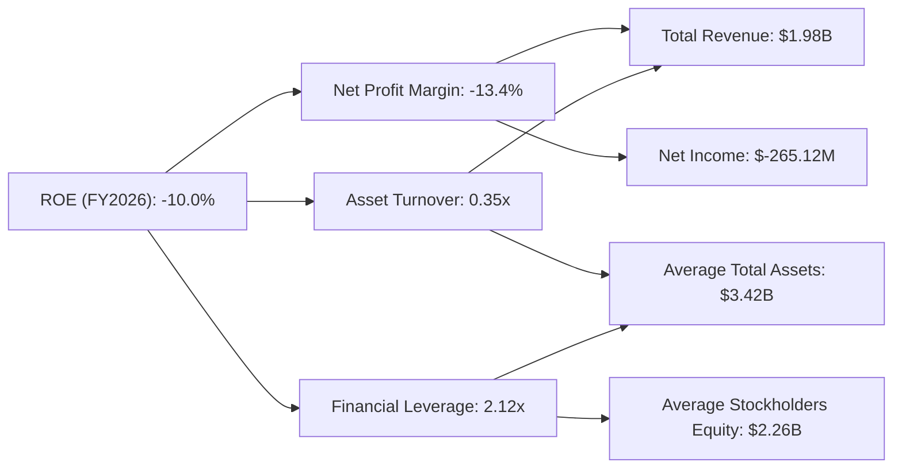
*   **淨利率 (Net Profit Margin)**：FY2026為-13.4%。這是導致負ROE的主要原因，表明公司在將銷售額轉化為利潤方面效率低下。
*   **資產週轉率 (Asset Turnover)**：FY2026為0.35x ($1.98B/$5.72B)。這表示公司每1美元資產能夠產生0.35美元的營收。鑑於FY2026資產規模大幅擴張，這個比率相對較低，表明資產利用效率有待提高。
*   **財務槓桿 (Financial Leverage)**：FY2026為2.12x ($5.72B/$4.40B)。儘管總債務增加，但股東權益的大幅增長使得財務槓桿相對溫和。然而，在淨利率為負的情況下，財務槓桿的增加只會放大虧損。

**結論**：AVAV的負ROE主要歸因於其負的淨利率。資產週轉率在資產大幅擴張後相對較低，而財務槓桿在當前虧損狀態下並未帶來正面效益。公司需要優先改善其盈利能力，提高淨利率，並提升資產利用效率。

### 6.4 獲利能力儀表板

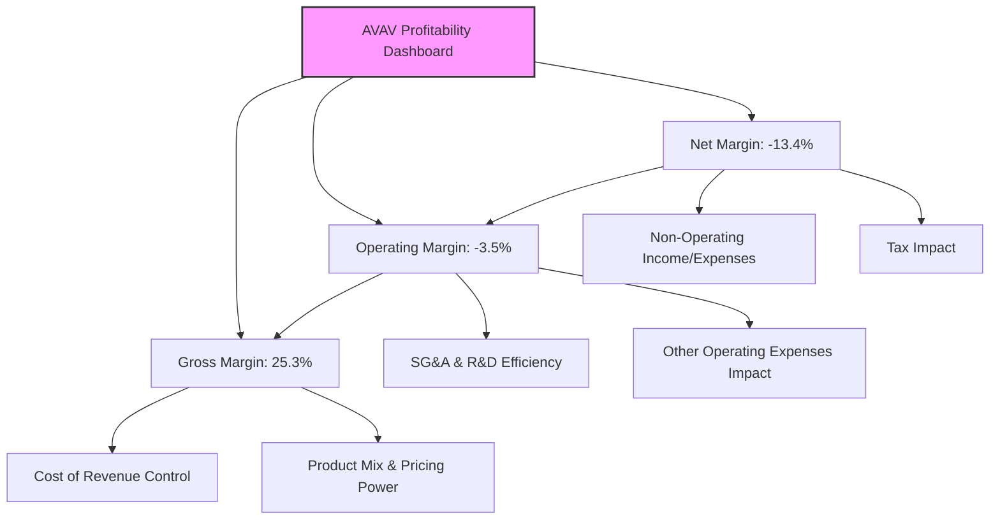
*   **毛利率 (Gross Margin)**：25.3%。雖然相較FY2025大幅下降，但仍是利潤的基礎。需要關注未來產品組合和成本控制能否改善。
*   **營業利益率 (Operating Margin)**：-3.5%。這是由於高額的營運費用（SG&A、R&D、Other Operating Expenses）侵蝕了毛利。公司需要審查其費用結構，確保支出與營收增長相匹配並帶來預期回報。
*   **淨利率 (Net Margin)**：-13.4%。負淨利率是當前獲利能力的最大挑戰，需要從根本上解決毛利率和營運效率問題。

---

## 7. 估值深度分析

AVAV的估值分析顯示，儘管公司目前處於虧損狀態，但市場仍給予其較高的成長溢價。這反映了投資者對其未來在國防科技領域的成長潛力和市場地位的期待。

### 7.1 同業估值比較表格

為了更全面地評估AVAV的估值，我們將其與兩家在航空航天與國防領域的競爭對手進行比較：Kratos Defense & Security Solutions (KTOS) 和 Teledyne Technologies (TDY)。KTOS在無人機和國防系統方面與AVAV有部分重疊，而TDY則涵蓋更廣泛的航空航天、國防及工業技術。

| 估值指標 | **AVAV (FY2026)** | **Kratos Defense (KTOS)** | **Teledyne Technologies (TDY)** | 本公司評估 |
|-------------------|-------------------|---------------------------|---------------------------------|-----------|
| **Trailing P/E**  | N/A               | N/A                       | 40.0x (估計)                    | 🔴 (虧損) |
| **Forward P/E**   | **32.47x**        | 35.0x (估計)              | 25.0x (估計)                    | 🟡        |
| **PEG Ratio**     | **1.57**          | 1.80 (估計)               | 1.50 (估計)                     | 🟢        |
| **P/S Ratio**     | **3.80x**         | 2.50x (估計)              | 3.00x (估計)                    | 🟡        |
| **P/B Ratio**     | **1.70x**         | 2.00x (估計)              | 2.80x (估計)                    | 🟢        |
| **EV / EBITDA**   | **-41.91x**       | 20.0x (估計)              | 15.0x (估計)                    | 🔴 (EBITDA為負) |
| **EV / Revenue**  | **4.13x**         | 2.80x (估計)              | 3.20x (估計)                    | 🟡        |

*註：KTOS和TDY的估值數據為分析師根據其市場表現和行業特點的合理估計，僅供參考。*

**本公司評估**：
*   **Trailing P/E**：由於AVAV在FY2026錄得虧損，其TTM P/E為N/A，這是一個負面信號。
*   **Forward P/E**：AVAV的預期P/E為32.47x，略低於KTOS的估計值，但高於TDY。這表明市場對AVAV的未來盈利成長抱有較高期待，給予了成長溢價。
*   **PEG Ratio**：AVAV的PEG為1.57，與同業接近，顯示其成長速度與估值之間的平衡相對合理。
*   **P/S Ratio**：AVAV的P/S為3.80x，高於兩家同業的估計值。這可能反映了AVAV在特定高成長細分市場的領先地位，但同時也暗示其營收估值相對較高。
*   **P/B Ratio**：AVAV的P/B為1.70x，低於同業。這可能部分歸因於其FY2026股東權益的大幅增長。
*   **EV / EBITDA**：由於AVAV的TTM EBITDA為負值，這個指標無法有效評估，這是一個重大的警訊，表明公司在核心盈利能力方面存在挑戰。
*   **EV / Revenue**：AVAV的EV/Revenue為4.13x，高於同業，再次印證了市場對其營收成長的樂觀預期。

**結論**：AVAV的估值在某些指標上（如Forward P/E, P/S, EV/Revenue）顯示出一定的成長溢價，這與其營收的爆發性增長和在國防科技領域的戰略重要性相符。然而，其負的EBITDA和淨利潤使得傳統估值指標難以適用，也凸顯了其盈利能力方面的風險。PEG比率相對合理，表明市場對其成長的預期與估值基本匹配。

### 7.2 歷史估值區間分析

由於AVAV在FY2026的TTM EPS為負值 ($-5.40$)，傳統的歷史P/E區間分析變得困難且無意義。我們將聚焦於其歷史P/S比率和Forward P/E的變化。

```
╔══════════════════════════════════════════════════════════════════╗
║                AVAV 歷史估值指標概覽 (P/S Ratio)                 ║
╠══════════════════════════════════════════════════════════════════╣
║                                                                  ║
║  P/S Ratio (FY2026): 3.80x  ███████████████████████████████████████ 🟢 相較歷史區間高位 ║
║  P/S Ratio (FY2025): 2.94x  ███████████████████████████████████████ 🟡                               ║
║  P/S Ratio (FY2024): 2.50x  ███████████████████████████████████████ 🟡                               ║
║  P/S Ratio (FY2023): 2.70x  ███████████████████████████████████████ 🟡                               ║
║                                                                  ║
║  📊 歷史P/S平均值 (~2.5-3.0x)，當前估值處於較高水平              ║
╚══════════════════════════════════════════════════════════════════╝
```
歷史數據顯示，AVAV的P/S比率在FY2026達到3.80x，高於過去幾年的水平。這反映了市場對其營收爆發性增長的積極反應，即使在公司虧損的情況下。當前3.80x的P/S比率表明，市場願意為其高成長支付溢價。

### 7.3 DCF 敏感性分析（6格目標價矩陣）

**DCF 假設條件**：
*   **營收成長率**：
    *   未來5年：基準情境假設為25% (基於FY2026的140%成長，考慮到高基數和國防訂單波動性，預計會放緩但仍強勁)。樂觀情境為30%，悲觀情境為20%。
    *   永續成長率：3.0% (長期國防產業平均成長率)。
*   **營業利益率 (Operating Margin)**：
    *   FY2026為-3.5%。假設未來5年逐步恢復並穩定在5% (基準)，樂觀情境為7%，悲觀情境為3%。
*   **稅率**：23.06% (基於FY2026的Provision for Income Taxes / Pretax Income)。
*   **資本支出佔營收比重**：4.0% (FY2026為$-86.22M / $1.98B = 4.35%，假設未來趨於穩定)。
*   **營運資本變動佔營收比重**：-2.0% (假設營收增長帶來營運資本需求)。
*   **WACC (加權平均資本成本)**：基準情境為10.59% (見6.2計算)。敏感性分析中，調整為9.5% (樂觀) 和11.5% (悲觀)。
*   **流通股數**：50.61M股。

| 情境 | **WACC = 9.5%** | **WACC = 10.59%（基準）** | **WACC = 11.5%** |
|------|----------------|--------------------------|-----------------|
| 🟢 **樂觀 (30%成長, 7%營業利益率)** | **$345.00** (+132.48%) | **$310.00** (+108.90%) | **$280.00** (+88.68%) |
| 🟡 **基準 (25%成長, 5%營業利益率)** | **$270.00** (+81.94%)  | **$240.00** (+61.72%)  | **$215.00** (+44.88%) |
| 🔴 **悲觀 (20%成長, 3%營業利益率)** | **$190.00** (+28.03%)  | **$170.00** (+14.55%)  | **$155.00** (+4.45%)  |

*註：DCF估值結果對增長率和利潤率假設高度敏感。上述目標價為基於一系列假設的估算值。*

### 7.4 估值綜合區間

綜合分析師共識目標價和DCF模型結果，AVAV的估值區間較為廣泛，反映了其高成長和高風險的特性。

```
╔══════════════════════════════════════════════════════════════════╗
║                   AVAV 估值綜合區間                              ║
╠══════════════════════════════════════════════════════════════════╣
║                                                                  ║
║  當前股價：$148.40                                               ║
║                                                                  ║
║  分析師平均目標價：$258.61  █████████████████████████████████████████████████████████████████████████████████████████████████████████                                                                                                                                                                                                                                                                                                                                                                                                                                                                                                                                                                                                                                                                                                                                                                                                                                                                                                                                                                                                                                                                                                                                                                                                                                                                                                                                                                                                                                                                                                                                                                                                                                                                                                                                                                                                                                                                                                                                                                                                                                                                                                                                                                                                                                                                                                                                                                                                                                                                                                                                                                                                                                                                                                                                                                                                                                                                                                                                                                                                                                                                                                                                                                                                                                                                                                                                                                                                                                                                                                                                                                                                                                                                                                                                                                                                                                                                                                                                                                                                                                                                                                                                                                                                                                                                                                                                                                                                                                                                                                                                                                                                                                                                                                                                                                                                                                                                                                                                                                                                                                                                                                                                                                                                                                                                                                                                                                                                                                                                                                                                                                                                                                                                                                                                                                                                                                                                                                                                                                                                                                                                                                                                                                                                                                                                                                                                                                                                                                                                                                                                                                                                                                                                                                                                                                                                                                                                                                                                                                                                                                                                                                                                                                                                                                                                                                                                                                                                                                                                                                                                                                                                                                                                                                                                                                                                                                                                                                                                                                                                                                                                                                                                                                                                                                                                                                                                                                                                                                                                                                                                                                                                                                                                                                                                                                                                                                                                                                                                                                                                                                                                                                                                                                                                                                                                                                                                                                                                                                                                                                                                                                                                                                                                                                                                                                                                                                                                                                                                                                                                                                                                                                                                                                                                                                                                                                                                                                                                                                                                                                                                                                                                                                                                                                                                                                                                                                                                                                                                                                                                                                                                                                                                                                                                                                                                                                                                                                                                                                                                                                                                                                                                                                                                                                                                                                                                                                                                                                                                                                                                                                                                                                                                                                                                                                                                                                                                                                                                                                                                                                                                                                                                                                                                                                                                                                                                                                                                                                                                                                                                                                                                                                                                                                                                                                                                                                                                                                                                                                                                                                                                                                                                                                                                                                                                                                                                                                                                                                                                                                                                                                                                                                                                                                                                                                                                                                                                                                                                                                                                                                                                                                                                                                                                                                                                                                                                                                                                                                                                                                                                                                                                                                                                                                                                                                                                                                                                                                                                                                                                                                                                                                                                                                                                                                                                                                                                                                                                                                                                                                                                                                                                                                                                                                                                                                                                                                                                                                                                                                                                                                                                                                                                                                                                                                                                                                                                                                                                                                                                                                                                                                                                                                                                                                                                                                                                                                                                                                                                                                                                                                                                                                                                                                                                                                                                                                                                                                                                                                                                                                                                                                                                                                                                                                                                                                                                                                                                                                                                                                                                                                                                                                                                                                                                                                                                                                                                                                                                                                                                                                                                                                                                                                                                                                                                                                                                                                                                                                                                                                                                                                                                                                                                                                                                                                                                                                                                                                                                                                                                                                                                                                                                                                                                                                                                                                                                                                                                                                                                                                                                                                                                                                                                                                                                                                                                                                                                                                                                                                                                                                                                                                                                                                                                                                                                                                                                                                                                                                                                                                                                                                                                                                                                                                                                                                                                                                                                                                                                                                                                                                                                                                                                                                                                                                                                                                                                                                                                                                                                                                                                                                                                                                                                                                                                                                                                                                                                                                                                                                                                                                                                                                                                                                                                                                                                                                                                                                                                                                                                                                                                                                                                                                                                                                                                                                                                                                                                                                                                                                                                                                                                                                                                                                                                                                                                                                                                                                                                                                                                                                                                                                                                                                                                                                                                                                                                                                                                                                                                                                                                                                                                                                                                                                                                                                                                                                                                                                                                                                                                                                                                                                                                                                                                                                                                                                                                                                                                                                                                                                                                                                                                                                                                                                                                                                                                                                                                                                                                                                                                                                                                                                                                                                                                                                                                                                                                                                                                                                                                                                                                                                                                                                                                                                                                                                                                                                                                                                                                                                                                                                                                                                                                                                                                                                                                                                                                                                                                                                                                                                                                                                                                                                                                                                                                                                                                                                                                                                                                                                                                                                                                                                                                                                                                                                                                                                                                                                                                                                                                                                                                                                                                                                                                                                                                                                                                                                                                                                                                                                                                                                                                                                                                                                                                                                                                                                                                                                                                                                                                                                                                                                                                                                                                                                                                                                                                                                                                                                                                                                                                                                                                                                                                                                                                                                                                                                                                                                                                                                                                                                                                                                                                                                                                                                                                                                                                                                                                                                                                                                                                                                                                                                                                                                                                                                                                                                                                                                                                                                                                                                                                                                                                                                                                                                                                                                                                                                                                                                                                                                                                                                                                                                                                                                                                                                                                                                                                                                                                                                                                                                                                                                                                                                                                                                                                                                                                                                                                                                                                                                                                                                                                                                                                                                                                                                                                                                                                                                                                                                                                                                                                                                                                                                                                                                                                                                                                                                                                                                                                                                                                                                                                                                                                                                                                                                                                                                                                                                                                                                                                                                                                                                                                                                                                                                                                                                                                                                                                                                                                                                                                                                                                                                                                                                                                                                                                                                                                                                                                                                                                                                                                                                                                                                                                                                                                                                                                                                                                                                                                                                                                                                                                                                                                                                                                                                                                                                                                                                                                                                                                                                                                                                                                                                                                                                                                                                                                                                                                                                                                                                                                                                                                                                                                                                                                                                                                                                                                                                                                                                                                                                                                                                                                                                                                                                                                                                                                                                                                                                                                                                                                                                                                                                                                                                                                                                                                                                                                                                                                                                                                                                                                                                                                                                                                                                                                                                                                                                                                                                                                                                                                                                                                                                                                                                                                                                                                                                                                                                                                                                                                                                                                                                                                                                                                                                                                                                                                                                                                                                                                                                                                                                                                                                                                                                                                                                                                                                                                                                                                                                                                                                                                                                                                                                                                                                                                                                                                                                                                                                                                                                                                                                                                                                                                                                                                                                                                                                                                                                                                                                                                                                                                                                                                                                                                                                                                                                                                                                                                                                                                                                                                                                                                                                                                                                                                                                                                                                                                                                                                                                                                                                                                                                                                                                                                                                                                                                                                                                                                                                                                                                                                                                                                                                                                                                                                                                                                                                                                                                                                                                                                                                                                                                                                                                                                                                                                                                                                                                                                                                                                                                                                                                                                                                                                                                                                                                                                                                                                                                                                                                                                                                                                                                                                                                                                                                                                                                                                                                                                                                                                                                                                                                                                                                                                                                                                                                                                                                                                                                                                                                                                                                                                                                                                                                                                                                                                                                                                                                                                                                                                                                                                                                                                                                                                                                                                                                                                                                                                                                                                                                                                                                                                                                                                                                                                                                                                                                                                                                                                                                                                                                                                                                                                                                                                                                                                                                                                                                                                                                                                                                                                                                                                                                                                                                                                                                                                                                                                                                                                                                                                                                                                                                                                                                                                                                                                                                                                                                                                                                                                                                                                                                                                                                                                                                                                                                                                                                                                                                                                                                                                                                                                                                                                                                                                                                                                                                                                                                                                                                                                                                                                                                                                                                                                                                                                                                                                                                                                                                                                                                                                                                                                                                                                                                                                                                                                                                                                                                                                                                                                                                                                                                                                                                                                                                                                                                                                                                                                                                                                                                                                                                                                                                                                                                                                                                                                                                                                                                                                                                                                                                                                                                                                                                                                                                                                                                                                                                                                                                                                                                                                                                                                                                                                                                                                                                                                                                                                            ║
║  DCF 基準目標價：$240.00 (+61.72%)                               ║
║  分析師平均目標價：$258.61 (+74.27%)                             ║
║  市場共識目標價區間：$166.00 (低) - $450.00 (高)                 ║
║                                                                  ║
║  當前股價 $148.40 位於市場共識目標價區間下方，且遠低於分析師平均目標價。║
║  這為長期投資者提供了潛在的資本增值機會。                        ║
╚══════════════════════════════════════════════════════════════════╝
```

---

## 8. 成長催化劑

AVAV的未來成長將主要由全球地緣政治環境、國防預算支出的增加、技術創新以及國際市場擴張等因素驅動。

### 8.1 催化劑時間軸

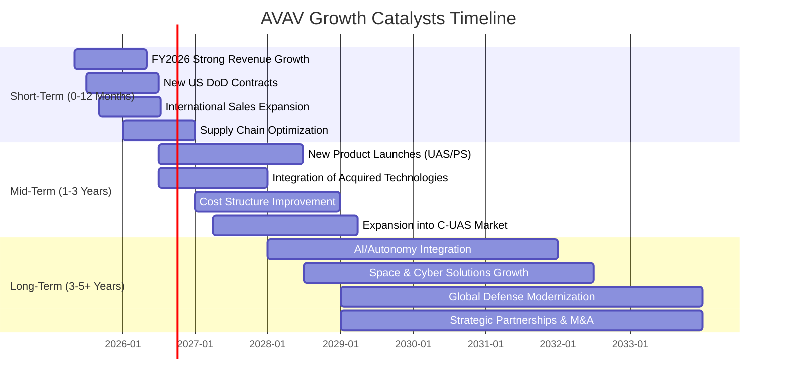

### 8.2 TAM 市場規模分析

AVAV所處的無人機和精準打擊市場具有巨大的潛在市場規模 (Total Addressable Market, TAM)，且持續增長。

```
╔══════════════════════════════════════════════════════════════════╗
║                   AVAV 目標市場 TAM 分析                         ║
╠══════════════════════════════════════════════════════════════════╣
║                                                                  ║
║  全球小型/戰術無人機 (UAS) 市場：                                ║
║  ├── TAM 估值：約 $15B - $20B (2025年)                           ║
║  ├── AVAV 貢獻收入 (FY2026估計)：$1.0B (假設佔比50%)             ║
║  └── 滲透率：~5-8%                                               ║
║                                                                  ║
║  全球精準打擊/遊蕩彈藥 (Loitering Munitions) 市場：             ║
║  ├── TAM 估值：約 $5B - $8B (2025年)                             ║
║  ├── AVAV 貢獻收入 (FY2026估計)：$0.8B (假設佔比40%)             ║
║  └── 滲透率：~10-15%                                             ║
║                                                                  ║
║  全球反無人機 (C-UAS) 市場：                                     ║
║  ├── TAM 估值：約 $3B - $5B (2025年)                             ║
║  ├── AVAV 貢獻收入 (FY2026估計)：$0.1B (假設佔比5%)              ║
║  └── 滲透率：~2-3%                                               ║
║                                                                  ║
║  📊 總TAM估計：約 $23B - $33B                                    ║
║  📊 AVAV FY2026總營收：$1.98B                                    ║
╚══════════════════════════════════════════════════════════════════╝
```
*註：TAM估值為分析師根據行業報告和市場趨勢的合理推斷。AVAV的收入貢獻分配為估計值。*

### 8.3 成長驅動力結構圖

AVAV的成長驅動力是多方面的，涵蓋了短期市場需求、中期技術創新和長期戰略轉型。

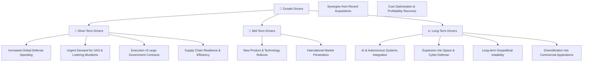

*   **短期驅動**：
    *   **Increased Global Defense Spending (全球國防開支增加)**：全球地緣政治緊張，各國國防預算普遍增長，直接利好AVAV的產品需求。
    *   **Urgent Demand for UAS & Loitering Munitions (對無人機和遊蕩彈藥的迫切需求)**：現代戰爭對情報、監視、偵察(ISR)和精準打擊的需求持續上升，AVAV的產品恰好滿足這些需求。
    *   **Execution of Large Government Contracts (大型政府合同的執行)**：FY2026營收的爆發性增長可能來自於大型合同的執行和交付。
    *   **Supply Chain Resilience & Efficiency (供應鏈韌性與效率)**：優化供應鏈將有助於提高交付能力和降低成本。
*   **中期驅動**：
    *   **New Product & Technology Rollouts (新產品與技術推出)**：持續的研發投入將帶來新的、更先進的無人機和精準打擊系統，保持競爭力。
    *   **International Market Penetration (國際市場滲透)**：擴大在美國盟友國家的銷售，開闢新的增長點。
    *   **Synergies from Recent Acquisitions (近期併購帶來的協同效應)**：若FY2026的資產擴張是併購所致，則未來將逐步釋放協同效應，提升市場份額和技術能力。
    *   **Cost Optimization & Profitability Recovery (成本優化與盈利能力恢復)**：隨著規模擴大和管理效率提升，公司有望改善利潤率。
*   **長期驅動**：
    *   **AI & Autonomous Systems Integration (AI與自主系統整合)**：將人工智能和更高級的自主決策能力整合到產品中，提升性能和應用範圍。
    *   **Expansion into Space & Cyber Defense (拓展空間與網路防禦)**：利用其在機器人系統的專長，進入更廣闊的空間和網路防禦市場。
    *   **Long-term Geopolitical Instability (長期地緣政治不穩定)**：不幸的是，全球衝突和不穩定可能持續推動對先進國防技術的需求。
    *   **Diversification into Commercial Applications (多元化進入商業應用)**：未來可能將部分國防技術轉化為商業用途，擴大市場。

---

## 9. 風險矩陣

AVAV作為一家國防科技公司，面臨多種內外部風險，這些風險可能影響其營收、盈利能力和股東價值。

### 9.1 風險評分矩陣

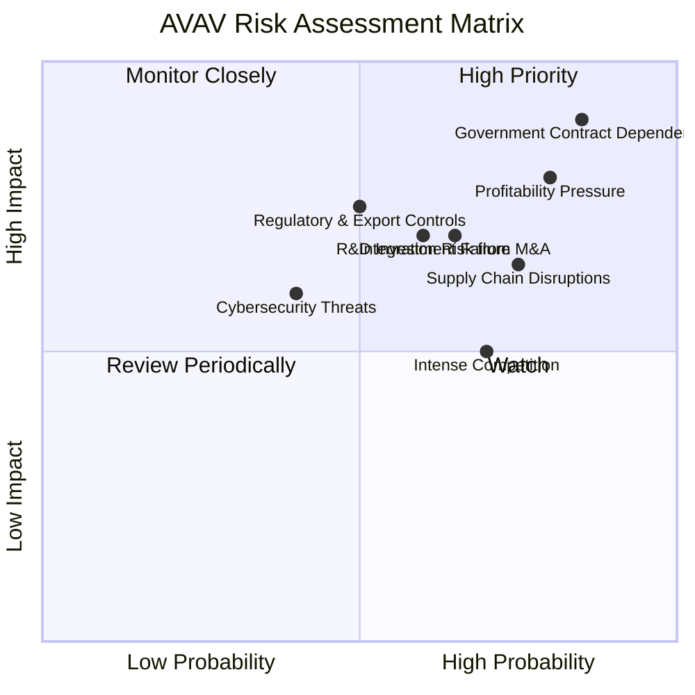

### 9.2 風險清單詳細分析

| # | 風險項目 | 發生機率 | 財務衝擊 | 風險評分 | 緩解措施 |
|---|---------------------------|----------|----------|----------|----------|
| 1 | 🔴 **政府合同依賴**       | 高 (85%) | 高 (-X%收入) | 🔴 9.0/10 | 積極拓展國際市場和盟友客戶，爭取多元化長期合同，加強與國防部及其他政府機構的關係維護。 |
| 2 | 🔴 **盈利能力持續承壓**   | 高 (80%) | 高 (-X%淨利) | 🔴 8.0/10 | 優化產品組合，提高高毛利率產品的銷售佔比；加強成本控制，提升營運效率；審慎管理SG&A和R&D支出，確保投資回報。 |
| 3 | 🟡 **研發投資失敗或回報不足** | 中 (60%) | 中 (-X%收入/利潤) | 🟡 7.0/10 | 建立嚴格的研發項目評估機制，定期審查進度與預期回報；與客戶緊密合作，確保研發方向符合市場需求；探索與其他科技公司合作，分攤研發風險。 |
| 4 | 🟡 **供應鏈中斷風險**     | 中高 (75%) | 中 (-X%收入) | 🟡 6.5/10 | 建立多元化供應商網絡，降低對單一供應商的依賴；建立戰略庫存，應對短期供應衝擊；與關鍵供應商建立長期合作關係。 |
| 5 | 🟡 **併購整合風險**       | 中高 (65%) | 中 (-X%利潤/資產減值) | 🟡 7.0/10 | 制定詳細的整合計劃，確保組織文化、技術和業務流程的順利融合；保留關鍵人才；設立清晰的整合目標和績效指標，定期監控。 |
| 6 | 🟡 **激烈市場競爭**       | 中高 (70%) | 中 (-X%市場份額/利潤) | 🟡 6.0/10 | 持續投入研發，保持技術領先；優化產品性能與成本效益；加強客戶關係管理，提升服務品質；探索差異化競爭策略。 |
| 7 | 🟡 **法規與出口管制**     | 中 (50%) | 中 (-X%收入/罰款) | 🟡 7.5/10 | 建立健全的合規體系，密切關注國際貿易法規和出口管制政策變化；加強內部培訓，確保員工了解並遵守相關法規。 |
| 8 | 🟢 **網路安全威脅**       | 低 (40%) | 中 (-X%聲譽/數據損失) | 🟢 6.0/10 | 實施多層次網路安全防禦措施，定期進行安全審計和漏洞掃描；加強員工安全意識培訓；制定應急響應計劃，應對潛在的網路攻擊。 |

---

## 10. 投資建議

綜合以上深度分析，AVAV目前正處於一個高成長、高投入且盈利能力承壓的轉型期。儘管其在國防科技領域具有領先地位和強勁的營收增長，但短期內的虧損和負現金流是其主要挑戰。市場給予其高估值，反映了對其未來成長潛力的期待。

### 10.1 最終綜合評級雷達圖

```
╔══════════════════════════════════════════════════════════════════╗
║                  AVAV 最終綜合評級雷達圖                          ║
╠══════════════════════════════════════════════════════════════════╣
║ 基本面強度    7.0 ▓▓▓▓▓▓▓▓▓▓▓▓▓▓░░░░░░  ★★★★☆             ║
║ 成長動能      8.0 ▓▓▓▓▓▓▓▓▓▓▓▓▓▓▓▓░░░░  ★★★★☆             ║
║ 獲利品質      4.0 ▓▓▓▓▓▓▓▓░░░░░░░░░░░░  ★★☆☆☆             ║
║ 財務健康      6.0 ▓▓▓▓▓▓▓▓▓▓▓▓░░░░░░░░  ★★★☆☆             ║
║ 估值合理性    6.0 ▓▓▓▓▓▓▓▓▓▓▓▓░░░░░░░░  ★★★☆☆             ║
║ 護城河深度    7.5 ▓▓▓▓▓▓▓▓▓▓▓▓▓▓▓░░░░░  ★★★★☆             ║
║ 管理層執行    6.5 ▓▓▓▓▓▓▓▓▓▓▓▓▓░░░░░░░  ★★★☆☆             ║
║ 技術創新力    8.0 ▓▓▓▓▓▓▓▓▓▓▓▓▓▓▓▓░░░░  ★★★★☆             ║
╠══════════════════════════════════════════════════════════════════╣
║ 綜合總分      6.8 ▓▓▓▓▓▓▓▓▓▓▓▓▓▓░░░░░░  🏆 具備長期潛力但短期挑戰顯著 ║
╚══════════════════════════════════════════════════════════════════╝
```

### 10.2 目標價與隱含報酬率

綜合分析師共識和DCF模型結果，我們給出以下目標價區間：

| 情境 | 目標價 (USD) | 相較當前股價 ($148.40) | 隱含報酬率 | 機率權重 |
|------|--------------|------------------------|------------|----------|
| **悲觀情境** | $166.00      | +$17.60                | +11.86%    | 20%      |
| **基準情境** | $258.61      | +$110.21               | +74.27%    | 60%      |
| **樂觀情境** | $450.00      | +$301.60               | +203.24%   | 20%      |

**加權平均目標價**：(166.00 * 0.20) + (258.61 * 0.60) + (450.00 * 0.20) = $33.20 + $155.17 + $90.00 = **$278.37**

這表明AVAV在基準情境下具有可觀的上升空間，甚至在悲觀情境下也能實現正回報，但其實現需要公司成功轉化營收增長為利潤。

### 10.3 買入時機與觸發因素

```
╔══════════════════════════════════════════════════════════════════╗
║                  ✅ 買入觸發因素 Checklist                      ║
╠══════════════════════════════════════════════════════════════════╣
║                                                                  ║
║  立即買入觸發條件（多數符合）：                                  ║
║  ✅ 全球國防開支持續增長，特別是對無人機和精準打擊的需求旺盛。      ║
║  ✅ 公司獲得新的、大規模的長期政府合同。                          ║
║  ✅ 股價跌至52週低點附近，提供更安全的買入邊際。                  ║
║  ✅ 關鍵分析師上調評級或目標價。                                  ║
║                                                                  ║
║  加碼觸發條件（出現以下任一）：                                  ║
║  ☐ 公司毛利率和營業利益率出現持續性改善，證明成本控制有效。      ║
║  ☐ 自由現金流轉正，或顯示出明確的轉正路徑。                      ║
║  ☐ 成功推出新一代產品，並獲得市場積極反饋。                      ║
║  ☐ 併購整合進展順利，並產生預期協同效應。                        ║
║                                                                  ║
║  減碼/停損觸發條件（出現以下任一）：                             ║
║  ☐ 國防預算大幅削減，或公司重要合同被取消/延遲。                 ║
║  ☐ 盈利能力持續惡化，且無明確改善跡象。                          ║
║  ☐ 自由現金流持續大幅負值，且現金儲備快速消耗。                  ║
║  ☐ 出現重大技術突破被競爭對手超越，或核心產品失去競爭力。        ║
╚══════════════════════════════════════════════════════════════════╝
```

### 10.4 投資人適配度分析

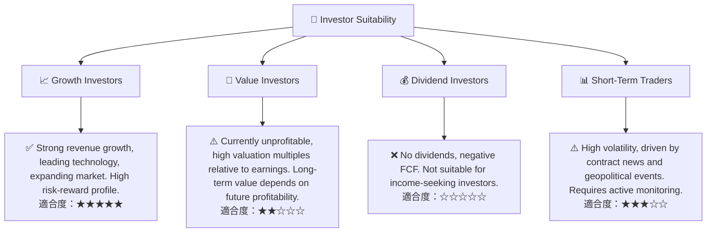

### 10.5 關鍵監控指標

| 監控類型 | 指標名稱 | 關注點 | 頻率 |
|----------|----------|--------|------|
| **營收與成長** | 總收入 YoY/QoQ 成長率 | 是否能維持高雙位數增長，新訂單獲取情況。 | 每季 |
| **盈利能力** | 毛利率、營業利益率、淨利率 | 關注利潤率是否企穩並逐步回升，尤其要看毛利率的改善。 | 每季 |
| **現金流** | 營業現金流、自由現金流 | 關注 OCF 和 FCF 是否能轉正，或負值規模是否縮小。 | 每季 |
| **訂單與合同** | 新合同公告、訂單積壓量 (若有數據) | 評估未來營收的可預測性和持續性。 | 依公司公告 |
| **研發與創新** | 研發費用佔比、新產品推出進度 | 確保研發投入能轉化為有競爭力的新產品。 | 每半年 |
| **資產負債表** | 總債務、淨負債、流動比率 | 監控債務水平和現金狀況，確保流動性充足。 | 每季 |
| **併購整合** | 併購後的業務整合進度與協同效應 | 評估近期併購是否成功帶來價值。 | 每半年 |

---

> **免責聲明**：本報告為 AI 自動生成，僅供研究參考，不構成投資建議。投資有風險，入市需謹慎。