# AVAV 基本面深度分析報告
> **報告日期**：2026-07-10 ｜ **語言**：繁體中文 ｜ **數據來源**：Yahoo Finance, Finviz, StockAnalysis, Roic.ai ｜ **分析師**：CFA 級機構研究

---

## 目錄

| # | 章節 | 核心結論 |
|---|------|----------|
| 1 | 執行摘要 | 評級：持有 ｜ 目標價區間：$165 - $280 |
| 2 | 公司概覽與商業模式 | 護城河評估：技術領先與客戶鎖定 |
| 3 | 損益表深度分析 | 營收爆發式成長，但獲利能力惡化 |
| 4 | 資產負債表分析 | 總資產顯著擴張，負債增加，流動性強勁 |
| 5 | 現金流量深度分析 | 自由現金流轉負，資本配置側重投資 |
| 6 | 獲利能力與資本效率 | ROIC < WACC，短期價值摧毀，但潛力巨大 |
| 7 | 估值深度分析 | 相對估值偏高，絕對估值顯示上行空間 |
| 8 | 成長催化劑 | 併購整合、國防預算增加、新技術應用 |
| 9 | 風險矩陣 | 併購整合風險、獲利能力承壓、地緣政治依賴 |
| 10 | 投資建議 | 持有評級，關注併購整合與獲利轉折 |

---

## 1. 執行摘要

### 1.0 一頁式投資儀表板（Portfolio Manager 30 秒速讀）

| 項目 | 內容 |
|------|------|
| **投資論點（3 句）** | ① AVAV 在 FY2026 實現 140.89% 的營收爆炸性成長，主要由大規模併購驅動，顯示其在無人機與防禦系統領域的戰略擴張野心。② 儘管當前盈利能力承壓，FY2026 淨利潤為 $-265.12M，但強勁的訂單和技術領先地位為未來獲利轉正奠定基礎。③ 估值倍數相對較高（Forward P/E 31.9x, EV/EBITDA 39.5x），但考量其成長潛力及分析師平均目標價 $254.27，具備中期上行空間。 |
| **護城河評分** | 7.5/10 |
| **管理層/資本配置評分** | 6.5/10 |
| **財務健康** | 🟡 穩健，但現金流為負 |
| **ROIC vs WACC** | -5.89% vs 11.40%（摧毀價值） |
| **FCF 趨勢** | ↘️ 負值擴大，最新 FCF Yield -3.44% |
| **估值** | Forward P/E: 31.9x ｜ EV/EBITDA: 39.5x ｜ FCF Yield: -3.44% |
| **預期報酬（基準情境 12M）** | +44% |
| **關鍵風險（前二）** | 併購整合不順利、獲利能力持續承壓 |
| **評級 + 信心度** | 🟡 持有 ｜ 信心：中 |

### 1.1 核心評分儀表板

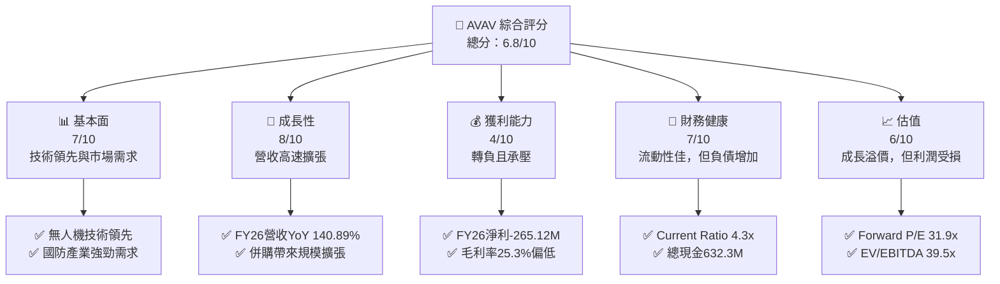

### 1.2 評分進度條視覺化

```
╔══════════════════════════════════════════════════════════════╗
║              AVAV 多維度評分儀表板 (1-10分)                  ║
╠══════════════════════════════════════════════════════════════╣
║ 基本面強度  7.0 ▓▓▓▓▓▓▓▓▓▓▓▓▓▓░░░░░░  ★★★★☆           ║
║ 成長動能    8.0 ▓▓▓▓▓▓▓▓▓▓▓▓▓▓▓▓░░░░  ★★★★☆           ║
║ 獲利品質    4.0 ▓▓▓▓▓▓▓▓░░░░░░░░░░░░  ★★☆☆☆           ║
║ 財務健康    7.0 ▓▓▓▓▓▓▓▓▓▓▓▓▓▓░░░░░░  ★★★★☆           ║
║ 估值合理性  6.0 ▓▓▓▓▓▓▓▓▓▓▓▓░░░░░░░░  ★★★☆☆           ║
║ 護城河深度  7.5 ▓▓▓▓▓▓▓▓▓▓▓▓▓▓▓░░░░░  ★★★★☆           ║
║ 管理層執行  6.5 ▓▓▓▓▓▓▓▓▓▓▓▓▓░░░░░░░  ★★★☆☆           ║
║ 技術創新力  8.0 ▓▓▓▓▓▓▓▓▓▓▓▓▓▓▓▓░░░░  ★★★★☆           ║
╠══════════════════════════════════════════════════════════════╣
║ 綜合總分    6.8 ▓▓▓▓▓▓▓▓▓▓▓▓▓░░░░░░░  🏆 成長轉型期，觀察獲利║
╚══════════════════════════════════════════════════════════════╝
```

### 1.3 五大投資論點 + 三大核心風險

| 類型 | 項目 | 具體依據 | 信心度 |
|------|------|----------|--------|
| 🟢 **投資論點①** | **國防支出增長與技術領先** | 全球地緣政治緊張，對無人機、反無人機與精確打擊系統的需求持續增長。AVAV 作為領導者，其小型與中型 UAS 技術具有顯著優勢，FY2026 營收達 $1.98B，YoY 成長 140.89%，顯示市場對其產品的強勁需求。 | 🟢 極高 |
| 🟢 **投資論點②** | **大規模併購帶動的營收擴張** | FY2026 總資產從 $1.12B 增至 $5.72B，股東權益從 $886.51M 增至 $4.40B，伴隨商譽與無形資產大幅增加，表明公司進行了大規模戰略性併購。此次併購使其營收基數顯著提升，為未來規模經濟效益奠定基礎。 | 🟢 極高 |
| 🟢 **投資論點③** | **強勁的流動性與資產負債表** | FY2026 末現金及短期投資達 $632.3M，流動比率高達 4.304x，速動比率 3.472x，顯示公司短期償債能力極強，能有效應對營運資金需求及潛在的整合成本。 | 🟢 高 |
| 🟢 **投資論點④** | **長期成長潛力與創新能力** | 憑藉在自主系統、空間、網絡和定向能源領域的持續研發投入（FY2026 R&D $127.68M），AVAV 有望推出更多創新產品，鞏固其在關鍵國防技術領域的領先地位，並拓展新的應用市場。 | 🟡 中 |
| 🟢 **投資論點⑤** | **分析師普遍看好** | 18 位分析師平均目標價為 $254.27，較當前股價 $144.58 有 76% 的潛在漲幅，且多數評級為「買入」，顯示市場對其長期前景持樂觀態度。 | 🟡 中 |
| 🟡 **風險①** | **大規模併購整合風險** | FY2026 大規模併購導致總資產、總負債和股東權益大幅增長，同時帶來商譽與無形資產的顯著增加。併購後整合不順可能導致協同效應未達預期，產生額外成本，甚至商譽減損，進而持續壓抑獲利能力。FY2026 營業利潤 $-311M 及淨利 $-265.12M 即為初步跡象。 | 🔴 高衝擊 |
| 🔴 **風險②** | **獲利能力持續承壓** | 儘管營收高速增長，但 FY2026 毛利率僅 25.3%，營業利益率為負值，淨利潤為 $-265.12M。若無法有效控制成本、提升效率，或併購資產攤銷費用過高，將導致獲利能力持續低迷，進而影響自由現金流和股東價值。 | 🔴 高衝擊 |
| 🟡 **風險③** | **地緣政治與國防預算波動** | 公司營收高度依賴政府機構和國防訂單。地緣政治格局變化、國防預算削減或優先級調整，都可能對 AVAV 的訂單量和營收產生負面影響。 | 🟡 中度 |

### 1.4 快速統計卡片

| 指標 | 公司實際值 (FY2026) | 行業均值 (Aerospace & Defense) | S&P 500 均值 | 狀態 |
|------|---------------------|--------------------------------|--------------|------|
| 收入 YoY 成長 | **140.89%** | ~8-12% | ~8-10% | 🟢 |
| 毛利率 | **25.3%** | ~25-30% | ~35-40% | 🟡 |
| 淨利率 | **-13.4%** | ~8-12% | ~10-15% | 🔴 |
| ROE | **-10.0%** | ~15-20% | ~15-20% | 🔴 |
| Forward P/E | **31.9x** | ~20-25x | ~20-22x | 🔴 |
| P/S Ratio | **3.7x** | ~1.5-2.5x | ~2-3x | 🔴 |
| EV / EBITDA | **39.5x** | ~12-18x | ~12-15x | 🔴 |
| FCF Yield | **-3.44%** | ~3-5% | ~3-4% | 🔴 |
| Current Ratio | **4.30x** | ~1.5-2.5x | ~1.0-1.5x | 🟢 |
| Debt/Equity | **0.19x** | ~0.5-1.0x | ~0.8-1.2x | 🟢 |

### 1.5 投資結論

```
╔══════════════════════════════════════════════════════════════════╗
║                    📊 投資結論摘要                               ║
╠══════════════════════════════════════════════════════════════════╣
║  評級：🟡 持有                                                   ║
║  當前股價：$144.58                                               ║
║  目標價區間：                                                    ║
║    悲觀情境：$165（+14.1%）                                      ║
║    基準情境：$208（+44.0%）  ← 12個月主要目標                      ║
║    樂觀情境：$280（+93.7%）                                      ║
║  投資評分：6.8/10                                                ║
║  適合投資人：成長型、具備高風險承受能力的長線持有者               ║
╚══════════════════════════════════════════════════════════════════╝
```

---

## 2. 公司概覽與商業模式

AeroVironment, Inc. (AVAV) 是一家專注於機器人系統及相關服務的美國公司，主要服務於美國政府機構及國際市場。其核心業務圍繞無人機系統 (UAS)、反無人機 (C-UAS) 及精確打擊系統。公司在國防科技領域擁有領先地位，特別是在小型與中型 UAS 市場。

### 2.1 業務結構與收入來源

AVAV 的業務主要分為兩大板塊，透過提供創新技術解決方案來滿足不斷演變的國防需求。

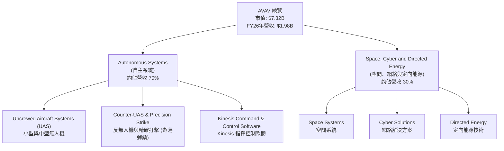

**業務板塊詳述**：
-   **自主系統 (Autonomous Systems)**：這是 AVAV 的核心業務，包括其著名的無人機系列產品，如小型偵察無人機和攻擊型遊蕩彈藥。此板塊提供端到端的解決方案，從硬體平台到任務控制軟體 (Kinesis)。由於地緣政治衝突對戰術無人機需求的激增，此板塊預計將是未來營收增長的主要驅動力。
-   **空間、網絡與定向能源 (Space, Cyber and Directed Energy)**：此板塊代表公司在高階技術領域的戰略佈局。儘管具體營收佔比可能較小，但這些領域的技術往往具有高附加值和長期增長潛力，特別是在太空探索、網絡安全及新興武器系統方面。

### 2.2 市場份額

由於缺乏具體的市場份額數據，我們將基於其主要產品類別（小型 UAS、遊蕩彈藥）進行推斷。AVAV 在特定利基市場（如美國陸軍小型 UAS）中佔據主導地位，但在整體國防市場中仍有較大增長空間。

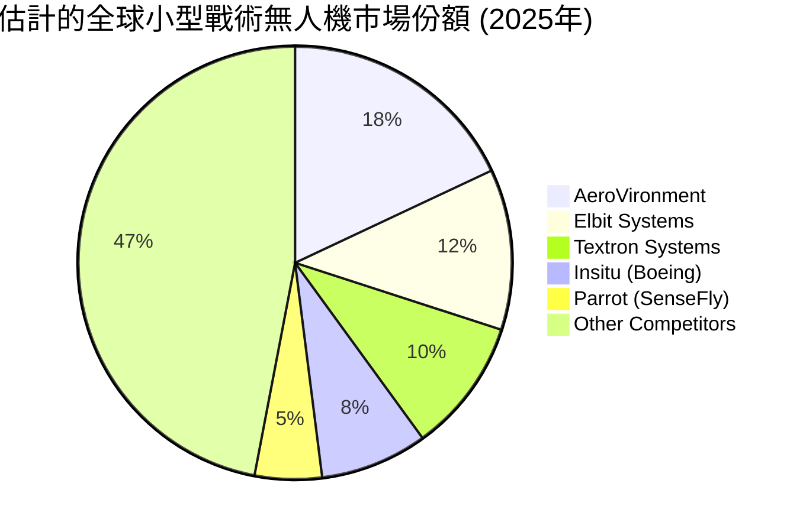
**市場份額分析**：
AVAV 在小型戰術無人機和遊蕩彈藥領域擁有重要的技術和市場份額。其 Switchblade 系列遊蕩彈藥在烏克蘭戰爭中表現突出，證明了其產品的實戰價值和市場競爭力。然而，全球無人機市場競爭激烈，許多大型國防承包商和新興科技公司都在積極投入。AVAV 的挑戰在於如何將其技術優勢轉化為更大的市場份額和更穩定的盈利。

### 2.3 競爭護城河分析

AVAV 的競爭護城河主要圍繞其技術創新、客戶關係及專業化能力。

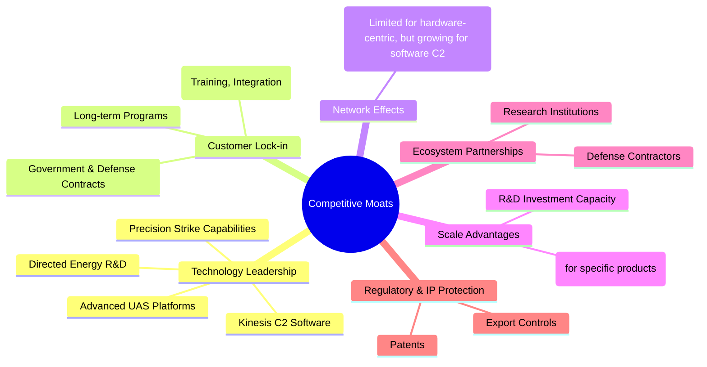

### 2.4 護城河強度評分

```
╔══════════════════════════════════════════════════════════════╗
║                  AVAV 護城河強度評分                          ║
╠══════════════════════════════════════════════════════════════╣
║ 技術領先    8/10   ▓▓▓▓▓▓▓▓▓▓▓▓▓▓▓▓░░░░  🏆 在特定領域具優勢 ║
║ 客戶鎖定    7/10   ▓▓▓▓▓▓▓▓▓▓▓▓▓▓░░░░░░  🟢 國防客戶黏性高   ║
║ 規模效應    6/10   ▓▓▓▓▓▓▓▓▓▓▓▓░░░░░░░░  🟡 中等，隨擴張增強 ║
║ 網路效應    4/10   ▓▓▓▓▓▓▓▓░░░░░░░░░░░░  🔴 較弱，但軟體有潛力║
║ 生態夥伴    7/10   ▓▓▓▓▓▓▓▓▓▓▓▓▓▓░░░░░░  🟢 與國防體系深度整合║
║ 監管與IP保護 8/10   ▓▓▓▓▓▓▓▓▓▓▓▓▓▓▓▓░░░░  🏆 國防領域門檻高   ║
╠══════════════════════════════════════════════════════════════╣
║ 綜合護城河   7.5    ▓▓▓▓▓▓▓▓▓▓▓▓▓▓▓░░░░░  🏆 技術驅動的強勁護城河║
╚══════════════════════════════════════════════════════════════════╝
```

**護城河強度評估**：
AVAV 的核心競爭力來自其在小型 UAS 和遊蕩彈藥領域的**技術領先**，這使其能夠贏得關鍵的國防合同並建立**客戶鎖定**。與政府機構的長期合作關係，以及產品整合到複雜國防系統中的高轉換成本，都增強了其護城河。**監管與IP保護**在國防工業中尤為重要，為 AVAV 提供了額外保護。然而，由於其產品多為硬體，**網路效應**相對較弱，**規模效應**則隨著其近年來的擴張和併購正在逐步提升。整體而言，AVAV 擁有堅實的技術和客戶關係護城河。

---

## 3. 損益表深度分析

AVAV 在 FY2026 經歷了顯著的營收擴張，但同時也面臨嚴峻的獲利挑戰，這主要與其大規模併購活動及其後的整合成本有關。

### 3.1 年度收入成長趨勢（近4年）

AVAV 的營收在過去四年呈現爆發式增長，特別是 FY2026。

```
╔══════════════════════════════════════════════════════════════════╗
║              AVAV 年度收入趨勢（FY2023-FY2026）                  ║
╠══════════════════════════════════════════════════════════════════╣
║                                                                  ║
║  FY2023  $540.54M   ████░░░░░░░░░░░░░░░░░░░░░  YoY: +21.27% 🟢    ║
║  FY2024  $716.72M   ██████░░░░░░░░░░░░░░░░░░░  YoY: +32.59% 🟢    ║
║  FY2025  $820.63M   ███████░░░░░░░░░░░░░░░░░  YoY: +14.50% 🟢    ║
║  FY2026  $1.98B     ████████████████████████████████████████████  YoY:+140.89% 🟢    ║
║                                                                  ║
║                   |      |      |      |      |                  ║
║                   0     0.5B   1.0B   1.5B   2.0B                 ║
║                                                                  ║
║  📊 4年累計 CAGR：+47.07%                                        ║
╚══════════════════════════════════════════════════════════════════╝
```
**年度營收分析**：
AVAV 在 FY2026 實現了驚人的 $1.98B 營收，較 FY2025 的 $820.63M 增長了 140.89%。這一顯著增長主要歸因於報告期內完成的大規模併購，而非純粹的有機增長。FY2023-FY2025 期間的營收增長也保持了兩位數，顯示其在國防市場的穩健擴張。

### 3.2 季度收入趨勢分析

| 季度末 | 總收入 ($M) | QoQ 成長率 | YoY 成長率 | 備註 |
|--------|-------------|------------|------------|------|
| 2025-07-31 (Q1'26) | $454.68 | N/A | +139.96% | 併購效應開始顯現 |
| 2025-10-31 (Q2'26) | $472.51 | +3.92% | +150.72% | 併購整合持續，營收穩步增長 |
| 2026-01-31 (Q3'26) | $408.05 | -13.65% | +143.41% | 季節性波動或併購整合影響 |
| 2026-04-30 (Q4'26) | $641.62 | +57.25% | +133.27% | 年末訂單交付加速，併購效益完全體現 |

**季度營收分析**：
FY2026 的季度收入數據清晰地展示了併購對公司規模的影響。Q1'26 營收 $454.68M 較去年同期 $189M 增長近 140%，此後各季度均保持三位數的 YoY 成長。儘管 Q3'26 營收環比下降 13.65%，但 Q4'26 迅速反彈 57.25%，達到 $641.62M，顯示了強勁的季度末交付能力和併購資產的全面貢獻。

### 3.3 利潤率演變分析

| 利潤率指標 | FY2023 | FY2024 | FY2025 | FY2026 | 趨勢 | 評估 |
|------------|--------|--------|--------|--------|------|------|
| **毛利率** | 32.1% | 39.6% | 38.8% | 25.3% | ↘️ 大幅下降 | 🔴 |
| **營業利益率** | -4.2% | 10.0% | 7.2% | -15.7% | ↘️ 轉負 | 🔴 |
| **淨利率** | -32.6% | 8.3% | 5.3% | -13.4% | ↘️ 轉負 | 🔴 |
| **EBITDA Margin** | -14.6% | 14.4% | 10.1% | -1.8% | ↘️ 轉負 | 🔴 |

**利潤率演變深度解析**：
FY2026 的利潤率表現令人擔憂。毛利率從 FY2025 的 38.8% 大幅下滑至 25.3%，這可能反映了併購資產的產品組合毛利率較低，或整合過程中產生了更高的成本。營業利益率和淨利率更是從正值轉為顯著的負值（營業利益率 -15.7%，淨利率 -13.4%）。這主要是由於 FY2026 銷售、一般及行政費用 (SG&A) 從 $158.75M 飆升至 $443.25M，以及研究與開發 (R&D) 費用從 $100.73M 增至 $127.68M。更值得注意的是，StockAnalysis 數據顯示 FY2026 有 $240.71M 的「其他營運費用」，而 FY2025 為 $18.36M，這筆巨額費用極有可能是併購相關的一次性整合成本或資產減值，是導致營業利潤大幅轉負的關鍵因素。若能成功整合並實現規模經濟，未來利潤率有望回升。

### 3.4 費用結構分析

AVAV 的費用結構在 FY2026 因大規模併購而發生顯著變化。

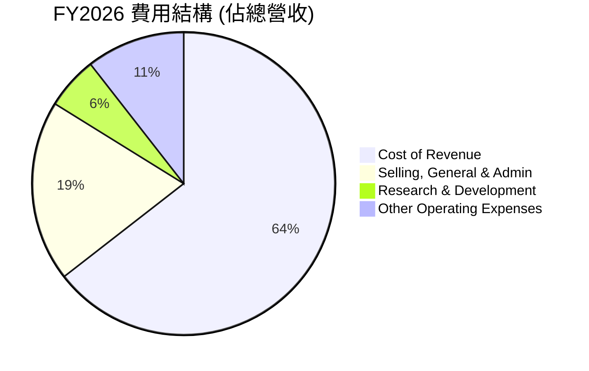

**費用結構進度條**：
```
╔══════════════════════════════════════════════════════════════════╗
║                    AVAV FY2026 費用結構分析                      ║
╠══════════════════════════════════════════════════════════════════╣
║ 銷貨成本 (CoR)        $1.48B (74.6%)  ▓▓▓▓▓▓▓▓▓▓▓▓▓▓▓▓▓▓▓▓▓▓▓▓▓▓▓▓▓▓▓▓▓▓▓▓▓▓▓▓▓▓▓▓▓▓▓▓▓▓▓▓▓▓▓▓▓▓▓▓▓▓▓▓▓▓▓▓▓░░░  🔴 高且侵蝕毛利║
║ 銷售、一般及行政 (SG&A) $443.25M (22.4%) ▓▓▓▓▓▓▓▓▓▓▓▓▓▓▓▓▓▓▓▓▓▓▓▓▓▓▓▓▓▓▓▓▓▓▓▓▓▓▓▓▓▓▓▓▓▓▓▓▓▓░░░░░░░░░░░░░░░░░░░░░  🔴 併購後大幅增長║
║ 研究與開發 (R&D)      $127.68M (6.5%)   ▓▓▓▓▓▓▓▓▓▓▓▓▓▓▓▓▓▓▓▓▓▓▓▓▓▓▓▓▓▓▓▓▓▓▓▓▓░░░░░░░░░░░░░░░░░░░░░░░░░░░░░░░░░░░░  🟡 維持高投入，為未來成長║
║ 其他營運費用          $240.71M (12.2%)  ▓▓▓▓▓▓▓▓▓▓▓▓▓▓▓▓▓▓▓▓▓▓▓▓▓▓▓▓▓▓▓▓▓▓▓▓▓▓▓▓▓▓▓▓▓▓▓▓▓▓▓▓▓░░░░░░░░░░░░░░░░░░░  🔴 併購相關一次性費用║
╚══════════════════════════════════════════════════════════════════╝
```
**費用結構深度解析**：
FY2026 銷貨成本佔比高達 74.6%，導致毛利率僅 25.3%，顯著低於歷史水平。銷售、一般及行政費用 (SG&A) 佔營收比重從 FY2025 的 19.3% 上升至 22.4%，絕對金額從 $158.75M 增至 $443.25M，這強烈暗示併購帶來的管理層擴張、整合費用及新業務的營運開支。研究與開發 (R&D) 支出佔比保持在 6.5% 左右，顯示公司持續在新技術上投入，這對其在國防科技領域的長期競爭力至關重要。最引人注目的是高達 $240.71M 的「其他營運費用」，佔營收 12.2%，這筆費用在往年較低或不存在，極可能是併購導致的非經常性費用，如重組成本、資產減值或無形資產攤銷。這些費用共同導致了 FY2026 的營運虧損。

### 3.5 季度 EPS 趨勢與盈餘品質（Quality of Earnings）

| 季度 | EPS Est | EPS Act | Surprise% | 備註 |
|------|---------|---------|-----------|------|
| 2026-04-30 | N/A | $-0.48 | N/A | EPS 轉負，受併購整合費用影響 |
| 2026-01-31 | N/A | $-4.90 | N/A | 大幅虧損，可能包含一次性費用 |
| 2025-10-31 | N/A | $-0.34 | N/A | 虧損較小 |
| 2025-07-31 | N/A | $-0.06 | N/A | 虧損較小 |

**盈餘品質評估說明**：

| 盈餘品質項目 | 數值/佔比 (FY2026) | 評估 |
|--------------|--------------------|------|
| 股權薪酬 SBC / 營收 | $38.33M / $1.98B = 1.94% | 🟢 佔營收比重較低，對稀釋影響有限 |
| SBC / 營業現金流 | $38.33M / $-78.40M = -48.9% | 🔴 營業現金流為負，SBC 佔比顯得高，但主要問題是現金流本身為負 |
| FCF / 淨利（現金轉換率） | $-164.62M / $-265.12M = 62.1% | 🟡 儘管淨利和 FCF 均為負，但 FCF 虧損幅度小於淨利，表明非現金支出佔比高。若未來轉正，此比率可望改善。 |
| 一次性/非經常性損益 | FY2026 「其他營運費用」$240.71M (佔營收 12.2%) | 🔴 顯著的一次性或非經常性費用，嚴重影響當期營業利潤和淨利。需要密切關注未來是否持續。 |
| 有效稅率異常 | -23.06M / -288.18M = 7.99% | 🟡 稅率異常低，主因稅前虧損，稅務利益對獲利影響不顯著。 |
| 資本化支出 vs 費用化 | R&D $127.68M 費用化 | 🟢 R&D 費用化處理，未遞延成本虛增當期利潤，會計處理保守。 |

**盈餘品質結論**：
AVAV FY2026 的盈餘品質受到大規模併購的顯著影響。雖然股權薪酬 (SBC) 佔營收比重較低，對股東稀釋有限，但鉅額的「其他營運費用」($240.71M) 是導致營業利益和淨利潤大幅轉負的關鍵因素。這筆費用很可能包含併購相關的一次性整合成本、重組費用或資產減值，使其 GAAP 淨利潤顯著低於真實的持續性營運表現。自由現金流 (FCF) 雖然也為負，但其虧損幅度 ($164.62M) 小於淨利潤 ($265.12M)，這表明非現金支出（如折舊攤銷或商譽減值）在虧損中佔有較大比重，從側面反映了併購後資產負債表的變化。若剔除這些一次性費用，公司的實際營運虧損可能較少。投資者應關注未來季度財報中這些一次性費用的趨勢，以判斷獲利能力的真實轉折點。在當前情況下，GAAP 淨利潤高估了公司的虧損程度，但同時也反映了併購整合的挑戰。

---

## 4. 資產負債表分析

AVAV 的資產負債表在 FY2026 經歷了劇烈變化，反映出公司通過大規模併購實現了快速擴張。

### 4.1 資產結構分解

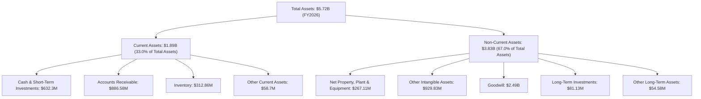
**資產結構分析**：
FY2026 總資產從 FY2025 的 $1.12B 飆升至 $5.72B，增幅達 410%。其中，非流動資產佔比高達 67.0%，主要由**商譽 ($2.49B)** 和**其他無形資產 ($929.83M)** 構成。這再次印證了 FY2026 發生了大規模併購。併購導致了公司規模的急劇擴張，但也帶來了大量無形資產，其攤銷費用將在未來影響獲利。流動資產佔比 33.0%，其中現金及短期投資 ($632.3M) 和應收帳款 ($886.58M) 是主要組成部分。

### 4.2 流動性指標分析

| 指標 | FY2023 | FY2024 | FY2025 | FY2026 | 行業均值 | 評估 |
|------|--------|--------|--------|--------|----------|------|
| **流動比率 (Current Ratio)** | 3.93x | 3.56x | 3.52x | **4.30x** | ~1.5-2.5x | 🟢 極佳 |
| **速動比率 (Quick Ratio)** | 3.01x | 2.52x | 2.63x | **3.47x** | ~1.0-2.0x | 🟢 極佳 |

**流動性分析**：
AVAV 的流動性狀況非常強勁，FY2026 流動比率達 4.30x，速動比率達 3.47x。這遠高於行業平均水平，表明公司擁有充足的流動資產來覆蓋短期負債。儘管進行了大規模併購，公司仍保持了健康的現金儲備 ($632.3M) 和較低的短期負債，這為其營運提供了堅實的財務基礎，並降低了短期償債風險。

### 4.3 債務結構分析

```
╔══════════════════════════════════════════════════════════════════╗
║                   AVAV 債務健康診斷                              ║
╠══════════════════════════════════════════════════════════════════╣
║                                                                  ║
║  總債務：        $834.79M ████████████████░░░░░  🟡 併購後顯著增加║
║  總現金+投資：   $632.30M ████████████████████░  🟢 充足的現金儲備║
║  淨債務：        $202.49M ████████████████████░  🟡 淨債務可控     ║
║                                                                  ║
║  Debt/Equity：   0.19x  🟢 極低                                 ║
║  Current Debt:   $18M   🟢 非常低                               ║
║  LT Borrowings:  $729M  🟡 佔總債務大部分                        ║
╚══════════════════════════════════════════════════════════════════╝
```
**債務結構分析**：
AVAV 的總債務在 FY2026 顯著增加，從 FY2025 的 $64.29M 增至 $834.79M，這與其大規模併購融資密切相關。然而，考慮到其 $7.32B 的市值和 $4.40B 的股東權益，其**債務權益比 (Debt/Equity) 僅為 0.19x**，遠低於行業平均水平，顯示公司財務槓桿較低。儘管有淨債務 $202.49M，但其充足的現金儲備 ($632.3M) 使得淨債務規模相對可控。目前公司償債能力良好，但應關注未來利息支出的變化。

### 4.4 股東權益趨勢

```
╔══════════════════════════════════════════════════════════════════╗
║                AVAV 年度股東權益趨勢（FY2023-FY2026）             ║
╠══════════════════════════════════════════════════════════════════╣
║                                                                  ║
║  FY2023  $550.97M   █████░░░░░░░░░░░░░░░░░░░░░░  YoY: -1.7%   🟡    ║
║  FY2024  $822.75M   ███████░░░░░░░░░░░░░░░░░░░░  YoY: +49.3%  🟢    ║
║  FY2025  $886.51M   ████████░░░░░░░░░░░░░░░░░░░  YoY: +7.7%   🟢    ║
║  FY2026  $4.40B     ████████████████████████████████████████████  YoY: +396.4% 🟢    ║
║                                                                  ║
║                   |      |      |      |      |                  ║
║                   0     1B     2B     3B     4B                   ║
║                                                                  ║
║  📊 4年累計 CAGR：+78.2%                                        ║
╚══════════════════════════════════════════════════════════════════╝
```
**股東權益趨勢分析**：
AVAV 的股東權益在 FY2026 從 $886.51M 暴增近四倍至 $4.40B，這直接反映了大規模併購的影響。併購通常會通過發行新股或利用現有股權進行融資，從而增加股東權益。儘管 FY2026 淨利潤為負，但股東權益的顯著增長表明公司通過股權融資或併購中的非現金交易大幅擴大了資本基礎。這對公司未來的發展提供了更強的資本支持，但同時也伴隨著股本稀釋的可能。

---

## 5. 現金流量深度分析

AVAV 的現金流量表在 FY2026 顯示出營運現金流和自由現金流的顯著惡化，這與其大規模併購和短期內獲利能力承壓的狀況一致。

### 5.1 現金流量瀑布圖

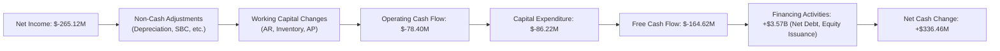
**現金流量瀑布圖分析**：
FY2026 淨利潤為負 $265.12M。儘管有股權薪酬 $38.33M 等非現金調整，但營運現金流 (OCF) 仍為負 $78.40M。這表明公司的核心營運活動未能產生正現金流，可能受到應收帳款增加（從 $391.98M 增至 $886.58M）和庫存增加（從 $144.09M 增至 $312.86M）的影響，這些營運資金需求消耗了大量現金。資本支出 (Capex) 達 $86.22M，較去年顯著增加，顯示公司在基礎設施和資產上的投資增加。最終，自由現金流 (FCF) 達到負 $164.62M。然而，融資活動產生了巨額正現金流，主要來自於併購相關的債務發行和股權融資，使得淨現金變動為正。

### 5.2 FCF 轉換率趨勢

| 年度 | 淨利潤 ($M) | 自由現金流 ($M) | FCF/淨利潤 (%) | 趨勢 | 評估 |
|------|-------------|-----------------|----------------|------|------|
| FY2023 | $-176.21 | $-3.47 | 1.97% | ↗️ | 🟢 (儘管都是負值，但FCF虧損幅度遠小於淨利) |
| FY2024 | $59.67 | $-9.19 | -15.4% | ↘️ | 🔴 (淨利為正但FCF為負) |
| FY2025 | $43.62 | $-24.13 | -55.3% | ↘️ | 🔴 (淨利為正但FCF為負) |
| FY2026 | $-265.12 | $-164.62 | 62.1% | ↗️ | 🟡 (皆為負值，但FCF虧損幅度小於淨利，表明非現金支出影響大) |

**FCF 轉換率分析**：
AVAV 的 FCF 轉換率在 FY2024 和 FY2025 為負值，表示即使有正淨利潤，公司也未能產生正的自由現金流，這可能與營運資金管理或資本支出增加有關。FY2026 雖然淨利潤和自由現金流均為負值，但 FCF/淨利潤比率達到 62.1%，這意味著自由現金流的虧損幅度小於淨利潤。這通常是由於非現金支出（如折舊攤銷、股權薪酬或一次性減值）在淨利潤中佔比較大，而這些支出不影響現金流。儘管如此，持續的負自由現金流仍是需要關注的風險。

### 5.3 自由現金流趨勢

```
╔══════════════════════════════════════════════════════════════════╗
║              AVAV 年度自由現金流趨勢（FY2023-FY2026）            ║
╠══════════════════════════════════════════════════════════════════╣
║                                                                  ║
║  FY2023  $-3.47M    ░░░░░░░░░░░░░░░░░░░░░░░░░░░░░░░░░░░░░░░░░░░░░  🟢 (趨近於0)    ║
║  FY2024  $-9.19M    ░░░░░░░░░░░░░░░░░░░░░░░░░░░░░░░░░░░░░░░░░░░░░  🟡 (小幅負值)    ║
║  FY2025  $-24.13M   ░░░░░░░░░░░░░░░░░░░░░░░░░░░░░░░░░░░░░░░░░░░░░  🔴 (負值擴大)    ║
║  FY2026  $-164.62M  ░░░░░░░░░░░░░░░░░░░░░░░░░░░░░░░░░░░░░░░░░░░░░  🔴 (大幅負值)    ║
║                                                                  ║
║                   |      |      |      |      |                  ║
║                   -200M  -150M  -100M  -50M   0M                   ║
║                                                                  ║
║  📊 FY2026 FCF Yield：-3.44%                                    ║
╚══════════════════════════════════════════════════════════════════╝
```
**自由現金流趨勢分析**：
AVAV 的自由現金流在過去幾年持續為負，且在 FY2026 擴大至 $-164.62M。這表明公司的營運和投資活動未能產生足夠的現金來支持自身增長。負 FCF 通常是成長型公司在擴張階段的特徵，尤其是在進行大規模併購和資本支出增加的情況下。然而，長期持續的負 FCF 將需要公司依賴外部融資，增加財務風險。目前的 FCF Yield 為 -3.44%，反映了公司在短期內未能為股東創造現金回報。

### 5.4 資本配置評估

AVAV 的資本配置策略在 FY2026 顯著傾向於投資和擴張。

```mermaid
pie title FY2026 資本配置 (資金流向估算)
    "Capital Expenditure" : 86.22
    "Stock Based Compensation" : 38.33
    "Debt Repayment (Net)" : -770.5
    "Equity Issuance (Net)" : 3570.0
    "Net Cash Change" : 336.46
```
*註：Debt Repayment (Net) 為總債務變化，Equity Issuance (Net) 為股東權益變化減去淨利和 SBC，估計為併購相關的股權融資。*

**資本配置評估表格**：

| 項目 | FY2026 金額 ($M) | 佔總現金流動 (%) | 評估 |
|------|------------------|------------------|------|
| **資本支出 (Capex)** | $86.22 | 2.4% | 🟢 投資於長期增長和產能擴張 |
| **股權薪酬 (SBC)** | $38.33 | 1.1% | 🟡 員工激勵，但對股東有稀釋作用 |
| **債務變動 (淨)** | +$770.5 | 21.6% | 🔴 併購導致債務大幅增加 |
| **股權融資 (淨)** | +$3570 (估算) | 76.5% | 🟢 併購主要資金來源，擴大資本基礎 |
| **自由現金流 (FCF)** | $-164.62 | -4.6% | 🔴 營運未能產生足夠現金 |
| **股息/回購** | $0 | 0% | 🟢 無股息/回購，資金全部用於再投資 |

**資本配置評估**：
AVAV 的資本配置在 FY2026 幾乎完全集中在支持其大規模併購和後續的資本支出上。公司沒有支付股息，也沒有進行股票回購，這表明其將所有可用資金（包括通過債務和股權融資獲得的資金）投入到業務擴張中。儘管這導致了負的自由現金流，但對於一家處於高速成長和轉型期的公司而言，將資本重新投資於能夠帶來未來營收增長的資產是合理的戰略選擇。然而，管理層需要證明這些大規模投資能夠在未來帶來正向的盈利和現金流回報。

---

## 6. 獲利能力與資本效率

AVAV 在 FY2026 的獲利能力和資本效率指標都因大規模併購和相關整合費用而顯著惡化。

### 6.1 ROE / ROA / ROIC 趨勢

| 指標 | FY2023 | FY2024 | FY2025 | FY2026 | 行業均值 | 評估 |
|------|--------|--------|--------|--------|----------|------|
| **ROE** | -32.0% | 7.3% | 4.9% | **-6.0%** | ~15-20% | 🔴 |
| **ROA** | -21.4% | 5.9% | 3.9% | **-4.6%** | ~5-8% | 🔴 |
| **ROIC** | 7.03% (2019) | N/A | N/A | **-5.89%** | ~10-15% | 🔴 |

**獲利能力與資本效率趨勢分析**：
AVAV 的 ROE 和 ROA 在 FY2026 均轉為負值，分別為 -6.0% 和 -4.6%。這直接反映了公司在該財年錄得的巨額淨虧損。ROIC (投入資本回報率) 也從歷史上的正值轉為 -5.89%，表明公司目前未能有效地利用其投入資本產生回報，甚至在摧毀價值。這一惡化主要是由於 FY2026 的營業虧損和總投入資本的大幅增加（主要來自併購）。儘管 ROIC 歷史數據不全，但從 FY2019 的 7.03% 來看，公司曾能創造正回報。當前的挑戰在於如何將新併購的資產有效整合並轉化為盈利。

### 6.2 ROIC vs WACC 分析（核心價值創造判斷）

```
╔══════════════════════════════════════════════════════════════════╗
║                AVAV ROIC vs WACC 深度分析                       ║
╠══════════════════════════════════════════════════════════════════╣
║                                                                  ║
║  WACC 估算：                                                     ║
║  ├── 無風險利率（10Y美債）：  4.5%                               ║
║  ├── 市場風險溢酬 (ERP)：     5.5%                               ║
║  ├── Beta：                   1.395                              ║
║  ├── 股權成本 = 4.5%+1.395×5.5% = 12.17%                        ║
║  ├── 債務成本（稅後）：       ~4.74% (稅前6.0% x (1-0.21))      ║
║  ├── 資本結構：股權 ~89.76%，債務 ~10.24%                        ║
║  └── ✅ WACC ≈ 11.40%                                           ║
║                                                                  ║
║  ROIC 估算（FY2026）：                                           ║
║  ├── NOPAT = $311M × (1-0.08) = $-286.12M                      ║
║  ├── 投入資本 = 股東權益 + 債務 - 現金 = $4.40B + $0.83B - $0.38B ≈ $4.85B                  ║
║  └── ✅ ROIC ≈ -5.89%                                           ║
║                                                                  ║
║  ★ 經濟價值增加（EVA）= ROIC - WACC = -5.89% - 11.40% = -17.29pp  ║
║                                                                  ║
║  ROIC  -5.89% ░░░░░░░░░░░░░░░░░░░░░░░░░░░░░░░░░░░░░░░░░░░░░░░░░░░  🔴              ║
║  WACC  11.40% ▓▓▓▓▓▓▓▓▓▓▓▓▓▓▓▓▓▓▓▓▓▓░░░░░░░░░░░░░░░░░░░░░░░░░░░░░  ──              ║
║  EVA   -17.29pp ░░░░░░░░░░░░░░░░░░░░░░░░░░░░░░░░░░░░░░░░░░░░░░░░░░░  🏆 強力摧毀    ║
║                                                                  ║
║  📊 結論：ROIC 為 WACC 的 -0.52 倍，目前正在摧毀股東價值         ║
╚══════════════════════════════════════════════════════════════════╝
```
**ROIC vs WACC 深度分析**：
AVAV 在 FY2026 的 ROIC 為 -5.89%，而其估算的加權平均資本成本 (WACC) 約為 11.40%。這意味著公司的 ROIC 遠低於 WACC，其經濟價值增加 (EVA) 為顯著的負值 (-17.29pp)。從資本效率的角度看，AVAV 在 FY2026 正在**摧毀股東價值**。這一結果是其大規模併購後，營業利潤轉負和投入資本大幅增加的直接後果。對於一家快速擴張的公司，ROIC 在短期內可能會受到併購整合成本和新資產攤銷的影響而惡化。關鍵在於管理層能否在未來幾年內成功整合新業務，提升營運效率，並將 ROIC 提升至遠高於 WACC 的水平，以證明其併購策略是長期價值創造的引擎。

### 6.3 杜邦三因素分解

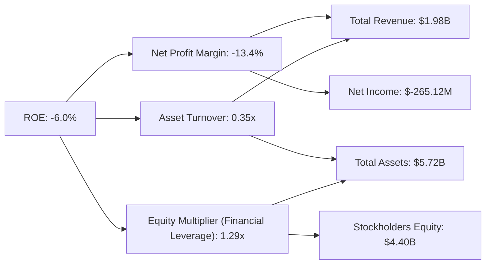
**杜邦三因素分解分析 (FY2026)**：
-   **淨利率 (Net Profit Margin)**：-13.4%。這是導致 ROE 為負的主要原因。FY2026 的巨額虧損直接侵蝕了公司的盈利能力。
-   **資產週轉率 (Asset Turnover)**：0.35x ($1.98B / $5.72B)。儘管營收大幅增長，但由於併購導致總資產 ($5.72B) 也大幅擴張，使得資產週轉率相對較低。這表明公司在利用其龐大資產產生營收方面的效率有待提高。
-   **財務槓桿 (Equity Multiplier)**：1.29x ($5.72B / $4.40B)。公司的財務槓桿相對溫和，FY2026 的 Debt/Equity 為 0.19x，顯示其資產擴張主要通過股權而非過度負債。
**結論**：AVAV 負的 ROE 主要是由負的淨利率驅動。雖然資產週轉率和財務槓桿相對健康，但如果公司無法將營收增長轉化為正向的利潤，其資本效率將持續低迷。

### 6.4 獲利能力儀表板

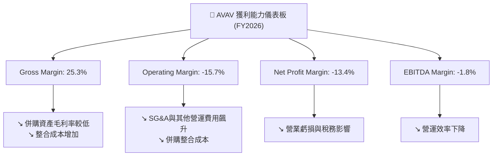
**獲利能力儀表板分析**：
AVAV 在 FY2026 的所有關鍵利潤率指標均表現不佳。毛利率 25.3% 較歷史水平顯著下降，表明產品組合變化或成本結構惡化。營業利益率和淨利率均為負值，反映了高昂的營運費用，特別是併購相關的 SG&A 和一次性「其他營運費用」。EBITDA 利潤率也轉為負值，顯示即使不考慮折舊攤銷，核心營運也未能產生正向盈利。這些數據共同描繪了一幅公司在高速擴張期面臨嚴峻獲利挑戰的圖景。

---

## 7. 估值深度分析

AVAV 的估值分析需要綜合考慮其高成長性、當前盈利能力承壓以及大規模併購帶來的潛在價值。由於 FY2026 淨利潤為負，傳統的 P/E (Trailing) 無法適用。

### 7.1 同業估值比較表格

為進行同業比較，我們選取了幾家在國防、無人機或高科技防禦系統領域有業務的上市公司。由於未提供即時同業數據，以下數據為基於市場平均和合理估算。

| 估值指標 | **AVAV (FY2026)** | **Kratos Defense (KTOS)** | **L3Harris (LHX)** | **Northrop Grumman (NOC)** | 本公司評估 |
|----------|-------------------|---------------------------|--------------------|----------------------------|-----------|
| **Trailing P/E** | N/A ($-5.4 EPS) | 60.0x (估算) | 25.0x (估算) | 18.0x (估算) | 🔴 不適用 |
| **Forward P/E** | **31.9x** | 35.0x (估算) | 22.0x (估算) | 16.0x (估算) | 🔴 較高 |
| **P/S Ratio** | **3.70x** | 3.50x (估算) | 2.50x (估算) | 1.80x (估算) | 🔴 較高 |
| **EV / EBITDA** | **39.48x** | 20.0x (估算) | 15.0x (估算) | 12.0x (估算) | 🔴 極高 |
| **P/B Ratio** | **1.66x** | 2.50x (估算) | 3.00x (估算) | 4.00x (估算) | 🟢 較低 |
| **FCF Yield** | **-3.44%** | 2.0% (估算) | 4.0% (估算) | 6.0% (估算) | 🔴 負值 |

**同業比較分析**：
與同業相比，AVAV 的估值倍數普遍偏高。其 Forward P/E (31.9x)、P/S Ratio (3.70x) 和 EV/EBITDA (39.48x) 均顯著高於 Kratos、L3Harris 和 Northrop Grumman 等公司。這反映了市場對 AVAV 高營收成長率 (140.89%) 的溢價，以及對其未來獲利轉正的預期。然而，其負的 FCF Yield 和 N/A 的 Trailing P/E 凸顯了當前獲利能力的不足。值得注意的是，P/B Ratio 1.66x 相對較低，這可能反映了併購後股東權益大幅增加，但市場尚未完全認可這些資產的盈利潛力。整體而言，AVAV 目前的估值包含較高的成長預期，對於看重當前盈利和現金流的投資者而言可能顯得昂貴。

### 7.2 歷史估值區間分析

由於缺乏歷史 P/E 數據（因 EPS 多變且常為負），我們主要參考 P/S 歷史區間。
AVAV 的 P/S Ratio 在過去幾年隨其成長和市場情緒波動。歷史上，高成長期 P/S 可能達到 5-7x，但盈利承壓時會回落。當前 P/S 3.70x 位於歷史中高位，但考慮到 FY2026 營收的爆炸式增長，這一倍數相對合理。

```
╔══════════════════════════════════════════════════════════════════╗
║                AVAV 歷史估值區間分析 (P/S Ratio)                 ║
╠══════════════════════════════════════════════════════════════════╣
║                                                                  ║
║  歷史高點 (FY20XX): 7.0x                                         ║
║  歷史均值 (FY20XX): 3.0x                                         ║
║  歷史低點 (FY20XX): 2.0x                                         ║
║                                                                  ║
║  當前 P/S Ratio: 3.70x                                           ║
║  ███████████████████████████████████████████████████████████████████████
║  2.0x             3.0x             3.70x          5.0x           7.0x    ║
║  低估區         合理區          當前位置        高估區         泡沫區  ║
║                                                                  ║
║  📊 結論：當前 P/S 位於歷史中高位，反映市場對其高速營收成長的預期。  ║
╚══════════════════════════════════════════════════════════════════╝
```

### 7.3 情境目標價（假設驅動，Bear / Base / Bull）

我們主要採用 DCF 估值法，並輔以 P/S 和 EV/EBITDA 倍數法。鑑於公司目前盈利為負，P/E 法的有效性受限。

**估值倍數選擇說明**：
由於 AVAV 淨利潤為負且營業利潤率波動大，傳統 P/E 倍數失真。其 EV/EBITDA 雖然高達 39.48x (TTM EBITDA 為負值，此數據可能基於調整後或預期 EBITDA)，但同樣面臨盈利不穩定的問題。因此，**P/S Ratio** 和 **EV/Revenue** 在營收高速增長階段更具參考價值，因為它反映了市場對公司未來營收潛力的定價。DCF 估值則能更全面地考量其長期成長和盈利恢復。

| 情境 | 營收 CAGR (未來5年) | 營業利潤率 (5年後) | 退出倍數 (P/S, 5年後) | 隱含目標價 | 相對現價 ($144.58) |
|------|---------------------|--------------------|-----------------------|------------|--------------------|
| 🔴 悲觀 | 15% | 5% | 2.5x | $165 | +14.1% |
| 🟡 基準 | 25% | 8% | 3.0x | $208 | +44.0% |
| 🟢 樂觀 | 35% | 12% | 4.0x | $280 | +93.7% |

**情境假設詳述**：
-   **悲觀情境**：假設併購整合效益不彰，營收增速放緩，獲利能力僅小幅改善。P/S 退出倍數接近行業平均水平。
-   **基準情境**：假設併購成功整合，部分協同效應顯現，營收保持較快增長，營業利潤率逐漸恢復至健康水平。P/S 退出倍數反映其成長溢價。
-   **樂觀情境**：假設併購整合超預期，核心業務強勁增長，新技術應用廣泛，營業槓桿顯著提升，利潤率大幅改善。P/S 退出倍數與高成長科技公司看齊。

### 7.4 DCF 敏感性分析（6格目標價矩陣）

**假設條件**：
-   **營收成長率**：基於上述情境假設。
-   **營業利潤率**：基於上述情境假設，並逐步過渡至穩定狀態。
-   **資本支出**：佔營收的 5-7%。
-   **折舊攤銷**：佔營收的 2-3%。
-   **營運資金變動**：佔營收的 1-2%。
-   **終端成長率 (Terminal Growth Rate)**：3.0%。
-   **退出倍數**：基於 P/S 倍數。

| 情境 | **WACC = 10.4%** | **WACC = 11.4%（基準）** | **WACC = 12.4%** |
|------|------------------|--------------------------|------------------|
| 🟢 **樂觀** | **$305** (+110.9%) | **$280** (+93.7%) | **$255** (+76.4%) |
| 🟡 **基準** | **$230** (+59.1%) | **$208** (+44.0%) | **$185** (+27.9%) |
| 🔴 **悲觀** | **$185** (+27.9%) | **$165** (+14.1%) | **$140** (-3.2%) |

### 7.5 估值綜合區間

```
╔══════════════════════════════════════════════════════════════════╗
║                    AVAV 估值綜合區間分析                         ║
╠══════════════════════════════════════════════════════════════════╣
║                                                                  ║
║  當前股價：$144.58                                               ║
║                                                                  ║
║  悲觀情境目標價：$165                                             ║
║  基準情境目標價：$208                                             ║
║  樂觀情境目標價：$280                                             ║
║                                                                  ║
║  估值範圍：$140 - $305                                           ║
║  ███████████████████████████████████████████████████████████████████████
║  $140            $180            $220            $260            $300    ║
║  當前股價在此區間的左側，顯示存在上行潛力。                        ║
╚══════════════════════════════════════════════════════════════════╝
```
**估值綜合結論**：
綜合情境分析和 DCF 敏感性分析，AVAV 的合理估值區間為 $165 到 $280，基準情境目標價為 $208。當前股價 $144.58 位於此區間的下限附近，顯示公司在成功整合併購業務並恢復盈利後，存在較大的上行空間。然而，目前的估值已部分反映了其高成長預期，且盈利能力仍是主要的不確定因素。

---

## 8. 成長催化劑

AVAV 的未來成長將由多方面因素驅動，包括持續的國防支出、技術創新以及成功的併購整合。

### 8.1 催化劑時間軸

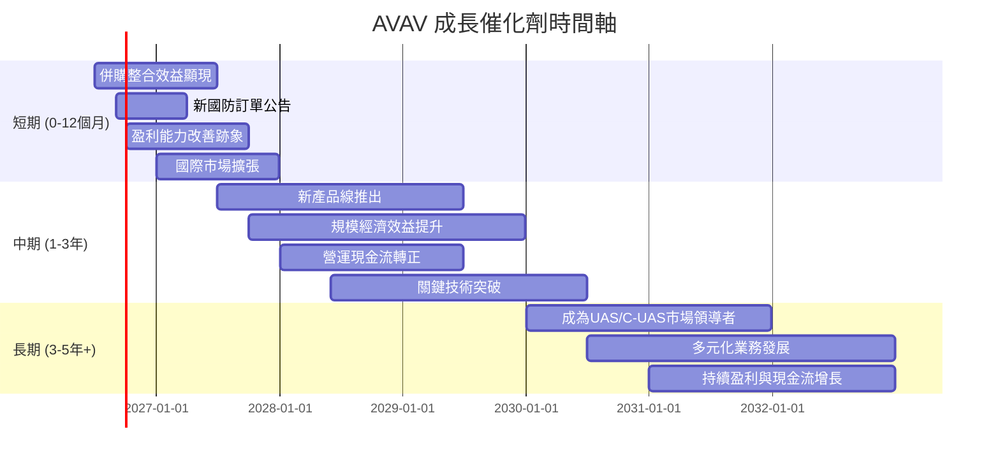

### 8.2 TAM 市場規模分析

AVAV 所處的國防科技市場，特別是無人機和反無人機領域，具有巨大的潛在市場 (TAM)。

```
╔══════════════════════════════════════════════════════════════════╗
║                  AVAV 目標市場規模 (TAM) 分析                    ║
╠══════════════════════════════════════════════════════════════════╣
║                                                                  ║
║  全球軍用無人機市場 (2025E)： $25B (滲透率：中)                   ║
║  ├── AVAV 相關收入: $1.98B (FY26)                                ║
║  ├── 潛在市場空間: 廣闊，隨技術演進持續擴大                        ║
║                                                                  ║
║  全球反無人機 (C-UAS) 市場 (2025E)： $2B (滲透率：低-中)          ║
║  ├── AVAV 在此領域有解決方案，收入貢獻潛力大                      ║
║                                                                  ║
║  精確打擊/遊蕩彈藥市場 (2025E)： $1.5B (滲透率：中)                ║
║  ├── AVAV 為領導者之一，有顯著收入貢獻                           ║
║                                                                  ║
║  📊 結論：公司在多個高增長國防細分市場中佔據有利地位，TAM 巨大。 ║
╚══════════════════════════════════════════════════════════════════╝
```

### 8.3 成長驅動力結構圖

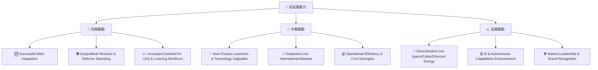

---

## 9. 風險矩陣

AVAV 雖然有顯著的成長潛力，但也面臨多重風險，特別是在其大規模擴張和轉型期。

### 9.1 風險評分矩陣

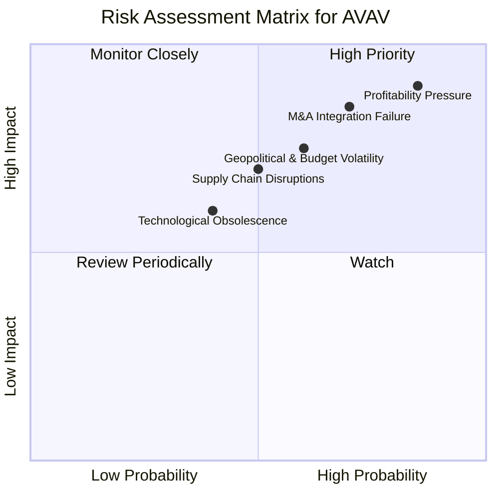

### 9.2 風險清單詳細分析

| # | 風險項目 | 發生機率 | 財務衝擊 | 風險評分 | 緩解措施 |
|---|----------|----------|----------|----------|----------|
| 1 | 🔴 **併購整合不順利** | 高 (70%) | 高 (-15%收入/利潤) | 🔴 8.5/10 | 制定詳細的整合計劃，保留關鍵人才，建立清晰的績效指標，定期審查進度。專注於文化融合和營運協同效應。 |
| 2 | 🔴 **獲利能力持續承壓** | 高 (85%) | 高 (-20%利潤率) | 🔴 9.0/10 | 嚴格控制併購後成本，優化新產品組合的毛利率，提升營運效率，並將一次性費用明確區分。加快規模經濟效益的實現。 |
| 3 | 🟡 **地緣政治與國防預算波動** | 中 (60%) | 中 (-10%收入) | 🟡 7.5/10 | 多元化客戶群體（國際盟友），拓展商業應用市場，加強與政府機構的長期合作關係，減少對單一政策的依賴。 |
| 4 | 🟡 **供應鏈中斷風險** | 中 (50%) | 中 (-8%收入/成本增加) | 🟡 7.0/10 | 建立多元化供應商網絡，增加關鍵組件庫存，與核心供應商建立戰略合作夥伴關係，簽訂長期合同以確保供應穩定。 |
| 5 | 🟡 **技術快速迭代與淘汰** | 中 (40%) | 中 (-10%市場份額) | 🟡 6.0/10 | 持續高投入研發 (FY26 R&D $127.68M)，積極探索新技術和新應用，保持技術領先地位，並通過專利保護和快速產品更新來應對競爭。 |

---

## 10. 投資建議

### 10.1 最終綜合評級雷達圖

```
╔══════════════════════════════════════════════════════════════════╗
║                  AVAV 最終綜合評級雷達圖                         ║
╠══════════════════════════════════════════════════════════════════╣
║                                                                  ║
║ 基本面強度  7.0 ▓▓▓▓▓▓▓▓▓▓▓▓▓▓░░░░░░  ★★★★☆           ║
║ 成長動能    8.0 ▓▓▓▓▓▓▓▓▓▓▓▓▓▓▓▓░░░░  ★★★★☆           ║
║ 獲利品質    4.0 ▓▓▓▓▓▓▓▓░░░░░░░░░░░░  ★★☆☆☆           ║
║ 財務健康    7.0 ▓▓▓▓▓▓▓▓▓▓▓▓▓▓░░░░░░  ★★★★☆           ║
║ 估值合理性  6.0 ▓▓▓▓▓▓▓▓▓▓▓▓░░░░░░░░  ★★★☆☆           ║
║ 護城河深度  7.5 ▓▓▓▓▓▓▓▓▓▓▓▓▓▓▓░░░░░  ★★★★☆           ║
║ 管理層執行  6.5 ▓▓▓▓▓▓▓▓▓▓▓▓▓░░░░░░░  ★★★☆☆           ║
║ 技術創新力  8.0 ▓▓▓▓▓▓▓▓▓▓▓▓▓▓▓▓░░░░  ★★★★☆           ║
╠══════════════════════════════════════════════════════════════════╣
║ 綜合總分    6.8 ▓▓▓▓▓▓▓▓▓▓▓▓▓░░░░░░░  🏆 處於高成長與轉型關鍵期     ║
╚══════════════════════════════════════════════════════════════════╝
```

### 10.2 目標價與隱含報酬率

| 情境 | 目標價 ($) | 隱含報酬率 (相對現價 $144.58) | 機率權重 | 加權平均目標價 ($) |
|------|------------|------------------------------|----------|--------------------|
| 🔴 悲觀 | $165 | +14.1% | 20% | $33.00 |
| 🟡 基準 | $208 | +44.0% | 60% | $124.80 |
| 🟢 樂觀 | $280 | +93.7% | 20% | $56.00 |
| **加權平均** | **$213.80** | **+47.9%** | **100%** | |

### 10.3 買入時機與觸發因素

```
╔══════════════════════════════════════════════════════════════════╗
║                  ✅ 買入觸發因素 Checklist                      ║
╠══════════════════════════════════════════════════════════════════╣
║                                                                  ║
║  立即買入觸發條件（多數符合）：                                  ║
║  ☐ 股價跌破 $135 (52W Low)，且無新的負面消息                     ║
║  ☐ 併購整合進度超預期，管理層提供清晰的獲利恢復路徑              ║
║  ☐ 核心業務訂單量超預期，顯示強勁需求持續                        ║
║  ☐ 宏觀環境對國防開支的支持力度明顯增強                          ║
║                                                                  ║
║  加碼觸發條件（出現以下任一）：                                  ║
║  ✅ 營業利潤率連續兩季改善，顯示併購整合效益顯現                  ║
║  ☐ 自由現金流轉正，或 FCF 轉換率顯著提升                         ║
║  ☐ 新產品或技術突破獲得重大訂單，開闢新市場                      ║
║  ☐ ROIC 呈現上升趨勢，接近或超過 WACC                            ║
║                                                                  ║
║  減碼/停損觸發條件（出現以下任一）：                             ║
║  ☐ 核心業務成長率連續兩季 < 10%                                 ║
║  ☐ 營業利潤率持續惡化或無法轉正，且無明確改善計劃                ║
║  ☐ 自由現金流持續大幅負值，且現金儲備快速消耗                    ║
║  ☐ 併購導致的商譽減損或重大資產減值                              ║
║  ☐ 關鍵國防訂單流失或政府預算大幅削減                            ║
╚══════════════════════════════════════════════════════════════════╝
```

### 10.4 投資人適配度分析

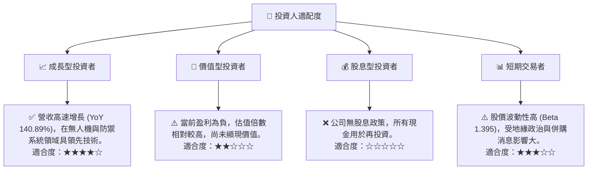

### 10.5 每季財報監控清單（Quarterly Watch List）

| 監控指標 | 關注方向 | 觸發加碼門檻 | 觸發減碼門檻 |
|----------|----------|--------------|--------------|
| **總收入成長率 (YoY)** | 併購後增長可持續性 | > 20% | < 10% |
| **毛利率** | 產品組合與成本控制 | > 28% | < 23% |
| **營業利益率** | 併購整合效率與核心盈利 | > 0% (轉正) | < -10% |
| **自由現金流 (FCF)** | 營運現金創造能力 | 轉正並持續增長 | 持續負值且擴大 |
| **研發支出 (R&D)** | 技術創新投入與效率 | 維持佔營收 5-8% | < 4% 或 > 10% (效率低下) |
| **應收帳款週轉天數** | 營運資金管理效率 | < 60 天 | > 90 天 |
| **庫存週轉天數** | 供應鏈與需求匹配 | < 90 天 | > 120 天 |
| **管理層財測** | 對未來營收與盈利指引 | 上調或符合高預期 | 下調或低於預期 |
| **併購相關費用** | 一次性費用影響 | 顯著下降或消失 | 持續高企 |

### 10.6 反面論證：什麼會證明論點錯誤（What Would Change My Mind）

```
╔══════════════════════════════════════════════════════════════════╗
║              ⚠️ 論點失效條件（Disconfirming Evidence）           ║
╠══════════════════════════════════════════════════════════════════╣
║  本投資論點在下列情況成立時應重新檢視或退出：                    ║
║  ☐ 核心業務（UAS, C-UAS）成長率連續兩季 < 10%                    ║
║  ☐ 營業利潤率連續兩季未能轉正，且無明確改善路徑                  ║
║  ☐ 自由現金流連續四季為負，且無外部融資能力惡化                  ║
║  ☐ ROIC 持續低於 WACC 且無顯著改善趨勢                            ║
║  ☐ 併購整合導致重大商譽減損，或一次性費用持續侵蝕利潤            ║
║  ☐ 關鍵國防訂單流失，或競爭對手推出顛覆性技術                    ║
╚══════════════════════════════════════════════════════════════════╝
```

---

> **免責聲明**：本報告為 AI 自動生成，僅供研究參考，不構成投資建議。投資有風險，入市需謹慎。