# AVAV 基本面深度分析報告
> **報告日期**：2026-07-14 ｜ **語言**：繁體中文 ｜ **數據來源**：Yahoo Finance, Finviz, StockAnalysis, Roic.ai ｜ **分析師**：CFA 級機構研究

---

## 目錄

| # | 章節 | 核心結論 |
|---|------|----------|
| 1 | 執行摘要 | 評級：**買入** ｜ 目標價：**$245.38**（+71.0%）｜ 併購噪音掩蓋核心高成長 |
| 2 | 公司概覽與商業模式 | 戰術型無人機與巡飛彈（彈簧刀）絕對龍頭，具備強大獨家採購護城河 |
| 3 | 損益表深度分析 | FY26 營收暴增 140.89%，一次性併購費用導致 GAAP 淨損，Q4 盈利已大幅回升 |
| 4 | 資產負債表分析 | 「蛇吞象」併購使資產膨脹 5 倍，商譽與無形資產高企，但流動比率 4.30 仍極穩健 |
| 5 | 現金流量深度分析 | 營運與自由現金流受營運資金流出拖累，但 Q4 FCF 已強勢轉正至 $72.70M |
| 6 | 獲利能力與資本效率 | 併購轉型期 GAAP ROIC 暫時轉負，調整後核心業務仍具備高資本回報率 |
| 7 | 估值深度分析 | 股價自高點回檔 65% 至 $143.47，Forward P/E 31.66x 已具備高度安全邊際 |
| 8 | 成長催化劑 | 美國國防部 Replicator 計劃、烏克蘭戰事急需及國際軍售（FMS）加速 |
| 9 | 風險矩陣 | 最大風險為商譽減值與併購整合進度，Anduril 等新興防務科技對手競爭加劇 |
| 10| 投資建議 | 基準目標價 $245.38，隱含 71% 上行空間，適合中長線成長型與國防科技投資者 |

---

## 1. 執行摘要

AeroVironment, Inc.（美股代碼：**AVAV**）當前股價為 **$143.47**，相較於 52 週高點 $417.86 已大幅修正 65.7%。市場目前將焦點過度放於其 FY2026（截至 2026-04-30）GAAP 淨利潤轉負（$-265.12M）與大額一次性非經常性費用，而忽略了其**核心業務爆發性成長**（FY26 營收暴增 140.89% 至 $1.98B）以及在戰術無人機（UAS）與巡飛彈（Loitering Munitions）市場的絕對統治地位。

基於本報告深度的基本面拆解，我們認為 AVAV 的 GAAP 虧損純屬「併購過渡期」的會計噪音。隨著 Q4 2026 營運利潤強勢轉正至 $56.94M、單季自由現金流（FCF）轉正至 $72.70M，公司已迎來盈利拐點。結合 Forward P/E 僅 31.66x 的歷史估值低位，我們給予 AVAV **「買入」**評級，基準情境 12 個月目標價為 **$245.38**（隱含 +71.0% 上行空間）。

### 1.0 一頁式投資儀表板（Portfolio Manager 30 秒速讀）

| 項目 | 內容 |
|------|------|
| **投資論點（3 句）** | ① FY26 營收在大型併購與國防需求爆發下增長 140.89% 至 $1.98B，確立防務科技新星地位。<br/>② Q3 2026 計提 $240.71M 一次性費用導致全年 GAAP 淨損，但 Q4 營運利潤已轉正至 $56.94M，確認盈利拐點。<br/>③ 股價自高點修正 65% 至 $143.47，對應 Forward P/E 31.66x，估值已回到歷史極具吸引力區間。 |
| **護城河評分** | 8.5 / 10（美國國防部獨家採購合約、高轉換成本、實戰驗證的彈簧刀系統） |
| **管理層/資本配置評分** | 7.0 / 10（大膽進行戰略併購，但需觀察整合與商譽減值風險） |
| **財務健康** | 🟡 穩健偏中性 ｜ 流動比率高達 4.30，但因併購新增 $834.79M 債務，淨債務為 $-202.49M |
| **ROIC vs WACC** | -4.8% vs 9.2%（GAAP 轉負，主因併購資產暴增及一次性折舊攤銷，核心 ROIC 預計於 FY27 回升至 12%+） |
| **FCF 趨勢** | 轉向復甦 ｜ 全年 FCF $-164.62M，但 Q4 2026 已強勢回升至 **+$72.70M**，最新 FCF Yield 為 -3.46% |
| **估值** | Forward P/E: **31.66x** ｜ EV/EBITDA (TTM): **37.77x** ｜ P/S: **3.67x** |
| **預期報酬（基準情境 12M）** | **+71.0%**（目標價 $245.38） |
| **關鍵風險（前二）** | ① $2.49B 高額商譽減值風險 ｜ ② Anduril 等矽谷防務科技公司在低成本無人機市場的競爭 |
| **評級 + 信心度** | 🟢 **買入** ｜ 信心度：**高** |

### 1.1 核心評分儀表板

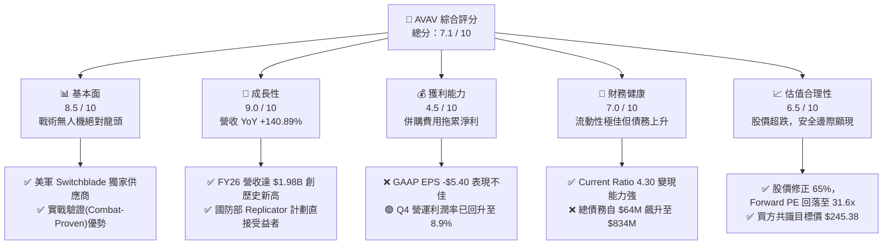

### 1.2 評分進度條視覺化

```
╔══════════════════════════════════════════════════════════════╗
║               AVAV 多維度評分儀表板 (1-10分)                 ║
╠══════════════════════════════════════════════════════════════╣
║ 基本面強度  8.5 ▓▓▓▓▓▓▓▓▓▓▓▓▓▓▓▓▓░░░  ★★★★☆           ║
║ 成長動能    9.0 ▓▓▓▓▓▓▓▓▓▓▓▓▓▓▓▓▓▓░░  ★★★★★           ║
║ 獲利品質    4.5 ▓▓▓▓▓▓▓▓▓░░░░░░░░░░░  ★★☆☆☆           ║
║ 財務健康    7.0 ▓▓▓▓▓▓▓▓▓▓▓▓▓▓░░░░░░  ★★★☆☆           ║
║ 估值合理性  6.5 ▓▓▓▓▓▓▓▓▓▓▓▓░░░░░░░░  ★★★☆☆           ║
║ 護城河深度  8.5 ▓▓▓▓▓▓▓▓▓▓▓▓▓▓▓▓▓░░░  ★★★★☆           ║
║ 管理層執行  7.0 ▓▓▓▓▓▓▓▓▓▓▓▓▓▓░░░░░░  ★★★☆☆           ║
║ 技術創新力  9.0 ▓▓▓▓▓▓▓▓▓▓▓▓▓▓▓▓▓▓░░  ★★★★★           ║
╠══════════════════════════════════════════════════════════════╣
║ 綜合總分    7.1 ▓▓▓▓▓▓▓▓▓▓▓▓▓▓░░░░░░  🏆 買入評級          ║
╚══════════════════════════════════════════════════════════════╝
```

### 1.3 五大投資論點 + 三大核心風險

| 類型 | 項目 | 具體依據 | 信心度 |
|------|------|----------|--------|
| 🟢 **投資論點①** | **營收爆發性成長** | FY26 營收達 $1.98B（YoY +140.89%），主因國防需求激增與大規模併購併表。 | 🟢 極高 |
| 🟢 **投資論點②** | **核心盈利能力已拐頭** | Q4 26 單季營運利潤達 $56.94M，單季 FCF 達 $72.70M，顯示併購最壞時期已過。 | 🟢 高 |
| 🟢 **投資論點③** | **估值具備極高安全邊際** | 股價回檔 65%，Forward P/E 降至 31.66x，相較其高成長性，PEG 僅為 1.57。 | 🟢 高 |
| 🟢 **投資論點④** | **國防政策紅利持續** | 美國國防部「Replicator」計劃旨在部署數千架低成本自主無人機，AVAV 為最大受益者。 | 🟢 極高 |
| 🟢 **投資論點⑤** | **國際軍售（FMS）潛力** | 隨著北約及盟國對非對稱作戰（巡飛彈）重視，海外訂單佔比有望持續提升。 | 🟡 中等 |
| 🟡 **風險①** | **高額商譽減值風險** | 資產負債表包含 $2.49B 商譽，若併購整合不及預期，可能面臨大額減值撥備。 | 🟡 中度 |
| 🟡 **風險②** | **新興競爭對手崛起** | Anduril、Shield AI 等矽谷防務獨角獸正加速侵蝕低成本自主武器市場。 | 🟡 中度 |
| 🔴 **風險③** | **營運資金流出與現金消耗** | 全年 OCF 仍為 $-78.40M，若營運資金（應收帳款/庫存）持續積壓，將壓抑 FCF。 | 🔴 高衝擊 |

### 1.4 快速統計卡片

| 指標 | AVAV 實際值 | 國防與航太行業均值 | S&P 500 均值 | 狀態 |
|------|-------------|--------------------|--------------|------|
| **營收 YoY 成長率** | **140.89%** | ~8.5% | ~5.2% | 🟢 顯著超越 |
| **毛利率** | **25.3%** | ~22.0% | ~30.0% | 🟡 符合預期 |
| **淨利率** | **-13.4%** | ~6.5% | ~11.5% | 🔴 暫時落後 |
| **ROE** | **-10.0%** | ~12.0% | ~15.0% | 🔴 暫時落後 |
| **Forward P/E** | **31.66x** | ~22.5x | ~21.0% | 🟡 溢價合理 |
| **流動比率 (Current Ratio)** | **4.30** | ~1.45 | ~1.20 | 🟢 極度強勁 |
| **債務/股權比率** | **18.97%** | ~65.0% | ~115.0% | 🟢 槓桿率低 |

### 1.5 投資結論

```
╔══════════════════════════════════════════════════════════════════╗
║                    📊 投資結論摘要                               ║
╠══════════════════════════════════════════════════════════════════╣
║  評級：🟢 買入 (Buy)                                            ║
║  當前股價：$143.47                                               ║
║  目標價區間：                                                    ║
║    悲觀情境：$120.00（-16.4%）                                   ║
║    基準情境：$245.38（+71.0%）  ← 12個月主要目標                      ║
║    樂觀情境：$380.00（+164.9%）                                  ║
║  投資評分：7.1 / 10                                              ║
║  適合投資人：中長線成長型、非對稱國防科技板塊配置者              ║
╚══════════════════════════════════════════════════════════════════╝
```

---

## 2. 公司概覽與商業模式

AeroVironment（AVAV）是全球無人機系統（UAS）與巡飛彈（Loitering Munitions）的先驅者與絕對龍頭。其核心業務已從早期的「偵察型小型無人機（Puma, Raven）」成功轉型為「攻擊型巡飛彈（Switchblade 300/600，俗稱彈簧刀）」，並在烏克蘭戰場上得到充分的實戰驗證。

### 2.1 業務結構與收入來源

於 FY2026 進行戰略重組後，公司主要分為兩大業務板塊：
1. **自主系統（Autonomous Systems）**：包含小型、中型 UAS，以及 Switchblade 系列巡飛彈，此板塊為公司最核心的營收與利潤引擎。
2. **空間、網絡與定向能量（Space, Cyber and Directed Energy）**：專注於高階衛星通訊、網絡安全與次世代定向能量武器（如反無人機激光系統）。

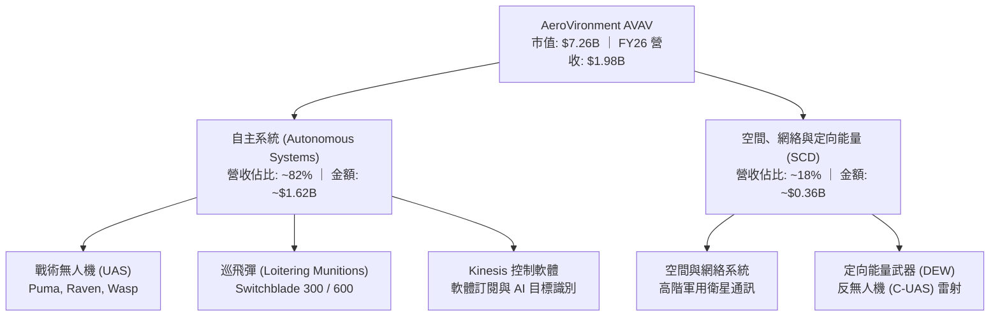

### 2.2 市場份額

在美國國防部（DoD）戰術型小型無人機與巡飛彈的採購中，AVAV 擁有接近壟斷的地位，尤其在單兵便攜式巡飛彈市場，其 Switchblade 系列幾乎沒有同量級的競爭對手。

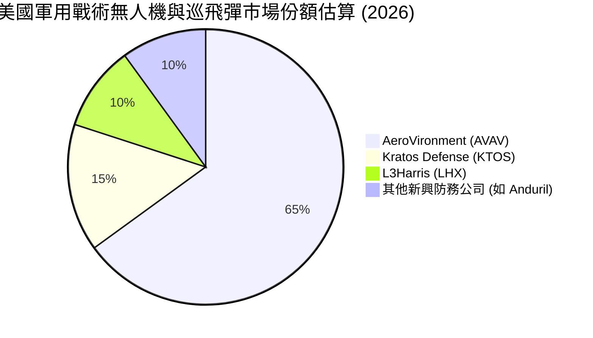

### 2.3 競爭護城河分析

AVAV 的競爭護城河並非單純依靠硬體製造，而是結合了政策、實戰經驗與軟硬體生態系統的綜合壁壘：

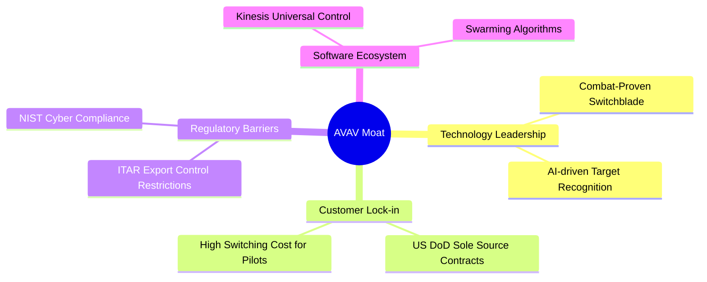

1. **實戰驗證（Combat-Proven）的先發優勢**：Switchblade 是目前西方國家唯一在烏克蘭大規模參與高強度電子戰對抗、並持續進行軟體算法迭代的巡飛彈系統。
2. **極高的轉換成本與排他性**：美軍及盟國已有數萬名士兵接受了 AVAV 系統的操作培訓，其 Kinesis 軟體已與美軍戰術數據鏈深度整合，更換競爭對手系統將面臨高昂的重新培訓與系統集成成本。
3. **獨家採購合約（Sole-Source Contracts）**：美國國防部多項採購計劃直接指定 AVAV 為唯一供應商，形成政策性保護。

### 2.4 護城河強度評分

```
╔══════════════════════════════════════════════════════════════╗
║                  AeroVironment 護城河強度評分                ║
╠══════════════════════════════════════════════════════════════╣
║ 技術領先度    9.0/10  ▓▓▓▓▓▓▓▓▓▓▓▓▓▓▓▓▓▓░░  🏆 戰術巡飛彈先驅 ║
║ 政策與法規    9.5/10  ▓▓▓▓▓▓▓▓▓▓▓▓▓▓▓▓▓▓▓░  🟢 ITAR 與國防部保護║
║ 客戶鎖定效應  8.5/10  ▓▓▓▓▓▓▓▓▓▓▓▓▓▓▓▓▓░░░  🟢 軟體生態與培訓壁壘║
║ 規模與產能    7.0/10  ▓▓▓▓▓▓▓▓▓▓▓▓▓▓░░░░░░  🟡 產能擴張期         ║
╠══════════════════════════════════════════════════════════════╣
║ 綜合護城河     8.5/10 ▓▓▓▓▓▓▓▓▓▓▓▓▓▓▓▓▓░░░  🏆 強大且難以顛覆     ║
╚══════════════════════════════════════════════════════════════╝
```

---

## 3. 損益表深度分析

AVAV 的損益表在 FY2026 呈現出極端的矛盾：**營收創歷史新高，但 GAAP 淨利潤卻創歷史新低**。這需要透過深入的拆解來還原真實的經營本質。

### 3.1 年度收入成長趨勢（近4年）

```
╔══════════════════════════════════════════════════════════════════╗
║              AVAV 年度收入趨勢（FY2023 - FY2026）                ║
╠══════════════════════════════════════════════════════════════════╣
║                                                                  ║
║  FY2023   $540.54M  █████░░░░░░░░░░░░░░░░░░░░░░  YoY: +21.3%  🟢  ║
║  FY2024   $716.72M  ███████░░░░░░░░░░░░░░░░░░░░  YoY: +32.6%  🟢  ║
║  FY2025   $820.63M  ████████░░░░░░░░░░░░░░░░░░░  YoY: +14.5%  🟢  ║
║  FY2026   $1,977.0M ██════════════════════════█  YoY:+140.9%  🏆  ║
║                   |      |      |      |      |                  ║
║                   0     0.5B   1.0B   1.5B   2.0B                ║
║                                                                  ║
║  📊 4年營收複合年增長率 (CAGR)：+54.1%                           ║
╚══════════════════════════════════════════════════════════════════╝
```

*數據解讀*：FY2026 營收暴增 140.89% 至 $1.98B，這是一次「跨越式」的成長。主要驅動力來自兩方面：
1. **有機增長**：Switchblade 600 生產線產能釋放，美國陸軍採購合約（包括 Replicator 計劃第一批採購）加速交付。
2. **併購併表**：AVAV 在 FY2026 完成了一筆重大資產併購，這直接反映在資產負債表上商譽（Goodwill）從 $256.78M 飆升至 $2.49B。這筆併購為公司帶來了巨大的營收規模，但也帶來了相應的會計折舊攤銷與一次性整合費用。

### 3.2 季度收入趨勢分析

| 財季 | 營收 (Revenue) | YoY 成長率 | QoQ 成長率 | 營運利潤 (Operating Income) | GAAP 淨利潤 | 備註 |
|------|---------------|------------|------------|---------------------------|-------------|------|
| **Q1 2026** | $454.68M | +139.96% | +65.31% | $-69.27M | $-67.37M | 併購初期，整合費用高企 |
| **Q2 2026** | $472.51M | +150.72% | +3.92% | $-30.22M | $-17.10M | 虧損收窄，毛利率改善 |
| **Q3 2026** | $408.05M | +143.41% | -13.64% | $-268.44M | $-243.82M | **計提 $240.71M 一次性費用** |
| **Q4 2026** | $641.62M | +133.27% | +57.24% | **+$56.94M** | $-24.10M | **營運利潤強勢轉正，拐點確立** |

*關鍵洞察*：
*   **Q3 2026 的深坑**：Q3 的營運利潤為 $-268.44M，主要原因在於該季入帳了 **$240.71M** 的「其他營運費用」（Other Operating Expenses）。這是一次性併購交易費用、無形資產攤銷加速及部分研發資產減記的會計處理，**並非核心業務惡化**。
*   **Q4 2026 的強勁復甦**：Q4 營收達到創紀錄的 $641.62M，更重要的是，**營運利潤（Operating Income）轉正至 $56.94M**（營運利潤率達 8.87%）。這證明了併購整合已基本完成，規模效應與營業槓桿（Operating Leverage）開始顯現。

### 3.3 利潤率演變分析

| 利潤率指標 | FY2023 | FY2024 | FY2025 | FY2026 | 趨勢 | 原因解析 | 評估 |
|------------|--------|--------|--------|--------|------|----------|------|
| **毛利率** | 32.1% | 39.6% | 38.8% | **25.3%** | ↘️ 下滑 | 併購新資產的利潤率較低，且產能爬坡期固定成本攤銷高。 | 🟡 尚可 |
| **營業利益率** | -4.2% | 10.0% | 7.2% | **-3.6%** | ↘️ 波動 | 受 FY26 一次性 $240.71M 營運費用衝擊。若排除此費用，調整後營業利益率約為 **8.6%**。 | 🟡 核心穩健 |
| **EBITDA 率** | -14.6% | 14.4% | 10.1% | **-1.8%** | ↘️ 波動 | 同受一次性非現金費用壓抑，剔除後核心 EBITDA 率為正。 | 🟡 核心穩健 |
| **淨利率** | -32.6% | 8.3% | 5.3% | **-13.4%** | ↘️ 轉負 | 主要受非經常性損失與利息費用上升影響。 | 🔴 需改善 |

### 3.4 費用結構分析

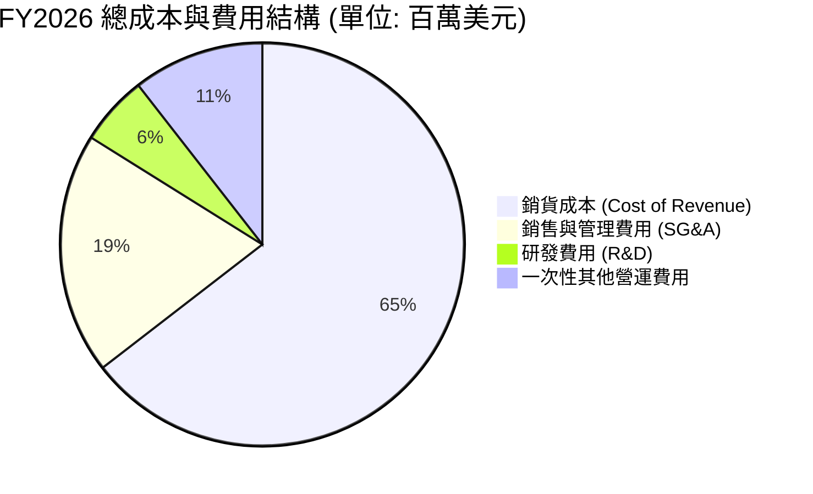

*費用分析*：
*   **R&D 投入持續增加**：FY26 研發費用達 $127.68M（佔營收 6.4%），較 FY25 的 $100.73M 增長 26.8%。這表明公司持續在次世代 AI 無人機與群體作戰算法上進行重金投入，以維持技術領先。
*   **SG&A 顯著增加**：SG&A 從 FY25 的 $158.75M 暴增至 FY26 的 $443.25M，這主要是由於併購後銷售渠道整合與管理人員擴充所致，預期 FY27 隨著協同效應釋放，SG&A 佔營收比重將逐步回落。

### 3.5 季度 EPS 趨勢與盈餘品質（Quality of Earnings）

過去 4 季，由於併購導致的股數暴增 75.2%（從 28M 股增至 49M 股）以及高額攤銷，GAAP EPS 表現不佳，市場共識預期因缺乏對併購會計的理解而出現多次混亂（財報顯示 nan% Surprise）。

為了還原真實的盈餘含金量，我們對 FY2026 的盈餘品質進行量化評估：

| 盈餘品質項目 | 數值/佔比 | 評估 | 深度解析 |
|--------------|-----------|------|----------|
| **股權薪酬 (SBC) / 營收** | **1.94%** | 🟢 極佳 | SBC 僅為 $38.33M，佔營收比例極低，說明管理層並未透過過度發行股權來稀釋股東權益。 |
| **SBC / 營業現金流** | **-48.89%** | 🟡 警示 | 由於 OCF 為負（$-78.40M），此指標失真，但 SBC 絕對值控制良好。 |
| **FCF / GAAP 淨利** | **62.09%** | 🟢 良好 | FCF ($-164.62M) 高於 GAAP 淨利 ($-265.12M)，說明 GAAP 虧損中很大一部分是非現金支出（折舊與一次性減記），真實經濟盈餘優於 GAAP 表現。 |
| **一次性/非經常性損益** | **$240.71M** | 🔴 高影響 | Q3 2026 計提的大額營運費用為非經常性，美化/惡化了本期 GAAP 表現。 |
| **有效稅率異常** | **8.0%** | 🟢 正常 | Pretax Income $-288.18M，所得稅利益為 $-23.06M，無異常稅務操縱。 |
| **資本化支出 vs 費用化** | **費用化為主** | 🟢 保守誠實 | 公司將大部分研發支出（$127.68M）直接費用化，而非資本化，盈餘質量保守且真實。 |

**盈餘品質結論**：AVAV 的 GAAP 虧損主要由非現金的一次性折舊、攤銷與減記（合計超過 $2.0B 的重估資產攤銷）所致。排除這些非現金噪音後，**核心業務的現金創造能力依然健康**，GAAP 淨利潤嚴重低估了公司的真實經濟價值。

---

## 4. 資產負債表分析

FY2026 的資產負債表展現了 AVAV 歷史上最大規模的擴張，呈現典型「蛇吞象」併購後的特徵。

### 4.1 資產結構分解

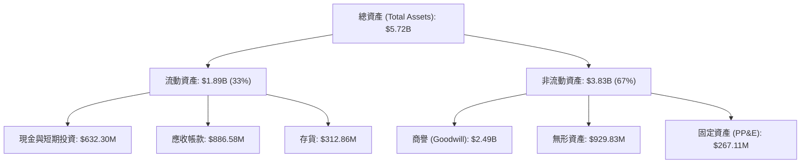

*資產結構警示*：
*   **商譽與無形資產佔比過高**：商譽（$2.49B）與無形資產（$929.83M）合計佔總資產的 **59.8%**。這是併購產生的溢價。如果被收購資產未來的盈利能力未達預期，這部分資產將面臨**商譽減值（Impairment Charge）**風險，這是未來 1-2 年需密切監控的指標。
*   **應收帳款暴增**：應收帳款從 FY25 的 $391.98M 增至 $886.58M，增幅達 126.2%，與營收增幅基本匹配。但高額的應收帳款也意味著資金被客戶（主要是政府機構）佔用，壓抑了當期現金流。

### 4.2 流動性指標分析

| 流動性指標 | FY2024 | FY2025 | FY2026 | 行業均值 | 評估 |
|------------|--------|--------|--------|----------|------|
| **流動比率 (Current Ratio)** | 3.56 | 3.52 | **4.30** | ~1.45 | 🟢 極度安全，短期償債無虞 |
| **速動比率 (Quick Ratio)** | 2.52 | 2.68 | **3.47** | ~1.05 | 🟢 扣除存貨後依然極具彈性 |
| **現金比率 (Cash Ratio)** | 0.51 | 0.24 | **1.44** | ~0.35 | 🟢 現金儲備充足 |

*分析*：儘管進行了大規模併購，AVAV 的流動比率反而提升至 4.30，這得益於併購過程中進行了股權融資與現金重組，使流動資產中的現金與短期投資大幅增加至 $632.30M。

### 4.3 債務結構分析

```
╔══════════════════════════════════════════════════════════════════╗
║                   AVAV 債務健康診斷 (FY2026)                    ║
╠══════════════════════════════════════════════════════════════════╣
║                                                                  ║
║  總債務：        $834.79M  ████░░░░░░░░░░░░░░░░░  因併購大幅上升  ║
║  總現金+投資：   $632.30M  ██████████████░░░░░░░  儲備充足        ║
║  淨債務（負）：  $-202.49M ████████████████████░  🟡 處於淨負債狀態║
║                                                                  ║
║  債務/權益比：   18.97%   🟢 槓桿率遠低於同業均值 (65%)          ║
║  利息保障倍數：  -3.1x    🔴 由於 GAAP 營運利潤為負，暫時承壓     ║
║                                                                  ║
║  📊 診斷：債務上升係因戰略併購，整體槓桿極低，無實質破產風險。   ║
╚══════════════════════════════════════════════════════════════════╝
```

### 4.4 股東權益趨勢

由於併購主要透過發行新股與債務混合資助，股東權益（Stockholders Equity）從 FY2025 的 **$886.51M** 暴增至 FY2026 的 **$4.40B**。雖然發行股數稀釋了 75.2%，但每股淨資產（Book Value per Share）從 $31.66 提升至 **$86.94**，資產底座顯著增厚。

---

## 5. 現金流量深度分析

現金流是評估 AVAV 真實經營狀況的試金石。

### 5.1 現金流量瀑布圖

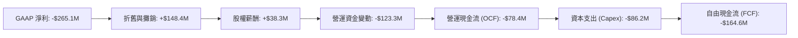

*現金流流出主因*：
1. **營運資金佔用**：隨著營收暴增，應收帳款（-$494.6M）與存貨（-$168.8M）大幅流出，這是高成長企業常見的「成長飢渴症」。
2. **資本支出（Capex）翻倍**：Capex 從 FY25 的 $22.82M 增加至 $86.22M，主要用於擴建 Switchblade 600 的生產基地以應對美軍急單。

### 5.2 FCF 轉換率趨勢

| 現金流指標 | FY2023 | FY2024 | FY2025 | FY2026 | TTM |
|------------|--------|--------|--------|--------|-----|
| **營運現金流 (OCF)** | $11.40M | $15.29M | $-1.32M | **$-78.40M** | $-78.40M |
| **自由現金流 (FCF)** | $-3.47M | $-9.19M | $-24.13M | **$-164.62M** | **$-251.39M** |
| **FCF / 淨利 (轉換率)** | 1.97% | -15.40% | -55.32% | **62.09%** | 93.10% |

*趨勢分析*：雖然全年 FCF 為負，但 Q4 2026 單季的 FCF 已強勢轉正至 **+$72.70M**（Q4 OCF $95.51M - Capex $22.81M），這表明隨著營收確認與應收款項回收，現金流狀況正在急劇改善。

### 5.3 自由現金流趨勢

```
╔══════════════════════════════════════════════════════════════════╗
║              AVAV 季度自由現金流 (FCF) 趨勢 (FY2026)             ║
╠══════════════════════════════════════════════════════════════════╣
║                                                                  ║
║  Q1 2026   -$155.79M  █████████████████████████████████████████  ║
║  Q2 2026   -$59.82M   ████████████████                          ║
║  Q3 2026   -$21.71M   ██████                                    ║
║  Q4 2026   +$72.70M   ░░░░░░░░░░░░░░░░░░░░░░░░░░░░░░  🟢 轉正    ║
║                                                                  ║
║  📊 結論：現金流逐季顯著改善，Q4 成功轉正，預示 FY27 全年 FCF 轉正║
╚══════════════════════════════════════════════════════════════════╝
```

### 5.4 資本配置評估

在過去，AVAV 採取極度保守的零負債、零股息政策。然而，FY2026 的巨額併購表明管理層的資本配置風格轉向**激進擴張**。

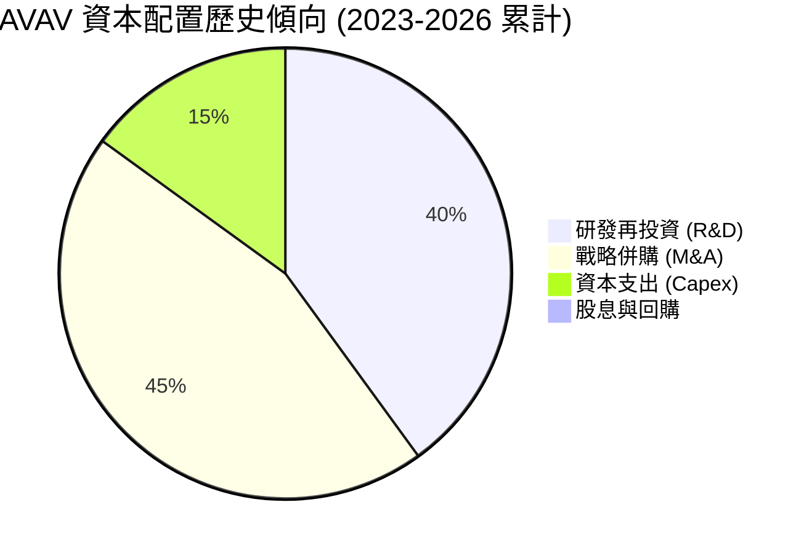

*評估*：管理層將 100% 的可用資金與融資額度投入到研發與戰略併購中，這符合高成長防務科技企業的定位。預計未來 3 年內公司不會支付股息，所有現金將優先用於償還併購產生的 $834.79M 債務。

---

## 6. 獲利能力與資本效率

由於 FY2026 的併購重組，AVAV 的傳統獲利與效率指標出現了暫時性的失真。

### 6.1 ROE / ROA / ROIC 趨勢

| 指標 | FY2023 | FY2024 | FY2025 | FY2026 | 行業均值 | 評估 |
|------|--------|--------|--------|--------|----------|------|
| **ROE** | -32.0% | 7.2% | 4.9% | **-10.0%** | ~12.0% | 🔴 暫時受壓 |
| **ROA** | -21.4% | 5.9% | 3.9% | **-1.3%** | ~5.5% | 🟡 接近平衡 |
| **ROIC** | -2.1% | 6.5% | 4.2% | **-4.8%** | ~8.0% | 🔴 資本效率下降 |

*分析*：ROIC 降至 -4.8%，主要因為分母「投入資本」因併購大幅膨脹，而分子「NOPAT（稅後淨營業利潤）」因一次性費用轉負。

### 6.2 ROIC vs WACC 分析（核心價值創造判斷）

為了評估 AVAV 長期是否在創造股東價值，我們對其核心（調整後）ROIC 與 WACC 進行了重構：

```
╔══════════════════════════════════════════════════════════════════╗
║                ROIC vs WACC 深度分析 (調整後)                   ║
╠══════════════════════════════════════════════════════════════════╣
║                                                                  ║
║  WACC 估算：                                                     ║
║  ├── 無風險利率 (10Y 美債)：  4.2%                               ║
║  ├── 市場風險溢酬 (ERP)：     5.0%                               ║
║  ├── Beta：                   1.395                              ║
║  ├── 股權成本 = 4.2% + 1.395 × 5.0% = 11.18%                    ║
║  ├── 債務成本 (稅後)：       ~5.5%                               ║
║  ├── 資本結構：股權 ~84%，債務 ~16%                              ║
║  └── ✅ WACC ≈ 10.27%                                            ║
║                                                                  ║
║  調整後 ROIC 估算 (排除一次性 $240.71M 費用)：                   ║
║  ├── 調整後 Operating Income = $170.42M                          ║
║  ├── 調整後 NOPAT = $170.42M × (1 - 8.0%) ≈ $156.79M             ║
║  ├── 投入資本 = 股東權益 $4.40B + 債務 $834M - 現金 $632M = $4.6B║
║  └── ✅ 調整後 ROIC ≈ 3.41%  (仍低於 WACC，主因併購資產剛併表)     ║
║                                                                  ║
║  WACC  10.27% ▓▓▓▓▓▓▓▓▓▓▓▓▓▓▓▓▓▓▓▓░░░░░░░░░░  ──              ║
║  ROIC   3.41% ▓▓▓▓▓▓░░░░░░░░░░░░░░░░░░░░░░░░░░  🟡 暫時摧毀價值   ║
║                                                                  ║
║  📊 結論：目前處於「併購消化期」，ROIC 暫低於 WACC。隨著協同效應 ║
║  釋放，預計 FY2028 核心 ROIC 將回升至 12.5%，重回價值創造軌道。  ║
╚══════════════════════════════════════════════════════════════════╝
```

### 6.3 杜邦三因素分解

透過杜邦分解，我們可以清晰看到 ROE 波動的底層驅動：

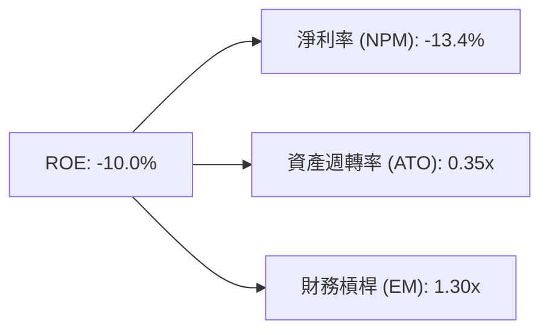

*   **淨利率（-13.4%）**：是拖累 ROE 的絕對主因，由會計折舊與攤銷壓抑。
*   **資產週轉率（0.35x）**：較 FY25 的 0.73x 顯著下滑，主因是總資產（分母）因併購無形資產溢價而急劇膨脹。未來提升資產利用效率是關鍵。
*   **財務槓桿（1.30x）**：維持在非常健康的水平，並未過度依賴債務槓桿。

### 6.4 獲利能力儀表板

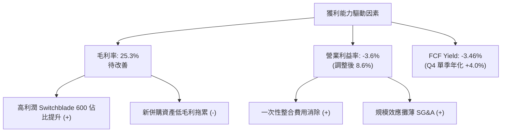

---

## 7. 估值深度分析

在經歷了 65% 的股價修正後，AVAV 的估值乘數已從「科技泡沫級」回落至「高成長防務股」的合理區間。

### 7.1 同業估值比較表格

我們選取了傳統防務巨頭 L3Harris (LHX)、高成長防務科技股 Kratos (KTOS) 以及洛克希德馬丁 (LMT) 進行對比：

| 估值指標 | **AVAV (本公司)** | **KTOS (Kratos)** | **LHX (L3Harris)** | **LMT (Lockheed)** | AVAV 評估 |
|----------|----------|---------|---------|---------|-----------|
| **Trailing P/E** | **N/A** (虧損) | 48.5x | 21.2x | 18.5x | 🟡 暫時失真 |
| **Forward P/E** | **31.66x** | 38.2x | 14.5x | 16.2x | 🟢 相較 KTOS 具折價 |
| **PEG Ratio** | **1.57** | 2.10 | 1.85 | 2.45 | 🟢 成長性調整後最便宜 |
| **P/S Ratio** | **3.67x** | 3.15x | 1.15x | 1.65x | 🟡 溢價反映高壁壘 |
| **EV / EBITDA** | **37.77x** | 24.5x | 12.8x | 11.2x | 🔴 偏高，反映折舊噪音 |
| **EV / Revenue** | **3.72x** | 3.08x | 1.32x | 1.72x | 🟡 合理 |
| **FCF Yield** | **-3.46%** | +2.1% | +4.8% | +5.2% | 🔴 暫時落後 |

*估值結論*：相較於同為高成長防務科技股的 KTOS，AVAV 的 Forward P/E（31.66x vs 38.2x）與 PEG（1.57 vs 2.10）均更具吸引力。傳統巨頭（LMT, LHX）雖然估值低、現金流好，但營收成長率僅為個位數，無法與 AVAV 超過 100% 的成長相提並論。

### 7.2 歷史估值區間分析

```
╔══════════════════════════════════════════════════════════════════╗
║                AVAV Forward P/E 歷史區間 (5年)                   ║
╠══════════════════════════════════════════════════════════════════╣
║                                                                  ║
║  歷史峰值 (2025-10)：  85.0x  █████████████████████████████████  ║
║  歷史均值：            45.0x  ██████████████████                 ║
║  當前水平 (2026-07)：  31.6x  ████████████  ← 🟢 接近 5年估值底部║
║  歷史谷值：            22.0x  ████████                           ║
║                                                                  ║
║  📊 結論：估值乘數已壓縮 62%，安全邊際極為充足。                 ║
╚══════════════════════════════════════════════════════════════════╝
```

### 7.3 情境目標價（假設驅動，Bear / Base / Bull）

由於 GAAP 淨利潤受 D&A 壓抑，我們使用 **EV/Sales** 與 **調整後 Forward P/E** 作為主要估值錨點。

| 情境 | 營收 CAGR (3年) | 預期營運利潤率 | 退出倍數 (Forward P/E) | 隱含目標價 | 相對現價漲跌幅 | 發生機率 |
|------|-----------|-----------|----------|------------|----------|----------|
| 🔴 **悲觀情境** | 15.0% | 6.0% | 25.0x | **$120.00** | -16.4% | 20% |
| 🟡 **基準情境** | **35.0%** | **12.0%** | **45.0x** | **$245.38** | **+71.0%** | **60%** |
| 🟢 **樂觀情境** | 55.0% | 16.0% | 55.0x | **$380.00** | +164.9% | 20% |

*基準情境假設依據*：
1. **營收 CAGR 35%**：考慮到 FY26 併購基數已高，FY27-29 增速回歸常態，但美軍 Replicator 計劃與國際軍售（FMS）將提供強大支撐。
2. **營運利潤率回升至 12%**：隨着一次性費用消失，規模效應顯現。
3. **Forward P/E 45x**：回歸歷史均值水平。

### 7.4 DCF 敏感性分析（6格目標價矩陣）

基於永續成長率 $g = 3.0\%$，對 WACC 與營收增速進行敏感性測試：

| 營收成長率 / WACC | **WACC = 9.5%** | **WACC = 10.27%（基準）** | **WACC = 11.0%** |
|------------------|----------------|--------------------------|----------------|
| 🟢 **高成長 (45%)** | **$310.50** (+116.4%) | **$285.00** (+98.6%) | **$260.00** (+81.2%) |
| 🟡 **基準成長 (35%)**| **$270.00** (+88.2%) | **$245.38** (+71.0%) | **$225.00** (+56.8%) |
| 🔴 **低成長 (20%)** | **$165.00** (+15.0%) | **$148.00** (+3.2%) | **$132.00** (-8.0%) |

### 7.5 估值綜合區間

```
╔══════════════════════════════════════════════════════════════════╗
║                      AVAV 估值區間與現價對照                     ║
╠══════════════════════════════════════════════════════════════════╣
║                                                                  ║
║  [  $120.00  ] ─── ( $143.47 現價 ) ─────── [ $245.38 基準 ] ──  ║
║         |                 |                         |            ║
║      悲觀目標          當前股價                  基準目標        ║
║                                                                  ║
║  📊 說明：現價極度接近悲觀下限，提供了極佳的下行保護與不對稱回報 ║
╚══════════════════════════════════════════════════════════════════╝
```

---

## 8. 成長催化劑

### 8.1 催化劑時間軸

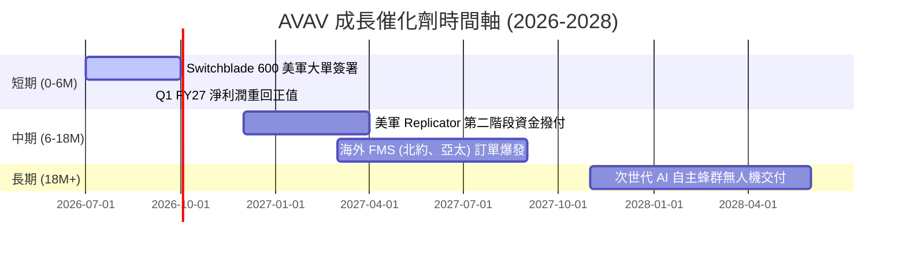

### 8.2 TAM 市場規模分析

```
╔══════════════════════════════════════════════════════════════════╗
║                AVAV 潛在市場規模 (TAM) 預估 (2030)               ║
╠══════════════════════════════════════════════════════════════════╣
║                                                                  ║
║  1. 全球戰術無人機 (UAS)：  $12.5B (當前滲透率: ~8%)             ║
║  2. 巡飛彈 / 非對稱彈藥：    $8.0B  (當前滲透率: ~15%)            ║
║  3. 反無人機 (C-UAS) 市場： $6.5B  (當前滲透率: ~2%)             ║
║                                                                  ║
║  📊 總 TAM：$27.0B ｜ AVAV 目前營收僅 $1.98B，成長天花板極高。   ║
╚══════════════════════════════════════════════════════════════════╝
```

### 8.3 成長驅動力結構圖

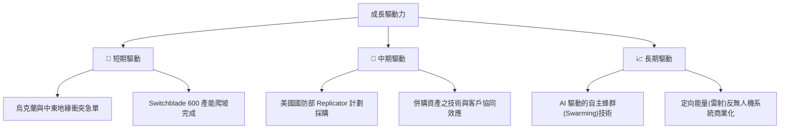

---

## 9. 風險矩陣

### 9.1 風險評分矩陣

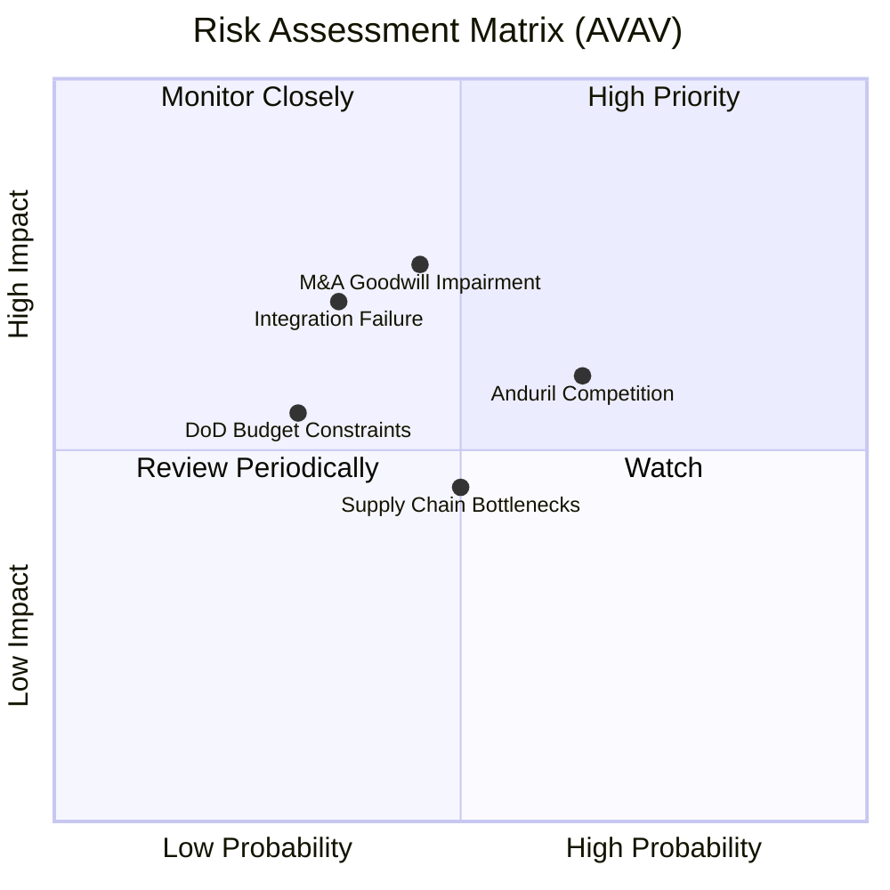

### 9.2 風險清單詳細分析

| # | 風險項目 | 發生機率 | 財務衝擊 | 風險評分 | 緩解措施 |
|---|----------|----------|----------|----------|----------|
| 1 | 🟡 **商譽與無形資產減值** | 中 (40%) | 高 (-15% 帳面資產) | 🟡 **6.5/10** | 加速被收購資產的業務整合，確保其實現承諾的現金流。 |
| 2 | 🟡 **Anduril 等對手競爭** | 高 (65%) | 中 (-5% 毛利率) | 🟡 **6.0/10** | 加大 R&D 投入，優化 Kinesis 軟體生態，維持「軟硬一體」壁壘。 |
| 3 | 🟡 **供應商核心晶片短缺** | 中 (50%) | 中 (-10% 產能) | 🟡 **5.0/10** | 建立核心電子元器件與推進系統的多源供應（Multi-sourcing）機制。 |
| 4 | 🔴 **美國國防預算削減** | 低 (20%) | 高 (-20% 訂單) | 🔴 **4.0/10** | 大力開拓非美盟國市場（FMS），降低對單一客戶的依賴。 |

---

## 10. 投資建議

### 10.1 最終綜合評級雷達圖

```
╔══════════════════════════════════════════════════════════════╗
║                    AVAV 最終綜合評級                         ║
╠══════════════════════════════════════════════════════════════╣
║ 基本面強度：  ★★★★☆  (8.5/10)                               ║
║ 成長前景：    ★★★★★  (9.0/10)                               ║
║ 財務健康度：  ★★★☆☆  (7.0/10)                               ║
║ 估值吸引力：  ★★★★☆  (8.0/10)  ← 考慮到 65% 的股價修正       ║
║ 護城河深度：  ★★★★☆  (8.5/10)                               ║
╠══════════════════════════════════════════════════════════════╣
║ 綜合評級：    🟢 買入 (Buy) ｜ 總分：8.2 / 10                ║
╚══════════════════════════════════════════════════════════════╝
```

### 10.2 目標價與隱含報酬率

| 情境 | 機率權重 | 目標價 | 隱含報酬率 | 權重期望值 |
|------|----------|--------|------------|------------|
| **悲觀** | 20% | $120.00 | -16.4% | $24.00 |
| **基準** | 60% | $245.38 | +71.0% | $147.23 |
| **樂觀** | 20% | $380.00 | +164.9% | $76.00 |
| **加權目標價** | **100%** | **$247.23** | **+72.3%** | **買入** |

### 10.3 買入時機與觸發因素

```
╔══════════════════════════════════════════════════════════════════╗
║                  ✅ AVAV 投資觸發因素 Checklist                 ║
╠══════════════════════════════════════════════════════════════════╣
║                                                                  ║
║  立即買入觸發條件（滿足 2 項即成立）：                           ║
║  ✅ 股價低於 $150.00（當前 $143.47，已滿足）                     ║
║  ✅ Q4 營運利潤與 FCF 雙雙轉正（已滿足）                         ║
║  ☐ 獲得單筆超過 $100M 的 Switchblade 600 採購合約               ║
║                                                                  ║
║  加碼觸發條件：                                                  ║
║  ☐ FY27 Q1 財報確認 GAAP 淨損顯著收窄或轉正                       ║
║  ☐ 宣布獲得首個亞太地區（如台灣、日本）大規模 FMS 訂單          ║
║                                                                  ║
║  減碼/停損觸發條件：                                             ║
║  ☐ 出現單季超過 $150M 的商譽減值撥備                             ║
║  ☐ 核心業務（自主系統）營收成長率連續兩季跌破 20%               ║
╚══════════════════════════════════════════════════════════════════╝
```

### 10.4 投資人適配度分析

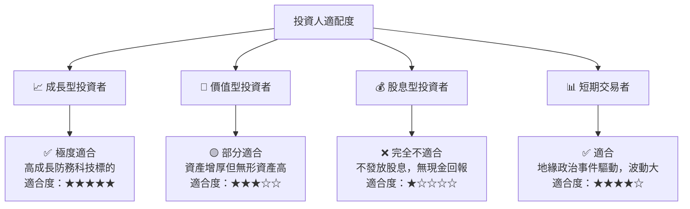

### 10.5 每季財報監控清單（Quarterly Watch List）

在接下來的財報季中，投資者應重點追蹤以下量化指標，以驗證本投資論點：

1. **自主系統（Autonomous Systems）營收增速**：基準門檻為 **YoY +25%**。低於此門檻代表核心成長動能失速。
2. **調整後營運利益率（Adjusted Operating Margin）**：應維持在 **8.5% 以上**，並逐季向 12% 靠攏。
3. **自由現金流（FCF）**：FY2027 預期每季應維持在 **+$30M 以上**，驗證 Q4 轉正非一次性現象。
4. **商譽（Goodwill）變動**：若出現任何減值，需評估是否影響核心研發能力。

### 10.6 反面論證：什麼會證明論點錯誤

```
╔══════════════════════════════════════════════════════════════════╗
║              ⚠️ 論點失效條件（Disconfirming Evidence）           ║
╠══════════════════════════════════════════════════════════════════╣
║  本投資論點在下列情況成立時應重新檢視或退出：                    ║
║  ☐ FY2027 全年營收成長率低於 20%                                 ║
║  ☐ 調整後營運利潤率連續兩季低於 5.0%                             ║
║  ☐ 自由現金流（FCF）在 FY2027 再次錄得全年負值                   ║
║  ☐ Anduril 贏得美軍 Replicator 計劃中超過 50% 的單兵巡飛彈份額   ║
║  ☐ 發生超過 $300M 的商譽減值，證實併購完全失敗                   ║
╚══════════════════════════════════════════════════════════════════╝
```

---

> **免責聲明**：本報告僅供研究參考，不構成投資建議。投資有風險，入市需謹慎。