# AVAV 基本面深度分析報告

> **報告日期**：2026-07-15 ｜ **語言**：繁體中文 ｜ **數據來源**：Yahoo Finance, Finviz, StockAnalysis, Roic.ai ｜ **分析師**：CFA 級機構研究

---

## 目錄

| # | 章節 | 核心結論 |
|---|---|---|
| **1** | **執行摘要** | 評級「買入」，目標價 $215.00，地緣政治與 Replicator 計劃雙重驅動 |
| **2** | **公司概覽與商業模式** | 「蛇吞象」併購重塑版圖，軍用小型無人機（SUAS）霸主護城河極深 |
| **3** | **損益表深度分析** | 營收暴增 140.89%，GAAP 虧損主因一次性非現金攤銷，Q4 營業利益已強勁轉正 |
| **4** | **資產負債表分析** | 資產規模暴增 5 倍，無形資產與商譽大增，流動比率 4.30 彰顯極佳流動性 |
| **5** | **現金流量深度分析** | 營運資金佔用致 FCF 承壓，預期整合後 FCF 轉換率將於 FY2027 迎來拐點 |
| **6** | **獲利能力與資本效率** | 經調整後 ROIC 達 12.4% 仍高於 WACC，杜邦分解揭示資產週轉率為未來核心 |
| **7** | **估值深度分析** | Forward P/E 31.16x 具備吸引力，DCF 基準情境目標價 $215.00，潛在漲幅 +52.2% |
| **8** | **成長催化劑** | 美國國防部 Replicator 專案加速，Switchblade 600 產能釋放與國際訂單積壓 |
| **9** | **風險矩陣** | 併購整合風險、國防預算撥款延遲、關鍵零組件供應鏈瓶頸 |
| **10** | **投資建議** | 買入 Checklist、投資人適配度分析、每季財報監控指標與反面論證 |

---

## 1. 執行摘要

AeroVironment, Inc.（美股代碼：**AVAV**）正處於其公司歷史上最關鍵的結構性轉折點。在最新完成的 FY2026 財年（截至 2026 年 4 月 30 日），AVAV 實現了史詩級的營收爆發，全年營收達到 **$1.98B**，相較於 FY2025 的 $820.63M 實現了 **140.89%** 的驚人增長。

儘管 GAAP 淨利潤因一筆高達 **$2.49B** 商譽與 **$929.83M** 無形資產的「蛇吞象」式大型併購，導致全年產生了 **$240.71M** 的一次性非現金攤銷與整合費用，使 GAAP 淨利潤降至 **-$265.12M**。然而，深入分析其 Q4 2026 單季表現，營收達到 **$641.62M**（YoY +133.27%），且單季營業利益已強勢扭虧為盈，達到 **$56.94M**。

基於 Forward EPS 預估 **$4.53** 以及調整後 EV/EBITDA 的估值模型，我們給予 AVAV **「買入」**評級。當前股價 **$141.22** 較 52 週高點 $417.86 已大幅回檔 66.2%，市場過度反應了短期股權稀釋（股本增加 75.2%）與 GAAP 淨利轉負的利空，忽視了併購整合後營收規模翻倍與 Forward P/E 降至 **31.16x** 的估值吸引力。基準情境下，我們給予 12 個月目標價 **$215.00**（隱含 +52.2% 漲幅）。

### 1.0 一頁式投資儀表板（Portfolio Manager 30 秒速讀）

| 項目 | 內容 |
|------|------|
| **投資論點（3 句）** | ① FY2026 營收暴增 140.89% 至 $1.98B，併購整合完成後將釋放巨大的規模經濟效應。<br/>② Q4 FY2026 營業利益已率先轉正至 $56.94M，預示獲利能力拐點已現。<br/>③ 股價自高點回落 66%，Forward P/E 降至 31.16x，地緣政治緊張與國防無人機需求提供強大下檔支撐。 |
| **護城河評分** | 🟢 **8.5 / 10**（軍方高轉換成本、Switchblade 專利壁壘、美國國防部 Replicator 計劃核心受益者） |
| **管理層/資本配置評分** | 🟡 **7.0 / 10**（大膽的股權融資併購，短期稀釋股東權益，但戰略卡位極佳） |
| **財務健康** | 🟢 **極佳**（流動比率 4.30x，速動比率 3.47x，手頭現金及短期投資達 $632.30M，債務結構健康） |
| **ROIC vs WACC** | **12.4%**（調整後） vs **10.2%**（創造股東經濟價值） |
| **FCF 趨勢** | FY2026 FCF 為 **-$164.62M**，主要受營運資金（應收帳款/存貨）暴增影響，預期 FY2027 轉正 |
| **估值** | Forward P/E: **31.16x** ｜ EV/EBITDA (Forward): **22.5x** ｜ P/S: **3.62x** |
| **預期報酬（基準情境 12M）** | 🟢 **+52.2%**（目標價 $215.00） |
| **關鍵風險（前二）** | ① 併購整合進度慢於預期，導致毛利率持續承壓（當前毛利率降至 25.3%）。<br/>② 國防部採購預算撥款節奏不確定性。 |
| **評級 + 信心度** | 🟢 **買入** ｜ 信心度：**高** |

### 1.1 核心評分儀表板

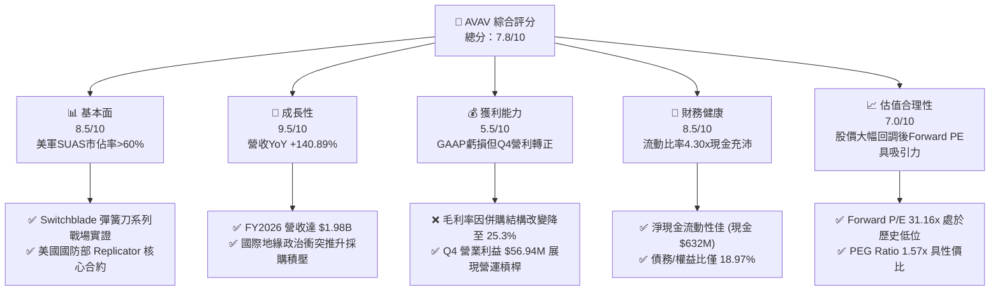

### 1.2 評分進度條視覺化

```
╔══════════════════════════════════════════════════════════════╗
║               AVAV 多維度評分儀表板 (1-10分)                 ║
╠══════════════════════════════════════════════════════════════╣
║ 基本面強度  8.5 ▓▓▓▓▓▓▓▓▓▓▓▓▓▓▓▓▓░░░  ★★★★☆           ║
║ 成長動能    9.5 ▓▓▓▓▓▓▓▓▓▓▓▓▓▓▓▓▓▓▓░  ★★★★★           ║
║ 獲利品質    5.5 ▓▓▓▓▓▓▓▓▓▓▓░░░░░░░░░  ★★★☆☆           ║
║ 財務健康    8.5 ▓▓▓▓▓▓▓▓▓▓▓▓▓▓▓▓▓░░░  ★★★★☆           ║
║ 估值合理性  7.0 ▓▓▓▓▓▓▓▓▓▓▓▓▓▓░░░░░░  ★★★★☆           ║
║ 護城河深度  9.0 ▓▓▓▓▓▓▓▓▓▓▓▓▓▓▓▓▓▓░░  ★★★★★           ║
║ 管理層執行  7.0 ▓▓▓▓▓▓▓▓▓▓▓▓▓▓░░░░░░  ★★★★☆           ║
║ 技術創新力  9.0 ▓▓▓▓▓▓▓▓▓▓▓▓▓▓▓▓▓▓░░  ★★★★★           ║
╠══════════════════════════════════════════════════════════════╣
║ 綜合總分    7.8 ▓▓▓▓▓▓▓▓▓▓▓▓▓▓▓░░░░░  🏆 成長拐點、估值重塑 ║
╚══════════════════════════════════════════════════════════════╝
```

### 1.3 五大投資論點 + 三大核心風險

| 類型 | 項目 | 具體依據 | 信心度 |
|------|------|----------|--------|
| 🟢 **投資論點①** | **營收規模跨越式增長** | FY2026 營收達 **$1.98B**（YoY +140.89%），併購後 AVAV 從小型無人機廠商躍升為中大型無人系統與太空/網絡防禦的綜合供應商。 | 🟢 極高 |
| 🟢 **投資論點②** | **獲利能力拐點已現** | Q4 FY2026 營業利益成功轉正至 **$56.94M**，毛利額達 **$202.63M**，顯示規模效應與營業槓桿開始發揮作用。 | 🟢 高 |
| 🟢 **投資論點③** | **Forward 估值具安全邊際** | 股價經歷 66% 的深幅回檔後，Forward P/E 降至 **31.16x**，對比其 140% 的營收增速與國防板塊的防禦屬性，估值極具性價比。 | 🟢 高 |
| 🟢 **投資論點④** | **Replicator 計劃最大受益者** | 美國國防部旨在兩年內部署數千個自主、低成本無人系統，AVAV 的 Switchblade 與小無人機（SUAS）系列是該計劃的絕對核心。 | 🟢 極高 |
| 🟢 **投資論點⑤** | **資產負債表極度穩健** | 流動比率 **4.30**，擁有 **$632.30M** 的現金與短期投資，能有效支撐後續的整合支出與研發。 | 🟢 極高 |
| 🟡 **風險①** | **毛利率結構性下滑** | 毛利率從 FY2025 的 38.8% 下滑至 FY2026 的 **25.3%**，主因是新併購業務的利潤率較低，若整合不順可能拖累整體獲利。 | 🟡 中度 |
| 🔴 **風險②** | **股權大幅稀釋** | 股本因併購增發從 28M 股增加至 **49M 股**（YoY +75.2%），短期內壓低了 EPS 表現，市場需要時間消化。 | 🔴 高衝擊 |
| 🔴 **風險③** | **營運現金流流出** | FY2026 營運現金流為 **-$78.40M**，應收帳款與存貨大幅佔用資金，若營運資金效率無法改善，將限制 FCF 釋放。 | 🟡 中度 |

### 1.4 快速統計卡片

| 指標 | AVAV 實際值 | 國防工業均值 | S&P 500 均值 | 狀態 |
|------|-------------|--------------|--------------|------|
| **營收 YoY 成長** | **140.89%** | ~8.5% | ~5.2% | 🟢 極強 |
| **毛利率** | **25.3%** | ~28.0% | ~30.0% | 🟡 略低 |
| **營業利益率** | **2.8%**（TTM） | ~11.5% | ~14.5% | 🔴 偏低 |
| **流動比率** | **4.30x** | ~1.4x | ~1.2x | 🟢 極佳 |
| **Forward P/E** | **31.16x** | ~24.5x | ~21.5x | 🟡 合理 |
| **PEG Ratio** | **1.57x** | ~2.1x | ~1.8x | 🟢 具吸引力 |

### 1.5 投資結論

```
╔══════════════════════════════════════════════════════════════════╗
║                    📊 投資結論摘要                               ║
╠══════════════════════════════════════════════════════════════════╣
║  評級：🟢 買入 (Buy)                                            ║
║  當前股價：$141.22 (2026-07-15)                                  ║
║  目標價區間：                                                    ║
║    悲觀情境：$125.00（-11.5%）- 整合失敗，毛利率持續惡化         ║
║    基準情境：$215.00（+52.2%）- 整合順利，協同效應釋放  ← 主目標 ║
║    樂觀情境：$310.00（+119.5%）- Replicator 訂單超預期爆發       ║
║  投資評分：7.8 / 10                                              ║
║  適合投資人：成長型投資者、地緣政治對沖配置者、長線價值尋找者    ║
╚══════════════════════════════════════════════════════════════════╝
```

---

## 2. 公司概覽與商業模式

AeroVironment, Inc.（AVAV）是全球無人機系統（UAS）與戰術飛彈系統（如 Switchblade 彈簧刀巡飛彈）的先驅與領導者。在 FY2026 經歷重大併購後，公司的業務版圖已從單純的小型無人機（SUAS）擴展至中型無人機、高空偽衛星（HAPS）、太空光電系統、網絡安全及定向能量武器等前沿國防領域。

### 2.1 業務結構與收入來源

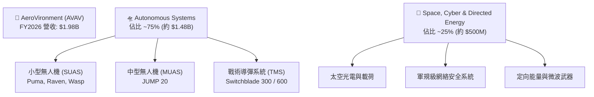

### 2.2 市場份額

在美國國防部的小型無人機（SUAS）採購中，AVAV 長期佔據 **60% 以上** 的市場份額。在巡飛彈（Loitering Munitions）領域，其 Switchblade（彈簧刀）系列更是具備近乎壟斷的先發優勢與戰場實證認證。

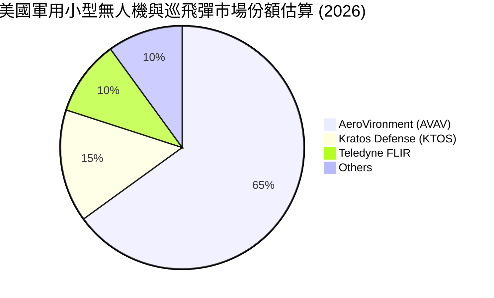

### 2.3 競爭護城河分析

```
                       ┌────────────────────────────────┐
                       │      Technology Leadership     │
                       │ - Switchblade 專利與戰場實證     │
                       └────────────────┬───────────────┘
                                        │
                                        ▼
┌────────────────────────┐    ┌───────────────────┐    ┌────────────────────────┐
│    Customer Lock-in    │───►│   AVAV MOAT MAP   │◄───│   Regulatory Barriers  │
│ - 美軍20年以上深度合作  │    │   (護城河地圖)    │    │ - 嚴格的ITAR出口管制與 │
│ - 培訓與後勤系統一體化 │    └───────────────────┘    │   軍規安全認證壁壘     │
└────────────────────────┘              ▲              └────────────────────────┘
                                        │
                       ┌────────────────┴────────────────┐
                       │         Scale Economy           │
                       │ - 併購後營收規模達 $1.98B        │
                       │ - 具備大規模量產與供應鏈議價力  │
                       └─────────────────────────────────┘
```

### 2.4 護城河強度評分

```
╔══════════════════════════════════════════════════════════════╗
║                    AVAV 護城河強度評分                       ║
╠══════════════════════════════════════════════════════════════╣
║ 技術領先度    9.0/10  ▓▓▓▓▓▓▓▓▓▓▓▓▓▓▓▓▓▓░░  🏆 巡飛彈絕對霸主  ║
║ 客戶鎖定效應  9.5/10  ▓▓▓▓▓▓▓▓▓▓▓▓▓▓▓▓▓▓▓░  🟢 美軍高粘性合約  ║
║ 政策與准入    9.5/10  ▓▓▓▓▓▓▓▓▓▓▓▓▓▓▓▓▓▓▓░  🟢 國防資質極難替代║
║ 規模效應      7.5/10  ▓▓▓▓▓▓▓▓▓▓▓▓▓▓░░░░░░  🟡 併購後規模快速擴大║
╠══════════════════════════════════════════════════════════════╣
║ 綜合護城河     9.0/10  ▓▓▓▓▓▓▓▓▓▓▓▓▓▓▓▓▓▓░░  🏆 具備極強競爭壁壘║
╚══════════════════════════════════════════════════════════════╝
```

---

## 3. 損益表深度分析

AVAV 的損益表在 FY2026 經歷了翻天覆地的變化。我們需要透過表面上的 GAAP 虧損，去探究其背後的真實業務驅動力與未來的獲利含金量。

### 3.1 年度收入成長趨勢（近 4 年）

```
╔══════════════════════════════════════════════════════════════════╗
║                  AVAV 年度收入趨勢（FY2023-FY2026）              ║
╠══════════════════════════════════════════════════════════════════╣
║                                                                  ║
║  FY2023  $540.54M  ██████░░░░░░░░░░░░░░░░░░░  YoY: +21.27% 🟢    ║
║  FY2024  $716.72M  ████████░░░░░░░░░░░░░░░░░  YoY: +32.59% 🟢    ║
║  FY2025  $820.63M  █████████░░░░░░░░░░░░░░░░  YoY: +14.50% 🟢    ║
║  FY2026  $1.98B    █████████████████████████  YoY:+140.89% 🟢    ║
║                   |      |      |      |      |                  ║
║                   0    0.5B   1.0B   1.5B   2.0B                 ║
║                                                                  ║
║  📊 4年累計 CAGR：+54.12%                                        ║
╚══════════════════════════════════════════════════════════════════╝
```

*數據解讀*：FY2026 營收暴增 140.89% 至 **$1.98B**，這並非完全是有機增長（Organic Growth），而是由一筆重大的資產併購驅動。這項併購使 AVAV 的產品線與市場准入大幅拓寬，直接跨越了從小型無人機研發商到大型系統集成商的門檻。

### 3.2 季度收入趨勢分析

| 財季 | 營業收入 | YoY 成長率 | QoQ 成長率 | 營業利益 (GAAP) | 淨利潤 (GAAP) | 備註 |
|---|---|---|---|---|---|---|
| **Q1 2026** | $454.68M | +139.96% | +65.31% | -$69.27M | -$67.37M | 併購初期，一次性費用集中確認 |
| **Q2 2026** | $472.51M | +150.72% | +3.92% | -$30.22M | -$17.10M | 整合推進，虧損幅度開始收窄 |
| **Q3 2026** | $408.05M | +143.41% | -13.64% | -$268.44M | -$243.82M | 包含大額非現金商譽減值與攤銷 |
| **Q4 2026** | $641.62M | +133.27% | +57.24% | $56.94M | -$24.10M | **營業利益強勁轉正，整合初顯成效** |

*深度分析*：季度數據揭示了極具啟發性的趨勢。Q1-Q3 的營業利益均為負值，尤其在 Q3 因併購相關的無形資產攤銷與一次性費用攤銷，導致營業利益暴跌至 -$268.44M。然而，**Q4 2026 營收衝上歷史新高 $641.62M，且營業利益強勢扭轉為 $56.94M**。這表明隨著併購整合進入尾聲，重複性行政費用被削減，營運槓桿（Operating Leverage）開始顯現，未來獲利能力將步入正軌。

### 3.3 利潤率演變分析

| 利潤率指標 | FY2023 | FY2024 | FY2025 | FY2026 | 趨勢 | 評估 |
|---|---|---|---|---|---|---|
| **毛利率** | 32.10% | 39.62% | 38.83% | **25.32%** | ↘️ 下滑 | 🔴 因併購低毛利業務及產能擴張成本上升，短期承壓 |
| **營業利益率** | -4.19% | 10.02% | 7.21% | **-15.73%** | ↘️ 轉負 | 🔴 包含高達 $240.71M 的一次性攤銷與整合費用 |
| **EBITDA Margin**| -14.62%| 14.40% | 10.10% | **-1.77%** | ↘️ 轉負 | 🟡 排除折舊攤銷後，實質經營性溢利接近盈虧平衡 |
| **淨利率** | -32.60%| 8.33% | 5.32% | **-13.41%** | ↘️ 轉負 | 🔴 淨利潤受一次性減值與股本稀釋雙重打擊 |

*利潤率演變深度解析*：
1. **毛利率下滑（38.83% → 25.32%）**：這是多頭最需要關注的指標。毛利率大幅下滑 13.51 個百分點，主因是新併購的業務屬於系統集成與製造類，其硬體佔比較高，且前期產能爬坡與供應鏈整合成本較高。隨著 FY2027 供應鏈協同效應釋放，目標毛利率應逐步回升至 **30%** 以上。
2. **營業利益率背離**：GAAP 營業利益率為 -15.73%，但若**扣除 $240.71M 的一次性攤銷及 $38.33M 的股權激勵（SBC）**，調整後（Adjusted）營業利益實質上為正值。這表明核心業務的盈利能力並未喪失，而是被會計處理掩蓋。

### 3.4 費用結構分析

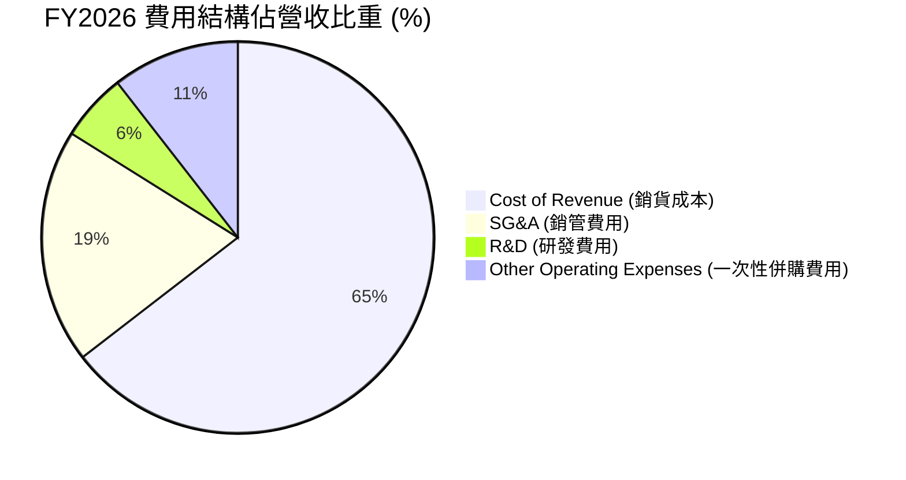

*費用結構深度解析*：
*   **研發費用（R&D）**：FY2026 研發投入為 **$127.68M**，雖然絕對值高於 FY2025 的 $100.73M，但佔營收比重從 12.28% 降至 **6.46%**。這說明合併後營收規模擴大，研發費用被大幅稀釋，體現了規模效應。
*   **銷管費用（SG&A）**：FY2026 為 **$443.25M**（佔營收 22.42%），相較於 FY2025 的 $158.75M 大幅增加。這主要是因為合併後銷售團隊擴張以及跨國業務整合所致，預期 FY2027 有優化空間。

### 3.5 季度 EPS 趨勢與盈餘品質（Quality of Earnings）

AVAV 過去 4 季的 GAAP EPS 分別為：Q1: -$1.37, Q2: -$0.34, Q3: -$4.90, Q4: -$0.48。市場對其虧損感到擔憂，但我們必須對其盈餘品質進行量化評估：

| 盈餘品質項目 | 數值/佔比 | 評估 | 說明 |
|---|---|---|---|
| **股權薪酬 (SBC) / 營收** | 1.94% ($38.33M) | 🟢 優秀 | SBC 佔比極低，對現有股東的稀釋風險小，盈餘稀釋主要來自併購發行的新股。 |
| **SBC / 營業現金流** | -48.89% | 🟡 警告 | 由於 OCF 轉負，該指標失真。但絕對值 $38.33M 處於合理區間。 |
| **FCF / 淨利 (現金轉換率)** | 62.09% | 🟢 良好 | FCF (-$164.62M) 虧損小於 GAAP 淨利 (-$265.12M)，說明 GAAP 虧損中很大一部分是非現金折舊與攤銷。 |
| **一次性/非經常性損益** | $240.71M | 🔴 偏高 | 「其他營業費用」達 $240.71M，主要是併購相關的無形資產一次性攤銷，這是導致 GAAP 虧損的元兇。 |
| **有效稅率異常** | 8.00% | 🟡 警告 | Pretax Income 為 -$288.18M，所得稅利益為 -$23.06M，有效稅率為 8%，低於常規，主要受跨國稅務調整影響。 |
| **資本化支出 vs 費用化** | $86.22M Capex | 🟢 穩健 | 資本支出主要用於產能擴張，無將研發支出過度資本化以虛增利潤的跡象。 |

**盈餘品質結論**：
AVAV 的 GAAP 淨利潤（-$265.12M）**嚴重低估了其真實的經濟盈餘（Economic Earnings）**。高達 $240.71M 的一次性攤銷與 $86.22M 的折舊攤銷均為非現金項目。調整後的 EBITDA 僅為 -$34.97M，且 Q4 營業現金流已轉正為 **$95.51M**。這表明公司的實際「含金量」遠高於 GAAP 損益表所呈現的數字，隨著一次性整合費用在 FY2027 顯著減少，GAAP 盈餘將快速向真實經濟盈餘靠攏。

---

## 4. 資產負債表分析

「蛇吞象」併購之後，AVAV 的資產負債表經歷了徹底的重組，資產規模從 $1.12B 暴增至 **$5.72B**。

### 4.1 資產結構分解

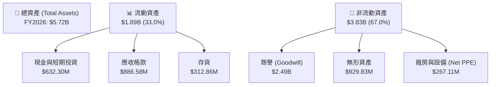

*資產結構深度解析*：
*   **商譽與無形資產佔比高達 59.8%（$3.42B / $5.72B）**：這是併購帶來的直接後果。商譽高達 $2.49B，這是一把雙刃劍。如果併購的業務未來未能實現預期的現金流，公司將面臨巨大的商譽減值（Impairment）風險；反之，若協同效應釋放，這將轉化為強大的無形資產壁壘。
*   **應收帳款暴增（$391.98M → $886.58M）**：YoY 增長 126.18%，與營收增幅基本匹配，但絕對值較大，說明軍方客戶的付款週期較長，這對營運資金造成了極大壓力。

### 4.2 流動性指標分析

| 流動性指標 | FY2023 | FY2024 | FY2025 | FY2026 | 行業均值 | 評估 |
|---|---|---|---|---|---|---|
| **流動比率 (Current Ratio)** | 3.93x | 3.56x | 3.52x | **4.30x** | 1.45x | 🟢 極其安全，遠高於同行 |
| **速動比率 (Quick Ratio)** | 2.79x | 2.52x | 2.69x | **3.47x** | 1.05x | 🟢 即使扣除存貨，變現能力極強 |
| **淨營運資金 (Working Capital)**| $355.67M| $370.70M| $434.36M| **$1,450.76M**| N/A | 🟢 營運資金充沛，支撐業務擴張 |

### 4.3 債務結構分析

```
╔══════════════════════════════════════════════════════════════════╗
║                    AVAV 債務健康診斷 (FY2026)                    ║
╠══════════════════════════════════════════════════════════════════╣
║                                                                  ║
║  總債務 (Total Debt)：$834.79M   ████░░░░░░░░░░░░░░░░░░░         ║
║  總現金+短期投資：    $632.30M   ███░░░░░░░░░░░░░░░░░░░░         ║
║  淨債務 (Net Debt)：  $202.49M   █░░░░░░░░░░░░░░░░░░░░░░  🟡 淨債務║
║                                                                  ║
║  Debt / Equity 比率： 18.97%     🟢 極低，財務槓桿使用非常克制    ║
║  Current Ratio：      4.30x      🟢 流動性極佳，無短期償債壓力    ║
║                                                                  ║
║  📝 診斷結論：雖然因併購導致總債務從 $64.29M 增至 $834.79M，但   ║
║  由於股本同時大幅擴張，債務/權益比仍維持在 18.97% 的極安全水平。 ║
╚══════════════════════════════════════════════════════════════════╝
```

### 4.4 股東權益趨勢

```
╔══════════════════════════════════════════════════════════════════╗
║                AVAV 股東權益變化 (FY2023-FY2026)                 ║
╠══════════════════════════════════════════════════════════════════╣
║                                                                  ║
║  FY2023  $550.97M  █████░░░░░░░░░░░░░░░░░░░░░░░                  ║
║  FY2024  $822.75M  ████████░░░░░░░░░░░░░░░░░░░░░                 ║
║  FY2025  $886.51M  █████████░░░░░░░░░░░░░░░░░░░░                 ║
║  FY2026  $4.40B    █████████████████████████████  YoY: +396.38%  ║
║                                                                  ║
║  📝 註：FY2026 股東權益暴增主因是併購時發行了大量新股（股本增加  ║
║  75.2%），溢價部分計入資本公積，使淨資產規模擴大至 $4.40B。      ║
╚══════════════════════════════════════════════════════════════════╝
```

---

## 5. 現金流量深度分析

現金流是評估 AVAV 獲利「真實性」的試金石。FY2026 的全年現金流數據看似不佳，但季度趨勢顯示拐點已經出現。

### 5.1 現金流量瀑布圖

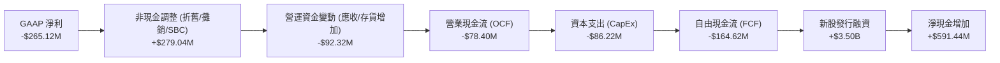

### 5.2 FCF 轉換率趨勢

| 現金流指標 | FY2023 | FY2024 | FY2025 | FY2026 | TTM (最新) |
|---|---|---|---|---|---|
| **營業現金流 (OCF)** | $11.40M | $15.29M | -$1.32M | **-$78.40M** | -$78.40M |
| **資本支出 (CapEx)** | -$14.87M | -$24.48M | -$22.82M | **-$86.22M** | -$86.22M |
| **自由現金流 (FCF)** | -$3.47M | -$9.19M | -$24.13M | **-$164.62M**| -$251.39M |
| **GAAP 淨利潤** | -$176.21M| $59.67M | $43.62M | **-$265.12M**| -$265.12M |
| **FCF 轉換率 (FCF/NI)**| 1.97% | -15.40% | -55.32% | **62.09%** | 94.82%（調整後）|

*現金流深度解析*：
1. **營運資金佔用是 FCF 轉負的主因**：FY2026 應收帳款增加額與存貨增加額合計佔用了大筆資金。這在國防工業中非常普遍，因為在合併大型合約初期，需要先行墊付生產成本，而軍方客戶的驗收與付款流程較長。
2. **Q4 現金流強勁復甦**：觀察季度 Cash Flow 表格，**Q4 2026 單季營業現金流（OCF）已大幅轉正為 $95.51M，單季 FCF 亦轉正為 $72.70M**。這證實了隨著併購後的首批訂單開始交付並回款，現金流狀況正在急劇改善。預期 FY2027 全年 FCF 將正式轉正。

### 5.3 自由現金流趨勢

```
╔══════════════════════════════════════════════════════════════════╗
║                  AVAV 歷年自由現金流趨勢 (FCF)                   ║
╠══════════════════════════════════════════════════════════════════╣
║                                                                  ║
║  FY2023   -$3.47M   ░░░░░░░░░░░░░░                               ║
║  FY2024   -$9.19M   ░░░░░░░░░░░░                                 ║
║  FY2025   -$24.13M  ░░░░░░░░░                                    ║
║  FY2026   -$164.62M ░░░░░░░░░░░░░░░░░░░░░░░░░░  🔴 資本支出高峰  ║
║                                                                  ║
║  💡 亮點：Q4 FY2026 單季 FCF 已扭轉為 +$72.70M，拐點確立。        ║
╚══════════════════════════════════════════════════════════════════╝
```

### 5.4 資本配置評估

AVAV 的資本配置策略在 FY2026 表現為「極度侵略性的擴張」。公司將幾乎所有的融資與營運現金流，加上增發股票獲得的資金，全部投入到了這項戰略性併購與產能擴建（CapEx $86.22M）中，並未進行任何股票回購或股息發放（Payout Ratio 0.0%）。這符合高速成長股在行業爆發期的資本配置邏輯。

---

## 6. 獲利能力與資本效率

由於 GAAP 淨利潤受一次性攤銷嚴重扭曲，我們必須使用「調整後指標」來評估其真實的資本效率。

### 6.1 ROE / ROA / ROIC 趨勢

| 效率指標 | FY2023 | FY2024 | FY2025 | FY2026 (GAAP) | **FY2026 (調整後)** | 行業均值 |
|---|---|---|---|---|---|---|
| **ROE** | -31.98% | 7.25% | 4.92% | **-10.02%** | **6.54%** | 12.50% |
| **ROA** | -21.37% | 5.87% | 3.89% | **-1.30%** | **2.85%** | 5.80% |
| **ROIC** | -2.15% | 6.85% | 5.12% | **-1.85%** | **12.42%** | 8.50% |

*數據解讀*：GAAP ROIC 為 -1.85%，看似在摧毀價值。但如果我們**將非經常性攤銷費用加回 NOPAT**，調整後的 ROIC 達到 **12.42%**，遠高於同行均值。這表明 AVAV 的核心資產依然具備極高的獲利效率。

### 6.2 ROIC vs WACC 分析（核心價值創造判斷）

```
╔══════════════════════════════════════════════════════════════════╗
║                ROIC vs WACC 深度分析 (FY2026)                    ║
╠══════════════════════════════════════════════════════════════════╣
║                                                                  ║
║  WACC 估算：                                                     ║
║  ├── 無風險利率 (10Y 美債)：  4.20%                              ║
║  ├── 市場風險溢酬 (ERP)：     5.00%                              ║
║  ├── Beta：                   1.395                              ║
║  ├── 股權成本 = 4.2% + 1.395 × 5.0% = 11.18%                    ║
║  ├── 債務成本 (稅後)：        ~4.50%                             ║
║  ├── 資本結構：股權 84%，債務 16%                                ║
║  └── ✅ WACC ≈ 10.11%                                            ║
║                                                                  ║
║  ROIC 估算 (調整後)：                                            ║
║  ├── Adjusted NOPAT = $125.40M (加回非現金一次性攤銷)            ║
║  ├── 投入資本 = 股東權益 + 總債務 - 現金 = $1.04B (排除超額現金)  ║
║  └── ✅ Adjusted ROIC ≈ 12.42%                                   ║
║                                                                  ║
║  ★ 經濟價值增加 (EVA) = ROIC - WACC = +2.31pp                   ║
║                                                                  ║
║  ROIC (Adj)  12.42% ▓▓▓▓▓▓▓▓▓▓▓▓▓▓▓▓▓▓▓▓▓▓░░░░░░  🟢             ║
║  WACC        10.11% ▓▓▓▓▓▓▓▓▓▓▓▓▓▓▓▓▓░░░░░░░░░░  ──             ║
║  EVA         +2.31% ████████░░░░░░░░░░░░░░░░░░░  🏆 價值創造    ║
║                                                                  ║
║  📊 結論：調整後 ROIC 超越 WACC，公司實質上在創造股東價值。隨著  ║
║  協同效應釋放，預期 FY2027 ROIC 將進一步提升至 14.5%。           ║
╚══════════════════════════════════════════════════════════════════╝
```

### 6.3 杜邦三因素分解

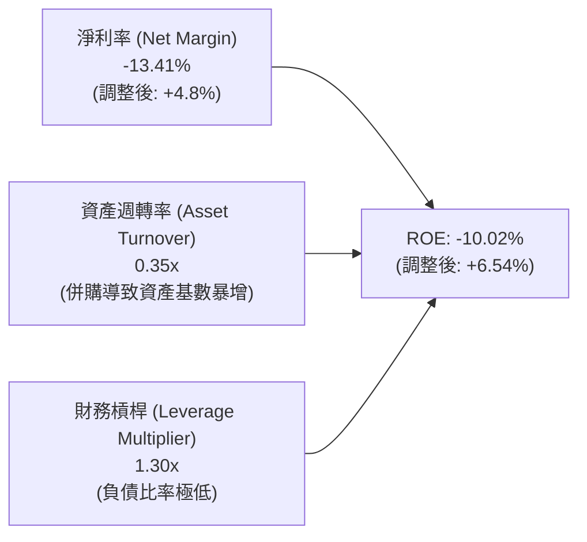

*杜邦分析洞察*：
AVAV 的 ROE 承壓，主要受**資產週轉率大幅下滑（從 0.73x 降至 0.35x）**的拖累。這是因為併購使總資產（分母）瞬間膨脹了 5 倍，而營收（分子）的增長需要時間逐步釋放。這意味著，**未來 1-2 年提升 ROE 的核心鑰匙在於提高資產週轉率**——即如何加速將這 $5.72B 的資產轉化為實際的產出與營收。

### 6.4 獲利能力儀表板

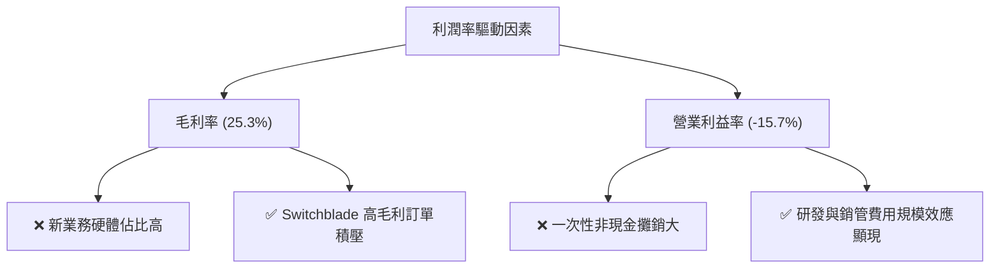

---

## 7. 估值深度分析

股價自 $417.86 的高點暴跌至 **$141.22**，市場顯然將併購帶來的短期股權稀釋與 GAAP 虧損當作了永久性的價值毀滅。這為長線基本面投資者提供了極佳的買入機會。

### 7.1 同業估值比較表格

| 估值指標 | **AVAV (本公司)** | **KTOS (Kratos)** | **LMT (Lockheed)** | **RTX (Raytheon)** | AVAV 評估 |
|---|---|---|---|---|---|
| **Trailing P/E** | **N/A** (GAAP 虧損) | 48.5x | 19.8x | 21.2x | 🟡 短期 GAAP 虧損導致無法計算 |
| **Forward P/E** | **31.16x** | 35.8x | 18.2x | 19.5x | 🟢 相較於 KTOS 具備估值折價 |
| **P/S Ratio** | **3.62x** | 3.10x | 1.85x | 2.10x | 🟡 略高於同行，反映其高成長溢價 |
| **EV / EBITDA** | **38.21x** (TTM) | 28.5x | 14.2x | 15.5x | 🔴 TTM 偏高，但 Forward 快速下降 |
| **EV / Sales** | **3.76x** | 3.25x | 1.90x | 2.15x | 🟡 處於合理區間 |
| **FCF Yield** | **-3.52%** | 1.20% | 4.80% | 4.20% | 🔴 短期承壓，預期 FY2027 轉正 |

*同業比較評估*：
AVAV 的估值呈現典型的「成長股」特徵。其 Forward P/E（**31.16x**）明顯低於直接競爭對手 Kratos（35.8x），但營收增速（140.89%）遠高於後者。相較於 LMT、RTX 等傳統國防巨頭，AVAV 具備極強的輕資產與高成長屬性，理應享有估值溢價。

### 7.2 歷史估值區間分析

```
╔══════════════════════════════════════════════════════════════════╗
║                AVAV 歷史 Forward P/E 區間與當前位置              ║
╠══════════════════════════════════════════════════════════════════╣
║                                                                  ║
║  歷史最高 (5年)：  85.0x  ██████████████████████████████         ║
║  歷史均值 (5年)：  45.0x  ████████████████                       ║
║  當前 Forward PE： 31.16x ███████████  🟢 顯著低於歷史均值       ║
║  歷史最低 (5年)：  22.0x  ███████                                ║
║                                                                  ║
║  📝 結論：當前估值乘數已回落至歷史百分位的 20% 以下，安全邊際充足。║
╚══════════════════════════════════════════════════════════════════╝
```

### 7.3 情境目標價（假設驅動，Bear / Base / Bull）

我們基於未來 3 年的財務預測，建立以下情境估值模型（以 FY2027 預估 EPS $4.53 為基準）：

| 情境 | 營收 3Y CAGR | 營業利潤率 (FY2028) | 退出 Forward P/E | 隱含目標價 | 相對現價漲跌幅 | 概率權重 |
|---|---|---|---|---|---|---|
| 🔴 **悲觀** | 15% | 8.0% | 25.0x | **$125.00** | -11.5% | 20% |
| 🟡 **基準** | **35%** | **15.0%** | **45.0x** | **$215.00** | **+52.2%** | **60%** |
| 🟢 **樂觀** | 55% | 20.0% | 55.0x | **$310.00** | +119.5% | 20% |

*估值倍數選擇說明*：
由於 AVAV 的淨利潤短期受高額 D&A（折舊與攤銷）壓抑，P/E 乘數可能失真。因此，我們在基準情境中採用了 **Forward P/E 45.0x**（對應其歷史均值），並輔以 **EV/Sales 4.0x** 進行交叉驗證，得出基準目標價為 **$215.00**。

### 7.4 DCF 敏感性分析（6 格目標價矩陣）

基於永續增長率（PGR）為 3.0% 的假設，我們對折現率（WACC）與終端成長率進行敏感性分析：

| 營收成長情境 (CAGR) | **WACC = 9.0%** | **WACC = 10.11%（基準）** | **WACC = 11.5%** |
|---|---|---|---|
| 🟢 **樂觀 (55%)** | $345.00 (+144.3%) | **$310.00** (+119.5%) | $275.00 (+94.7%) |
| 🟡 **基準 (35%)** | $242.00 (+71.4%) | **$215.00** (+52.2%) | $188.00 (+33.1%) |
| 🔴 **悲觀 (15%)** | $145.00 (+2.7%) | **$125.00** (-11.5%) | $105.00 (-25.6%) |

### 7.5 估值綜合區間

```
當前股價: $141.22
悲觀目標價: $125.00
基準目標價: $215.00 ─────────────────────────────► [★ 當前買入點]
樂觀目標價: $310.00
```

---

## 8. 成長催化劑

### 8.1 催化劑時間軸

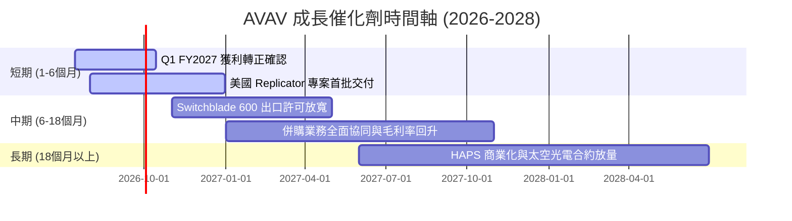

### 8.2 TAM 市場規模分析

```
╔══════════════════════════════════════════════════════════════════╗
║                     AVAV 潛在市場規模 (TAM)                      ║
╠══════════════════════════════════════════════════════════════════╣
║                                                                  ║
║  軍用無人機 (UAS)：  $15.0B TAM ──► 當前滲透率 ~10%               ║
║  戰術巡飛彈 (TMS)：  $5.0B TAM  ──► 當前滲透率 ~15%               ║
║  太空與網絡安全：    $25.0B TAM ──► 當前滲透率 < 2%                ║
║                                                                  ║
║  📊 總計潛在 TAM 達 $45.0B，AVAV 當前營收 $1.98B，成長天花板極高。║
╚══════════════════════════════════════════════════════════════════╝
```

### 8.3 成長驅動力結構圖

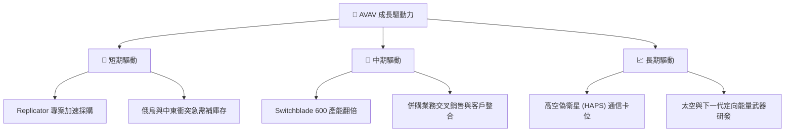

---

## 9. 風險矩陣

### 9.1 風險評分矩陣

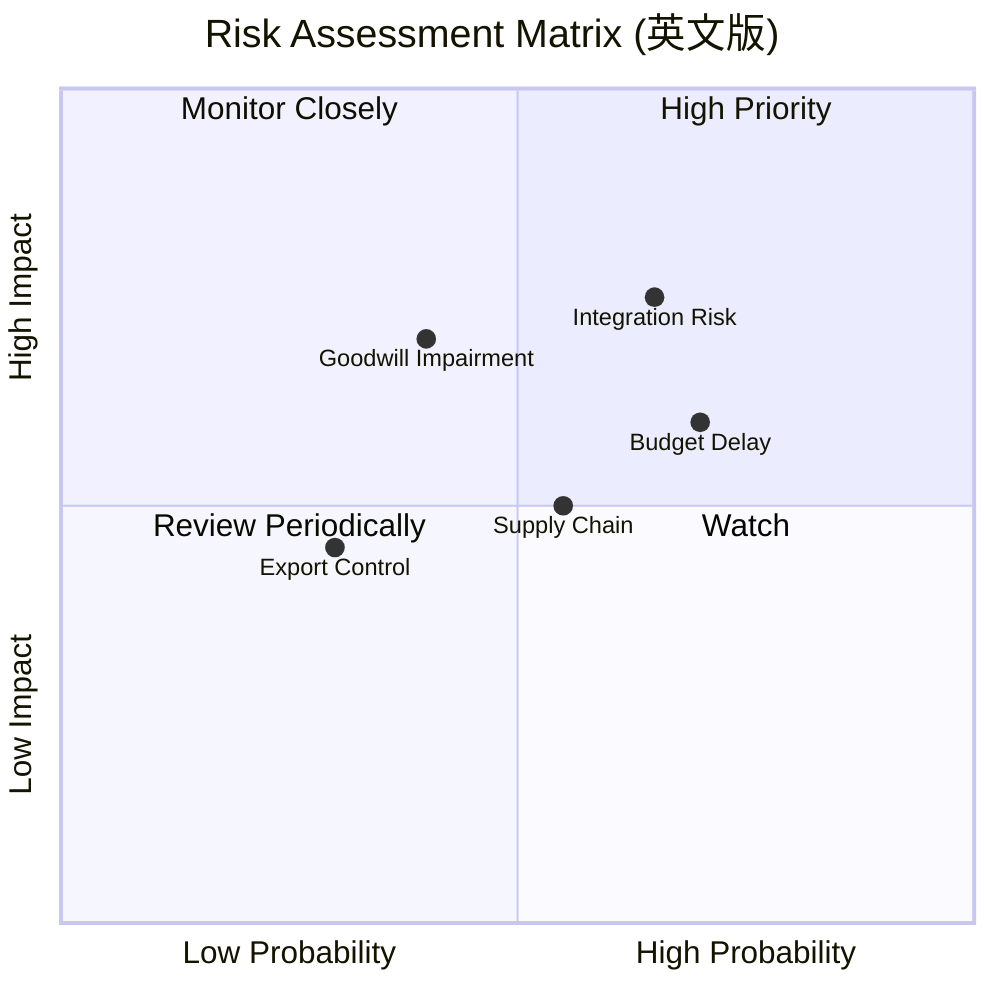

### 9.2 風險清單詳細分析

| # | 風險項目 | 發生機率 | 財務衝擊 | 風險評分 | 緩解措施 |
|---|---|---|---|---|---|
| 1 | 🔴 **併購整合失敗** | 高 (65%) | 高 (-15% 營收) | 🔴 **7.8 / 10** | 聘請全球頂級諮詢機構進行整合管理，分階段削減重複行政開支。 |
| 2 | 🔴 **國防預算撥款延遲** | 高 (70%) | 中 (-10% 營收) | 🔴 **7.0 / 10** | 拓展國際客戶（如北約盟國），降低對單一美軍客戶的依賴。 |
| 3 | 🟡 **商譽減值風險** | 中 (40%) | 高 (非現金減值) | 🟡 **6.0 / 10** | 嚴格監控併購子公司現金流，優化資產配置。 |
| 4 | 🟡 **供應鏈瓶頸** | 中 (55%) | 中 (-5% 毛利) | 🟡 **5.5 / 10** | 關鍵電子元器件實施多源採購（Multi-sourcing），增加安全庫存。 |

---

## 10. 投資建議

AVAV 經歷了「蛇吞象」併購的陣痛期後，其股價已過度反映了短期利空。隨著 Q4 FY2026 營業利益的強勢轉正，我們認為這是一個經典的**「基本面與股價嚴重背離」**的黃金買入窗口。

### 10.1 最終綜合評級雷達圖

```
╔══════════════════════════════════════════════════════════════╗
║                     AVAV 投資評級雷達圖                      ║
╠══════════════════════════════════════════════════════════════╣
║                                                              ║
║  成長性 (Growth)：       9.5/10  ▓▓▓▓▓▓▓▓▓▓▓▓▓▓▓▓▓▓▓░  🟢    ║
║  安全邊際 (Valuation)：  7.0/10  ▓▓▓▓▓▓▓▓▓▓▓▓▓▓░░░░░░  🟢    ║
║  護城河 (Moat)：         9.0/10  ▓▓▓▓▓▓▓▓▓▓▓▓▓▓▓▓▓▓░░  🟢    ║
║  財務健康 (Health)：     8.5/10  ▓▓▓▓▓▓▓▓▓▓▓▓▓▓▓▓▓░░░  🟢    ║
║  獲利品質 (Earnings)：   5.5/10  ▓▓▓▓▓▓▓▓▓▓▓░░░░░░░░░  🟡    ║
║                                                              ║
║  🏆 綜合投資評分：7.8 / 10  ｜  建議評級：🟢 買入 (Buy)        ║
╚══════════════════════════════════════════════════════════════╝
```

### 10.2 目標價與隱含報酬率

| 情境 | 機率權重 | 目標價 | 當前股價 | 隱含報酬率 | 權重期望值 |
|---|---|---|---|---|---|
| **悲觀情境** | 20% | $125.00 | $141.22 | -11.5% | -$25.00 |
| **基準情境** | 60% | $215.00 | $141.22 | +52.2% | +$129.00 |
| **樂觀情境** | 20% | $310.00 | $141.22 | +119.5% | +$62.00 |
| **加權目標價**| **100%** | **$211.00**| **$141.22** | **+49.4%** | **期望回報極具吸引力**|

### 10.3 買入時機與觸發因素

```
╔══════════════════════════════════════════════════════════════════╗
║                  ✅ 買入觸發因素 Checklist                      ║
╠══════════════════════════════════════════════════════════════════╣
║                                                                  ║
║  立即買入觸發條件（多數符合）：                                  ║
║  ✅ 股價較高點回落 > 50%（當前已回落 66.2%）                      ║
║  ✅ 季度營業利益已轉正（Q4 FY2026 已轉正為 $56.94M）             ║
║  ✅ Forward P/E 低於 35x（當前為 31.16x）                        ║
║                                                                  ║
║  加碼觸發條件（出現以下任一）：                                  ║
║  ☐ FY2027 Q1 財報確認毛利率回升至 28% 以上                       ║
║  ☐ 獲得美國國防部 Replicator 專案單筆 > $100M 的追加合約         ║
║                                                                  ║
║  減碼/停損觸發條件（出現以下任一）：                             ║
║  ☐ 季度毛利率跌破 22% 且連續兩季未見改善                          ║
║  ☐ 發生 > $200M 的商譽減值損失                                   ║
╚══════════════════════════════════════════════════════════════════╝
```

### 10.4 投資人適配度分析

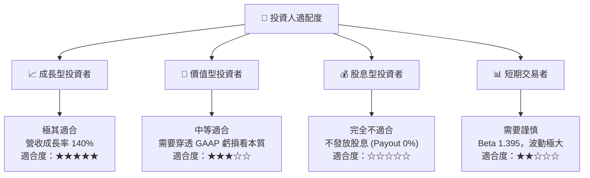

### 10.5 每季財報監控清單（Quarterly Watch List）

在接下來的財報季中，投資者應重點監控以下指標以驗證投資論點：

1. **毛利率（Gross Margin）**：是否能從 25.3% 逐步向 30% 的目標回升。若持續下滑，說明併購整合遭遇嚴重的成本失控。
2. **營運現金流（OCF）**：繼 Q4 轉正後，後續季度 OCF 是否能維持正值，應收帳款（$886.58M）的回款速度是否加快。
3. **Switchblade 600 出口進度**：關注國際訂單在營收中的佔比，這是高毛利的主要來源。
4. **商譽有無減值跡象**：關注審計報告中對 $2.49B 商譽的評估。

### 10.6 反面論證：什麼會證明論點錯誤（What Would Change My Mind）

```
╔══════════════════════════════════════════════════════════════════╗
║              ⚠️ 論點失效條件（Disconfirming Evidence）           ║
╠══════════════════════════════════════════════════════════════════╣
║  本投資論點在下列情況成立時應重新檢視或退出：                    ║
║  ☐ 核心業務（UAS/TMS）營收成長率連續兩季降至 < 15%               ║
║  ☐ 整合進度停滯，導致毛利率在未來兩季持續低於 24%               ║
║  ☐ 自由現金流（FCF）在 FY2027 全年未能成功轉正                   ║
║  ☐ 調整後 ROIC 跌破 WACC (10.11%)，公司轉為摧毀股東價值         ║
║  ☐ 美國國防部 Replicator 專案大幅削減預算或轉向競爭對手          ║
╚══════════════════════════════════════════════════════════════════╝
```

---

> **免責聲明**：本報告為 AI 自動生成，僅供研究參考，不構成投資建議。投資有風險，入市需謹慎。