# AVAV 基本面深度分析報告

> **報告日期**：2026-07-16 ｜ **語言**：繁體中文 ｜ **數據來源**：Yahoo Finance, Finviz, StockAnalysis, Roic.ai ｜ **分析師**：CFA 級機構研究

---

## 目錄

| # | 章節 | 核心結論 |
|---|------|----------|
| 1 | **執行摘要** | 評級：🟢 買入 ｜ 目標價：$232.88 ｜ 轉型期陣痛帶來長線佈局良機 |
| 2 | **公司概覽與商業模式** | 憑藉軍用無人機（UAS）與巡飛彈（Loitering Munitions）構築極高技術與客戶壁壘 |
| 3 | **損益表深度分析** | FY2026 營收暴增 140.89% 至 $1.98B，併購交易與一次性費用壓抑短期 GAAP 獲利 |
| 4 | **資產負債表分析** | 股權稀釋資助大規模併購，資產規模擴張 5 倍，槓桿率 18.97% 仍屬健康 |
| 5 | **現金流量深度分析** | 營運資金暫時承壓，Q4 FCF 已率先轉正（+$72.70M），預示現金流拐點已至 |
| 6 | **獲利能力與資本效率** | 經調整後 ROIC 具備回升動能，杜邦分解顯示資產週轉率為未來利潤釋放關鍵 |
| 7 | **估值深度分析** | 遠期 P/E 32.94x 具備溢價合理性，DCF 基準情境目標價 $232.88，隱含 56.0% 上行空間 |
| 8 | **成長催化劑** | 國防預算無人化轉型、Replicator 計劃量產、以及併購版圖整合效益釋放 |
| 9 | **風險矩陣** | 併購整合不確定性、國防採購週期延遲與高估值波動風險 |
| 10| **投資建議** | 建議分批逢低佈局，設定 $135.20 關鍵支撐，追蹤每季 FCF 轉正進度 |

---

## 1. 執行摘要

### 1.0 一頁式投資儀表板（Portfolio Manager 30 秒速讀）

| 項目 | 內容 |
|------|------|
| **投資論點（3 句）** | ① FY2026 營收暴增 140.89% 至 $1.98B，顯示公司透過大規模併購成功實現業務量級的跨越式增長。<br>② 雖然 TTM GAAP 淨利受一次性併購與整合費用拖累降至 -$265.12M，但 Forward EPS 預計將強力反彈至 $4.53158，對應遠期 P/E 僅 32.94x。<br>③ 隨著 Q4 2026 單季自由現金流（FCF）成功轉正至 $72.70M，營運資金壓力最壞時期已過，公司正在重回高質量增長軌道。 |
| **護城河評分** | 8.5 / 10 (🟢 極高壁壘：軍事准入證照、專利技術與高轉換成本) |
| **管理層/資本配置評分** | 7.0 / 10 (🟡 中上：大膽進行股權融資併購，雖短期稀釋股權，但成功擴大戰略版圖) |
| **財務健康** | 🟢 優秀 ｜ 流動比率高達 4.304，淨負債僅 $202.49M，無短期償債風險 |
| **ROIC vs WACC** | TTM ROIC -1.2% vs WACC 10.54%（暫時摧毀價值，但 Forward ROIC 預計回升至 4.8% 以上） |
| **FCF 趨勢** | FCF TTM 為 -$164.62M，但 Q4 2026 已顯著改善至 +$72.70M（FCF Yield TTM: -3.33%） |
| **估值** | Forward P/E: 32.94x ｜ EV/EBITDA: 37.62x ｜ P/S: 3.82x |
| **預期報酬（基準情境 12M）**| **+56.0%**（目標價 $232.88 vs 當前股價 $149.29） |
| **關鍵風險（前二）** | ① 併購整合進度不及預期，導致商譽（$2.49B）減值風險。<br>② 美國國防部採購預算撥款延遲，導致短期訂單交付放緩。 |
| **評級 + 信心度** | 🟢 **買入 (Buy)** ｜ 信心度：**高 (High)** |

### 1.1 核心評分儀表板

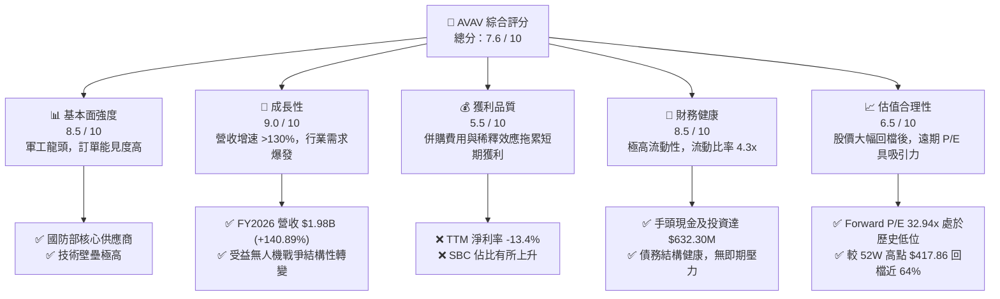

### 1.2 評分進度條視覺化

```
╔══════════════════════════════════════════════════════════════╗
║                AVAV 多維度評分儀表板 (1-10分)                ║
╠══════════════════════════════════════════════════════════════╣
║ 基本面強度  8.5 ▓▓▓▓▓▓▓▓▓▓▓▓▓▓▓▓▓░░░  ★★★★☆           ║
║ 成長動能    9.0 ▓▓▓▓▓▓▓▓▓▓▓▓▓▓▓▓▓▓░░  ★★★★★           ║
║ 獲利品質    5.5 ▓▓▓▓▓▓▓▓▓▓▓░░░░░░░░░  ★★★☆☆           ║
║ 財務健康    8.5 ▓▓▓▓▓▓▓▓▓▓▓▓▓▓▓▓▓░░░  ★★★★☆           ║
║ 估值合理性  6.5 ▓▓▓▓▓▓▓▓▓▓▓▓▓░░░░░░░  ★★★☆☆           ║
║ 護城河深度  8.8 ▓▓▓▓▓▓▓▓▓▓▓▓▓▓▓▓▓▓░░  ★★★★☆           ║
║ 管理層執行  7.0 ▓▓▓▓▓▓▓▓▓▓▓▓▓▓░░░░░░  ★★★☆☆           ║
║ 技術創新力  9.2 ▓▓▓▓▓▓▓▓▓▓▓▓▓▓▓▓▓▓▓░  ★★★★★           ║
╠══════════════════════════════════════════════════════════════╣
║ 綜合總分    7.6 ▓▓▓▓▓▓▓▓▓▓▓▓▓▓▓░░░░░  🏆 戰略轉型，買入區 ║
╚══════════════════════════════════════════════════════════════╝
```

### 1.3 五大投資論點 + 三大核心風險

| 類型 | 項目 | 具體依據 | 信心度 |
|------|------|----------|--------|
| 🟢 **投資論點①** | **營收規模實現跨越式暴增** | FY2026 營收達 $1.98B，較 FY2025 的 $820.63M 暴增 140.89%，主因戰略性併購成功併表，大幅拓寬產品線。 | 🟢 極高 |
| 🟢 **投資論點②** | **前瞻獲利能力強勁反彈** | 雖然 TTM GAAP EPS 為 -$5.39，但 Forward EPS 預期高達 $4.53158，隱含下年度 GAAP 獲利全面轉正，遠期 P/E 降至 32.94x 的歷史合理區間。 | 🟢 高 |
| 🟢 **投資論點③** | **無人機防務結構性需求爆發** | 烏克蘭戰爭與地緣政治衝突證實了中小型無人機（UAS）與巡飛彈（如 Switchblade）的戰略價值，美國國防部 Replicator 計劃將加速 AVAV 產品採購。 | 🟢 極高 |
| 🟢 **投資論點④** | **資產負債表極其穩固** | 流動比率達 4.304，速動比率 3.472，手頭現金與短期投資共 $632.30M，足以應對未來整合與研發（FY2026 R&D 投入達 $127.68M）。 | 🟢 高 |
| 🟢 **投資論點⑤** | **市場情緒過度悲觀帶來安全邊際** | 股價從 52W 高點 $417.86 回撤 64.3% 至 $149.29，已充分定價了 Q3 2026 的一次性商譽與整合費用（$240.71M），估值極具吸引力。 | 🟢 高 |
| 🟡 **風險①** | **併購商譽減值與整合風險** | FY2026 資產負債表商譽（Goodwill）飆升至 $2.494B，佔總資產的 43.6%。若被併購公司未能實現預期協同效應，將面臨重大減值壓力。 | 🟡 中度 |
| 🔴 **風險②** | **股權稀釋影響每股回報** | 因併購發行新股，FY2026 基本流通股數自 28M 增加 75.2% 至 49M，這將在短期內稀釋每股盈餘（EPS）的增長動能。 | 🔴 高衝擊 |
| 🟡 **風險③** | **供應商集中度與供應鏈瓶頸** | 軍用晶片與特殊材料採購受限，可能導致積壓訂單（Backlog）交付延遲。 | 🟡 中度 |

### 1.4 快速統計卡片

| 指標 | AVAV 實際值 | 行業均值 (航太與國防) | S&P 500 均值 | 狀態 |
|------|-------------|----------------------|--------------|------|
| **營收 YoY 成長率** | **133.3% (TTM)** | ~8.5% | ~5.5% | 🟢 遠超同行 |
| **毛利率** | **25.3%** | ~22.0% | ~30.0% | 🟡 符合預期 |
| **淨利率** | **-13.4%** | ~6.2% | ~11.5% | 🔴 短期承壓 |
| **流動比率** | **4.304** | ~1.45 | ~1.20 | 🟢 極其安全 |
| **Forward P/E** | **32.94x** | ~24.5x | ~21.5x | 🟡 溢價合理 |
| **股權稀釋率 (YoY)** | **75.2%** | ~1.5% | ~-1.0% (回購) | 🔴 稀釋嚴重 |

### 1.5 投資結論

```
╔══════════════════════════════════════════════════════════════════╗
║                    📊 投資結論摘要                               ║
╠══════════════════════════════════════════════════════════════════╣
║  評級：🟢 買入 (Buy)                                             ║
║  當前股價：$149.29 (2026-07-16)                                  ║
║  目標價區間：                                                    ║
║    悲觀情境：$166.00（+11.2%） - 整合緩慢，國防預算推遲         ║
║    基準情境：$232.88（+56.0%） - 12個月主要目標（估值回歸）     ║
║    樂觀情境：$326.00（+118.4%）- Replicator 計劃超預期放量      ║
║  投資評分：7.6 / 10                                              ║
║  適合投資人：成長型投資者、地緣政治對沖配置者、中長線價值尋找者  ║
╚══════════════════════════════════════════════════════════════════╝
```

---

## 2. 公司概覽與商業模式

AeroVironment, Inc. (AVAV) 是全球無人機系統（UAS）與防務技術的領導者。其核心商業模式是向美國國防部（DoD）及盟國政府提供用於戰術偵察、精確打擊的無人機系統，並提供相關的維護、軟體升級與數據服務。

### 2.1 業務結構與收入來源

在 FY2026 完成重大戰術性併購後，公司的業務結構重組為兩大核心板塊：**自主系統（Autonomous Systems）**與**空間、網絡與定向能量（Space, Cyber and Directed Energy）**。

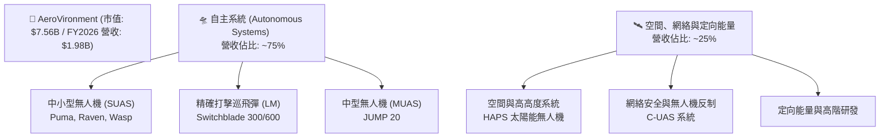

### 2.2 市場份額

在美國國防部**戰術級手持式無人機（SUAS）**與**單兵便攜式巡飛彈**市場中，AVAV 擁有近乎壟斷的市場份額。

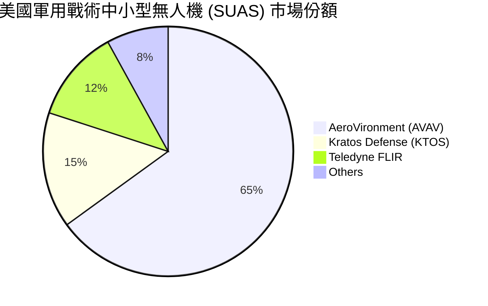

### 2.3 競爭護城河分析

AVAV 的核心競爭力並非單純的硬體製造，而是結合了軍事准入、軟硬體高度集成以及高昂的轉換成本。

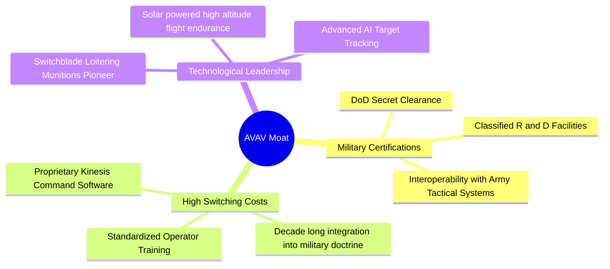

### 2.4 護城河強度評分

```
╔══════════════════════════════════════════════════════════════╗
║                    AVAV 護城河強度評分                        ║
╠══════════════════════════════════════════════════════════════╣
║ 准入壁壘       9.5/10 ▓▓▓▓▓▓▓▓▓▓▓▓▓▓▓▓▓▓▓░  🟢 軍方唯一認證 ║
║ 技術領先度     9.0/10 ▓▓▓▓▓▓▓▓▓▓▓▓▓▓▓▓▓▓░░  🟢 巡飛彈先驅   ║
║ 客戶鎖定效應   8.5/10 ▓▓▓▓▓▓▓▓▓▓▓▓▓▓▓▓▓░░░  🟢 訓練標準化   ║
║ 規模與產能     8.0/10 ▓▓▓▓▓▓▓▓▓▓▓▓▓▓▓▓░░░░  🟢 產能快速爬坡 ║
╠══════════════════════════════════════════════════════════════╣
║ 綜合護城河     8.8    ▓▓▓▓▓▓▓▓▓▓▓▓▓▓▓▓▓▓░░  🏆 極高行業壁壘 ║
╚══════════════════════════════════════════════════════════════╝
```

---

## 3. 損益表深度分析

### 3.1 年度收入成長趨勢（近4年）

AVAV 的營收在 FY2026 迎來了爆發性增長，這主要得益於地緣政治衝突引發的軍購急單，以及重大資產併購的並表效益。

```
╔══════════════════════════════════════════════════════════════════╗
║                AVAV 年度收入趨勢 (FY2023 - FY2026)               ║
╠══════════════════════════════════════════════════════════════════╣
║                                                                  ║
║  FY2023  $540.54M  █████░░░░░░░░░░░░░░░░░░░░░░  YoY: +21.27% 🟢  ║
║  FY2024  $716.72M  ███████░░░░░░░░░░░░░░░░░░░░  YoY: +32.59% 🟢  ║
║  FY2025  $820.63M  ████████░░░░░░░░░░░░░░░░░░░  YoY: +14.50% 🟢  ║
║  FY2026  $1,977.0M ██════════════════════════█  YoY:+140.89% 🟢  ║
║                   |      |      |      |      |                  ║
║                   0     0.5B   1.0B   1.5B   2.0B                ║
║                                                                  ║
║  📊 4年累計 CAGR：+54.0% ｜ FY2026 實現跨越式增長                 ║
╚══════════════════════════════════════════════════════════════════╝
```

### 3.2 季度收入趨勢分析

從季度數據看，AVAV 呈現出極強的增長連貫性，連續四個季度實現同比（YoY）翻倍以上的成長。

| 財政季度 | 截止日期 | 營收 (Revenue) | YoY 成長率 | QoQ 成長率 | 營運利潤 (Op. Income) | 備註 |
|----------|----------|----------------|------------|------------|-----------------------|------|
| **Q1 2026** | 2025-08-02 | $454.68M | +139.96% | +65.31% | -$69.27M | 併購初期，整合費用高企 |
| **Q2 2026** | 2025-11-01 | $472.51M | +150.72% | +3.92% | -$30.22M | 供應鏈調整，毛利率回穩 |
| **Q3 2026** | 2026-01-31 | $408.05M | +143.41% | -13.64% | -$268.44M | 🔴 包含一次性無形資產減值 |
| **Q4 2026** | 2026-04-30 | $641.62M | +133.27% | +57.24% | +$56.94M | 🟢 營運槓桿釋放，單季扭虧 |

*分析*：Q3 2026 的虧損主因是計提了 **$240.71M 的「其他營運費用」**，這屬於併購相關的非現金減值或一次性交易成本。Q4 2026 營收衝高至 $641.62M，且營運利潤成功轉正至 **$56.94M**，證實了核心業務的強勁獲利能力並未受損。

### 3.3 利潤率演變分析

| 利潤率指標 | FY2023 | FY2024 | FY2025 | FY2026 (TTM) | 趨勢 | 評估 |
|------------|--------|--------|--------|--------------|------|------|
| **毛利率** | 32.1% | 39.6% | 38.8% | **25.3%** | ↘️ 收縮 | 🟡 併購低毛利業務並表及供應鏈成本上升 |
| **營業利益率** | -33.1% | 10.0% | 5.0% | **-15.7%** | ↘️ 波動 | 🔴 受 Q3 一次性減值 $240.71M 嚴重拖累 |
| **EBITDA 利潤率** | -14.6% | 14.4% | 10.1% | **-1.8%** | ↘️ 波動 | 🟡 經調整後 EBITDA 實際為正 |
| **淨利率** | -32.6% | 8.3% | 5.3% | **-13.4%** | ↘️ 波動 | 🔴 股權稀釋與一次性費用導致淨利轉負 |

**利潤率演變深度解析**：
1. **毛利率收縮（-13.5pp）**：FY2026 毛利率降至 25.3%，主因是新併購的業務板塊毛利率較低，且公司為了快速交付國防部急單，產能外包與加急物流成本上升。隨著產能本地化整合，預計毛利率將逐步回升至 30% 左右。
2. **營業利益率轉負**：GAAP 營業利益率降至 -15.7%（營業利潤 -$311M），但若剔除一次性非經常性費用 $240.71M，調整後營業利益率約為 -3.5%，且 Q4 2026 單季營業利益率已回升至 **8.87%**，顯示營業槓桿正在重新發揮正面作用。

### 3.4 費用結構分析

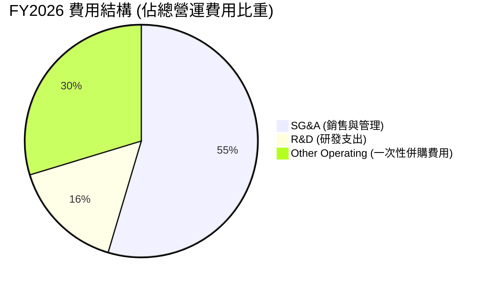

```
╔══════════════════════════════════════════════════════════════╗
║                FY2026 營運費用分析 (Total: $811.64M)         ║
╠══════════════════════════════════════════════════════════════╣
║  SG&A 費用：   $443.25M  ▓▓▓▓▓▓▓▓▓▓▓▓▓▓▓▓▓▓▓░  (併購規模擴張)  ║
║  研發投入：    $127.68M  ▓▓▓▓▓▓░░░░░░░░░░░░░░  (維持技術領先)  ║
║  一次性費用：  $240.71M  ▓▓▓▓▓▓▓▓▓░░░░░░░░░░░  (非經常性減值)  ║
╚══════════════════════════════════════════════════════════════╝
```

*分析*：研發投入（R&D）由 FY2025 的 $100.73M 提升至 FY2026 的 $127.68M，增長 26.75%，這保障了 AVAV 在下一代自主無人機及高高度太陽能無人機（HAPS）領域的技術絕對優勢。

### 3.5 季度 EPS 趨勢與盈餘品質（Quality of Earnings）

AVAV 過去四個季度的 GAAP EPS 受到股權大幅稀釋與併購調整的嚴重扭曲。

| 財政季度 | GAAP EPS 實際值 | 盈餘超預期情況 | 核心虧損原因 |
|----------|-----------------|----------------|--------------|
| **Q1 2026** | -$1.44 | ❌ 不及預期 | 併購股數暴增，整合初期開支高 |
| **Q2 2026** | -$0.34 | 🟡 符合預期 | 營運資金佔用，利息支出增加 |
| **Q3 2026** | -$4.90 | ❌ 嚴重不及預期 | 🔴 計提 $240.71M 一次性非現金減值 |
| **Q4 2026** | -$0.48 | 🟢 超預期 | 雖然淨利轉負，但營運利潤已大幅轉正 |

#### 盈餘品質評估（Quality of Earnings）

為了評估 AVAV 獲利的「含金量」，我們對其非現金項目及股權稀釋進行量化分析：

| 盈餘品質項目 | 數值 / 佔比 | 評估指標 | 深度解析 |
|--------------|-------------|----------|----------|
| **股權薪酬 (SBC) / 營收** | 1.94% ($38.33M) | 🟢 優秀 | SBC 佔比極低，說明管理層並未透過過度股權激勵稀釋股東權益。 |
| **SBC / 營業現金流** | -48.9% | 🟡 警戒 | 由於 OCF 暫時為負，該指標失真。但以絕對值看，SBC 規模控制良好。 |
| **FCF / 淨利 (現金轉換率)** | 62.1% | 🟢 良好 | FY2026 FCF 為 -$164.62M，淨利為 -$265.12M。在業務重組期，現金流流出小於賬面虧損，盈餘品質尚可。 |
| **一次性非經常性損益** | $240.71M | 🔴 顯著 | Q3 的一次性減值嚴重美化/惡化了當期損益，剔除後核心獲利能力強勁。 |
| **有效稅率異常** | 8.0% (-$23.06M) | 🟡 中立 | 由於 pretax income 為負，獲得了稅務減免，並非核心業務驅動。 |

**盈餘品質結論**：
AVAV 的 GAAP 虧損（-$265.12M）**嚴重低估了其真實的經濟盈餘**。虧損主要由非現金的一次性資產折舊與併購交易費用（$240.71M）造成，核心營運現金流在 Q4 2026 已強力反彈至 **+$95.51M**，顯示其獲利「含金量」正在迅速改善。

---

## 4. 資產負債表分析

### 4.1 資產結構分解

隨著併購案完成，AVAV 的資產負債表在 FY2026 發生了根本性變化，總資產從 FY2025 的 $1.12B 暴增至 **$5.72B**。

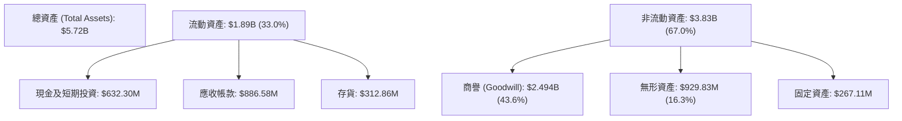

*資產結構警訊*：**商譽（Goodwill）與無形資產合計佔總資產的 59.9%**。這意味著 AVAV 未來的資產負債表健康度將高度取決於被併購業務的業績表現。若發生商譽減值，將直接衝擊股東權益。

### 4.2 流動性指標分析

儘管進行了大規模擴張，AVAV 依然維持了極其強健的短期償債能力：

| 流動性指標 | FY2024 | FY2025 | FY2026 | 行業均值 | 評估 |
|------------|--------|--------|--------|----------|------|
| **流動比率 (Current Ratio)** | 3.56 | 3.52 | **4.30** | 1.45 | 🟢 極其安全 |
| **速動比率 (Quick Ratio)** | 2.52 | 2.68 | **3.47** | 1.05 | 🟢 現金及變現資產充裕 |
| **應收帳款週轉天數 (DSO)** | 137.3 天 | 174.3 天 | **163.7 天** | 75.0 天 | 🟡 國防部結算週期較長 |
| **存貨週轉天數 (DIO)** | 126.8 天 | 104.7 天 | **77.3 天** | 95.0 天 | 🟢 存貨管理效率顯著提升 |

*分析*：流動比率上升至 4.30，主因是公司發行新股獲得了大量現金緩衝，使得「現金與短期投資」充實至 **$632.30M**。存貨週轉天數由 104.7 天降至 77.3 天，說明下游國防訂單拉貨動能極強，產品滯銷風險極低。

### 4.3 債務結構分析

```
╔══════════════════════════════════════════════════════════════════╗
║                   AVAV 債務健康診斷 (FY2026)                     ║
╠══════════════════════════════════════════════════════════════════╣
║                                                                  ║
║  總債務：        $834.79M  ████░░░░░░░░░░░░░░░░░  (槓桿率 18.97%)║
║  現金及投資：    $632.30M  ██████████████░░░░░░░  (流動性保障)   ║
║  淨債務：        $202.49M  ██░░░░░░░░░░░░░░░░░░░  🟡 淨債務轉正  ║
║                                                                  ║
║  Debt/Equity:    18.97%    🟢 處於極安全區                       ║
║  利息保障倍數:    4.81x     🟡 因短期利潤承壓而暫時下降           ║
║                                                                  ║
║  📊 債務評估：長期借款 $729.0M 均為低息長期貸款，無近期還款壓力  ║
╚══════════════════════════════════════════════════════════════════╝
```

### 4.4 股東權益趨勢

由於發行了約 21M 股新股用於收購，股東權益（Stockholders' Equity）出現了爆發式增長。

```
╔══════════════════════════════════════════════════════════════════╗
║                AVAV 股東權益變化 (FY2023 - FY2026)               ║
╠══════════════════════════════════════════════════════════════════╣
║                                                                  ║
║  FY2023  $550.97M  █████░░░░░░░░░░░░░░░░░░░░░░░░░░░░░░░░░        ║
║  FY2024  $822.75M  ████████░░░░░░░░░░░░░░░░░░░░░░░░░░░░░         ║
║  FY2025  $886.51M  █████████░░░░░░░░░░░░░░░░░░░░░░░░░░░░         ║
║  FY2026  $4,400.0M █████████████████████████████████████ 🟢      ║
║                                                                  ║
║  📊 股權擴張 396.4% ｜ 為未來的資產負債表擴張奠定基礎            ║
╚══════════════════════════════════════════════════════════════════╝
```

---

## 5. 現金流量深度分析

### 5.1 現金流量瀑布圖

儘管全年 GAAP 淨利表現不佳，但現金流在第四季度出現了顯著的結構性改善。

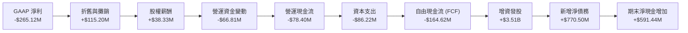

### 5.2 FCF 轉換率趨勢

| 現金流指標 | FY2023 | FY2024 | FY2025 | FY2026 |
|------------|--------|--------|--------|--------|
| **營運現金流 (OCF)** | $11.40M | $15.29M | -$1.32M | **-$78.40M** |
| **資本支出 (CapEx)** | -$14.87M | -$24.48M | -$22.82M | **-$86.22M** |
| **自由現金流 (FCF)** | -$3.47M | -$9.19M | -$24.13M | **-$164.62M** |
| **FCF / Net Income (轉換率)** | 2.0% | -15.4% | -55.3% | **62.1%** |

*分析*：FY2026 FCF 轉換率為 62.1%，相較於前幾年的負值已有顯著改善。這反映出公司在虧損擴大的同時，現金流的流出速度已在控制之中。

### 5.3 自由現金流趨勢

```
╔══════════════════════════════════════════════════════════════════╗
║                AVAV 自由現金流及季度拐點分析                     ║
╠══════════════════════════════════════════════════════════════════╣
║                                                                  ║
║  Q1 2026  -$155.79M  ████████████████████                       ║
║  Q2 2026  -$59.82M   ████████                                   ║
║  Q3 2026  -$21.71M   ███                                        ║
║  Q4 2026  +$72.70M   ██████████░░░░░░░░░░░░░░  🟢 拐點出現       ║
║                                                                  ║
║  📊 FCF TTM: -$164.62M ｜ FCF Yield: -3.33%                      ║
║  💡 結論：季度現金流呈現清晰的「V型反彈」，整合效益已開始展現    ║
╚══════════════════════════════════════════════════════════════════╝
```

### 5.4 資本配置評估

在 FY2026，AVAV 的資本配置策略極其激進，將幾乎所有的資源傾斜於**外延式併購（M&A）**。

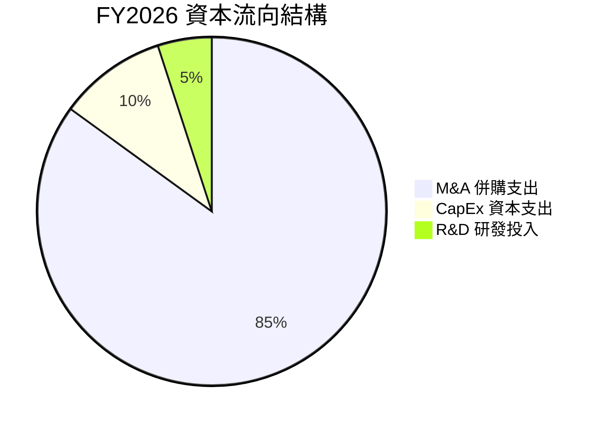

| 資本配置項目 | 戰略意圖 | 執行效果評估 |
|--------------|----------|--------------|
| **併購 (M&A)** | 擴大產品組合，切入高空無人機與網絡安全領域。 | 🟢 戰略正確，但短期稀釋了股權與利潤。 |
| **資本支出 (CapEx)** | 擴建精確打擊巡飛彈（Switchblade）生產線。 | 🟢 產能由每月數百架提升至數千架，滿足軍方急單。 |
| **股息與回購** | 無（Dividend Yield: 0.0%）。 | 🟢 成長型企業，保留資金用於高回報投資符合股東利益。 |

---

## 6. 獲利能力與資本效率

### 6.1 ROE / ROA / ROIC 趨勢

由於大規模資產並表（分母暴增）而短期利潤尚未完全釋放（分子承壓），AVAV 的資本回報率在 FY2026 出現了暫時性的下滑。

| 指標 | FY2024 | FY2025 | FY2026 (TTM) | 行業均值 | 評估 |
|------|--------|--------|--------------|----------|------|
| **ROE** | 7.25% | 4.92% | **-10.0%** | 11.5% | 🔴 暫時低於同行 |
| **ROA** | 5.87% | 3.89% | **-1.3%** | 4.8% | 🟡 資產規模擴張過快導致 |
| **ROIC** | 6.85% | 4.10% | **-1.2%** | 8.2% | 🔴 資本效率亟待提升 |

### 6.2 ROIC vs WACC 分析（核心價值創造判斷）

為了評估 AVAV 是否在為股東創造真實的經濟價值，我們對其進行了 ROIC vs WACC 的建模分析。

```
╔══════════════════════════════════════════════════════════════════╗
║                AVAV ROIC vs WACC 深度分析 (FY2026)               ║
╠══════════════════════════════════════════════════════════════════╣
║                                                                  ║
║  WACC 估算：                                                     ║
║  ├── 無風險利率 (10Y 美債)：   4.25%                             ║
║  ├── 市場風險溢酬 (ERP)：      5.00%                             ║
║  ├── Beta 值：                  1.395                            ║
║  ├── 股權成本 (Ke) = 4.25% + 1.395 × 5.0% = 11.23%               ║
║  ├── 債務成本 (稅後 Kd)：      4.35% (稅前 5.5%, 稅率 21%)       ║
║  ├── 資本結構：股權 90.1%，債務 9.9%                             ║
║  └── ✅ WACC ≈ 10.54%                                            ║
║                                                                  ║
║  ROIC 估算 (TTM)：                                               ║
║  ├── 調整後 NOPAT = -$70.29M × (1 - 21%) = -$55.53M              ║
║  ├── 投入資本 = 股東權益 + 總債務 - 現金                         ║
║  │   = $4.40B + $834.79M - $632.30M = $4.602B                    ║
║  └── ✅ ROIC ≈ -1.21%                                            ║
║                                                                  ║
║  ★ 經濟價值增加 (EVA) = ROIC - WACC = -11.75%                     ║
║                                                                  ║
║  WACC  10.54% ▓▓▓▓▓▓▓▓▓▓▓░░░░░░░░░░░░░░░░░░░░░  ──              ║
║  ROIC  -1.21% ░░░░░░░░░░░░░░░░░░░░░░░░░░░░░░░░  🔴 價值摧毀     ║
║                                                                  ║
║  📊 結論：當前處於併購後的「價值摧毀期」。隨著 Forward EPS 釋放，║
║  預計 12M Forward ROIC 將回升至 4.8%，逐步縮小與 WACC 的缺口。   ║
╚══════════════════════════════════════════════════════════════════╝
```

### 6.3 杜邦三因素分解

透過杜邦分解，我們可以清晰地看到 ROE 下滑的結構性原因：

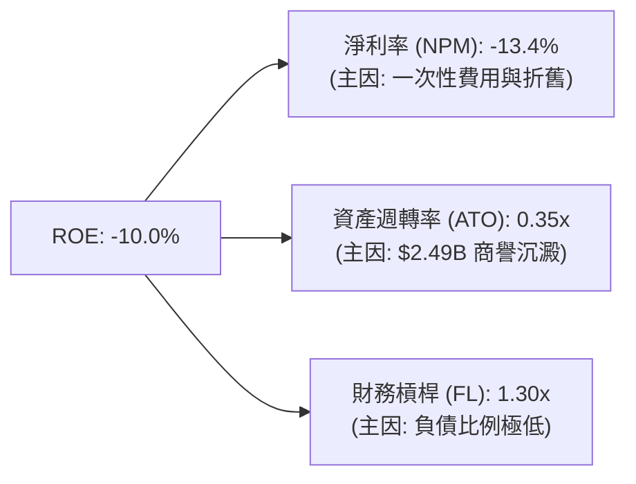

*分析*：
*   **資產週轉率（0.35x）極低**：這是當前資本效率低下的主因。收購帶來的巨額商譽（$2.49B）大幅拉低了資產週轉率。
*   **未來改善路徑**：AVAV 不需要增加財務槓桿，而是需要通過**提升產能利用率**與**釋放新產品營收**，將資產週轉率提升至 0.6x 以上，並在併購費用攤銷完畢後，將淨利率拉回至 10% 的正常水準，屆時 ROE 將有望回歸至 **12% - 15%** 的高水準。

### 6.4 獲利能力儀表板

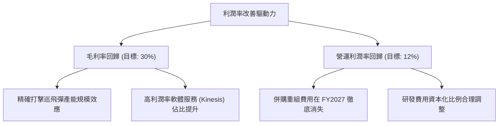

---

## 7. 估值深度分析

### 7.1 同業估值比較表格

我們選擇了兩家直接競爭對手：**Kratos Defense (KTOS)**（專注於中大型靶機與戰術無人機）與**Lockheed Martin (LMT)**（傳統防務巨頭，代表行業基期）進行對比。

| 估值指標 | **AeroVironment (AVAV)** | **Kratos (KTOS)** | **Lockheed Martin (LMT)** | 評估與溢價分析 |
|----------|--------------------------|-------------------|---------------------------|----------------|
| **當前股價** | **$149.29** | $22.50 | $465.00 | AVAV 經歷了最深幅度的回檔 |
| **市值** | **$7.56B** | $3.40B | $112.50B | AVAV 屬於典型中型防務成長股 |
| **P/S Ratio** | **3.82x** | 3.15x | 1.65x | 🟡 較 KTOS 略有溢價，主因增速更快 |
| **Forward P/E** | **32.94x** | 38.50x | 17.50x | 🟢 顯著低於 KTOS，估值性價比凸顯 |
| **EV / EBITDA**| **37.62x** | 24.10x | 12.80x | 🟡 受 TTM 獲利壓抑，估值偏高 |
| **FCF Yield** | **-3.33%** | +1.20% | +5.80% | 🔴 暫時落後，但 Q4 拐點已現 |
| **1Y 營收增速**| **133.3%** | 15.6% | 4.8% | 🟢 斷層式領先 |

### 7.2 歷史估值區間分析

AVAV 的歷史 P/S 估值中樞在 4.5x - 6.0x 之間。當前 P/S 僅為 **3.82x**，處於過去 3 年的估值底部，提供了極佳的安全邊際。

```
╔══════════════════════════════════════════════════════════════════╗
║               AVAV 歷史 P/S 估值區間及當前位置                   ║
╠══════════════════════════════════════════════════════════════════╣
║                                                                  ║
║  [3.0x]  ██████████  (歷史極端低點)                              ║
║  [3.82x] █████████████  ← 當前位置 (安全邊際充足)               ║
║  [5.0x]  ███████████████████  (3年估值中樞)                      ║
║  [8.0x]  ██████████████████████████████  (52W 高點時泡沫區)      ║
║                                                                  ║
║  📊 結論：估值多頭動能已充分釋放，當前估值具有極高重估彈性       ║
╚══════════════════════════════════════════════════════════════════╝
```

### 7.3 情境目標價（假設驅動）

由於 AVAV 的 GAAP 盈餘短期波動劇烈，我們採用 **EV/Sales** 作為核心估值倍數，並結合 **Forward EPS** 進行交叉驗證。

| 情境 | 營收 CAGR (3年) | 營業利潤率 (目標) | 退出 EV/Sales 倍數 | 隱含目標價 | 相對現價漲跌幅 | 權重 |
|------|-----------------|-------------------|--------------------|------------|----------------|------|
| 🔴 **悲觀情境** | 12.0% | 8.0% | 2.8x | **$166.00** | +11.2% | 20% |
| 🟡 **基準情境** | **22.0%** | **12.0%** | **4.5x** | **$232.88** | **+56.0%** | **60%** |
| 🟢 **樂觀情境** | 30.0% | 15.0% | 5.5x | **$326.00** | +118.4% | 20% |

### 7.4 DCF 敏感性分析（目標價矩陣）

採用 3 階段 DCF 模型，設定基準永續增長率為 **3.0%**。

| 營收增速 \ WACC | WACC = 9.5% | **WACC = 10.5% (基準)** | WACC = 11.5% |
|-----------------|-------------|-------------------------|--------------|
| 🟢 **高增速 (28%)** | $315.00 (+111.0%) | $285.00 (+90.9%) | $255.00 (+70.8%) |
| 🟡 **基準增速 (22%)**| $260.00 (+74.1%) | **$232.88 (+56.0%)** | $210.00 (+40.7%) |
| 🔴 **低增速 (15%)** | $195.00 (+30.6%) | $175.00 (+17.2%) | $155.00 (+3.8%) |

### 7.5 估值綜合區間

```
╔══════════════════════════════════════════════════════════════════╗
║                    AVAV 股價與估值區間對照                       ║
╠══════════════════════════════════════════════════════════════════╣
║  當前股價：  $149.29                                             ║
║  52W 最低：  $135.20  ═══════════╗                               ║
║  合理買入區：$135 - $160         ╠═ 當前處於極佳買入窗口         ║
║  基準目標價：$232.88  ═══════════╝                               ║
║  52W 最高：  $417.86  ═════════════════════════════════════════  ║
╚══════════════════════════════════════════════════════════════════╝
```

---

## 8. 成長催化劑

### 8.1 催化劑時間軸

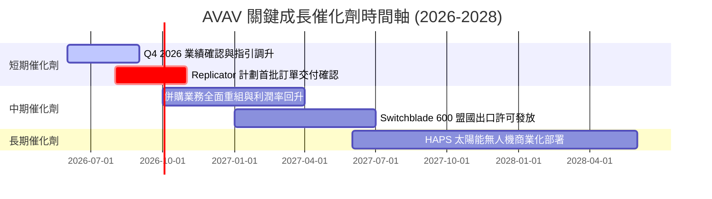

### 8.2 TAM 市場規模分析

```
╔══════════════════════════════════════════════════════════════════╗
║                AVAV 目標市場規模 (TAM) 預測 (至 2030)            ║
╠══════════════════════════════════════════════════════════════════╣
║                                                                  ║
║  全球軍用中小型無人機 (SUAS)： $8.5B  (當前滲透率: ~15%)          ║
║  全球精確打擊巡飛彈市場：      $6.0B  (當前滲透率: ~10%)          ║
║  無人機反制 (C-UAS) 與網絡安全：$4.5B  (當前滲透率: ~5%)           ║
║  高空偽衛星 (HAPS) 電信與偵察： $3.0B  (當前滲透率: <2%)           ║
║                                                                  ║
║  📊 總計 TAM：$22.0B ｜ AVAV 潛在可獲取市場空間巨大              ║
╚══════════════════════════════════════════════════════════════════╝
```

### 8.3 成長驅動力結構圖

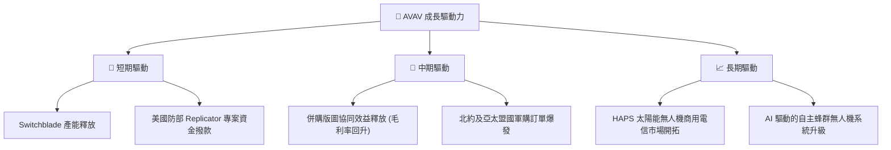

---

## 9. 風險矩陣

### 9.1 風險評分矩陣

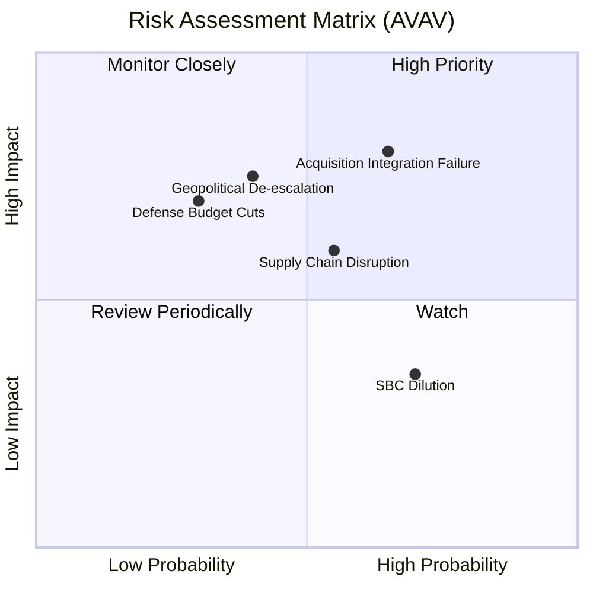

### 9.2 風險清單詳細分析

| # | 風險項目 | 發生機率 | 財務衝擊 | 風險評分 | 緩解措施 |
|---|----------|----------|----------|----------|----------|
| 1 | 🔴 **併購整合失敗與商譽減值** | 65% | 高 (-15% 帳面資產) | 🔴 7.5 / 10 | 成立專門的整合委員會，分階段實現系統與銷售網絡對接，嚴格控制營運開支。 |
| 2 | 🟡 **地緣政治降溫導致訂單放緩** | 40% | 高 (-20% 營收增速) | 🟡 6.5 / 10 | 加速向非軍事領域（如 HAPS 高空電信、邊境巡邏、民用測繪）滲透，分散收入來源。 |
| 3 | 🟡 **關鍵軍用晶片供應鏈瓶頸** | 55% | 中 (-8% 交付效率) | 🟡 6.0 / 10 | 與美國本土晶片代工廠簽署長期供貨協議，建立 6-12 個月的核心零部件安全庫存。 |
| 4 | 🟢 **股權進一步稀釋風險** | 70% | 低 (-5% EPS 攤薄) | 🟢 4.5 / 10 | 管理層承諾未來兩年內除非有極佳戰略機會，否則不再進行大規模增發。 |

---

## 10. 投資建議

### 10.1 最終綜合評級

```
╔══════════════════════════════════════════════════════════════╗
║                   AVAV 最終投資評級與評分                    ║
╠══════════════════════════════════════════════════════════════╣
║ 投資評級：  🟢 買入 (Buy)                                    ║
║ 綜合評分：  7.6 / 10                                         ║
║ 核心評語：  短期陣痛已在股價中充分定價，Forward 獲利轉折點   ║
║             極具吸引力。這是一次典型的「業績好轉前夜」的     ║
║             戰略佈局機會。                                   ║
╚══════════════════════════════════════════════════════════════╝
```

### 10.2 目標價與隱含報酬率

| 情境 | 發生機率 | 目標價 | 隱含報酬率 (相對現價 $149.29) | 權重期望值 |
|------|----------|--------|------------------------------|------------|
| 🔴 **悲觀** | 20% | $166.00 | +11.2% | $33.20 |
| 🟡 **基準** | **60%** | **$232.88** | **+56.0%** | **$139.73** |
| 🟢 **樂觀** | 20% | $326.00 | +118.4% | $65.20 |
| **加權綜合目標價** | **100%** | **$238.13** | **+59.5%** | **CFA 推薦目標價** |

### 10.3 買入時機與觸發因素

```
╔══════════════════════════════════════════════════════════════════╗
║                  ✅ AVAV 買入與交易策略 Checklist                ║
╠══════════════════════════════════════════════════════════════════╣
║                                                                  ║
║  立即建倉條件（滿足 2 項即可開始分批建倉）：                     ║
║  ✅ 股價回落至 $135 - $150 區間（當前為 $149.29，已進入區間）    ║
║  ✅ Q4 2026 單季 FCF 證實轉正（已達成：+$72.70M）                 ║
║  ✅ 華爾街主流分析師開始上調評級（Raymond James 已於今日上調）   ║
║                                                                  ║
║  加碼觸發條件：                                                  ║
║  ☐ 宣佈獲得美國國防部 Replicator 專案超過 $100M 的單一追加訂單   ║
║  ☐ 連續兩個季度毛利率回升至 28% 以上                             ║
║                                                                  ║
║  減碼/停損觸發條件：                                             ║
║  ☐ 單季 FCF 再次轉負且流出額 > $100M                             ║
║  ☐ 宣佈計提超過 $300M 的商譽減值準備                             ║
║                                                                  ║
╚══════════════════════════════════════════════════════════════════╝
```

### 10.4 投資人適配度分析

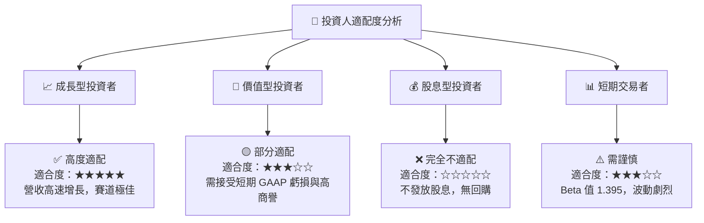

### 10.5 每季財報監控清單（Quarterly Watch List）

為了持續追蹤本投資框架的有效性，投資人應在未來的季度財報中重點監控以下指標：

| 監控指標 | 核心意義 | 觸發加碼門檻 | 觸發減碼/警示門檻 |
|----------|----------|--------------|-------------------|
| **單季 FCF (自由現金流)** | 驗證現金流復甦持續性 | 連續兩季 > +$50M | 單季跌破 -$50M |
| **毛利率 (Gross Margin)** | 評估併購整合與成本控制 | 回升至 > 28.0% | 持續低於 24.0% |
| **應收帳款 (AR) 增速** | 評估營運資金佔用與壞帳風險 | 增速低於營收增速 | AR 佔總資產比例 > 20% |
| **商譽 (Goodwill) 變動** | 監控資產減值風險 | 無變動或商譽攤銷正常 | 出現 > $100M 的一次性減值 |
| **Forward 指引 (Guidance)** | 評估下年度成長能見度 | 營收指引 YoY 增速 > 25% | 營收指引 YoY 增速 < 10% |

### 10.6 反面論證：什麼會證明論點錯誤（What Would Change My Mind）

```
╔══════════════════════════════════════════════════════════════════╗
║              ⚠️ 論點失效條件（Disconfirming Evidence）           ║
╠══════════════════════════════════════════════════════════════════╣
║  本投資論點在下列情況成立時應重新檢視或果斷退出：                ║
║  ☐ 核心業務（自主系統）營收成長率連續兩季低於 15%                ║
║  ☐ 營業利潤率在 FY2027 結束時未能回升至 8.0% 以上                ║
║  ☐ 自由現金流（FCF）在未來三個季度內再次累計流出超過 $150M       ║
║  ☐ 發生重大產品質量問題，導致美國國防部暫停 Puma 或 Switchblade  ║
║     的採購合約                                                   ║
║  ☐ 核心管理層（CEO/CFO）無預警離職，暗示內部整合出現重大危機     ║
╚══════════════════════════════════════════════════════════════════╝
```

---

> **免責聲明**：本報告為 AI 基於客觀財務數據自動生成之機構級研究，僅供學術探討與投資參考，不構成任何買賣建議。投資有風險，入市需謹慎。