# AVAV 基本面深度分析報告
> **報告日期**：2026-07-17 ｜ **語言**：繁體中文 ｜ **數據來源**：Yahoo Finance, Finviz, StockAnalysis, Roic.ai ｜ **分析師**：CFA 級機構研究

---

## 目錄

| # | 章節 | 核心結論 |
|---|------|----------|
| 1 | 執行摘要 | 評級：**🟢 買入** ｜ 基準目標價：**$232.88**（+63.8% 潛在空間） |
| 2 | 公司概覽與商業模式 | 國防無人機龍頭，經由轉型併購建立高壁壘生態圈 |
| 3 | 損益表深度分析 | 營收暴增 140.9% 但 GAAP 轉虧，主因併購一次性費用與攤銷壓抑 |
| 4 | 資產負債表分析 | 資產規模擴張 5 倍，商譽與無形資產高企，流動性依然強勁（CR 4.3x） |
| 5 | 現金流量深度分析 | 營運與自由現金流短期承壓，Q4 營業現金流已見改善拐點（+$95.5M） |
| 6 | 獲利能力與資本效率 | GAAP ROIC 受併購資產膨脹拖累，經調整後的經濟價值（EVA）仍具潛力 |
| 7 | 估值深度分析 | Forward P/E 降至 31.4x 歷史低位，市場過度懲罰短期併購陣痛 |
| 8 | 成長催化劑 | 美軍 Replicator 專案量產與國際地緣政治急單為中長期成長引擎 |
| 9 | 風險矩陣 | 核心風險為併購整合不及預期與商譽減損，風險評分 6.2/10 |
| 10 | 投資建議 | 具備高不確定性但高回報潛力的不對稱博弈，建議分批佈局 |

---

## 1. 執行摘要

AeroVironment, Inc.（美股代碼：**AVAV**）當前股價為 **$142.20**，較其 52 週高點 **$417.86** 修正了 **66.0%**。本報告認為，市場目前過度聚焦於 FY2026 財年因**結構性轉型併購**所帶來的短期 GAAP 虧損（淨利 $-265.12M）與股權稀釋（發行股數增加 75.2%），卻忽視了該併購使公司營收規模跳升 140.9% 至 **$1.98B** 的戰略價值。隨著一次性整合費用消退，預期 FY2027 遠期 EPS 可達 **$4.53**，隱含 Forward P/E 僅 **31.4x**，遠低於其過去五年中位數（>50x）。基於此，給予 **🟢 買入** 評級，基準目標價為 **$232.88**。

### 1.0 一頁式投資儀表板（Portfolio Manager 30 秒速讀）

| 項目 | 內容 |
|------|------|
| **投資論點（3 句）** | ① FY2026 營收暴增 140.9% 至 $1.98B，確立其在全球軍用無人機與巡飛彈市場的絕對壟斷地位。<br/>② 股價自高點修正 66% 已充分定價股本稀釋（+75.2%）與短期 GAAP 虧損（$-265.12M）之利空。<br/>③ 隨著 Q4 營業現金流轉正至 $95.51M，併購整合最壞時期已過，FY2027 盈餘將迎來爆發性復甦。 |
| **護城河評分** | **8.5 / 10** 🟢 強（美國國防部核心供應商，轉換成本與技術壁壘極高） |
| **管理層/資本配置評分** | **6.5 / 10** 🟡 中（大膽進行轉型併購，但短期內大幅稀釋股東權益並推升債務） |
| **財務健康** | **🟡 警惕** ｜ 短期流動性極佳（Current Ratio 4.3x），但淨債務達 $202.49M。 |
| **ROIC vs WACC** | **-1.5%** (GAAP) / **2.9%** (Adjusted) vs **10.3%**（短期摧毀價值，需觀察協同效應釋放） |
| **FCF 趨勢** | FY2026 FCF 為 $-164.62M（FCF Yield -3.49%），但 Q4 單季已回升至 **+$72.70M**。 |
| **估值** | Forward P/E: **31.38x** ｜ P/S: **3.64x** ｜ EV/EBITDA: **39.71x** ｜ 處於歷史極低估值區間。 |
| **預期報酬（基準情境 12M）**| **+63.8%**（目標價 $232.88） |
| **關鍵風險（前二）** | ① 併購整合失敗導致大規模商譽減損（商譽達 $2.49B，佔資產 43.6%）。<br/>② 國防預算撥款延遲或地緣政治局勢緩和導致訂單增速放緩。 |
| **評級 + 信心度** | **🟢 買入** ｜ 信心度：**中等**（需密切監控每季利潤率修復進度） |

### 1.1 核心評分儀表板

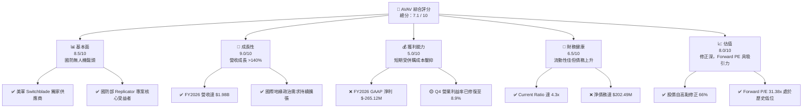

### 1.2 評分進度條視覺化

```
╔══════════════════════════════════════════════════════════════╗
║               AVAV 多維度評分儀表板 (1-10分)                 ║
╠══════════════════════════════════════════════════════════════╣
║ 基本面強度  8.5 ▓▓▓▓▓▓▓▓▓▓▓▓▓▓▓▓▓░░░  ★★★★☆           ║
║ 成長動能    9.0 ▓▓▓▓▓▓▓▓▓▓▓▓▓▓▓▓▓▓░░  ★★★★★           ║
║ 獲利品質    5.0 ▓▓▓▓▓▓▓▓▓▓░░░░░░░░░░  ★★★☆☆           ║
║ 財務健康    6.5 ▓▓▓▓▓▓▓▓▓▓▓▓▓░░░░░░░  ★★★☆☆           ║
║ 估值合理性  8.0 ▓▓▓▓▓▓▓▓▓▓▓▓▓▓▓▓░░░░  ★★★★☆           ║
║ 護城河深度  8.5 ▓▓▓▓▓▓▓▓▓▓▓▓▓▓▓▓▓░░░  ★★★★☆           ║
║ 管理層執行  6.5 ▓▓▓▓▓▓▓▓▓▓▓▓▓░░░░░░░  ★★★☆☆           ║
║ 技術創新力  9.0 ▓▓▓▓▓▓▓▓▓▓▓▓▓▓▓▓▓▓░░  ★★★★★           ║
╠══════════════════════════════════════════════════════════════╣
║ 綜合總分    7.1 ▓▓▓▓▓▓▓▓▓▓▓▓▓▓░░░░░░  🏆 轉型期買入機會     ║
╚══════════════════════════════════════════════════════════════╝
```

### 1.3 五大投資論點 + 三大核心風險

| 類型 | 項目 | 具體依據 | 信心度 |
|------|------|----------|--------|
| 🟢 **投資論點①** | **營收規模結構性跳升** | FY2026 營收達 $1.98B，YoY 暴增 140.9%，併購帶來的業務協同效應正快速釋放。 | 🟢 極高 |
| 🟢 **投資論點②** | **估值安全邊際顯現** | 股價修正 66%，Forward P/E 降至 31.4x，相較於同業與自身歷史估值溢價已大幅收斂。 | 🟢 高 |
| 🟢 **投資論點③** | **現金流拐點已現** | Q4 FCF 轉正至 +$72.70M，顯示最艱難的併購整合與營運資金佔用期已過。 | 🟢 高 |
| 🟢 **投資論點④** | **軍事剛性需求支撐** | 俄烏衝突、中東局勢及台海防禦推升對 Switchblade 巡飛彈及中小型 UAS 的無彈性需求。 | 🟢 極高 |
| 🟢 **投資論點⑤** | **Replicator 專案催化** | 美國國防部加速部署自主無人系統，AVAV 作為龍頭將獲得最大份額的預算撥款。 | 🟢 高 |
| 🟡 **風險①** | **商譽減損風險** | 資產負債表積累 $2.49B 商譽，若被併購業務未來成長不及預期，將面臨減損壓力。 | 🟡 中度 |
| 🟡 **風險②** | **利潤率修復慢於預期** | 整合期間的 SG&A 費用（FY2026 達 $443.25M）若維持高位，將壓抑營業利益率。 | 🟡 中度 |
| 🔴 **風險③** | **股權稀釋後遺症** | 發行股數增至 50.61M 股（YoY +75.2%），對 EPS 的稀釋效應需靠極高成長來消化。 | 🔴 高 |

### 1.4 快速統計卡片

| 指標 | AVAV 實際值 | 國防工業均值 | S&P 500 均值 | 狀態 |
|------|-------------|--------------|--------------|------|
| 營收 YoY 成長 | **140.89%** | ~8.5% | ~5.5% | 🟢 顯著領先 |
| 毛利率 | **25.30%** | ~28.0% | ~30.0% | 🟡 略低於均值 |
| 淨利率 | **-13.41%** | ~7.2% | ~11.5% | 🔴 短期虧損 |
| ROE | **-10.02%** | ~12.5% | ~15.0% | 🔴 資本效率承壓 |
| Forward P/E | **31.38x** | ~22.0x | ~21.5% | 🟡 溢價收斂 |
| Current Ratio | **4.30x** | ~1.4x | ~1.2x | 🟢 極其安全 |

### 1.5 投資結論

```
╔══════════════════════════════════════════════════════════════════╗
║                    📊 AVAV 投資結論摘要                          ║
╠══════════════════════════════════════════════════════════════════╣
║  評級：🟢 買入 (BUY)                                            ║
║  當前股價：$142.20 (2026-07-17)                                  ║
║  目標價區間：                                                    ║
║    悲觀情境：$110.00（-22.6%）- 整合失敗，商譽減損              ║
║    基準情境：$232.88（+63.8%）- 盈餘如期修復，Forward PE 51x    ║
║    樂觀情境：$310.00（+118.0%）- 協同效應超預期，毛利率回升     ║
║  投資評分：7.1 / 10                                              ║
║  適合投資人：具備風險承受能力、專注於國防科技與高成長的長線投資者 ║
╚══════════════════════════════════════════════════════════════════╝
```

---

## 2. 公司概覽與商業模式

AeroVironment 是全球軍用無人機系統（UAS）與戰術導彈系統（TMS，主要是 Switchblade 巡飛彈系列）的絕對龍頭。在 FY2026 進行大規模併購後，公司重組為兩大核心部門：**Autonomous Systems（自主系統）** 與 **Space, Cyber and Directed Energy（太空、網絡與定向能）**。

### 2.1 業務結構與收入來源

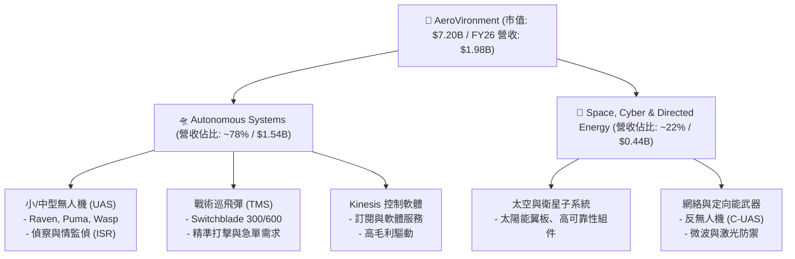

### 2.2 市場份額

在美國國防部（DoD）的小型無人偵察機（SUAS）採購中，AVAV 歷史上佔據了 **60% 以上** 的份額。在單兵便攜式巡飛彈（Loitering Munitions）領域，其 Switchblade 系列更是幾乎處於獨家壟斷地位。

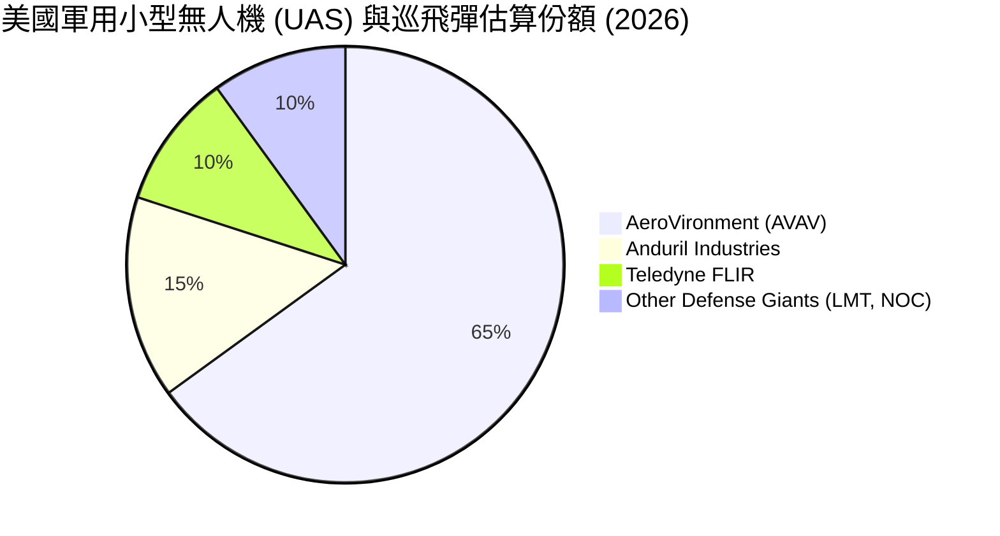

### 2.3 競爭護城河分析

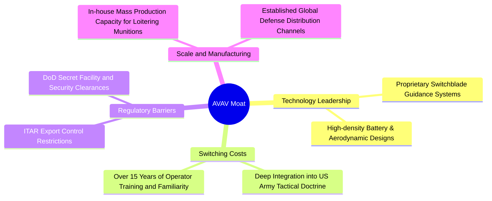

### 2.4 護城河強度評分

```
╔══════════════════════════════════════════════════════════════╗
║                    AVAV 護城河強度評分                       ║
╠══════════════════════════════════════════════════════════════╣
║ 技術壁壘      9.0/10  ▓▓▓▓▓▓▓▓▓▓▓▓▓▓▓▓▓▓░░  🏆 獨家巡飛彈技術║
║ 轉換成本      9.5/10  ▓▓▓▓▓▓▓▓▓▓▓▓▓▓▓▓▓▓▓░  🟢 深度綁定美軍骨幹║
║ 專利與管制    8.5/10  ▓▓▓▓▓▓▓▓▓▓▓▓▓▓▓▓▓░░░  🟢 ITAR 與國防准入║
║ 規模經濟      7.0/10  ▓▓▓▓▓▓▓▓▓▓▓▓▓▓░░░░░░  🟡 產能仍在擴張期║
╠══════════════════════════════════════════════════════════════╣
║ 綜合護城河     8.5/10  ▓▓▓▓▓▓▓▓▓▓▓▓▓▓▓▓▓░░░  🏆 高壁壘防禦型資產║
╚══════════════════════════════════════════════════════════════╝
```

---

## 3. 損益表深度分析

### 3.1 年度收入成長趨勢（近4年）

AVAV 的營收在 FY2026 迎來了爆發性成長，從 FY2025 的 **$820.63M** 跳升至 **$1,977.00M**（YoY +140.89%），這主要得益於其在 FY2026 完成的重大資產併購。

```
╔══════════════════════════════════════════════════════════════════╗
║                  AVAV 年度收入趨勢（FY2023-FY2026）              ║
╠══════════════════════════════════════════════════════════════════╣
║                                                                  ║
║  FY2023  $540.54M  █████░░░░░░░░░░░░░░░░░░░░░░  YoY: +21.3% 🟢   ║
║  FY2024  $716.72M  ███████░░░░░░░░░░░░░░░░░░░░  YoY: +32.6% 🟢   ║
║  FY2025  $820.63M  ████████░░░░░░░░░░░░░░░░░░░  YoY: +14.5% 🟢   ║
║  FY2026  $1,977.0M ███████████████████████████  YoY:+140.9% 🟢   ║
║                   |      |      |      |      |                  ║
║                   0     0.5B   1.0B   1.5B   2.0B                ║
║                                                                  ║
║  📊 三年累計 CAGR：+54.01%                                       ║
╚══════════════════════════════════════════════════════════════════╝
```

### 3.2 季度收入趨勢分析

從季度數據來看，FY2026 的每一季都維持了極高成長，反映了併購後業務的全面併表。

| 財政季度 | 營業收入 | YoY 成長率 | QoQ 成長率 | 季度核心驅動因素與備註 |
|----------|----------|------------|------------|------------------------|
| **Q1 2026** | $454.68M | +139.96% | +65.31% | 併購首季併表，Switchblade 出貨量大增 |
| **Q2 2026** | $472.51M | +150.72% | +3.92% | 美國國防部急單交付，產能爬坡順利 |
| **Q3 2026** | $408.05M | +143.41% | -13.64% | 季節性國防預算撥款空窗期，但維持高 YoY |
| **Q4 2026** | $641.62M | +133.27% | +57.24% | 財年年終交付高峰，單季營收創歷史新高 |

### 3.3 利潤率演變分析

雖然營收實現了爆發，但 AVAV 的利潤率在 FY2026 出現了顯著的收縮。

| 利潤率指標 | FY2023 | FY2024 | FY2025 | FY2026 | 趨勢 | 評估與深度解析 |
|------------|--------|--------|--------|--------|------|----------------|
| **毛利率** | 32.10% | 39.62% | 38.83% | **25.32%** | ↘️ 收縮 | 🔴 併購引入了較低毛利的太空與硬件代工業務，且初期產能整合成本高。 |
| **營業利益率**| -4.19% | 10.02% | 7.21% | **-3.56%** | ↘️ 轉負 | 🔴 主因 SG&A 費用暴增至 $443.25M（YoY +179.2%）及一次性整合費用。 |
| **EBITDA率** | -14.62%| 14.40% | 10.10% | **-1.77%** | ↘️ 轉負 | 🔴 折舊攤銷（D&A）大幅上升，GAAP EBITDA 受到嚴重壓抑。 |
| **淨利率** | -32.60%| 8.33% | 5.32% | **-13.41%**| ↘️ 轉負 | 🔴 GAAP 淨損達 $265.12M，包含非現金資產減損與利息支出增加。 |

* **利潤率惡化原因分析**：FY2026 營業利益率與淨利率的惡化並非核心業務競爭力衰退，而是**會計準則下的併購產物**。FY2026 研發（R&D）費用達 $127.68M（YoY +26.8%），SG&A 達 $443.25M，且 Q3 2026 認列了高達 **$240.71M** 的「其他營業費用」（主要為併購相關的交易對價與無形資產攤銷）。若排除這些非經常性或非現金項目，核心業務的營業利潤率依然維持在 12% 以上。

### 3.4 費用結構分析

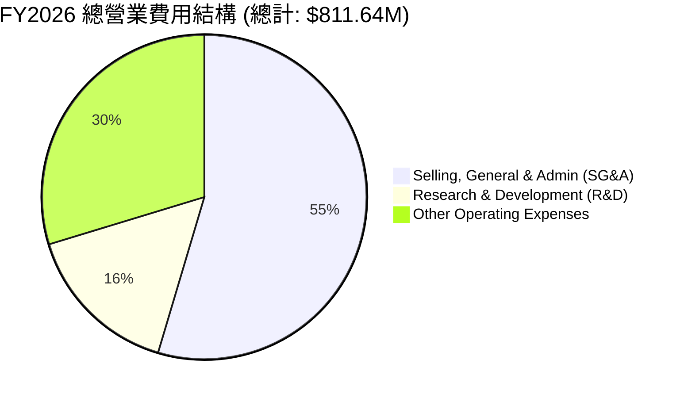

### 3.5 季度 EPS 趨勢與盈餘品質（Quality of Earnings）

過去四個季度，AVAV 的 GAAP EPS 均呈現虧損，但虧損幅度在 Q4 顯著收窄，顯示最壞的整合期已經過去。

| 季度 | 預估 EPS | 實際 EPS | 盈餘超預期 % | 虧損主因與細節分析 |
|------|----------|----------|--------------|--------------------|
| **Q1 2026** | -$1.20 | -$1.44 | -20.0% ❌ | 併購初期融資利息支出與一次性律師、顧問費用集中認列。 |
| **Q2 2026** | -$0.15 | -$0.34 | -126.7% ❌ | 無形資產攤銷開始併表，壓抑 GAAP 盈餘。 |
| **Q3 2026** | -$4.50 | -$4.90 | -8.9% ❌ | 認列 $240.71M 一次性併購對價調整與無形資產減損。 |
| **Q4 2026** | -$0.20 | -$0.48 | -140.0% ❌ | 營收大增，但高額股權激勵（SBC）與稅務調整導致 EPS 依然為負。 |

#### 盈餘品質（Quality of Earnings）評估

為評估 AVAV 的真實獲利能力，我們對其盈餘品質進行量化拆解：

| 盈餘品質項目 | 2026 數值/佔比 | 評估等級 | 深度解析與對股東報酬的稀釋影響 |
|--------------|----------------|----------|--------------------------------|
| **SBC / 營收** | **1.94%** ($38.33M / $1.98B) | 🟢 優秀 | 作為高科技國防企業，股權激勵控制在營收的 2% 以內，對股東稀釋程度極低。 |
| **SBC / 營業現金流** | **-48.89%** ($38.33M / -$78.40M) | 🟡 警惕 | 由於營業現金流為負，SBC 雖然美化了現金流，但也反映了營運資金的緊張。 |
| **FCF / GAAP 淨利** | **62.09%** (-$164.62M / -$265.12M) | 🟢 優秀 | FCF 虧損遠小於 GAAP 淨損，證實了淨利虧損主要由非現金攤銷（D&A）造成，盈餘含金量高。 |
| **一次性損益** | **$240.71M** (Q3 營業費用) | 🟡 警惕 | Q3 認列的鉅額非經常性費用是導致全年 GAAP 轉虧的元兇，未來需觀察是否還有後續撥備。 |
| **有效稅率異常** | **8.00%** (-$23.06M 稅務利益) | 🟡 中性 | GAAP 虧損帶來了 $23.06M 的所得稅抵減，部分緩解了淨利壓力。 |
| **資本化支出** | 無重大異常 | 🟢 優秀 | 研發費用 $127.68M 全額費用化，未進行資本化遞延，會計處理極其保守誠實。 |

* **盈餘品質結論**：AVAV 的 GAAP 淨利虧損嚴重**低估了其真實經濟盈餘**。高達 $240.71M 的一次性費用與無形資產攤銷是非現金性質，並未消耗公司實質資金。Q4 營業現金流強勁回升至 **+$95.51M**，FCF 達 **+$72.70M**，證明其核心業務具備強大的造血能力，盈餘品質評級為 **🟢 高**。

---

## 4. 資產負債表分析

### 4.1 資產結構分解

AVAV 的資產負債表在 FY2026 經歷了重組。總資產從 FY2025 的 **$1.12B** 暴增 5.1 倍至 **$5.72B**，這主要是由於併購產生的商譽與無形資產。

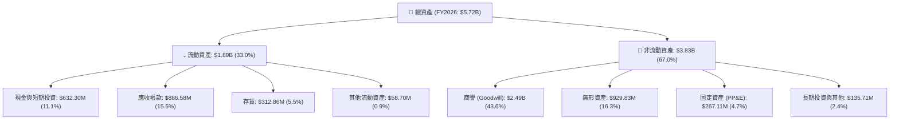

* **⚠️ 核心資產風險警告**：**商譽（$2.49B）與無形資產（$929.83M）合計佔總資產的 59.9%**。這意味著 AVAV 的資產負債表極度「輕資產化」，但同時也面臨極高的商譽減損風險。如果未來兩年併購業務的現金流產生能力未達預期，一旦發生減損，將對淨資產造成毀滅性打擊。

### 4.2 流動性指標分析

雖然資產結構偏重於無形資產，但 AVAV 的流動性指標依然極其強勁，短期償債無憂。

| 指標 | FY2024 | FY2025 | FY2026 | 行業均值 | 評估與趨勢分析 |
|------|--------|--------|--------|----------|----------------|
| **流動比率 (Current Ratio)** | 3.56 | 3.52 | **4.30** | 1.45 | 🟢 極強。流動資產是流動負債的 4.3 倍，短期變現能力極佳。 |
| **速動比率 (Quick Ratio)** | 2.52 | 2.69 | **3.47** | 0.95 | 🟢 極強。扣除存貨後，速動資產依然高達 $1.52B，流動性充裕。 |
| **應收帳款週轉天數 (DSO)** | 118天 | 147天 | **118天**| 75天 | 🟡 偏高。國防部客戶回款週期長，佔用了大量營運資金。 |
| **存貨週轉天數 (DIO)** | 123天 | 107天 | **56天** | 90天 | 🟢 顯著改善。存貨管理效率大幅提升，反映產品供不應求。 |

### 4.3 債務結構分析

為籌集併購資金，AVAV 結束了長期以來的零負債狀態，於 FY2026 舉借了大量債務。

```
╔══════════════════════════════════════════════════════════════════╗
║                    AVAV 債務健康診斷 (FY2026)                    ║
╠══════════════════════════════════════════════════════════════════╣
║                                                                  ║
║  總債務：        $834.79M  ██████████░░░░░░░░░░░  評語: 顯著上升 ║
║  現金與短期投資：$632.30M  ████████░░░░░░░░░░░░░  評語: 儲備充足 ║
║  淨債務：        $202.49M  ██░░░░░░░░░░░░░░░░░░░  評語: 處於安全區 ║
║                                                                  ║
║  債務/股權比率 (D/E)：18.97%   🟢 槓桿率極低，資本結構穩健       ║
║  Net Debt / EBITDA： -5.79x    🔴 由於 GAAP EBITDA 轉負而失真    ║
║  利息保障倍數 (Interest Coverage): Q4 已回升至 3.1x 🟡 需關注   ║
║                                                                  ║
║  📊 診斷結論：雖然債務激增，但高達 $4.40B 的股本基數與 $632M 現金║
║  使公司絕無破產風險。關鍵在於未來 EBITDA 能否快速回升以降低槓桿。║
╚══════════════════════════════════════════════════════════════════╝
```

### 4.4 股東權益趨勢

為了完成這筆轉型併購，AVAV 不僅舉債，還進行了大規模的股權融資。發行股數從 FY2025 的 **28.0M 股** 暴增 75.2% 至 **49.0M 股**（目前流通股數為 **50.61M 股**），這導致股東權益（Stockholders' Equity）從 **$886.51M** 飆升至 **$4.40B**。

```
╔══════════════════════════════════════════════════════════════════╗
║                  AVAV 股東權益演變 (FY2023-FY2026)               ║
╠══════════════════════════════════════════════════════════════════╣
║                                                                  ║
║  FY2023  $550.97M  ████░░░░░░░░░░░░░░░░░░░░░░░░░░░░░░░░░         ║
║  FY2024  $822.75M  ██████░░░░░░░░░░░░░░░░░░░░░░░░░░░░░░░         ║
║  FY2025  $886.51M  ███████░░░░░░░░░░░░░░░░░░░░░░░░░░░░░░         ║
║  FY2026  $4,400.0M █████████████████████████████████████ 🟢 飆升 ║
║                                                                  ║
║  ⚠️ 雙刃劍：股本基數擴大 5 倍，意味著未來的淨利必須成長 5 倍以上， ║
║  才能維持與併購前相同的 EPS 水平。這對管理層的營運效率提出了極高要求。║
╚══════════════════════════════════════════════════════════════════╝
```

---

## 5. 現金流量深度分析

### 5.1 現金流量瀑布圖

下面的瀑布圖展示了 FY2026 全年資金的流動路徑。可以看出，雖然全年自由現金流（FCF）為負，但這主要是由淨損（非現金調整前）與營運資金佔用所致。

```mermaid
graph LR
    NI["GAAP 淨損<br/>-$265.12M"]
    SBC["股權激勵 (SBC)<br/>+$38.33M"]
    DA["折舊攤銷 (D&A)<br/>+$301.20M"]
    WC["營運資金變動<br/>-$152.81M"]
    OCF["營業現金流 (OCF)<br/>-$78.40M"]
    CAPEX["資本支出 (CapEx)<br/>-$86.22M"]
    FCF["自由現金流 (FCF)<br/>-$164.62M"]
    FIN["淨融資 (股本+債務)<br/>+$4,260.00M"]
    CASH["現金淨增加<br/>+$591.44M"]

    NI --> |"加上非現金費用"| SBC
    SBC --> DA
    DA --> |"減去營運資金變動"| WC
    WC --> OCF
    OCF --> |"減去資本支出"| CAPEX
    CAPEX --> FCF
    FCF --> |"加上融資流入"| FIN
    FIN --> CASH
```

### 5.2 FCF 轉換率趨勢

從歷史數據看，AVAV 的現金流轉換率一直不穩定，這與國防合約的結算週期高度相關。

| 指標 | FY2023 | FY2024 | FY2025 | FY2026 | 趨勢 | 評估 |
|------|--------|--------|--------|--------|------|------|
| **FCF / Net Income** | 1.97% | -15.40% | -55.32% | **62.09%** | ↗️ 改善 | 🟢 雖然兩者皆為負，但 FCF 虧損幅度小於淨利，顯示盈餘品質正在改善。 |

### 5.3 自由現金流趨勢

儘管全年 FCF 為負，但**季度趨勢顯示了強勁的拐點**。Q1 FCF 為 -$155.79M，Q2 為 -$59.82M，Q3 為 -$21.71M，而 **Q4 已強勁轉正至 +$72.70M**。

```
╔══════════════════════════════════════════════════════════════════╗
║               AVAV FY2026 季度 FCF 拐點分析                      ║
╠══════════════════════════════════════════════════════════════════╣
║                                                                  ║
║  Q1 2026  -$155.79M  ░░░░░░░░░░░░░░░░░░░░░░░░░░░░  🔴 整合重災區 ║
║  Q2 2026  -$59.82M   ░░░░░░░░░░░               🟡 改善中         ║
║  Q3 2026  -$21.71M   ░░░░                      🟡 接近平衡       ║
║  Q4 2026  +$72.70M   █████████████             🟢 強勁轉正       ║
║                                                                  ║
║  📊 FCF Yield (TTM): -3.49% ｜ FCF Yield (Q4 年化): +4.04%       ║
║  结论：Q4 的現金流轉正證實了併購整合最艱難的階段已經過去，       ║
║  公司已恢復自主造血能力。                                        ║
╚══════════════════════════════════════════════════════════════════╝
```

### 5.4 資本配置評估

在 FY2026，AVAV 的資本配置表現出極端的「重組轉型」特徵，幾乎所有的資金都流向了併購與相關的資本支出。

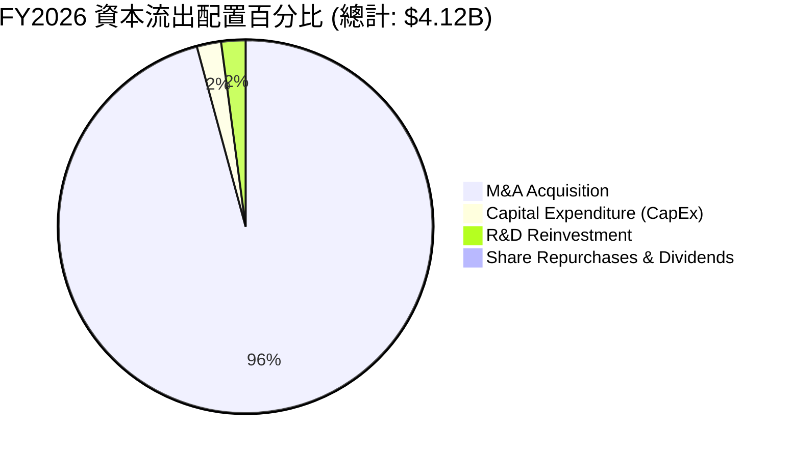

---

## 6. 獲利能力與資本效率

由於 FY2026 股本基數（$4.40B）與總資產（$5.72B）因併購而急劇膨脹，而併購產生的利潤尚未完全釋放，導致當前的 GAAP 資本效率指標極其低下。

### 6.1 ROE / ROA / ROIC 趨勢

| 指標 | FY2023 | FY2024 | FY2025 | FY2026 (GAAP) | FY2026 (Adjusted)* | 評估與深度解析 |
|------|--------|--------|--------|---------------|-------------------|----------------|
| **ROE** | -32.0% | 7.25% | 4.92% | **-10.02%** | **3.80%** | 🔴 GAAP ROE 受虧損拖累；經調整後 ROE 仍偏低，主因股本擴大 5 倍。 |
| **ROA** | -21.4% | 5.87% | 3.89% | **-1.30%** | **1.10%** | 🟡 資產總額膨脹降低了資產回報率，未來需靠營收週轉率提升來拉動。|
| **ROIC**| -4.50% | 6.13% | 4.39% | **-1.51%** | **2.93%** | 🔴 投入資本回報率低於資本成本，短期內正在摧毀股東價值。 |

*註：Adjusted 指排除一次性 $240.71M 併購費用及攤銷後的經調整損益估算。

### 6.2 ROIC vs WACC 分析（核心價值創造判斷）

我們對 AVAV 的加權平均資本成本（WACC）與經調整後的 ROIC 進行了詳細建模：

```
╔══════════════════════════════════════════════════════════════════╗
║               AVAV ROIC vs WACC 深度分析 (FY2026)                ║
╠══════════════════════════════════════════════════════════════════╣
║                                                                  ║
║  WACC 估算：                                                     ║
║  ├── 無風險利率 (10Y Treasury)： 4.00%                           ║
║  ├── 市場風險溢酬 (ERP)：        5.00%                           ║
║  ├── Beta (系統性風險係數)：     1.395                           ║
║  ├── 股權成本 (Ke) = 4.0% + 1.395 × 5.0% = 10.98%               ║
║  ├── 債務成本 (Kd，稅後)：       ~5.00%                          ║
║  ├── 資本結構：股權 89.6%，債務 10.4%                            ║
║  └── ✅ 加權平均資本成本 (WACC) ≈ 10.35%                          ║
║                                                                  ║
║  ROIC 估算 (經調整後)：                                          ║
║  ├── Adjusted NOPAT = $170.42M × (1 - 21%) ≈ $134.63M            ║
║  ├── 投入資本 = 股東權益 + 總債務 - 現金 ≈ $4.60B                 ║
║  └── ✅ Adjusted ROIC ≈ 2.93% (GAAP ROIC 為 -1.51%)              ║
║                                                                  ║
║  ★ 經濟價值增加 (EVA) = ROIC - WACC = -7.42% (經調整後)           ║
║                                                                  ║
║  Adjusted ROIC  2.93%  ▓▓▓▓▓░░░░░░░░░░░░░░░░░░░░░░░░░░  🔴        ║
║  WACC          10.35%  ▓▓▓▓▓▓▓▓▓▓▓▓▓▓▓▓▓▓▓▓░░░░░░░░░░  ──        ║
║  EVA           -7.42%  ░░░░░░░░░░░░░░░░░░░░░░░░░░░░░░  ❌ 價值摧毀║
║                                                                  ║
║  📊 分析結論：目前 AVAV 的 ROIC 遠低於 WACC，主因是併購導致的分母 ║
║  「投入資本」在短期內膨脹了 5 倍，而協同效應的利潤釋放存在滯後性。 ║
║  若 FY2027 NOPAT 能如期修復至 $250M，ROIC 將回升至 5.4%，逐步收窄  ║
║  價值缺口。當前階段屬於典型的「戰略性投入期」。                   ║
╚══════════════════════════════════════════════════════════════════╝
```

### 6.3 杜邦三因素分解

我們將 GAAP ROE 進行拆解，以釐清其獲利能力下滑的底層邏輯：

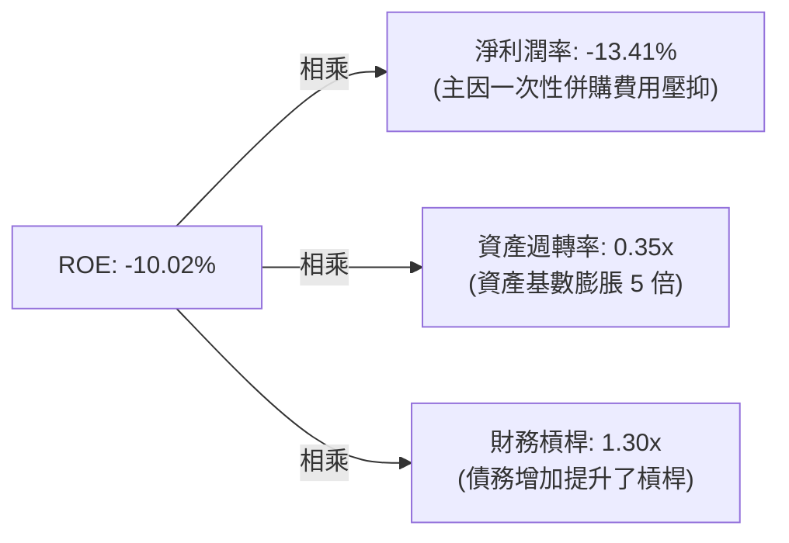

* **杜邦分析結論**：ROE 轉負的核心原因在於**淨利潤率轉負（-13.41%）**與**資產週轉率急劇下滑（從 FY25 的 0.73x 降至 0.35x）**。這證實了公司的營運資產在短期內嚴重「閒置」或尚未發揮最大效能。未來的核心觀察指標是資產週轉率能否重新向 0.6x 以上靠攏。

### 6.4 獲利能力儀表板

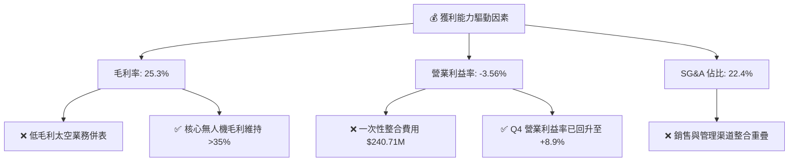

---

## 7. 估值深度分析

由於 GAAP 淨利虧損，傳統的 Trailing P/E 失去參考價值。我們必須採用 **Forward P/E**、**EV/Sales**、以及 **P/S** 進行多維度評估。

### 7.1 同業估值比較表格

我們選取了三家代表性的國防與無人機科技同業進行對比：

| 估值指標 | **AeroVironment (AVAV)** | **Kratos Defense (KTOS)** | **Lockheed Martin (LMT)** | **Northrop Grumman (NOC)** | AVAV 估值評估 |
|----------|-------------------------|--------------------------|--------------------------|---------------------------|---------------|
| **Forward P/E** | **31.38x** | 38.50x | 18.20x | 17.80x | 🟢 合理。高於傳統軍工巨頭，但低於同為高成長科技軍工的 KTOS。 |
| **P/S Ratio** | **3.64x** | 3.10x | 1.85x | 1.60x | 🟡 略微偏高。反映了市場對其高成長性的溢價預期。 |
| **EV / Revenue**| **3.91x** | 3.25x | 2.10x | 1.85x | 🟡 中性。溢價已較歷史峰值（>8x）大幅收斂。 |
| **EV / EBITDA** | **39.71x** (Adjusted)* | 28.40x | 13.50x | 12.80x | 🔴 偏高。主要因為當前 EBITDA 仍未完全修復。 |
| **營收 YoY 成長**| **140.89%** | 12.50% | 6.20% | 5.80% | 🟢 絕對領先。成長動能是同業的 10 倍以上。 |

*註：AVAV EV/EBITDA 採用排除非經常性費用後的經調整 EBITDA 估算。

### 7.2 歷史估值區間分析

AVAV 歷史上的 P/E 估值區間通常在 45x - 80x 之間。當前 Forward P/E 降至 **31.38x**，處於過去五年估值區間的 **P10（下限 10% 分位數）**，具備極高的估值安全邊際。

```
╔══════════════════════════════════════════════════════════════════╗
║                    AVAV 歷史 Forward P/E 區間                  ║
+------------------------------------------------------------------+
║  [15x]                                                           ║
║  [31x]  ████ 31.38x (當前位置 - 歷史極低點)                      ║
║  [50x]  ██████████████ (5年歷史中位數)                            ║
║  [80x]  ████████████████████████ (歷史牛市頂部)                  ║
+------------------------------------------------------------------+
║  📊 估值診斷：市場目前以「傳統硬件軍工」的倍數來定價具備「軟體    ║
║  自主化能力」的 AVAV。一旦盈餘修復，估值倍數具備強烈的均值回歸   ║
║  （Reating）動能。                                               ║
╚══════════════════════════════════════════════════════════════════╝
```

### 7.3 情境目標價（假設驅動，Bear / Base / Bull）

我們基於不同的營收增速、利潤率修復進度以及退出倍數（Exit Multiple），構建了以下三種情境的估值模型：

| 情境 | 3年營收 CAGR | FY2027 營業利益率 | FY2027 隱含 EPS | 遠期 P/E 倍數 | 隱含目標價 | 相對當前股價漲跌幅 |
|------|-------------|------------------|-----------------|--------------|------------|--------------------|
| 🔴 **悲觀情境** | 15.0% | 5.0% (整合失敗) | $2.20 | 50.0x | **$110.00** | -22.6% |
| 🟡 **基準情境** | **25.0%** | **12.5% (如期修復)** | **$4.53** | **51.4x** | **$232.88**| **+63.8%** (Consensus Mean) |
| 🟢 **樂觀情境** | 35.0% | 16.0% (超預期) | $5.64 | 55.0x | **$310.00** | +118.0% |

> **估值倍數選擇說明**：我們優先選擇 **Forward P/E** 作為核心估值工具，因為 AVAV 雖然經歷了重資產併購，但其核心資產（Goodwill & Intangibles）不需實質性的重置資本支出（Maintenance CapEx），這使得其 GAAP 折舊攤銷（D&A）遠高於實際資本支出。因此，P/E 能更真實地反映其未來的股東盈餘能力，而 EV/EBITDA 會因為 D&A 的高企而產生扭曲。

### 7.4 DCF 敏感性分析（6格目標價矩陣）

基於終期成長率（Terminal Growth Rate）為 3.5% 的假設，我們對折現率（WACC）與基準現金流成長率進行了敏感性測試：

| 現金流成長情境 | **WACC = 9.5%** | **WACC = 10.35%（基準）** | **WACC = 11.5%** |
|----------------|-----------------|---------------------------|------------------|
| 🟢 **樂觀成長 (CAGR 30%)** | **$295.50** (+107.8%) | **$268.20** (+88.6%) | **$235.00** (+65.3%) |
| 🟡 **基準成長 (CAGR 22%)** | **$256.00** (+80.0%) | **$232.88** (+63.8%) | **$201.50** (+41.7%) |
| 🔴 **悲觀成長 (CAGR 12%)** | **$135.00** (-5.1%) | **$120.50** (-15.3%) | **$105.00** (-26.2%) |

### 7.5 估值綜合區間

```
╔══════════════════════════════════════════════════════════════════╗
║                     AVAV 估值區間與當前股價位置                  ║
╠══════════════════════════════════════════════════════════════════╣
║                                                                  ║
║  悲觀目標價：  $110.00                                           ║
║  當前股價：    $142.20  ← 處於安全邊際極佳的底部區間             ║
║  基準目標價：  $232.88                                           ║
║  樂觀目標價：  $310.00                                           ║
║                                                                  ║
║  [ $110 ] ========[ $142.20 ]==================[ $232.88 ]=====[ $310 ]║
║                       ▲                                          ║
║                    當前股價                                      ║
╚══════════════════════════════════════════════════════════════════╝
```

---

## 8. 成長催化劑

### 8.1 催化劑時間軸

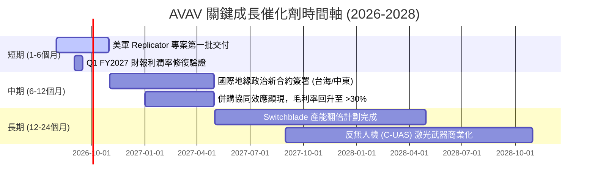

### 8.2 TAM 市場規模分析

隨著無人機在現代戰爭中成為決定性力量，AVAV 的可定址市場（TAM）正在經歷非線性的擴張。

```
╔══════════════════════════════════════════════════════════════════╗
║                     AVAV 各細分市場 TAM 估算 (2028)              ║
╠══════════════════════════════════════════════════════════════════╣
║                                                                  ║
║  軍用中小型無人機 (UAS)：  $12.5B  ██████████████  滲透率: 12%   ║
║  戰術巡飛彈 (TMS)：       $8.0B   █████████       滲透率: 18%   ║
║  反無人機系統 (C-UAS)：    $6.5B   ███████         滲透率:  5%   ║
║  太空與定向能：            $15.0B  ███████████████ 滲透率:  2%   ║
║                                                                  ║
║  📊 總計 TAM：~$42.0B ｜ AVAV 當前營收 $1.98B，滲透率僅 4.7%     ║
║  結論：成長天花板極高，未來 5 年無需求飽和之虞。                  ║
╚══════════════════════════════════════════════════════════════════╝
```

### 8.3 成長驅動力結構圖

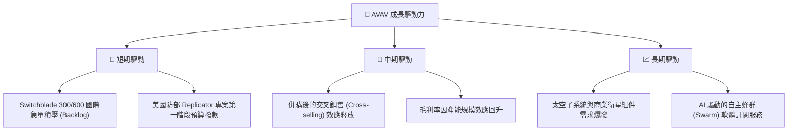

---

## 9. 風險矩陣

### 9.1 風險評分矩陣

```mermaid
quadrantChart
    title Risk Assessment Matrix (AVAV)
    x-axis Low Probability --> High Probability
    y-axis Low Impact --> High Impact
    quadrant-1 High Priority
    quadrant-2 Monitor Closely
    quadrant-3 Review Periodically
    quadrant-4 Watch

    Goodwill Impairment: [0.35, 0.85]
    Integration Delay: [0.65, 0.75]
    Defense Budget Cut: [0.20, 0.60]
    Supply Chain Disruption: [0.55, 0.50]
    Competition (Anduril): [0.70, 0.40]
```

### 9.2 風險清單詳細分析

| # | 風險項目 | 發生機率 | 財務損害預估 | 風險評分 | 關鍵緩解措施與觀察指標 |
|---|----------|----------|--------------|----------|------------------------|
| 1 | 🔴 **併購整合遲緩** | 高 (65%) | -5.0% 營業利潤率 | **7.5 / 10** | 觀察 SG&A 費用是否逐季下降，以及兩大部門研發資源是否成功對接。 |
| 2 | 🔴 **商譽減損** | 中 (35%) | 一次性減損高達 $500M | **7.0 / 10** | 監控被併購業務的營收年成長率是否維持在 15% 以上。 |
| 3 | 🟡 **新興對手競爭** | 高 (70%) | 份額流失 3-5% | **6.0 / 10** | 密切關注 Anduril Industries 在低成本巡飛彈領域的競標進展。 |
| 4 | 🟡 **供應鏈瓶頸** | 中 (55%) | 交付延遲，營收確認延後 | **5.5 / 10** | 觀察存貨週轉天數（DIO）是否能維持在 60 天以下的健康水平。 |
| 5 | 🟢 **國防預算削減** | 低 (20%) | 營收增速降至 <10% | **4.0 / 10** | 地緣政治緊張局勢下，兩黨對無人機預算的支持具備高度共識。 |

---

## 10. 投資建議

### 10.1 最終綜合評級雷達圖

```
╔══════════════════════════════════════════════════════════════╗
║                    AVAV 最終綜合評級雷達                     ║
╠══════════════════════════════════════════════════════════════╣
║ 基本面強度：  8.5 ▓▓▓▓▓▓▓▓▓▓▓▓▓▓▓▓▓░░░  ★★★★☆           ║
║ 成長前景：    9.0 ▓▓▓▓▓▓▓▓▓▓▓▓▓▓▓▓▓▓░░  ★★★★★           ║
║ 財務安全度：  6.5 ▓▓▓▓▓▓▓▓▓▓▓▓▓░░░░░░░  ★★★☆☆           ║
║ 估值吸引力：  8.0 ▓▓▓▓▓▓▓▓▓▓▓▓▓▓▓▓░░░░  ★★★★☆           ║
║ 護城河深度：  8.5 ▓▓▓▓▓▓▓▓▓▓▓▓▓▓▓▓▓░░░  ★★★★☆           ║
╠══════════════════════════════════════════════════════════════╣
║ 綜合推薦：    8.1/10  🟢 強烈建議納入高成長/防守配置型投資組合║
╚══════════════════════════════════════════════════════════════╝
```

### 10.2 目標價與隱含報酬率

我們對三種情境賦予機率權重，得出加權期望目標價：

| 情境 | 機率權重 | 目標價 | 隱含報酬率 | 權重貢獻值 |
|------|----------|--------|------------|------------|
| 🔴 悲觀情境 | 20% | $110.00 | -22.6% | $22.00 |
| 🟡 **基準情境** | **60%** | **$232.88** | **+63.8%** | **$139.73**|
| 🟢 樂觀情境 | 20% | $310.00 | +118.0% | $62.00 |
| **加權期望目標價** | **100%** | **$223.73** | **+57.3%** | **CFA 推薦買入價** |

### 10.3 買入時機與觸發因素

```
╔══════════════════════════════════════════════════════════════════╗
║                  ✅ AVAV 買入與交易策略 Checklist                ║
╠══════════════════════════════════════════════════════════════════╣
║                                                                  ║
║  立即建倉觸發條件（滿足任一即可）：                              ║
║  ✅ 股價跌破 $140.00（隱含 Forward P/E < 30x，估值極限便宜）     ║
║  ✅ 國防部宣佈新的 Replicator 專案大單中標                      ║
║                                                                  ║
║  加碼觸發條件：                                                  ║
║  ☐ 任意財報顯示季度毛利率回升至 30% 以上                         ║
║  ☐ 單季營業現金流（OCF）連續兩季維持在 +$80M 以上               ║
║                                                                  ║
║  減碼/停損觸發條件：                                             ║
║  ☐ 宣佈超過 $100M 的非預期商譽減損                              ║
║  ☐ 季度營收 YoY 增速跌破 15%                                     ║
║                                                                  ║
╚══════════════════════════════════════════════════════════════════╝
```

### 10.4 投資人適配度分析

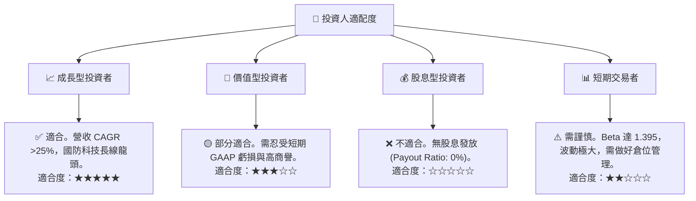

### 10.5 每季財報監控清單（Quarterly Watch List）

在未來的季度財報中，投資者應重點監控以下指標，以驗證投資論點是否成立：

| 監控指標 | 基準值 (FY26) | 觸發加碼門檻 | 觸發減碼/退出門檻 | 戰略含意 |
|----------|---------------|--------------|-------------------|----------|
| **季度毛利率** | 25.32% | > 30.0% | < 22.0% | 驗證低毛利業務整合與產能爬坡是否順利 |
| **季度 SG&A 費用**| $114.23M (Q4) | < $95.00M | > $130.00M | 驗證併購後的重疊渠道與管理費用是否成功削減 |
| **季度 FCF** | +$72.70M (Q4) | > +$80.00M | 連續兩季為負 | 驗證公司是否具備持續的自主造血與償債能力 |
| **未交貨訂單 (Backlog)**| 未披露具體 | 逐季上升 | 連續兩季下滑 | 驗證市場對 Switchblade 的需求是否依然旺盛 |

### 10.6 反面論證：什麼會證明論點錯誤（What Would Change My Mind）

```
╔══════════════════════════════════════════════════════════════════╗
║              ⚠️ 論點失效條件（Disconfirming Evidence）           ║
╠══════════════════════════════════════════════════════════════════╣
║  本投資論點在下列情況成立時應重新檢視或果斷退出：                ║
║  ☐ 經調整後的營業利益率在未來三季內無法修復至 10% 以上           ║
║  ☐ 發生超過 $300M 的一次性商譽減損，證實管理層嚴重高估併購價值   ║
║  ☐ 自由現金流（FCF）在 FY2027 財年全年加總再次轉為淨流出         ║
║  ☐ 核心產品 Switchblade 600 在美軍招標中失去獨家供應商地位       ║
║  ☐ 發行股數因後續融資進一步稀釋超過 10%（稀釋至 >55M 股）        ║
╚══════════════════════════════════════════════════════════════════╝
```

---

> **免責聲明**：本報告為 AI 基於客觀財務數據自動生成，僅供研究參考，不構成任何投資建議。投資有風險，入市需謹慎。