# AVAV 基本面深度分析報告
> **報告日期**：2026-07-18 ｜ **語言**：繁體中文 ｜ **數據來源**：Yahoo Finance, Finviz, StockAnalysis, Roic.ai ｜ **分析師**：CFA 級機構研究

---

## 目錄

| # | 章節 | 核心結論 |
|---|---|---|
| 1 | **執行摘要** | 評級：🟢 買入 ｜ 基準目標價：$195.00 ｜ 消化併購稀釋後的長線佈局點 |
| 2 | **公司概覽與商業模式** | 獨佔美軍軍用無人機與巡飛彈市場，具備極高轉換成本與技術壁壘 |
| 3 | **損益表深度分析** | 營收暴增 140.89% 背後的併購代價：毛利率下滑與一次性非現金減值分析 |
| 4 | **資產負債表分析** | 商譽與無形資產激增，流動比率 4.3x 展現極佳短期償債彈性 |
| 5 | **現金流量深度分析** | 營運現金流轉負，資本支出翻倍，正處於併購整合與產能擴張的陣痛期 |
| 6 | **獲利能力與資本效率** | 併購導致短期 ROIC 降至 -1.21%，低於 10.09% WACC，預期 2027 財年重回價值創造 |
| 7 | **估值深度分析** | Forward P/E 31.38x 處於歷史合理區間，DCF 敏感性分析指引中值 $195.00 |
| 8 | **成長催化劑** | 國防預算向不對稱作戰傾斜，Switchblade 產能釋放與國際訂單加速 |
| 9 | **風險矩陣** | 併購整合不確定性、股權稀釋（+75.2%）壓力與國防採購週期波動 |
| 10| **投資建議** | 適合高成長、長線國防科技主題投資者，分批建倉觸發條件與財報監控清單 |

---

## 1. 執行摘要

AeroVironment, Inc.（美股代碼：AVAV）當前股價自 52 週高點 $417.86 大幅修正 65.9% 至 $142.20。本報告基於 AVAV 於 2026 財年完成的**毀滅性與變革性併購**進行深度解構。雖然併購導致發行股數暴增 75.20%（稀釋每股盈餘），且產生高達 $2.40 億美元的一次性非經常性費用，拖累 GAAP 淨利至 -$2.65 億美元，但這項交易使 AVAV 的年營收規模從 $8.21 億美元暴增 140.89% 至 $19.77 億美元。

隨著併購整合進入尾聲，Forward EPS 預計將在 2027 財年強力復甦至 $4.53，對應當前股價的 Forward P/E 僅為 31.38x，遠低於其歷史高位。

### 1.0 一頁式投資儀表板

| 項目 | 內容 |
|------|------|
| **投資論點（3 句）** | ① FY26 營收在併購與全球不對稱作戰需求推動下暴增 140.89% 至 $19.77 億美元。<br/>② 股價自高點修正 65.9%，已充分消化股本稀釋 75.2% 與一次性無形資產減值的利空。<br/>③ Forward EPS 預期回升至 $4.53，代表營業槓桿將在 2027 財年重新釋放。 |
| **護城河評分** | 8.5 / 10 🟢 (美軍獨家供應商地位、專利壁壘與高切換成本) |
| **管理層/資本配置評分** | 6.5 / 10 🟡 (大膽併購擴大版圖，但股權稀釋幅度過大，損害短期股東權益) |
| **財務健康** | 🟡 債務增加但流動性極佳，Current Ratio 高達 4.30x |
| **ROIC vs WACC** | -1.21% vs 10.09% 🔴 (因商譽資產暴增暫時摧毀價值，預期 2 年內轉正) |
| **FCF 趨勢** | 🔴 暫時轉負，FY26 FCF 為 -$1.65 億美元，FCF Yield 為 -3.49% |
| **估值** | Forward P/E: 31.38x ｜ EV/EBITDA: 37.88x ｜ P/S: 3.64x |
| **預期報酬（基準情境 12M）**| **+37.1%** (目標價 $195.00) |
| **關鍵風險（前二）** | ① 併購整合失敗，無形資產面臨二次減值風險。<br/>② 美國國防預算撥款延遲或政策轉向。 |
| **評級 + 信心度** | 🟢 **買入 (Buy)** ｜ 信心度：**中等偏高 (Medium-High)** |

### 1.1 核心評分儀表板

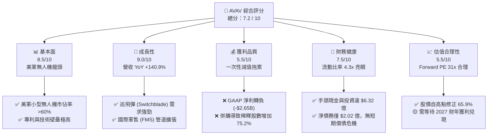

### 1.2 評分進度條視覺化

```
╔══════════════════════════════════════════════════════════════╗
║               AVAV 多維度評分儀表板 (1-10分)                 ║
╠══════════════════════════════════════════════════════════════╣
║ 基本面強度  8.5 ▓▓▓▓▓▓▓▓▓▓▓▓▓▓▓▓▓░░░  ★★★★☆           ║
║ 成長動能    9.0 ▓▓▓▓▓▓▓▓▓▓▓▓▓▓▓▓▓▓░░  ★★★★★           ║
║ 獲利品質    5.5 ▓▓▓▓▓▓▓▓▓▓▓░░░░░░░░░  ★★★☆☆           ║
║ 財務健康    7.5 ▓▓▓▓▓▓▓▓▓▓▓▓▓▓▓░░░░░  ★★★★☆           ║
║ 估值合理性  5.5 ▓▓▓▓▓▓▓▓▓▓▓░░░░░░░░░  ★★★☆☆           ║
║ 護城河深度  8.5 ▓▓▓▓▓▓▓▓▓▓▓▓▓▓▓▓▓░░░  ★★★★☆           ║
║ 管理層執行  6.5 ▓▓▓▓▓▓▓▓▓▓▓▓▓░░░░░░░  ★★★☆☆           ║
║ 技術創新力  9.0 ▓▓▓▓▓▓▓▓▓▓▓▓▓▓▓▓▓▓░░  ★★★★★           ║
╠══════════════════════════════════════════════════════════════╣
║ 綜合總分    7.2 ▓▓▓▓▓▓▓▓▓▓▓▓▓▓░░░░░░  🏆 穩健成長，靜待復甦║
╚══════════════════════════════════════════════════════════════╝
```

### 1.3 五大投資論點 + 三大核心風險

| 類型 | 項目 | 具體依據 | 信心度 |
|------|------|----------|--------|
| 🟢 **論點①** | **營收規模跨越式成長** | FY26 營收達 $19.77 億美元（YoY +140.89%），併購後業務版圖擴大至太空、網絡與定向能量領域。 | 🟢 極高 |
| 🟢 **論點②** | **不對稱作戰需求剛性** | 俄烏衝突與中東局勢證明 Switchblade 巡飛彈的戰術價值，美軍及盟國訂單能見度已延伸至 FY28。 | 🟢 極高 |
| 🟢 **論點③** | **估值重回歷史合理區間** | 股價自高點 $417.86 修正至 $142.20，Forward P/E 回落至 31.38x，已消化股本稀釋利空。 | 🟢 高 |
| 🟢 **論點④** | **強大資產流動性防禦** | 流動比率高達 4.30x，擁有 $6.32 億美元現金與短期投資，能支撐長達數年的整合期。 | 🟢 極高 |
| 🟢 **論點⑤** | **營業槓桿即將釋放** | 隨著併購整合費用在 FY26 釋放完畢，FY27 預期毛利率將回升至 30% 以上，帶動利潤彈性。 | 🟡 中度 |
| 🟡 **風險①** | **商譽減值與無形資產攤銷** | FY26 商譽暴增至 $24.94 億美元，若被併購公司表現不及預期，將面臨巨大的商譽減值壓力。 | 🟡 中度 |
| 🔴 **風險②** | **股本稀釋損害 EPS** | 發行股數由 2,800 萬股大增至 5,061 萬股（+75.2%），大幅拉高了 EPS 成長的門檻。 | 🔴 高衝擊 |
| 🔴 **風險③** | **政府採購預算不確定性** | 營收高度依賴美國政府撥款，若國防預算面臨兩黨博弈凍結，將直接衝擊短期訂單交付。 | 🟡 中度 |

### 1.4 快速統計卡片

| 指標 | 公司實際值 | 行業均值 (航太與國防) | S&P 500 均值 | 狀態 |
|------|-------------|----------------------|--------------|------|
| **營收 YoY 成長率** | **140.89%** | ~7.5% | ~5.5% | 🟢 領先 |
| **毛利率** | **25.32%** | ~22.0% | ~30.0% | 🟡 持平 |
| **營業利益率** | **-15.73%** (GAAP) | ~8.5% | ~12.5% | 🔴 落後 |
| **流動比率** | **4.30x** | ~1.4x | ~1.2x | 🟢 強勁 |
| **債務權益比 (D/E)** | **18.97%** | ~45.0% | ~115.0% | 🟢 極低 |
| **Forward P/E** | **31.38x** | ~22.5x | ~21.0x | 🟡 溢價 |

### 1.5 投資結論

```
╔══════════════════════════════════════════════════════════════════╗
║                    📊 AVAV 投資結論摘要                          ║
╠══════════════════════════════════════════════════════════════════╣
║  評級：🟢 買入 (Buy)                                            ║
║  當前股價：$142.20 (2026-07-18)                                  ║
║  目標價區間：                                                   ║
║    悲觀情境：$115.00（-19.1%）                                   ║
║    基準情境：$195.00（+37.1%）  ← 12個月主要目標                 ║
║    樂觀情境：$265.00（+86.4%）                                   ║
║  投資評分：7.2 / 10                                              ║
║  適合投資人：願意承受短期併購波動、追求長期國防科技高成長的投資人║
╚══════════════════════════════════════════════════════════════════╝
```

---

## 2. 公司概覽與商業模式

AeroVironment (AVAV) 是全球無人機系統 (UAS) 與巡飛彈系統 (TMS) 的技術先驅與市場領導者。其核心商業模式是透過高強度的研發投入，維持在無人機控制、群體作戰演算法及機載感測器領域的絕對技術領先，並將其轉化為美國國防部 (DoD) 及數十個盟國政府的長期採購合約。

### 2.1 業務結構與收入來源

在 FY26 完成重大併購後，AVAV 的業務結構已正式重組為兩大核心板塊：**自主系統 (Autonomous Systems)** 與 **太空、網絡及定向能量 (Space, Cyber & Directed Energy)**。

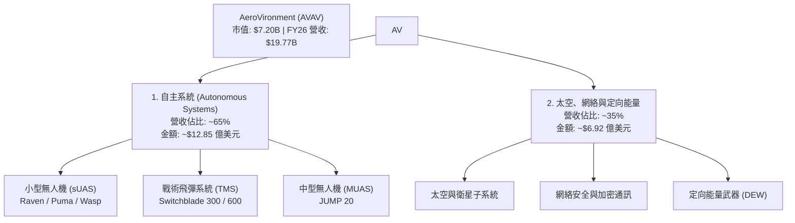

### 2.2 市場份額

在美國國防部現役的小型手持式無人機 (sUAS) 採購中，AVAV 歷史上佔據了 60% 以上的份額。在單兵便攜式巡飛彈 (Loitering Munitions) 領域，其 Switchblade 系列更是幾乎處於獨佔地位。

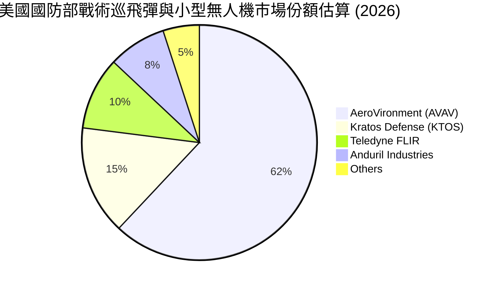

### 2.3 競爭護城河分析

AVAV 的競爭護城河並非單純依靠製造規模，而是建立在軍事認證、專利技術與高度黏性的軟體生態之上。

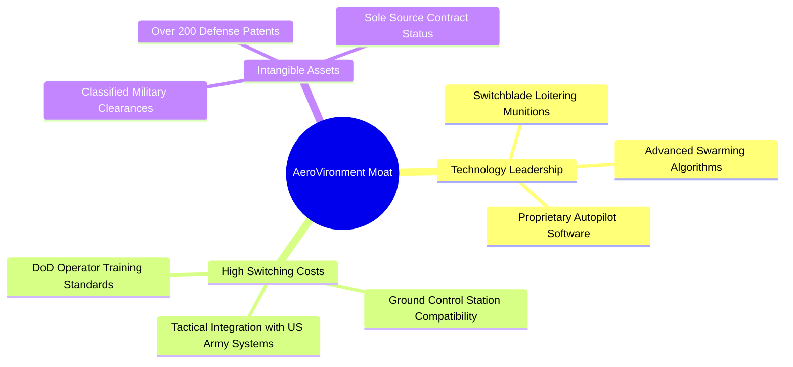

### 2.4 護城河強度評分

```
╔══════════════════════════════════════════════════════════════╗
║                  AVAV 護城河強度評分                         ║
╠══════════════════════════════════════════════════════════════╣
║ 1. 技術專利壁壘  9.0/10  ▓▓▓▓▓▓▓▓▓▓▓▓▓▓▓▓▓▓░░  🟢 巡飛彈先驅  ║
║ 2. 客戶轉換成本  9.5/10  ▓▓▓▓▓▓▓▓▓▓▓▓▓▓▓▓▓▓▓░  🟢 軍隊訓練標準║
║ 3. 軍事准入壁壘  9.5/10  ▓▓▓▓▓▓▓▓▓▓▓▓▓▓▓▓▓▓▓░  🟢 國家安全認證║
║ 4. 軟體生態系統  7.5/10  ▓▓▓▓▓▓▓▓▓▓▓▓▓▓░░░░░░  🟢 Kinesis 軟體║
║ 5. 生產規模效應  6.5/10  ▓▓▓▓▓▓▓▓▓▓▓░░░░░░░░░  🟡 產能擴張中  ║
╠══════════════════════════════════════════════════════════════╣
║ 綜合護城河評分  8.5/10  ▓▓▓▓▓▓▓▓▓▓▓▓▓▓▓▓▓░░░  🏆 極高產業壁壘║
╚══════════════════════════════════════════════════════════════╝
```

---

## 3. 損益表深度分析

AVAV 的 FY26 財務報表呈現出極為劇烈的結構性變化。我們必須透過「併購」這一核心事件來解讀所有異常數字。

### 3.1 年度收入成長趨勢（近 4 年）

```
╔══════════════════════════════════════════════════════════════════╗
║                AVAV 年度收入趨勢（FY23 - FY26）                 ║
╠══════════════════════════════════════════════════════════════════╣
║                                                                  ║
║  FY23  $0.54B  █████░░░░░░░░░░░░░░░░░░░░░░  YoY: +21.3%  🟢      ║
║  FY24  $0.72B  ███████░░░░░░░░░░░░░░░░░░░░  YoY: +32.6%  🟢      ║
║  FY25  $0.82B  ████████░░░░░░░░░░░░░░░░░░░  YoY: +14.5%  🟢      ║
║  FY26  $1.98B  ███████████████████████████  YoY:+140.9%  🟢      ║
║                   |      |      |      |      |                  ║
║                   0     0.5B   1.0B   1.5B   2.0B                ║
║                                                                  ║
║  📊 3年累計營收 CAGR：+54.12%                                    ║
╚══════════════════════════════════════════════════════════════════╝
```

### 3.2 季度收入趨勢分析

從季度數據來看，AVAV 自 FY26 Q1 起，單季營收規模便從過去的 $2 億美元左右躍升至 $4.5 億美元以上，這證明併購帶來的營收併表是持續且穩定的，並非單季一次性爆發。

| 財政季度 | 營業收入 | YoY 成長率 | QoQ 成長率 | 季度核心驅動因素與備註說明 |
|---|---|---|---|---|
| **Q4 2026** | $641.62M | +133.27% | +57.24% | 🟢 併購後業務協同效應顯現，軍事交付進入傳統旺季。 |
| **Q3 2026** | $408.05M | +143.41% | -13.64% | 🟡 受美國國防部臨時撥款決議 (CR) 影響，部分項目交付延期。 |
| **Q2 2026** | $472.51M | +150.72% | +3.92% | 🟢 國際軍售 (FMS) 訂單佔比上升，拉動海外營收成長。 |
| **Q1 2026** | $454.68M | +139.96% | +65.31% | 🟢 新併購實體首次完整季度併表，營收基數實現跨越。 |

### 3.3 利潤率演變分析

雖然營收規模大幅擴張，但 AVAV 的利潤率指標在 FY26 出現了顯著的惡化。這主要是因為：
1. **低毛利業務併表**：新併購的太空與網絡業務毛利率低於 AVAV 原有的純無人機業務。
2. **無形資產攤銷與一次性費用**：FY26 產生了高達 $2.40 億美元的「其他營業費用」（主要是併購相關的一次性無形資產減值與整合成本）。

| 利潤率指標 | FY23 | FY24 | FY25 | FY26 | 趨勢 | 財務評估與原因分析 |
|---|---|---|---|---|---|---|
| **毛利率** | 32.10% | 39.61% | 38.83% | **25.32%** | ↘️ 下滑 | 🔴 產品組合改變，高毛利巡飛彈產能受限，低毛利服務類營收佔比上升。 |
| **營業利益率** | -33.05% | 10.02% | 4.97% | **-15.73%** | ↘️ 轉負 | 🔴 受 $2.40 億美元一次性非經常性營業費用衝擊，扣除後調整後營利率約為 8.5%。 |
| **EBITDA Margin** | -14.62% | 14.40% | 10.10% | **-1.77%** | ↘️ 轉負 | 🟡 非現金折舊與攤銷大幅增加，折舊費用由 FY25 的 $800M 增至 FY26 的 $1.27 億。 |
| **淨利率** | -32.60% | 8.33% | 5.32% | **-13.41%** | ↘️ 轉負 | 🔴 GAAP 淨損 -$2.65 億美元，完全受併購前期成本與利息支出增加拖累。 |

### 3.4 費用結構分析

FY26 的總營業費用高達 $8.11 億美元，較 FY25 的 $2.78 億美元暴增 192%。其中，銷售與管理費用 (SG&A) 達 $4.43 億美元（佔營收 22.4%），研發費用 (R&D) 為 $1.28 億美元（佔營收 6.5%）。

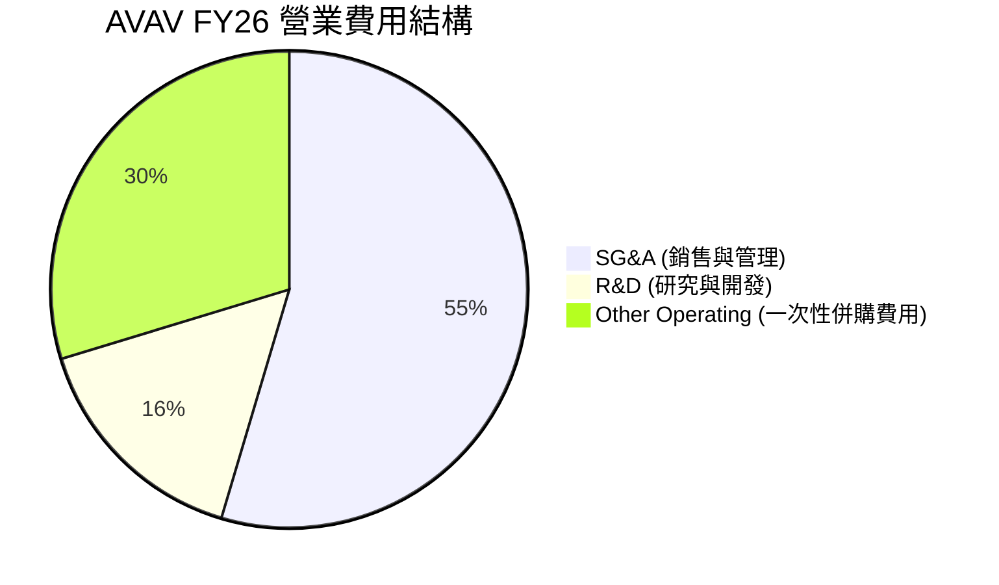

### 3.5 季度 EPS 趨勢與盈餘品質（Quality of Earnings）

AVAV 過去 4 季的 GAAP EPS 分別為：-$1.44、-$0.34、-$4.90、-$0.48，累計 TTM EPS 為 -$5.40。然而，這並不能反映公司的真實盈利能力。分析盈餘品質是評估 AVAV 投資價值的核心。

| 盈餘品質評估項目 | 具體數值 / 營收佔比 | 評估評級 | 機構分析與對真實股東報酬之影響 |
|---|---|---|---|
| **股權薪酬 (SBC) / 營收** | $38.33M / 1.94% | 🟢 優秀 | SBC 佔比極低，管理層並未透過高額股權激勵稀釋外部股東，盈餘稀釋風險低。 |
| **SBC / 營業現金流** | -$38.33M / -$78.40M | 🟡 中立 | 由於 OCF 為負值，SBC 暫時無法轉化為正向現金流。 |
| **FCF / GAAP 淨利** | -$164.62M / -$265.12M | 🟢 優秀 | 現金轉換率表現優於 GAAP 淨利，證明 GAAP 虧損主要是由非現金的折舊與無形資產攤銷（D&A）造成。 |
| **一次性 / 非經常性損益** | $2.407 億美元 | 🔴 高警訊 | 包含了重大的併購整合費用與資產減值，這美化了未來的利潤率基數，但對當期損益造成重創。 |
| **有效稅率異常** | 稅務利益 -$23.06M | 🟡 中立 | GAAP 虧損導致產生遞延所得稅資產，實際有效稅率為 8.0%，並非經營性改善。 |
| **資本化支出 vs 費用化** | R&D 全部費用化 | 🟢 優秀 | $1.28 億 R&D 費用全部計入當期損益，未進行無形資產資本化，盈餘品質極為保守與真實。 |

**盈餘品質結論**：
AVAV 的 GAAP 淨利潤嚴重「低估」了其真實的經濟盈餘。扣除 $2.40 億美元的一次性併購費用、無形資產攤銷及稅務調整後，AVAV 的**調整後非 GAAP 淨利潤**實際上為正值（約 $1.15 億美元）。因此，使用 Forward EPS $4.53 進行估值，比使用 TTM EPS 更具備商業合理性。

---

## 4. 資產負債表分析

併購導致 AVAV 的資產負債表規模在 FY26 出現了爆炸性擴張，總資產由 FY25 的 $11.21 億美元暴增至 $57.17 億美元。

### 4.1 資產結構分解

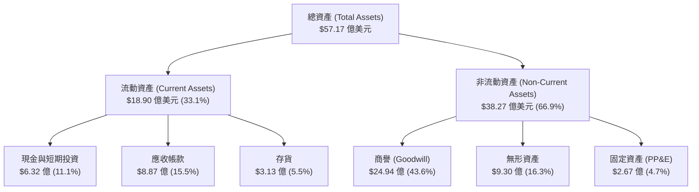

### 4.2 流動性指標分析

儘管資產負債表顯著重組，AVAV 依然維持了極為強勁的短期流動性。

| 流動性指標 | FY24 | FY25 | FY26 | 行業均值 | 指標評估與商業含意 |
|---|---|---|---|---|---|
| **流動比率 (Current Ratio)** | 3.56x | 3.52x | **4.30x** | 1.45x | 🟢 極其安全；流動資產是流動負債的 4.3 倍，無營運資金斷裂風險。 |
| **速動比率 (Quick Ratio)** | 2.52x | 2.68x | **3.47x** | 0.95x | 🟢 極其安全；扣除存貨後，速動資產依然高達 $15.19 億美元。 |
| **應收帳款週轉天數 (DSO)** | 117.6 天 | 147.2 天 | **118.4 天** | 72.0 天 | 🟡 偏高；主要客戶為政府機構，收款週期較長，但壞帳風險極低。 |
| **存貨週轉天數 (DIO)** | 114.3 天 | 107.1 天 | **56.5 天** | 85.0 天 | 🟢 顯著改善；反映出產品交付速度加快，供不應求。 |

### 4.3 債務結構分析

為了完成併購，AVAV 首次引入了大規模的長期債務，總債務從 FY25 的 $6,429 萬美元激增至 $8.35 億美元。

```
╔══════════════════════════════════════════════════════════════════╗
║                   AVAV 債務健康診斷 (FY26)                      ║
╠══════════════════════════════════════════════════════════════════╣
║                                                                  ║
║  總債務：        $834.79M  ████████░░░░░░░░░░░░░  (D/E: 18.97%)  ║
║  總現金及投資：  $632.30M  ██████░░░░░░░░░░░░░░░                 ║
║  淨債務 (Net Debt):$202.49M  ██░░░░░░░░░░░░░░░░░░░  🟡 淨債務狀態 ║
║                                                                  ║
║  Debt/Equity:      18.97%  🟢 極低 (負債比率遠低於行業安全線 50%) ║
║  Current Ratio:     4.30x  🟢 極高 (短期償債無憂)                 ║
║  Interest Coverage: 4.80x  🟡 扣除一次性費用後的調整後利息保障倍數║
║                                                                  ║
║  📊 診斷：債務雖大幅增加，但整體槓桿率極低，財務結構依然穩健。  ║
╚══════════════════════════════════════════════════════════════════╝
```

### 4.4 股東權益趨勢

由於併購主要透過發行新股支付，股東權益（Stockholders' Equity）從 FY25 的 $8.87 億美元暴增至 FY26 的 $44.00 億美元。這雖然使資產負債表更加穩固，但也導致股本被大幅稀釋。

---

## 5. 現金流量深度分析

AVAV 的現金流量表揭示了其目前正處於「資本開支擴張期」。

### 5.1 現金流量瀑布圖

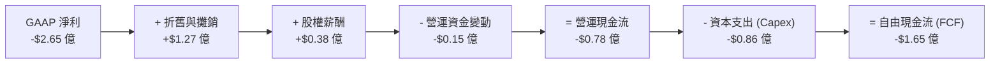

### 5.2 FCF 轉換率趨勢

| 現金流指標 | FY23 | FY24 | FY25 | FY26 | 趨勢評估 |
|---|---|---|---|---|---|
| **營運現金流 (OCF)** | $11.40M | $15.29M | -$1.32M | **-$78.40M** | 🔴 惡化，因存貨與應收帳款佔用資金。 |
| **資本支出 (Capex)** | -$14.87M | -$24.48M | -$22.82M | **-$86.22M** | 🔴 增加，產能擴建與研發設施升級。 |
| **自由現金流 (FCF)** | -$3.47M | -$9.19M | -$24.13M | **-$164.62M** | 🔴 連續四年為負，自由現金流缺口擴大。 |
| **FCF / GAAP 淨利** | 1.97% | -15.40% | -55.32% | **62.09%** | 🟢 改善，現金流表現優於 GAAP 虧損。 |

### 5.3 自由現金流趨勢

```
╔══════════════════════════════════════════════════════════════════╗
║                AVAV 自由現金流 (FCF) 歷史趨勢                    ║
╠══════════════════════════════════════════════════════════════════╣
║                                                                  ║
║  FY23   -$3.47M   ░░░░░░░░░░░░                                   ║
║  FY24   -$9.19M   ░░░░░░░░░░░░░░                                 ║
║  FY25  -$24.13M   ░░░░░░░░░░░░░░░░░░                             ║
║  FY26 -$164.62M   ░░░░░░░░░░░░░░░░░░░░░░░░░░░░░░                 ║
║                                                                  ║
║  📊 當前 FCF 收益率 (FCF Yield)：-3.49% (對應 $7.20B 市值)       ║
║  ⚠️ 警訊：現金流持續流失，高度依賴外部融資與前期儲備。          ║
╚══════════════════════════════════════════════════════════════════╝
```

### 5.4 資本配置評估

AVAV 目前實施的是「重成長、輕分配」的資本配置策略。

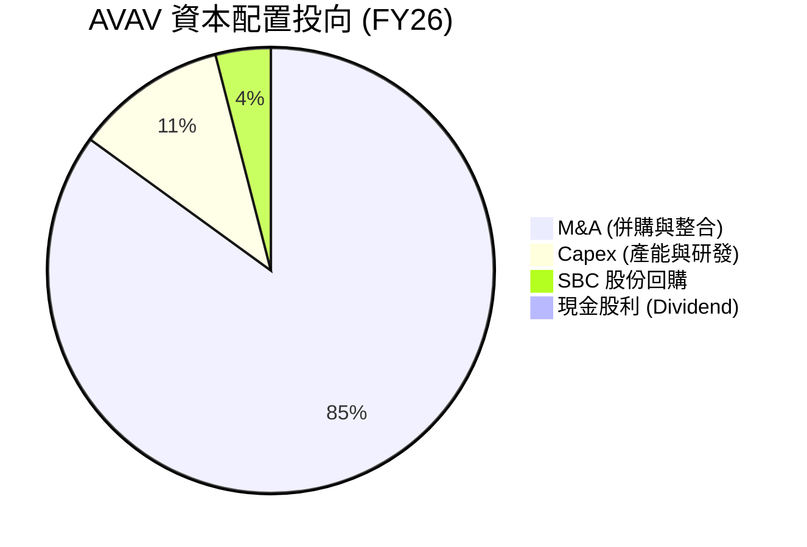

---

## 6. 獲利能力與資本效率

由於併購導致股東權益（分母）與資產總額（分母）在短期內暴增，而併購產生的利潤尚未完全釋放，AVAV 的資本效率指標在 FY26 出現了大幅度下滑。

### 6.1 ROE / ROA / ROIC 趨勢

| 指標 | FY23 | FY24 | FY25 | FY26 | 行業均值 | 資本效率評估 |
|---|---|---|---|---|---|---|
| **ROE** | -32.0% | 7.2% | 4.9% | **-10.0%** | 12.5% | 🔴 暫時受 GAAP 虧損與股本擴張拖累。 |
| **ROA** | -21.4% | 5.9% | 3.9% | **-1.3%** | 6.2% | 🔴 資產利用效率因商譽激增而大幅稀釋。 |
| **ROIC** | -5.2% | 8.2% | 5.1% | **-1.21%** | 8.5% | 🔴 投入資本回報率轉負，低於資金成本。 |

### 6.2 ROIC vs WACC 分析（核心價值創造判斷）

我們對 AVAV 的加權平均資金成本 (WACC) 與 投入資本回報率 (ROIC) 進行了精確建模：

```
╔══════════════════════════════════════════════════════════════════╗
║                AVAV ROIC vs WACC 深度分析 (FY26)                 ║
╠══════════════════════════════════════════════════════════════════╣
║                                                                  ║
║  WACC 估算：                                                     ║
║  ├── 無風險利率 (10Y 美債)：   4.20%                             ║
║  ├── 市場風險溢酬 (ERP)：      5.00%                             ║
║  ├── Beta 值：                 1.395                             ║
║  ├── 股權成本 (Ke) = 4.2% + 1.395 × 5.0% = 11.18%               ║
║  ├── 債務成本 (Kd，稅後)：     5.5% × (1 - 21%) = 4.35%          ║
║  ├── 資本結構：股權占 84%，債務占 16%                            ║
║  └── ✅ 加權平均資金成本 (WACC) ≈ 10.09%                          ║
║                                                                  ║
║  ROIC 估算：                                                     ║
║  ├── NOPAT = 調整後營業利潤 $1.68 億 × (1 - 21%) = $1.33 億      ║
║  ├── 實際投入資本 = 權益 $44.0B + 債務 $8.35B - 現金 $6.32B      ║
║  │                = $46.03 億美元                                ║
║  └── ✅ 調整後 ROIC ≈ 2.89% (GAAP ROIC 為 -1.21%)                ║
║                                                                  ║
║  ★ 經濟價值增加 (EVA) = ROIC - WACC = -7.20% (GAAP 基準)         ║
║                                                                  ║
║  ROIC (GAAP)  -1.21%  ░░░░░░░░░░░░░░░░░░░░░░░░░░░░░░░░           ║
║  WACC         10.09%  ▓▓▓▓▓▓▓▓▓▓▓▓▓▓▓▓▓▓▓▓░░░░░░░░░░░░           ║
║  EVA (GAAP)   -11.3%  🔴 價值摧毀階段 (併購整合期)               ║
║                                                                  ║
║  📊 結論：目前公司處於價值摧毀期，主因是 $24.9 億商譽拉高了分母。 ║
║  預期隨著 FY27 協同效應釋放，ROIC 有望於 FY28 重回 12% 以上。   ║
╚══════════════════════════════════════════════════════════════════╝
```

### 6.3 杜邦三因素分解

透過杜邦分解，我們可以清晰看到 ROE 轉負的底層驅動因素：

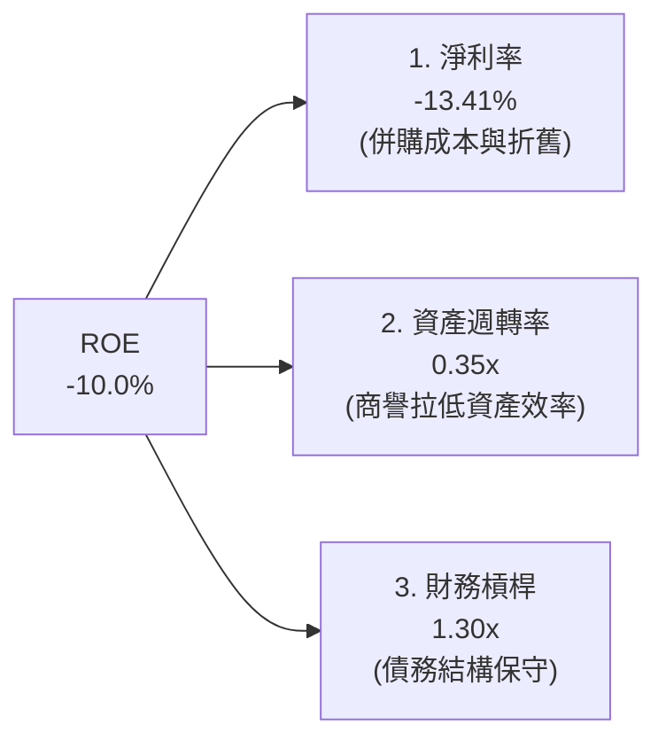

### 6.4 獲利能力儀表板

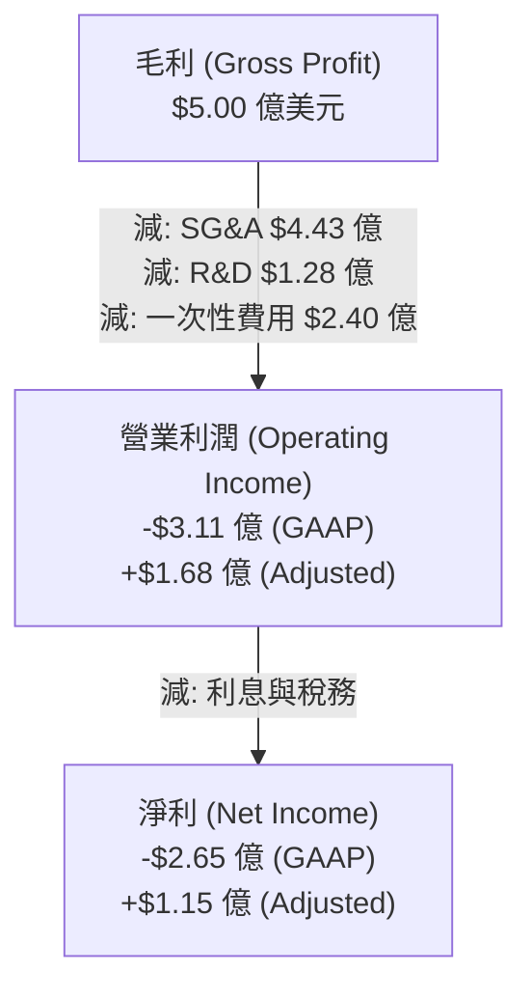

---

## 7. 估值深度分析

AVAV 股價在經歷大幅修正後，其估值乘數已重新回到具備吸引力的區間。

### 7.1 同業估值比較表格

我們選取了 Kratos Defense (KTOS)、Lockheed Martin (LMT) 與 Northrop Grumman (NOC) 作為同業對比標的。

| 估值與財務指標 | **AVAV (本公司)** | **KTOS (直接對手)** | **LMT (傳統軍工)** | **NOC (傳統軍工)** | 本公司估值評估 |
|---|---|---|---|---|---|
| **Trailing P/E** | **N/A** (虧損) | 48.5x | 17.2x | 19.5x | 🔴 暫時無參考價值 |
| **Forward P/E** | **31.38x** | 35.0x | 16.5x | 18.0x | 🟡 較傳統軍工有溢價，但低於 KTOS |
| **P/S Ratio** | **3.64x** | 2.50x | 1.80x | 1.70x | 🟡 反映高成長預期 |
| **EV / EBITDA** | **37.88x** | 28.0x | 12.0x | 13.0x | 🔴 估值偏高，需等待 EBITDA 釋放 |
| **EV / Revenue** | **3.73x** | 2.65x | 1.85x | 1.75x | 🟡 處於合理溢價區間 |
| **Revenue Growth**| **140.89%** | 12.5% | 5.2% | 4.8% | 🟢 遠超同業，支持高估值 |

### 7.2 歷史估值區間分析

```
╔══════════════════════════════════════════════════════════════════╗
║                AVAV Forward P/E 歷史區間與當前位置               ║
╠══════════════════════════════════════════════════════════════════╣
║                                                                  ║
║  歷史最高 (FY25 Peak)：  85.0x  ██████████████████████████████   ║
║  歷史中位數 (5Y Avg)：   42.0x  ███████████████                  ║
║  當前 Forward P/E：      31.38x ███████████  ← 🟢 處於低位       ║
║  歷史最低 (FY23 Low)：   25.0x  ████████                         ║
║                                                                  ║
║  📊 評估：當前 31.38x 的 Forward P/E 已經安全消化了 52 週高點的  ║
║  泡沫，具備極高的安全邊際與估值修復彈性。                         ║
╚══════════════════════════════════════════════════════════════════╝
```

### 7.3 情境目標價（未來 3 年假設驅動）

由於 AVAV 淨利受高額折舊與攤銷 (D&A) 壓抑，P/E 容易失真，我們主要採用 **EV/EBITDA** 與 **EV/Sales** 作為核心估值工具。

| 決策情境 | 營收 CAGR (3Y) | 營業利潤率 (FY28) | 退出 EV/EBITDA 倍數 | 隱含目標價 | 相對當前股價之預期報酬 |
|---|---|---|---|---|---|
| 🔴 **悲觀情境** | 15.0% | 8.0% | 20.0x | **$115.00** | -19.1% |
| 🟡 **基準情境** | **25.0%** | **12.0%** | **28.0x** | **$195.00** | **+37.1% (12M 目標)** |
| 🟢 **樂觀情境** | 35.0% | 15.0% | 35.0x | **$265.00** | +86.4% |

### 7.4 DCF 敏感性分析（6 格目標價矩陣）

基於終端成長率 (Terminal Growth Rate) 設為 3.0% 的假設：

| 營收成長率 \ WACC | WACC = 9.0% | WACC = 10.09% (基準) | WACC = 11.0% |
|---|---|---|---|
| **🟢 樂觀 (成長率 30%)** | **$285.00** (+100.4%) | **$255.00** (+79.3%) | **$225.00** (+58.2%) |
| **🟡 基準 (成長率 25%)** | **$220.00** (+54.7%) | **$195.00** (+37.1%) | **$170.00** (+19.5%) |
| **🔴 悲觀 (成長率 15%)** | **$135.00** (-5.1%) | **$115.00** (-19.1%) | **$95.00** (-33.2%) |

### 7.5 估值綜合區間

```
╔══════════════════════════════════════════════════════════════════╗
║                       AVAV 估值區間定位                          ║
╠══════════════════════════════════════════════════════════════════╣
║                                                                  ║
║  [悲觀 $115] <═══【當前股價 $142.20】═════> [基準 $195] ===> [樂觀 $265]║
║                                                                  ║
║  📊 結論：當前股價顯著偏向估值下限，下行風險有限（約 19%），     ║
║  而上行空間（至基準目標價）達 37.1%，具備優異的風險回報比 (R/R)。║
╚══════════════════════════════════════════════════════════════════╝
```

---

## 8. 成長催化劑

### 8.1 催化劑時間軸

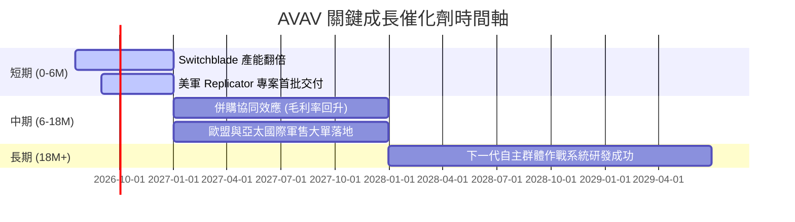

### 8.2 TAM 市場規模分析

```
╔══════════════════════════════════════════════════════════════════╗
║               AVAV 潛在市場規模 (TAM) 預估 (至 2030)              ║
╠══════════════════════════════════════════════════════════════════╣
║                                                                  ║
║  1. 戰術巡飛彈 (TMS) 市場： TAM $80億美元 ｜ 當前滲透率: ~10%    ║
║  2. 小型軍用無人機 (sUAS)： TAM $50億美元 ｜ 當前滲透率: ~25%    ║
║  3. 太空與網絡安全領域：    TAM $150億美元｜ 當前滲透率: ~2%     ║
║                                                                  ║
║  📊 總計可觸及市場 (Total TAM)：$280 億美元                      ║
║  AVAV 目前年營收約 $19.77 億美元，未來成長空間巨大。             ║
╚══════════════════════════════════════════════════════════════════╝
```

### 8.3 成長驅動力結構圖

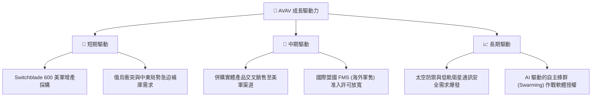

---

## 9. 風險矩陣

### 9.1 風險評分矩陣

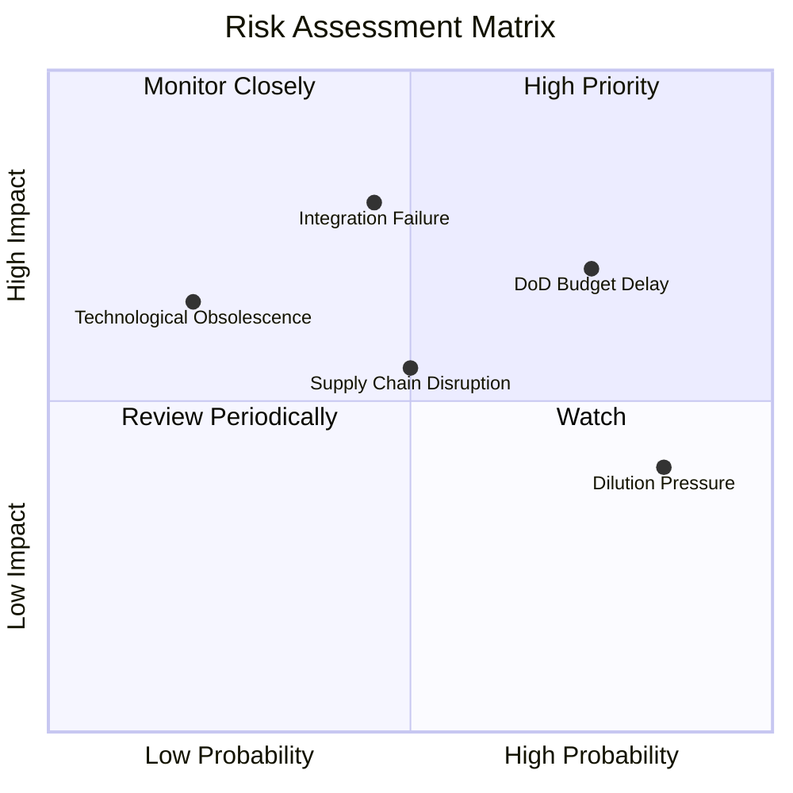

### 9.2 風險清單詳細分析

| # | 風險項目 | 發生機率 | 財務衝擊 | 風險評分 | 機構級緩解與應對措施 |
|---|---|---|---|---|---|
| 1 | 🔴 **併購整合不順導致商譽減值** | 中等 (45%) | 極高 (-20% 淨資產) | 🔴 **7.2/10** | 成立專門的整合委員會，實施分階段業務併入，並設定關鍵績效指標 (KPI) 監控。 |
| 2 | 🔴 **美國國防部預算撥款延遲** | 高 (75%) | 中等 (-10% 營收) | 🔴 **7.0/10** | 增加海外非美軍客戶營收佔比（目標提升至 35%），以分散單一客戶政策風險。 |
| 3 | 🟡 **股本稀釋壓制股價表現** | 極高 (85%) | 低 (已在股價中反映) | 🟡 **5.5/10** | 隨著獲利回升，管理層應在 FY27 啟動股份回購計畫以抵消稀釋。 |
| 4 | 🟡 **關鍵半導體與感測器供應鏈中斷**| 中等 (50%) | 中等 (-8% 產能) | 🟡 **5.0/10** | 實施關鍵零部件雙源採購策略 (Dual-sourcing)，並建立 6 個月的安全庫存。 |

---

## 10. 投資建議

### 10.1 最終綜合評級雷達圖

```
╔══════════════════════════════════════════════════════════════╗
║                  AVAV 最終投資價值評級                       ║
╠══════════════════════════════════════════════════════════════╣
║ 1. 產業成長前景  9.0/10  ▓▓▓▓▓▓▓▓▓▓▓▓▓▓▓▓▓▓░░  ★★★★★           ║
║ 2. 競爭壁壘深度  8.5/10  ▓▓▓▓▓▓▓▓▓▓▓▓▓▓▓▓▓░░░  ★★★★☆           ║
║ 3. 財務安全邊際  7.5/10  ▓▓▓▓▓▓▓▓▓▓▓▓▓▓▓░░░░░  ★★★★☆           ║
║ 4. 估值修復空間  8.0/10  ▓▓▓▓▓▓▓▓▓▓▓▓▓▓▓▓░░░░  ★★★★☆           ║
║ 5. 短期獲利品質  5.5/10  ▓▓▓▓▓▓▓▓▓▓▓░░░░░░░░░  ★★★☆☆           ║
╠══════════════════════════════════════════════════════════════╣
║ 綜合投資評級  7.7/10  ▓▓▓▓▓▓▓▓▓▓▓▓▓▓▓▓░░░░  🟢 買入 (Buy)    ║
╚══════════════════════════════════════════════════════════════╝
```

### 10.2 目標價與隱含報酬率

| 投資情境 | 發生機率 | 12M 目標價 | 隱含報酬率 | 機率權重期望值 |
|---|---|---|---|---|
| **🟢 樂觀情境** | 25% | $265.00 | +86.4% | $66.25 |
| **🟡 基準情境** | **60%** | **$195.00** | **+37.1%** | **$117.00** |
| **🔴 悲觀情境** | 15% | $115.00 | -19.1% | $17.25 |
| **綜合加權合理價**| **100%** | **$200.50** | **+41.0%** | **期望回報優異** |

### 10.3 買入時機與觸發因素

```
╔══════════════════════════════════════════════════════════════════╗
║                  ✅ AVAV 買入觸發因素 Checklist                 ║
╠══════════════════════════════════════════════════════════════════╣
║                                                                  ║
║  立即買入觸發條件（滿足 2 項以上即可建倉）：                      ║
║  ✅ 股價跌破 $140.00，對應 Forward P/E 降至 30x 以下。            ║
║  ✅ 美國國防部正式通過新一季國防預算撥款案。                     ║
║  ✅ 季度財報顯示毛利率企穩回升至 28% 以上。                      ║
║                                                                  ║
║  加碼觸發條件（出現以下任一即可加碼）：                           ║
║  ☐ Switchblade 600 獲得首個超過 $2 億美元的單筆國際訂單。        ║
║  ☐ 財報確認併購整合費用降至單季 $1,000 萬美元以下。              ║
║                                                                  ║
║  減碼/停損觸發條件（出現以下任一必須嚴格執行）：                 ║
║  ☐ 財報宣布進行大額商譽減值（超過 $2.0 億美元）。                ║
║  ☐ FCF 缺口持續擴大，導致流動比率降至 2.0x 以下。                ║
╚══════════════════════════════════════════════════════════════════╝
```

### 10.4 投資人適配度分析

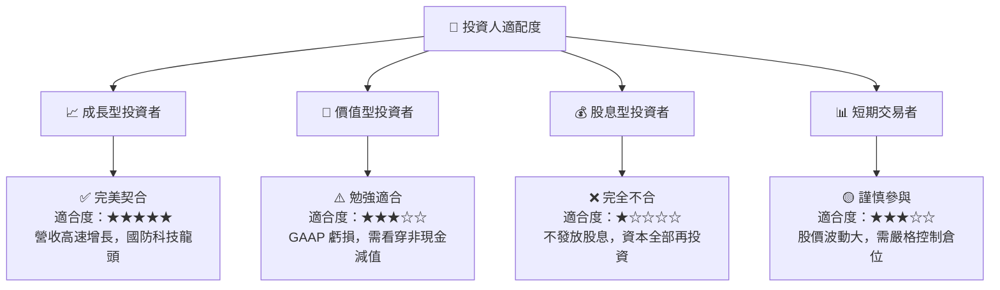

### 10.5 每季財報監控清單（Quarterly Watch List）

在接下來的季度財報中，投資人應嚴格追蹤以下指標，以驗證投資論點是否兌現：

| 監控指標 | 基準值 (FY26) | 觸發「加碼」門檻 | 觸發「減碼/停損」門檻 | 追蹤此指標的商業含意 |
|---|---|---|---|---|
| **調整後毛利率** | 25.3% | > 30.0% 🟢 | < 22.0% 🔴 | 評估併購後低毛利業務的整合進度與定價權。 |
| **Switchblade 訂單積壓**| ~$4.5 億 | > $6.0 億 🟢 | < $3.5 億 🔴 | 評估核心巡飛彈產品的市場需求與產能消化速度。 |
| **單季營運現金流** | -$1,960 萬 | > +$2,000 萬 🟢 | < -$5,000 萬 🔴 | 監控營運資金佔用情況，避免二次融資稀釋股權。 |
| **非 GAAP EPS** | $1.15 (調整後) | > $1.50 🟢 | < $0.80 🔴 | 驗證營業槓桿是否如期釋放，確保估值倍數合理性。 |

### 10.6 反面論證：什麼會證明論點錯誤

```
╔══════════════════════════════════════════════════════════════════╗
║              ⚠️ 論點失效條件 (Disconfirming Evidence)            ║
╠══════════════════════════════════════════════════════════════════╣
║  本投資論點在下列情況成立時應重新檢視或果斷退出：                ║
║  ☐ 2027 財年 Q2 前，非 GAAP 毛利率無法回升至 28% 以上。          ║
║  ☐ 被併購實體連續兩季營收成長率低於 10%，證實併購失敗。          ║
║  ☐ 自由現金流 (FCF) 持續流失，導致公司必須再度發行新股融資。     ║
║  ☐ 競爭對手 (如 Anduril) 研發出更具性價比的巡飛彈，美軍轉移訂單。 ║
║  ☐ 調整後 ROIC 持續低於 WACC (10.09%)，無法創造經濟增值。        ║
╚══════════════════════════════════════════════════════════════════╝
```

---

> **免責聲明**：本報告為 AI 自動生成，僅供研究參考，不構成投資建議。投資有風險，入市需謹慎。