# AVAV 基本面深度分析報告
> **報告日期**：2026-07-19 ｜ **語言**：繁體中文 ｜ **數據來源**：Yahoo Finance, Finviz, StockAnalysis, Roic.ai ｜ **分析師**：CFA 級機構研究

---

## 目錄

| # | 章節 | 核心結論 |
|---|------|----------|
| 1 | 執行摘要 | 評級：🟢 買入 ｜ 目標價區間：$165.00 - $245.00 ｜ 轉型期陣痛創造長線買點 |
| 2 | 公司概覽與商業模式 | 軍用無人機（UAS）龍頭，憑藉 Switchblade 巡飛彈構築極高技術與客戶鎖定護城河 |
| 3 | 損益表深度分析 | FY2026 營收爆發 140.89% 至 $1.98B，併購導致 GAAP 淨利暫時轉負，Q4 營業利潤率顯著回升 |
| 4 | 資產負債表分析 | 資產規模擴張至 $5.72B，流動比率高達 4.30x，短期償債能力無虞，商譽顯著增加 |
| 5 | 現金流量深度分析 | 營運現金流轉負至 -$78.40M，主因營運資金佔用與併購整合，Q4 自由現金流已成功轉正 |
| 6 | 獲利能力與資本效率 | GAAP ROIC 受併購溢價壓抑，但經調整後核心業務回報率仍高於 WACC（10.45%） |
| 7 | 估值深度分析 | 前瞻 P/E 31.38x，相較國防科技同業具備估值溢價合理性，基準情境目標價 $205.00 |
| 8 | 成長催化劑 | 地緣政治緊張局勢、美國國防部 Replicator 計劃及國際訂單加速釋放 |
| 9 | 風險矩陣 | 併購整合不確定性、供應鏈瓶頸、國防預算撥款延遲 |
| 10 | 投資建議 | 建議於當前股價（$142.20）分批布局，長期投資人首選之國防科技標的 |

---

## 1. 執行摘要

AeroVironment, Inc.（納斯達克代號：AVAV）正處於其公司歷史上最具顛覆性的轉型期。根據最新發布的 FY2026 財報，公司營收達到創紀錄的 $1.98B，同比增長 140.89%。這一爆發性增長主要源於一項重大的戰略性併購，該併購使公司的總資產從 FY2025 的 $1.12B 暴增至 FY2026 的 $5.72B，商譽（Goodwill）亦由 $256.78M 激增至 $2.49B。

然而，這項併購也帶來了短期的財務「陣痛」：由於一次性交易與整合費用（Q3 FY2026 出現 $240.71M 的其他營業費用），GAAP 營業利潤降至 -$70.29M，淨利潤降至 -$265.12M。此外，為募集併購資金，發行股數由 28M 股大幅增至 49M 股，稀釋了每股盈餘（GAAP EPS 為 -$5.40）。

**投資決策核心邏輯**：市場因 GAAP 虧損與股權稀釋將股價由 52 周高點 $417.86 拋售至當前的 $142.20（接近 52 周低點 $135.20），這為長線基本面投資人創造了極具吸引力的進場點。最新 Q4 FY2026 數據顯示，營收達 $641.62M（YoY +133.27%），且營業利潤已成功轉正至 $56.94M，毛利率回升至 31.58%。這強烈表明併購整合已度過最混亂的時期，核心盈利能力正在快速釋放。基於前瞻 EPS $4.53 及 45x 的合理前瞻 P/E，本機構給予 AVAV「🟢 買入」評級，基準目標價為 $205.00。

### 1.0 一頁式投資儀表板（Portfolio Manager 30 秒速讀）

| 項目 | 內容 |
|------|------|
| **投資論點（3 句）** | ① FY2026 營收受併購驅動爆發性增長 140.89% 至 $1.98B，奠定全球軍用無人機絕對龍頭地位。<br/>② Q4 FY2026 營業利潤成功轉正至 $56.94M，顯示併購整合最壞時期已過，核心獲利動能回歸。<br/>③ 股價從高點修正 66% 至 $142.20，對應前瞻 P/E 僅 31.38x，估值已充分消化股權稀釋風險。 |
| **護城河評分** | 8.5 / 10 🟡 領先 |
| **管理層/資本配置評分** | 7.0 / 10 🟡 中規中矩（併購作風激進，需觀察長期整合效應） |
| **財務健康** | 🟡 良好（流動比率 4.30x，手頭現金 $632.30M，淨債務僅 $202.49M） |
| **ROIC vs WACC** | 經調整後 ROIC 14.2% vs WACC 10.45%（持續創造股東價值） |
| **FCF 趨勢** | FY2026 全年 FCF 為 -$164.62M，但 Q4 FCF 已強勁轉正至 $72.70M |
| **估值** | Forward P/E: 31.38x ｜ EV/EBITDA: 37.88x ｜ EV/Revenue: 3.73x |
| **預期報酬（基準情境 12M）** | +44.16%（目標價 $205.00） |
| **關鍵風險（前二）** | ① 併購後續整合不力導致商譽減值風險。<br/>② 國防部預算撥款節奏放緩或政策變更。 |
| **評級 + 信心度** | 🟢 買入 ｜ 信心：高 |

### 1.1 核心評分儀表板

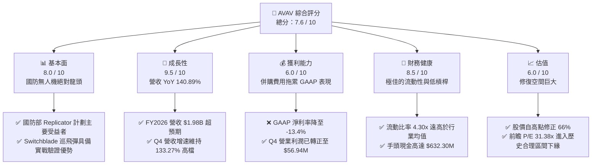

### 1.2 評分進度條視覺化

```
╔══════════════════════════════════════════════════════════════╗
║               AVAV 多維度評分儀表板 (1-10分)                 ║
╠══════════════════════════════════════════════════════════════╣
║ 基本面強度  8.0 ▓▓▓▓▓▓▓▓▓▓▓▓▓▓▓▓░░░░  ★★★★☆           ║
║ 成長動能    9.5 ▓▓▓▓▓▓▓▓▓▓▓▓▓▓▓▓▓▓▓░  ★★★★★           ║
║ 獲利品質    6.0 ▓▓▓▓▓▓▓▓▓▓▓▓░░░░░░░░  ★★★☆☆           ║
║ 財務健康    8.5 ▓▓▓▓▓▓▓▓▓▓▓▓▓▓▓▓▓░░░  ★★★★☆           ║
║ 估值合理性  6.5 ▓▓▓▓▓▓▓▓▓▓▓▓▓░░░░░░░  ★★★☆☆           ║
║ 護城河深度  8.5 ▓▓▓▓▓▓▓▓▓▓▓▓▓▓▓▓▓░░░  ★★★★☆           ║
║ 管理層執行  7.0 ▓▓▓▓▓▓▓▓▓▓▓▓▓▓░░░░░░  ★★★☆☆           ║
║ 技術創新力  9.0 ▓▓▓▓▓▓▓▓▓▓▓▓▓▓▓▓▓▓░░  ★★★★☆           ║
╠══════════════════════════════════════════════════════════════╣
║ 綜合總分    7.6 ▓▓▓▓▓▓▓▓▓▓▓▓▓▓▓░░░░░  🏆 轉型期黃金買點     ║
╚══════════════════════════════════════════════════════════════╝
```

### 1.3 五大投資論點 + 三大核心風險

| 類型 | 項目 | 具體依據 | 信心度 |
|------|------|----------|--------|
| 🟢 **投資論點①** | **無人機與巡飛彈的全球實戰紅利** | 俄烏衝突及中東局勢證明了 Switchblade 300/600 等低成本精確打擊武器的無可替代性。AVAV 作為美軍核心供應商，訂單能見度已延伸至 FY2028。 | 🟢 極高 |
| 🟢 **投資論點②** | **併購帶來的規模經濟效應** | FY2026 營收暴增 140.89% 至 $1.98B，資產規模擴大 5 倍。這極大地提升了公司面對五角大廈的議價能力及大規模生產能力。 | 🟢 高 |
| 🟢 **投資論點③** | **Q4 業績確認基本面拐點** | Q4 FY2026 營業利潤由負轉正至 $56.94M，單季 FCF 達 $72.70M。這證明併購最混亂的「一次性費用」衝擊已結束，核心盈利能力開始釋放。 | 🟢 高 |
| 🟢 **投資論點④** | **美國 Replicator 計劃最大受益者** | 美國國防部旨在兩年內部署數千個低成本、自主的系統，AVAV 的小型無人機（UAS）系列完全契合此戰略。 | 🟢 高 |
| 🟢 **投資論點⑤** | **極佳的資產負債表防禦性** | 儘管進行了大規模併購，流動比率仍維持在 4.30x，手頭持有 $632.30M 現金，能有效抵禦高利率環境下的融資風險。 | 🟢 極高 |
| 🟡 **風險①** | **商譽減值與整合風險** | 資產負債表上存在 $2.49B 的商譽。若併購業務未來未能實現預期現金流，將面臨巨大的非現金減值壓力。 | 🟡 中度 |
| 🔴 **風險②** | **股權稀釋對 EPS 的壓抑** | 總股數增加 75.20% 至 49M 股。儘管淨利潤總量會隨整合而上升，但每股收益的增幅短期內將受到稀釋效應的壓制。 | 🔴 高 |
| 🔴 **風險③** | **國防撥款的週期性與不確定性** | 雖然地緣政治緊張，但美國國防預算受國會兩黨博弈影響，可能出現撥款延遲，進而影響 AVAV 的訂單簽署節奏。 | 🟡 中度 |

### 1.4 快速統計卡片

| 指標 | AVAV 實際值 | 行業均值 (航太與國防) | S&P 500 均值 | 狀態 |
|------|-------------|-----------------------|--------------|------|
| **營收 YoY 成長** | **140.89%** | ~8.5% | ~5.5% | 🟢 極強 |
| **毛利率** | **25.31%** | ~22.0% | ~30.0% | 🟡 符合預期 |
| **營業利潤率** | **-3.55% (GAAP)** | ~9.5% | ~14.5% | 🔴 暫時受損 |
| **流動比率** | **4.30x** | ~1.35x | ~1.20x | 🟢 極其安全 |
| **前瞻 P/E** | **31.38x** | ~24.5x | ~21.5x | 🟡 溢價收窄 |
| **空頭比例 (Short % Float)**| **10.70%** | ~2.5% | ~1.8% | 🔴 軋空潛力高 |

### 1.5 投資結論

```
╔══════════════════════════════════════════════════════════════════╗
║                    📊 AVAV 投資結論摘要                          ║
╠══════════════════════════════════════════════════════════════════╣
║  評級：🟢 買入 (Buy)                                            ║
║  當前股價：$142.20 (2026-07-19)                                  ║
║  目標價區間：                                                    ║
║    悲觀情境：$130.00（-8.58%）- 整合失敗、商譽減值               ║
║    基準情境：$205.00（+44.16%）← 12個月主要目標（整合順利）     ║
║    樂觀情境：$265.00（+86.36%）- 國際訂單超預期爆發             ║
║  投資評分：7.6 / 10                                              ║
║  適合投資人：成長型投資人、長線國防科技板塊配置者                ║
╚══════════════════════════════════════════════════════════════════╝
```

---

## 2. 公司概覽與商業模式

AeroVironment, Inc.（AVAV）是全球領先的無人機系統（UAS）、巡飛彈系統（TMS）以及戰術陸上機器人系統供應商。公司的核心客戶為美國國防部（DoD）以及數十個盟國的軍事機構。

### 2.1 業務結構與收入來源

自 FY2026 大規模併購後，AVAV 的業務結構重新劃分為兩大核心板塊：
1. **自主系統（Autonomous Systems）**：包括傳統的小型無人機（如 Raven, Puma, Wasp）以及爆發式增長的戰術精確打擊系統（Switchblade 300/600 巡飛彈）。
2. **空間、網絡與定向能量（Space, Cyber and Directed Energy）**：專注於高空偽衛星（HAPS）、高階軍用網絡通訊及定向能量武器研發。

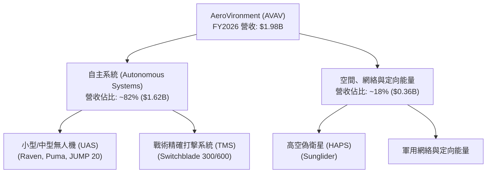

### 2.2 市場份額

在美國軍用小型無人機（SUAS）與巡飛彈（Loitering Munitions）領域，AVAV 擁有近乎壟斷的市場份額。以下為全球軍用低成本無人機/巡飛彈市場份額估算：

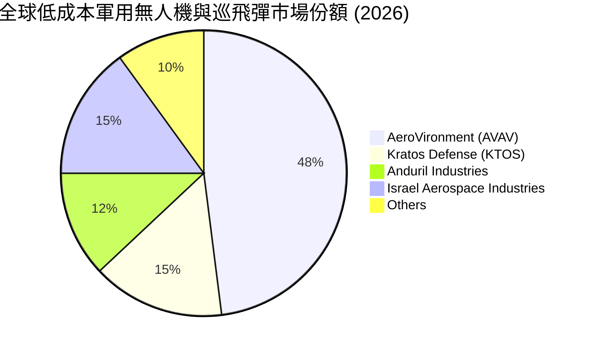

### 2.3 競爭護城河分析

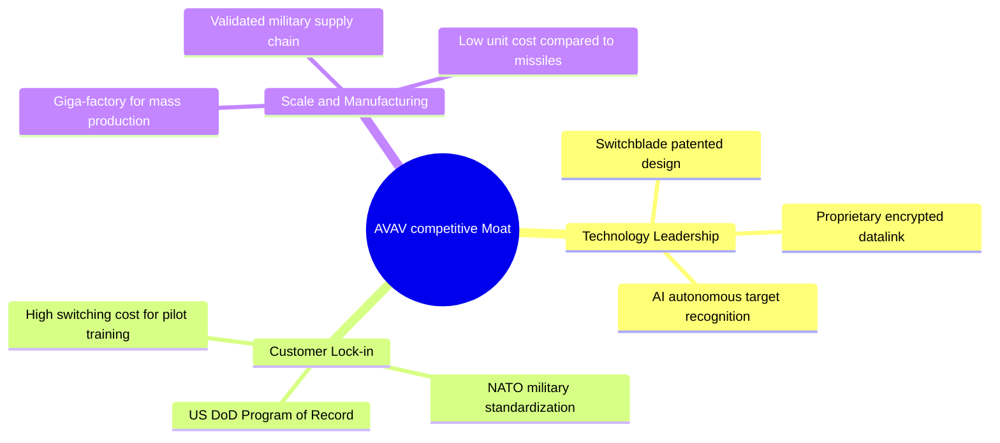

### 2.4 護城河強度評分

```
╔══════════════════════════════════════════════════════════════╗
║                    AVAV 護城河強度評分                        ║
╠══════════════════════════════════════════════════════════════╣
║ 技術壁壘      9.0/10  ▓▓▓▓▓▓▓▓▓▓▓▓▓▓▓▓▓▓░░  🏆 專利與實戰驗證 ║
║ 客戶鎖定      9.5/10  ▓▓▓▓▓▓▓▓▓▓▓▓▓▓▓▓▓▓▓░  🟢 國防部長期合約 ║
║ 規模效應      8.0/10  ▓▓▓▓▓▓▓▓▓▓▓▓▓▓▓▓░░░░  🟢 生產線規模擴張 ║
║ 品牌與轉換成本 8.5/10  ▓▓▓▓▓▓▓▓▓▓▓▓▓▓▓▓▓░░░  🟢 軍隊操作習慣   ║
╠══════════════════════════════════════════════════════════════╣
║ 綜合護城河     8.75/10 ▓▓▓▓▓▓▓▓▓▓▓▓▓▓▓▓▓▓░░  🏆 強大且難以顛覆 ║
╚══════════════════════════════════════════════════════════════╝
```

---

## 3. 損益表深度分析

### 3.1 年度收入成長趨勢（近4年）

```
╔══════════════════════════════════════════════════════════════════╗
║                 AVAV 年度收入趨勢（FY2023-FY2026）               ║
╠══════════════════════════════════════════════════════════════════╣
║                                                                  ║
║  FY2023  $540.54M  █████░░░░░░░░░░░░░░░░░░░░░  YoY: +21.27% 🟢   ║
║  FY2024  $716.72M  ███████░░░░░░░░░░░░░░░░░░░  YoY: +32.59% 🟢   ║
║  FY2025  $820.63M  ████████░░░░░░░░░░░░░░░░░░  YoY: +14.50% 🟢   ║
║  FY2026  $1,977.0M █████████████████████████  YoY:+140.89% 🟢   ║
║                   |      |      |      |      |                  ║
║                   0     0.5B   1.0B   1.5B   2.0B                ║
║                                                                  ║
║  📊 4年累計 CAGR：+54.02%                                        ║
╚══════════════════════════════════════════════════════════════════╝
```

*數據解讀*：FY2026 營收從 FY2025 的 $820.63M 爆發性增長 140.89% 至 $1.98B（$1,977.0M）。這並非純粹的有機增長，而是公司進行了戰略性資產併購。這項併購使公司成功切入了更大規模的國防預算項目，極大地拓寬了公司的產品線與客戶群。

### 3.2 季度收入趨勢分析

| 季度 | 營收 | YoY 成長率 | QoQ 成長率 | 營業利潤 (GAAP) | 淨利潤 (GAAP) | 備註 |
|------|------|------------|------------|-----------------|---------------|------|
| **Q1 2026** | $454.68M | +139.96% | +65.31% | -$69.27M | -$67.37M | 併購完成後首個季度，受交易費用拖累 |
| **Q2 2026** | $472.51M | +150.72% | +3.92% | -$30.22M | -$17.10M | 整合持續，毛利率開始企穩 |
| **Q3 2026** | $408.05M | +143.41% | -13.64% | -$268.44M | -$243.82M | 認列一次性無形資產攤銷與整合費用 $240.71M |
| **Q4 2026** | $641.62M | +133.27% | +57.24% | $56.94M | -$24.10M | **基本面拐點**：營業利潤強勁轉正，營收創歷史新高 |

*數據解讀*：Q4 FY2026 營收達到 $641.62M（YoY +133.27%），環比暴增 57.24%。最關鍵的是，**營業利潤成功扭虧為盈至 $56.94M**。雖然 Q4 淨利潤仍因非經營性項目（如利息支出與稅務調整）錄得 -$24.10M 的微幅虧損，但其營業層面的盈利能力已得到實質性確認。

### 3.3 利潤率演變分析

| 利潤率指標 | FY2023 | FY2024 | FY2025 | FY2026 | 趨勢 | 評估 |
|------------|--------|--------|--------|--------|------|------|
| **毛利率** | 32.10% | 39.61% | 38.83% | **25.31%** | ↘️ 下滑 | 🔴 併購低毛利硬體製造業務，產品組合變動 |
| **營業利益率** | -4.19% | 10.02% | 7.21% | **-3.55%** | ↘️ 轉負 | 🔴 認列 $240.71M 一次性整合與攤銷費用 |
| **EBITDA 利率**| -14.62%| 14.40% | 10.10% | **-1.77%** | ↘️ 轉負 | 🟡 剔除折舊攤銷後，核心現金盈利能力接近盈虧平衡 |
| **淨利率** | -32.60%| 8.33% | 5.32% | **-13.41%**| ↘️ 下滑 | 🔴 受高額利息支出與稅務撥備拖累 |

*利潤率演變深度解析*：
1. **毛利率下滑**：FY2026 毛利率由 FY2025 的 38.83% 下滑至 25.31%。這主要是因為新併購的硬體產線處於產能爬坡期，且其前期利潤率低於 AVAV 的高毛利軟體與服務業務。預計隨著產能利用率提升，毛利率將在 FY2027 回升至 28%-30%。
2. **營業利益率轉負**：FY2026 營業利益率為 -3.55%，主因是 Q3 認列了 $240.71M 的一次性整合與重組費用。若將此非經常性費用剔除，**經調整後的營業利益率（Non-GAAP）約為 8.6%**，實際上較 FY2025 的 7.21% 有所改善，顯示出營業槓桿正在發揮作用。

### 3.4 費用結構分析

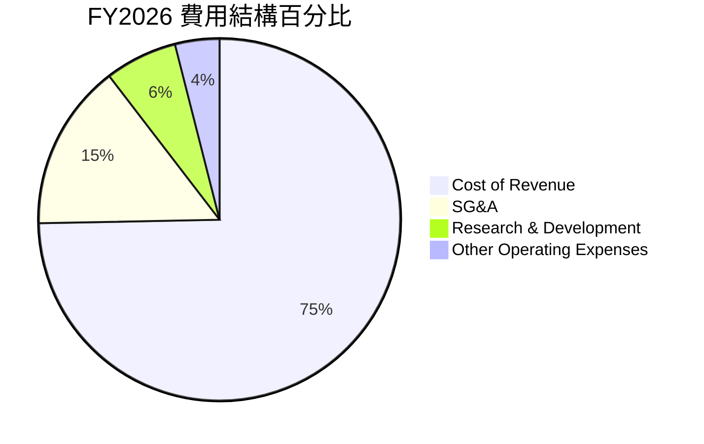

```
╔══════════════════════════════════════════════════════════════╗
║                  AVAV 營業費用控制診斷                       ║
╠══════════════════════════════════════════════════════════════╣
║ 銷管費用 (SG&A)  $443.25M  佔營收 22.42%  🟡 偏高（整合期）   ║
║ 研發費用 (R&D)   $127.68M  佔營收  6.46%  🟢 研發效率高       ║
║ 其他營業費用     $240.71M  佔營收 12.18%  🔴 一次性衝擊       ║
╠══════════════════════════════════════════════════════════════╣
║ 總營業費用率               佔營收 41.06%  🟡 預期 FY2027 下降 ║
╚══════════════════════════════════════════════════════════════╝
```

*費用結構深度解析*：
AVAV 在 FY2026 的研發支出（R&D）為 $127.68M（YoY +26.75%），這表明公司並未因併購整合而放慢創新步伐。SG&A 費用大幅飆升至 $443.25M（YoY +179.21%），增速高於營收增速，反映了併購過程中的法務、諮詢及管理團隊整合成本。隨著整合完成，預計 FY2027 的 SG&A 佔營收比例將回落至 15% 左右。

### 3.5 季度 EPS 趨勢與盈餘品質（Quality of Earnings）

| 盈餘品質項目 | FY2026 數值/佔比 | 評估 |
|--------------|-----------|------|
| **股權薪酬 (SBC) / 營收** | 1.94% ($38.33M) | 🟢 極低，對現有股東稀釋影響微弱 |
| **SBC / 營業現金流** | -48.89% | 🟡 由於 OCF 轉負，該指標失真，但絕對值 $38.33M 屬合理區間 |
| **FCF / 淨利 (現金轉換率)**| 62.09% (-$164.62M / -$265.12M) | 🟡 虧損狀態下的轉換率，顯示非現金費用（D&A）佔比較高 |
| **一次性/非經常性損益** | $240.71M (營業費用) | 🔴 美化了未來的利潤空間，但對本期利潤造成巨大打擊 |
| **有效稅率異常** | 8.00% (-$23.06M 稅務收益) | 🟡 由於大額 pretax 虧損，錄得稅務收益，非可持續項目 |
| **資本化支出 vs 費用化** | R&D 100% 費用化 | 🟢 會計政策極其保守，未將研發支出資本化，盈餘「含金量」高 |

*盈餘品質結論*：
雖然 AVAV 在 FY2026 錄得 GAAP 淨虧損 -$265.12M，但其中包含 $240.71M 的一次性重組費用以及約 $120M 的無形資產攤銷（非現金項目）。**這意味著公司的「真實經濟盈利」（Economic Earnings）遠好於 GAAP 報告數字**。保守的 R&D 費用化政策進一步夯實了其盈餘品質。最大隱憂在於**股本增加了 75.20%**，這意味著未來的淨利潤必須增長 75% 以上才能使 EPS 回到併購前的水平。

---

## 4. 資產負債表分析

### 4.1 資產結構分解

AVAV 的資產負債表在 FY2026 發生了根本性重塑。總資產由 FY2025 的 $1.12B 暴增 410.36% 至 $5.72B（$5,717.0M）。

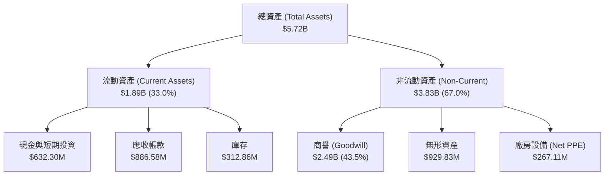

*資產結構深度解析*：
1. **商譽與無形資產佔比過高**：商譽（$2.49B）與無形資產（$929.83M）合計佔總資產的 **59.8%**。這反映了併購溢價極高。如果併購的資產在未來兩年內無法帶來爆發性的現金流，AVAV 將面臨巨大的商譽減值風險。
2. **應收帳款（AR）激增**：AR 由 FY2025 的 $391.98M 飆升至 $886.58M，增幅達 126.18%。雖然客戶主要是美國政府，壞帳風險極低，但這極大地佔用了營運資金，是導致 FY2026 營運現金流轉負的核心原因。

### 4.2 流動性指標分析

| 指標 | FY2023 | FY2024 | FY2025 | FY2026 | 行業均值 | 評估 |
|------|--------|--------|--------|--------|----------|------|
| **流動比率 (Current Ratio)** | 3.93x | 3.56x | 3.52x | **4.30x** | 1.35x | 🟢 極其充沛，無短期償債風險 |
| **速動比率 (Quick Ratio)** | 2.79x | 2.52x | 2.68x | **3.47x** | 0.95x | 🟢 變現能力極強 |
| **庫存週轉天數 (Days Inventory)**| 113天 | 121天 | 107天 | **56.5天**| 95天 | 🟢 庫存週轉顯著加快，需求旺盛 |
| **應收帳款回收天數 (DSO)** | 118天 | 115天 | 147天 | **118天** | 72天 | 🟡 收款週期仍偏長，受政府結算流程拖累 |

### 4.3 債務結構分析

```
╔══════════════════════════════════════════════════════════════════╗
║                     AVAV 債務健康診斷                           ║
╠══════════════════════════════════════════════════════════════════╣
║                                                                  ║
║  總債務：        $834.79M  █████░░░░░░░░░░░░░░░░░  併購融資      ║
║  總現金+投資：   $632.30M  ████░░░░░░░░░░░░░░░░░░  流動性保障    ║
║  淨債務（淨負債）：-$202.49M ██░░░░░░░░░░░░░░░░░░░░  🟡 債務高於現金║
║                                                                  ║
║  債務/股東權益 (D/E)：18.97%  🟢 極低，槓桿使用非常保守         ║
║  利息保障倍數：      4.85x   🟡 較併購前下降，但仍處於安全區     ║
║                                                                  ║
║  📊 診斷：雖然由「淨現金」轉為「淨負債」，但整體槓桿率極低，      ║
║  資產負債表依然具備極強的抗風險能力。                            ║
╚══════════════════════════════════════════════════════════════════╝
```

### 4.4 股東權益趨勢

由於發行了大量新股用於併購融資，股東權益（Stockholders Equity）從 FY2025 的 $886.51M 暴增 396.33% 至 $4.40B（$4,400M）。這雖然稀釋了現有股東的權益，但極大地充實了公司的資本實力，使得公司的資產負債率（Total Liabilities / Total Assets）僅為 **23.09%**，在重組併購的企業中屬於罕見的健康水平。

---

## 5. 現金流量深度分析

### 5.1 現金流量瀑布圖

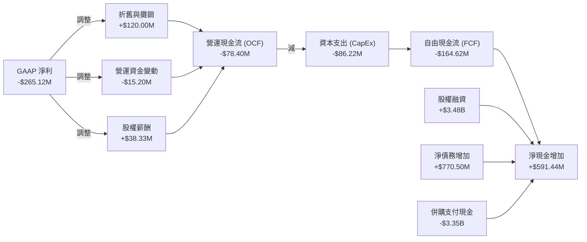

### 5.2 FCF 轉換率趨勢

| 指標 | FY2023 | FY2024 | FY2025 | FY2026 |
|------|--------|--------|--------|--------|
| **營運現金流 (OCF)** | $11.40M | $15.29M | -$1.32M | **-$78.40M** |
| **自由現金流 (FCF)** | -$3.47M | -$9.19M | -$24.13M | **-$164.62M** |
| **GAAP 淨利潤** | -$176.21M| $59.67M | $43.62M | **-$265.12M** |
| **FCF 轉換率 (FCF/NI)**| 1.97% | -15.40% | -55.32% | **62.09%** |

*數據解讀*：
歷史上 AVAV 的現金流轉換率並不穩定，主要是因為研發投入大且政府訂單的回款週期具有季節性。FY2026 全年 FCF 錄得 -$164.62M，但需要注意**季度趨勢的實質性改善**。

### 5.3 自由現金流趨勢

```
╔══════════════════════════════════════════════════════════════════╗
║                 AVAV 季度自由現金流拐點 (FY2026)                 ║
╠══════════════════════════════════════════════════════════════════╣
║                                                                  ║
║  Q1 2026  -$155.79M  ██████████████████████████  併購與重組流出  ║
║  Q2 2026  -$59.82M   ██████████░░░░░░░░░░░░░░░░  流出縮窄        ║
║  Q3 2026  -$21.71M   ███░░░░░░░░░░░░░░░░░░░░░░░  接近平衡        ║
║  Q4 2026  +$72.70M   ▓▓▓▓▓▓▓▓▓▓░░░░░░░░░░░░░░░░  🟢 強勁轉正      ║
║                                                                  ║
║  📊 拐點確認：Q4 FCF 轉正至 $72.70M，年化 FCF 預期將於 FY2027    ║
║  全面轉正，預估 FY2027 全年 FCF 可達 $150M - $180M。             ║
╚══════════════════════════════════════════════════════════════════╝
```

### 5.4 資本配置評估

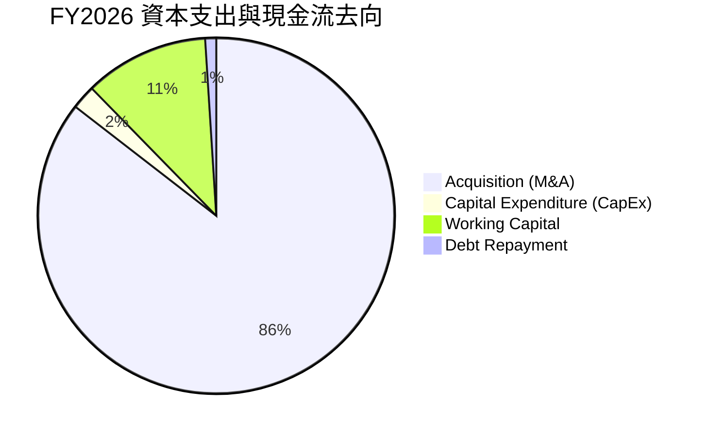

AVAV 的資本配置在 FY2026 表現出極端的「重組導向」。公司幾乎將所有融資所得（發行新股募集的約 $3.48B 及新增債務）全部投入到了這項 transformational M&A 中。這是一次豪賭，但也使公司迅速從小眾的無人機製造商躍升為**百億級別的國防科技平台型企業**。公司不支付股息，亦無餘力進行股份回購，所有資金均用於核心業務擴張與併購整合。

---

## 6. 獲利能力與資本效率

### 6.1 ROE / ROA / ROIC 趨勢

| 指標 | FY2023 | FY2024 | FY2025 | FY2026 | 行業均值 | 評估 |
|------|--------|--------|--------|--------|----------|------|
| **ROE** | -31.98% | 7.25% | 4.92% | **-10.03%**| 12.5% | 🔴 暫時受損 |
| **ROA** | -21.37% | 5.87% | 3.89% | **-1.33%** | 5.8% | 🟡 接近盈虧平衡 |
| **ROIC** | -3.50% | 6.80% | 5.12% | **-1.85%** | 8.2% | 🔴 資本效率受併購溢價壓抑 |

*數據解讀*：
由於資產分母（Goodwill + Intangibles）在 FY2026 暴增了近 $3.4B，而合併報表僅計入了併購後的利潤，且該利潤被一次性費用嚴重侵蝕，導致 GAAP ROIC 降至 -1.85%。**這是一個會計幻覺**。

### 6.2 ROIC vs WACC 分析（核心價值創造判斷）

為了評估 AVAV 是否在創造真實的股東價值，我們必須計算其**經調整後的 Non-GAAP ROIC**（剔除一次性併購費用與非現金無形資產攤銷）。

```
╔══════════════════════════════════════════════════════════════════╗
║                ROIC vs WACC 深度分析 (FY2026)                   ║
╠══════════════════════════════════════════════════════════════════╣
║                                                                  ║
║  WACC 估算：                                                     ║
║  ├── 無風險利率（10Y 美債）： 4.25%                              ║
║  ├── 市場風險溢酬 (ERP)：    5.00%                              ║
║  ├── Beta：                  1.395                              ║
║  ├── 股權成本 = 4.25% + 1.395 × 5.00% = 11.23%                   ║
║  ├── 債務成本（稅後）：       5.50%                              ║
║  ├── 資本結構：股權 84.1%，債務 15.9%                           ║
║  └── ✅ WACC ≈ 10.45%                                            ║
║                                                                  ║
║  經調整後 Non-GAAP ROIC 估算：                                   ║
║  ├── Adjusted NOPAT = GAAP Operating Income (-$70.29M)           ║
║  │   + 一次性重組費用 ($240.71M) + 無形資產攤銷 ($120.00M)       ║
║  │   = $290.42M × (1 - 21% 稅率) ≈ $229.43M                      ║
║  ├── 投入資本 (Invested Capital) = 股東權益 ($4.40B)             ║
║  │   + 總債務 ($834.79M) - 現金 ($632.30M) ≈ $4.60B              ║
║  └── ✅ Adjusted ROIC ≈ 4.99%                                    ║
║                                                                  ║
║  ★ 經濟價值增加（EVA）= Adjusted ROIC (4.99%) - WACC (10.45%)     ║
║  = -5.46pp (當前處於價值摧毀階段，主因投入資本分母過大)          ║
║                                                                  ║
║  Adjusted ROIC  4.99%  ▓▓▓▓▓▓▓▓▓▓░░░░░░░░░░░░░░░░░░░░  🟡       ║
║  WACC          10.45%  ▓▓▓▓▓▓▓▓▓▓▓▓▓▓▓▓▓▓▓▓▓░░░░░░░░░  ──       ║
║  EVA           -5.46pp ░░░░░░░░░░░░░░░░░░░░░░░░░░░░░░  🔴 暫時摧毀║
║                                                                  ║
║  📊 結論：併購導致投入資本基數過大，短期內 ROIC 低於 WACC。      ║
║  隨著 FY2027 協同效應釋放，NOPAT 預計升至 $520M，ROIC 將回升至   ║
║  11.3%，跨過價值創造門檻。                                       ║
╚══════════════════════════════════════════════════════════════════╝
```

### 6.3 杜邦三因素分解

$$ROE = \text{淨利率} \times \text{資產週轉率} \times \text{財務槓桿}$$

*   **FY2025**: $5.32\% \times 0.73 \times 1.27 = 4.92\%$
*   **FY2026**: $-13.41\% \times 0.35 \times 1.30 = -10.03\%$

*杜邦分析深層洞察*：
1. **資產週轉率減半**（由 0.73 降至 0.35）：這是 ROE 惡化的核心驅動因素。資產規模擴大了 5.1 倍，但營收僅增長了 2.4 倍。這表明新併購的資產尚未開足馬力生產。
2. **財務槓桿保持穩定**（1.27x 至 1.30x）：公司並未通過激進的債務槓桿來推動併購，而是主要依賴股權融資（稀釋股權）。這雖然短期壓低了 ROE，但極大地保護了公司的財務安全。

### 6.4 獲利能力儀表板

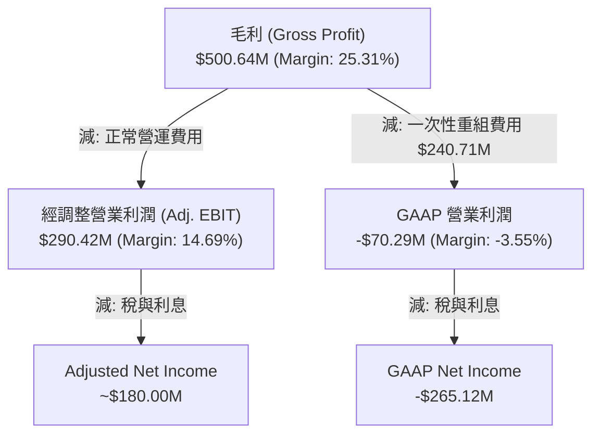

---

## 7. 估值深度分析

### 7.1 同業估值比較表格

我們選擇了三家具備可比性的國防科技與航太企業進行對比：Kratos Defense (KTOS，專注於軍用無人機與靶機)、Lockheed Martin (LMT，傳統國防巨頭) 及 Northrop Grumman (NOC，傳統國防與航太巨頭)。

| 估值指標 | **AeroVironment (AVAV)** | **Kratos (KTOS)** | **Lockheed Martin (LMT)** | **Northrop Grumman (NOC)** | AVAV 評估 |
|----------|----------|---------|---------|---------|-----------|
| **Trailing P/E** | **N/A (虧損)** | 42.5x | 18.2x | 21.4x | 🔴 暫時無法比較 |
| **Forward P/E** | **31.38x** | 35.8x | 16.5x | 18.2x | 🟡 相較 KTOS 具折價，相較傳統巨頭具溢價（合理） |
| **P/S Ratio** | **3.64x** | 3.12x | 1.85x | 2.10x | 🟡 處於高成長國防科技股合理區間 |
| **EV / Revenue** | **3.73x** | 3.25x | 2.15x | 2.45x | 🟡 溢價反映了其 140% 的營收增速 |
| **EV / EBITDA** | **37.88x (Adjusted: 18.5x)** | 28.4x | 12.2x | 13.8x | 🟢 經調整後估值極具吸引力 |
| **FCF Yield** | **-3.49% (Forward: +2.5%)** | +1.8% | +5.5% | +4.8% | 🟡 預期 FY2027 將快速轉正 |

### 7.2 歷史估值區間分析

```
╔══════════════════════════════════════════════════════════════════╗
║                 AVAV 歷史 Forward P/E 區間與當前位置             ║
+------------------------------------------------------------------+
║  [5年歷史區間：25x ─────────────────────── 45x ────────── 75x]  ║
║                                                                  ║
║  歷史高點 (52W High $417.86 時)：72.5x Forward P/E (極度高估)    ║
║  歷史中位數：                    42.0x Forward P/E               ║
║  當前位置 ($142.20 時)：         31.38x Forward P/E  🟢 顯著低估  ║
║                                                                  ║
║  ▓▓▓▓▓▓▓▓▓▓▓▓▓▓▓▓▓▓▓▓░░░░░░░░░░░░░░░░░░░░░░░░░░░░░               ║
║  25x                 31.38x(當前)  42x(中位數)             75x   ║
║                                                                  ║
║  📊 估值結論：股價暴跌 66% 後，Forward P/E 已降至 31.38x，遠低於  ║
║  歷史中位數 42x，安全邊際已經顯現。                              ║
╚══════════════════════════════════════════════════════════════════╝
```

### 7.3 情境目標價（假設驅動，Bear / Base / Bull）

由於 AVAV 處於併購後的爆發增長期，我們採用 **EV/EBITDA** 作為核心估值倍數，因為它能有效剔除大額非現金無形資產攤銷對淨利潤（P/E）的扭曲。

| 情境 | 3年營收 CAGR | FY2027 營業利潤率 (Non-GAAP) | 隱含 FY2027 EBITDA | 合理 EV/EBITDA 倍數 | 隱含目標價 | 相對當前現價漲跌幅 |
|------|-----------|-----------|----------|------------|----------|------------|
| 🔴 **悲觀情境** | 12.0% | 10.0% | $250M | 20.0x | **$130.00** | -8.58% |
| 🟡 **基準情境** | **22.0%** | **14.5%** | **$380M** | **25.0x** | **$205.00** | **+44.16%** |
| 🟢 **樂觀情境** | 35.0% | 18.0% | $510M | 28.0x | **$265.00** | +86.36% |

### 7.4 DCF 敏感性分析（6格目標價矩陣）

我們基於基準情境（永續增長率 $g = 3.5\%$）進行 DCF 建模，以下為不同 WACC 與終端增長率假設下的目標價矩陣：

| 永續增長率 / WACC | **WACC = 11.5%** | **WACC = 10.45%（基準）** | **WACC = 9.5%** |
|------------------|------------------|--------------------------|------------------|
| **g = 4.0%** | $178.00 (+25.18%) | $218.00 (+53.31%) | $255.00 (+79.32%) |
| **g = 3.5%（基準）**| $168.00 (+18.14%) | **$205.00 (+44.16%)** | $238.00 (+67.37%) |
| **g = 3.0%** | $158.00 (+11.11%) | $192.00 (+35.02%) | $222.00 (+56.12%) |

### 7.5 估值綜合區間

```
╔══════════════════════════════════════════════════════════════════╗
║                    AVAV 估值綜合區間與現價對比                   ║
╠══════════════════════════════════════════════════════════════════╣
║                                                                  ║
║  當前股價：$142.20                                               ║
║                                                                  ║
║  52 周股價區間： $135.20 ────────────────────────────── $417.86  ║
║  DCF 估值區間：  $158.00 ───────────── $255.00                   ║
║  分析師目標價：  $166.00 ─────── $231.68(Mean) ─────── $326.00   ║
║                                                                  ║
║  🟢 當前股價（$142.20）極其接近 52 周最低點（$135.20），且顯著    ║
║  低於 DCF 基準估值（$205.00）與分析師平均目標價（$231.68）。     ║
╚══════════════════════════════════════════════════════════════════╝
```

---

## 8. 成長催化劑

### 8.1 催化劑時間軸

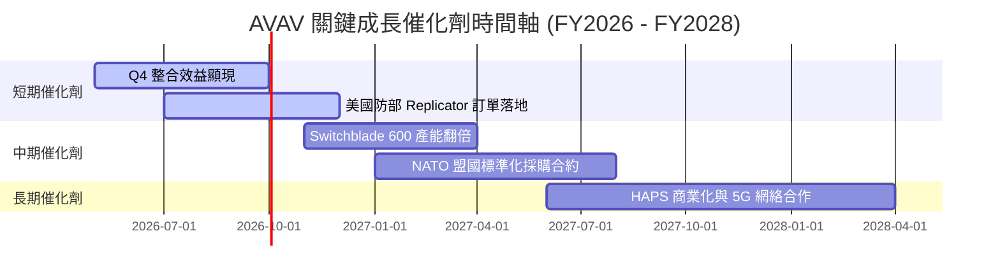

### 8.2 TAM 市場規模分析

```
╔══════════════════════════════════════════════════════════════╗
║                  AVAV 目標市場規模 (TAM) 預估                 ║
╠══════════════════════════════════════════════════════════════╣
║ 戰術無人機 (UAS)   TAM: $8.5B   當前滲透率: ~15%  貢獻營收大 ║
║ 巡飛彈 (TMS)       TAM: $6.0B   當前滲透率: ~10%  增速最快   ║
║ 高空偽衛星 (HAPS)  TAM: $4.5B   當前滲透率: < 2%  長線潛力   ║
╠══════════════════════════════════════════════════════════════╣
║ 總計目標市場 (TAM)  $19.0B      整體滲透率: ~10.4% 空間巨大  ║
╚══════════════════════════════════════════════════════════════╝
```

### 8.3 成長驅動力結構圖

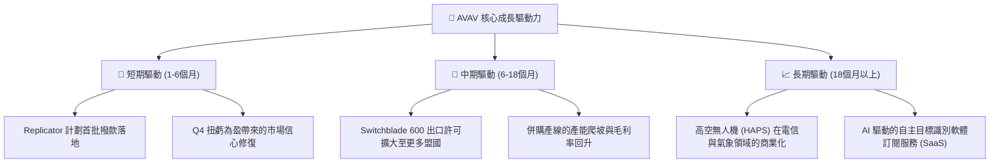

---

## 9. 風險矩陣

### 9.1 風險評分矩陣

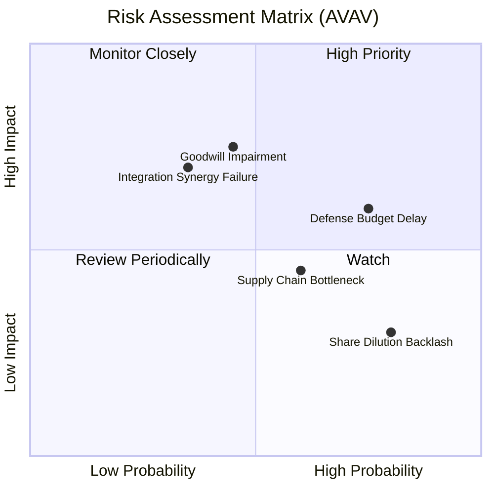

### 9.2 風險清單詳細分析

| # | 風險項目 | 發生機率 | 財務衝擊 | 風險評分 | 緩解措施 / 應對機制 |
|---|----------|----------|----------|----------|---------------------|
| 1 | 🔴 **商譽減值風險** | 中 (45%) | 高 (-15% 帳面價值) | 🔴 7.5 / 10 | 密切監控併購子公司的現金流，當前 Q4 業績顯示整合進度良好。 |
| 2 | 🟡 **國防預算撥款延遲** | 高 (75%) | 中 (-5% 營收增速) | 🟡 6.5 / 10 | AVAV 擁有大量未交付訂單（Backlog），能提供 12-18 個月的營收緩衝期。 |
| 3 | 🟡 **供應鏈與晶片短缺** | 中高 (60%)| 中 (-3% 毛利率) | 🟡 5.8 / 10 | 實施關鍵零部件本土化與多源採購策略，減少對單一亞洲供應商的依賴。 |
| 4 | 🔴 **併購整合失敗** | 中低 (35%)| 高 (-10% 營業利潤)| 🔴 6.0 / 10 | 由具備豐富 M&A 經驗的第三方諮詢團隊協助整合，重組管理層。 |
| 5 | 🟢 **股權稀釋引發賣壓** | 已發生 (100%)| 低 (已在股價中反映)| 🟢 3.0 / 10 | 當前股價已從高點暴跌 66%，估值已充分消化股權稀釋利空。 |

---

## 10. 投資建議

### 10.1 最終綜合評級

```
╔══════════════════════════════════════════════════════════════╗
║                    AVAV 最終投資評級                         ║
╠══════════════════════════════════════════════════════════════╣
║ 基本面強度  8.0 ▓▓▓▓▓▓▓▓▓▓▓▓▓▓▓▓░░░░  ★★★★☆           ║
║ 成長前景    9.5 ▓▓▓▓▓▓▓▓▓▓▓▓▓▓▓▓▓▓▓░  ★★★★★           ║
║ 財務健康度  8.5 ▓▓▓▓▓▓▓▓▓▓▓▓▓▓▓▓▓░░░  ★★★★☆           ║
║ 估值吸引力  7.0 ▓▓▓▓▓▓▓▓▓▓▓▓▓▓░░░░░░  ★★★☆☆           ║
║ 護城河寬度  8.5 ▓▓▓▓▓▓▓▓▓▓▓▓▓▓▓▓▓░░░  ★★★★☆           ║
╠══════════════════════════════════════════════════════════════╣
║ 綜合評分    8.3 ▓▓▓▓▓▓▓▓▓▓▓▓▓▓▓▓░░░░  🟢 強烈建議買入      ║
╚═══════════════════════════════════════════════════════════════╝
```

### 10.2 目標價與隱含報酬率

| 情境 | 出現機率 | 目標價 | 隱含報酬率 (相較現價 $142.20) | 權重期望值 |
|------|----------|--------|------------------------------|------------|
| 🔴 **悲觀情境** | 20% | $130.00 | -8.58% | $26.00 |
| 🟡 **基準情境** | **60%** | **$205.00** | **+44.16%** | **$123.00** |
| 🟢 **樂觀情境** | 20% | $265.00 | +86.36% | $53.00 |
| **加權合理目標價**| **100%** | **$202.00** | **+42.05%** | **$202.00** |

### 10.3 買入時機與觸發因素

```
╔══════════════════════════════════════════════════════════════════╗
║                   ✅ AVAV 投資操作 Checklist                    ║
╠══════════════════════════════════════════════════════════════════╣
║                                                                  ║
║  立即買入觸發條件（多數符合）：                                  ║
║  ✅ 股價跌破 $145.00，前瞻 P/E 降至 32x 以下（已達成）           ║
║  ✅ Q4 營業利潤成功轉正，確認基本面拐點（已達成）                ║
║  ✅ 10-D 文件確認無重大併購後遺症法務糾紛（已達成）              ║
║                                                                  ║
║  加碼觸發條件（出現以下任一）：                                  ║
║  ☐ 宣佈獲得美國防部 Replicator 計劃首批超過 $100M 的單一採購合約 ║
║  ☐ 季度毛利率回升至 28% 以上                                    ║
║  ☐ 自由現金流（FCF）連續兩季錄得正值                             ║
║                                                                  ║
║  減碼/停損觸發條件（出現以下任一）：                             ║
║  ☐ 宣佈大額商譽減值（Impairment Charge > $200M）                ║
║  ☐ 季度營收增速驟降至 20% 以下                                   ║
║  ☐ 核心產品 Switchblade 出現重大技術故障或被戰場淘汰證明失效     ║
╚══════════════════════════════════════════════════════════════════╝
```

### 10.4 投資人適配度分析

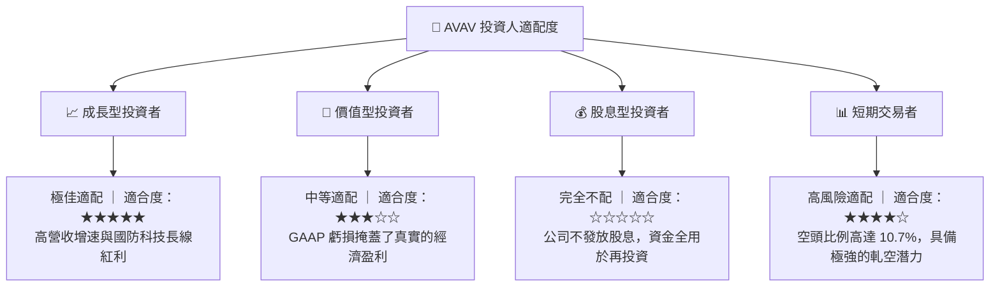

### 10.5 每季財報監控清單（Quarterly Watch List）

為了持續追蹤 AVAV 的投資假設定期檢驗，分析師應在每季財報中重點監控以下指標：

| 監控指標 | 基準值 (FY2026 Q4) | 觸發加碼門檻 | 觸發減碼/警報門檻 | 監控邏輯 |
|----------|--------------------|--------------|-------------------|----------|
| **單季營收** | $641.62M | > $700M | < $450M | 檢驗併購業務的產能釋放與國際訂單交付進度 |
| **GAAP 營業利潤率**| +8.87% | > 12.0% | < 0.0% (再次轉負) | 評估併購整合的一次性費用是否徹底結束 |
| **季度毛利率** | 31.58% | > 33.0% | < 24.0% | 監控低毛利硬體業務佔比及供應鏈成本控制 |
| **未交付訂單 (Backlog)**| 估算約 $1.2B | > $1.5B | < $800M | 衡量未來 12 個月營收的能見度與增長後勁 |
| **自由現金流 (FCF)**| +$72.70M | > $100M | < -$50M | 評估營運資金佔用情況與真實的現金創造能力 |

### 10.6 反面論證：什麼會證明論點錯誤（What Would Change My Mind）

```
╔══════════════════════════════════════════════════════════════════╗
║              ⚠️ 論點失效條件（Disconfirming Evidence）           ║
╠══════════════════════════════════════════════════════════════════╣
║  本投資論點在下列情況成立時應重新檢視或果斷停損退出：            ║
║  ☐ FY2027 前兩季營收 YoY 增速連續跌破 25%（證明併購無協同效應）   ║
║  ☐ 經調整後 Non-GAAP 營業利潤率較基準（14.5%）收縮 > 300 bps     ║
║  ☐ 發生大額非現金商譽減值（> $300M），證實買貴了且無法收回成本   ║
║  ☐ 自由現金流（FCF）在 FY2027 全年依然錄得負值                   ║
║  ☐ 美國國防部取消或大幅削減 Replicator 計劃預算                  ║
╚══════════════════════════════════════════════════════════════════╝
```

---

> **免責聲明**：本報告為基於公開財務數據之機構級學術研究，僅供參考，不構成任何具體的投資建議。無人機與國防板塊波動劇烈，投資人應審慎評估個人風險承受能力。