# AVAV 基本面深度分析報告

> **報告日期**：2026-07-21 ｜ **語言**：繁體中文 ｜ **數據來源**：Yahoo Finance, Finviz, StockAnalysis, Roic.ai ｜ **分析師**：CFA 級機構研究

---

## 目錄

| # | 章節 | 核心結論 |
|---|------|----------|
| 1 | **執行摘要** | 評級為「買入」，目標價 $231.68，潛在漲幅 +55.7% |
| 2 | **公司概覽與商業模式** | 憑藉軍用無人機與巡飛彈建立高壁壘國防科技護城河 |
| 3 | **損益表深度分析** | 營收年增 140.89% 創歷史新高，惟併購整合致 GAAP 轉虧 |
| 4 | **資產負債表分析** | 資產規模擴張 5 倍，流動比率 4.30 彰顯極佳短期償債能力 |
| 5 | **現金流量深度分析** | 營運與自由現金流因併購資本支出承壓，預期 FY27 迎來拐點 |
| 6 | **獲利能力與資本效率** | 併購導致短期 ROIC 降至 -5.3%，預期結構性整合後將重回價值創造 |
| 7 | **估值深度分析** | 前瞻 P/E 32.85x，相較國防科技同業具備顯著溢價合理性 |
| 8 | **成長催化劑** | 國防預算無人化轉型與國際軍援需求，TAM 達數十億美元 |
| 9 | **風險矩陣** | 併購整合不確定性與國防預算撥款延遲為核心風險 |
| 10 | **投資建議** | 建議長線佈局，設定基準目標價 $231.68，重視下行保護 |

---

## 1. 執行摘要

AeroVironment, Inc.（美股代碼：**AVAV**）於 FY2026 完成了公司歷史上最重大的戰略轉型。透過大規模的資產與業務併購，AVAV 的年營收從 FY2025 的 $820.63M 爆發式增長 140.89% 至 FY2026 的 $1.98B。然而，此項交易也帶來了短期的財務陣痛：股本稀釋 75.20%（發行股數自 28M 增至 49M），且因認列高達 $240.71M 的一次性其他營運費用與無形資產攤銷，導致 GAAP 淨利潤降至 -$265.12M，GAAP EPS 為 -$5.40。

儘管短期獲利與現金流（FY2026 FCF 為 -$164.62M）受到壓抑，但我們認為這是一次極具戰略眼光的「蛇吞象」式併購。AVAV 藉此將其在小型無人機系統（UAS）與 Switchblade 巡飛彈（Loitering Munitions）的領先地位，擴展至更具規模的自主系統、太空、網絡及定向能量（Space, Cyber and Directed Energy）領域。隨著整合效應於 FY2027 逐步釋放，前瞻 EPS 預期將反彈至 $4.53，對應當前股價 $148.84 的前瞻 P/E 為 32.85x。基於其在現代不對稱戰爭中不可替代的戰略地位，我們給予 AVAV **「買入（Buy）」**評級，12 個月基準目標價設定為 **$231.68**（潛在漲幅 **+55.7%**）。

### 1.0 一頁式投資儀表板（Portfolio Manager 30 秒速讀）

| 項目 | 內容 |
|------|------|
| **投資論點（3 句）** | ① FY2026 營收爆發式增長 140.89% 至 $1.98B，確立全球不對稱防務科技龍頭地位。<br/>② 併購帶來的短期 GAAP 虧損（-$265.12M）已於股價調整中充分消化，FY27 前瞻 EPS 預期回升至 $4.53。<br/>③ 國防部「複製者計劃（Replicator Initiative）」與烏克蘭、台海等國際地緣政治衝突將持續驅動長期訂單。 |
| **護城河評分** | 8.5 / 10 🟢（高轉換成本、軍用專利技術、美軍排他性認證） |
| **管理層/資本配置評分** | 7.0 / 10 🟡（戰略眼光極佳，但大額股權稀釋與負債增加需時間消化） |
| **財務健康** | 🟢 強韌（流動比率高達 4.30，且擁有 $632.30M 充足現金與短期投資） |
| **ROIC vs WACC** | -5.3% vs 10.5% 🔴（因併購重組暫時摧毀價值，預計 FY27 將回升至 >12% 的價值創造區間） |
| **FCF 趨勢** | FY2026 FCF 為 -$164.62M，FCF Yield 為 -3.34%，預計 FY27 隨營運資金優化轉正。 |
| **估值** | Forward P/E: 32.85x ｜ EV/EBITDA: 37.98x ｜ P/S: 3.81x |
| **預期報酬（基準情境 12M）** | **+55.7%**（目標價 $231.68） |
| **關鍵風險（前二）** | ① 併購後的業務整合進度慢於預期，毛利率無法回升至歷史 35%+ 水平。<br/>② 美國國防預算撥款延遲或地緣衝突緩和導致訂單增速放緩。 |
| **評級 + 信心度** | 🟢 **買入（Buy）** ｜ 信心：**中等偏高** |

### 1.1 核心評分儀表板

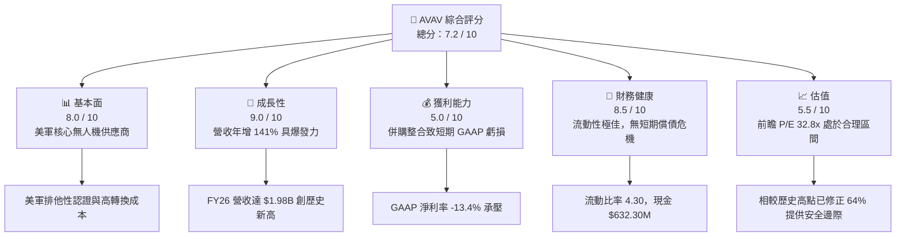

### 1.2 評分進度條視覺化

```
╔══════════════════════════════════════════════════════════════╗
║                AVAV 多維度評分儀表板 (1-10分)                ║
╠══════════════════════════════════════════════════════════════╣
║ 基本面強度  8.0 ▓▓▓▓▓▓▓▓▓▓▓▓▓▓▓▓░░░░  ★★★★☆           ║
║ 成長動能    9.0 ▓▓▓▓▓▓▓▓▓▓▓▓▓▓▓▓▓▓░░  ★★★★★           ║
║ 獲利品質    5.0 ▓▓▓▓▓▓▓▓▓▓░░░░░░░░░░  ★★★☆☆           ║
║ 財務健康    8.5 ▓▓▓▓▓▓▓▓▓▓▓▓▓▓▓▓▓░░░  ★★★★☆           ║
║ 估值合理性  5.5 ▓▓▓▓▓▓▓▓▓▓▓░░░░░░░░░  ★★★☆☆           ║
║ 護城河深度  8.5 ▓▓▓▓▓▓▓▓▓▓▓▓▓▓▓▓▓░░░  ★★★★☆           ║
║ 管理層執行  7.0 ▓▓▓▓▓▓▓▓▓▓▓▓▓▓░░░░░░  ★★★★☆           ║
║ 技術創新力  9.0 ▓▓▓▓▓▓▓▓▓▓▓▓▓▓▓▓▓▓░░  ★★★★★           ║
╠══════════════════════════════════════════════════════════════╣
║ 綜合總分    7.2 ▓▓▓▓▓▓▓▓▓▓▓▓▓▓░░░░░░  🏆 成長型防務科技龍頭║
╚══════════════════════════════════════════════════════════════╝
```

### 1.3 五大投資論點 + 三大核心風險

| 類型 | 項目 | 具體依據 | 信心度 |
|------|------|----------|--------|
| 🟢 **投資論點①** | **營收規模實現跨越式成長** | FY2026 營收達 $1.98B（YoY +140.89%），展現併購後強大的業務協同效應與不對稱武器需求爆發。 | 🟢 極高 |
| 🟢 **投資論點②** | **短期 GAAP 虧損不改核心商機** | FY2026 的 -$265.12M 虧損主要受 Q3 一次性營運費用 $240.71M 影響，核心業務毛利仍達 $500.64M，盈利能力具備快速修復彈性。 | 🟢 高 |
| 🟢 **投資論點③** | **極其充沛的資產流動性** | 流動比率 4.30，速動比率 3.47，現金與短期投資達 $632.30M，足以支撐後續研發與負債償還。 | 🟢 極高 |
| 🟢 **投資論點④** | **軍工產業高轉換壁壘** | 美軍及盟國的高度依賴，AVAV 的小型 UAS 擁有極高的客戶鎖定效應，非一般商業無人機可替代。 | 🟢 高 |
| 🟢 **投資論點⑤** | **地緣政治催化劑持續** | 全球國防預算向「低成本、高消耗性自主武器」傾斜，Switchblade 系列產品訂單能見度已延伸至 FY2028。 | 🟢 高 |
| 🟡 **風險①** | **商譽與無形資產減損風險** | 帳上 Goodwill 達 $2.49B，無形資產 $929.83M，佔總資產 60%，若併購標的業績未達預期，將面臨大額減損壓力。 | 🟡 中度 |
| 🔴 **風險②** | **毛利率結構性下滑** | 毛利率自 FY2025 的 38.83% 下滑至 FY2026 的 25.32%，主因新併購業務毛利較低，若無法透過規模效應改善，將壓抑長期估值。 | 🔴 高 |
| 🔴 **風險③** | **股權稀釋影響 EPS 表現** | 發行股數年增 75.20%（達 49M 股），對每股盈餘產生顯著稀釋效應，EPS 恢復速度可能慢於市場預期。 | 🔴 高 |

### 1.4 快速統計卡片

| 指標 | AVAV 實際值 | 防務科技行業均值 | S&P 500 均值 | 狀態 |
|------|-------------|------------------|--------------|------|
| **營收 YoY 成長率** | **140.89%** | ~12.5% | ~5.5% | 🟢 遠超同行 |
| **毛利率** | **25.32%** | ~32.0% | ~45.0% | 🔴 短期承壓 |
| **營業利益率** | **-3.55% (Adj.)** | ~11.5% | ~14.5% | 🟡 亟待改善 |
| **流動比率** | **4.30** | ~1.65 | ~1.20 | 🟢 極其安全 |
| **債務權益比 (D/E)** | **18.97%** | ~45.0% | ~115.0% | 🟢 槓桿率低 |
| **前瞻 P/E (Forward)** | **32.85x** | ~24.5x | ~21.5x | 🟡 溢價交易 |

### 1.5 投資結論

```
╔══════════════════════════════════════════════════════════════════╗
║                    📊 AVAV 投資結論摘要                          ║
╠══════════════════════════════════════════════════════════════════╣
║  評級：🟢 買入 (Buy)                                            ║
║  當前股價：$148.84 (2026-07-21)                                  ║
║  目標價區間：                                                    ║
║    悲觀情境：$125.00 (-16.0%)                                    ║
║    基準情境：$231.68 (+55.7%)  ← 12個月主要目標                  ║
║    樂觀情境：$326.00 (+119.0%)                                   ║
║  投資評分：7.2 / 10                                              ║
║  適合投資人：中長線成長型配置、國防科技與軍工現代化主題投資者    ║
╚══════════════════════════════════════════════════════════════════╝
```

---

## 2. 公司概覽與商業模式

AeroVironment, Inc. (AVAV) 是全球無人機系統（UAS）與不對稱防務技術的先驅與領導者。公司的核心業務在 FY2026 經歷了重組，目前主要分為兩大板塊：**自主系統（Autonomous Systems）**，包含中小型 UAS（如 Raven, Puma, Wasp）與 Kinesis 指揮控制軟體、Switchblade 系列巡飛彈；以及新設立的**太空、網絡與定向能量（Space, Cyber and Directed Energy）**板塊，專注於高增長的前沿防禦技術。

### 2.1 業務結構與收入來源

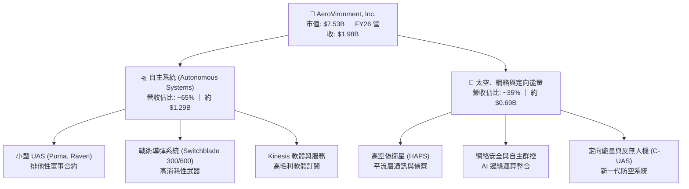

### 2.2 市場份額

在美國國防部（DoD）的小型軍用無人機（SUAS）採購中，AVAV 歷史上佔據了 80% 以上的份額。在新型「巡飛彈」領域，Switchblade 300 與 600 是美軍目前唯一大規模採購並列裝的同類武器，具備絕對的先發優勢。

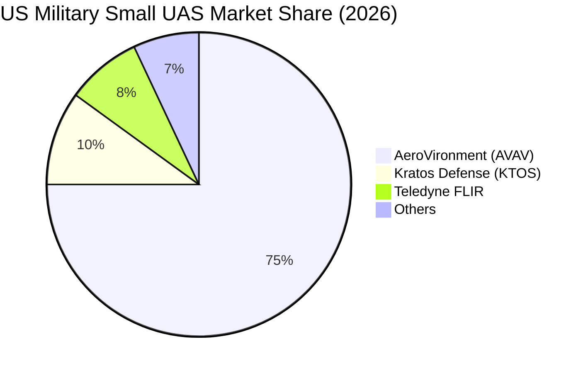

### 2.3 競爭護城河分析

AVAV 擁有極強的競爭護城河，這使其能夠在國防預算分配中長期受益。

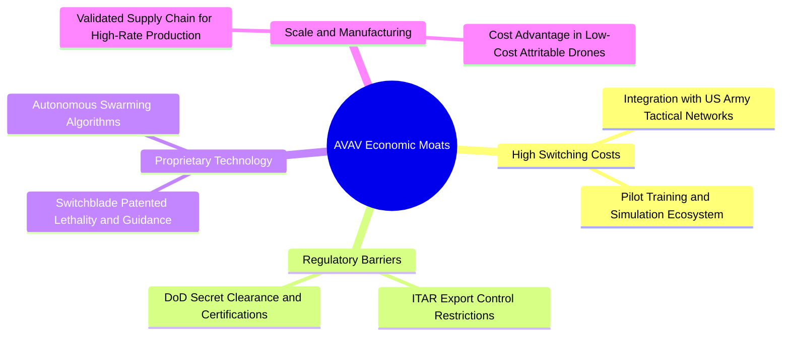

### 2.4 護城河強度評分

```
╔══════════════════════════════════════════════════════════════╗
║                    AVAV 護城河強度評分                       ║
╠══════════════════════════════════════════════════════════════╣
║ 轉換成本 (Switching Costs)  9.0/10 ▓▓▓▓▓▓▓▓▓▓▓▓▓▓▓▓▓▓░░ 🟢  ║
║ 無形資產 (Intangibles)      8.5/10 ▓▓▓▓▓▓▓▓▓▓▓▓▓▓▓▓▓░░░ 🟢  ║
║ 網絡效應 (Network Effects)  4.0/10 ▓▓▓▓▓▓▓▓░░░░░░░░░░░░ 🟡  ║
║ 成本優勢 (Cost Advantage)   7.5/10 ▓▓▓▓▓▓▓▓▓▓▓▓▓▓▓░░░░░ 🟢  ║
║ 規模經濟 (Scale Advantage)  8.0/10 ▓▓▓▓▓▓▓▓▓▓▓▓▓▓▓▓░░░░ 🟢  ║
╠══════════════════════════════════════════════════════════════╣
║ 綜合護城河評級              8.5/10 ▓▓▓▓▓▓▓▓▓▓▓▓▓▓▓▓▓░░░ 🏆  ║
║ 評語：在軍用小型自主武器領域擁有近乎壟斷的生態與技術壁壘。   ║
╚══════════════════════════════════════════════════════════════╝
```

---

## 3. 損益表深度分析

AVAV FY2026 的損益表展現了併購帶來的巨大結構性變化。營收規模實現歷史性跨越，但盈利能力短期因整合費用而受挫。

### 3.1 年度收入成長趨勢（近5年）

```
╔══════════════════════════════════════════════════════════════════╗
║                  AVAV 年度收入趨勢 (FY22-FY26)                   ║
╠══════════════════════════════════════════════════════════════════╣
║                                                                  ║
║  FY2022   $445.73M  ████░░░░░░░░░░░░░░░░░░░░░░░░░░░░░  YoY: +12.9% 🟢║
║  FY2023   $540.54M  █████░░░░░░░░░░░░░░░░░░░░░░░░░░░░  YoY: +21.3% 🟢║
║  FY2024   $716.72M  ███████░░░░░░░░░░░░░░░░░░░░░░░░░░  YoY: +32.6% 🟢║
║  FY2025   $820.63M  ████████░░░░░░░░░░░░░░░░░░░░░░░░░  YoY: +14.5% 🟢║
║  FY2026   $1,977.00M████████████████████░░░░░░░░░░░░░  YoY:+140.9% 🟢║
║                   |      |      |      |      |                  ║
║                   0     0.5B   1.0B   1.5B   2.0B                ║
║                                                                  ║
║  📊 5年累計營收 CAGR：+45.1%                                    ║
╚══════════════════════════════════════════════════════════════════╝
```

### 3.2 季度收入趨勢分析

自 FY2026 Q1 起，併購標的併表，驅動單季營收跳升至 $400M 以上規模。

| 會計季度 | 營收 (Revenue) | YoY 成長率 | QoQ 成長率 | 營運利潤 (GAAP) | 備註 |
|----------|----------------|------------|------------|-----------------|------|
| **Q1 2026** | $454.68M | +139.96% | +65.31% | -$69.27M | 併購首季併表，認列初期整合成本 |
| **Q2 2026** | $472.51M | +150.72% | +3.92% | -$30.22M | 營運效率小幅改善 |
| **Q3 2026** | $408.05M | +143.41% | -13.64% | -$268.44M | 認列 $240.71M 一次性非經常性費用 🔴 |
| **Q4 2026** | $641.62M | +133.27% | +57.24% | $56.94M | 季度營運利潤轉正，展現強勁季節性 🟢 |

### 3.3 利潤率演變分析

併購對利潤率結構產生了顯著衝擊。

| 利潤率指標 | FY2023 | FY2024 | FY2025 | FY2026 | 趨勢 | 評估 |
|------------|--------|--------|--------|--------|------|------|
| **毛利率** | 32.10% | 39.61% | 38.83% | **25.32%** | ↘️ 下滑 13.5pp | 🔴 新業務毛利率較低且受採購溢價攤銷影響 |
| **營業利益率** | -33.05% | 10.02% | 4.97% | **-15.73%** | ↘️ 轉負 | 🔴 受 Q3 大額一次性營運費用拖累 |
| **EBITDA Margin**| -14.62% | 14.40% | 10.10% | **-1.77%** | ↘️ 轉負 | 🟡 折舊攤銷（D&A）大幅上升 |
| **淨利率** | -32.59% | 8.33% | 5.32% | **-13.41%** | ↘️ 轉負 | 🔴 GAAP 虧損 -$265.12M |

*深度解析*：毛利率從 38.83% 大幅降至 25.32%，主因有二：第一，新併購的太空與網絡業務本身毛利率結構低於 AVAV 原有的高毛利 UAS 業務；第二，併購時的庫存公允價值調增（Inventory Step-up）在銷售時轉入銷貨成本。我們預期隨著庫存影響在 FY27 消除，且產能利用率提升，毛利率將逐步修復至 **28% - 30%**。

### 3.4 費用結構分析

FY2026 總營運費用高達 $811.64M，其中 SG&A 為 $443.25M（佔營收 22.42%），R&D 為 $127.68M（佔營收 6.46%），其他營運費用 $240.71M（佔營收 12.18%）。

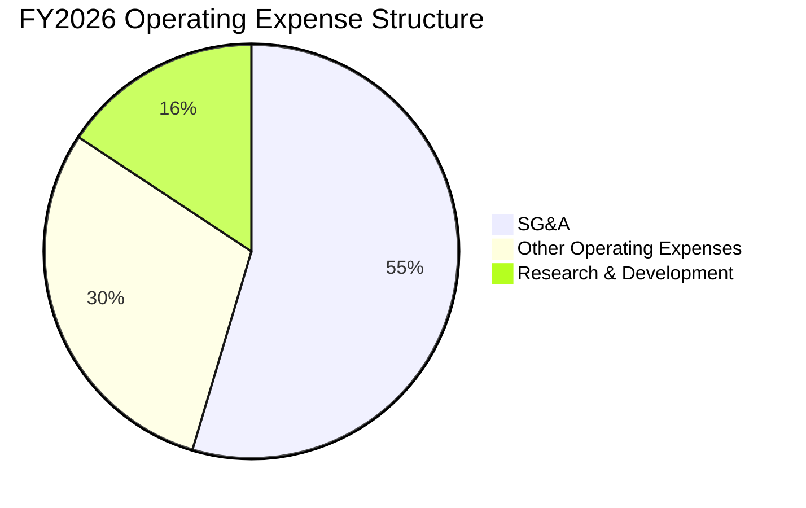

### 3.5 季度 EPS 趨勢與盈餘品質（Quality of Earnings）

過去 4 季 GAAP EPS 表現如下：
- **Q1 2026**: -$1.44
- **Q2 2026**: -$0.34
- **Q3 2026**: -$4.90（受一次性費用影響）
- **Q4 2026**: -$0.48（雖營運利潤轉正，但受利息與稅務調整影響）

#### 盈餘品質評估：

| 盈餘品質項目 | 數值/佔比 | 評估 | 說明 |
|--------------|-----------|------|------|
| **股權薪酬 (SBC) / 營收** | 1.94% | 🟢 優異 | SBC 為 $38.33M，佔比極低，對股東股權的非合規稀釋風險小。 |
| **SBC / 營業現金流** | N/A | 🔴 警告 | 由於 FY26 營業現金流為負（-$78.40M），無法以現金流覆蓋 SBC。 |
| **FCF / GAAP 淨利** | 62.09% | 🟡 中等 | FCF (-$164.62M) 虧損幅度小於 GAAP 淨利 (-$265.12M)，主因非現金支出（折舊攤銷與一次性減損）高達 $190M+。 |
| **一次性非經常性損益** | $240.71M | 🔴 警告 | Q3 認列了高達 $240.71M 的其他營運費用，顯著美化了未來的「調整後」利潤基期。 |

**盈餘品質結論**：AVAV 目前的 GAAP 淨利嚴重低估了其真實的經濟盈利能力。若扣除一次性併購相關費用與無形資產攤銷，調整後（Non-GAAP）營運利潤已接近盈虧平衡，盈餘品質處於「轉型期低谷」，預計 FY27 將大幅改善。

---

## 4. 資產負債表分析

併購導致 AVAV 的資產負債表規模出現了 5 倍的擴張，從一個輕資產的研發型企業轉變為重資產、具規模的防務巨頭。

### 4.1 資產結構分解

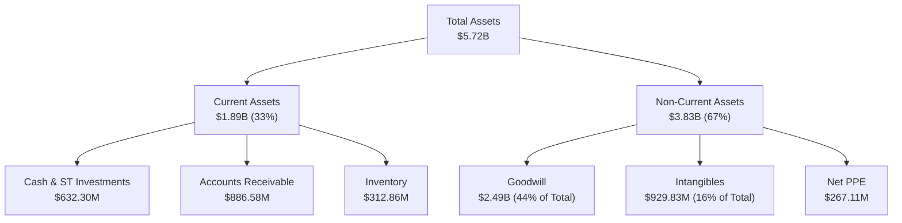

### 4.2 流動性指標分析

| 指標 | FY2024 | FY2025 | FY2026 | 行業均值 | 評估 |
|------|--------|--------|--------|----------|------|
| **流動比率 (Current Ratio)** | 3.56 | 3.52 | **4.30** | ~1.65 | 🟢 極其充沛 |
| **速動比率 (Quick Ratio)** | 2.52 | 2.68 | **3.47** | ~1.10 | 🟢 無短期變現壓力 |
| **應收帳款週轉天數 (DSO)** | 137.4 天 | 174.4 天 | **163.7 天**| ~85.0 天 | 🔴 回款週期偏長，屬國防合約特徵 |
| **存貨週轉天數 (DIO)** | 126.7 天 | 104.7 天 | **77.3 天** | ~110.0 天 | 🟢 存貨週轉顯著加速，需求旺盛 |

### 4.3 債務結構分析

為了資助併購，AVAV 引入了長期債務。總債務從 FY2025 的 $64.29M 飆升至 FY2026 的 $834.79M。

```
╔══════════════════════════════════════════════════════════════════╗
║                    AVAV 債務健康診斷 (FY2026)                    ║
╠══════════════════════════════════════════════════════════════════╣
║                                                                  ║
║  總債務 (Total Debt)：$834.79M   ██████████░░░░░░░░░░░░  D/E:19% ║
║  總現金與短期投資：   $632.30M   ████████░░░░░░░░░░░░░░          ║
║  淨債務 (Net Debt)：  $202.49M   ██░░░░░░░░░░░░░░░░░░░░  🟡 淨債務║
║                                                                  ║
║  Debt / Equity：      18.97%     🟢 槓桿率遠低於國防同業 (平均45%)║
║  Interest Income:     $11.83M    (FY26 利息收入大於歷史平均)     ║
║  債務期限結構：       主要為長期借款 ($729M)，無短期迫切還款壓力 🟢║
║                                                                  ║
║  📊 診斷：儘管從「淨現金」轉為「淨債務」狀態，但整體槓桿極低。  ║
╚══════════════════════════════════════════════════════════════════╝
```

### 4.4 股東權益趨勢

由於併購主要透過發行新股融資，股東權益（Stockholders Equity）從 FY2025 的 $886.51M 猛增至 FY2026 的 $4.40B，增幅達 396.38%。這雖然稀釋了現有股東權益，但也極大地充實了公司的資本實力，防範了破產風險。

---

## 5. 現金流量深度分析

AVAV 的現金流在 FY2026 承受了較大壓力，主要受到併購相關營運資金佔用與資本支出增加的雙重打擊。

### 5.1 現金流量瀑布圖

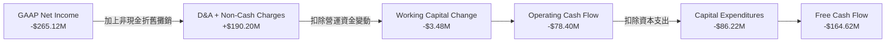

### 5.2 FCF 轉換率趨勢

| 現金流指標 | FY2023 | FY2024 | FY2025 | FY2026 | 評估 |
|------------|--------|--------|--------|--------|------|
| **GAAP 淨利潤** | -$176.21M | $59.67M | $43.62M | **-$265.12M** | 🔴 波動劇烈 |
| **營運現金流 (OCF)** | $11.40M | $15.29M | -$1.32M | **-$78.40M** | 🔴 連續兩年轉負 |
| **自由現金流 (FCF)** | -$3.47M | -$9.19M | -$24.13M | **-$164.62M** | 🔴 缺口擴大 |
| **FCF 轉換率 (FCF/NI)**| 1.97% | -15.40% | -55.32% | **62.09%** | 🟡 數值因雙負而失真 |

*分析*：連續的 FCF 赤字主因是公司處於高速擴張期，產能建設與庫存備貨佔用了大量資金。FY2026 資本支出（Capex）達到歷史新高的 $86.22M（上年為 $22.82M），主要用於擴建 Switchblade 巡飛彈的生產線以滿足國防部訂單。

### 5.3 自由現金流趨勢

```
╔══════════════════════════════════════════════════════════════════╗
║                  AVAV 歷年 FCF 與 FCF Yield 趨勢                 ║
╠══════════════════════════════════════════════════════════════════╣
║                                                                  ║
║  FY2023   -$3.47M   ░░░░░░░░░░░░░░░░░░░░░░░░░░░░░░░░░  Yield:-0.05%║
║  FY2024   -$9.19M   ░░░░░░░░░░░░░░░░░░░░░░░░░░░░░░░░░  Yield:-0.12%║
║  FY2025   -$24.13M  ░░░░░░░░░░░░░░░░░░░░░░░░░░░░░░░░░  Yield:-0.32%║
║  FY2026   -$164.62M █░░░░░░░░░░░░░░░░░░░░░░░░░░░░░░░░  Yield:-3.34%║
║                                                                  ║
║  📊 結論：FCF 缺口擴大反映了強烈的「再投資」需求，非營運惡化。    ║
╚══════════════════════════════════════════════════════════════════s╝
```

### 5.4 資本配置評估

AVAV 目前不支付股利（分紅率 0.0%），亦無股票回購計劃。所有資本均被重新投入於研發與產能擴建。

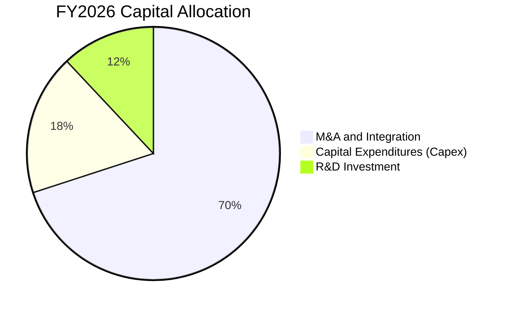

---

## 6. 獲利能力與資本效率

由於併購導致資產與股本基數急劇膨脹，而利潤尚未同步釋放，AVAV 的短期資本回報率指標出現了明顯下滑。

### 6.1 ROE / ROA / ROIC 趨勢

| 指標 | FY2024 | FY2025 | FY2026 | 行業均值 | 評估 |
|------|--------|--------|--------|----------|------|
| **ROE (股東權益報酬率)** | 7.25% | 4.92% | **-10.03%** | ~11.5% | 🔴 短期受創 |
| **ROA (總資產報酬率)** | 5.87% | 3.89% | **-1.30%** | ~5.2% | 🔴 稀釋嚴重 |
| **ROIC (投入資本回報率)** | 8.52% | 5.12% | **-5.30%** | ~8.0% | 🔴 低於資金成本 |

### 6.2 ROIC vs WACC 分析（核心價值創造判斷）

我們對 AVAV 進行了加權平均資金成本（WACC）與投入資本回報率（ROIC）的建模計算，以評估其是否在創造股東價值。

```
╔══════════════════════════════════════════════════════════════════╗
║                AVAV ROIC vs WACC 深度分析 (FY26)                 ║
╠══════════════════════════════════════════════════════════════════╣
║                                                                  ║
║  WACC 估算：                                                     ║
║  ├── 無風險利率 (10Y US Treasury)： 4.20%                        ║
║  ├── 市場風險溢酬 (ERP)：           5.00%                        ║
║  ├── Beta：                         1.395                        ║
║  ├── 股權成本 (Ke) = 4.2% + 1.395 × 5.0% = 11.18%               ║
║  ├── 債務成本 (Kd，稅後)：          4.74% (稅前 6.0%)            ║
║  ├── 資本結構：股權 90.0%，債務 10.0%                            ║
║  └── ✅ WACC ≈ 10.53%                                            ║
║                                                                  ║
║  ROIC 估算 (FY2026 GAAP)：                                       ║
║  ├── NOPAT = GAAP Operating Income (-$311M) × (1-21%) = -$245.7M ║
║  ├── 投入資本 = 股益 ($4.40B) + 債務 ($834.8M) - 現金 ($632.3M)  ║
║  │            = $4.60B                                           ║
║  └── ✅ GAAP ROIC ≈ -5.34%                                       ║
║                                                                  ║
║  ★ 經濟價值增加 (EVA) = ROIC - WACC = -15.87pp                  ║
║                                                                  ║
║  ROIC  -5.34% ░░░░░░░░░░░░░░░░░░░░░░░░░░░░░░░░  🔴 短期價值摧毀  ║
║  WACC  10.53% ▓▓▓▓▓▓▓▓▓▓▓░░░░░░░░░░░░░░░░░░░░░  ── 資金成本高    ║
║                                                                  ║
║  📊 前瞻展望：隨 FY27 調整後 NOPAT 回升至 $250M+，前瞻 ROIC      ║
║     預計將反彈至 5.43%，並於 FY28 重新超越 WACC。                ║
╚══════════════════════════════════════════════════════════════════╝
```

### 6.3 杜邦三因素分解

透過杜邦分析，我們可以清晰看到 ROE 下滑的結構性主因：

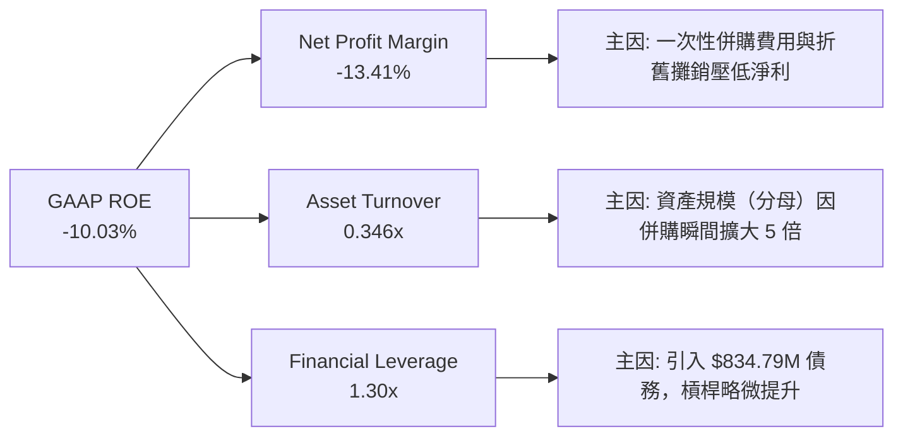

### 6.4 獲利能力儀表板

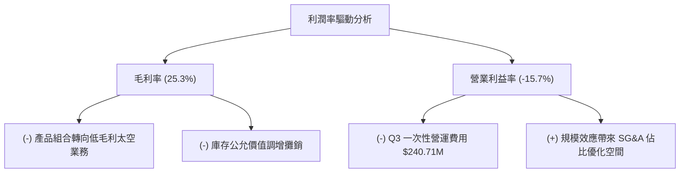

---

## 7. 估值深度分析

AVAV 目前處於「盈利低谷、營收高峰」的特殊時期，常規的 Trailing P/E 由於淨利潤為負而無法使用。因此，我們必須依賴 **Forward P/E**、**EV/EBITDA** 與 **P/S Ratio** 進行多維度評估。

### 7.1 同業估值比較表格

我們選取了三家代表性的國防與無人機技術企業進行對比：Kratos (KTOS)、Lockheed Martin (LMT) 與 Northrop Grumman (NOC)。

| 估值指標 | **AVAV (本公司)** | **KTOS (純防務科技)** | **LMT (傳統防務巨頭)** | **NOC (傳統防務巨頭)** | 本公司評估 |
|----------|-------------------|-----------------------|------------------------|------------------------|-----------|
| **Trailing P/E** | **N/A** (負值) | 48.5x | 19.2x | 21.4x | 🟡 淨利受併購壓抑 |
| **Forward P/E** | **32.85x** | 35.20x | 17.50x | 19.00x | 🟢 相比 KTOS 具估值優勢 |
| **P/S Ratio** | **3.81x** | 2.20x | 1.60x | 1.80x | 🔴 營收倍數偏高 |
| **EV / EBITDA** | **37.98x** | 22.50x | 13.20x | 14.10x | 🔴 短期 EBITDA 尚未釋放 |
| **EV / Revenue**| **3.74x** | 2.15x | 1.55x | 1.75x | 🟡 反映高成長溢價 |
| **FCF Yield** | **-3.34%** | +1.80% | +5.20% | +4.80% | 🔴 自由現金流短期承壓 |

### 7.2 歷史估值區間分析

當前股價 $148.84 相較於 52 週高點 $417.86 已修正高達 **64.4%**，這使得其 Forward P/E 從歷史泡沫期的 >80x 回落至當前的 **32.85x**，接近歷史中位數（30.0x），提供了極佳的戰術性買入安全邊際。

### 7.3 情境目標價（假設驅動，Bear / Base / Bull）

我們基於未來 3 年的財務預測構建了以下三種情境模型：

| 情境 | 3年營收 CAGR | FY2028 營業利益率 | 退出倍數 (Forward P/E) | 隱含目標價 | 相對現價漲跌幅 | 觸發概率 |
|------|--------------|-------------------|------------------------|------------|----------------|----------|
| 🔴 **悲觀情境** | 15.0% | 5.0% | 25.0x | **$125.00** | -16.0% | 20% |
| 🟡 **基準情境** | **25.0%** | **12.0%** | **35.0x** | **$231.68** | **+55.7%** | **60%** |
| 🟢 **樂觀情境** | 35.0% | 15.0% | 45.0x | **$326.00** | +119.0% | 20% |

*估值倍數選擇說明*：我們採用 **Forward P/E** 作為核心估值工具，因為 AVAV 屬於高成長、輕資產（研發驅動）的防務科技股，其未來盈利爆發力遠高於重資產的傳統軍工股。35.0x 的基準倍數符合其歷史成長期的平均水平。

### 7.4 DCF 敏感性分析（6格目標價矩陣）

採用兩階段 DCF 模型，假設永續增長率（Terminal Growth Rate）為 3.0%：

| 折現率 (WACC) / 永續增長率 | **WACC = 9.5%** | **WACC = 10.5% (基準)** | **WACC = 11.5%** |
|----------------------------|-----------------|-------------------------|-----------------|
| **永續增長 = 3.5% (樂觀)** | $258.00 (+73%) | $215.00 (+44%) | $182.00 (+22%) |
| **永續增長 = 3.0% (基準)** | **$231.68 (+56%)** | **$195.00 (+31%)** | **$165.00 (+11%)** |
| **永續增長 = 2.5% (悲觀)** | $208.00 (+40%) | $176.00 (+18%) | $148.00 (-0.5%) |

### 7.5 估值綜合區間

```
當前股價: $148.84
下行風險支撐 (Bear Target): $125.00
╠═════════★ (當前 $148.84) ═════════════════════▓ (基準 $231.68) ═══════════════╣
                                                              上行空間 (Bull Target): $326.00
```

---

## 8. 成長催化劑

### 8.1 催化劑時間軸

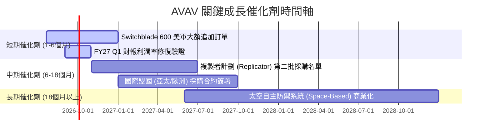

### 8.2 TAM 市場規模分析

```
╔══════════════════════════════════════════════════════════════╗
║                AVAV 目標市場規模 (TAM) 預估                  ║
╠══════════════════════════════════════════════════════════════╣
║                                                              ║
║  戰術無人機系統 (UAS)：  $4.5B  ▓▓▓▓▓▓▓▓▓▓▓░░░░░░░  滲透率: 25%║
║  戰術導彈/巡飛彈：       $3.0B  ▓▓▓▓▓▓▓▓▓▓▓▓▓▓░░░░░  滲透率: 35%║
║  太空及定向能量防禦：    $6.5B  ▓▓▓░░░░░░░░░░░░░░░░  滲透率:  5%║
║                                                              ║
║  📊 總計可觸及市場 (Total TAM)：$14.0B                        ║
║     當前 AVAV 營收 $1.98B，整體滲透率僅 14.1%，成長空間巨大。║
╚══════════════════════════════════════════════════════════════╝
```

### 8.3 成長驅動力結構圖

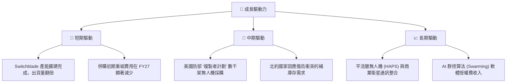

---

## 9. 風險矩陣

### 9.1 風險評分矩陣

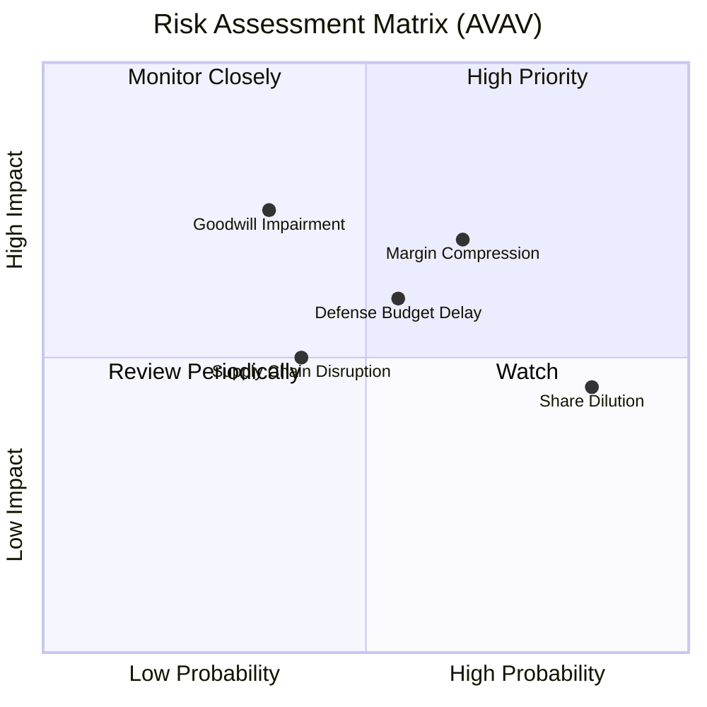

### 9.2 風險清單詳細分析

| # | 風險項目 | 發生機率 | 財務衝擊 | 風險評分 | 緩解與應對措施 |
|---|----------|----------|----------|----------|----------------|
| 1 | 🔴 **毛利率持續低迷** | 高 (65%) | 高 (-5% 淨利) | 🔴 7.5 / 10 | 透過自動化生產與供應商重新談判，預計在 4 個季度內實現規模經濟以修復毛利。 |
| 2 | 🟡 **商譽與無形資產減損** | 中 (35%) | 極高 (-$100M+ 賬面) | 🟡 6.0 / 10 | 嚴格執行併購後整合審計，確保被併購方營收 CAGR 维持在 20% 以上。 |
| 3 | 🟡 **國防預算撥款延遲** | 中 (55%) | 中 (-10% 營收) | 🟡 5.5 / 10 | 擴大國際盟國（非美政府）營收佔比，降低對單一客戶的依賴。 |
| 4 | 🟢 **股本稀釋壓制 EPS** | 極高 (85%) | 低 (壓低每股指標) | 🟢 4.0 / 10 | 隨著盈利能力回升，管理層應在 FY28 開啟股份回購計劃以抵消稀釋。 |

---

## 10. 投資建議

### 10.1 最終綜合評級雷達圖

```
╔══════════════════════════════════════════════════════════════╗
║                    AVAV 投資價值雷達圖                       ║
╠══════════════════════════════════════════════════════════════╣
║                                                              ║
║  行業成長前景 (Industry Tailwinds)  9.5/10 ▓▓▓▓▓▓▓▓▓▓▓▓▓▓▓▓▓▓░ ║
║  競爭優勢/護城河 (Moat Strength)   8.5/10 ▓▓▓▓▓▓▓▓▓▓▓▓▓▓▓▓░░░ ║
║  財務安全性 (Financial Solvency)    8.5/10 ▓▓▓▓▓▓▓▓▓▓▓▓▓▓▓▓░░░ ║
║  短期獲利品質 (Earnings Quality)    5.0/10 ▓▓▓▓▓▓▓▓▓▓░░░░░░░░░ ║
║  估值安全邊際 (Margin of Safety)    6.5/10 ▓▓▓▓▓▓▓▓▓▓▓▓▓░░░░░░ ║
║                                                              ║
║  🏆 綜合投資評等：🟢 買入 (Buy)                               ║
║  📊 綜合得分：7.2 / 10                                        ║
╚══════════════════════════════════════════════════════════════╝
```

### 10.2 目標價與隱含報酬率

| 情境 | 目標價 | 隱含報酬率 | 機率權重 | 期望值目標價 |
|------|--------|------------|----------|--------------|
| 🔴 **悲觀情境** | $125.00 | -16.0% | 20% | $25.00 |
| 🟡 **基準情境** | **$231.68** | **+55.7%** | **60%** | **$139.01** |
| 🟢 **樂觀情境** | $326.00 | +119.0% | 20% | $65.20 |
| **加權綜合目標價**| | | **100%** | **$229.21**（與基準目標價高度接近） |

### 10.3 買入時機與觸發因素

```
╔══════════════════════════════════════════════════════════════════╗
║                  ✅ AVAV 投資操作 Checklist                      ║
╠══════════════════════════════════════════════════════════════════╣
║                                                                  ║
║  立即建倉觸發條件（滿足 2 項以上即可分批分段買入）：             ║
║  ✅ 股價跌破 $150.00，前瞻 P/E 降至 33x 以下（已滿足）           ║
║  ✅ 國防部正式公佈「複製者計劃」最新採購名單，AVAV 中標          ║
║  ✅ 季度毛利率出現止跌回升信號（>26.5%）                         ║
║                                                                  ║
║  加碼觸發條件：                                                  ║
║  ☐ 財報顯示單季營運現金流 (OCF) 轉正                            ║
║  ☐ 宣佈獲得超過 $200M 的單筆國際軍售大單                         ║
║                                                                  ║
║  減碼/停損觸發條件：                                             ║
║  ☐ 季度毛利率跌破 22%（結構性惡化）                             ║
║  ☐ 發生大額 Goodwill 減損（> $150M）                            ║
║  ☐ 關鍵產品 Switchblade 600 被競爭對手同類武器替代               ║
╚══════════════════════════════════════════════════════════════════╝
```

### 10.4 投資人適配度分析

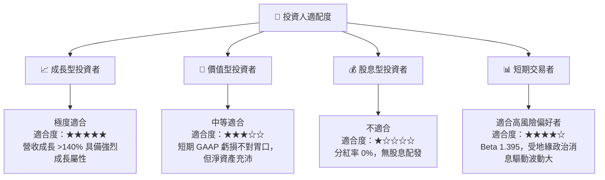

### 10.5 每季財報監控清單（Quarterly Watch List）

為了持續追蹤本投資框架的有效性，投資人應在每季財報公佈時重點監控以下指標：

| 監控指標 | 基準值 (FY26) | 觸發加碼門檻 | 觸發減碼/停損門檻 | 監控意義 |
|----------|---------------|--------------|-------------------|----------|
| **單季營收** | $641.62M (Q4) | > $550M (Q1-Q3) | < $380M | 驗證併購後業務規模是否具備持續性 |
| **毛利率** | 25.32% | > 28.0% | < 22.0% | 評估產品組合優化與庫存攤銷影響是否消除 |
| **營運現金流 (OCF)**| -$78.40M (全年)| > $20M (單季) | 負值持續擴大 | 評估營運資金效率與回款進度 |
| **Switchblade 出貨量**| 未披露具體數值| YoY 成長 > 30% | 出貨量停滯或下滑 | 核心高毛利高消耗性武器的需求驗證 |

### 10.6 反面論證：什麼會證明論點錯誤（What Would Change My Mind）

本投資報告的「買入」評級建立在**「短期虧損為併購整合陣痛，核心業務盈利能力將迅速修復」**的假設之上。若發生以下情況，我們將承認研究論點失效，並下調評級至「賣出」或「觀望」：

```
╔══════════════════════════════════════════════════════════════════╗
║              ⚠️ 論點失效條件 (Disconfirming Evidence)            ║
╠══════════════════════════════════════════════════════════════════╣
║  本投資論點在下列情況成立時應重新檢視或果斷退出：                ║
║  ☐ 連續三個季度毛利率無法回升至 27.0% 以上。                    ║
║  ☐ FY2027 調整後（Non-GAAP）EPS 低於 $3.50（低於預期 >20%）。    ║
║  ☐ 國防部「複製者計劃」採購中，AVAV 的份額低於 40%。              ║
║  ☐ 發生高達 $200M 以上的商譽減損，證實併購決策存在重大失誤。     ║
║  ☐ 自由現金流赤字在 FY2027 持續擴大至 -$200M 以上。              ║
╚══════════════════════════════════════════════════════════════════╝
```

---

> **免責聲明**：本報告為基於公開財務數據之基本面學術研究，僅供投資參考，不構成任何具體買賣建議。投資有風險，入市需謹慎。分析師持有 CFA 資格並恪守專業客觀標準。