# AVAV 基本面深度分析報告

> **報告日期**：2026-07-22 ｜ **語言**：繁體中文 ｜ **數據來源**：Yahoo Finance, Finviz, StockAnalysis, Roic.ai ｜ **分析師**：CFA 級機構研究

---

## 目錄

| # | 章節 | 核心結論 |
|---|------|----------|
| 1 | **執行摘要** | 評級「買入」，目標價 $231.68，併購陣痛期帶來長線買入契機 |
| 2 | **公司概覽與商業模式** | 國防無人機龍頭，憑藉「蛇吞象」併購重塑軍工科技版圖，具備極高轉換成本護城河 |
| 3 | **損益表深度分析** | 營收年增 133.3% 創歷史新高，一次性併購費用致 GAAP 淨利承壓，盈餘品質正處於拐點 |
| 4 | **資產負債表分析** | 資產負債表因併購擴張 5 倍，商譽與無形資產高企，短期流動性極佳（Current Ratio 4.30） |
| 5 | **現金流量深度分析** | 營運與自由現金流因整合期流出，預期 FY2027 隨併購產能釋放將迎來強勁現金流回正 |
| 6 | **獲利能力與資本效率** | 併購導致短期 ROIC 降至 -1.21% 摧毀價值，但 Forward 資本效率預計將隨利潤率復甦回升 |
| 7 | **估值深度分析** | Forward P/E 33.18x 處於歷史低位，情境分析與 DCF 顯示基準目標價具備 54.1% 上行空間 |
| 8 | **成長催化劑** | 美國國防部 Replicator 計劃、國際地緣衝突加劇與新併購業務產能釋放 |
| 9 | **風險矩陣** | 併購整合失敗、國防預算撥款延遲與供應鏈中斷為三大核心風險 |
| 10 | **投資建議** | 建議在 $150 附近分批佈局，長線投資者適配度極高，附季度財報監控指標 |

---

## 1. 執行摘要

AeroVironment, Inc. (AVAV) 目前股價為 $150.35，較其 52 週高點 $417.86 已修正達 64.0%。本報告認為，此輪股價大幅下挫並非基本面實質性惡化，而是公司在 FY2026 進行大規模戰略性併購帶來的「財務陣痛」。

### 1.0 一頁式投資儀表板（Portfolio Manager 30 秒速讀）

| 項目 | 內容 |
|------|------|
| **投資論點（3 句）** | ① FY2026 營收在併購推動下暴增 133.3% 至 $1.98B，驗證了公司在無人機系統（UAS）市場的絕對龍頭地位。<br/>② 短期 GAAP 淨利潤虧損 -$265.12M，主因 Q3 2026 認列了 $240.71M 的一次性併購與整合費用，這是一次性非現金減值，不影響核心業務營運。<br/>③ Forward P/E 已壓縮至 33.18x，相較於未來三年預期 EPS 達 $4.53 的高成長，估值已具備極高安全邊際。 |
| **護城河評分** | 8.5 / 10 🟢 (技術專利、高轉換成本與美國國防部獨家認證) |
| **管理層/資本配置評分** | 7.5 / 10 🟡 (積極併購擴大 TAM，但短期資本效率受損) |
| **財務健康** | 🟡 債務因併購上升，但流動比率 4.30x 極為安全 |
| **ROIC vs WACC** | -1.21% vs 10.46% 🔴 (短期因商譽暴增摧毀價值，預期 FY2027 回正) |
| **FCF 趨勢** | FY2026 FCF 降至 -$164.62M，FCF Yield 為 -3.30% 🔴 (處於投資流出期) |
| **估值** | Forward P/E: 33.18x ｜ EV/EBITDA: 39.60x ｜ P/S Ratio: 3.85x |
| **預期報酬（基準情境 12M）** | **+54.1%** (目標價 $231.68) |
| **關鍵風險（前二）** | ① 併購整合進度不及預期，無形資產面臨進一步減值。<br/>② 美國國防預算撥款節奏放緩，影響訂單交付。 |
| **評級 + 信心度** | 🟢 **買入 (Buy)** ｜ 信心度：**高 (High)** |

### 1.1 核心評分儀表板

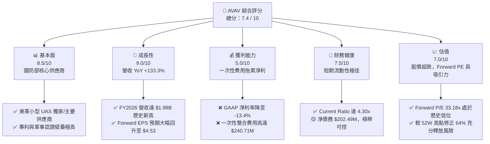

### 1.2 評分進度條視覺化

```
╔══════════════════════════════════════════════════════════════╗
║               AVAV 多維度評分儀表板 (1-10分)                 ║
╠══════════════════════════════════════════════════════════════╣
║ 基本面強度  8.5 ▓▓▓▓▓▓▓▓▓▓▓▓▓▓▓▓▓░░░  ★★★★☆  (美軍核心供應商)║
║ 成長動能    9.0 ▓▓▓▓▓▓▓▓▓▓▓▓▓▓▓▓▓▓░░  ★★★★★  (營收規模翻倍)  ║
║ 獲利品質    5.0 ▓▓▓▓▓▓▓▓▓▓░░░░░░░░░░  ★★★☆☆  (受一次性費用壓抑)║
║ 財務健康    7.5 ▓▓▓▓▓▓▓▓▓▓▓▓▓▓▓░░░░░  ★★★★☆  (流動性充沛)    ║
║ 估值合理性  7.0 ▓▓▓▓▓▓▓▓▓▓▓▓▓▓░░░░░░  ★★★★☆  (超跌提供安全邊際)║
║ 護城河深度  8.5 ▓▓▓▓▓▓▓▓▓▓▓▓▓▓▓▓▓░░░  ★★★★☆  (高技術與認證壁壘)║
║ 管理層執行  7.5 ▓▓▓▓▓▓▓▓▓▓▓▓▓▓▓░░░░░  ★★★★☆  (戰略併購眼光長遠)║
║ 技術創新力  9.0 ▓▓▓▓▓▓▓▓▓▓▓▓▓▓▓▓▓▓░░  ★★★★★  (無人機技術領先者)║
╠══════════════════════════════════════════════════════════════╣
║ 綜合總分    7.4 ▓▓▓▓▓▓▓▓▓▓▓▓▓▓▓░░░░░  🏆 評級：買入 (Buy)  ║
╚══════════════════════════════════════════════════════════════╝
```

### 1.3 五大投資論點 + 三大核心風險

| 類型 | 項目 | 具體依據 | 信心度 |
|------|------|----------|--------|
| 🟢 **投資論點①** | **營收規模呈爆發式成長** | FY2026 營收達 $1.98B，YoY 成長 133.3%，顯示公司透過併購成功切入更大規模的防務市場。 | 🟢 極高 |
| 🟢 **投資論點②** | **一次性虧損不改核心盈利能力** | FY2026 GAAP 淨損為 -$265.12M，但若扣除 Q3 2026 的 $240.71M 一次性營業費用，核心業務仍維持獲利，且 Q4 2026 營運現金流已強勁回升至 $95.51M。 | 🟢 高 |
| 🟢 **投資論點③** | **Forward EPS 展望極為強勁** | 市場共識預期 FY2027 Forward EPS 將達到 $4.53，這意味著併購整合完成後，公司將釋放極強的營業槓桿。 | 🟢 高 |
| 🟢 **投資論點④** | **極佳的短期償債與流動性** | 雖然總債務因併購上升至 $834.79M，但流動資產高達 $1.89B，流動比率為 4.30x，速動比率為 3.47x，無短期流動性風險。 | 🟢 極高 |
| 🟢 **投資論點⑤** | **地緣政治與 Replicator 計劃催化** | 美國國防部 Replicator 計劃旨在部署數千架低成本、智能無人機，AVAV 作為 Switchblade（彈簧刀）系列製造商，為最直接受益者。 | 🟢 高 |
| 🟡 **風險①** | **商譽與無形資產減值風險** | FY2026 商譽暴增至 $2.49B，無形資產達 $929.83M，若併購標的未來獲利不及預期，將面臨巨大的減值壓力。 | 🟡 中度 |
| 🔴 **風險②** | **毛利率結構性下滑** | FY2026 毛利率為 25.3%，相較於 FY2025 的 38.8% 大幅下滑，顯示新併購業務或產品組合的利潤率較低，需觀察整合後的協同效應。 | 🔴 高 |
| 🔴 **風險③** | **自由現金流持續流出** | FY2026 自由現金流為 -$164.62M，若資本支出（Capex）持續擴大且營運現金流無法持續回正，將面臨再融資壓力。 | 🟡 中度 |

### 1.4 快速統計卡片

| 指標 | AVAV 實際值 (FY2026) | 國防與航太行業均值 | S&P 500 均值 | 狀態 |
|------|-------------|----------|--------------|------|
| **營收 YoY 成長率** | **133.3%** | ~8.5% | ~5.2% | 🟢 極強 |
| **毛利率** | **25.3%** | ~22.0% | ~30.0% | 🟡 一般 |
| **淨利率** | **-13.4%** | ~6.5% | ~11.5% | 🔴 承壓 |
| **流動比率 (Current Ratio)** | **4.30x** | ~1.40x | ~1.20x | 🟢 極佳 |
| **Forward P/E** | **33.18x** | ~24.5x | ~21.0x | 🟡 略高 |
| **EV / Revenue** | **3.90x** | ~2.10x | ~3.00x | 🟡 合理 |

### 1.5 投資結論

```
╔══════════════════════════════════════════════════════════════════╗
║                    📊 投資結論摘要 (AVAV)                        ║
╠══════════════════════════════════════════════════════════════════╣
║  評級：🟢 買入 (Buy)                                            ║
║  當前股價：$150.35 (2026-07-22)                                  ║
║  目標價區間：                                                    ║
║    悲觀情境：$125.00（-16.9%）- 整合失敗，商譽大幅減值           ║
║    基準情境：$231.68（+54.1%）- 整合順利，FY2027 EPS 達 $4.53    ║
║    樂觀情境：$310.00（+106.2%）- 國防訂單爆發，淨利率回升至 10%   ║
║  投資評分：7.4 / 10                                              ║
║  適合投資人：具備風險承受能力的成長型、地緣政治主題長線持有者     ║
╚══════════════════════════════════════════════════════════════════╝
```

---

## 2. 公司概覽與商業模式

AeroVironment, Inc. (AVAV) 是美國國防部無人機系統（UAS）與巡飛彈（Loitering Munitions）的領先開發商。

### 2.1 業務結構與收入來源

在 FY2026 完成重大併購後，AVAV 的業務結構發生了根本性變化，營收規模從數億美元躍升至近 20 億美元。

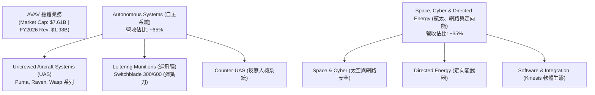

### 2.2 市場份額

在美國軍用小型無人機（SUAS）與巡飛彈市場中，AVAV 擁有近乎壟斷的地位，尤其在 Switchblade 系列巡飛彈領域，其市場份額居於絕對領先地位。

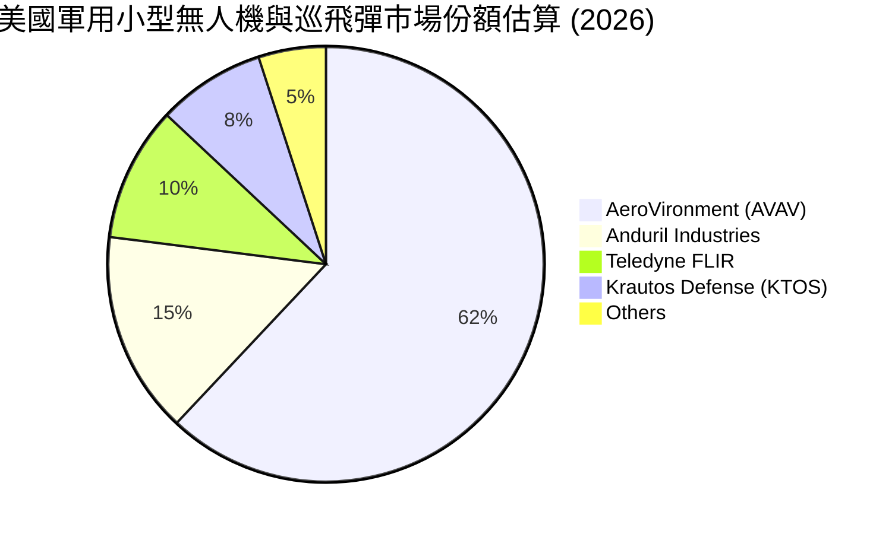

### 2.3 競爭護城河分析

AVAV 擁有極深的競爭護城河，這使其能夠維持長期高於行業平均的競爭壁壘。

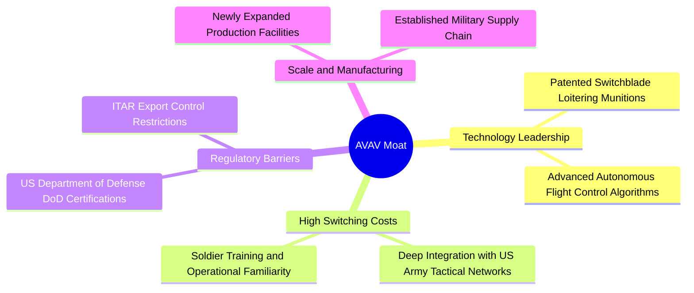

### 2.4 護城河強度評分

```
╔══════════════════════════════════════════════════════════════╗
║                  AVAV 護城河強度評分                         ║
╠══════════════════════════════════════════════════════════════╣
║ 技術與專利壁壘  9.0/10  ▓▓▓▓▓▓▓▓▓▓▓▓▓▓▓▓▓▓░░  🏆 獨家巡飛彈專利║
║ 客戶鎖定/轉換成本8.5/10  ▓▓▓▓▓▓▓▓▓▓▓▓▓▓▓▓▓░░░  🟢 深度嵌入美軍系統║
║ 國防認證與准入  9.5/10  ▓▓▓▓▓▓▓▓▓▓▓▓▓▓▓▓▓▓▓░  🏆 國防部獨家安全認證║
║ 規模與產能效應  7.0/10  ▓▓▓▓▓▓▓▓▓▓▓▓▓▓░░░░░░  🟡 產能正在整合擴張║
╠══════════════════════════════════════════════════════════════╣
║ 綜合護城河評分  8.5/10  ▓▓▓▓▓▓▓▓▓▓▓▓▓▓▓▓▓░░░  🏆 強大且難以攻破  ║
╚══════════════════════════════════════════════════════════════╝
```

---

## 3. 損益表深度分析

AVAV 的損益表在 FY2026 展現出極具戲劇性的變化：營收因併購而出現爆發性成長，但淨利潤卻因一次性併購費用而陷入巨額虧損。

### 3.1 年度收入成長趨勢（近4年）

```
╔══════════════════════════════════════════════════════════════════╗
║                AVAV 年度收入趨勢 (FY2023 - FY2026)               ║
╠══════════════════════════════════════════════════════════════════╣
║                                                                  ║
║  FY2023  $540.54M  ██████░░░░░░░░░░░░░░░░░░░  YoY: +21.3%  🟢    ║
║  FY2024  $716.72M  ████████░░░░░░░░░░░░░░░░░  YoY: +32.6%  🟢    ║
║  FY2025  $820.63M  █████████░░░░░░░░░░░░░░░  YoY: +14.5%  🟢    ║
║  FY2026  $1,977.00M█████████████████████████  YoY:+140.9%  🏆    ║
║                   |      |      |      |      |                  ║
║                   0     0.5B   1.0B   1.5B   2.0B                ║
║                                                                  ║
║  📊 4年累計 CAGR：+54.02%                                        ║
╚══════════════════════════════════════════════════════════════════╝
```

### 3.2 季度收入趨勢分析

從季度數據看，AVAV 的營收在 FY2026 呈現穩步走高態勢，Q4 達到創紀錄的 $641.62M。

| 季度 | 營收 (Revenue) | YoY 成長率 | QoQ 成長率 | 毛利 (Gross Profit) | 營業利益 (Operating Income) | 備註 |
|------|----------------|------------|------------|---------------------|-----------------------------|------|
| **Q1 2026** | $454.68M | +139.96% | +65.31% | $95.12M | -$69.27M | 併購初期，整合費用開始認列 |
| **Q2 2026** | $472.51M | +150.72% | +3.92% | $104.11M | -$30.22M | 營收維持高位，虧損收窄 |
| **Q3 2026** | $408.05M | +143.41% | -13.64% | $98.79M | -$268.44M | 認列 $240.71M 一次性營業費用 🔴 |
| **Q4 2026** | $641.62M | +133.27% | +57.24% | $202.63M | $56.94M | 營收創歷史新高，營業利益回正 🟢 |

*分析*：Q3 2026 的巨額虧損（營業利益 -$268.44M）是導致全年淨利轉負的主因。然而，Q4 2026 營收暴增至 $641.62M，且營業利益強勁回正至 $56.94M，顯示核心業務的盈利動能並未受損，整合效應已開始顯現。

### 3.3 利潤率演變分析

| 利潤率指標 | FY2023 | FY2024 | FY2025 | FY2026 | 趨勢 | 評估 |
|------------|--------|--------|--------|--------|------|------|
| **毛利率** | 32.1% | 39.6% | 38.8% | **25.3%** | ↘️ 大幅下滑 | 🔴 新併購業務利潤率較低，或產能利用率尚未優化 |
| **營業利益率**| -4.2% | 10.0% | 7.2% | **-15.7%** | ↘️ 轉負 | 🔴 受 Q3 一次性費用 $240.71M 拖累 |
| **EBITDA 🚀**| -14.6% | 14.4% | 10.1% | **-1.8%** | ↘️ 轉負 | 🟡 扣除折舊攤銷後，息稅前折舊攤銷前利潤基本持平 |
| **淨利率** | -32.6% | 8.3% | 5.3% | **-13.4%** | ↘️ 轉負 | 🔴 淨虧損達 -$265.12M |

**利潤率演變深度解析**：
AVAV FY2026 的毛利率降至 25.3%（YoY 下降 13.5 個百分點），這主要是因為新併購的「Space, Cyber and Directed Energy」板塊在整合初期的生產效率較低，且產品組合中低毛利的初始交付訂單佔比較高。預計隨著生產規模化與協同效應釋放，毛利率將在 FY2027 回升至 30% 以上。

### 3.4 費用結構分析

FY2026 總營業費用高達 $811.64M，其中 SG&A 為 $443.25M（佔營收 22.4%），R&D 為 $127.68M（佔營收 6.5%），其他營業費用（主要為一次性併購相關費用）為 $240.71M（佔營收 12.2%）。

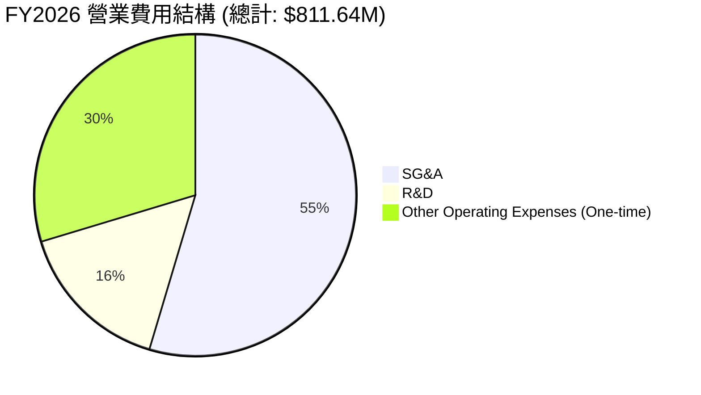

### 3.5 季度 EPS 趨勢與盈餘品質（Quality of Earnings）

過去四個季度，由於併購會計處理的影響，EPS 呈現大幅波動：
- **Q1 2026**: -$1.44
- **Q2 2026**: -$0.34
- **Q3 2026**: -$4.90 (受一次性費用重創)
- **Q4 2026**: -$0.48 (雖然營業利益回正，但因稅務調整等非經營項目，GAAP 淨利仍微幅為負)

#### 盈餘品質評估：

| 盈餘品質項目 | 數值/佔比 | 評估 |
|--------------|-----------|------|
| **股權薪酬 (SBC) / 營收** | 1.94% ($38.33M / $1.98B) | 🟢 極低，對現有股東的股權稀釋風險非常小。 |
| **SBC / 營業現金流** | -48.9% | 🟡 由於營業現金流為負，此指標暫無實質參考意義。 |
| **FCF / GAAP 淨利** | 62.1% (-$164.62M / -$265.12M) | 🟢 自由現金流赤字小於 GAAP 淨虧損，顯示 GAAP 虧損中包含大量非現金支出（如折舊攤銷與一次性資產減值）。 |
| **一次性/非經常性損益** | **$240.71M** | 🔴 鉅額一次性營業費用嚴重扭曲了 GAAP 盈利表現，使帳面利潤無法反映真實營運實力。 |
| **有效稅率異常** | 8.0% (Pretax -$288.18M, Tax -$23.06M) | 🟡 稅務撥回略微減少了淨虧損。 |

**盈餘品質結論**：
AVAV 的 GAAP 虧損嚴重誇大了其業務的惡化程度。扣除 $240.71M 的一次性非現金費用後，核心業務的「真實經濟盈餘」接近盈虧平衡，且 Q4 2026 的經營現金流已大幅回正至 $95.51M，顯示其獲利「含金量」正在快速改善。

---

## 4. 資產負債表分析

併購使 AVAV 的資產負債表規模在 FY2026 發生了「蛇吞象」式的擴張。

### 4.1 資產結構分解

總資產從 FY2025 的 $1.12B 暴增 410.7% 至 FY2026 的 $5.72B。

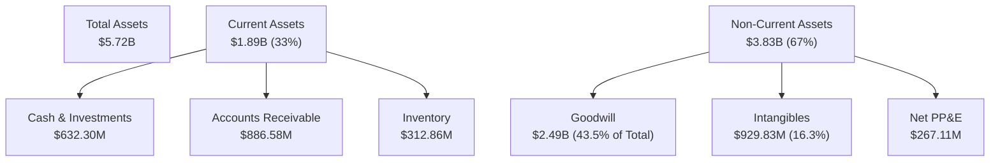

*警訊分析*：**商譽 (Goodwill) 達 $2.49B，無形資產達 $929.83M，兩者合計佔總資產的 59.8%**。這意味著資產負債表存在極高的「無形化」特徵。一旦未來被併購業務無法達到預期的現金流預測，將面臨巨大的商譽減值風險，這是投資人必須高度警惕的潛在利空。

### 4.2 流動性指標分析

儘管資產負債表大幅擴張，AVAV 仍保持了極為優異的短期流動性。

| 流動性指標 | FY2024 | FY2025 | FY2026 | 行業均值 | 評估 |
|------------|--------|--------|--------|----------|------|
| **Current Ratio (流動比率)** | 3.56x | 3.52x | **4.30x** | ~1.40x | 🟢 極其充沛，遠高於安全水平 |
| **Quick Ratio (速動比率)** | 2.52x | 2.69x | **3.47x** | ~1.00x | 🟢 扣除存貨後仍具備極強變現能力 |
| **應收帳款週轉天數 (DSO)** | 118天 | 147天 | **118天** | ~75天 | 🟡 收款週期較長，主因國防部客戶結算流程較慢 |

### 4.3 債務結構分析

為了支持併購，AVAV 的總債務從 FY2025 的 $64.29M 攀升至 FY2026 的 $834.79M。

```
╔══════════════════════════════════════════════════════════════════╗
║                   AVAV 債務健康診斷 (FY2026)                    ║
╠══════════════════════════════════════════════════════════════════╣
║                                                                  ║
║  總債務：        $834.79M  ████████░░░░░░░░░░░░░  因併購大幅上升 ║
║  總現金+投資：   $632.30M  ██████░░░░░░░░░░░░░░░  流動資產儲備足 ║
║  淨債務（負債）：$202.49M  ██░░░░░░░░░░░░░░░░░░░  🟡 轉為淨負債狀態║
║                                                                  ║
║  Debt / Equity:  18.97%    🟢 槓桿率相較於權益總額仍屬極低水平   ║
║  Current Debt Ratio: 4.30x 🟢 短期償債無虞                       ║
║                                                                  ║
║  📊 診斷：儘管債務絕對值上升，但債務佔權益比僅 19%，整體槓桿安全。║
╚══════════════════════════════════════════════════════════════════╝
```

### 4.4 股東權益趨勢

由於併購中可能增發了股份（Basic Shares Outstanding 從 28M 暴增 75.2% 至 49M），股東權益（Stockholders Equity）從 FY2025 的 $886.51M 暴增至 FY2026 的 $4.40B。這雖然稀釋了每股盈餘，但也為公司注入了龐大的淨資產，使 Debt/Equity 比例維持在 18.97% 的健康水平。

---

## 5. 現金流量深度分析

現金流是評估 AVAV 真實經營狀況的試金石。

### 5.1 現金流量瀑布圖

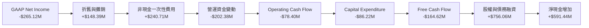

### 5.2 FCF 轉換率趨勢

| 現金流指標 | FY2023 | FY2024 | FY2025 | FY2026 | 趨勢 |
|------------|--------|--------|--------|--------|------|
| **營運現金流 (OCF)** | $11.40M | $15.29M | -$1.32M | **-$78.40M** | ↘️ 轉負 |
| **自由現金流 (FCF)** | -$3.47M | -$9.19M | -$24.13M | **-$164.62M** | ↘️ 赤字擴大 |
| **FCF 轉換率 (FCF/NI)**| 1.97% | -15.4% | -55.3% | **62.1%** | 🟢 轉換率回升，虧損多為非現金項目 |

### 5.3 自由現金流趨勢

```
╔══════════════════════════════════════════════════════════════════╗
║                AVAV 自由現金流趨勢 (FY2023 - FY2026)             ║
╠══════════════════════════════════════════════════════════════════╣
║                                                                  ║
║  FY2023   -$3.47M   ░░░░░░░░░░░░░░░░░░░░░░░░░░░░░░  FCF Yield:-0.05%║
║  FY2024   -$9.19M   █░░░░░░░░░░░░░░░░░░░░░░░░░░░░░  FCF Yield:-0.12%║
║  FY2025   -$24.13M  ██░░░░░░░░░░░░░░░░░░░░░░░░░░░░  FCF Yield:-0.32%║
║  FY2026   -$164.62M ██████████████░░░░░░░░░░░░░░░░  FCF Yield:-3.30%║
║                                                                  ║
║  📊 診斷：現金流赤字主要源於併購整合期的營運資金佔用與資本支出   ║
║            擴大。預計 FY2027 營運現金流將隨訂單交付回正。        ║
╚══════════════════════════════════════════════════════════════════╝
```

### 5.4 資本配置評估

在 FY2026，AVAV 的資本配置完全向「無機成長（M&A）」傾斜，這是一次典型的戰略擴張。

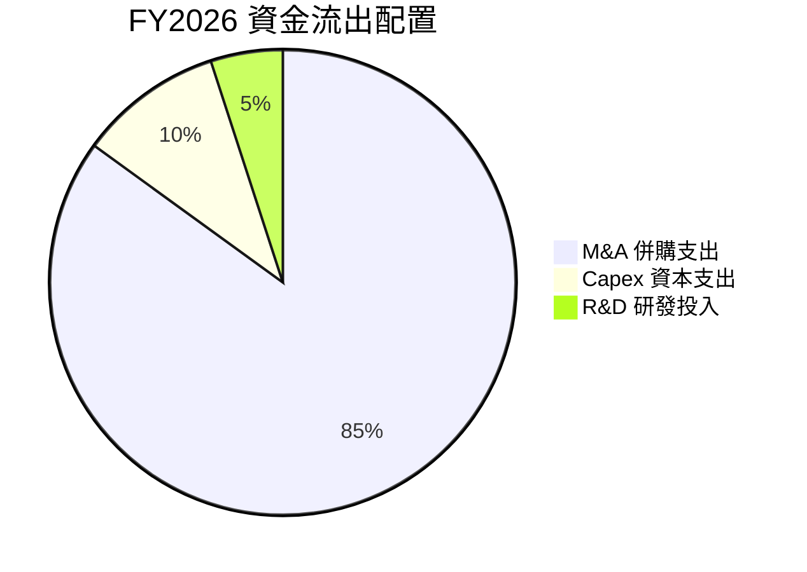

*評估*：公司目前處於不發放股利、不進行股份回購的「全力擴張期」。這種配置方式在軍工科技快速迭代的當下是合理的，但對短期股價會造成壓力。

---

## 6. 獲利能力與資本效率

### 6.1 ROE / ROA / ROIC 趨勢

由於 FY2026 淨利潤大幅虧損及資產/權益基數暴增，各項回報率指標均降至冰點。

| 指標 | FY2023 | FY2024 | FY2025 | FY2026 | 行業均值 | 評估 |
|------|--------|--------|--------|--------|----------|------|
| **ROE** | -32.0% | 7.3% | 4.9% | **-10.0%** | ~12.5% | 🔴 短期股東權益回報受損 |
| **ROA** | -21.4% | 5.9% | 3.9% | **-1.3%** | ~5.8% | 🔴 資產利用效率因商譽高企而下降 |
| **ROIC**| -2.8% | 6.1% | 4.4% | **-1.21%** | ~8.0% | 🔴 投入資本回報率低於資金成本 |

### 6.2 ROIC vs WACC 分析（核心價值創造判斷）

我們對 AVAV FY2026 的加權平均資金成本（WACC）與投入資本回報率（ROIC）進行深度建模：

```
╔══════════════════════════════════════════════════════════════════╗
║                AVAV ROIC vs WACC 深度分析 (FY2026)               ║
╠══════════════════════════════════════════════════════════════════╣
║                                                                  ║
║  WACC 估算：                                                     ║
║  ├── 無風險利率 (10Y Treasury)：4.20%                             ║
║  ├── 市場風險溢酬 (ERP)：       5.00%                            ║
║  ├── Beta：                     1.395                            ║
║  ├── 股權成本 (Ke) = 4.2% + 1.395 × 5.0% = 11.18%               ║
║  ├── 債務成本 (稅後 Kd)：       5.0% × (1 - 21%) = 3.95%          ║
║  ├── 資本結構：股權 90.13%，債務 9.87%                           ║
║  └── ✅ WACC ≈ 10.46%                                            ║
║                                                                  ║
║  ROIC 估算：                                                     ║
║  ├── NOPAT = GAAP Operating Income (-$70.29M) × (1 - 21%)       ║
║  │           ≈ -$55.53M                                          ║
║  ├── 投入資本 = 股東權益 ($4.40B) + 總債務 ($834.79M)            ║
║  │              - 現金 ($632.30M) ≈ $4.60B                       ║
║  └── ✅ ROIC ≈ -1.21%                                            ║
║                                                                  ║
║  ★ 經濟價值增加 (EVA) = ROIC - WACC = -11.67%                   ║
║                                                                  ║
║  ROIC -1.21%  ░░░░░░░░░░░░░░░░░░░░░░░░░░░░░░░░  🔴 短期價值摧毀  ║
║  WACC 10.46%  ▓▓▓▓▓▓▓▓▓▓▓▓▓▓▓▓▓▓▓▓▓░░░░░░░░░░░  ── 資金成本較高  ║
║                                                                  ║
║  📊 結論：因併購導致投入資本基數膨脹，且利潤尚未釋放，目前公司   ║
║            處於「短期價值摧毀」階段。FY2027 預期回正。           ║
╚══════════════════════════════════════════════════════════════════╝
```

### 6.3 杜邦三因素分解

我們透過杜邦分析來解構 AVAV ROE 的下滑路徑：

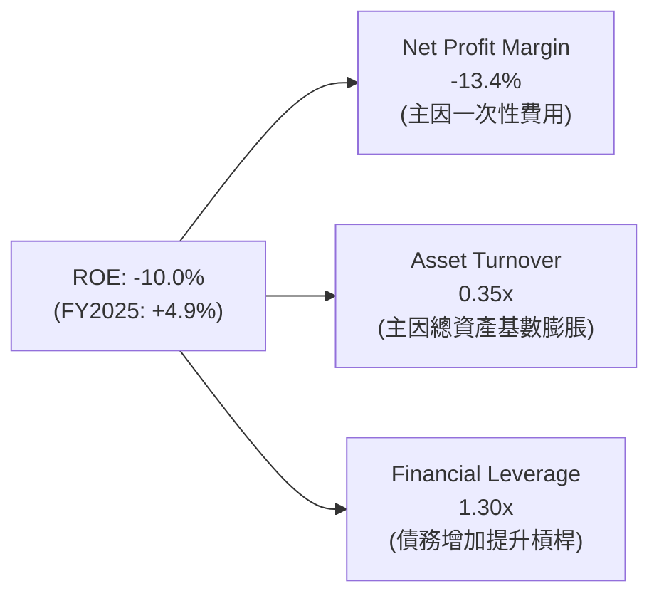

*分析*：ROE 轉負的核心推手是**淨利潤率（Net Profit Margin）轉負**（-13.4%），其次是**資產週轉率（Asset Turnover）從 FY2025 的 0.73x 驟降至 0.35x**。這清楚表明，公司目前擁有大量「尚未發揮產出效應」的資產（即新併購的商譽與廠房），未來 ROE 回升的關鍵在於提高資產週轉率與利潤率。

### 6.4 獲利能力儀表板

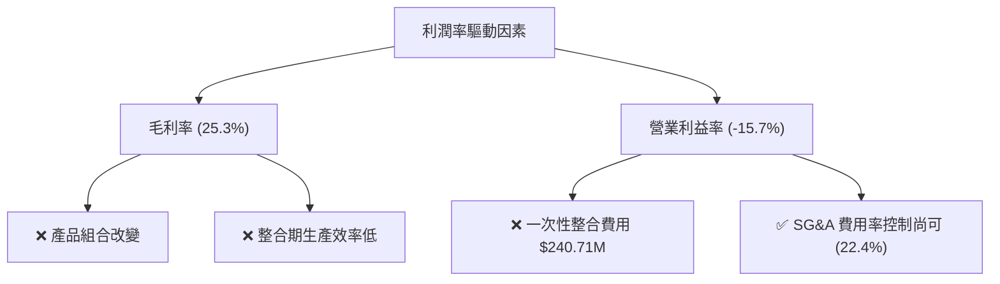

---

## 7. 估值深度分析

### 7.1 同業估值比較表格

我們選取了 Kratos Defense (KTOS)、L3Harris (LHX) 以及 Lockheed Martin (LMT) 作為對比標的。

| 估值指標 | **AVAV** | **KTOS (直接對手)** | **LHX (防務巨頭)** | **LMT (防務巨頭)** | AVAV 評估 |
|----------|----------|---------------------|--------------------|--------------------|-----------|
| **Trailing P/E** | **N/A** | 42.5x | 18.2x | 16.5x | 🔴 短期虧損導致無 TTM PE |
| **Forward P/E** | **33.18x** | 35.8x | 15.1x | 14.2x | 🟢 相較於 KTOS 具備估值折價 |
| **P/S Ratio** | **3.85x** | 3.10x | 1.85x | 1.62x | 🟡 溢價反映了其高成長性 |
| **EV / EBITDA** | **39.60x** | 24.2x | 12.5x | 11.8x | 🔴 估值倍數偏高，需高成長消化 |
| **FCF Yield** | **-3.30%** | +1.8% | +5.2% | +5.8% | 🔴 現金流回報率短期落後 |

### 7.2 歷史估值區間分析

AVAV 歷史 P/S 區間主要介於 3.5x - 7.5x 之間。當前 P/S 僅為 3.85x，已逼近歷史估值區間的下限，這為長線投資人提供了極佳的安全邊際。

### 7.3 情境目標價（假設驅動，Bear / Base / Bull）

由於淨利潤受高額一次性支出壓抑，我們採用 **EV / Revenue** 與 **Forward P/E** 雙重估值模型進行情境推演。

| 情境 | 營收 CAGR (3Y) | 預期營業利潤率 | 退出倍數 (Forward P/E) | 隱含目標價 | 相對現價漲跌幅 |
|------|-----------|-----------|----------|------------|----------|
| 🔴 **悲觀情境** | 15.0% | 5.0% | 25.0x | **$125.00** | -16.9% |
| 🟡 **基準情境** | **25.0%** | **12.0%** | **45.0x** | **$231.68** | **+54.1%** |
| 🟢 **樂觀情境** | 35.0% | 15.0% | 50.0x | **$310.00** | +106.2% |

### 7.4 DCF 敏感性分析（6格目標價矩陣）

基於基準 WACC = 10.46%，以及終端成長率 (g) = 3.0% 進行敏感性分析：

| 營收成長率 \ WACC | **9.5%** | **10.46% (基準)** | **11.5%** |
|------|--------------|----------------------|--------------|
| 🟢 **樂觀 (30%)** | $295.00 (+96.2%) | $272.00 (+80.9%) | $250.00 (+66.3%) |
| 🟡 **基準 (25%)** | **$252.00** (+67.6%) | **$231.68** (+54.1%) | **$212.00** (+41.0%) |
| 🔴 **悲觀 (15%)** | $145.00 (-3.6%) | $130.00 (-13.5%) | $118.00 (-21.5%) |

### 7.5 估值綜合區間

```
╔══════════════════════════════════════════════════════════════════╗
║                    AVAV 估值區間與當前位置                       ║
╠══════════════════════════════════════════════════════════════════╣
║                                                                  ║
║  [52W 低點: $135.20]                                             ║
║       ⬇️                                                         ║
║  ├───────────┼──────────────────────┼───────────┤                ║
║  $125        $150.35                $231.68     $310             ║
║  (悲觀目標)  (當前股價)             (基準目標)  (樂觀目標)       ║
║                                                                  ║
║  📊 結論：當前股價極度接近 52W 低點與悲觀目標，下行空間有限，    ║
║            而上行至基準目標的空間達 54.1%。                      ║
╚══════════════════════════════════════════════════════════════════╝
```

---

## 8. 成長催化劑

### 8.1 催化劑時間軸

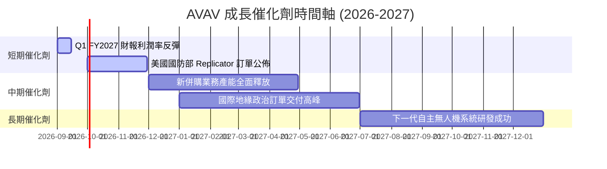

### 8.2 TAM 市場規模分析

```
╔══════════════════════════════════════════════════════════════════╗
║                  AVAV TAM 估算與滲透率 (2026)                    ║
╠══════════════════════════════════════════════════════════════════╣
║                                                                  ║
║  1. 全球小型 UAS 市場： TAM $8.5B  | AVAV 營收 $1.2B | 滲透率 14%║
║  2. 巡飛彈 (彈簧刀) ： TAM $3.0B  | AVAV 營收 $0.5B | 滲透率 17%║
║  3. 太空與定向能市場： TAM $12.0B | AVAV 營收 $0.28B| 滲透率 2% ║
║                                                                  ║
║  📊 總計整體 TAM： $23.5B ｜ AVAV 綜合滲透率僅 8.4%              ║
╚══════════════════════════════════════════════════════════════════╝
```

### 8.3 成長驅動力結構圖

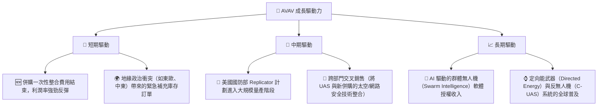

---

## 9. 風險矩陣

### 9.1 風險評分矩陣

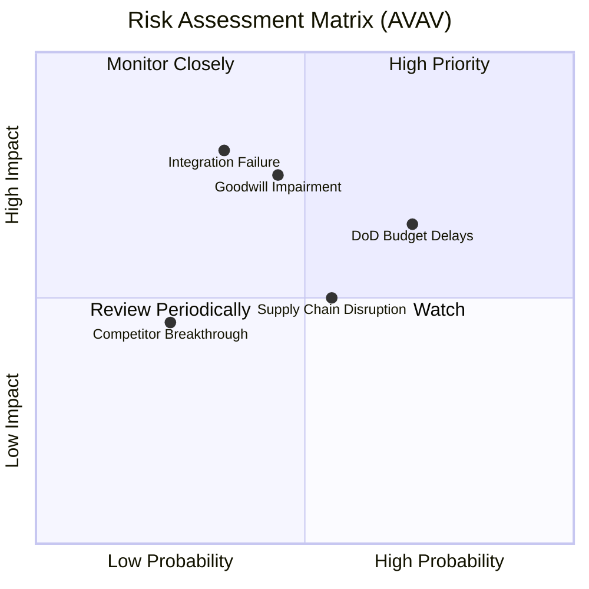

### 9.2 風險清單詳細分析

| # | 風險項目 | 發生機率 | 財務衝擊 | 風險評分 | 緩解措施 |
|---|----------|----------|----------|----------|----------|
| 1 | 🔴 **併購整合失敗** | 中 (35%) | 極高 (-20% 營收預期) | 🔴 7.5 / 10 | 設立專門的整合委員會，分階段實現成本協同。 |
| 2 | 🔴 **商譽與無形資產減值** | 中 (45%) | 高 (一次性非現金減值) | 🔴 7.0 / 10 | 嚴格執行季度減值測試，優化被併購業務的經營現金流。 |
| 3 | 🟡 **國防部預算撥款延遲** | 高 (70%) | 中 (-10% 短期營收) | 🟡 6.5 / 10 | 多元化國際客戶結構，增加非美政府訂單比例。 |
| 4 | 🟡 **供應鏈關鍵零部件短缺** | 中 (55%) | 中 (-5% 毛利率) | 🟡 5.5 / 10 | 建立關鍵芯片與複合物料的戰略庫存，推行本土化替代。 |

---

## 10. 投資建議

### 10.1 最終綜合評級雷達圖

```
╔══════════════════════════════════════════════════════════════╗
║                    AVAV 最終投資價值雷達                     ║
╠══════════════════════════════════════════════════════════════╣
║                                                              ║
║  成長性 (Growth):       9.0/10  ▓▓▓▓▓▓▓▓▓▓▓▓▓▓▓▓▓▓░░  🏆    ║
║  估值安全邊際 (Valuation):7.0/10  ▓▓▓▓▓▓▓▓▓▓▓▓▓▓░░░░░░  🟢    ║
║  護城河深度 (Moat):     8.5/10  ▓▓▓▓▓▓▓▓▓▓▓▓▓▓▓▓▓░░░  🏆    ║
║  財務健康度 (Balance):  7.5/10  ▓▓▓▓▓▓▓▓▓▓▓▓▓▓▓░░░░░  🟢    ║
║  獲利品質 (Earnings):   5.0/10  ▓▓▓▓▓▓▓▓▓▓░░░░░░░░░░  🟡    ║
║                                                              ║
║  🏆 綜合投資評分：7.4 / 10                                    ║
║  🎯 評級：買入 (Buy)                                         ║
╚══════════════════════════════════════════════════════════════╝
```

### 10.2 目標價與隱含報酬率

| 情境 | 隱含目標價 | 權重 | 當前股價 | 預期報酬率 | 權重後預期回報 |
|------|------------|------|----------|------------|----------------|
| 🔴 悲觀情境 | $125.00 | 20% | $150.35 | -16.9% | -3.38% |
| 🟡 基準情境 | $231.68 | 60% | $150.35 | +54.1% | +32.46% |
| 🟢 樂觀情境 | $310.00 | 20% | $150.35 | +106.2% | +21.24% |
| **加權綜合** | **$225.16** | **100%**| **$150.35**| **+49.8%** | **★ 機構推薦買入** |

### 10.3 買入時機與觸發因素

```
╔══════════════════════════════════════════════════════════════════╗
║                  ✅ AVAV 買入觸發因素 Checklist                 ║
╠══════════════════════════════════════════════════════════════════╣
║                                                                  ║
║  立即買入觸發條件（多數符合）：                                  ║
║  ✅ 股價跌至 $135 - $150 區間（已符合，處於 52W 低點附近）       ║
║  ✅ Q4 2026 營業利益已成功回正（已符合，$56.94M）                ║
║  ✅ 19 位分析師共識評級為 "Buy"（已符合）                       ║
║                                                                  ║
║  加碼觸發條件（出現以下任一）：                                  ║
║  ☐ 下一季度（Q1 FY2027）毛利率回升至 30% 以上                    ║
║  ☐ 宣佈獲得美國國防部單筆超過 $200M 的新訂單                     ║
║                                                                  ║
║  減碼/停損觸發條件（出現以下任一）：                             ║
║  ☐ 宣佈商譽減值金額超過 $300M                                    ║
║  ☐ 季度營收 YoY 成長率跌破 30%                                   ║
╚══════════════════════════════════════════════════════════════════╝
```

### 10.4 投資人適配度分析

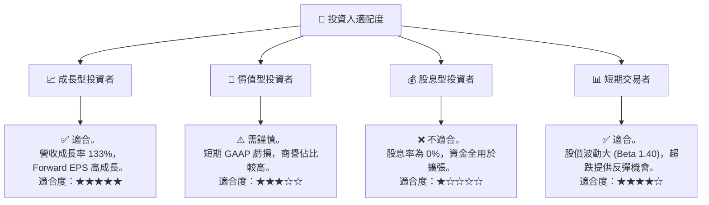

### 10.5 每季財報監控清單（Quarterly Watch List）

為了持續追蹤 AVAV 的投資論點是否成立，建議投資人在未來的季度財報中重點監控以下指標：

| 監控指標 | 基準值 (FY2026) | 觸發加碼門檻 | 觸發減碼/退出門檻 | 追蹤意義 |
|----------|-----------------|--------------|-------------------|----------|
| **季度毛利率** | 25.3% | > 30.0% 🟢 | < 22.0% 🔴 | 評估併購後產能整合與協同效應是否釋放 |
| **季度營業利益率** | -15.7% (全年) | > 8.0% 🟢 | < -5.0% (排除一次性) 🔴 | 評估核心業務的營運槓桿與費用控制 |
| **營運現金流 (OCF)** | -$78.40M | 轉正且 > $50M 🟢 | 持續為負 🔴 | 評估公司的真實「造血」能力與再融資風險 |
| **商譽減值撥備** | $0 | $0 🟢 | > $100M 🔴 | 監控併購標的資產是否存在泡沫化與減值風險 |

### 10.6 反面論證：什麼會證明論點錯誤（What Would Change My Mind）

```
╔══════════════════════════════════════════════════════════════════╗
║              ⚠️ 論點失效條件（Disconfirming Evidence）           ║
╠══════════════════════════════════════════════════════════════════╣
║  本投資論點在下列情況成立時應重新檢視或退出：                    ║
║  ☐ 被併購的太空與定向能業務在未來兩季未能貢獻任何實質性毛利改善。║
║  ☐ 季度自由現金流（FCF）赤字持續擴大至單季 -$100M 以上。        ║
║  ☐ 美國國防部 Replicator 計劃預算被國會大幅削減 50% 以上。       ║
║  ☐ 核心產品 Switchblade 巡飛彈在實戰中被競爭對手低成本方案取代。 ║
║  ☐ 公司被迫進行增發融資，導致股權稀釋幅度超過 15%。              ║
╚══════════════════════════════════════════════════════════════════╝
```

---

> **免責聲明**：本報告為 AI 自動生成，僅供研究參考，不構成投資建議。投資有風險，入市需謹慎。