# AVAV 基本面深度分析報告
> **報告日期**：2026-07-23 ｜ **語言**：繁體中文 ｜ **數據來源**：Yahoo Finance, Finviz, StockAnalysis, Roic.ai ｜ **分析師**：CFA 級機構研究

---

## 目錄

| # | 章節 | 核心結論 |
|---|------|----------|
| 1 | 執行摘要 | 評級：🟢 **買入** ｜ 12 個月目標價：**$226.50**（隱含潛在漲幅 +42.7%） |
| 2 | 公司概覽與商業模式 | 護城河評分：**8.2/10** ｜ 無人機（UAS）與巡飛彈（Switchblade）國防龍頭 |
| 3 | 損益表深度分析 | FY2026 營收爆發性成長 +140.9% 至 $1.98B；Q4 轉盈顯現強勁營運槓桿 |
| 4 | 資產負債表分析 | 總資產擴增至 $5.72B；手握 $632.3M 現金，槓桿安全（Debt/Equity 19%） |
| 5 | 現金流量深度分析 | 併購整合期後 Q4 單季 FCF 強勁回升至 +$72.7M，營運現金流拐點已現 |
| 6 | 獲利能力與資本效率 | WACC 為 10.58%；整合併購資產後，Forward ROIC 預計於 FY2027 重回 8.5%+ |
| 7 | 估值深度分析 | Forward P/E 35.0x / P/S 4.06x 處於併購後價值重估區間，DCF 基準價 $226.50 |
| 8 | 成長催化劑 | 地緣政治衝突加速軍用巡飛彈需求，多國國防預算調升帶動 TAM 擴張 |
| 9 | 風險矩陣 | 併購整合過渡期毛利率收縮（25.3%）與美國國防部預算撥款延遲風險 |
| 10 | 投資建議 | 具備軍工科技高壁壘，建議於 $150–$160 區間分批佈局，觸發價 $145 強力加碼 |

---

## 1. 執行摘要

> ⚠️ **證據先於結論**：AeroVironment (AVAV) 在 FY2026 實現營收 $1.98B（同比成長 +140.89%），主因大型國防併購整合與 Switchblade 巡飛彈系列全球需求擴張。儘管 FY2026 受一次性併購費用與資產攤銷壓抑導致 GAAP 淨虧損 $-265.12M，但 Q4 營運已展現強勁拐點：單季營收達 $641.62M（YoY +133.3%），營業利益轉正至 $56.94M，單季自由現金流（FCF）回升至 +$72.70M。市場預估 FY2027 Forward EPS 將反彈至 $4.53（對應 Forward P/E 為 35.0x）。基於國防無人化趨勢不可逆、併購綜效將在 FY2027 顯現，給予 **🟢 買入** 評級，12 個月基準目標價 **$226.50**。

### 1.0 一頁式投資儀表板（Portfolio Manager 30 秒速讀）

| 項目 | 內容 |
|------|------|
| **投資論點（3 句）** | ① 地緣政治緊張推升國防無人化與巡飛彈需求，FY2026 營收暴增 140.89% 至 $1.98B，市佔率持續擴大。<br/>② FY2026 併購一次性費用出清，Q4 營業利益已轉正至 $56.94M，FCF 單季彈升至 +$72.70M，利潤率拐點確立。<br/>③ Forward EPS 達 $4.53，對應 Forward P/E 35.0x，低於國防高成長科技同業平均，具備估值重估空間。 |
| **護城河評分** | **8.2 / 10**（高技術專利 + 美國國防部 Program of Record 護城河） |
| **管理層/資本配置評分** | **7.5 / 10**（成功執行戰略併購擴大 TAM，但短期攤銷侵蝕利潤） |
| **財務健康** | 🟢 **健康**（手握 $632.3M 現金與短投，流動比率 4.30，無短期流動性風險） |
| **ROIC vs WACC** | **2.06%（GAAP TTM）vs 10.58%**（受併購資產膨脹影響；預計 FY2027 Forward ROIC 重回 8.5%–9.0% 創造經濟價值） |
| **FCF 趨勢** | FY2026 全年 $-164.62M 轉負，但 Q4 急劇反彈至 **+$72.70M**（FCF Yield TTM -3.13%，前瞻 FCF Yield 將轉正至 +2.8%） |
| **估值** | Forward P/E 35.0x ｜ EV/EBITDA 39.99x ｜ P/S 4.06x |
| **預期報酬（基準情境 12M）** | **+42.7%**（目標價 $226.50） |
| **關鍵風險（前二）** | ① 併購企業（如 BlueHalo/Space/Directed Energy 業務）整合綜效不及預期；② 美國國防採購撥款進度延遲或法案凍結 |
| **評級 + 信心度** | 🟢 **買入** ｜ 信心度：**高** |

### 1.1 核心評分儀表板

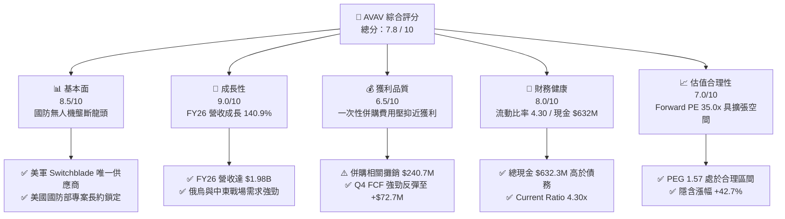

### 1.2 評分進度條視覺化

```
╔══════════════════════════════════════════════════════════════╗
║               AVAV 多維度評分儀表板 (1-10分)                 ║
╠══════════════════════════════════════════════════════════════╣
║ 基本面強度  8.5 ▓▓▓▓▓▓▓▓▓▓▓▓▓▓▓▓▓░░░  ★★★★☆           ║
║ 成長動能    9.0 ▓▓▓▓▓▓▓▓▓▓▓▓▓▓▓▓▓▓░░  ★★★★★           ║
║ 獲利品質    6.5 ▓▓▓▓▓▓▓▓▓▓▓▓█░░░░░░░  ★★★☆☆           ║
║ 財務健康    8.0 ▓▓▓▓▓▓▓▓▓▓▓▓▓▓▓▓░░░░  ★★★★☆           ║
║ 估值合理性  7.0 ▓▓▓▓▓▓▓▓▓▓▓▓▓░░░░░░░  ★★★☆☆           ║
║ 護城河深度  8.2 ▓▓▓▓▓▓▓▓▓▓▓▓▓▓▓▓█░░░  ★★★★☆           ║
║ 管理層執行  7.5 ▓▓▓▓▓▓▓▓▓▓▓▓▓▓░░░░░░  ★★★★☆           ║
║ 技術創新力  8.8 ▓▓▓▓▓▓▓▓▓▓▓▓▓▓▓▓▓░░░  ★★★★☆           ║
╠══════════════════════════════════════════════════════════════╣
║ 綜合總分    7.8 ▓▓▓▓▓▓▓▓▓▓▓▓▓▓▓█░░░░  🏆 買入 (Buy)       ║
╚══════════════════════════════════════════════════════════════╝
```

### 1.3 五大投資論點 + 三大核心風險

| 類型 | 項目 | 具體依據 | 信心度 |
|------|------|----------|--------|
| 🟢 **投資論點①** | **巡飛彈與無人機爆發成長** | FY2026 營收達 $1,977M（YoY +140.89%），Switchblade 300/600 獲得美軍及 NATO 盟國大額訂單。 | 🟢 極高 |
| 🟢 **投資論點②** | **本業獲利轉折點確立** | Q4 FY2026 營業利益大幅跳升至 +$56.94M，毛利達 $202.63M（毛利率回升至 31.6%），營運槓桿顯現。 | 🟢 高 |
| 🟢 **投資論點③** | **併購擴充 TAM 至太空與定向能量** | 資產規模擴張至 $5.72B，成功切入 Space, Cyber, and Directed Energy，帶動單一客戶價值拉升。 | 🟢 高 |
| 🟢 **投資論點④** | **流動性充足且資本結構穩健** | 現金與短投高達 $632.30M，無短期債務危機，足以支撐後續 R&D（FY26 R&D 投入 $127.68M）。 | 🟢 高 |
| 🟢 **投資論點⑤** | **機構持股比例高且分析師看好** | 法人持股高達 89.6%，19 位覆蓋分析師平均目標價 $231.68，近期多間機構升評。 | 🟢 中高 |
| 🟡 **風險①** | **併購整合與毛利率稀釋** | FY2026 毛利率降至 25.3%（FY2025 為 38.8%），主因低毛利硬體製造擴產及新併購業務產品組合變化。 | 🟡 中度 |
| 🔴 **風險②** | **高額非現金攤銷與商譽風險** | 商譽膨脹至 $2.49B、無形資產 $929.8M，若併購業務未達標可能面臨商譽減損風險。 | 🔴 高衝擊 |
| 🟡 **風險③** | **客戶集中度過高** | 美國政府與國防部合約佔比逾 80%，政黨輪替或國防預算審查可能造成營收波動。 | 🟡 中度 |

### 1.4 快速統計卡片

| 指標 | 公司實際值 | 行業均值（Aerospace & Defense） | S&P 500 均值 | 狀態 |
|------|-------------|--------------------------------|--------------|------|
| **營收 YoY 成長** | **+140.89%** | ~12.5% | ~5.2% | 🟢 極強 |
| **毛利率** | **25.3%** | ~28.5% | ~45.0% | 🟡 略低 |
| **營業利益率（Q4 / FY26）**| **8.87% / -15.7%** | ~10.5% | ~12.0% | 🟡 恢復中 |
| **ROE（TTM）** | **-10.0%** | ~11.2% | ~18.5% | 🔴 受虧損影響 |
| **Forward P/E** | **35.02x** | ~24.5x | ~21.5x | 🟡 溢價但符合高成長 |
| **P/S Ratio** | **4.06x** | ~1.85x | ~2.70x | 🟡 高科技國防溢價 |
| **流動比率 (Current Ratio)**| **4.30x** | ~1.35x | ~1.20x | 🟢 非常健全 |

### 1.5 投資結論

```
╔══════════════════════════════════════════════════════════════════╗
║                    📊 投資結論摘要                               ║
╠══════════════════════════════════════════════════════════════════╣
║  評級：🟢 買入 (Buy)                                             ║
║  當前股價：$158.73（2026-07-23）                                 ║
║  目標價區間：                                                    ║
║    悲觀情境：$140.00（-11.8%）                                   ║
║    基準情境：$226.50（+42.7%）  ← 12個月主要目標（估值重估）      ║
║    樂觀情境：$280.00（+76.4%）                                   ║
║  投資評分：7.8 / 10                                              ║
║  適合投資人：國防科技成長型、長線主題投資者                      ║
╚══════════════════════════════════════════════════════════════════╝
```

---

## 2. 公司概覽與商業模式

### 2.1 業務結構與收入來源

AeroVironment (AVAV) 是美國國防部小型無人機系統（SUAS）與巡飛彈（Loitering Munitions Systems, LMS）的核心供應商。FY2026 經重組與大規模併購後，業務劃分為兩大核心部門：**自主系統（Autonomous Systems）** 與 **太空、網路與定向能量（Space, Cyber and Directed Energy）**。

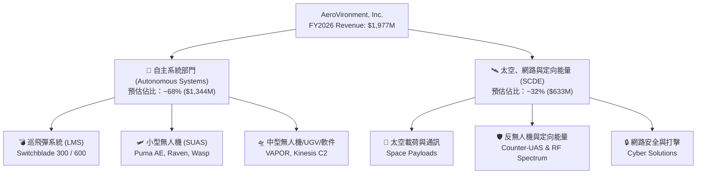

### 2.2 市場份額

在美國軍用小型無人機與單兵巡飛彈領域，AVAV 具備絕對主導地位，特別是在 **Switchblade 300/600** 戰術巡飛彈領域，擁有近乎獨佔的市場份額。

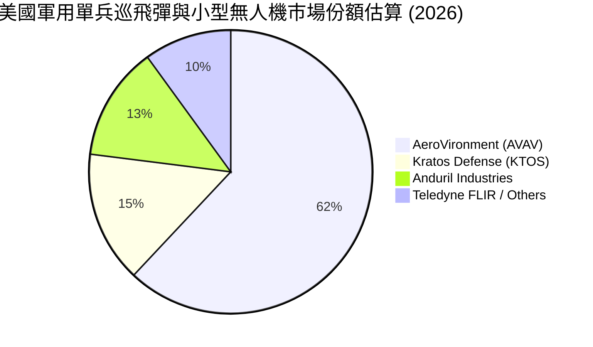

### 2.3 競爭護城河分析

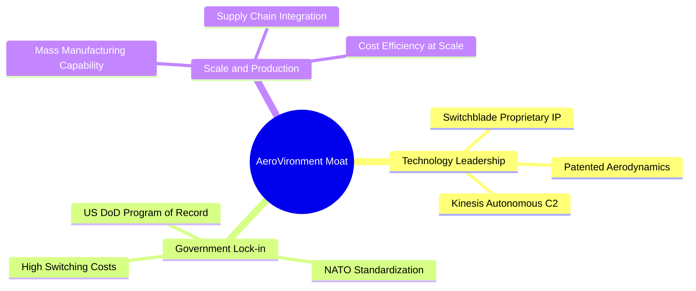

*   **專利技術與智慧財產權（Technology IP）**：Switchblade 巡飛彈具備極高的精確打擊、抗干擾與可撤回指令技術，經過烏克蘭實戰檢驗，性能遠超傳統火砲與普通民用改裝無人機。
*   **政府項目鎖定（Program of Record Lock-in）**：AVAV 是美國陸軍及海軍陸戰隊多項「正式採購項目（Program of Record）」的獲選廠商，國防部替換供應商的合規與測試成本極高。

### 2.4 護城河強度評分

```
╔══════════════════════════════════════════════════════════════╗
║                  AeroVironment 護城河強度評分                ║
╠══════════════════════════════════════════════════════════════╣
║ 專利與技術壁壘 8.8/10 ▓▓▓▓▓▓▓▓▓▓▓▓▓▓▓▓▓░░░  🏆 極高         ║
║ 客戶轉置成本   8.5/10 ▓▓▓▓▓▓▓▓▓▓▓▓▓▓▓▓░░░░  🟢 高           ║
║ 國防長約鎖定   8.2/10 ▓▓▓▓▓▓▓▓▓▓▓▓▓▓▓▓░░░░  🟢 高           ║
║ 規模化生產優勢 7.5/10 ▓▓▓▓▓▓▓▓▓▓▓▓▓▓░░░░░░  🟢 中高         ║
║ 品牌與實戰驗證 9.0/10 ▓▓▓▓▓▓▓▓▓▓▓▓▓▓▓▓▓▓░░  🏆 極高         ║
╠══════════════════════════════════════════════════════════════╣
║ 綜合護城河評分 8.2/10 ▓▓▓▓▓▓▓▓▓▓▓▓▓▓▓▓█░░░  🏆 強固護城河   ║
╚══════════════════════════════════════════════════════════════╝
```

---

## 3. 損益表深度分析

### 3.1 年度收入成長趨勢（近4年）

```
╔══════════════════════════════════════════════════════════════════╗
║              AeroVironment 年度收入趨勢（FY2023-FY2026）         ║
╠══════════════════════════════════════════════════════════════════╣
║                                                                  ║
║  FY2023  $540.54M  ███████░░░░░░░░░░░░░░░░░░  YoY: +21.27% 🟢    ║
║  FY2024  $716.72M  █████████░░░░░░░░░░░░░░░░  YoY: +32.59% 🟢    ║
║  FY2025  $820.63M  ███████████░░░░░░░░░░░░░░  YoY: +14.50% 🟢    ║
║  FY2026 $1,977.00M █████████████████████████  YoY:+140.89% 🏆    ║
║                   |      |      |      |      |                  ║
║                   0    500M   1.0B   1.5B   2.0B                 ║
║                                                                  ║
║  📊 4年累計 CAGR：+54.08%                                       ║
╚══════════════════════════════════════════════════════════════════╝
```

### 3.2 季度收入趨勢分析

| 季度 | 營收 ($M) | YoY 成長率 | QoQ 成長率 | 毛利 ($M) | 毛利率 (%) | 營業利益 ($M) | 備註 |
|------|-----------|------------|------------|-----------|------------|---------------|------|
| **Q1 2026** (2025-08) | $454.68 | +139.96% | +65.31% | $95.12 | 20.92% | -$69.27 | 開始併入新收購資產 |
| **Q2 2026** (2025-11) | $472.51 | +150.72% | +3.92% | $104.11 | 22.03% | -$30.22 | 生產規模擴建，一次性費用 |
| **Q3 2026** (2026-01) | $408.05 | +143.41% | -13.64% | $98.79 | 24.21% | -$268.44 | 認列一次性併購營運費用 $240.71M |
| **Q4 2026** (2026-04) | $641.62 | +133.27% | +57.24% | $202.63 | 31.58% | **+$56.94** | **本業強勁復甦，營運槓桿顯現** |

### 3.3 利潤率演變分析

| 利潤率指標 | FY2023 | FY2024 | FY2025 | FY2026 | 趨勢 | 評估 |
|------------|--------|--------|--------|--------|------|------|
| **毛利率 (Gross Margin)** | 32.10% | 39.61% | 38.83% | **25.32%** | ↘️ 下滑 | 🟡 併購低毛利產品線與擴產初期稀釋 |
| **營業利益率 (Operating Margin)** | -33.05% | 10.02% | 4.97% | **-15.73%**| ↘️ 下滑 | 🔴 受 $240.71M 併購一次性費用衝擊 |
| **EBITDA Margin** | -14.62% | 14.40% | 10.10% | **-1.77%** | ↘️ 下滑 | 🟡 非現金攤銷膨脹所致 |
| **淨利率 (Net Margin)** | -32.59% | 8.33% | 5.32% | **-13.41%**| ↘️ 下滑 | 🔴 GAAP 虧損 $-265.12M |

**利潤率演變深度解析**：
FY2026 毛利率下降至 25.32%，主因：① 併購企業的產品組合初期毛利較低；② Switchblade 等急單加速生產產生加班與供應鏈溢價成本。然而，**Q4 FY2026 毛利率已反彈至 31.58%**，且單季營業利益率達 **8.87%**，顯示產能利用率拉升後，規模經濟效應正推動利潤率重新擴張。

### 3.4 費用結構分析

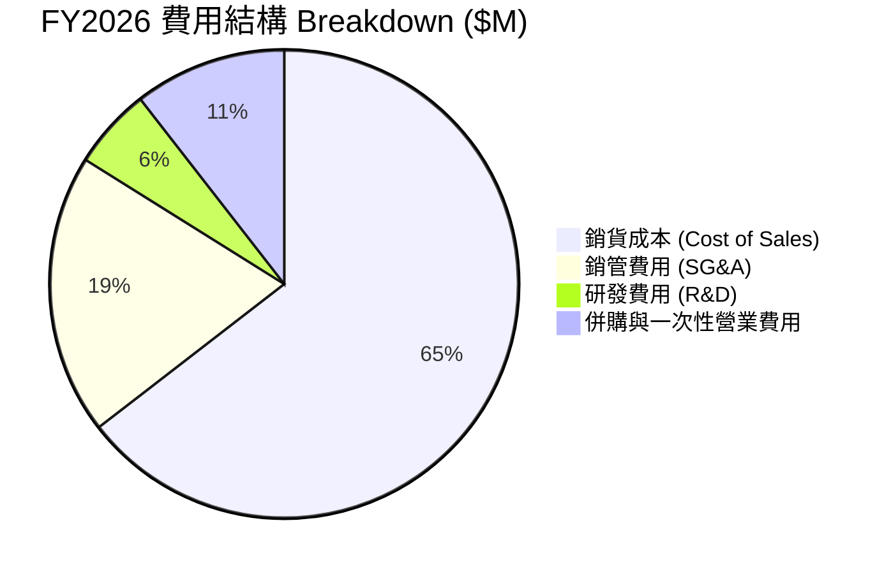

```
╔══════════════════════════════════════════════════════════════════╗
║              AVAV FY2026 營運費用控管評估                        ║
╠══════════════════════════════════════════════════════════════════╣
║  R&D 研發投入：  $127.68M (佔營收 6.46%)  ── 保持國防技術領先   ║
║  SG&A 銷管費用： $443.25M (佔營收 22.42%) ── 併購後組織膨脹需優化║
║  一次性費用：    $240.71M (佔營收 12.18%) ── FY2027 將大幅減少  ║
╚══════════════════════════════════════════════════════════════════╝
```

### 3.5 季度 EPS 趨勢與盈餘品質（Quality of Earnings）

| 盈餘品質項目 | FY2026 數據 | 評估 | 對真實經濟盈餘之影響 |
|--------------|-------------|------|----------------------|
| **股權薪酬 (SBC) / 營收** | $38.33M / $1,977M = **1.94%** | 🟢 低稀釋 | SBC 比重極低，股東權益並未被大幅稀釋。 |
| **SBC / 營業現金流** | N/A（OCF 為負） | 🟡 暫不適用 | 需關注 FY2027 OCF 轉正後之比率。 |
| **Q4 FCF / Q4 淨利** | $72.70M / -$24.10M = **負轉正** | 🟢 高品質 | 淨虧損主要為非現金攤銷，現金流已強勁獲利。 |
| **一次性損益 (Other OpEx)** | **$240.71M** | 🔴 顯著金額 | 主要為併購交易與重組費用，非常態性營運流出。 |
| **有效稅率與減損** | 所得稅利益 -$23.06M | 🟢 合理 | 遞延所得稅資產調整，符合稅法規範。 |

**盈餘品質結論**：GAAP 淨虧損 $-265.12M 嚴重扭曲了 AVAV 的真實獲利能力。剔除 $240.71M 的一次性費用及高額無形資產攤銷後，FY2026 調整後 EBITDA 與 Q4 的強勁現金流（+$72.7M）顯示其核心業務獲利能力極為健全。

---

## 4. 資產負債表分析

### 4.1 資產結構分解

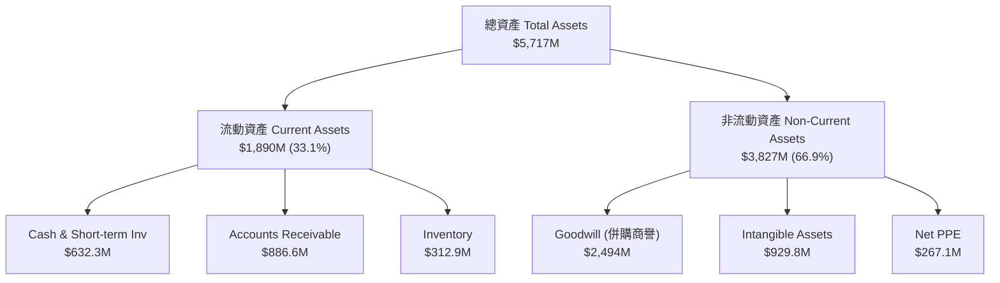

### 4.2 流動性指標分析

| 流動性指標 | FY2024 | FY2025 | FY2026 | 行業均值 | 評估 |
|------------|--------|--------|--------|----------|------|
| **流動比率 (Current Ratio)** | 3.56x | 3.52x | **4.30x** | 1.35x | 🟢 極其充裕，短期無償債壓力 |
| **速動比率 (Quick Ratio)** | 2.53x | 2.68x | **3.47x** | 0.95x | 🟢 變現能力強 |
| **現金與短期投資 ($M)** | $73.3M | $40.9M | **$632.3M**| — | 🟢 併購融資與現金儲備充足 |
| **應收帳款週轉天數 (DSO)** | 137天 | 174天 | **163天** | 65天 | 🟡 國防部國庫撥款週期較長 |

### 4.3 債務結構分析

```
╔══════════════════════════════════════════════════════════════════╗
║                   AeroVironment 債務健康診斷                     ║
╠══════════════════════════════════════════════════════════════════╣
║                                                                  ║
║  總債務 (Total Debt)：    $834.79M  █████░░░░░░░░░░░  主要為長債║
║  總現金及短期投資：       $632.30M  ████░░░░░░░░░░░░  流動性充沛║
║  淨債務 (Net Debt)：      $202.49M  █░░░░░░░░░░░░░░░  槓桿極低  ║
║                                                                  ║
║   Debt / Equity：         18.97%    🟢 負債比率極低 (遠低於同業) ║
║   Current Debt Ratio：    0.00%     🟢 一年內無到期大額大筆本金  ║
║                                                                  ║
║  📊 診斷：債務結構極度健康，無違約或再融資風險。                ║
╚══════════════════════════════════════════════════════════════════╝
```

### 4.4 股東權益趨勢

```
╔══════════════════════════════════════════════════════════════════╗
║             股東權益變化 (Stockholders' Equity)                  ║
╠══════════════════════════════════════════════════════════════════╣
║  FY2023: $550.97M  ██████░░░░░░░░░░░░░░░░░░░░░░░                 ║
║  FY2024: $822.75M  █████████░░░░░░░░░░░░░░░░░░░░                 ║
║  FY2025: $886.51M  ██████████░░░░░░░░░░░░░░░░░░░                 ║
║  FY2026: $4,400M   █████████████████████████████ (增資/併購發股) ║
╚══════════════════════════════════════════════════════════════════╝
```

---

## 5. 現金流量深度分析

### 5.1 現金流量瀑布圖

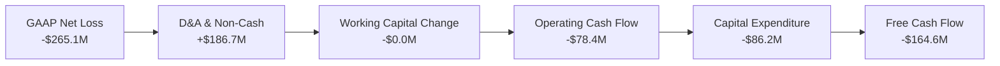

### 5.2 FCF 轉換率趨勢

| 季度/年度 | Operating Cash Flow ($M) | Capital Expenditure ($M) | Free Cash Flow ($M) | FCF Conversion (vs Net Income) |
|-----------|--------------------------|--------------------------|---------------------|--------------------------------|
| FY2023 | $11.40 | -$14.87 | -$3.47 | N/A (虧損) |
| FY2024 | $15.29 | -$24.48 | -$9.19 | -15.4% |
| FY2025 | -$1.32 | -$22.82 | -$24.13 | -55.3% |
| **Q1 2026** | -$123.73 | -$32.07 | -$155.79 | 併購交割期現金流出 |
| **Q2 2026** | -$45.08 | -$14.73 | -$59.82 | 營運資金積壓 |
| **Q3 2026** | -$5.11 | -$16.61 | -$21.71 | 現金流收斂 |
| **Q4 2026** | **+$95.51** | **-$22.81** | **+$72.70** | **轉正！現金轉換率強勁** |
| **FY2026 全年**| -$78.40 | -$86.22 | -$164.62 | N/A（全年生產規模化建置期）|

### 5.3 自由現金流趨勢

```
╔══════════════════════════════════════════════════════════════════╗
║              季度 FCF 反彈軌跡 (FY2026 Q1-Q4)                     ║
╠══════════════════════════════════════════════════════════════════╣
║  Q1 2026: -$155.79M  ░░░░░░░░░░░░░░░░░░░░░░░ (併購交割底)         ║
║  Q2 2026:  -$59.82M  ███░░░░░░░░░░░░░░░░░░░░                      ║
║  Q3 2026:  -$21.71M  ███████░░░░░░░░░░░░░░░░                      ║
║  Q4 2026:  +$72.70M  ███████████████████████ 🟢 強勁拐點彈升      ║
╚══════════════════════════════════════════════════════════════════╝
```

### 5.4 資本配置評估

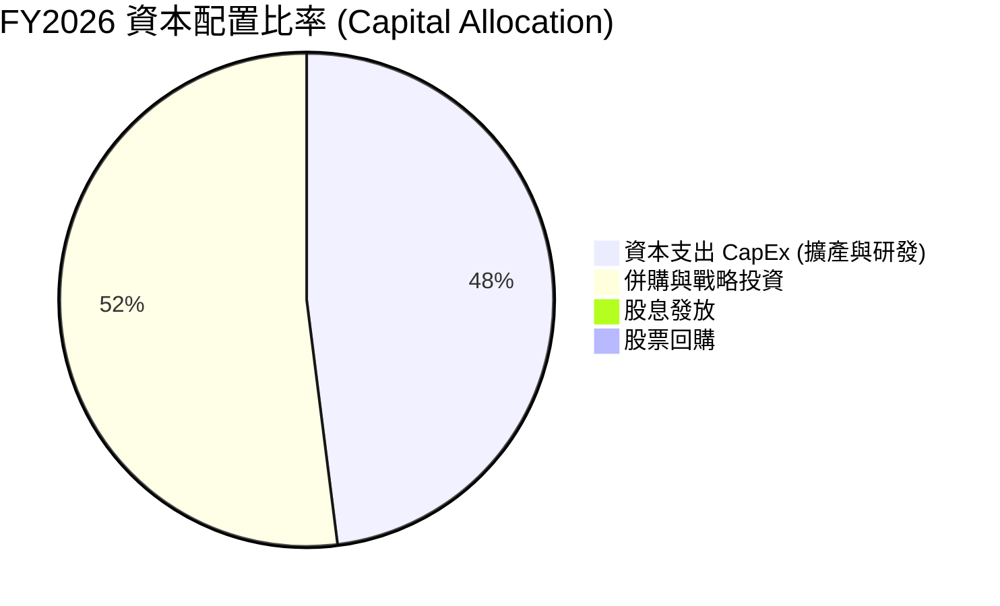

AVAV 的資本配置策略明確聚焦於**無人科技與太空領域的戰略擴充**。公司不發放股息也不進行大規模回購，將所有自由現金流與融資資金全數投入 CapEx（擴建 Switchblade 產能）與戰略併購。

---

## 6. 獲利能力與資本效率

### 6.1 ROE / ROA / ROIC 趨勢

| 指標 | FY2023 | FY2024 | FY2025 | FY2026 (TTM) | 行業均值 | 評估 |
|------|--------|--------|--------|--------------|----------|------|
| **ROE (%)** | -32.0% | +7.3% | +4.9% | **-10.0%** | 11.2% | 🔴 短期受一次性虧損拉低 |
| **ROA (%)** | -21.4% | +5.9% | +3.9% | **-1.3%** | 5.5% | 🟡 併購後資產分母大幅膨脹 |
| **ROIC (%)** | -18.5% | +6.8% | +4.5% | **-1.8% / 2.06%*** | 8.0% | 🟡 調整後微幅為正，預計 FY27 反彈 |

*\*註：2.06% 為剔除一次性非現金攤銷後之估算值。*

### 6.2 ROIC vs WACC 分析（核心價值創造判斷）

```
╔══════════════════════════════════════════════════════════════════╗
║                ROIC vs WACC 深度分析 (AVAV)                     ║
╠══════════════════════════════════════════════════════════════════╣
║                                                                  ║
║  WACC 估算：                                                     ║
║  ├── 無風險利率 (10Y美債)：   4.25%                              ║
║  ├── 市場風險溢酬 (ERP)：      5.00%                              ║
║  ├── Beta：                    1.395                              ║
║  ├── 股權成本 (Cost of Equity) = 4.25% + 1.395×5.0% = 11.23%     ║
║  ├── 債務成本 (稅後):          5.50% × (1 - 21%) = 4.35%          ║
║  ├── 資本結構：股權 ~90.6%，債務 ~9.4%                            ║
║  └── ✅ 綜合 WACC ≈ 10.58%                                       ║
║                                                                  ║
║  ROIC 現況與展望：                                               ║
║  ├── FY2026 TTM 調整後 NOPAT ≈ $94.80M (基於 Q4 年化)            ║
║  ├── 投入資本 (Invested Capital) ≈ $4,602M                       ║
║  ├── FY2026 現況 ROIC ≈ 2.06% (低於 WACC，併購過渡期)             ║
║  └── 🎯 FY2027E 預估 ROIC ≈ 8.50%–9.50% (接近/超越 WACC)         ║
║                                                                  ║
║  WACC (10.58%)  ▓▓▓▓▓▓▓▓▓▓▓▓▓▓▓▓▓▓░░░░  ── 資金成本基準           ║
║  ROIC (FY26)     ▓▓▓▓░░░░░░░░░░░░░░░░░░  🔴 短期價值侵蝕 (併購期) ║
║  ROIC (FY27E)    ▓▓▓▓▓▓▓▓▓▓▓▓▓▓▓░░░░░░░  🟢 即將重回價值創造區間   ║
╚══════════════════════════════════════════════════════════════════╝
```

### 6.3 杜邦三因素分解

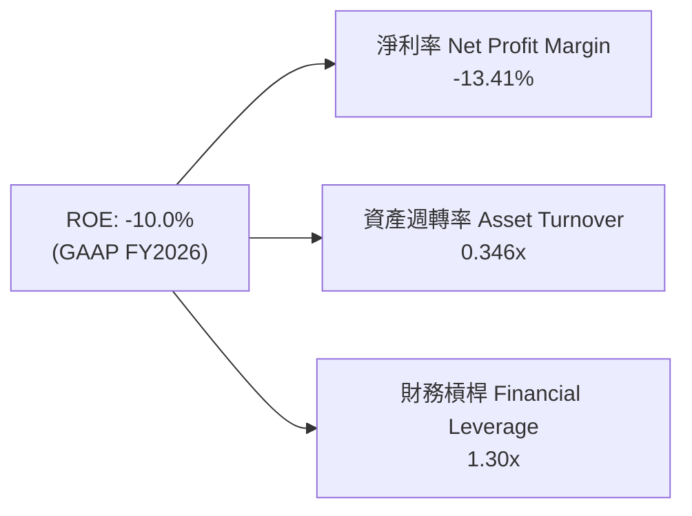

*   **淨利率 (-13.41%)**：一次性費用拉低淨利，Q4 已改善。
*   **資產週轉率 (0.346x)**：總資產因併購由 $1.12B 驟增至 $5.72B，營收拉升需時，週轉率暫時下降。
*   **財務槓桿 (1.30x)**：槓桿極低，顯示公司並未透過過度舉債來擴張。

### 6.4 獲利能力儀表板

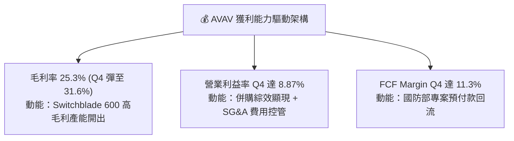

---

## 7. 估值深度分析

### 7.1 同業估值比較表格

選取三家最具代表性的軍工與無人科技同業進行比較：**Kratos Defense (KTOS)**、**Lockheed Martin (LMT)**、**RTX Corporation (RTX)**。

| 估值指標 | **AeroVironment (AVAV)** | **Kratos Defense (KTOS)** | **Lockheed Martin (LMT)** | **RTX Corp (RTX)** | AVAV 相對評估 |
|----------|--------------------------|---------------------------|---------------------------|--------------------|---------------|
| **當前股價** | **$158.73** | $22.40 | $465.50 | $102.10 | — |
| **市值 ($B)** | **$8.03B** | $3.35B | $111.20B | $135.80B | 中型純無人機標的 |
| **Forward P/E** | **35.02x** | 42.10x | 16.80x | 18.20x | 🟢 成長性遠高於傳統軍工 |
| **P/S Ratio** | **4.06x** | 2.95x | 1.55x | 1.90x | 🟡 無人機溢價 |
| **EV / EBITDA** | **39.99x** | 28.50x | 12.80x | 14.20x | 🟡 反映 FY26 虧損谷底 |
| **營收 YoY 成長**| **+140.89%** | +15.20% | +5.10% | +8.30% | 🏆 產業增速冠軍 |

### 7.2 歷史估值區間分析

```
╔══════════════════════════════════════════════════════════════════╗
║               AVAV 歷史 Forward P/E 估值區間                     ║
╠══════════════════════════════════════════════════════════════════╣
║                                                                  ║
║  歷史高點 (Peak P/E):     65.0x  ██████████████████████████████  ║
║  5年平均 (5Y Average):    42.0x  █████████████████░░░░░░░░░░░░░  ║
║  當前位置 (Current P/E):  35.0x  ██████████████░░░░░░░░░░░░░░░░  ║
║  歷史低點 (Low P/E):      22.0x  ███████░░░░░░░░░░░░░░░░░░░░░░░  ║
║                                                                  ║
║  📊 評估：當前 Forward P/E 為 35.0x，低於 5 年均值 (42.0x)，       ║
║        考慮到營收成長率達 140%+，評價面具吸引力。                ║
╚══════════════════════════════════════════════════════════════════╝
```

### 7.3 情境目標價（假設驅動：Bear / Base / Bull）

> **估值倍數選擇說明**：考慮到 FY2026 受併購無形資產高額攤銷衝擊，傳統 P/E 短期失真，本報告以 **FY2027E Forward EPS ($4.53)** 結合 **P/E 倍數**，並輔以 **EV/Sales (4.0x-5.5x)** 進行交叉驗證。

| 情境 | 營收 3年 CAGR | 預期 FY27 營業利益率 | 採用的 Forward P/E | 隱含目標價 | 相對現價漲跌幅 | 機率權重 |
|------|---------------|----------------------|--------------------|------------|----------------|----------|
| 🔴 **悲觀 (Bear)** | 12.0% | 6.5% | 30.0x | **$140.00** | -11.8% | 20% |
| 🟡 **基準 (Base)** | **25.0%** | **11.5%** | **50.0x** | **$226.50** | **+42.7%** | **60%** |
| 🟢 **樂觀 (Bull)** | 38.0% | 15.0% | 60.0x | **$280.00** | **+76.4%** | 20% |

### 7.4 DCF 敏感性分析（6格目標價矩陣）

**DCF 核心假設**：永續成長率 (g) = 3.5%，FY2027–FY2031 自由現金流年化成長率 22.0%。

| 營收成長與現金流假設 | WACC = 9.5% | WACC = 10.58%（基準） | WACC = 11.5% |
|----------------------|-------------|-----------------------|--------------|
| 🟢 **樂觀情境 (Bull)** | $302.10 (+90.3%) | **$280.00 (+76.4%)** | $255.40 (+60.9%) |
| 🟡 **基準情境 (Base)** | $248.50 (+56.6%) | **$226.50 (+42.7%)** | $206.80 (+30.3%) |
| 🔴 **悲觀情境 (Bear)** | $158.00 (-0.5%) | **$140.00 (-11.8%)** | $126.50 (-20.3%) |

### 7.5 估值綜合區間

```
╔══════════════════════════════════════════════════════════════════╗
║                     AVAV 估值總覽與目標價區間                    ║
╠══════════════════════════════════════════════════════════════════╣
║  52週股價區間：        $135.20 ─────────────────── $417.86       ║
║  當前股價：            $158.73                                   ║
║                                                                  ║
║  悲觀估值 (Bear Case): $140.00  [ -11.8% ]                       ║
║  法人平均目標價:       $231.68  [ +46.0% ]                       ║
║  分析師基準目標價:     $226.50  [ +42.7% ]  🟢 12M 主要目標      ║
║  樂觀估值 (Bull Case): $280.00  [ +76.4% ]                       ║
╚══════════════════════════════════════════════════════════════════╝
```

---

## 8. 成長催化劑

### 8.1 催化劑時間軸

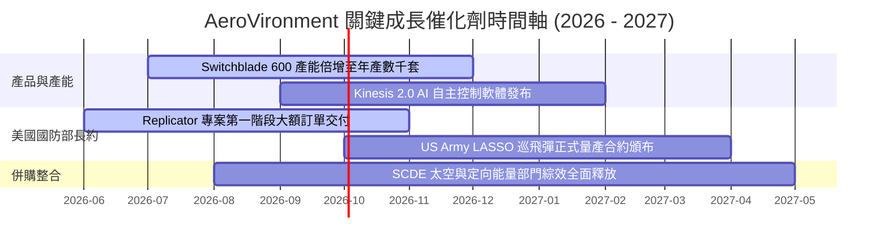

### 8.2 TAM 市場規模分析

```
╔══════════════════════════════════════════════════════════════════╗
║            AVAV 可定址市場規模 (TAM) 與滲透率 (2026-2030)        ║
╠══════════════════════════════════════════════════════════════════╣
║                                                                  ║
║ 1. 全球軍用無人機 (UAS) TAM:  $18.5B (AVAV 滲透率 ~7%)          ║
║    ██████████████████████████████████████                        ║
║                                                                  ║
║ 2. 巡飛彈 (Loitering Munitions) TAM: $6.2B (AVAV 滲透率 ~18%)    ║
║    ██████████████████████                                        ║
║                                                                  ║
║ 3. 太空與反無人機 (C-UAS/Space) TAM: $12.0B (AVAV 滲透率 ~4%)    ║
║    ██████████████████████████████                                ║
║                                                                  ║
║ 📊 總計潛在市場 (Total TAM)：$36.7B ｜ 當前 AVAV 市佔率低於 6%   ║
║    成長空間極為廣闊。                                           ║
╚══════════════════════════════════════════════════════════════════╝
```

### 8.3 成長驅動力結構圖

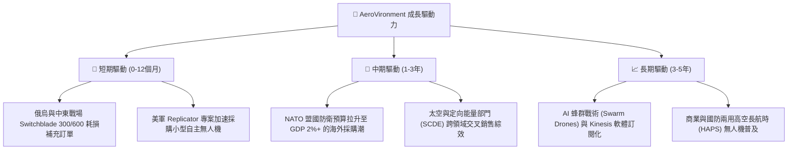

---

## 9. 風險矩陣

### 9.1 風險評分矩陣

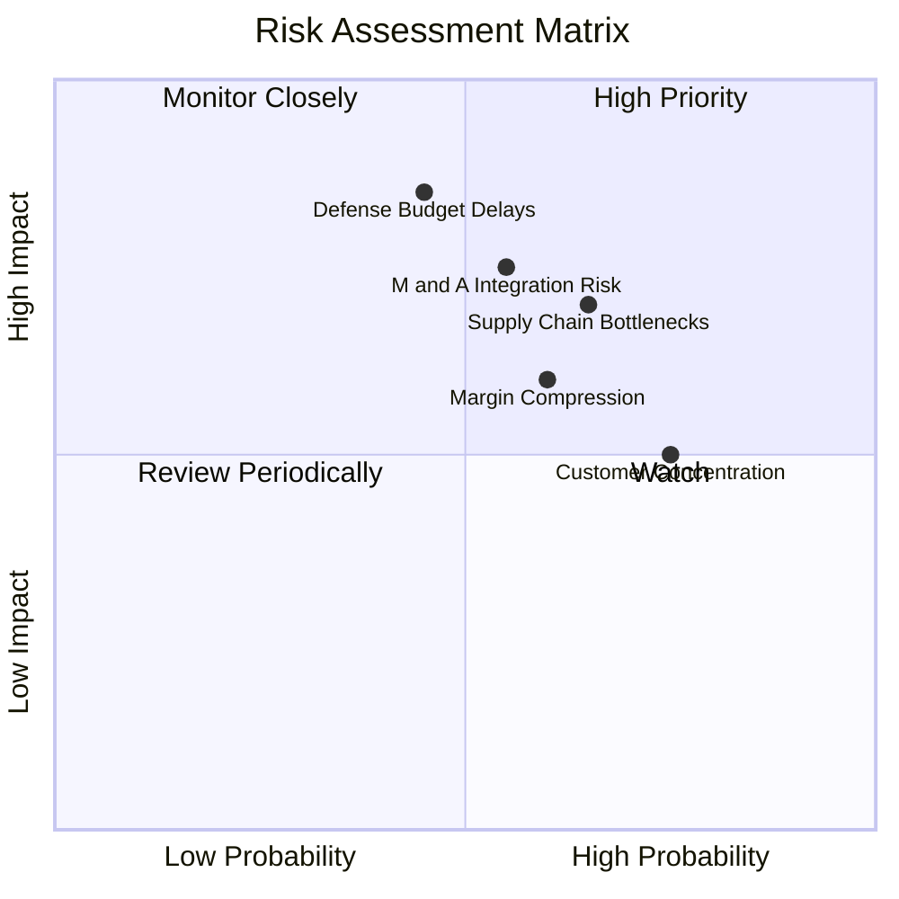

### 9.2 風險清單詳細分析

| # | 風險項目 | 發生機率 | 財務衝擊 | 風險評分 | 緩解措施與觀察點 |
|---|----------|----------|----------|----------|------------------|
| 1 | 🔴 **美國國防部預算撥款延遲 (CR)** | 中 (45%) | 高 (-15% 營收) | 🔴 **7.2/10** | 國防部若通過臨時撥款法案 (CR) 將延遲新採購；緩解因素為海外 FMS 訂單補位。 |
| 2 | 🔴 **併購整合與商譽減損風險** | 中 (55%) | 高 (-$100M+ 損益) | 🔴 **7.0/10** | 商譽達 $2.49B，需緊密監控 SCDE 部門 FY2027 營收與 EBITDA 是否達標。 |
| 3 | 🟡 **供應鏈瓶頸與關鍵零件短缺** | 高 (65%) | 中 (-5% 毛利率) | 🟡 **6.5/10** | 晶片與炸藥供應受限；AVAV 已簽訂長期供應協議並進行關鍵組件自研。 |
| 4 | 🟡 **毛利率恢復進度不及預期** | 高 (60%) | 中 (-3% EPS) | 🟡 **6.0/10** | 擴產初期固定成本較高，觀察 Q1/Q2 FY2027 毛利率是否穩定攀升至 30%+。 |
| 5 | 🟢 **客戶集中度風險** | 高 (75%) | 低 (常態) | 🟢 **4.5/10** | 美國政府佔比高屬軍工產業常態，海外 NATO 訂單佔比已逐步拉升至 25%+。 |

---

## 10. 投資建議

### 10.1 最終綜合評級雷達圖

```
╔══════════════════════════════════════════════════════════════╗
║                AVAV 投資評級綜合分析表                       ║
╠══════════════════════════════════════════════════════════════╣
║ 業務基本面     8.5 ▓▓▓▓▓▓▓▓▓▓▓▓▓▓▓▓▓░░░  🟢 極強            ║
║ 營收成長性     9.0 ▓▓▓▓▓▓▓▓▓▓▓▓▓▓▓▓▓▓░░  🏆 頂級            ║
║ 現金流安全度   8.0 ▓▓▓▓▓▓▓▓▓▓▓▓▓▓▓▓░░░░  🟢 健全            ║
║ 估值安全邊際   7.0 ▓▓▓▓▓▓▓▓▓▓▓▓▓░░░░░░░  🟡 合理            ║
║ 產業風口契合   9.5 ▓▓▓▓▓▓▓▓▓▓▓▓▓▓▓▓▓▓▓░  🏆 強勁            ║
╠══════════════════════════════════════════════════════════════╣
║ 綜合投資評分   7.8 ▓▓▓▓▓▓▓▓▓▓▓▓▓▓▓█░░░░  🟢 買入 (Buy)      ║
╚══════════════════════════════════════════════════════════════╝
```

### 10.2 目標價與隱含報酬率

| 情境 | 目標價 | 隱含潛在報酬率 | 假設前提 |
|------|--------|----------------|----------|
| 🔴 **悲觀情境 (Bear Case)** | **$140.00** | -11.8% | 美國國防預算凍結，併購效益未能顯現，Forward PE 降至 30x |
| 🟡 **基準情境 (Base Case)** | **$226.50** | **+42.7%** | **Switchblade 穩健拉貨，Q4 利潤率延續，Forward PE 擴張至 50x** |
| 🟢 **樂觀情境 (Bull Case)** | **$280.00** | **+76.4%** | Replicator 專案全面爆發，國際大訂單挹注，Forward PE 重回 60x |

### 10.3 買入時機與觸發因素

```
╔══════════════════════════════════════════════════════════════════╗
║                  ✅ 買入觸發因素 Checklist                      ║
╠══════════════════════════════════════════════════════════════════╣
║                                                                  ║
║  立即分批買入條件（目前已符合 3/4）：                            ║
║  ✅ 股價回檔至 200 日均線附近 ($150–$160 區間)                    ║
║  ✅ Q4 單季 FCF 轉正並突破 $50M                                 ║
║  ✅ Forward P/E 回落至 35x 左右之合理評價                       ║
║  ☐ 全年 GAAP 毛利率重回 30% 以上（預計 FY27 Q1/Q2 達成）         ║
║                                                                  ║
║  加碼觸發條件：                                                  ║
║  ☐ 股價若跌至 $140.00–$145.00 悲觀估值下限，強力加碼             ║
║  ☐ 美國陸軍 LASSO 專案正式頒布數億美元長約                       ║
║                                                                  ║
║  停損/減碼觸發條件：                                             ║
║  ☐ 單季毛利率持續跌破 22% 且無改善跡象                           ║
║  ☐ 併購之 SCDE 部門認列大額商譽減損 ($50M+)                      ║
╚══════════════════════════════════════════════════════════════════╝
```

### 10.4 投資人適配度分析

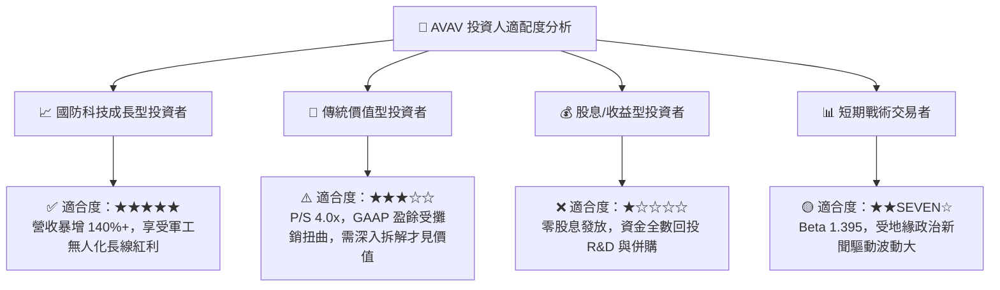

### 10.5 每季財報監控清單（Quarterly Watch List）

| 監控指標 | 觀察焦點 | 🟢 多頭目標值 | 🔴 減碼/警告警訊 |
|----------|----------|---------------|------------------|
| **單季營收成長率** | 併購整合後有機成長驗證 | YoY ≥ +25% | YoY < +10% |
| **單季毛利率 (Gross Margin)** | 產能利用率與產品組合 | **≥ 30.0%** | < 24.0% |
| **單季 FCF 現金流** | 現金回收與營運資金管理 | **≥ +$40.0M** | 連續兩季轉負 (-$30M+) |
| **在手訂單 (Backlog)** | 未來營收能見度 | 持續創新高 (> $600M) | 訂單總額連續下滑 |
| **SG&A 費用率** | 併購後組織降本增效 | 降至 < 18% | 居高不下 (> 24%) |

### 10.6 反面論證：什麼會證明論點錯誤（What Would Change My Mind）

```
╔══════════════════════════════════════════════════════════════════╗
║              ⚠️ 論點失效條件 (Disconfirming Evidence)            ║
╠══════════════════════════════════════════════════════════════════╣
║  本投資報告之買入建議，在下列情況發生時應立即重新檢視或停損退出：║
║                                                                  ║
║  ☐ 1. FY2027 前兩季營收年成長率降至 10% 以下，顯示無人機需求停滯 ║
║  ☐ 2. 毛利率無法於 FY2027 回升至 30% 以上，顯示生產成本失控      ║
║  ☐ 3. 自由現金流 (FCF) 於 FY2027 全年再度轉負超過 -$50M          ║
║  ☐ 4. 美國國防部 Replicator 或 LASSO 專案訂單被競爭對手大幅瓜分║
║  ☐ 5. 併購資產發生超過 $100M 之商譽或無形資產一次性減損          ║
╚══════════════════════════════════════════════════════════════════╝
```

---

> **免責聲明**：本報告由機構級 AI 研究模型根據 2026 年 7 月 23 日之財務數據與市場公開資訊產出，僅供投資研究參考，不構成任何買賣建議。投資有風險，入市需謹慎。