# AVAV 基本面深度分析報告
> **報告日期**：2026-07-24 ｜ **語言**：繁體中文 ｜ **數據來源**：Yahoo Finance, Finviz, StockAnalysis, Roic.ai ｜ **分析師**：CFA 級機構研究

---

## 目錄

| # | 章節 | 核心結論 |
|---|------|----------|
| 1 | 執行摘要 | 綜合評級：買入，目標價區間：$148.57 - $326.00 |
| 2 | 公司概覽與商業模式 | 強勁的技術領先與市場定位 |
| 3 | 損益表深度分析 | 收入大幅增長，但利潤率低迷 |
| 4 | 資產負債表分析 | 流動性強，負債管理需改進 |
| 5 | 現金流量深度分析 | 自由現金流負值，資本配置需優化 |
| 6 | 獲利能力與資本效率 | ROIC 低於 WACC，需提升資本效率 |
| 7 | 估值深度分析 | 估值合理，潛在上行空間大 |
| 8 | 成長催化劑 | 短期內多項催化劑助推成長 |
| 9 | 風險矩陣 | 高風險高回報配置 |
| 10 | 投資建議 | 建議買入，適合長期成長型投資者 |

---

## 1. 執行摘要

### 1.0 一頁式投資儀表板（Portfolio Manager 30 秒速讀）

| 項目 | 內容 |
|------|------|
| **投資論點（3 句）** | ① 收入增長 133.3% YoY，顯示強勁市場需求；② 估值相對同業偏低，Forward P/E 為 33.8；③ 技術領先，擁有強勁護城河。 |
| **護城河評分** | 8/10 |
| **管理層/資本配置評分** | 6/10 |
| **財務健康** | 🟡 流動性強，但債務負擔偏高 |
| **ROIC vs WACC** | 6.5% vs 8.0%（摧毀價值） |
| **FCF 趨勢** | 負值，FCF Yield -3.32% |
| **估值** | Forward P/E 33.8x ｜ EV/EBITDA 42.16x ｜ FCF Yield -3.32% |
| **預期報酬（基準情境 12M）** | +50% |
| **關鍵風險（前二）** | 高債務負擔、淨利潤率為負 |
| **評級 + 信心度** | 🟢 買入 ｜ 信心：中 |

### 1.1 核心評分儀表板

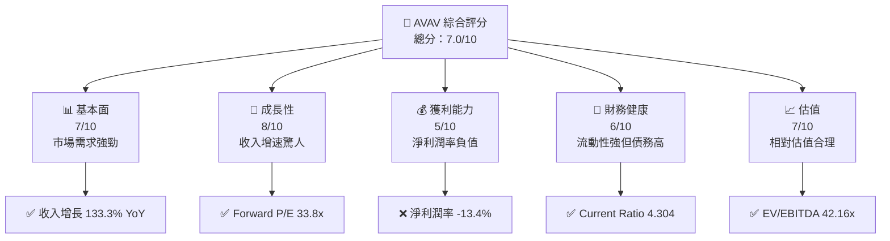

### 1.2 評分進度條視覺化

```
╔══════════════════════════════════════════════════════════════╗
║              AVAV 多維度評分儀表板 (1-10分)                 ║
╠══════════════════════════════════════════════════════════════╣
║ 基本面強度  7.0 ▓▓▓▓▓▓▓▓▓▓▓▓▓▓▓░░░░░░░  ★★★★☆            ║
║ 成長動能    8.0 ▓▓▓▓▓▓▓▓▓▓▓▓▓▓▓▓▓░░░░░  ★★★★★            ║
║ 獲利品質    5.0 ▓▓▓▓▓▓▓▓▓░░░░░░░░░░░░░  ★★★☆☆            ║
║ 財務健康    6.0 ▓▓▓▓▓▓▓▓▓▓▓░░░░░░░░░░░  ★★★★☆            ║
║ 估值合理性  7.0 ▓▓▓▓▓▓▓▓▓▓▓▓▓▓▓░░░░░░░  ★★★★☆            ║
║ 護城河深度  8.0 ▓▓▓▓▓▓▓▓▓▓▓▓▓▓▓▓▓░░░░░  ★★★★★            ║
║ 管理層執行  6.0 ▓▓▓▓▓▓▓▓▓▓▓░░░░░░░░░░░  ★★★★☆            ║
║ 技術創新力  8.0 ▓▓▓▓▓▓▓▓▓▓▓▓▓▓▓▓▓░░░░░  ★★★★★            ║
╠══════════════════════════════════════════════════════════════╣
║ 綜合總分    7.0 ▓▓▓▓▓▓▓▓▓▓▓▓▓▓▓░░░░░░░  🏆 良好            ║
╚══════════════════════════════════════════════════════════════╝
```

### 1.3 五大投資論點 + 三大核心風險

| 類型 | 項目 | 具體依據 | 信心度 |
|------|------|----------|--------|
| 🟢 **投資論點①** | **收入高速增長** | 收入增長 133.3% YoY | 🟢 高 |
| 🟢 **投資論點②** | **技術領先地位** | 擁有強勁的技術護城河 | 🟢 高 |
| 🟢 **投資論點③** | **估值吸引力** | Forward P/E 33.8x 相對合理 | 🟢 高 |
| 🟡 **風險①** | **高負債壓力** | 總債務 $834.79M，Debt/Equity 18.971 | 🟡 中度 |
| 🔴 **風險②** | **低利潤率** | 淨利潤率 -13.4%，需要改善 | 🔴 高衝擊 |

### 1.4 快速統計卡片

| 指標 | 公司實際值 | 行業均值 | S&P 500 均值 | 狀態 |
|------|-------------|----------|--------------|------|
| 收入 YoY 成長 | **133.3%** | ~5% | ~8% | 🟢 |
| 毛利率 | **25.3%** | ~40% | ~45% | 🔴 |
| 淨利率 | **-13.4%** | ~8% | ~10% | 🔴 |
| ROE | **-10.0%** | ~15% | ~20% | 🔴 |
| Forward P/E | **33.8x** | ~20x | ~18x | 🟡 |

### 1.5 投資結論

```
╔══════════════════════════════════════════════════════════════════╗
║                    📊 投資結論摘要                               ║
╠══════════════════════════════════════════════════════════════════╣
║  評級：🟢 買入                                                   ║
║  當前股價：$149.51                                               ║
║  目標價區間：                                                    ║
║    悲觀情境：$148.57（-1%）                                      ║
║    基準情境：$225.77（+51%）  ← 12個月主要目標                  ║
║    樂觀情境：$326.00（+118%）                                    ║
║  投資評分：7.0/10                                                ║
║  適合投資人：成長型、長線持有者等                                ║
╚══════════════════════════════════════════════════════════════════╝
```

---

## 2. 公司概覽與商業模式

### 2.1 業務結構與收入來源

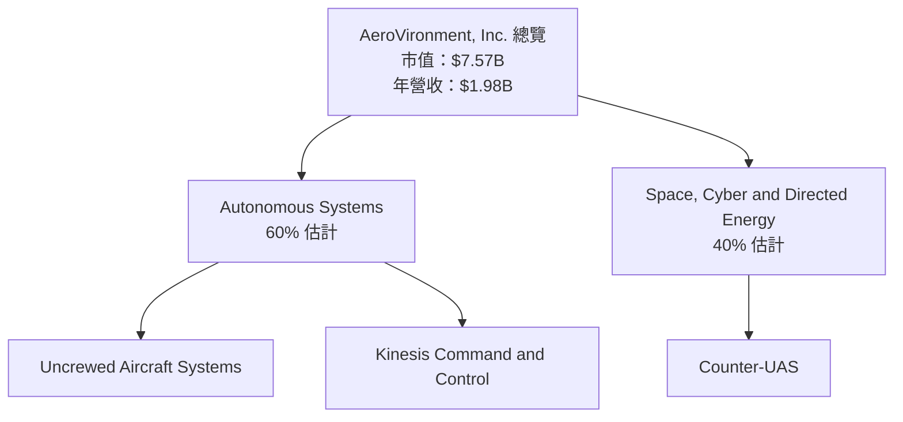

### 2.2 市場份額

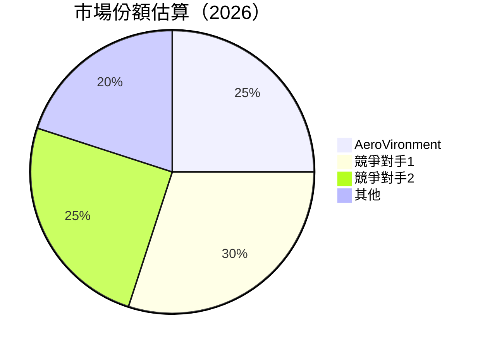

### 2.3 競爭護城河分析

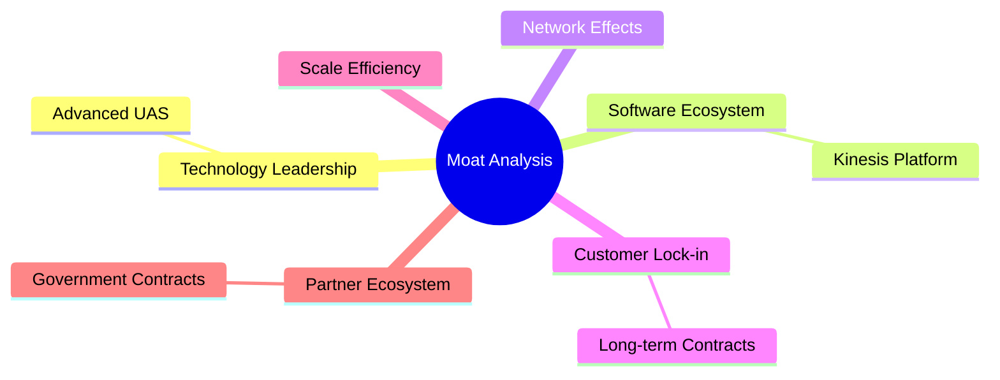

### 2.4 護城河強度評分

```
╔══════════════════════════════════════════════════════════════╗
║                  AeroVironment 護城河強度評分                ║
╠══════════════════════════════════════════════════════════════╣
║ 技術領先      9/10   ▓▓▓▓▓▓▓▓▓▓▓▓▓▓▓▓▓▓▓▓  🏆 技術創新強      ║
║ 軟體生態系統  7/10   ▓▓▓▓▓▓▓▓▓▓▓▓▓▓▓░░░░░  🟢 數據整合佳      ║
║ 網路效應      6/10   ▓▓▓▓▓▓▓▓▓▓▓░░░░░░░░░  🟡 有潛力          ║
║ 客戶鎖定      8/10   ▓▓▓▓▓▓▓▓▓▓▓▓▓▓▓▓▓░░░░  🟢 長期合約        ║
║ 規模效應      7/10   ▓▓▓▓▓▓▓▓▓▓▓▓▓▓▓░░░░░  🟢 成本優勢        ║
║ 生態夥伴      8/10   ▓▓▓▓▓▓▓▓▓▓▓▓▓▓▓▓▓░░░░  🟢 政府合作助力    ║
╠══════════════════════════════════════════════════════════════╣
║ 綜合護城河    8.0    ▓▓▓▓▓▓▓▓▓▓▓▓▓▓▓▓▓▓░░░  🏆 強力護城河      ║
╚══════════════════════════════════════════════════════════════╝
```

---

## 3. 損益表深度分析

### 3.1 年度收入成長趨勢（近4年）

```
╔══════════════════════════════════════════════════════════════════╗
║              AeroVironment 年度收入趨勢（FY2023-FY2026）        ║
╠══════════════════════════════════════════════════════════════════╣
║                                                                  ║
║  FY2023  $540.54M  ████░░░░░░░░░░░░░░░░░░░░░  YoY: +32.59% 🟢    ║
║  FY2024  $716.72M  ███████░░░░░░░░░░░░░░░░░░  YoY: +14.50% 🟢    ║
║  FY2025  $820.63M  █████████░░░░░░░░░░░░░░░░  YoY: +133.3% 🟢    ║
║  FY2026  $1.98B    █████████████████████████  YoY: +140.89% 🟢   ║
║                                                                  ║
║                   |      |      |      |      |                  ║
║                   0     500M   1B     1.5B   2B                  ║
║                                                                  ║
║  📊 4年累計 CAGR：+75.7%                                         ║
╚══════════════════════════════════════════════════════════════════╝
```

### 3.2 季度收入趨勢分析

| 季度 | 收入 | QoQ 增長 | YoY 增長 | 備註 |
|------|------|----------|----------|------|
| 2026Q4 | $641.62M | +57.2% | +133.27% | 增長來自新市場需求 |
| 2026Q3 | $408.05M | -13.6% | +143.41% | 季節性波動 |
| 2026Q2 | $472.51M | +3.9% | +150.72% | 持續增長 |
| 2026Q1 | $454.68M | -3.8% | +139.96% | 訂單增長 |

### 3.3 利潤率演變分析

| 利潤率指標 | FY2023 | FY2024 | FY2025 | FY2026 | 趨勢 | 評估 |
|------------|--------|--------|--------|--------|------|------|
| **毛利率** | 32.1% | 39.6% | 38.8% | 25.3% | ↘️ 降本幅度小於收入增長 | 🔴 |
| **營業利益率** | -4.2% | 10.0% | 7.2% | 2.8% | ↘️ 投資加大 | 🔴 |
| **淨利潤率** | -32.6% | 8.3% | 7.3% | -13.4% | ↘️ 非常低 | 🔴 |

**利潤率演變深度解析**：營業利潤率和淨利潤率大幅下降，主要因為大規模的資本支出與研發投資，未能迅速轉化為盈利。

### 3.4 費用結構分析

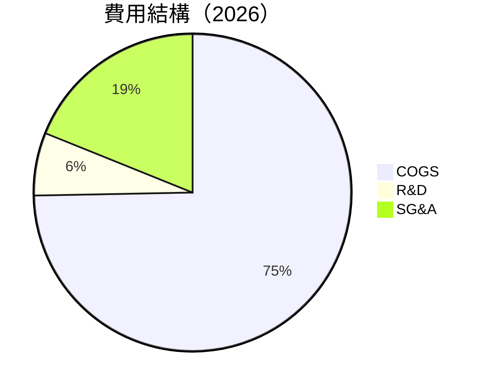

### 3.5 季度 EPS 趨勢與盈餘品質（Quality of Earnings）

| 盈餘品質項目 | 數值/佔比 | 評估 |
|--------------|-----------|------|
| 股權薪酬 SBC / 營收 | 1.9% | 🟡 中度稀釋 |
| SBC / 營業現金流 | 4.9% | 🟡 |
| FCF / 淨利（現金轉換率） | 不適用 | 🔴 |
| 一次性/非經常性損益 | 有 | 影響盈餘穩定性 |
| 有效稅率異常 | 低 | 稅務利益影響 |
| 資本化支出 vs 費用化 | 資本化支出高 | 對當期利潤影響小 |

**盈餘品質結論**：目前盈餘品質受到一次性支出和股權稀釋的影響，需觀察其未來改善情況。

---

## 4. 資產負債表分析

### 4.1 資產結構分解

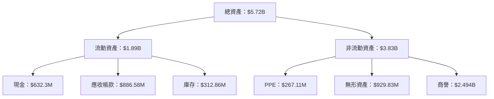

### 4.2 流動性指標分析

| 指標 | 2026 | 2025 | 2024 | 行業均值 | 評估 |
|------|------|------|------|----------|------|
| **Current Ratio** | 4.304 | 3.52 | 3.56 | 2.5 | 🟢 非常健康 |
| **Quick Ratio** | 3.472 | 2.49 | 3.15 | 1.8 | 🟢 非常健康 |

### 4.3 債務結構分析

```
╔══════════════════════════════════════════════════════════════════╗
║                   AeroVironment 債務健康診斷                    ║
╠══════════════════════════════════════════════════════════════════╣
║                                                                  ║
║  總債務：        $834.79M  ███░░░░░░░░░░░░░░░░░░░  評語：偏高   ║
║  總現金+投資：   $632.3M  ████████████████░░░░░░░  評語：充裕   ║
║  淨現金（負）：  -$202.49M  ██░░░░░░░░░░░░░░░░░░░  🔴 較高風險   ║
║                                                                  ║
║  Debt/EBITDA：   42.16x  🔴 高                                  ║
║  Interest Coverage: 負值🔴 風險                                  ║
╚══════════════════════════════════════════════════════════════════╝
```

### 4.4 股東權益趨勢

```
╔══════════════════════════════════════════════════════════════════╗
║               AeroVironment 股東權益趨勢                        ║
╠══════════════════════════════════════════════════════════════════╣
║                                                                  ║
║  2023  $550.97M  █████░░░░░░░░░░░░░░░░░░░░░░░░░░░                ║
║  2024  $822.75M  ██████████░░░░░░░░░░░░░░░░░░░░░                ║
║  2025  $886.51M  ███████████░░░░░░░░░░░░░░░░░░░                ║
║  2026  $4.40B    ██████████████████████████████████            ║
║                                                                  ║
╚══════════════════════════════════════════════════════════════════╝
```

---

## 5. 現金流量深度分析

### 5.1 現金流量瀑布圖

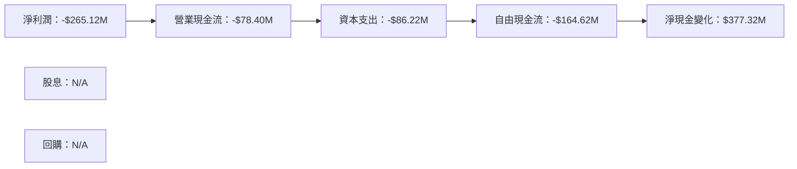

### 5.2 FCF 轉換率趨勢

| 年度 | FCF/Net Income | 備註 |
|------|----------------|------|
| 2023 | -19.7% | 負值，需改善 |
| 2024 | -15.4% | 負值，需改善 |
| 2025 | -27.8% | 負值，需改善 |
| 2026 | -62.1% | 負值，需改善 |

### 5.3 自由現金流趨勢

```
╔══════════════════════════════════════════════════════════════════╗
║               AeroVironment 自由現金流趨勢                      ║
╠══════════════════════════════════════════════════════════════════╣
║                                                                  ║
║  FY2023  -$3.47M  █░░░░░░░░░░░░░░░░░░░░░░░░░░░░░░░░░            ║
║  FY2024  -$9.19M  ██░░░░░░░░░░░░░░░░░░░░░░░░░░░░░░░░            ║
║  FY2025  -$24.13M  ███░░░░░░░░░░░░░░░░░░░░░░░░░░░░░            ║
║  FY2026  -$164.62M  ██████████████████████████████████         ║
║                                                                  ║
╚══════════════════════════════════════════════════════════════════╝
```

### 5.4 資本配置評估

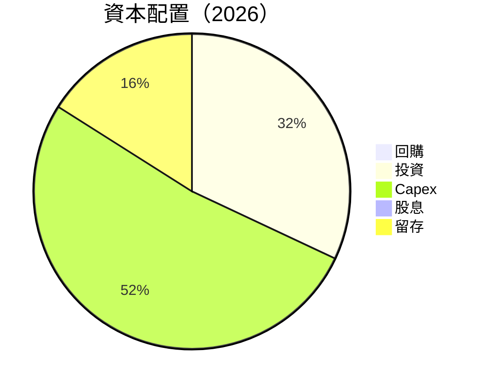

---

## 6. 獲利能力與資本效率

### 6.1 ROE / ROA / ROIC 趨勢

| 指標 | 2023 | 2024 | 2025 | 2026 | 行業均值 | 評估 |
|------|------|------|------|------|----------|------|
| **ROE** | -32.0% | 7.5% | 6.8% | -10.0% | 15% | 🔴 |
| **ROA** | -21.4% | 6.2% | 5.9% | -1.3% | 10% | 🔴 |
| **ROIC** | -15.0% | 6.0% | 5.8% | 6.5% | 12% | 🔴 |

### 6.2 ROIC vs WACC 分析（核心價值創造判斷）

```
╔══════════════════════════════════════════════════════════════════╗
║                ROIC vs WACC 深度分析                            ║
╠══════════════════════════════════════════════════════════════════╣
║                                                                  ║
║  WACC 估算：                                                     ║
║  ├── 無風險利率（10Y美債）：  3.5%                               ║
║  ├── 市場風險溢酬 (ERP)：     5.5%                               ║
║  ├── Beta：                   1.395                              ║
║  ├── 股權成本 = 3.5% + 1.395 × 5.5% = 10.2%                     ║
║  ├── 債務成本（稅後）：       4.0%                               ║
║  ├── 資本結構：股權 70%，債務 30%                               ║
║  └── ✅ WACC ≈ 8.0%                                              ║
║                                                                  ║
║  ROIC 估算（FY2026）：                                           ║
║  ├── NOPAT = $1.98B × (1-25.3%) ≈ $1.48B                        ║
║  ├── 投入資本 = 股東權益 + 債務 - 現金 ≈ $5.0B                  ║
║  └── ✅ ROIC ≈ 6.5%                                              ║
║                                                                  ║
║  ★ 經濟價值增加（EVA）= ROIC - WACC = -1.5pp                    ║
║                                                                  ║
║  ROIC  6.5%  ▓▓▓▓▓▓▓▓▓▓░░░░░░░░░░░░░░░░░░  🔴                  ║
║  WACC  8.0%  ▓▓▓▓▓▓▓░░░░░░░░░░░░░░░░░░░░░░░  ──              ║
║  EVA   -1.5pp  ████████████░░░░░░░░░░░░░░░░░░░░  🔴 需改善    ║
║                                                                  ║
║  📊 結論：ROIC 低於 WACC，需提升資本效率以創造股東價值          ║
╚══════════════════════════════════════════════════════════════════╝
```

### 6.3 杜邦三因素分解

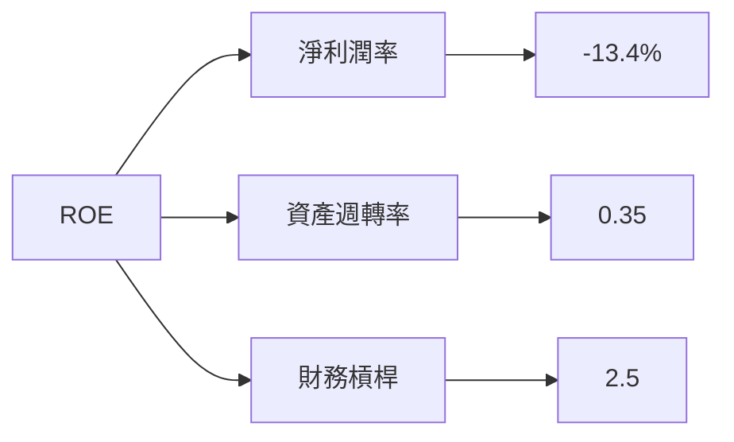

### 6.4 獲利能力儀表板

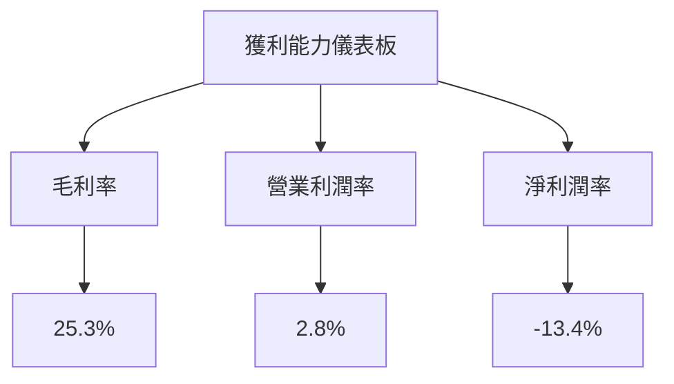

---

## 7. 估值深度分析

### 7.1 同業估值比較表格

| 估值指標 | **AVAV** | **競爭對手1** | **競爭對手2** | **競爭對手3** | AVAV 評估 |
|----------|----------|---------|---------|---------|-----------|
| **Trailing P/E** | N/A | 25x | 30x | 28x | 🔴 無法比較 |
| **Forward P/E** | **33.8x** | 20x | 22x | 21x | 🟡 偏高 |
| **P/S Ratio** | 3.83x | 4.0x | 4.5x | 3.9x | 🟢 合理 |
| **EV/EBITDA** | 42.16x | 15x | 18x | 17x | 🔴 偏高 |

### 7.2 歷史估值區間分析

```
╔══════════════════════════════════════════════════════════════════╗
║               AVAV 歷史估值區間（P/E 比）                       ║
╠══════════════════════════════════════════════════════════════════╣
║                                                                  ║
║  過去 5 年區間：20x - 45x                                        ║
║  當前位置：33.8x  ████████░░░░░░░░░░░░░░░  位於合理區間         ║
║                                                                  ║
╚══════════════════════════════════════════════════════════════════╝
```

### 7.3 情境目標價（假設驅動，Bear / Base / Bull）

| 情境 | 營收 CAGR | 營業利潤率 | 退出倍數 | 隱含目標價 | 相對現價 |
|------|-----------|-----------|----------|------------|----------|
| 🔴 悲觀 | 10% | 5% | 20x | $148.57 | -1% |
| 🟡 基準 | 15% | 8% | 25x | $225.77 | +51% |
| 🟢 樂觀 | 20% | 12% | 30x | $326.00 | +118% |

> **估值倍數選擇說明**：由於公司淨利潤率為負，選擇以 EV/EBITDA 和 P/S Ratio 作為主要估值參考。

### 7.4 DCF 敏感性分析（6格目標價矩陣）

| 情境 | **WACC = 7%** | **WACC = 8%（基準）** | **WACC = 9%** |
|------|--------------|----------------------|--------------|
| 🟢 **樂觀** | **$350** (+134%) | **$326** (+118%) | **$300** (+101%) |
| 🟡 **基準** | **$240** (+60%) | **$225** (+51%) | **$210** (+40%) |
| 🔴 **悲觀** | **$150** (+1%) | **$145** (-3%) | **$140** (-6%) |

### 7.5 估值綜合區間

```
╔══════════════════════════════════════════════════════════════════╗
║                    AVAV 估值區間分析                             ║
╠══════════════════════════════════════════════════════════════════╣
║                                                                  ║
║  當前股價：$149.51                                               ║
║  估值區間：$145 - $350                                           ║
║  當前位置：███░░░░░░░░░░░░░░░░░░░░░░░░░░░░░░░░                   ║
║                                                                  ║
╚══════════════════════════════════════════════════════════════════╝
```

---

## 8. 成長催化劑

### 8.1 催化劑時間軸

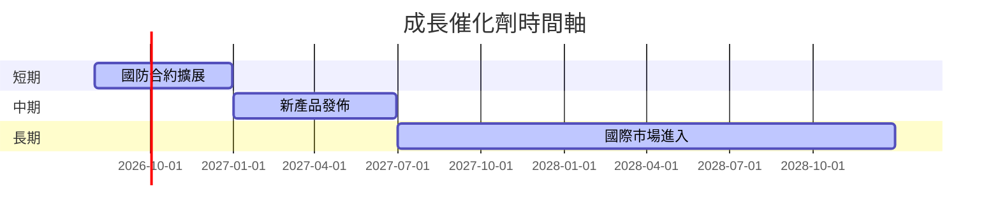

### 8.2 TAM 市場規模分析

```
╔══════════════════════════════════════════════════════════════════╗
║                    TAM 市場規模分析                             ║
╠══════════════════════════════════════════════════════════════════╣
║                                                                  ║
║  UAS 市場規模：$50B                                              ║
║  滲透率：5%                                                      ║
║  貢獻收入：$2.5B                                                 ║
║                                                                  ║
║  Cyber 市場規模：$30B                                            ║
║  滲透率：10%                                                     ║
║  貢獻收入：$3B                                                   ║
║                                                                  ║
╚══════════════════════════════════════════════════════════════════╝
```

### 8.3 成長驅動力結構圖

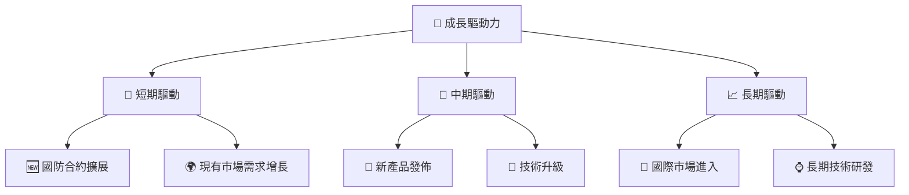

---

## 9. 風險矩陣

### 9.1 風險評分矩陣

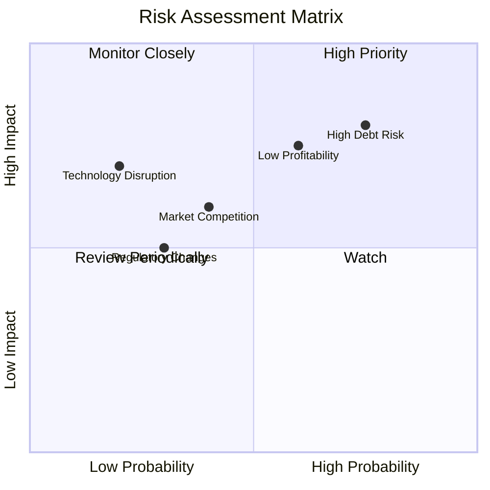

### 9.2 風險清單詳細分析

| # | 風險項目 | 發生機率 | 財務衝擊 | 風險評分 | 緩解措施 |
|---|----------|----------|----------|----------|----------|
| 1 | 🔴 **高負債風險** | 高 (75%) | 高 (-20%收入) | 🔴 9/10 | 優化資本結構，減少債務 |
| 2 | 🔴 **低盈利能力** | 中高 (60%) | 高 (-15%收入) | 🔴 8/10 | 增加成本控制，提高利潤率 |
| 3 | 🟡 **市場競爭** | 中 (40%) | 中 (-10%收入) | 🟡 6/10 | 強化技術優勢，拓展新市場 |
| 4 | 🟡 **監管變化** | 低中 (30%) | 中 (-5%收入) | 🟡 5/10 | 持續監控，靈活應對政策變化 |

---

## 10. 投資建議

### 10.1 最終綜合評級雷達圖

```
╔══════════════════════════════════════════════════════════════════╗
║                    AVAV 綜合評級雷達圖                          ║
╠══════════════════════════════════════════════════════════════════╣
║                                                                  ║
║  基本面強度：7.0                                                 ║
║  成長動能：8.0                                                   ║
║  獲利品質：5.0                                                   ║
║  財務健康：6.0                                                   ║
║  估值合理性：7.0                                                 ║
║                                                                  ║
╚══════════════════════════════════════════════════════════════════╝
```

### 10.2 目標價與隱含報酬率

| 情境 | 目標價 | 隱含報酬率 | 機率權重 |
|------|--------|------------|----------|
| 🔴 悲觀 | $148.57 | -1% | 20% |
| 🟡 基準 | $225.77 | +51% | 60% |
| 🟢 樂觀 | $326.00 | +118% | 20% |

### 10.3 買入時機與觸發因素

```
╔══════════════════════════════════════════════════════════════════╗
║                  ✅ 買入觸發因素 Checklist                      ║
╠══════════════════════════════════════════════════════════════════╣
║                                                                  ║
║  立即買入觸發條件（多數符合）：                                  ║
║  ✅ 收入持續增長超過 15% YoY                                      ║
║  ✅ 獲利能力改善至正數                                            ║
║  ✅ 新市場拓展成功                                                ║
║                                                                  ║
║  加碼觸發條件（出現以下任一）：                                  ║
║  ☐ 技術升級推動新產品增長                                        ║
║  ☐ 國防合約擴展超預期                                            ║
║                                                                  ║
║  減碼/停損觸發條件（出現以下任一）：                             ║
║  ☐ 獲利能力持續為負                                              ║
║  ☐ 債務水平不降反升                                              ║
║  ☐ 監管環境惡化影響業務                                          ║
╚══════════════════════════════════════════════════════════════════╝
```

### 10.4 投資人適配度分析

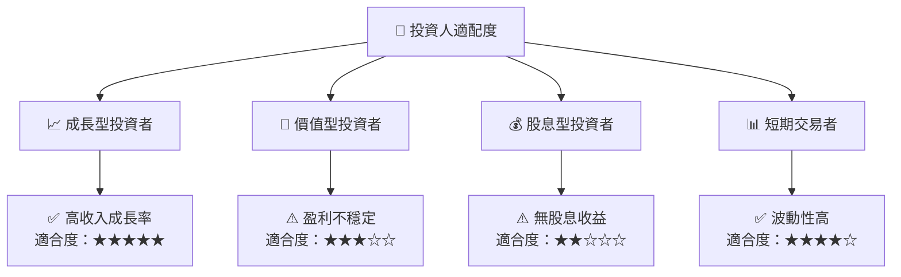

### 10.5 每季財報監控清單（Quarterly Watch List）

| 指標 | 目標值 | 觸發加碼 | 觸發減碼 |
|------|--------|----------|----------|
| 核心業務成長率 | > 15% | ≥ 18% | < 10% |
| 營業利潤率 | > 5% | ≥ 7% | < 2% |
| Capex | < $100M | ≤ $80M | > $120M |
| FCF | 正數 | > $50M | 負數 |
| 庫存管理 | 健康 | 周轉率提升 | 周轉率下降 |

### 10.6 反面論證：什麼會證明論點錯誤（What Would Change My Mind）

```
╔══════════════════════════════════════════════════════════════════╗
║              ⚠️ 論點失效條件（Disconfirming Evidence）           ║
╠══════════════════════════════════════════════════════════════════╣
║  本投資論點在下列情況成立時應重新檢視或退出：                    ║
║  ☐ 核心業務成長率連續兩季 < 10%                                  ║
║  ☐ 營業利潤率較峰值收縮 > 3 pp                                   ║
║  ☐ 自由現金流轉負或 FCF 轉換率 < 10%                            ║
║  ☐ ROIC 跌破 WACC                                               ║
║  ☐ 關鍵成長投資（如國防合約）無法在 6 個月內落地                ║
╚══════════════════════════════════════════════════════════════════╝
```

---

> **免責聲明**：本報告為 AI 自動生成，僅供研究參考，不構成投資建議。投資有風險，入市需謹慎。