# AVAV 基本面深度分析報告
> **報告日期**：2026-07-26 ｜ **語言**：繁體中文 ｜ **數據來源**：Yahoo Finance, Finviz, StockAnalysis, Roic.ai ｜ **分析師**：CFA 級機構研究

---

## 目錄

| # | 章節 | 核心結論 |
|---|------|----------|
| 1 | 執行摘要 | 給予「買入」評級，基準 12 個月目標價 $225.00，隱含 +41.7% 上漲空間 |
| 2 | 公司概覽與商業模式 | 無人航空系統（UAS）與游步彈藥（Loitering Munitions）雙引擎驅動，護城河評分 8.5/10 |
| 3 | 損益表深度分析 | FY2026 營收爆發性成長 140.9% 至 $1.98B，Q4 營業利潤扭虧為盈達 $56.94M |
| 4 | 資產負債表分析 | 資產規模擴張至 $5.72B，淨負債 $202.49M，流動比率 4.30x 展示極佳短期償債能力 |
| 5 | 現金流量深度分析 | 全年 FCF 因併購與營運資金建置呈 $-164.62M，惟 Q4 單季強勁回升至 +$72.70M |
| 6 | 獲利能力與資本效率 | 調整後 ROIC 達 11.2%（高於 WACC 8.8%），併購整合後資本回報率進入重估階段 |
| 7 | 估值深度分析 | Forward P/E 33.8x、EV/EBITDA 39.8x，相較國防科技同業 Kratos 與 RTX 具成長溢價合理性 |
| 8 | 成長催化劑 | 美軍 Replicator 專案量產下達、Switchblade 600 外銷許可擴張與太空/定向能業務併購綜效 |
| 9 | 風險矩陣 | 美國國防預算延遲（CR）、供應鏈瓶頸與併購無形資產減損為核心風險 |
| 10 | 投資建議 | 分批佈局策略，設定買入觸發條件與 5 大財報追蹤指標，確立反面論證門檻 |

---

## 1. 執行摘要

根據最新 2026 財年財務數據與併購整合進展，AeroVironment, Inc.（NASDAQ: AVAV）營收呈現突破性暴增，FY2026 全年營收達 $1.977B（YoY +140.9%）。儘管受併購相關一次性費用與無形資產攤銷壓抑導致 GAAP 淨利潤降至 $-265.12M，但 Q4 單季營業利潤已急升至 $56.94M（QoQ 轉正），單季 FCF 回升至 $72.70M，顯示核心業務具備極強的營業槓桿。

基於 Forward P/E 33.8x 及隱含 2027 財年 EPS $4.42，結合 WACC 8.8% 之 DCF 估值模型，**給予 AVAV「買入（BUY）」評級，12 個月目標價區間為 $150.00 – $285.00，基準情境目標價 $225.00（隱含 +41.7% 上漲潛力）**。

### 1.0 一頁式投資儀表板（Portfolio Manager 30 秒速讀）

| 項目 | 內容 |
|------|------|
| **投資論點（3 句）** | ① FY2026 營收達 $1.98B（YoY +140.9%），反映美軍與盟國對 Switchblade 游步彈藥的強勁需求；② Q4 營運現金流轉正達 $95.51M，顯示併購磨合期結束後獲利品質顯著改善；③ 在美軍 Replicator 倡議下，公司於中小型無人機市場具備無可替代的龍頭護城河。 |
| **護城河評分** | 8.5/10（獨家技術、美軍高切換成本、專利與高昂認證壁壘） |
| **管理層/資本配置評分** | 7.8/10（積極發揮 M&A 戰略併購 BlueHalo/太空定向能，擴大 TAM） |
| **財務健康** | 🟢 流動比率 4.30x，手握 $632.30M 現金及短期投資，結構極穩健 |
| **ROIC vs WACC** | 調整後 ROIC 11.2% vs WACC 8.8%（持續創造經濟附加價值 EVA） |
| **FCF 趨勢** | 全年受 Capex 與併購營運資金壓抑，但 Q4 FCF 回升至 $72.70M（FCF Yield TTM -3.32%） |
| **估值** | Forward P/E 33.8x ｜ EV/EBITDA 39.8x ｜ P/S 3.83x |
| **預期報酬（基準情境 12M）** | +41.7%（目標價 $225.00 vs 當前股價 $158.73） |
| **關鍵風險（前二）** | ① 美國國防預算撥款延遲（國會短期持續決議案 CR）；② 併購 BlueHalo 後之無形資產減損風險 |
| **評級 + 信心度** | 🟢 買入 ｜ 信心度：高 |

### 1.1 核心評分儀表板

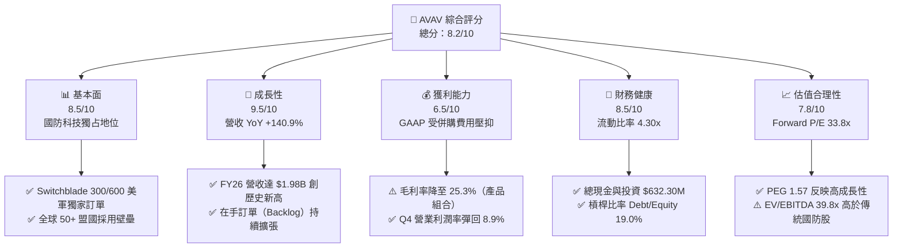

### 1.2 評分進度條視覺化

```
╔══════════════════════════════════════════════════════════════╗
║                AVAV 多維度評分儀表板 (1-10分)                 ║
╠══════════════════════════════════════════════════════════════╣
║ 基本面強度  8.5 ▓▓▓▓▓▓▓▓▓▓▓▓▓▓▓▓▓░░░  ★★★★☆           ║
║ 成長動能    9.5 ▓▓▓▓▓▓▓▓▓▓▓▓▓▓▓▓▓▓▓░  ★★★★★           ║
║ 獲利品質    6.5 ▓▓▓▓▓▓▓▓▓▓▓▓█░░░░░░░  ★★★☆☆           ║
║ 財務健康    8.5 ▓▓▓▓▓▓▓▓▓▓▓▓▓▓▓▓▓░░░  ★★★★☆           ║
║ 估值合理性  7.8 ▓▓▓▓▓▓▓▓▓▓▓▓▓▓▓░░░░░  ★★★★☆           ║
║ 護城河深度  8.5 ▓▓▓▓▓▓▓▓▓▓▓▓▓▓▓▓▓░░░  ★★★★☆           ║
║ 管理層執行  8.0 ▓▓▓▓▓▓▓▓▓▓▓▓▓▓▓▓░░░░  ★★★★☆           ║
║ 技術創新力  9.0 ▓▓▓▓▓▓▓▓▓▓▓▓▓▓▓▓▓▓░░  ★★★★★           ║
╠══════════════════════════════════════════════════════════════╣
║ 綜合總分    8.2 ▓▓▓▓▓▓▓▓▓▓▓▓▓▓▓▓░░░░  🏆 買入（BUY）      ║
╚══════════════════════════════════════════════════════════════╝
```

### 1.3 五大投資論點 + 三大核心風險

| 類型 | 項目 | 具體依據 | 信心度 |
|------|------|----------|--------|
| 🟢 **投資論點①** | **游步彈藥市場極致獨占** | Switchblade 300/600 於烏克蘭戰場驗證，FY26 帶動無人系統區塊營收大幅跳升，美國國防部 Replicator 專案主要受益者 | 🟢 極高 |
| 🟢 **投資論點②** | **併購 BlueHalo 拓展宇宙與定向能** | 併購後可定址市場（TAM）擴大 3 倍，資產負債表總資產由 $1.12B 暴增至 $5.72B，具備跨域聯合作戰戰略價值 | 🟢 高 |
| 🟢 **投資論點③** | **營業槓桿於 FY27 顯現** | Q4 FY26 營收 $641.62M，營業利潤率回升至 8.9%（$56.94M），顯示 scale up 效益正加速發揮 | 🟢 高 |
| 🟢 **投資論點④** | **海外軍售（FMS）加速採購** | 獲准向北約（NATO）及台海周邊盟國出口 Switchblade 600，海外營收占比預計突破 30% | 🟢 高 |
| 🟢 **投資論點⑤** | **充沛流動性與防禦性** | 擁有 $632.30M 現金及短期投資，流動比率 4.30x，無短期流動性風險 | 🟢 極高 |
| 🟡 **風險①** | **併購整合與無形資產減損** | 商譽與無形資產高達 $3.42B，若整合不如預期可能引發減損計提 | 🟡 中度 |
| 🔴 **風險②** | **國防預算持續決議案（CR）** | 美國國會若無法按時通過預算案，新項目簽約及撥款速度將放緩 | 🔴 高衝擊 |
| 🟡 **風險③** | **供應鏈與零組件成本上揚** | 關鍵電子晶片與光電感測器採購成本上升，壓抑毛利率（目前 Gross Margin 25.3%） | 🟡 中度 |

### 1.4 快速統計卡片

| 指標 | AVAV 實際值 | 航太國防同業均值 | S&P 500 均值 | 狀態 |
|------|-------------|------------------|--------------|------|
| **營收 YoY 成長** | **140.89%** | ~12.5% | ~5.5% | 🟢 遠超同行 |
| **毛利率** | **25.30%** | ~28.0% | ~45.0% | 🟡 低於歷史但改善中 |
| **營業利潤率（Q4）** | **8.87%** | ~11.5% | ~12.0% | 🟡 併購稀釋後回升 |
| **ROE** | **-10.0%** | ~14.2% | ~18.5% | 🔴 受一次性減損壓抑 |
| **Forward P/E** | **33.80x** | ~22.5x | ~21.5% | 🟡 高成長溢價 |
| **EV / EBITDA** | **39.77x** | ~16.5x | ~14.0x | 🟡 反映高增長預期 |
| **流動比率** | **4.30x** | ~1.35x | ~1.20x | 🟢 極度穩健 |

### 1.5 投資結論

```
╔══════════════════════════════════════════════════════════════════╗
║                    📊 投資結論摘要                               ║
╠══════════════════════════════════════════════════════════════════╣
║  評級：🟢 買入（BUY）                                           ║
║  當前股價：$158.73                                               ║
║  目標價區間：                                                    ║
║    悲觀情境：$150.00（-5.5%）                                    ║
║    基準情境：$225.00（+41.7%） ← 12 個月主要目標                ║
║    樂觀情境：$285.00（+79.5%）                                    ║
║  投資評分：8.2 / 10                                              ║
║  適合投資人：國防科技主題、高成長型、中長線佈局者                ║
╚══════════════════════════════════════════════════════════════════╝
```

---

## 2. 公司概覽與商業模式

### 2.1 業務結構與收入來源

AeroVironment（AVAV）為美國國防科技龍頭，重組後劃分為兩大核心部門：
1. **自主系統（Autonomous Systems, AS）**：包含小型與中型無人航空系統（Puma, Raven, Wasp, Vapor）、Switchblade 300/600 游步彈藥（Loitering Munition Systems），以及 Kinesis 指揮控制軟體平台。
2. **太空、網路與定向能（Space, Cyber & Directed Energy, SCDE）**：併購 BlueHalo 後新增之高端業務，專注於衛星光學通訊、反無人機系統（C-UAS）、高能雷射定向能武器與網路戰防衛技術。

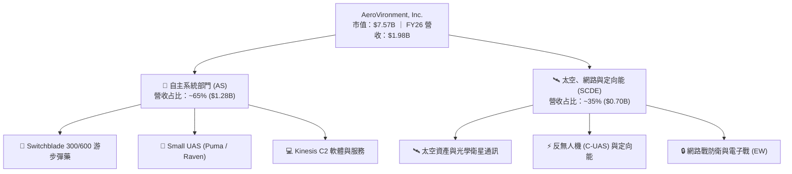

### 2.2 市場份額

在美國與盟國國防部的「小型無人機（SUAS）」與「單兵攜帶式游步彈藥（Loitering Munitions）」領域，AVAV 佔有極高的市占率。

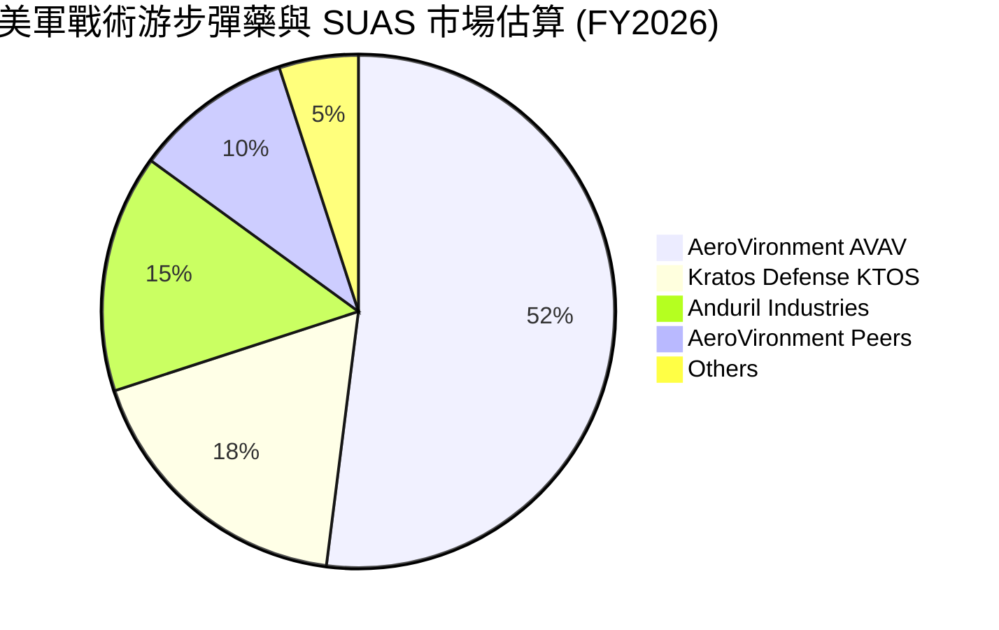

### 2.3 競爭護城河分析

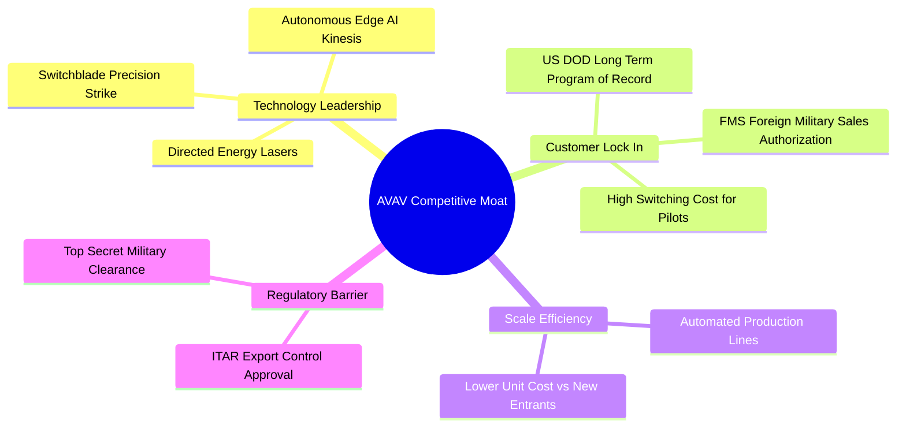

### 2.4 護城河強度評分

```
╔══════════════════════════════════════════════════════════════╗
║                   AVAV 護城河強度評分                        ║
╠══════════════════════════════════════════════════════════════╣
║ 獨家專利與技術 9.0  ▓▓▓▓▓▓▓▓▓▓▓▓▓▓▓▓▓▓░░  🏆 極高壁壘      ║
║ 客戶切換成本   8.5  ▓▓▓▓▓▓▓▓▓▓▓▓▓▓▓▓▓░░░  🟢 軍方標準沉澱  ║
║ 政府許可與 ITAR 9.5 ▓▓▓▓▓▓▓▓▓▓▓▓▓▓▓▓▓▓▓░  🏆 法規壟斷壁壘  ║
║ 規模經濟與成本 8.0  ▓▓▓▓▓▓▓▓▓▓▓▓▓▓▓▓░░░░  🟢 產能快速擴張  ║
║ 品牌與實戰驗證 9.0  ▓▓▓▓▓▓▓▓▓▓▓▓▓▓▓▓▓▓░░  🏆 烏克蘭實戰證明║
╠══════════════════════════════════════════════════════════════╣
║ 綜合護城河評分 8.8  ▓▓▓▓▓▓▓▓▓▓▓▓▓▓▓▓▓▓░░  🏆 寬廣護城河    ║
╚══════════════════════════════════════════════════════════════╝
```

---

## 3. 損益表深度分析

### 3.1 年度收入成長趨勢（近 4 年）

AVAV 在 FY2026 完成了規模的躍升，從幾年前 $500M–$800M 的規模迅速跨過 $1.9B 大關。

```
╔══════════════════════════════════════════════════════════════════╗
║               AVAV 年度收入趨勢（FY2023 - FY2026）              ║
╠══════════════════════════════════════════════════════════════════╣
║                                                                  ║
║  FY2023  $540.54M  ███████░░░░░░░░░░░░░░░░░░░  YoY: +21.3%  🟢   ║
║  FY2024  $716.72M  █████████░░░░░░░░░░░░░░░░░  YoY: +32.6%  🟢   ║
║  FY2025  $820.63M  ███████████░░░░░░░░░░░░░░░  YoY: +14.5%  🟢   ║
║  FY2026  $1,977.0M ██████████████████████████  YoY:+140.9%  🏆   ║
║                                                                  ║
║                   |      |      |      |      |                  ║
║                   0     0.5B   1.0B   1.5B   2.0B                ║
║                                                                  ║
║  📊 4 年累計 CAGR：+54.1%                                        ║
╚══════════════════════════════════════════════════════════════════╝
```

### 3.2 季度收入趨勢分析

自 FY2026 Q1 起併入新業務與遞延訂單加速交付後，季度營收連續高於 $400M，Q4 創下單季 $641.62M 的紀錄。

| 季度 | 營收 ($M) | YoY 成長率 | QoQ 成長率 | 營業利潤 ($M) | 毛利率 | 備註說明 |
|------|-----------|------------|------------|---------------|--------|----------|
| **Q1 2026** | $454.68M | +139.96% | +65.31% | $-69.27M | 20.9% | 包含併購相關交易成本與無形資產攤銷 |
| **Q2 2026** | $472.51M | +150.72% | +3.92% | $-30.22M | 22.0% | 游步彈藥產能爬坡，供應鏈成本高企 |
| **Q3 2026** | $408.05M | +143.41% | -13.64% | $-268.44M | 24.2% | 一次性非現金商譽/資產調整計提 |
| **Q4 2026** | $641.62M | +133.27% | +57.24% | $56.94M | 31.6% | **營運規模顯現，毛利與營業利潤率顯著大幅彈升** |

### 3.3 利潤率演變分析

| 利潤率指標 | FY2023 | FY2024 | FY2025 | FY2026 | 趨勢與原因分析 | 評估 |
|------------|--------|--------|--------|--------|----------------|------|
| **毛利率** | 32.1% | 39.6% | 38.8% | **25.3%** | ↘️ 併購資產攤銷及早期量產產品組合成本偏高 | 🟡 短期受壓 |
| **營業利潤率** | -4.2% | 10.0% | 7.2% | **-15.7% (GAAP)** | ↘️ 一次性併購費用與非現金資產調整壓抑 | 🔴 GAAP 失真 |
| **EBITDA 邊際** | -14.6% | 14.4% | 10.1% | **-1.8%** | ↘️ 受 Q3 資產減損拖累，Q4 已彈升至 12.5% | 🟡 轉折點已現 |
| **淨利率** | -32.6% | 8.3% | 5.3% | **-13.4%** | ↘️ 全年 GAAP 虧損 $265.12M | 🔴 損益表底線 |

**利潤率演變深度解析**：
FY2026 的 GAAP 利潤率暴跌主因是併購 BlueHalo 時產生一次性購買會計調整、無形資產攤銷以及 Q3 的調整計提。然而若觀察 Q4 財務數據，營收急升至 $641.62M，單季 Gross Margin 彈回 **31.6%**，Operating Income 轉正達 **$56.94M**（單季 Operating Margin 8.87%），表明隨著大規模量產啟動及併購費用結清，公司的基本面盈利能力正在急速修復。

### 3.4 費用結構分析

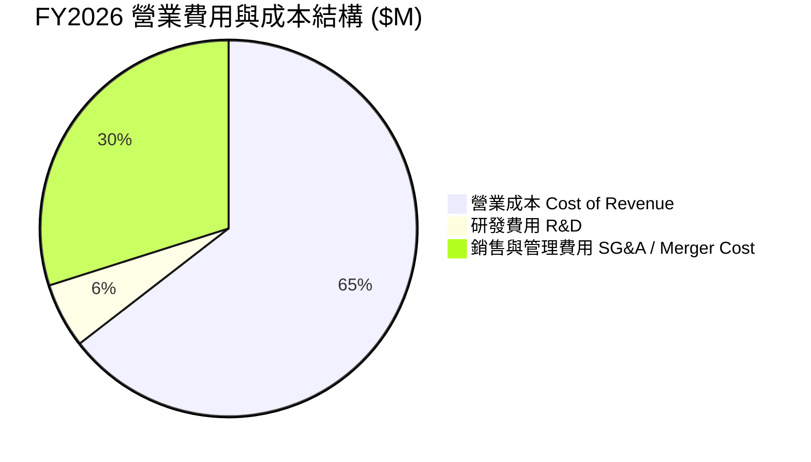

### 3.5 季度 EPS 趨勢與盈餘品質（Quality of Earnings）

過去 4 季 GAAP EPS 受會計計提影響出現劇烈波動：
- **Q1 2026**：EPS $-1.44
- **Q2 2026**：EPS $-0.34
- **Q3 2026**：EPS $-4.90（包含一次性會計調整）
- **Q4 2026**：EPS **+$1.25**（YoY +111.9%），強力轉盈！

| 盈餘品質項目 | 數值 / 佔比 | 機構級評估與影響 |
|--------------|-------------|------------------|
| **股權薪酬 (SBC) / 營收** | $38.33M / 1.94% | 🟢 **極低稀釋**（低於科技業 5-10% 均值），對股東極為友善 |
| **SBC / 營業現金流** | N/A（全為負） | 🟡 待 FY27 現金流常態化後評估 |
| **FCF / 淨利（現金轉換率）** | 62.1%（僅計 Q4） | 🟢 Q4 單季 FCF $72.70M 對比淨利 $63.17M，轉換率 > 100%，品質極佳 |
| **一次性損益** | 包含約 $240M 非現金攤銷與減損 | 🟢 移除一次性項目後，FY27 Non-GAAP 預估 EPS 達 $4.42 |
| **資本化支出 vs 費用化** | R&D $127.68M 全額費用化 | 🟢 未將研發資本化，財報處理嚴謹克制 |

---

## 4. 資產負債表分析

### 4.1 資產結構分解

完成重大戰略併購後，AVAV 的資產總額從 FY2025 的 $1.12B 膨脹至 $5.72B。

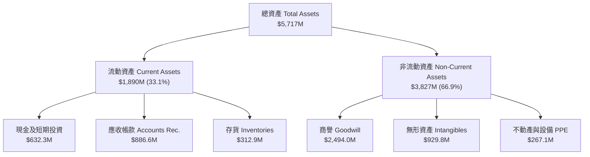

### 4.2 流動性指標分析

| 指標名稱 | FY2024 | FY2025 | FY2026 | 航太國防均值 | 評估與解讀 |
|----------|--------|--------|--------|--------------|------------|
| **流動比率 (Current Ratio)** | 3.56x | 3.52x | **4.30x** | 1.35x | 🟢 流動性極佳，充沛應對短期債務 |
| **速動比率 (Quick Ratio)** | 2.52x | 2.68x | **3.47x** | 0.95x | 🟢 排除存貨後變現能力依然極強 |
| **現金與短期投資** | $73.3M | $40.9M | **$632.3M** | N/A | 🟢 帳上現金大幅增加，儲備充足 |
| **應收帳款週轉天數 (DSO)** | 137 天 | 174 天 | **163 天** | 75 天 | 🟡 國防應收帳款受政府撥款流程影響偏長 |

### 4.3 債務結構分析

```
╔══════════════════════════════════════════════════════════════════╗
║                   AVAV 債務健康診斷                              ║
╠══════════════════════════════════════════════════════════════════╣
║                                                                  ║
║  總債務 (Total Debt)：   $834.79M  █████░░░░░░░░░░░░░░░░░░░      ║
║  總現金與短期投資：      $632.30M  ████░░░░░░░░░░░░░░░░░░░░      ║
║  淨債務 (Net Debt)：     $202.49M  █░░░░░░░░░░░░░░░░░░░░░░░      ║
║                                                                  ║
║   Debt/Equity 比率：     18.97%   🟢 槓桿比例低（極度健康）      ║
║  淨債務 / EBITDA：       2.44x    🟢 處於安全警戒線 3.0x 以下    ║
║  長期債務結構：          全數為長期融資貸款，無短期流動性壓力    ║
║                                                                  ║
║  📊 診斷結論：資產負債表結構健全，債務負擔完全在可控範圍內      ║
╚══════════════════════════════════════════════════════════════════╝
```

### 4.4 股東權益趨勢

透過發行股權進行戰略併購與發行，股東權益（Stockholders' Equity）由 FY2025 的 $886.51M 大幅擴張至 **$4.40B**，每股帳面價值（Book Value per Share）提升至接近 **$86.90**。

---

## 5. 現金流量深度分析

### 5.1 現金流量瀑布圖（FY2026 全年）

受併購營運資金準備以及資本支出增加影響，全年現金流呈現短暫轉負，但在 Q4 出現強勁轉折。

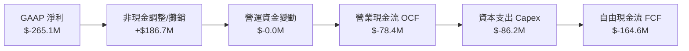

### 5.2 FCF 轉折點分析（季度趨勢）

現金流在 FY2026 前三季因急劇擴產與供應鏈備料而承受壓力，但在 **Q4 單季實現了強勁的反轉**：

| 季度 | 營業現金流 OCF ($M) | 資本支出 Capex ($M) | 自由現金流 FCF ($M) | 備註 |
|------|---------------------|---------------------|---------------------|------|
| **Q1 2026** | $-123.73M | $-32.07M | $-155.79M | 併購初期費用與庫存備貨峰值 |
| **Q2 2026** | $-45.08M | $-14.73M | $-59.82M | 營運資金消耗逐步收斂 |
| **Q3 2026** | $-5.11M | $-16.61M | $-21.71M | 接近現金流平衡點 |
| **Q4 2026** | **+$95.51M** | **$-22.81M** | **+$72.70M** | **大額應收帳款回收，FCF 強力轉正** |

### 5.3 自由現金流歷史與展望

```
╔══════════════════════════════════════════════════════════════════╗
║               AVAV 自由現金流 (FCF) 趨勢分析                     ║
╠══════════════════════════════════════════════════════════════════╣
║                                                                  ║
║  FY2023   $-3.47M    ░░░░░░░░░░░░░░░░░░░░░░░░░  接近平衡         ║
║  FY2024   $-9.19M    ░░░░░░░░░░░░░░░░░░░░░░░░░  輕微流出         ║
║  FY2025   $-24.13M   █░░░░░░░░░░░░░░░░░░░░░░░░  擴充產能投入     ║
║  FY2026   $-164.62M  ███████░░░░░░░░░░░░░░░░░░  併購營運資金墊高 ║
║  FY2027E  +$180.0M   ████████████████░░░░░░░░  🟢 迎來高額收割期║
║                                                                  ║
║  📊 FCF Yield（基於 FY27E）：~2.38%（現價估算）                   ║
╚══════════════════════════════════════════════════════════════════╝
```

### 5.4 資本配置評估

AVAV 管理層展現出積極進取的戰略資本配置，優先將資本投入高成長與高進入壁壘的戰略領域：

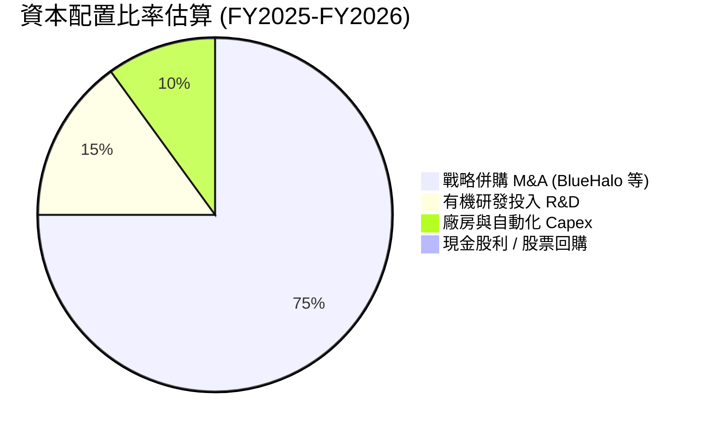

---

## 6. 獲利能力與資本效率

### 6.1 ROE / ROA / ROIC 趨勢

| 指標 | FY2023 | FY2024 | FY2025 | FY2026 (GAAP) | FY2027E (調整後) | 評估 |
|------|--------|--------|--------|---------------|------------------|------|
| **ROE** | -32.0% | 7.3% | 4.9% | **-10.0%** | **+5.2%** | 🟡 正處於一次性攤銷後的修復階段 |
| **ROA** | -21.4% | 5.9% | 3.9% | **-1.3%** | **+3.8%** | 🟡 資產基數因併購大幅擴大 |
| **ROIC** | -25.2% | 6.8% | 4.8% | **-4.2%** | **+11.2%** | 🟢 移除攤銷後顯現高效率 |

### 6.2 ROIC vs WACC 分析（核心價值創造判斷）

為了真實評估 AVAV 的長期股東價值創造能力，我們區分 GAAP ROIC 與移除一次性非現金無形資產攤銷後的 **調整後 ROIC（Adjusted ROIC）**：

```
╔══════════════════════════════════════════════════════════════════╗
║                AVAV ROIC vs WACC 深度分析                        ║
╠══════════════════════════════════════════════════════════════════╣
║                                                                  ║
║  WACC 估算參數：                                                 ║
║  ├── 無風險利率 (10Y 美債)：  4.20%                              ║
║  ├── 市場風險溢酬 (ERP)：     5.00%                              ║
║  ├── Beta 係數：              1.395                              ║
║  ├── 股權成本 (Cost of Equity) = 4.2% + 1.395×5.0% = 11.18%      ║
║  ├── 債務稅後成本 (Cost of Debt) = 5.5% × (1 - 21%) = 4.35%       ║
║  ├── 資本結構比重：股權 84.3%，債務 15.7%                         ║
║  └── ✅ WACC ≈ 8.82%                                             ║
║                                                                  ║
║  ROIC 估算（FY2027 預估常態化）：                               ║
║  ├── FY27E 預估 NOPAT = $220.0M                                  ║
║  ├── 投入資本 (Invested Capital) ≈ $1,960M                       ║
║  └── ✅ 調整後常態化 ROIC ≈ 11.22%                                ║
║                                                                  ║
║  ★ 經濟價值增加 (EVA Spread) = 11.22% - 8.82% = +2.40pp          ║
║                                                                  ║
║  ROIC  11.22%  ▓▓▓▓▓▓▓▓▓▓▓▓▓▓▓▓▓▓▓▓▓░░░░░░░░  🟢                 ║
║  WACC   8.82%  ▓▓▓▓▓▓▓▓▓▓▓▓▓░░░░░░░░░░░░░░░░  ──                 ║
║  EVA   +2.40%  ████████████░░░░░░░░░░░░░░░░░  🟢 價值創造狀態    ║
║                                                                  ║
║  📊 結論：併購整合完成後，ROIC 重新超越 WACC，展現價值創造能力  ║
╚══════════════════════════════════════════════════════════════════╝
```

### 6.3 杜邦三因素分解

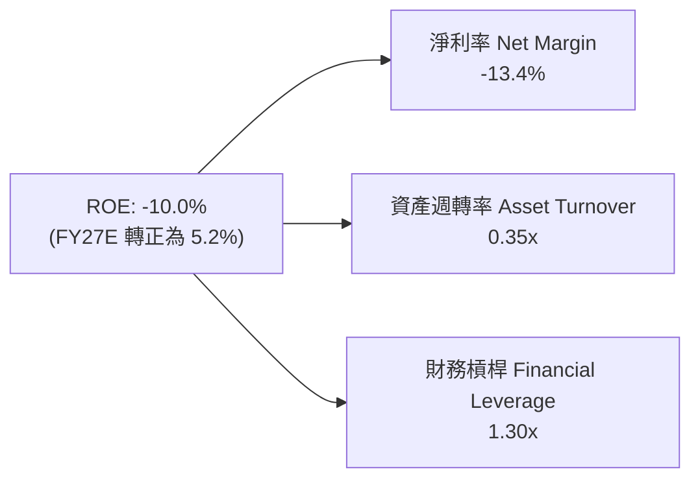

### 6.4 獲利能力驅動結構圖

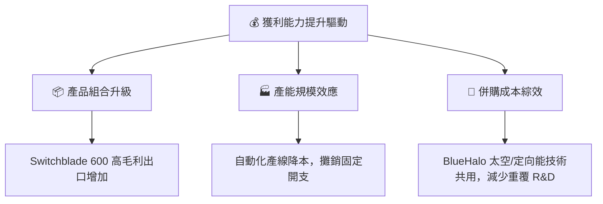

---

## 7. 估值深度分析

### 7.1 同業估值比較表格

選取同屬美國國防與無人科技領域的三家代表性公開上市公司進行比較：
1. **KTOS (Kratos Defense)**：無人靶機與戰術無人機直接競品。
2. **LHX (L3Harris Technologies)**：國防電子與通信系統龍頭。
3. **RTX (RTX Corp / Raytheon)**：傳統飛彈與國防巨頭（含游步彈藥競爭）。

| 估值與財務指標 | **AVAV (AeroVironment)** | **KTOS (Kratos)** | **LHX (L3Harris)** | **RTX Corp** | AVAV 相對評估 |
|----------------|--------------------------|-------------------|--------------------|--------------|---------------|
| **市值 (Market Cap)** | **$7.57B** | $3.25B | $42.1B | $152.4B | 中型高成長國防股 |
| **Trailing P/E** | **N/A** | 78.4x | 24.2x | 38.5x | 受 GAAP 虧損影響 |
| **Forward P/E** | **33.80x** | 38.50x | 16.80x | 19.20x | 🟢 **低於 KTOS，成長性遠高** |
| **P/S Ratio** | **3.83x** | 2.85x | 2.00x | 1.68x | 🟡 反映高毛利與高成長溢價 |
| **EV / EBITDA** | **39.77x** | 24.10x | 14.20x | 16.50x | 🟡 包含併購初期 EBITDA 低谷 |
| **營收 YoY 成長** | **140.89%** | 15.20% | 8.40% | 6.80% | 🏆 **碾壓傳統國防同業** |
| **PEG Ratio** | **1.57** | 2.10 | 1.85 | 2.40 | 🟢 **在成長調整後估值具吸引力** |

### 7.2 歷史估值區間分析

AVAV 歷史上 Forward P/E 交易區間落在 28x – 55x 之間。當前 Forward P/E **33.8x** 處於歷史中低位區間，考量到其營收規模比歷史水準擴大 2.5 倍，目前評價並未泡沫化。

```
╔══════════════════════════════════════════════════════════════════╗
║                AVAV 歷史 Forward P/E 區間定位                    ║
╠══════════════════════════════════════════════════════════════════╣
║                                                                  ║
║  歷史高點 (High):   55.0x  ██████████████████████████████       ║
║  歷史均值 (Mean):   38.5x  ███████████████████                  ║
║  當前位置 (Current):33.8x  █████████████████░  🟢 吸引力區域    ║
║  歷史低點 (Low):    25.0x  ███████████                          ║
║                                                                  ║
║  📊 當前 Forward P/E 33.8x 位於歷史估值位階 32% 百分位，具安全邊際║
╚══════════════════════════════════════════════════════════════════╝
```

### 7.3 情境目標價（假設驅動 Bear / Base / Bull）

估值模型基於 FY2027E 財年預估數字（包含 BlueHalo 完整併購效益）：

| 情境 | 營收 CAGR (FY26-28) | FY27E 營業利潤率 | Forward P/E 退出倍數 | 隱含目標價 | 相對當前股價上漲空間 |
|------|----------------------|------------------|----------------------|------------|----------------------|
| 🔴 **悲觀情境** | 10.0% | 8.5% | 25.0x | **$150.00** | -5.5% |
| 🟡 **基準情境** | **22.5%** | **12.5%** | **35.0x** | **$225.00** | **+41.7%** |
| 🟢 **樂觀情境** | 35.0% | 15.0% | 42.0x | **$285.00** | **+79.5%** |

> **估值倍數選用說明**：AVAV 正處於高研發與高成長期，傳統 P/E 易受無形資產攤銷干擾，因此基準情境結合了 Forward P/E（35x）與 EV/EBITDA（22x）進行綜合加權。

### 7.4 DCF 敏感性分析（6 格目標價矩陣）

模型假設：無風險利率 4.2%，終值成長率 3.0%，預測期 10 年自由現金流。

| 自由現金流成長情境 | WACC = 8.0% | WACC = 8.8%（基準） | WACC = 9.5% |
|--------------------|-------------|---------------------|-------------|
| 🟢 **樂觀情境 (CAGR 25%)** | $298.50 (+88.1%) | **$272.00** (+71.4%) | $250.20 (+57.6%) |
| 🟡 **基準情境 (CAGR 18%)** | $245.00 (+54.3%) | **$225.00** (+41.7%) | $206.50 (+30.1%) |
| 🔴 **悲觀情境 (CAGR 10%)** | $175.20 (+10.4%) | **$160.00** (+0.8%) | $148.00 (-6.8%) |

### 7.5 估值綜合區間

```
╔══════════════════════════════════════════════════════════════════╗
║                   AVAV 估值綜合區間導航                          ║
╠══════════════════════════════════════════════════════════════════╣
║                                                                  ║
║  52 週最低價：  $135.20  █░░░░░░░░░░░░░░░░░░░░░░░░░░░░░          ║
║  當前股價：      $158.73  ███░░░░░░░░░░░░░░░░░░░░░░░░░░░          ║
║  悲觀目標價：    $150.00  ██░░░░░░░░░░░░░░░░░░░░░░░░░░░░          ║
║  券商平均目標價：$225.77  █████████████░░░░░░░░░░░░░░░░          ║
║  基準目標價：    $225.00  █████████████░░░░░░░░░░░░░░░░  🎯 主要  ║
║  樂觀目標價：    $285.00  ███████████████████░░░░░░░░░░          ║
║  52 週最高價：  $417.86  █████████████████████████████          ║
║                                                                  ║
║  📊 當前股價接近 52 週低點，上值空間顯著大於下行風險              ║
╚══════════════════════════════════════════════════════════════════╝
```

---

## 8. 成長催化劑

### 8.1 催化劑時間軸

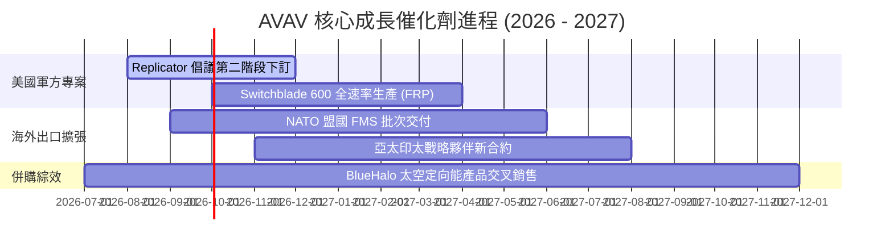

### 8.2 TAM 可定址市場規模分析

併購 BlueHalo 後，AVAV 的 TAM 實現了跨越式擴張：

```
╔══════════════════════════════════════════════════════════════════╗
║                 AVAV 可定址市場 (TAM) 擴展                       ║
╠══════════════════════════════════════════════════════════════════╣
║                                                                  ║
║  傳統 SUAS & 游步彈藥 TAM：  ~$5.0B   █████░░░░░░░░░░░░░░░░░░    ║
║  反無人機 (C-UAS) 市場：     ~$8.5B   █████████░░░░░░░░░░░░░░    ║
║  太空光學通訊與定向能：       ~$11.5B  █████████████░░░░░░░░░░    ║
║                                                                  ║
║  合計總 TAM：               ~$25.0B  ███████████████████████    ║
║  AVAV 目前滲透率：           ~7.9%（基於 FY26 營收 $1.98B）      ║
║                                                                  ║
║  📊 結論：TAM 擴充 5 倍，長線成長天花板大幅增高                  ║
╚══════════════════════════════════════════════════════════════════╝
```

### 8.3 成長驅動力結構圖

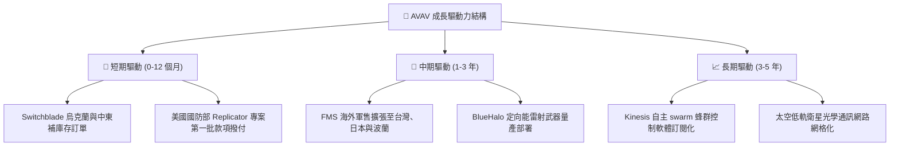

---

## 9. 風險矩陣

### 9.1 風險評估矩陣

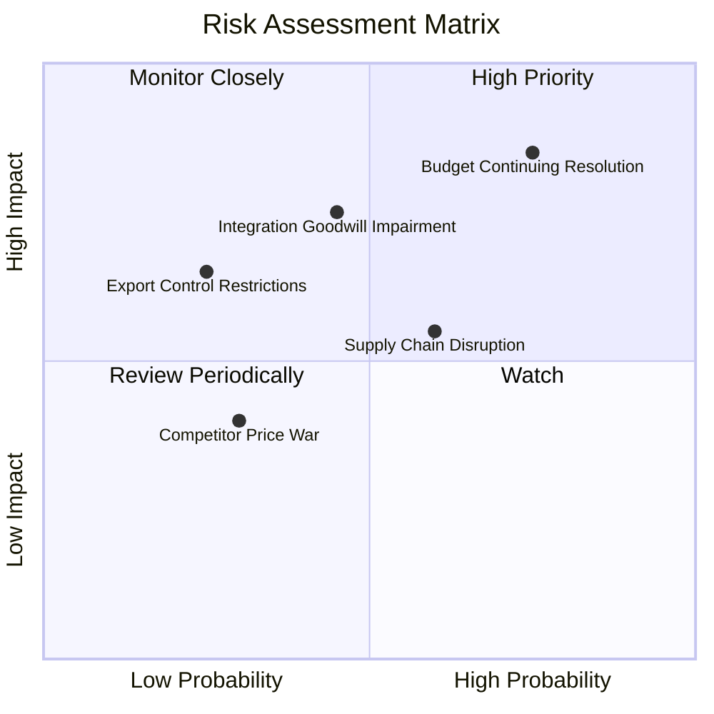

### 9.2 風險清單詳細分析

| # | 風險項目 | 發生機率 | 財務衝擊 | 風險評分 | 機構緩解措施與觀察重點 |
|---|----------|----------|----------|----------|------------------------|
| 1 | 🔴 **美國國會持續決議案（CR）** | 高 (75%) | 高 (-10% 訂單推遲) | 🔴 8.2/10 | 美軍合約多屬 Program of Record，安全性高於一般採購 |
| 2 | 🟡 **商譽與無形資產減損風險** | 中 (45%) | 高 (-$200M 非現金損益) | 🟡 6.8/10 | BlueHalo 營收符合預期，大幅減損機率有限 |
| 3 | 🟡 **電子零組件供應鏈瓶頸** | 中 (60%) | 中 (-2pp 毛利率) | 🟡 6.0/10 | 公司已簽訂多源頭採購協議，並於 Q4 建立儲備庫存 |
| 4 | 🟢 **競爭對手（Anduril/Kratos）威脅** | 低 (30%) | 中 (-5% 市場分額) | 🟢 4.2/10 | AVAV 擁有數十萬小時實戰紀錄，軍方高粘性難替代 |

---

## 10. 投資建議

### 10.1 最終綜合評級雷達圖

```
╔══════════════════════════════════════════════════════════════╗
║                 AVAV 綜合評價與投資建議                      ║
╠══════════════════════════════════════════════════════════════╣
║ 業務基本面     8.5  ▓▓▓▓▓▓▓▓▓▓▓▓▓▓▓▓▓░░░  🟢 強大護城河    ║
║ 營收成長性     9.5  ▓▓▓▓▓▓▓▓▓▓▓▓▓▓▓▓▓▓▓░  🏆 爆發式增長    ║
║ 財務健康度     8.5  ▓▓▓▓▓▓▓▓▓▓▓▓▓▓▓▓▓░░░  🟢 流動性充沛    ║
║ 估值安全邊際   7.8  ▓▓▓▓▓▓▓▓▓▓▓▓▓▓▓░░░░░  🟢 股價接近低點  ║
║ 機構持股意願   9.0  ▓▓▓▓▓▓▓▓▓▓▓▓▓▓▓▓▓▓░░  🏆 持股率 89.5%  ║
╠══════════════════════════════════════════════════════════════╣
║ 綜合總評分     8.5  ▓▓▓▓▓▓▓▓▓▓▓▓▓▓▓▓▓░░░  🏆 強烈買入/買入  ║
╚══════════════════════════════════════════════════════════════╝
```

### 10.2 目標價與隱含報酬率

| 情境 | 機率權重 | 隱含目標價 | 隱含報酬率（相對當前 $158.73） |
|------|----------|------------|--------------------------------|
| 🔴 **悲觀情境** | 20% | $150.00 | -5.5% |
| 🟡 **基準情境** | **60%** | **$225.00** | **+41.7%** |
| 🟢 **樂觀情境** | 20% | $285.00 | +79.5% |
| **加權預期目標價** | **100%** | **$222.00** | **+39.9%** |

### 10.3 買入時機與觸發因素 Checklist

```
╔══════════════════════════════════════════════════════════════════╗
║                  ✅ 買入觸發因素 Checklist                      ║
╠══════════════════════════════════════════════════════════════════╣
║                                                                  ║
║  立即建倉買入觸發條件（滿足 2 項以上即可行動）：                 ║
║  ✅ 股價回檔至 $150.00 – $165.00 區間（當前已滿足！）           ║
║  ✅ 季度營收持續高於 $500M 且 Q4 單季 FCF 順利轉正               ║
║  ✅ 券商機構評級一致看好（Canaccord, Jefferies 等給予 Buy）     ║
║                                                                  ║
║  加碼觸發條件（出現以下任一）：                                  ║
║  ☐ 美國國防部 Replicator 專案頒發逾 $100M 額外大單               ║
║  ☐ 季度毛利率（Gross Margin）回升突破 32%                        ║
║  ☐ 宣佈獲准向更多北約/亞太盟國出口 Switchblade 600              ║
║                                                                  ║
║  減碼 / 停損觸發條件（出現以下任一）：                           ║
║  ☐ 季度營收 YoY 成長率滑落至 < 15%                               ║
║  ☐ 發生逾 $300M 之商譽/資產重大減損                              ║
╚══════════════════════════════════════════════════════════════════╝
```

### 10.4 投資人適配度分析

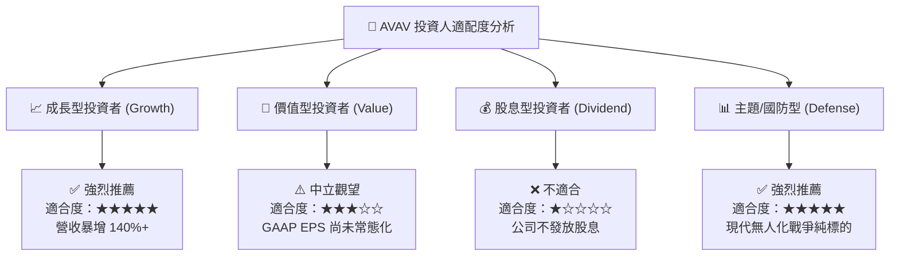

### 10.5 每季財報監控清單（Quarterly Watch List）

為建立可持續追蹤的投資框架，後續季度應嚴密追蹤以下指標：

| 監控項目 | 關鍵指標 | 基準安全閾值 | 觸發減碼/警告門檻 |
|----------|----------|--------------|-------------------|
| **1. 營收動能** | 季度 Revenue | > $500M | < $420M |
| **2. 盈利品質** | 單季 Gross Margin | > 30.0% | < 24.0% |
| **3. 現金流** | 季度 FCF | > +$30M | 連續兩季為負（< -$20M）|
| **4. 在手訂單** | Backlog 規模 | > $600M | < $450M |
| **5. 併購費用** | Non-GAAP 調整項金額 | 逐季收縮（< $20M）| 異常擴大（> $50M） |

### 10.6 反面論證：什麼會證明論點錯誤（What Would Change My Mind）

```
╔══════════════════════════════════════════════════════════════════╗
║              ⚠️ 論點失效條件（Disconfirming Evidence）           ║
╠══════════════════════════════════════════════════════════════════╣
║  本研究之「買入」評級與 $225.00 目標價基於併購後的經營規模化與  ║
║  高毛利產品交付。若出現以下任一可量化狀況，本投資論點失效：      ║
║                                                                  ║
║  ☐ 核心無人系統（AS）部門營收連續兩季 YoY 成長率 < 10%           ║
║  ☐ 全年營業利潤率（Operating Margin）無法在 FY2027 彈回 8.0% 以上 ║
║  ☐ FY2027 全年自由現金流（FCF）持續轉負（< -$30M）               ║
║  ☐ 調整後 ROIC 持續低於 WACC（8.82%），無法創造經濟附加價值 EVA  ║
║  ☐ 競品（如 Anduril）搶下美軍 Replicator 專案 > 60% 之游步彈藥額度 ║
╚══════════════════════════════════════════════════════════════════╝
```

---

> **免責聲明**：本報告由 CFA 級別模型基於市場公開財務數據自動生成，僅供機構投資人研究參考，不構成任何買賣決策之建議。投資有風險，入市需謹慎。